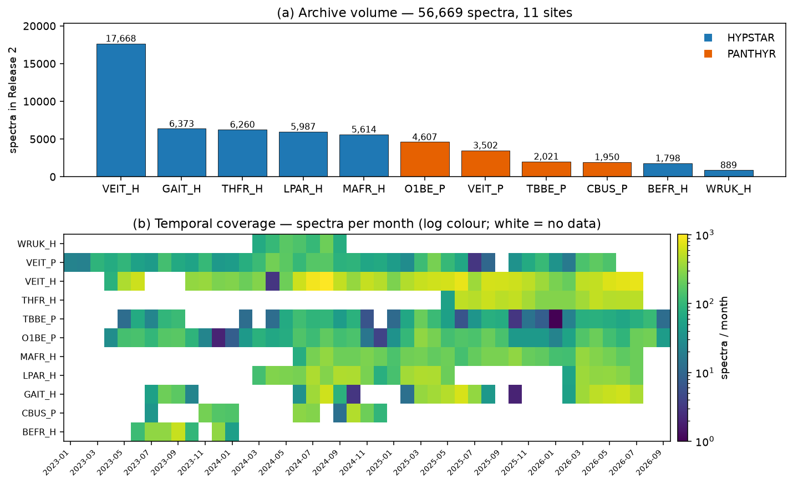
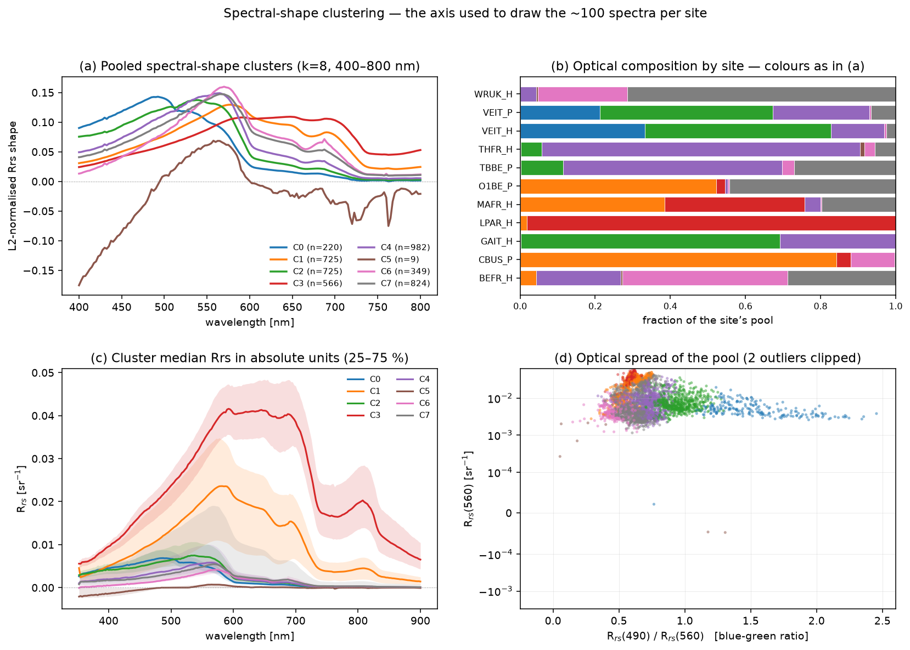

# WATERHYPERNET — Data Release 2

A description of the WATERHYPERNET Release 2 archive as it exists on disk at
`$OS_COLOR/WATERHYPERNET/RELEASE_2`, written for IOPtics work. Every number here
was measured from the archive itself or read from its release notes; the
provenance of each is given in [How this was produced](#how-this-was-produced).

---

## What it is

WATERHYPERNET is a network of automated above-water hyperspectral radiometers
providing water-leaving reflectance for satellite validation and water-quality
monitoring. Release 2 (dated 2026-09-11) holds **56,669 measurements** —
**9.8 GB**, one NetCDF file per measurement — from **11 site-instrument
combinations** at 10 physical locations, spanning **2023-01-04 to 2026-09-09**.

Two instrument systems contribute:

| | HYPSTAR (`*_H`) | PANTHYR (`*_P`) |
|---|---|---|
| Sites | 7 | 4 |
| Spectra | 44,589 (79%) | 12,080 (21%) |
| Wavelengths | ~1,538 bands, 350–1100 nm, ~0.49 nm | 237 bands, 355–945 nm, 2.5 nm |
| Grid stability | **varies with instrument serial** | fixed |
| Processor | `hypernets_processor` 2.1.0 | `v20240912` |
| Licence attribute | CC BY-NC-ND | *(none)* |

Acqua Alta (VEIT) is the only location carrying both systems, which makes
`VEIT_H` vs `VEIT_P` a ready-made cross-system comparison.

---

## ⚠ The glaring absence: there are no IOPs, and no biogeochemistry at all

**Release 2 contains reflectance, viewing/solar geometry and QC — and nothing
else.** There is no absorption, no backscatter, no attenuation, no chlorophyll,
no TSS/SPM, no turbidity, no salinity, and no water temperature anywhere in the
archive.

This was checked exhaustively, not assumed:

- The union of every variable and global-attribute name over **440 files
  spanning all 11 sites** is perfectly constant: **29 variables / 57 attributes**
  (HYPSTAR) and **22 variables / 58 attributes** (PANTHYR). No file anywhere
  carries a variable the others do not.
- The only name matching any in-water-property pattern is `system_temperature`,
  an instrument-housekeeping attribute, and it is `NaN` in every file examined.
- The release notes never mention absorption, chlorophyll, IOPs or water
  sampling. They state the network's purpose plainly (p.4): *"The core business
  of HYPERNETS is to provide uniquely valuable in situ measurements of
  hyperspectral water reflectance"*.

**Consequence for IOPtics.** No truth-scored metric in the package applies to
this dataset as it stands. An IOP algorithm can be *run* on these spectra, and
the Rrs residual can be scored, but nothing here constrains the retrieved
`a_ph`, `a_dg`, `bb_p`, `Chl` or `Sdg`. Using WATERHYPERNET for retrieval
validation requires companion in-situ data from some other source.

The one lead the release notes offer is **AERONET-OC**, noted as co-located at
VEIT, CBUS, TBBE and LPAR — but that is also radiometry, not IOPs.

---

## Sites


| site | location | system | spectra | first | last | months | lat | lon | PI |
|---|---|---|---:|---|---|---:|---:|---:|---|
| BEFR_H | Berre lagoon, FR | HYPSTAR | 1,798 | 2023-06-19 | 2024-01-04 | 7 | 43.44231 | 5.09718 | D. Doxaran (LOV) |
| CBUS_P | Chesapeake Bay, US | PANTHYR | 1,950 | 2023-07-11 | 2024-12-23 | 7 | 39.12 | −76.35 | — |
| GAIT_H | Lake Garda, IT | HYPSTAR | 6,373 | 2023-07-27 | 2026-07-31 | 9 | 45.57700 | 10.57942 | V. Brando (CNR) |
| LPAR_H | Río de la Plata, AR | HYPSTAR | 5,987 | 2024-03-24 | 2026-07-31 | 12 | −34.81797 | −57.89595 | A. Dogliotti (CONICET) |
| MAFR_H | Gironde / MAGEST, FR | HYPSTAR | 5,614 | 2024-06-21 | 2026-07-31 | 12 | 45.54765 | −1.04050 | D. Doxaran (LOV) |
| O1BE_P | Oostende RT1, BE | PANTHYR | 4,607 | 2023-04-25 | 2026-09-09 | 12 | 51.25 | 2.92 | — |
| TBBE_P | Thornton Bank, BE | PANTHYR | 2,021 | 2023-05-11 | 2026-09-06 | 12 | 51.53 | 2.96 | — |
| THFR_H | Thau lagoon, FR | HYPSTAR | 6,260 | 2025-05-28 | 2026-07-29 | 12 | 43.43486 | 3.66416 | D. Doxaran (LOV) |
| VEIT_H | Acqua Alta AAOT, IT | HYPSTAR | 17,668 | 2023-04-24 | 2026-07-31 | 12 | 45.31420 | 12.50830 | V. Brando (CNR) |
| VEIT_P | Acqua Alta AAOT, IT | PANTHYR | 3,502 | 2023-01-04 | 2026-05-31 | 12 | 45.31 | 12.51 | — |
| WRUK_H | Wraysbury reservoir, UK | HYPSTAR | 889 | 2024-03-05 | 2024-09-15 | 7 | 51.45758 | −0.53219 | A. Bialek (NPL) |

HYPSTAR coordinates are fixed per-site attributes. PANTHYR files instead carry
per-file GPS averages that jitter at the ~1e-5° level, so the values above are
medians. The coordinate is the radiometer's position; the water target is 3–20 m
away. GAIT and WRUK coordinates were **wrong in Release 1** and corrected here.

### Coverage is very uneven



VEIT_H alone is 31% of the archive; WRUK_H is 1.6%. More importantly for any
sampling scheme, **only 6 of the 11 sites span a full seasonal cycle**: BEFR
(2023-06 → 2024-01), WRUK (2024 only), CBUS (7 distinct months) and GAIT
(9 months) do not. Several sites have multi-month gaps mid-record.

---

## Layout and file naming

```
RELEASE_2/
  0_README/WATERHYPERNET_ReleaseNotes_2-0.pdf      # the only non-NetCDF file
  <SITE>/<YYYY>/<MM>/<DD>/<one file per measurement>.nc
```

The two systems use different filename grammars — note that the azimuth and
processing-time fields are **swapped** between them, and that acquisition time
is minute-resolution for HYPSTAR but second-resolution for PANTHYR:

```
HYPSTAR:  HYPERNETS_W_{SITE}_L2B_REF_{acqYYYYMMDDThhmm}_{procYYYYMMDDThhmm}_{RAA}_v2.1.nc
PANTHYR:  PANTHYR_W_{SITE}_L2A_REF_{acqYYYYMMDDThhmmss}_{AZ}_{procYYYYMMDDThhmmss}_v20240912_QA.nc
```

All 56,669 filenames parse cleanly under these two patterns. The azimuth token
is the relative azimuth for HYPSTAR (90 / 270, plus 225 at WRUK) and a constant
absolute pointing direction for PANTHYR (90 at CBUS, 270 elsewhere). LPAR is the
only site with a substantially mixed azimuth population (4,670×270 vs 1,312×090);
WRUK splits 476×270 / 413×225 and is the only site where two files share an
acquisition timestamp (345 such pairs, same `sequence_id`, different azimuth).

---

## File contents

One spectrum per file in both systems (HYPSTAR `series=1`; PANTHYR
`sequence=1, time=1`). NETCDF4, no groups.

**Both systems provide two reflectance products:**

| variable | meaning |
|---|---|
| `reflectance` | corrected with the Similarity Spectrum test (SWIR-based for HYPSTAR in Release 2, NIR for PANTHYR) |
| `reflectance_nosc` | **not** similarity-corrected |

plus `water_leaving_radiance`, the downwelling/upwelling radiances and
irradiance, per-band standard deviations, the similarity-spectrum epsilons, the
air–water interface reflectance factor `rhof` (Mobley 1999) and its wind input,
scan counts, geometry and a quality flag.

The two schemas differ in ways that matter to any reader:

| quantity | HYPSTAR | PANTHYR |
|---|---|---|
| dims | `wavelength, series` | `wavelength, sequence, time` |
| dtype | float32 | float64 |
| reflectance std | `std_reflectance` | `reflectance_std` |
| downwelling irradiance | `irradiance` | `downwelling_irradiance_mean` |
| downwelling radiance | `downwelling_radiance` | `downwelling_radiance_mean` |
| time | `acquisition_time`, uint32 epoch seconds, `units = "s"` | scalar float + an ISO string coordinate |
| instrument id | `system_id` (e.g. `HYPSTAR_122302`) | `l_sensor_sn` / `e_sensor_sn` (TriOS SAM serials) |

---

## Units: the products are ρw, not Rrs

Both `reflectance` and `reflectance_nosc` are **water-leaving reflectance ρw**
(dimensionless; `preferred_symbol = rhow`). This was confirmed numerically
rather than taken from the attribute: for both systems,

```
reflectance_nosc / (water_leaving_radiance / Ed) = 3.14159…  = π   (exactly)
```

so `water_leaving_radiance` is the *uncorrected* Lw, and

> **Rrs [sr⁻¹] = ρw / π**, and likewise **σ(Rrs) = σ(ρw) / π**.

The same ratio computed with the similarity-corrected `reflectance` gives 3.20
(HYPSTAR) and 2.96 (PANTHYR) — i.e. it differs from π exactly by the similarity
correction, which is applied to the reflectance but not to the stored radiance.

**Everything in this directory's scripts, figures and tables is Rrs = ρw/π.**

---

## Wavelength grids

- **PANTHYR** is a fixed 237-band grid, 355–945 nm at exactly 2.5 nm, identical
  at all four sites and across sensor swaps (each PANTHYR site has used 2–3
  radiometer serials; the grid never changes).
- **HYPSTAR** grids change with the instrument serial number. Four sites contain
  two distinct grids each — GAIT, LPAR, MAFR and VEIT_H — differing in length
  (1536–1541 bands) and/or start wavelength (MAFR's two instruments both give
  1538 bands but start 0.18 nm apart). Spacing is ~0.463–0.498 nm; `bandwidth`
  is 3 nm FWHM throughout.

Spectra therefore **cannot be stacked without interpolation**, and a loader must
not assume a per-site grid.

The release notes flag **<400 nm, >900 nm, and the ~762 nm O₂-A band** as
possibly unreliable and not recommended for satellite validation. Note that
despite the presence of `epsilon_SWIR` variables, there is no SWIR coverage — no
HYPSTAR grid extends past 1100 nm.

---

## Uncertainty

**There is no uncertainty budget.** `unc_comps` is empty on the reflectance and
radiance variables, and the release notes state uncertainties are "not yet
mature" and "currently not reported".

What *is* present is a per-band standard deviation (`std_reflectance` /
`reflectance_std` and their `_nosc` counterparts), and it is populated
everywhere: finite in **all 220 files sampled across all 11 sites**. Typical
magnitude, as median σ/|Rrs| over 450–650 nm:

| site | σ/Rrs | site | σ/Rrs |
|---|---:|---|---:|
| VEIT_P | 0.9% | VEIT_H | 2.0% |
| CBUS_P | 1.3% | LPAR_H | 2.2% |
| MAFR_H | 1.6% | O1BE_P | 2.4% |
| TBBE_P | 1.8% | GAIT_H | 2.5% |
| WRUK_H | 2.0% | THFR_H | 2.6% |
| BEFR_H | 2.5% | | |

**Caveat.** This is scan-to-scan variability within a measurement sequence only.
It excludes calibration uncertainty (only pre-deployment calibration was used)
and any error in the glint/sky-reflectance correction, so it is a lower bound on
the true uncertainty rather than an estimate of it.

---

## Quality control and negative reflectance

`quality_flag` was **0 in all 440 files checked** — 40 per site, spread through
each site's record, read with masking off so fill and zero are distinguishable —
so the release appears to ship only measurements that already passed QC. HYPSTAR
defines a 30-bit flag (`lon_default`, `bad_pointing`, `outliers`,
`L0_threshold`, `dark_masked`, `not_enough_dark_scans`, `no_clear_sky_sequence`,
`simil_fail`, …); PANTHYR's is a uint8 whose `flag_meanings` are still
placeholders (`flag1 … flag8`).

**Negative reflectance is common and is retained deliberately.** The release
notes give two reasons (p.2): it is "metrologically entirely valid to record a
negative reflectance" when the true value is near zero and zero lies within the
uncertainty range, and excluding negatives biases the statistics of any
comparison. Frequency of spectra with at least one negative band in 400–900 nm,
over the pool sampled here:

| VEIT_H | GAIT_H | BEFR_H | THFR_H | WRUK_H | TBBE_P | VEIT_P | MAFR_H | CBUS_P | LPAR_H | O1BE_P |
|---:|---:|---:|---:|---:|---:|---:|---:|---:|---:|---:|
| 57% | 56% | 32% | 30% | 25% | 2.8% | 2.2% | 1.0% | 0% | 0% | 0% |

The three sites reading 0% are exactly the turbid ones read here via
`reflectance_nosc` (§ Conventions), plus Chesapeake: bright water and no
similarity correction leave no near-zero bands to go negative.

**Do not filter these out** without a specific reason to.

---

## Which product to use

The release notes single out **LPAR, MAFR and O1BE** as sites where the
similarity-corrected `reflectance` is "known to be poor" — high NIR reflectance
in turbid water — and state `reflectance_nosc` is "definitely recommended"
there. Everywhere else the corrected `reflectance` is the standard product.

---

## Geometry and ancillary data

Viewing zenith is ~40° throughout (HYPSTAR 39.8–40.3°, PANTHYR exactly 40.0°).
Solar zenith in the sampled pool spans 15.7–87.7°, i.e. the archive includes
very low-sun measurements that a user may wish to screen. Wind speed is present
as the GDAS-derived `rhof_wind` variable (HYPSTAR) or the `fresnel_wind` global
attribute (PANTHYR). PANTHYR applies a clear-sky test (Lsky/Ed at 750 nm < 0.05);
HYPSTAR does not.

Two gotchas: PANTHYR's `solar_azimuth_angle` is fill (0) in every file sampled —
use the `timestamp`/geometry attributes instead — and HYPSTAR's meteorological
attributes (`system_temperature`, pressure, humidity, illuminance) are all NaN.

---

## What the spectra look like


The network spans a wide optical range: median Rrs(560) runs from 0.0030 sr⁻¹ at
Wraysbury reservoir to 0.036 sr⁻¹ at the Gironde — a factor of 12 — and the
blue–green ratio Rrs(490)/Rrs(560) from 0.52 (Berre) to 1.03 (Acqua Alta),
i.e. from strongly green/turbid to near-marine. Highly turbid sites (LPAR, MAFR,
O1BE) show the characteristic broad red/NIR shoulder.



Clustering the L2-normalised 400–800 nm shapes across all sites (k=8) shows the
sites occupy genuinely different optical regimes rather than one continuum:
LPAR is almost entirely one cluster, CBUS and O1BE another, while VEIT and GAIT
split across several. One small cluster (n=9) collects spectra that are negative
across most of the range — a useful reminder that such records exist and are not
errors to be silently dropped.


Seasonal cycles are visible at GAIT and VEIT; LPAR and MAFR are persistently
turbid with little seasonal structure.

---

## Hazards for an automated loader

1. **Two schemas.** Same variable names for the core products, different names
   for the std and irradiance variables, different dims and dtypes.
2. **The products are ρw, not Rrs.** Divide by π (and divide the std too).
3. **HYPSTAR grids vary within a site**, by instrument serial.
4. **No CF-decodable time.** `wavelength` has no `units` attribute in either
   system; HYPSTAR `acquisition_time` has `units = "s"` (not `seconds since …`)
   and PANTHYR's has none, so xarray will not decode either as a datetime.
5. **PANTHYR `_FillValue = 0`** on `quality_flag`, the angles and `bandwidth`.
   A legitimate flag value of 0 is therefore masked — and `quality_flag` reads
   as *missing*, not as *passed*. `bandwidth` is entirely fill.
   Integer variables also cannot hold NaN: cast to float **before** filling, or
   `netCDF4` raises `TypeError: Cannot convert fill_value nan to dtype uint8`.
6. **Negative reflectance is expected**, so any log-space handling or
   area-normalisation must tolerate it.
7. **Filename says `L2B` for HYPSTAR, but `product_level` inside says `W_L2A`.**
8. **WRUK timestamp collisions** — 345 pairs share an acquisition minute and
   `sequence_id`, differing only in azimuth, so site+time is not a unique key.
9. **Release window overrun.** The notes say data run to 2026-07-31, but O1BE_P
   and TBBE_P contain files to 2026-09-09.
10. `instrument_calibration_file_rad` points at an `_IRR_` file, same as the
    irradiance attribute — apparently a metadata bug.

---

## Licence and citation

HYPSTAR files carry `licence = "Attribution-NonCommercial-NoDerivs CC BY-NC-ND"`
and a long `acknowledgement` attribute asking users to respect PI priority use,
cite the key HYPERNETS papers, and offer PI co-authorship where the data are a
principal component of a publication. **PANTHYR files carry no licence
attribute.** The release notes carry no explicit licence clause; they refer to
the WATERHYPERNET data policy and ask users to cite Ruddick et al. (2024) and
De Vis et al. (2024). Data are distributed via the password-protected
`https://ftp.waterhypernet.org/`.

Key references from the release notes:

1. Ruddick, K. G., *et al.* (2024), "WATERHYPERNET: a prototype network of
   automated in situ measurements of hyperspectral water reflectance for
   satellite validation and water quality monitoring", *Front. Remote Sens.* 5.
2. De Vis, P., *et al.* (2024), "Generating Hyperspectral Reference Measurements
   for Surface Reflectance from the LANDHYPERNET and WATERHYPERNET Networks",
   *Front. Remote Sens.* 5, 1347230.
3. Kuusk, J., *et al.* (2024), "HYPSTAR: a Hyperspectral Pointable System for
   Terrestrial and Aquatic Radiometry", *Front. Remote Sens.*
4. Vansteenwegen, D., *et al.* (2019), "The Pan-and-Tilt Hyperspectral
   Radiometer System (PANTHYR)…", *Remote Sensing* 11, 1360.
5. Mobley, C. D. (1999), "Estimation of the remote-sensing reflectance from
   above-surface measurements", *Appl. Opt.* 38(36), 7442–7455.
6. Ruddick, K., *et al.* (2006), "Seaborne measurements of near infrared
   water-leaving reflectance: the similarity spectrum for turbid waters",
   *Limnol. Oceanogr.* 51(2), 1167–1179.

---

## How this was produced

Scripts live beside this file and are re-runnable end to end:

```bash
python whn_explore.py 1      # index all 56,669 files from their names
python whn_explore.py 2      # read 400/site, cluster, sample 100/site
python whn_figures.py        # summary table + the five figures
pytest -q test_whn_explore.py
```

- `whn_explore.py` — archive indexing, single-spectrum reading (product choice,
  ρw→Rrs), spectral-shape clustering and the representative sampling.
- `whn_figures.py` — `summary_table.{csv,md}` and the figures in `figs/`.
- `test_whn_explore.py` — 14 tests; the data-dependent ones skip automatically
  when the archive is not mounted.

Intermediates (`index.parquet`, `pool.parquet`, `sample.parquet`,
`pool_spectra.npz`) are written to `$OS_COLOR/IOPtics/whn_explore/`, outside the
repository, following the project's artifact split. Only figures and the summary
table are kept here.

**Conventions used in this exploration** (agreed in
`claude_prompts/waterhypernet_prompts.md`): `reflectance` everywhere except
LPAR_H, MAFR_H and O1BE_P which use `reflectance_nosc`; Rrs = ρw/π and
σ = σ(ρw)/π; the archive's own σ used as-is with no floor; no wavelength
trimming and no resampling of the data itself; negatives retained.

**Sampling.** The ~100 spectra per site were drawn by optical diversity: 400
spectra per site spread uniformly through that site's record were read, their
L2-normalised 400–800 nm shapes were clustered across all sites at once (k=8,
seed 1234), and each site's 100 were apportioned across the clusters it occupies
by largest remainder — at least one per occupied cluster — spreading the picks
evenly in time within each cluster.

**Scope of the numbers.** File counts, date ranges, azimuth counts and the site
table come from all 56,669 files. Optical statistics (σ/Rrs, negative fractions,
Rrs magnitudes, clusters) come from the 4,400-spectrum pool — 400 per site. The
variable/attribute census covers 440 files across all 11 sites; the σ coverage
check covers 220. Figures are drawn on a display grid (350–900 nm at 2.5 nm)
used only for plotting and clustering, never as a record grid.
