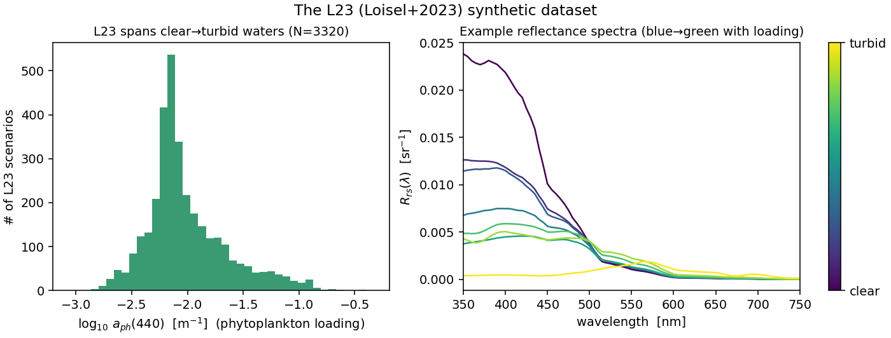

========
Datasets
========

IOPtics scores IOP-retrieval algorithms against a growing set of ocean-colour
datasets. Each observation is a measured (or simulated) **remote-sensing
reflectance** :math:`R_{rs}(\lambda)` — the spectrum of sunlight leaving the sea
surface (see :doc:`models`). A dataset is *useful for benchmarking* when it also
carries **truth**: the inherent optical properties (IOPs) that actually produced
that reflectance, so a retrieval can be graded against a known answer.

Every dataset is loaded through a small **adapter** (:mod:`ioptics.datasets`)
that returns each observation's :math:`R_{rs}` on the dataset's **native
wavelength grid** (no resampling), its available truth IOPs, and a model for the
:math:`R_{rs}` measurement uncertainty. The metrics layer then compares each
algorithm's retrieval against that truth on the intersection of available bands
and components.

.. list-table:: Datasets in IOPtics
   :header-rows: 1
   :widths: 14 12 20 38 16

   * - Dataset
     - Type
     - Grid
     - Truth available
     - Status
   * - **L23**
     - synthetic
     - Hydrolight, 81 bands (400–700 nm)
     - full spectral IOPs: :math:`a`, :math:`b_b`, :math:`a_{ph}`,
       :math:`a_{dg}`, :math:`b_{bp}`; scalars ``Chl``, ``Sdg``
     - **active** (first sweep)
   * - PANGAEA
     - in situ
     - per-family native λ
     - :math:`a_{ph}`, :math:`a_{dg}` (from ``acdom``), :math:`b_{bp}`
       (from ``bbp``); scalars ``chla``, ``tss``
     - planned (Stage 6)
   * - GLORIA
     - in situ
     - hyperspectral
     - scalar only: ``a_cdom440``, ``Chla``, ``TSS``, ``Secchi``
     - planned (Stage 6)

L23 — Loisel et al. (2023)
==========================

The **L23** dataset is a *synthetic* benchmark: a physics-based radiative-
transfer model (Hydrolight) was run for 3320 hypothetical water bodies spanning
clear open ocean to turbid coastal water, and the resulting reflectance spectra
were recorded on an **81-band, 400–700 nm** grid. Because the water's properties
were *prescribed* rather than measured, L23 provides **exact, noise-free truth**
for every IOP — the ideal first-pass benchmark. IOPtics loads it via
``ocpy.hydrolight.loisel23``.

   **Left:** the range of phytoplankton loading across the 3320 L23 scenarios,
   shown as the phytoplankton absorption at 440 nm (a stand-in for chlorophyll
   concentration) on a log scale — the dataset spans roughly three orders of
   magnitude, from clear to productive/turbid water. **Right:** eight example
   reflectance spectra; clear water peaks in the blue, and the peak shifts toward
   the green as phytoplankton and particles increase.

- **Scope of the first sweep.** All **3320** L23 spectra (the ``X=1`` elastic
  scenario; ``X=4`` adds Raman + fluorescence, deferred to Stage 6).
- **Truth.** The full spectral decomposition — total absorption :math:`a`, total
  backscatter :math:`b_b`, and the components :math:`a_{ph}` (phytoplankton),
  :math:`a_{dg}` (CDOM + detritus), :math:`b_{bp}` (particulate backscatter) —
  plus scalar chlorophyll ``Chl`` and the :math:`a_{dg}` spectral slope ``Sdg``.
  These are what the accuracy metrics grade against.
- **Noise.** A realistic **PACE** satellite per-band :math:`R_{rs}` uncertainty
  (``ocpy.satellites.pace``) is attached as the fit weight and used to perturb
  the otherwise-perfect spectrum once, so each fit sees a realistic “measurement.”
  (This is why :math:`R_{rs}` dips slightly negative in the red, where the true
  signal is near zero — hence the closure statistics use noise-weighted
  :math:`\chi^2_\nu` rather than a raw reflectance error.)
- **Trophic strata.** Reports also break results out by productivity, binned from
  the truth chlorophyll: **oligotrophic** (low, Chl < 0.1), **mesotrophic**
  (0.1–1.0), and **eutrophic** (high, > 1.0 mg m\ :sup:`-3`) — so one can see
  whether an algorithm does better in clear vs. productive water.

PANGAEA & GLORIA (planned)
==========================

Two *in-situ* (field-measured) datasets extend the comparison beyond synthetic
data in Stage 6:

- **PANGAEA** — measured :math:`R_{rs}` with its own reported uncertainty
  (``noise='insitu'``) and measured spectral truth for :math:`a_{ph}`,
  :math:`a_{dg}` (from measured CDOM absorption ``acdom``) and :math:`b_{bp}`
  (from ``bbp``), plus ``chla``/``tss`` scalars.
- **GLORIA** — hyperspectral :math:`R_{rs}` with **scalar-only** truth
  (``a_cdom440``, ``Chla``, ``TSS``, ``Secchi``). GLORIA reports CDOM absorption
  at 440 nm rather than the combined :math:`a_{dg}`, so comparing a retrieved
  :math:`a_{dg}(440)` against ``a_cdom440`` mixes two slightly different
  quantities; that comparison is flagged with a ``caveat`` (``CDOM_vs_adg``) so
  reports surface the definitional mismatch instead of hiding it.
