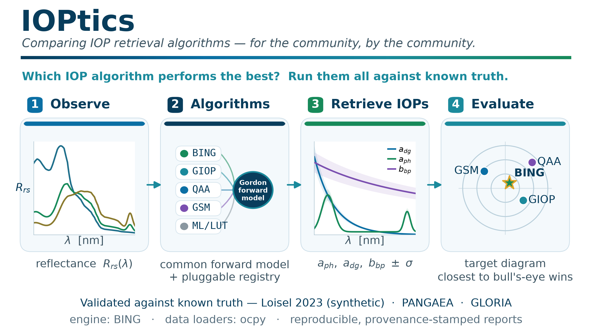

.. IOPtics documentation master file

==========================================
IOPtics: comparing IOP retrieval methods
==========================================

**IOPtics** is a Python package for testing and evaluating a wide range of
**inherent optical property (IOP)** retrieval algorithms. It drives the
retrieval engine (`BING <https://github.com/ocean-colour/bing>`_) over common
datasets loaded through `ocpy <https://github.com/ocean-colour/ocpy>`_, then
generates uniform metrics, diagnostics, and reports to share with the ocean
optics community.

         optical properties, then scored against known truth.

.. note::

   IOPtics is in active development. The **full pipeline runs end to end** —
   dataset prep, a declarative algorithm registry, least-squares and MCMC
   retrieval, the metric battery, and an accumulating report site with a
   cross-sweep leaderboard. What is *measured* is a narrower thing than what
   runs, and the site says so directly: the **coverage matrix** on
   :doc:`/reports/index` names every (algorithm, dataset) pair that has and has
   not been evaluated, and each page states what it could not show and why.

   The current work is on the reporting layer — making the comparison legible
   enough to hand to the ocean-colour community — and on generating the evidence
   to fill that matrix in.

What IOPtics does
-----------------

* **Uniform data prep** — generalizes BING's L23 prep to any dataset (L23,
  PANGAEA, GLORIA) on its native wavelength grid, attaching ``Rrs`` uncertainty
  and truth IOPs where available.
* **A declarative algorithm registry** — each algorithm is a serializable
  configuration (``a_nw``/``bb_nw`` models, priors, RT toggles, fit method),
  seeded with ``expb_pow``, ``giop`` and ``gsm``, plus three opt-in
  turbid-water models. See :doc:`models`.
* **A run/sweep driver** — least-squares across the full sweep, MCMC on a
  subset, with reconstructed ``a``/``bb`` ± uncertainty.
* **Uniform metrics & diagnostics** — log-space accuracy, ``Rrs`` closure,
  AIC/BIC/ΔBIC, coverage, wins, and paired bootstrap tests that can say two
  algorithms are **indistinguishable** rather than ranking them anyway.
* **Reporting** — a standard figure/table set, per-algorithm and per-dataset
  profile pages, exemplar fits, a persistent cross-sweep leaderboard and this
  accumulating site, all provenance-stamped and each metric defined in a
  :doc:`glossary </reports/glossary>`.

Contents
--------

.. toctree::
   :maxdepth: 2
   :caption: Documentation

   installation
   datasets
   models
   reports/index
   api/index

Indices and tables
-------------------

* :ref:`genindex`
* :ref:`modindex`
* :ref:`search`
