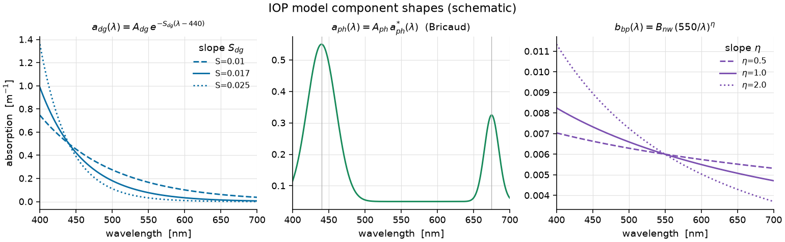

====================
IOP model reference
====================

This page describes **what the models are**. For how they actually scored, see
the per-algorithm profile pages linked from :doc:`/reports/index`, and
:doc:`/reports/glossary` for what each metric means.

**What is being retrieved.** Ocean colour is the spectrum of sunlight that
leaves the sea surface, quantified as the *remote-sensing reflectance*
:math:`R_{rs}(\lambda)` (units sr\ :sup:`-1`) — the ratio of water-leaving
radiance to downwelling irradiance at each wavelength :math:`\lambda`. Its shape
and magnitude are set by the water's **inherent optical properties (IOPs)**: how
strongly the water and its constituents **absorb** light (absorption
:math:`a(\lambda)`, m\ :sup:`-1`) and **scatter it backward** toward a satellite
(backscattering :math:`b_b(\lambda)`, m\ :sup:`-1`). An *IOP retrieval* is the
inverse problem — infer :math:`a` and :math:`b_b` (and their constituents) from
the measured :math:`R_{rs}`.

**The forward model.** To a good approximation reflectance depends on the single
ratio :math:`u = b_b/(a+b_b)` (Gordon et al.):

.. math::

   R_{rs}(\lambda) \;\approx\; g_1\,u(\lambda) + g_2\,u(\lambda)^2 ,
   \qquad u(\lambda)=\frac{b_b(\lambda)}{a(\lambda)+b_b(\lambda)} .

The water itself contributes known :math:`a_w,\,b_{bw}`, so a model only has to
describe the **non-water** parts. Total absorption and backscatter split into
physically distinct constituents:

.. math::

   a(\lambda) = a_w(\lambda) + \underbrace{a_{ph}(\lambda)}_{\text{phytoplankton}}
              + \underbrace{a_{dg}(\lambda)}_{\text{CDOM + detritus}},
   \qquad
   b_b(\lambda) = b_{bw}(\lambda) + \underbrace{b_{bp}(\lambda)}_{\text{particles}} .

- :math:`a_{ph}` — absorption by **phytoplankton** (chlorophyll & accessory
  pigments), with characteristic peaks near 440 nm (blue) and 675 nm (red).
- :math:`a_{dg}` — combined absorption by **coloured dissolved organic matter
  (CDOM, “gelbstoff”)** and non-living **detritus**; both decay smoothly from
  blue to red.
- :math:`b_{bp}` — **particulate backscatter**, a smooth power-law decline with
  wavelength.

An *algorithm* is a specific parameterization of these three curves. IOPtics scores
any number of them against the same truth. **Three are registered by default** — a
flexible 5-parameter **BING** model (``expb_pow``), a leaner 3-parameter
**GIOP**-style model (``giop``), and the 3-parameter **GSM** semi-analytical model
(``gsm``) — and three more for turbid water are available opt-in (see
:ref:`turbid-models`). Which of them any given result used is recorded per row; the
coverage matrix on :doc:`/reports/index` says which pairs have actually been run.

   The three spectral building blocks. Each algorithm fits an **amplitude**
   (vertical scale) and, for the more flexible model, a **slope** (how fast the
   curve falls with wavelength) of each component, then combines them through the
   forward model above to predict :math:`R_{rs}`.

``expb_pow`` — the standard 5-parameter BING model
==================================================

The canonical BING parameterization (**k = 5** free parameters): an
*exponential* CDOM+detritus term plus a *Bricaud* phytoplankton term
(``ExpBricaud``), and a *power-law* particulate backscatter (``Pow``):

.. math::

   a_{dg}(\lambda) &= A_{dg}\,\exp\!\big[-S_{dg}\,(\lambda-\lambda_0)\big], \\
   a_{ph}(\lambda) &= A_{ph}\,a^{*}_{ph}(\lambda), \\
   b_{bp}(\lambda) &= B_{nw}\,\left(\lambda_0/\lambda\right)^{\eta},

with reference wavelength :math:`\lambda_0` (≈ 440 nm for absorption, 550 nm for
backscatter) and :math:`a^{*}_{ph}` the tabulated Bricaud chlorophyll-specific
absorption shape.

.. list-table::
   :header-rows: 1
   :widths: 12 20 68

   * - Parameter
     - Symbol / controls
     - Meaning
   * - ``Adg``
     - :math:`A_{dg}` — :math:`a_{dg}` amplitude
     - how much CDOM + detritus absorption there is
   * - ``Sdg``
     - :math:`S_{dg}` — :math:`a_{dg}` slope
     - how steeply that absorption falls from blue to red
   * - ``Aph``
     - :math:`A_{ph}` — :math:`a_{ph}` amplitude
     - phytoplankton (≈ chlorophyll) absorption magnitude
   * - ``Bnw``
     - :math:`B_{nw}` — :math:`b_{bp}` amplitude
     - particle backscatter magnitude (roughly, turbidity)
   * - ``beta``
     - :math:`\eta` — :math:`b_{bp}` slope
     - spectral steepness of particle backscatter

Because it fits **both** the amplitude and the slope of the dissolved and
particulate terms, ``expb_pow`` is the more flexible model — expected to
reproduce :math:`R_{rs}` closely, at the cost of two extra parameters. It is the
algorithm run with **MCMC** on a subset, so its posterior samples also drive the
uncertainty / coverage diagnostics.

``giop`` — the 3-parameter contrast
====================================

A leaner GIOP-style model (**k = 3**): the same physical decomposition, but with
the **slopes fixed** rather than fit — a ``GIOP`` non-water absorption and a
``Lee`` backscatter:

.. math::

   a_{dg}(\lambda) &= A_{exp}\,\exp\!\big[-S_{0}\,(\lambda-\lambda_0)\big]
                      \quad (S_0\ \text{fixed}), \\
   a_{ph}(\lambda) &= A_{ph}\,a^{*}_{ph}(\lambda), \\
   b_{bp}(\lambda) &= B_{nw}\,\left(\lambda_0/\lambda\right)^{\eta_0}
                      \quad (\eta_0\ \text{fixed, Lee 2002}).

.. list-table::
   :header-rows: 1
   :widths: 12 20 68

   * - Parameter
     - Symbol / controls
     - Meaning
   * - ``Aexp``
     - :math:`A_{exp}` — :math:`a_{dg}` amplitude
     - combined CDOM + detritus magnitude (fixed slope)
   * - ``Aph``
     - :math:`A_{ph}` — :math:`a_{ph}` amplitude
     - phytoplankton absorption magnitude
   * - ``Bnw``
     - :math:`B_{nw}` — :math:`b_{bp}` amplitude
     - particle backscatter magnitude (fixed Lee slope)

With the slopes pinned to literature values, ``giop`` has fewer knobs — more
parsimonious, and harder to over-fit. It is fit by **least squares** only (see
below).

``gsm`` — the GSM semi-analytical model
=======================================

The Garver–Siegel–Maritorena model (**k = 3**), the longest-serving operational
semi-analytical ocean-colour algorithm. Structurally it resembles ``giop`` — both
fix the spectral slopes and fit three amplitudes — but two things distinguish it:
the fixed constants are GSM's own globally-tuned values, and the phytoplankton term
is parameterized by **chlorophyll directly** rather than by an absorption amplitude:

.. math::

   a_{dg}(\lambda) &= A_{exp}\,\exp\!\big[-S_{dg}\,(\lambda-\lambda_0)\big],
                      \quad S_{dg} = 0.0206\ \text{nm}^{-1}\ \text{(fixed)}, \\
   a_{ph}(\lambda) &= \mathrm{Chl}\;a^{*}_{ph}(\lambda), \\
   b_{bp}(\lambda) &= B_{nw}\,\left(\lambda_0/\lambda\right)^{\eta},
                      \quad \eta = 1.0337\ \text{(fixed)},

with :math:`\lambda_0 = 443` nm for **both** absorption and backscatter (``giop``
and ``expb_pow`` pivot backscatter in the green instead).

.. list-table::
   :header-rows: 1
   :widths: 12 20 68

   * - Parameter
     - Symbol / controls
     - Meaning
   * - ``Aexp``
     - :math:`A_{exp}` — :math:`a_{dg}` amplitude
     - combined CDOM + detritus magnitude, at GSM's fixed 0.0206 slope
   * - ``Chl``
     - :math:`\mathrm{Chl}` — :math:`a_{ph}` scale
     - **chlorophyll concentration itself**, not an absorption amplitude: GSM
       retrieves Chl as a fitted parameter
   * - ``Bnw``
     - :math:`B_{nw}` — :math:`b_{bp}` amplitude
     - particle backscatter magnitude, at GSM's fixed :math:`\eta = 1.0337`

Why it is worth running alongside ``giop``: the two are the same *shape* of model
with different constants, so comparing them isolates how much of a retrieval's
error comes from the **choice of fixed slope** rather than from the model's
structure. And because ``Chl`` is a fitted parameter, ``gsm`` is directly
comparable against a dataset's chlorophyll truth without going through an
absorption-to-Chl conversion — which is the comparison the derived-scalar accuracy
rows exist for.

.. _turbid-models:

Turbid-water algorithms (opt-in)
================================

The models above assume open-ocean particulate backscatter: a single power
law that *decreases* with wavelength. In turbid, mineral-dominated water
that assumption fails. Measurements report a backscattering spectrum that is
larger in magnitude and much flatter — sometimes rising toward the red —
because mineral particles dominate (Snyder et al. 2008,
doi:10.1364/AO.47.000666; Doxaran et al. 2009,
doi:10.4319/lo.2009.54.4.1257; Neukermans et al. 2012,
doi:10.4319/lo.2012.57.1.0124). A single decreasing power law cannot supply
the red-end shape without wrecking the blue.

BING therefore provides two-component backscattering, splitting
:math:`b_{bp}` into a near-flat **mineral** term and a steeper **organic**
one, and IOPtics exposes three algorithms built on it:

``expb_pow2flat`` (**k = 6**)
    ``ExpBricaud`` + ``Pow2Flat``: a constant mineral term plus an organic
    power law. **Start here.** Fixing the mineral exponent removes a
    degenerate direction that leaves the 4-parameter version badly
    conditioned under least squares.

``expb_pow2`` (**k = 7**)
    ``ExpBricaud`` + ``Pow2``: as above with the mineral exponent free
    (pivoted at 700 nm, where it does its work). More expressive, but the
    two amplitudes trade off strongly against each other.

``expb_powflex`` (**k = 5**)
    ``ExpBricaud`` + ``Pow``, with the slope prior widened so
    :math:`\beta` may go negative. The **control**: it changes the prior
    *range* without adding a component, so a spectrum that ``expb_powflex``
    still cannot fit implicates the functional *form*.

All three keep ``expb_pow``'s absorption side unchanged (``ExpBricaud``: ``Adg``,
``Sdg``, ``Aph``) and differ only in :math:`b_{bp}`:

.. math::

   \text{Pow2Flat:}\quad b_{bp}(\lambda) &= B_{min}
        + B_{org}\,(600/\lambda)^{\eta_{org}}, \\
   \text{Pow2:}\quad b_{bp}(\lambda) &= B_{min}\,(700/\lambda)^{\eta_{min}}
        + B_{org}\,(600/\lambda)^{\eta_{org}}, \\
   \text{Pow (flex):}\quad b_{bp}(\lambda) &= B_{nw}\,(\lambda_0/\lambda)^{\beta},
        \qquad \beta \in [-1, 2] .

The mineral term pivots at **700 nm** and the organic term at **600 nm** — each
anchored where it does its work, so the two amplitudes are as nearly independent as
the data allows. ``Pow2Flat`` is ``Pow2`` with :math:`\eta_{min}` pinned to zero:
that is what "flat" means, and dropping that one parameter is what makes it the
better-conditioned starting point.

.. list-table:: The backscattering parameters these models add
   :header-rows: 1
   :widths: 14 12 18 56

   * - Parameter
     - In
     - Symbol
     - Meaning
   * - ``Bmin``
     - both
     - :math:`B_{min}`
     - mineral backscatter amplitude — the near-flat component that supplies
       red-end magnitude an open-ocean power law cannot
   * - ``eta_min``
     - ``Pow2``
     - :math:`\eta_{min} \in [-0.5, 0.5]`
     - mineral exponent, free and allowed **negative** so the term may *rise*
       toward the red. Pinned to 0 in ``Pow2Flat``
   * - ``Borg``
     - both
     - :math:`B_{org}`
     - organic backscatter amplitude — the conventional, steeper component
   * - ``eta_org``
     - both
     - :math:`\eta_{org} \in [0.5, 2.0]`
     - organic exponent, bounded to physically ordinary decreasing slopes
   * - ``beta``
     - ``PowFlex``
     - :math:`\beta \in [-1, 2]`
     - the *single* power law's exponent, its prior widened from
       ``expb_pow``'s :math:`[0.5, 2]` to admit a flat or rising spectrum

Read the bounds together with the finding below: ``expb_pow2`` is given an
explicitly negative-capable mineral exponent and ``expb_powflex`` an explicitly
negative-capable single exponent, so **neither was prevented by its prior** from
producing the flat-or-rising backscatter that turbid water is supposed to need.

.. note::

   **Tried on real turbid water; they do not help — retained deliberately.**
   On 100 GLORIA spectra with every fit converging
   (``runs/prototypes/gloria_turbid_v3``) all four algorithms reproduce each
   other to three decimals in both reduced :math:`\chi^2_\nu` (0.460 / 0.463 /
   0.462 / 0.460) and median relative misfit (0.594 / 0.595 / 0.595 / 0.595).
   They do not merely fail to improve the fit — they return the *same* fit.
   ``expb_powflex``, the control, says the same thing from the other side: the
   prior *range* was never the constraint either.

   The remaining suspect is the forward model. The Gordon relation is a
   clear-water parameterization, and four different :math:`b_{bp}` shapes
   through one forward model give one answer. These models are kept registered
   so the comparison can be re-run against a turbid-water forward model, which
   is where the extra freedom would finally have something to do.

These are **not** registered by default — on open-ocean spectra they simply
reproduce the single-power-law solution, so seeding them would fill the
cross-algorithm leaderboard with near-duplicate rows. A turbid sweep opts
in:

.. code-block:: python

    from ioptics.algorithms import registry

    registry.register_turbid()          # adds all three
    spec = registry.get('expb_pow2flat')

``register_turbid`` also stamps an optimizer budget
(:data:`~ioptics.algorithms.registry.TURBID_MAXFEV`) onto each spec, carried
as ``AlgorithmSpec.maxfev`` and handed to ``curve_fit``. That is not
cosmetic: at scipy's default budget these models fail to converge on a
substantial fraction of spectra. It governs *whether* a fit returns, not how
well the model can fit. Since 2026-08-10 the standard seed runs at the same
budget (:data:`~ioptics.algorithms.registry.DEFAULT_MAXFEV` — on PANGAEA,
scipy's default budget recorded 30% of ``expb_pow``'s rows as crashes), so a
turbid-vs-standard contest measures the models, not their budgets. Unlike
the standard seed, the turbid specs also claim red-peaked water in scope
(``fits_turbid=True``): :func:`ioptics.run.run_algorithm` declines such
spectra up front as ``out_of_scope`` for the open-ocean algorithms.

Seeding a turbid fit
--------------------

Every fit starts from :func:`ioptics.run.initial_guess`, a truth-free
QAA-style band inversion of the observed :math:`R_{rs}`. It is anchored in the
red (:data:`~ioptics.run.ANCHOR_NM`, 670 nm), where the water's own absorption
dominates, and that anchor is read differently depending on the water — the
branch chosen per spectrum by :func:`ioptics.run.is_turbid`, using QAA_v6's own
switch :math:`R_{rs}(670) \ge 0.0015` sr\ :sup:`-1`:

.. list-table::
   :header-rows: 1
   :widths: 22 78

   * - Branch
     - Anchor
   * - open ocean
     - :math:`a(670) \approx a_w(670)`; non-water absorption in the red is
       neglected, and the backscattering exponent takes BING's own seed.
   * - turbid
     - :math:`a(670) = a_w(670) + a_{nw}(670)` with QAA_v6's empirical red-band
       term, and a *one-component* power law's exponent seeded from the QAA
       :math:`Y` instead of a fixed :math:`\beta = 1`.

The turbid term matters in principle: mineral-rich water can carry
:math:`a_{nw}(670)` larger than :math:`a_w(670)` itself (a factor ~3.6 on the
worst GLORIA spectrum measured), and neglecting it under-estimates the anchor
:math:`b_b` — and every amplitude seeded from it — by that factor. In practice
it moves the *converged* GLORIA solutions by less than 0.1%: these fits are
insensitive to their starting point. The two-component exponents are
deliberately left on BING's seeds, which are per-component and chosen for the
MCMC walker spread.

The seed is also held strictly *inside* the prior bounds
(:data:`~ioptics.run.BOUND_INSET`) rather than clipped onto them, since a
bounded solver has no direction to search from a parameter pinned to its bound.

Fit status: what counts as a solution
=====================================

Every retrieval carries a ``status`` (:data:`ioptics.records.STATUSES`), and
**only** ``'ok'`` rows are scored by :mod:`ioptics.metrics` — a leaderboard
ranks solutions, and averaging in a failed fit makes each algorithm's number a
median over its own private subset of spectra.

.. list-table::
   :header-rows: 1
   :widths: 20 80

   * - Status
     - Meaning
   * - ``ok``
     - converged with :math:`\chi^2_\nu \le`
       :data:`~ioptics.records.CHI2NU_POOR_FIT` (5). A turbid spectrum that
       *is* fitted well is ``ok``: the regime alone never disqualifies a fit.
   * - ``poor_fit``
     - converged, but :math:`\chi^2_\nu` above that threshold — not a solution.
   * - ``out_of_scope``
     - a poor fit *explained by the regime*: the spectrum peaks redward of
       :data:`~ioptics.records.RED_PEAK_NM` (560 nm), i.e. outside what this
       model family is built for. "No algorithm here should be expected to
       work" is a different finding from "this algorithm did badly".
   * - ``fit_failed``
     - no usable parameters (the optimizer raised, or returned non-finite).

The threshold is deliberately **one-sided**. A fit that agrees with the data
*better* than its stated uncertainty is still ``ok``; over-fitting is reported
separately as ``frac_overfit`` rather than disqualifying the row. That
distinction matters on an inflated-noise dataset, where a generous assumed
error makes most solved fits formally over-fit: on the GLORIA turbid sweep
:math:`\chi^2_\nu\approx0.46` and ``frac_overfit`` = 0.57, so ``ok`` there means
"the assumed 5–10% error exceeds the residuals", which the relative misfit
column keeps honest.

What is *not* scored is reported instead as **coverage**: the
``component='Rrs'`` row of ``metrics_scalar`` carries ``n_attempted`` and one
``frac_<status>`` per status, and the leaderboard carries ``frac_ok``,
``frac_overfit`` and ``rel_misfit_median_all`` beside each rank. Read them
together — a top rank over 10% of the spectra does not beat a lower rank over
all of them.

Fitting and how the algorithms are judged
=========================================

Every algorithm is fit by **least squares** — adjusting the parameters to minimize
the mismatch between predicted and observed reflectance, weighted by the
measurement noise :math:`\sigma(\lambda)`:

.. math::

   \chi^2 = \sum_\lambda
     \frac{\big[R_{rs}^{\text{obs}}(\lambda)-R_{rs}^{\text{model}}(\lambda)\big]^2}
          {\sigma(\lambda)^2},
   \qquad
   \chi^2_\nu = \chi^2/(n-k) .

The **reduced** :math:`\chi^2_\nu` divides by the degrees of freedom
(:math:`n` bands minus :math:`k` parameters): :math:`\chi^2_\nu\approx1` means the
fit matches the data to within the noise, :math:`>1` under-fits, :math:`<1`
over-fits.

Because :math:`\chi^2_\nu` is weighted by :math:`\sigma`, it answers *"does the
model agree with the data to within the stated uncertainty"* — and moves
whenever that uncertainty is re-stated, even though the fit has not changed.
The reports therefore carry a second, noise-model-free measure alongside it
(:func:`~ioptics.metrics.rel_misfit`):

.. math::

   \text{rel. misfit} = \mathrm{median}_\lambda
     \frac{\big|R_{rs}^{\text{model}}(\lambda)-R_{rs}^{\text{obs}}(\lambda)\big|}
          {R_{rs}^{\text{obs}}(\lambda)},
   \qquad R_{rs}^{\text{obs}}>0 .

*"How far off is it, in fractions of the observation."* Read together the two
separate a real misfit from a mis-stated error bar; either alone can mislead.
On GLORIA, raising the assumed error floor moved :math:`\chi^2_\nu` by 5× while
the relative misfit did not budge — the fits were identical, only the yardstick
changed. It is restricted to bands with a strictly positive observation, since
the ratio is meaningless where :math:`R_{rs}` crosses zero (as hyperspectral
red tails routinely do). Both appear on the ``component='Rrs'`` closure row as
``chi2_nu_median`` and ``rel_misfit_median`` / ``rel_misfit_median_all``, the
latter over every attempted fit rather than only the solved ones.

A better-fitting model is not automatically better — extra parameters can fit
noise. The **Bayesian Information Criterion** penalizes complexity,

.. math::  \mathrm{BIC} = \chi^2 + k\,\ln n ,

and the per-spectrum difference :math:`\Delta\mathrm{BIC}=\mathrm{BIC}_{\text{expb\_pow}}
-\mathrm{BIC}_{\text{giop}}` asks whether ``expb_pow``'s two extra parameters
*earn their keep*: :math:`\Delta\mathrm{BIC}<0` favours the flexible model,
:math:`>0` the parsimonious one. The reports quantify the trade-off three ways —
**retrieval accuracy** against truth, **head-to-head wins**, and this
**model-selection** contest. See :doc:`reports/index`.
