====================================================
Cross-algorithm comparison — expb_giop_L23_mcmc_full
====================================================

:Sweep: expb_giop_L23_mcmc_full
:Generated: 2026-08-20T02:04:58Z
:ioptics: 0.0.dev0@dd4e162
:bing: 0.0.dev0@850000b
:ocpy: @da6dff9
:design_doc: 0.16
:implementation_doc: 0.23

Overview
--------

This is the **Cross-algorithm comparison** for sweep ``expb_giop_L23_mcmc_full`` — a uniform comparison of the IOP-retrieval algorithms ``expb_pow``, ``giop`` on L23. Each algorithm inverts the observed remote-sensing reflectance :math:`R_{rs}(\lambda)` for the inherent optical properties (absorption :math:`a`, backscatter :math:`b_b`, and their phytoplankton / CDOM-detritus / particulate components), and the retrieval is scored against the dataset's truth. The figures and tables below show **retrieval accuracy vs. truth**, **fit quality / closure**, and **model selection** between the algorithms; the interactive scatter lets you drill into any component or trophic stratum. See :doc:`/models` for what each algorithm parameterizes and :doc:`/datasets` for the data + truth. The header above stamps the exact code + config versions, so every number is reproducible from the persisted sweep artifacts.

**Reading the numbers.** ``mae`` and ``bias`` are **fractional multiplicative** errors in log space, following Erickson (2023): :math:`\mathrm{mae} = 10^{\langle|\log_{10} M/O|\rangle} - 1`, so **0 = perfect** and ``0.109`` means 10.9% (Seegers 2018 publishes the un-subtracted factor, ``1.109``, for the same fit — the forms differ by one). ``bias`` is signed, > 0 = over-estimate. The other columns have **different** perfect values, which is why they are read separately: ``median_ratio`` and GIOP's ``Ratio`` are perfect at **1**; ``win_frac`` is a head-to-head share, so **0.5 = a tie**; and ``coverage68`` / ``coverage95`` are perfect at their **nominal 0.68 / 0.95** — an algorithm can be the most accurate and still be over-confident about its uncertainty, which the ``*_verdict`` columns name (``over-confident`` / ``consistent`` / ``conservative``; *consistent* means not distinguishable from nominal at this ``n_pairs``, which on a thin contest is a weak statement). Three different denominators appear and are named apart: ``n_pairs`` (surviving retrieval-truth pairs), ``n_scored`` (spectra that produced a usable fit) and ``n_attempted`` (spectra the sweep tried).

Retrieved vs. true — a(440)
---------------------------

Retrieved vs. true **a(440)**, one point per observation and algorithm on log–log axes. Points on the solid **1:1** line are perfect; the dashed **3:1** and **1:3** guides mark the ±3× envelope. Each legend entry carries that algorithm's own ``n_pairs``, its median ratio (1 = perfect) and MPD (median absolute percent difference, 0 = perfect), so the panel can be read without the table below.

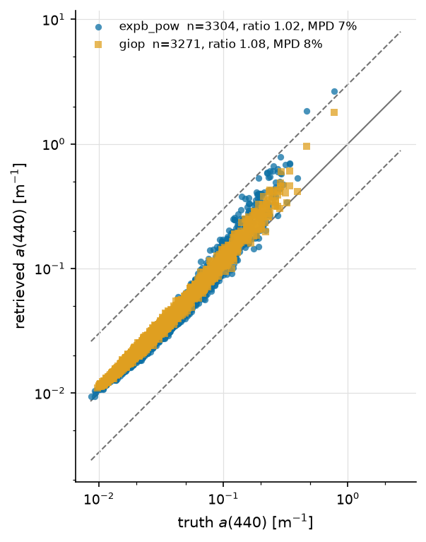

   a(440), all algorithms — at most 3304 retrieval-truth pairs per algorithm; each legend entry states its own.

Ratio distribution — a(440)
---------------------------

How the population is distributed about 1:1, per accuracy bucket — the companion a scatter is conventionally paired with (GIOP Figs. 1-2), because central tendency alone hides the spread that decides whether a retrieval is usable. The vertical rule marks ratio = 1.

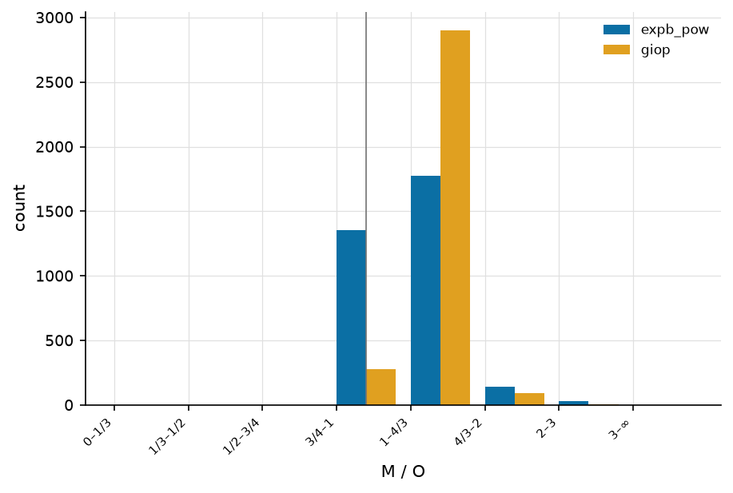

   Retrieved/true ratio buckets for a(440).

Retrieved vs. true — bb(555)
----------------------------

Retrieved vs. true **bb(555)**, one point per observation and algorithm on log–log axes. Points on the solid **1:1** line are perfect; the dashed **3:1** and **1:3** guides mark the ±3× envelope. Each legend entry carries that algorithm's own ``n_pairs``, its median ratio (1 = perfect) and MPD (median absolute percent difference, 0 = perfect), so the panel can be read without the table below.

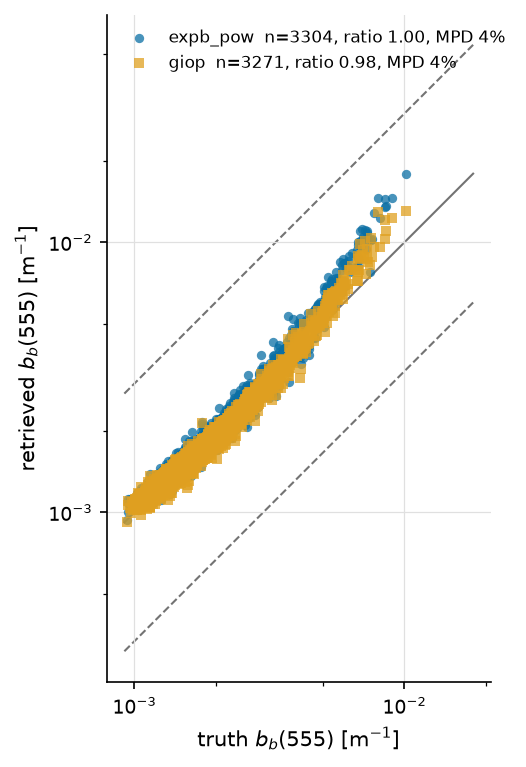

   bb(555), all algorithms — at most 3304 retrieval-truth pairs per algorithm; each legend entry states its own.

Ratio distribution — bb(555)
----------------------------

How the population is distributed about 1:1, per accuracy bucket — the companion a scatter is conventionally paired with (GIOP Figs. 1-2), because central tendency alone hides the spread that decides whether a retrieval is usable. The vertical rule marks ratio = 1.

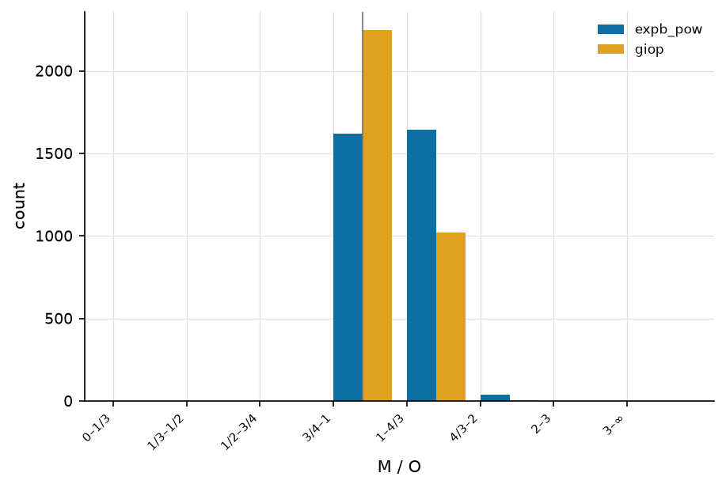

   Retrieved/true ratio buckets for bb(555).

Retrieved vs. true — a_dg(440)
------------------------------

Retrieved vs. true **a_dg(440)**, one point per observation and algorithm on log–log axes. Points on the solid **1:1** line are perfect; the dashed **3:1** and **1:3** guides mark the ±3× envelope. Each legend entry carries that algorithm's own ``n_pairs``, its median ratio (1 = perfect) and MPD (median absolute percent difference, 0 = perfect), so the panel can be read without the table below.

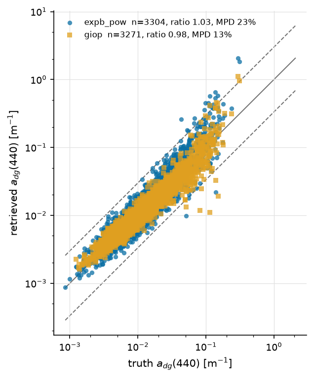

   a_dg(440), all algorithms — at most 3304 retrieval-truth pairs per algorithm; each legend entry states its own.

Ratio distribution — a_dg(440)
------------------------------

How the population is distributed about 1:1, per accuracy bucket — the companion a scatter is conventionally paired with (GIOP Figs. 1-2), because central tendency alone hides the spread that decides whether a retrieval is usable. The vertical rule marks ratio = 1.

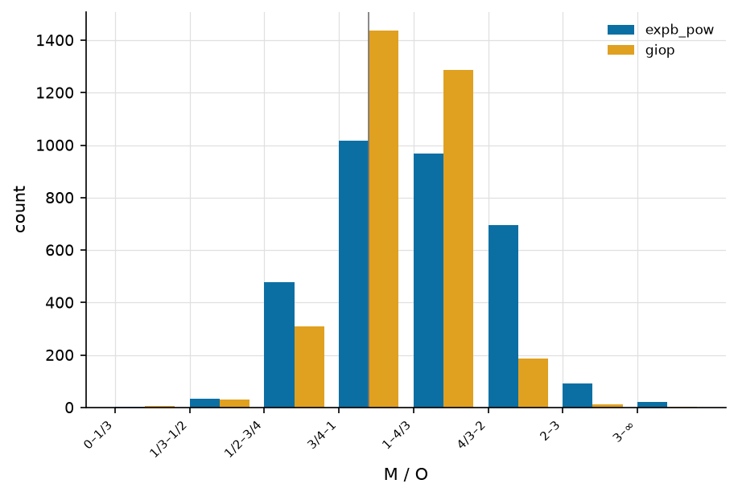

   Retrieved/true ratio buckets for a_dg(440).

Taylor & Target — a(440)
------------------------

**Taylor** (first) and **Target** (second) diagrams for :math:`a(440)`, computed in log space and drawn for the sweep's best-covered component. The Taylor diagram places each algorithm by its correlation with truth (azimuth, labelled in correlation) and normalized standard deviation (radius); the reference star sits at correlation 1, norm-σ 1, and the dotted arcs are centred-RMSD contours about it. The Target diagram plots bias (y) against the sign-carrying unbiased RMSD (x), with dotted constant-RMSD rings — the closer to the origin, the better.

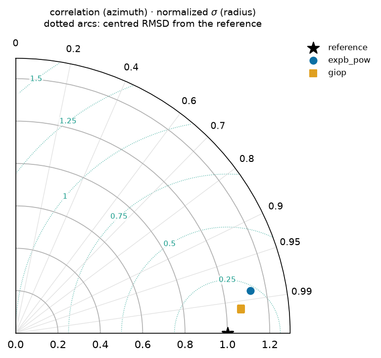

   Taylor diagram — a(440): correlation (azimuth) vs normalized standard deviation (radius), with centred-RMSD arcs about the reference star.

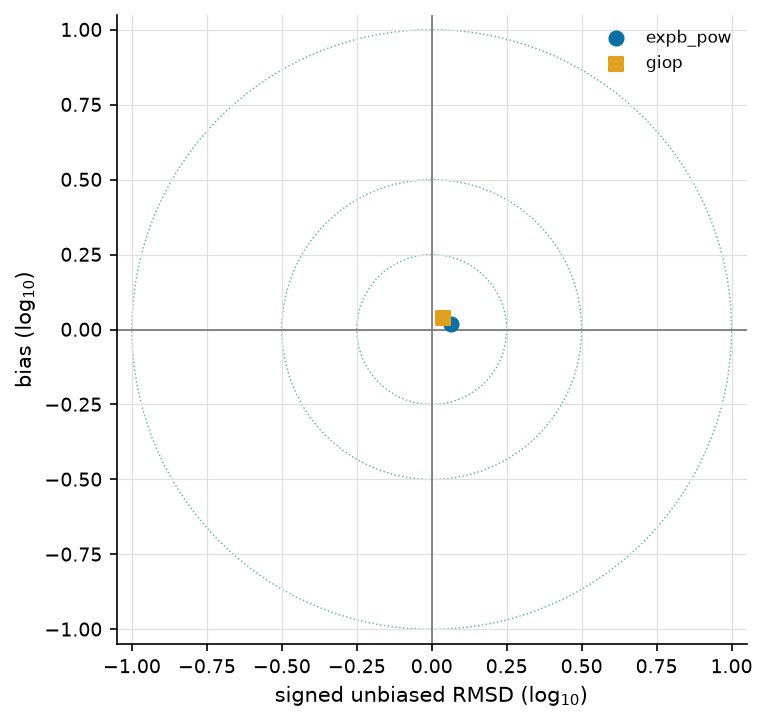

   Target diagram — a(440): bias vs signed unbiased RMSD, with constant-RMSD rings; the origin is a perfect retrieval.

Model selection (ΔBIC)
----------------------

Cumulative distribution of **ΔBIC** per spectrum for this sweep's complexity contest — ``expb_pow`` (k=5) against ``giop`` (k=3), chosen as its highest- and lowest-parameter algorithms. ΔBIC < 0 favours the more complex model ``expb_pow``; ΔBIC > 0 favours the parsimonious ``giop``. The curve shows what fraction of spectra fall either side — i.e. whether the extra parameters earn their keep. See :doc:`/models`.

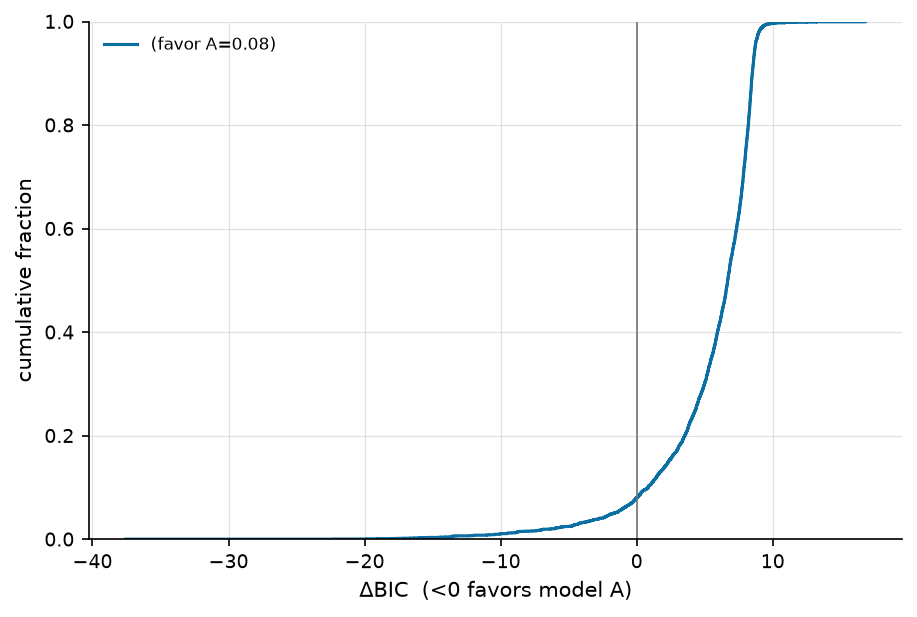

   Per-spectrum ΔBIC, ``expb_pow`` vs ``giop``: the fraction of spectra either side of 0 says whether the extra parameters earn their keep.

Accuracy vs. wavelength — L23
-----------------------------

How each algorithm's error varies **across the spectrum** on **L23**, for the 5 component(s) scored at 5 or more bands (``a``, ``a_dg``, ``bb``, ``bb_p``, ``a_ph``; up to 71 bands). A retrieval can be accurate in the blue and useless in the red, which a single reference-band number cannot show — this is the per-band view of the same ``mae`` the accuracy table reports at its reference wavelengths. Each algorithm keeps its colour, marker and linestyle from every other figure. Datasets are drawn separately: their band sets and sample sizes differ, so one line through both would show a sparse dataset's bands as spectral structure.

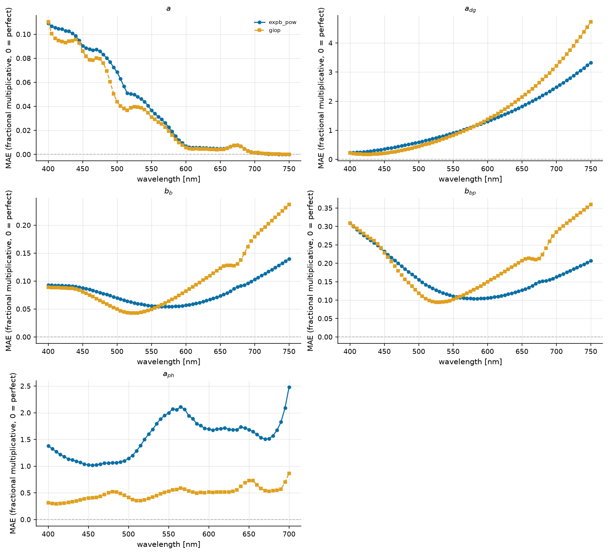

   Fractional multiplicative MAE against wavelength on L23, one panel per component, all algorithms overlaid. The dashed rule is the perfect value (0).

Per trophic stratum
-------------------

Observations are binned by chlorophyll into oligotrophic / mesotrophic / eutrophic (<0.1, <1, ≥1 mg m⁻³), preferring truth Chl over retrieved. This sweep resolves ``mesotrophic`` (n_attempted 2495), ``oligotrophic`` (n_attempted 648), ``eutrophic`` (n_attempted 177). Every table above pools these together, and pooling is what hides a regime change — an algorithm can be usable in one trophic state and not in the next, which is the whole question for a coastal dataset.

Accuracy — mesotrophic
----------------------

The same accuracy columns as the pooled table, over the ``mesotrophic`` stratum alone — at most 2495 retrieval-truth pair(s), from 2495 attempted spectra. Columns are defined on the :doc:`/reports/glossary` page.

.. csv-table:: Ref-band accuracy, mesotrophic only.
   :file: accuracy_chisq_mesotrophic.csv
   :header-rows: 1
   :widths: auto

Quality control — mesotrophic
-----------------------------

Retrieval success within ``mesotrophic``. ``frac_ok`` and ``frac_not_ok`` are complements over this stratum's 2495 attempted spectra, so they can be read directly against the other strata. **Error model** — every rate here is scored against the uncertainty each record carries (L23: ``pace``).

.. csv-table:: Fit quality / closure, mesotrophic only.
   :file: qc_chisq_mesotrophic.csv
   :header-rows: 1
   :widths: auto

Accuracy — oligotrophic
-----------------------

The same accuracy columns as the pooled table, over the ``oligotrophic`` stratum alone — at most 648 retrieval-truth pair(s), from 648 attempted spectra. Columns are defined on the :doc:`/reports/glossary` page.

.. csv-table:: Ref-band accuracy, oligotrophic only.
   :file: accuracy_chisq_oligotrophic.csv
   :header-rows: 1
   :widths: auto

Quality control — oligotrophic
------------------------------

Retrieval success within ``oligotrophic``. ``frac_ok`` and ``frac_not_ok`` are complements over this stratum's 648 attempted spectra, so they can be read directly against the other strata. **Error model** — every rate here is scored against the uncertainty each record carries (L23: ``pace``).

.. csv-table:: Fit quality / closure, oligotrophic only.
   :file: qc_chisq_oligotrophic.csv
   :header-rows: 1
   :widths: auto

Accuracy — eutrophic
--------------------

The same accuracy columns as the pooled table, over the ``eutrophic`` stratum alone — at most 161 retrieval-truth pair(s), from 177 attempted spectra. Columns are defined on the :doc:`/reports/glossary` page.

.. csv-table:: Ref-band accuracy, eutrophic only.
   :file: accuracy_chisq_eutrophic.csv
   :header-rows: 1
   :widths: auto

Quality control — eutrophic
---------------------------

Retrieval success within ``eutrophic``. ``frac_ok`` and ``frac_not_ok`` are complements over this stratum's 177 attempted spectra, so they can be read directly against the other strata. **Error model** — every rate here is scored against the uncertainty each record carries (L23: ``pace``).

.. csv-table:: Fit quality / closure, eutrophic only.
   :file: qc_chisq_eutrophic.csv
   :header-rows: 1
   :widths: auto

Model selection by stratum (ΔBIC)
---------------------------------

The same contest as above, split by trophic stratum. ΔBIC < 0 favours the more complex ``expb_pow``. A pooled curve can hide a reversal — extra parameters that pay in turbid water and cost in clear water average out to "no difference".

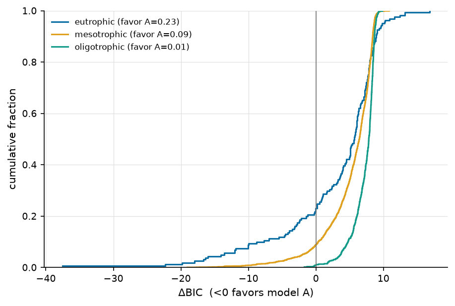

   Per-spectrum ΔBIC, ``expb_pow`` vs ``giop``, one curve per trophic stratum.

Least-squares vs MCMC
---------------------

For the contests present under **both** fit methods. ``d_mae`` is ``mae(mcmc) − mae(chisq)``, so negative means the sampler is more accurate. The columns worth reading first are the **coverage** pair: χ² reports the curvature of the likelihood at a single point while MCMC samples the posterior, so the question is not only which is more accurate but whether the sampler's wider intervals are also the more honest ones — a coverage nearer the nominal 0.68 / 0.95.

.. csv-table:: The same contests fitted both ways.
   :file: fit_method_compare_all.csv
   :header-rows: 1
   :widths: auto

Accuracy
--------

Per-(dataset, component, reference wavelength) retrieval accuracy for the χ² population: fractional multiplicative **mae**/**bias** (0 = perfect, ``mae`` 0.1 ≈ 10%), **median_ratio** (1 = perfect), **coverage68/95** against their nominal 0.68/0.95 with a ``*_verdict`` of over-confident / consistent / conservative (a real miss being more than 2 binomial standard errors; at small ``n_pairs`` only a gross miss is detectable, so *consistent* means "not distinguishable from nominal here", not "calibrated"), the cross-algorithm ranks (``*_rank``, 1 = best) and the head-to-head **win_frac** (0.5 = tie). ``n_pairs`` counts surviving retrieval-truth pairs; ``ref_match`` is the native band actually used (±3 nm). Every column is defined on the :doc:`/reports/glossary` page.

.. csv-table:: Ref-band accuracy + wins (χ², all strata).
   :file: accuracy_chisq_all.csv
   :header-rows: 1
   :widths: auto

Head-to-head
------------

Every algorithm pair, judged on the spectra **both** of them retrieved. ``delta_mae`` is ``mae(A) − mae(B)`` on those shared spectra (negative favours A) and ``d_lo``/``d_hi`` are its paired-bootstrap 95% interval, after the round-robin practice of resampling the data to put uncertainty on a ranking. The ``verdict`` names a winner only when the interval excludes 0 **and** the difference clears a practical floor of 10%. It reads ``indistinguishable`` only when the **whole interval** lies inside that floor — i.e. the data rule a material difference out — and ``underpowered`` when the interval is too wide to say either way at this ``n_paired``. Here 6 pair(s) are indistinguishable and 0 are underpowered, out of 10.

.. csv-table:: Pairwise verdicts (χ², all strata).
   :file: head_to_head_chisq_all.csv
   :header-rows: 1
   :widths: auto

Quality control
---------------

Fit-quality summary per dataset and algorithm. ``n_attempted`` is what the sweep tried and ``n_scored`` what produced a usable fit — the gap is explained by the per-status fractions, which are kept apart on purpose: ``frac_out_of_scope`` (the spectrum was **declined before fitting** — a red-peaked, turbid spectrum is outside the open-ocean family's regime, so the row means "we declined to fit this", not "we fitted it and it failed") and ``frac_fit_failed`` (the fitter returned nothing) are the same ``frac_not_ok`` and entirely different findings. Also the median reduced **χ²ᵥ**, the noise-model-free **rel_misfit** (GIOP's ΔRrs), and the χ²ᵥ closure split (``frac_good`` ≈ 1, ``frac_overfit`` < 1, ``frac_underfit`` > 1, ``frac_qc_fail`` = non-solutions). **Error model** — every rate here is scored against the uncertainty each record carries (L23: ``pace``).

.. csv-table:: Fit quality / closure (χ²).
   :file: qc_chisq_all.csv
   :header-rows: 1
   :widths: auto

Interactive
-----------

Retrieved vs. true, **interactive**: pick the dataset, algorithm, component and trophic stratum, and hover any point for its ``obs_id``, wavelength and values — so an outlier can be traced back to a spectrum. The figure title states what fraction of the population is plotted (the cloud is downsampled to keep the page small; the static panels above summarize all of it).

.. raw:: html

   
   
   

   <script>
   (function() {
     const fn = function() {
       Bokeh.safely(function() {
         (function(root) {
           function embed_document(root) {
           const docs_json = '{"06b44126-cbde-4d9d-81df-7b23e7d50b5a":{"version":"3.9.1","title":"Bokeh Application","config":{"type":"object","name":"DocumentConfig","id":"p1068","attributes":{"notifications":{"type":"object","name":"Notifications","id":"p1069"}}},"roots":[{"type":"object","name":"Column","id":"p1067","attributes":{"children":[{"type":"object","name":"Select","id":"p1062","attributes":{"js_property_callbacks":{"type":"map","entries":[["change:value",[{"type":"object","name":"CustomJS","id":"p1066","attributes":{"args":{"type":"map","entries":[["full",{"type":"object","name":"ColumnDataSource","id":"p1006","attributes":{"selected":{"type":"object","name":"Selection","id":"p1007","attributes":{"indices":[],"line_indices":[]}},"selection_policy":{"type":"object","name":"UnionRenderers","id":"p1008"},"data":{"type":"map","entries":[["x",[0.0003292800101917237,0.0010009999386966228,0.02037700079381466,0.0021244999952614307,0.0019762099254876375,0.003578789997845888,0.00014200000441633165,0.038968998938798904,0.026386000216007233,0.0022164001129567623,0.0009759999811649323,0.0014100000262260437,0.0026209999341517687,2.8503000736236572,0.0010605700081214309,0.0007510000141337514,0.07571300119161606,0.000291000003926456,0.0005494499928317964,0.015070000663399696,0.0005050000036135316,0.0007173999911174178,0.014983000233769417,0.000682590005453676,0.0016575000481680036,0.02394700050354004,0.002073999959975481,0.003812599927186966,0.003585960017517209,0.026506001129746437,0.003240999998524785,0.0004920000210404396,0.0012977099977433681,0.0009742300026118755,0.0005355000030249357,0.0032762999180704355,0.004098800010979176,0.030042998492717743,0.00019099999917671084,0.0349700003862381,0.0016763999592512846,2.8501999378204346,0.5171700119972229,0.0011530000483617187,0.0008381200022995472,0.00029818000621162355,2.850100040435791,0.16843000054359436,0.002338699996471405,0.0011463999981060624,0.0019030000548809767,0.0011576999677345157,0.0022100000642240047,0.0002610000083222985,0.000387999985832721,0.0009581000194884837,0.0025504000950604677,0.31161999702453613,0.0043021999299526215,0.006280799861997366,0.8273400068283081,0.003650899976491928,0.0006850999779999256,0.0006446000188589096,0.003099400084465742,0.0010740000288933516,0.0010349999647587538,0.055442001670598984,0.00019700000120792538,0.00020700000459328294,0.00027322000823915005,0.0060720001347362995,0.0019080000929534435,0.0004145599959883839,0.0006662899977527559,0.0010196400107815862,0.0013500000350177288,0.0005149999633431435,0.002101799938827753,0.005841199774295092,0.00020399999630171806,0.10814999788999557,0.0003894800029229373,0.0015218999469652772,0.002976899966597557,0.0015670000575482845,0.0027580999303609133,0.0003260000084992498,0.004688899964094162,0.0015547999646514654,0.00851299986243248,0.001983500085771084,0.0012489999644458294,0.0010309700155630708,0.003014999907463789,0.0008612499805167317,0.0014535000082105398,0.0007178999949246645,2.850100040435791,0.0006629999843426049,0.0015133999986574054,0.0004910000134259462,0.015660999342799187,0.014293000102043152,0.10617999732494354,0.002644999884068966,0.0016840000171214342,0.0009676999761722982,0.0035729999653995037,0.006816999986767769,0.0017709999810904264,0.0008986800094135106,0.00468439981341362,0.0007650700281374156,0.0026130001060664654,0.012023000046610832,0.009934999980032444,0.0007381999748758972,0.0007648000027984381,0.06167599931359291,2.510200023651123,0.0009653100278228521,0.021842999383807182,0.006079999729990959,0.0022986300755292177,0.06228199973702431,0.0016542000230401754,0.000943330000154674,0.00010099999781232327,0.02126000076532364,0.0006799999973736703,0.006128000095486641,0.0002912199997808784,0.0005946999881416559,0.001406199997290969,0.0006657299818471074,0.0023274999111890793,0.002555399900302291,0.021160999312996864,0.015500999987125397,0.0013388999504968524,0.0015960000455379486,0.0005810000002384186,0.018334999680519104,0.04667399823665619,0.026743000373244286,0.0012420000275596976,0.4505099952220917,0.003364000003784895,0.0031510000117123127,0.02385599911212921,0.04819199815392494,0.0011345000239089131,0.004209999926388264,0.0010191999608650804,0.015977000817656517,0.004366499837487936,0.0004870000120718032,0.0018879999406635761,0.0028476000297814608,0.0005526799941435456,0.0007856099982745945,0.003978000022470951,0.0013460000045597553,0.0028285998851060867,0.004296499770134687,0.06621500104665756,0.00194540002848953,0.012784000486135483,0.25854000449180603,0.49494001269340515,0.0023449999280273914,0.0016976000042632222,0.004207000136375427,0.00433299969881773,0.011458000168204308,0.002386000007390976,0.016693999990820885,0.0009277299977838993,0.00039400000241585076,0.04816199839115143,0.00040826000622473657,0.001088000019080937,0.03553299978375435,0.015173000283539295,0.00012399999832268804,0.047405000776052475,0.0040350002236664295,0.047940999269485474,0.11670000106096268,0.0028880001045763493,0.00407300004735589,0.003684599883854389,0.020533999428153038,0.0010032999562099576,0.0024129999801516533,0.05860000103712082,0.0010609900346025825,0.0019795799162238836,0.04809299856424332,0.03210899978876114,0.001019999966956675,0.004021000117063522,0.004081999883055687,0.0007152999751269817,0.0014570000348612666,0.05486899986863136,0.26576000452041626,0.0017842999659478664,0.04690000042319298,0.0032401999924331903,0.001740999985486269,0.05229499936103821,0.018768999725580215,0.0008720700279809535,0.001032999949529767,0.0008997999830171466,0.00030029998742975295,0.003066000062972307,0.0006829999620094895,0.0006467999774031341,0.002831999910995364,0.0002760500065051019,0.0004900000058114529,0.09540099650621414,0.0035900799557566643,0.0010694999946281314,0.0008629999938420951,0.002572000026702881,0.0028244999703019857,0.006051000207662582,0.000776230008341372,0.004300400149077177,0.00010799999290611595,0.012357000261545181,0.002578000072389841,0.0016589999431744218,0.0007660000119358301,0.001411000033840537,0.0030930000357329845,0.00046800001291558146,0.0015920000150799751,0.0020355000160634518,0.0011844000546261668,0.001165500027127564,0.007534999866038561,0.0008731000125408173,1.9702999591827393,0.02674799971282482,0.00610300013795495,0.00292299990542233,0.00472399964928627,0.18000000715255737,0.0006093999836593866,0.1003900021314621,0.0003870000073220581,0.010196000337600708,2.780100107192993,0.012341000139713287,0.30493998527526855,0.0016700000269338489,0.0010547999991104007,0.000749850005377084,0.0037082999479025602,0.0005080000264570117,0.016103999689221382,0.00345898000523448,0.4667600095272064,0.0009732299949973822,0.0006004999740980566,1.4908000230789185,0.0007110000005923212,0.006246999837458134,0.0003649999853223562,0.0016090000281110406,0.0024309998843818903,0.004701000172644854,0.003073000116273761,0.03146100044250488,0.0013569999719038606,0.05006499961018562,0.0009524999768473208,0.0011480000102892518,0.0015807000454515219,0.0011919999960809946,8.399999933317304e-05,0.0008219999726861715,0.00280930008739233,0.0014879999216645956,0.002240200061351061,0.0007929999846965075,0.0007409999961964786,0.003670899895951152,0.06560000032186508,0.0033642000053077936,0.0008169999928213656,0.0005724999937228858,0.0024379000533372164,0.0030910801142454147,0.012179000303149223,0.0028409999795258045,0.4546299874782562,0.0024049999192357063,0.000964100006967783,0.00120900000911206,0.0011275999713689089,0.07228899747133255,0.012120000086724758,0.013381999917328358,0.023435000330209732,0.0017469000304117799,0.18288999795913696,0.830049991607666,0.0015999999595806003,0.0014869999140501022,0.0009281900129280984,0.0010900000343099236,0.022597000002861023,0.007447999902069569,0.06527099758386612,0.0033273000735789537,0.001051599974744022,0.0014946999726817012,0.0005469999741762877,0.0012870000209659338,0.021018000319600105,0.0018823799910023808,0.006816999986767769,3.199999991920777e-05,0.0028405000921338797,0.001032699947245419,0.033688001334667206,0.000968359992839396,0.004416000097990036,0.0025659999810159206,0.0011317000025883317,0.00443999981507659,0.0008076700032688677,0.0027099999133497477,0.0005822000093758106,0.020841000601649284,0.46588999032974243,0.001268099993467331,0.0003090000245720148,0.005745499860495329,0.0011579999700188637,0.002148000057786703,0.00019741000141948462,0.002171299885958433,0.006256999913603067,0.0017170000355690718,0.000600990024395287,0.019022999331355095,0.0003938000008929521,0.0022811100352555513,0.05943800136446953,0.0050559998489916325,0.011663999408483505,0.000972400011960417,0.0012115000281482935,0.0021303000394254923,0.0009972000261768699,0.0007900000200606883,0.004741000011563301,0.0003760000108741224,0.11197999864816666,0.0009861199650913477,0.006225999910384417,6.199999916134402e-05,0.001407100004144013,0.0014528000028803945,0.07543899863958359,0.06652099639177322,0.00039815998752601445,0.009042000398039818,0.0035119999665766954,0.0001904399978229776,0.04452100023627281,0.3138200044631958,0.018240999430418015,0.00033151000388897955,0.02418000064790249,0.0006776300142519176,0.006994000170379877,0.002391600050032139,0.008307999931275845,0.0008548899786546826,0.0030797000508755445,0.003386500058695674,0.0006608000257983804,0.0018403000431135297,0.003217000048607588,0.004540000110864639,0.0014752000570297241,0.0026839999482035637,0.026033999398350716,0.0008813400054350495,0.38286998867988586,0.0034386999905109406,0.019749000668525696,0.09283799678087234,0.0013575999764725566,0.002199999988079071,1.9701999425888062,0.0024319998919963837,0.0011393999448046088,0.006676999852061272,0.013914999552071095,0.04804899916052818,0.0006150000263005495,0.004901399835944176,0.06586199998855591,0.0008984499727375805,0.0010943999513983727,0.27911999821662903,0.000630799971986562,0.003102000104263425,0.000302250002278015,0.0006739100208505988,0.003998999949544668,0.00022300001000985503,0.0002930000191554427,0.0019330000504851341,0.0012564000207930803,1.9703999757766724,0.0006085999775677919,0.0012829999905079603,0.001938000088557601,0.0012426000321283937,0.7048599720001221,0.0006933999829925597,0.013598000630736351,0.0007680000271648169,0.04209500178694725,0.0056119998916983604,0.010212000459432602,0.22474999725818634,0.0009510000236332417,0.004960999824106693,0.029116999357938766,0.00241800001822412,0.0010307000484317541,0.0013299999991431832,1.0085999965667725,0.04538699984550476,0.00032699998700991273,0.0010389999952167273,0.0023074098862707615,0.0029486999846994877,0.001348000019788742,0.025158999487757683,0.001005799975246191,0.001034429995343089,0.0013288999907672405,0.1298699975013733,0.006004000082612038,0.007286000065505505,0.0032339999452233315,0.0017590000061318278,0.0008057000231929123,0.0006740299868397415,0.0035101999528706074,0.2771100103855133,0.00048104001325555146,0.002922500018030405,0.0003690000157803297,0.001976100029423833,0.0003260000084992498,0.0015860999701544642,0.020746000111103058,0.0668570026755333,0.29346999526023865,0.003777999896556139,0.001016999944113195,0.0007537900237366557,0.000823159993160516,0.021522998809814453,0.02572299912571907,0.004007000010460615,0.02035599946975708,0.4566099941730499,0.002410599961876869,0.0031840000301599503,0.00019099999917671084,0.002515600062906742,0.0010819999733939767,0.0010489999549463391,0.000936899974476546,0.0012490999652072787,0.000770699989516288,0.006428000051528215,0.021554000675678253,0.06841599941253662,0.0005027700099162757,0.0039090001955628395,0.0005246999789960682,0.001715000020340085,0.003358999965712428,0.006570999976247549,0.0029770000837743282,0.002203000010922551,0.0023849999997764826,0.0017290000105276704,0.0011756300227716565,0.00110959995072335,0.0012420000275596976,0.010691000148653984,0.0009238399798050523,0.0013806000351905823,0.005747999995946884,0.0007360000163316727,0.0014586800243705511,0.0020814999006688595,0.4680899977684021,0.025175999850034714,0.00042356998892500997,0.0015700000803917646,2.7809998989105225,0.0024995000567287207,0.3722499907016754,0.0008783600060269237,0.0013740999856963754,0.012880000285804272,0.0015804599970579147,0.0027379998937249184,0.0018483999883756042,0.0097889993339777,0.02639099955558777,0.0012390000047162175,0.8278399705886841,0.0004039999912492931,0.004027300048619509,0.00026731000980362296,0.010906999930739403,0.00013499999477062374,0.002643000101670623,0.001090700039640069,0.06221599876880646,0.045271001756191254,0.032520998269319534,0.0012907000491395593,0.004123699851334095,0.06100299954414368,0.37362000346183777,0.0012229999992996454,0.007052000146359205,0.4313200116157532,0.46717000007629395,0.04948300123214722,0.0014367999974638224,0.008209999650716782,0.056492000818252563,0.0013657000381499529,0.0018541000317782164,0.41144001483917236,0.0016474999720230699,0.002911000046879053,0.0016740000573918223,0.015832999721169472,0.0018870000494644046,2.7802000045776367,0.0002519999979995191,0.0013241999549791217,0.0006520000169984996,0.007544999942183495,0.0004912000149488449,0.0011599999852478504,0.0033036000095307827,0.0038960000965744257,0.0009355000220239162,0.05358399823307991,0.028020000085234642,0.0011250999523326755,0.001421900000423193,0.0006488999933935702,0.00023700000019744039,0.00292599992826581,0.008817000314593315,0.004383699968457222,0.10955999791622162,0.0009715399937704206,0.00048099999548867345,0.002151499968022108,0.003829000052064657,0.00014600000577047467,3.300000025774352e-05,0.0041519999504089355,0.0036355999764055014,0.001245009945705533,0.827489972114563,0.00039500001003034413,0.0006002599839121103,0.27755001187324524,0.0016062000067904592,0.0008097999962046742,0.04936600103974342,0.04863499850034714,0.032839998602867126,0.002673099981620908,0.023087000474333763,0.0012777999509125948,0.0013526700204238296,0.01854800060391426,0.7044699788093567,0.0038584000431001186,0.00047900000936351717,2.7802000045776367,0.0003440000000409782,0.0005172599921934307,0.0010610000463202596,0.001956900116056204,0.005200999788939953,0.0016900000628083944,0.13628000020980835,0.0009070200030691922,0.016951000317931175,0.002948800101876259,0.4410800039768219,0.000809560006018728,0.0029446000698953867,0.0004417999880388379,0.0025025999639183283,0.1362600028514862,0.00489442003890872,0.0025434999261051416,0.004490000195801258,0.058956000953912735,0.2591100037097931,0.003467600094154477,0.0011899999808520079,0.006831999868154526,0.0014669999945908785,0.0009289999725297093,0.0012779999524354935,0.0005997400148771703,0.04913699999451637,0.005574999842792749,0.0003330000035930425,0.6305400133132935,0.29205000400543213,0.0047530001029372215,0.0002919799881055951,0.0008125900058075786,0.27138999104499817,0.003416100051254034,0.047401998192071915,0.034060999751091,0.04566299915313721,0.0011913100024685264,0.0008973699877969921,0.05606599897146225,0.0009214900201186538,0.3115899860858917,0.0014519999967887998,0.0006555099971592426,0.0005914500216022134,0.0007779999868944287,0.0008963000145740807,0.003352999920025468,0.00863999966531992,0.0025820001028478146,0.16968999803066254,0.007890000008046627,0.00017860000662039965,0.0007560600060969591,0.000391139998100698,0.004014899954199791,0.001689000055193901,0.0015216999454423785,0.25874999165534973,0.004999000113457441,0.050241999328136444,0.000719660019967705,0.004162299912422895,0.002661299891769886,0.022214999422430992,0.0014658999862149358,0.001257200026884675,0.0014807999832555652,0.0005713399732485414,0.003132699988782406,0.001534000039100647,0.0023944999556988478,0.000455000001238659,0.11230000108480453,0.004069000016897917,0.0019519500201568007,0.0017337000463157892,0.00015800000983290374,0.0002806900010909885,0.001344999996945262,0.0004290000069886446,0.017865000292658806,0.004880200140178204,0.001399399945512414,0.0010667999740689993,0.0003172100114170462,0.14264999330043793,0.0013840000610798597,0.11162000149488449,0.0011428999714553356,2.8501999378204346,0.0007340000011026859,0.0013014599680900574,0.001128499978221953,0.0015125999925658107,0.0027244999073445797,0.0014401100343093276,0.0012655600439757109,0.0012585000367835164,0.016780000180006027,0.017162000760436058,0.00041303999023512006,2.780100107192993,0.01618099957704544,0.0006719999946653843,0.0006430000066757202,0.0011729999678209424,0.005675999913364649,0.41499000787734985,0.0005591500084847212,0.006066000089049339,0.0010319999419152737,0.0009147599921561778,0.0032762999180704355,0.000998849980533123,0.0007015999872237444,0.0005099999834783375,0.00120900000911206,0.13654999434947968,0.0060720001347362995,0.0023002000525593758,0.0006270000012591481,0.022432999685406685,0.058118999004364014,0.0010260000126436353,0.02714099921286106,0.0028119999915361404,0.004900000058114529,0.0022318600676953793,0.06643900275230408,0.0005329999839887023,0.0005520000122487545,0.0005097300163470209,0.0037960000336170197,0.020661000162363052,0.0014859599759802222,0.0021609999239444733,0.000371000001905486,0.0006661000079475343,0.0009375900262966752,0.00028899998869746923,0.03308400139212608,0.0012431000359356403,0.0032426000107079744,0.0006540099857375026,0.0013348000356927514,0.03048899956047535,0.0059819999150931835,0.000563470006454736,1.007200002670288,0.003903999924659729,0.0025430000387132168,0.0007269999478012323,0.001171399955637753,0.22415000200271606,0.0006997099844738841,0.0001552199973957613,0.0008674900163896382,0.000723920005839318,0.025275999680161476,0.021815000101923943,0.5203700065612793,0.03798000141978264,0.0012049999786540866,0.000645669992081821,0.0007111799786798656,0.027828000485897064,0.004673999734222889,0.0012869000202044845,0.001285900012589991,0.0011320400517433882,0.00021396999363787472,0.005071999970823526,0.06706299632787704,0.0007458499749191105,0.0011947000166401267,0.0006424799794331193,0.0009997299639508128,0.0007961399969644845,0.0014106000307947397,0.0019177000503987074,0.0007491799769923091,0.0024097999557852745,0.018807001411914825,0.002187199890613556,0.0025198999792337418,0.05587099865078926,0.0006012700032442808,0.06333699822425842,0.000867100025061518,0.001396800042130053,0.0011690000537782907,0.0031179001089185476,0.26787999272346497,0.0015968900406733155,0.0006909099756740034,0.005255000200122595,0.008682000450789928,0.0009380000410601497,0.2690599858760834,0.0005148000200279057,0.2853100001811981,0.0011409999569877982,0.0032661999575793743,0.4318599998950958,2.7802000045776367,0.000771820021327585,0.001462999964132905,0.001270200009457767,0.04439700022339821,0.05315899848937988,0.02838600054383278,0.006704000290483236,0.0002462000120431185,0.0011249999515712261,0.0015131999971345067,0.3275899887084961,0.0007395999855361879,0.001234999974258244,0.005987999960780144,0.000843859976157546,0.0006793999928049743,0.0018120999448001385,0.0011183000169694424,0.001141499960795045,0.0006419999990612268,0.0032339999452233315,0.8290600180625916,0.0008010000456124544,0.002225999953225255,0.0021265000104904175,0.0009983599884435534,2.830199956893921,0.0068350001238286495,0.0066650002263486385,0.004902999848127365,0.004301200155168772,0.0033050000201910734,0.023215999826788902,0.0009055500268004835,0.0007052199798636138,0.010471999645233154,2.510200023651123,0.0016183500410988927,0.00030700000934302807,0.0019372999668121338,0.03591600060462952,0.0003239999932702631,0.0006311900215223432,0.00033599999733269215,0.00107999995816499,0.004422000143676996,0.0008570000063627958,0.0012827999889850616,0.009971999563276768,0.001249499968253076,0.0037807999178767204,0.05861999839544296,0.02117599919438362,0.026844000443816185,0.22750000655651093,0.00021800000104121864,0.08145999908447266,0.015600999817252159,0.3258900046348572,0.13913999497890472,0.0008597300038672984,0.026409000158309937,0.002411500085145235,0.0010270000202581286,0.0013910999987274408,0.002259999979287386,0.10811000317335129,0.0005289600230753422,0.0014003999531269073,0.000734079978428781,0.04554099962115288,0.000859999970998615,0.0006890000076964498,0.0009102100157178938,0.06430000066757202,0.001028139959089458,0.0012740000383928418,0.0005044200224801898,0.5598700046539307,0.0007576699717901647,0.0016980000073090196,0.00400179997086525,0.002477899892255664,0.0013541999505832791,0.0018070000223815441,0.002688799984753132,0.002088000066578388,0.00044649001210927963,0.004004000220447779,0.25951001048088074,0.0003595000016503036,0.0006982000195421278,0.0016935999738052487,0.4417699873447418,0.02982099913060665,0.0022690000478178263,0.011283999308943748,0.0020481001120060682,0.0026320000179111958,0.0007670000195503235,0.25874000787734985,0.019166000187397003,0.0006140000186860561,0.0007985300035215914,0.0725340023636818,0.0019323000451549888,0.0006587399984709918,0.0019370000809431076,0.0008465700084343553,0.002671400085091591,0.0037223000545054674,0.014321000315248966,0.0014686000067740679,0.00165200000628829,2.850399971008301,0.0007659000111743808,0.003971000202000141,0.0006003999733366072,0.005022100172936916,0.0012616999447345734,0.002644999884068966,0.001384299946948886,0.0022426999639719725,0.00731780007481575,0.000786389980930835,0.00031700002728030086,0.34097999334335327,0.0003045200137421489,0.00092299998505041,0.014993999153375626,0.0015812700148671865,0.00024500000290572643,0.0013004000065848231,0.000769430014770478,0.0006493499968200922,0.0007800000021234155,0.0007258499972522259,0.29328998923301697,0.0065299998968839645,0.023538999259471893,0.004997000098228455,1.0073000192642212,0.0016349999932572246,0.0028824000619351864,0.0018403000431135297,0.0022261999547481537,0.0004890999989584088,0.0006058000144548714,0.006945999804884195,0.011704999953508377,0.001155999954789877,0.0010685999877750874,0.002469999948516488,0.001672700047492981,0.0010140000376850367,0.0009944499470293522,0.0005184800247661769,0.014041999354958534,0.001625100034289062,0.0055610002018511295,0.0017320000333711505,0.021782999858260155,0.003241600003093481,0.0009260600199922919,0.517769992351532,0.05000299960374832,0.001400390057824552,0.003919899929314852,0.0035639998968690634,0.00029600001289509237,0.0006046600174158812,0.0017639999277889729,0.0033539999276399612,0.0005430000019259751,0.002991100074723363,0.016123000532388687,0.0005949999904260039,0.006203000433743,0.004693999886512756,0.0037895001005381346,0.0017068999586626887,0.0014217999996617436,0.0020240000449121,0.011156000196933746,0.004081100225448608,0.004110000096261501,0.0009419999551028013,0.006226560100913048,0.00038399998447857797,0.00120599998626858,0.011094000190496445,0.00331399985589087,0.0015631000278517604,0.005683000199496746,0.07282000035047531,0.017368000000715256,0.001285000005736947,0.0023970999754965305,0.1917099952697754,0.0037098899483680725,0.0007595000206492841,0.00698099983856082,0.0012174999574199319,0.0031894000712782145,0.0014926999574527144,0.003280299948528409,0.2681899964809418,0.0023849999997764826,0.0038429999258369207,0.0008217099821195006,0.0018159999744966626,0.004267999902367592,0.003830899950116873,0.46630001068115234,0.0007236900273710489,0.0005845000268891454,0.0007789999945089221,0.0006460000295192003,0.0035880000796169043,0.8285099864006042,0.002190000144764781,0.0025776000693440437,0.051677998155355453,0.0005713999853469431,0.004530999809503555,0.1906599998474121,0.0364530012011528,0.002536300104111433,0.4104200005531311,0.01882299967110157,0.00034899997990578413,0.0008878899971023202,0.0020590999629348516,0.006353999953716993,0.004045600071549416,0.08686599880456924,0.0006288000149652362,0.011304999701678753,0.0013129999861121178,0.0013559999642893672,0.020833000540733337,0.0005670000100508332,0.0008358299965038896,0.00023115999647416174,0.009345999918878078,0.00012029999925289303,0.002822800073772669,0.055087000131607056,0.0005036999937146902,0.0009074099943973124,0.0005625999765470624,0.0018729999428614974,0.00042287001269869506,0.0047264001332223415,0.0011326000094413757,0.0036635000724345446,0.0048270998522639275,0.0008045000140555203,0.005814000032842159,0.0001939999929163605,0.00583100039511919,0.00033827999141067266,0.001062000053934753,0.0018080000299960375,0.0039564999751746655,8.399999933317304e-05,0.011136000044643879,0.09203699976205826,1.0074000358581543,0.003127699950709939,0.0003780000261031091,0.0007275000098161399,0.0005360000068321824,0.0009066300117410719,0.00035228999331593513,0.0002730000123847276,0.0007752199890092015,0.0075079998932778835,0.0015499299624934793,0.4678100049495697,0.0007299999706447124,0.0018680000212043524,0.0010106100235134363,0.005409799981862307,0.0009177000029012561,0.026427000761032104,0.01964000053703785,0.004009400028735399,0.2677600085735321,0.0009325799765065312,0.001483700005337596,0.0037609999999403954,0.0004084999964106828,0.03218400105834007,0.001344999996945262,0.0011382600059732795,0.0002049999893642962,0.0004338999860920012,0.0016388000221922994,0.002558999927714467,0.016356999054551125,0.007211000192910433,0.0022032998967915773,0.37244999408721924,0.0005445799906738102,0.0001320000010309741,0.002718500094488263,0.004249799996614456,0.5599899888038635,0.26436999440193176,0.0010097000049427152,0.0015620000194758177,2.850399971008301,0.024550000205636024,0.0018829000182449818,0.001411000033840537,0.09260399639606476,0.0389459989964962,2.511699914932251,0.0010430000256747007,0.0279959999024868,0.0003530000103637576,0.001436999998986721,0.0005005000275559723,0.0016449999529868364,0.0015477000270038843,0.0014358999906107783,0.005661000031977892,0.0015780000248923898,0.00026507998700253665,0.0007065099780447781,0.005950000137090683,0.0007469999836757779,0.34163999557495117,0.021011000499129295,0.009158999659121037,2.8503000736236572,0.005433000158518553,0.0007600000244565308,0.018477000296115875,0.0007960000075399876,0.4665699899196625,0.0036679001059383154,0.0011596999829635024,0.027000000700354576,0.0007190000033006072,0.0854559987783432,0.03727500140666962,0.001293000066652894,0.003533999901264906,0.0010516999755054712,0.006593000143766403,0.27932000160217285,0.0006580000044777989,0.0021130999084562063,0.07594799995422363,0.00024300000222865492,0.3027999997138977,0.0018428999464958906,0.00532899983227253,0.0011652200482785702,0.02858700044453144,2.8308000564575195,0.0024629998952150345,0.0029860499780625105,0.6245499849319458,0.05163799971342087,0.02422099933028221,0.0016669000033289194,0.0007783399778418243,0.0015577999874949455,0.010413000360131264,0.0016270000487565994,0.025265999138355255,0.008843000046908855,0.007780999876558781,0.04114000126719475,0.049031998962163925,0.009309999644756317,0.002227199962362647,0.0012083000037819147,0.021549999713897705,0.002909800037741661,0.0014590600039809942,0.0008914099889807403,0.0021198999602347612,0.0003949000092688948,0.025629999116063118,0.0007353199762292206,0.00014399999054148793,0.0009221599902957678,0.0019819000735878944,0.0011476000072434545,0.0012580000329762697,0.00037900000461377203,0.02064099907875061,1.2315000295639038,0.0008459999808110297,0.09643100202083588,0.0008601999725215137,0.005733999889343977,0.0010170000605285168,0.0017450000159442425,0.0005844099796377122,0.005913000088185072,0.0011848999420180917,0.0009699999936856329,0.0020010999869555235,0.021595999598503113,0.08987800031900406,0.0005402200040407479,0.06645599752664566,0.0021730998996645212,0.46794000267982483,0.0016026999801397324,0.0022690000478178263,0.0024059999268501997,0.0005750400014221668,0.0009446599869988859,0.00046469998778775334,0.0016746999463066459,0.001783899962902069,0.001028000027872622,0.0011339000193402171,0.004695000126957893,0.055107999593019485,0.0005380000220611691,0.0023521999828517437,0.006318999920040369,0.004159700125455856,0.006970999762415886,0.006690000183880329,0.007801000028848648,0.0004763999895658344,0.006666000001132488,0.0007428699755109847,0.003723300062119961,0.00011300000187475234,0.002426600083708763,0.0018909999635070562,0.0013544999528676271,0.0009130000253207982,0.0015638000331819057,0.0030048000626266003,0.0029221000149846077,0.008808000013232231,0.00012100000458303839,0.060481999069452286,0.0008770000422373414,0.001101300003938377,0.0004899500054307282,0.0013413999695330858,0.0009340000106021762,0.0019519999623298645,0.00036899998667649925,0.25957998633384705,0.5602399706840515,0.0035021998919546604,0.0012533999979496002,0.003593399887904525,0.002971000038087368,0.0006962000043131411,0.516979992389679,0.17225000262260437,0.008472000248730183,0.0009700999944470823,0.0013461899943649769,0.0014970001066103578,0.0007182799745351076,0.002274000085890293,0.0005713499849662185,0.0003065000055357814,0.0007820000173524022,0.008817999623715878,0.001243000035174191,0.008144999854266644,0.011382999829947948,0.012810001149773598,0.025394000113010406,0.0005333300214260817,0.04450799897313118,0.004863000009208918,0.0005735000013373792,0.004222199786454439,0.0032224999740719795,0.0007060000207275152,0.003573999973013997,0.0007277199765667319,0.0004900000058114529,0.002345999935641885,0.00023999999393709004,0.0018851000349968672,0.00033338001230731606,0.13864000141620636,0.0034799999557435513,0.002625300083309412,0.007577999960631132,0.0035280000884085894,0.01389199960976839,0.0020417000632733107,0.0008430000161752105,0.0003690000157803297,0.2666400074958801,0.0002530899946577847,0.0013680000556632876,0.0006748500163666904,0.002808599965646863,0.00035099999513477087,0.0006634800229221582,0.09085100144147873,0.007333999965339899,0.001408300013281405,0.0020534999202936888,0.4421199858188629,0.005140999797731638,0.012817999348044395,0.008371999487280846,0.026450999081134796,0.001811700058169663,0.005989000201225281,0.00041296001290902495,0.002127300016582012,0.0009420000133104622,0.5662099719047546,0.06407800316810608,0.004592000041157007,0.004869000054895878,0.004609900061041117,0.002227799966931343,0.0021240999922156334,0.0010300000431016088,0.0008849999867379665,0.0008790000574663281,0.006653000134974718,0.0003332399937789887,0.5192800164222717,0.00887800008058548,2.830699920654297,0.07126100361347198,0.0006006999756209552,0.0009319999953731894,0.0004940700018778443,0.0005707400268875062,0.0001990000018849969,0.0010160000529140234,0.0095229996368289,0.0009349000174552202,0.002908000024035573,0.00019299999985378236,0.0010472000576555729,0.517989993095398,0.0009461300214752555,0.0006710599991492927,0.0028719999827444553,0.00558699993416667,0.06859699636697769,0.0003405899915378541,0.001429000054486096,0.4563800096511841,0.0008559999987483025,0.01135099958628416,0.0005064199795015156,0.0021744000259786844,0.0018820000113919377,0.0017520999535918236,0.009349999949336052,0.05144999921321869,0.005644999910145998,0.2292499989271164,0.0013017000164836645,0.0031745999585837126,0.0036200000904500484,0.01899700053036213,0.06500999629497528,0.001536390045657754,0.0023090001195669174,0.019933000206947327,0.0010414000134915113,0.004503500182181597,0.04630500078201294,0.0009559200261719525,0.0013139999937266111,0.026876000687479973,0.07512599974870682,0.0007537300116382539,0.3721800148487091,0.00024399999529123306,0.13615000247955322,0.00104286998976022,0.0007730000070296228,0.00036800000816583633,0.0022640000097453594,0.0027149999514222145,0.0002469999890308827,0.000547999981790781,0.37156999111175537,0.000737000023946166,0.000688270025420934,0.001560000004246831,0.00010400000610388815,0.0006204000092111528,0.0010730000212788582,0.00041099998634308577,0.00019400000746827573,0.0008220800082199275,0.07307899743318558,0.001398000051267445,0.002234000014141202,0.06108599901199341,0.0011894999770447612,0.001959000015631318,0.00026500000967644155,0.0008650000090710819,0.060173001140356064,0.0033209999091923237,0.014074999839067459,0.007615000009536743,0.001297999988310039,7.800000457791612e-05,0.0028019999153912067,0.04744800180196762,0.0006963700288906693,0.024243999272584915,0.02900799922645092,0.0013761000009253621,0.026001999154686928,0.0008239999879151583,0.00851100031286478,0.003166999900713563,0.001753999968059361,1.489300012588501,0.003865000093355775,0.08021800220012665,0.0016812999965623021,0.0002677000011317432,0.0006482999888248742,7.599999662488699e-05,0.000672800000756979,0.0006584000075235963,0.005677000153809786,0.0014818999916315079,0.0029696000274270773,0.0003549999964889139,0.02705099992454052,0.0004720000142697245,0.0007619999814778566,0.002400000113993883,0.0006009999779053032,0.021571999415755272,0.0023455999325960875,0.0025251000188291073,0.0010649999603629112,0.006533999927341938,0.0011859999503940344,0.000507350021507591,0.004397599957883358,0.02050499990582466,0.001476299948990345,0.0011765999952331185,0.8277400135993958,0.0008290000259876251,0.00044999999227002263,0.0012890000361949205,0.00448459992185235,0.001120000029914081,0.006045000161975622,0.22440999746322632,0.004759000148624182,0.00027600000612437725,0.0007573600159958005,0.0050929998978972435,1.007099986076355,0.0012039999710395932,0.010847000405192375,0.0007588699809275568,0.0043739997781813145,0.0008481100085191429,0.0017094999784603715,0.002457000082358718,0.0016926999669522047,0.00206959992647171,0.0056500001810491085,0.0006099999882280827,0.000666600011754781,0.00020199999562464654,0.007422000169754028,0.02847299911081791,0.0016189999878406525,0.0012384000001475215,0.0021255998872220516,0.003823000006377697,0.002297000028192997,0.006525000091642141,0.0002969999914057553,0.000371000001905486,0.0008103000000119209,0.00044224000885151327,0.0010635999497026205,0.000632289971690625,0.00056900002527982,0.021891999989748,0.005179000087082386,0.023072000592947006,0.0014226000057533383,0.0019976000767201185,0.00433199992403388,0.0005329999839887023,0.0008139599813148379,0.006138999946415424,0.0017606000183150172,0.0060430001467466354,4.199999966658652e-05,0.1364700049161911,0.4493100047111511,0.001414499944075942,0.0008177999989129603,0.017323000356554985,0.2849099934101105,0.0035520000383257866,0.04128600284457207,0.0017874999903142452,0.003955100197345018,0.000830999983008951,0.0010155000491067767,0.00520100025460124,0.0012215999886393547,0.00036438999813981354,0.0055287000723183155,0.019514000043272972,0.2768999934196472,0.0006019999855197966,0.0008399999933317304,0.003370000049471855,0.1406099945306778,0.0003870000073220581,0.0016951600555330515,0.03044399991631508,0.0035099999513477087,0.0003600000054575503,0.001741299987770617,0.0014706000220030546,0.0004900000058114529,0.0024933998938649893,0.022870000451803207,0.00227900012396276,0.13790999352931976,0.00030700000934302807,0.0009026200277730823,0.0032339999452233315,0.02556999959051609,0.32124999165534973,0.0009522999753244221,0.09351199865341187,1.4890999794006348,0.31398001313209534,0.00686699990183115,0.000957000011112541,1.2312999963760376,0.07982999831438065,0.008438999764621258,0.0012959999730810523,0.012446999549865723,0.0024319998919963837,0.0007375699933618307,0.007426000200212002,0.0003600000054575503,0.0010989999864250422,0.0005469999741762877,0.01318500004708767,0.0013266999740153551,0.2774600088596344,0.0013000000035390258,0.0198379997164011,0.43237999081611633,0.000666000007186085,0.0023546998854726553,0.0011080000549554825,0.0004900000058114529,0.00165200000628829,0.0012309999438002706,0.0026970000471919775,2.510699987411499,0.00021100000594742596,0.0004154900088906288,0.001013800036162138,0.03678800165653229,0.0022770001087337732,0.019578000530600548,0.0012707000132650137,0.0007249999907799065,0.0025492000859230757,0.0015511000528931618,0.0010179999517276883,0.003944000229239464,0.10395999997854233,0.00038703999598510563,0.025387000292539597,0.0013577999779954553,0.001934699947014451,0.00220620003528893,0.0009235999896191061,0.003279999829828739,0.003579000011086464,0.0029909999575465918,0.004987999796867371,0.0010258000111207366,0.0010369999799877405,0.0007333700195886195,0.007494799792766571,0.04108300060033798,0.04982899874448776,0.0016036999877542257,0.0030070000793784857,0.0005629999795928597,0.0017442000098526478,0.017875000834465027,0.11457999795675278,0.003133299993351102,0.0007869499968364835,0.0019976000767201185,0.0007591000176034868,0.0003749399911612272,0.2879599928855896,0.007806399837136269,0.0006099999882280827,0.00279300007969141,0.0006909900112077594,0.0032629999332129955,0.0077749998308718204,0.0014010299928486347,0.04916900023818016,0.001032999949529767,0.17066000401973724,0.16890999674797058,0.0032289999071508646,2.850100040435791,0.02238300070166588,0.081277996301651,0.2753399908542633,0.0007939999923110008,0.00074970000423491,0.0006302599795162678,0.33145999908447266,0.10785900056362152,0.0010319999419152737,0.0007318599964492023,1.231600046157837,0.006978000048547983,0.0004249099874868989,0.002781100105494261,0.0009498100262135267,0.04196399822831154,0.0008848800207488239,0.007675000000745058,0.0005370000144466758,0.005654999986290932,0.001387599972076714,0.001512999995611608,0.0005338100017979741,1.2314000129699707,0.05318500101566315,0.001740099978633225,0.00030999997397884727,0.001272000023163855,0.0235849991440773,0.3028799891471863,0.0011739999754354358,0.0007239999831654131,0.001636000000871718,0.03194199874997139,0.02576800063252449,0.002615799894556403,0.3714599907398224,0.02665499970316887,0.004984000232070684,0.0004373500123620033,0.000976359995547682,0.0073090000078082085,0.0011412999592721462,0.0001500000071246177,0.0032208000775426626,0.001208989997394383,0.032218001782894135,0.04399000108242035,0.0007456999737769365,0.37213000655174255,0.10997000336647034,0.023799000307917595,0.0006290000164881349,0.0011521000415086746,0.0006611800054088235,0.07894899696111679,0.00027099999715574086,0.001116400002501905,0.0022410000674426556,0.0005688699893653393,0.010331000201404095,0.024132000282406807,0.00971550028771162,0.3262900114059448,0.000894450000487268,0.0016864900244399905,0.0021750000305473804,0.0003365800075698644,0.0014950999757274985,0.0022404000628739595,0.0019460000330582261,0.301800012588501,0.00046345998998731375,0.0021351000759750605,0.0015222999500110745,0.00012599999899975955,0.0015360000543296337,0.0010113000171259046,0.0002849999873433262,0.0023159999400377274,0.0023399998899549246,0.0008495299844071269,0.0018533000256866217,0.0007280000136233866,0.0021019999403506517,0.001049000071361661,0.14493000507354736,0.00034100000630132854,0.00013299999409355223,0.0038429999258369207,0.015706000849604607,1.0080000162124634,0.002895300043746829,0.0023813999723643064,0.0018464600434526801,0.0013919100165367126,0.005683000199496746,0.00028300000121816993,0.0015059999423101544,0.0007092300220392644,0.0006518199807032943,0.08246000111103058,0.045605000108480453,0.0007375699933618307,0.3406899869441986,0.3117400109767914,0.005171000026166439,0.016851000487804413,2.5100998878479004,0.009015999734401703,0.05138000100851059,0.0017840000800788403,0.022001000121235847,1.0074000358581543,0.008778000250458717,0.0006060000159777701,0.2921200096607208,0.00034140999196097255,0.0050399997271597385,0.0013279999839141965,0.0004949999856762588,0.06635700166225433,0.00021189999824855477,0.00017270000535063446,0.005855000112205744,0.0018965000053867698,0.00013800000306218863,0.0035981000401079655,0.0005559999844990671,0.009370999410748482,0.0033839999232441187,0.2651199996471405,0.00025660000392235816,0.00294860010035336,0.005197400227189064,0.00043260998791083694,0.00026075998903252184,0.0007989999721758068,0.00035700001171790063,0.001491099945269525,1.007200002670288,0.0006840000278316438,0.0037899999879300594,0.05829500034451485,0.00016179999511223286,0.0007630499894730747,0.0005530000198632479,0.0009102799813263118,0.002356800017878413,0.0006198500050231814,0.4303700029850006,0.0014440000522881746,0.02126700058579445,0.028697999194264412,0.0009130000253207982,0.30674999952316284,0.02291800081729889,0.001755499979481101,0.00015300000086426735,0.0001602200063643977,0.002962700091302395,0.026127999648451805,0.0015690999571233988,0.0009749999735504389,0.004515999928116798,0.07129999995231628,0.024299999698996544,0.0009353900095447898,0.0005380000220611691,0.00012799999967683107,0.0036800000816583633,0.0005872399779036641,0.0010760000441223383,0.0005934999790042639,0.0007556300261057913,0.0026337599847465754,0.6246100068092346,0.0014967999886721373,0.0003051400126423687,0.004286999814212322,0.0028039999306201935,0.0009253299795091152,0.1057099997997284,0.006091659888625145,0.0008270000107586384,0.014151000417768955,0.001173799973912537,0.04455000162124634,1.007200002670288,0.0444209985435009,0.0008804600220173597,0.00084788998356089,0.00020172000222373754,0.001164000015705824,0.0015366999432444572,0.004462569952011108,0.005042000208050013,0.04725499823689461,0.004389999900013208,0.09376399964094162,0.035027001053094864,0.04324600100517273,0.0034389998763799667,0.0008972000214271247,0.00019907999376300722,0.0003440000000409782,0.0003205900138709694,0.0006280000088736415,0.4417000114917755,0.00020500000391621143,6.0999998822808266e-05,0.01571499928832054,0.025901999324560165,0.024827999994158745,0.005897900089621544,0.0006089999806135893,0.1136000007390976,0.0002390000008745119,0.003596500027924776,0.0005283399950712919,0.0070397998206317425,0.0002926599991042167,0.827269971370697,0.0037560099735856056,0.284280002117157,0.01234699971973896,0.0006214299937710166,0.0008030000026337802,0.0019934000447392464,0.00015731999883428216,0.0021444999147206545,0.0003429999924264848,0.0005683699855580926,0.0013377999421209097,0.001770599978044629,0.0023240000009536743,0.0015670000575482845,0.013346999883651733,0.017450999468564987,0.0022990000434219837,0.0032132999040186405,0.004815999884158373,0.005080999806523323,0.000886760011781007,0.0031644999980926514,0.0025321999564766884,0.00031969998963177204,0.0004002999921794981,0.05017000064253807,0.0004696400137618184,0.0007089999853633344,0.0005696599837392569,0.023669999092817307,0.0005438699736259878,0.0006966299843043089,0.0018316999776288867,0.001752499956637621,0.0015212000580504537,0.0024564999621361494,1.2310999631881714,0.25968000292778015,0.00533499987795949,0.004222000017762184,0.0009472899837419391,0.027103999629616737,0.0012778999516740441,9.999999747378752e-05,0.06088300049304962,0.11586999893188477,0.002711900044232607,0.0010723000159487128,0.0018463999731466174,0.00024999998277053237,0.0016379000153392553,0.0003520500031299889,0.0005009999731555581,0.00033680000342428684,0.2659899890422821,0.000989060034044087,0.06214100122451782,0.00444599986076355,0.000493000028654933,0.0010900000343099236,0.0014230000087991357,0.0006103800260461867,0.0008382700034417212,0.5265799760818481,0.0002479999966453761,0.002577299950644374,0.0016893999418243766,0.0004678799887187779,0.0010778000578284264,0.0003045499906875193,0.2665899991989136,0.005644000135362148,0.003235999960452318,0.008734599687159061,0.007119299843907356,0.00016200001118704677,0.0003969400131609291,0.002520000096410513,0.0038296999409794807,0.009269500151276588,0.4657000005245209,1.2312999963760376,0.0042426697909832,0.0001289999927394092,0.005601069889962673,0.022249000146985054,0.0016064000083133578,0.00318100000731647,0.00023999999393709004,0.0023240000009536743,0.0050362697802484035,0.0006515199784189463,0.0005589600186794996,0.00088900001719594,0.00031099998159334064,0.0009540000464767218,0.06328599900007248,0.00016932000289671123,0.004159499891102314,0.0009832900250330567,0.0006202699732966721,0.0017059999518096447,0.0006799999973736703,0.0009639600175432861,0.03661699965596199,0.0012688999995589256,0.4869900047779083,0.0009480000007897615,0.1680700033903122,0.002119000069797039,0.0005474400240927935,0.00035200000274926424,0.0007779999868944287,0.08356700092554092,0.301829993724823,0.0014657999854534864,0.0012553000124171376,0.0025869999080896378,0.0008232099935412407,0.0024419999681413174,0.004594000056385994,0.0005534000229090452,0.00038400001358240843,0.0012239000061526895,0.0004954999894835055,0.00904999952763319,0.0004600000102072954,0.0017480000387877226,0.00018600000475998968,0.5591899752616882,0.0006479999865405262,0.0008209999650716782,0.0009853800293058157,0.0023759999312460423,0.025025999173521996,0.29225999116897583,0.0010062999790534377,0.0008063599816523492,0.00012799999967683107,0.0017247999785467982,0.0033831000328063965,0.0019819000735878944,0.0045729996636509895,0.08134499937295914,0.0011434999760240316,0.024584999307990074,0.005085350014269352,0.0011350000277161598,0.0036319999489933252,0.02081800065934658,0.7124900221824646,0.03740699961781502,0.0015514000551775098,0.22371000051498413,0.0007728299824520946,0.0004600000102072954,6.000000212225132e-05,0.0004989999579265714,0.0007989999721758068,0.0010472000576555729,0.056196000427007675,0.0032345999497920275,0.0006759000243619084,0.0025390000082552433,0.00027600000612437725,0.00022400000307243317,0.044863998889923096,0.0022559999488294125,0.00039262999780476093,0.0011630000080913305,0.0019519999623298645,0.292930006980896,0.0002730000123847276,0.00029009999707341194,0.2584899961948395,0.0006140000186860561,0.00317799998447299,0.0012443000450730324,0.0007210000185295939,0.0034388999920338392,0.14836999773979187,0.052407000213861465,5.5999997130129486e-05,0.0038982999976724386,0.0024894000962376595,0.0006110999966040254,0.00026599998818710446,4.400000034365803e-05,0.00036164000630378723,0.0033809999004006386,0.0004879999905824661,0.021702000871300697,0.0030018999241292477,0.008605999872088432,0.0007341899909079075,0.0010732000228017569,0.003849149914458394,0.00036199999158270657,0.006241700146347284,0.04706000164151192,0.06558399647474289,0.26622000336647034,0.04255399852991104,0.001167000038549304,0.005268939770758152,0.27698999643325806,0.0007940300274640322,0.031720999628305435,0.01644200086593628,0.0005200000014156103,0.0034779999405145645,8.70000003487803e-05,0.6243799924850464,0.00022999999055173248,0.04625000059604645,0.0003197900077793747,0.05832500010728836,0.003154000034555793,0.013864999637007713,0.0029090000316500664,0.0005640800227411091,0.0036816000938415527,0.0008839999791234732,0.5594599843025208,0.8376100063323975,3.7999998312443495e-05,0.0006692199967801571,0.0025059999898076057,0.00019639999663922936,0.41054001450538635,0.0003588499967008829,0.0011366000398993492,0.0003496500139590353,0.5169199705123901,0.0007179999956861138,0.0022009999956935644,0.00014597999688703567,0.0028803900349885225,0.003737000050023198,0.0005859999801032245,0.002346999943256378,0.0023509999737143517,0.0026040999218821526,0.002179000061005354,0.00016757000412326306,0.0004924400127492845,0.0014764999505132437,0.00020513999334070832,0.0006823000148870051,0.005834999959915876,0.0005099999834783375,0.003110300051048398,0.0001429900003131479,0.0030130899976938963,0.002136999974027276,0.045775000005960464,0.04830100014805794,7.300000288523734e-05,0.0007763599860481918,0.005182900000363588,0.0014066000003367662,0.0004932400188408792,0.007606599945574999,0.26513001322746277,0.11094000190496445,0.006623999681323767,0.003893099958077073,0.5592100024223328,0.00291600008495152,0.005992799997329712,0.00039589000516571105,0.0014418000355362892,0.07002600282430649,0.00044999999227002263,0.0029849999118596315,0.00044939000508747995,0.0837780013680458,0.17272000014781952,0.0006939999875612557,0.00021800000104121864,0.2451000064611435,1.2312999963760376,0.07502199709415436,0.001272000023163855,0.03136400133371353,0.0003769999893847853,0.0005419999943114817,0.0004741000011563301,0.05015299841761589,0.0008217099821195006,0.0006920000305399299,0.0003249000001233071,0.00031450000824406743,0.001094499952159822,0.047249000519514084,0.0006087300134822726,0.2766000032424927,1.2316999435424805,0.0005579999997280538,0.0008250899845734239,7.79999973019585e-05,0.04573800042271614,0.000533649988938123,0.00025599999935366213,0.000970900000538677,0.003491800045594573,2.7799999713897705,0.0019280000124126673,0.005093500018119812,0.016925999894738197,0.005441899877041578,0.000615999975707382,0.005529699847102165,0.0005210000090301037,0.015824999660253525,0.0019920000340789557,0.00025661999825388193,0.018337000161409378,0.013729000464081764,0.0007300000288523734,0.00046251999447122216,0.016536999493837357,0.0031489001121371984,0.012616000138223171,0.10699000209569931,0.0005363000091165304,0.00017399998614564538,0.0003549999964889139,0.00034100000630132854,0.00026887000421993434,0.0003589999978430569,0.005297999829053879,0.7093999981880188,0.0012028999626636505,0.0004842999915126711,0.30153998732566833,0.07345300167798996,1.9702999591827393,0.0003380000125616789,0.004874000325798988,0.001053999993018806,0.004234999883919954,0.0005119999987073243,0.0679130032658577,0.0008976300014182925,0.0005205200286582112,0.00037900000461377203,0.000794160005170852,0.004828699864447117,0.0011739999754354358,0.03333200141787529,0.00044800000614486635,0.0009190000128000975,0.0006654299795627594,0.472680002450943,0.0017810000572353601,0.0005440000095404685,0.01643200032413006,0.0002988399937748909,0.00016999999934341758,0.8271499872207642,0.00030499999411404133,0.00020675999985542148,0.0029619999695569277,0.10696600377559662,0.0006980000180192292,0.002849400043487549,0.02474999986588955,0.0016009999671950936,0.1358100026845932,0.0007949999999254942,0.0032220000866800547,0.032248999923467636,0.0004602000117301941,0.0017240999732166529,0.0053969998843967915,0.016227999702095985,0.0014669999945908785,0.002836700063198805,0.00226969993673265,0.0009427000186406076,0.004484000150114298,0.01812800019979477,0.0021639999467879534,0.001623000018298626,0.0011549999471753836,0.22567999362945557,0.000813000020571053,0.517270028591156,0.010064000263810158,0.0002589999930933118,0.006582600064575672,0.0064860000275075436,0.002363999839872122,0.053353000432252884,0.001598999951966107,0.0004299999854993075,0.3074299991130829,0.006660999730229378,0.012248000130057335,0.0021210000850260258,0.00041700000292621553,0.00021800000104121864,0.0007550000445917249,0.007833999581634998,0.0021162000484764576,0.019463999196887016,0.006186699960380793,0.00020500000391621143,0.0031300000846385956,0.007426000200212002,0.00381199992261827,0.0021619999315589666,0.003951599821448326,0.0005009999731555581,0.0030354000627994537,0.0005639999872073531,0.004651700146496296,0.003038099966943264,0.0023449999280273914,0.000455000001238659,0.0006750000175088644,0.015185999684035778,0.003664999967440963,0.0010489999549463391,0.0011470000026747584,0.0018257000483572483,0.0024109999649226665,0.00163569999858737,0.0005939999828115106,0.0005719999899156392,4.099999932805076e-05,0.0006599000189453363,0.0012796999653801322,0.11131999641656876,0.0003750300093088299,0.0035844999365508556,0.003392999991774559,0.003683200106024742,0.06321299821138382,0.00017899999511428177,0.2148900032043457,0.00105189997702837,0.0007060000207275152,0.0007200000109151006,0.004236999899148941,1.9701000452041626,0.0004490000137593597,0.008125499822199345,0.31150999665260315,0.0005530000198632479,0.046585001051425934,0.0004020000051241368,0.0005743399960920215,0.02015399932861328,0.041172999888658524,0.2848300039768219,0.01604500040411949,0.003424690105021,0.025359999388456345,0.017483999952673912,0.0015839299885556102,0.00025610000011511147,0.0025339999701827765,0.00039909000042825937,0.0029180001001805067,0.4493899941444397,0.00029055000049993396,6.800000119255856e-05,0.11885999888181686,0.00015199999324977398,0.0030586400534957647,0.0007787999929860234,0.00032833998557180166,0.005984500050544739,0.01919800043106079,0.704259991645813,0.0006523000192828476,0.0068152002058923244,0.0005443000118248165,0.065031997859478,0.4798299968242645,0.016586000099778175,0.012734999880194664,0.4869000017642975,0.0008145999745465815,0.006936999969184399,0.0017993999645113945,0.0007649000035598874,0.04377499967813492,0.0014569999184459448,0.0002570000069681555,0.0043715001083910465,0.46671000123023987,0.20026899874210358,0.014374000020325184,0.0005210000090301037,0.018533999100327492,0.004484000150114298,0.004556600004434586,2.7802999019622803,0.0034628999419510365,0.5312600135803223,0.028085000813007355,0.0027151000685989857,0.16846999526023865,0.09240499883890152,0.010402999818325043,0.0004811999970115721,0.020447000861167908,0.41071000695228577,0.05846500024199486,0.0003126800002064556,0.0008677999721840024,0.0006458300049416721,0.0008010000456124544,0.11093000322580338,0.00041700000292621553,0.09059300273656845,0.039817001670598984,0.0016339999856427312,0.0004721400036942214,0.0007040000054985285,0.2034900039434433,0.003469370072707534,0.008285200223326683,0.005419299937784672,0.05842600017786026,0.012160999700427055,0.00044100001105107367,0.0001720000000204891,0.044154003262519836,0.3716700077056885,0.009520200081169605,0.04869300127029419,0.04678799957036972,0.03803800046443939,0.20490999519824982,0.0534840002655983,0.0034852700773626566,0.0003060000017285347,0.00045900000259280205,0.00015500000154133886,0.20858000218868256,0.00022999999055173248,0.004502999596297741,0.006538600195199251,0.18525999784469604,0.0005729999975301325,0.005458999890834093,0.003427499905228615,0.03200799971818924,0.003052829997614026,0.004618700128048658,0.004865000024437904,0.0030519999563694,0.0029198001138865948,0.007508169859647751,0.0046927002258598804,0.003977200016379356,0.005629300139844418,0.043024998158216476,0.01039199996739626,0.0003389999910723418,0.0005890000029467046,0.0028637400828301907,0.002130999928340316,0.000375000003259629,0.0003189999843016267,0.005778599996119738,0.0015269999857991934,0.0055784499272704124,3.899999865097925e-05,0.16771599650382996,0.008177000097930431,0.0004870000120718032,0.006547999568283558,0.004792999941855669,0.0019099998753517866,0.0013589999871328473,0.0007229999755509198,0.3109799921512604,0.00590773019939661,0.016743000596761703,0.004967499990016222,0.020670000463724136,0.012835000641644001,0.003602999961003661,0.006905999965965748,0.002307699993252754,0.011708000674843788,0.004202399868518114,0.0029937000945210457,0.002623260021209717,0.0040490999817848206,0.004813800100237131,0.3036699891090393,0.0028876999858766794,0.004648259840905666,0.004906900227069855,0.09256500005722046,0.005848899949342012,0.008351299911737442,0.05690900236368179,0.08879299461841583,0.2932800054550171,0.14561299979686737,0.0022875999566167593,0.00519599998369813,0.0019549999851733446,0.021363001316785812,0.006371249910444021,0.028634998947381973,0.005061300005763769,0.009588000364601612,0.0031939700711518526,0.29135000705718994,0.006282099988311529,0.005392489954829216,0.0071390001103281975,0.0026185999158769846,0.00294229993596673,0.08568799495697021,0.004121799953281879,0.0956989973783493,1.2359999418258667,0.0016856000293046236,0.0023274000268429518,0.001302849967032671,0.003373200073838234,0.0017567999893799424,0.004028900060802698,0.15839999914169312,0.02028599940240383,0.0029871000442653894,0.002439900068566203,0.1521099954843521,0.002007999923080206,0.46439000964164734,0.004792000167071819,0.03220999985933304,0.31167998909950256,0.00649183988571167,0.0034652999602258205,0.14956000447273254,0.0027083999011665583,0.020098000764846802,0.0065460000187158585,0.008268900215625763,0.005795099772512913,0.06909900158643723,0.0032166000455617905,0.0046235001645982265,0.00629949988797307,0.16374999284744263,0.3112500011920929,0.04620400071144104,0.026565000414848328,0.0027230000123381615,0.08557800203561783,0.08940400183200836,0.06145700067281723,1.9723999500274658,0.0033539000432938337,0.11868999898433685,0.1425900012254715,0.07251600176095963,0.01307500060647726,0.05955100059509277,0.007250899914652109,0.002326000016182661,0.0008226999780163169,0.008517200127243996,0.001759679988026619,0.004715799819678068,0.0026205501053482294,0.0692249983549118,0.010036000050604343,0.2113800048828125,0.06650599837303162,0.14348000288009644,0.0014799999771639705,0.0022914400324225426,0.005009000189602375,0.13490000367164612,0.08329600095748901,0.7153199911117554,0.00298296008259058,0.09832700341939926,0.006713000126183033,0.0056119998916983604,0.008621799759566784,0.00507930014282465,0.060165002942085266,0.006385600194334984,0.038773998618125916,0.004603980109095573,0.10395000129938126,0.002969699911773205,0.006771900225430727,0.003813900053501129,0.007001529913395643,0.00250602001324296,0.005478300154209137,0.004909399896860123,0.0029388100374490023,0.10136999934911728,0.11586999893188477,0.05973299965262413,0.13944999873638153,0.05511299893260002,0.09672199934720993,0.00449843006208539,0.005378799978643656,0.005980500020086765,0.0038620000705122948,0.001957699889317155,0.009379000402987003,0.0041807000525295734,0.002974999835714698,0.02594600059092045,0.0028754998929798603,0.034912001341581345,0.015783000737428665,0.038228001445531845,0.0052547999657690525,0.008870000019669533,0.008262000046670437,0.0036492999643087387,0.028832999989390373,0.10172999650239944,0.0031830999068915844,0.003246299922466278,0.001728000002913177,0.006009699776768684,0.003594100009649992,0.01500299945473671,0.0009350000182166696,0.0055832997895777225,0.02879299968481064,0.06089700013399124,0.0030892000067979097,0.08610700070858002,0.004660800099372864,0.0037181000225245953,0.07994000613689423,0.011506999842822552,0.00769079988822341,0.004795200191438198,0.4648300111293793,0.017998000606894493,0.01690800115466118,0.003473999910056591,0.005020400043576956,0.011455999687314034,0.3580400049686432,0.22964000701904297,0.003236300079151988,0.005851199850440025,0.0020244999323040247,0.004590299911797047,0.013020999729633331,1.4910000562667847,1.2345999479293823,0.008006500080227852,0.002397000091150403,0.0038153999485075474,0.005301999859511852,0.004302400164306164,0.004123699851334095,0.004289910197257996,0.08179199695587158,0.004303100053220987,0.00776199996471405,0.0037326000165194273,0.017949000000953674,0.009200000204145908,0.0038799000903964043,0.008637799881398678,2.7809998989105225,0.004217300098389387,0.11431899666786194,0.009127000346779823,0.05610800161957741,0.0028210000600665808,0.010947000235319138,0.006102699786424637,0.002345999935641885,0.001651700004003942,0.0150930006057024,0.003655599895864725,0.004405399784445763,0.0036460000555962324,0.005834300071001053,0.002024990040808916,0.7106199860572815,0.004955550190061331,0.06347700208425522,0.1811400055885315,0.004989000037312508,0.010552000254392624,1.0157999992370605,0.0063101002015173435,0.0030493000522255898,0.5298200249671936,0.005979999899864197,0.10200999677181244,1.4921000003814697,0.08304599672555923,0.11902999877929688,0.006770000327378511,0.010553999803960323,0.08341000229120255,0.038561999797821045,0.004120459780097008,0.32736000418663025,0.007104999851435423,0.11992999911308289,0.005030499771237373,0.8307300209999084,0.019717000424861908,0.0030151999089866877,0.0024728199932724237,0.004179209936410189,0.007608999963849783,0.0012958099832758307,0.005700729787349701,0.5092700123786926,0.13535000383853912,0.0016639500390738249,0.005750199779868126,0.3578900098800659,0.05955100059509277,0.05655500292778015,0.003690569894388318,0.09746699780225754,0.01079300045967102,0.5649099946022034,0.0036597000434994698,0.4355100095272064,0.0038634000811725855,0.0751120001077652,0.0032590001355856657,0.011270999908447266,0.0026096301153302193,0.008337999694049358,0.015312999486923218,0.034318000078201294,0.2942200005054474,0.1032399982213974,0.02910899929702282,0.003792000003159046,0.0043264999985694885,0.0010200000833719969,1.4919999837875366,0.003706699935719371,0.005403399933129549,0.002398999873548746,0.024348000064492226,0.048140998929739,0.006553600076586008,0.30785998702049255,0.005846899934113026,0.048500001430511475,0.0835380032658577,0.13336999714374542,0.004329700022935867,0.007950199767947197,0.01726900041103363,0.18783000111579895,0.004007000010460615,0.08933499455451965,0.003043999895453453,0.0018239999189972878,0.32133999466896057,0.18047000467777252,0.17712999880313873,0.004663200117647648,0.006378099787980318,1.4915000200271606,0.008370700292289257,0.006752499844878912,0.3038100004196167,0.3123599886894226,0.018743999302387238,0.003799600061029196,0.0041601997800171375,0.004168900195509195,0.005301599856466055,0.006233000196516514,0.0021895000245422125,0.002864779904484749,0.0022219999227672815,0.06641600281000137,0.32207000255584717,0.007620799820870161,0.007557999808341265,0.004862399771809578,0.08273900300264359,0.03963400050997734,0.002407439984381199,0.0018390000332146883,0.10597000271081924,0.00332759995944798,0.0042869700118899345,0.002396099967882037,0.3148899972438812,0.6319299936294556,0.12935000658035278,0.020061999559402466,0.006121099926531315,0.0039161997847259045,0.00770979980006814,0.011396000161767006,0.025289999321103096,2.8343000411987305,0.04417100176215172,1.0235999822616577,0.004735440015792847,1.9722000360488892,0.006687900051474571,0.012025999836623669,0.13955000042915344,0.08155900239944458,0.0044836001470685005,0.015987999737262726,0.00847379956394434,0.004390299785882235,0.005679899826645851,0.004623400047421455,0.06912700086832047,0.001978999935090542,0.01232099998742342,0.007486000191420317,0.0050005000084638596,0.01673699915409088,0.03830000013113022,0.0018862000433728099,0.006692800205200911,0.0020576498936861753,0.01909800060093403,0.0718270018696785,0.005296700168401003,0.004720999859273434,0.004673399962484837,0.0037855999544262886,0.015080000273883343,0.10525000095367432,0.08619999885559082,0.021138999611139297,0.001474600052461028,0.006710300222039223,0.012567000463604927,0.00415709987282753,0.0456559993326664,0.004351000301539898,0.013553000055253506,0.6284199953079224,0.3204500079154968,0.0022464999929070473,0.005476499907672405,0.005827600136399269,0.15089601278305054,0.006597000174224377,0.5344700217247009,0.0017189999343827367,0.08942099660634995,0.03004400059580803,0.0042709000408649445,0.004112400114536285,0.008107000030577183,0.01858600042760372,0.07189200073480606,0.05076799914240837,0.003365099895745516,0.005679899826645851,0.015984000638127327,0.004669030196964741,0.0034632000606507063,0.0020377899054437876,0.0031151999719440937,0.055900998413562775,0.014422999694943428,1.9723999500274658,0.0028488999232649803,0.005707799922674894,0.0038787999656051397,0.007871000096201897,0.005471100099384785,0.0016830300446599722,0.0041468399576842785,0.8307499885559082,0.0074189999140799046,0.003610689891502261,0.002642930019646883,0.01115499995648861,0.00784009974449873,0.005849570035934448,0.002876390004530549,0.001983300084248185,0.011847000569105148,0.7165499925613403,0.007864000275731087,0.16494999825954437,0.004575000144541264,0.002638899954035878,0.34092000126838684,0.007692999672144651,0.006427499931305647,0.11072999984025955,0.22585000097751617,0.004620369989424944,0.004317699931561947,0.0822259932756424,0.07652900367975235,0.004943610168993473,0.15193000435829163,0.3562000095844269,0.11480999737977982,0.009173000231385231,0.1781100034713745,0.004096560180187225,0.09819400310516357,0.0038073400501161814,0.004734999965876341,0.35569998621940613,0.15821999311447144,0.004799600224941969,0.002043060027062893,0.0032943300902843475,0.09639900177717209,0.0016048999968916178,0.45976999402046204,0.012787999585270882,0.0019620100501924753,0.01683099940419197,0.062247999012470245,0.010591999627649784,0.0029776999726891518,2.7811999320983887,0.02450599893927574,0.07303500175476074,0.08035299926996231,0.009504999965429306,0.0527149997651577,0.003300319891422987,0.0264739990234375,0.0077390000224113464,0.009987999685108662,0.005991099867969751,0.11325299739837646,0.0045945001766085625,0.305400013923645,0.005064600147306919,1.2359000444412231,0.12033999711275101,0.08610200136899948,0.08794499933719635,0.02379399910569191,0.01571900025010109,0.48607000708580017,0.20375999808311462,0.008329000324010849,0.12266000360250473,0.009788000024855137,0.08812399953603745,0.003748120041564107,0.14920000731945038,0.0076950001530349255,0.0026300998870283365,0.7117499709129333,0.14583399891853333,0.01872899942100048,0.010072000324726105,0.3096599876880646,0.007706000003963709,0.009603000245988369,0.07819700241088867,0.01924999989569187,0.830590009689331,0.3191699981689453,0.07829499989748001,0.3513199985027313,0.07868000119924545,0.026986999437212944,0.07405800372362137,0.011056000366806984,0.5024499893188477,0.022701000794768333,0.08398699760437012,0.03704399988055229,0.06633099913597107,0.008360999636352062,0.04582599923014641,0.05604400113224983,0.05193699896335602,0.011528999544680119,0.018268000334501266,0.10944999754428864,0.09378000348806381,0.07415600121021271,0.016496000811457634,0.05389599874615669,0.006539999973028898,0.013446000404655933,0.0352259986102581,0.022902999073266983,0.07303500175476074,0.030246000736951828,0.09070900082588196,0.04184100031852722,0.018264999613165855,0.027720000594854355,0.033032000064849854,0.04979199916124344,0.024614999070763588,0.090597003698349,0.021537000313401222,0.016743000596761703,0.02104399912059307,0.01903199963271618,0.0056050000712275505,0.07392799854278564,0.018817000091075897]],["y",[0.00035187972620073847,0.0002843621072481753,0.02228885338066934,0.0019651145541549377,0.0019054920900449764,0.0031871157381652567,8.781404273215849e-05,0.04214123352996734,0.027128465570200516,0.002606069607991288,0.0012075460581259182,0.001426195610787716,0.0016634592630404902,2.8500354636070466,0.0008532275956285654,0.0012997365302234746,0.07221445331707789,9.794505092351222e-05,0.0006730209349354298,0.017449307461601747,0.00015394468957759984,0.0008927378931615325,0.001809658553531735,0.0006162502923704606,0.0015906112623706769,0.025846381231407867,0.0015534453026040537,0.004371382452312858,0.0035338793795616744,0.033796367976386216,0.004533549713559534,0.0003232093310886271,0.0011928307440101688,0.0009538908839187461,0.0004578268594568469,0.003496216542170121,0.0037481034421688675,0.02762690498625409,0.00042303199006335377,0.03447413469818644,0.0016037091463477913,2.8500133923991844,0.5173492875649496,0.001636288241976112,0.0006410947037332957,0.0002527227255324101,2.8500312302077178,0.16828855636933907,0.002411459463499007,0.001288368429379619,0.002174201145480082,0.001184973850460208,0.0019712918628727325,0.0001613235436543225,0.0004344131952626149,0.0014304257847754316,0.0023177919228639277,0.3119672650235303,0.004731599343516787,0.008987702139156815,0.8270985744693798,0.004126714527749811,0.0007358026296425241,0.0009049237188577334,0.0034436247675051794,0.0014603147825843071,0.001021316120534296,0.05498609964011333,8.480530045417774e-05,2.066447939628574e-05,0.0003421848029001641,0.006394404311184093,0.0009762703425108,0.00045506081356392475,0.0007895611857433583,0.0006042700929778573,0.0007691512107303671,0.0002958154775515194,0.0020103866325660866,0.012050070963570877,0.00033396565322013253,0.12294903154970178,0.00032248679928442237,0.0015722012824608,0.0030236985160223525,0.0015629134596922886,0.0028949751803059266,0.00044112559392731337,0.0047485718164266034,0.0014176736226471326,0.010014411705966798,0.001666008227181872,0.0009316611289447622,0.0011017112054461187,0.0007166874999589654,0.0007107606987067049,0.0015665671507350844,0.0005273068394945833,2.8500188668163604,0.0010504378524841516,0.001645249702219941,0.00042296441548194535,0.01765020322452274,0.0051724603078682875,0.11653666663210248,0.00034983621317333084,0.001314709466507905,0.0008696487753553362,0.001709686085373194,0.0075664554019910565,0.0006308994487975284,0.0008426317351890579,0.004806513301972905,0.0005861203035925878,0.001732550987359662,0.008557300480222919,0.0032514214155505696,0.0005712367831847637,0.0006453441497012428,0.06120656848360028,2.5100490651154215,0.0009339401190351811,0.02418135589987762,0.00061267510877047,0.002627460641221423,0.07257665583067355,0.0018753115388791227,0.0007300728702873516,0.0001389797696891184,0.021691403532652292,0.0005180384008439243,0.005958278136561452,0.0003384057909689989,0.0006777164845364312,0.0012541285060641409,0.0008193400217327318,0.0023553587705391803,0.0025699796400386883,0.021320069217385502,0.02408901578208494,0.0012571093474606828,0.0008315883355767971,0.0004044785816393558,0.017613858838252984,0.04700619658478199,0.02870391184825446,0.0008619355806266018,0.4499293422869208,0.001492222442538777,0.0022046047927476494,0.023968333640931695,0.04645818913062478,0.0010743982476433735,0.003978523513984835,0.0014910075275077837,0.017334001325447358,0.0047417818204321446,0.0004783731763637526,0.00035520354737875366,0.002829540148829648,0.0005640290410020724,0.0006903649489073289,0.007826851682237184,0.0009504546679864807,0.002409487369902409,0.004417312906158472,0.07254538782063087,0.0018402961050361791,0.006369548791470313,0.25873867194688616,0.49205248576113314,0.0022409828922222035,0.0016917600992906788,0.002747883851613073,0.005969507195148853,0.01180153001307395,0.0010131557838167578,0.03098045152927042,0.0006704602675450775,0.0003376240627305595,0.04639409221097617,0.0005024050135349693,0.0015018902775528517,0.036587343004101054,0.029194324770215652,1.9558858667586837e-05,0.050074240502415275,0.004352089257366046,0.04597554666117477,0.1140018025181797,0.001768606312493512,0.005955157574334041,0.003475071264480673,0.02248076574233648,0.0008387158507808797,0.0007549503830215563,0.09443166188460085,0.0008345088031920998,0.002088943198885648,0.05080003607333367,0.03816519748553064,0.0003144289380160168,0.0030228955001343066,0.008538306818885684,0.0007266653433420514,0.0005987468702488444,0.055600255543207404,0.2651942923362355,0.0018652867436682906,0.04637391136697637,0.0032495980814107378,0.0019452043044952477,0.04972962604357206,0.013479924909915448,0.00057809472233252,0.00024329066026726497,0.0009108969099669956,0.00032348507908807006,0.010653920206722558,0.0004094965512671146,0.0009608558598875156,0.0045109547303929885,0.00031307319639310493,8.285357769704415e-05,0.10795987801463003,0.003771146273454951,0.0010261338179492075,0.0010874733571723692,0.0030526580901969265,0.002931872542850887,0.009406812784861055,0.0007009849848968062,0.004467792868192918,2.807721560855274e-05,0.010165283372836835,0.002510910718317954,0.0005103050247229677,0.0003024051098581619,0.00033058661242553716,0.0033364380805784204,0.0003300913535121384,0.002100330612551169,0.0029386723605147567,0.0010174649158750898,0.0009420208442517403,0.00693585211006409,0.0008614293315892586,1.9700398940892816,0.03270937438250206,0.005148937964052663,0.0025196073223089687,0.00656912666259433,0.186411880408478,0.0006844416902344734,0.11121287861947148,0.0002208255163869815,0.003257562594468099,2.7800367094682374,0.00552067631645137,0.30312854214353574,0.0016451590384204014,0.001096540708084505,0.0007145541620509862,0.003738762981562854,0.0002402614393732518,0.0149367902585575,0.0038362772231707422,0.4675497791732634,0.0009429371637851176,0.000550261324273125,1.4892113013782782,0.00035670771624407636,0.0032563870593499155,0.00013014719160458943,0.0020064141047316055,0.0012573818872636117,0.005375851271678934,0.0003858147952556485,0.02915247332618653,0.001195540753004009,0.04825897100859659,0.0012557472237480953,0.001409039708138634,0.0015579014517528784,0.0011747509013932049,7.160287289571189e-05,0.0009950193416263437,0.0029840011487975862,0.0004680425338805902,0.0020317462583843704,0.0009293368151803542,0.0007824033791816646,0.0036564595603474264,0.0896165260834401,0.0032490381724690574,0.001339547939540142,0.00042567433737705497,0.002206262687256896,0.0033615834577091696,0.01580363454176904,0.00401855680730743,0.45942337004805056,0.0016812809392046013,0.0008711640970876209,0.0011834205848568076,0.0012022688230139116,0.0725349579448372,0.017020765507909083,0.016843025888306017,0.024106723098791645,0.0018314051627178153,0.26534616166704206,0.8294619755876941,0.003141143249884621,0.0018840057768382988,0.0010968229654941975,0.0007969247721902273,0.022842556937582272,0.005159943911338981,0.0648299666258118,0.0033773817619754875,0.0011296166194346403,0.0011839180667222954,0.0004631070651503692,0.0013227329432301685,0.021359382629652368,0.0019347900826178256,0.004076225042570333,0.00017446454085205722,0.002950598143808869,0.0008094226240813113,0.033216442911905064,0.0007863220459599956,0.0017392613835677496,0.0040689491545122585,0.0008745990281664273,0.0015263194461764076,0.000655141563558332,0.0040419909533880504,0.00045258243642358356,0.023305668708883162,0.4657536711059465,0.0010398662904332321,9.681432990501932e-05,0.0060319184696779535,0.0011435268831724067,0.0021727753796488224,0.0002969857211284729,0.0021853407384914785,0.005651661701829615,0.0006333124258932564,0.0005139379425767272,0.02013377878441771,0.00048550817990097763,0.001725932157564899,0.07088352111193238,0.00043600307704354425,0.008055820070506765,0.0009550530873038079,0.0013033111286963708,0.0016929272671072184,0.0010450204393424843,0.0014270464409188984,0.007328020027226958,0.0005070818672527914,0.11139422202963024,0.0008354022475676858,0.005018699447166971,1.140301266848929e-05,0.0012871543749147416,0.0012085056067061522,0.07527877861382258,0.06517823998632302,0.00044556633927204394,0.00426576178740565,0.0005123936049167769,0.0003906703750874605,0.10405125733579895,0.31278549383229887,0.026263276870318007,0.0003871408864890226,0.02359266580244489,0.000709848862649115,0.008183430309990634,0.002628459493957762,0.005439762087314895,0.0008825331473611391,0.003155495532861655,0.0035584000844162277,0.0007546870070465887,0.0020186737732488438,0.0030777460840889508,0.0008063557272628575,0.0013840125131942738,0.0028148822521104535,0.024321925720206642,0.0010425447061133222,0.394298705973319,0.0034724869834011664,0.01614669581273851,0.09598828885763681,0.0013519980870939272,0.0007489131371631856,1.9700253597485977,0.0018945648233949315,0.0013380805859269256,1.2471866308979865e-06,0.019380618242078342,0.04622325936049981,0.0005638620461273236,0.004537285307576625,0.07054702750011418,0.0009560441902515607,0.0010059397001278179,0.27866124948641124,0.0005919865806618853,0.0038592355922744876,0.0002286170659098793,0.0005598175775736978,0.0034481334489831657,1.7195283341640038e-05,9.656781419046394e-05,0.000499716167384345,0.001262841680531861,1.9700235868322713,0.0005083287555482862,0.0011121504163433956,0.0022566657913862483,0.0010807765634331789,0.7065097527533388,0.0007395840466720106,0.016354202975662247,0.0016417767420075055,0.06449030261986698,0.010252038811477992,0.026895225893361897,0.22423999060543767,0.0019605326304089447,0.0019487217973456128,0.025014615172220485,0.002341974897105149,0.0010521827833960729,0.0005019059383147307,1.0091011327245056,0.04802969355236653,0.00027222023146188015,0.0003873779491490963,0.002232015876137483,0.0032025791383191162,0.0020509674634673868,0.02601229249813478,0.001058874473822755,0.0011106378969628515,0.001575130627585474,0.16394052541413293,0.0018144340753961886,0.005506664700246346,0.0035031358134192847,0.0003845186340453058,0.0009089527635305925,0.0006901306087126895,0.0032485657528979247,0.27693602651460053,0.000652901760962155,0.002750603828207832,9.097193326832691e-05,0.002077052427363566,0.0008703156319136985,0.0017767927622852218,0.033157892049302515,0.06512549477474062,0.2936298200098947,0.006770781486741753,0.001881481169624611,0.0009709513126478044,0.0008944349648494987,0.020230702828200695,0.008869076535779402,0.005608543197718744,0.01853859567270399,0.45825860492746556,0.002266435288567483,0.0025097371970549845,0.00011268418876333261,0.0023893636723619576,0.0009172836953020457,0.0014807143169826267,0.0010882025372522806,0.0013287659566113296,0.0008306615703024088,0.0035591418796247667,0.022938865988046057,0.06829894000501475,0.0003307907543534659,0.002847465901979566,0.0006325670007597577,0.0010844226227148112,0.002539131677486636,0.0027755359648792438,0.0010002133823653794,0.00207536620448984,0.0003890613037572675,0.0009009838219073466,0.001262756070223293,0.0011323459181653102,0.0007314265260783846,0.005219215424315226,0.0007796581528043592,0.0013553292450903193,0.007061329552255334,0.0002405746918454362,0.0013390681257403787,0.0020575267974669805,0.4690626202769743,0.024850108673298055,0.00029539457505683693,0.0007006722123283368,2.780164015209849,0.002626455410867848,0.3735900974388877,0.0008758607148488947,0.0014730717917235052,0.03728171673750995,0.0015542495570151492,0.002141469350902719,0.0018362609983483557,0.010254214203667456,0.028796632645257163,0.0009312667537721866,0.8270464306423052,0.00022365172402618997,0.004671971796398475,0.0001765860340655516,0.01693635212274858,8.493529789944177e-06,0.0025393693369433683,0.0010380438983403854,0.10378057067344973,0.044558623839600624,0.035903620879837964,0.0017997841615548442,0.00448502378355716,0.06158017319923971,0.37261014812138593,0.00016223508666514053,0.009667845689946122,0.43187034519611806,0.4657690413680681,0.048245331857088854,0.0014496620304909297,0.019002723000074533,0.05534300198406006,0.0013846929128061786,0.0018564725301764417,0.41119428463438357,0.0019955327611248094,0.0012997924783882237,0.00014943865680393725,0.010422252644927344,0.0018054884237513817,2.780017396987789,4.957693230675167e-05,0.0011763045242768684,0.001247806751652013,0.005181693556963253,0.0006253286828025608,0.0007557345774301253,0.003409993853577577,0.003959417377873151,0.000721445721254298,0.06132859001233757,0.029031448193699187,0.0010274576970843799,0.00167008736312403,0.0006032939726734965,6.006042468136028e-05,0.0015578194851796512,0.009442486702108972,0.003834575121141646,0.1460991314475994,0.0009961318481840683,8.549150293000088e-09,0.002023114148666551,0.002595741900033152,3.9564838318408496e-05,1.3883603561647832e-05,0.006134857738851464,0.0037900646659088976,0.0011623253200105231,0.8270647129772918,6.975746234584174e-05,0.0006385389314567372,0.2766523528477234,0.0014691208589639672,0.0007317228820752223,0.04806262135105588,0.05389294227659168,0.02927135350103406,0.002916528727784364,0.035457977751507865,0.0012058127274387164,0.0013274643698863533,0.02101180334947566,0.704052192696613,0.007184313024548048,0.0009769418469400483,2.7800248246383132,0.00010788105472197952,0.0005525629007376095,0.0017449851306173799,0.0017936859309064077,0.007695088484314373,0.0018626728512504559,0.13658688075813602,0.0008899009761356277,0.008576692241072355,0.002888056446847943,0.4403045167124294,0.0008648166447074298,0.0029755114035222305,0.0004911236106953138,0.0026851034911307883,0.13597027368767106,0.006142302058257658,0.002227756061325036,0.005361789854503156,0.05923723317055816,0.2587966662891532,0.004208170382488981,0.0008318940162852068,0.012307695725051707,0.0004724417394213296,0.0013460957865606786,0.0018616205220623105,0.0006055868857626232,0.046220394015222196,0.00706777662444598,0.0003564472316408878,0.634731624607848,0.29180988361193183,0.002186384376100374,0.0004187763356948597,0.00078056424072775,0.27023000636158484,0.0033419212305055945,0.047641659992610746,0.03783744389090193,0.07077166851335118,0.0011129282367175828,0.0010170305893862817,0.055160291922649936,0.0009477971991595968,0.31140121838515017,0.0008321487043019003,0.000562095523545069,0.000504388030148028,0.0003758182650735786,0.001014641096325901,0.0014851734185535874,0.013279969404912585,0.0029244863228838035,0.1702228027830691,0.008875697372570452,0.0003602213036675855,0.0007146459729900216,0.00042377584911191586,0.004732811847580744,0.0004593224237213175,0.0013617228906862133,0.25846706114600465,0.002718779612075819,0.04990843538852934,0.0007029131603147185,0.0040756503376454065,0.002852797628399907,0.022155701916570764,0.001472493127947611,0.0011478670087579981,0.0012916861742217193,0.0004446863483153321,0.0029379606085030065,0.001381764133008198,0.002767358650838565,0.00014883575230528555,0.11153342046637399,0.003232611549184448,0.0015993380937290962,0.001698797144796056,1.8393196007936673e-05,0.0003096691604951962,0.0009224260870877392,0.0005766651311801413,0.01661913409577346,0.0052049348608387445,0.0012501215881305886,0.0010509464379109671,0.00024804365402386424,0.1438669653117941,0.0005532922223119068,0.11120742860959969,0.0010919944061606617,2.850044002745053,0.0005671818799281025,0.00139062664149514,0.00117903370255111,0.0015024694472209519,0.002710504492039998,0.001218206812142286,0.0009418567671469941,0.001245609928822086,0.016985067083100686,0.015720054403134627,0.000575951770779659,2.780770776297632,0.016100598189394855,0.0006483814228844663,0.0007706029721137152,0.0009677885570058736,6.262715971213153e-07,0.4137076320962534,0.0005439673336587295,0.003658148393807043,0.0005656748951451191,0.0011623987193661576,0.0037322045873244268,0.0008192336533285995,0.001058562890847998,0.0002924745522543618,0.0003709041237382495,0.13670631546209006,0.006941321805066683,0.0022953546565724217,9.600210747617484e-05,0.023697760522791277,0.09372413641104159,0.0006057880319396082,0.047043962235857745,0.0003317819547448005,0.0071591109175864285,0.002201015460720709,0.08348666278201454,0.0017092001578791073,0.0002606183414139085,0.0006399012126457891,0.004621132400741294,0.023918308361051285,0.0013073645207828566,0.0033739679318002713,0.0002722795700023668,0.0008020971273995051,0.00074696353116893,0.000339270329961835,0.030824810092072046,0.0014086627813326943,0.0031521577647652356,0.0005646606247877158,0.0010500136720828926,0.030898623261652852,0.01134736442886748,0.0007183444641995008,1.0070384827108658,0.00087100407281149,0.0012457111935871897,0.00016463228337610747,0.0010221799113524711,0.22368208773828005,0.000728336120197152,0.00021051953408735073,0.000737375522649437,0.0005773253786887084,0.02641630889756842,0.029972560953686004,0.5215235635424235,0.03664396812208144,0.004624321262638586,0.0006988298604287981,0.0004904233011981657,0.026980894794058095,0.0016400996965796216,0.0011447057119274135,0.001238526586113226,0.0011731465348361896,0.00039067037510519324,0.005359033958993029,0.06477146983412346,0.0008399705507033456,0.0011740422785017244,0.0006935835453638191,0.0008342795336787436,0.0007299910539213587,0.0014509046791386297,0.0020380823706107553,0.0006838269217100926,0.002589300404752275,0.02227845868963527,0.0021247012547996238,0.002539411495214137,0.05317433071382604,0.0005575815221030553,0.06301752381116456,0.0010308590641572215,0.0012945696643942824,0.00026955534184352483,0.00333998095066929,0.26647433176056984,0.0014674828420418976,0.0005464305866078686,0.007650438221118019,0.011698870153961243,0.00016961076817167058,0.26897914535285355,0.0004699117758918933,0.2845554925490742,0.001246985259915157,0.0034779446345522672,0.4321300330263066,2.7800127441741775,0.0006701974730271787,0.002859097525242906,0.0009564158177742342,0.05119195456488997,0.07119062090103051,0.07524976991561455,0.005431001834456394,0.00027153106572304917,0.00028919372836903136,0.0016661703151492383,0.3275595505618875,0.0007689436861671987,3.9592801650352826e-05,0.004144499479549579,0.0007962702198881341,0.0010556447300722187,0.001692410277300768,0.001019799263193759,0.0011731772123178322,0.00036160294329578256,0.0046013867213500655,0.8272688174946061,0.00022542523520568792,0.0017502899354839762,0.002160298858621239,0.0009462956576098685,2.830032305260292,0.006110470635557976,0.007591981365686989,0.004847639783745268,0.004495863087989296,0.00539702347591649,0.0058724716297311845,0.0008636346811682397,0.0006877123829490116,0.011444269872984268,2.5100156482317995,0.0012494261262857337,0.000322764797535816,0.0017762599181188842,0.03457382554271058,0.00026824966519914937,0.0005368155509175238,0.00018796230572809067,6.653991765227153e-05,0.003750164606460231,0.0008428443053240303,0.0013003306011738036,0.012489725858222344,0.00130276545444357,0.003974304160370146,0.07219574596995172,0.034390627433314086,0.026500056422539355,0.2249197260979855,0.0008209330358135403,0.07967537832214729,0.016398178977176422,0.3261875179230444,0.13842912712048835,0.0007612304980070562,0.028526123811973406,0.0023427188460209145,0.0015921066755881681,0.0012622299980779104,0.0008017824486063424,0.23987167433203405,0.0005250245971149517,0.0017162576554291666,0.0005188012481259024,0.04428559383551161,0.00022625342780035606,0.00024646933342581373,0.000881530286581047,0.06461722820040544,0.0010799395859888352,0.0014922673354914157,0.0006505596778491567,0.5597852286631588,0.0006914753511508389,0.002085506437988193,0.0041680171315419175,0.0025148401253955377,0.0014196330883934506,0.0005683041426146413,0.0027375824127727627,0.002595945719737372,0.0004405379674740837,0.004562466031082769,0.25893728913214303,0.0005836717509642158,0.0008397633106667559,0.0015891153286587388,0.44221776895853077,0.03151390288649824,0.0017691584641381616,0.004636509362118847,0.0019931276414897124,0.002721119861478022,0.0007295594419121782,0.2586584635723091,0.020600283653179462,0.00012797306267838362,0.00048465374062571314,0.09255143279128997,0.00201832808949713,0.0006996699571952271,0.001816293968085498,0.0007782841330334009,0.002811289099389007,0.0034400886071237974,0.005604780862864983,0.0014888296893033719,0.002696461967259615,2.8500947308903775,0.0007275682700433813,0.0029106487999420506,0.0007625187256557644,0.006177640058106418,0.0012775158295083538,0.00942291598779284,0.0013166966533381648,0.0020671585151992465,0.008517562521295468,0.0008050587378458041,0.00027153554883967563,0.3407573731100104,0.0004115198847432055,0.0004937659080642934,0.01277676457349897,0.001847301353710069,0.000190183887771757,0.001199351674227313,0.0007513809201150907,0.000696898618111045,0.0008607277167896562,0.0007019638006296574,0.29265158074004477,0.004384007666174525,0.025610383126088574,1.1188672407623033e-06,1.0072798775624086,0.0014479479649550351,0.0029251476437745167,0.0019308906979749252,0.0020254251642667803,0.0005012669484096762,0.0007056146495363822,0.007686492775132635,0.008772648447821572,0.0017457587945689738,0.0012705957843644775,0.0006789629446804072,0.001605198755688743,4.1824571570156945e-05,0.0009130522090788302,0.00038605070211930126,0.013758666025551206,0.0014777582391553316,0.006545135566158381,0.0022997205747167376,0.02310989715458313,0.003629868278387051,0.0009917519677324256,0.5171723477245811,0.06128942500830958,0.0011048779197996173,0.005461160030300924,0.0031144436966226564,0.0003720866445615819,0.0007653200330509981,0.0028912181428671097,0.005714329968619775,0.00038927838265047447,0.003256342834574936,0.002718407486479864,0.0008813607257982225,0.002960447123648312,0.0006293829888782577,0.0039968600000083055,0.0017066804761443172,0.0015712608012805086,0.0013230048767223113,0.01023794831505305,0.0045309728416321575,0.00579449898704914,0.001028285501232038,0.009933633912890873,0.0015841446294826882,0.0003983881829226939,0.006352897435209695,0.0015621729713584673,0.0017451000342186798,0.0058965228388546615,0.0963035998483358,0.016848822832707597,0.0001228570285903621,0.002261264794745504,0.3630991549182226,0.00461560859998542,0.0008172166793614488,0.008612344541029835,0.0010161785962670043,0.0031375981628581633,0.0013736752484752109,0.003001284477264944,0.2669890920490277,0.0008838283191656879,0.003869443931576321,0.0008233936301346265,0.00011942888127583355,0.00504735525060617,0.0040248310707955955,0.4888816674073236,0.0007655643365353337,0.0004907876002732681,0.00030438810230660687,3.369202331182686e-05,0.004524230773564763,0.8271548803542519,0.00044262135795984983,0.0026419325709856525,0.046819724779504274,0.0007142054807098746,0.0031246122677686438,0.25385970574116457,0.027630017004507443,0.0024663336053758287,0.41041766749499825,0.01945308612938734,0.00026508506241398416,0.0007301968869226863,0.0021099418121359043,0.0021315070752203707,0.005889932469945151,0.08504208517617441,0.000827701906237754,0.008697345053721219,0.001253803256626013,0.0012994496922587532,0.025643771466750582,0.0004615867370917736,0.0006159189498126959,0.0002937983809128513,0.007225234833876508,0.00017069128036412064,0.002865389401193819,0.055728865483477316,0.0005285240238099788,0.0009238610566303315,0.0005288832665630817,0.0011118491470287568,0.0003351346737391213,0.0050036656869700945,0.0010146310815492832,0.003733586058759445,0.005126877622325667,0.0007916497424379752,0.012610474568650741,0.00045050674036653293,0.0015721353010463945,0.0005587731856169377,0.0003722116171968138,0.00030810341352157533,0.0035975807138539546,2.1691385050680664e-05,0.008558372163091025,0.091249454539062,1.0070497050677607,0.0033370577673249606,0.00016983104792515495,0.0008941559708520277,0.0005883797146180107,0.0009238325172710071,0.00033857959223912193,5.284390143147639e-05,0.0008341274129354726,0.011164152342524835,0.0016981324921994364,0.4679468360962979,0.0009651362139982426,0.0007605364562600987,0.0009924825379556501,0.005817524831016449,0.0008996928027487695,0.027825439257970878,0.020270161222648953,0.004460087633502206,0.2673626567748431,0.0011285394802538914,0.0016346129160340602,0.000661549106918782,0.0004920962471024064,0.027713586400005118,0.0013904041514799497,0.0010207054465688028,0.00023977790437839497,0.00031531859756985306,0.0017734178889742636,0.006479837443528849,0.015820772853617885,0.00916905159855112,0.0017644947544327243,0.3730046154609926,0.0006084844604408135,0.00021103177382031702,0.0030503395530195893,0.004937334046559917,0.5597720185033068,0.2653479099497181,0.0008379692036856114,0.0015941433135292136,2.850036336274349,0.02226568758537617,0.0017960217680977504,0.0020474500928797774,0.09215721434364298,0.04265539988111311,2.510579788709973,0.0009056029074776076,0.029804727581691247,0.0003516995784069991,0.0019160215466477906,0.0007062484386620337,0.0017328807425402756,0.001289516023301384,0.001400817258194959,0.008003529476856897,0.003729002141935298,0.00023894832514211213,0.0006273949943775741,0.0002477570742429917,0.0002963366333897421,0.3411820576238062,0.01926771797284829,0.00986100153329746,2.8500996949258637,0.005941247267731281,0.002388264727019355,0.020151715139545872,0.0010651959050764015,0.4673311525197098,0.003992626237990404,0.0010116100555587375,0.03605036390473419,0.0006097857888140405,0.103145079776254,0.039323784775194465,0.003150532577153314,0.0018702103228181578,0.0010129572637927696,0.001583971871123452,0.27844209834896394,0.0005550251239455627,0.0018856086408516293,0.028757158406259007,0.0003191643038828802,0.3028967290715694,0.0019236849806766267,0.007300414136680214,0.0007913186643218878,0.05158774952956949,2.8300537932768313,0.00043931622762086983,0.0032092205557887324,0.6243692056252664,0.04886857199114571,0.026639885870746456,0.0017104082428027463,0.0007119992832010586,0.0016559032913175261,0.03896771052598725,0.002688260257868126,0.028976477282362065,0.008578368193364851,0.009269996540125683,0.03861454665900554,0.04774611978899027,0.009195142572157346,0.002024903246793239,0.0013298978757334125,0.026971755592495844,0.002880304911085706,0.0011279506899878387,0.0006877112268559749,0.0021209637801807026,0.0004058833987201479,0.02214243551874984,0.0005472775865068399,6.549561620577711e-05,0.00113219126430671,0.002133967595253289,0.001493098905740984,0.00040550004923655157,0.00014842089617032143,0.017493154805075222,1.2310821364557027,0.0003061422087242095,0.11829051640678719,0.0007332760384764195,0.007055020534291306,0.00046637218443788386,0.0016709662195971966,0.000791026870982297,0.006554991809755533,0.0011869127229076186,5.8467754548494454e-05,0.002023895443845067,0.018381755886221013,0.10186830847887596,0.0003739041823121783,0.06608501185448598,0.0022320125311623266,0.46674002092771205,0.0015518428393982708,0.0020906617688445177,0.00025893711461431147,0.0005004439733046089,0.0007981648843763586,0.0005519863464874395,0.0021257816429718157,0.0020173413957428744,0.00183241364479548,0.0012519779800582195,0.008706379457693147,0.053840395340915226,0.00019436058983401423,0.0022409767957545434,0.0023526922980629285,0.0042854113722554845,0.003673676400338284,0.0018892739658071345,0.006016045060815112,0.0005929994066639268,0.0016386308479825486,0.0007334451611788124,0.0038920389245326436,1.300840047957938e-05,0.0023037526399536544,0.0014988217105453123,0.0013574624698007793,0.0016344288435979932,0.0013870362904501294,0.0026630153218573514,0.0037206183628931133,0.008825251562071661,5.3823074565086123e-05,0.05891937625588831,0.0002698831269414492,0.0010192407373416728,0.00040902014224656176,0.0011586139139267496,0.000362826920412935,0.0010834456631278425,0.0005563797904014929,0.26056572334075145,0.560197479203256,0.003018713507075716,0.0010901891351275,0.004461787518370722,0.004298861009520052,0.000871256630219783,0.5168782773426682,0.17068197019179177,0.009609825407937844,0.0008634275782495036,0.0011741851295169875,0.002490639184592387,0.0006822452675206909,0.002940419708022423,0.0004242098083273189,0.0003560834475410002,0.0004733968180142239,0.01242883998584314,0.001432087478762715,0.0021585263460529654,0.006923672037053839,0.016378195589693383,0.027168831850460456,0.0006108856369306134,0.04285073464657692,1.1188672301856797e-06,0.001699258561852814,0.0044935766706551885,0.0035433522895787608,0.0005283037092149132,0.0006127624732810733,0.0005689416599107855,5.7164810208301515e-05,0.0029042408708586016,5.026055927811704e-05,0.0018512584734492947,0.0002271671812106184,0.13877208748022524,0.00042944984073040125,0.0026977788918303852,0.007947438105435627,0.0037945793998917753,0.015416444947216319,0.0018827335334319689,0.0005478904951788143,0.00030837781374104203,0.2622191325910411,0.00033861637143101634,0.0015447482567699515,0.0006009723318507985,0.002867406609616003,0.00010148669427993564,0.0005404242751956697,0.08569175016195985,0.006819228069872171,0.001211670879697622,0.0020602921174408297,0.44138977993711204,0.004653446169927631,0.012642917548176504,0.00046935384182773403,0.07140390426917628,0.0015423247105998629,0.007316080858338809,0.0004287211481352434,0.0023234127792891883,0.0019557153033415995,0.5688358748186673,0.06198808113826257,0.005236845754025769,0.007969917518429482,0.005081420217397114,0.00218491382400324,0.0019768030268841105,0.0009079228959382574,0.0015503872564477154,0.000805590974997703,0.010116974988037727,0.00047028145922955143,0.5199631598151674,0.007159885270313441,2.8300347736144924,0.06792901953432504,0.0007519178830199133,0.0007111625648331441,0.00046865072109765954,0.0005302858095682715,0.0012515418583277432,0.0007933323142543734,0.004387510019355975,0.0009027029284581509,0.000833667667059384,8.451429896021898e-05,0.0013578234933048611,0.5179924839371367,0.0009920609675862834,0.0005593884187268633,0.0026969048083902466,0.008497186525636986,0.07421214570529114,0.00024155362337600653,0.0032678728994655977,0.4560699702185445,0.0007471051107198791,0.010531057202067724,0.0004836407804580088,0.001968750702509117,0.001093679447908708,0.0017706366985028128,0.007282979451978859,0.050291695740904196,0.003814425700712605,0.22711932294663215,0.0010882136042262357,0.0029960827540065826,0.0030398616998907326,0.021573349904542877,0.06344027526860405,0.001507024731637566,0.0034301680779707973,0.03287337134584047,0.0008186521230820899,0.00469515010675507,0.046019290879165155,0.000811940497051562,0.00015077941318376585,0.026253193447944273,0.05601183259564502,0.0008350580365406669,0.3721381761791376,4.4874393090774555e-05,0.13594189351484068,0.0008583619733055625,0.0008290561486018432,0.00015083961397583875,0.0033284226573026855,0.003631544006145045,0.00016927471784687238,6.270721997854121e-05,0.37162520123089915,0.0002675824064167965,0.0007368816057828494,0.00036780554230163054,9.37762183799947e-05,0.0006000045143866079,0.00056743909786259,0.0004443572861441909,5.087114299794091e-05,0.0007446949090751365,0.07037422003917414,0.0006699929754664992,0.0012633730112356916,0.05963673010753086,0.0011775603082581237,0.002133429195789202,0.00016276873808080918,0.0016586106835967498,0.06995972793730122,0.0009275092936746826,0.014693639616392966,0.00894628247089271,0.0007569098430783077,5.0641990846912004e-05,0.005698623013879763,0.048408738186518245,0.0007238129731436554,0.025610348314620335,0.029822318501189576,0.0012470809000380292,0.026287528415533768,0.00029418124666826185,0.007926451984634224,0.0013031572268679865,0.0017747832982948223,1.4896078333034772,0.0053127478517221525,0.08052246857029076,0.0020765238036885344,0.0005833901248332722,0.00044349887594100014,0.0003222909543881305,0.0006929328598073092,0.0009962831208517298,0.003123025492544306,0.0013741798502511335,0.003202459565179321,0.0014135508317240704,0.030255887869311243,0.00016927698565724245,5.8572728538318724e-05,0.003678476240233272,0.0005738887229978268,0.022279525588246987,0.0022026018939562122,0.002608549911157518,7.699820614077803e-05,0.00643767349595127,0.0017141294559456014,0.0004788106245695192,0.004790074057939579,0.036373933577741865,0.0016325876407981708,0.0010658766029615872,0.8270858866833506,8.549166024037512e-09,0.0005366743308386335,0.0022597194632676064,0.004736609371677345,9.644747846365114e-05,0.00274964367117871,0.22421995054071564,0.005066942153548479,0.00023970767473255732,0.0006894892816126094,4.084320715654046e-07,1.007143392311191,0.0006756737823635964,0.01203698325266559,0.000644483598517382,0.004469636040832863,0.0007484116034569532,0.0016611874465329883,0.0025340772797658923,0.0013109413070151363,0.0022093938651384904,0.002573669144033535,1.2723334031481596e-06,0.0007163729192328267,5.866257282928747e-05,0.006322096162406859,0.026357556867602112,0.0025853328238530015,0.0013686232833224083,0.0018066787821105687,0.005157455067903636,0.0009891129108616074,0.0061522814455427,7.05019971197789e-05,0.0002341716128801443,0.0008483578522845319,0.00048440231065310615,0.0009541658638319389,0.0006590188783991381,0.00036514927632583504,0.022259262429928317,0.003797962781054914,0.06409026436076175,0.0013892277650488158,0.001825374105780144,0.006862187576799507,0.00016685303636309476,0.0006711275552257436,0.008417653797722642,0.001973042050400616,0.006342436013968009,6.7952314447038885e-06,0.1358733005683303,0.4498449376714134,0.0013134459534388005,0.0009766099414973651,0.01791741140411355,0.28512383047350975,0.001615444317785929,0.017753248880629367,0.0017541159530800716,0.004515812951244987,0.0004602666212312286,0.0009492260620811078,0.0036884037311246884,0.0008767067818594463,0.00034660618232251717,0.005840588929790143,0.019588874497457148,0.2766230591303591,0.0003320740722244448,0.0011676439375563894,0.0011472033759821916,0.13896594019254288,0.00043937653198530135,0.0012946373554188297,0.032286315862440705,0.005592587052960183,3.16612924438582e-05,0.0013891133492410375,0.001581131640113674,0.00028531458490983026,0.0023920917345632477,0.019453931055780402,0.00048320233781700317,0.13720182747757034,3.734987624260394e-05,0.0007990318405354606,0.0030662143542147745,0.028097786170228557,0.34284260250178455,0.0008663621814398902,0.091645054347965,1.4894337153367385,0.31353629247733844,0.009816757725742947,0.0008513829414162285,1.2320175214826432,0.18121976320371325,0.02226932622694427,0.0004430005872700449,0.010749999898923956,0.003057909583610895,0.0008507039133448974,0.00958517718189523,2.9807355968943203e-05,0.0003012608991725855,0.0007508160156135512,0.017091276591948902,0.001504728827965872,0.2765927798005263,0.0022423492844432153,0.009860770889415607,0.4340204615850991,0.00012003320527328853,0.0025690781548898495,0.0015101203898757894,0.0005106177329118415,0.0015624224308841013,0.003562103792546307,0.002877293826705602,2.5100557449485796,8.907244845075067e-05,0.0005685352901626002,0.0011280119201963347,0.03231366488947693,0.0012269957124655308,0.03821057179028867,0.0017074124898424263,0.0009031720945581306,0.00270593585859175,0.001628965665997157,0.0007780031622365332,0.00693995860234192,0.11789394253870443,0.0002713492404104746,0.02712266924657276,0.001385109663125764,0.0020085792300481987,0.0023262549206222714,0.0012859250702600311,0.0017480010809672072,0.003432719877785762,0.0035245448266688966,0.008090050887285769,0.0013335515888253536,0.00010445869191945063,0.0005043410966989079,0.011831157237367058,0.03934006276804468,0.04930593142801587,0.0015250783228173241,0.0038896034453103122,0.00010957872711273214,0.0016476186142263705,0.02316848217640781,0.13193859899191737,0.00319962473228211,0.0007397595815588612,0.0018745097662273716,0.0008809262923766812,0.0005610790644374233,0.2923901020308503,0.010173936125935652,6.510099892961868e-05,0.002517753005034347,0.0005774481917440428,0.0049775440864532625,0.006936458165967109,0.0013833885376278918,0.04893770336443314,0.00041528812576154374,0.16927956778443617,0.16821771836113283,0.0010870629342676333,2.850020805648337,0.02067627218625198,0.07970694381329493,0.27359620348561364,0.000536496580900592,0.0006828949951088844,0.0005638584163070118,0.3313269817389705,0.37605952496381717,0.0016627646725787893,0.0007995607784977093,1.2310676250359869,0.0060194114517249896,0.00048730040128034844,0.002958526513304225,0.0007554016392371775,0.0806067643002529,0.0009292927922067546,0.007827550910590305,0.0004752079596008945,0.007540741867964103,0.001868573454394159,0.0010165940766433445,0.0005843173258182311,1.2311475193602086,0.05053897639314882,0.0020021668681993537,0.0002052236264629108,0.0014166531677604426,0.024854681402440564,0.3024765682993205,0.0006677392327920748,0.0009306919724249398,0.0015111424334781538,0.02923661106038805,0.026668357995382645,0.002831983651031554,0.37144937218703916,0.026669970403424816,0.0037707044438082585,0.0004373340910969241,0.0008288572375643537,0.0034878063472818716,0.0011571877857302773,0.0001748789168457307,0.0032205536205253808,0.0009485633871891579,0.031796488060278856,0.043296464001051915,0.000808406280286966,0.37180151700262315,0.11119753103386407,0.02423389659855272,0.00011229775480381324,0.001145742713541244,0.000507931858076246,0.0779635607137087,0.0003455244238255121,0.0011571659733804417,0.0041506871247898825,0.0004116015073889629,0.014423828714292592,0.02230743299591947,0.012661513070183497,0.3256957753500736,0.0007212023635950159,0.0013636270320101186,0.0025696836985990503,0.0002873520897187533,0.0013809102294431832,0.002345349362006151,0.001407103098946794,0.30152169596567024,0.0005340813478312744,0.0020817290869907914,0.0015196533697228137,2.120917899166859e-05,0.0013163766156697489,0.0006975399471732474,6.821417681021939e-05,0.002164989915804328,0.0029994276566804724,0.0007752952401301231,0.001811523819565254,0.0007147929364024759,0.003934610338745523,0.0006763098597119639,0.16566746525092252,0.0002995540491658395,8.588406712638153e-05,0.004975787287352231,0.025342118112046123,1.0070723204811238,0.0031817596200488223,0.0024530143637797206,0.0019357735449773634,0.0014148562142946963,0.003822827653863502,3.38855156535672e-05,0.0017053663086446101,0.0005611599617791369,0.0005755512176866782,0.08884908120372272,0.04478065550615774,0.0006047234256364478,0.34076940808847744,0.5501706224924793,0.009238060981335151,0.018016253542660093,2.5100657725808624,0.009535127157838488,0.12714146945039623,0.0026915313106458355,0.021729123877383613,1.0070611165052412,0.004781316503939546,0.0001113230991930845,0.2919642700236841,0.00027575810867089354,0.003842743564720097,0.004477082514892306,0.00023381231809057373,0.06500059432123981,0.00020895667360380557,0.0002750317881472745,0.00439784661601493,0.0019667442897811803,2.912477821774868e-05,0.0038359385098133887,9.779951997524444e-05,0.009748435670545933,0.002044432021598939,0.2657370508535287,0.0003550708430986673,0.0031775704104784067,0.0064795320064481386,0.0006864552074712982,0.0003560470582938887,0.0013286777797085131,0.00022209577054568518,0.0015880297552113099,1.0073491226553943,0.000725956584036954,0.0040298676632779095,0.0601324444035569,0.00014899440084599128,0.0008214226566470758,0.0013483250266004337,0.0009662114480217573,0.002461114019912536,0.0006369518693737819,0.43047102251424535,0.0017528321109026243,0.06861022328496863,0.007333981975076708,2.3594868361503202e-05,0.3192968567611208,0.022694003316059752,0.0018156969590627419,0.00021311529995950642,0.00020325497337507503,0.0031554385703199688,0.024588314991417434,0.0015963561884133372,0.0008281965625282537,0.0033707936488734528,0.07017876582326318,0.025357993091424738,0.0009947358233908248,0.0007677135036493171,1.4685129835009057e-05,0.004835015273104125,0.0007846836418290619,0.0005575056537113027,0.0005257151314536312,0.0008791464360004661,0.0022204307134180115,0.6241941022466878,0.0014795773820092373,0.000435932708309442,0.00039431015696188965,0.0037738840953040194,0.0009574040876332447,0.13455646733395726,0.009636231659704753,0.0012685520046086523,0.039539921219582,0.0009457911019456417,0.04367867181955596,1.007011158504491,0.0431217389123267,0.0009304413443422766,0.0006524754001250013,0.00024691281203609533,0.000899413814637446,0.0016023392990379974,0.0052153379288389845,0.005961547098376691,0.04644675884118006,0.004820522687277867,0.1176554065309993,0.03307541033885991,0.04288477858403546,0.002312517832795766,0.001083453218710986,0.00028781023712638043,0.00036175190471676087,0.00029086823587207654,0.0009616918945595529,0.44085538305698063,0.000666952018407485,1.1691752848798719e-05,0.013339560304343233,0.06790750588534095,0.029715068719384098,0.008536392575238746,0.0003617927561696043,0.14925978668344297,5.220766297189005e-05,0.0034412814973169194,0.0006937564851987443,0.009270986641136965,0.0002418918296246501,0.8274459602970585,0.004344442422190093,0.28398072800454205,0.014016637159495327,0.0006678081059374305,0.0004792417749740729,0.002002760982693353,0.00027799099307653516,0.0022066644231936586,0.0005343233557009242,0.0006681761262303854,0.001379636588963,0.0017268769693295745,0.0008880148543031751,0.0014997460881473797,0.0028638601684649596,0.01784677581988634,0.0037943436715373786,0.003407529794372334,0.005159860851690506,0.0060262477213874335,0.0009404762432165672,0.0030907184303526703,0.0026422059199780446,0.0002844444646011476,0.00045782685944391387,0.04968871998753387,0.0003845829179696826,0.0008824423081084568,0.0005327176523884293,0.023642363629507557,0.0004763300765245088,0.0006163006279330128,0.0017614457240813983,0.0018092074157743466,0.0016479824787229511,0.0025018310082248066,1.2310383393108162,0.3168140597941201,0.0016708213635241013,0.002024034496973651,0.0009341121531835011,0.02899871182088326,0.0012937694406589912,8.131776518343069e-05,0.06065061343595215,0.07682589648779335,0.002718780597276132,0.0010598472704938825,0.0019236820094502482,6.519736127096699e-05,0.0015712881454559063,0.0003268620363633644,0.0005256434186823467,0.000429129912847593,0.26517218688202426,0.0009612981621507087,0.12267913319062398,0.005287018198980099,0.000668111927103775,0.001930376792257837,0.001510308974306675,0.0007432382500704091,0.0007535003789510134,0.5324321106923845,0.0002503412304445793,0.002747539620105717,0.0016943901191774043,0.00041878449549260366,0.0011361375665644312,0.0003698379915746348,0.26534296616004777,0.008028454331333736,0.0033911629233524853,0.010799299499145163,0.009890374351764264,0.0009034483581889038,0.00039089997476146246,0.003603950404942308,0.0038634965627896804,0.01884013806179246,0.46589667986431543,1.2310222870675414,0.004732451483914174,4.435300495345646e-05,0.007487540196675196,0.05898126526023509,0.0016720779586514645,0.003041966501273349,0.0007760783296831833,0.0012118521534935469,0.006271088284263808,0.0006226106239131719,0.00055770011029588,0.0010473755178165612,4.189598245509493e-05,0.0015724388465677747,0.06143469398700302,0.00019682005359930704,0.004328576847076406,0.0010632889875164494,0.0007294992530281947,0.0007363097298105504,0.0007661758267270834,0.0010046098088018138,0.03605429888616934,0.001219253448685744,0.4869366164715259,0.0008932361539001448,0.16777744081923787,0.0008459595461163466,0.0004758128751390238,4.641825120590825e-05,0.0002560979764352444,0.0799020652836833,0.316964889352371,0.0015457544075690877,0.0012753190910493046,0.003274769823522171,0.0008157789439571705,0.002569669290007425,0.005134191789160185,0.000577719463485742,0.0004566932498397258,0.0012059948603930673,0.00053316510450821,0.007096680603232461,1.3959858269071639e-05,0.0013893565425483812,2.3352190302228778e-05,0.5591285498869039,0.00014906179213462452,0.0005358170665920945,0.0009299438190672663,0.0015671522011872312,0.025790518639897755,0.2920065795656504,0.001076096539115712,0.0006846337917258121,9.848815769926067e-05,0.0018314646342151744,0.003428820496739369,0.0020496623590120526,0.0039682851701413795,0.18520955267991251,0.001127525187537417,0.024790000271597286,0.006493275506915998,0.0005752592563515552,0.005181166391108862,0.022094355410943553,0.7071008533597295,0.04485907868188341,0.00151059315515108,0.22306906428027534,0.0007403698886946292,0.0003928312246178119,0.00011428183327363691,2.30754593178874e-05,0.0008390485020621102,0.001009269236207847,0.0565176911322468,0.003608039093376287,0.0008626423917493056,0.001563725487863009,0.00028380434698670334,1.959449781049199e-05,0.0432746768552116,0.002112671088946176,0.00048590718493869386,0.0012407089927783874,0.0013358563784504455,0.29254146302117745,3.435282573211248e-05,0.00023727708135949313,0.25844951654958453,0.0001261778887618375,0.00216311882684447,0.0012247627424387124,0.0001281760499359228,0.0032761182359524795,0.2270407698874518,0.07653325322589843,2.8073313699068468e-05,0.0037997010863963774,0.002607579220225106,0.0005638642311464576,0.00040632372395833116,1.4365571079324348e-05,0.0005162494308016284,0.0006184333017501646,0.0006055254031215808,0.025657891855527127,0.0029717624167471335,0.005047876720355757,0.0007171499981553635,0.000984295402456121,0.004155393210993886,0.00034296809118430037,0.01134523929311309,0.046898594951487904,0.06559216910500892,0.2663641003981073,0.04259889474993572,0.0003244025592740859,0.006250548205633559,0.2771095884140011,0.0007584902625319483,0.06708538461508608,0.025355919056894046,0.0005679893830189672,0.0032932716937303227,4.2469157769097994e-05,0.6241135159380842,0.00014552102136140583,0.051335897135628514,0.00030589687892704123,0.30275976952874584,0.000679368952855336,0.01484998330635576,0.0012391136327740905,0.0004804747432620137,0.003940406702082783,0.00024013334524192046,0.5592485285723205,0.8279776371449907,5.978340229639953e-05,0.0006826951461813694,0.003135202117930696,0.0003236027582006669,0.41037611570902083,0.0003488595092891341,0.0010734465324483185,0.00040149444113681015,0.5166600602820732,0.00015291851129951782,0.004444784690889092,0.0001662664540735267,0.0028259785894603146,0.002507872259537083,0.0005510666985838813,0.0021425154749383215,0.0018669633136042983,0.002851538250118606,0.0022353333909059356,0.00029379708236978747,0.0004978489257007434,0.0016058231058147638,0.0001850519463430015,0.0007395669144296851,0.0033518278712780106,1.1250057672931552e-08,0.003263421949435665,0.00018380281925035852,0.002712830577453699,0.001856340330475328,0.04495829472281828,0.04897801215131982,4.03686409847235e-05,0.0008465384152309636,0.00628725614698504,0.0017884121448651833,0.0004126622053341269,0.00988224751369374,0.265070241465751,0.11083183557601986,0.004035867916913216,0.0051526597231736845,0.5591663213236344,0.005138224130849811,0.013033660739985752,0.00039151090595671733,0.0015084629240143797,0.12530184835610855,0.0007997726361112778,0.003758559276208955,0.0004594309531438346,0.09098235265545154,0.1786996421436764,0.0009821045910188109,0.00029176001188981396,0.26207898747982167,1.2312960587298896,0.06949211526492992,0.0007544967093293909,0.029267571015366672,0.0005656255521018917,1.5990120662566438e-08,0.0006760004244465078,0.049406158624682193,0.0009225963525566861,0.00036220146512545745,0.0005551890085646328,0.000494976424490105,0.0010663471367156748,0.047678235648078784,0.0005490236638042688,0.27616109755709456,1.2310609483440709,0.0015941241610952996,0.0006762685370224834,0.00012180222834633595,0.045006622698559436,0.0005189157404679994,0.00016718007996560546,0.0011113109680283022,0.003626815808131305,2.7800112426333006,0.0011192498495500621,0.004887514832077468,0.029696466658679675,0.005782249834597026,0.00038209084819226195,0.0073503707503805756,0.0003440584367777111,0.016911361882740082,0.0006650335536033549,0.0003449706561835369,0.01661368613062391,0.03696442031839798,0.0007316278559051893,0.0005998606017119841,0.015304404735458792,0.0024637320193382976,0.014163861816182673,0.10517850247770291,0.0005837175463679846,0.0004394762847610719,0.00011786149493227485,0.0004346940923299945,0.0001882909023496086,0.00041471296459511653,0.0051839541683044235,0.705337403883502,0.001210180052683084,0.0005886004613775587,0.3014937018899503,0.16472887098951092,1.9700177760135658,0.00012649016193705878,0.004934499752035554,0.00034920419973969336,0.006928801520903019,0.00035330110136334815,0.14523775828187144,0.00087736137413973,0.0004140940849739253,5.290579197228504e-05,0.0008446232120971004,0.005712779328627223,0.001429414343715295,0.023400120594564863,0.000840484384722453,0.0003416668241701357,0.0006122347291231342,0.561479216884507,0.0008559672049167638,0.0003638445814215696,0.056992047743983996,0.00027846957573160724,9.399549111151594e-05,0.8270834904014362,0.0006034927232621765,0.0002217210919946602,0.005562419641355693,0.1376536069583021,0.000494449521635044,0.0029363927438825054,0.0058569114938346245,0.00032555157032265275,0.13567722322170897,0.00032814045267030845,0.004615224818747208,0.031496023022097044,0.0005956743840972606,0.0018596279010874078,0.005739430517463535,0.01732038779804292,0.0008222251050246613,0.0027990757389196957,0.002801247212508101,0.0010879365430160385,0.005797928887589229,0.005497727242872403,0.0023051171383775,0.0022868482419247786,0.0003266438046092307,0.31743993346032134,0.0005732899066331595,0.5171491095784398,0.02019840614064774,8.149988140332735e-05,0.008387838978004488,0.0050066966018105395,0.0007360299160350256,0.05232895428103766,0.0018614155199234205,0.00017820978782573092,0.33256023232633275,0.0068285126059598545,0.01325456774756107,0.001406533142961193,8.549150198056203e-09,0.0008647330806634872,0.0012048969081628006,0.031754815799302116,0.002331883065636219,0.02035034330250464,0.007705782241911207,0.0002750143429463872,0.0026050831033848617,0.009096034928322404,0.003991789173633664,0.0020772271923617976,0.008205526393505082,0.00028993517803351936,0.0033160984844453497,0.0008282784752309141,0.004778660080687187,0.0030021021574518024,0.0011329889886147486,0.0004881703417060901,0.00011644668583024282,0.01667745735276723,0.004871127201864341,0.0009057504010482323,0.0014682494438314337,0.0024476338892332737,0.0022501088291714596,0.0015931104994618272,0.00034991305296445355,0.0005118708026139568,1.7491110923972138e-05,0.0005772700830915361,0.0012721411404387185,0.11200774249274527,0.0003342043827435526,0.005005901387936908,0.003950577977291427,0.0035066349203765955,0.11106814914184615,0.0009491407191143832,0.3119592675681022,0.0009513445465233754,0.0005886210091306107,0.0008381151666371357,0.004089608689600398,1.9700657713498892,0.0006804184287826767,0.011165910203270499,0.3117531281902286,0.0006544489549753056,0.04598254082562211,0.0005707681563137944,0.0006720231401123644,0.021036642938219864,0.040840794243699394,0.28437884519502216,0.017244387853979408,0.0031569389707794006,0.024855474910014923,0.018595946989032913,0.0012827134359020842,0.0004643464348646585,0.0015863572805776011,0.00040135961185187386,0.004517865777080042,0.4494333858602971,0.0003195240049981431,7.346889908742026e-05,0.1066320228131644,6.833301346099924e-05,0.0038373564923587103,0.0008267498440240924,0.0002607612608801074,0.007157882063112342,0.01926069872563771,0.7040403007066167,0.0006421061497280954,0.011519077304110887,0.0006167159254857549,0.06534954968613904,0.4882124056886258,0.016659495779047295,0.0014804771082544607,0.48700692670556955,0.0008270722808025244,0.011973355539550576,0.0018110552768876755,0.0009335720434996533,0.04291180383163698,0.00042498711067019213,0.00031891889800441823,0.0036468766377951143,0.49710495884924344,0.12969638883587245,0.01587445704521997,0.00018368795559110834,0.016809459863509874,0.00031213163870781943,0.004902277872690943,2.7800200785094606,0.00531375667956943,0.531562107522515,0.02824471318395251,0.003298230846250479,0.16839860625251735,0.09732007303974832,0.00580611108286774,0.0006079824758917305,0.02090697883669649,0.4110692508895835,0.058293162934823305,0.0004021695089370263,0.0008186948082406923,0.0005788202488277862,0.00035981172194852703,0.11058366358313068,0.00036253546256974616,0.09033751424858946,0.18563389508369876,0.0019005934963888106,0.0004576480255026,8.03358028565523e-05,0.30633478988546975,0.0034941223444299677,0.01095740394719503,0.005782001307162505,0.06717483267965331,0.012907323597011286,0.0007440035376282975,0.0001842272409552735,0.051948545572984846,0.3718383839575969,0.0198776145852122,0.16381320148462705,0.09634365905709959,0.12114048557518176,0.21418595716633107,0.052337517725048105,0.0031673714896829457,0.00041020263928218267,0.00020051342869412516,3.5880448671318016e-05,0.29895389712548465,9.188023145231242e-05,0.003003551028715005,0.008010924604430536,0.3018150091880448,0.0003562310726140916,0.0061018790510450295,0.003205964532281075,0.03667688083485206,0.0044533677801265,0.005469301375425256,0.005731887389416776,0.0037032864421156207,0.002872884704435399,0.01134529601414239,0.005786067172345029,0.004063978261737633,0.00888920369610674,0.07434734326705811,0.032416709840689235,8.002267715251244e-05,0.0001770615147721946,0.0036551620532617574,0.0019540641091272785,0.0001478165860245491,3.313107092208732e-05,0.009225523097116956,0.0012550041013187309,0.007336003727995932,3.140124763621295e-05,0.6525081081622671,0.004685320079283841,0.0002131016668858004,0.00043143795225460504,0.0037794056929004276,0.0011157674417874711,0.0008524294998882849,0.0007646071317267131,0.3326205299631646,0.00744526938870544,0.01967308128302135,0.005226756552704864,0.046115986550321834,0.010176918468424065,0.0035375346719559767,0.013643305945136134,0.0047123025184240405,0.0026760311381207377,0.008157697382327737,0.003471358272730575,0.002172897455401118,0.0036475310916524867,0.006048239874813139,0.329800526215276,0.003396507115581265,0.005832966089405794,0.004739930639515088,0.11901468630832501,0.00680535676283137,0.01342448852061767,0.09050746567262108,0.12849114929510685,0.29771852322309267,0.10531439839102713,0.002546051893563943,0.00589320135485368,0.001373544237578362,0.007201827247990559,0.006816561342042527,0.01170839972825432,0.0056854769767630264,0.043666733170993455,0.00307975053109749,0.29155111206693435,0.007778977566757065,0.0066049376575041075,0.001312202209730161,0.0023269043432710213,0.0030583846243595466,0.10048340981885438,0.003729331451728355,0.14070548275952272,1.231541609621688,0.00280468708035664,0.0021860933680658287,0.0011253516185124497,0.002703079828000098,0.0013274643698872504,0.004837799277032621,0.18821285780644365,0.017267224631668045,0.0030627988409336364,0.0018916026129916202,0.1801856954264669,0.0018545664221084075,0.514204775995795,0.00019810938209376873,0.06592473510092836,0.6590198458267635,0.007901413562626032,0.0035479854718715753,0.1525012431102149,0.002274752418664004,0.005829967444794592,0.07021661924831805,0.013993793351451907,0.007623611257297095,0.08878347656932808,0.005651997681625336,0.004206966320678817,0.008351426507648207,0.22741480886237633,0.3212414974929605,0.13957561980886168,0.008723776667776089,0.0016910934593633057,0.23940522520403737,0.10205459475559933,0.14201701123937566,1.970440297446781,0.003031707256831044,0.11780707443863916,0.16292263019414588,0.08162144140706631,0.001560917981726818,0.13002782477960342,0.008884781936179779,0.00014271560124621933,0.0012115719644088935,0.013293518441105883,0.001471681097669397,0.005224955145452262,0.002493160918849377,0.09313733187804242,0.029108995400668865,0.2228393950710933,0.09487661770748047,0.21250884264545788,0.00019159293202616995,0.0026203747753161836,0.005574187607570603,0.08822920370544671,0.21730131888871992,0.7072103297644392,0.003452055494614725,0.13742953909699723,0.003473995742746607,0.00021939915231922692,0.014455686116595043,0.005688229386017634,0.037181870401969394,0.007007917981774302,0.04905446410447088,0.004777862117734261,0.1439039116552477,0.0031123042316152745,0.00924167266159675,0.0038944211952876033,0.008592277879839955,0.0019678222045834653,0.006271281247356227,0.005594925919672096,0.002932181893326239,0.10616981031071995,0.11304269783486551,0.1251490562415876,0.20099675730097785,0.1584531411826386,0.08662314186417669,0.005331064284993316,0.00802953787021327,0.007052929737036622,0.0008792778038057804,0.001880445330150006,0.020059979557328557,0.004616234115060862,0.001245286606000308,0.04080609813111065,0.004126266401196181,0.09719042155031504,0.015183525509035563,0.09848639740343407,0.005429274870040089,0.0047153913510212,0.0016164351336928789,0.004082845472536381,0.04523844150034772,0.09366082584804787,0.0026986074363572607,0.003651870870844691,4.8677231247103357e-05,0.008136871210055081,0.0037254329684354806,0.022709943206440528,0.00047746428352968143,0.00628451329333482,0.044631842170630154,0.13844571755842627,0.0029701542893043947,0.08832314340293919,0.00472398263585335,0.003516655302547957,0.10055756347293755,0.0037111351876523506,0.013958869104587884,0.008926328440965317,0.49200507987412334,0.04278836287644176,0.007817049624031324,0.005505753697911615,0.0059194069238665435,0.02161583075617643,0.3675653223192084,0.3214750284069089,0.004526912443292812,0.014531530858193505,0.001849637993491398,0.005322901864410475,0.12812063912929772,1.4894877881130082,1.2311880107389797,0.012285665810948759,0.0007373810107273606,0.0054512265730679976,0.0037549615541429865,0.004678126822213136,0.005501816157134145,0.004842359901807836,0.0846499837947318,0.00427696338359378,0.024235278928367795,0.004436853022352907,0.009173857472541862,0.006357091777034938,0.0042675748671142785,0.013652786420403691,2.7804363694985708,0.004231597889893551,0.3472826189840454,0.004134378061272347,0.06273105713770073,0.0010515340472630266,0.027189967538673837,0.008939190649943602,0.004339203165890843,0.0019337358917141066,0.017633466865083183,0.004068761209347547,0.006629405538442799,0.0008832818377174877,0.007617390021696255,0.0020393381289144493,0.7052673528725254,0.005556604195306563,0.12118908491118313,0.20252867989524764,0.005107755479891393,0.024609576674719528,1.0080905077415707,0.012167908889490993,0.0026580961176700638,0.5612151488773516,0.004635403066132953,0.12737654533531811,1.48940554665752,0.15666689021186658,0.12203926152169711,0.008644430682604263,0.010069677350079633,0.14026395010097084,0.09002963666321175,0.004845923091614476,0.3393257349084263,0.00813765222012651,0.13271862698360068,0.006239189006408248,0.8271856964105756,0.014386115642341667,0.0037369016635053777,0.0025041311458274718,0.00452354654874078,0.01896487848779084,0.0012150770852609395,0.00794410705561469,0.54132015970312,0.12707394316470425,0.0015341859557636251,0.010333214525772134,0.36866225339779835,0.07646564272246534,0.11536004054492126,0.003942185384061284,0.12183512569086644,0.02862127199723413,0.5703656215580076,0.005190990889011718,0.4843127436474564,0.004741425412540763,0.14120395920253911,0.001404204659514538,0.01491139726887601,0.002128713661031188,0.015109850111354347,0.009963326460808605,0.033313405929470935,0.3107330807644115,0.11207816939488026,0.01706250361763542,0.00020014098696080433,0.006042575938943858,0.0001492841973684082,1.4902884958320524,0.0036213647818359746,0.00586633965415796,0.00042752338963016105,0.03502518943415122,0.013460248078255979,0.008594671054242057,0.31772700389939157,0.0073493171621412555,0.10601576463359436,0.08949423433095494,0.165209426234652,0.0052130517189016325,0.011101335050523351,0.010155924093897192,0.2188252087465199,0.004266232829268961,0.14272273389312287,0.00043286742956282983,0.002456473447765458,0.32629836699581727,0.2070840386118057,0.162818394241617,0.005144199542896378,0.010100823773108829,1.4896941331105218,0.018398613805775926,0.01176202558808234,0.30909060860598564,0.32274804991275213,0.02987468786622411,0.0038411432822936954,0.004049787861211587,0.0040318448707665775,0.00623679460810183,0.008840965374459163,0.002625123696322085,0.0037217515501670223,0.0007864185091855238,0.10401930953475852,0.4312260601395274,0.009821065314924216,0.01190513742563802,0.0067975599203277,0.11447197176452427,0.0704912674185093,0.0020519245259830172,0.00010180946965539296,0.16532639351174133,0.0036787276059646176,0.0048853738014295435,0.0021243909884379594,0.321815876482898,0.6384868905854735,0.20855620894121074,0.043892068475867574,0.0066688803885909045,0.004555840304212068,0.011568401884976496,0.04153627113033989,0.011100055925613514,2.830079754160895,0.06368996127065778,1.010133562148462,0.0054552641252249194,1.9701281980798595,0.00970799666743483,0.009689691193124801,0.21095368116708618,0.101034692587884,0.005533875194455503,0.037739467418042114,0.010857106770695428,0.0050481933028662515,0.007246696996294471,0.00488406482776245,0.1065979701654164,0.0007389729938103799,0.0032651784500059345,0.0020055935309894525,0.00729633322256948,0.021673912840388918,0.057710108044804476,0.0018297496744728089,0.007460017700504006,0.002159450330883967,0.002523224197591667,0.13287940880052482,0.006080741726503763,0.00034152641220486175,0.005368404177248627,0.004239852083277507,0.0028788281092164414,0.11709110167792663,0.12070693412001389,0.03035515264630558,0.0014222642428880963,0.008301870437924531,0.022604445218779582,0.00444168240676883,0.05964796563102948,0.0012969395292245635,0.07681352385079256,0.629295645854338,0.3429705977655917,0.0023984953789161303,0.007353994644812395,0.005690544928071973,0.6076072273164463,0.04164064091419942,0.5972341217389278,0.0007840978624235915,0.09246017027122101,0.03496097608631613,0.004763024534917292,0.004246541170541326,0.007462106902329398,0.035444560066851045,0.08669480676758169,0.07056181277421332,0.0031770399077996445,0.005756208647093616,0.027234608096422974,0.005195321159627824,0.00507810213449959,0.002497389843615546,0.0028640928347654876,0.025182372366370498,0.04071984391031423,1.9715993382886399,0.0027990757389196957,0.007503057042146772,0.0036461943627432345,0.0014838099871572526,0.005871879851342573,0.0017954927800946721,0.004031844870766532,0.8276732807545977,0.014860798362871812,0.0032999772213259683,0.0021491244241641193,0.000722953168597909,0.010144261795667391,0.005921272114258986,0.002370428142287543,0.0030887446821368423,0.001570411553748683,0.7071869503931855,0.02438556818989741,0.24715562883208744,0.002523835348593371,0.002678505327064603,0.3577346439121957,0.003941302202061358,0.007861089759279696,0.12137432593325877,0.2645457809168635,0.004848150950831799,0.004461422395138156,0.07279319065114197,0.0993625183147392,0.006923922896750892,0.2189784574470895,0.3701149559847463,0.19839204279298894,0.007761353461729384,0.3214017101194972,0.00399351163724068,0.06654247049345428,0.004169735270364337,0.004189330468020619,0.3965178395848824,0.16285098046684832,0.005515548167464968,0.0020708023958266953,0.004486097994572704,0.10619962939839872,0.0013834022149099626,0.95027896109543,0.031159918151631206,0.0022536837407205494,0.026534947317536306,0.1510744233784197,0.029605722046284186,0.0028897228690040627,2.780448757226231,0.0021328435958952664,0.1580254282343914,0.08466972025613831,0.02328941072592641,0.055030057400519576,0.0029932759448498708,0.01840078537505119,0.00815572858121414,0.015211786808730709,0.008524120331709758,0.11414916945761688,0.004802589297690944,0.2944193876029894,0.007590215541070264,1.2319923425607011,0.13138874913711093,0.06092535920347176,0.0893745735376047,0.030687457278838936,3.161055341704272e-07,0.5011220454381529,0.42964863428098116,0.037720526493761036,0.11239966610673437,1.755958745386968e-06,0.08686951215621702,0.003678155349090925,0.0007906883021375225,0.020415053080802627,0.003994174850139105,0.7046150625084269,0.0755803439333221,0.029819531172636825,0.028766415046548893,0.339896233095733,0.018768832264876228,0.028151781808495997,0.10919625580053298,0.04250925066471334,0.8272370777681615,0.32605372540756417,0.07744954343412837,0.36712204459053216,0.1669697419825788,0.05909566446829944,0.09087745377829175,0.012126734059048728,0.576195594370054,0.014429675143392159,0.17838228822793006,0.06560918432409234,0.1000084886777004,0.02883515541916363,0.05403965537889779,0.10485776211886512,0.1017537179342585,0.07298210827622588,0.04887276915416144,0.23795868051634336,0.013502423624843616,0.08224870723646321,0.037128071100809214,0.14302778426772159,0.0017504411282335231,0.025486364655167872,0.0868344104156182,0.040059330327494334,0.15496885924522566,0.04361741763893422,0.1247715033067046,0.12394345489846655,0.05920299268406443,0.07857669037557007,0.11859151882590774,0.13701298323290398,0.04537883436400003,0.15792151423375916,0.03191679503152479,0.04333437301999021,0.02394675508360776,0.036825277685683416,0.019814146955998257,0.16083336778638585,0.029538644134094818]],["dataset",["L23","L23","L23","L23","L23","L23","L23","L23","L23","L23","L23","L23","L23","L23","L23","L23","L23","L23","L23","L23","L23","L23","L23","L23","L23","L23","L23","L23","L23","L23","L23","L23","L23","L23","L23","L23","L23","L23","L23","L23","L23","L23","L23","L23","L23","L23","L23","L23","L23","L23","L23","L23","L23","L23","L23","L23","L23","L23","L23","L23","L23","L23","L23","L23","L23","L23","L23","L23","L23","L23","L23","L23","L23","L23","L23","L23","L23","L23","L23","L23","L23","L23","L23","L23","L23","L23","L23","L23","L23","L23","L23","L23","L23","L23","L23","L23","L23","L23","L23","L23","L23","L23","L23","L23","L23","L23","L23","L23","L23","L23","L23","L23","L23","L23","L23","L23","L23","L23","L23","L23","L23","L23","L23","L23","L23","L23","L23","L23","L23","L23","L23","L23","L23","L23","L23","L23","L23","L23","L23","L23","L23","L23","L23","L23","L23","L23","L23","L23","L23","L23","L23","L23","L23","L23","L23","L23","L23","L23","L23","L23","L23","L23","L23","L23","L23","L23","L23","L23","L23","L23","L23","L23","L23","L23","L23","L23","L23","L23","L23","L23","L23","L23","L23","L23","L23","L23","L23","L23","L23","L23","L23","L23","L23","L23","L23","L23","L23","L23","L23","L23","L23","L23","L23","L23","L23","L23","L23","L23","L23","L23","L23","L23","L23","L23","L23","L23","L23","L23","L23","L23","L23","L23","L23","L23","L23","L23","L23","L23","L23","L23","L23","L23","L23","L23","L23","L23","L23","L23","L23","L23","L23","L23","L23","L23","L23","L23","L23","L23","L23","L23","L23","L23","L23","L23","L23","L23","L23","L23","L23","L23","L23","L23","L23","L23","L23","L23","L23","L23","L23","L23","L23","L23","L23","L23","L23","L23","L23","L23","L23","L23","L23","L23","L23","L23","L23","L23","L23","L23","L23","L23","L23","L23","L23","L23","L23","L23","L23","L23","L23","L23","L23","L23","L23","L23","L23","L23","L23","L23","L23","L23","L23","L23","L23","L23","L23","L23","L23","L23","L23","L23","L23","L23","L23","L23","L23","L23","L23","L23","L23","L23","L23","L23","L23","L23","L23","L23","L23","L23","L23","L23","L23","L23","L23","L23","L23","L23","L23","L23","L23","L23","L23","L23","L23","L23","L23","L23","L23","L23","L23","L23","L23","L23","L23","L23","L23","L23","L23","L23","L23","L23","L23","L23","L23","L23","L23","L23","L23","L23","L23","L23","L23","L23","L23","L23","L23","L23","L23","L23","L23","L23","L23","L23","L23","L23","L23","L23","L23","L23","L23","L23","L23","L23","L23","L23","L23","L23","L23","L23","L23","L23","L23","L23","L23","L23","L23","L23","L23","L23","L23","L23","L23","L23","L23","L23","L23","L23","L23","L23","L23","L23","L23","L23","L23","L23","L23","L23","L23","L23","L23","L23","L23","L23","L23","L23","L23","L23","L23","L23","L23","L23","L23","L23","L23","L23","L23","L23","L23","L23","L23","L23","L23","L23","L23","L23","L23","L23","L23","L23","L23","L23","L23","L23","L23","L23","L23","L23","L23","L23","L23","L23","L23","L23","L23","L23","L23","L23","L23","L23","L23","L23","L23","L23","L23","L23","L23","L23","L23","L23","L23","L23","L23","L23","L23","L23","L23","L23","L23","L23","L23","L23","L23","L23","L23","L23","L23","L23","L23","L23","L23","L23","L23","L23","L23","L23","L23","L23","L23","L23","L23","L23","L23","L23","L23","L23","L23","L23","L23","L23","L23","L23","L23","L23","L23","L23","L23","L23","L23","L23","L23","L23","L23","L23","L23","L23","L23","L23","L23","L23","L23","L23","L23","L23","L23","L23","L23","L23","L23","L23","L23","L23","L23","L23","L23","L23","L23","L23","L23","L23","L23","L23","L23","L23","L23","L23","L23","L23","L23","L23","L23","L23","L23","L23","L23","L23","L23","L23","L23","L23","L23","L23","L23","L23","L23","L23","L23","L23","L23","L23","L23","L23","L23","L23","L23","L23","L23","L23","L23","L23","L23","L23","L23","L23","L23","L23","L23","L23","L23","L23","L23","L23","L23","L23","L23","L23","L23","L23","L23","L23","L23","L23","L23","L23","L23","L23","L23","L23","L23","L23","L23","L23","L23","L23","L23","L23","L23","L23","L23","L23","L23","L23","L23","L23","L23","L23","L23","L23","L23","L23","L23","L23","L23","L23","L23","L23","L23","L23","L23","L23","L23","L23","L23","L23","L23","L23","L23","L23","L23","L23","L23","L23","L23","L23","L23","L23","L23","L23","L23","L23","L23","L23","L23","L23","L23","L23","L23","L23","L23","L23","L23","L23","L23","L23","L23","L23","L23","L23","L23","L23","L23","L23","L23","L23","L23","L23","L23","L23","L23","L23","L23","L23","L23","L23","L23","L23","L23","L23","L23","L23","L23","L23","L23","L23","L23","L23","L23","L23","L23","L23","L23","L23","L23","L23","L23","L23","L23","L23","L23","L23","L23","L23","L23","L23","L23","L23","L23","L23","L23","L23","L23","L23","L23","L23","L23","L23","L23","L23","L23","L23","L23","L23","L23","L23","L23","L23","L23","L23","L23","L23","L23","L23","L23","L23","L23","L23","L23","L23","L23","L23","L23","L23","L23","L23","L23","L23","L23","L23","L23","L23","L23","L23","L23","L23","L23","L23","L23","L23","L23","L23","L23","L23","L23","L23","L23","L23","L23","L23","L23","L23","L23","L23","L23","L23","L23","L23","L23","L23","L23","L23","L23","L23","L23","L23","L23","L23","L23","L23","L23","L23","L23","L23","L23","L23","L23","L23","L23","L23","L23","L23","L23","L23","L23","L23","L23","L23","L23","L23","L23","L23","L23","L23","L23","L23","L23","L23","L23","L23","L23","L23","L23","L23","L23","L23","L23","L23","L23","L23","L23","L23","L23","L23","L23","L23","L23","L23","L23","L23","L23","L23","L23","L23","L23","L23","L23","L23","L23","L23","L23","L23","L23","L23","L23","L23","L23","L23","L23","L23","L23","L23","L23","L23","L23","L23","L23","L23","L23","L23","L23","L23","L23","L23","L23","L23","L23","L23","L23","L23","L23","L23","L23","L23","L23","L23","L23","L23","L23","L23","L23","L23","L23","L23","L23","L23","L23","L23","L23","L23","L23","L23","L23","L23","L23","L23","L23","L23","L23","L23","L23","L23","L23","L23","L23","L23","L23","L23","L23","L23","L23","L23","L23","L23","L23","L23","L23","L23","L23","L23","L23","L23","L23","L23","L23","L23","L23","L23","L23","L23","L23","L23","L23","L23","L23","L23","L23","L23","L23","L23","L23","L23","L23","L23","L23","L23","L23","L23","L23","L23","L23","L23","L23","L23","L23","L23","L23","L23","L23","L23","L23","L23","L23","L23","L23","L23","L23","L23","L23","L23","L23","L23","L23","L23","L23","L23","L23","L23","L23","L23","L23","L23","L23","L23","L23","L23","L23","L23","L23","L23","L23","L23","L23","L23","L23","L23","L23","L23","L23","L23","L23","L23","L23","L23","L23","L23","L23","L23","L23","L23","L23","L23","L23","L23","L23","L23","L23","L23","L23","L23","L23","L23","L23","L23","L23","L23","L23","L23","L23","L23","L23","L23","L23","L23","L23","L23","L23","L23","L23","L23","L23","L23","L23","L23","L23","L23","L23","L23","L23","L23","L23","L23","L23","L23","L23","L23","L23","L23","L23","L23","L23","L23","L23","L23","L23","L23","L23","L23","L23","L23","L23","L23","L23","L23","L23","L23","L23","L23","L23","L23","L23","L23","L23","L23","L23","L23","L23","L23","L23","L23","L23","L23","L23","L23","L23","L23","L23","L23","L23","L23","L23","L23","L23","L23","L23","L23","L23","L23","L23","L23","L23","L23","L23","L23","L23","L23","L23","L23","L23","L23","L23","L23","L23","L23","L23","L23","L23","L23","L23","L23","L23","L23","L23","L23","L23","L23","L23","L23","L23","L23","L23","L23","L23","L23","L23","L23","L23","L23","L23","L23","L23","L23","L23","L23","L23","L23","L23","L23","L23","L23","L23","L23","L23","L23","L23","L23","L23","L23","L23","L23","L23","L23","L23","L23","L23","L23","L23","L23","L23","L23","L23","L23","L23","L23","L23","L23","L23","L23","L23","L23","L23","L23","L23","L23","L23","L23","L23","L23","L23","L23","L23","L23","L23","L23","L23","L23","L23","L23","L23","L23","L23","L23","L23","L23","L23","L23","L23","L23","L23","L23","L23","L23","L23","L23","L23","L23","L23","L23","L23","L23","L23","L23","L23","L23","L23","L23","L23","L23","L23","L23","L23","L23","L23","L23","L23","L23","L23","L23","L23","L23","L23","L23","L23","L23","L23","L23","L23","L23","L23","L23","L23","L23","L23","L23","L23","L23","L23","L23","L23","L23","L23","L23","L23","L23","L23","L23","L23","L23","L23","L23","L23","L23","L23","L23","L23","L23","L23","L23","L23","L23","L23","L23","L23","L23","L23","L23","L23","L23","L23","L23","L23","L23","L23","L23","L23","L23","L23","L23","L23","L23","L23","L23","L23","L23","L23","L23","L23","L23","L23","L23","L23","L23","L23","L23","L23","L23","L23","L23","L23","L23","L23","L23","L23","L23","L23","L23","L23","L23","L23","L23","L23","L23","L23","L23","L23","L23","L23","L23","L23","L23","L23","L23","L23","L23","L23","L23","L23","L23","L23","L23","L23","L23","L23","L23","L23","L23","L23","L23","L23","L23","L23","L23","L23","L23","L23","L23","L23","L23","L23","L23","L23","L23","L23","L23","L23","L23","L23","L23","L23","L23","L23","L23","L23","L23","L23","L23","L23","L23","L23","L23","L23","L23","L23","L23","L23","L23","L23","L23","L23","L23","L23","L23","L23","L23","L23","L23","L23","L23","L23","L23","L23","L23","L23","L23","L23","L23","L23","L23","L23","L23","L23","L23","L23","L23","L23","L23","L23","L23","L23","L23","L23","L23","L23","L23","L23","L23","L23","L23","L23","L23","L23","L23","L23","L23","L23","L23","L23","L23","L23","L23","L23","L23","L23","L23","L23","L23","L23","L23","L23","L23","L23","L23","L23","L23","L23","L23","L23","L23","L23","L23","L23","L23","L23","L23","L23","L23","L23","L23","L23","L23","L23","L23","L23","L23","L23","L23","L23","L23","L23","L23","L23","L23","L23","L23","L23","L23","L23","L23","L23","L23","L23","L23","L23","L23","L23","L23","L23","L23","L23","L23","L23","L23","L23","L23","L23","L23","L23","L23","L23","L23","L23","L23","L23","L23","L23","L23","L23","L23","L23","L23","L23","L23","L23","L23","L23","L23","L23","L23","L23","L23","L23","L23","L23","L23","L23","L23","L23","L23","L23","L23","L23","L23","L23","L23","L23","L23","L23","L23","L23","L23","L23","L23","L23","L23","L23","L23","L23","L23","L23","L23","L23","L23","L23","L23","L23","L23","L23","L23","L23","L23","L23","L23","L23","L23","L23","L23","L23","L23","L23","L23","L23","L23","L23","L23","L23","L23","L23","L23","L23","L23","L23","L23","L23","L23","L23","L23","L23","L23","L23","L23","L23","L23","L23","L23","L23","L23","L23","L23","L23","L23","L23","L23","L23","L23","L23","L23","L23","L23","L23","L23","L23","L23","L23","L23","L23","L23","L23","L23","L23","L23","L23","L23","L23","L23","L23","L23","L23","L23","L23","L23","L23","L23","L23","L23","L23","L23","L23","L23","L23","L23","L23","L23","L23","L23","L23","L23","L23","L23","L23","L23","L23","L23","L23","L23","L23","L23","L23","L23","L23","L23","L23","L23","L23","L23","L23","L23","L23","L23","L23","L23","L23","L23","L23","L23","L23","L23","L23","L23","L23","L23","L23","L23","L23","L23","L23","L23","L23","L23","L23","L23","L23","L23","L23","L23","L23","L23","L23","L23","L23","L23","L23","L23","L23","L23","L23","L23","L23","L23","L23","L23","L23","L23","L23","L23","L23","L23","L23","L23","L23","L23","L23","L23","L23","L23","L23","L23","L23","L23","L23","L23","L23","L23","L23","L23","L23","L23","L23","L23","L23","L23","L23","L23","L23","L23","L23","L23","L23","L23","L23","L23","L23","L23","L23","L23","L23","L23","L23","L23","L23","L23","L23","L23","L23","L23","L23","L23","L23","L23","L23","L23","L23","L23","L23","L23","L23","L23","L23","L23","L23","L23","L23","L23","L23","L23","L23","L23","L23","L23","L23","L23","L23","L23","L23","L23","L23","L23","L23","L23","L23","L23","L23","L23","L23","L23","L23","L23","L23","L23","L23","L23","L23","L23","L23","L23","L23","L23","L23","L23","L23","L23","L23","L23","L23","L23","L23","L23","L23","L23","L23","L23","L23","L23","L23","L23","L23","L23","L23","L23","L23","L23","L23","L23","L23","L23","L23","L23","L23","L23","L23","L23","L23","L23","L23","L23","L23","L23","L23","L23","L23","L23","L23","L23","L23","L23","L23","L23","L23","L23","L23","L23","L23","L23","L23","L23","L23","L23","L23","L23","L23","L23","L23","L23","L23","L23","L23","L23","L23","L23","L23","L23","L23","L23","L23","L23","L23","L23","L23","L23","L23","L23","L23","L23","L23","L23","L23","L23","L23","L23","L23","L23","L23","L23","L23","L23","L23","L23","L23","L23","L23","L23","L23","L23","L23","L23","L23","L23","L23","L23","L23","L23","L23","L23","L23","L23","L23","L23","L23","L23","L23","L23","L23","L23","L23","L23","L23","L23","L23","L23","L23","L23","L23","L23","L23","L23","L23","L23","L23","L23","L23","L23","L23","L23","L23","L23","L23","L23","L23","L23","L23","L23","L23","L23","L23","L23","L23","L23","L23","L23","L23","L23","L23","L23","L23","L23","L23","L23","L23","L23","L23","L23","L23","L23","L23","L23","L23","L23","L23","L23","L23","L23","L23","L23","L23","L23","L23","L23","L23","L23","L23","L23","L23","L23","L23","L23","L23","L23","L23","L23","L23","L23","L23","L23","L23","L23","L23","L23","L23","L23","L23","L23","L23","L23","L23","L23","L23","L23","L23","L23","L23","L23","L23","L23","L23","L23","L23","L23","L23","L23","L23","L23","L23","L23","L23","L23","L23","L23","L23","L23","L23","L23","L23","L23","L23","L23","L23","L23","L23","L23","L23","L23","L23","L23","L23","L23","L23","L23","L23","L23","L23","L23","L23","L23","L23","L23","L23","L23","L23","L23","L23","L23","L23","L23","L23","L23","L23","L23","L23","L23","L23","L23","L23","L23","L23","L23","L23","L23","L23","L23","L23","L23","L23","L23","L23","L23","L23","L23","L23","L23","L23","L23","L23","L23","L23","L23","L23","L23","L23","L23","L23","L23","L23","L23","L23","L23","L23","L23","L23","L23","L23","L23","L23","L23","L23","L23","L23","L23","L23","L23","L23","L23","L23","L23","L23","L23","L23","L23","L23","L23","L23","L23","L23","L23","L23","L23","L23","L23","L23","L23","L23","L23","L23","L23","L23","L23","L23","L23","L23","L23","L23","L23","L23","L23","L23","L23","L23","L23","L23","L23","L23","L23","L23","L23","L23","L23","L23","L23","L23","L23","L23","L23","L23","L23","L23","L23","L23","L23","L23","L23","L23","L23","L23","L23","L23","L23","L23","L23","L23","L23","L23","L23","L23","L23","L23","L23","L23","L23","L23","L23","L23","L23","L23","L23","L23","L23","L23","L23","L23","L23","L23","L23","L23","L23","L23","L23","L23","L23","L23","L23","L23","L23","L23","L23","L23","L23","L23","L23","L23","L23","L23","L23","L23","L23","L23","L23","L23","L23","L23","L23","L23","L23","L23","L23","L23","L23","L23","L23","L23","L23","L23","L23","L23","L23","L23","L23","L23","L23","L23","L23","L23","L23","L23","L23","L23","L23","L23","L23","L23","L23","L23","L23","L23","L23","L23","L23","L23","L23","L23","L23","L23","L23","L23","L23","L23","L23","L23","L23","L23","L23","L23","L23","L23","L23","L23","L23","L23","L23","L23","L23","L23","L23","L23","L23","L23","L23","L23","L23","L23","L23","L23","L23","L23","L23","L23","L23","L23","L23","L23","L23","L23","L23","L23","L23","L23","L23","L23","L23","L23","L23","L23","L23","L23","L23","L23","L23","L23","L23","L23","L23","L23","L23","L23","L23","L23","L23","L23","L23","L23","L23","L23","L23","L23","L23","L23","L23","L23","L23","L23","L23","L23","L23","L23","L23","L23","L23","L23","L23","L23","L23","L23","L23","L23","L23","L23","L23","L23","L23","L23","L23","L23","L23","L23","L23","L23","L23","L23","L23","L23","L23","L23","L23","L23","L23","L23","L23","L23","L23","L23","L23","L23","L23","L23","L23","L23","L23","L23","L23","L23","L23","L23","L23","L23","L23","L23","L23","L23","L23","L23","L23","L23","L23","L23","L23","L23","L23","L23","L23","L23","L23","L23","L23","L23","L23","L23","L23","L23","L23","L23","L23","L23","L23","L23","L23","L23","L23","L23","L23","L23","L23","L23","L23","L23","L23","L23","L23","L23","L23","L23","L23","L23","L23","L23","L23","L23","L23","L23","L23","L23","L23","L23","L23","L23","L23","L23","L23","L23","L23","L23","L23","L23","L23","L23","L23","L23","L23","L23","L23","L23","L23","L23","L23","L23","L23","L23","L23","L23","L23","L23","L23","L23","L23","L23","L23","L23","L23","L23","L23","L23","L23","L23","L23","L23","L23","L23","L23","L23","L23","L23","L23","L23","L23","L23","L23","L23","L23","L23","L23","L23","L23","L23","L23","L23","L23","L23","L23","L23","L23","L23","L23","L23","L23","L23","L23","L23","L23","L23","L23","L23","L23","L23","L23","L23","L23","L23","L23","L23","L23","L23","L23","L23","L23","L23","L23","L23","L23","L23","L23","L23","L23","L23","L23","L23","L23","L23","L23","L23","L23","L23","L23","L23","L23","L23","L23","L23","L23","L23","L23","L23","L23","L23","L23","L23","L23","L23","L23","L23","L23","L23","L23","L23","L23","L23","L23","L23","L23","L23","L23","L23","L23","L23","L23","L23","L23","L23","L23","L23","L23","L23","L23","L23","L23","L23","L23","L23","L23","L23","L23","L23","L23","L23","L23","L23","L23","L23","L23","L23","L23","L23","L23","L23","L23","L23","L23","L23","L23","L23","L23","L23","L23","L23","L23","L23","L23","L23","L23","L23","L23","L23","L23","L23","L23","L23","L23","L23","L23","L23","L23","L23","L23","L23","L23","L23","L23","L23","L23","L23","L23","L23","L23","L23","L23","L23","L23","L23","L23","L23","L23","L23","L23","L23","L23","L23","L23","L23","L23","L23","L23","L23","L23","L23","L23","L23","L23","L23","L23","L23","L23","L23","L23","L23","L23","L23","L23","L23","L23","L23","L23","L23","L23","L23","L23","L23","L23","L23","L23","L23","L23","L23","L23","L23","L23","L23","L23","L23","L23","L23","L23","L23","L23","L23","L23","L23","L23","L23","L23","L23","L23","L23","L23","L23","L23","L23","L23","L23","L23","L23","L23","L23","L23","L23","L23","L23","L23","L23","L23","L23","L23","L23","L23","L23","L23","L23","L23","L23","L23","L23","L23","L23","L23","L23","L23","L23","L23","L23","L23","L23","L23","L23","L23","L23","L23","L23","L23","L23","L23","L23","L23","L23","L23","L23","L23","L23","L23","L23","L23","L23","L23","L23","L23","L23","L23","L23","L23","L23","L23","L23","L23","L23","L23","L23","L23","L23","L23","L23","L23","L23","L23","L23","L23","L23","L23","L23","L23","L23","L23","L23","L23","L23","L23","L23","L23","L23","L23","L23","L23","L23","L23","L23","L23","L23","L23","L23","L23","L23","L23","L23","L23","L23","L23","L23","L23","L23","L23","L23","L23","L23","L23","L23","L23","L23","L23","L23","L23","L23","L23"]],["algorithm",["giop","giop","giop","giop","expb_pow","expb_pow","giop","expb_pow","giop","expb_pow","expb_pow","expb_pow","giop","giop","giop","expb_pow","giop","expb_pow","expb_pow","giop","giop","giop","expb_pow","expb_pow","expb_pow","expb_pow","giop","expb_pow","giop","expb_pow","expb_pow","giop","giop","giop","expb_pow","giop","expb_pow","giop","giop","expb_pow","expb_pow","expb_pow","giop","giop","expb_pow","giop","expb_pow","expb_pow","giop","expb_pow","expb_pow","giop","giop","expb_pow","expb_pow","giop","expb_pow","expb_pow","giop","expb_pow","giop","giop","expb_pow","giop","expb_pow","expb_pow","expb_pow","giop","giop","expb_pow","expb_pow","expb_pow","expb_pow","giop","expb_pow","expb_pow","giop","giop","expb_pow","expb_pow","expb_pow","expb_pow","giop","expb_pow","expb_pow","giop","giop","giop","expb_pow","expb_pow","expb_pow","giop","expb_pow","expb_pow","expb_pow","expb_pow","giop","giop","expb_pow","giop","expb_pow","giop","expb_pow","expb_pow","expb_pow","giop","giop","expb_pow","giop","expb_pow","giop","expb_pow","giop","giop","expb_pow","giop","giop","expb_pow","giop","expb_pow","giop","giop","giop","expb_pow","expb_pow","giop","giop","giop","expb_pow","giop","giop","giop","expb_pow","expb_pow","giop","expb_pow","expb_pow","giop","expb_pow","giop","expb_pow","giop","expb_pow","expb_pow","expb_pow","expb_pow","expb_pow","expb_pow","expb_pow","giop","expb_pow","giop","expb_pow","giop","giop","expb_pow","giop","expb_pow","giop","expb_pow","expb_pow","expb_pow","giop","expb_pow","giop","expb_pow","expb_pow","giop","giop","giop","expb_pow","expb_pow","giop","giop","expb_pow","expb_pow","expb_pow","expb_pow","giop","giop","expb_pow","expb_pow","giop","giop","expb_pow","expb_pow","expb_pow","giop","expb_pow","expb_pow","expb_pow","expb_pow","giop","giop","expb_pow","expb_pow","expb_pow","giop","giop","expb_pow","expb_pow","expb_pow","expb_pow","expb_pow","expb_pow","expb_pow","expb_pow","giop","expb_pow","expb_pow","expb_pow","giop","expb_pow","giop","giop","expb_pow","expb_pow","expb_pow","expb_pow","giop","giop","giop","expb_pow","giop","expb_pow","giop","expb_pow","giop","expb_pow","giop","giop","expb_pow","giop","expb_pow","expb_pow","giop","expb_pow","expb_pow","expb_pow","expb_pow","giop","expb_pow","expb_pow","giop","expb_pow","expb_pow","expb_pow","giop","expb_pow","expb_pow","giop","giop","giop","giop","giop","giop","giop","giop","expb_pow","expb_pow","expb_pow","expb_pow","expb_pow","expb_pow","expb_pow","giop","giop","giop","expb_pow","expb_pow","giop","expb_pow","expb_pow","giop","giop","expb_pow","giop","giop","giop","giop","giop","giop","giop","expb_pow","giop","expb_pow","expb_pow","expb_pow","giop","giop","giop","giop","giop","expb_pow","expb_pow","giop","giop","giop","giop","giop","expb_pow","giop","expb_pow","expb_pow","expb_pow","expb_pow","expb_pow","giop","expb_pow","expb_pow","giop","giop","expb_pow","expb_pow","giop","expb_pow","expb_pow","giop","expb_pow","expb_pow","giop","giop","expb_pow","giop","expb_pow","expb_pow","giop","giop","giop","expb_pow","giop","expb_pow","giop","giop","expb_pow","giop","giop","giop","giop","giop","giop","giop","giop","giop","giop","expb_pow","expb_pow","expb_pow","giop","giop","expb_pow","giop","giop","expb_pow","giop","expb_pow","expb_pow","expb_pow","giop","expb_pow","giop","giop","expb_pow","expb_pow","expb_pow","giop","giop","giop","giop","giop","expb_pow","expb_pow","expb_pow","giop","giop","giop","expb_pow","expb_pow","giop","giop","giop","expb_pow","expb_pow","expb_pow","giop","expb_pow","expb_pow","expb_pow","giop","expb_pow","giop","expb_pow","giop","expb_pow","expb_pow","expb_pow","expb_pow","expb_pow","giop","giop","expb_pow","expb_pow","giop","expb_pow","giop","expb_pow","expb_pow","giop","expb_pow","expb_pow","giop","expb_pow","giop","expb_pow","giop","expb_pow","expb_pow","giop","giop","expb_pow","expb_pow","giop","expb_pow","expb_pow","expb_pow","giop","giop","giop","expb_pow","expb_pow","giop","expb_pow","expb_pow","giop","giop","expb_pow","giop","giop","giop","giop","expb_pow","giop","expb_pow","expb_pow","expb_pow","expb_pow","giop","expb_pow","expb_pow","expb_pow","giop","giop","expb_pow","expb_pow","expb_pow","giop","giop","expb_pow","expb_pow","giop","expb_pow","expb_pow","giop","expb_pow","expb_pow","giop","expb_pow","giop","giop","giop","expb_pow","expb_pow","expb_pow","expb_pow","expb_pow","expb_pow","expb_pow","expb_pow","expb_pow","expb_pow","expb_pow","expb_pow","giop","giop","giop","giop","giop","giop","expb_pow","giop","giop","expb_pow","expb_pow","giop","giop","giop","expb_pow","giop","expb_pow","expb_pow","giop","expb_pow","giop","expb_pow","expb_pow","giop","expb_pow","giop","giop","expb_pow","expb_pow","expb_pow","expb_pow","giop","expb_pow","giop","giop","giop","expb_pow","expb_pow","giop","expb_pow","expb_pow","expb_pow","expb_pow","expb_pow","giop","giop","expb_pow","giop","giop","expb_pow","giop","giop","expb_pow","expb_pow","giop","giop","giop","giop","giop","giop","expb_pow","expb_pow","giop","expb_pow","giop","expb_pow","expb_pow","expb_pow","expb_pow","expb_pow","giop","expb_pow","giop","giop","giop","expb_pow","expb_pow","giop","expb_pow","expb_pow","giop","expb_pow","giop","giop","giop","giop","giop","expb_pow","giop","expb_pow","giop","giop","expb_pow","giop","expb_pow","expb_pow","expb_pow","giop","expb_pow","expb_pow","expb_pow","giop","expb_pow","giop","expb_pow","expb_pow","expb_pow","giop","giop","expb_pow","giop","giop","expb_pow","giop","giop","expb_pow","expb_pow","expb_pow","giop","expb_pow","giop","giop","giop","giop","giop","expb_pow","expb_pow","expb_pow","expb_pow","expb_pow","giop","expb_pow","expb_pow","giop","expb_pow","expb_pow","expb_pow","expb_pow","expb_pow","giop","expb_pow","expb_pow","expb_pow","expb_pow","expb_pow","giop","giop","giop","expb_pow","expb_pow","giop","expb_pow","giop","expb_pow","giop","expb_pow","giop","giop","expb_pow","expb_pow","expb_pow","giop","giop","giop","giop","expb_pow","giop","expb_pow","expb_pow","expb_pow","expb_pow","giop","expb_pow","giop","expb_pow","giop","expb_pow","giop","giop","expb_pow","expb_pow","expb_pow","giop","expb_pow","giop","expb_pow","giop","expb_pow","expb_pow","giop","expb_pow","expb_pow","expb_pow","giop","giop","expb_pow","expb_pow","giop","expb_pow","expb_pow","giop","expb_pow","expb_pow","expb_pow","giop","expb_pow","giop","expb_pow","expb_pow","giop","expb_pow","giop","expb_pow","expb_pow","giop","expb_pow","giop","expb_pow","expb_pow","giop","expb_pow","expb_pow","giop","expb_pow","giop","giop","giop","giop","giop","expb_pow","expb_pow","expb_pow","expb_pow","expb_pow","giop","expb_pow","expb_pow","giop","expb_pow","giop","giop","expb_pow","expb_pow","expb_pow","expb_pow","giop","giop","giop","giop","expb_pow","expb_pow","giop","expb_pow","expb_pow","giop","giop","expb_pow","giop","giop","expb_pow","giop","expb_pow","expb_pow","giop","giop","giop","giop","expb_pow","expb_pow","expb_pow","giop","expb_pow","expb_pow","giop","giop","expb_pow","expb_pow","expb_pow","giop","giop","giop","giop","giop","expb_pow","expb_pow","giop","giop","giop","expb_pow","expb_pow","giop","giop","expb_pow","expb_pow","giop","expb_pow","expb_pow","giop","giop","expb_pow","expb_pow","giop","giop","giop","expb_pow","giop","giop","expb_pow","giop","giop","giop","giop","expb_pow","giop","giop","expb_pow","expb_pow","giop","giop","expb_pow","expb_pow","giop","expb_pow","expb_pow","giop","expb_pow","giop","giop","giop","expb_pow","giop","giop","expb_pow","giop","expb_pow","giop","expb_pow","giop","giop","expb_pow","expb_pow","expb_pow","expb_pow","giop","expb_pow","expb_pow","expb_pow","expb_pow","expb_pow","expb_pow","expb_pow","expb_pow","expb_pow","giop","expb_pow","giop","giop","giop","expb_pow","expb_pow","expb_pow","giop","expb_pow","expb_pow","giop","expb_pow","expb_pow","expb_pow","expb_pow","expb_pow","expb_pow","expb_pow","giop","expb_pow","giop","expb_pow","giop","giop","giop","giop","giop","expb_pow","expb_pow","giop","giop","giop","giop","expb_pow","giop","giop","expb_pow","giop","expb_pow","giop","giop","giop","giop","giop","expb_pow","giop","expb_pow","expb_pow","giop","giop","giop","giop","giop","giop","expb_pow","expb_pow","giop","expb_pow","expb_pow","expb_pow","expb_pow","giop","giop","giop","giop","expb_pow","expb_pow","giop","giop","expb_pow","giop","giop","giop","expb_pow","giop","expb_pow","expb_pow","giop","expb_pow","expb_pow","giop","expb_pow","expb_pow","expb_pow","giop","giop","expb_pow","expb_pow","giop","expb_pow","giop","expb_pow","expb_pow","expb_pow","giop","giop","expb_pow","expb_pow","expb_pow","giop","expb_pow","expb_pow","expb_pow","expb_pow","expb_pow","expb_pow","expb_pow","giop","expb_pow","giop","expb_pow","expb_pow","giop","giop","giop","giop","expb_pow","giop","expb_pow","giop","expb_pow","expb_pow","expb_pow","giop","giop","expb_pow","giop","giop","giop","giop","expb_pow","giop","giop","giop","expb_pow","expb_pow","giop","giop","giop","expb_pow","expb_pow","expb_pow","expb_pow","giop","expb_pow","giop","expb_pow","giop","expb_pow","giop","giop","giop","expb_pow","expb_pow","giop","expb_pow","expb_pow","giop","expb_pow","giop","giop","expb_pow","giop","expb_pow","giop","giop","expb_pow","expb_pow","expb_pow","expb_pow","expb_pow","giop","expb_pow","expb_pow","expb_pow","expb_pow","expb_pow","expb_pow","giop","expb_pow","expb_pow","giop","giop","giop","expb_pow","giop","giop","giop","expb_pow","giop","giop","expb_pow","expb_pow","giop","giop","expb_pow","expb_pow","giop","expb_pow","giop","giop","giop","expb_pow","giop","giop","expb_pow","expb_pow","expb_pow","giop","giop","expb_pow","giop","giop","giop","expb_pow","expb_pow","giop","giop","expb_pow","giop","giop","expb_pow","expb_pow","giop","expb_pow","expb_pow","expb_pow","expb_pow","expb_pow","expb_pow","expb_pow","expb_pow","expb_pow","expb_pow","expb_pow","expb_pow","expb_pow","expb_pow","expb_pow","expb_pow","giop","expb_pow","expb_pow","giop","giop","expb_pow","giop","expb_pow","giop","expb_pow","expb_pow","expb_pow","giop","giop","giop","expb_pow","expb_pow","expb_pow","expb_pow","expb_pow","expb_pow","expb_pow","expb_pow","expb_pow","expb_pow","giop","giop","giop","giop","expb_pow","expb_pow","expb_pow","expb_pow","expb_pow","giop","expb_pow","giop","giop","expb_pow","expb_pow","expb_pow","expb_pow","giop","giop","giop","giop","expb_pow","giop","expb_pow","giop","expb_pow","giop","giop","giop","expb_pow","giop","giop","giop","giop","giop","expb_pow","expb_pow","expb_pow","giop","expb_pow","giop","giop","expb_pow","giop","giop","giop","giop","giop","expb_pow","expb_pow","expb_pow","expb_pow","giop","giop","giop","expb_pow","expb_pow","expb_pow","expb_pow","giop","giop","expb_pow","expb_pow","expb_pow","expb_pow","expb_pow","giop","expb_pow","expb_pow","giop","giop","expb_pow","expb_pow","giop","expb_pow","giop","giop","giop","giop","expb_pow","expb_pow","expb_pow","giop","giop","giop","expb_pow","giop","expb_pow","expb_pow","expb_pow","expb_pow","giop","giop","expb_pow","expb_pow","giop","expb_pow","giop","expb_pow","expb_pow","giop","giop","expb_pow","giop","giop","expb_pow","expb_pow","expb_pow","giop","expb_pow","giop","expb_pow","giop","giop","expb_pow","giop","expb_pow","giop","expb_pow","expb_pow","giop","expb_pow","giop","expb_pow","giop","giop","giop","giop","expb_pow","giop","expb_pow","giop","expb_pow","expb_pow","giop","giop","giop","expb_pow","expb_pow","giop","expb_pow","giop","expb_pow","expb_pow","expb_pow","expb_pow","expb_pow","expb_pow","expb_pow","giop","giop","giop","giop","giop","expb_pow","giop","expb_pow","giop","giop","expb_pow","giop","expb_pow","giop","giop","giop","expb_pow","expb_pow","giop","expb_pow","giop","giop","expb_pow","expb_pow","expb_pow","giop","expb_pow","expb_pow","giop","giop","giop","giop","expb_pow","giop","expb_pow","expb_pow","expb_pow","giop","giop","giop","giop","giop","giop","giop","expb_pow","expb_pow","expb_pow","expb_pow","expb_pow","expb_pow","giop","giop","expb_pow","expb_pow","expb_pow","expb_pow","expb_pow","giop","giop","giop","giop","giop","giop","expb_pow","giop","giop","giop","expb_pow","expb_pow","giop","giop","giop","giop","giop","expb_pow","giop","expb_pow","expb_pow","expb_pow","giop","giop","expb_pow","expb_pow","expb_pow","giop","giop","giop","expb_pow","expb_pow","giop","giop","giop","expb_pow","expb_pow","giop","expb_pow","giop","giop","giop","expb_pow","giop","expb_pow","expb_pow","giop","giop","giop","expb_pow","giop","giop","expb_pow","expb_pow","giop","expb_pow","giop","expb_pow","expb_pow","giop","giop","expb_pow","giop","giop","expb_pow","expb_pow","giop","giop","giop","expb_pow","giop","expb_pow","expb_pow","expb_pow","giop","giop","expb_pow","giop","giop","giop","expb_pow","expb_pow","expb_pow","giop","expb_pow","expb_pow","expb_pow","giop","giop","giop","giop","expb_pow","giop","giop","expb_pow","giop","giop","giop","giop","giop","giop","giop","giop","giop","giop","giop","expb_pow","giop","expb_pow","giop","giop","expb_pow","giop","expb_pow","expb_pow","giop","expb_pow","expb_pow","giop","giop","expb_pow","giop","giop","giop","giop","expb_pow","giop","giop","giop","expb_pow","expb_pow","expb_pow","giop","giop","giop","expb_pow","expb_pow","expb_pow","giop","expb_pow","expb_pow","expb_pow","expb_pow","expb_pow","giop","giop","giop","giop","giop","expb_pow","giop","giop","expb_pow","giop","expb_pow","giop","giop","giop","giop","expb_pow","giop","expb_pow","giop","expb_pow","giop","giop","giop","expb_pow","expb_pow","giop","expb_pow","expb_pow","expb_pow","expb_pow","giop","expb_pow","expb_pow","expb_pow","expb_pow","giop","expb_pow","expb_pow","giop","expb_pow","giop","expb_pow","giop","giop","giop","expb_pow","giop","expb_pow","expb_pow","giop","expb_pow","expb_pow","expb_pow","expb_pow","giop","giop","giop","expb_pow","giop","expb_pow","expb_pow","giop","giop","expb_pow","expb_pow","expb_pow","giop","giop","giop","expb_pow","giop","giop","giop","giop","expb_pow","giop","giop","expb_pow","expb_pow","giop","expb_pow","expb_pow","expb_pow","giop","expb_pow","giop","giop","giop","giop","expb_pow","expb_pow","giop","expb_pow","giop","expb_pow","giop","expb_pow","giop","expb_pow","expb_pow","expb_pow","expb_pow","giop","giop","giop","giop","expb_pow","expb_pow","expb_pow","expb_pow","giop","giop","giop","expb_pow","expb_pow","giop","expb_pow","giop","expb_pow","expb_pow","expb_pow","giop","expb_pow","expb_pow","giop","giop","giop","expb_pow","giop","expb_pow","giop","expb_pow","giop","giop","giop","giop","giop","giop","expb_pow","expb_pow","expb_pow","expb_pow","giop","giop","expb_pow","expb_pow","expb_pow","giop","giop","expb_pow","expb_pow","expb_pow","giop","expb_pow","giop","giop","expb_pow","expb_pow","giop","expb_pow","giop","giop","giop","expb_pow","expb_pow","giop","giop","giop","giop","giop","giop","expb_pow","expb_pow","giop","expb_pow","expb_pow","giop","expb_pow","giop","giop","expb_pow","giop","giop","giop","expb_pow","expb_pow","expb_pow","expb_pow","expb_pow","giop","giop","giop","giop","giop","giop","giop","expb_pow","giop","expb_pow","expb_pow","expb_pow","giop","expb_pow","giop","giop","giop","giop","expb_pow","giop","giop","giop","giop","expb_pow","giop","expb_pow","expb_pow","giop","giop","giop","giop","expb_pow","giop","expb_pow","expb_pow","expb_pow","giop","giop","giop","giop","expb_pow","giop","expb_pow","giop","giop","giop","expb_pow","expb_pow","giop","expb_pow","giop","giop","giop","expb_pow","giop","expb_pow","giop","giop","giop","giop","giop","giop","giop","giop","giop","expb_pow","giop","giop","giop","giop","giop","giop","giop","giop","expb_pow","giop","giop","giop","giop","giop","giop","giop","expb_pow","giop","giop","giop","expb_pow","expb_pow","giop","expb_pow","expb_pow","expb_pow","expb_pow","expb_pow","giop","giop","expb_pow","giop","giop","expb_pow","giop","expb_pow","giop","giop","giop","expb_pow","expb_pow","expb_pow","expb_pow","giop","expb_pow","giop","giop","giop","giop","expb_pow","giop","expb_pow","giop","giop","giop","giop","expb_pow","expb_pow","expb_pow","expb_pow","giop","expb_pow","giop","giop","giop","giop","expb_pow","giop","expb_pow","giop","giop","expb_pow","giop","giop","giop","giop","expb_pow","expb_pow","expb_pow","expb_pow","giop","giop","expb_pow","giop","expb_pow","giop","expb_pow","expb_pow","giop","expb_pow","expb_pow","giop","giop","expb_pow","giop","giop","expb_pow","giop","expb_pow","giop","expb_pow","expb_pow","giop","expb_pow","expb_pow","giop","giop","giop","expb_pow","expb_pow","giop","expb_pow","giop","giop","expb_pow","expb_pow","giop","giop","expb_pow","giop","giop","expb_pow","giop","giop","expb_pow","expb_pow","expb_pow","giop","expb_pow","giop","expb_pow","expb_pow","giop","expb_pow","expb_pow","expb_pow","giop","expb_pow","giop","expb_pow","giop","expb_pow","expb_pow","expb_pow","giop","expb_pow","giop","giop","expb_pow","giop","expb_pow","giop","expb_pow","giop","giop","giop","expb_pow","giop","giop","expb_pow","expb_pow","expb_pow","giop","expb_pow","giop","expb_pow","expb_pow","expb_pow","giop","expb_pow","expb_pow","expb_pow","giop","expb_pow","giop","giop","expb_pow","expb_pow","giop","expb_pow","expb_pow","expb_pow","giop","giop","giop","expb_pow","giop","expb_pow","expb_pow","expb_pow","giop","expb_pow","giop","giop","expb_pow","giop","giop","expb_pow","giop","expb_pow","expb_pow","giop","expb_pow","expb_pow","expb_pow","giop","expb_pow","giop","expb_pow","expb_pow","expb_pow","giop","giop","expb_pow","giop","expb_pow","expb_pow","expb_pow","expb_pow","giop","giop","giop","expb_pow","expb_pow","giop","expb_pow","giop","giop","giop","expb_pow","expb_pow","giop","giop","expb_pow","expb_pow","expb_pow","giop","giop","expb_pow","giop","giop","giop","giop","giop","expb_pow","expb_pow","giop","giop","expb_pow","expb_pow","giop","giop","giop","giop","giop","giop","expb_pow","giop","giop","giop","giop","giop","expb_pow","expb_pow","expb_pow","expb_pow","giop","expb_pow","expb_pow","expb_pow","expb_pow","giop","expb_pow","giop","giop","giop","giop","giop","expb_pow","giop","expb_pow","expb_pow","giop","giop","expb_pow","giop","expb_pow","expb_pow","expb_pow","giop","giop","giop","expb_pow","expb_pow","expb_pow","expb_pow","expb_pow","expb_pow","expb_pow","expb_pow","giop","giop","expb_pow","expb_pow","expb_pow","giop","expb_pow","giop","expb_pow","expb_pow","giop","expb_pow","giop","giop","expb_pow","expb_pow","expb_pow","expb_pow","expb_pow","expb_pow","expb_pow","giop","giop","giop","expb_pow","expb_pow","expb_pow","expb_pow","expb_pow","expb_pow","expb_pow","giop","expb_pow","giop","giop","giop","giop","expb_pow","expb_pow","giop","giop","giop","expb_pow","giop","expb_pow","expb_pow","giop","giop","expb_pow","expb_pow","expb_pow","giop","giop","expb_pow","giop","expb_pow","giop","giop","expb_pow","expb_pow","expb_pow","expb_pow","giop","expb_pow","giop","giop","expb_pow","expb_pow","expb_pow","expb_pow","expb_pow","expb_pow","giop","giop","expb_pow","expb_pow","giop","giop","giop","expb_pow","expb_pow","giop","giop","expb_pow","giop","giop","giop","expb_pow","giop","giop","expb_pow","giop","giop","giop","giop","expb_pow","giop","giop","expb_pow","giop","giop","giop","expb_pow","expb_pow","giop","giop","giop","expb_pow","expb_pow","expb_pow","giop","expb_pow","giop","expb_pow","expb_pow","giop","giop","giop","giop","expb_pow","expb_pow","giop","giop","giop","expb_pow","giop","giop","expb_pow","giop","giop","giop","giop","giop","expb_pow","giop","expb_pow","giop","giop","giop","expb_pow","giop","giop","expb_pow","expb_pow","expb_pow","giop","giop","giop","giop","giop","expb_pow","expb_pow","giop","expb_pow","giop","expb_pow","expb_pow","expb_pow","expb_pow","giop","giop","giop","giop","giop","expb_pow","giop","expb_pow","giop","giop","giop","expb_pow","giop","expb_pow","expb_pow","giop","giop","giop","expb_pow","expb_pow","giop","expb_pow","expb_pow","expb_pow","giop","giop","expb_pow","giop","expb_pow","giop","giop","expb_pow","expb_pow","giop","expb_pow","expb_pow","expb_pow","expb_pow","giop","giop","giop","giop","giop","giop","giop","expb_pow","expb_pow","expb_pow","expb_pow","expb_pow","giop","giop","giop","giop","giop","giop","giop","giop","giop","expb_pow","expb_pow","giop","expb_pow","expb_pow","giop","expb_pow","expb_pow","expb_pow","giop","giop","expb_pow","giop","expb_pow","expb_pow","giop","expb_pow","giop","expb_pow","giop","giop","giop","expb_pow","expb_pow","giop","expb_pow","giop","expb_pow","giop","expb_pow","expb_pow","giop","giop","giop","giop","expb_pow","giop","expb_pow","expb_pow","expb_pow","expb_pow","expb_pow","expb_pow","expb_pow","giop","giop","expb_pow","giop","giop","expb_pow","giop","expb_pow","giop","expb_pow","expb_pow","expb_pow","expb_pow","giop","expb_pow","expb_pow","giop","expb_pow","expb_pow","giop","giop","expb_pow","giop","giop","giop","expb_pow","giop","expb_pow","expb_pow","giop","expb_pow","expb_pow","expb_pow","expb_pow","giop","expb_pow","giop","giop","expb_pow","giop","expb_pow","giop","expb_pow","expb_pow","giop","expb_pow","giop","giop","expb_pow","expb_pow","giop","expb_pow","giop","expb_pow","giop","expb_pow","expb_pow","expb_pow","giop","expb_pow","expb_pow","expb_pow","giop","giop","expb_pow","giop","giop","giop","giop","giop","expb_pow","expb_pow","expb_pow","giop","expb_pow","expb_pow","giop","expb_pow","giop","giop","expb_pow","expb_pow","giop","giop","expb_pow","expb_pow","expb_pow","expb_pow","expb_pow","expb_pow","expb_pow","giop","expb_pow","expb_pow","giop","expb_pow","expb_pow","giop","expb_pow","giop","giop","giop","giop","expb_pow","giop","expb_pow","giop","expb_pow","giop","expb_pow","giop","giop","giop","expb_pow","giop","giop","expb_pow","giop","giop","expb_pow","expb_pow","expb_pow","expb_pow","giop","giop","giop","expb_pow","expb_pow","giop","expb_pow","giop","giop","expb_pow","giop","giop","giop","giop","giop","giop","expb_pow","giop","expb_pow","expb_pow","giop","giop","expb_pow","giop","giop","giop","giop","giop","expb_pow","giop","giop","giop","expb_pow","giop","giop","expb_pow","expb_pow","expb_pow","giop","giop","giop","giop","expb_pow","expb_pow","giop","giop","giop","expb_pow","giop","giop","expb_pow","giop","giop","giop","expb_pow","giop","giop","giop","expb_pow","expb_pow","giop","expb_pow","giop","giop","giop","giop","expb_pow","expb_pow","giop","giop","giop","expb_pow","expb_pow","giop","expb_pow","giop","expb_pow","giop","giop","expb_pow","giop","expb_pow","expb_pow","giop","expb_pow","expb_pow","giop","expb_pow","giop","expb_pow","expb_pow","giop","giop","giop","giop","giop","giop","expb_pow","giop","giop","giop","expb_pow","giop","expb_pow","expb_pow","expb_pow","expb_pow","giop","expb_pow","expb_pow","giop","giop","expb_pow","giop","expb_pow","expb_pow","expb_pow","expb_pow","giop","giop","expb_pow","expb_pow","expb_pow","giop","expb_pow","expb_pow","giop","giop","giop","expb_pow","giop","giop","expb_pow","expb_pow","expb_pow","giop","expb_pow","expb_pow","giop","giop","giop","giop","expb_pow","expb_pow","expb_pow","giop","expb_pow","giop","giop","expb_pow","giop","expb_pow","giop","giop","giop","expb_pow","expb_pow","expb_pow","giop","giop","expb_pow","expb_pow","giop","expb_pow","expb_pow","giop","expb_pow","expb_pow","expb_pow","expb_pow","expb_pow","giop","giop","expb_pow","expb_pow","expb_pow","expb_pow","giop","giop","giop","giop","expb_pow","giop","giop","expb_pow","giop","giop","giop","expb_pow","giop","expb_pow","expb_pow","giop","giop","expb_pow","expb_pow","expb_pow","giop","giop","giop","giop","giop","expb_pow","expb_pow","expb_pow","expb_pow","giop","expb_pow","expb_pow","expb_pow","giop","expb_pow","expb_pow","expb_pow","expb_pow","expb_pow","giop","expb_pow","giop","giop","expb_pow","expb_pow","giop","expb_pow","giop","expb_pow","giop","expb_pow","giop","giop","giop","giop","expb_pow","expb_pow","giop","expb_pow","expb_pow","expb_pow","expb_pow","expb_pow","giop","giop","expb_pow","expb_pow","giop","expb_pow","giop","giop","expb_pow","expb_pow","giop","expb_pow","giop","expb_pow","expb_pow","giop","giop","giop","giop","giop","expb_pow","giop","expb_pow","expb_pow","giop","expb_pow","giop","giop","giop","expb_pow","expb_pow","expb_pow","expb_pow","giop","expb_pow","giop","expb_pow","expb_pow","expb_pow","giop","expb_pow","giop","expb_pow","expb_pow","expb_pow","expb_pow","giop","expb_pow","giop","giop","expb_pow","giop","giop","giop","expb_pow","expb_pow","expb_pow","expb_pow","giop","expb_pow","expb_pow","giop","expb_pow","giop","expb_pow","expb_pow","expb_pow","expb_pow","giop","giop","expb_pow","expb_pow","giop","expb_pow","giop","expb_pow","expb_pow","expb_pow","expb_pow","expb_pow","expb_pow","expb_pow","expb_pow","expb_pow","expb_pow","giop","giop","giop","giop","expb_pow","expb_pow","giop","expb_pow","expb_pow","giop","giop","giop","expb_pow","expb_pow","expb_pow","expb_pow","giop","expb_pow","expb_pow","expb_pow","giop","giop","giop","expb_pow","giop","expb_pow","expb_pow","giop","expb_pow","giop","expb_pow","giop","giop","expb_pow","expb_pow","giop","expb_pow","giop","expb_pow","giop","expb_pow","expb_pow","giop","giop","expb_pow","giop","giop","expb_pow","expb_pow","giop","giop","expb_pow","giop","expb_pow","expb_pow","giop","expb_pow","giop","expb_pow","giop","giop","expb_pow","expb_pow","giop","giop","giop","expb_pow","expb_pow","expb_pow","giop","giop","giop","giop","expb_pow","giop","giop","giop","giop","expb_pow","giop","expb_pow","expb_pow","expb_pow","giop","expb_pow","expb_pow","giop","expb_pow","giop","giop","giop","giop","expb_pow","giop","giop","giop","giop","expb_pow","giop","giop","expb_pow","expb_pow","giop","giop","giop","giop","giop","giop","giop","expb_pow","giop","giop","expb_pow","expb_pow","giop","giop","expb_pow","giop","expb_pow","expb_pow","giop","expb_pow","expb_pow","giop","giop","giop","giop","giop","expb_pow","giop","giop","expb_pow","expb_pow","expb_pow","giop","expb_pow","giop","giop","giop","expb_pow","giop","giop","expb_pow","expb_pow","expb_pow","expb_pow","giop","giop","expb_pow","giop","expb_pow","giop","expb_pow","expb_pow","giop","expb_pow","giop","expb_pow","giop","giop","giop","giop","giop","giop","expb_pow","expb_pow","expb_pow","expb_pow","expb_pow","expb_pow","giop","expb_pow","giop","giop","expb_pow","expb_pow","giop","expb_pow","giop","expb_pow","expb_pow","giop","expb_pow","expb_pow","expb_pow","giop","giop","expb_pow","giop","expb_pow","giop","giop","giop","expb_pow","giop","expb_pow","expb_pow","giop","giop","expb_pow","giop","giop","giop","expb_pow","giop","giop","giop","expb_pow","giop","giop","giop","expb_pow","expb_pow","giop","giop","giop","expb_pow","giop","expb_pow","giop","expb_pow","expb_pow","expb_pow","expb_pow","expb_pow","giop","giop","expb_pow","giop","giop","expb_pow","giop","giop","expb_pow","expb_pow","giop","giop","giop","giop","giop","giop","giop","giop","giop","giop","giop","giop","giop","giop","expb_pow","giop","giop","expb_pow","giop","expb_pow","giop","giop","giop","giop","expb_pow","giop","giop","giop","expb_pow","giop","expb_pow","giop","expb_pow","giop","expb_pow","expb_pow","expb_pow","expb_pow","expb_pow","expb_pow","expb_pow","expb_pow","expb_pow","expb_pow","expb_pow","expb_pow","expb_pow","expb_pow","expb_pow"]],["component",["bb_p","a_dg","a","bb","bb_p","bb_p","a_dg","a","a","bb_p","a_ph","a_ph","a_dg","a","bb_p","a_ph","a","a_dg","bb_p","a_dg","a_dg","bb_p","a_ph","bb","bb","a","a_dg","bb_p","bb_p","a_dg","a_ph","a_dg","bb_p","bb","bb_p","bb","bb","a_dg","a_ph","a","bb","a","a","a_ph","bb_p","bb_p","a","a","bb","bb_p","a_dg","bb_p","a_ph","a_dg","a_ph","bb_p","bb","a","bb","bb","a","bb_p","bb","bb_p","bb","a_ph","a_ph","a","a_dg","a_dg","bb_p","a_dg","a_dg","bb_p","bb_p","bb_p","a_dg","a_dg","bb","bb_p","a_ph","a","bb_p","bb","bb","bb","bb","a_ph","bb","bb","a_dg","bb","a_ph","bb_p","a_ph","bb","bb","bb_p","a","a_ph","bb","bb_p","a","a_dg","a","a_dg","a_dg","bb_p","a_dg","a_dg","a_dg","bb_p","bb","bb_p","a_ph","a_dg","a_dg","bb_p","bb_p","a","a","bb","a","a_dg","bb_p","a","bb_p","bb_p","a_ph","a","a_dg","a_ph","bb_p","bb_p","bb","bb","bb","bb","a","a_ph","bb","a_dg","a_dg","a","a","a","a_ph","a","a_dg","a_dg","a","a","bb_p","a_dg","bb_p","a","bb","a_ph","a_dg","bb","bb_p","bb_p","a_dg","a_dg","bb","bb_p","a","bb","a_dg","a","a","a_ph","bb","a_ph","a_dg","a","a_dg","a_dg","bb_p","a_dg","a","bb_p","a_ph","a","a_ph","a_dg","a","bb","a","a","a_ph","a_dg","bb","a","bb_p","a_ph","a_dg","bb_p","bb_p","a","a_dg","a_ph","a_dg","a_ph","bb_p","a_dg","a","a","bb","a","bb","a_ph","a_dg","a_ph","bb_p","a_dg","bb_p","bb_p","a_ph","a_dg","bb_p","a_ph","bb_p","a_dg","a","bb_p","bb_p","bb_p","a_ph","bb","a_ph","bb","bb","a_dg","a_dg","a_dg","a_ph","a_dg","a_dg","a_dg","bb_p","a_ph","bb_p","bb","bb_p","a_dg","bb_p","a","a_ph","a_ph","a_ph","a_dg","a","bb_p","a","a_ph","a_dg","a","a_dg","a","a_ph","bb_p","bb_p","bb","a_dg","a_dg","bb_p","a","bb_p","bb_p","a","a_dg","a_ph","a_dg","a_ph","a_ph","bb","a_dg","a_dg","bb","a","bb_p","a_ph","bb","a_ph","a_ph","a_ph","bb","a_dg","bb","a_ph","bb","bb","a","bb","a_ph","bb_p","bb","bb_p","a_dg","a_dg","a","a_ph","bb_p","a_dg","bb","a","a_ph","a_ph","a","bb","a","a","a_ph","a_dg","bb","a_dg","a","a_ph","a","bb","bb_p","bb_p","a_ph","a_ph","a","bb_p","a_dg","a_ph","bb","bb_p","a","bb","a_dg","a_ph","bb_p","a_dg","bb","a_ph","bb","a","a","bb","a_dg","bb","bb","a_dg","bb_p","bb_p","a_ph","a_dg","bb_p","a","bb_p","bb_p","a","a_dg","a_dg","bb_p","bb_p","bb","bb_p","a_dg","a_ph","a_dg","a","bb","a_ph","a_dg","bb","bb","a","a","bb_p","a_dg","a_dg","bb_p","a_dg","a","a_ph","bb","a","bb_p","a_ph","bb_p","a_dg","bb","bb","bb","bb_p","bb","bb","a_dg","bb","a_ph","a","bb","a","bb_p","a_dg","a","bb_p","a_dg","a","a_dg","bb_p","a_ph","a_ph","a","a_dg","bb","a","bb_p","bb","a","bb_p","a_ph","bb_p","bb","bb","a_dg","a_dg","a_ph","bb","a","bb_p","a_dg","a_dg","bb_p","a","bb_p","a_dg","a_ph","a_ph","a_ph","a_ph","a","a_ph","a_dg","a_dg","bb","bb","a_dg","a","a","a_dg","a_ph","bb_p","bb","a_dg","a","bb_p","bb_p","bb_p","a","a_dg","a_dg","a_dg","a_dg","bb_p","bb_p","bb","a","bb_p","bb","a_dg","bb","a_ph","bb_p","a_ph","a","a","a_ph","a_ph","bb","bb_p","a_dg","a_ph","a_ph","a","a","bb","a_dg","a_ph","bb","a_ph","a_ph","bb_p","bb","bb_p","a_dg","a","a","bb_p","a_dg","bb_p","a_dg","a_ph","a_ph","a_dg","bb","a_ph","a_dg","bb_p","bb","a_ph","a_ph","bb","bb","a_ph","a_ph","bb_p","bb","a","a","bb_p","a_dg","a","bb","a","bb_p","bb","a_ph","bb_p","a_dg","bb","a_dg","a","a_ph","a","a_dg","bb","bb_p","a_ph","a_dg","bb","bb","a_ph","a","a","bb_p","bb","a","a","a_dg","a_ph","a","a","a","bb","a_dg","a","bb","bb","a","bb_p","a_dg","a_dg","a_ph","bb","a","a_dg","bb","a_ph","a_dg","bb_p","a_dg","bb","bb","bb_p","a","a","bb","bb_p","bb_p","a_dg","a_ph","a_dg","bb","a","bb","a_ph","bb_p","a_ph","a_dg","a_dg","a_dg","bb","bb_p","a","a_dg","bb","a","bb_p","bb_p","a","a","a","bb","a_ph","bb","bb_p","a","a","bb_p","a_ph","a","a_dg","bb_p","a_ph","bb","a_dg","a_dg","a","bb","a_dg","bb","a","bb","bb","bb_p","bb","a","bb_p","bb","a_dg","a","a","bb_p","a_ph","a_ph","a_ph","a_ph","a_ph","bb_p","a","a_ph","a_ph","a","a","a_ph","bb_p","bb","a","bb","a","a","a_ph","bb_p","bb","a","bb","a","a_ph","bb_p","bb","a_ph","bb_p","a_dg","a_ph","a_ph","a","a_ph","bb_p","bb","bb_p","bb","a_ph","bb","a","a_ph","a","bb_p","bb","bb","a","bb","bb","bb","bb_p","bb","a_ph","bb_p","a_ph","a","a_ph","bb_p","bb","a_dg","bb_p","a_dg","a_ph","a","bb","bb_p","bb","bb_p","a","a_dg","a","bb","a","a_dg","bb_p","bb","bb","bb","bb_p","bb_p","bb","a_dg","a","bb_p","a","a","bb_p","a_ph","a_ph","a_ph","a","bb_p","a_dg","a_dg","bb","bb","bb_p","bb_p","a_dg","a_dg","a","a_ph","bb","a_dg","a","a_dg","a_dg","a_ph","a_dg","a_ph","bb_p","a","a_dg","a_dg","bb_p","a_ph","a","bb_p","a_ph","a_ph","bb_p","bb_p","a_ph","a","bb","bb","bb_p","bb","a","a_dg","bb_p","a","a_dg","a_dg","a_dg","bb","a","bb_p","bb_p","bb_p","bb_p","a","a_dg","a","a","a_ph","bb_p","bb_p","a","a_dg","bb","bb","bb_p","bb_p","a_ph","a","bb","bb","bb_p","bb_p","bb_p","bb","bb_p","bb","bb","a_dg","bb","bb","a","bb_p","a","bb_p","bb","a_ph","bb","a","bb_p","bb_p","a_ph","a_ph","a_dg","a","bb_p","a","a_ph","bb","a","a","bb","a_dg","bb","a","a","a_dg","a_dg","bb_p","a_dg","bb_p","a","bb_p","a_ph","a_ph","bb_p","bb_p","bb","bb","bb","a_dg","a_dg","a","a_dg","a_ph","bb","bb_p","a","a_ph","a_ph","a_ph","bb","a_dg","a_ph","bb_p","bb_p","a_ph","a","bb_p","bb_p","bb","a","a_ph","bb","a_ph","a_dg","a_dg","a_ph","bb","a_ph","bb_p","bb","a","a_ph","a_dg","a","a_dg","a","a","a","a","bb_p","a","bb","a_ph","bb","a_dg","a","bb_p","bb_p","bb_p","a","a_dg","a_dg","bb","a","bb_p","a_ph","bb","a","bb_p","bb_p","bb","bb","bb_p","a_dg","bb","a_ph","bb_p","a_ph","a","bb_p","bb_p","bb_p","a","a_dg","a_dg","a_dg","bb","a_ph","a_ph","a","a","a_ph","bb_p","a_dg","bb","bb","a_dg","bb_p","bb","bb","a_ph","bb","a_dg","a","bb_p","a_ph","bb_p","bb_p","bb","a_dg","bb","bb_p","bb","bb_p","a_dg","a","bb_p","a_ph","a_dg","bb_p","a_ph","bb_p","bb_p","bb","bb","bb_p","a","a_ph","a","a_ph","a","a_ph","bb","bb_p","bb","bb_p","bb_p","a_ph","a_ph","a_ph","bb_p","a_dg","bb","a_dg","bb_p","bb_p","a_dg","bb_p","a_ph","bb_p","a","bb","bb_p","a","a_dg","bb_p","bb_p","bb","a_ph","bb_p","a_dg","a_ph","a_dg","bb","a_ph","a_ph","a_dg","a_dg","bb","bb","bb_p","a_ph","a_dg","bb","a_ph","a_dg","bb_p","a_dg","a_dg","a_dg","a_dg","bb_p","a_dg","a","a","a_dg","bb","a","bb_p","bb_p","a_ph","bb","bb","bb","bb","a","a_ph","a_ph","bb","a_dg","bb","bb","a","bb","bb_p","a_dg","a_dg","a_ph","a","a_dg","bb","a","bb_p","a_dg","a","a_dg","bb","a","a","a_dg","bb_p","bb","a_ph","bb_p","a","bb_p","a_ph","a_ph","bb","a_ph","a_dg","bb_p","bb_p","a_ph","bb_p","bb","a","bb_p","bb","bb_p","a_dg","bb_p","bb","bb_p","bb","bb","bb_p","a_ph","a_ph","a_dg","bb_p","a_ph","a_dg","bb","a_dg","a_ph","a","a","bb","a_dg","bb_p","a_ph","bb","bb_p","a_ph","bb","a_ph","bb_p","a","a_dg","a_ph","bb_p","bb","bb","a_dg","a","bb","a","bb_p","bb","a_dg","bb_p","a_dg","bb","bb_p","a_dg","bb_p","bb_p","a_ph","a_dg","a_ph","bb","a","bb_p","a_dg","bb","bb","a","a","bb","bb","a","a","bb","a_ph","a","a","a","a_ph","a","a_dg","a_ph","bb_p","a_ph","bb","bb","a_ph","a_ph","bb_p","bb_p","a_dg","a_dg","a","a_ph","a_ph","a","a_ph","a_ph","a","bb_p","a","bb","bb_p","a_ph","a_ph","a","a","a_dg","a_ph","bb","a_dg","a","a_ph","bb","a_dg","a_dg","a","bb","a_ph","bb_p","a_ph","a","a_dg","bb_p","a","a","a","bb","bb_p","bb","a_ph","a_ph","a","a_dg","a_dg","a","a","a","bb","bb","a_dg","bb","bb_p","bb","bb","bb_p","a_dg","bb_p","a_dg","bb","bb","bb_p","a_dg","a_dg","a_dg","a","a_ph","a","bb_p","a_ph","a_dg","a_ph","bb","a_ph","bb","a_dg","bb","a_ph","a","bb_p","a","bb","a","bb","a_dg","a_dg","bb_p","bb","bb_p","bb_p","bb","a_ph","bb","a_dg","a","a_dg","bb","a_ph","bb","a_dg","a_ph","a_ph","bb_p","a_dg","bb","bb","a_dg","bb","bb","bb","a_ph","bb","bb","bb_p","a_ph","a_dg","a","a_dg","bb","bb_p","bb","a_dg","a_dg","a_ph","a","a","bb_p","bb","bb","a_ph","bb_p","a","a","a_ph","bb_p","bb_p","a_dg","bb","a_dg","bb_p","bb_p","a_dg","a_ph","a_ph","a_dg","a_dg","a_dg","a","bb_p","a","a_ph","bb_p","bb","bb","a_ph","a_dg","bb_p","a_dg","a_ph","a_dg","bb","bb_p","a","a_dg","bb","a_ph","bb","a","bb","a_dg","a_dg","a","bb_p","a_ph","bb_p","bb","a_dg","bb_p","a","a_dg","bb","bb","a","a_ph","a_dg","a_dg","a_ph","bb","a_ph","bb_p","bb","a_ph","a","a","a_dg","a_ph","bb","bb","bb","a_ph","a_ph","a_dg","a_ph","bb_p","a","a_dg","a","a","bb_p","a_ph","bb_p","bb_p","a_dg","a_dg","a_ph","bb_p","a_dg","a_dg","bb_p","a","bb_p","bb_p","a_ph","a_ph","a","bb_p","a_ph","a","a_dg","a_dg","bb_p","bb","a_dg","bb","a_dg","a","a_dg","a","bb","bb","a_dg","a","a","bb_p","a_dg","a_dg","bb","bb","a","bb","a_ph","a","a_ph","bb_p","a","a_dg","a","bb_p","a_ph","a_dg","a_ph","bb_p","a_ph","a_dg","a","a_dg","bb","a_dg","a_dg","bb","a_ph","a_ph","a_dg","bb","a","a_ph","a_dg","a","bb","a_dg","a_dg","a_ph","a","a_dg","a","a_dg","a_ph","a_dg","a_ph","a","bb","a","a","bb","a","a_ph","a_dg","a_dg","bb","a","a_ph","a","bb","bb_p","bb_p","a_ph","bb","bb_p","a_ph","bb_p","bb","a_ph","a","a_dg","a_dg","a_ph","a_ph","a","bb","bb","a_ph","a_ph","a_ph","bb_p","bb","a_ph","bb_p","bb","a","a_ph","a_ph","a_ph","bb","a_dg","a_ph","a","a_dg","a_dg","bb","a_ph","a","a_ph","a_dg","bb_p","a_ph","bb","bb","a_ph","bb","bb","a_dg","a_ph","bb_p","a_dg","a_ph","a","a_ph","bb_p","bb","a_ph","a_dg","a_ph","a_dg","a_dg","bb_p","bb_p","bb","bb","a_ph","a","a_ph","a_ph","bb","bb","a_dg","a_dg","bb_p","a_ph","bb_p","a_ph","a_dg","a","a","bb_p","bb","a","a","a_dg","a_dg","bb","bb","a_dg","bb_p","a_dg","bb","bb_p","bb","a","a","a_dg","a_ph","a_dg","a","a_ph","bb_p","a","a_ph","a_dg","bb","bb","a_ph","bb","a_ph","a_dg","a","a_dg","bb_p","bb","a","a","bb_p","a","a","a","a_ph","a_ph","a","a_ph","a_ph","a_ph","a_dg","a_ph","bb","a_ph","a_dg","a_dg","a_ph","a_ph","bb_p","a","a_ph","a_ph","a","a_ph","bb","a_ph","a_ph","a_dg","a_dg","a_ph","a","a_dg","bb_p","bb","a","a_ph","a_ph","bb_p","a_ph","bb","bb_p","a_ph","a_dg","a","bb_p","a","bb","bb_p","bb_p","bb_p","a_dg","bb","a_ph","a_ph","bb","a_dg","bb_p","bb","a","a","bb","a_ph","a_dg","bb","a_ph","a","bb","bb_p","bb","bb_p","bb_p","a","bb_p","a_dg","a_ph","bb_p","a_ph","a_ph","bb_p","a","a_ph","a","a","a_dg","a","a","a","a","a_ph","bb_p","bb","a","a_dg","a_ph","bb_p","a","a_ph","bb_p","bb","bb_p","a_ph","bb_p","a_dg","a_ph","a_ph","bb_p","bb_p","bb_p","a","a","bb_p","a_dg","bb","a","a","a_dg","a_ph","a_ph","a","a","bb","a","a","a_ph","bb_p","bb_p","a_dg","bb","a_ph","bb","bb_p","a","a","bb_p","a","a","a_dg","a_ph","bb","bb_p","a","a_ph","bb","a_ph","bb_p","a_ph","a","bb","a","bb_p","bb_p","a_ph","bb_p","bb","bb","a_ph","a","bb_p","bb","bb","a_dg","bb","bb_p","a_dg","bb","a_ph","bb","bb","bb_p","a_ph","a_dg","a","a_ph","a_dg","a_ph","a_ph","a","bb","bb_p","bb_p","bb_p","a_ph","a_ph","a_ph","bb_p","bb","a","a","bb","a","a","a_ph","a","a","a","a_dg","a_dg","a","a","a_dg","a_ph","a","bb_p","a_dg","a_ph","a_ph","a","bb_p","bb_p","a_dg","bb","a_dg","bb","a_dg","a_dg","a_dg","a","bb_p","bb","bb_p","bb_p","bb_p","a_dg","a_ph","bb","a","a_ph","a_dg","a","bb_p","bb","a_ph","bb","bb","bb_p","a","a_ph","a_ph","a_dg","a_ph","a","a","bb","bb_p","bb_p","bb","a","bb","a_ph","a_dg","a","a","bb","a_ph","a_dg","a_ph","bb","a_dg","bb_p","bb","bb_p","a","bb","bb_p","a_dg","a_ph","bb","a","bb_p","a_dg","a_ph","bb_p","a","a","a","bb","bb","bb_p","a_dg","bb","bb_p","bb","a","bb","a","a_dg","a","a_dg","bb_p","bb_p","bb_p","bb_p","bb_p","a","a_ph","a_dg","a_dg","a_dg","a","bb","a_dg","a","a_dg","bb","bb","bb","bb_p","a","bb_p","a","a","bb","a_dg","bb","bb_p","bb","a_ph","bb","bb","bb","a_dg","a_ph","a_dg","a","a_ph","bb","a_ph","a_ph","bb","bb_p","bb","bb_p","bb_p","a","bb_p","a_ph","bb","a","bb_p","bb_p","bb","bb","bb","bb","a","a","a_ph","a_dg","bb","a","bb","a_ph","a","a_dg","bb","bb","bb","a_dg","bb","bb_p","a_dg","bb_p","a","bb_p","a_ph","a_ph","bb_p","a_dg","a_ph","bb_p","bb","a","a_ph","bb","bb","bb_p","bb_p","bb_p","a","bb","a_dg","bb","bb","a_dg","bb_p","a_ph","bb","bb","a","a","bb_p","a_dg","bb_p","a_ph","bb","a_dg","a_ph","a_dg","bb_p","bb","bb_p","bb","a_dg","a_dg","a","bb_p","bb","bb","bb","a_dg","bb_p","bb","a","bb","a","a_ph","a","a_dg","bb_p","a_dg","a_ph","a","a","bb","bb","a_ph","bb","bb","a_dg","bb_p","a_ph","bb","bb","a_dg","a_ph","a_dg","a_dg","a","a_dg","a_dg","bb","a_dg","a","a","bb","bb","a_dg","bb","bb","bb","a_dg","a_ph","bb","a","bb_p","a_dg","a_ph","a","a","a_dg","bb","a","bb","a_ph","a_dg","a_dg","bb_p","bb_p","a","bb","bb_p","a_dg","a_ph","a_dg","a","a_dg","bb_p","bb","a_dg","a","a_dg","bb_p","a","a_dg","a_ph","bb","a_dg","bb","a","a_ph","a_dg","bb","bb","bb_p","bb_p","a_dg","bb_p","a_dg","a_ph","a","bb","a_dg","bb","bb","bb_p","a_ph","bb","a","a","a","a","a_dg","bb_p","a","bb","a_ph","a_ph","a_ph","a_ph","a_dg","a","a_dg","a_dg","bb_p","a_ph","a_ph","a","a_dg","bb_p","bb","a_dg","a","a","a_dg","bb","a_ph","bb_p","a","bb_p","bb","bb_p","a","a_dg","a_ph","bb_p","bb_p","a_dg","a_ph","a_dg","a_dg","bb","a_dg","bb_p","bb_p","bb","bb_p","bb_p","a_dg","a_ph","bb","bb_p","bb_p","a_ph","a","a_ph","a_dg","bb_p","bb_p","bb_p","bb_p","bb","a","a","a_dg","bb_p","a","a_ph","bb_p","bb_p","bb","a_ph","a_ph","a_ph","bb","a","a","a_ph","a_ph","a","a","a_dg","a_dg","a","a_ph","a_ph","bb_p","a","bb","a_dg","bb_p","bb_p","bb","a","bb_p","a","a","a_ph","bb_p","a_ph","a","bb_p","a_ph","bb_p","bb","a","a_ph","bb","a_ph","bb","a_ph","bb","a_ph","a","a_dg","bb_p","a","a_ph","bb_p","bb_p","a","bb","a","a","bb_p","a_dg","a_dg","a_ph","bb_p","a_ph","a_ph","a","bb","bb_p","a","a_ph","a","a_dg","a_dg","a_dg","a_ph","a_ph","a_ph","bb","bb_p","a_ph","bb","bb","a_ph","a_dg","a_dg","a_ph","bb_p","a","a_ph","a_ph","a_ph","bb_p","a_dg","a","a_ph","bb_p","a_ph","a_dg","a_ph","bb","a_dg","a_dg","a","a_dg","a_ph","a","bb_p","bb","a_dg","a","a_ph","bb_p","bb_p","bb_p","a_ph","a_dg","a_ph","a_ph","a_dg","a","a_ph","a","bb","a_dg","bb","a_dg","a_dg","a","a_dg","a_ph","a","a_dg","a","a_dg","a_ph","a_dg","a_dg","a_ph","bb","a","bb","a_ph","a_ph","a_dg","a_ph","a_dg","bb_p","a_dg","bb_p","a_ph","bb","bb_p","a_ph","a_ph","a_dg","a","a_ph","a_ph","a_dg","bb_p","a_ph","bb","a_ph","a_ph","a_dg","bb_p","bb","a","bb_p","bb_p","bb","bb","a_ph","a_dg","a","bb","a_ph","a_dg","a_dg","a","a_ph","bb","a","a_ph","a","bb_p","bb_p","a","a","a","a_dg","bb_p","a_dg","a","bb_p","bb_p","a_dg","bb_p","a_ph","a","bb_p","a_dg","a","a_dg","bb_p","bb_p","bb_p","bb","a","a","bb_p","bb","bb_p","a","a","a","a_dg","a","bb_p","a_ph","bb_p","bb_p","a","a_dg","a_ph","bb","a","a_dg","a","a_dg","a","a_dg","bb","a","bb_p","a","a","bb_p","a","a","a_dg","bb_p","a","a","a","bb_p","bb_p","bb_p","a_dg","a","a_ph","a","a_ph","a_ph","bb_p","a_dg","a","bb_p","bb","bb","a_ph","a","a_ph","a_ph","a_dg","a","bb","a_dg","a_ph","a_ph","a","a","bb_p","a_ph","a_ph","a_dg","a","a_dg","a_dg","bb","a","a_ph","bb","bb","a_dg","bb_p","bb","a_ph","a_ph","bb","bb_p","bb_p","bb","bb_p","a_ph","a_ph","a_dg","a_dg","bb_p","a_ph","a_dg","a_dg","bb","a_ph","bb_p","a_dg","a_dg","a_dg","a_dg","a_dg","a_dg","a_dg","a_ph","a_ph","a","bb_p","a_ph","bb","a_ph","a_dg","bb","a_ph","bb_p","a_dg","bb_p","bb","bb_p","bb_p","bb","a","bb_p","bb_p","bb","a","bb","bb","a_dg","a_dg","a","a_dg","bb","bb","a_dg","a_dg","bb_p","a_dg","bb","a_ph","bb_p","a","bb","bb_p","a_dg","bb","bb_p","a_dg","bb_p","a","a","bb_p","bb","bb_p","bb","bb_p","bb_p","a","a_dg","bb","bb","a","a_dg","a","a_dg","a_ph","a","bb_p","bb","a","bb","a_dg","a_ph","bb","bb","a_ph","bb_p","bb_p","bb","a","a","a_ph","a_dg","a_dg","a_ph","a","a_dg","a","bb","a","a","a_dg","a_dg","a_ph","bb","a_dg","bb_p","bb","bb_p","bb_p","bb_p","a_dg","a_ph","a","a_ph","a","a_dg","bb_p","a_dg","a_ph","a_ph","a","bb_p","a","a_dg","a_dg","bb","bb","a_dg","bb","a_dg","bb_p","a","bb","bb","bb","bb_p","bb_p","bb","bb","bb_p","a","a_dg","a_ph","a","a_ph","a","bb_p","bb_p","bb","a_dg","bb","a_dg","bb","a_dg","a_dg","bb_p","a_ph","a_dg","a_ph","bb","a_dg","a_ph","bb","a_ph","a","bb","bb_p","a_dg","bb","bb","a_dg","a_dg","bb","a_ph","a_ph","bb_p","a","bb","bb","a_dg","a_dg","bb","bb_p","a","a_ph","a_dg","a_dg","bb","a_ph","a","a","bb_p","bb_p","bb","bb","a_ph","a","a","bb","a_dg","bb_p","a_dg","bb","bb_p","bb_p","a","bb","a_ph","bb_p","a_dg","a_dg","bb","bb","a","bb","a_dg","a_dg","a_dg","a_dg","a_ph","bb","bb_p","bb_p","a_dg","bb","bb","a_dg","bb_p","bb_p","a","bb_p","a_ph","a","a_dg","a_dg","a","bb_p","bb","a","a_dg","a","a","a_ph","a","a_dg","a_dg","a_ph","a_dg","bb_p","a","a_ph","a","bb","a","a_dg","bb_p","bb_p","bb_p","a_ph","bb_p","bb_p","a","a","bb_p","bb","a","a_ph","a_dg","bb_p","a","a_ph","a","bb","a","bb","a_ph","a_dg","a_dg","bb_p","bb","a_dg","a_dg","a","a","a_dg","a_dg","bb_p","a_dg","a","bb","bb","a_dg","a_ph","a_ph","bb","a","bb","a_ph","a","a","bb_p","bb","a_ph","a","bb","a_dg","a_dg","a_dg","a","a","a","bb_p","bb","a","bb_p","bb","a","a","a_dg","bb","bb","bb_p","bb","bb","bb","bb_p","a_dg","a_ph","a","bb","bb","bb_p","a_ph","a_ph","bb_p","a_dg","a","bb_p","bb_p","bb","a","a","a","a_ph","bb_p","bb_p","bb_p","a_dg","a_dg","a","a_ph","a","bb_p","a","bb","a_dg","a","a","bb_p","a_ph","bb","bb_p","bb","bb","a_dg","a_dg","a_dg","a_dg","bb_p","a_ph","a_dg","bb_p","bb","bb_p","a_dg","a_ph","bb_p","a_dg","bb_p","bb","a_dg","a","a_dg","a_ph","bb","bb","a_dg","bb","a_ph","a_dg","a_ph","a","a","bb","bb","bb","a_dg","a_ph","a","a_dg","a","a_dg","bb","bb","a_dg","a_ph","a","a_ph","bb","bb","a_dg","bb_p","bb","bb_p","bb","a_dg","a_ph","a","bb_p","bb","bb","a_dg","bb","bb_p","bb_p","a","a_dg","bb_p","bb_p","a_dg","bb","bb_p","bb_p","bb_p","a_dg","a","a_ph","a","a_dg","bb","a","a_dg","bb","a","a","bb_p","bb","a_dg","a_ph","bb_p","a","a","a_ph","a_dg","a","bb_p","a_ph","bb_p","a_dg","a","a","bb","bb_p","bb_p","a","bb_p","a","a_ph","bb_p","a_ph","a_ph","a_ph","bb_p","a","a_dg","a_ph","a","a_ph","a_ph","bb_p","a_dg","bb","a_dg","bb_p","a_dg","bb","a","bb_p","a","a","a_ph","a_ph","a_ph","a_ph","a","a","a_ph","a_ph","a_ph","a_dg","bb_p","a_ph","a_ph","bb_p","a","a_dg","a_ph","a_ph","a","a_ph","a_ph","a_ph","a_ph","a","a","a","a","a_ph","a_ph","a","a_ph","a","a_ph","a_ph","a_ph","a_ph","a_ph","a_ph","a_ph","a_ph","a_ph","a_ph","a_ph","a_ph","a_ph","a_ph","a_ph","a_ph","a_ph","a_ph","a_ph","a_ph","a_ph","a_ph","a_ph","a_ph","a_ph","a_ph","a_ph","a_ph","a_ph","a_ph","a_ph","a_ph","a_ph","a_ph","a_ph","a_ph"]],["stratum",["all","all","all","mesotrophic","all","all","all","mesotrophic","all","all","mesotrophic","all","all","all","mesotrophic","oligotrophic","all","all","all","mesotrophic","all","oligotrophic","all","all","mesotrophic","all","all","all","mesotrophic","all","mesotrophic","all","mesotrophic","oligotrophic","all","all","mesotrophic","all","all","all","all","oligotrophic","all","all","mesotrophic","oligotrophic","mesotrophic","all","all","oligotrophic","all","all","all","mesotrophic","all","mesotrophic","all","all","all","eutrophic","mesotrophic","all","all","mesotrophic","all","oligotrophic","mesotrophic","mesotrophic","all","all","all","mesotrophic","all","mesotrophic","all","mesotrophic","mesotrophic","all","mesotrophic","all","all","eutrophic","all","oligotrophic","all","oligotrophic","all","oligotrophic","oligotrophic","all","mesotrophic","mesotrophic","all","all","mesotrophic","all","all","mesotrophic","all","mesotrophic","mesotrophic","mesotrophic","all","mesotrophic","all","all","all","all","mesotrophic","all","mesotrophic","all","mesotrophic","all","all","all","all","mesotrophic","mesotrophic","mesotrophic","mesotrophic","mesotrophic","mesotrophic","eutrophic","all","eutrophic","all","all","all","all","mesotrophic","mesotrophic","oligotrophic","all","all","all","all","all","oligotrophic","mesotrophic","all","all","mesotrophic","oligotrophic","mesotrophic","mesotrophic","mesotrophic","all","all","mesotrophic","mesotrophic","all","mesotrophic","mesotrophic","mesotrophic","mesotrophic","all","mesotrophic","mesotrophic","mesotrophic","all","mesotrophic","mesotrophic","all","mesotrophic","eutrophic","all","all","mesotrophic","all","all","mesotrophic","mesotrophic","all","all","all","mesotrophic","mesotrophic","all","mesotrophic","mesotrophic","oligotrophic","mesotrophic","all","mesotrophic","mesotrophic","mesotrophic","all","all","eutrophic","all","all","all","mesotrophic","all","oligotrophic","all","mesotrophic","mesotrophic","mesotrophic","all","all","mesotrophic","mesotrophic","all","mesotrophic","mesotrophic","mesotrophic","mesotrophic","all","mesotrophic","oligotrophic","all","all","mesotrophic","oligotrophic","all","mesotrophic","mesotrophic","oligotrophic","all","all","oligotrophic","mesotrophic","all","eutrophic","all","all","mesotrophic","mesotrophic","mesotrophic","all","mesotrophic","all","mesotrophic","all","all","mesotrophic","mesotrophic","mesotrophic","mesotrophic","all","mesotrophic","mesotrophic","all","all","all","all","mesotrophic","mesotrophic","all","mesotrophic","all","all","all","all","mesotrophic","oligotrophic","all","all","all","all","mesotrophic","mesotrophic","oligotrophic","mesotrophic","mesotrophic","all","mesotrophic","all","all","all","all","mesotrophic","mesotrophic","mesotrophic","mesotrophic","mesotrophic","all","oligotrophic","mesotrophic","all","all","all","mesotrophic","oligotrophic","mesotrophic","all","mesotrophic","all","all","all","mesotrophic","mesotrophic","oligotrophic","mesotrophic","all","all","all","mesotrophic","all","all","mesotrophic","mesotrophic","all","mesotrophic","all","all","mesotrophic","mesotrophic","mesotrophic","all","all","all","all","mesotrophic","all","all","all","mesotrophic","all","all","mesotrophic","all","all","mesotrophic","all","mesotrophic","mesotrophic","mesotrophic","all","all","all","mesotrophic","oligotrophic","all","all","mesotrophic","all","mesotrophic","all","all","mesotrophic","all","all","oligotrophic","all","all","mesotrophic","mesotrophic","all","all","oligotrophic","oligotrophic","all","mesotrophic","all","all","oligotrophic","mesotrophic","mesotrophic","all","all","mesotrophic","mesotrophic","all","mesotrophic","mesotrophic","oligotrophic","mesotrophic","all","all","all","oligotrophic","mesotrophic","all","oligotrophic","mesotrophic","all","mesotrophic","oligotrophic","mesotrophic","all","all","mesotrophic","all","all","mesotrophic","mesotrophic","oligotrophic","all","all","mesotrophic","mesotrophic","all","all","all","all","all","all","mesotrophic","mesotrophic","all","mesotrophic","all","all","all","all","all","all","all","mesotrophic","oligotrophic","mesotrophic","all","mesotrophic","all","mesotrophic","all","all","all","mesotrophic","all","all","all","all","all","oligotrophic","mesotrophic","all","all","all","all","all","mesotrophic","eutrophic","all","all","all","mesotrophic","mesotrophic","all","mesotrophic","all","mesotrophic","all","mesotrophic","mesotrophic","mesotrophic","all","all","mesotrophic","mesotrophic","mesotrophic","all","all","all","all","mesotrophic","all","mesotrophic","mesotrophic","all","mesotrophic","oligotrophic","all","mesotrophic","mesotrophic","all","all","all","all","mesotrophic","oligotrophic","mesotrophic","mesotrophic","all","mesotrophic","mesotrophic","oligotrophic","all","mesotrophic","all","oligotrophic","all","all","all","all","all","mesotrophic","all","all","all","all","all","oligotrophic","mesotrophic","all","all","all","all","mesotrophic","all","all","all","mesotrophic","mesotrophic","all","all","mesotrophic","all","all","all","mesotrophic","all","mesotrophic","all","mesotrophic","all","mesotrophic","mesotrophic","oligotrophic","eutrophic","mesotrophic","all","all","oligotrophic","all","all","mesotrophic","all","all","all","mesotrophic","oligotrophic","oligotrophic","mesotrophic","eutrophic","mesotrophic","all","oligotrophic","all","all","all","all","mesotrophic","all","all","all","oligotrophic","mesotrophic","all","all","all","mesotrophic","mesotrophic","mesotrophic","mesotrophic","mesotrophic","mesotrophic","oligotrophic","oligotrophic","mesotrophic","all","mesotrophic","mesotrophic","all","mesotrophic","oligotrophic","all","all","mesotrophic","oligotrophic","all","all","mesotrophic","mesotrophic","mesotrophic","all","eutrophic","mesotrophic","oligotrophic","all","mesotrophic","oligotrophic","all","oligotrophic","all","mesotrophic","all","mesotrophic","oligotrophic","all","all","mesotrophic","mesotrophic","all","all","mesotrophic","mesotrophic","all","eutrophic","mesotrophic","all","eutrophic","all","all","all","all","mesotrophic","all","mesotrophic","all","all","mesotrophic","all","all","all","mesotrophic","all","all","mesotrophic","all","all","all","all","all","mesotrophic","all","mesotrophic","mesotrophic","mesotrophic","oligotrophic","mesotrophic","all","all","oligotrophic","oligotrophic","eutrophic","oligotrophic","all","mesotrophic","oligotrophic","mesotrophic","all","all","mesotrophic","all","mesotrophic","mesotrophic","all","oligotrophic","all","oligotrophic","mesotrophic","mesotrophic","oligotrophic","all","all","mesotrophic","all","mesotrophic","all","oligotrophic","oligotrophic","oligotrophic","all","all","mesotrophic","mesotrophic","all","oligotrophic","all","mesotrophic","all","all","all","oligotrophic","mesotrophic","mesotrophic","all","all","all","all","all","mesotrophic","mesotrophic","all","all","oligotrophic","mesotrophic","mesotrophic","mesotrophic","mesotrophic","mesotrophic","mesotrophic","all","all","mesotrophic","all","mesotrophic","mesotrophic","all","all","mesotrophic","mesotrophic","mesotrophic","mesotrophic","all","mesotrophic","mesotrophic","all","all","mesotrophic","all","oligotrophic","all","all","mesotrophic","mesotrophic","oligotrophic","mesotrophic","all","mesotrophic","all","mesotrophic","mesotrophic","all","all","mesotrophic","mesotrophic","mesotrophic","oligotrophic","all","mesotrophic","all","all","mesotrophic","oligotrophic","all","mesotrophic","mesotrophic","all","all","all","all","all","all","oligotrophic","mesotrophic","all","all","mesotrophic","all","all","all","mesotrophic","oligotrophic","mesotrophic","mesotrophic","all","all","all","all","mesotrophic","all","mesotrophic","oligotrophic","mesotrophic","mesotrophic","oligotrophic","mesotrophic","mesotrophic","oligotrophic","mesotrophic","mesotrophic","all","all","mesotrophic","all","mesotrophic","all","all","mesotrophic","mesotrophic","all","all","all","all","all","mesotrophic","mesotrophic","all","all","mesotrophic","mesotrophic","all","mesotrophic","mesotrophic","mesotrophic","all","mesotrophic","all","mesotrophic","all","all","all","oligotrophic","mesotrophic","all","mesotrophic","mesotrophic","mesotrophic","oligotrophic","oligotrophic","all","all","mesotrophic","mesotrophic","all","mesotrophic","mesotrophic","eutrophic","mesotrophic","oligotrophic","mesotrophic","all","all","all","all","all","mesotrophic","all","mesotrophic","all","mesotrophic","mesotrophic","all","all","mesotrophic","all","all","eutrophic","oligotrophic","mesotrophic","mesotrophic","all","mesotrophic","all","mesotrophic","all","all","mesotrophic","mesotrophic","mesotrophic","mesotrophic","all","mesotrophic","oligotrophic","all","all","mesotrophic","all","mesotrophic","all","all","mesotrophic","all","mesotrophic","all","all","all","mesotrophic","mesotrophic","oligotrophic","all","all","oligotrophic","all","mesotrophic","all","mesotrophic","all","all","oligotrophic","mesotrophic","mesotrophic","mesotrophic","all","mesotrophic","all","all","all","all","all","mesotrophic","all","eutrophic","mesotrophic","mesotrophic","all","all","oligotrophic","all","oligotrophic","mesotrophic","all","all","all","all","all","mesotrophic","oligotrophic","all","mesotrophic","mesotrophic","mesotrophic","all","all","mesotrophic","all","mesotrophic","mesotrophic","oligotrophic","oligotrophic","mesotrophic","all","mesotrophic","mesotrophic","all","eutrophic","mesotrophic","mesotrophic","all","all","eutrophic","all","mesotrophic","oligotrophic","mesotrophic","all","all","all","all","mesotrophic","mesotrophic","mesotrophic","mesotrophic","oligotrophic","all","oligotrophic","all","all","all","mesotrophic","mesotrophic","mesotrophic","mesotrophic","mesotrophic","all","mesotrophic","mesotrophic","all","oligotrophic","all","all","all","mesotrophic","mesotrophic","mesotrophic","oligotrophic","all","all","oligotrophic","all","all","all","mesotrophic","mesotrophic","all","all","all","all","all","mesotrophic","eutrophic","oligotrophic","all","oligotrophic","oligotrophic","mesotrophic","mesotrophic","mesotrophic","mesotrophic","mesotrophic","all","mesotrophic","all","all","mesotrophic","all","all","mesotrophic","all","eutrophic","mesotrophic","mesotrophic","all","all","all","all","mesotrophic","all","oligotrophic","all","eutrophic","all","all","all","mesotrophic","all","all","all","mesotrophic","all","all","oligotrophic","mesotrophic","all","all","eutrophic","mesotrophic","mesotrophic","mesotrophic","oligotrophic","mesotrophic","all","all","mesotrophic","mesotrophic","mesotrophic","all","eutrophic","mesotrophic","all","oligotrophic","all","all","all","mesotrophic","mesotrophic","mesotrophic","all","all","all","all","oligotrophic","mesotrophic","oligotrophic","mesotrophic","all","mesotrophic","oligotrophic","mesotrophic","mesotrophic","mesotrophic","mesotrophic","oligotrophic","all","all","all","mesotrophic","all","all","all","all","mesotrophic","all","mesotrophic","all","mesotrophic","mesotrophic","all","all","mesotrophic","all","mesotrophic","all","mesotrophic","mesotrophic","mesotrophic","all","all","all","all","all","mesotrophic","mesotrophic","all","mesotrophic","all","all","all","all","mesotrophic","all","mesotrophic","mesotrophic","mesotrophic","mesotrophic","all","all","all","oligotrophic","all","all","mesotrophic","all","all","all","mesotrophic","oligotrophic","all","all","all","mesotrophic","all","mesotrophic","mesotrophic","oligotrophic","all","all","mesotrophic","mesotrophic","mesotrophic","eutrophic","all","all","all","all","all","mesotrophic","mesotrophic","all","mesotrophic","all","oligotrophic","mesotrophic","all","mesotrophic","mesotrophic","all","all","all","all","mesotrophic","all","mesotrophic","all","oligotrophic","mesotrophic","mesotrophic","all","all","all","all","all","all","all","mesotrophic","all","all","mesotrophic","all","all","all","mesotrophic","mesotrophic","all","oligotrophic","all","mesotrophic","mesotrophic","mesotrophic","all","mesotrophic","all","all","mesotrophic","all","mesotrophic","mesotrophic","all","oligotrophic","all","oligotrophic","all","all","mesotrophic","oligotrophic","all","mesotrophic","mesotrophic","all","mesotrophic","all","oligotrophic","all","all","all","all","all","mesotrophic","mesotrophic","oligotrophic","all","mesotrophic","all","mesotrophic","oligotrophic","all","all","all","mesotrophic","all","all","all","all","oligotrophic","oligotrophic","all","all","mesotrophic","all","all","all","oligotrophic","mesotrophic","all","mesotrophic","all","all","all","mesotrophic","all","mesotrophic","all","mesotrophic","all","all","mesotrophic","mesotrophic","all","all","all","mesotrophic","mesotrophic","oligotrophic","all","mesotrophic","all","mesotrophic","all","mesotrophic","mesotrophic","mesotrophic","mesotrophic","mesotrophic","mesotrophic","mesotrophic","mesotrophic","all","mesotrophic","all","eutrophic","all","mesotrophic","oligotrophic","mesotrophic","all","all","mesotrophic","all","mesotrophic","all","oligotrophic","oligotrophic","mesotrophic","all","mesotrophic","all","all","all","all","all","all","mesotrophic","mesotrophic","mesotrophic","all","all","mesotrophic","all","mesotrophic","all","all","mesotrophic","oligotrophic","mesotrophic","mesotrophic","all","all","oligotrophic","all","mesotrophic","all","mesotrophic","mesotrophic","all","mesotrophic","oligotrophic","mesotrophic","mesotrophic","mesotrophic","oligotrophic","mesotrophic","mesotrophic","all","all","all","mesotrophic","all","mesotrophic","all","all","all","all","all","all","all","mesotrophic","all","all","all","mesotrophic","all","all","mesotrophic","mesotrophic","mesotrophic","mesotrophic","oligotrophic","mesotrophic","mesotrophic","mesotrophic","mesotrophic","all","oligotrophic","oligotrophic","oligotrophic","all","all","mesotrophic","oligotrophic","mesotrophic","oligotrophic","oligotrophic","mesotrophic","all","mesotrophic","all","all","mesotrophic","all","mesotrophic","all","all","all","all","mesotrophic","all","all","mesotrophic","mesotrophic","all","mesotrophic","mesotrophic","mesotrophic","mesotrophic","mesotrophic","all","mesotrophic","all","mesotrophic","mesotrophic","all","all","all","mesotrophic","mesotrophic","all","mesotrophic","all","mesotrophic","oligotrophic","all","mesotrophic","all","all","mesotrophic","oligotrophic","all","all","oligotrophic","all","all","mesotrophic","all","mesotrophic","all","mesotrophic","mesotrophic","all","mesotrophic","oligotrophic","mesotrophic","oligotrophic","oligotrophic","all","all","all","mesotrophic","oligotrophic","mesotrophic","mesotrophic","mesotrophic","mesotrophic","mesotrophic","oligotrophic","all","mesotrophic","mesotrophic","mesotrophic","mesotrophic","mesotrophic","mesotrophic","oligotrophic","mesotrophic","mesotrophic","mesotrophic","mesotrophic","all","all","oligotrophic","all","oligotrophic","all","mesotrophic","oligotrophic","all","all","mesotrophic","mesotrophic","all","all","all","oligotrophic","all","mesotrophic","mesotrophic","all","all","all","mesotrophic","mesotrophic","mesotrophic","mesotrophic","mesotrophic","oligotrophic","all","mesotrophic","mesotrophic","all","mesotrophic","oligotrophic","mesotrophic","oligotrophic","mesotrophic","oligotrophic","all","mesotrophic","mesotrophic","all","mesotrophic","mesotrophic","mesotrophic","mesotrophic","oligotrophic","mesotrophic","all","all","oligotrophic","mesotrophic","mesotrophic","mesotrophic","all","mesotrophic","oligotrophic","mesotrophic","all","mesotrophic","oligotrophic","all","mesotrophic","mesotrophic","oligotrophic","oligotrophic","oligotrophic","mesotrophic","all","mesotrophic","mesotrophic","mesotrophic","mesotrophic","all","mesotrophic","all","mesotrophic","mesotrophic","mesotrophic","oligotrophic","mesotrophic","oligotrophic","oligotrophic","mesotrophic","mesotrophic","eutrophic","mesotrophic","mesotrophic","mesotrophic","mesotrophic","mesotrophic","mesotrophic","mesotrophic","mesotrophic","mesotrophic","all","mesotrophic","all","oligotrophic","mesotrophic","mesotrophic","mesotrophic","mesotrophic","oligotrophic","mesotrophic","mesotrophic","oligotrophic","oligotrophic","mesotrophic","mesotrophic","mesotrophic","all","mesotrophic","mesotrophic","oligotrophic","mesotrophic","eutrophic","mesotrophic","mesotrophic","mesotrophic","mesotrophic","mesotrophic","mesotrophic","mesotrophic","eutrophic","all","all","mesotrophic","mesotrophic","oligotrophic","mesotrophic","mesotrophic","oligotrophic","oligotrophic","all","mesotrophic","mesotrophic","mesotrophic","mesotrophic","mesotrophic","mesotrophic","mesotrophic","all","mesotrophic","mesotrophic","mesotrophic","oligotrophic","mesotrophic","oligotrophic","mesotrophic","mesotrophic","mesotrophic","all","eutrophic","mesotrophic","all","oligotrophic","mesotrophic","mesotrophic","mesotrophic","mesotrophic","oligotrophic","mesotrophic","mesotrophic","mesotrophic","mesotrophic","oligotrophic","mesotrophic","eutrophic","mesotrophic","mesotrophic","mesotrophic","oligotrophic","mesotrophic","mesotrophic","mesotrophic","mesotrophic","mesotrophic","all","mesotrophic","mesotrophic","mesotrophic","mesotrophic","oligotrophic","oligotrophic","mesotrophic","mesotrophic","mesotrophic","mesotrophic","eutrophic","mesotrophic","mesotrophic","mesotrophic","all","mesotrophic","mesotrophic","mesotrophic","all","mesotrophic","mesotrophic","eutrophic","oligotrophic","mesotrophic","mesotrophic","mesotrophic","all","mesotrophic","oligotrophic","mesotrophic","eutrophic","mesotrophic","mesotrophic","mesotrophic","all","oligotrophic","mesotrophic","mesotrophic","eutrophic","mesotrophic","mesotrophic","oligotrophic","mesotrophic","oligotrophic","mesotrophic","oligotrophic","mesotrophic","mesotrophic","mesotrophic","mesotrophic","mesotrophic","mesotrophic","mesotrophic","oligotrophic","mesotrophic","mesotrophic","mesotrophic","mesotrophic","oligotrophic","oligotrophic","mesotrophic","all","oligotrophic","mesotrophic","mesotrophic","mesotrophic","all","oligotrophic","mesotrophic","mesotrophic","oligotrophic","mesotrophic","oligotrophic","mesotrophic","mesotrophic","oligotrophic","oligotrophic","mesotrophic","oligotrophic","oligotrophic","oligotrophic","all","mesotrophic","mesotrophic","oligotrophic","eutrophic","oligotrophic","oligotrophic","mesotrophic","mesotrophic","mesotrophic","oligotrophic","mesotrophic","mesotrophic","oligotrophic","oligotrophic","mesotrophic","mesotrophic","oligotrophic","mesotrophic","oligotrophic","oligotrophic","mesotrophic","oligotrophic","oligotrophic","oligotrophic","mesotrophic","mesotrophic","oligotrophic","eutrophic","oligotrophic","oligotrophic","mesotrophic","mesotrophic","mesotrophic","oligotrophic","eutrophic","mesotrophic","mesotrophic","mesotrophic","oligotrophic","mesotrophic","oligotrophic","oligotrophic","mesotrophic","oligotrophic","oligotrophic","oligotrophic","eutrophic","mesotrophic","oligotrophic","mesotrophic","oligotrophic","eutrophic","oligotrophic","oligotrophic","mesotrophic","eutrophic","oligotrophic","oligotrophic","oligotrophic","eutrophic","oligotrophic","oligotrophic","oligotrophic","oligotrophic","oligotrophic","oligotrophic","oligotrophic","oligotrophic","oligotrophic","oligotrophic","oligotrophic","eutrophic","oligotrophic","oligotrophic","oligotrophic","eutrophic","oligotrophic","oligotrophic","oligotrophic","oligotrophic","oligotrophic","oligotrophic","oligotrophic","oligotrophic","oligotrophic","oligotrophic","oligotrophic","oligotrophic","oligotrophic","oligotrophic","oligotrophic","oligotrophic","oligotrophic","eutrophic","eutrophic","oligotrophic","eutrophic","oligotrophic","oligotrophic","oligotrophic","oligotrophic","oligotrophic","oligotrophic","oligotrophic","oligotrophic","oligotrophic","oligotrophic","oligotrophic","oligotrophic","oligotrophic","oligotrophic","oligotrophic","oligotrophic","oligotrophic","oligotrophic","oligotrophic","eutrophic","oligotrophic","oligotrophic","oligotrophic","eutrophic","oligotrophic","oligotrophic","eutrophic","eutrophic","oligotrophic","eutrophic","oligotrophic","oligotrophic","oligotrophic","oligotrophic","oligotrophic","oligotrophic","oligotrophic","oligotrophic","oligotrophic","eutrophic","eutrophic","oligotrophic","eutrophic","eutrophic","eutrophic","oligotrophic","oligotrophic","oligotrophic","oligotrophic","oligotrophic","oligotrophic","oligotrophic","oligotrophic","oligotrophic","oligotrophic","eutrophic","eutrophic","oligotrophic","eutrophic","oligotrophic","eutrophic","oligotrophic","oligotrophic","oligotrophic","eutrophic","oligotrophic","oligotrophic","eutrophic","oligotrophic","oligotrophic","oligotrophic","oligotrophic","oligotrophic","oligotrophic","oligotrophic","oligotrophic","oligotrophic","oligotrophic","oligotrophic","oligotrophic","oligotrophic","eutrophic","oligotrophic","oligotrophic","oligotrophic","oligotrophic","oligotrophic","oligotrophic","eutrophic","oligotrophic","oligotrophic","oligotrophic","oligotrophic","oligotrophic","oligotrophic","oligotrophic","oligotrophic","oligotrophic","oligotrophic","oligotrophic","oligotrophic","oligotrophic","oligotrophic","oligotrophic","eutrophic","oligotrophic","oligotrophic","oligotrophic","oligotrophic","oligotrophic","oligotrophic","oligotrophic","eutrophic","eutrophic","oligotrophic","oligotrophic","oligotrophic","oligotrophic","oligotrophic","oligotrophic","oligotrophic","oligotrophic","oligotrophic","eutrophic","oligotrophic","oligotrophic","oligotrophic","oligotrophic","oligotrophic","oligotrophic","eutrophic","oligotrophic","oligotrophic","oligotrophic","oligotrophic","oligotrophic","oligotrophic","oligotrophic","eutrophic","oligotrophic","eutrophic","eutrophic","oligotrophic","oligotrophic","oligotrophic","oligotrophic","eutrophic","oligotrophic","oligotrophic","eutrophic","oligotrophic","eutrophic","eutrophic","oligotrophic","oligotrophic","oligotrophic","oligotrophic","eutrophic","oligotrophic","oligotrophic","oligotrophic","oligotrophic","oligotrophic","oligotrophic","oligotrophic","eutrophic","oligotrophic","oligotrophic","oligotrophic","oligotrophic","oligotrophic","oligotrophic","oligotrophic","oligotrophic","oligotrophic","oligotrophic","oligotrophic","oligotrophic","oligotrophic","oligotrophic","eutrophic","eutrophic","oligotrophic","oligotrophic","oligotrophic","oligotrophic","oligotrophic","oligotrophic","oligotrophic","oligotrophic","oligotrophic","oligotrophic","oligotrophic","oligotrophic","oligotrophic","oligotrophic","oligotrophic","oligotrophic","oligotrophic","oligotrophic","oligotrophic","oligotrophic","oligotrophic","oligotrophic","oligotrophic","oligotrophic","oligotrophic","oligotrophic","oligotrophic","oligotrophic","eutrophic","oligotrophic","oligotrophic","eutrophic","oligotrophic","oligotrophic","oligotrophic","eutrophic","eutrophic","oligotrophic","oligotrophic","oligotrophic","oligotrophic","oligotrophic","oligotrophic","oligotrophic","oligotrophic","oligotrophic","oligotrophic","oligotrophic","oligotrophic","oligotrophic","oligotrophic","oligotrophic","oligotrophic","oligotrophic","oligotrophic","oligotrophic","oligotrophic","oligotrophic","oligotrophic","oligotrophic","oligotrophic","oligotrophic","oligotrophic","oligotrophic","oligotrophic","eutrophic","eutrophic","oligotrophic","oligotrophic","oligotrophic","oligotrophic","oligotrophic","oligotrophic","oligotrophic","eutrophic","oligotrophic","oligotrophic","oligotrophic","eutrophic","oligotrophic","oligotrophic","eutrophic","oligotrophic","eutrophic","oligotrophic","oligotrophic","oligotrophic","oligotrophic","oligotrophic","eutrophic","oligotrophic","oligotrophic","eutrophic","eutrophic","oligotrophic","oligotrophic","oligotrophic","oligotrophic","oligotrophic","eutrophic","oligotrophic","eutrophic","oligotrophic","oligotrophic","oligotrophic","oligotrophic","oligotrophic","oligotrophic","oligotrophic","eutrophic","oligotrophic","oligotrophic","oligotrophic","oligotrophic","oligotrophic","oligotrophic","oligotrophic","oligotrophic","oligotrophic","oligotrophic","oligotrophic","oligotrophic","eutrophic","oligotrophic","oligotrophic","oligotrophic","oligotrophic","oligotrophic","oligotrophic","oligotrophic","oligotrophic","oligotrophic","oligotrophic","oligotrophic","oligotrophic","oligotrophic","eutrophic","oligotrophic","eutrophic","oligotrophic","oligotrophic","eutrophic","oligotrophic","oligotrophic","eutrophic","oligotrophic","oligotrophic","eutrophic","oligotrophic","oligotrophic","eutrophic","eutrophic","oligotrophic","oligotrophic","eutrophic","oligotrophic","oligotrophic","eutrophic","oligotrophic","oligotrophic","oligotrophic","eutrophic","eutrophic","oligotrophic","oligotrophic","eutrophic","oligotrophic","eutrophic","oligotrophic","oligotrophic","oligotrophic","oligotrophic","oligotrophic","oligotrophic","oligotrophic","oligotrophic","oligotrophic","oligotrophic","oligotrophic","oligotrophic","oligotrophic","oligotrophic","oligotrophic","oligotrophic","oligotrophic","oligotrophic","oligotrophic","oligotrophic","oligotrophic","oligotrophic","oligotrophic","oligotrophic","oligotrophic","eutrophic","eutrophic","eutrophic","oligotrophic","eutrophic","oligotrophic","oligotrophic","oligotrophic","oligotrophic","oligotrophic","eutrophic","oligotrophic","oligotrophic","oligotrophic","eutrophic","oligotrophic","eutrophic","oligotrophic","oligotrophic","oligotrophic","oligotrophic","oligotrophic","oligotrophic","oligotrophic","eutrophic","oligotrophic","oligotrophic","oligotrophic","eutrophic","oligotrophic","oligotrophic","oligotrophic","oligotrophic","oligotrophic","oligotrophic","eutrophic","oligotrophic","oligotrophic","oligotrophic","oligotrophic","eutrophic","oligotrophic","eutrophic","oligotrophic","oligotrophic","oligotrophic","eutrophic","oligotrophic","oligotrophic","eutrophic","oligotrophic","oligotrophic","oligotrophic","oligotrophic","oligotrophic","oligotrophic","eutrophic","oligotrophic","eutrophic","eutrophic","eutrophic","oligotrophic","oligotrophic","oligotrophic","oligotrophic","oligotrophic","oligotrophic","oligotrophic","oligotrophic","oligotrophic","eutrophic","eutrophic","oligotrophic","oligotrophic","eutrophic","oligotrophic","oligotrophic","oligotrophic","eutrophic","oligotrophic","oligotrophic","eutrophic","oligotrophic","eutrophic","oligotrophic","oligotrophic","oligotrophic","eutrophic","oligotrophic","eutrophic","oligotrophic","oligotrophic","oligotrophic","oligotrophic","oligotrophic","oligotrophic","eutrophic","oligotrophic","oligotrophic","eutrophic","oligotrophic","oligotrophic","oligotrophic","oligotrophic","oligotrophic","eutrophic","oligotrophic","eutrophic","oligotrophic","eutrophic","eutrophic","oligotrophic","oligotrophic","oligotrophic","oligotrophic","oligotrophic","oligotrophic","oligotrophic","eutrophic","oligotrophic","oligotrophic","oligotrophic","oligotrophic","oligotrophic","oligotrophic","oligotrophic","oligotrophic","oligotrophic","eutrophic","eutrophic","eutrophic","eutrophic","oligotrophic","eutrophic","oligotrophic","oligotrophic","oligotrophic","oligotrophic","oligotrophic","oligotrophic","eutrophic","oligotrophic","oligotrophic","oligotrophic","oligotrophic","oligotrophic","oligotrophic","oligotrophic","oligotrophic","oligotrophic","eutrophic","eutrophic","oligotrophic","eutrophic","oligotrophic","eutrophic","oligotrophic","oligotrophic","oligotrophic","oligotrophic","oligotrophic","eutrophic","oligotrophic","eutrophic","oligotrophic","oligotrophic","eutrophic","oligotrophic","oligotrophic","oligotrophic","eutrophic","oligotrophic","oligotrophic","eutrophic","oligotrophic","eutrophic","oligotrophic","oligotrophic","eutrophic","eutrophic","oligotrophic","oligotrophic","eutrophic","oligotrophic","eutrophic","eutrophic","eutrophic","oligotrophic","oligotrophic","oligotrophic","eutrophic","eutrophic","oligotrophic","eutrophic","eutrophic","oligotrophic","eutrophic","oligotrophic","eutrophic","eutrophic","oligotrophic","oligotrophic","oligotrophic","oligotrophic","oligotrophic","oligotrophic","oligotrophic","oligotrophic","oligotrophic","oligotrophic","oligotrophic","eutrophic","oligotrophic","oligotrophic","oligotrophic","eutrophic","eutrophic","eutrophic","eutrophic","eutrophic","oligotrophic","oligotrophic","oligotrophic","eutrophic","oligotrophic","eutrophic","eutrophic","eutrophic","eutrophic","eutrophic","oligotrophic","eutrophic","oligotrophic","oligotrophic","oligotrophic","eutrophic","oligotrophic","oligotrophic","eutrophic","eutrophic","oligotrophic","eutrophic","eutrophic","eutrophic","eutrophic","eutrophic","oligotrophic","oligotrophic","eutrophic","eutrophic","eutrophic","eutrophic","eutrophic","eutrophic","eutrophic","oligotrophic","oligotrophic","eutrophic","oligotrophic","oligotrophic","oligotrophic","eutrophic","oligotrophic","eutrophic","oligotrophic","eutrophic","eutrophic","oligotrophic","eutrophic","oligotrophic","oligotrophic","oligotrophic","oligotrophic","eutrophic","eutrophic","eutrophic","eutrophic","eutrophic","eutrophic","eutrophic","eutrophic","eutrophic","eutrophic","eutrophic","eutrophic","eutrophic","eutrophic","eutrophic","eutrophic","eutrophic","eutrophic","eutrophic","eutrophic","eutrophic","eutrophic","eutrophic","eutrophic","eutrophic","eutrophic","eutrophic","eutrophic","eutrophic","eutrophic","eutrophic","eutrophic","eutrophic","eutrophic","eutrophic","eutrophic","eutrophic","eutrophic","eutrophic","eutrophic","eutrophic","eutrophic","eutrophic","eutrophic","eutrophic","eutrophic","eutrophic","eutrophic","eutrophic","eutrophic","eutrophic","eutrophic","eutrophic","eutrophic","eutrophic","eutrophic","eutrophic","eutrophic","eutrophic","eutrophic","eutrophic","eutrophic","eutrophic","eutrophic","eutrophic","eutrophic","eutrophic","eutrophic","eutrophic","eutrophic","eutrophic","eutrophic","eutrophic","eutrophic","eutrophic","eutrophic","eutrophic","eutrophic","eutrophic","eutrophic","eutrophic","eutrophic","eutrophic","eutrophic","eutrophic","eutrophic","eutrophic","eutrophic","eutrophic","eutrophic","eutrophic","eutrophic","eutrophic","eutrophic","eutrophic","eutrophic","eutrophic","eutrophic","eutrophic","eutrophic","eutrophic","eutrophic","eutrophic","eutrophic","eutrophic","eutrophic","eutrophic","eutrophic","eutrophic","eutrophic","eutrophic","eutrophic","eutrophic","eutrophic","eutrophic","eutrophic","eutrophic","eutrophic","eutrophic","eutrophic","eutrophic","eutrophic","eutrophic","eutrophic","eutrophic","eutrophic","eutrophic","eutrophic","eutrophic","eutrophic","eutrophic","eutrophic","eutrophic","eutrophic","eutrophic","eutrophic","eutrophic","eutrophic","eutrophic","eutrophic","eutrophic","eutrophic","eutrophic","eutrophic","eutrophic","eutrophic","eutrophic","eutrophic","eutrophic","eutrophic","eutrophic","eutrophic","eutrophic","eutrophic","eutrophic","eutrophic","eutrophic","eutrophic","eutrophic","eutrophic","eutrophic","eutrophic","eutrophic","eutrophic","eutrophic","eutrophic","eutrophic","eutrophic","eutrophic","eutrophic","eutrophic","eutrophic","eutrophic","eutrophic","eutrophic","eutrophic","eutrophic","eutrophic","eutrophic","eutrophic","eutrophic","eutrophic","eutrophic","eutrophic","eutrophic","eutrophic","eutrophic","eutrophic","eutrophic","eutrophic","eutrophic","eutrophic","eutrophic","eutrophic","eutrophic","eutrophic","eutrophic","eutrophic","eutrophic","eutrophic","eutrophic","eutrophic","eutrophic","eutrophic","eutrophic","eutrophic","eutrophic","eutrophic","eutrophic","eutrophic","eutrophic","eutrophic","eutrophic","eutrophic","eutrophic","eutrophic","eutrophic","eutrophic","eutrophic","eutrophic","eutrophic","eutrophic","eutrophic","eutrophic","eutrophic","eutrophic","eutrophic","eutrophic","eutrophic","eutrophic","eutrophic","eutrophic","eutrophic","eutrophic","eutrophic","eutrophic","eutrophic","eutrophic","eutrophic","eutrophic","eutrophic","eutrophic","eutrophic","eutrophic","eutrophic","eutrophic","eutrophic","eutrophic","eutrophic","eutrophic","eutrophic","eutrophic","eutrophic","eutrophic","eutrophic","eutrophic","eutrophic","eutrophic","eutrophic","eutrophic","eutrophic","eutrophic","eutrophic","eutrophic","eutrophic","eutrophic","eutrophic","eutrophic","eutrophic","eutrophic","eutrophic","eutrophic","eutrophic","eutrophic","eutrophic","eutrophic","eutrophic","eutrophic","eutrophic","eutrophic","eutrophic","eutrophic","eutrophic","eutrophic","eutrophic","eutrophic","eutrophic","eutrophic","eutrophic","eutrophic","eutrophic","eutrophic","eutrophic","eutrophic","eutrophic","eutrophic","eutrophic","eutrophic","eutrophic","eutrophic","eutrophic","eutrophic","eutrophic","eutrophic","eutrophic","eutrophic","eutrophic","eutrophic","eutrophic","eutrophic","eutrophic","eutrophic","eutrophic","eutrophic","eutrophic","eutrophic","eutrophic","eutrophic","eutrophic","eutrophic","eutrophic","eutrophic","eutrophic","eutrophic","eutrophic","eutrophic","eutrophic","eutrophic","eutrophic","eutrophic","eutrophic","eutrophic","eutrophic","eutrophic","eutrophic","eutrophic","eutrophic","eutrophic","eutrophic","eutrophic","eutrophic","eutrophic","eutrophic","eutrophic","eutrophic","eutrophic","eutrophic","eutrophic","eutrophic","eutrophic","eutrophic","eutrophic","eutrophic","eutrophic","eutrophic","eutrophic","eutrophic","eutrophic","eutrophic","eutrophic","eutrophic","eutrophic","eutrophic","eutrophic","eutrophic","eutrophic","eutrophic","eutrophic","eutrophic","eutrophic","eutrophic","eutrophic","eutrophic","eutrophic","eutrophic","eutrophic","eutrophic","eutrophic","eutrophic","eutrophic","eutrophic","eutrophic","eutrophic","eutrophic","eutrophic","eutrophic","eutrophic","eutrophic","eutrophic","eutrophic","eutrophic","eutrophic","eutrophic","eutrophic","eutrophic","eutrophic","eutrophic","eutrophic","eutrophic","eutrophic","eutrophic","eutrophic","eutrophic","eutrophic","eutrophic","eutrophic","eutrophic","eutrophic","eutrophic","eutrophic","eutrophic","eutrophic","eutrophic","eutrophic","eutrophic","eutrophic","eutrophic","eutrophic","eutrophic","eutrophic","eutrophic","eutrophic","eutrophic","eutrophic","eutrophic","eutrophic","eutrophic","eutrophic","eutrophic","eutrophic","eutrophic","eutrophic","eutrophic","eutrophic","eutrophic","eutrophic","eutrophic","eutrophic","eutrophic","eutrophic","eutrophic","eutrophic","eutrophic","eutrophic","eutrophic","eutrophic","eutrophic","eutrophic","eutrophic","eutrophic","eutrophic","eutrophic","eutrophic","eutrophic","eutrophic","eutrophic","eutrophic","eutrophic","eutrophic","eutrophic","eutrophic","eutrophic","eutrophic","eutrophic","eutrophic","eutrophic","eutrophic","eutrophic","eutrophic","eutrophic","eutrophic","eutrophic","eutrophic","eutrophic","eutrophic","eutrophic","eutrophic","eutrophic","eutrophic","eutrophic","eutrophic","eutrophic","eutrophic","eutrophic","eutrophic","eutrophic","eutrophic","eutrophic","eutrophic","eutrophic","eutrophic","eutrophic","eutrophic","eutrophic","eutrophic","eutrophic","eutrophic","eutrophic","eutrophic","eutrophic","eutrophic","eutrophic","eutrophic","eutrophic","eutrophic","eutrophic","eutrophic","eutrophic","eutrophic","eutrophic","eutrophic","eutrophic","eutrophic","eutrophic","eutrophic","eutrophic","eutrophic","eutrophic","eutrophic","eutrophic","eutrophic","eutrophic","eutrophic","eutrophic","eutrophic","eutrophic","eutrophic","eutrophic","eutrophic","eutrophic","eutrophic","eutrophic","eutrophic","eutrophic","eutrophic","eutrophic","eutrophic","eutrophic","eutrophic","eutrophic","eutrophic","eutrophic","eutrophic"]],["wavelength",[715.0,645.0,470.0,525.0,575.0,560.0,645.0,460.0,435.0,455.0,625.0,645.0,550.0,750.0,695.0,685.0,570.0,750.0,725.0,415.0,730.0,460.0,470.0,730.0,630.0,450.0,590.0,410.0,585.0,455.0,660.0,680.0,575.0,605.0,405.0,435.0,440.0,495.0,600.0,500.0,560.0,750.0,690.0,530.0,740.0,715.0,750.0,595.0,520.0,480.0,455.0,495.0,550.0,635.0,605.0,425.0,515.0,640.0,585.0,540.0,710.0,460.0,640.0,470.0,430.0,525.0,540.0,545.0,700.0,685.0,580.0,495.0,550.0,585.0,725.0,735.0,625.0,610.0,520.0,460.0,695.0,500.0,695.0,550.0,465.0,565.0,430.0,650.0,410.0,675.0,415.0,685.0,560.0,715.0,505.0,645.0,505.0,610.0,750.0,605.0,650.0,610.0,410.0,480.0,555.0,680.0,535.0,490.0,555.0,520.0,605.0,535.0,405.0,635.0,595.0,520.0,525.0,725.0,645.0,555.0,735.0,635.0,465.0,645.0,550.0,500.0,455.0,640.0,700.0,490.0,685.0,460.0,615.0,725.0,615.0,710.0,470.0,470.0,480.0,460.0,620.0,555.0,740.0,445.0,525.0,415.0,555.0,675.0,710.0,540.0,450.0,515.0,525.0,475.0,405.0,400.0,405.0,625.0,630.0,435.0,695.0,600.0,515.0,530.0,655.0,730.0,515.0,550.0,495.0,605.0,685.0,670.0,520.0,485.0,530.0,440.0,560.0,490.0,665.0,620.0,520.0,700.0,610.0,440.0,500.0,730.0,520.0,430.0,520.0,580.0,505.0,520.0,485.0,480.0,435.0,475.0,525.0,560.0,535.0,535.0,435.0,560.0,485.0,485.0,650.0,560.0,545.0,610.0,530.0,515.0,495.0,510.0,465.0,415.0,715.0,610.0,505.0,670.0,660.0,585.0,400.0,475.0,725.0,665.0,440.0,685.0,475.0,430.0,515.0,465.0,465.0,665.0,415.0,690.0,440.0,510.0,550.0,645.0,635.0,545.0,610.0,680.0,410.0,685.0,470.0,405.0,650.0,730.0,415.0,450.0,600.0,430.0,595.0,510.0,455.0,580.0,565.0,740.0,465.0,635.0,555.0,475.0,565.0,465.0,640.0,445.0,535.0,680.0,665.0,650.0,725.0,670.0,475.0,665.0,520.0,645.0,425.0,660.0,400.0,610.0,530.0,450.0,590.0,620.0,565.0,700.0,555.0,445.0,640.0,585.0,605.0,620.0,435.0,485.0,410.0,610.0,645.0,580.0,535.0,470.0,515.0,675.0,590.0,710.0,550.0,645.0,570.0,415.0,510.0,460.0,545.0,440.0,710.0,650.0,470.0,620.0,725.0,490.0,415.0,560.0,440.0,445.0,415.0,550.0,535.0,470.0,535.0,510.0,700.0,455.0,670.0,485.0,715.0,580.0,430.0,710.0,595.0,710.0,620.0,720.0,480.0,680.0,665.0,745.0,475.0,550.0,540.0,605.0,520.0,515.0,745.0,725.0,435.0,510.0,625.0,475.0,605.0,480.0,495.0,480.0,575.0,515.0,525.0,665.0,655.0,585.0,645.0,410.0,715.0,625.0,700.0,530.0,565.0,545.0,480.0,680.0,710.0,455.0,640.0,400.0,750.0,490.0,665.0,485.0,450.0,545.0,615.0,450.0,410.0,500.0,490.0,435.0,605.0,615.0,625.0,475.0,745.0,655.0,520.0,470.0,580.0,430.0,645.0,730.0,540.0,725.0,450.0,405.0,520.0,580.0,740.0,555.0,555.0,665.0,620.0,570.0,575.0,720.0,730.0,425.0,730.0,680.0,560.0,620.0,730.0,645.0,570.0,475.0,480.0,705.0,510.0,430.0,620.0,445.0,480.0,630.0,600.0,650.0,565.0,450.0,570.0,620.0,555.0,715.0,525.0,725.0,560.0,575.0,490.0,550.0,420.0,525.0,665.0,520.0,470.0,560.0,460.0,545.0,560.0,495.0,605.0,425.0,620.0,655.0,440.0,670.0,510.0,615.0,425.0,555.0,560.0,630.0,655.0,525.0,745.0,545.0,425.0,415.0,500.0,405.0,670.0,480.0,525.0,580.0,545.0,565.0,665.0,455.0,640.0,490.0,555.0,480.0,565.0,665.0,490.0,520.0,530.0,675.0,485.0,550.0,540.0,620.0,615.0,640.0,655.0,590.0,425.0,690.0,590.0,680.0,615.0,535.0,510.0,680.0,445.0,715.0,590.0,740.0,615.0,655.0,615.0,545.0,625.0,690.0,540.0,545.0,400.0,460.0,630.0,710.0,655.0,465.0,695.0,670.0,725.0,465.0,620.0,440.0,515.0,480.0,410.0,560.0,550.0,655.0,720.0,455.0,665.0,680.0,510.0,575.0,480.0,535.0,575.0,550.0,660.0,490.0,530.0,645.0,510.0,565.0,740.0,645.0,670.0,645.0,495.0,475.0,545.0,435.0,415.0,440.0,465.0,500.0,630.0,425.0,510.0,720.0,670.0,460.0,540.0,475.0,610.0,545.0,515.0,675.0,725.0,750.0,430.0,590.0,575.0,710.0,715.0,695.0,620.0,505.0,450.0,525.0,455.0,470.0,455.0,445.0,635.0,750.0,470.0,705.0,435.0,575.0,740.0,680.0,645.0,590.0,555.0,525.0,530.0,590.0,625.0,480.0,455.0,670.0,635.0,450.0,520.0,460.0,590.0,740.0,560.0,525.0,550.0,605.0,450.0,685.0,490.0,580.0,680.0,530.0,540.0,525.0,445.0,570.0,700.0,630.0,465.0,670.0,670.0,610.0,600.0,530.0,405.0,430.0,575.0,655.0,545.0,630.0,640.0,520.0,710.0,750.0,580.0,485.0,635.0,425.0,510.0,595.0,445.0,495.0,685.0,540.0,455.0,655.0,635.0,605.0,455.0,540.0,655.0,400.0,740.0,495.0,550.0,595.0,705.0,730.0,425.0,635.0,465.0,695.0,585.0,490.0,620.0,655.0,735.0,745.0,530.0,625.0,440.0,475.0,410.0,650.0,715.0,590.0,575.0,585.0,705.0,750.0,515.0,530.0,545.0,605.0,525.0,625.0,585.0,575.0,455.0,435.0,685.0,740.0,460.0,525.0,585.0,680.0,495.0,660.0,565.0,535.0,580.0,745.0,545.0,565.0,495.0,635.0,635.0,590.0,420.0,515.0,640.0,425.0,425.0,585.0,500.0,675.0,425.0,530.0,445.0,680.0,660.0,705.0,670.0,405.0,615.0,425.0,575.0,470.0,595.0,630.0,505.0,750.0,470.0,600.0,720.0,505.0,420.0,635.0,715.0,605.0,625.0,655.0,660.0,600.0,625.0,670.0,595.0,705.0,495.0,425.0,690.0,510.0,700.0,720.0,715.0,435.0,550.0,645.0,600.0,580.0,630.0,470.0,540.0,625.0,580.0,535.0,590.0,580.0,540.0,480.0,700.0,465.0,400.0,560.0,480.0,530.0,630.0,560.0,475.0,585.0,520.0,440.0,610.0,660.0,675.0,440.0,460.0,640.0,615.0,455.0,625.0,665.0,445.0,665.0,740.0,745.0,620.0,740.0,470.0,450.0,510.0,495.0,660.0,675.0,450.0,645.0,460.0,655.0,410.0,585.0,405.0,585.0,735.0,545.0,615.0,455.0,710.0,660.0,640.0,550.0,615.0,745.0,470.0,435.0,405.0,405.0,595.0,670.0,620.0,700.0,660.0,735.0,565.0,665.0,550.0,500.0,630.0,725.0,650.0,690.0,495.0,555.0,575.0,445.0,515.0,410.0,445.0,430.0,415.0,600.0,665.0,575.0,465.0,645.0,590.0,550.0,415.0,640.0,640.0,710.0,565.0,470.0,615.0,410.0,745.0,515.0,695.0,645.0,680.0,560.0,580.0,540.0,745.0,695.0,630.0,505.0,420.0,460.0,500.0,595.0,485.0,510.0,690.0,500.0,605.0,510.0,475.0,495.0,670.0,470.0,510.0,535.0,510.0,515.0,575.0,605.0,400.0,560.0,720.0,420.0,520.0,665.0,530.0,715.0,490.0,465.0,490.0,595.0,715.0,750.0,645.0,555.0,725.0,730.0,650.0,590.0,560.0,505.0,425.0,595.0,645.0,650.0,720.0,575.0,455.0,695.0,605.0,445.0,605.0,650.0,630.0,555.0,630.0,415.0,430.0,480.0,715.0,635.0,445.0,520.0,535.0,610.0,485.0,415.0,415.0,660.0,470.0,665.0,550.0,690.0,555.0,750.0,420.0,500.0,410.0,415.0,475.0,445.0,615.0,690.0,410.0,595.0,505.0,740.0,650.0,545.0,580.0,455.0,610.0,435.0,460.0,655.0,530.0,635.0,435.0,580.0,450.0,680.0,455.0,430.0,490.0,730.0,545.0,685.0,590.0,535.0,530.0,450.0,590.0,510.0,400.0,660.0,530.0,415.0,560.0,440.0,510.0,665.0,615.0,640.0,650.0,610.0,530.0,490.0,625.0,625.0,520.0,475.0,665.0,745.0,610.0,650.0,680.0,500.0,710.0,605.0,655.0,420.0,465.0,515.0,440.0,405.0,520.0,660.0,460.0,620.0,595.0,505.0,610.0,470.0,575.0,460.0,475.0,595.0,590.0,420.0,690.0,640.0,575.0,420.0,700.0,440.0,545.0,515.0,665.0,505.0,550.0,720.0,415.0,485.0,425.0,410.0,650.0,675.0,695.0,510.0,620.0,550.0,610.0,430.0,750.0,415.0,580.0,715.0,470.0,660.0,480.0,625.0,595.0,600.0,645.0,640.0,670.0,590.0,680.0,735.0,530.0,600.0,400.0,615.0,445.0,455.0,425.0,610.0,685.0,540.0,545.0,445.0,435.0,590.0,585.0,570.0,440.0,670.0,620.0,435.0,420.0,575.0,655.0,535.0,675.0,450.0,415.0,695.0,605.0,735.0,585.0,750.0,475.0,545.0,660.0,580.0,425.0,735.0,535.0,460.0,745.0,680.0,445.0,575.0,695.0,555.0,465.0,685.0,720.0,675.0,690.0,625.0,650.0,525.0,440.0,750.0,505.0,700.0,420.0,500.0,680.0,420.0,710.0,445.0,690.0,400.0,435.0,735.0,475.0,620.0,540.0,620.0,585.0,620.0,430.0,740.0,635.0,550.0,515.0,700.0,505.0,745.0,625.0,620.0,700.0,535.0,470.0,545.0,540.0,530.0,450.0,600.0,440.0,420.0,470.0,510.0,430.0,420.0,545.0,585.0,400.0,425.0,745.0,740.0,540.0,520.0,495.0,700.0,730.0,670.0,470.0,430.0,565.0,690.0,435.0,720.0,565.0,570.0,645.0,490.0,690.0,515.0,720.0,525.0,565.0,705.0,525.0,425.0,555.0,700.0,565.0,520.0,680.0,610.0,515.0,600.0,690.0,725.0,570.0,440.0,535.0,695.0,535.0,540.0,540.0,640.0,590.0,445.0,715.0,485.0,400.0,415.0,500.0,535.0,675.0,435.0,725.0,625.0,725.0,550.0,665.0,530.0,640.0,400.0,460.0,725.0,550.0,600.0,690.0,720.0,580.0,725.0,585.0,700.0,605.0,695.0,725.0,625.0,420.0,405.0,460.0,690.0,595.0,555.0,465.0,660.0,630.0,690.0,450.0,685.0,485.0,565.0,465.0,540.0,595.0,535.0,440.0,455.0,705.0,515.0,480.0,435.0,400.0,465.0,585.0,570.0,705.0,690.0,675.0,700.0,515.0,535.0,590.0,710.0,455.0,540.0,460.0,400.0,550.0,660.0,665.0,605.0,575.0,525.0,565.0,505.0,640.0,685.0,450.0,435.0,690.0,480.0,670.0,665.0,425.0,635.0,670.0,715.0,410.0,585.0,615.0,650.0,695.0,555.0,530.0,665.0,400.0,505.0,585.0,635.0,700.0,580.0,490.0,750.0,690.0,525.0,745.0,565.0,610.0,645.0,640.0,715.0,745.0,635.0,425.0,500.0,545.0,695.0,400.0,690.0,550.0,615.0,580.0,485.0,565.0,715.0,675.0,675.0,635.0,520.0,635.0,580.0,525.0,490.0,465.0,520.0,605.0,600.0,645.0,435.0,480.0,450.0,560.0,560.0,540.0,440.0,720.0,405.0,535.0,695.0,540.0,500.0,500.0,550.0,655.0,740.0,590.0,635.0,645.0,615.0,670.0,415.0,600.0,720.0,655.0,580.0,620.0,620.0,720.0,725.0,585.0,590.0,705.0,685.0,565.0,550.0,500.0,550.0,615.0,560.0,650.0,645.0,465.0,605.0,435.0,475.0,590.0,715.0,510.0,515.0,640.0,485.0,470.0,575.0,475.0,620.0,440.0,580.0,540.0,725.0,405.0,575.0,745.0,400.0,570.0,695.0,660.0,420.0,410.0,490.0,425.0,630.0,455.0,695.0,750.0,505.0,590.0,440.0,490.0,515.0,555.0,495.0,605.0,680.0,460.0,445.0,455.0,675.0,710.0,545.0,590.0,680.0,415.0,705.0,460.0,600.0,440.0,665.0,720.0,410.0,715.0,555.0,540.0,695.0,410.0,665.0,560.0,595.0,715.0,470.0,485.0,630.0,525.0,720.0,445.0,420.0,685.0,515.0,720.0,430.0,545.0,595.0,700.0,605.0,485.0,540.0,635.0,660.0,575.0,495.0,410.0,485.0,620.0,610.0,440.0,705.0,655.0,415.0,450.0,400.0,740.0,590.0,675.0,415.0,720.0,485.0,625.0,515.0,525.0,505.0,440.0,625.0,440.0,515.0,740.0,720.0,400.0,410.0,620.0,745.0,625.0,525.0,590.0,700.0,745.0,470.0,415.0,750.0,610.0,535.0,560.0,505.0,440.0,585.0,590.0,745.0,740.0,430.0,475.0,635.0,645.0,580.0,725.0,640.0,445.0,645.0,720.0,440.0,585.0,550.0,455.0,510.0,710.0,445.0,685.0,625.0,655.0,410.0,490.0,620.0,655.0,410.0,665.0,610.0,665.0,680.0,625.0,720.0,630.0,420.0,735.0,660.0,710.0,695.0,400.0,620.0,645.0,405.0,605.0,445.0,515.0,540.0,515.0,480.0,615.0,410.0,630.0,520.0,490.0,415.0,520.0,515.0,500.0,410.0,740.0,650.0,715.0,445.0,450.0,540.0,605.0,505.0,720.0,495.0,455.0,450.0,430.0,565.0,655.0,520.0,720.0,625.0,440.0,735.0,515.0,660.0,490.0,420.0,605.0,540.0,550.0,595.0,595.0,750.0,750.0,475.0,575.0,615.0,565.0,510.0,710.0,645.0,445.0,660.0,545.0,720.0,400.0,575.0,460.0,675.0,670.0,535.0,495.0,555.0,430.0,405.0,450.0,575.0,720.0,540.0,425.0,640.0,650.0,480.0,635.0,505.0,645.0,685.0,410.0,500.0,460.0,655.0,455.0,400.0,635.0,530.0,575.0,720.0,700.0,430.0,660.0,505.0,525.0,430.0,655.0,450.0,455.0,670.0,565.0,690.0,575.0,565.0,585.0,650.0,680.0,475.0,425.0,400.0,645.0,620.0,660.0,525.0,660.0,615.0,485.0,525.0,635.0,585.0,510.0,540.0,735.0,695.0,450.0,670.0,555.0,490.0,675.0,515.0,455.0,680.0,595.0,585.0,575.0,620.0,490.0,680.0,715.0,440.0,485.0,530.0,675.0,420.0,640.0,585.0,605.0,740.0,455.0,525.0,710.0,650.0,420.0,625.0,400.0,735.0,415.0,515.0,445.0,410.0,715.0,635.0,580.0,630.0,735.0,665.0,510.0,545.0,565.0,735.0,485.0,445.0,505.0,750.0,435.0,665.0,400.0,670.0,610.0,440.0,455.0,525.0,600.0,530.0,630.0,590.0,525.0,715.0,530.0,500.0,550.0,645.0,615.0,660.0,585.0,460.0,555.0,665.0,500.0,680.0,545.0,665.0,625.0,500.0,510.0,590.0,640.0,430.0,495.0,580.0,525.0,470.0,570.0,445.0,625.0,545.0,745.0,455.0,680.0,570.0,455.0,625.0,655.0,700.0,535.0,720.0,675.0,405.0,620.0,530.0,545.0,635.0,650.0,440.0,520.0,715.0,515.0,620.0,735.0,645.0,500.0,545.0,630.0,570.0,535.0,665.0,430.0,485.0,525.0,495.0,440.0,590.0,400.0,655.0,410.0,670.0,610.0,740.0,550.0,415.0,440.0,455.0,605.0,545.0,690.0,410.0,730.0,530.0,750.0,710.0,600.0,625.0,405.0,685.0,620.0,530.0,670.0,480.0,655.0,635.0,530.0,565.0,525.0,410.0,720.0,480.0,435.0,420.0,460.0,455.0,630.0,610.0,445.0,705.0,525.0,540.0,715.0,530.0,700.0,495.0,655.0,590.0,525.0,500.0,525.0,475.0,720.0,440.0,445.0,475.0,645.0,435.0,590.0,700.0,555.0,420.0,505.0,620.0,510.0,695.0,540.0,645.0,715.0,525.0,610.0,530.0,480.0,460.0,450.0,590.0,670.0,535.0,680.0,690.0,555.0,455.0,560.0,625.0,525.0,565.0,610.0,420.0,470.0,480.0,425.0,680.0,680.0,485.0,425.0,475.0,680.0,720.0,715.0,695.0,715.0,535.0,540.0,480.0,650.0,520.0,630.0,710.0,545.0,615.0,675.0,600.0,555.0,630.0,640.0,655.0,670.0,560.0,500.0,630.0,510.0,565.0,685.0,660.0,595.0,555.0,710.0,630.0,540.0,550.0,620.0,505.0,620.0,405.0,695.0,500.0,410.0,610.0,690.0,635.0,695.0,440.0,680.0,545.0,720.0,695.0,660.0,565.0,690.0,555.0,495.0,630.0,620.0,725.0,735.0,485.0,440.0,505.0,460.0,675.0,625.0,500.0,620.0,535.0,400.0,490.0,705.0,505.0,540.0,600.0,680.0,645.0,680.0,705.0,405.0,400.0,545.0,420.0,435.0,510.0,660.0,745.0,520.0,450.0,550.0,570.0,530.0,630.0,650.0,750.0,605.0,580.0,495.0,575.0,620.0,420.0,525.0,410.0,700.0,420.0,455.0,470.0,510.0,745.0,700.0,705.0,660.0,460.0,440.0,625.0,690.0,665.0,565.0,590.0,405.0,535.0,565.0,610.0,520.0,625.0,540.0,620.0,670.0,525.0,625.0,585.0,405.0,715.0,700.0,670.0,415.0,600.0,425.0,425.0,460.0,530.0,725.0,400.0,595.0,695.0,710.0,750.0,660.0,405.0,580.0,660.0,635.0,620.0,700.0,690.0,635.0,490.0,750.0,595.0,475.0,590.0,500.0,520.0,450.0,440.0,730.0,580.0,515.0,670.0,440.0,450.0,590.0,530.0,670.0,560.0,410.0,515.0,410.0,710.0,530.0,495.0,410.0,580.0,415.0,610.0,585.0,655.0,455.0,695.0,490.0,445.0,595.0,540.0,430.0,685.0,480.0,720.0,560.0,590.0,655.0,695.0,600.0,720.0,475.0,505.0,505.0,600.0,640.0,465.0,540.0,585.0,585.0,405.0,505.0,625.0,530.0,605.0,620.0,720.0,665.0,595.0,700.0,530.0,565.0,575.0,400.0,420.0,740.0,500.0,550.0,620.0,605.0,525.0,585.0,575.0,430.0,520.0,570.0,430.0,625.0,480.0,750.0,435.0,750.0,410.0,530.0,525.0,720.0,595.0,635.0,675.0,605.0,440.0,705.0,570.0,445.0,635.0,475.0,730.0,655.0,420.0,590.0,465.0,575.0,470.0,610.0,695.0,640.0,635.0,580.0,675.0,475.0,590.0,670.0,665.0,670.0,675.0,560.0,650.0,650.0,705.0,710.0,690.0,705.0,460.0,485.0,610.0,520.0,595.0,745.0,590.0,625.0,460.0,505.0,610.0,490.0,420.0,435.0,515.0,430.0,510.0,485.0,465.0,580.0,485.0,440.0,575.0,405.0,660.0,690.0,405.0,670.0,635.0,450.0,535.0,545.0,675.0,535.0,625.0,445.0,440.0,490.0,545.0,705.0,560.0,585.0,480.0,455.0,525.0,610.0,415.0,420.0,410.0,460.0,420.0,640.0,610.0,690.0,475.0,670.0,505.0,645.0,670.0,435.0,435.0,505.0,580.0,420.0,425.0,550.0,580.0,635.0,730.0,420.0,575.0,585.0,645.0,460.0,625.0,650.0,455.0,655.0,460.0,685.0,510.0,515.0,415.0,730.0,660.0,630.0,640.0,640.0,535.0,570.0,580.0,490.0,515.0,625.0,425.0,560.0,510.0,420.0,590.0,500.0,725.0,685.0,470.0,675.0,730.0,715.0,555.0,650.0,540.0,505.0,720.0,740.0,490.0,705.0,450.0,495.0,445.0,565.0,670.0,475.0,635.0,685.0,470.0,565.0,650.0,470.0,520.0,735.0,595.0,525.0,665.0,430.0,445.0,640.0,420.0,690.0,610.0,740.0,490.0,685.0,505.0,645.0,595.0,535.0,540.0,525.0,490.0,660.0,550.0,535.0,420.0,700.0,620.0,585.0,560.0,580.0,675.0,675.0,670.0,675.0,415.0,715.0,615.0,505.0,420.0,425.0,690.0,610.0,490.0,655.0,410.0,445.0,500.0,675.0,425.0,545.0,695.0,645.0,535.0,735.0,400.0,710.0,510.0,500.0,415.0,555.0,580.0,735.0,505.0,550.0,475.0,430.0,470.0,685.0,630.0,450.0,665.0,430.0,545.0,610.0,725.0,620.0,540.0,415.0,665.0,735.0,425.0,515.0,555.0,735.0,400.0,705.0,655.0,695.0,505.0,550.0,520.0,530.0,630.0,550.0,610.0,565.0,685.0,560.0,515.0,610.0,475.0,620.0,480.0,700.0,530.0,410.0,460.0,625.0,570.0,530.0,720.0,560.0,545.0,400.0,465.0,400.0,625.0,420.0,685.0,600.0,700.0,565.0,565.0,570.0,620.0,610.0,750.0,605.0,635.0,660.0,665.0,530.0,500.0,480.0,725.0,500.0,720.0,490.0,660.0,620.0,750.0,415.0,650.0,585.0,570.0,620.0,715.0,585.0,635.0,670.0,635.0,505.0,430.0,540.0,550.0,590.0,745.0,575.0,655.0,415.0,660.0,445.0,490.0,730.0,460.0,475.0,630.0,465.0,565.0,660.0,425.0,535.0,420.0,730.0,735.0,515.0,465.0,465.0,680.0,405.0,625.0,745.0,455.0,445.0,685.0,415.0,620.0,450.0,575.0,440.0,450.0,485.0,730.0,540.0,540.0,435.0,455.0,705.0,585.0,530.0,640.0,720.0,420.0,635.0,415.0,485.0,515.0,685.0,460.0,705.0,570.0,485.0,590.0,705.0,680.0,620.0,600.0,580.0,420.0,405.0,465.0,420.0,520.0,590.0,435.0,530.0,630.0,695.0,550.0,695.0,720.0,585.0,440.0,670.0,505.0,665.0,520.0,585.0,580.0,705.0,540.0,495.0,725.0,510.0,745.0,450.0,600.0,600.0,735.0,680.0,505.0,400.0,490.0,570.0,705.0,575.0,465.0,570.0,410.0,490.0,670.0,585.0,540.0,670.0,605.0,535.0,650.0,425.0,405.0,470.0,585.0,475.0,665.0,725.0,720.0,450.0,655.0,510.0,615.0,520.0,415.0,625.0,570.0,650.0,590.0,510.0,515.0,615.0,750.0,425.0,740.0,490.0,430.0,540.0,420.0,720.0,650.0,450.0,495.0,430.0,550.0,455.0,430.0,690.0,510.0,595.0,705.0,555.0,460.0,590.0,625.0,530.0,715.0,485.0,650.0,685.0,720.0,500.0,725.0,480.0,550.0,685.0,700.0,485.0,505.0,615.0,635.0,565.0,475.0,455.0,710.0,650.0,470.0,740.0,625.0,605.0,625.0,590.0,685.0,585.0,620.0,470.0,645.0,405.0,480.0,630.0,475.0,640.0,695.0,485.0,660.0,455.0,460.0,670.0,535.0,720.0,540.0,510.0,465.0,605.0,570.0,485.0,710.0,485.0,750.0,725.0,565.0,725.0,730.0,515.0,475.0,470.0,630.0,420.0,405.0,565.0,470.0,680.0,410.0,635.0,430.0,550.0,440.0,710.0,655.0,635.0,455.0,590.0,610.0,410.0,725.0,480.0,440.0,625.0,630.0,585.0,720.0,620.0,470.0,600.0,615.0,485.0,535.0,680.0,445.0,415.0,470.0,415.0,450.0,450.0,490.0,735.0,740.0,535.0,465.0,635.0,735.0,635.0,700.0,510.0,615.0,405.0,510.0,405.0,595.0,545.0,745.0,500.0,715.0,540.0,730.0,420.0,610.0,420.0,475.0,405.0,685.0,410.0,515.0,505.0,735.0,510.0,725.0,640.0,725.0,450.0,655.0,490.0,670.0,485.0,620.0,625.0,460.0,475.0,685.0,445.0,680.0,650.0,565.0,425.0,680.0,670.0,590.0,470.0,695.0,400.0,685.0,660.0,700.0,625.0,500.0,670.0,470.0,495.0,615.0,690.0,660.0,515.0,505.0,745.0,710.0,600.0,540.0,485.0,400.0,660.0,730.0,560.0,640.0,450.0,660.0,645.0,530.0,540.0,730.0,425.0,665.0,715.0,590.0,535.0,665.0,580.0,710.0,565.0,560.0,720.0,660.0,430.0,750.0,560.0,430.0,635.0,705.0,555.0,445.0,720.0,590.0,645.0,650.0,635.0,575.0,445.0,695.0,425.0,455.0,440.0,575.0,490.0,650.0,420.0,585.0,430.0,745.0,495.0,735.0,735.0,650.0,460.0,585.0,585.0,550.0,540.0,515.0,485.0,565.0,675.0,555.0,480.0,660.0,525.0,740.0,535.0,420.0,565.0,695.0,495.0,740.0,560.0,400.0,600.0,495.0,445.0,480.0,625.0,435.0,720.0,465.0,500.0,420.0,525.0,655.0,675.0,560.0,625.0,460.0,635.0,440.0,700.0,445.0,630.0,450.0,705.0,460.0,560.0,560.0,605.0,620.0,560.0,435.0,565.0,710.0,640.0,545.0,650.0,420.0,515.0,480.0,545.0,680.0,510.0,450.0,505.0,455.0,590.0,490.0,405.0,685.0,685.0,535.0,445.0,405.0,505.0,585.0,415.0,575.0,620.0,495.0,510.0,420.0,675.0,435.0,480.0,680.0,530.0,670.0,470.0,560.0,425.0,630.0,610.0,535.0,530.0,625.0,470.0,550.0]],["obs_id",["1115","509","441","1104","366","2753","2223","577","1058","366","755","545","2075","2563","1672","2462","82","3205","2061","2137","2767","3051","2554","1957","3273","3017","285","1376","2761","2755","1850","2101","1834","2959","1177","2431","2117","3052","1022","1403","271","1661","2639","3060","773","3002","724","2387","1317","2646","1021","3165","2027","2063","3044","1685","2113","586","2148","1941","2853","3019","2176","623","352","1349","3240","544","940","2176","2176","1849","153","787","2438","669","146","3225","2425","1182","2216","3163","1828","3005","2650","1631","717","1294","1806","1649","1715","2819","1279","2561","969","1272","416","2713","2552","2295","975","1495","510","82","336","437","3059","246","1176","2901","2719","511","1868","3158","2717","2522","2085","247","2083","1564","167","242","2268","1855","1736","2220","1913","500","854","211","2907","779","1211","326","2006","435","3262","1429","2371","1649","3015","249","2711","3066","2274","475","3242","1833","1487","2004","2236","925","3075","1826","1819","1385","153","1100","700","1256","2424","1981","2945","2250","2933","1680","427","244","2845","1379","1353","800","1453","1293","838","1359","2680","1948","557","566","763","2435","1197","1879","1042","1675","814","1644","1105","2360","393","792","2712","1659","1532","1301","386","2601","554","1829","975","1875","1162","2404","1357","1255","3071","1195","1062","2854","649","1032","1132","2937","801","644","2487","655","331","3312","85","2979","2976","2982","1443","1113","570","3283","1905","1382","2282","2300","1486","1984","1433","1946","412","2595","1558","1704","2688","267","2279","24","3175","885","531","1351","1376","2210","1311","1386","1243","1302","1954","471","2059","1262","3214","479","2026","3158","3082","3219","3308","3252","3152","814","516","2350","2984","1263","28","1826","2087","2827","1403","2641","9","3158","2472","844","449","2831","1059","109","124","2563","378","2294","88","1458","587","2544","3080","396","28","1992","1221","2738","1549","2797","3040","2352","2812","460","3001","2719","2696","1697","1282","2548","1478","1724","2427","1618","867","2386","2203","2246","1141","2233","2495","3313","3220","2501","1041","2596","1857","3191","3135","1319","2567","485","315","2628","2792","1244","2315","2667","282","2427","3071","1154","1860","3145","3226","355","530","2031","2090","1235","538","1344","2934","742","557","654","627","1930","348","2642","606","734","1726","2798","1314","1196","3011","502","1492","2600","375","3022","2769","1680","1496","2036","1305","2043","2858","477","2560","999","2201","2712","948","1871","1128","3169","3023","2670","1888","1699","2531","613","3308","1597","1757","1121","727","858","2707","2016","3143","3280","2291","2791","767","1005","493","2248","856","263","1315","1750","973","2480","69","1770","883","771","364","622","2417","3148","2337","3127","633","1679","886","2062","1363","2753","114","548","114","74","422","1028","2508","1198","589","1540","1829","263","2209","2133","809","1100","977","599","464","2852","1855","1596","1705","2577","958","3006","2096","1570","1665","1973","1428","1057","967","2282","133","335","1197","840","1478","860","2246","3000","378","567","787","1481","2932","298","1475","1824","1888","1420","260","1532","1308","1364","3141","2448","503","1548","2293","2421","2106","203","2678","2160","1891","2806","669","2015","186","1834","1846","3016","1176","1491","2993","1207","2092","234","1922","2095","2668","209","2806","1603","1131","2121","334","2556","595","3049","2149","234","564","299","17","1488","1994","1280","854","1532","1602","1031","1046","2953","821","1975","2940","654","1133","2025","49","483","2200","550","1515","624","1808","1146","3166","1245","129","2943","2533","2492","2866","3313","2339","2474","1129","1761","2669","1395","1966","1427","467","2893","2962","59","885","2266","2861","92","1954","548","501","3097","399","1409","2126","2890","2965","1949","1024","180","1683","2051","2099","2094","1143","1072","756","1234","1947","584","92","2810","1595","229","1997","2535","2124","306","1862","582","1419","692","423","2643","364","2098","672","989","815","1825","768","919","2261","2548","2592","2805","3157","1549","705","3026","1130","1398","854","1390","1714","1614","2666","3123","98","1200","2","228","3129","2833","2631","618","1293","3152","2448","2410","86","2562","1032","2899","2784","213","730","1576","1891","1028","173","460","987","2649","3265","1026","132","1078","2655","159","3262","17","23","1912","944","3044","322","1325","2109","285","564","1514","2779","1570","2300","2347","2610","2544","1793","3023","2247","1148","799","742","2624","475","3304","964","1162","1767","1405","3213","2898","2448","696","849","1225","2685","2835","2099","1207","799","3265","865","1510","1142","130","318","1015","961","1534","289","3140","2477","1292","1234","2700","1448","2983","3267","2347","1586","3201","2273","401","11","2986","1280","2104","2214","309","2335","366","1878","2238","2929","572","3051","1114","2877","2837","439","2032","2015","826","1703","1801","870","1874","3294","3259","191","1497","1705","1397","1076","233","2462","160","1818","1506","3275","2469","2813","2091","106","2205","3293","2885","578","274","1603","1496","3134","2760","1976","2562","585","2620","624","656","143","2472","2465","2615","2929","1928","1056","1568","179","735","3191","931","2803","2740","349","263","1384","2943","591","2969","2657","769","3066","2998","2927","18","938","1693","2005","2585","1817","385","1447","388","1174","839","2860","3107","1067","2516","933","449","1930","323","2100","2550","1991","2377","2389","2116","31","220","1968","1471","2512","306","2884","2096","653","2825","121","2498","2179","2471","18","70","2735","1210","1489","521","59","966","2433","2413","2796","1093","1625","1668","584","2051","2698","3237","1898","1097","1347","1327","26","2739","1331","3160","2379","2004","2276","1651","1857","2678","1149","882","2603","1567","3258","1203","787","538","393","3220","2240","1849","299","1563","487","2900","3212","1097","977","133","1255","1414","1989","3067","252","11","1983","2869","142","79","844","1719","1241","2572","2114","1815","3029","1656","2124","755","718","964","20","370","805","541","2617","2402","2420","1218","1509","3153","492","1606","3293","2244","1810","168","1477","635","1199","1230","1284","3290","3087","2428","2225","958","3180","2856","1879","1584","1846","1420","2671","1914","2990","2069","958","1961","2038","2278","687","3123","2679","2075","510","3081","3058","114","478","1366","2422","2498","1868","1615","2094","2148","2583","2183","881","3100","1480","1912","2282","850","272","901","1530","2048","2678","2048","180","3285","465","957","2791","841","1398","2616","1599","962","115","2035","1335","2364","2923","3188","2486","1502","1885","2784","2783","2833","2063","1986","363","2173","2080","428","1990","1887","2760","2905","1518","2056","2004","1161","1268","635","410","2090","721","697","1833","1949","2239","297","109","735","1034","239","1172","2180","908","2825","3059","2735","1700","3200","935","735","2370","2222","2699","2648","2507","114","656","761","3002","1569","2338","1170","1045","186","2789","2157","1881","2299","796","1761","1058","217","2379","1581","2230","500","3132","1171","949","2643","691","957","217","507","339","1694","572","2605","2696","717","1733","1542","3270","1514","1901","2414","2393","1683","177","2025","1255","431","2045","2268","759","2164","2214","349","2316","2184","1886","1136","55","905","2979","2723","200","964","2082","2071","2962","2844","3190","3242","2064","1192","2276","1883","1170","463","1651","3013","3263","2953","2466","357","2793","1943","332","2986","1568","1283","553","941","2214","2850","1226","1274","2081","2150","510","2613","1492","597","110","2101","1925","3218","2514","2618","3214","1584","1320","1109","2079","165","1645","709","2430","1953","560","1419","1975","50","1711","218","850","1552","2960","711","1712","764","744","526","428","2248","519","960","1601","600","1758","2529","762","1850","135","1227","1472","522","1070","1667","1785","2386","502","2092","602","1444","2629","1237","2672","2456","2674","3311","2792","2211","35","150","2264","1949","1085","2881","1459","797","1268","321","816","2179","1071","2121","260","2481","2446","2273","3039","1931","280","1992","2007","731","2612","2096","395","1206","1334","3089","3189","3169","1353","367","3193","2491","276","2180","1691","1896","911","1430","2384","2035","1735","1420","1709","2468","3074","3027","2816","1365","909","850","1633","1744","2403","2716","3119","1323","1154","1872","2130","470","2314","3070","2516","2561","410","1852","2315","3153","138","1490","1482","3110","1925","283","1683","3056","2370","1362","1863","1379","3217","253","2139","2527","1924","1907","1852","2005","3114","2616","1512","2918","2350","3204","2237","81","1391","2989","1867","2779","2666","641","330","824","3040","2783","711","1718","805","2504","315","426","3241","1795","395","682","1133","2147","1382","2603","1396","1017","684","1433","690","920","2793","803","2110","3294","749","585","1027","2687","190","2894","860","1180","2799","1977","298","269","663","2572","2780","1897","2657","3288","2275","394","2165","2413","2830","1088","3147","263","2140","3052","2125","961","2843","2412","1874","769","1898","3243","531","2267","2256","1458","3187","342","857","351","2096","789","2082","916","174","227","2235","3175","876","1464","738","679","3088","416","2038","946","3120","804","3216","224","129","1660","477","2407","2434","522","2868","2443","591","908","2040","1893","1764","2560","702","738","780","3261","251","40","3018","1935","2678","1586","1899","2487","725","29","707","1199","1367","330","952","2975","1088","135","1882","689","1995","950","238","1440","814","97","690","3123","1734","1306","1187","701","1825","1688","1817","184","1746","697","646","20","1212","1254","1016","2202","1247","807","1362","404","1996","760","1475","558","486","595","215","2231","1816","2365","1265","1685","483","2150","2562","2268","1306","1939","1253","254","340","2637","908","1457","694","270","1256","1811","1049","2867","2221","1892","2912","1654","620","2157","5","273","1203","2946","1635","1452","211","1198","273","2545","1230","1791","1322","922","256","912","2728","1028","1048","2064","2926","979","3064","1119","276","475","2813","1981","2952","1731","378","2297","1734","669","569","2429","176","2765","217","22","733","2062","429","1105","1365","2612","1151","555","2871","1618","1815","2101","368","1680","1730","783","1538","1428","2014","157","652","2872","2460","2268","3148","2503","1731","1245","1052","2733","2273","2843","1259","2746","3127","1285","3265","177","2438","86","2752","369","34","1568","3034","732","2346","2603","1250","796","169","1507","884","2760","3024","1351","533","1483","184","701","62","278","2954","53","2412","1544","1317","676","2164","2414","1757","3251","2673","491","640","2513","2726","2009","2393","3316","1753","900","70","2613","1385","46","1007","3245","785","1510","163","1140","1835","892","245","981","1017","494","3173","193","300","3038","1848","3315","2450","2485","2775","1187","430","1333","1946","2418","3262","601","1750","58","2651","2804","1046","147","372","500","2373","2728","2066","2904","747","2181","39","854","3234","252","1179","2864","3260","2368","38","495","299","2383","1239","254","2995","3045","2805","440","3243","3010","1154","1793","1775","1370","2808","3164","642","1278","1669","2195","2900","253","2838","1230","109","744","1453","3114","1649","2545","1326","1933","3184","924","3253","1313","2440","690","2906","3079","1608","3172","2114","74","3183","936","2664","1108","2032","2538","2258","915","886","1707","472","1428","317","370","887","3033","823","1286","2009","650","2866","133","785","3158","2427","3232","2588","3260","3223","2024","2989","1468","2261","356","722","2292","3261","3107","3163","3204","1295","12","3052","3151","1496","1134","1210","2868","851","3122","2390","445","730","2857","3251","852","1848","1506","2545","470","2312","336","1994","2625","1359","3114","535","416","2872","62","1946","2421","1360","2149","559","3089","2050","748","1231","3050","2065","796","750","785","483","3225","2872","1860","1427","1098","1606","2420","1022","337","26","1168","549","1412","3121","2659","2663","2028","1032","2520","1243","1496","335","877","3052","2183","789","1125","2957","2648","3235","2235","1501","539","3053","1365","1953","1682","1997","900","369","931","690","1915","2808","549","931","2807","3123","1021","2051","3024","3066","595","2221","1098","3079","2149","1099","1253","1824","2590","1681","869","3104","3107","937","2079","3163","937","314","1177","1767","586","1719","689","2666","3312","2431","1427","963","3232","2539","2660","2588","797","3164","2864","618","1984","3127","2407","2312","2743","3054","316","2918","3088","3270","3177","388","3156","2567","1900","3024","2866","2505","2170","2415","1875","2138","3204","3010","1003","2336","1459","2223","2488","1425","3304","2030","1860","3247","3061","1520","767","2009","1677","1125","2564","808","1312","1855","1097","2658","2407","659","2580","55","1336","3235","3080","3199","3282","730","1365","1201","1533","870","788","2415","2990","786","870","645","76","497","3216","76","1097","2584","1113","353","2981","1719","2390","67","1230","1097","3060","2646","3126","1631","657","417","1741","2011","797","405","1003","3283","483","3087","1661","878","1875","1810","2297","457","1301","2951","550","931","2580","3029","2121","391","891","3163","952","2415","3239","606","658","3299","2394","1977","2864","3014","3059","1169","314","1765","923","1458","766","3011","2435","1790","2988","3192","1617","76","2383","3262","1168","3033","2590","936","1458","341","3270","3100","3099","3170","2457","841","373","2505","2674","3208","2382","2500","1860","989","1425","3101","3304","496","1021","1177","1717","1345","2965","384","1986","3054","2192","2060","3012","1916","1411","537","2086","1301","2988","2903","2065","2918","2421","2538","2509","905","1344","910","714","3050","549","749","1021","1065","659","1427","1810","2625","1633","1741","3225","3079","1021","1576","2222","3059","2028","1820","3251","1161","3153","1628","416","785","2461","1789","1599","2801","2890","370","1003","3225","2768","1026","3101","1487","877","3183","1169","605","2961","11","2190","852","559","993","1260","2020","937","1620","2917","2586","2743","3127","3003","26","429","3013","789","2858","3002","416","470","617","496","3312","828","2297","1088","3158","3023","660","1336","2461","2457","982","759","3115","2304","2485","2590","3215","2564","714","2060","2415","1450","627","1312","989","523","2222","2442","318","1718","2069","340","631","2322","1994","568","2904","3208","1789","1824","2318","2808","1915","3137","1125","3070","457","2060","1123","3045","1827","3127","339","864","3270","2420","2965","3157","1050","1002","3070","2323","1434","1209","1114","3158","3090","3261","2421","2134","1901","336","384","2312","1510","1201","1211","644","2457","2499","1210","1044","2562","1986","1124","2487","1844","2360","3137","2964","2261","1404","706","2297","841","2470","494","569","735","3231","1182","3031","1002","55","507","1907","3276","1506","3105","731","3120","1044","1900","690","2918","1810","586","694","1502","2371","2017","1767","785","2565","3262","2130","2813","1633","1231","2222","2960","2777","3032","417","2872","3205","2500","1681","788","1301","1349","1123","1425","2565","864","1876","2588","1946","1824","2427","314","2660","550","1773","2666","2178","549","3211","1106","3204","2028","2178","483","2442","2744","2336","2810","806","548","1330","2665","3193","828","905","2134","470","1425","2073","981","385","416","3129","3205","2580","1943","2500","494","657","2578","3065","3146","1926","2138","585","2586","2042","3156","2134","2485","2951","1608","1412","458","2520","2782","885","2442","221","679","368","2421","2304","1599","3232","2073","3107","2421","2176","2674","2500","539","607","3089","1907","1941","856","2864","3177","1281","864","1773","2583","1926","1889","2881","2318","1281","665","2287","1772","1900","1124","1740","11","2917","3022","759","1741","864","1142","2273","1717","1831","510","1019","1404","1208","1425","3163","585","3247","1229","2950","1647","1281","2580","1997","1855","2998","2045","1086","353","341","497","2017","2170","1182","1394","2509","386","3186","1002","1370","1532","1301","665","2807","1638","351","1281","2520","841","936","1502","626","2360","2955","368","2329","1740","1949","1124","1229","2296","2955","2629","87","2590","1926","2520","1599","2564","548","1606","1997","2360","386","2325","688","2325","2086","2020","2325","605","1113","2810","221","1019","335","864","2304","3085","2220","2584","877","2810","731","2509","2629","337","2745","2955","688","731","1628","2030","1856","494","337","936","1411","334","2086","2520","2276","2920","2905","370","2768","1312","2190","2807","1113","2486","2325","3163","2420","2810","2565","1718","2304","2325","1526","2030","2509","2548","220","1426","2360","1860","2486","2768","376","2020","2744","2296","1073","534","1953","351","2325","2587","1425","2807","1949","1638","369","87","1260","2042","1312","370","758","2625","605","533","2509","1086","1638","2042","2744","877","2312","376","1123","2629","2810","2296","758","87","2920","2880","1772","1243","1487","2587","3163","2020","1228","336","2588","350","2675","1260","2486","1740","1986","3163","1855","351","2576","1986","1365","2808","2920","1123","2578","1628","1606","1599","3208","1680","1487","2629","2629","1856","1583","1831","2044","2220","688","2030","3163","385","2584","1012","2086","2627","1434","2808","1228","2917","2744","1599","2920","1208","1228","3208","731","1123","2745","98","2304","2808","1365","2625","351","220","1031","337","1043","2190","626","2880","1926","2138","2220","1124","2548","1628","335","1019","2778","386","1208","1086","369","2420","1435","1606","2009","1949","2675","2009","1251","87","2553","1012","351","1243","2486","1599","376","2744","2745","1773","1012","1411","3174","1772","2584","2265","1638","1740","2240","351","1606","1772","2287","2583","2782","1031","2044","1583","1583","2220","548","2042","2627","1229","2950","1599","2584","2808","741","1860","3085","1434","2304","1019","1411","1638","1281","1086","2675","2044","1019","1949","2420","3052","1647","758","1606","922","350","2576","1012","1434","1772","3163","2142","2134","334","2017","2276","1773","2675","3163","1583","2807","1365","1123","2304","334","2276","2748","1086","936","1019","2906","2808","2583","2906","548","3052","1599","1855","335","1599","2044","1583","2920","2565","351","2009","1019","877","1772","2675","2564","626","2744","2590","350","1260","1997","1019","1073","1502","1208","1502","493","2782","731","87","386","2917","2565","1856","2044","1411","1926","98","1019","3085","2020","2625","1019","2520","864","2142","2509","2325","891","785","2584","2325","1953","1953","2240","1717","1002","2576","2009","220","2287","2304","2553","1425","1836","1502","2583","2580","1073","3174","533","2777","2576","1949","1740","2030","1831","2906","3085","548","1599","1773","2565","370","1986","2276","2675","2442","1208","2777","2304","1208","1772","2565","2486","1043","1717","494","1718","2220","1638","386","1717","2486","891","2777","548","785","386","1002","336","2589","1526","384","2745","2564","1997","1860","385","1365","2486","335","2590","2485","626","368","2743","1926","1628","2905","2588","2810","2950","2768","936","688","493","1019","1986","1772","1855","2564","1243","741","3163","2807","337","384","2774","605","2917","2744","1740","2044","1426","2360","2590","1074","98","370","2776","2950","731","2587","1831","1208","2588","2553","891","368","1113","2951","335","864","2951","891","2565","1772","2009","2776","1229","533","1628","2565","1260","2576","1599","1124","533","1583","2287","333","2296","98","2778","1997","2142","2807","1426","384","2590","369","2807","533","1113","2578","2629","334","2240","548","2629","2042","493","2548","1680","2906","1606","221","1856","494","1043","2748","1281","688"]]]}}}],["src",{"type":"object","name":"ColumnDataSource","id":"p1009","attributes":{"selected":{"type":"object","name":"Selection","id":"p1010","attributes":{"indices":[],"line_indices":[]}},"selection_policy":{"type":"object","name":"UnionRenderers","id":"p1011"},"data":{"type":"map","entries":[["x",[0.02394700050354004,0.0349700003862381,0.16843000054359436,0.31161999702453613,2.850100040435791,0.015660999342799187,0.10617999732494354,0.4505099952220917,0.06621500104665756,0.49494001269340515,0.011458000168204308,0.047940999269485474,0.04690000042319298,0.09540099650621414,0.30493998527526855,0.07228899747133255,0.830049991607666,0.033688001334667206,0.07543899863958359,0.06652099639177322,0.026033999398350716,0.38286998867988586,0.04804899916052818,1.9703999757766724,0.7048599720001221,1.0085999965667725,0.1298699975013733,0.0668570026755333,0.29346999526023865,0.4566099941730499,0.021554000675678253,0.06841599941253662,0.025175999850034714,0.06100299954414368,0.37362000346183777,0.46717000007629395,0.04948300123214722,0.056492000818252563,0.032839998602867126,0.13628000020980835,0.4410800039768219,0.1362600028514862,0.058956000953912735,0.04913699999451637,0.05606599897146225,0.3115899860858917,0.11230000108480453,0.14264999330043793,0.11162000149488449,0.017162000760436058,0.01618099957704544,0.22415000200271606,0.027828000485897064,0.26787999272346497,2.7802000045776367,0.3275899887084961,0.10811000317335129,0.06430000066757202,0.25874000787734985,0.019166000187397003,0.017368000000715256,0.01882299967110157,1.0074000358581543,0.2677600085735321,0.26436999440193176,0.024550000205636024,0.0279959999024868,0.018477000296115875,0.4665699899196625,0.0854559987783432,0.03727500140666962,0.049031998962163925,0.09643100202083588,0.5602399706840515,0.025394000113010406]],["y",[0.025846381231407867,0.03447413469818644,0.16828855636933907,0.3119672650235303,2.8500188668163604,0.01765020322452274,0.11653666663210248,0.4499293422869208,0.07254538782063087,0.49205248576113314,0.01180153001307395,0.04597554666117477,0.04637391136697637,0.10795987801463003,0.30312854214353574,0.0725349579448372,0.8294619755876941,0.033216442911905064,0.07527877861382258,0.06517823998632302,0.024321925720206642,0.394298705973319,0.04622325936049981,1.9700235868322713,0.7065097527533388,1.0091011327245056,0.16394052541413293,0.06512549477474062,0.2936298200098947,0.45825860492746556,0.022938865988046057,0.06829894000501475,0.024850108673298055,0.06158017319923971,0.37261014812138593,0.4657690413680681,0.048245331857088854,0.05534300198406006,0.02927135350103406,0.13658688075813602,0.4403045167124294,0.13597027368767106,0.05923723317055816,0.046220394015222196,0.055160291922649936,0.31140121838515017,0.11153342046637399,0.1438669653117941,0.11120742860959969,0.015720054403134627,0.016100598189394855,0.22368208773828005,0.026980894794058095,0.26647433176056984,2.7800127441741775,0.3275595505618875,0.23987167433203405,0.06461722820040544,0.2586584635723091,0.020600283653179462,0.016848822832707597,0.01945308612938734,1.0070497050677607,0.2673626567748431,0.2653479099497181,0.02226568758537617,0.029804727581691247,0.020151715139545872,0.4673311525197098,0.103145079776254,0.039323784775194465,0.04774611978899027,0.11829051640678719,0.560197479203256,0.027168831850460456]],["dataset",["L23","L23","L23","L23","L23","L23","L23","L23","L23","L23","L23","L23","L23","L23","L23","L23","L23","L23","L23","L23","L23","L23","L23","L23","L23","L23","L23","L23","L23","L23","L23","L23","L23","L23","L23","L23","L23","L23","L23","L23","L23","L23","L23","L23","L23","L23","L23","L23","L23","L23","L23","L23","L23","L23","L23","L23","L23","L23","L23","L23","L23","L23","L23","L23","L23","L23","L23","L23","L23","L23","L23","L23","L23","L23","L23"]],["algorithm",["expb_pow","expb_pow","expb_pow","expb_pow","expb_pow","expb_pow","expb_pow","expb_pow","expb_pow","expb_pow","expb_pow","expb_pow","expb_pow","expb_pow","expb_pow","expb_pow","expb_pow","expb_pow","expb_pow","expb_pow","expb_pow","expb_pow","expb_pow","expb_pow","expb_pow","expb_pow","expb_pow","expb_pow","expb_pow","expb_pow","expb_pow","expb_pow","expb_pow","expb_pow","expb_pow","expb_pow","expb_pow","expb_pow","expb_pow","expb_pow","expb_pow","expb_pow","expb_pow","expb_pow","expb_pow","expb_pow","expb_pow","expb_pow","expb_pow","expb_pow","expb_pow","expb_pow","expb_pow","expb_pow","expb_pow","expb_pow","expb_pow","expb_pow","expb_pow","expb_pow","expb_pow","expb_pow","expb_pow","expb_pow","expb_pow","expb_pow","expb_pow","expb_pow","expb_pow","expb_pow","expb_pow","expb_pow","expb_pow","expb_pow","expb_pow"]],["component",["a","a","a","a","a","a","a","a","a","a","a","a","a","a","a","a","a","a","a","a","a","a","a","a","a","a","a","a","a","a","a","a","a","a","a","a","a","a","a","a","a","a","a","a","a","a","a","a","a","a","a","a","a","a","a","a","a","a","a","a","a","a","a","a","a","a","a","a","a","a","a","a","a","a","a"]],["stratum",["all","all","all","all","all","all","all","all","all","all","all","all","all","all","all","all","all","all","all","all","all","all","all","all","all","all","all","all","all","all","all","all","all","all","all","all","all","all","all","all","all","all","all","all","all","all","all","all","all","all","all","all","all","all","all","all","all","all","all","all","all","all","all","all","all","all","all","all","all","all","all","all","all","all","all"]],["wavelength",[450.0,500.0,595.0,640.0,750.0,410.0,555.0,675.0,515.0,685.0,440.0,520.0,515.0,440.0,635.0,570.0,710.0,485.0,530.0,565.0,475.0,655.0,520.0,730.0,705.0,715.0,470.0,560.0,630.0,670.0,480.0,565.0,445.0,550.0,655.0,680.0,510.0,535.0,470.0,590.0,670.0,590.0,550.0,525.0,545.0,640.0,585.0,590.0,585.0,435.0,460.0,600.0,435.0,610.0,740.0,645.0,470.0,560.0,605.0,400.0,400.0,460.0,715.0,610.0,605.0,475.0,460.0,420.0,680.0,400.0,435.0,430.0,570.0,695.0,455.0]],["obs_id",["3017","1403","2387","586","2552","510","336","1833","427","1353","1359","1105","2854","1443","479","3001","1478","1319","2600","375","613","1597","767","2417","1679","1540","1855","1197","840","2932","2448","503","1922","2940","654","483","2200","624","1234","2643","989","2261","3157","1614","86","1032","2300","964","1767","799","1510","1076","3293","2740","18","2860","2276","3258","844","1719","2364","735","3132","2393","964","2844","1170","1274","2150","110","2101","2248","2629","2816","138"]]]}}}],["selD",{"id":"p1062"}],["selA",{"type":"object","name":"Select","id":"p1063","attributes":{"js_property_callbacks":{"type":"map","entries":[["change:value",[{"id":"p1066"}]]]},"title":"algorithm","options":["expb_pow","giop"],"value":"expb_pow"}}],["selC",{"type":"object","name":"Select","id":"p1064","attributes":{"js_property_callbacks":{"type":"map","entries":[["change:value",[{"id":"p1066"}]]]},"title":"component","options":["a","a_dg","a_ph","bb","bb_p"],"value":"a"}}],["selS",{"type":"object","name":"Select","id":"p1065","attributes":{"js_property_callbacks":{"type":"map","entries":[["change:value",[{"id":"p1066"}]]]},"title":"stratum","options":["all","eutrophic","mesotrophic","oligotrophic"],"value":"all"}}]]},"code":"\\n    const d = full.data;\\n    const o = {&#x27;x&#x27;: [], &#x27;y&#x27;: [], &#x27;dataset&#x27;: [], &#x27;algorithm&#x27;: [], &#x27;component&#x27;: [], &#x27;stratum&#x27;: [], &#x27;wavelength&#x27;: [], &#x27;obs_id&#x27;: []};\\n    for (let i = 0; i &lt; d[&#x27;algorithm&#x27;].length; i++) {\\n      if (d[&#x27;dataset&#x27;][i] === selD.value\\n          &amp;&amp; d[&#x27;algorithm&#x27;][i] === selA.value\\n          &amp;&amp; d[&#x27;component&#x27;][i] === selC.value\\n          &amp;&amp; d[&#x27;stratum&#x27;][i] === selS.value) {\\n    o[&#x27;x&#x27;].push(d[&#x27;x&#x27;][i]);\\n    o[&#x27;y&#x27;].push(d[&#x27;y&#x27;][i]);\\n    o[&#x27;dataset&#x27;].push(d[&#x27;dataset&#x27;][i]);\\n    o[&#x27;algorithm&#x27;].push(d[&#x27;algorithm&#x27;][i]);\\n    o[&#x27;component&#x27;].push(d[&#x27;component&#x27;][i]);\\n    o[&#x27;stratum&#x27;].push(d[&#x27;stratum&#x27;][i]);\\n    o[&#x27;wavelength&#x27;].push(d[&#x27;wavelength&#x27;][i]);\\n    o[&#x27;obs_id&#x27;].push(d[&#x27;obs_id&#x27;][i]);\\n      }\\n    }\\n    src.data = o;\\n    src.change.emit();\\n    "}}]]]},"title":"dataset","options":["L23"],"value":"L23"}},{"id":"p1063"},{"id":"p1064"},{"id":"p1065"},{"type":"object","name":"Figure","id":"p1012","attributes":{"width":560,"height":520,"x_range":{"type":"object","name":"DataRange1d","id":"p1013"},"y_range":{"type":"object","name":"DataRange1d","id":"p1014"},"x_scale":{"type":"object","name":"LogScale","id":"p1022"},"y_scale":{"type":"object","name":"LogScale","id":"p1023"},"title":{"type":"object","name":"Title","id":"p1015","attributes":{"text":"Retrieved vs. true  (3,000 of 4,536,038 points shown \\u2014 0%, stratified sample)"}},"renderers":[{"type":"object","name":"GlyphRenderer","id":"p1049","attributes":{"data_source":{"id":"p1009"},"view":{"type":"object","name":"CDSView","id":"p1050","attributes":{"filter":{"type":"object","name":"AllIndices","id":"p1051"}}},"glyph":{"type":"object","name":"Scatter","id":"p1046","attributes":{"x":{"type":"field","field":"x"},"y":{"type":"field","field":"y"},"size":{"type":"value","value":6},"line_color":{"type":"value","value":"#1f77b4"},"line_alpha":{"type":"value","value":0.6},"fill_color":{"type":"value","value":"#1f77b4"},"fill_alpha":{"type":"value","value":0.6},"hatch_alpha":{"type":"value","value":0.6}}},"nonselection_glyph":{"type":"object","name":"Scatter","id":"p1047","attributes":{"x":{"type":"field","field":"x"},"y":{"type":"field","field":"y"},"size":{"type":"value","value":6},"line_color":{"type":"value","value":"#1f77b4"},"line_alpha":{"type":"value","value":0.1},"fill_color":{"type":"value","value":"#1f77b4"},"fill_alpha":{"type":"value","value":0.1},"hatch_alpha":{"type":"value","value":0.1}}},"muted_glyph":{"type":"object","name":"Scatter","id":"p1048","attributes":{"x":{"type":"field","field":"x"},"y":{"type":"field","field":"y"},"size":{"type":"value","value":6},"line_color":{"type":"value","value":"#1f77b4"},"line_alpha":{"type":"value","value":0.2},"fill_color":{"type":"value","value":"#1f77b4"},"fill_alpha":{"type":"value","value":0.2},"hatch_alpha":{"type":"value","value":0.2}}}}},{"type":"object","name":"GlyphRenderer","id":"p1058","attributes":{"data_source":{"type":"object","name":"ColumnDataSource","id":"p1052","attributes":{"selected":{"type":"object","name":"Selection","id":"p1053","attributes":{"indices":[],"line_indices":[]}},"selection_policy":{"type":"object","name":"UnionRenderers","id":"p1054"},"data":{"type":"map","entries":[["x",[8.549150198056203e-09,2.850399971008301]],["y",[8.549150198056203e-09,2.850399971008301]]]}}},"view":{"type":"object","name":"CDSView","id":"p1059","attributes":{"filter":{"type":"object","name":"AllIndices","id":"p1060"}}},"glyph":{"type":"object","name":"Line","id":"p1055","attributes":{"x":{"type":"field","field":"x"},"y":{"type":"field","field":"y"},"line_color":"gray","line_dash":[6]}},"nonselection_glyph":{"type":"object","name":"Line","id":"p1056","attributes":{"x":{"type":"field","field":"x"},"y":{"type":"field","field":"y"},"line_color":"gray","line_alpha":0.1,"line_dash":[6]}},"muted_glyph":{"type":"object","name":"Line","id":"p1057","attributes":{"x":{"type":"field","field":"x"},"y":{"type":"field","field":"y"},"line_color":"gray","line_alpha":0.2,"line_dash":[6]}}}}],"toolbar":{"type":"object","name":"Toolbar","id":"p1021","attributes":{"tools":[{"type":"object","name":"PanTool","id":"p1034"},{"type":"object","name":"BoxZoomTool","id":"p1035","attributes":{"dimensions":"both","overlay":{"type":"object","name":"BoxAnnotation","id":"p1036","attributes":{"syncable":false,"line_color":"black","line_alpha":1.0,"line_width":2,"line_dash":[4,4],"fill_color":"lightgrey","fill_alpha":0.5,"level":"overlay","visible":false,"left":{"type":"number","value":"nan"},"right":{"type":"number","value":"nan"},"top":{"type":"number","value":"nan"},"bottom":{"type":"number","value":"nan"},"left_units":"canvas","right_units":"canvas","top_units":"canvas","bottom_units":"canvas","handles":{"type":"object","name":"BoxInteractionHandles","id":"p1042","attributes":{"all":{"type":"object","name":"AreaVisuals","id":"p1041","attributes":{"fill_color":"white","hover_fill_color":"lightgray"}}}}}}}},{"type":"object","name":"WheelZoomTool","id":"p1043","attributes":{"renderers":"auto"}},{"type":"object","name":"ResetTool","id":"p1044"},{"type":"object","name":"SaveTool","id":"p1045"},{"type":"object","name":"HoverTool","id":"p1061","attributes":{"renderers":"auto","tooltips":[["obs_id","@obs_id"],["algorithm","@algorithm"],["component","@component"],["\\u03bb","@wavelength"],["truth","@x"],["retrieved","@y"]],"sort_by":null}}]}},"left":[{"type":"object","name":"LogAxis","id":"p1029","attributes":{"ticker":{"type":"object","name":"LogTicker","id":"p1030","attributes":{"num_minor_ticks":10,"mantissas":[1,5]}},"formatter":{"type":"object","name":"LogTickFormatter","id":"p1031"},"axis_label":"retrieved","major_label_policy":{"type":"object","name":"AllLabels","id":"p1032"}}}],"below":[{"type":"object","name":"LogAxis","id":"p1024","attributes":{"ticker":{"type":"object","name":"LogTicker","id":"p1025","attributes":{"num_minor_ticks":10,"mantissas":[1,5]}},"formatter":{"type":"object","name":"LogTickFormatter","id":"p1026"},"axis_label":"truth","major_label_policy":{"type":"object","name":"AllLabels","id":"p1027"}}}],"center":[{"type":"object","name":"Grid","id":"p1028","attributes":{"axis":{"id":"p1024"}}},{"type":"object","name":"Grid","id":"p1033","attributes":{"dimension":1,"axis":{"id":"p1029"}}}]}}]}}]}}';
           const render_items = [{"docid":"06b44126-cbde-4d9d-81df-7b23e7d50b5a","roots":{"p1067":"df04da7d-1823-40f3-aeb4-acabeeffd2be"},"root_ids":["p1067"]}];
           root.Bokeh.embed.embed_items(docs_json, render_items);
           }
           if (root.Bokeh !== undefined) {
             embed_document(root);
           } else {
             let attempts = 0;
             const timer = setInterval(function(root) {
               if (root.Bokeh !== undefined) {
                 clearInterval(timer);
                 embed_document(root);
               } else {
                 attempts++;
                 if (attempts > 100) {
                   clearInterval(timer);
                   console.log("Bokeh: ERROR: Unable to run BokehJS code because BokehJS library is missing");
                 }
               }
             }, 10, root)
           }
         })(window);
       });
     };
     if (document.readyState != "loading") fn();
     else document.addEventListener("DOMContentLoaded", fn);
   })();
   </script>

Individual fits
---------------

The figures above describe the population. For expb_giop_L23_mcmc_full's best, worst and median **individual fits** — observed Rrs with every algorithm's model laid over it — see :doc:`exemplar_fits`.
