=======================================
Exemplar fits — expb_giop_L23_mcmc_full
=======================================

:Sweep: expb_giop_L23_mcmc_full
:Generated: 2026-08-20T02:04:58Z
:ioptics: 0.0.dev0@dd4e162
:bing: 0.0.dev0@850000b
:ocpy: @da6dff9
:design_doc: 0.16
:implementation_doc: 0.23

Overview
--------

Every other figure in this report describes a **population** of retrievals. This page shows 10 individual fits from sweep ``expb_giop_L23_mcmc_full`` — the question an ocean-colour reader asks as soon as a summary statistic looks wrong: *show me a spectrum where it failed*.

**How they were chosen.** Fit quality is ranked by distance from :math:`\chi^2_\nu = 1` in log space, and the page carries the **best** (the fit nearest χ²ᵥ = 1), the **worst** (the *largest* χ²ᵥ, i.e. the most under-fit) and the **eight** nearest the median. Ranking the *selection* by χ²ᵥ ascending would name the most **over-fit** spectrum in the sweep its best one: χ²ᵥ below 1 means the model is chasing noise, and on GLORIA χ²ᵥ moved by a factor of 5 when the assumed error floor changed while the fits themselves did not move at all. So both tails count as worse than the middle for *choosing* the exemplars — but "worst" names the under-fit tail specifically, because that is what the word conveys. Every panel prints its own χ²ᵥ (above 5 a fit is not considered a solution at all). Where several algorithms fit the same observation it is ranked by their median χ²ᵥ, because the panel shows all of them at once.

**How they are ordered.** Panels run left-to-right, top-to-bottom by observed Rrs peak wavelength — clear water peaks in the blue, turbid water in the green-red (the packaged clear/turbid threshold is 560 nm — a poor fit whose peak sits redward of it is recorded as ``out_of_scope`` rather than as a failure, because the model family does not claim that water). Reading the grid in order therefore shows how the retrieval degrades as the water gets more turbid, which is the failure axis of every open-ocean parameterization applied to the coast. The relative misfit ``Δ`` beside each χ²ᵥ is :math:`\mathrm{median}(|M-O|/O)` — it owes nothing to the assumed noise model, so it is the number to trust when χ²ᵥ and it disagree. Both are defined on the :doc:`/reports/glossary` page.

Exemplar fits
-------------

Observed Rrs with every algorithm's modelled Rrs laid over it, one panel per exemplar observation. Rrs is on a **linear** axis (unlike the IOP spectra elsewhere) because hyperspectral red tails routinely cross zero, which a log axis would silently drop — the grey rule marks zero.

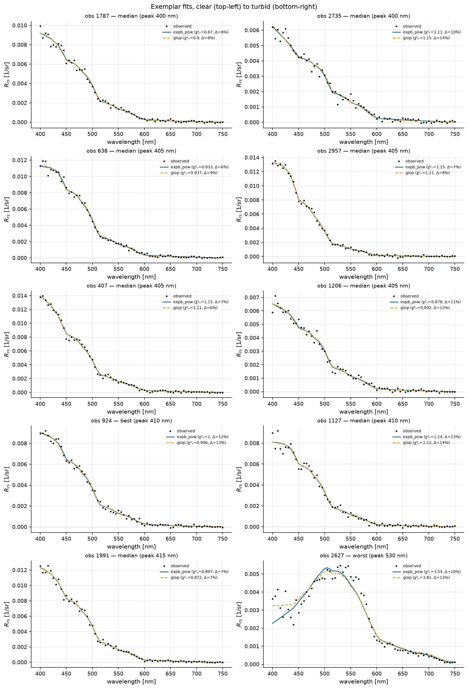

   10 exemplar fits, clear (top-left) to turbid (bottom-right). Black dots are the observed Rrs; each coloured line is one algorithm's modelled Rrs, its legend entry carrying that fit's own χ²ᵥ and relative misfit.

The exemplars
-------------

**What these 10 fits are.** All 10 sit at or below the χ²ᵥ = 5 solution threshold. 5 sit *below* χ²ᵥ = 1, i.e. over-fit relative to the assumed noise. Recorded fit status across these observations and algorithms: ``ok`` 20.

.. list-table:: The exemplar observations, clear → turbid
   :header-rows: 1
   :widths: auto

   * - obs_id
     - role
     - χ²ᵥ (median)
     - rel. misfit
     - Rrs peak [nm]
   * - ``1787``
     - median
     - 0.885
     - 8%
     - 400
   * - ``2735``
     - median
     - 1.13
     - 12%
     - 400
   * - ``638``
     - median
     - 0.885
     - 7%
     - 405
   * - ``2957``
     - median
     - 1.13
     - 7%
     - 405
   * - ``407``
     - median
     - 1.13
     - 6%
     - 405
   * - ``1206``
     - median
     - 0.885
     - 12%
     - 405
   * - ``924``
     - best
     - 1
     - 13%
     - 410
   * - ``1127``
     - median
     - 1.13
     - 14%
     - 410
   * - ``1991``
     - median
     - 0.885
     - 7%
     - 415
   * - ``2627``
     - worst
     - 3.67
     - 11%
     - 530

Rrs closure — best fit (obs 924)
--------------------------------

Closure residuals for the same fit as above, which is the view that shows *where* in the spectrum the model fails rather than by how much overall: a residual that is flat but offset is a different fault from one that swings sign across the green.

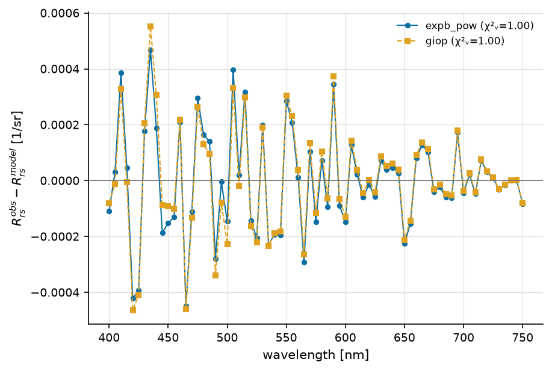

   ``Rrs_obs − Rrs_model`` for observation ``924``, per algorithm, with each algorithm's χ²ᵥ in the legend.

Rrs closure — worst fit (obs 2627)
----------------------------------

Closure residuals for the same fit as above, which is the view that shows *where* in the spectrum the model fails rather than by how much overall: a residual that is flat but offset is a different fault from one that swings sign across the green.

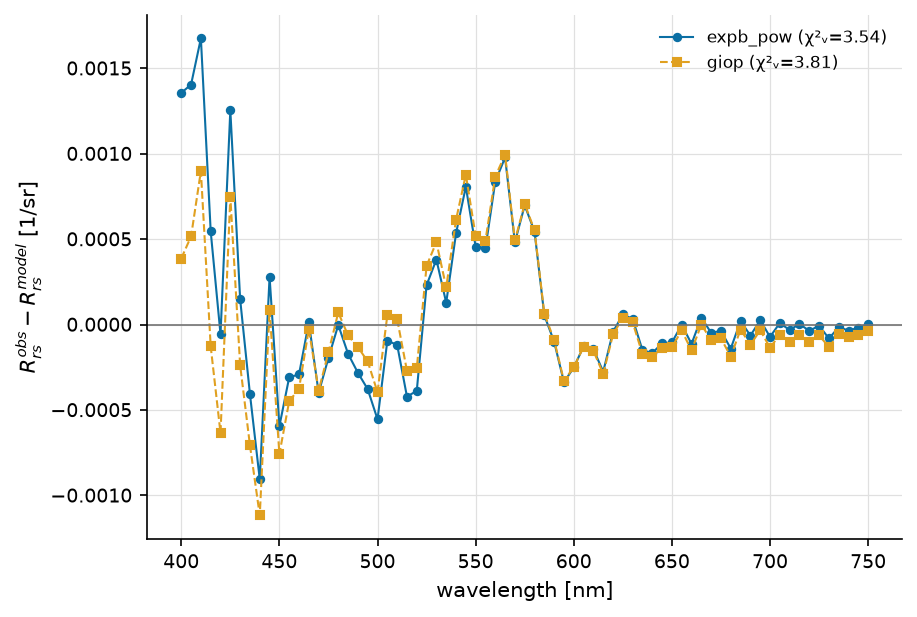

   ``Rrs_obs − Rrs_model`` for observation ``2627``, per algorithm, with each algorithm's χ²ᵥ in the legend.

Posterior corner plots
----------------------

For the MCMC subset only. A corner plot is the one figure that shows whether a parameter is *constrained* or merely *fitted*: a banana-shaped joint posterior means the two parameters trade off and neither is individually determined, which a χ² fit reports as a confident number with a small error bar.

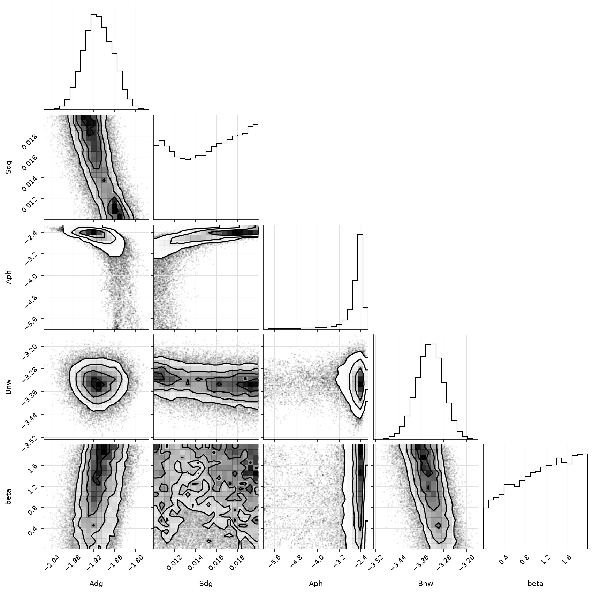

   Marginal and joint posteriors for one MCMC fit.

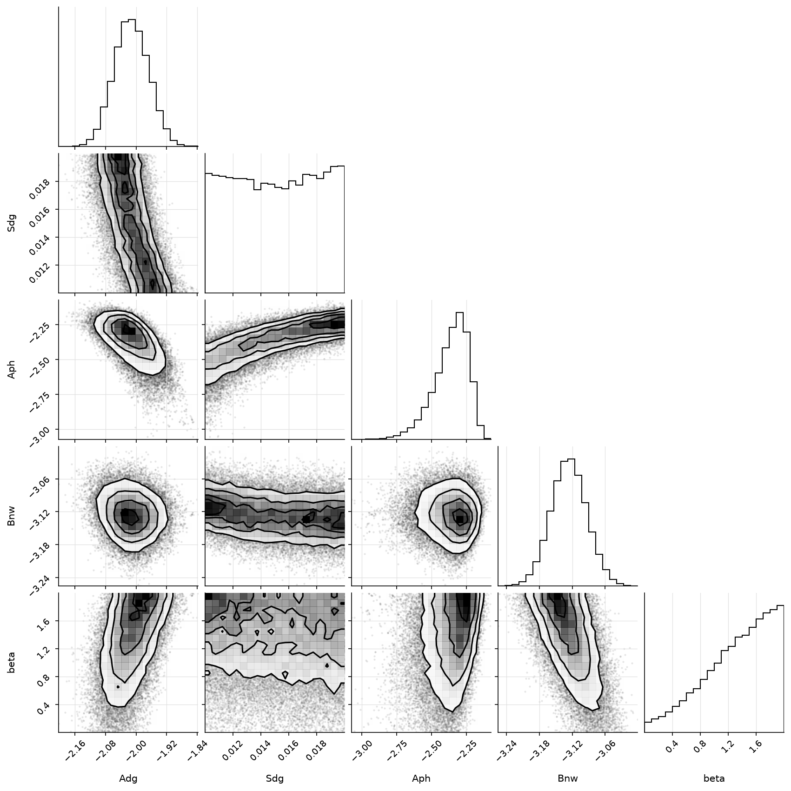

   Marginal and joint posteriors for one MCMC fit.

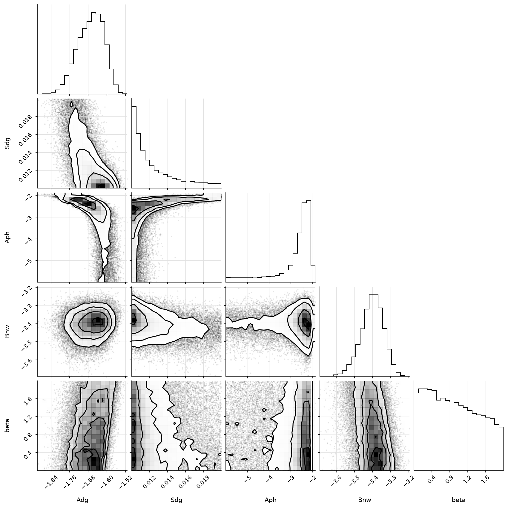

   Marginal and joint posteriors for one MCMC fit.

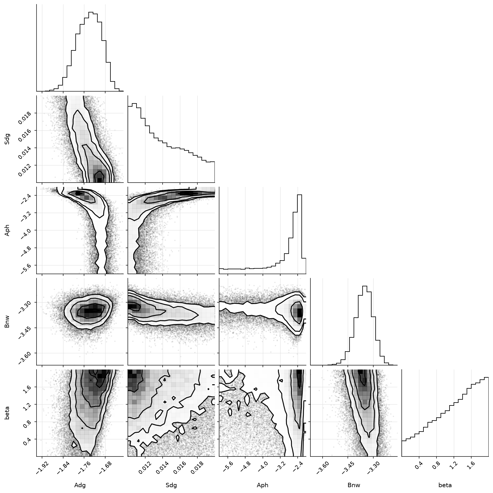

   Marginal and joint posteriors for one MCMC fit.

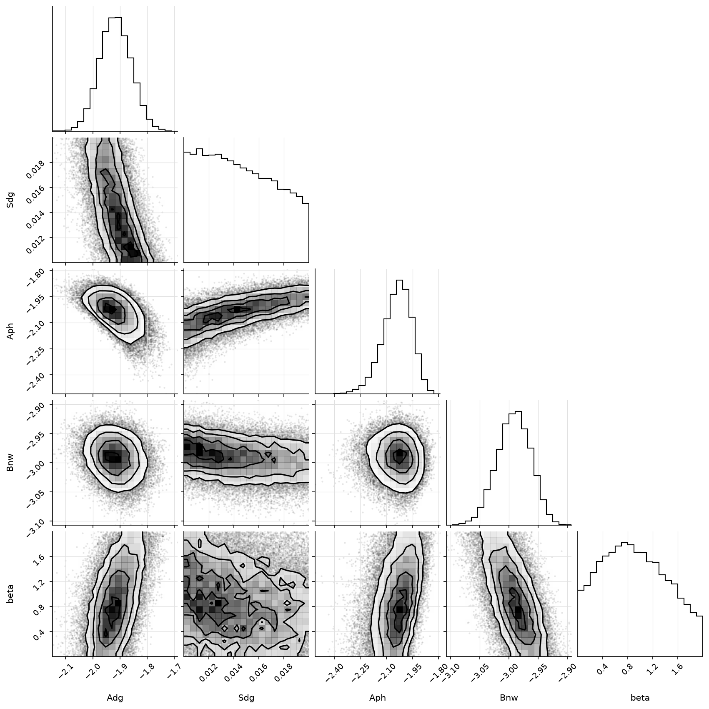

   Marginal and joint posteriors for one MCMC fit.

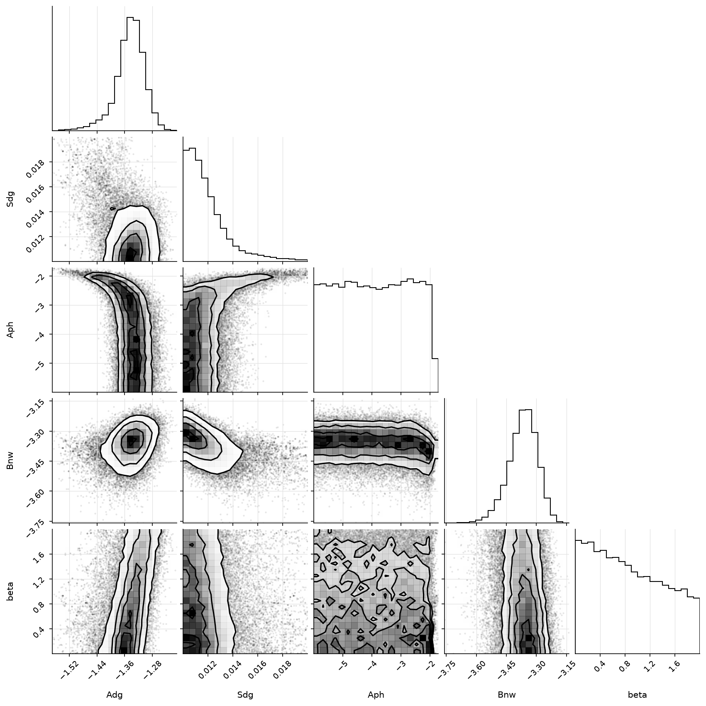

   Marginal and joint posteriors for one MCMC fit.

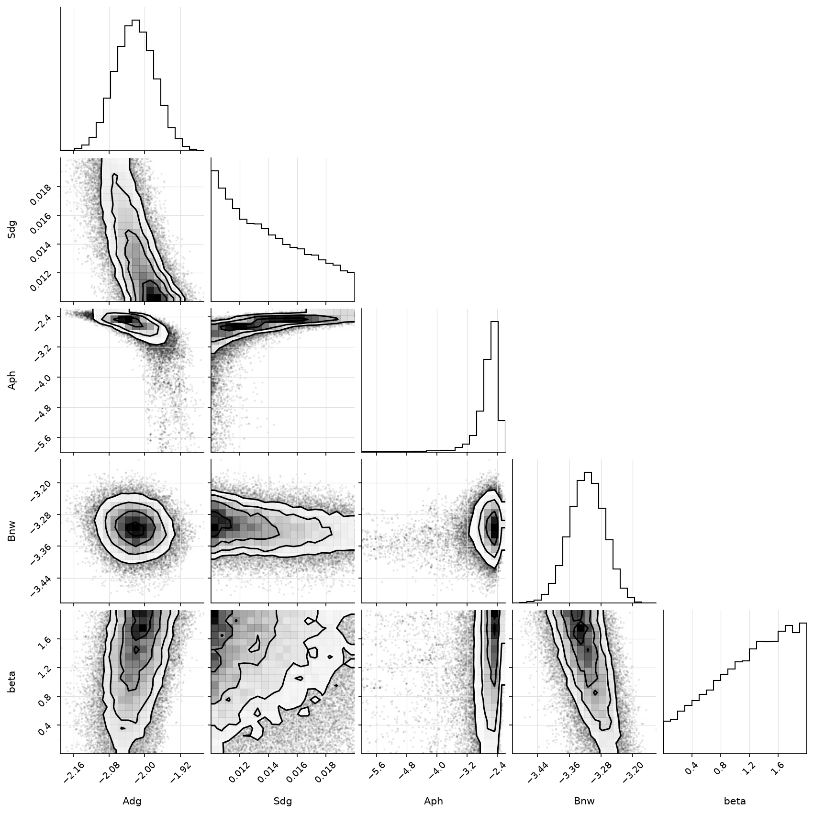

   Marginal and joint posteriors for one MCMC fit.

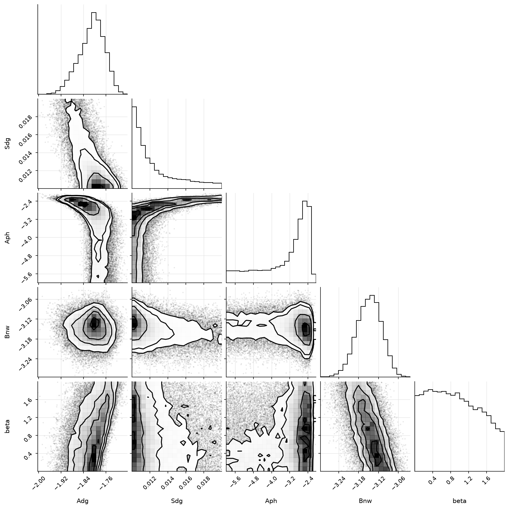

   Marginal and joint posteriors for one MCMC fit.
