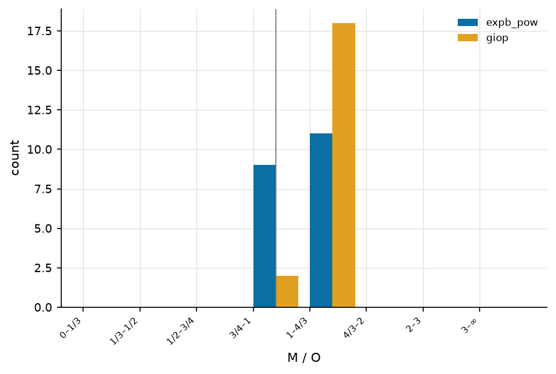
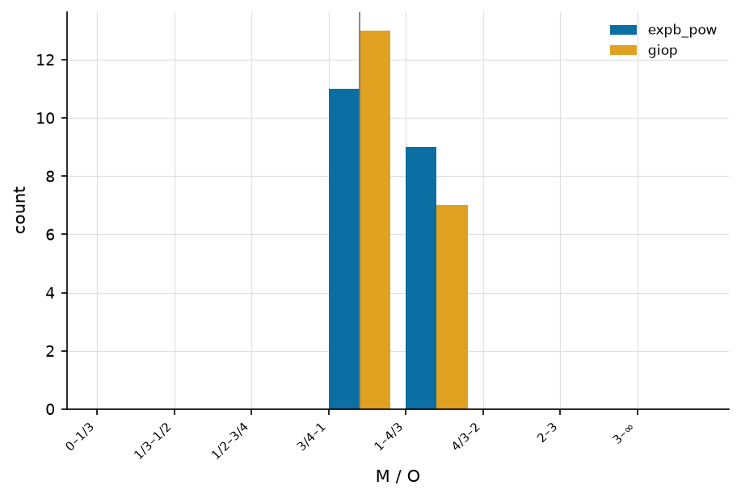
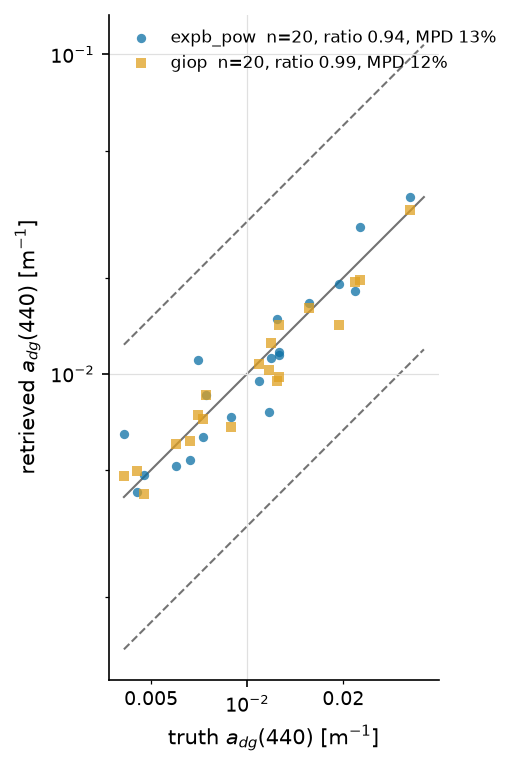
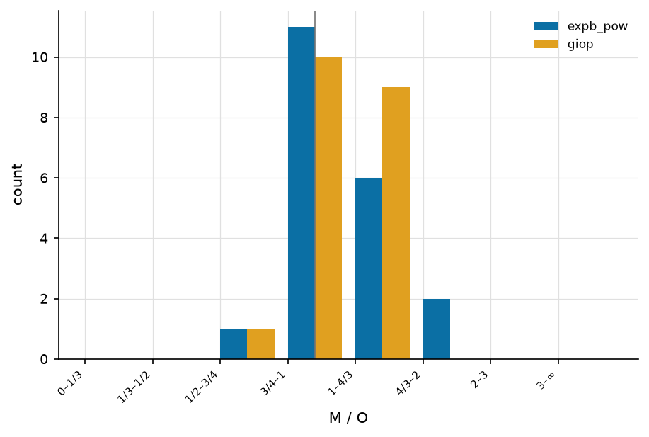
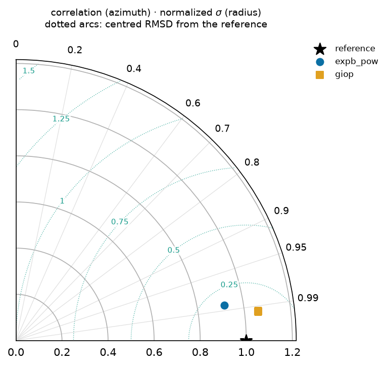
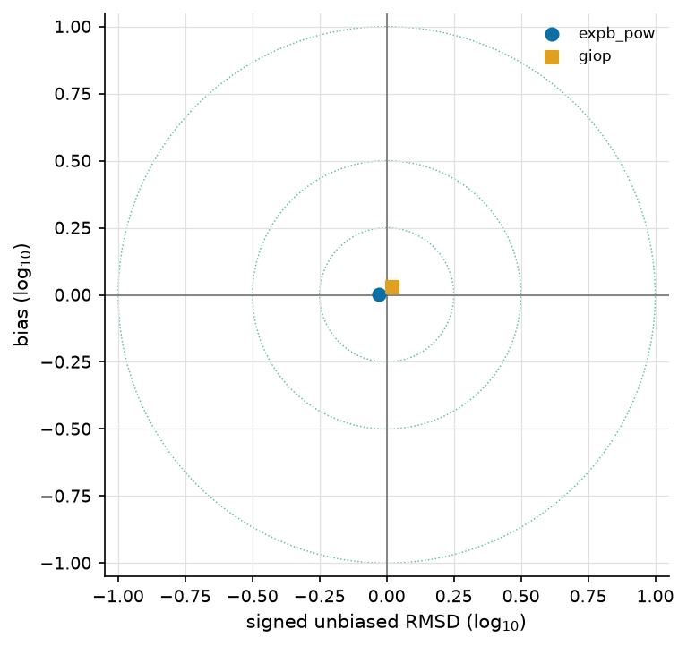
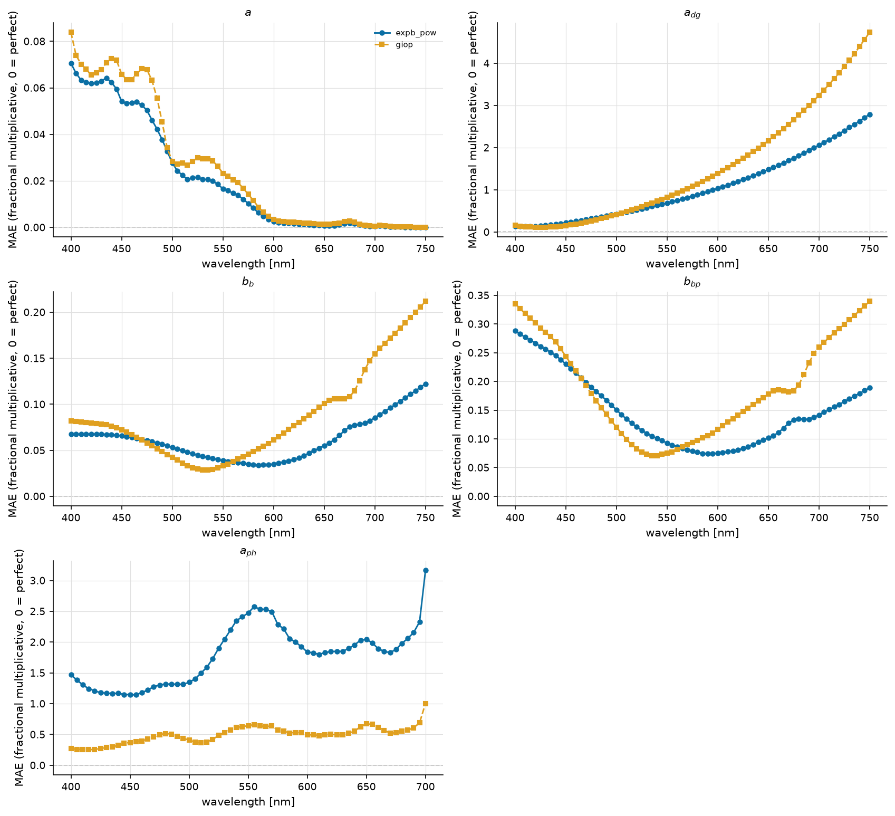
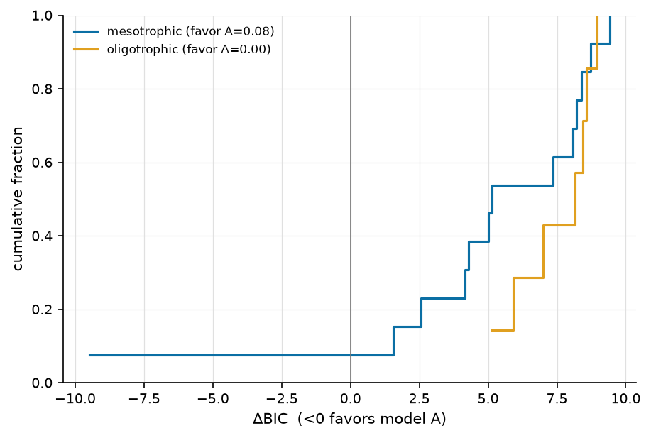

=================================================
Cross-algorithm comparison — expb_giop_L23_test20
=================================================

:Sweep: expb_giop_L23_test20
:Generated: 2026-08-07T22:02:34Z
:ioptics: 0.0.dev0@61c83e0
:bing: 0.0.dev0@f242b0e
:ocpy: 0.1.0@3aed28a
:design_doc: 0.16
:implementation_doc: 0.23

Overview
--------

This is the **Cross-algorithm comparison** for sweep ``expb_giop_L23_test20`` — a uniform comparison of the IOP-retrieval algorithms ``expb_pow``, ``giop`` on L23. Each algorithm inverts the observed remote-sensing reflectance :math:`R_{rs}(\lambda)` for the inherent optical properties (absorption :math:`a`, backscatter :math:`b_b`, and their phytoplankton / CDOM-detritus / particulate components), and the retrieval is scored against the dataset's truth. The figures and tables below show **retrieval accuracy vs. truth**, **fit quality / closure**, and **model selection** between the algorithms; the interactive scatter lets you drill into any component or trophic stratum. See :doc:`/models` for what each algorithm parameterizes and :doc:`/datasets` for the data + truth. The header above stamps the exact code + config versions, so every number is reproducible from the persisted sweep artifacts.

**Reading the numbers.** ``mae`` and ``bias`` are **fractional multiplicative** errors in log space, following Erickson (2023): :math:`\mathrm{mae} = 10^{\langle|\log_{10} M/O|\rangle} - 1`, so **0 = perfect** and ``0.109`` means 10.9% (Seegers 2018 publishes the un-subtracted factor, ``1.109``, for the same fit — the forms differ by one). ``bias`` is signed, > 0 = over-estimate. The other columns have **different** perfect values, which is why they are read separately: ``median_ratio`` and GIOP's ``Ratio`` are perfect at **1**; ``win_frac`` is a head-to-head share, so **0.5 = a tie**; and ``coverage68`` / ``coverage95`` are perfect at their **nominal 0.68 / 0.95** — an algorithm can be the most accurate and still be over-confident about its uncertainty, which the ``*_verdict`` columns name (``over-confident`` / ``consistent`` / ``conservative``; *consistent* means not distinguishable from nominal at this ``n_pairs``, which on a thin contest is a weak statement). Three different denominators appear and are named apart: ``n_pairs`` (surviving retrieval-truth pairs), ``n_scored`` (spectra that produced a usable fit) and ``n_attempted`` (spectra the sweep tried).

Retrieved vs. true — a(440)
---------------------------

Retrieved vs. true **a(440)**, one point per observation and algorithm on log–log axes. Points on the solid **1:1** line are perfect; the dashed **3:1** and **1:3** guides mark the ±3× envelope. Each legend entry carries that algorithm's own ``n_pairs``, its median ratio (1 = perfect) and MPD (median absolute percent difference, 0 = perfect), so the panel can be read without the table below.

.. figure:: scatter_a_440.png
   :width: 90%
   :alt: a(440), all algorithms — at most 20 retrieval-truth pairs per algorithm; each legend entry states its own.

   a(440), all algorithms — at most 20 retrieval-truth pairs per algorithm; each legend entry states its own.

Ratio distribution — a(440)
---------------------------

How the population is distributed about 1:1, per accuracy bucket — the companion a scatter is conventionally paired with (GIOP Figs. 1-2), because central tendency alone hides the spread that decides whether a retrieval is usable. The vertical rule marks ratio = 1.

   Retrieved/true ratio buckets for a(440).

Retrieved vs. true — bb(555)
----------------------------

Retrieved vs. true **bb(555)**, one point per observation and algorithm on log–log axes. Points on the solid **1:1** line are perfect; the dashed **3:1** and **1:3** guides mark the ±3× envelope. Each legend entry carries that algorithm's own ``n_pairs``, its median ratio (1 = perfect) and MPD (median absolute percent difference, 0 = perfect), so the panel can be read without the table below.

.. figure:: scatter_bb_555.png
   :width: 90%
   :alt: bb(555), all algorithms — at most 20 retrieval-truth pairs per algorithm; each legend entry states its own.

   bb(555), all algorithms — at most 20 retrieval-truth pairs per algorithm; each legend entry states its own.

Ratio distribution — bb(555)
----------------------------

How the population is distributed about 1:1, per accuracy bucket — the companion a scatter is conventionally paired with (GIOP Figs. 1-2), because central tendency alone hides the spread that decides whether a retrieval is usable. The vertical rule marks ratio = 1.

   Retrieved/true ratio buckets for bb(555).

Retrieved vs. true — a_dg(440)
------------------------------

Retrieved vs. true **a_dg(440)**, one point per observation and algorithm on log–log axes. Points on the solid **1:1** line are perfect; the dashed **3:1** and **1:3** guides mark the ±3× envelope. Each legend entry carries that algorithm's own ``n_pairs``, its median ratio (1 = perfect) and MPD (median absolute percent difference, 0 = perfect), so the panel can be read without the table below.

   a_dg(440), all algorithms — at most 20 retrieval-truth pairs per algorithm; each legend entry states its own.

Ratio distribution — a_dg(440)
------------------------------

How the population is distributed about 1:1, per accuracy bucket — the companion a scatter is conventionally paired with (GIOP Figs. 1-2), because central tendency alone hides the spread that decides whether a retrieval is usable. The vertical rule marks ratio = 1.

   Retrieved/true ratio buckets for a_dg(440).

Taylor & Target — a(440)
------------------------

**Taylor** (first) and **Target** (second) diagrams for :math:`a(440)`, computed in log space and drawn for the sweep's best-covered component. The Taylor diagram places each algorithm by its correlation with truth (azimuth, labelled in correlation) and normalized standard deviation (radius); the reference star sits at correlation 1, norm-σ 1, and the dotted arcs are centred-RMSD contours about it. The Target diagram plots bias (y) against the sign-carrying unbiased RMSD (x), with dotted constant-RMSD rings — the closer to the origin, the better.

   Taylor diagram — a(440): correlation (azimuth) vs normalized standard deviation (radius), with centred-RMSD arcs about the reference star.

   Target diagram — a(440): bias vs signed unbiased RMSD, with constant-RMSD rings; the origin is a perfect retrieval.

Model selection (ΔBIC)
----------------------

Cumulative distribution of **ΔBIC** per spectrum for this sweep's complexity contest — ``expb_pow`` (k=5) against ``giop`` (k=3), chosen as its highest- and lowest-parameter algorithms. ΔBIC < 0 favours the more complex model ``expb_pow``; ΔBIC > 0 favours the parsimonious ``giop``. The curve shows what fraction of spectra fall either side — i.e. whether the extra parameters earn their keep. See :doc:`/models`.

.. figure:: dbic_cdf_expb_pow_vs_giop.png
   :width: 90%
   :alt: Per-spectrum ΔBIC, ``expb_pow`` vs ``giop``: the fraction of spectra either side of 0 says whether the extra parameters earn their keep.

   Per-spectrum ΔBIC, ``expb_pow`` vs ``giop``: the fraction of spectra either side of 0 says whether the extra parameters earn their keep.

Accuracy vs. wavelength — L23
-----------------------------

How each algorithm's error varies **across the spectrum** on **L23**, for the 5 component(s) scored at 5 or more bands (``a``, ``a_dg``, ``bb``, ``bb_p``, ``a_ph``; up to 71 bands). A retrieval can be accurate in the blue and useless in the red, which a single reference-band number cannot show — this is the per-band view of the same ``mae`` the accuracy table reports at its reference wavelengths. Each algorithm keeps its colour, marker and linestyle from every other figure. Datasets are drawn separately: their band sets and sample sizes differ, so one line through both would show a sparse dataset's bands as spectral structure.

   Fractional multiplicative MAE against wavelength on L23, one panel per component, all algorithms overlaid. The dashed rule is the perfect value (0).

Per trophic stratum
-------------------

Observations are binned by chlorophyll into oligotrophic / mesotrophic / eutrophic (<0.1, <1, ≥1 mg m⁻³), preferring truth Chl over retrieved. This sweep resolves ``mesotrophic`` (n_attempted 13), ``oligotrophic`` (n_attempted 7). Every table above pools these together, and pooling is what hides a regime change — an algorithm can be usable in one trophic state and not in the next, which is the whole question for a coastal dataset.

Accuracy — mesotrophic
----------------------

The same accuracy columns as the pooled table, over the ``mesotrophic`` stratum alone — at most 13 retrieval-truth pair(s), from 13 attempted spectra. Columns are defined on the :doc:`/reports/glossary` page.

.. csv-table:: Ref-band accuracy, mesotrophic only.
   :file: accuracy_chisq_mesotrophic.csv
   :header-rows: 1
   :widths: auto

Quality control — mesotrophic
-----------------------------

Retrieval success within ``mesotrophic``. ``frac_ok`` and ``frac_not_ok`` are complements over this stratum's 13 attempted spectra, so they can be read directly against the other strata.

.. csv-table:: Fit quality / closure, mesotrophic only.
   :file: qc_chisq_mesotrophic.csv
   :header-rows: 1
   :widths: auto

Accuracy — oligotrophic
-----------------------

The same accuracy columns as the pooled table, over the ``oligotrophic`` stratum alone — at most 7 retrieval-truth pair(s), from 7 attempted spectra. Columns are defined on the :doc:`/reports/glossary` page.

.. csv-table:: Ref-band accuracy, oligotrophic only.
   :file: accuracy_chisq_oligotrophic.csv
   :header-rows: 1
   :widths: auto

Quality control — oligotrophic
------------------------------

Retrieval success within ``oligotrophic``. ``frac_ok`` and ``frac_not_ok`` are complements over this stratum's 7 attempted spectra, so they can be read directly against the other strata.

.. csv-table:: Fit quality / closure, oligotrophic only.
   :file: qc_chisq_oligotrophic.csv
   :header-rows: 1
   :widths: auto

Model selection by stratum (ΔBIC)
---------------------------------

The same contest as above, split by trophic stratum. ΔBIC < 0 favours the more complex ``expb_pow``. A pooled curve can hide a reversal — extra parameters that pay in turbid water and cost in clear water average out to "no difference".

   Per-spectrum ΔBIC, ``expb_pow`` vs ``giop``, one curve per trophic stratum.

Least-squares vs MCMC
---------------------

For the contests present under **both** fit methods. ``d_mae`` is ``mae(mcmc) − mae(chisq)``, so negative means the sampler is more accurate. The columns worth reading first are the **coverage** pair: χ² reports the curvature of the likelihood at a single point while MCMC samples the posterior, so the question is not only which is more accurate but whether the sampler's wider intervals are also the more honest ones — a coverage nearer the nominal 0.68 / 0.95.

.. csv-table:: The same contests fitted both ways.
   :file: fit_method_compare_all.csv
   :header-rows: 1
   :widths: auto

Accuracy
--------

Per-(dataset, component, reference wavelength) retrieval accuracy for the χ² population: fractional multiplicative **mae**/**bias** (0 = perfect, ``mae`` 0.1 ≈ 10%), **median_ratio** (1 = perfect), **coverage68/95** against their nominal 0.68/0.95 with a ``*_verdict`` of over-confident / consistent / conservative (a real miss being more than 2 binomial standard errors; at small ``n_pairs`` only a gross miss is detectable, so *consistent* means "not distinguishable from nominal here", not "calibrated"), the cross-algorithm ranks (``*_rank``, 1 = best) and the head-to-head **win_frac** (0.5 = tie). ``n_pairs`` counts surviving retrieval-truth pairs; ``ref_match`` is the native band actually used (±3 nm). Every column is defined on the :doc:`/reports/glossary` page.

.. csv-table:: Ref-band accuracy + wins (χ², all strata).
   :file: accuracy_chisq_all.csv
   :header-rows: 1
   :widths: auto

Head-to-head
------------

Every algorithm pair, judged on the spectra **both** of them retrieved. ``delta_mae`` is ``mae(A) − mae(B)`` on those shared spectra (negative favours A) and ``d_lo``/``d_hi`` are its paired-bootstrap 95% interval, after the round-robin practice of resampling the data to put uncertainty on a ranking. The ``verdict`` names a winner only when the interval excludes 0 **and** the difference clears a practical floor of 10%. It reads ``indistinguishable`` only when the **whole interval** lies inside that floor — i.e. the data rule a material difference out — and ``underpowered`` when the interval is too wide to say either way at this ``n_paired``. Here 5 pair(s) are indistinguishable and 5 are underpowered, out of 10.

.. csv-table:: Pairwise verdicts (χ², all strata).
   :file: head_to_head_chisq_all.csv
   :header-rows: 1
   :widths: auto

Quality control
---------------

Fit-quality summary per dataset and algorithm. ``n_attempted`` is what the sweep tried and ``n_scored`` what produced a usable fit — the gap is explained by the per-status fractions, which are kept apart on purpose: ``frac_out_of_scope`` (spectrum outside the model family's regime) and ``frac_fit_failed`` (the fitter returned nothing) are the same ``frac_not_ok`` and entirely different findings. Also the median reduced **χ²ᵥ**, the noise-model-free **rel_misfit** (GIOP's ΔRrs), and the χ²ᵥ closure split (``frac_good`` ≈ 1, ``frac_overfit`` < 1, ``frac_underfit`` > 1, ``frac_qc_fail`` = non-solutions).

.. csv-table:: Fit quality / closure (χ²).
   :file: qc_chisq_all.csv
   :header-rows: 1
   :widths: auto

Interactive
-----------

Retrieved vs. true, **interactive**: pick the dataset, algorithm, component and trophic stratum, and hover any point for its ``obs_id``, wavelength and values — so an outlier can be traced back to a spectrum. The figure title states what fraction of the population is plotted (the cloud is downsampled to keep the page small; the static panels above summarize all of it).

.. raw:: html

   
   
   

   <script>
   (function() {
     const fn = function() {
       Bokeh.safely(function() {
         (function(root) {
           function embed_document(root) {
           const docs_json = '{"db5e287f-408b-4c2a-a550-9814e3a60f89":{"version":"3.9.1","title":"Bokeh Application","config":{"type":"object","name":"DocumentConfig","id":"p1068","attributes":{"notifications":{"type":"object","name":"Notifications","id":"p1069"}}},"roots":[{"type":"object","name":"Column","id":"p1067","attributes":{"children":[{"type":"object","name":"Select","id":"p1062","attributes":{"js_property_callbacks":{"type":"map","entries":[["change:value",[{"type":"object","name":"CustomJS","id":"p1066","attributes":{"args":{"type":"map","entries":[["full",{"type":"object","name":"ColumnDataSource","id":"p1006","attributes":{"selected":{"type":"object","name":"Selection","id":"p1007","attributes":{"indices":[],"line_indices":[]}},"selection_policy":{"type":"object","name":"UnionRenderers","id":"p1008"},"data":{"type":"map","entries":[["x",[0.0013889999827370048,0.007822000421583652,0.0012260000221431255,0.0020840000361204147,0.001110199955292046,0.0008406600099988282,0.020260000601410866,0.0005440000095404685,0.0008362000226043165,0.22325000166893005,0.0022140000946819782,0.006895000115036964,0.0026245000772178173,0.002994700102135539,0.0005224000196903944,2.8501999378204346,0.005692000035196543,0.005636000074446201,0.0013895999873057008,0.0009410000056959689,0.31817999482154846,0.0024153999984264374,0.032611001282930374,0.0014340999769046903,0.002336899982765317,0.0003570700064301491,0.008987000212073326,2.7802999019622803,0.004406999796628952,0.0006311699980869889,0.000506000011228025,0.0004178000090178102,0.0033201000187546015,0.0005949999904260039,0.003593000117689371,0.0005390000296756625,0.001408900017850101,0.2925199866294861,0.01375299971550703,0.0006453900132328272,0.001680999994277954,0.0008037699735723436,0.0030410001054406166,0.0014662999892607331,1.007599949836731,0.0007871499983593822,0.0006160000339150429,0.0013137999922037125,0.0005200000014156103,0.005018000025302172,0.0020699999295175076,0.0026432001031935215,0.0011172000085934997,0.00046900002053007483,0.003690799931064248,0.0602790005505085,0.019089000299572945,0.005683000199496746,0.005249999929219484,0.000302400003420189,0.0007880000048317015,0.025989999994635582,0.000375000003259629,0.000743269978556782,0.0007773599936626852,0.0026030000299215317,0.0002410000015515834,0.025467999279499054,0.17017999291419983,0.0007299999706447124,0.002589999930933118,0.019365999847650528,0.003664500080049038,0.0008461300167255104,0.006048000417649746,0.6251299977302551,0.0007894900045357645,0.0014010999584570527,0.22352999448776245,0.0014365999959409237,0.0008871899917721748,0.0021148999221622944,0.0004940999788232148,0.0016298999544233084,0.0032709999941289425,0.0009729999583214521,0.039473000913858414,0.4302000105381012,0.0031783999875187874,0.0006147599779069424,0.0030920999124646187,0.04634600132703781,0.002025000052526593,0.0007728699711151421,0.0002957399992737919,0.0006045200279913843,0.0038769999518990517,0.007822000421583652,0.26899999380111694,0.0009410000056959689,0.0012659999774768949,0.00036217999877408147,0.0018050000071525574,0.0020012001041322947,0.0044450000859797,0.0032099999953061342,0.023364000022411346,0.0008876299834810197,0.00533400010317564,0.013251999393105507,0.0037734999787062407,0.001069999998435378,0.0009250000002793968,0.00367900007404387,0.0003776199882850051,0.014055999927222729,0.0010710599599406123,0.054924000054597855,0.0004909000126644969,0.006238000001758337,0.0027000000700354576,0.0005929999751970172,0.27807000279426575,0.0002579999854788184,0.0007070000283420086,0.001240900019183755,0.0009469999931752682,0.003548600012436509,0.0010516999755054712,0.8273800015449524,0.003378999885171652,0.0013470000121742487,0.00034662001417018473,0.0008159999852068722,0.0003209999995306134,0.0006883899914100766,1.0074000358581543,0.029159000143408775,0.0007507699774578214,0.0010653999634087086,0.016023999080061913,0.06417900323867798,0.0009799300460144877,0.0007826299988664687,0.001319000031799078,0.00044070000876672566,0.0020983999129384756,0.0038169999606907368,0.020545000210404396,0.002001000102609396,0.000446999998530373,0.0018370000179857016,1.4891999959945679,0.022401999682188034,0.0020403999369591475,0.0016540000215172768,0.0020570000633597374,0.0032784000504761934,0.021716000512242317,0.001373999984934926,0.0009600999765098095,0.000446999998530373,0.2709200084209442,0.001069999998435378,0.001841000048443675,0.024400999769568443,0.0004601299879141152,0.0071669998578727245,0.0004670000053010881,0.001072990009561181,0.002956999931484461,0.0822720006108284,0.0004601299879141152,0.0008508500177413225,0.001970600103959441,0.02000500075519085,0.0019660000689327717,0.0030467999167740345,0.0003150000120513141,0.00760400015860796,0.0011958000250160694,0.0007659199764020741,0.0005814000032842159,0.22378000617027283,0.019675999879837036,0.0026851999573409557,0.0006221799994818866,0.0005450000171549618,0.0011810000287368894,0.0002209999947808683,0.0006079999729990959,0.08812499791383743,0.0027340000960975885,0.0037839000578969717,0.2936300039291382,0.0003380000125616789,0.0016298999544233084,0.0011319000041112304,0.06269899755716324,0.001518900040537119,0.0007826000219210982,0.047922998666763306,0.31373000144958496,0.015967000275850296,0.039994001388549805,0.020648999139666557,0.0009576600277796388,0.00025599999935366213,2.850100040435791,0.001244999933987856,0.0009595999727025628,0.015659000724554062,0.1135300025343895,0.0008753099828027189,0.00044115999480709434,0.009433000348508358,0.0005176999839022756,2.8303000926971436,0.0004914000164717436,0.0004593599878717214,0.0008989999769255519,2.5100998878479004,0.07096099853515625,0.0009120000177063048,1.9701999425888062,0.001145099988207221,0.0010430000256747007,0.005022000055760145,0.0006001400179229677,0.29137998819351196,0.017250999808311462,0.5594099760055542,0.001660000067204237,0.0003394699888303876,0.0017453000182285905,0.0012538000009953976,0.002632899908348918,0.00016900000628083944,0.0039041999261826277,0.0025790000800043344,0.003014999907463789,1.0092999935150146,0.000618399993982166,0.044234998524188995,0.003014999907463789,1.0073000192642212,0.011711999773979187,0.03688900172710419,0.0026851999573409557,0.0008146900217980146,0.06790000200271606,0.2854200005531311,0.004557000007480383,0.009151999838650227,0.00022899999748915434,0.0008689999813213944,0.0004407299857120961,0.0280619990080595,0.001057000015862286,0.003010000102221966,0.0027409999165683985,0.0028556000906974077,0.005348999984562397,0.005927000194787979,0.0009580000187270343,0.001825000043027103,0.034898001700639725,0.0002479999966453761,0.0014319999609142542,0.0006504000048153102,0.0015559999737888575,0.0017956000519916415,0.0005939999828115106,0.2651900053024292,0.0012538000009953976,0.0011066000442951918,0.0005538500263355672,0.22462999820709229,0.0012164999498054385,0.0010489999549463391,0.0024500000290572643,0.0030339998193085194,0.07520800083875656,0.005007000174373388,0.0037839000578969717,1.007599949836731,0.0015480000292882323,0.0015876999823376536,0.09121300280094147,0.0009720799862407148,0.00012000000424450263,0.011165999807417393,0.001171999960206449,0.0012740000383928418,0.00019999999494757503,0.0009104000055231154,0.00016500000492669642,0.0007837099838070571,0.008767999708652496,0.0010222600540146232,0.22462999820709229,0.0012112000258639455,0.0008689999813213944,0.001563000027090311,0.0016060000052675605,0.0027179999742656946,0.000424619996920228,0.0676330029964447,0.001487000030465424,0.04852600023150444,0.0004843400092795491,0.00039026999729685485,0.0008720000041648746,0.001015600049868226,0.00024999998277053237,0.6253799796104431,0.0004268400080036372,0.014661000110208988,0.0005176999839022756,0.0003420000139158219,0.003224099986255169,0.015298000536859035,0.029020000249147415,0.0012164999498054385,0.0008617999847047031,0.003237999975681305,0.0003210499999113381,0.0007910000276751816,0.06737499684095383,0.0003552399866748601,0.0009399299742653966,0.00034435000270605087,0.019193999469280243,0.0006681599770672619,0.02594899944961071,0.035356998443603516,0.001832999987527728,0.0010188999585807323,0.001159899984486401,0.001011700020171702,0.0018129999516531825,0.054924000054597855,0.03176200017333031,0.0032927999272942543,0.001164000015705824,0.0006670000148005784,0.0031719000544399023,0.017210999503731728,0.001883000019006431,0.026179999113082886,0.0013684999430552125,0.0010958999628201127,0.001639000023715198,0.004614000208675861,0.25905001163482666,0.0005133000086061656,1.9701000452041626,0.0002280000044265762,0.0018913999665528536,0.003851999994367361,0.0012260000221431255,0.0007075199973769486,0.0019314000383019447,0.0005650799721479416,0.0012280000373721123,0.28648000955581665,0.0011239999439567327,0.0011769999982789159,0.008472000248730183,0.0015209399862214923,0.004815999884158373,0.000705829996149987,0.0014639999717473984,0.007822000421583652,0.0025613000616431236,0.0031296000815927982,0.0005949999904260039,0.0002839599910657853,0.0032270001247525215,0.0014948999742045999,0.00015100000018719584,0.0013219000538811088,2.780600070953369,0.003237999975681305,0.0028697000816464424,0.0004195100045762956,0.001551999943330884,0.0018164999783039093,0.000533799990080297,0.00022899999748915434,0.041026998311281204,0.002812999999150634,0.027103999629616737,0.27755001187324524,0.006126000080257654,0.004004800226539373,0.0537169985473156,0.001401050016283989,0.0005948300240561366,0.00020799999765586108,0.047922998666763306,0.0034179999493062496,0.0006130000110715628,0.00017600000137463212,0.0010909999255090952,0.04697800055146217,2.5104000568389893,0.00041099998634308577,0.41207000613212585,0.0010676999809220433,0.0014860000228509307,0.019700000062584877,0.0064409999176859856,0.0012899000430479646,0.0004121400124859065,0.0017549999756738544,0.0008966699824668467,0.0029690000228583813,0.025004999712109566,0.0031453000847250223,0.009151999838650227,0.0010624000569805503,0.03242700174450874,0.0045289997942745686,0.0008591299992986023,0.00723800016567111,0.0007570000016130507,0.03876899927854538,0.005570999812334776,0.018098000437021255,0.0011301999911665916,0.01064400002360344,0.0010097000049427152,0.0005132000078447163,0.008107000030577183,0.04871299862861633,0.0041680000722408295,0.0010653999634087086,0.000915149983484298,0.0018129999516531825,0.000387999985832721,0.0009230000432580709,0.004650000017136335,0.0023393998853862286,0.0007591799949295819,0.27046999335289,0.0011810000287368894,0.001622030045837164,0.002059499965980649,0.01996999979019165,0.000520800007507205,0.0017288000090047717,0.0011075000511482358,0.037039000540971756,0.0014120000414550304,0.001883000019006431,0.0046629998832941055,0.37299999594688416,0.4662399888038635,0.0010730000212788582,0.002204099902883172,0.0006016899715177715,0.0032099999953061342,0.04685400053858757,1.2312999963760376,0.0010601100511848927,0.0040060002356767654,0.003582000033929944,0.0017689999658614397,0.008472000248730183,0.00241800001822412,0.001310999970883131,0.018528999760746956,0.0017855999758467078,0.29941999912261963,0.007813000120222569,0.0008610000368207693,0.0006311699980869889,0.0032099999953061342,0.003632900072261691,0.0008699999889358878,0.0001429999974789098,0.0012978999875485897,0.004139000084251165,0.004147000145167112,0.3411700129508972,0.00521499989554286,0.09120800346136093,0.0023739999160170555,0.0015691999578848481,0.0018297999631613493,0.0011232000542804599,0.00523399980738759,0.001460899948142469,0.37198999524116516,0.00106669997330755,0.001095999963581562,0.2837199866771698,0.0002500000118743628,0.002781999995931983,0.000375000003259629,1.2312999963760376,0.00033244999940507114,0.00043618999188765883,0.00042617000872269273,0.4115599989891052,0.0006609000265598297,0.005319000221788883,0.51705002784729,0.4669100046157837,0.00044929998693987727,0.0016281000571325421,0.0007049699779599905,0.4419099986553192,0.0007773900288157165,0.06627099961042404,0.0009006600012071431,0.0030339998193085194,0.06379400193691254,0.0006537800072692335,0.022842999547719955,0.2766900062561035,0.07833400368690491,0.002104999963194132,0.002007999923080206,0.08127900213003159,0.0008549999911338091,0.4300200045108795,0.4411099851131439,0.0021442000288516283,0.0013482000213116407,0.0009796100202947855,0.0003902199969161302,0.01720000058412552,0.13850000500679016,0.0013150000013411045,0.020646000280976295,0.016423000022768974,0.0005039999959990382,0.003562099998816848,0.00046999999904073775,0.00043680000817403197,0.0005895000067539513,0.0022690000478178263,0.0015255999751389027,0.0711119994521141,0.01848600059747696,0.0008637299761176109,0.000672199996188283,0.023773999884724617,0.0007140699890442193,0.038116998970508575,0.00023299999884329736,0.07134299725294113,0.0020192000083625317,0.0008839999791234732,0.0009892600355669856,0.22356000542640686,0.0015894999960437417,0.0003868200001306832,0.0005310000269673765,0.00018600000475998968,0.05069600045681,0.02356399968266487,0.00045170000521466136,0.0015894999960437417,0.00254100002348423,0.0005447400035336614,0.00418600020930171,1.4891999959945679,0.0025023100897669792,0.0018202000064775348,0.025970999151468277,0.0005102399736642838,0.0024043999146670103,0.0006259999936446548,0.0006118600140325725,0.0005569999921135604,0.04314899817109108,0.018063999712467194,0.00220320001244545,0.00836899969726801,0.004999000113457441,0.8279100060462952,2.8301000595092773,0.0005830000154674053,1.007200002670288,0.0008256000000983477,0.0008758800104260445,0.04852600023150444,0.004152100067585707,0.0016270000487565994,0.0008393899770453572,0.0011603999882936478,0.00022400000307243317,0.018528999760746956,0.00021099999139551073,0.0637969970703125,0.001222669961862266,0.006546999793499708,0.0015539999585598707,0.0007560399826616049,0.004875000100582838,0.00048400001833215356,0.006895000115036964,0.0007590000168420374,0.0011623000027611852,0.265720009803772,0.0012404000153765082,0.0007356699788942933,0.0006125199724920094,0.44117000699043274,0.0029992000199854374,0.04496200010180473,0.0012031400110572577,0.0012021999573335052,0.0010730000212788582,0.007728999946266413,0.0010098000057041645,0.48673999309539795,0.0008950000046752393,0.019977999851107597,0.0809599980711937,0.004715200047940016,0.0014938999665901065,0.0005188999930396676,0.0008510000188834965,0.000707999977748841,0.0003741899854503572,0.00607800018042326,0.34130001068115234,0.13877999782562256,0.0047889999113976955,0.27636998891830444,0.0034650000743567944,0.0005179999861866236,0.0059710000641644,0.0006345299771055579,0.0016270000487565994,0.0008165200124494731,0.0019499999471008778,0.01633399911224842,0.3422200083732605,0.00040699998498894274,0.031883999705314636,0.019704999402165413,0.0003932699910365045,0.00039694999577477574,0.0023227001074701548,0.04799500107765198,0.001235750038176775,1.4891999959945679,0.0006557099986821413,0.00037299998803064227,0.0006016899715177715,0.0017106999875977635,0.0002690000110305846,0.0003255399933550507,0.006126000080257654,0.2863599956035614,0.0026358000468462706,0.0010636999504640698,0.11321000009775162,2.7802000045776367,0.0016580000519752502,0.00046362998546101153,0.006380000151693821,0.0004753299872390926,0.0005639999872073531,0.0009263600222766399,0.0007038000039756298,0.0003459999861661345,0.001725299982354045,0.0001990000018849969,0.0005370000144466758,0.41207000613212585,0.0013686999445781112,0.0020852000452578068,0.0001630000042496249,0.0014418000355362892,0.0007609999738633633,0.0005824299878440797,0.0015849999617785215,0.04944700002670288,0.0007014099974185228,0.0008490000036545098,0.0019199999514967203,0.0006727899890393019,0.008762000128626823,0.0013652000343427062,0.0009730000165291131,0.0014383000088855624,0.040539998561143875,0.0165570005774498,0.0005707599921151996,0.00020500000391621143,0.004403700120747089,0.0013539999490603805,0.0015790000325068831,0.006372999865561724,0.0005250999820418656,0.0031395999249070883,0.0008433500188402832,0.0026432001031935215,0.0011300999904051423,0.002591300057247281,0.001357999979518354,0.13906000554561615,0.0014946999726817012,0.003396600019186735,0.007726999931037426,0.0005316999740898609,0.0010736000258475542,0.0004653400101233274,0.0007440000190399587,0.02471799962222576,0.002957999939098954,0.0015379999531432986,0.001421299995854497,0.001034799963235855,0.001838000025600195,0.0002640000020619482,0.04871299862861633,0.0003785699955187738,0.3422200083732605,0.0031453000847250223,0.004875000100582838,0.001070300000719726,0.0023244000039994717,0.00033299997448921204,0.0013439999893307686,0.027434000745415688,0.0012417000252753496,0.00033258998882956803,0.002741999924182892,0.0007670000195503235,0.00133200001437217,0.44095999002456665,0.0018220000201836228,0.004850999917834997,0.0023227001074701548,0.014921000227332115,0.0020411000587046146,0.0008590000215917826,0.0005650799721479416,0.0019181000534445047,0.0007104999967850745,0.0012478099670261145,0.000722419994417578,0.8272799849510193,0.0012603000504896045,0.010449999943375587,0.0011232000542804599,0.0009110299870371819,0.0004230000195093453,0.06640499830245972,0.0004361500032246113,0.0003310999891255051,0.0004972100141458213,0.00037918001180514693,0.0004108599969185889,0.00027299998328089714,0.0002855400089174509,0.2690899968147278,0.0477450005710125,2.8301000595092773,0.5182200074195862,0.0009710000013001263,0.001005960046313703,0.0008623999892733991,0.0007551999879069626,0.0013439999893307686,0.004296999890357256,0.003607999999076128,0.0008300000336021185,0.00853199977427721,0.3719500005245209,0.0009902099845930934,0.001652900013141334,0.0001230000052601099,0.003616499947384,0.023437000811100006,0.00020799999765586108,0.0009050000226125121,0.000450999999884516,0.0007239999831654131,0.0009581000194884837,0.00032078000367619097,0.00030499999411404133,0.018446000292897224,1.007200002670288,0.0005549999768845737,0.005478000268340111,0.00027114999829791486,0.0010509999701753259,0.005229000002145767,0.00027600000612437725,0.029606999829411507,0.3041599988937378,0.0005872499896213412,0.0008968000183813274,0.01858999952673912,0.003971999976783991,0.22594000399112701,0.019704999402165413,0.0031019998714327812,0.4402100145816803,0.0004889999981969595,0.0003969999961555004,0.0009369999752379954,0.0024149299133569,0.0009159999899566174,0.0030908999033272266,0.25902000069618225,0.0010867000091820955,0.0010748000349849463,0.059803999960422516,0.005949200130999088,0.018990999087691307,0.0010019999463111162,0.0008750000270083547,0.06590399891138077,0.00045709998812526464,0.0007304999744519591,0.7067400217056274,0.004712999798357487,0.0009504000190645456,0.020646000280976295,0.008825000375509262,0.001120000029914081,0.006068999879062176,0.00044914998579770327,0.0012603000504896045,0.025690000504255295,0.0007639999967068434,0.008426999673247337,0.00124739995226264,0.0016284999437630177,0.0007309700013138354,0.0037666999269276857,0.0006292500183917582,0.02581300027668476,0.00015500000154133886,0.015659000724554062,0.0007499000057578087,0.00019600000814534724,0.0006540000322274864,0.0016980000073090196,0.004100999794900417,0.0010023999493569136,0.001374599989503622,1.2314000129699707,0.000387999985832721,0.0008437500218860805,0.003941699862480164,0.0014700000174343586,0.00035099999513477087,0.5174499750137329,0.024429000914096832,0.060770001262426376,0.0010736000258475542,0.0010389999952167273,0.02062699943780899,0.0009327700245194137,0.0027920000720769167,0.002878099912777543,0.0004250000056345016,0.0017466000281274319,0.00013300000864546746,0.0008362500229850411,0.4415999948978424,0.0013071999419480562,0.002818299923092127,0.000577000027988106,0.00035647000186145306,0.0038939998485147953,0.003254600102081895,0.01064400002360344,0.00521499989554286,0.0033259999472647905,0.0003549999964889139,0.03594300150871277,0.0003640000068116933,0.0010116399498656392,0.0011947000166401267,0.004555500112473965,0.037657998502254486,0.0019100001081824303,0.000582000007852912,0.0027614999562501907,0.02566099911928177,0.00279600010253489,0.004062999971210957,0.0007651000050827861,0.04435599967837334,0.007065999787300825,0.0011295999865978956,0.0023870000150054693,0.0008514000219292939,0.0012931999517604709,2.780100107192993,0.006260999944061041,0.4948999881744385,0.009232000447809696,0.0014427000423893332,0.0006801399867981672,0.09222099930047989,0.0059910002164542675,0.0004636000085156411,0.0006559999892488122,0.008741999976336956,0.5166299939155579,0.00040342999272979796,0.008861999958753586,0.7044100165367126,0.0586870014667511,0.00040702999103814363,0.011637000367045403,0.04435599967837334,0.0008650199742987752,0.0003912000101990998,0.000887869973666966,0.0008753099828027189,2.510699987411499,0.00028355998801998794,0.00033299997448921204,0.0031190000008791685,0.004248000215739012,0.003072699997574091,0.0007038000039756298,0.27678000926971436,0.0006681000231765211,0.00035600000410340726,0.0004506399855017662,0.0003389999910723418,0.04334000125527382,0.009246000088751316,0.001841000048443675,0.002706000115722418,0.05221100151538849,0.007379000075161457,2.8501999378204346,0.019700000062584877,0.0009866299806162715,0.0007284600287675858,0.0030459000263363123,0.000979500007815659,0.0009369999752379954,0.0013819999294355512,0.005009599961340427,0.0010140000376850367,0.00032699998700991273,0.0004579999949783087,0.4669800102710724,2.831399917602539,1.4891999959945679,0.004683299921452999,1.0073000192642212,0.0008327899849973619,0.0008839999791234732,0.003804400097578764,0.0011769999982789159,0.0004360000020824373,0.008107000030577183,0.000547999981790781,0.009151999838650227,0.0008696999866515398,0.001089500030502677,0.002004999900236726,0.004002999980002642,0.034898001700639725,0.001120000029914081,0.014448000118136406,0.003586800070479512,0.0005373400053940713,0.0047889999113976955,0.0008836599881760776,0.3116399943828583,0.01958400011062622,0.019554000347852707,0.005253999959677458,0.0711119994521141,0.0012021999573335052,0.0014630999648943543,0.0003912000101990998,0.03470899909734726,9.800000407267362e-05,0.0006790399784222245,0.00039599998854100704,0.0003549999964889139,0.0001740000006975606,0.0013650000328198075,0.05159499868750572,0.002812999999150634,2.850100040435791,0.0038709999062120914,0.0023407700937241316,0.0007520000217482448,0.00041412998689338565,0.049598999321460724,0.0006053699762560427,0.0005884999991394579,0.002443090081214905,0.010185999795794487,0.0002209999947808683,0.00023299999884329736,0.06662900000810623,0.0003757599915843457,0.005200000014156103,0.0004108599969185889,0.0006706999847665429,0.0009262799867428839,0.0011657000286504626,0.0008379300124943256,0.0022449998650699854,0.0004349999944679439,0.00040146999526768923,0.031077999621629715,0.0010119000216946006,0.004296000115573406,1.489300012588501,0.004569999873638153,0.0002610000083222985,0.002870999975129962,0.0022285000886768103,0.00042600001324899495,0.0139979999512434,0.02144799940288067,0.0024011998903006315,1.9702999591827393,0.0008750000270083547,0.0014880000380799174,0.0022490001283586025,0.001395300030708313,0.001586599973961711,0.0024568000808358192,0.003222699975594878,0.0017659999430179596,0.4112899899482727,0.003567999927327037,0.01765199936926365,0.0010430000256747007,0.02252800017595291,0.006546999793499708,0.0016540000215172768,0.0013940000208094716,0.0018969000084325671,0.0029366000089794397,0.00035909999860450625,0.0006810000049881637,0.000559729989618063,0.004228000063449144,0.0007140000234358013,0.0006196500035002828,0.0035550000611692667,0.0005345600075088441,0.0010351999662816525,0.0009790000040084124,0.00028355998801998794,0.004490000195801258,0.0002610000083222985,0.06363499909639359,0.0011842000531032681,0.005177999846637249,0.006429000291973352,0.0644650012254715,0.0024399999529123306,0.00238809990696609,0.0017079999670386314,0.002093000104650855,0.47005000710487366,0.0005324099911376834,0.056370001286268234,0.3024600148200989,0.0038062999956309795,0.00040146999526768923,0.010021000169217587,0.0004292399971745908,0.0013269999762997031,0.021716000512242317,0.0004309900104999542,0.11151999980211258,0.00013000000035390258,0.11321000009775162,0.00038579999818466604,0.0012785999570041895,0.0011627000058069825,0.0020095999352633953,0.001057000015862286,0.003378999885171652,0.0001610000035725534,0.26635000109672546,0.0009720799862407148,0.0005126899923197925,0.07423000037670135,0.0005949999904260039,0.001429000054486096,0.0034019998274743557,0.0411750003695488,0.006428000517189503,0.0003719500091392547,0.0009599999757483602,0.009053000248968601,0.02008499950170517,0.005495000164955854,0.0013733699452131987,0.003532199887558818,0.0015412999782711267,0.032294999808073044,0.00015900000289548188,0.0009469999931752682,0.06575000286102295,0.001521000056527555,0.005235000047832727,0.00046750999172218144,0.03228599950671196,0.0007027999963611364,0.024429000914096832,0.00016900000628083944,1.489300012588501,0.0007997599896043539,0.00041099998634308577,2.5104000568389893,0.0008720000041648746,0.003312000073492527,0.004747000057250261,0.0003580999909900129,0.08812499791383743,0.0010219999821856618,0.007356999907642603,0.56072998046875,0.0008327899849973619,0.0009960000170394778,0.0020097000524401665,0.00035600000410340726,0.0011208000360056758,0.0008521199924871325,0.0008120000129565597,0.16865000128746033,0.41837000846862793,0.07657399773597717,0.000981000019237399,0.0005000000237487257,2.5102999210357666,0.0008278900058940053,0.4111500084400177,0.004544000141322613,0.0006377000245265663,0.0021899999119341373,0.0004689999914262444,0.0013872099807485938,0.0008758800104260445,0.00032327999360859394,0.0005200000014156103,0.00031999999191612005,0.0028566999826580286,0.004624499939382076,0.0002864199923351407,0.0014944999711588025,0.026840999722480774,0.0024129999801516533,0.00338710006326437,0.0003209999995306134,0.0009089999948628247,0.001416000071913004,0.0021089999936521053,0.0024610001128166914,0.0005874899798072875,0.001615899964235723,0.27823999524116516,0.05210199952125549,0.0012029999634250998,0.00048099999548867345,0.004385000094771385,0.009727999567985535,0.0006125199724920094,0.0018219000194221735,0.0014538000104948878,0.000859999970998615,0.016134999692440033,0.32580000162124634,0.002384660067036748,0.0921889990568161,0.025078000500798225,0.015298000536859035,0.0616459995508194,0.03056900016963482,0.000590000010561198,0.0006130000110715628,0.0008430000161752105,0.0011693000560626388,0.0010349999647587538,0.0010327999480068684,0.00048426000284962356,0.0006459999713115394,0.0002209999947808683,0.0006852999795228243,0.3035300076007843,0.010373000055551529,0.3782599866390228,0.0015581999905407429,0.4886299967765808,0.0030300000216811895,0.0005026599974371493,0.0010948700364679098,0.0007750000222586095,0.0007520000217482448,0.00274679996073246,0.0003814400115516037,0.6243799924850464,2.510200023651123,0.0035550000611692667,0.02958899922668934,0.0032099999953061342,0.7044299840927124,0.005047000013291836,0.0021899600978940725,0.13956999778747559,0.0002776100009214133,0.00326410005800426,0.0033070999197661877,0.019977999851107597,0.008196000009775162,0.00042617000872269273,0.05296900123357773,0.0020409999415278435,0.0007650000043213367,0.0035472000017762184,0.0011883999686688185,0.0004689999914262444,1.0073000192642212,0.0010948700364679098,0.0009960000170394778,0.07998199760913849,0.05558599904179573,0.0012329999590292573,0.001024710014462471,0.0017170000355690718,2.850100040435791,0.004676999989897013,0.02579900063574314,1.0074000358581543,0.08102100342512131,0.0014794999733567238,0.00042699999175965786,0.0027693998999893665,0.0008570000063627958,0.0014280000468716025,0.0007773599936626852,0.0029213998932391405,0.451449990272522,0.0002460000105202198,0.004652000032365322,0.001459109946154058,0.0011654000263661146,0.0009277900098823011,0.005760000087320805,0.30226999521255493,0.0010107000125572085,0.003418999956920743,0.0037670000456273556,0.0220320001244545,0.005305000115185976,0.0006290199817158282,0.0008546700119040906,0.0021520000882446766,0.00029833000735379755,0.0016799999866634607,0.0018063000170513988,0.004002999980002642,0.003907000180333853,0.0005017099902033806,1.489300012588501,0.0004972100141458213,0.060309998691082,0.0005087999743409455,0.0009097899892367423,0.0010049999691545963,0.006690999958664179,0.0011747999815270305,0.006961999926716089,0.0006003999733366072,0.003888299921527505,0.0025019999593496323,0.003918999806046486,0.0015879999846220016,0.0004556099884212017,0.0010260000126436353,0.4426800012588501,0.0010910299606621265,0.002788000041618943,0.0004689999914262444,0.005785000044852495,0.013536999933421612,0.0006015400285832584,0.00022400000307243317,0.0011709999525919557,0.013251999393105507,0.053624000400304794,0.00056338997092098,0.001985300099477172,0.0009377999813295901,2.8308000564575195,0.0009159999899566174,0.0009169999975711107,0.006545000243932009,0.0006537800072692335,0.0007469999836757779,0.05176499858498573,0.0037175999023020267,0.559660017490387,0.0015950000379234552,0.02550400048494339,0.021900000050663948,0.002492500003427267,0.001267499988898635,0.002177000045776367,0.0016270000487565994,0.0012740000383928418,0.025004999712109566,0.0010819999733939767,0.0010435000294819474,0.26899999380111694,0.003804400097578764,0.0443819984793663,0.005410300102084875,0.43105998635292053,0.0003691400052048266,0.0006841999711468816,0.001728300005197525,0.0009599999757483602,0.029549000784754753,0.024481000378727913,0.001462399959564209,0.00011300000187475234,0.0013119999784976244,0.0005851999740116298,0.002772300038486719,0.0014058999950066209,0.005032000131905079,0.003212000010535121,0.0007510000141337514,0.45010000467300415,0.0003915599954780191,0.04809800162911415,0.0031419999431818724,0.0001340000017080456,0.002493900014087558,0.0021159998141229153,0.00026500000967644155,0.0005805700202472508,0.005133000202476978,0.04496200010180473,0.0037990000564604998,0.0029380000196397305,0.004294699989259243,0.0008909999742172658,0.012775000184774399,0.0005294000147841871,0.0003970900143031031,0.0017754000145941973,0.0005042999982833862,0.0397379994392395,0.0015849999617785215,0.008616000413894653,0.05429299920797348,0.0004959999932907522,0.001088600023649633,0.001984999980777502,0.0174189992249012,0.04314899817109108,0.0007639999967068434,0.004811100196093321,0.0011699999449774623,0.48758000135421753,0.002693000016734004,0.5594499707221985,0.0015559999737888575,0.004999000113457441,0.0017241999739781022,0.5603100061416626,0.0025840001180768013,0.005607000086456537,0.00169339997228235,0.0018370000179857016,0.0003863500023726374,0.0011228499934077263,0.0009800000116229057,0.0008441199897788465,0.031624000519514084,0.0009960000170394778,0.05221100151538849,0.026329999789595604,0.049564000219106674,0.002507199998944998,0.0003174399898853153,0.00033598998561501503,0.047410998493433,0.026978999376296997,0.0004029999836347997,0.0008021100074984133,0.0007512900047004223,0.0009139999747276306,0.002730000065639615,0.004957099910825491,0.0005179999861866236,0.0013969000428915024,0.0011060000397264957,0.32659000158309937,0.0007027999963611364,0.0006640800274908543,0.0008280699839815497,0.03760400041937828,0.4763700067996979,0.0006709399749524891,0.022905999794602394,0.0003970900143031031,0.006945000030100346,0.050925999879837036,0.003888299921527505,0.0006280000088736415,0.00028300000121816993,0.0003634000022429973,0.0004820000031031668,0.27678000926971436,0.003095699939876795,0.0016380000161007047,0.000674000009894371,0.0007665699813514948,0.0004699300043284893,0.002735000103712082,0.07996699959039688,0.0008074599900282919,0.008740999735891819,0.006020999979227781,0.04993100091814995,0.0014427000423893332,0.000965669983997941,0.0012962999753654003,0.0005742000066675246,0.0007215900113806129,0.0006405700114555657,0.019468000158667564,0.005760000087320805,0.000922099978197366,0.0036124999169260263,0.0010307000484317541,0.0004619999963324517,0.0004931400180794299,0.005258999764919281,0.000713679997716099,0.0021510000806301832,0.001145999995060265,0.0034179999493062496,0.02953599952161312,0.00027299998328089714,0.0385110005736351,0.0011449999874457717,0.11247000098228455,0.31172001361846924,0.25881001353263855,0.0013327000197023153,0.002398800104856491,0.016308000311255455,0.43070998787879944,0.021129999309778214,0.0633770003914833,0.0280619990080595,0.00048600000445730984,0.0007098300266079605,0.0013539999490603805,0.001029500039294362,2.8301000595092773,0.000672199996188283,0.00034836999839171767,0.01017799973487854,0.0007619999814778566,0.48794999718666077,0.01885100081562996,0.006881999783217907,0.03494400158524513,0.7044699788093567,0.2932699918746948,0.00038499999209307134,0.00043508000089786947,0.26985999941825867,0.018696000799536705,0.0012538000009953976,0.00444830022752285,0.0006678400095552206,0.00635699974372983,0.0067010000348091125,0.0012903399765491486,0.30324000120162964,0.4493800103664398,0.00032828000257723033,0.0061959996819496155,0.0029207998886704445,0.0018481999868527055,0.005508000031113625,0.00036115001421421766,0.001587199978530407,0.00228299992159009,0.0016020000912249088,0.0006440799916163087,1.489400029182434,0.00343999988399446,0.026945000514388084,0.0018584999488666654,0.008291000500321388,0.0001990000018849969,0.00928999949246645,0.006200999952852726,0.05514200031757355,0.037278998643159866,0.0010140000376850367,0.00032464999821968377,0.0004349999944679439,0.00036199999158270657,0.00014600000577047467,0.002314629964530468,0.0006616999744437635,0.0040060002356767654,0.0035660001449286938,0.0005255599971860647,0.03762900084257126,0.0004980000085197389,0.0005879999953322113,0.0020719999447464943,0.026945000514388084,0.0005164300091564655,0.0344959981739521,0.00457199988886714,0.02995999902486801,0.0004729999927803874,0.031929001212120056,0.0027409999165683985,0.04985300078988075,0.003068000078201294,0.004018000327050686,0.014781000092625618,2.7802000045776367,0.001570550026372075,0.0015521999448537827,0.00039465000736527145,0.0017947000451385975,0.0008329999982379377,0.0012824999867007136,0.06516300141811371,0.0011623000027611852,0.0010911000426858664,0.0018530000234022737,0.00028624001424759626,0.002208000048995018,0.004172000102698803,0.26058000326156616,0.2589400112628937,0.0009309599990956485,0.26985999941825867,0.0006709399749524891,0.0009266100241802633,0.00018600000475998968,0.0004902600194327533,0.005023099947720766,0.0047530001029372215,0.0008149999775923789,0.002354600001126528,1.0073000192642212,0.04735200107097626,0.000632970011793077,0.0005126899923197925,0.002340999897569418,0.26719000935554504,0.0033118000719696283,0.0015719999792054296,0.0006108999950811267,0.0006026899791322649,1.9703999757766724,0.0005300000193528831,0.00043255998753011227,0.0018220000201836228,0.0012031400110572577,0.0004990000161342323,0.0030034000519663095,0.0007639299728907645,0.4502300024032593,0.0007529999711550772,0.0010475299786776304,0.0034181999508291483,0.0035071999300271273,0.00020099998801015317,0.0003499999875202775,0.0007696800166741014,0.0004843400092795491,0.004207000136375427,0.001564200036227703,0.005285000428557396,0.0006229999708011746,0.000915149983484298,0.06557799875736237,0.6243699789047241,0.0002859999949578196,0.6246500015258789,0.0023314000573009253,0.0022909999825060368,0.000713679997716099,0.0027421999257057905,0.02644900046288967,0.002303499961271882,0.004108999855816364,0.0006405700114555657,0.0055740000680089,0.0037734999787062407,0.0015640000347048044,0.0010475299786776304,0.5601599812507629,0.01647699996829033,0.0016449999529868364,0.0051760002970695496,0.0005076000234112144,0.0003271400055382401,0.13749000430107117,0.02122100070118904,0.0011350000277161598,0.0006339999963529408,0.30382001399993896,0.0015150000108405948,0.01968200132250786,0.0017079999670386314,0.0006572700222022831,0.00076299998909235,0.0016968999989330769,0.8273599743843079,0.00034199998481199145,0.0003046699857804924,0.002394899958744645,0.0003898699942510575,0.004488800186663866,0.09143699705600739,0.00029799999902024865,0.017338000237941742,0.0002469999890308827,0.0006578799802809954,0.003978100139647722,0.006446000188589096,0.00133500003721565,0.0017488000448793173,0.0008210000232793391,0.0034827999770641327,0.0006770999752916396,0.002584999892860651,0.0006877999985590577,0.0008950000046752393,0.0006557099986821413,0.0026130599435418844,0.0038709999062120914,0.0004030000127386302,0.00032500000088475645,0.010118000209331512,0.001639000023715198,0.004513999912887812,0.0007172999903559685,0.0003800000122282654,0.0038499999791383743,0.0002754800079856068,0.0020791999995708466,0.000497779983561486,2.850100040435791,0.003165900008752942,0.0026767998933792114,0.0019495999440550804,0.29409000277519226,0.002625799970701337,0.1695600003004074,2.7802000045776367,0.5597500205039978,0.0010861300397664309,0.00037900000461377203,0.0010489999549463391,0.0008508500177413225,0.0010480000637471676,0.008084000088274479,0.0015182000352069736,0.004815999884158373,0.0003914500121027231,0.001587199978530407,0.00992400012910366,0.0008870000019669533,0.0010012000566348433,0.004996700212359428,0.054924000054597855,0.047547999769449234,0.0007814299897290766,0.000846999988425523,0.006048000417649746,0.002595700090751052,0.0015150000108405948,0.004885000176727772,0.00040530000114813447,0.00031254999339580536,0.04006199911236763,2.7802000045776367,0.0011810000287368894,0.0008980000275187194,0.0011665000347420573,0.0028830000665038824,0.0009219999774359167,0.0059540001675486565,0.0004039999912492931,0.005692000035196543,0.00040319000254385173,0.0009263600222766399,0.03873800113797188,0.0002853799960575998,0.0034839999862015247,0.017423000186681747,0.008107000030577183,0.07191699743270874,0.0007223000284284353,0.0014700000174343586,0.0010685999877750874,0.0003210499999113381,0.0006536499713547528,0.2696099877357483,0.0012179999612271786,0.0005840000230818987,1.007599949836731,0.0006510000093840063,0.0004004900110885501,0.0011631000088527799,0.0003652400046121329,0.5221899747848511,0.007492000237107277,0.0020075999200344086,0.0017607000190764666,0.4416700005531311,0.0005588000058196485,0.008578999899327755,0.02097100019454956,0.0013970000436529517,0.026506999507546425,0.00046300000394694507,0.0008329999982379377,0.000750000006519258,0.002377100056037307,0.0034050000831484795,0.06185799837112427,0.02325500175356865,0.031125999987125397,0.0032128000166267157,0.7048199772834778,0.0006227800040505826,0.002141800010576844,0.0016605999553576112,0.0008758800104260445,0.3024600148200989,0.0006461300072260201,0.002563999965786934,0.2654699981212616,0.04465299844741821,0.0006339999963529408,0.000611970026511699,0.0004659100086428225,0.0011514000361785293,0.0009465999901294708,0.003292999928817153,0.0018840000266209245,0.00032464999821968377,0.003022999968379736,0.0004250000056345016,0.020260000601410866,0.0006870600045658648,0.0018448999617248774,0.0064650001004338264,0.0009749999735504389,0.003072699997574091,0.0010405000066384673,0.0066709998063743114,0.0003500599996186793,0.0008876299834810197,0.0734269991517067,0.002094999887049198,0.0009673599852249026,0.0005048000020906329,0.001070300000719726,0.0010519500356167555,0.0014684000052511692,0.00048600000445730984,0.0024399999529123306,0.001504860003478825,0.0006565800285898149,0.0032270001247525215,0.0012350799515843391,0.0002714100119192153,0.011637000367045403,0.0008308900287374854,0.0004999999655410647,0.00021100000594742596,0.0747779980301857,0.020447999238967896,0.007236999925225973,0.11242999881505966,0.0008144300081767142,0.0008779499912634492,0.0009040000149980187,0.37244999408721924,0.0033215999137610197,0.0014027999714016914,0.0005280000041238964,0.0006559999892488122,0.024299999698996544,0.0034066999796777964,0.03854500129818916,0.0007702099974267185,0.0019467000383883715,0.0017880999948829412,0.0003229999856557697,0.01589200086891651,0.045145999640226364,0.003318999893963337,0.001325799967162311,0.0005886299768462777,0.0004515899927355349,0.0003229999856557697,0.06686899811029434,0.2597000002861023,0.26930999755859375,0.0001630000042496249,0.0011275999713689089,0.0008597599808126688,0.0036539998836815357,0.000155999994603917,0.004036999773234129,0.003117999993264675,0.0005707999807782471,0.0004670000053010881,0.0021244001109153032,0.001504860003478825,0.412880003452301,0.001057000015862286,0.026054000481963158,0.0007932300213724375,0.0011758999899029732,0.3735100030899048,0.0018211000133305788,0.0003866399929393083,0.0030180001631379128,0.001469500013627112,0.006690999958664179,0.002735600108280778,0.000558389991056174,0.000539999979082495,0.0009869999485090375,0.0009014999959617853,0.00079722999362275,0.024669000878930092,0.4662399888038635,0.07410000264644623,0.00392370019108057,0.012865999713540077,0.006372999865561724,0.00019099999917671084,0.0013686999445781112,0.0003440300060901791,0.00036623000050894916,0.0015396999660879374,0.006372999865561724,0.0009377999813295901,0.006635999772697687,0.0003380000125616789,0.008826999925076962,0.0005499999970197678,0.265720009803772,0.0018254000460729003,0.0005310000269673765,0.0020192000083625317,0.0003595100133679807,0.0015781000256538391,0.0002585900074336678,0.0006120000034570694,0.001040700008161366,0.0008913999772630632,0.005882000084966421,0.7042999863624573,0.0006136000156402588,0.0479080006480217,0.34130001068115234,0.00012399999832268804,0.0014169999631121755,0.0038062999956309795,2.8506999015808105,0.0005089999758638442,0.0002119999990100041,0.0010375999845564365,0.37362000346183777,0.024041999131441116,0.000826000003144145,0.000634170020930469,0.0009710000013001263,0.009727999567985535,0.003971999976783991,0.0006277500069700181,0.0009862700244411826,0.32631000876426697,0.0053519997745752335,0.007822000421583652,0.03291900083422661,0.000989000080153346,0.0009061400196515024,0.0004957399796694517,0.00032046998967416584,0.0039622001349925995,0.00028600002406165004,0.0009469999931752682,0.003530000103637576,0.0009769999887794256,0.002596599981188774,0.0005719999899156392,0.0016020000912249088,0.0009705399861559272,0.023229999467730522,0.0017979999538511038,0.0046629998832941055,0.008078999817371368,0.005248500034213066,0.0010140000376850367,0.007845999673008919,0.013147000223398209,0.0008192100212909281,0.001014700043015182,0.000838999985717237,0.0006060000159777701,0.4670400023460388,0.0012419999111443758,0.0006439500139094889,0.00291600008495152,0.0007724000024609268,0.0004650000191759318,0.004652000032365322,0.0014365999959409237,0.001450299983844161,0.0048790001310408115,0.0005477400263771415,0.0012400000123307109,0.0005949999904260039,0.0008870000019669533,0.0005830000154674053,0.0018609999679028988,0.1709499955177307,0.000965669983997941,0.0023759999312460423,0.00046300000394694507,0.0026130599435418844,0.0012580000329762697,0.0009730000165291131,0.269679993391037,0.007267999928444624,0.01282699964940548,0.005007000174373388,0.00042560999281704426,0.7043099999427795,0.018571998924016953,0.0006000000284984708,0.04837999865412712,0.22443999350070953,0.001155999954789877,0.0010430000256747007,0.05330999940633774,0.0008037699735723436,0.44095999002456665,0.0027145000640302896,0.0006989699904806912,0.001306600053794682,0.0008894199854694307,0.0008970400085672736,0.0397379994392395,0.13634000718593597,0.0070479996502399445,0.41168999671936035,0.06854700297117233,0.0020610999781638384,0.0017924000276252627,0.003941699862480164,2.780900001525879,2.830199956893921,0.0004090000002179295,0.03566199913620949,0.0013404999626800418,0.002988999942317605,0.003647000063210726,0.0005158800049684942,0.004281600005924702,0.0040619997307658195,0.014427999965846539,0.017532000318169594,0.004282000008970499,0.0010849999962374568,0.0012824999867007136,0.0005704999784938991,0.0034839999862015247,0.00032500000088475645,0.00367900007404387,0.0006910000229254365,0.031014999374747276,0.0014415000332519412,0.001003999961540103,0.0032128000166267157,0.004526000004261732,0.0002300000051036477,0.0065460000187158585,0.0014427000423893332,0.0009151999838650227,0.0009950000094249845,0.00431900005787611,0.0011926000006496906,0.0005619999719783664,0.004681000020354986,0.0029869999270886183,0.0003100000030826777,0.0001880000054370612,0.0007145699928514659,0.0032784000504761934,0.003632900072261691,0.0010689999908208847,0.02762800082564354,0.0006292500183917582,0.006577999796718359,0.0007531300070695579,0.00031813999521546066,0.0005274299765005708,0.2863599956035614,0.0013482000213116407,0.056370001286268234,0.0037559999618679285,0.0025090998969972134,0.0006061600288376212,0.00048099999548867345,0.01589200086891651,0.0003843099984806031,0.0006709999870508909,0.32594001293182373,0.0009363099816255271,0.0029577999375760555,0.0015920000150799751,0.0015581999905407429,0.003252999857068062,0.03016600012779236,0.0014250000240281224,0.0049959998577833176,0.0010865300428122282,0.03111499920487404,0.009483999572694302,0.0003466700145509094,0.0005319999763742089,2.8501999378204346,0.0012018999550491571,0.0005059500108473003,0.28593000769615173,0.0010305000469088554,0.0027749999426305294,0.002797400113195181,0.0008386499830521643,0.00096186000155285,0.0009411000064574182,0.0018968000076711178,0.0006270000012591481,0.0001990000018849969,0.0026259999722242355,0.0005722999921999872,0.002713100053369999,0.002623999956995249,0.03707199916243553,0.001858399948105216,0.0005634999834001064,0.0004588000010699034,0.000992350047454238,0.002642400097101927,0.009213000535964966,0.0034650000743567944,0.025964999571442604,0.0008149999775923789,0.005410300102084875,0.0007551999879069626,0.7043499946594238,0.2245599925518036,0.003305000253021717,0.0023270000237971544,0.00033256999449804425,0.0008779499912634492,0.001416000071913004,0.002294000005349517,0.00135709997266531,0.2654600143432617,0.0008709999965503812,0.34700000286102295,0.0007120000082068145,2.8501999378204346,0.00386819988489151,0.000838999985717237,0.0009710000013001263,0.0024939998984336853,0.0017215999541804194,0.0003329500032123178,0.005675999913364649,0.0037670000456273556,0.0008863600087352097,0.0047900001518428326,0.001838000025600195,1.9701000452041626,0.13819000124931335,0.001860499964095652,0.0019120000069960952,0.003575999988242984,0.008762000128626823,0.0006046600174158812,0.004102000035345554,0.0008843999821692705,0.0005990000208839774,0.00144470005761832,0.06980899721384048,0.0007418600143864751,0.0030300000216811895,0.0006140000186860561,0.6244800090789795,0.0010456000454723835,0.001462399959564209,0.002756000030785799,0.0004839999892283231,0.0023811999708414078,0.0008666099747642875,0.0006709399749524891,0.004296000115573406,0.0006950999959371984,0.0022200001403689384,0.0022690999321639538,1.007200002670288,0.0004195100045762956,0.02087699994444847,0.0008074200013652444,0.0008919999818317592,0.0005274299765005708,0.003984000068157911,0.0038769999518990517,0.000965000013820827,0.023475000634789467,0.0026026000268757343,0.02523599937558174,0.000671159999910742,0.0004980500089004636,0.0008217099821195006,0.004463000223040581,0.001766999950632453,0.002153600100427866,0.0027171999681741,0.00607800018042326,0.0014990000054240227,0.0013040000339969993,0.0012919999426230788,0.0004136300121899694,0.032708000391721725,0.00254799984395504,0.003519000019878149,0.4659700095653534,0.0013223000569269061,0.0005169999785721302,0.003780999919399619,0.0004560000088531524,0.0007233099895529449,0.00023700000019744039,0.0010140000376850367,0.0006280000088736415,0.0002999700082000345,0.050925999879837036,0.006657999940216541,0.34130001068115234,0.008740000426769257,0.006577999796718359,0.8282099962234497,0.0010346999624744058,0.008988999761641026,0.0036639999598264694,0.0017483000410720706,0.001168500049971044,0.8277000188827515,0.0024768998846411705,0.0029319999739527702,0.0013920000055804849,0.0021909999195486307,0.0031296000815927982,0.0015882999869063497,0.0016160999657586217,0.0005230000242590904,0.267659991979599,0.006260999944061041,0.00011499999527586624,0.0020910000894218683,0.005133000202476978,0.003971999976783991,0.0015539999585598707,0.00076299998909235,0.003002000041306019,0.0008199799922294915,1.2312999963760376,0.0024290101137012243,0.004364000167697668,0.00661499984562397,0.0016530000139027834,0.004489999730139971,0.0017013000324368477,5.8000001445179805e-05,0.006417000200599432,0.04978400096297264,0.0015510000521317124,0.2686600089073181,0.0007513000164180994,0.0016421000473201275,0.0010339999571442604,0.002255799947306514,0.0003129999968223274,0.0003819999983534217,0.25900998711586,0.004248000215739012,0.0019199999514967203,0.00022200000239536166,0.0024399999529123306,0.0032579998951405287,0.0007350000087171793,0.026054000481963158,0.004249999765306711,0.0011002799728885293,0.002732000080868602,0.0010580000234767795,0.0007639999967068434,0.2590399980545044,0.007402000017464161,0.000450999999884516,0.0005015900242142379,0.0019630000460892916,0.00060299999313429,0.002735000103712082,0.001434299978427589,0.00046900002053007483,0.00190100003965199,0.005642999894917011,0.0019379999721422791,0.00254100002348423,0.012005999684333801,0.0026050000451505184,0.0014383000088855624,0.2765200138092041,0.03876899927854538,0.00270690000616014,0.00034542998764663935,0.0004717900010291487,1.489799976348877,0.3024600148200989,0.019468000158667564,0.0006106100045144558,0.0005904000136069953,0.0011627000058069825,0.003261599922552705,0.02441300079226494,0.000873310025781393,0.001673900056630373,0.00457100011408329,0.0021089999936521053,0.25925999879837036,0.002314700046554208,0.0004907000111415982,0.001362200011499226,0.0016240000259131193,0.0027340000960975885,0.00036199999158270657,0.000674000009894371,0.0162579994648695,0.002326000016182661,0.0037330000195652246,0.0012354999780654907,0.0004910000134259462,0.0031649998854845762,0.000520800007507205,0.0013749999925494194,0.02005399949848652,0.0047530001029372215,0.0008406600099988282,0.0005159999709576368,0.0004870000120718032,0.0020540000405162573,0.0003809299960266799,0.0007264000014401972,0.005860000383108854,0.02144799940288067,0.3116399943828583,0.0006743299891240895,0.02094700001180172,0.058848001062870026,0.002271000063046813,0.0059079998172819614,0.2927300035953522,0.025467999279499054,0.000800739973783493,0.0001610000035725534,0.0008146900217980146,0.0006210000137798488,0.0002969999914057553,0.020941998809576035,0.0013359999284148216,0.002526000142097473,0.001235750038176775,0.168380007147789,0.002197599969804287,0.0027171999681741,0.0003747300070244819,0.001246890053153038,0.0029139998368918896,0.0010179999517276883,0.022048000246286392,0.0008149999775923789,0.2681899964809418,0.0009369999752379954,0.05846399813890457,0.001469500013627112,0.0006877999985590577,0.0011002999963238835,0.00418600020930171,0.0008620000444352627,0.016023999080061913,0.0011769999982789159,0.002324800007045269,0.0012937999563291669,0.0008249999955296516,0.000582000007852912,0.02785399928689003,0.0004758700088132173,0.0018622999778017402,0.0017000000225380063,0.0005250999820418656,0.0005672000115737319,0.0013556999620050192,0.01093900017440319,0.000751269981265068,0.054712001234292984,0.0007120000082068145,0.0008184100151993334,0.00033000000985339284,0.00287310010753572,0.0028522000648081303,0.004194099921733141,0.0006014099926687777,0.00060450000455603,0.0013260000851005316,0.0009730000165291131,0.0017643000464886427,0.03676199913024902,0.0009350000182166696,0.0042734001763165,0.002136999974027276,0.0022911999840289354,0.0012550000101327896,0.0007217199890874326,0.003869999898597598,0.0005319999763742089,0.00035909999860450625,0.0009986299555748701,0.010137999430298805,0.002669000066816807,0.0010685999877750874,0.0016298999544233084,0.018523000180721283,0.05301700159907341,0.02741199918091297,0.0014158999547362328,0.0011739999754354358,0.00030899999546818435,0.00710699986666441,0.0016959999920800328,0.0003725700080394745,0.0015570999821648002,0.0007323499885387719,0.04362700134515762,0.0023411998990923166,0.029159000143408775,0.056370001286268234,0.00101500004529953,0.001298899995163083,0.000547999981790781,0.000953859998844564,0.003664500080049038,0.0021554999984800816,0.0009201199864037335,0.00023299999884329736,0.0015159000176936388,0.004393300041556358,0.009053000248968601,0.004734199959784746,0.00025819000438787043,0.0011072000488638878,0.0005000000237487257,0.0019360000733286142,0.0010683999862521887,0.0005949999904260039,0.0004447000101208687,0.008541000075638294,0.0009699399815872312,0.000420769996708259,0.009607000276446342,0.007340999785810709,0.0010770000517368317,0.0020401999354362488,0.0035669999197125435,0.0011530000483617187,0.0002839599910657853,2.8301000595092773,0.313400000333786,0.0008729600231163204,0.0025730000343173742,0.001386999967508018,0.004401999991387129,0.0011810000287368894,0.003519000019878149,0.002560799941420555,0.02474600076675415,0.001312360051088035,0.0008410000009462237,0.07276099920272827,0.0005174900288693607,0.00392370019108057,0.009246000088751316,0.004780999850481749,0.004850999917834997,0.020684000104665756,0.0046629998832941055,0.11248999834060669,0.026048999279737473,0.006397000048309565,0.007625000085681677,0.012436000630259514,0.0006500000017695129,0.00018400000408291817,0.000909549999050796,0.019468000158667564,0.0009219999774359167,0.0009862700244411826,0.0017470000311732292,0.002595700090751052,0.6244999766349792,0.0004689999914262444,0.000594860001001507,0.003691100049763918,0.0011609999928623438,0.0009584299987182021,0.0007609999738633633,0.0004108599969185889,0.024567000567913055,0.0009844000451266766,0.004871000070124865,0.17648999392986298,0.0040060002356767654,0.00041700000292621553,0.00033713001175783575,0.00046519999159500003,0.005882000084966421,0.07116600126028061,0.0005310000269673765,0.0010451000416651368,0.08812499791383743,0.0012750000460073352,0.0009898999705910683,0.01344900019466877,0.003224099986255169,0.0009139999747276306,0.008403000421822071,0.0008681800100021064,0.0007251999923028052,0.03450800105929375,0.001044000033289194,0.0003009999927598983,0.0002855400089174509,0.00039026999729685485,0.0010516999755054712,0.0011289999820291996,0.004259000066667795,0.0011653000256046653,0.01647699996829033,0.027295000851154327,0.0002579999854788184,0.0010270000202581286,0.0016594999469816685,0.003375000087544322,0.0006322999834083021,0.0013359999284148216,0.009192000143229961,0.002518499968573451,0.003541999962180853,0.0017987999599426985,0.001171999960206449,0.017671000212430954,0.004296000115573406,0.29401999711990356,0.0008273000130429864,0.0002300000051036477,0.049956999719142914,0.0010653999634087086,0.04837999865412712,0.4416700005531311,0.03715100139379501,0.007763999979943037,0.0012112000258639455,0.0006479999865405262,0.01589200086891651,0.0004515899927355349,0.021498000249266624,0.0019394999835640192,0.0005535900127142668,0.06423100084066391,0.06737499684095383,0.31200000643730164,0.001234999974258244,0.0165570005774498,0.0067100003361701965,0.0011121999705210328,0.0005039600073359907,0.0003188099944964051,0.4763700067996979,0.0002119999990100041,0.00037918001180514693,0.0014169999631121755,0.001564200036227703,0.0013960000360384583,0.0037609999999403954,0.016308000311255455,0.0038759999442845583,0.0005763299996033311,1.4891999959945679,0.0008073999779298902,0.005735000129789114,0.003524000057950616,0.02085299976170063,0.0024939998984336853,0.0044836001470685005,0.0003843099984806031,0.00274679996073246,0.002998999785631895,0.001310999970883131,0.0006670600268989801,0.01720299944281578,0.27046999335289,0.0003429999924264848,0.000434860005043447,0.0028619999065995216,0.007828000001609325,0.0010339999571442604,0.002357600023970008,0.07116600126028061,0.002212999854236841,0.003684000112116337,0.0007651000050827861,0.0010455000447109342,0.00015500000154133886,0.0005250999820418656,0.00037029999657534063,0.02049900032579899,0.0008568500052206218,0.0005699999746866524,0.0016899999463930726,0.00027719998615793884,0.0007404499920085073,0.0006019999855197966,0.0009781999979168177,0.0005649999948218465,0.0007104999967850745,0.07896199822425842,0.037772998213768005,0.3020400106906891,0.0009190000128000975,0.01500600017607212,0.01486399956047535,1.2317999601364136,0.017316000536084175,0.0008743000216782093,0.0007190299802459776,0.0006149400142021477,0.0015209399862214923,0.000577000027988106,0.0005674000130966306,0.0002864199923351407,0.0008626999915577471,0.0037670000456273556,0.0003809999907389283,0.026737000793218613,1.4895000457763672,0.0005959999980404973,2.850100040435791,1.2312999963760376,0.0005639999872073531,0.00013699999544769526,0.6244800090789795,0.0004689999914262444,0.0007239999831654131,0.004732000175863504,0.022047000005841255,0.0017643000464886427,0.002001899993047118,0.28464001417160034,0.000577000027988106,0.005332999862730503,0.3275600075721741,0.5594499707221985,0.0005106499884277582,0.0006118600140325725,0.019543999806046486,0.024617999792099,0.02447500079870224,0.09105599671602249,0.0007800000021234155,0.016193000599741936,0.0029869999270886183,0.0008689999813213944,0.022048000246286392,0.0012076999992132187,0.053617000579833984,0.00037900000461377203,0.004064000211656094,0.0009560399921610951,0.34257999062538147,2.5102999210357666,0.031077999621629715,2.8301000595092773,0.0006179999909363687,0.018446000292897224,0.0006384900189004838,0.8273299932479858,0.0039041999261826277,0.0003188099944964051,0.0016816999996080995,0.04978400096297264,0.001928500016219914,0.015967000275850296,0.00032327999360859394,0.0004670000053010881,0.018177999183535576,0.0005920599796809256,0.0010736000258475542,0.01514500007033348,0.0030900000128895044,0.00019099999917671084,0.004815999884158373,0.000618399993982166,0.001060800044797361,0.30208998918533325,0.0004308499919716269,0.0007101999945007265,0.0005628999788314104,0.002093000104650855,0.0006221799994818866,0.02081199921667576,0.0004659999976865947,0.0010260000126436353,0.000358969991793856,0.000768830010201782,0.00032699998700991273,0.004416000097990036,0.0036770000588148832,0.0004931400180794299,0.0008753099828027189,0.0005492600030265749,0.004453000146895647,1.4891999959945679,0.004557000007480383,0.0012378999963402748,0.22381000220775604,0.0023686999920755625,0.00039000000106170774,0.11106999963521957,0.0003868200001306832,0.0005724600050598383,0.00033713001175783575,0.0006439500139094889,0.0029577999375760555,0.0067100003361701965,0.00040697999065741897,0.03652599826455116,0.01885100081562996,0.0008544499869458377,0.002785000018775463,0.004497000016272068,0.0005370000144466758,0.04371099919080734,0.0008979000267572701,0.0005389999714680016,0.0010028999531641603,0.0005709999823011458,0.0013010000111535192,0.0006190999993123114,0.0024840000551193953,0.01771100051701069,0.0011630000080913305,0.27636998891830444,0.00016900000628083944,0.0018520000157877803,0.0005118499975651503,0.013036999851465225,0.0006045200279913843,0.001945700030773878,0.0011232000542804599,0.027073999866843224,0.001994800055399537,0.00040637998608872294,1.4896999597549438,0.0009139999747276306,0.026329999789595604,0.0016072000144049525,0.0018063000170513988,0.0006179999909363687,0.0026942999102175236,0.0031250000465661287,0.024707000702619553,0.00017600000137463212,0.000493000028654933,0.01902800053358078,0.00019099999917671084,0.0048340000212192535,0.0008146900217980146,0.8271999955177307,0.00023299999884329736,0.0037700000684708357,0.45076999068260193,0.0014274000423029065,0.0005949999904260039,0.004557000007480383,0.0008037699735723436,0.0007498000049963593,0.00017600000137463212,0.0005070000188425183,0.018211999908089638,0.0006215500179678202,0.00036623000050894916,0.0009714200277812779,0.017532000318169594,0.0009319999953731894,0.0018397000385448337,0.0011709999525919557,0.002658999990671873,0.0006275399937294424,0.00022200000239536166,0.0011730000842362642,0.00035988999297842383,0.00953999999910593,0.002076700096949935,0.00028276999364607036,0.018446000292897224,0.0016580000519752502,0.004182000178843737,0.0007800000021234155,0.0009061400196515024,0.0308810006827116,0.0007990400190465152,0.0003932699910365045,0.0006363000138662755,0.0007789999945089221,0.023838000372052193,0.002224300056695938,0.003519000019878149,0.012775000184774399,0.036249998956918716,0.004282000008970499,0.0008074599900282919,0.0006959600141271949,0.0009429699857719243,2.850100040435791,0.0004689999914262444,0.019207000732421875,0.0008450000314041972,0.003287999890744686,0.0006411999929696321,0.0009485700284130871,0.00037900000461377203,0.0038159999530762434,0.003275499911978841,2.7802000045776367,0.0008274500141851604,0.0007944799726828933,9.300000237999484e-05,0.004844999872148037,0.0007438400061801076,0.004443000070750713,0.00040282998816110194,0.003621000098064542,0.003607999999076128,0.004976999945938587,0.0005824299878440797,0.00028062998899258673,0.0036319000646471977,0.0009951400570571423,0.06126900017261505,0.00036822998663410544,0.0002280000044265762,0.0006015499820932746,0.4112499952316284,0.0005647999932989478,2.510200023651123,0.026048999279737473,0.004610999953001738,0.0013039999175816774,0.0005548999761231244,0.0028359999414533377,0.001689799944870174,0.015484999865293503,0.002918899990618229,0.0014584000455215573,0.00101200002245605,0.002591300057247281,0.002239000052213669,0.0008452900219708681,0.0007456499733962119,0.0008743000216782093,0.0007140000234358013,0.0006754599744454026,0.01999799907207489,0.22325000166893005,0.0007550300215370953,0.018696000799536705,0.0007660600240342319,0.001276400056667626,0.0008637299761176109,0.001180000021122396,0.0011249999515712261,0.000591119984164834,0.0809599980711937,0.00022899999748915434,0.0034839999862015247,0.015061000362038612,0.019217999652028084,0.013398000039160252,0.0015936000272631645,0.001880600000731647,0.0004796599969267845,0.00208020000718534,0.00039599998854100704,0.045145999640226364,0.31185999512672424,0.0015708999708294868,0.058855000883340836,0.0003370000049471855,0.0010890000266954303,0.8273900151252747,0.0018919999711215496,0.0020729999523609877,0.0004066099936608225,0.3407900035381317,0.0009840000420808792,1.4891999959945679,0.0005810000002384186,2.780100107192993,0.0007239999831654131,0.06382899731397629,0.0003255399933550507,0.0011650000233203173,0.0007423100178129971,0.016023999080061913,0.001928500016219914,0.0007156400242820382,0.0004729999927803874,0.000834139995276928,0.0015876999823376536,0.0022909999825060368,0.0028830000665038824,0.41207000613212585,0.45017001032829285,0.000989000080153346,0.002087000058963895,2.780100107192993,0.00012799999967683107,0.002493900014087558,0.1366499960422516,0.002449000021442771,0.0008544499869458377,0.0017790000420063734,0.0006190999993123114,0.002781999995931983,0.001801299978978932,0.002956999931484461,0.005285999737679958,0.0027100001461803913,0.0007159999804571271,0.001563000027090311,0.0003985099901910871,0.004364000167697668,0.0004659999976865947,0.0004292399971745908,0.0033201000187546015,0.00036731999716721475,0.0006290199817158282,2.8301000595092773,0.0008420000085607171,0.003287999890744686,0.015723999589681625,0.0010679999832063913,0.0009576600277796388,0.004610999953001738,0.00023299999884329736,0.0014010999584570527,0.00023999999393709004,0.0005729999975301325,0.003515999997034669,0.00027719998615793884,0.0006125199724920094,0.0003549999964889139,0.0007929999846965075,0.0026704000774770975,0.0012245000107213855,0.00039465000736527145,0.0011650000233203173,0.006804999895393848,0.0007639999967068434,0.012392000295221806,0.0008452900219708681,0.000533799990080297,0.003777999896556139,0.0015134999994188547,0.00030300000798888505,0.0005262999911792576,0.00043999997433274984,0.00028899998869746923,0.0007769999792799354,0.0005777999758720398,0.0002280000044265762,0.0014990000054240227,0.002392000053077936,0.0029392000287771225,0.0034590999130159616,0.0008765099919401109,0.0006818799884058535,0.0006845099851489067,0.004182000178843737,0.0004036900063510984,0.0018870000494644046,0.0006856599939055741,0.003607999999076128,0.0013163000112399459,0.0007353000110015273,0.00355600006878376,0.0012962999753654003,0.007991000078618526,0.0003209999995306134,0.0004130000015720725,0.0005762000218965113,0.0036750000435858965,0.0009030000073835254,0.000750000006519258,0.004517000168561935,0.0020729999523609877,0.002254399936646223,0.000801260001026094,0.0015477000270038843,0.00012099999730708078,0.0005489999894052744,0.0007169999880716205,0.0009280000231228769,0.005022000055760145,0.0007353000110015273,0.0001849999971454963,0.005071999970823526,0.00481100007891655,0.0006018999847583473,0.00041099998634308577,0.0012679999927058816,0.0002460000105202198,0.00023999999393709004,0.00063699996098876,0.0005426799762062728,0.00038792999112047255,0.0006339999963529408,0.0006730000022798777,0.004821000155061483,0.0003549999964889139,0.0035660001449286938,0.001106400042772293,0.00019600000814534724,0.0007120000082068145,0.004259000066667795,0.0026080000679939985,0.0007619999814778566,0.0012679999927058816,0.0047530001029372215,0.00037799999699927866,0.00030499999411404133,0.0007169999880716205,0.0015950000379234552,0.0011709999525919557,0.00046499999007210135,0.00036899998667649925,0.016308000311255455,0.0006900000153109431,0.0027290000580251217,0.000674000009894371,0.0013129999861121178,0.0007140000234358013,0.00047900000936351717,0.0005699999746866524]],["y",[0.0007518226322379826,0.008211974578904399,0.0010659828715792056,0.003558660945927878,0.0009362728257588772,0.00075178888263882,0.02353565445766682,0.0008303292661730299,0.000618176384740625,0.22290869356480256,0.0009952688606269901,0.002399225126295761,0.00271958775388824,0.003192742229800631,0.0004588008599113384,2.8504962902148914,0.008649413463643157,0.0006546005639077153,0.0013853877220339657,0.0012127900842116616,0.31994271382844114,0.002421073605716355,0.034002999059345854,0.0012809782774921593,0.0022675898566487255,0.00038359221345236416,0.007177334744138147,2.7800335653018955,0.007288116584364232,0.000621992691463155,0.0007452999685151739,0.0005653592440032234,0.003676213955575644,0.000325642700836127,0.0032096505076100188,0.00038849407589857245,0.0015020731125742716,0.2926153415980146,0.014164050735717432,0.0005502626126865672,0.0013923203882598763,0.0007427447203424778,0.002608850546975828,0.0014338024546573865,1.0085948881120101,0.0008046609528866031,0.00043964269219650223,0.0012392346991322591,0.0001505254563368271,0.00471668686108338,0.0036671162396431987,0.0023686385836283815,0.001117502825980506,0.000294819952054053,0.00391861124052742,0.05815581949111959,0.021095167509768295,0.004197829888880423,0.012695062800158719,0.0002428025835206957,0.00035192165191427,0.042636050066508925,8.771844661808327e-05,0.000676362342786197,0.0006965054893161545,0.003686984433262399,0.0004903120532505291,0.026764203256096217,0.16898516514464404,5.857424170848573e-05,0.0014001636099384113,0.018337758018280453,0.003408638586459602,0.0008672907046125409,0.0027735730309373643,0.6243730391410505,0.0007799167406161558,0.0013331529799123667,0.22327602820825548,0.001120930992778474,0.0008361622471793631,0.0020388872524784883,0.0005667453534073694,0.0016167987375321174,0.003414318434640835,0.00028162858316518706,0.034962240808325655,0.43030702185541075,0.0034623229642005825,0.0007187632744289617,0.0031531773800498224,0.046072563035785656,0.0019001059054428691,0.00068916570429904,0.00030868222886170797,0.0005051884147364079,0.0013523250720399531,0.008583596290922415,0.26880986238825866,0.0009960336262578632,0.0001300464469449708,0.00026284841462293553,0.0009282780376418701,0.0021602126808849607,0.004227009361155316,0.005776555554381576,0.024099104865004804,0.0008865789288609282,0.005143207633404497,0.012166222246449554,0.0040352763101575515,0.001209047523662638,0.0008896200837753436,0.004955191042793289,0.0002833431978884482,0.010252289182856453,0.0009783680707193842,0.05230931619597978,0.0006238266461227021,0.006375773223035505,0.0006890103512900587,0.0008895406345747589,0.2781207896928473,7.119813694162416e-05,7.634452306727965e-05,0.001205025135746373,0.0008399523960853093,0.0033191925384285863,0.0012802853379916216,0.8271247064198627,0.001032337229672908,0.0012973554003352838,0.0003887003516745296,0.0006107249502189057,5.0744298422717595e-05,0.0005828432674664876,1.0077042693386518,0.028852640045000454,0.0006014300057761795,0.001061329499189347,0.017128635993649374,0.06397802382766557,0.0009313778742163939,0.0007499250399738505,0.0016046478701570049,0.000527864876573898,0.00252192568117752,0.005591721749944053,0.021601328070747206,0.0020366658605461656,0.0005487684068649629,0.0013292397037648726,1.489050809490805,0.023715012791824055,0.0019661333581008607,0.0019748388256402793,0.001534406688765646,0.0035405885957563487,0.020802596038444268,0.0014219253961682147,0.0011764658928145096,0.0005487684068649629,0.2696622929832801,0.0012382769978623411,0.002881192939990011,0.025658860929853283,0.0004177718449768863,0.010509218996563395,0.000105596195825193,0.001041344183914872,0.004598531709805268,0.07995525854824985,0.0004107726312749985,0.0008341500419814461,0.0019110060988887282,0.021022236625604106,0.0006798622916612046,0.003219078640670026,0.00025674494597545486,0.013073407533941555,0.0011958358144856906,0.0005847866630058597,0.0006717050426771254,0.22313779847081924,0.020088276613653356,0.0022248377045872613,0.0004897502455795603,0.0006770137277759501,0.0009724063723706014,0.0009339919554301704,0.00011886269045199284,0.08705143371768329,0.0016163336909060042,0.003935240089596046,0.29232185664412014,0.0002263942437875412,0.0016167987375321174,0.0011897203194541355,0.06089614092778618,0.0013890352093199794,0.0007115856651876105,0.046762209979166906,0.31265220839772295,0.018998012311434206,0.041746481900187093,0.01984309543079514,0.0008317157479728742,5.5919733605422284e-05,2.8500231809610517,0.0006707014898916366,0.0011112590442315458,0.014547994544232504,0.11140546398117004,0.0007400243033866133,0.0004095991064490259,0.01530781457510041,0.0005333552874600213,2.8300423852008714,0.0007211193058994529,0.0005168298513152393,0.0008349233044690126,2.5100702652889644,0.07077066187260035,0.0008149840690794908,1.9700268280807967,0.0012808101640865506,0.0011897652467533625,0.0045852005392620285,0.000541680731214144,0.2918086745157698,0.011852511187374648,0.5594607228189773,0.0006354722884717392,0.00023394010484262988,0.0018204220151639872,0.0012601333834548944,0.0023686385836283815,4.767333081871258e-05,0.004136725669494081,0.0026653300204570033,0.0022402610873948616,1.0072311116899992,0.0006312395954269128,0.04336515114624189,0.003679425749457993,1.007221043107919,0.008752664109564665,0.03695404436273087,0.0027816785738635002,0.000785715622953395,0.0657393022029584,0.2851930745606616,0.001962934860950013,0.020466285260409296,8.724178374849364e-05,0.000946003078323705,0.00047992591816766437,0.025773791020780198,0.0008015173825097134,0.0026952601658413967,0.004247073465787426,0.003097697285127345,0.006236285823977917,0.010162906126058722,0.0017342377026242962,0.0026206207300061507,0.03385593994147747,7.86000345659224e-05,0.0015153549792581646,0.0010214901541442997,0.002060033499320116,0.0018747010110142038,0.00029863556667564283,0.2654626057772598,0.0012601333834548944,0.001255742640175782,0.0004956037494082242,0.22321997743814967,0.001125203767740003,0.001562547516457113,0.002017166594807006,0.003190979378940934,0.07342799690393922,0.006126354938293601,0.003865853903475437,1.0085948881120101,0.0018168760349620086,0.0016417444871553106,0.09036165495089378,0.0008486477989950792,0.00025742034987138703,0.013231658073683176,0.00047875178927074156,0.0014577233107369567,0.0004112968472365916,0.001008386867227082,1.929068518217468e-05,0.0006387310951389211,0.010651892466201686,0.0008460049412036633,0.22468041163625088,0.001265137462704892,0.0005525802326664401,0.0005749991047341836,0.0007042359122663194,0.0013371168573997766,0.0004093899970168229,0.06473637893161133,0.0014980701556216917,0.04545130030492257,0.0004995586713275877,0.0003161679937908251,0.0005340045489554701,0.0013552436398929343,2.68155755779278e-05,0.6247685280502088,0.00038000505816962086,0.015970421904019143,0.0007416789768587961,0.00039457380969490195,0.00351800016747074,0.009254832256062938,0.03184686869800479,0.0011149674420622556,0.000699070155212743,0.00086082537798847,0.00020746914795233731,0.000340571317059074,0.06505009060136747,0.0004977556836255622,0.000817665568143554,0.00024514782353248925,0.020269724085393535,0.0005749499728359814,0.02536866483105892,0.03679134063967818,0.0010837196922598847,0.0012200160821103242,0.0011062614897949564,0.0011493278737357998,0.001915258229832521,0.05420515618677382,0.030850485007937842,0.0031327479775183444,0.001394006885032555,0.0004071778285382768,0.00323728412267816,0.019010190368127997,0.0010041728417825473,0.027146806882025434,0.0013419565093989324,0.001012195725107841,0.0008802529002465135,0.00904687413625762,0.25841692063288607,0.0006366802209297193,1.9700464363781542,0.000575945863234782,0.0019392496685589583,0.006563107591659532,0.0010153978669853068,0.0005428175897139809,0.0019869545996005844,0.0003716127914339674,0.0003854334263559037,0.2875103408653457,0.0012680604645039174,0.0009555412377461725,0.006245276303909792,0.0013666640731061514,0.005428668276415991,0.000771735860916635,0.0005984741607283875,0.008211974578904399,0.002491503460977338,0.00341813359158865,0.0014605001828704295,0.000317140319862025,0.0017241687654936909,0.0014382169544242202,3.163780203547333e-05,0.0010722038523596055,2.7800429802723907,0.0017321408407986918,0.002948332072935293,0.00036452044656335456,0.001606076569533253,0.0016984128537724324,0.0007883767101618102,5.8828902211899556e-05,0.03965337772774996,0.0007202372456645407,0.02095465597690772,0.27622270397978954,0.009035569726830344,0.00383128458443147,0.05308821696233432,0.0011857154134808374,0.0004947392846514499,3.9778688236916524e-05,0.046762209979166906,0.0033421840341350574,0.0009036606350666312,0.0006521170098612685,0.00031556619942181,0.06126114678409024,2.5100972333152933,0.00023068234056865524,0.4117974870482168,0.0011364360544265351,0.0005785871143211444,0.02056166413984905,0.006594012597394034,0.0012079978639829546,0.0004209977238423837,0.0007832820527152862,0.0008392365602536452,0.003055194819709257,0.024344155007062863,0.003247558246489039,9.01913711535566e-07,0.0010586211492438083,0.033907136993428975,0.004271081470715026,0.0008031585209451665,0.010180627900395789,4.4163191508534085e-05,0.039546842786574186,0.005034815771854701,0.01942021884448822,0.0010610476302773666,0.012734748487186202,0.0009587243727765005,0.0007372658193467836,0.012173699937365124,0.04756255878115358,0.004467587421323055,0.0010978977363476096,0.0007620282840717671,0.001915258229832521,7.822758590359914e-05,0.00034278841902365975,0.0051263373092994245,0.002604368579976179,0.0006702542354668748,0.2705402339006221,0.001184446259200369,0.0015754417750519414,0.0022421541444090044,0.021238659656679638,0.0004328588864057353,0.0018633952130507163,0.001022085456397676,0.036671778119913394,0.0009104302901406136,0.0015234505120064587,0.004101793746249987,0.37252281775468676,0.4662005467479372,0.0005484940421898089,0.00213752352137854,0.0005416522708870883,0.004891229865594814,0.04622425142333051,1.231092045030664,0.0008928869746715919,0.003496865749024247,0.0038735127295822552,0.0013010743702514583,0.006833791560693053,0.0019393148918819497,0.0009313723715183861,0.018745225177849736,0.0020511621115566667,0.30028670140222163,0.006942851496429109,0.0016477415411732931,0.0006326397733040616,0.005776555554381576,0.003992506999469522,0.0008066138408111545,0.00023773339631704568,0.0011576944693346893,0.002223414297532213,0.0028766224923214047,0.3410594779346498,0.004161706440934677,0.0905636372181186,0.0018704182240410273,0.0016662112317128912,0.0015966921490590546,0.0009561025035147804,0.0009269878428569499,0.0014252342858267248,0.3717591376850438,0.0012516383610579533,0.0013455167488023291,0.2829162134872849,0.0004066935301277173,0.0045410571190988855,4.7198800720874755e-05,1.2310879863329638,0.0003410556853704301,0.00040247416877501767,0.00035482995809865036,0.4116421296523219,0.001046556251937073,0.0032522859674594578,0.5167014881865537,0.4668918974715574,0.0005736305764338401,0.001852641912286339,0.0006918994988537445,0.4426783034221283,0.0007903561548393382,0.06648974973363556,0.0009153926427210387,0.003190979378940934,0.06171551413953502,0.0005074746753101299,0.02233675003079188,0.2761210802386799,0.0786688747620657,0.002012355558496992,0.0027738807184770906,0.07922168943891232,0.0014529622802188164,0.43096000877889434,0.4410352878270146,0.0020251686098608362,0.0013201714236413939,0.0008671044255103187,0.0003836976483073368,0.017888629419911962,0.1377099340934336,0.00036040257292019675,0.022150943018609266,0.01648599004745865,0.00023478809585318557,0.0037952398018013976,0.00036231622762489246,0.0005178581863966786,0.0005974511875698561,0.001188668582911971,0.0016164489066395004,0.07070539376372563,0.018725396529491234,0.0008447914176547492,0.001072556437518057,0.025217135207884975,0.0005366988384376737,0.03936344915973769,0.000779270690615077,0.07035102023824884,0.0020395801473275296,8.395618357633974e-05,0.0009856520907080303,0.2233751456072277,0.0015004618631207839,0.00030150799142189446,0.00039229859431902245,4.270656572988161e-05,0.04922955072153813,0.024801075067650606,0.000570938650502286,0.0015004618631207839,0.0006234423472613461,0.00048514258363416805,0.0030287889423614316,1.489036354983689,0.0023686385836283806,0.0016899993701325066,0.026318745475142468,0.0006402925126436154,0.002475612696686262,0.00043705037999509705,0.0005777185308225382,0.0011832153481554284,0.04310296414248123,0.01812044492553931,0.0022933901632991834,0.0075353305173980105,0.007203372046077937,0.8272114544330962,2.8300261636786845,0.0002810923850097418,1.0070588289022118,0.0006788090440386723,0.0009089927196503545,0.04545130030492257,0.0043224984651129145,0.0017543435316660794,0.000877126030760332,0.0011084140540519294,3.180496298513245e-05,0.01850442904574518,3.901387429670178e-05,0.0630451087718148,0.0009297508442023066,0.007235847891621874,0.00268043572369836,0.0006911528062591907,0.0016364671798596421,0.0003356142160578585,0.0066748643358724696,0.0012365397207671474,0.0010639253047662724,0.2653535554616426,0.0013399090608588985,0.000702358283542202,0.0005528318080557174,0.44167230090474885,0.0032610065751208983,0.04471560265116458,0.0010900305257948385,0.001251104466645682,0.00012033686745419553,0.014476605656428493,0.0008449417490541174,0.4874127647483883,0.0013821582860829,0.021096274580388034,0.07865948137257234,0.005196376309577429,0.0014843142244578803,0.0005888948300598291,0.0009953135946766407,0.000443007958899209,0.00027906261400792773,0.004677517949494049,0.3408629312843591,0.13711569695416378,0.0034935838784891297,0.2764757874337962,0.003077696461770493,0.00033768966517772975,0.009326412136934034,0.0005911743364566146,0.0011736164355899215,0.0008092083190073597,0.0008381056131419693,0.018078467120292416,0.34174976182322736,0.0014356457577702315,0.030421081930805376,0.02087105634620906,0.00044429914215643007,0.00034713396219825826,0.002936452837384565,0.0456433439696524,0.0011511280201909498,1.4890316378020356,0.0005491138062108134,0.00012621247560305355,0.0005243053662433175,0.0016896903248068168,3.1345610480752286e-05,0.00021366037511704787,0.007533766531742265,0.2853138989055096,0.002583960421550479,0.0013828022376162479,0.11144849555377846,2.7800189269933337,0.00186332453696039,0.0004806427336029874,0.005438611129690792,0.0005053926524563122,0.0006193668786581493,0.0007756077592012086,0.0006196376196821689,0.00042394113971107496,0.0018056911719596396,9.093000558614582e-05,0.0005792614929184541,0.4120011391960838,0.0013914165125911175,0.002183186965169434,4.326289707969054e-05,0.001527375918470162,0.0005104696436338201,0.0005346491031066699,0.0020645501591072136,0.04703456047984678,0.0006884880313080601,0.00010305432687255675,0.0017046654069012297,0.0006278582473259761,0.007588412833703589,0.0013591952043243611,0.000658582660099709,0.0012648534635035017,0.04042135052416668,0.017540362576657927,0.0004921580887040123,0.0007330578388436874,0.00482722565615549,0.0017557713601372312,0.0020821114208359327,0.006803059764420753,0.0007314917291017277,0.003044736007528794,0.0007088532914129879,0.002955211445836616,0.0011958257717524679,0.0026708498426308864,0.0009307950327999326,0.1374020985890047,0.0014997676453552952,0.0036489683659289072,0.005993790264096077,0.0007537777100851005,0.0012820933079571355,0.00047787125156717155,0.0009096430534566005,0.021462502764795704,0.0026442025117257616,0.0011990082253439279,0.0014118359690920203,0.0009924418202986263,0.001992355617605383,7.041122331727686e-05,0.04685508289954289,0.000312832824422782,0.3417432895357677,0.0030396595675110582,0.0016364671798596421,0.001061351871348672,0.002463578822274817,0.0006571551030494628,0.0011098932667424526,0.02706871497041893,0.0010939298083634502,0.00022346484508555306,0.002926824535327792,0.001082658074063267,0.000817243653614202,0.4408836016639522,0.0006412378356537562,0.005473347302792208,0.001989935418294506,0.016052359483654587,0.0019220391804309384,0.0007246236004920944,0.0003716127914339674,0.0020229467169449503,0.0008056761872067399,0.00134747750188108,0.0008956746634442217,0.8270476237362394,0.001005191124527684,0.01025953025763709,0.0010469976983216484,0.0008941447557451351,0.00021685957303127845,0.06610510206407304,0.0004713176236197617,0.0003234084277004091,0.0004592437564980029,0.0002988108497704714,0.00035109802655274117,5.1117771467649134e-05,0.0003023001533539598,0.2685021737355498,0.04737378532388574,2.830066417616752,0.5181711210628627,0.0014031155650968455,0.0007593814457481262,0.0007733626459354417,0.0006402925126436167,0.0011502620974733631,0.0032725713401520204,0.003589402006299815,0.00021498948540744496,0.008185258252005265,0.371893263950571,0.0010071843592911914,0.0016750276137633712,0.00014921438838653552,0.0036940676945481335,0.025265610976700267,1.986546698619661e-05,0.0006193405230212956,0.0003538268278071832,0.0008299621569667631,0.000675337995377824,0.0002879947952358866,0.00017973877923895145,0.020108313787158338,1.0070386424986681,0.000723342648285328,0.0023166829319156545,0.0002407982186868659,4.43318424759462e-05,0.007712095140603347,3.672629015900131e-05,0.030642136626538554,0.30303785681216605,0.0005928661709395933,0.0010162924944139074,0.022072541247197774,0.005950482146360541,0.22774668968931974,0.02087105634620906,0.0034605163376103167,0.4415835152082836,0.00022275202904029873,0.00013884851137784923,0.001184857324240423,0.002092152236031333,0.0017153096974344654,0.0032070614676789136,0.2584212632060674,0.000976744617633881,0.0009192393761121109,0.061607551638326895,0.007204948435321234,0.019389722355082108,3.913214149454309e-05,0.00023523596619984282,0.06549438324373023,0.0005808335462922801,0.0006402925126436166,0.7042766909280875,0.007871372935896627,0.0011167294781089564,0.021817331600010228,0.012321477389000891,0.00039521576491384974,0.006500656652858954,0.0004298912273152612,0.0013551454430540586,0.02850477532107973,0.0012399371738791565,0.00798388801177303,0.0011338794120925504,0.0017600215537357247,0.000629437464466822,0.0039287046628655765,0.000501189573843785,0.027212986330290012,0.00021197703816647873,0.014547994544232504,0.0005669690629852581,1.7975017855868727e-05,0.00028256746438639035,0.001581466582442576,0.005855939238511962,0.001191420463959318,0.001436895998918187,1.2316699217176974,0.00013556471528549998,0.0007969473756215227,0.004211955388287226,0.0021154989073762336,0.00011472639382140807,0.5173801495620327,0.025360377796068777,0.05915767899779846,0.0013369237348692068,0.0003818677103762446,0.015526368307378897,0.0007893625175157594,0.0002830923123463324,0.0025550092877527357,7.545171020639606e-05,0.0017577699861529837,7.951632399244582e-05,0.0007969444736343313,0.441994111675035,0.0013695877035771091,0.002849086764865767,0.00016567714904980508,0.0004046911417070636,0.002032047664292611,0.0031562252876716603,0.007264401772328254,0.0038443833186562085,0.0008715690026101249,0.0005874177498474193,0.04014243102228026,0.00010499548340718469,0.0008986413479153469,0.001296479170364588,0.005006886106395104,0.041581582904148984,0.0015499257938327135,0.0008030664979115542,0.0023686385836283828,0.02148593521194779,0.0030530671339351117,0.003882149775833731,0.0008340660779703716,0.04430367110093632,0.008815071594136135,0.0010273148738294542,0.002147968779928342,0.0009129227075324889,0.0012205145635464942,2.7800484285754403,0.008151895439945716,0.4936712408086057,0.011752077362608616,0.0015724198615307211,0.0006503654792849943,0.09109167196728518,0.008707331152338047,0.0005240840204336913,0.0007374607108401958,0.010281312068643933,0.516428952218803,0.0003358457051002676,0.008526305596377862,0.7040582283377527,0.05760549479336245,0.00045725862416327704,0.010555181325068965,0.04430367110093632,0.0008363733894500861,0.00035271216271865813,0.0010484107018028563,0.0007210163668076273,2.510047027908757,0.00025939764519226753,0.00014325104354421535,0.0006219757470890849,0.0070245108820640376,0.002971413361208723,0.0006196376196821689,0.2761993716085843,0.0006200710590142026,0.000145088862551862,0.00046350000869406,0.00025817182166911043,0.04295427336376976,0.008956099084830024,0.0002528764678609143,0.00241719404888325,0.04994495689941603,0.004767515866872589,2.8500728704631557,0.020434407842922747,0.000876382067107971,0.0007242477634958507,0.0032839726872296963,0.0009129235098957052,0.000990562129535314,0.0015769152521282834,0.005666731371713224,0.0011910366963776386,0.00018059587166286418,0.0008807713916086241,0.46680983763990813,2.831047483000582,1.489050809490805,0.004757532135045535,1.0070259032510451,0.000639047361717467,0.00041946471983138475,0.004231145125455698,0.0005807800647851056,0.00019611150246014037,0.0075420630895975315,0.00022373603695434013,0.00890942406702929,0.0011401169478653882,0.0013700617822929111,0.004267447677809504,0.002269042925109483,0.03290066800380976,0.00021958719556829478,0.015405391845519034,0.0037676025838022003,0.0005335030335688675,0.0034935838784891297,0.0009276899946590455,0.3116581870722695,0.020921970952776925,0.0205271359588671,0.004942387346773746,0.07070539376372563,0.0012102131120985268,0.0013613507516323485,0.00035271216271865813,0.03387372214732465,2.3673875467364237e-05,0.0006324827840314775,0.0005145873394305969,9.723331529355158e-05,7.595112498956811e-05,0.00103753049074686,0.053468122040400114,0.0007202372456645407,2.8500404509464468,0.004180069549435479,0.00236863858362838,0.0006767852737936689,0.0004961886356656034,0.04834397303853353,0.0005529932777943924,0.0005893590725785931,0.0021562953528531364,0.008951538228450589,0.0007062226004826787,0.00027981870561295287,0.06535216418617672,0.0005035489885438361,0.0076300300014164645,0.0004606272792147035,0.0008948503214939691,0.0007719019961655428,0.001218614719826675,0.0007773673321808661,0.001855598071926879,3.43038054658441e-05,0.00038612363314255205,0.032475410930388776,0.0009940703730397839,0.003111881959286908,1.4890356559963782,0.005454067420925953,3.3565301895631115e-05,0.0007614742024988583,0.0023368754287263612,0.00024124136015278705,0.013539744667575345,0.02337097192338379,0.002648610526557213,1.9701524064778395,0.0014044578927698934,0.0005979414573249274,0.0005104314224739865,0.0012243599922678499,0.0014617116404243027,0.0026558685937727923,0.003347818085243876,0.001608446489770879,0.4111816001233627,0.0006026634545589561,0.019027961695888357,0.0013561982136662543,0.019675183556586914,0.008593368975151974,0.0015670296718497596,0.0012518497846058963,0.0019370398629005889,0.002970990848253201,0.00025900928830365,0.00015056970759123439,0.000565668777106035,0.005204230019771016,0.0006105895775379965,0.0004565285065600816,0.0025835195505899623,0.000507975032095088,0.0008645764913279868,0.000530551660487787,0.00025939764519226753,0.004412858396911018,0.0005484855124266969,0.0614118572866767,0.0017077074009226407,0.0041282943012446805,0.007020049898966045,0.06219263367933738,0.0033390229560150467,0.0026248985674995114,0.0008498622187119809,0.0008108592656604291,0.46837355960926574,0.0005415640816471162,0.05646981701723216,0.30209114612785404,0.0036758761273002526,0.00035807747681505526,0.00979953330093678,0.00038900662179052565,0.0008201187360907874,0.020923486533982467,0.00038610134878147004,0.11128118798294336,9.54004374621934e-05,0.11186990769068295,0.0003901580969528925,0.0012559616907888778,0.001228570969567744,0.0018686150989591747,0.0021105694810024333,0.001032337229672908,3.318616654807859e-05,0.2657253211041066,0.000831831491298409,0.0004465667217939071,0.0721764733032306,0.00039763786912036796,0.0030358383683304446,0.005751183084404321,0.036131429658111065,0.0036394238516961218,0.00037198576950504543,0.00029104935328490164,0.015248867855366237,0.017653394866497054,0.006884220879514966,0.0011459934071513908,0.003320387887000115,0.0014469193488680083,0.032627184497486514,1.0434047329906899e-05,0.001004990281459373,0.06357032743952218,0.002651940049113524,0.0020605768128329773,0.0004886867556237974,0.03363456965326845,0.000656286632385059,0.025360377796068777,0.00010071330549533063,1.489084122823973,0.0006313814654007381,0.00023068234056865524,2.5100972333152933,0.001261878773669048,0.005050861730638766,0.007763285140611987,0.0003489644995372361,0.08571031501189955,0.0013124589877996577,0.007717851855262444,0.560384013899489,0.0008359291774541952,0.0010600626308359508,0.0023462674832679183,0.00026440818319757044,0.0014815573485888914,0.000905034741871006,0.00025972473176183317,0.168187646684498,0.4233170385472478,0.07347522151937289,0.0016937498114028462,0.0007627095473808893,2.5100367262901586,0.0007434471419408661,0.41102877254381126,0.006513247913524821,0.0007315083046189355,0.0032485176807492406,0.0008166033626084343,0.0011656057879011312,0.0009045208531296643,0.0003761093326499055,8.60018221493795e-05,3.496573156835175e-05,0.0024743192715764536,0.005214798200990226,0.00029753289027937847,0.0016753026008968126,0.02697252872988997,0.0011158271922567815,0.00297460667692085,2.0806309759852263e-05,0.0008687674133614706,0.0001612411547907975,0.002150911314044919,0.0019209541221540697,0.000578847555337795,0.0015643525174069213,0.27771056217393086,0.05128183792712266,0.0011795406208138452,0.0001610302864996087,0.006842745785655732,0.008181089943128557,0.0005356883176646158,0.0014514776662183785,0.0015971183345914587,0.0014897991659400121,0.010126399454589539,0.3261142036453485,0.00236863858362838,0.09199627023850314,0.0325038178736544,0.009254832256062938,0.059412590446335616,0.03074296731955651,0.0005916941902941287,0.0009036606350666312,0.0008296030022101478,0.0010231584237558383,0.001434851998671324,0.0012442525455190472,0.0004461923605319066,0.0001242073949396346,0.0007585571736414142,0.0007155268011445274,0.3035095879068928,0.01563333647146197,0.3784331386496473,0.0017367076109191918,0.48894167534429167,0.0029989142886335876,0.0007102583574050871,0.0010034311207275496,0.0002316144742974667,0.0009739441921244416,0.003649947737005898,0.0004403301877030186,0.6241626709158786,2.5100401638164507,0.003836416891719668,0.02707693705521095,0.0024282231044153984,0.7040256636152745,0.008703026091079528,0.0016487226976203138,0.1377828460497718,0.0004775286313512882,0.003534845859085832,0.0034001087378281395,0.02107751968689548,0.007831915020208647,0.00035482995809865036,0.059343710921750975,0.000992859458546819,0.0011390078827760155,0.003862140027992356,0.0009572539026902029,0.0005801525671663059,1.00702968343428,0.0009027051317135637,0.0004005021502624925,0.07873538442979054,0.05306299769183982,0.0008233235387379876,0.000898162432204967,0.0021050397667133963,2.8500536390807594,0.00169469200365237,0.028627056176778912,1.0070476733308187,0.07991223124746524,0.0016485336028972633,0.00029656841121231516,0.002344237355314727,0.00025742876531938363,0.001676717467775993,0.0006965054893161545,0.002567662334846477,0.44961651864142455,0.00014034089632169195,0.004837841277788476,0.0012714726287184912,0.0008497309940998346,0.0008520299196787524,0.004687958055721475,0.3018588866648208,0.0011901141006637507,0.004728912719528151,0.0037874533385482655,0.026696237611686116,0.008579756966187221,0.0006587045491740531,0.0008513095238699641,0.0016470132814789917,0.00028915267162613317,0.0009503433316891323,0.0017947271080153808,0.002269042925109483,0.0029105607936949847,0.00046466812565760347,1.4890819188698927,0.0004615111535132696,0.060603176489664255,0.0006402925126436154,0.0008792936276502327,0.0010733992515037265,0.007194691821981204,0.0009973073258461372,3.2608915820876333e-07,0.0005993489187165157,0.0037242646102205075,0.0038479916595225007,0.007671862330479508,0.0017072600822907638,0.00043926375587348914,0.0006057025262501106,0.4438955690355231,0.0009714692106812424,0.0020083140278752405,0.0004637158742253236,0.007189170165572485,0.01991225820832129,0.0006418674144748158,6.030705708997108e-05,0.0014243898041054104,0.012166222246449554,0.06285481310402763,0.00044980914806580963,0.002102584569926043,0.0007895430600457994,2.8300585742417086,0.0012370419268062818,0.00031722850373192994,0.007385054009260148,0.0005365497023405894,5.29623172611029e-05,0.049464506385339814,0.003913698813278766,0.559299439069077,0.0005386052333869979,0.02494442699208839,0.02191409048197115,0.002699962472752728,0.00125182506419494,0.0004242381782452608,0.0011736164355899215,0.001415400050596461,0.024344155007062863,0.0016028895226782118,0.0008819538142811435,0.26880986238825866,0.004231145125455698,0.043829017128178493,0.006513483815224891,0.43161957666166134,0.0003510186414214333,0.0006568377912862281,0.0016443478082018273,0.0007492498139627717,0.02858201276252107,0.02402113697685159,0.0014030101530252033,0.00024277491638251733,0.0009233902209208239,0.0008229987038417892,0.002622057664956056,0.0012506827565242217,0.007792070733527473,0.004895003802356791,0.0023047322141670225,0.45070186650495336,0.0003062475776028249,0.04686918049682277,0.004184947537933691,3.531727211109308e-05,0.0027546290693759882,0.0004618574503957839,2.9635794280185375e-05,0.00048380039484145434,0.006381302265448644,0.044469633701629444,0.004638802303808807,0.0023686385836283828,0.004145801903395391,0.0005018009487247165,0.011548983143598094,0.0006216833910103439,0.0003489937112710153,0.0016523379720863353,0.0007571619390120491,0.037195673720626606,0.0025755073554149534,0.004606650478363087,0.05217327332674513,0.00011670184468461807,0.0009692916896210229,0.0020110370570461146,0.01903988514630102,0.04310296414248123,0.0009458553378028854,0.005434039529647216,0.0009709675048496931,0.48721107173413103,0.0029807047207255732,0.5592444255184994,0.002036008156904939,0.006681785939770619,0.001687027906351499,0.5597987982210018,0.001825545572877573,0.011296329467456175,0.001438113125964128,0.0008293059298420826,0.00043811181239162016,0.0010386147908938868,0.0010141648490372714,0.0006277928648712234,0.035511141015513094,5.559563019878347e-05,0.04994495689941603,0.02647513585080816,0.056807943600541345,0.0026192380809070904,0.0003444097265117378,0.00035398267127691846,0.04591046425861451,0.029797771682336906,0.00012570241578444937,0.0009756919601300267,0.0007642335373022283,0.00021898054647265776,0.0023686385836283823,0.004564238538203683,0.00033768966517772975,0.0014378541799384232,0.00123324633695022,0.32718945482422124,0.000615036419825954,0.0008858778520427939,0.0008886207542107529,0.03842585266917465,0.48420937852060464,0.0008870675282831789,0.021868413742814934,0.00032046651487567095,0.007214999010496752,0.048582363922791263,0.0037242646102205075,0.00040347466717295004,0.0001426066357874415,0.0003516599706344817,0.0006875210158589426,0.2762059167463976,0.003336626337657127,7.086953395113938e-05,0.0004453000810433587,0.0007018017768233114,0.0004154871397561913,0.002527527163921753,0.07831873428005089,0.0008344607010167554,0.008564952061353909,0.0009228098414529957,0.04878590231192498,0.00172662313548645,0.0007897421399330332,0.0012759840070798497,0.0007609095420576244,0.0006558528402846211,0.0005819165754629703,0.019366819119927287,0.0021437138304078226,0.0010387151656664477,0.003658560016540395,0.0009218169166404464,0.0002093257690416007,0.00048763740760908767,0.0052831506937797475,0.0005257449656243865,3.336081624002274e-08,0.0010836423195136082,0.003224308544939304,0.03250461962157681,2.5903251045302645e-05,0.036373391026704505,0.0010833100488225587,0.11265523112865038,0.31168587059368297,0.2586492933167347,0.0013681904996053161,0.0025384799890789335,0.015589496614915136,0.4306916197875167,0.022482435906046462,0.06215319676116875,0.025773791020780198,0.0006046535824197237,0.0006407226149677016,0.0021799707822538973,0.0009482967103641075,2.8301811375536414,0.0010989450240652175,0.0003713180609407624,0.00916589558603103,0.0010738482270974494,0.48765115296716083,0.01974075129380001,0.00775162065980703,0.03635802522851716,0.7042586684664263,0.29293609061074355,5.3999937922431266e-05,0.0003671398327892977,0.2685349298313541,0.019833855409201295,0.0009649940505715517,0.004672841733430681,0.0006420045943820435,0.005282035159709502,0.006030134400928383,0.00126750196077639,0.3019252270386046,0.44940187781878693,0.0004923628557576515,0.005710660905201624,0.0031526941203728117,0.0019667873377422953,0.0022546301582010886,0.00041146409762033765,0.0013512491010109345,0.0028607157343785387,0.0010899829512683703,0.0005009592558660493,1.4891655093782086,0.0055896377464247065,0.029522047213254965,0.0019488051046748966,0.009735096707017374,1.8926993333785667e-05,0.007476953228534006,0.0020040012784642955,0.05295284524381611,0.03481161266790826,0.00031845871765337193,0.00035628072075123587,0.0003680000831063249,6.075195515111217e-05,1.5793877206810384e-05,0.00236863858362838,0.0005334347589427703,0.003496865749024247,0.003041451176441011,0.0006262971347733926,0.03955554645439087,0.0001524921932104846,0.00012947565247775899,0.0027181713534140234,0.029522047213254965,0.0005516033161317336,0.03428080418613587,0.0038434751179976545,0.033056130964867106,0.0009506641697030499,0.030815371300109515,0.00475220564992601,0.04951000448085247,0.0021158103765310204,0.006681921443723735,0.017022272643595085,2.7800189269933337,0.0015434183349292269,0.0014247070333121316,0.0003441297874814367,0.001814855908456453,0.0008452588411920197,0.0011683469019080777,0.06534792345289989,0.0011501061305123593,0.0010888899986383452,0.003318143989895589,0.0002753369263612443,0.0021022377500547274,0.003641278157522434,0.25977305848527266,0.2586998701490543,0.0009584639972706019,0.26977084001969837,0.0008870675282831789,0.0008516369593690137,2.35616960879821e-05,0.00044737498823699186,0.0048546800826919255,0.007843398572702553,0.0012156145943079623,0.0026109785837418516,1.007113973086116,0.04452137935624609,0.0004857959212637452,0.0004236155991367239,0.0010894796475944633,0.2656091295673601,0.0034125075777939893,0.0028559529990030176,0.0006188167298664132,0.0005689983765125094,1.9700555231063788,0.0005298119535030403,0.0005081333664136244,0.0006412378356537562,0.0010900305257948385,0.00019332488955532925,0.0030599934819613523,0.0007043986250941795,0.45021017185875867,0.0009021426543471587,0.0008768477343977758,0.0036989805004040664,0.003398894961289568,1.4216005586328745e-05,0.00018680962332021214,0.0007733052815385162,0.0004995586713275877,0.0007892252110681976,0.001518329777904111,0.00206990148749299,0.0007744008530221849,0.0008148718567851859,0.06303307174896718,0.6242594656737724,0.0003071086591444243,0.6241804062495231,0.002517995690911837,0.0021315370972460005,0.0005257449656243865,0.0023033125820497227,0.02937669642062691,0.0025212286024730666,0.006453440983859239,0.0005532837831509472,0.009741732631204904,0.0040352763101575515,0.0012496295328439356,0.0010264687831348827,0.5602377474615723,0.017124511118105257,0.00022316059536032901,0.004286952118087608,0.0006213876113277236,0.00031863497450394394,0.13661271952098555,0.021863432736946457,0.003159870314745792,0.0007573155121905611,0.3030491201495664,0.0010673969310413946,0.021359460070878744,0.00119263131495496,0.0008846977131093529,0.0003605210724644443,0.0015839013387751236,0.8270467080877106,2.2994528459062247e-05,0.00024642376706081033,0.0025929562240090604,0.00031489701675129926,0.004896001901219139,0.09134679582238205,0.0005447485532753379,0.020379360368705426,0.00019599382703228534,0.0005410763009396772,0.004454137019926641,0.0025664914193286093,0.000747391210149767,0.0017622541305860212,0.0002559735811989375,0.0033479572395886037,0.0009139909632733139,0.001965160493649997,0.0007298027634777234,0.0013821582860829,0.0005758306451318427,0.002659120043156253,0.004180069549435479,0.0007834027176359529,0.0008095947761786645,0.006639163322070373,0.0012896508383709192,0.003147465083859727,0.0006402925126436163,0.001362090072168948,0.006086284926652895,0.00047691885582133123,0.002096243134227973,0.000347365218255012,2.850018717316846,0.0034292237177745944,0.0031820760580045858,0.001974388427842317,0.29319984082137046,0.002353723582945164,0.16806245425493047,2.780066113501071,0.559580177577906,0.0010489579139321668,0.000660746287617136,0.002355264761367642,0.0008637099827259553,0.0005774855310231115,0.007940450497278215,0.0013141196512131117,0.0068118295828952175,0.0003685624376851138,0.0017579708079428081,0.008641851555148935,0.0006948103638655623,0.0011606776595703616,0.005218833992474142,0.05230931619597978,0.04592978662295323,0.0009061619148067408,0.0008268096370729417,0.004976440621498885,0.002457492612692993,0.001598975544868331,0.004359401434142051,0.0005186318885839367,0.00027620114009101963,0.038579288097065324,2.780027219056485,0.0011411623007769934,6.330040143004332e-05,0.0011955925500201983,0.002211693401194879,0.0004848877079172214,0.004695540388831431,0.00012829761376461596,0.007514566683747484,0.00047234398961501403,0.0008246108090146341,0.03928439404457716,0.00048001858227747593,0.003484960665617781,0.018899400924239834,0.008545959255525737,0.06884967089975572,0.0008258918076521617,0.001641031499028525,0.0010742677912853166,0.0003739313029547666,0.0005168244106810174,0.2692372209456606,0.000574990013356098,0.00046546071586034095,1.0071393673708853,0.0006462417798094245,0.0003737342843947444,0.0011585321931217303,0.00036004196183055153,0.5211594133544575,0.006940119280272489,0.0019173925746413878,0.001604794730326797,0.4410818706127156,0.0007479077596279901,0.008879340346581924,0.020037154424439575,0.0011833240717485285,0.028755799821315545,0.00012816664066966525,0.0005950232423189213,0.0008643515495517504,0.002341611700327044,0.0027367897847237594,0.058580823702513586,0.01858843772381821,0.029345637949609656,0.003004592046889001,0.7041668530362767,0.0006108567129338331,0.0023686385836283797,0.0017181296458823078,0.0009089927196503545,0.30209114612785404,0.0006178808658155511,0.0017098009085684271,0.2653445881881675,0.04449863465334241,0.00016577270223162136,0.0006096524110253296,0.00042461500144496994,0.0011518295945080288,0.001086279990767235,0.004868217404570828,0.0020397003202511105,0.0003616383670492463,0.0015162594801342414,0.0008601965127279889,0.02316563622468943,0.0006402925126436161,0.0017678924840125252,0.009967677134860945,0.0009947456893856065,0.003151801073011975,0.0010782183795348672,0.005241547924883996,0.0003222373308397233,0.0008865789288609282,0.0736511523102894,0.0026997755883957845,0.0008501296802962586,0.0007225176444879814,0.001061351871348672,0.0009332023803316668,0.0009861469674904753,0.0006046535824197237,0.0034029649221307716,0.0013419084000306635,0.0005154244959697167,0.0017241687654936909,0.0009588945034454611,0.00020289729347593366,0.012994453883131663,0.0007720570317111141,0.0009994057639722748,0.00019315561470817556,0.07386536574590898,0.021001348066259952,0.007716643319772174,0.11148338184437068,0.0007352598744775622,0.0007396052761549411,0.001143157990361077,0.3727651167515891,0.003664188641665597,0.0014813368326677713,0.00012897548483032994,0.0007546011780450438,0.023674129282810874,0.0036844379888440436,0.03746593232224081,0.0005972906661081732,0.0018452869697723378,0.0017181152137575376,5.7952420998531755e-05,0.026567407373108226,0.044862017182074665,0.00091666421626071,0.0010710848362526912,0.0006674400125193442,0.00045766734910399873,5.7952420998531755e-05,0.0627717366587208,0.25976251969677067,0.26927815883398964,0.00023554142127674507,0.0011495907556214647,0.0008725560472727796,0.003332971851720592,4.313661356717947e-05,0.0030654275569396896,0.002715913660323107,0.0005749326796279518,0.0004940795904558961,0.0020900829474349196,0.0013419084000306635,0.41315917824337683,0.0014869677211430698,0.026662450280687828,0.0007255767013472344,0.001135865612987144,0.3736794443366318,0.0017658724097239253,0.00029677356708886573,0.0065985689862163854,0.0014459506199823219,0.007888358735134332,0.0029683365737825174,0.0006402925126436155,0.0007727366192072174,0.00042430788696143297,0.0011985378877552174,0.0008243475355513641,0.024258703744011248,0.4664263696959243,0.07033218563399174,0.004196691658554725,0.012307547820066503,0.008077232049281905,1.5565769503112517e-05,0.0014373256428655073,0.00024132644109534294,0.00041840851675253193,0.0015925779620798624,0.008077232049281905,0.0007895430600457994,0.006629270289280897,0.00013508365735828275,1.1943263490874993e-06,0.0007568079746068743,0.26510647483750216,0.001969064361025937,0.0004268532374980122,0.0018238690226350285,0.00034524784904246277,0.0016754581272446565,0.00024246688288256653,0.0009731387377896098,0.0010347745781614606,0.0009469545967693637,0.00576244250772058,0.704031638302272,0.0009393990019194119,0.04720223347261589,0.34095180240317174,2.343786021022616e-05,0.00034578015517473744,0.003956097673097521,2.850053532826151,0.0004313728566813689,0.0006090404280780971,0.0008139271998891597,0.37321317869586645,0.025165011604743513,0.0013106819652966108,0.00047740329437135856,0.0011285956705996921,0.008319591593137393,0.006197294451051044,0.0005965742770655516,0.0008026270473614791,0.32654737092562186,0.004861612541812985,0.008583596290922415,0.03158869088766117,0.000661558649066152,0.000953384087748349,0.00045590230991721667,0.000332695443448852,0.004230394236789083,8.64398788326253e-05,0.0006722119777141097,0.009145328295909187,0.0007845001948014171,0.0028130911083973226,0.0001750824095749223,0.0007689871356656674,0.000976617342524391,0.02158649672909469,0.0008088969464464779,0.004101793746249987,0.013271247522274992,0.00630599975202502,0.0011910366963776386,0.006397319272181941,0.016124307000081415,0.0006795157495845076,0.0010260877823325292,0.0007570350359871794,0.00040924747993412153,0.465965886030733,0.0012885529994837114,0.0005384201008179008,0.002949302371223797,0.0006259300112207563,0.0001393673708854672,2.5938270820654476e-07,0.0015471564342982385,0.001434683982832958,0.0031110042977761567,0.0006001801539450377,0.0008749864223869593,0.00039763786912036796,0.000819064957293864,0.0004250802272200381,0.001869315410196572,0.1728354208233127,0.0007897421399330332,0.003717571002781688,7.289229181315125e-05,0.002659120043156253,0.0010832643260603695,0.0004146865045296592,0.268792061169694,0.005735055302860588,0.012330553331497707,0.008441854064860933,0.0003825177072671143,0.7040909300055861,0.018359302455572504,0.0005928319823781255,0.04799275198335881,0.22375625574208602,0.00024189574203803687,0.0009028573857483656,0.050666715776332104,0.0007427447203424778,0.44102078475746587,0.002848128382515486,0.0005104728291552948,0.0012816622335923176,0.0009089634766895748,0.0008418124049606201,0.037195673720626606,0.13620255750978186,0.005257040899024657,0.41196141453654056,0.0673696944190397,0.0019071278208969643,0.0018149009986346135,0.0042574586774509525,2.7800640904289646,2.8300142160055866,7.273329555050896e-05,0.033146200961265714,0.00136271329292969,0.004933231945012575,0.0031842190248835174,0.0004995079882683809,0.004812934456075957,0.0037419683693584666,0.017190112407693494,0.019353034911702906,0.0028479892097455603,4.9928097108231985e-05,0.0013020189108435805,0.0006049794291111218,0.003045022866285796,0.0008095947761786645,0.00537306678716279,0.0005896424309983574,0.03262185548705425,0.0015566044916385602,0.0019228513449221424,0.003079128568695778,0.004485261017271138,0.0005380224822620212,0.007782417845466781,0.0015724198615307211,0.0010301613343324705,0.00019225465791477433,0.0063301003670980715,0.001096717480123859,0.00028443246919885576,0.007255535458404152,0.004626306382915409,8.121609182146366e-05,6.372638221549796e-05,0.0007278836715196037,0.0035405885957563487,0.0038929900307227362,0.0022096439300305463,0.028889417785278784,0.0004702927898060971,0.007120252915345874,0.0007340662535106741,0.00026576326764997984,0.00046510732676948276,0.2853138989055096,0.0013201714236413939,0.05347789850444094,0.004059388816114862,0.0023943815284752264,0.00041295898658925896,0.00013119825479576092,0.026567407373108226,0.00029702379927981507,0.00014999307432296771,0.3261017076190069,0.0009646287558029161,0.003022787516420129,0.0015721222247444201,0.0014181524151598872,0.002516839762285818,0.045587422434778806,0.0013732743142838718,0.0076932267304908,0.0008880885513576582,0.030369345255876843,0.011134929096609814,0.0003270134156721409,0.0004514512967987812,2.8500469578323604,0.0012088666544094234,0.0005711452040099068,0.28478774733639156,0.0009523198355655253,0.0028656783412073557,0.0028384685580915897,0.0008231034863037843,0.0009171629244619753,0.0009454581343294751,0.0020910864951702913,0.00044360470769460247,4.719805445553353e-05,0.002862473288734276,0.000792634571506993,0.0029677165590429296,0.0028460776929904886,0.03661779341672126,0.0017396322630287104,0.000506384044070905,0.0006527396881411982,0.0009760036984912035,0.0028510594692947254,0.009501928102697243,0.003077696461770493,0.024959529783843915,0.0012156145943079623,0.004915038415400233,0.0008833258006955478,0.7040406337353016,0.2238034936968974,0.002450707935293121,0.0044100358717383764,0.0004931106644262736,0.0009189041865180311,0.0011760220097852682,0.001036632997943332,0.0013500943848344371,0.2653261227282723,0.0004431539976202354,0.34712379596318577,0.0007321559297323311,2.850030166029108,0.0035932385951112163,0.0003487490721297042,0.0014014154798587808,0.001280144028619433,0.0017918072078758507,0.0003687576243526223,0.0057935653561282715,0.003164094975587343,0.0007374424860255218,0.004600486483015967,0.001684136238808375,1.970025909213534,0.13693843548046947,0.0020076390841579682,0.000913829427823608,0.0019495310151514949,0.008055532573703362,0.0005169970027751796,0.0064007069418460984,0.0011687865743283173,0.0003963756063704946,0.0012587171230449526,0.06884521189622031,0.0007192217481711633,0.0016968668789855593,0.0001971829967316432,0.6241797916419987,0.000862669102699833,0.0014030101530252033,0.003567010643599621,0.00063356660355415,0.0023474346481470775,0.0007268265499837253,0.000503810405827216,0.006101915732557048,0.0009752474521776091,0.0016663248214693,0.0022010831536944456,1.0070759511249894,0.00036452044656335456,0.02174026205919086,0.0008126063747485221,0.0006390196496349809,0.00044294655735523114,0.004363113704725642,0.0013523250720399531,0.0011016633930167016,0.02423403980948444,0.002756508562650451,0.025787068188361996,0.0006184368371959779,0.0004902293320568886,0.000655704923060937,0.0035717870410334474,0.0014871229708906997,0.0021997115174715405,0.0034371607944171656,0.008160013946061638,0.0007086284189790572,0.0035103642895230303,0.0002852488021382775,0.0004718501243821388,0.033498605180462965,0.0017147346932243049,0.002422706265582895,0.4673135675300659,0.0012733948828268062,0.0007463109734005588,0.0066326874704989635,0.0004940360947996187,0.0007053190788220675,3.514992014139798e-05,0.0019144025457190942,0.0006688924849749297,0.0002580947592288083,0.048582363922791263,0.013435619919239486,0.34095180240317174,0.011253106097691609,0.007120252915345874,0.8275129237346401,0.0010192015998408467,0.0037627340013038292,0.0011359860219044865,0.0014986038686543978,0.0008741247458612124,0.8271524921932104,0.0026285590725854753,0.0045269547560707665,0.0009795067356522867,0.0012467718026453961,0.003366480524605378,0.0014429924611982557,0.0017175810278500414,0.000501931147478632,0.266327498609498,0.009570317743705986,4.4260385353509275e-05,0.00277278343344438,0.007537103473314821,0.006197294451051044,0.0012421495182904337,0.00023500865568908298,0.002616062913635585,0.0006263198087300677,1.231032119044149,0.0021238480484819253,0.004680052729393323,0.009462326793143822,0.0013119239661223475,0.007384665256516029,0.0017938673160269767,4.858395079335388e-05,0.008862170844302434,0.04672795747243695,0.0007035745593089458,0.26881644581399167,0.0005760332021005725,0.0016623827789447503,0.0008495020698038998,0.0021375005866493867,0.00020690875956333094,6.312230797292601e-05,0.25836368697163076,0.0033059952834238815,0.0014804332215247718,2.265972505089895e-05,0.003842768472202979,0.006048107546280624,0.0011580456876924715,0.02537635146214947,0.0025554084809835237,0.0009463078156216551,0.004533517033097237,0.001084364953097758,0.0010322523699260783,0.25863454839386985,0.009505466621476706,0.0004432254337151423,0.0003522500234287655,0.001226313023725241,0.0007485476699959754,0.002527527163921753,0.0015374708524537963,0.00021458016273067667,0.0023264287315643917,0.00537148694357021,0.002736080097787256,0.0006234423472613461,0.019852719382263954,0.0022071318139870342,0.0014873226694576583,0.27638679133015037,0.04067778800091526,0.002769196015574705,0.0002853922870159561,0.0004260657052594479,1.4891736906799076,0.3022544506385293,0.016434094728865936,0.0008147816922142116,0.000851129010687765,0.0012323990188190686,0.003507919659269336,0.02402543885992685,0.0008194079244012063,0.001784288915023955,0.0035807634019850367,0.002169761780790238,0.2591941580688857,0.0023435997745560383,0.0006565188926011813,0.0012627190486188505,0.00024458934603051286,1.5422738333553314e-08,0.00017940801103737648,0.0004453000810433587,0.01567212389608964,0.0026965372065966267,0.004740680637558536,0.0011000993933850292,0.00013756990872340892,0.0034859984981227233,0.0006402925126436155,0.00018872577559213004,0.016673369241611394,0.007843398572702553,0.00075178888263882,0.0002784583133036868,0.0008326143817070812,0.0021017486490909993,0.0003284781860638106,0.0007779731795774116,0.004398341851636379,0.02181751020040277,0.3116581870722695,0.0005671763133077567,0.03654374681768366,0.05855178412937252,0.003400550835844457,0.007089551625927354,0.29260227775853864,0.026066457146016624,0.00075254564091543,5.1380052587062674e-05,0.000785715622953395,0.00014166892930711665,7.32528631175765e-05,0.027300418341559177,0.0008657962735914245,0.00043393775413439736,0.0011874465616312847,0.16825829269823844,0.002308684670247108,0.0023686385836283823,0.00040771686763906354,0.0011726234160870906,0.0024501813814973602,0.001144253536223201,0.023073542597411987,0.0008173318243550322,0.2676085701851976,0.0004322528983304705,0.05829171813161029,0.0014511199716810872,0.0007298027634777234,0.0012362677286573728,0.002948264471065648,0.0003132850260955438,0.017487419055888534,0.0005807800647851056,0.0024230019032323415,0.0012572099519651916,0.00036148520758452795,0.0009080501413754078,0.02530313012899874,0.0004929213959646663,0.0019561083161017704,0.0002676233724948623,0.0007314917291017277,0.0005606506143445034,0.0014790957222978955,0.01154916574893059,0.0007153598502464847,0.05276514164435499,0.0006402925126436163,0.0007672164025263207,0.0006208603618711676,0.003062987664641705,0.0026945084093617806,0.003885938611982312,0.0004913250108549742,0.0008702006561531177,0.0008320706341750394,0.001505488705396844,0.0017584859610784553,0.035779525460155136,0.001155270318412964,0.003954638785852041,0.00041971699620566694,0.0021551311049792113,4.795938235063539e-09,0.0007857650076113479,0.0031995026928524715,0.0004244843211770308,0.0002985355745255656,0.0008128927156153131,0.00731083960120793,0.004381321034129642,0.0010853571601895143,0.0016212328455700266,0.020752957278292142,0.05003293063052362,0.025577707468490203,0.0009816902740592502,0.0010563842834620618,0.00025165332284835163,0.006179029204876013,0.0016672310041206647,0.0004262783014046295,0.0015291901277189606,0.0007122084633647755,0.04313593858043805,0.0024693260029192065,0.026872542465192467,0.05646981701723216,0.001998100740394644,0.0013145138688463707,0.00031083120485472776,0.0008336615167260748,0.003408638586459602,0.0020479976617768444,0.0011362475106305929,0.00014930069115242736,0.0016364774006112758,0.004624891247675643,0.00945543505730146,0.005571899500282343,0.00048391499210950685,0.001099023853803995,0.0009451071607890448,0.0009074052217574439,0.0009619816355507738,0.000266217712760457,0.0005478072305592133,0.008018275926259696,0.0007820049494955187,0.0004038739988300171,0.016507518563791745,0.009371338580448542,0.0008875926387143019,0.0022316021355695322,0.002498213854826527,0.0007428021478858802,0.00032510743515700916,2.830021207452917,0.312646203758109,0.000861675361285548,0.0005488864946359026,0.0013619406616234078,0.0018018316556286818,0.0017655256580761526,0.002422706265582895,0.0024243195066751227,0.02497441983993049,0.0013021215968002425,0.0006407067506887916,0.06879279214193999,0.0004866542044559065,0.004261358357601007,0.007741514912493114,0.005139948516911999,0.0058856487950685425,0.021173839904958115,0.005940860432152169,0.1126341012347419,0.026937952470336833,0.009583391127526857,0.005468716723601076,0.011235113256569678,0.0008489085828324786,1.6264468745854532e-05,0.0008433588082228745,0.01959655654852984,0.0006871954188073395,0.0009912092833926438,0.00023111168999932687,0.002457492612692993,0.6241801184455292,0.00019238471616021846,0.0006797427953441635,0.003951999982959059,0.0011246380101043885,0.000928140086585404,0.0006823072488803118,0.00035109802655274117,0.02349822198431401,0.0007972319358574209,0.006405479490887277,0.1758037394401452,0.0041441340437729565,0.00017977441009380695,0.00023037015150719685,0.0005229133409540319,0.0055310494064888934,0.07093955674111463,0.0004268532374980122,0.0012263568521107232,0.08705143371768329,0.0011466307855143988,0.001101938052553161,0.014646852809807296,0.003584459566158005,0.00034492648157540413,0.012907394809388793,0.0009221174468430529,0.00104287501956128,0.035469083846839916,0.0009707759142577468,0.0011373921485751087,0.0003023001533539598,0.0003161679937908251,0.0012239786994014627,0.000631869817257336,0.0038646343302097138,0.0014392660278241714,0.01731816876669922,0.01797855794454476,9.994286176576943e-05,0.001328755204467729,0.001540026410509464,0.003269925165395091,0.0009739859499709468,0.00048327658129886005,0.00932153153057885,0.002013612037409397,0.002862991528150784,0.0016467742755131571,6.504421382060938e-05,0.020996050707840205,0.006829679746486408,0.2928149557014276,0.0007814297547193943,0.0009585907250396476,0.04886284904708149,0.001061329499189347,0.047688095452827504,0.4418007990334832,0.03590050947807938,0.009731921247367726,0.0010115429428332332,0.0004237814066273219,0.012413173092236555,0.00043152488163117434,0.02240211847755067,0.0017908033068940652,0.0005544865728937092,0.06442727780201726,0.07004358991841976,0.3118923841545393,0.00014253401394857836,0.017422267687689702,0.005189292632535759,0.0010712646312034308,0.0005338108369016342,0.0003717803288787405,0.4753437816132982,0.0001319308499147206,0.0004321075984428393,0.00034578015517473744,0.00151877401000618,0.0005276843672918939,0.002934030092073326,0.016816066390616554,0.005764175730522715,0.0005796658975155515,1.489017975017856,0.0006655006974476056,0.007313065251162,0.0035314656083724853,0.021754628128785057,0.001280144028619433,0.004546095706488952,0.0003256565915918382,0.0023686385836283823,0.0036485665283868796,0.001280164146469677,0.0007200508314627499,0.01760384536485589,0.2705402339006221,0.00011323316839642838,0.0005273302781887717,0.0030881091975599427,4.084315625593013e-07,0.0008807532422718137,0.0024757596877375294,0.07072298860279026,0.0027029245635984372,0.004199809470071348,0.0008911699850630263,0.0010130407087503889,4.8647413431583886e-05,0.000769356883500854,0.0004031767887172319,0.02152240901725654,0.0008088562273345355,0.000801119930465467,0.002489987112794753,0.0002897492789739482,0.0006535157119574994,0.00043239129577963485,0.0011094444841022325,0.0004588411385350722,0.0007622562880941027,0.07791927111666283,0.03770909690918692,0.30163607461890407,0.0010129421459689856,0.016419244436065773,0.01632023913191371,1.2318997254286392,0.01793985942453849,0.0009345110332958277,0.0007120243924151049,0.00048164103764889116,0.0015128597129971917,0.0004957161258499236,0.0007744341348186766,0.00029753289027937847,0.000932291357049584,0.0035572626874328223,0.000917547271541129,0.026540241478798528,1.4904356457577703,0.0008029112565156889,2.85001807624491,1.231019012073804,3.928101128967988e-05,4.063373530161063e-05,0.624202602267068,0.0005801525671663059,0.00046672546247237715,0.0047535473738825025,0.021607936605769387,0.0017722512855122084,0.0020621110046647366,0.2841482512615355,0.0005162872536910539,0.00686779683607702,0.3268845160768129,0.5592444255184994,0.0004776386691022576,0.0005777185308225382,0.020754932935312748,0.02659678589003084,0.023144134150703488,0.09061647034774063,0.0005050627145890716,0.01625223564049892,0.005225631002754529,0.0015821724942988754,0.022836030839541353,0.001172001138580667,0.05244596242516608,0.000660746287617136,0.004925049663370035,0.0010051448669639279,0.3421228725991653,2.5101403408963217,0.03347842458329639,2.8300442603853537,0.0010861890328566976,0.020513974630356473,0.0004932924481130755,0.8270192906851821,0.004155984650505434,0.00020447133394008995,0.001805433557775115,0.04973063767021151,0.0021053754847682755,0.014924228256531483,0.0003761093326499055,0.00015670305931735252,0.01828606153884145,0.0005435078951943231,0.0013369237348692068,0.016048381138603955,0.00475207314106012,2.7224905969414234e-05,0.007281901837700796,0.0006312395954269128,0.0010132074710725574,0.3022331056147381,0.00040364463835137,0.0006102674774554197,0.0007568356914730972,0.001196308511310592,0.0004897502455795603,0.02245827642266065,0.0004165014563185684,0.00030815075325568193,0.0002700442614349795,0.0006936316571500855,0.00018059587166286418,0.005498951835832479,0.002556572711361239,0.00048763740760908767,0.0007400243033866133,0.0004916796151303309,0.005734618637510229,1.489036354983689,0.002113229682122778,0.0015110848037108622,0.2234087752408613,0.002512327233820109,0.00018182512973490813,0.11134596257156203,0.00033013288047638404,0.0004597115300051348,0.00038977616949968603,0.0006966391426820265,0.003108100586012105,0.006248458305432334,0.0003639696660252637,0.035884587821912145,0.019443209817895143,0.0008242400042474424,0.0017429446639751199,0.0015730020854226828,0.000504690535829588,0.043568162094764856,0.0009718878089970749,0.0003531678622130279,0.0009527919773171139,0.00045997223644238456,0.0011747227516625484,0.0005714041435508374,0.0037393110872991986,0.017873650473935885,0.0009686006969684673,0.27593648733974807,0.00024294277436033595,0.0005779891230248876,0.0005260435763793189,0.010412280739462354,0.0005448962105014879,0.0021140426439669713,0.0011204780954639521,0.02709593583936154,0.0020636197951424086,0.0003576205929011345,1.4890563026289152,0.00021898054647265776,0.02671192489174759,0.0015914830203181598,0.0018031170659913152,0.00024160082872720943,0.002740862835415905,0.005101982319435818,0.02605486869442536,5.824152803125737e-05,8.055844106377842e-05,0.02030714352591792,1.2863173789518768e-05,0.00808005243144215,0.0007433214061644371,0.827083103767782,0.000779270690615077,0.003660188548978696,0.45003238443743476,0.0014055531468045671,0.001180367693098231,0.007591799513894262,0.0007208760105665668,0.000815184189649939,0.000726161870758676,0.00043165045480813934,0.01854014907009706,0.0005306819666106642,0.00041840851675253193,0.0010221341559482732,0.019425803447123538,0.0006846805619645332,0.0018818026977314504,0.00032668058753089273,0.0015571135873181472,0.0004966238492022899,1.7363468433161543e-05,0.0006850207500768973,0.00030123071448673853,0.009455657171044796,0.002269606492313195,0.00029802741339660137,0.020108313787158338,0.0008903206596355929,0.006083930841939438,0.0006172741222281538,0.000953384087748349,0.0307718674270786,0.0008322709064489853,0.00044429914215643007,0.0006572431234769189,0.0003155612099683966,0.02430054006507052,0.0023142968737803913,0.0039915955146700086,0.011548983143598094,0.036152992679126555,0.0035126717701520695,0.0008344607010167554,0.000578536799513692,0.0008152923843026868,2.8500086678635905,0.0005320116423320955,0.020132486662255242,0.0010453318120463668,0.0029170725124817052,0.0010146228403313503,0.0009995991795330127,0.0005312616597495699,0.002598703840908087,0.003518622673988182,2.7800133162207445,0.0006870838226739578,0.0007676003440403993,2.3679238234440887e-05,0.006104066526276949,0.0007708097428065302,0.005869264547120208,0.00036951826370518025,0.0036544159561155355,0.005740017504002978,0.0060154692429159815,0.0005346491031066699,0.00028396585780097674,0.004040739935158579,0.0009271691645107449,0.061434992558049115,0.00027077906509828014,0.00042640926692988265,0.00044412788656923236,0.4115205463743489,0.0005921346639768345,2.5100207094293734,0.027723471411087122,0.006115147294060968,0.00042596981366278716,0.0007220393168737789,0.004558140691849204,0.0017475133524368666,0.016798623046866773,0.0032446989768973823,0.001458241467739805,0.00021200561751983068,0.002633302822165947,0.001279663808194586,0.0008095871406515393,0.0006604748369104368,0.0009522640762440344,0.0006175422356389993,0.0006451790190447118,0.01980507912707111,0.22290869356480256,0.0006659555992501963,0.019833855409201295,0.0007507136037014338,0.0012905936354817944,0.0008392943051514512,0.0010221984276533884,0.0007920295013854053,0.0005308092036590186,0.08116422428855394,5.7647833891739296e-05,0.003484960665617781,0.01607829805239414,0.02152223253609338,0.014243728802632541,0.0016492562773688848,0.0018838596072773663,0.0004902336671659581,0.0022741357198270266,5.216274192475755e-05,0.04454503232380348,0.3117925233922994,0.0015859064377990464,0.05756967044842985,3.864310965858112e-05,0.00012656312920930347,0.8271015027359887,0.0022621943134648686,0.001157887696161287,0.0003797303650183285,0.34121819335373454,0.00010571441169152709,1.48902834919516,0.00018021168991828342,2.7800216411942658,0.0005622307187889052,0.06286789766135702,0.0003783149445584251,0.0007107812552638412,0.0006749042621218256,0.017128635993649374,0.0020819250494038765,0.0006441821269519901,0.00043764011901574864,0.0008044536856379053,0.0016417444871553106,0.003809252625597444,0.002211693401194879,0.4117974870482168,0.4490911591388978,0.0017788198051874554,0.0027940563965638365,2.7800234378602102,3.713643786619836e-05,0.0027532834854633397,0.13618022104625055,0.002987193621441306,0.0008283866433758334,0.0013530140888630376,0.0005866406924555967,0.0027922378228113975,0.0018643116589886135,0.002528626552397338,0.003844322534636216,0.003301359517078007,0.0005222419316621732,0.0005749991047341836,0.00037408389545612666,0.004771815964991474,0.0005242117264775357,0.0004163963757136801,0.0036935228661163196,0.0003096527817627597,0.0006501286750062634,2.830009579470762,0.0010128515237307816,0.0022318567065146714,0.017105389015688345,0.0004941707126390473,0.0008145392338217185,0.00696164993005074,2.4793688426524366e-05,0.0013331529799123667,0.0011231466409935,0.00011450163723069717,0.004213278932597887,0.00027964360515029163,0.0005528318080557174,0.00015674160796001573,0.001014245520429099,0.0028080279310411954,0.0011796112907952404,0.0003155676011004064,0.0005661033519308278,0.005735145981970931,6.740648492665158e-05,0.00951610807759361,0.000812443304470769,0.0007480220938926463,0.005255926211174493,0.0014923025039712459,6.119908356516223e-05,0.0005947280931208338,7.300946730507625e-05,0.00010902071204256385,0.0003766661280507079,0.0008114643311674031,0.000631036921384727,0.0009818603906694044,0.0019000263864743716,0.003153121970229381,0.003593503120644059,0.0008289844953734665,0.0006313597976258492,0.000611898429134293,0.006362115833216397,0.000338384964386258,0.0016271717114558957,0.0005920781892621715,0.003589402006299815,0.0012376072862568944,0.0007969407016805046,0.004144535401813971,0.0012833780674625984,0.008049226649720976,4.2546139478789116e-05,8.645485293132496e-05,0.000618233529591873,0.0033343151536584788,0.0006018992311440054,0.0005636997766632655,0.004478523089811368,0.001619851959735264,0.0023710151823229655,0.0007390815611842208,0.0015553360130590302,1.1700392010257319e-05,0.00016470108336674768,0.0003334353954793217,0.001677617288919519,0.0045852005392620285,0.0008468544867897799,0.0007151297714013878,0.007021977077852452,0.0020916401322522734,0.0006757032165529776,0.00017655285750451695,0.0001657932000377463,2.1207788235489614e-05,0.0008173530505304042,0.00031840361946646926,0.0005445321356352044,0.00032839864332388763,0.00027850865327401416,0.0012516922925527414,0.006348468601456304,0.0004580577657203535,0.0023316994830854206,0.0014044141575342804,3.6354983688899784e-05,0.00041768438752421224,0.0045344048989236505,0.0025519132229611745,0.0008534370914768673,0.00044168153876029433,0.0062805512724751185,0.0007388325334921219,3.8884243682564737e-05,0.0004218284185934478,0.0010743263896592133,0.0004943932719028319,0.00012572942973723981,0.0005204307135712815,0.015589496614915136,0.0008558453016930928,0.003905651544740053,0.0007435170979652002,0.0012185456303976394,0.0004895190205866084,0.0005503848575462396,0.0002911488114330467]],["dataset",["L23","L23","L23","L23","L23","L23","L23","L23","L23","L23","L23","L23","L23","L23","L23","L23","L23","L23","L23","L23","L23","L23","L23","L23","L23","L23","L23","L23","L23","L23","L23","L23","L23","L23","L23","L23","L23","L23","L23","L23","L23","L23","L23","L23","L23","L23","L23","L23","L23","L23","L23","L23","L23","L23","L23","L23","L23","L23","L23","L23","L23","L23","L23","L23","L23","L23","L23","L23","L23","L23","L23","L23","L23","L23","L23","L23","L23","L23","L23","L23","L23","L23","L23","L23","L23","L23","L23","L23","L23","L23","L23","L23","L23","L23","L23","L23","L23","L23","L23","L23","L23","L23","L23","L23","L23","L23","L23","L23","L23","L23","L23","L23","L23","L23","L23","L23","L23","L23","L23","L23","L23","L23","L23","L23","L23","L23","L23","L23","L23","L23","L23","L23","L23","L23","L23","L23","L23","L23","L23","L23","L23","L23","L23","L23","L23","L23","L23","L23","L23","L23","L23","L23","L23","L23","L23","L23","L23","L23","L23","L23","L23","L23","L23","L23","L23","L23","L23","L23","L23","L23","L23","L23","L23","L23","L23","L23","L23","L23","L23","L23","L23","L23","L23","L23","L23","L23","L23","L23","L23","L23","L23","L23","L23","L23","L23","L23","L23","L23","L23","L23","L23","L23","L23","L23","L23","L23","L23","L23","L23","L23","L23","L23","L23","L23","L23","L23","L23","L23","L23","L23","L23","L23","L23","L23","L23","L23","L23","L23","L23","L23","L23","L23","L23","L23","L23","L23","L23","L23","L23","L23","L23","L23","L23","L23","L23","L23","L23","L23","L23","L23","L23","L23","L23","L23","L23","L23","L23","L23","L23","L23","L23","L23","L23","L23","L23","L23","L23","L23","L23","L23","L23","L23","L23","L23","L23","L23","L23","L23","L23","L23","L23","L23","L23","L23","L23","L23","L23","L23","L23","L23","L23","L23","L23","L23","L23","L23","L23","L23","L23","L23","L23","L23","L23","L23","L23","L23","L23","L23","L23","L23","L23","L23","L23","L23","L23","L23","L23","L23","L23","L23","L23","L23","L23","L23","L23","L23","L23","L23","L23","L23","L23","L23","L23","L23","L23","L23","L23","L23","L23","L23","L23","L23","L23","L23","L23","L23","L23","L23","L23","L23","L23","L23","L23","L23","L23","L23","L23","L23","L23","L23","L23","L23","L23","L23","L23","L23","L23","L23","L23","L23","L23","L23","L23","L23","L23","L23","L23","L23","L23","L23","L23","L23","L23","L23","L23","L23","L23","L23","L23","L23","L23","L23","L23","L23","L23","L23","L23","L23","L23","L23","L23","L23","L23","L23","L23","L23","L23","L23","L23","L23","L23","L23","L23","L23","L23","L23","L23","L23","L23","L23","L23","L23","L23","L23","L23","L23","L23","L23","L23","L23","L23","L23","L23","L23","L23","L23","L23","L23","L23","L23","L23","L23","L23","L23","L23","L23","L23","L23","L23","L23","L23","L23","L23","L23","L23","L23","L23","L23","L23","L23","L23","L23","L23","L23","L23","L23","L23","L23","L23","L23","L23","L23","L23","L23","L23","L23","L23","L23","L23","L23","L23","L23","L23","L23","L23","L23","L23","L23","L23","L23","L23","L23","L23","L23","L23","L23","L23","L23","L23","L23","L23","L23","L23","L23","L23","L23","L23","L23","L23","L23","L23","L23","L23","L23","L23","L23","L23","L23","L23","L23","L23","L23","L23","L23","L23","L23","L23","L23","L23","L23","L23","L23","L23","L23","L23","L23","L23","L23","L23","L23","L23","L23","L23","L23","L23","L23","L23","L23","L23","L23","L23","L23","L23","L23","L23","L23","L23","L23","L23","L23","L23","L23","L23","L23","L23","L23","L23","L23","L23","L23","L23","L23","L23","L23","L23","L23","L23","L23","L23","L23","L23","L23","L23","L23","L23","L23","L23","L23","L23","L23","L23","L23","L23","L23","L23","L23","L23","L23","L23","L23","L23","L23","L23","L23","L23","L23","L23","L23","L23","L23","L23","L23","L23","L23","L23","L23","L23","L23","L23","L23","L23","L23","L23","L23","L23","L23","L23","L23","L23","L23","L23","L23","L23","L23","L23","L23","L23","L23","L23","L23","L23","L23","L23","L23","L23","L23","L23","L23","L23","L23","L23","L23","L23","L23","L23","L23","L23","L23","L23","L23","L23","L23","L23","L23","L23","L23","L23","L23","L23","L23","L23","L23","L23","L23","L23","L23","L23","L23","L23","L23","L23","L23","L23","L23","L23","L23","L23","L23","L23","L23","L23","L23","L23","L23","L23","L23","L23","L23","L23","L23","L23","L23","L23","L23","L23","L23","L23","L23","L23","L23","L23","L23","L23","L23","L23","L23","L23","L23","L23","L23","L23","L23","L23","L23","L23","L23","L23","L23","L23","L23","L23","L23","L23","L23","L23","L23","L23","L23","L23","L23","L23","L23","L23","L23","L23","L23","L23","L23","L23","L23","L23","L23","L23","L23","L23","L23","L23","L23","L23","L23","L23","L23","L23","L23","L23","L23","L23","L23","L23","L23","L23","L23","L23","L23","L23","L23","L23","L23","L23","L23","L23","L23","L23","L23","L23","L23","L23","L23","L23","L23","L23","L23","L23","L23","L23","L23","L23","L23","L23","L23","L23","L23","L23","L23","L23","L23","L23","L23","L23","L23","L23","L23","L23","L23","L23","L23","L23","L23","L23","L23","L23","L23","L23","L23","L23","L23","L23","L23","L23","L23","L23","L23","L23","L23","L23","L23","L23","L23","L23","L23","L23","L23","L23","L23","L23","L23","L23","L23","L23","L23","L23","L23","L23","L23","L23","L23","L23","L23","L23","L23","L23","L23","L23","L23","L23","L23","L23","L23","L23","L23","L23","L23","L23","L23","L23","L23","L23","L23","L23","L23","L23","L23","L23","L23","L23","L23","L23","L23","L23","L23","L23","L23","L23","L23","L23","L23","L23","L23","L23","L23","L23","L23","L23","L23","L23","L23","L23","L23","L23","L23","L23","L23","L23","L23","L23","L23","L23","L23","L23","L23","L23","L23","L23","L23","L23","L23","L23","L23","L23","L23","L23","L23","L23","L23","L23","L23","L23","L23","L23","L23","L23","L23","L23","L23","L23","L23","L23","L23","L23","L23","L23","L23","L23","L23","L23","L23","L23","L23","L23","L23","L23","L23","L23","L23","L23","L23","L23","L23","L23","L23","L23","L23","L23","L23","L23","L23","L23","L23","L23","L23","L23","L23","L23","L23","L23","L23","L23","L23","L23","L23","L23","L23","L23","L23","L23","L23","L23","L23","L23","L23","L23","L23","L23","L23","L23","L23","L23","L23","L23","L23","L23","L23","L23","L23","L23","L23","L23","L23","L23","L23","L23","L23","L23","L23","L23","L23","L23","L23","L23","L23","L23","L23","L23","L23","L23","L23","L23","L23","L23","L23","L23","L23","L23","L23","L23","L23","L23","L23","L23","L23","L23","L23","L23","L23","L23","L23","L23","L23","L23","L23","L23","L23","L23","L23","L23","L23","L23","L23","L23","L23","L23","L23","L23","L23","L23","L23","L23","L23","L23","L23","L23","L23","L23","L23","L23","L23","L23","L23","L23","L23","L23","L23","L23","L23","L23","L23","L23","L23","L23","L23","L23","L23","L23","L23","L23","L23","L23","L23","L23","L23","L23","L23","L23","L23","L23","L23","L23","L23","L23","L23","L23","L23","L23","L23","L23","L23","L23","L23","L23","L23","L23","L23","L23","L23","L23","L23","L23","L23","L23","L23","L23","L23","L23","L23","L23","L23","L23","L23","L23","L23","L23","L23","L23","L23","L23","L23","L23","L23","L23","L23","L23","L23","L23","L23","L23","L23","L23","L23","L23","L23","L23","L23","L23","L23","L23","L23","L23","L23","L23","L23","L23","L23","L23","L23","L23","L23","L23","L23","L23","L23","L23","L23","L23","L23","L23","L23","L23","L23","L23","L23","L23","L23","L23","L23","L23","L23","L23","L23","L23","L23","L23","L23","L23","L23","L23","L23","L23","L23","L23","L23","L23","L23","L23","L23","L23","L23","L23","L23","L23","L23","L23","L23","L23","L23","L23","L23","L23","L23","L23","L23","L23","L23","L23","L23","L23","L23","L23","L23","L23","L23","L23","L23","L23","L23","L23","L23","L23","L23","L23","L23","L23","L23","L23","L23","L23","L23","L23","L23","L23","L23","L23","L23","L23","L23","L23","L23","L23","L23","L23","L23","L23","L23","L23","L23","L23","L23","L23","L23","L23","L23","L23","L23","L23","L23","L23","L23","L23","L23","L23","L23","L23","L23","L23","L23","L23","L23","L23","L23","L23","L23","L23","L23","L23","L23","L23","L23","L23","L23","L23","L23","L23","L23","L23","L23","L23","L23","L23","L23","L23","L23","L23","L23","L23","L23","L23","L23","L23","L23","L23","L23","L23","L23","L23","L23","L23","L23","L23","L23","L23","L23","L23","L23","L23","L23","L23","L23","L23","L23","L23","L23","L23","L23","L23","L23","L23","L23","L23","L23","L23","L23","L23","L23","L23","L23","L23","L23","L23","L23","L23","L23","L23","L23","L23","L23","L23","L23","L23","L23","L23","L23","L23","L23","L23","L23","L23","L23","L23","L23","L23","L23","L23","L23","L23","L23","L23","L23","L23","L23","L23","L23","L23","L23","L23","L23","L23","L23","L23","L23","L23","L23","L23","L23","L23","L23","L23","L23","L23","L23","L23","L23","L23","L23","L23","L23","L23","L23","L23","L23","L23","L23","L23","L23","L23","L23","L23","L23","L23","L23","L23","L23","L23","L23","L23","L23","L23","L23","L23","L23","L23","L23","L23","L23","L23","L23","L23","L23","L23","L23","L23","L23","L23","L23","L23","L23","L23","L23","L23","L23","L23","L23","L23","L23","L23","L23","L23","L23","L23","L23","L23","L23","L23","L23","L23","L23","L23","L23","L23","L23","L23","L23","L23","L23","L23","L23","L23","L23","L23","L23","L23","L23","L23","L23","L23","L23","L23","L23","L23","L23","L23","L23","L23","L23","L23","L23","L23","L23","L23","L23","L23","L23","L23","L23","L23","L23","L23","L23","L23","L23","L23","L23","L23","L23","L23","L23","L23","L23","L23","L23","L23","L23","L23","L23","L23","L23","L23","L23","L23","L23","L23","L23","L23","L23","L23","L23","L23","L23","L23","L23","L23","L23","L23","L23","L23","L23","L23","L23","L23","L23","L23","L23","L23","L23","L23","L23","L23","L23","L23","L23","L23","L23","L23","L23","L23","L23","L23","L23","L23","L23","L23","L23","L23","L23","L23","L23","L23","L23","L23","L23","L23","L23","L23","L23","L23","L23","L23","L23","L23","L23","L23","L23","L23","L23","L23","L23","L23","L23","L23","L23","L23","L23","L23","L23","L23","L23","L23","L23","L23","L23","L23","L23","L23","L23","L23","L23","L23","L23","L23","L23","L23","L23","L23","L23","L23","L23","L23","L23","L23","L23","L23","L23","L23","L23","L23","L23","L23","L23","L23","L23","L23","L23","L23","L23","L23","L23","L23","L23","L23","L23","L23","L23","L23","L23","L23","L23","L23","L23","L23","L23","L23","L23","L23","L23","L23","L23","L23","L23","L23","L23","L23","L23","L23","L23","L23","L23","L23","L23","L23","L23","L23","L23","L23","L23","L23","L23","L23","L23","L23","L23","L23","L23","L23","L23","L23","L23","L23","L23","L23","L23","L23","L23","L23","L23","L23","L23","L23","L23","L23","L23","L23","L23","L23","L23","L23","L23","L23","L23","L23","L23","L23","L23","L23","L23","L23","L23","L23","L23","L23","L23","L23","L23","L23","L23","L23","L23","L23","L23","L23","L23","L23","L23","L23","L23","L23","L23","L23","L23","L23","L23","L23","L23","L23","L23","L23","L23","L23","L23","L23","L23","L23","L23","L23","L23","L23","L23","L23","L23","L23","L23","L23","L23","L23","L23","L23","L23","L23","L23","L23","L23","L23","L23","L23","L23","L23","L23","L23","L23","L23","L23","L23","L23","L23","L23","L23","L23","L23","L23","L23","L23","L23","L23","L23","L23","L23","L23","L23","L23","L23","L23","L23","L23","L23","L23","L23","L23","L23","L23","L23","L23","L23","L23","L23","L23","L23","L23","L23","L23","L23","L23","L23","L23","L23","L23","L23","L23","L23","L23","L23","L23","L23","L23","L23","L23","L23","L23","L23","L23","L23","L23","L23","L23","L23","L23","L23","L23","L23","L23","L23","L23","L23","L23","L23","L23","L23","L23","L23","L23","L23","L23","L23","L23","L23","L23","L23","L23","L23","L23","L23","L23","L23","L23","L23","L23","L23","L23","L23","L23","L23","L23","L23","L23","L23","L23","L23","L23","L23","L23","L23","L23","L23","L23","L23","L23","L23","L23","L23","L23","L23","L23","L23","L23","L23","L23","L23","L23","L23","L23","L23","L23","L23","L23","L23","L23","L23","L23","L23","L23","L23","L23","L23","L23","L23","L23","L23","L23","L23","L23","L23","L23","L23","L23","L23","L23","L23","L23","L23","L23","L23","L23","L23","L23","L23","L23","L23","L23","L23","L23","L23","L23","L23","L23","L23","L23","L23","L23","L23","L23","L23","L23","L23","L23","L23","L23","L23","L23","L23","L23","L23","L23","L23","L23","L23","L23","L23","L23","L23","L23","L23","L23","L23","L23","L23","L23","L23","L23","L23","L23","L23","L23","L23","L23","L23","L23","L23","L23","L23","L23","L23","L23","L23","L23","L23","L23","L23","L23","L23","L23","L23","L23","L23","L23","L23","L23","L23","L23","L23","L23","L23","L23","L23","L23","L23","L23","L23","L23","L23","L23","L23","L23","L23","L23","L23","L23","L23","L23","L23","L23","L23","L23","L23","L23","L23","L23","L23","L23","L23","L23","L23","L23","L23","L23","L23","L23","L23","L23","L23","L23","L23","L23","L23","L23","L23","L23","L23","L23","L23","L23","L23","L23","L23","L23","L23","L23","L23","L23","L23","L23","L23","L23","L23","L23","L23","L23","L23","L23","L23","L23","L23","L23","L23","L23","L23","L23","L23","L23","L23","L23","L23","L23","L23","L23","L23","L23","L23","L23","L23","L23","L23","L23","L23","L23","L23","L23","L23","L23","L23","L23","L23","L23","L23","L23","L23","L23","L23","L23","L23","L23","L23","L23","L23","L23","L23","L23","L23","L23","L23","L23","L23","L23","L23","L23","L23","L23","L23","L23","L23","L23","L23","L23","L23","L23","L23","L23","L23","L23","L23","L23","L23","L23","L23","L23","L23","L23","L23","L23","L23","L23","L23","L23","L23","L23","L23","L23","L23","L23","L23","L23","L23","L23","L23","L23","L23","L23","L23","L23","L23","L23","L23","L23","L23","L23","L23","L23","L23","L23","L23","L23","L23","L23","L23","L23","L23","L23","L23","L23","L23","L23","L23","L23","L23","L23","L23","L23","L23","L23","L23","L23","L23","L23","L23","L23","L23","L23","L23","L23","L23","L23","L23","L23","L23","L23","L23","L23","L23","L23","L23","L23","L23","L23","L23","L23","L23","L23","L23","L23","L23","L23","L23","L23","L23","L23","L23","L23","L23","L23","L23","L23","L23","L23","L23","L23","L23","L23","L23","L23","L23","L23","L23","L23","L23","L23","L23","L23","L23","L23","L23","L23","L23","L23","L23","L23","L23","L23","L23","L23","L23","L23","L23","L23","L23","L23","L23","L23","L23","L23","L23","L23","L23","L23","L23","L23","L23","L23","L23","L23","L23","L23","L23","L23","L23","L23","L23","L23","L23","L23","L23","L23","L23","L23","L23","L23","L23","L23","L23","L23","L23","L23","L23","L23","L23","L23","L23","L23","L23","L23","L23","L23","L23","L23","L23","L23","L23","L23","L23","L23","L23","L23","L23","L23","L23","L23","L23","L23","L23","L23","L23","L23","L23","L23","L23","L23","L23","L23","L23","L23","L23","L23","L23","L23","L23","L23","L23","L23","L23","L23","L23","L23","L23","L23","L23","L23","L23","L23","L23","L23","L23","L23","L23","L23","L23","L23","L23","L23","L23","L23","L23","L23","L23","L23","L23","L23","L23","L23","L23","L23","L23","L23","L23","L23","L23","L23","L23","L23","L23","L23","L23","L23","L23","L23","L23","L23","L23","L23","L23","L23","L23","L23","L23","L23","L23","L23","L23","L23","L23","L23","L23","L23","L23","L23","L23","L23","L23","L23","L23","L23","L23","L23","L23","L23","L23","L23","L23","L23","L23","L23","L23","L23","L23","L23","L23","L23","L23","L23","L23","L23","L23","L23","L23","L23","L23","L23","L23","L23","L23","L23","L23","L23","L23","L23","L23","L23","L23","L23","L23","L23","L23","L23","L23","L23","L23","L23","L23","L23","L23","L23","L23","L23","L23","L23","L23","L23","L23","L23","L23","L23","L23","L23","L23","L23","L23","L23","L23","L23","L23","L23","L23","L23","L23","L23","L23","L23","L23","L23","L23","L23","L23","L23","L23","L23","L23","L23","L23","L23","L23","L23","L23","L23","L23","L23","L23","L23","L23","L23","L23","L23","L23","L23","L23","L23","L23","L23","L23","L23","L23","L23","L23","L23","L23","L23","L23","L23","L23","L23","L23","L23","L23","L23","L23","L23","L23","L23","L23","L23","L23","L23","L23","L23","L23","L23","L23","L23","L23","L23","L23","L23","L23","L23","L23","L23","L23","L23","L23","L23","L23","L23","L23","L23","L23","L23","L23","L23","L23","L23","L23","L23","L23","L23","L23","L23","L23","L23","L23","L23","L23","L23","L23","L23","L23","L23","L23","L23","L23","L23","L23","L23","L23","L23","L23","L23","L23","L23","L23","L23","L23","L23","L23","L23","L23","L23","L23","L23","L23","L23","L23","L23","L23","L23","L23","L23","L23","L23","L23","L23","L23","L23","L23","L23","L23","L23","L23","L23","L23","L23","L23","L23","L23","L23","L23","L23","L23","L23","L23","L23","L23","L23","L23","L23","L23","L23","L23","L23","L23","L23","L23","L23","L23","L23","L23","L23","L23","L23","L23","L23","L23","L23","L23","L23","L23","L23","L23","L23","L23","L23","L23","L23","L23","L23","L23","L23","L23","L23","L23","L23","L23","L23","L23","L23","L23","L23","L23","L23","L23","L23","L23","L23","L23","L23","L23","L23","L23","L23","L23","L23","L23","L23","L23","L23","L23","L23","L23","L23","L23","L23","L23","L23","L23","L23","L23","L23","L23","L23","L23","L23","L23","L23","L23","L23","L23","L23","L23","L23","L23","L23","L23","L23","L23","L23","L23","L23","L23","L23","L23","L23","L23","L23","L23","L23","L23","L23","L23","L23","L23","L23","L23","L23","L23","L23","L23","L23","L23","L23","L23","L23","L23","L23","L23","L23","L23","L23","L23","L23","L23","L23","L23","L23","L23","L23","L23","L23","L23","L23","L23","L23","L23","L23","L23","L23","L23","L23","L23","L23","L23","L23","L23","L23","L23","L23","L23","L23","L23","L23","L23","L23","L23","L23","L23","L23","L23","L23","L23","L23","L23","L23","L23","L23","L23","L23","L23","L23","L23","L23","L23","L23","L23","L23","L23","L23","L23","L23","L23","L23","L23","L23","L23","L23","L23","L23","L23","L23","L23","L23","L23","L23","L23","L23","L23","L23","L23","L23","L23","L23","L23","L23","L23","L23","L23","L23","L23","L23","L23","L23","L23","L23","L23","L23","L23","L23","L23","L23","L23","L23","L23","L23","L23","L23","L23","L23","L23","L23","L23","L23","L23","L23","L23","L23","L23","L23","L23","L23","L23","L23","L23","L23","L23","L23","L23","L23","L23","L23","L23","L23","L23","L23","L23","L23","L23","L23","L23","L23","L23","L23","L23","L23","L23","L23","L23","L23","L23","L23","L23","L23","L23","L23","L23","L23","L23","L23","L23","L23","L23","L23"]],["algorithm",["expb_pow","giop","expb_pow","giop","giop","expb_pow","giop","expb_pow","giop","giop","giop","giop","expb_pow","expb_pow","expb_pow","expb_pow","expb_pow","expb_pow","expb_pow","giop","giop","expb_pow","expb_pow","giop","expb_pow","expb_pow","giop","giop","expb_pow","giop","giop","giop","expb_pow","giop","giop","giop","expb_pow","giop","expb_pow","giop","expb_pow","expb_pow","expb_pow","expb_pow","expb_pow","expb_pow","giop","giop","giop","expb_pow","expb_pow","expb_pow","giop","expb_pow","expb_pow","expb_pow","giop","giop","giop","giop","giop","giop","giop","expb_pow","expb_pow","giop","expb_pow","giop","expb_pow","giop","giop","expb_pow","expb_pow","expb_pow","giop","giop","giop","expb_pow","giop","giop","expb_pow","giop","expb_pow","giop","expb_pow","giop","expb_pow","expb_pow","giop","expb_pow","expb_pow","giop","giop","expb_pow","expb_pow","giop","giop","expb_pow","giop","expb_pow","giop","giop","giop","expb_pow","giop","giop","giop","expb_pow","giop","expb_pow","expb_pow","expb_pow","expb_pow","giop","giop","expb_pow","giop","giop","giop","expb_pow","expb_pow","expb_pow","expb_pow","expb_pow","expb_pow","giop","expb_pow","expb_pow","giop","giop","giop","giop","giop","expb_pow","giop","expb_pow","expb_pow","giop","giop","giop","expb_pow","expb_pow","giop","giop","expb_pow","expb_pow","giop","giop","expb_pow","giop","expb_pow","expb_pow","giop","giop","giop","expb_pow","expb_pow","giop","giop","expb_pow","giop","expb_pow","giop","giop","giop","giop","expb_pow","giop","expb_pow","expb_pow","expb_pow","giop","giop","giop","expb_pow","expb_pow","expb_pow","expb_pow","giop","expb_pow","giop","giop","expb_pow","expb_pow","giop","giop","expb_pow","giop","expb_pow","giop","expb_pow","expb_pow","giop","giop","giop","giop","giop","expb_pow","giop","giop","expb_pow","expb_pow","giop","expb_pow","expb_pow","giop","expb_pow","giop","giop","expb_pow","giop","expb_pow","giop","expb_pow","giop","expb_pow","expb_pow","giop","giop","expb_pow","expb_pow","giop","expb_pow","expb_pow","giop","expb_pow","expb_pow","giop","giop","giop","giop","expb_pow","expb_pow","giop","expb_pow","giop","expb_pow","expb_pow","giop","giop","giop","giop","expb_pow","giop","giop","expb_pow","giop","expb_pow","expb_pow","expb_pow","giop","expb_pow","expb_pow","giop","giop","giop","expb_pow","giop","giop","giop","expb_pow","giop","expb_pow","giop","giop","expb_pow","giop","expb_pow","giop","expb_pow","giop","giop","expb_pow","expb_pow","giop","expb_pow","giop","giop","expb_pow","giop","giop","giop","expb_pow","expb_pow","expb_pow","expb_pow","giop","expb_pow","giop","expb_pow","expb_pow","expb_pow","giop","expb_pow","expb_pow","giop","expb_pow","giop","giop","giop","expb_pow","expb_pow","giop","expb_pow","giop","expb_pow","giop","giop","expb_pow","giop","giop","giop","giop","giop","expb_pow","expb_pow","expb_pow","giop","giop","expb_pow","expb_pow","giop","expb_pow","giop","giop","giop","giop","expb_pow","giop","expb_pow","expb_pow","giop","expb_pow","giop","expb_pow","giop","giop","giop","giop","expb_pow","giop","expb_pow","giop","giop","expb_pow","giop","expb_pow","giop","expb_pow","giop","giop","expb_pow","giop","expb_pow","giop","giop","giop","expb_pow","expb_pow","giop","giop","giop","giop","giop","expb_pow","expb_pow","expb_pow","giop","giop","giop","giop","expb_pow","expb_pow","giop","giop","giop","giop","giop","expb_pow","giop","expb_pow","giop","giop","giop","expb_pow","giop","expb_pow","expb_pow","giop","expb_pow","giop","giop","expb_pow","giop","giop","expb_pow","expb_pow","giop","giop","giop","expb_pow","giop","giop","giop","expb_pow","giop","giop","giop","giop","expb_pow","giop","giop","giop","expb_pow","giop","giop","giop","giop","giop","giop","expb_pow","giop","expb_pow","expb_pow","expb_pow","expb_pow","giop","giop","giop","expb_pow","giop","expb_pow","giop","expb_pow","giop","expb_pow","expb_pow","expb_pow","giop","giop","expb_pow","giop","expb_pow","expb_pow","giop","expb_pow","expb_pow","expb_pow","giop","expb_pow","giop","giop","expb_pow","giop","giop","giop","expb_pow","giop","giop","expb_pow","expb_pow","expb_pow","expb_pow","expb_pow","giop","giop","expb_pow","giop","expb_pow","expb_pow","giop","giop","giop","giop","giop","expb_pow","expb_pow","expb_pow","giop","expb_pow","giop","expb_pow","expb_pow","giop","expb_pow","expb_pow","expb_pow","giop","giop","expb_pow","giop","giop","expb_pow","expb_pow","giop","expb_pow","expb_pow","expb_pow","giop","expb_pow","expb_pow","expb_pow","giop","giop","giop","expb_pow","expb_pow","giop","expb_pow","giop","giop","expb_pow","expb_pow","expb_pow","expb_pow","expb_pow","giop","giop","giop","giop","expb_pow","expb_pow","expb_pow","expb_pow","giop","giop","giop","giop","expb_pow","expb_pow","giop","expb_pow","giop","expb_pow","giop","expb_pow","giop","expb_pow","giop","expb_pow","giop","expb_pow","giop","giop","expb_pow","giop","expb_pow","giop","expb_pow","giop","giop","giop","giop","giop","expb_pow","giop","giop","expb_pow","expb_pow","giop","giop","expb_pow","giop","giop","expb_pow","expb_pow","expb_pow","giop","expb_pow","giop","expb_pow","giop","expb_pow","expb_pow","expb_pow","giop","expb_pow","expb_pow","giop","expb_pow","giop","expb_pow","expb_pow","expb_pow","expb_pow","giop","expb_pow","giop","giop","giop","giop","giop","giop","giop","expb_pow","expb_pow","giop","expb_pow","giop","expb_pow","expb_pow","giop","giop","giop","expb_pow","giop","expb_pow","expb_pow","expb_pow","expb_pow","expb_pow","expb_pow","expb_pow","giop","giop","expb_pow","giop","giop","giop","giop","expb_pow","expb_pow","giop","giop","giop","expb_pow","expb_pow","giop","giop","expb_pow","giop","giop","giop","expb_pow","expb_pow","expb_pow","expb_pow","giop","expb_pow","expb_pow","expb_pow","giop","giop","expb_pow","expb_pow","giop","expb_pow","giop","giop","giop","giop","expb_pow","giop","expb_pow","giop","giop","expb_pow","giop","expb_pow","giop","giop","expb_pow","giop","giop","giop","expb_pow","expb_pow","expb_pow","expb_pow","giop","expb_pow","giop","giop","giop","expb_pow","expb_pow","giop","giop","expb_pow","expb_pow","giop","giop","expb_pow","expb_pow","expb_pow","expb_pow","giop","giop","giop","giop","giop","expb_pow","giop","expb_pow","giop","expb_pow","giop","expb_pow","giop","expb_pow","expb_pow","expb_pow","giop","giop","giop","giop","expb_pow","giop","expb_pow","expb_pow","expb_pow","giop","expb_pow","expb_pow","giop","expb_pow","expb_pow","giop","giop","expb_pow","expb_pow","expb_pow","giop","giop","expb_pow","expb_pow","giop","expb_pow","expb_pow","expb_pow","expb_pow","expb_pow","giop","giop","giop","giop","giop","giop","giop","giop","expb_pow","expb_pow","expb_pow","expb_pow","giop","giop","giop","expb_pow","expb_pow","giop","giop","giop","expb_pow","giop","giop","expb_pow","expb_pow","expb_pow","giop","giop","giop","giop","expb_pow","giop","giop","giop","giop","giop","giop","giop","expb_pow","giop","giop","giop","giop","giop","giop","expb_pow","expb_pow","expb_pow","expb_pow","expb_pow","expb_pow","expb_pow","giop","giop","giop","expb_pow","expb_pow","expb_pow","expb_pow","giop","giop","giop","expb_pow","expb_pow","giop","expb_pow","giop","giop","expb_pow","expb_pow","giop","expb_pow","giop","expb_pow","expb_pow","expb_pow","expb_pow","expb_pow","giop","giop","expb_pow","giop","giop","giop","giop","giop","giop","expb_pow","giop","giop","expb_pow","expb_pow","giop","expb_pow","expb_pow","expb_pow","giop","giop","expb_pow","expb_pow","expb_pow","giop","expb_pow","expb_pow","expb_pow","giop","giop","giop","expb_pow","giop","expb_pow","expb_pow","giop","expb_pow","giop","giop","expb_pow","giop","expb_pow","expb_pow","giop","expb_pow","expb_pow","expb_pow","expb_pow","expb_pow","giop","expb_pow","giop","expb_pow","giop","expb_pow","expb_pow","expb_pow","giop","giop","giop","giop","giop","expb_pow","giop","expb_pow","expb_pow","giop","expb_pow","giop","expb_pow","giop","expb_pow","expb_pow","giop","expb_pow","expb_pow","giop","expb_pow","giop","expb_pow","expb_pow","expb_pow","expb_pow","expb_pow","expb_pow","expb_pow","giop","expb_pow","giop","giop","giop","giop","expb_pow","expb_pow","expb_pow","expb_pow","giop","expb_pow","giop","giop","giop","giop","giop","giop","expb_pow","expb_pow","giop","expb_pow","expb_pow","expb_pow","giop","expb_pow","expb_pow","giop","giop","giop","giop","giop","expb_pow","expb_pow","expb_pow","giop","giop","expb_pow","expb_pow","expb_pow","expb_pow","giop","giop","expb_pow","giop","giop","giop","expb_pow","expb_pow","expb_pow","giop","expb_pow","expb_pow","expb_pow","giop","giop","expb_pow","expb_pow","giop","expb_pow","giop","giop","expb_pow","giop","expb_pow","giop","expb_pow","giop","expb_pow","expb_pow","expb_pow","giop","giop","giop","giop","expb_pow","expb_pow","expb_pow","expb_pow","giop","giop","giop","expb_pow","expb_pow","expb_pow","expb_pow","giop","giop","expb_pow","expb_pow","giop","expb_pow","giop","expb_pow","giop","giop","giop","expb_pow","giop","giop","giop","expb_pow","giop","giop","giop","giop","expb_pow","giop","giop","giop","expb_pow","giop","expb_pow","expb_pow","expb_pow","expb_pow","giop","expb_pow","giop","giop","expb_pow","expb_pow","giop","giop","giop","giop","expb_pow","giop","expb_pow","expb_pow","giop","expb_pow","giop","expb_pow","expb_pow","expb_pow","giop","expb_pow","giop","giop","expb_pow","giop","giop","giop","expb_pow","expb_pow","giop","giop","giop","giop","expb_pow","giop","giop","giop","expb_pow","expb_pow","giop","giop","giop","expb_pow","giop","giop","giop","giop","giop","expb_pow","giop","giop","expb_pow","expb_pow","giop","giop","expb_pow","expb_pow","expb_pow","giop","expb_pow","expb_pow","giop","expb_pow","giop","giop","giop","giop","expb_pow","giop","giop","giop","expb_pow","expb_pow","expb_pow","expb_pow","expb_pow","giop","giop","expb_pow","giop","giop","expb_pow","giop","expb_pow","giop","expb_pow","expb_pow","giop","giop","giop","giop","giop","giop","giop","expb_pow","expb_pow","giop","expb_pow","expb_pow","giop","giop","giop","expb_pow","giop","expb_pow","giop","giop","giop","giop","giop","giop","expb_pow","expb_pow","expb_pow","expb_pow","giop","giop","expb_pow","expb_pow","expb_pow","expb_pow","giop","giop","expb_pow","expb_pow","expb_pow","expb_pow","giop","giop","expb_pow","expb_pow","giop","expb_pow","giop","expb_pow","giop","expb_pow","giop","giop","expb_pow","expb_pow","expb_pow","expb_pow","giop","giop","giop","expb_pow","giop","giop","expb_pow","expb_pow","expb_pow","giop","expb_pow","giop","expb_pow","expb_pow","giop","giop","giop","giop","expb_pow","giop","giop","expb_pow","expb_pow","expb_pow","giop","giop","expb_pow","giop","giop","giop","giop","expb_pow","expb_pow","giop","expb_pow","giop","expb_pow","giop","expb_pow","expb_pow","expb_pow","giop","expb_pow","expb_pow","expb_pow","giop","giop","giop","expb_pow","expb_pow","expb_pow","giop","giop","expb_pow","expb_pow","expb_pow","expb_pow","expb_pow","expb_pow","expb_pow","giop","giop","giop","expb_pow","giop","giop","giop","giop","giop","giop","giop","giop","giop","expb_pow","expb_pow","giop","giop","giop","expb_pow","expb_pow","giop","giop","expb_pow","giop","expb_pow","giop","expb_pow","expb_pow","expb_pow","giop","giop","expb_pow","expb_pow","expb_pow","giop","giop","expb_pow","giop","giop","giop","expb_pow","expb_pow","expb_pow","expb_pow","giop","giop","giop","expb_pow","expb_pow","expb_pow","expb_pow","giop","giop","expb_pow","giop","expb_pow","giop","expb_pow","expb_pow","expb_pow","expb_pow","giop","expb_pow","giop","giop","expb_pow","expb_pow","expb_pow","expb_pow","giop","expb_pow","giop","expb_pow","giop","expb_pow","expb_pow","giop","giop","expb_pow","giop","giop","expb_pow","expb_pow","giop","giop","expb_pow","giop","giop","giop","expb_pow","expb_pow","expb_pow","giop","expb_pow","giop","giop","expb_pow","expb_pow","expb_pow","expb_pow","expb_pow","giop","expb_pow","giop","giop","expb_pow","giop","giop","giop","expb_pow","giop","expb_pow","giop","giop","expb_pow","expb_pow","expb_pow","giop","expb_pow","expb_pow","expb_pow","expb_pow","expb_pow","giop","giop","expb_pow","expb_pow","expb_pow","giop","giop","expb_pow","expb_pow","giop","expb_pow","expb_pow","giop","expb_pow","expb_pow","giop","expb_pow","expb_pow","expb_pow","expb_pow","giop","expb_pow","giop","giop","expb_pow","giop","expb_pow","expb_pow","expb_pow","giop","expb_pow","expb_pow","giop","expb_pow","giop","giop","expb_pow","expb_pow","giop","expb_pow","giop","expb_pow","expb_pow","expb_pow","giop","giop","giop","expb_pow","expb_pow","expb_pow","giop","giop","expb_pow","giop","expb_pow","expb_pow","expb_pow","giop","expb_pow","giop","giop","giop","expb_pow","expb_pow","expb_pow","expb_pow","expb_pow","expb_pow","expb_pow","expb_pow","giop","giop","expb_pow","expb_pow","expb_pow","giop","expb_pow","giop","giop","giop","giop","expb_pow","expb_pow","giop","giop","giop","giop","expb_pow","expb_pow","expb_pow","expb_pow","giop","giop","expb_pow","expb_pow","giop","expb_pow","expb_pow","giop","giop","giop","giop","giop","expb_pow","expb_pow","giop","giop","giop","expb_pow","giop","giop","giop","giop","expb_pow","giop","expb_pow","giop","expb_pow","giop","giop","expb_pow","expb_pow","expb_pow","giop","giop","expb_pow","giop","giop","giop","giop","expb_pow","giop","giop","expb_pow","expb_pow","giop","expb_pow","expb_pow","expb_pow","giop","giop","expb_pow","giop","expb_pow","giop","expb_pow","giop","giop","expb_pow","expb_pow","expb_pow","giop","expb_pow","expb_pow","expb_pow","giop","giop","expb_pow","giop","giop","expb_pow","giop","expb_pow","expb_pow","giop","giop","giop","expb_pow","giop","expb_pow","expb_pow","giop","giop","giop","giop","expb_pow","expb_pow","giop","giop","giop","giop","expb_pow","expb_pow","giop","expb_pow","giop","expb_pow","expb_pow","giop","giop","giop","expb_pow","expb_pow","expb_pow","giop","giop","expb_pow","giop","giop","giop","expb_pow","expb_pow","giop","giop","expb_pow","giop","expb_pow","giop","expb_pow","expb_pow","expb_pow","giop","giop","expb_pow","expb_pow","expb_pow","giop","expb_pow","expb_pow","expb_pow","expb_pow","expb_pow","giop","expb_pow","giop","expb_pow","giop","giop","expb_pow","giop","giop","giop","giop","expb_pow","giop","giop","expb_pow","expb_pow","expb_pow","giop","expb_pow","expb_pow","giop","giop","expb_pow","giop","giop","giop","expb_pow","giop","giop","expb_pow","expb_pow","giop","expb_pow","giop","expb_pow","expb_pow","expb_pow","expb_pow","expb_pow","giop","giop","giop","giop","giop","giop","giop","giop","giop","giop","expb_pow","giop","giop","expb_pow","giop","expb_pow","expb_pow","giop","giop","giop","giop","expb_pow","giop","expb_pow","expb_pow","giop","expb_pow","expb_pow","giop","giop","expb_pow","expb_pow","expb_pow","giop","expb_pow","giop","expb_pow","giop","expb_pow","giop","expb_pow","giop","giop","expb_pow","giop","giop","expb_pow","giop","expb_pow","expb_pow","expb_pow","expb_pow","expb_pow","expb_pow","expb_pow","giop","giop","expb_pow","expb_pow","giop","giop","expb_pow","expb_pow","expb_pow","expb_pow","expb_pow","expb_pow","giop","giop","giop","giop","giop","expb_pow","expb_pow","giop","expb_pow","giop","expb_pow","expb_pow","giop","expb_pow","giop","expb_pow","giop","giop","expb_pow","giop","expb_pow","expb_pow","giop","giop","giop","expb_pow","expb_pow","giop","expb_pow","expb_pow","giop","giop","expb_pow","expb_pow","expb_pow","giop","giop","giop","expb_pow","giop","giop","expb_pow","expb_pow","giop","expb_pow","expb_pow","expb_pow","expb_pow","expb_pow","giop","expb_pow","giop","giop","giop","giop","expb_pow","giop","giop","expb_pow","expb_pow","giop","expb_pow","expb_pow","giop","expb_pow","expb_pow","expb_pow","expb_pow","giop","expb_pow","expb_pow","giop","expb_pow","giop","giop","giop","giop","giop","giop","giop","expb_pow","giop","expb_pow","giop","giop","giop","expb_pow","giop","giop","giop","expb_pow","giop","expb_pow","expb_pow","expb_pow","expb_pow","expb_pow","expb_pow","giop","giop","giop","expb_pow","giop","expb_pow","expb_pow","expb_pow","expb_pow","giop","expb_pow","giop","expb_pow","expb_pow","giop","expb_pow","expb_pow","giop","expb_pow","giop","expb_pow","giop","expb_pow","expb_pow","giop","giop","giop","expb_pow","giop","giop","giop","expb_pow","expb_pow","expb_pow","expb_pow","giop","giop","expb_pow","expb_pow","giop","giop","giop","expb_pow","expb_pow","expb_pow","expb_pow","expb_pow","giop","giop","giop","giop","expb_pow","expb_pow","giop","giop","giop","giop","expb_pow","expb_pow","expb_pow","expb_pow","giop","expb_pow","giop","expb_pow","expb_pow","expb_pow","expb_pow","expb_pow","expb_pow","expb_pow","giop","expb_pow","giop","giop","expb_pow","giop","giop","giop","giop","expb_pow","giop","expb_pow","expb_pow","expb_pow","giop","expb_pow","giop","giop","giop","giop","expb_pow","expb_pow","expb_pow","expb_pow","expb_pow","giop","expb_pow","expb_pow","giop","expb_pow","expb_pow","giop","giop","giop","expb_pow","expb_pow","expb_pow","giop","giop","expb_pow","giop","giop","expb_pow","giop","expb_pow","giop","giop","giop","expb_pow","giop","expb_pow","expb_pow","expb_pow","expb_pow","giop","giop","expb_pow","giop","giop","expb_pow","giop","expb_pow","giop","expb_pow","expb_pow","expb_pow","expb_pow","giop","giop","giop","expb_pow","expb_pow","giop","expb_pow","giop","expb_pow","expb_pow","giop","giop","giop","giop","expb_pow","expb_pow","expb_pow","expb_pow","expb_pow","giop","expb_pow","giop","giop","giop","expb_pow","giop","giop","expb_pow","expb_pow","expb_pow","expb_pow","expb_pow","giop","giop","giop","giop","expb_pow","expb_pow","giop","expb_pow","expb_pow","expb_pow","expb_pow","giop","giop","giop","expb_pow","giop","giop","expb_pow","giop","giop","giop","expb_pow","expb_pow","expb_pow","giop","giop","giop","giop","expb_pow","giop","expb_pow","expb_pow","expb_pow","expb_pow","expb_pow","expb_pow","giop","giop","expb_pow","giop","expb_pow","expb_pow","expb_pow","expb_pow","giop","giop","expb_pow","giop","giop","giop","expb_pow","giop","giop","giop","expb_pow","giop","expb_pow","giop","expb_pow","expb_pow","expb_pow","expb_pow","expb_pow","giop","giop","giop","expb_pow","expb_pow","giop","giop","giop","giop","expb_pow","giop","giop","expb_pow","expb_pow","giop","expb_pow","giop","giop","giop","expb_pow","expb_pow","giop","giop","expb_pow","giop","giop","giop","expb_pow","giop","giop","expb_pow","giop","expb_pow","giop","giop","giop","giop","expb_pow","giop","expb_pow","giop","giop","giop","expb_pow","expb_pow","expb_pow","giop","expb_pow","expb_pow","giop","giop","expb_pow","giop","expb_pow","expb_pow","giop","expb_pow","giop","giop","expb_pow","giop","giop","expb_pow","expb_pow","expb_pow","expb_pow","expb_pow","giop","giop","expb_pow","giop","giop","giop","giop","giop","expb_pow","giop","giop","giop","giop","giop","expb_pow","giop","giop","expb_pow","giop","giop","giop","giop","giop","expb_pow","expb_pow","expb_pow","expb_pow","expb_pow","expb_pow","giop","expb_pow","giop","expb_pow","expb_pow","expb_pow","expb_pow","expb_pow","expb_pow","giop","expb_pow","expb_pow","giop","giop","giop","giop","expb_pow","expb_pow","giop","expb_pow","expb_pow","giop","giop","giop","giop","giop","expb_pow","expb_pow","expb_pow","giop","giop","giop","expb_pow","expb_pow","expb_pow","expb_pow","giop","giop","expb_pow","expb_pow","expb_pow","expb_pow","giop","giop","giop","expb_pow","expb_pow","giop","expb_pow","giop","giop","giop","expb_pow","giop","expb_pow","giop","giop","giop","giop","giop","giop","giop","giop","expb_pow","expb_pow","expb_pow","expb_pow","expb_pow","expb_pow","expb_pow","giop","expb_pow","giop","expb_pow","expb_pow","expb_pow","expb_pow","expb_pow","expb_pow","giop","giop","expb_pow","giop","giop","expb_pow","expb_pow","giop","expb_pow","giop","giop","giop","giop","expb_pow","expb_pow","giop","expb_pow","expb_pow","giop","giop","giop","expb_pow","giop","expb_pow","expb_pow","expb_pow","giop","expb_pow","expb_pow","giop","giop","giop","expb_pow","giop","giop","expb_pow","expb_pow","expb_pow","giop","giop","giop","expb_pow","giop","giop","expb_pow","expb_pow","giop","expb_pow","giop","giop","giop","giop","expb_pow","giop","expb_pow","expb_pow","expb_pow","expb_pow","expb_pow","expb_pow","giop","expb_pow","expb_pow","expb_pow","giop","expb_pow","giop","giop","giop","giop","expb_pow","giop","expb_pow","expb_pow","giop","giop","giop","expb_pow","expb_pow","expb_pow","expb_pow","giop","expb_pow","expb_pow","giop","expb_pow","giop","giop","giop","expb_pow","expb_pow","expb_pow","giop","giop","expb_pow","expb_pow","expb_pow","expb_pow","giop","expb_pow","expb_pow","expb_pow","expb_pow","giop","expb_pow","expb_pow","giop","giop","expb_pow","giop","expb_pow","giop","expb_pow","giop","giop","giop","expb_pow","giop","expb_pow","expb_pow","expb_pow","giop","giop","giop","expb_pow","giop","expb_pow","expb_pow","expb_pow","giop","expb_pow","giop","giop","expb_pow","expb_pow","giop","expb_pow","expb_pow","expb_pow","expb_pow","giop","giop","giop","giop","giop","expb_pow","expb_pow","expb_pow","expb_pow","giop","expb_pow","expb_pow","giop","giop","giop","expb_pow","expb_pow","giop","expb_pow","giop","giop","expb_pow","giop","giop","expb_pow","giop","expb_pow","expb_pow","giop","expb_pow","expb_pow","giop","expb_pow","expb_pow","expb_pow","expb_pow","giop","expb_pow","giop","giop","expb_pow","giop","expb_pow","expb_pow","giop","giop","expb_pow","expb_pow","giop","giop","expb_pow","giop","giop","expb_pow","expb_pow","expb_pow","giop","giop","expb_pow","expb_pow","expb_pow","expb_pow","expb_pow","giop","expb_pow","giop","expb_pow","expb_pow","giop","expb_pow","expb_pow","giop","giop","giop","expb_pow","expb_pow","giop","expb_pow","giop","expb_pow","giop","expb_pow","giop","expb_pow","expb_pow","expb_pow","giop","expb_pow","expb_pow","expb_pow","expb_pow","giop","expb_pow","giop","giop","expb_pow","expb_pow","giop","giop","expb_pow","expb_pow","expb_pow","giop","giop","giop","expb_pow","giop","expb_pow","expb_pow","expb_pow","expb_pow","expb_pow","expb_pow","giop","giop","expb_pow","giop","expb_pow","expb_pow","giop","expb_pow","expb_pow","giop","giop","giop","giop","expb_pow","giop","giop","giop","expb_pow","giop","expb_pow","giop","expb_pow","expb_pow","expb_pow","giop","expb_pow","expb_pow","giop","expb_pow","giop","giop","expb_pow","giop","expb_pow","giop","expb_pow","expb_pow","giop","expb_pow","expb_pow","expb_pow","giop","expb_pow","expb_pow","giop","giop","giop","expb_pow","expb_pow","expb_pow","expb_pow","giop","expb_pow","giop","expb_pow","giop","expb_pow","expb_pow","expb_pow","expb_pow","giop","expb_pow","giop","giop","expb_pow","giop","expb_pow","giop","expb_pow","giop","expb_pow","expb_pow","giop","giop","expb_pow","expb_pow","giop","giop","expb_pow","giop","expb_pow","giop","giop","giop","expb_pow","giop","expb_pow","expb_pow","giop","expb_pow","expb_pow","expb_pow","giop","giop","expb_pow","giop","expb_pow","expb_pow","expb_pow","giop","expb_pow","expb_pow","giop","expb_pow","giop","giop","giop","giop","expb_pow","giop","expb_pow","expb_pow","expb_pow","expb_pow","giop","expb_pow","expb_pow","expb_pow","giop","expb_pow","giop","expb_pow","giop","expb_pow","expb_pow","expb_pow","expb_pow","giop","expb_pow","expb_pow","expb_pow","giop","expb_pow","giop","giop","expb_pow","expb_pow","expb_pow","expb_pow","expb_pow","expb_pow","giop","expb_pow","giop","expb_pow","expb_pow","expb_pow","giop","giop","expb_pow","giop","giop","expb_pow","giop","expb_pow","expb_pow","expb_pow","expb_pow","giop","giop","giop","giop","giop","expb_pow","expb_pow","expb_pow","giop","giop","expb_pow","giop","giop","expb_pow","expb_pow","giop","giop","giop","giop","expb_pow","expb_pow","expb_pow","giop","expb_pow","giop","expb_pow","expb_pow","expb_pow","expb_pow","expb_pow","expb_pow","giop","expb_pow","giop","expb_pow","expb_pow","expb_pow","giop","expb_pow","expb_pow","giop","expb_pow","expb_pow","expb_pow","giop","giop","giop","giop","expb_pow","expb_pow","giop","expb_pow","expb_pow","giop","giop","expb_pow","expb_pow","expb_pow","giop","giop","expb_pow","expb_pow","giop","expb_pow","expb_pow","giop","giop","expb_pow","expb_pow","giop","giop","expb_pow","giop","giop","giop","giop","expb_pow","expb_pow","expb_pow","expb_pow","giop","expb_pow","expb_pow","giop","giop","expb_pow","expb_pow","expb_pow","expb_pow","expb_pow","expb_pow","expb_pow","giop","expb_pow","expb_pow","giop","giop","giop","giop","expb_pow","expb_pow","giop","giop","giop","giop","expb_pow","expb_pow","giop","expb_pow","expb_pow","giop","giop","expb_pow","giop","giop","expb_pow","expb_pow","expb_pow","giop","expb_pow","giop","expb_pow","expb_pow","expb_pow","expb_pow","giop","expb_pow","giop","expb_pow","giop","expb_pow","expb_pow","expb_pow","giop","giop","expb_pow","expb_pow","expb_pow","giop","giop","giop","giop","expb_pow","expb_pow","giop","giop","giop","giop","expb_pow","expb_pow","expb_pow","giop","giop","expb_pow","expb_pow","giop","giop","expb_pow","expb_pow","giop","expb_pow","expb_pow","giop","expb_pow","expb_pow","giop","expb_pow","expb_pow","giop","giop","expb_pow","expb_pow","expb_pow","giop","expb_pow","expb_pow","expb_pow","expb_pow","giop","giop","expb_pow","expb_pow","giop","expb_pow","giop","expb_pow","expb_pow","expb_pow","giop","expb_pow","expb_pow","giop","expb_pow","giop","expb_pow","expb_pow","expb_pow","expb_pow","expb_pow","giop","giop","giop","giop","expb_pow","giop","expb_pow","expb_pow","giop","giop","giop","giop","expb_pow","giop","giop","giop","expb_pow","giop","giop","giop","giop","expb_pow","giop","giop","expb_pow","giop","giop","giop","expb_pow","expb_pow","expb_pow","expb_pow","expb_pow","giop","expb_pow","giop","expb_pow","giop","giop","expb_pow","expb_pow","expb_pow","expb_pow","giop","giop","expb_pow","expb_pow","expb_pow","expb_pow","expb_pow","expb_pow","giop","expb_pow","expb_pow","giop","giop","expb_pow","expb_pow","giop","giop","expb_pow","expb_pow","giop","expb_pow","expb_pow","expb_pow","expb_pow","expb_pow","giop","giop","giop","giop","expb_pow","giop","expb_pow","expb_pow","giop","expb_pow","expb_pow","giop","giop","expb_pow","expb_pow","expb_pow","giop","giop","expb_pow","expb_pow","expb_pow","expb_pow","giop","expb_pow","expb_pow","expb_pow","giop","giop","expb_pow","giop","expb_pow","expb_pow","expb_pow","expb_pow","giop","expb_pow","expb_pow","giop","expb_pow","expb_pow","giop","expb_pow","giop","expb_pow","giop","giop","expb_pow","giop","giop","expb_pow","giop","expb_pow","expb_pow","giop","giop","giop","expb_pow","giop","giop","expb_pow","giop","giop","giop","expb_pow","giop","giop","giop","expb_pow","giop","expb_pow","giop","expb_pow","giop","expb_pow","giop","giop","expb_pow","giop","expb_pow","giop","giop","expb_pow","expb_pow","giop","expb_pow","giop","giop","giop","giop","expb_pow","expb_pow","giop","expb_pow","giop","giop","expb_pow","giop","giop","giop","expb_pow","expb_pow","giop","giop","giop","giop","expb_pow","giop","giop","expb_pow","giop","giop","expb_pow","giop","expb_pow","giop","expb_pow","giop","expb_pow","giop","expb_pow","giop","giop","giop","expb_pow","giop","giop","expb_pow","giop","giop","giop","giop","giop","giop","giop","giop","expb_pow","giop","giop","giop","giop","giop","giop","expb_pow","expb_pow","giop","giop","giop","giop","giop","giop"]],["component",["a_ph","a_ph","a_ph","a_ph","bb","bb_p","a","a_ph","bb_p","a","a_ph","a_dg","bb","bb","bb_p","a","a_dg","a_ph","bb","a_ph","a","bb","a","bb","bb","bb_p","a_dg","a","a_ph","bb","a_ph","bb_p","bb","a_ph","a_dg","a_dg","bb_p","a","a_dg","bb","bb_p","bb","a_ph","bb","a","bb_p","a_dg","bb","a_dg","a_dg","a_dg","bb_p","bb","a_dg","bb","a","a_dg","a_ph","a_ph","bb_p","a_ph","a_ph","a_dg","bb","bb_p","a_ph","a_dg","a","a","a_dg","a_ph","a","bb","bb","a_dg","a","bb","bb","a","bb","bb","bb","bb_p","bb","bb","a_dg","a","a","bb","bb_p","bb","a","bb","bb_p","bb_p","bb","a_dg","a_ph","a","a_ph","a_dg","bb_p","a_dg","bb","a_dg","a_ph","a","bb","a_ph","a_dg","bb","bb","bb","a_ph","bb_p","a_dg","bb_p","a","bb_p","a_ph","a_dg","a_ph","a","a_dg","a_dg","bb","a_ph","bb","bb_p","a","a_dg","a_dg","bb_p","a_ph","a_dg","bb_p","a","a","bb","bb","a","a","bb","bb","a_ph","bb_p","bb_p","a_ph","a","bb","bb_p","a_dg","a","a","bb","a_ph","a_dg","bb","a","bb","bb_p","bb_p","a","a_ph","a_ph","a","bb_p","a_ph","a_dg","bb_p","a_ph","a","bb_p","bb","bb","a","a_ph","bb","a_dg","a_dg","bb","bb_p","bb_p","a","a_dg","bb","bb_p","bb_p","a_ph","a_ph","a_ph","a","a_ph","bb","a","a_dg","bb","bb","a","bb","bb_p","a","a","a_dg","a","a","bb","a_dg","a","a_dg","bb_p","a_dg","a","bb","bb_p","a_dg","bb_p","a","bb_p","bb_p","a_ph","a","a","a_ph","a","bb","a_ph","a_dg","bb","a","a_dg","a","a_dg","bb_p","bb","bb_p","bb_p","a_dg","bb","a_dg","a_ph","a","bb_p","a","a_ph","a","a_dg","a","bb","bb","a","a","a_ph","a_ph","a_dg","a_ph","bb_p","a_dg","a_ph","a_dg","a_ph","bb","a_ph","a_ph","a_ph","a_ph","a","a_dg","bb","bb_p","a_ph","bb_p","a_ph","a","bb_p","bb","bb","a","bb","a_ph","a_dg","a_dg","a","a_ph","bb","a","a_ph","bb","a","bb","a_dg","a_dg","a_ph","a_dg","a_dg","bb_p","a_dg","bb","a_dg","bb_p","a","bb","a_dg","a_dg","a_dg","a_ph","bb_p","a","bb","a","bb_p","bb_p","a_ph","bb_p","a_dg","a","bb_p","a","bb_p","bb_p","bb","a_dg","a_dg","bb","bb_p","a_dg","bb_p","a_dg","a","bb_p","bb","bb_p","a","bb","a","a","a_ph","bb_p","bb_p","bb_p","bb_p","a","a","bb","a_ph","a_dg","bb","a","a_ph","a","bb","bb","a_ph","a_dg","a","bb_p","a","a_ph","bb","a_ph","a_ph","bb_p","bb","bb_p","a_dg","a","bb","a_dg","a_dg","bb_p","a_dg","bb","a_ph","a_ph","bb","bb","a_ph","bb_p","a_dg","bb","a_dg","bb_p","a","a_dg","bb","bb_p","a_ph","bb","bb_p","a_dg","a","a_dg","a_ph","a","a_ph","bb","a","bb_p","bb","a_dg","a","bb","a_ph","a_ph","a_dg","a_dg","a","a_ph","a","bb","a_dg","a","a_dg","bb","bb_p","a_dg","bb","a_dg","a","bb","a_ph","bb","a","a_dg","bb","a_ph","a_dg","a","a_dg","a","bb_p","a_dg","bb","bb_p","a_ph","a","a_ph","bb","bb_p","bb_p","a_dg","a_dg","a_dg","bb","bb","a","bb","bb_p","bb","a_dg","bb_p","bb","bb_p","a","a_dg","a_ph","a_ph","a","a","a_dg","bb","bb","a_ph","a","a","bb_p","a_dg","bb","a_dg","a_dg","a_dg","a_ph","a","bb_p","a","a_dg","a_dg","bb","a_ph","bb","a_ph","a_ph","bb_p","a_dg","a_dg","a","a_dg","a","a_dg","bb","bb","bb","a_ph","bb","a","bb_p","a_ph","a","a_ph","a_dg","a_dg","a","bb_p","bb_p","bb_p","a","bb_p","a_dg","a","a","bb_p","bb_p","bb_p","a","bb_p","a","bb_p","a_dg","a","bb_p","a","a","a","bb","a_ph","a","a_ph","a","a","bb","bb","bb","bb_p","a","a","a_ph","a","a","a_dg","bb","a_ph","bb_p","bb_p","a_dg","bb","a","a","bb_p","bb_p","a","bb_p","a","a_ph","a","bb","a_dg","bb","a","bb","bb_p","a_ph","a_dg","a","a","bb_p","bb","a_dg","bb","a_ph","a","bb_p","bb","a","bb_p","bb","a_ph","bb_p","a_ph","a","a","bb","a_ph","a_ph","a","a","a_dg","a","bb_p","bb_p","a","bb","a_ph","bb","bb","a_dg","a","a_dg","a","bb_p","a_ph","a_dg","bb","a_dg","a_dg","a_dg","a_ph","bb_p","a","bb_p","bb","bb","a","bb","a","bb_p","bb","a_dg","a_ph","bb","a","a_ph","a_dg","a","bb","bb","bb_p","a_ph","a_ph","bb_p","a_ph","a","a","a_dg","a","a_ph","a_ph","a_ph","bb_p","a_ph","bb","a_dg","a","a","a_dg","a","a","bb_p","bb_p","bb_p","a","bb_p","a","bb_p","a_dg","bb","bb_p","a_dg","bb_p","a_ph","a","bb","bb_p","a","a","bb_p","bb_p","a_ph","bb_p","bb_p","bb_p","bb_p","a_ph","bb","a_dg","a_ph","a","bb","bb","a_ph","bb","a_ph","bb_p","a_ph","a","bb_p","a_dg","bb","bb_p","a_ph","bb_p","a_dg","bb_p","a_dg","a","bb","a_ph","bb","a_ph","bb_p","a_ph","bb_p","bb","bb","bb_p","bb","bb","a_ph","a","bb","bb","a_dg","bb_p","bb_p","bb_p","a_ph","a","a_dg","a_dg","bb","bb","a_ph","a_dg","a","bb_p","a","bb","a_dg","bb","bb","a_dg","a_dg","a","bb","bb_p","bb","a_ph","a_ph","a","a_ph","a_ph","bb_p","a","bb","a_ph","bb_p","bb","bb_p","bb_p","bb_p","a","bb_p","a_dg","bb","bb","a_dg","a","bb_p","bb_p","bb_p","bb_p","bb_p","a_dg","bb_p","a","a","a","a","a_ph","bb_p","bb","bb_p","bb","a_dg","a_ph","a_dg","a_dg","a","bb","bb","a_dg","bb","a_dg","a_dg","a_dg","a_ph","a_ph","bb_p","bb_p","a_dg","a","a","bb_p","a_dg","bb_p","a_ph","a_ph","a_dg","a_dg","a","bb","bb","a_dg","a_ph","a","a","a_dg","a","a_dg","a_dg","a_ph","bb_p","a_ph","bb","a","bb","bb","a","bb","a","a_ph","a_dg","a","bb_p","bb_p","a","a_ph","bb_p","a","a_ph","a_ph","a_ph","bb_p","bb_p","a","a_ph","a_ph","bb_p","bb","bb_p","bb","bb_p","a","a_ph","a_dg","bb_p","a_dg","a_dg","bb","a_ph","bb_p","bb_p","a","a_dg","bb_p","bb","a_ph","a_dg","a","a","a","bb_p","a_dg","a_dg","bb_p","a_ph","bb","a_dg","bb","a_dg","bb_p","a","bb","bb","a_ph","bb_p","a_dg","bb","a_dg","a_dg","a_dg","a_ph","a_dg","a_dg","bb_p","bb_p","bb","a_dg","a_dg","a_ph","bb_p","a_dg","a_dg","a_dg","bb_p","a","a_ph","bb","a_dg","bb_p","bb_p","a","a_ph","a","a_ph","bb_p","bb","a","a_ph","bb_p","a_ph","a_dg","a","bb_p","a_ph","a","a","bb_p","a_dg","a","bb","bb_p","bb","bb","a","bb_p","a_dg","a_dg","a_dg","bb","bb_p","a","bb","a_dg","bb_p","a_ph","a","a_dg","a_dg","bb","a","a_dg","a","a","bb_p","bb_p","bb","bb_p","a_ph","a_dg","bb","a_ph","a_ph","a_dg","a","a","a","bb","a","bb","a_dg","bb","a_dg","a_dg","a_ph","a_dg","a_ph","bb_p","bb_p","a_ph","a_dg","a","a_ph","a_dg","bb","bb_p","a_dg","bb_p","a","a","a","bb","a","bb","bb","bb_p","a","a_dg","bb","bb_p","a_dg","a_dg","a_dg","a","a_dg","a","a_dg","bb_p","a_ph","bb_p","a","bb","bb_p","bb_p","a_dg","a_ph","a_dg","a","bb_p","a_ph","bb_p","bb_p","bb","bb","bb","a_dg","a_dg","bb_p","a","bb","a_ph","a","a_ph","a_dg","a_dg","bb","a_ph","a_dg","a_dg","bb","a","a_ph","a_dg","a_dg","bb","bb","bb","bb","a_ph","a","a_ph","a","a_ph","a_dg","a_ph","a_ph","a_ph","bb","bb","bb_p","a_ph","bb_p","a_ph","a_ph","bb_p","a_dg","bb","bb","a_dg","bb_p","a_dg","a_dg","a","bb_p","a_dg","a_dg","a","a_ph","bb","a_dg","a_ph","a","bb","a","a","bb","bb_p","a_dg","bb_p","a_dg","a","bb_p","a","a_dg","a","bb_p","bb","bb","bb","a_ph","a_dg","a_dg","a","bb","bb_p","a","a_ph","a_ph","a_dg","a","a_dg","bb_p","a_dg","a_ph","a_dg","a_ph","bb_p","bb","bb","a_dg","a_dg","a_ph","a","a_ph","a_dg","bb_p","a","bb","a","a_dg","a","bb_p","a_ph","a","bb_p","a_ph","a_dg","bb_p","a","a_ph","a_ph","a","bb","a_ph","bb_p","a_ph","bb_p","bb_p","a_dg","a","a","a","a_ph","a_ph","a","bb_p","a","a_ph","bb_p","a_ph","a_ph","bb_p","bb_p","bb_p","a_dg","a_dg","bb","bb","bb_p","bb_p","a","a_ph","bb","a_dg","a_ph","a_dg","bb","a_ph","bb","bb","a","a","bb_p","a_ph","a_dg","a_dg","bb","bb_p","bb_p","a_ph","a_dg","a","bb_p","a","a_ph","a_dg","a","a","a_ph","a_ph","a_ph","bb","a_ph","bb_p","bb_p","a_ph","a_ph","bb","a","a_dg","a","bb_p","a","bb","bb","bb_p","a_dg","a_ph","bb_p","bb_p","a","a","a_ph","a","a_ph","a","a_ph","bb_p","a","bb_p","bb","bb","a_dg","a_dg","bb_p","a","a_dg","a_ph","bb","bb_p","a_ph","a","bb_p","a_ph","a","a","a_ph","bb_p","a_dg","a","a_dg","a","a","a","bb_p","a_dg","bb","a_dg","a_ph","bb_p","bb","a","a_dg","a_ph","bb_p","bb_p","bb","a_dg","a","bb","a_ph","a_dg","a_dg","a_dg","bb","bb","a_dg","bb_p","a_ph","bb","a_dg","a_dg","bb_p","a","bb_p","a","bb_p","bb","a_ph","a_ph","bb","a_ph","bb_p","bb","a_ph","a_ph","a_ph","bb_p","a_dg","a","bb_p","a_dg","a_ph","a_ph","a_dg","bb_p","a_dg","a_ph","a_dg","a","bb","bb","bb_p","a","a_ph","a_dg","a_dg","bb_p","a_dg","a","bb","a","a_dg","a","a_dg","bb","bb","a_dg","a_ph","a_ph","a","a_ph","bb","a","bb","a","bb","a","bb_p","bb_p","bb_p","a_ph","a","a","bb","a_dg","a_ph","bb_p","bb","bb","a_ph","a_ph","a_dg","a","bb_p","a","a_ph","a_dg","bb","a_dg","a_dg","bb_p","a_ph","a","a_ph","bb_p","bb","a_ph","a_dg","bb_p","bb_p","bb","bb_p","a","a_ph","a_dg","a","a_dg","bb","bb","a","a","a_dg","bb","a_ph","a","bb","a","a_ph","a_ph","bb","a","a_dg","a_ph","bb","a_dg","bb_p","bb_p","a_ph","bb_p","a","a_ph","a","a","a_dg","bb","bb_p","bb_p","a","a","a_dg","bb","bb","a_dg","bb_p","bb","a_ph","bb","a_ph","a","bb","bb_p","bb_p","a","a","bb_p","a","bb_p","a_dg","a","bb","a_ph","a_dg","bb_p","bb_p","a","bb","a_ph","a_dg","bb","bb_p","a_ph","a","bb_p","a_ph","a_ph","a","bb_p","bb","bb","bb_p","bb","bb","a","a_dg","bb_p","bb","bb","a_ph","bb","a_dg","bb_p","a_ph","a_dg","bb","a","a_dg","a","bb_p","a","a","a","bb_p","bb","a_dg","a","a","a","a_dg","bb_p","bb","a_ph","bb","a","bb_p","bb_p","a_dg","a_ph","a","a","a_ph","a","a","a","a_dg","bb_p","a","a","bb_p","bb","bb","a_dg","a_ph","bb_p","a","a","bb_p","a_dg","bb","bb","a_dg","bb_p","bb_p","bb_p","a_dg","bb_p","a","a_ph","a","bb","a_dg","a_dg","a_dg","a_dg","a","a","a_dg","bb_p","a_dg","a_dg","a_dg","bb_p","bb_p","a_dg","a_dg","bb_p","a","a_dg","a_dg","a_ph","a","bb_p","a","a_dg","a_dg","a_dg","a","a_ph","a","a_ph","a_dg","a_dg","a","bb_p","bb","bb_p","bb","a_ph","bb_p","a","bb_p","bb","a_dg","bb_p","bb","a_dg","a","a","bb_p","a","bb_p","bb","a_dg","bb_p","bb","a_ph","a_ph","bb","a","a","bb_p","bb_p","a_dg","a","bb","a_dg","bb_p","bb_p","a","a_ph","bb_p","a_ph","bb_p","a_dg","bb","bb","a","bb_p","bb_p","bb","bb","a_dg","a_dg","bb","bb_p","a_ph","bb","a_dg","a_dg","bb_p","a","a","bb_p","a","bb","a_dg","bb_p","bb","a","bb","a_dg","bb","a_ph","bb","a_ph","bb_p","a","a","a_dg","a_dg","bb_p","bb_p","a","a","a_dg","a_ph","a","a_ph","a_dg","a_dg","bb_p","a_dg","bb","a","a_dg","bb_p","bb","bb_p","bb","a","a_ph","a_dg","a_dg","bb_p","bb","a_dg","a_ph","bb","a_dg","bb","bb_p","a_dg","bb_p","a_ph","bb_p","bb_p","a_dg","a_dg","a_ph","a_dg","a_ph","a_dg","bb_p","a_dg","a_dg","bb_p","bb","bb_p","a","bb","bb_p","bb","a","bb","a","a","a","bb_p","a_ph","a_ph","bb","a_dg","a_dg","bb","a_ph","bb_p","bb_p","a_dg","a_ph","bb_p","bb","a","a","bb_p","a_ph","a_dg","bb","a_ph","a_dg","bb_p","bb_p","a","a","bb","a_dg","bb","a_ph","a_dg","a_dg","a_dg","a_dg","bb_p","bb_p","a","bb_p","a_ph","a","a_ph","a","bb_p","a_ph","bb","bb_p","bb_p","a","a_dg","a_ph","a","a_dg","bb_p","bb","bb_p","a","a_dg","bb","bb","a","bb_p","a_ph","a","bb","a","a_dg","a_ph","bb_p","bb","a_ph","a","a_dg","a","bb","a","bb","bb_p","bb","bb_p","a","bb","a_dg","a","a","a_ph","bb_p","bb_p","bb","bb_p","a_ph","bb","bb_p","a_ph","a_dg","a","bb_p","bb","a_ph","a_dg","bb","bb","a_dg","bb_p","bb","a","a_ph","bb","bb_p","bb","bb_p","bb_p","bb_p","a_ph","bb_p","bb_p","a_dg","bb_p","bb_p","a_dg","bb","a_dg","a_dg","a","a","a_ph","a","bb_p","bb_p","a_ph","a","bb","bb","a_dg","a_ph","a","bb","a","bb_p","bb","bb","a_dg","a_ph","a","a_dg","bb","bb_p","bb_p","a_dg","a","a","a","a_ph","bb","bb_p","a_dg","a_dg","a_ph","a_dg","bb_p","bb_p","bb","bb_p","a","a_ph","a","bb_p","bb","a","bb","bb_p","a_dg","bb","a_ph","bb","bb_p","bb_p","a_ph","bb_p","bb_p","a","a","a","bb","a_dg","a_ph","a_dg","bb","bb_p","bb_p","bb","a_ph","bb_p","a_dg","a_dg","a_ph","a_ph","a","bb","a_ph","bb","bb_p","bb","bb_p","a_ph","bb","bb_p","a_ph","a","bb_p","a","a","a_dg","a_ph","bb","a","a_ph","a_ph","bb","a","a","a_ph","bb_p","a_ph","a_dg","a_ph","bb","bb_p","a","a_ph","a_ph","a","a_dg","bb","bb_p","bb_p","bb","a_dg","a_ph","a_ph","a_ph","bb","a_ph","a_dg","bb","a","a_ph","a_ph","a_ph","bb","a_ph","a_ph","a_dg","bb","bb","a_ph","a_ph","a","a_dg","bb","a_ph","bb","a_dg","a_ph","bb","bb","a_dg","bb_p","a_ph","a_ph","a_ph","a_dg","a_ph","a","bb","a_ph","a_dg","bb_p","a_ph","a_ph","a","a_dg","a_dg","a_ph","bb_p","a","a_dg","a_dg","a","a","a_ph","a_ph","a","bb","a","bb","bb_p","bb","bb","bb_p","a","a","a_dg","a","a","bb","bb","bb","a","a","a_dg","a_dg","bb","a_ph","a_dg","bb","bb","a_dg","a_dg","a","a_dg","a_ph","bb_p","bb_p","a_ph","a_ph","a_ph","a_ph","a","bb_p","a_ph","bb","a_ph","a_ph","a_dg","bb_p","bb_p","a_ph","a_ph","bb","a_ph","a_dg","a_ph","a_dg","a_dg","bb","bb","bb","a_ph","a_dg","bb_p","a_ph","bb","bb_p","bb_p","a","bb","a","bb","bb","bb_p","a_ph","a_ph","bb_p","a_dg","a","bb","bb","bb","bb_p","a_dg","a_ph","bb","a_dg","bb_p","a","a_dg","bb_p","a_ph","a","bb_p","bb_p","a","bb_p","a_ph","bb","bb","bb","bb","bb_p","a_ph","a_dg","bb","bb_p","bb","bb","a","bb","bb","bb_p","bb","bb_p","a_dg","a_ph","a","a_ph","bb","bb_p","a","a","a_dg","a_ph","bb_p","bb_p","a_dg","a_ph","bb","a","a_dg","a","bb_p","a","bb","a_dg","a_ph","a_ph","bb","bb_p","a_ph","a_dg","bb_p","a_dg","a_ph","a","a","bb","a_ph","a_ph","a_ph","bb_p","a_ph","bb_p","a_ph","bb","a","bb_p","a_ph","a_dg","a","bb","bb","a_ph","a_ph","bb","bb_p","bb_p","a_ph","bb_p","a_dg","bb","a","bb_p","a","bb","a_ph","bb_p","bb","a_dg","a_ph","a","bb","a","bb","bb_p","bb_p","a_ph","a_dg","bb","bb_p","a_ph","a_dg","a_dg","a_ph","bb_p","a","a_dg","a_ph","a","bb_p","a_ph","a_ph","a_ph","bb_p","a_dg","a_dg","a_ph","bb_p","a","a_ph","a","a_ph","a_ph","a","bb_p","a_dg","a_dg","bb","bb","a","bb","a_ph","bb_p","a_ph","bb","bb_p","bb","a_ph","a","a_ph","a_dg","a_ph","a_ph","a_ph","a_dg","a_dg","a_ph","bb","a","bb_p","bb","a_ph","a_dg","a_dg","bb","a_dg","a_ph","a","a_ph","a","bb_p","bb","a_ph","bb","a_dg","a_dg","a","a_dg","a_dg","a_dg","a_ph","a_ph","a_ph","a","a_dg","bb_p","a_ph","a_dg","a_ph","a","a_dg","a_ph","bb_p","a_dg","a_ph","a_ph","bb","a_dg","a_dg","a_ph","a_ph","a_dg","a_ph","a_dg","bb_p","a","a","bb","bb_p","bb_p","a","a","a_dg","bb","bb_p","bb","bb","a","bb","bb","a_dg","bb","a","bb","bb_p","bb","a_dg","a_ph","a_ph","a_dg","a_dg","a_ph","a_ph","bb","a_dg","a_ph","bb_p","a_dg","a_ph","a_ph","bb_p","a_ph","a_ph","bb","bb_p","bb_p","a_dg","a_dg","a","bb_p","a_ph","a","a_ph","a_ph","a","a","bb","a_dg","bb","a_dg","a_dg","a_dg","a_dg","a_dg","bb_p","a","bb","bb_p","bb_p","bb_p","a_dg","a_ph","a","a_ph","a","a_dg","a","bb","bb_p","bb","a_ph","a_dg","a","a_dg","bb","bb","a_dg","a_ph","a_dg","bb_p","bb","a_dg","bb_p","bb_p","bb","a_dg","bb","a","bb_p","bb_p","a_ph","bb","bb","bb","bb","bb_p","a_dg","a_ph","bb","a","a_dg","bb","a_dg","bb","a_ph","bb","a_ph","a_ph","bb_p","bb","a_dg","a_ph","bb","bb","a","a","a","bb_p","a_ph","a_ph","a_ph","a_ph","bb_p","bb","bb_p","a","bb","a","a","a_ph","bb","a_dg","bb","bb","bb","bb","a_dg","bb","bb","a_ph","bb","bb_p","bb","a_ph","a_dg","bb","a_ph","bb_p","a_ph","bb","bb_p","a_ph","a_ph","a_ph","bb","a_dg","a_ph","bb_p","a","a","bb_p","a_dg","bb","a_ph","a_ph","a_ph","bb","a","bb_p","a_ph","a","bb_p","bb","a_dg","a_ph","a_ph","a","a_ph","a","a","a_ph","a_dg","a_dg","a_ph","a_dg","bb","a","a_ph","bb_p","a_dg","bb","a","a_ph","bb_p","bb","bb","bb","bb_p","bb_p","a","bb","a_ph","a","a_dg","a_dg","bb_p","bb_p","a_ph","a","a_ph","bb_p","a","a_ph","bb_p","a","bb","a_dg","a_ph","bb_p","bb_p","a","bb_p","a_ph","bb_p","bb_p","bb_p","a_dg","a_dg","bb_p","a","a_ph","a_dg","a_ph","bb","bb","bb_p","a_dg","a_ph","bb","a_dg","bb","a_ph","a_dg","a_ph","a","bb_p","a_ph","a","bb","a","a","a","a_ph","bb","a_ph","a_ph","bb_p","a","bb_p","bb","a","a","a","a_dg","a","a_dg","bb","bb_p","bb_p","a","a_dg","bb_p","a_ph","bb","a_ph","a_dg","a_dg","a_ph","bb","a","bb","a_ph","a_ph","a","a_ph","bb","bb_p","bb_p","a_dg","bb","bb","a","a","a_dg","bb_p","bb","a_ph","a_ph","bb","a","a_dg","a_ph","bb_p","bb","a_dg","bb_p","bb_p","a","bb","bb_p","a_ph","bb_p","bb","a_ph","bb_p","a_ph","bb_p","a","a","a","a_ph","a","a","a","a","bb_p","bb_p","bb_p","bb_p","a_ph","bb_p","bb_p","bb_p","a_ph","a_ph","a","a","bb_p","a","a","a_dg","a_dg","a","a_ph","a_ph","a_ph","a","bb","bb","a","a_ph","a_dg","a","a","bb_p","bb_p","a","a","a","a","a_ph","a","a_ph","a_dg","a","bb","a","a_ph","a_dg","bb","a","a","a","a","a_ph","a","bb_p","a","bb","bb_p","bb","a","bb","a_dg","bb_p","a_dg","a","bb_p","bb_p","a","a_ph","a_dg","a_ph","bb_p","bb","a","bb_p","bb_p","bb_p","a_ph","bb_p","a","a_ph","a_dg","bb_p","bb_p","a_ph","a_ph","a_ph","bb","bb","bb_p","a_ph","a","a_ph","bb_p","a","bb","a_ph","a","bb_p","bb","bb_p","bb","bb","a_dg","bb_p","a","a","bb_p","a_dg","a_dg","a_ph","a","bb_p","a_ph","bb","a_ph","a_ph","bb_p","a_ph","a","a_ph","a","a_ph","a_ph","bb_p","a_dg","bb","bb","bb","a","bb","bb_p","a","a_dg","a","bb","bb","a_ph","bb","a_ph","a","a_dg","a_dg","a","a_dg","a_ph","bb","a","a_ph","a_ph","a","bb","a_ph","a_ph","bb","bb_p","a_ph","a_ph","a","bb","bb_p","bb","a","a_ph","bb","a_dg","a_dg","bb_p","a_dg","a_dg","bb_p","a_dg","bb","bb_p","a","a_ph","a_ph","a_ph","bb","a","bb","bb_p","bb_p","a_dg","a","bb","a_ph","a_dg","a","a_dg","bb_p","bb_p","bb","a","bb_p","a_dg","a_dg","a_dg","bb_p","bb","a_ph","a_ph","bb","a","bb","bb","a_dg","a_ph","bb","a_ph","bb_p","a_ph","a_dg","a_dg","bb_p","bb_p","bb","bb","a","bb_p","a_ph","bb_p","a","bb_p","a","a","a_ph","a_dg","bb_p","a_ph","bb","a","bb","bb","a_ph","bb","a_dg","bb_p","bb_p","bb_p","a_ph","bb_p","a","a","bb","a","bb","bb","bb_p","a_ph","a_dg","bb","a","a_dg","a_ph","a","a","a","bb","bb","bb_p","bb","a_dg","a","a","bb","a","a_dg","a_dg","a","a_ph","a_dg","bb_p","a","a_dg","a","a_dg","a","a_ph","a","bb_p","a_ph","bb","a","bb","bb","a_ph","bb","bb","a_dg","a_ph","a","a","a_dg","a_ph","a","a_dg","bb","a","a_dg","bb_p","a_dg","bb_p","a_dg","bb","a_dg","a_dg","a_dg","a_ph","a_dg","bb_p","bb","a_ph","bb_p","bb","bb_p","bb","a","a_ph","a_dg","a","a_ph","bb","a_ph","a_dg","bb","a_ph","a_dg","a_ph","bb_p","bb","a_dg","a_ph","bb","bb","bb_p","a_ph","a_dg","a_dg","a_dg","bb_p","bb_p","a_ph","bb","a_dg","bb_p","a_dg","a_dg","a_ph","bb_p","a_ph","a_dg","a_dg","bb","bb","bb","bb","bb","a_ph","bb_p","a_dg","bb","a_ph","bb","bb_p","a_ph","bb","a_dg","a_dg","a_dg","bb_p","a_ph","a_dg","a_ph","a_dg","a_dg","bb","bb_p","bb","a_dg","a_dg","a_dg","a_dg","a_dg","bb_p","a_ph","a_ph","a_ph","bb_p","a_ph","a_dg","a_dg","a_ph","a_dg","bb_p","bb_p","a_dg","a_dg","a_ph","a_ph","a_dg","bb_p","a_dg","a_ph","a_dg","a_dg","a_ph","a_dg","a_ph","a_dg","a_dg","a_dg","a_dg","a_dg","a_dg","a_ph","a_dg","a_dg","a_ph","a_ph","a_ph","a_ph","a_ph","a_ph"]],["stratum",["mesotrophic","mesotrophic","oligotrophic","all","mesotrophic","all","all","all","all","all","mesotrophic","all","all","oligotrophic","oligotrophic","all","all","all","all","mesotrophic","all","mesotrophic","mesotrophic","mesotrophic","all","all","all","mesotrophic","mesotrophic","mesotrophic","mesotrophic","mesotrophic","all","mesotrophic","all","all","mesotrophic","oligotrophic","mesotrophic","all","all","all","mesotrophic","mesotrophic","mesotrophic","oligotrophic","all","all","oligotrophic","mesotrophic","mesotrophic","all","mesotrophic","mesotrophic","oligotrophic","mesotrophic","all","all","all","all","oligotrophic","all","oligotrophic","oligotrophic","mesotrophic","all","all","all","all","all","all","all","all","mesotrophic","all","all","all","all","mesotrophic","mesotrophic","oligotrophic","mesotrophic","all","all","all","all","mesotrophic","all","all","mesotrophic","oligotrophic","oligotrophic","all","all","all","oligotrophic","all","all","all","all","all","oligotrophic","oligotrophic","all","all","mesotrophic","all","mesotrophic","all","all","all","all","all","all","oligotrophic","mesotrophic","mesotrophic","mesotrophic","mesotrophic","mesotrophic","all","oligotrophic","oligotrophic","mesotrophic","all","oligotrophic","oligotrophic","mesotrophic","oligotrophic","mesotrophic","mesotrophic","mesotrophic","all","mesotrophic","mesotrophic","oligotrophic","mesotrophic","mesotrophic","mesotrophic","all","all","all","all","all","mesotrophic","all","all","all","all","all","mesotrophic","oligotrophic","all","all","mesotrophic","all","mesotrophic","oligotrophic","all","mesotrophic","mesotrophic","all","all","mesotrophic","mesotrophic","mesotrophic","oligotrophic","all","all","mesotrophic","oligotrophic","all","all","mesotrophic","all","all","all","oligotrophic","mesotrophic","mesotrophic","mesotrophic","all","oligotrophic","oligotrophic","mesotrophic","mesotrophic","all","oligotrophic","all","all","oligotrophic","all","all","all","mesotrophic","all","mesotrophic","all","mesotrophic","all","mesotrophic","oligotrophic","all","oligotrophic","all","all","all","mesotrophic","oligotrophic","mesotrophic","oligotrophic","all","oligotrophic","all","all","mesotrophic","all","mesotrophic","mesotrophic","all","mesotrophic","mesotrophic","all","mesotrophic","oligotrophic","mesotrophic","all","all","all","mesotrophic","mesotrophic","oligotrophic","all","oligotrophic","all","all","mesotrophic","mesotrophic","oligotrophic","all","mesotrophic","mesotrophic","all","all","mesotrophic","all","mesotrophic","mesotrophic","mesotrophic","all","mesotrophic","all","oligotrophic","mesotrophic","all","all","all","all","oligotrophic","mesotrophic","all","mesotrophic","all","mesotrophic","mesotrophic","mesotrophic","mesotrophic","mesotrophic","all","oligotrophic","mesotrophic","all","oligotrophic","oligotrophic","mesotrophic","all","all","all","all","all","all","mesotrophic","all","mesotrophic","oligotrophic","all","oligotrophic","all","all","all","oligotrophic","mesotrophic","mesotrophic","mesotrophic","all","mesotrophic","oligotrophic","all","all","mesotrophic","all","all","all","all","mesotrophic","oligotrophic","mesotrophic","all","mesotrophic","oligotrophic","all","all","oligotrophic","all","all","mesotrophic","all","oligotrophic","mesotrophic","oligotrophic","all","mesotrophic","all","oligotrophic","mesotrophic","mesotrophic","oligotrophic","all","all","all","mesotrophic","oligotrophic","oligotrophic","oligotrophic","all","all","mesotrophic","oligotrophic","mesotrophic","all","all","mesotrophic","mesotrophic","all","all","all","all","oligotrophic","all","mesotrophic","oligotrophic","all","mesotrophic","mesotrophic","oligotrophic","all","mesotrophic","oligotrophic","oligotrophic","all","oligotrophic","mesotrophic","all","mesotrophic","all","all","mesotrophic","mesotrophic","all","all","oligotrophic","oligotrophic","oligotrophic","all","mesotrophic","all","mesotrophic","oligotrophic","mesotrophic","all","all","all","oligotrophic","mesotrophic","mesotrophic","all","oligotrophic","mesotrophic","oligotrophic","mesotrophic","all","all","all","all","all","mesotrophic","all","all","oligotrophic","all","all","mesotrophic","all","oligotrophic","all","mesotrophic","mesotrophic","all","all","mesotrophic","oligotrophic","mesotrophic","mesotrophic","oligotrophic","all","all","oligotrophic","oligotrophic","oligotrophic","mesotrophic","all","all","all","all","oligotrophic","mesotrophic","mesotrophic","all","all","all","mesotrophic","oligotrophic","oligotrophic","all","mesotrophic","all","oligotrophic","mesotrophic","all","mesotrophic","oligotrophic","all","mesotrophic","all","all","all","oligotrophic","all","mesotrophic","mesotrophic","mesotrophic","all","all","mesotrophic","all","mesotrophic","all","all","oligotrophic","mesotrophic","all","oligotrophic","all","all","mesotrophic","all","all","mesotrophic","mesotrophic","mesotrophic","oligotrophic","mesotrophic","all","mesotrophic","mesotrophic","all","all","all","all","all","mesotrophic","all","mesotrophic","all","mesotrophic","oligotrophic","all","mesotrophic","mesotrophic","mesotrophic","mesotrophic","all","mesotrophic","all","oligotrophic","oligotrophic","all","mesotrophic","oligotrophic","all","all","oligotrophic","all","all","all","mesotrophic","oligotrophic","all","all","all","all","mesotrophic","mesotrophic","mesotrophic","all","oligotrophic","all","all","all","mesotrophic","all","all","oligotrophic","all","all","all","oligotrophic","oligotrophic","oligotrophic","all","oligotrophic","mesotrophic","all","all","mesotrophic","oligotrophic","all","oligotrophic","all","oligotrophic","oligotrophic","mesotrophic","all","oligotrophic","mesotrophic","oligotrophic","all","all","oligotrophic","mesotrophic","mesotrophic","all","all","oligotrophic","all","all","mesotrophic","all","all","oligotrophic","all","all","mesotrophic","mesotrophic","mesotrophic","mesotrophic","all","mesotrophic","mesotrophic","all","all","mesotrophic","all","all","all","mesotrophic","all","oligotrophic","mesotrophic","all","all","mesotrophic","oligotrophic","all","all","mesotrophic","all","mesotrophic","all","all","all","all","oligotrophic","oligotrophic","oligotrophic","oligotrophic","mesotrophic","all","all","all","oligotrophic","oligotrophic","mesotrophic","mesotrophic","all","mesotrophic","all","oligotrophic","mesotrophic","oligotrophic","all","mesotrophic","all","oligotrophic","all","all","all","all","all","all","oligotrophic","mesotrophic","oligotrophic","all","all","all","all","mesotrophic","all","mesotrophic","all","mesotrophic","mesotrophic","all","mesotrophic","oligotrophic","mesotrophic","oligotrophic","mesotrophic","all","all","oligotrophic","mesotrophic","mesotrophic","mesotrophic","all","all","all","mesotrophic","mesotrophic","mesotrophic","all","all","mesotrophic","all","mesotrophic","mesotrophic","oligotrophic","all","all","mesotrophic","mesotrophic","all","oligotrophic","mesotrophic","all","all","all","oligotrophic","all","mesotrophic","mesotrophic","all","all","all","oligotrophic","mesotrophic","all","oligotrophic","oligotrophic","mesotrophic","all","mesotrophic","all","all","all","mesotrophic","all","mesotrophic","mesotrophic","oligotrophic","mesotrophic","all","oligotrophic","all","oligotrophic","mesotrophic","all","all","mesotrophic","all","mesotrophic","mesotrophic","mesotrophic","oligotrophic","oligotrophic","mesotrophic","all","all","mesotrophic","all","mesotrophic","all","mesotrophic","all","all","all","all","oligotrophic","oligotrophic","all","oligotrophic","all","all","mesotrophic","mesotrophic","all","oligotrophic","all","oligotrophic","all","all","mesotrophic","oligotrophic","mesotrophic","mesotrophic","all","all","mesotrophic","all","mesotrophic","oligotrophic","all","all","all","mesotrophic","oligotrophic","mesotrophic","all","all","mesotrophic","all","all","all","mesotrophic","mesotrophic","mesotrophic","all","oligotrophic","oligotrophic","all","oligotrophic","all","oligotrophic","mesotrophic","all","mesotrophic","all","all","all","mesotrophic","mesotrophic","oligotrophic","all","all","all","all","mesotrophic","all","mesotrophic","oligotrophic","all","oligotrophic","all","all","all","all","all","mesotrophic","all","oligotrophic","all","mesotrophic","all","all","oligotrophic","mesotrophic","mesotrophic","mesotrophic","oligotrophic","mesotrophic","all","oligotrophic","all","mesotrophic","all","oligotrophic","all","mesotrophic","all","all","all","all","oligotrophic","all","mesotrophic","all","all","all","all","all","oligotrophic","oligotrophic","mesotrophic","mesotrophic","all","all","all","mesotrophic","all","all","oligotrophic","mesotrophic","mesotrophic","mesotrophic","mesotrophic","all","oligotrophic","all","all","mesotrophic","oligotrophic","all","mesotrophic","mesotrophic","oligotrophic","mesotrophic","mesotrophic","all","oligotrophic","mesotrophic","all","oligotrophic","all","all","mesotrophic","mesotrophic","oligotrophic","all","all","all","mesotrophic","mesotrophic","mesotrophic","all","mesotrophic","mesotrophic","all","all","oligotrophic","all","mesotrophic","all","oligotrophic","oligotrophic","all","all","all","all","all","oligotrophic","all","all","mesotrophic","all","all","all","all","mesotrophic","mesotrophic","mesotrophic","all","oligotrophic","oligotrophic","mesotrophic","mesotrophic","oligotrophic","all","all","all","all","mesotrophic","all","all","all","all","mesotrophic","all","mesotrophic","oligotrophic","all","all","oligotrophic","mesotrophic","all","oligotrophic","oligotrophic","mesotrophic","all","all","oligotrophic","all","oligotrophic","all","all","all","all","mesotrophic","all","all","oligotrophic","all","oligotrophic","all","mesotrophic","all","all","all","all","mesotrophic","mesotrophic","mesotrophic","all","all","oligotrophic","mesotrophic","all","all","mesotrophic","all","oligotrophic","all","oligotrophic","all","all","mesotrophic","mesotrophic","oligotrophic","mesotrophic","all","all","all","all","all","all","all","all","all","all","all","mesotrophic","all","mesotrophic","all","oligotrophic","all","all","all","oligotrophic","all","mesotrophic","all","mesotrophic","mesotrophic","all","all","mesotrophic","all","mesotrophic","all","all","all","mesotrophic","mesotrophic","all","mesotrophic","all","all","all","mesotrophic","all","all","mesotrophic","mesotrophic","all","all","all","all","oligotrophic","oligotrophic","all","all","all","all","mesotrophic","all","all","mesotrophic","all","all","all","mesotrophic","mesotrophic","all","all","oligotrophic","mesotrophic","all","all","all","all","mesotrophic","mesotrophic","mesotrophic","all","mesotrophic","mesotrophic","oligotrophic","all","mesotrophic","oligotrophic","all","all","mesotrophic","all","mesotrophic","all","mesotrophic","oligotrophic","oligotrophic","all","all","all","all","mesotrophic","mesotrophic","all","mesotrophic","mesotrophic","all","mesotrophic","mesotrophic","mesotrophic","mesotrophic","mesotrophic","all","mesotrophic","mesotrophic","mesotrophic","all","all","all","all","all","all","all","all","all","all","mesotrophic","oligotrophic","oligotrophic","all","mesotrophic","mesotrophic","mesotrophic","all","mesotrophic","mesotrophic","all","mesotrophic","all","oligotrophic","oligotrophic","mesotrophic","all","all","mesotrophic","mesotrophic","all","mesotrophic","all","all","mesotrophic","mesotrophic","all","mesotrophic","mesotrophic","mesotrophic","mesotrophic","mesotrophic","mesotrophic","all","all","all","all","all","mesotrophic","mesotrophic","mesotrophic","all","oligotrophic","all","mesotrophic","oligotrophic","all","all","all","all","mesotrophic","mesotrophic","all","mesotrophic","mesotrophic","all","mesotrophic","all","oligotrophic","all","mesotrophic","all","all","all","all","all","mesotrophic","oligotrophic","mesotrophic","oligotrophic","all","mesotrophic","all","all","all","oligotrophic","mesotrophic","all","all","all","all","all","all","mesotrophic","mesotrophic","mesotrophic","oligotrophic","mesotrophic","all","all","all","mesotrophic","mesotrophic","oligotrophic","all","all","oligotrophic","mesotrophic","all","mesotrophic","mesotrophic","oligotrophic","mesotrophic","all","all","all","all","all","all","oligotrophic","all","all","all","oligotrophic","oligotrophic","oligotrophic","all","oligotrophic","oligotrophic","all","mesotrophic","mesotrophic","all","all","all","all","mesotrophic","mesotrophic","mesotrophic","all","all","mesotrophic","oligotrophic","all","mesotrophic","mesotrophic","all","all","mesotrophic","mesotrophic","mesotrophic","all","all","all","oligotrophic","mesotrophic","all","mesotrophic","all","all","all","oligotrophic","all","all","all","all","mesotrophic","all","oligotrophic","all","mesotrophic","mesotrophic","mesotrophic","all","all","mesotrophic","all","all","mesotrophic","all","all","mesotrophic","all","mesotrophic","mesotrophic","all","mesotrophic","all","all","all","all","all","all","mesotrophic","all","all","all","mesotrophic","mesotrophic","oligotrophic","mesotrophic","all","oligotrophic","oligotrophic","oligotrophic","all","mesotrophic","oligotrophic","mesotrophic","all","all","mesotrophic","mesotrophic","mesotrophic","all","all","oligotrophic","all","all","all","all","all","all","mesotrophic","all","mesotrophic","all","mesotrophic","mesotrophic","mesotrophic","all","mesotrophic","mesotrophic","mesotrophic","all","all","oligotrophic","all","mesotrophic","mesotrophic","all","all","all","all","mesotrophic","mesotrophic","oligotrophic","mesotrophic","all","mesotrophic","all","all","mesotrophic","oligotrophic","oligotrophic","oligotrophic","mesotrophic","all","all","all","mesotrophic","mesotrophic","mesotrophic","oligotrophic","all","oligotrophic","all","mesotrophic","all","all","all","oligotrophic","all","all","all","all","all","all","oligotrophic","mesotrophic","all","all","mesotrophic","oligotrophic","oligotrophic","mesotrophic","all","all","all","oligotrophic","oligotrophic","all","mesotrophic","all","mesotrophic","all","all","oligotrophic","all","mesotrophic","oligotrophic","all","oligotrophic","mesotrophic","all","all","oligotrophic","all","all","all","all","all","all","mesotrophic","all","oligotrophic","oligotrophic","all","mesotrophic","all","all","mesotrophic","all","oligotrophic","mesotrophic","oligotrophic","oligotrophic","mesotrophic","all","mesotrophic","all","all","mesotrophic","all","all","mesotrophic","all","all","all","all","all","mesotrophic","mesotrophic","all","all","all","mesotrophic","all","all","all","all","all","oligotrophic","all","mesotrophic","oligotrophic","mesotrophic","mesotrophic","all","all","all","all","mesotrophic","all","all","all","mesotrophic","mesotrophic","mesotrophic","oligotrophic","oligotrophic","all","all","oligotrophic","all","oligotrophic","all","all","mesotrophic","all","all","mesotrophic","mesotrophic","all","mesotrophic","mesotrophic","all","mesotrophic","all","mesotrophic","mesotrophic","all","all","oligotrophic","all","all","oligotrophic","mesotrophic","mesotrophic","mesotrophic","all","mesotrophic","all","all","all","mesotrophic","all","oligotrophic","oligotrophic","all","all","all","all","all","all","oligotrophic","mesotrophic","all","all","all","mesotrophic","all","mesotrophic","all","mesotrophic","oligotrophic","all","all","mesotrophic","all","all","oligotrophic","mesotrophic","mesotrophic","all","all","all","oligotrophic","mesotrophic","oligotrophic","all","all","all","all","mesotrophic","mesotrophic","mesotrophic","all","mesotrophic","all","oligotrophic","all","all","oligotrophic","oligotrophic","oligotrophic","mesotrophic","mesotrophic","mesotrophic","mesotrophic","all","all","all","all","mesotrophic","all","mesotrophic","oligotrophic","oligotrophic","oligotrophic","mesotrophic","all","all","all","mesotrophic","all","all","mesotrophic","all","all","mesotrophic","all","mesotrophic","mesotrophic","mesotrophic","oligotrophic","mesotrophic","all","mesotrophic","mesotrophic","mesotrophic","oligotrophic","all","all","all","all","mesotrophic","mesotrophic","mesotrophic","all","all","oligotrophic","all","oligotrophic","mesotrophic","all","oligotrophic","oligotrophic","mesotrophic","oligotrophic","all","all","mesotrophic","all","mesotrophic","oligotrophic","all","mesotrophic","all","mesotrophic","all","oligotrophic","oligotrophic","mesotrophic","oligotrophic","mesotrophic","oligotrophic","all","all","mesotrophic","mesotrophic","oligotrophic","all","all","all","oligotrophic","all","mesotrophic","all","all","oligotrophic","all","mesotrophic","oligotrophic","mesotrophic","all","oligotrophic","oligotrophic","all","oligotrophic","oligotrophic","all","all","mesotrophic","all","oligotrophic","mesotrophic","all","mesotrophic","all","all","mesotrophic","all","mesotrophic","mesotrophic","mesotrophic","mesotrophic","oligotrophic","all","mesotrophic","oligotrophic","all","all","all","all","all","mesotrophic","mesotrophic","all","mesotrophic","all","mesotrophic","all","all","all","all","all","oligotrophic","oligotrophic","all","oligotrophic","oligotrophic","mesotrophic","mesotrophic","oligotrophic","mesotrophic","oligotrophic","mesotrophic","all","oligotrophic","mesotrophic","oligotrophic","all","all","all","all","all","mesotrophic","all","mesotrophic","mesotrophic","mesotrophic","all","all","all","oligotrophic","mesotrophic","all","all","all","mesotrophic","all","mesotrophic","all","oligotrophic","mesotrophic","all","mesotrophic","oligotrophic","all","mesotrophic","all","mesotrophic","oligotrophic","mesotrophic","all","all","mesotrophic","oligotrophic","oligotrophic","oligotrophic","all","all","all","all","all","all","mesotrophic","mesotrophic","oligotrophic","mesotrophic","all","all","oligotrophic","mesotrophic","all","mesotrophic","mesotrophic","all","all","all","all","mesotrophic","all","mesotrophic","all","all","oligotrophic","mesotrophic","all","mesotrophic","mesotrophic","oligotrophic","all","mesotrophic","all","all","mesotrophic","mesotrophic","mesotrophic","all","mesotrophic","mesotrophic","mesotrophic","all","mesotrophic","mesotrophic","all","oligotrophic","oligotrophic","oligotrophic","all","all","oligotrophic","oligotrophic","oligotrophic","oligotrophic","oligotrophic","oligotrophic","mesotrophic","mesotrophic","all","mesotrophic","all","all","mesotrophic","all","all","mesotrophic","mesotrophic","all","oligotrophic","all","mesotrophic","all","all","all","mesotrophic","all","all","mesotrophic","all","all","all","all","mesotrophic","oligotrophic","mesotrophic","mesotrophic","mesotrophic","mesotrophic","all","all","all","all","all","mesotrophic","all","oligotrophic","all","all","oligotrophic","oligotrophic","mesotrophic","mesotrophic","all","mesotrophic","all","mesotrophic","oligotrophic","oligotrophic","all","mesotrophic","all","oligotrophic","mesotrophic","mesotrophic","all","oligotrophic","mesotrophic","mesotrophic","all","mesotrophic","mesotrophic","oligotrophic","mesotrophic","oligotrophic","mesotrophic","all","mesotrophic","all","mesotrophic","all","oligotrophic","mesotrophic","all","oligotrophic","all","oligotrophic","mesotrophic","all","mesotrophic","mesotrophic","all","all","all","mesotrophic","oligotrophic","all","mesotrophic","mesotrophic","all","all","mesotrophic","oligotrophic","all","oligotrophic","mesotrophic","all","mesotrophic","oligotrophic","mesotrophic","all","oligotrophic","oligotrophic","all","mesotrophic","mesotrophic","all","all","mesotrophic","mesotrophic","mesotrophic","mesotrophic","oligotrophic","oligotrophic","all","all","all","all","mesotrophic","mesotrophic","oligotrophic","oligotrophic","all","all","mesotrophic","all","mesotrophic","all","mesotrophic","oligotrophic","all","mesotrophic","mesotrophic","mesotrophic","mesotrophic","mesotrophic","oligotrophic","all","oligotrophic","mesotrophic","all","oligotrophic","all","mesotrophic","mesotrophic","mesotrophic","all","all","all","mesotrophic","all","mesotrophic","all","all","all","all","mesotrophic","mesotrophic","mesotrophic","all","all","oligotrophic","all","oligotrophic","oligotrophic","mesotrophic","mesotrophic","mesotrophic","all","oligotrophic","mesotrophic","mesotrophic","all","mesotrophic","all","mesotrophic","all","mesotrophic","all","mesotrophic","all","mesotrophic","all","all","mesotrophic","oligotrophic","mesotrophic","all","oligotrophic","oligotrophic","mesotrophic","all","oligotrophic","all","all","mesotrophic","all","oligotrophic","oligotrophic","oligotrophic","mesotrophic","mesotrophic","mesotrophic","mesotrophic","mesotrophic","mesotrophic","mesotrophic","mesotrophic","mesotrophic","mesotrophic","mesotrophic","mesotrophic","mesotrophic","all","mesotrophic","mesotrophic","all","oligotrophic","mesotrophic","mesotrophic","mesotrophic","mesotrophic","oligotrophic","all","all","mesotrophic","mesotrophic","oligotrophic","oligotrophic","all","all","mesotrophic","mesotrophic","mesotrophic","all","mesotrophic","all","all","all","mesotrophic","mesotrophic","oligotrophic","mesotrophic","mesotrophic","all","oligotrophic","all","mesotrophic","oligotrophic","mesotrophic","all","mesotrophic","all","mesotrophic","mesotrophic","mesotrophic","oligotrophic","mesotrophic","oligotrophic","mesotrophic","all","oligotrophic","all","mesotrophic","mesotrophic","oligotrophic","all","oligotrophic","oligotrophic","oligotrophic","mesotrophic","oligotrophic","all","mesotrophic","mesotrophic","mesotrophic","mesotrophic","oligotrophic","mesotrophic","mesotrophic","mesotrophic","mesotrophic","oligotrophic","mesotrophic","mesotrophic","oligotrophic","mesotrophic","mesotrophic","mesotrophic","mesotrophic","oligotrophic","oligotrophic","mesotrophic","mesotrophic","oligotrophic","oligotrophic","all","oligotrophic","all","mesotrophic","mesotrophic","mesotrophic","mesotrophic","mesotrophic","oligotrophic","mesotrophic","mesotrophic","all","oligotrophic","all","mesotrophic","mesotrophic","oligotrophic","mesotrophic","oligotrophic","all","mesotrophic","mesotrophic","mesotrophic","oligotrophic","oligotrophic","mesotrophic","mesotrophic","mesotrophic","mesotrophic","mesotrophic","mesotrophic","oligotrophic","all","all","mesotrophic","oligotrophic","all","oligotrophic","mesotrophic","mesotrophic","all","oligotrophic","mesotrophic","oligotrophic","oligotrophic","all","mesotrophic","mesotrophic","oligotrophic","mesotrophic","mesotrophic","mesotrophic","mesotrophic","mesotrophic","mesotrophic","oligotrophic","oligotrophic","mesotrophic","oligotrophic","all","all","mesotrophic","mesotrophic","mesotrophic","oligotrophic","mesotrophic","mesotrophic","mesotrophic","oligotrophic","oligotrophic","mesotrophic","mesotrophic","mesotrophic","oligotrophic","mesotrophic","mesotrophic","mesotrophic","oligotrophic","mesotrophic","mesotrophic","oligotrophic","mesotrophic","mesotrophic","oligotrophic","oligotrophic","oligotrophic","mesotrophic","all","oligotrophic","mesotrophic","oligotrophic","mesotrophic","mesotrophic","mesotrophic","all","oligotrophic","mesotrophic","oligotrophic","all","all","mesotrophic","oligotrophic","mesotrophic","mesotrophic","mesotrophic","mesotrophic","mesotrophic","oligotrophic","mesotrophic","all","mesotrophic","mesotrophic","mesotrophic","mesotrophic","mesotrophic","mesotrophic","mesotrophic","oligotrophic","all","mesotrophic","mesotrophic","oligotrophic","mesotrophic","oligotrophic","all","mesotrophic","all","oligotrophic","all","all","all","oligotrophic","oligotrophic","all","mesotrophic","oligotrophic","mesotrophic","oligotrophic","all","mesotrophic","mesotrophic","mesotrophic","mesotrophic","mesotrophic","oligotrophic","mesotrophic","oligotrophic","mesotrophic","oligotrophic","all","mesotrophic","mesotrophic","mesotrophic","oligotrophic","mesotrophic","oligotrophic","oligotrophic","mesotrophic","all","mesotrophic","mesotrophic","mesotrophic","mesotrophic","oligotrophic","mesotrophic","mesotrophic","mesotrophic","oligotrophic","oligotrophic","mesotrophic","mesotrophic","oligotrophic","oligotrophic","oligotrophic","mesotrophic","oligotrophic","mesotrophic","oligotrophic","mesotrophic","mesotrophic","oligotrophic","mesotrophic","mesotrophic","mesotrophic","mesotrophic","oligotrophic","oligotrophic","mesotrophic","mesotrophic","mesotrophic","mesotrophic","oligotrophic","oligotrophic","mesotrophic","mesotrophic","oligotrophic","mesotrophic","oligotrophic","oligotrophic","mesotrophic","oligotrophic","oligotrophic","mesotrophic","mesotrophic","mesotrophic","oligotrophic","mesotrophic","mesotrophic","mesotrophic","oligotrophic","mesotrophic","oligotrophic","mesotrophic","mesotrophic","mesotrophic","mesotrophic","oligotrophic","mesotrophic","oligotrophic","oligotrophic","oligotrophic","oligotrophic","mesotrophic","oligotrophic","mesotrophic","oligotrophic","mesotrophic","mesotrophic","oligotrophic","oligotrophic","mesotrophic","oligotrophic","oligotrophic","oligotrophic","mesotrophic","oligotrophic","mesotrophic","mesotrophic","mesotrophic","oligotrophic","mesotrophic","mesotrophic","mesotrophic","mesotrophic","mesotrophic","mesotrophic","mesotrophic","mesotrophic","mesotrophic","oligotrophic","mesotrophic","mesotrophic","mesotrophic","mesotrophic","oligotrophic","oligotrophic","mesotrophic","mesotrophic","mesotrophic","oligotrophic","mesotrophic","oligotrophic","oligotrophic","mesotrophic","mesotrophic","mesotrophic","mesotrophic","mesotrophic","mesotrophic","oligotrophic","oligotrophic","mesotrophic","oligotrophic","mesotrophic","mesotrophic","mesotrophic","oligotrophic","mesotrophic","oligotrophic","mesotrophic","mesotrophic","oligotrophic","mesotrophic","mesotrophic","mesotrophic","oligotrophic","oligotrophic","oligotrophic","mesotrophic","mesotrophic","mesotrophic","mesotrophic","oligotrophic","mesotrophic","oligotrophic","oligotrophic","mesotrophic","mesotrophic","mesotrophic","mesotrophic","mesotrophic","oligotrophic","oligotrophic","mesotrophic","mesotrophic","mesotrophic","mesotrophic","mesotrophic","oligotrophic","oligotrophic","mesotrophic","mesotrophic","mesotrophic","mesotrophic","mesotrophic","oligotrophic","mesotrophic","mesotrophic","mesotrophic","mesotrophic","mesotrophic","mesotrophic","mesotrophic","mesotrophic","mesotrophic","mesotrophic","mesotrophic","mesotrophic","mesotrophic","mesotrophic","mesotrophic","oligotrophic","oligotrophic","oligotrophic","oligotrophic","mesotrophic","mesotrophic","oligotrophic","mesotrophic","mesotrophic","mesotrophic","mesotrophic","oligotrophic","mesotrophic","oligotrophic","oligotrophic","mesotrophic","oligotrophic","mesotrophic","oligotrophic","oligotrophic","mesotrophic","oligotrophic","mesotrophic","oligotrophic","mesotrophic","mesotrophic","mesotrophic","oligotrophic","mesotrophic","oligotrophic","oligotrophic","oligotrophic","mesotrophic","mesotrophic","mesotrophic","oligotrophic","mesotrophic","mesotrophic","mesotrophic","mesotrophic","oligotrophic","oligotrophic","oligotrophic","oligotrophic","mesotrophic","mesotrophic","mesotrophic","oligotrophic","oligotrophic","mesotrophic","oligotrophic","oligotrophic","oligotrophic","oligotrophic","oligotrophic","mesotrophic","mesotrophic","oligotrophic","mesotrophic","oligotrophic","oligotrophic","oligotrophic","oligotrophic","mesotrophic","oligotrophic","oligotrophic","oligotrophic","mesotrophic","mesotrophic","oligotrophic","oligotrophic","mesotrophic","oligotrophic","mesotrophic","mesotrophic","mesotrophic","mesotrophic","mesotrophic","oligotrophic","oligotrophic","oligotrophic","oligotrophic","mesotrophic","oligotrophic","oligotrophic","oligotrophic","mesotrophic","oligotrophic","mesotrophic","mesotrophic","mesotrophic","oligotrophic","oligotrophic","mesotrophic","mesotrophic","oligotrophic","mesotrophic","mesotrophic","oligotrophic","oligotrophic","oligotrophic","oligotrophic","oligotrophic","oligotrophic","mesotrophic","oligotrophic","oligotrophic","mesotrophic","mesotrophic","mesotrophic","mesotrophic","mesotrophic","oligotrophic","oligotrophic","mesotrophic","oligotrophic","oligotrophic","mesotrophic","mesotrophic","mesotrophic","oligotrophic","oligotrophic","oligotrophic","mesotrophic","oligotrophic","mesotrophic","mesotrophic","oligotrophic","oligotrophic","oligotrophic","oligotrophic","oligotrophic","oligotrophic","mesotrophic","oligotrophic","oligotrophic","mesotrophic","mesotrophic","mesotrophic","mesotrophic","mesotrophic","mesotrophic","oligotrophic","mesotrophic","oligotrophic","oligotrophic","oligotrophic","oligotrophic","oligotrophic","oligotrophic","oligotrophic","oligotrophic","mesotrophic","mesotrophic","oligotrophic","oligotrophic","oligotrophic","mesotrophic","oligotrophic","oligotrophic","oligotrophic","oligotrophic","mesotrophic","mesotrophic","oligotrophic","oligotrophic","mesotrophic","oligotrophic","oligotrophic","mesotrophic","oligotrophic","mesotrophic","oligotrophic","oligotrophic","oligotrophic","oligotrophic","mesotrophic","oligotrophic","oligotrophic","oligotrophic","oligotrophic","oligotrophic","oligotrophic","mesotrophic","mesotrophic","oligotrophic","oligotrophic","oligotrophic","oligotrophic","oligotrophic","oligotrophic","mesotrophic","mesotrophic","oligotrophic","oligotrophic","mesotrophic","oligotrophic","oligotrophic","oligotrophic","oligotrophic","oligotrophic","oligotrophic","oligotrophic","oligotrophic","oligotrophic","oligotrophic","oligotrophic","oligotrophic","mesotrophic","oligotrophic","oligotrophic","oligotrophic","oligotrophic","mesotrophic","mesotrophic","oligotrophic","oligotrophic","oligotrophic","oligotrophic","oligotrophic","oligotrophic","oligotrophic","oligotrophic","oligotrophic","oligotrophic","oligotrophic","mesotrophic","mesotrophic","mesotrophic","oligotrophic","oligotrophic","oligotrophic","oligotrophic","oligotrophic","oligotrophic","oligotrophic","oligotrophic","oligotrophic","oligotrophic","oligotrophic","oligotrophic","oligotrophic","oligotrophic","oligotrophic","oligotrophic","oligotrophic","oligotrophic","oligotrophic","oligotrophic","oligotrophic","oligotrophic","oligotrophic","oligotrophic","oligotrophic","oligotrophic","oligotrophic","oligotrophic","oligotrophic","oligotrophic","oligotrophic","oligotrophic","oligotrophic","oligotrophic","oligotrophic","oligotrophic","oligotrophic","oligotrophic","oligotrophic","oligotrophic","oligotrophic","oligotrophic","oligotrophic","oligotrophic","oligotrophic","oligotrophic","oligotrophic","oligotrophic","oligotrophic","oligotrophic","oligotrophic","oligotrophic","oligotrophic","oligotrophic","oligotrophic","oligotrophic","oligotrophic","oligotrophic","oligotrophic","oligotrophic","oligotrophic","oligotrophic","oligotrophic","oligotrophic","oligotrophic","oligotrophic","oligotrophic","oligotrophic","oligotrophic","oligotrophic","oligotrophic","oligotrophic","oligotrophic","oligotrophic","oligotrophic","oligotrophic","oligotrophic","oligotrophic","oligotrophic","oligotrophic","oligotrophic","oligotrophic","oligotrophic","oligotrophic","oligotrophic","oligotrophic","oligotrophic","oligotrophic","oligotrophic","oligotrophic","oligotrophic","oligotrophic","oligotrophic","oligotrophic","oligotrophic","oligotrophic","oligotrophic","oligotrophic","oligotrophic","oligotrophic","oligotrophic","oligotrophic","oligotrophic","oligotrophic","oligotrophic","oligotrophic","oligotrophic","oligotrophic","oligotrophic","oligotrophic","oligotrophic","oligotrophic","oligotrophic","oligotrophic","oligotrophic","oligotrophic","oligotrophic","oligotrophic","oligotrophic","oligotrophic","oligotrophic","oligotrophic","oligotrophic","oligotrophic","oligotrophic","oligotrophic","oligotrophic","oligotrophic","oligotrophic","oligotrophic","oligotrophic","oligotrophic","oligotrophic","oligotrophic","oligotrophic","oligotrophic","oligotrophic","oligotrophic","oligotrophic","oligotrophic","oligotrophic","oligotrophic","oligotrophic","oligotrophic","oligotrophic","oligotrophic","oligotrophic","oligotrophic","oligotrophic","oligotrophic","oligotrophic","oligotrophic","oligotrophic","oligotrophic","oligotrophic","oligotrophic","oligotrophic","oligotrophic","oligotrophic","oligotrophic","oligotrophic","oligotrophic","oligotrophic","oligotrophic","oligotrophic","oligotrophic","oligotrophic","oligotrophic","oligotrophic","oligotrophic","oligotrophic","oligotrophic","oligotrophic","oligotrophic","oligotrophic","oligotrophic","oligotrophic","oligotrophic","oligotrophic","oligotrophic","oligotrophic","oligotrophic","oligotrophic","oligotrophic","oligotrophic","oligotrophic","oligotrophic","oligotrophic","oligotrophic","oligotrophic","oligotrophic","oligotrophic","oligotrophic","oligotrophic","oligotrophic","oligotrophic","oligotrophic","oligotrophic","oligotrophic","oligotrophic","oligotrophic","oligotrophic","oligotrophic","oligotrophic","oligotrophic","oligotrophic","oligotrophic","oligotrophic","oligotrophic","oligotrophic","oligotrophic","oligotrophic","oligotrophic","oligotrophic","oligotrophic","oligotrophic","oligotrophic","oligotrophic","oligotrophic","oligotrophic","oligotrophic","oligotrophic","oligotrophic","oligotrophic","oligotrophic","oligotrophic","oligotrophic","oligotrophic","oligotrophic","oligotrophic","oligotrophic","oligotrophic","oligotrophic","oligotrophic","oligotrophic","oligotrophic","oligotrophic","oligotrophic","oligotrophic","oligotrophic","oligotrophic","oligotrophic","oligotrophic","oligotrophic","oligotrophic","oligotrophic","oligotrophic","oligotrophic","oligotrophic","oligotrophic","oligotrophic","oligotrophic","oligotrophic","oligotrophic","oligotrophic","oligotrophic","oligotrophic","oligotrophic","oligotrophic","oligotrophic","oligotrophic","oligotrophic","oligotrophic","oligotrophic","oligotrophic","oligotrophic","oligotrophic","oligotrophic","oligotrophic","oligotrophic","oligotrophic","oligotrophic","oligotrophic","oligotrophic","oligotrophic","oligotrophic","oligotrophic","oligotrophic","oligotrophic","oligotrophic","oligotrophic","oligotrophic","oligotrophic","oligotrophic","oligotrophic","oligotrophic","oligotrophic","oligotrophic","oligotrophic","oligotrophic","oligotrophic","oligotrophic","oligotrophic","oligotrophic","oligotrophic","oligotrophic","oligotrophic","oligotrophic","oligotrophic","oligotrophic","oligotrophic","oligotrophic","oligotrophic","oligotrophic","oligotrophic","oligotrophic","oligotrophic","oligotrophic","oligotrophic","oligotrophic","oligotrophic","oligotrophic","oligotrophic","oligotrophic","oligotrophic","oligotrophic","oligotrophic","oligotrophic","oligotrophic","oligotrophic","oligotrophic","oligotrophic","oligotrophic","oligotrophic","oligotrophic","oligotrophic","oligotrophic","oligotrophic","oligotrophic","oligotrophic","oligotrophic","oligotrophic","oligotrophic","oligotrophic","oligotrophic","oligotrophic","oligotrophic","oligotrophic","oligotrophic","oligotrophic","oligotrophic","oligotrophic","oligotrophic","oligotrophic","oligotrophic","oligotrophic","oligotrophic","oligotrophic","oligotrophic","oligotrophic","oligotrophic","oligotrophic","oligotrophic","oligotrophic","oligotrophic","oligotrophic","oligotrophic","oligotrophic","oligotrophic","oligotrophic","oligotrophic","oligotrophic","oligotrophic","oligotrophic","oligotrophic","oligotrophic","oligotrophic","oligotrophic","oligotrophic","oligotrophic","oligotrophic","oligotrophic","oligotrophic"]],["wavelength",[565.0,460.0,685.0,520.0,690.0,655.0,400.0,545.0,710.0,600.0,545.0,585.0,440.0,435.0,735.0,750.0,415.0,415.0,585.0,630.0,640.0,520.0,495.0,620.0,495.0,610.0,495.0,740.0,490.0,690.0,580.0,455.0,420.0,580.0,475.0,640.0,480.0,630.0,520.0,725.0,425.0,725.0,600.0,560.0,715.0,555.0,640.0,610.0,655.0,615.0,550.0,500.0,600.0,690.0,425.0,550.0,400.0,420.0,660.0,745.0,570.0,460.0,685.0,750.0,690.0,485.0,660.0,410.0,595.0,745.0,515.0,440.0,525.0,625.0,510.0,700.0,675.0,595.0,600.0,725.0,695.0,530.0,460.0,560.0,460.0,590.0,430.0,665.0,465.0,530.0,425.0,530.0,520.0,695.0,680.0,745.0,530.0,460.0,615.0,630.0,680.0,745.0,545.0,480.0,500.0,580.0,435.0,715.0,460.0,435.0,405.0,575.0,680.0,410.0,720.0,425.0,545.0,540.0,485.0,420.0,560.0,685.0,620.0,705.0,670.0,570.0,530.0,420.0,450.0,710.0,545.0,545.0,615.0,570.0,735.0,660.0,715.0,500.0,740.0,610.0,405.0,560.0,665.0,635.0,545.0,520.0,435.0,465.0,490.0,520.0,510.0,530.0,725.0,445.0,560.0,520.0,590.0,440.0,480.0,540.0,475.0,510.0,615.0,555.0,665.0,435.0,605.0,405.0,625.0,595.0,470.0,575.0,605.0,660.0,525.0,420.0,675.0,450.0,635.0,515.0,555.0,700.0,500.0,600.0,400.0,655.0,720.0,505.0,545.0,645.0,570.0,575.0,535.0,410.0,630.0,670.0,560.0,710.0,555.0,600.0,680.0,535.0,640.0,415.0,410.0,465.0,700.0,700.0,750.0,690.0,480.0,420.0,585.0,730.0,545.0,500.0,400.0,745.0,455.0,530.0,620.0,735.0,570.0,570.0,730.0,670.0,535.0,435.0,700.0,625.0,450.0,695.0,555.0,705.0,510.0,485.0,520.0,715.0,405.0,505.0,505.0,715.0,490.0,520.0,665.0,715.0,485.0,510.0,655.0,660.0,565.0,625.0,425.0,670.0,740.0,585.0,550.0,425.0,525.0,525.0,490.0,435.0,485.0,475.0,635.0,670.0,505.0,690.0,530.0,415.0,535.0,500.0,655.0,610.0,485.0,680.0,740.0,600.0,630.0,550.0,490.0,495.0,560.0,490.0,410.0,715.0,670.0,515.0,580.0,695.0,715.0,415.0,630.0,595.0,675.0,510.0,710.0,725.0,420.0,615.0,600.0,685.0,560.0,560.0,625.0,400.0,680.0,545.0,605.0,525.0,580.0,685.0,660.0,445.0,705.0,700.0,635.0,430.0,400.0,700.0,440.0,510.0,450.0,630.0,645.0,575.0,745.0,735.0,560.0,580.0,710.0,690.0,485.0,715.0,480.0,445.0,690.0,460.0,515.0,470.0,495.0,540.0,485.0,565.0,530.0,630.0,430.0,460.0,550.0,465.0,540.0,695.0,660.0,550.0,605.0,445.0,730.0,570.0,525.0,455.0,685.0,715.0,525.0,745.0,580.0,625.0,675.0,590.0,445.0,580.0,435.0,675.0,670.0,460.0,480.0,425.0,655.0,675.0,550.0,580.0,725.0,650.0,740.0,575.0,430.0,575.0,665.0,565.0,445.0,715.0,510.0,565.0,455.0,620.0,455.0,450.0,545.0,620.0,750.0,720.0,535.0,550.0,630.0,595.0,590.0,405.0,735.0,590.0,660.0,730.0,550.0,440.0,435.0,615.0,580.0,565.0,635.0,465.0,480.0,495.0,435.0,600.0,430.0,440.0,705.0,435.0,740.0,415.0,460.0,475.0,525.0,455.0,610.0,440.0,460.0,525.0,415.0,610.0,620.0,495.0,640.0,665.0,515.0,750.0,660.0,615.0,580.0,550.0,475.0,485.0,670.0,500.0,460.0,510.0,545.0,550.0,505.0,655.0,680.0,705.0,505.0,735.0,480.0,530.0,720.0,600.0,450.0,410.0,600.0,445.0,535.0,585.0,475.0,410.0,630.0,465.0,630.0,690.0,580.0,415.0,695.0,700.0,415.0,525.0,510.0,650.0,525.0,580.0,505.0,535.0,635.0,685.0,465.0,585.0,655.0,445.0,685.0,620.0,570.0,470.0,685.0,720.0,640.0,640.0,650.0,660.0,410.0,540.0,690.0,680.0,505.0,415.0,635.0,670.0,560.0,560.0,530.0,495.0,535.0,700.0,495.0,620.0,575.0,545.0,525.0,575.0,525.0,665.0,670.0,530.0,555.0,695.0,605.0,475.0,590.0,685.0,455.0,425.0,685.0,415.0,615.0,525.0,510.0,510.0,540.0,570.0,425.0,550.0,405.0,440.0,630.0,435.0,630.0,570.0,605.0,725.0,600.0,600.0,630.0,730.0,565.0,710.0,405.0,475.0,500.0,630.0,565.0,745.0,400.0,725.0,575.0,590.0,500.0,675.0,455.0,625.0,655.0,535.0,420.0,465.0,475.0,420.0,430.0,710.0,745.0,675.0,715.0,645.0,535.0,525.0,400.0,640.0,625.0,570.0,685.0,475.0,720.0,560.0,695.0,430.0,515.0,675.0,560.0,655.0,585.0,645.0,445.0,610.0,680.0,690.0,730.0,670.0,450.0,525.0,580.0,585.0,705.0,465.0,670.0,685.0,680.0,425.0,575.0,425.0,525.0,440.0,690.0,565.0,725.0,400.0,650.0,590.0,535.0,620.0,625.0,570.0,465.0,640.0,640.0,640.0,605.0,400.0,650.0,725.0,495.0,475.0,610.0,740.0,405.0,530.0,565.0,725.0,675.0,675.0,735.0,525.0,695.0,735.0,455.0,625.0,535.0,430.0,585.0,740.0,405.0,605.0,405.0,590.0,415.0,615.0,650.0,700.0,495.0,705.0,570.0,660.0,560.0,510.0,700.0,540.0,555.0,670.0,685.0,530.0,600.0,655.0,620.0,560.0,425.0,495.0,595.0,475.0,400.0,455.0,750.0,610.0,435.0,660.0,425.0,425.0,450.0,450.0,700.0,500.0,570.0,455.0,615.0,590.0,570.0,415.0,455.0,445.0,445.0,650.0,650.0,430.0,665.0,570.0,545.0,605.0,670.0,685.0,525.0,685.0,650.0,495.0,560.0,600.0,490.0,635.0,740.0,490.0,650.0,720.0,435.0,635.0,565.0,670.0,535.0,430.0,405.0,430.0,540.0,580.0,745.0,500.0,445.0,675.0,705.0,710.0,670.0,465.0,685.0,645.0,665.0,565.0,555.0,670.0,575.0,630.0,585.0,715.0,700.0,615.0,535.0,745.0,690.0,690.0,690.0,680.0,475.0,655.0,475.0,400.0,605.0,455.0,655.0,675.0,550.0,740.0,415.0,470.0,720.0,645.0,610.0,645.0,730.0,710.0,720.0,425.0,715.0,490.0,520.0,750.0,580.0,450.0,735.0,405.0,635.0,705.0,670.0,400.0,455.0,600.0,475.0,540.0,670.0,655.0,670.0,650.0,605.0,605.0,470.0,605.0,660.0,690.0,510.0,410.0,420.0,565.0,600.0,565.0,505.0,500.0,705.0,485.0,480.0,455.0,455.0,590.0,490.0,625.0,670.0,440.0,630.0,435.0,495.0,510.0,630.0,515.0,725.0,410.0,700.0,420.0,710.0,725.0,610.0,575.0,420.0,465.0,495.0,720.0,640.0,565.0,400.0,665.0,680.0,690.0,485.0,550.0,445.0,570.0,435.0,750.0,510.0,475.0,695.0,525.0,735.0,565.0,670.0,545.0,480.0,610.0,605.0,530.0,445.0,455.0,465.0,595.0,560.0,430.0,665.0,580.0,710.0,430.0,405.0,570.0,690.0,440.0,430.0,500.0,455.0,425.0,520.0,415.0,650.0,545.0,525.0,520.0,740.0,480.0,685.0,450.0,465.0,680.0,580.0,545.0,525.0,645.0,430.0,690.0,695.0,430.0,705.0,550.0,590.0,445.0,520.0,615.0,690.0,610.0,730.0,735.0,725.0,635.0,660.0,485.0,500.0,650.0,620.0,730.0,685.0,660.0,695.0,515.0,450.0,710.0,485.0,540.0,460.0,750.0,440.0,590.0,585.0,435.0,505.0,600.0,590.0,400.0,525.0,600.0,610.0,680.0,745.0,725.0,400.0,715.0,735.0,725.0,405.0,590.0,695.0,430.0,645.0,670.0,420.0,440.0,680.0,560.0,505.0,540.0,445.0,445.0,540.0,535.0,530.0,640.0,470.0,470.0,410.0,570.0,585.0,615.0,690.0,460.0,750.0,725.0,485.0,735.0,715.0,525.0,525.0,565.0,750.0,480.0,630.0,630.0,550.0,405.0,715.0,725.0,595.0,425.0,620.0,700.0,560.0,545.0,435.0,585.0,475.0,715.0,700.0,650.0,560.0,710.0,675.0,480.0,585.0,680.0,725.0,495.0,740.0,555.0,460.0,615.0,430.0,405.0,460.0,730.0,660.0,580.0,575.0,595.0,590.0,715.0,490.0,515.0,660.0,495.0,470.0,535.0,440.0,430.0,520.0,535.0,510.0,480.0,750.0,585.0,750.0,420.0,620.0,735.0,565.0,735.0,665.0,575.0,725.0,505.0,740.0,555.0,400.0,530.0,495.0,555.0,515.0,735.0,530.0,510.0,680.0,730.0,545.0,635.0,435.0,675.0,445.0,650.0,540.0,480.0,560.0,585.0,690.0,585.0,610.0,615.0,565.0,540.0,630.0,545.0,745.0,610.0,695.0,745.0,570.0,580.0,675.0,505.0,425.0,475.0,555.0,620.0,430.0,445.0,465.0,630.0,450.0,640.0,440.0,750.0,595.0,560.0,660.0,525.0,600.0,465.0,700.0,485.0,715.0,725.0,585.0,590.0,735.0,400.0,455.0,475.0,645.0,575.0,675.0,475.0,695.0,735.0,565.0,450.0,695.0,415.0,700.0,580.0,595.0,660.0,565.0,535.0,615.0,735.0,660.0,660.0,445.0,505.0,495.0,690.0,625.0,535.0,740.0,655.0,700.0,625.0,410.0,695.0,445.0,495.0,520.0,450.0,735.0,625.0,735.0,510.0,540.0,710.0,540.0,620.0,400.0,500.0,570.0,435.0,430.0,730.0,405.0,460.0,685.0,505.0,645.0,615.0,580.0,405.0,510.0,550.0,505.0,625.0,630.0,595.0,665.0,655.0,460.0,585.0,565.0,615.0,665.0,635.0,405.0,655.0,425.0,685.0,455.0,750.0,635.0,595.0,625.0,445.0,580.0,700.0,735.0,415.0,405.0,580.0,705.0,440.0,690.0,590.0,725.0,420.0,455.0,425.0,480.0,650.0,495.0,520.0,640.0,430.0,505.0,640.0,715.0,635.0,605.0,575.0,505.0,575.0,575.0,635.0,750.0,515.0,445.0,715.0,575.0,450.0,655.0,640.0,695.0,525.0,690.0,615.0,675.0,735.0,505.0,600.0,725.0,750.0,545.0,635.0,710.0,450.0,455.0,405.0,465.0,685.0,630.0,515.0,690.0,555.0,540.0,560.0,555.0,575.0,725.0,575.0,550.0,680.0,635.0,630.0,435.0,635.0,400.0,715.0,455.0,500.0,690.0,515.0,615.0,585.0,670.0,550.0,530.0,640.0,415.0,475.0,540.0,685.0,550.0,435.0,485.0,745.0,475.0,610.0,745.0,605.0,570.0,410.0,700.0,710.0,540.0,405.0,695.0,555.0,475.0,430.0,450.0,605.0,635.0,640.0,540.0,480.0,660.0,700.0,615.0,405.0,520.0,425.0,665.0,630.0,610.0,520.0,535.0,425.0,465.0,585.0,720.0,535.0,420.0,490.0,625.0,480.0,460.0,680.0,675.0,695.0,535.0,500.0,730.0,455.0,580.0,700.0,635.0,495.0,525.0,415.0,415.0,410.0,560.0,430.0,525.0,710.0,570.0,445.0,510.0,685.0,465.0,540.0,620.0,660.0,610.0,460.0,420.0,715.0,405.0,520.0,685.0,445.0,695.0,535.0,430.0,590.0,695.0,535.0,480.0,660.0,530.0,620.0,620.0,625.0,705.0,440.0,605.0,540.0,500.0,400.0,480.0,650.0,635.0,410.0,435.0,655.0,630.0,650.0,600.0,455.0,440.0,570.0,620.0,535.0,645.0,700.0,745.0,715.0,410.0,680.0,740.0,490.0,710.0,430.0,525.0,455.0,560.0,680.0,570.0,465.0,620.0,425.0,540.0,665.0,740.0,605.0,495.0,575.0,545.0,435.0,435.0,530.0,465.0,685.0,600.0,410.0,685.0,735.0,480.0,545.0,495.0,530.0,675.0,695.0,750.0,495.0,735.0,660.0,555.0,550.0,410.0,715.0,510.0,520.0,585.0,640.0,605.0,520.0,485.0,415.0,665.0,475.0,555.0,425.0,490.0,690.0,660.0,715.0,745.0,405.0,620.0,495.0,535.0,685.0,400.0,475.0,505.0,705.0,630.0,670.0,640.0,615.0,480.0,485.0,415.0,665.0,505.0,410.0,540.0,635.0,675.0,615.0,475.0,440.0,485.0,520.0,600.0,440.0,410.0,535.0,700.0,725.0,485.0,475.0,500.0,425.0,740.0,435.0,595.0,545.0,445.0,615.0,640.0,615.0,725.0,720.0,640.0,680.0,450.0,510.0,530.0,420.0,710.0,665.0,520.0,475.0,605.0,505.0,475.0,400.0,685.0,490.0,490.0,540.0,480.0,490.0,430.0,740.0,565.0,595.0,715.0,520.0,550.0,485.0,560.0,445.0,605.0,560.0,720.0,535.0,500.0,605.0,605.0,655.0,615.0,740.0,615.0,700.0,585.0,400.0,465.0,540.0,745.0,715.0,515.0,710.0,745.0,585.0,610.0,460.0,575.0,495.0,660.0,730.0,610.0,530.0,535.0,580.0,645.0,505.0,670.0,675.0,680.0,605.0,415.0,435.0,745.0,665.0,685.0,580.0,485.0,570.0,505.0,735.0,620.0,555.0,700.0,685.0,700.0,460.0,485.0,735.0,645.0,425.0,460.0,440.0,735.0,480.0,405.0,635.0,605.0,695.0,460.0,650.0,460.0,450.0,675.0,590.0,450.0,650.0,595.0,635.0,630.0,410.0,530.0,750.0,620.0,580.0,710.0,730.0,740.0,455.0,615.0,400.0,580.0,565.0,420.0,650.0,685.0,430.0,535.0,565.0,545.0,590.0,475.0,470.0,575.0,455.0,680.0,675.0,530.0,480.0,620.0,550.0,460.0,520.0,495.0,515.0,730.0,445.0,730.0,485.0,745.0,750.0,445.0,480.0,525.0,630.0,490.0,595.0,740.0,695.0,590.0,595.0,665.0,660.0,635.0,570.0,645.0,460.0,675.0,440.0,455.0,565.0,475.0,400.0,540.0,525.0,665.0,550.0,510.0,460.0,630.0,490.0,465.0,725.0,510.0,740.0,580.0,720.0,610.0,405.0,580.0,455.0,655.0,415.0,560.0,615.0,510.0,705.0,410.0,470.0,460.0,550.0,440.0,665.0,585.0,745.0,690.0,615.0,580.0,595.0,715.0,590.0,735.0,560.0,635.0,690.0,425.0,500.0,585.0,670.0,485.0,440.0,475.0,670.0,480.0,655.0,550.0,480.0,510.0,405.0,460.0,425.0,475.0,575.0,705.0,675.0,730.0,525.0,535.0,635.0,740.0,520.0,610.0,525.0,595.0,705.0,600.0,585.0,485.0,485.0,495.0,640.0,530.0,695.0,400.0,545.0,515.0,485.0,565.0,500.0,585.0,480.0,655.0,715.0,570.0,505.0,700.0,405.0,600.0,565.0,435.0,490.0,510.0,585.0,695.0,550.0,685.0,740.0,445.0,715.0,680.0,660.0,570.0,400.0,470.0,585.0,665.0,620.0,625.0,655.0,425.0,545.0,615.0,645.0,470.0,435.0,505.0,600.0,550.0,595.0,655.0,500.0,520.0,570.0,695.0,550.0,620.0,655.0,450.0,605.0,615.0,700.0,575.0,545.0,645.0,720.0,670.0,480.0,740.0,500.0,550.0,585.0,660.0,630.0,485.0,590.0,580.0,655.0,540.0,705.0,580.0,540.0,435.0,440.0,655.0,440.0,555.0,410.0,550.0,495.0,680.0,415.0,400.0,435.0,425.0,730.0,560.0,695.0,595.0,520.0,425.0,610.0,475.0,690.0,445.0,695.0,610.0,500.0,565.0,605.0,575.0,685.0,680.0,585.0,615.0,525.0,445.0,705.0,435.0,535.0,650.0,740.0,530.0,435.0,750.0,575.0,585.0,740.0,655.0,465.0,655.0,720.0,690.0,430.0,455.0,705.0,630.0,645.0,410.0,460.0,470.0,550.0,610.0,580.0,655.0,400.0,665.0,530.0,650.0,685.0,445.0,620.0,535.0,620.0,405.0,685.0,505.0,525.0,430.0,525.0,410.0,405.0,710.0,595.0,600.0,555.0,680.0,550.0,705.0,490.0,730.0,715.0,505.0,725.0,530.0,505.0,580.0,605.0,580.0,565.0,635.0,670.0,595.0,685.0,675.0,655.0,530.0,570.0,690.0,615.0,465.0,400.0,490.0,655.0,705.0,405.0,595.0,535.0,600.0,540.0,610.0,500.0,725.0,670.0,440.0,745.0,610.0,615.0,540.0,510.0,590.0,465.0,660.0,565.0,535.0,540.0,400.0,740.0,745.0,715.0,410.0,535.0,485.0,530.0,745.0,420.0,635.0,425.0,450.0,480.0,585.0,485.0,510.0,410.0,550.0,410.0,690.0,480.0,440.0,620.0,575.0,480.0,575.0,410.0,465.0,505.0,545.0,560.0,635.0,570.0,430.0,485.0,745.0,680.0,660.0,440.0,415.0,635.0,405.0,725.0,480.0,680.0,715.0,730.0,625.0,555.0,545.0,405.0,500.0,710.0,570.0,500.0,735.0,625.0,645.0,605.0,430.0,565.0,425.0,560.0,430.0,590.0,425.0,640.0,500.0,425.0,590.0,580.0,750.0,435.0,555.0,625.0,485.0,500.0,635.0,655.0,620.0,610.0,475.0,655.0,705.0,470.0,470.0,465.0,445.0,450.0,560.0,735.0,425.0,615.0,510.0,455.0,625.0,490.0,540.0,425.0,475.0,705.0,600.0,500.0,520.0,610.0,620.0,735.0,505.0,590.0,610.0,585.0,650.0,520.0,750.0,505.0,605.0,690.0,540.0,655.0,630.0,495.0,455.0,545.0,455.0,670.0,730.0,590.0,490.0,515.0,420.0,425.0,615.0,470.0,415.0,690.0,635.0,565.0,615.0,530.0,640.0,700.0,710.0,585.0,505.0,645.0,560.0,625.0,740.0,445.0,455.0,585.0,500.0,715.0,575.0,455.0,745.0,565.0,730.0,405.0,530.0,580.0,430.0,665.0,490.0,720.0,620.0,575.0,405.0,505.0,480.0,460.0,400.0,560.0,640.0,535.0,550.0,505.0,620.0,460.0,680.0,510.0,625.0,485.0,625.0,625.0,680.0,615.0,645.0,750.0,525.0,475.0,650.0,425.0,480.0,710.0,610.0,560.0,535.0,650.0,750.0,710.0,480.0,495.0,450.0,545.0,425.0,420.0,520.0,605.0,610.0,480.0,745.0,680.0,495.0,455.0,515.0,585.0,605.0,740.0,720.0,600.0,405.0,440.0,565.0,480.0,505.0,740.0,405.0,530.0,560.0,615.0,610.0,520.0,535.0,520.0,675.0,660.0,605.0,485.0,550.0,730.0,510.0,585.0,690.0,485.0,520.0,535.0,490.0,560.0,630.0,605.0,400.0,610.0,740.0,645.0,600.0,495.0,530.0,690.0,625.0,415.0,500.0,565.0,510.0,485.0,475.0,620.0,415.0,495.0,735.0,595.0,725.0,635.0,450.0,690.0,455.0,565.0,430.0,480.0,700.0,505.0,470.0,510.0,605.0,470.0,475.0,680.0,625.0,535.0,605.0,665.0,455.0,680.0,430.0,725.0,660.0,495.0,670.0,680.0,485.0,465.0,655.0,575.0,650.0,515.0,715.0,505.0,450.0,405.0,640.0,665.0,480.0,550.0,500.0,460.0,630.0,410.0,660.0,745.0,660.0,660.0,685.0,445.0,560.0,680.0,565.0,595.0,500.0,460.0,590.0,560.0,490.0,560.0,490.0,605.0,610.0,715.0,550.0,540.0,455.0,570.0,400.0,670.0,405.0,590.0,490.0,550.0,730.0,690.0,425.0,640.0,505.0,620.0,450.0,525.0,750.0,410.0,695.0,480.0,520.0,575.0,695.0,440.0,485.0,480.0,725.0,405.0,550.0,655.0,510.0,510.0,695.0,475.0,595.0,570.0,570.0,670.0,515.0,580.0,750.0,725.0,495.0,675.0,585.0,560.0,420.0,540.0,425.0,445.0,545.0,700.0,415.0,680.0,640.0,570.0,620.0,515.0,475.0,500.0,545.0,625.0,570.0,645.0,705.0,525.0,540.0,740.0,700.0,515.0,420.0,430.0,450.0,675.0,650.0,560.0,525.0,665.0,650.0,520.0,425.0,735.0,660.0,440.0,475.0,530.0,490.0,490.0,585.0,675.0,745.0,640.0,545.0,600.0,550.0,420.0,545.0,460.0,505.0,495.0,530.0,575.0,420.0,560.0,400.0,450.0,425.0,430.0,455.0,505.0,585.0,405.0,540.0,475.0,435.0,590.0,730.0,635.0,480.0,540.0,630.0,715.0,460.0,700.0,620.0,545.0,425.0,625.0,670.0,610.0,585.0,460.0,730.0,445.0,595.0,450.0,670.0,710.0,505.0,445.0,570.0,565.0,455.0,575.0,665.0,480.0,420.0,440.0,600.0,450.0,685.0,440.0,500.0,480.0,655.0,700.0,685.0,450.0,630.0,445.0,420.0,460.0,415.0,655.0,640.0,580.0,555.0,425.0,560.0,440.0,685.0,460.0,580.0,630.0,405.0,445.0,630.0,570.0,640.0,540.0,610.0,535.0,670.0,400.0,470.0,685.0,570.0,500.0,620.0,465.0,465.0,720.0,555.0,560.0,640.0,655.0,455.0,470.0,635.0,615.0,750.0,680.0,700.0,630.0,530.0,570.0,680.0,490.0,415.0,505.0,710.0,725.0,715.0,460.0,640.0,485.0,540.0,405.0,735.0,445.0,580.0,560.0,695.0,415.0,615.0,650.0,530.0,435.0,410.0,600.0,490.0,570.0,610.0,485.0,425.0,650.0,695.0,450.0,595.0,480.0,645.0,430.0,665.0,715.0,665.0,585.0,485.0,605.0,445.0,575.0,510.0,635.0,640.0,425.0,435.0,720.0,445.0,515.0,590.0,740.0,580.0,590.0,475.0,695.0,520.0,430.0,545.0,485.0,725.0,400.0,750.0,720.0,745.0,705.0,700.0,640.0,605.0,420.0,495.0,510.0,515.0,625.0,590.0,420.0,645.0,695.0,565.0,655.0,485.0,490.0,445.0,580.0,620.0,430.0,485.0,560.0,490.0,575.0,545.0,595.0,550.0,600.0,650.0,735.0,480.0,745.0,645.0,425.0,705.0,710.0,405.0,750.0,505.0,530.0,485.0,415.0,740.0,645.0,460.0,665.0,445.0,410.0,465.0,750.0,460.0,490.0,600.0,635.0,645.0,645.0,480.0,510.0,720.0,450.0,630.0,585.0,660.0,605.0,600.0,430.0,450.0,750.0,730.0,710.0,430.0,725.0,470.0,405.0,600.0,465.0,595.0,585.0,730.0,740.0,710.0,705.0,430.0,470.0,670.0,510.0,400.0,555.0,510.0,540.0,600.0,515.0,505.0,565.0,660.0,560.0,525.0,650.0,505.0,410.0,530.0,620.0,695.0,680.0,565.0,435.0,745.0,490.0,590.0,500.0,480.0,655.0,725.0,600.0,500.0,525.0,540.0,645.0,450.0,490.0,415.0,685.0,650.0,480.0,750.0,460.0,660.0,710.0,630.0,405.0,675.0,545.0,650.0,470.0,725.0,430.0,595.0,590.0,480.0,745.0,595.0,605.0,450.0,645.0,530.0,580.0,495.0,715.0,735.0,550.0,715.0,420.0,475.0,705.0,425.0,670.0,450.0,620.0,610.0,505.0,635.0,610.0,480.0,610.0,495.0,465.0,460.0,430.0,510.0,480.0,545.0,655.0,705.0,750.0,495.0,405.0,705.0,475.0,420.0,610.0,595.0,445.0,420.0,740.0,750.0,665.0,735.0,440.0,650.0,420.0,690.0,420.0,450.0,530.0,670.0,710.0,410.0,600.0,555.0,735.0,695.0,740.0,660.0,515.0,735.0,405.0,455.0,575.0,420.0,500.0,505.0,400.0,435.0,575.0,545.0,455.0,540.0,560.0,620.0,515.0,690.0,615.0,485.0,600.0,745.0,480.0,675.0,565.0,550.0,660.0,540.0,740.0,575.0,695.0,410.0,420.0,410.0,430.0,525.0,500.0,585.0,480.0,680.0,520.0,640.0,560.0,550.0,695.0,680.0,710.0,510.0,545.0,665.0,650.0,690.0,725.0,645.0,740.0,605.0,560.0,735.0,545.0,680.0,405.0,485.0,700.0,635.0,655.0,515.0,485.0,405.0,660.0,675.0,550.0,505.0,740.0,710.0,455.0,590.0,600.0,555.0,555.0,650.0,470.0,495.0,485.0,485.0,590.0,690.0,560.0,670.0,405.0,630.0,650.0,420.0,705.0,685.0,745.0,530.0,475.0,440.0,550.0,700.0,455.0,725.0,595.0,650.0,640.0,410.0,715.0,730.0,630.0,665.0,470.0,560.0,715.0,545.0,445.0,715.0,440.0,560.0,445.0,405.0,535.0,705.0,435.0,665.0,705.0,575.0,465.0,580.0,530.0,505.0,455.0,420.0,640.0,715.0,700.0,450.0,595.0,500.0,685.0,400.0,610.0,435.0,455.0,600.0,425.0,695.0,635.0,505.0,425.0,600.0,600.0,445.0,545.0,495.0,585.0,530.0,735.0,650.0,590.0,555.0,435.0,435.0,590.0,455.0,430.0,485.0,590.0,665.0,725.0,635.0,630.0,535.0,670.0,600.0,580.0,440.0,560.0,510.0,435.0,725.0,545.0,445.0,475.0,535.0,565.0,425.0,625.0,700.0,575.0,525.0,580.0,665.0,590.0,415.0,725.0,480.0,590.0,515.0,690.0,615.0,560.0]],["obs_id",["15","15","11","8","15","15","12","17","4","6","15","10","5","6","1","7","6","7","1","4","10","19","9","15","7","18","16","7","14","18","14","5","11","3","18","15","19","12","10","6","4","1","10","16","5","1","19","14","12","10","7","10","9","16","1","13","13","7","10","3","1","10","12","1","15","0","6","2","4","9","7","7","10","18","8","4","9","12","3","8","1","13","2","14","19","11","16","0","19","9","2","12","7","15","18","6","4","15","17","4","8","6","0","17","14","10","2","7","7","8","17","5","1","12","6","13","13","9","3","13","13","0","2","14","13","0","0","16","1","19","4","3","17","8","13","12","7","13","16","9","1","14","1","5","9","18","8","1","11","12","18","11","3","17","19","18","16","1","7","3","14","18","8","19","4","13","0","9","1","4","0","9","0","9","7","3","6","1","3","5","5","15","6","1","8","10","12","11","8","12","2","10","5","0","7","15","14","4","7","13","15","1","5","2","9","7","12","18","0","9","1","8","2","12","2","5","5","13","18","3","8","15","3","19","1","13","13","11","5","10","9","12","12","2","6","13","10","15","6","3","7","10","0","1","16","19","5","3","10","6","4","7","2","10","16","4","3","5","0","14","11","3","8","4","8","18","15","15","18","11","19","8","2","6","13","13","3","7","12","8","1","3","10","4","0","5","11","2","11","12","6","3","7","19","6","14","1","16","7","4","7","4","6","12","5","6","9","10","13","2","11","6","6","14","0","8","0","11","5","2","14","10","10","12","15","8","2","8","5","5","14","2","1","6","15","9","5","1","13","12","8","9","5","10","13","14","0","1","16","15","2","15","7","5","11","2","3","12","1","11","11","13","14","7","12","5","13","15","4","8","1","2","2","15","7","17","13","17","4","12","17","8","2","5","5","2","1","15","17","14","15","4","10","7","13","8","17","8","6","0","1","10","2","12","12","10","5","6","2","4","11","3","18","12","3","7","0","6","2","8","5","11","19","1","1","14","8","9","12","11","13","2","0","18","16","8","11","9","15","8","1","5","19","10","2","2","6","8","18","10","16","18","7","18","18","16","16","2","0","9","7","0","11","17","15","4","1","3","16","4","17","5","0","4","10","14","7","18","10","9","16","13","7","13","15","11","8","18","18","9","8","15","7","7","0","1","17","10","17","6","12","11","18","11","6","13","11","5","11","18","18","19","7","14","1","2","12","3","10","14","0","0","6","4","19","8","12","12","1","15","0","14","3","6","16","6","12","0","16","6","0","18","0","11","9","12","18","12","11","4","7","16","12","0","8","9","3","12","19","11","11","17","16","13","18","19","13","3","3","0","10","19","3","16","2","3","1","12","16","0","6","16","12","4","15","16","14","13","14","2","0","16","17","2","1","0","18","18","8","13","6","6","9","19","10","14","7","11","8","11","0","18","14","12","19","9","9","9","7","12","0","19","2","8","2","2","15","18","6","8","1","8","16","6","10","0","14","1","16","3","4","1","4","5","16","3","2","9","8","7","19","17","14","14","0","8","18","2","13","8","8","14","4","11","13","11","4","11","2","15","14","19","5","17","13","2","9","14","2","11","18","1","19","15","1","13","8","16","15","4","17","4","5","6","0","12","8","4","19","13","17","7","16","10","17","0","16","5","1","18","4","3","12","9","18","13","10","14","6","0","1","17","8","0","4","8","9","6","14","6","10","8","13","2","5","14","5","11","7","1","8","1","15","4","7","9","0","8","13","0","8","19","15","9","14","14","3","3","0","2","2","12","17","11","3","19","9","19","19","16","16","4","0","11","11","17","3","7","1","19","0","10","0","16","0","18","19","3","16","12","17","11","8","18","7","12","7","9","5","17","16","2","1","5","3","19","12","11","14","8","10","9","19","1","14","13","10","10","7","7","11","12","17","16","10","14","14","12","19","7","15","6","8","14","14","8","15","17","12","10","14","17","17","8","15","0","18","13","17","1","19","7","1","7","3","18","14","2","13","4","12","18","9","19","7","13","7","16","19","12","15","18","15","2","17","13","7","2","12","9","17","10","18","15","8","8","5","19","13","10","16","3","11","0","3","4","12","15","1","4","17","19","10","9","19","3","15","10","3","11","3","0","11","16","15","11","2","15","3","5","6","5","12","2","18","6","10","7","8","14","1","9","11","9","3","11","17","10","13","4","4","16","3","15","1","9","7","19","19","19","17","6","6","17","10","3","7","12","7","9","11","15","16","8","14","10","16","12","8","5","15","2","19","19","6","16","14","6","12","3","8","12","9","15","6","5","15","9","5","5","17","6","5","4","17","3","10","18","17","5","3","7","10","4","12","19","16","5","12","2","9","14","4","0","19","13","11","9","5","5","18","4","7","13","5","6","14","14","11","16","17","7","13","7","13","10","8","1","11","7","11","13","5","13","18","8","16","4","6","2","7","11","18","14","8","18","7","18","18","15","7","4","14","16","19","8","4","10","18","6","5","17","2","18","15","11","17","11","1","7","2","17","3","4","3","7","17","13","9","4","14","13","12","1","5","3","13","7","16","4","5","7","9","16","18","8","4","19","10","18","19","4","19","2","11","9","6","13","15","15","7","6","5","9","0","7","3","10","0","16","9","7","9","8","11","14","4","1","18","10","10","14","13","7","15","3","1","9","0","2","8","14","2","12","12","10","19","17","19","13","7","13","13","8","10","12","16","18","16","16","5","13","6","6","4","0","4","19","13","10","12","10","19","10","10","8","3","11","2","4","13","4","12","0","2","12","17","2","7","10","15","8","7","5","19","18","14","10","17","0","14","0","8","10","18","2","10","9","5","3","15","19","19","6","10","11","14","12","13","0","11","19","7","15","10","5","15","2","15","13","14","15","16","19","15","10","4","18","15","10","7","16","5","8","8","15","9","0","13","0","1","15","7","17","3","11","18","5","12","5","8","6","11","0","19","16","11","15","18","7","5","7","8","17","10","11","11","11","8","15","14","0","14","5","9","1","9","8","10","2","5","15","9","19","1","11","14","4","13","2","1","0","15","9","18","1","9","16","4","2","18","13","17","11","11","10","15","3","1","8","3","15","2","12","6","1","3","4","15","14","0","5","13","6","0","13","15","11","13","0","16","19","12","17","10","7","1","17","11","11","15","18","13","19","13","16","1","12","8","11","16","2","19","0","11","11","0","9","12","4","16","14","8","8","11","2","19","15","4","19","7","4","12","10","12","17","18","5","8","18","5","18","0","10","10","0","13","18","19","6","13","4","19","10","13","7","11","18","9","8","3","17","5","18","11","18","7","16","1","6","6","13","1","15","7","8","19","7","1","2","0","11","0","9","1","10","12","7","17","15","15","5","3","10","14","12","7","13","19","3","12","19","1","17","17","17","15","5","3","0","4","15","6","11","18","9","17","2","0","15","19","19","13","0","6","7","1","13","19","5","8","4","19","7","0","5","17","9","5","2","17","4","8","18","12","16","12","19","6","7","11","4","10","13","5","7","17","3","13","1","10","12","1","17","11","9","5","7","4","19","9","2","12","19","7","5","11","12","6","7","15","11","8","13","11","16","18","15","19","7","9","7","18","4","17","16","17","4","7","13","2","1","6","15","2","14","10","19","2","12","1","4","2","4","7","0","1","13","11","18","7","19","15","8","0","18","13","4","3","7","12","17","9","11","7","12","13","2","15","5","17","17","7","3","6","15","10","14","18","6","11","4","17","5","4","2","6","8","0","2","3","13","3","5","2","16","16","14","18","13","14","15","18","13","3","18","2","14","14","17","15","3","12","19","9","16","14","18","8","9","16","0","0","14","10","3","6","12","2","1","17","16","5","6","5","0","16","1","12","10","12","4","13","7","11","13","4","17","13","9","16","10","19","12","6","4","15","4","12","13","9","4","13","2","8","16","16","17","5","3","4","18","6","8","16","6","18","12","17","6","17","15","14","5","0","1","16","10","0","18","3","2","12","15","17","3","5","3","9","5","3","10","18","16","4","2","11","15","7","19","8","0","18","16","15","0","10","9","16","10","5","5","10","9","14","18","9","12","12","6","2","7","0","6","1","17","11","17","15","7","12","16","16","16","3","8","18","15","3","7","2","17","14","5","6","15","13","3","14","8","14","4","8","5","15","1","7","3","9","18","15","15","15","13","4","14","9","11","1","11","2","1","9","7","15","19","1","10","17","2","19","9","11","1","10","19","14","2","3","14","10","15","16","11","7","2","19","8","16","9","15","12","0","16","7","6","5","0","18","3","16","3","1","16","1","7","0","10","18","14","13","18","9","2","17","2","13","15","14","11","5","9","11","11","11","8","5","8","5","14","9","14","3","12","11","18","1","17","6","15","9","11","12","4","8","13","18","14","19","4","1","3","4","14","18","15","5","6","17","6","18","17","1","0","10","3","18","2","18","11","4","7","16","10","10","17","16","3","16","3","8","0","6","3","2","6","16","5","5","8","2","4","9","16","3","4","15","17","5","7","4","0","10","16","7","13","17","4","4","11","17","8","3","17","15","6","15","10","1","11","2","15","7","18","7","13","3","4","15","16","13","14","3","9","12","13","16","5","1","19","18","19","10","2","11","12","7","15","6","0","12","12","18","16","13","9","10","7","12","1","19","14","2","10","14","3","6","11","5","6","18","1","9","9","19","14","15","11","3","1","8","0","2","3","15","7","6","10","11","11","17","18","2","14","15","16","10","14","6","19","8","3","5","11","14","7","11","4","7","3","10","11","0","3","8","6","17","14","11","14","3","5","15","3","5","11","10","14","10","2","14","10","16","6","13","12","9","5","13","10","6","1","3","18","10","16","14","10","17","9","15","8","17","15","1","7","18","1","6","4","17","6","6","15","16","12","16","3","4","9","7","16","12","1","15","12","18","0","8","13","13","11","9","16","7","17","2","3","7","8","1","9","4","19","2","10","13","11","9","7","1","6","0","10","8","0","5","6","18","14","9","6","12","4","17","2","0","7","1","7","3","3","9","9","1","19","15","9","4","10","13","8","19","5","1","17","13","5","17","15","11","11","5","9","17","15","9","1","6","1","10","7","1","10","12","13","14","7","3","3","8","2","15","6","7","6","11","15","15","18","0","7","17","11","14","10","14","15","4","13","1","3","14","18","1","0","16","9","2","6","17","16","2","18","0","13","10","1","4","3","9","19","0","0","4","18","5","5","11","17","16","4","1","18","0","12","14","0","17","19","4","5","6","16","9","14","0","19","12","3","16","9","10","2","15","0","17","12","6","16","0","14","6","14","10","17","1","18","17","2","0","14","6","7","18","5","11","10","19","3","14","10","18","19","18","19","12","4","9","8","3","0","0","5","3","5","1","15","1","2","8","13","16","9","9","4","17","0","8","12","9","10","16","12","14","6","4","10","2","18","18","14","0","0","2","10","4","8","5","2","5","11","6","15","5","9","3","14","12","2","8","13","4","8","8","17","2","14","7","18","16","13","2","9","9","14","14","10","4","13","19","5","4","19","10","5","7","14","11","12","2","17","16","15","11","9","5","3","9","0","15","17","17","16","12","8","0","2","8","6","4","17","19","8","10","0","18","17","1","1","18","16","7","2","10","13","13","14","0","6","0","11","4","10","16","11","6","9","12","1","1","12","2","4","15","17","10","1","11","2","2","3","17","11","12","10","3","12","6","14","0","16","4","9","9","7","12","17","6","1","16","1","12","6","10","6","19","13","10","11","11","16","10","1","4","7","2","11","2","12","12","1","9","17","2","15","5","4","18","10","11","17","8","17","2","5","18","4","6","17","1","9","2","10","15","2","6","12","2","12","17","19","17","0","16","13","10","3","15","7","11","10","2","0","2","0","2","1","17","17","5","15","12","17","2","3","0","1","6","17","18","18","0","17","15","17","2","3","12","3","0","0","17","6","8","1","11","2","0","1","1","14","8","11","11","17","1","6","12","8","5","2","6","18","2","6","1","0","1","1","6","0","1","1","11","6","16","0","0","1","11","14","4","12","1","0","11","6","12","0","0","17","2","17","8","16","9","17","2","12","12","1","6","2","17","2","17","2","2","17","0","1","12","11","0","12","12","0","0","12","6","12","11","6","12","12","0","11","2","12","6","11","6","17","12","1","17","0","2","1","11","6","6","6","11","2","2","2","2","17","11","11","0","12","0","2","11","12","1","0","1","11","11","1","2","0","11","6","0","6","6","2","6","11","6","17","2","0","2","0","12","0","12","2","0","17","17","6","0","11","12","2","6","17","12","11","2","0","2","2","1","0","12","0","6","11","17","2","11","1","1","0","11","12","12","1","0","12","17","17","12","6","1","1","17","12","17","2","0","17","12","2","6","17","6","12","1","12","12","1","2","17","2","11","11","2","17","6","17","0","12","6","6","1","17","12","11","0","6","2","1","17","11","2","6","6","2","12","17","6","11","2","17","12","2","2","2","11","11","1","6","0","17","12","12","1","1","1","0","6","1","1","11","6","12","1","6","0","2","17","0","1","12","6","6","0","11","11","12","17","17","1","0","12","2","11","1","17","6","12","2","6","12","6","1","1","2","1","6","1","17","11","0","6","2","6","6","2","6","6","1","17","6","11","11","2","12","17","1","6","2","11","17","2","11","12","6","12","0","11","11","0","17","1","17","11","1","1","12","17","11","12","12","11","17","17","0","6","0","12","2","11","1","12","2","2","12","17","2","0","12","2","11","11","1","11","12","1","11","1","0","0","11","0","1","2","6","2","11","12","0","6","1","0","11","1","6","6","17","1","11","17","1","12","6","1","12","1","6","11","0","12","12","2","6","6","2","12","12","11","6","0","1","6","17","17","17","12","0","0","1","6","17","11","12","6","11","6","1","0","12","17","17","2","0","2","0","1","17","0"]]]}}}],["src",{"type":"object","name":"ColumnDataSource","id":"p1009","attributes":{"selected":{"type":"object","name":"Selection","id":"p1010","attributes":{"indices":[],"line_indices":[]}},"selection_policy":{"type":"object","name":"UnionRenderers","id":"p1011"},"data":{"type":"map","entries":[["x",[2.8501999378204346,0.17017999291419983,0.019365999847650528,0.4302000105381012,0.016023999080061913,0.06417900323867798,0.020545000210404396,0.02000500075519085,0.08812499791383743,0.039994001388549805,0.07096099853515625,1.0073000192642212,0.2854200005531311,0.07520800083875656,1.007599949836731,0.22462999820709229,0.02594899944961071,0.28648000955581665,0.0537169985473156,0.047922998666763306,0.03242700174450874,0.018098000437021255,0.04871299862861633,0.27046999335289,0.04685400053858757,0.51705002784729,0.022842999547719955,0.2766900062561035,0.01720000058412552,0.01848600059747696,0.22356000542640686,0.025970999151468277,0.018063999712467194,0.8279100060462952,2.8301000595092773,1.007200002670288,0.0637969970703125,0.27636998891830444,1.4891999959945679,0.04944700002670288,0.02471799962222576,0.027434000745415688,0.018446000292897224,0.22594000399112701,0.020646000280976295,1.2314000129699707,0.060770001262426376,0.4948999881744385,0.7044100165367126,0.04435599967837334,0.04334000125527382,0.019700000062584877,2.831399917602539,0.3116399943828583,0.019554000347852707,1.9702999591827393,0.056370001286268234,0.16865000128746033,0.03056900016963482,0.6243799924850464,0.02958899922668934,0.07998199760913849,0.05558599904179573,0.08102100342512131,0.30226999521255493,0.060309998691082,0.02550400048494339,0.43105998635292053,0.45010000467300415,0.0397379994392395,0.05429299920797348,0.48758000135421753,0.5603100061416626,0.03760400041937828,0.25881001353263855,2.8301000595092773,0.7044699788093567,0.018696000799536705,1.489400029182434,0.026945000514388084,0.0344959981739521,0.06516300141811371,0.2589400112628937,0.29409000277519226,2.7802000045776367,0.04006199911236763,0.03873800113797188,0.4416700005531311,0.02097100019454956,0.020260000601410866,0.11242999881505966,0.26930999755859375,0.07410000264644623,0.0479080006480217,0.34130001068115234,0.37362000346183777,0.22443999350070953,0.05330999940633774,2.830199956893921,0.017532000318169594]],["y",[2.8504962902148914,0.16898516514464404,0.018337758018280453,0.43030702185541075,0.017128635993649374,0.06397802382766557,0.021601328070747206,0.021022236625604106,0.08705143371768329,0.041746481900187093,0.07077066187260035,1.007221043107919,0.2851930745606616,0.07342799690393922,1.0085948881120101,0.22468041163625088,0.02536866483105892,0.2875103408653457,0.05308821696233432,0.046762209979166906,0.033907136993428975,0.01942021884448822,0.04756255878115358,0.2705402339006221,0.04622425142333051,0.5167014881865537,0.02233675003079188,0.2761210802386799,0.017888629419911962,0.018725396529491234,0.2233751456072277,0.026318745475142468,0.01812044492553931,0.8272114544330962,2.8300261636786845,1.0070588289022118,0.0630451087718148,0.2764757874337962,1.4890316378020356,0.04703456047984678,0.021462502764795704,0.02706871497041893,0.020108313787158338,0.22774668968931974,0.021817331600010228,1.2316699217176974,0.05915767899779846,0.4936712408086057,0.7040582283377527,0.04430367110093632,0.04295427336376976,0.020434407842922747,2.831047483000582,0.3116581870722695,0.0205271359588671,1.9701524064778395,0.05646981701723216,0.168187646684498,0.03074296731955651,0.6241626709158786,0.02707693705521095,0.07873538442979054,0.05306299769183982,0.07991223124746524,0.3018588866648208,0.060603176489664255,0.02494442699208839,0.43161957666166134,0.45070186650495336,0.037195673720626606,0.05217327332674513,0.48721107173413103,0.5597987982210018,0.03842585266917465,0.2586492933167347,2.8301811375536414,0.7042586684664263,0.019833855409201295,1.4891655093782086,0.029522047213254965,0.03428080418613587,0.06534792345289989,0.2586998701490543,0.29319984082137046,2.780066113501071,0.038579288097065324,0.03928439404457716,0.4410818706127156,0.020037154424439575,0.02316563622468943,0.11148338184437068,0.26927815883398964,0.07033218563399174,0.04720223347261589,0.34095180240317174,0.37321317869586645,0.22375625574208602,0.050666715776332104,2.8300142160055866,0.019353034911702906]],["dataset",["L23","L23","L23","L23","L23","L23","L23","L23","L23","L23","L23","L23","L23","L23","L23","L23","L23","L23","L23","L23","L23","L23","L23","L23","L23","L23","L23","L23","L23","L23","L23","L23","L23","L23","L23","L23","L23","L23","L23","L23","L23","L23","L23","L23","L23","L23","L23","L23","L23","L23","L23","L23","L23","L23","L23","L23","L23","L23","L23","L23","L23","L23","L23","L23","L23","L23","L23","L23","L23","L23","L23","L23","L23","L23","L23","L23","L23","L23","L23","L23","L23","L23","L23","L23","L23","L23","L23","L23","L23","L23","L23","L23","L23","L23","L23","L23","L23","L23","L23","L23"]],["algorithm",["expb_pow","expb_pow","expb_pow","expb_pow","expb_pow","expb_pow","expb_pow","expb_pow","expb_pow","expb_pow","expb_pow","expb_pow","expb_pow","expb_pow","expb_pow","expb_pow","expb_pow","expb_pow","expb_pow","expb_pow","expb_pow","expb_pow","expb_pow","expb_pow","expb_pow","expb_pow","expb_pow","expb_pow","expb_pow","expb_pow","expb_pow","expb_pow","expb_pow","expb_pow","expb_pow","expb_pow","expb_pow","expb_pow","expb_pow","expb_pow","expb_pow","expb_pow","expb_pow","expb_pow","expb_pow","expb_pow","expb_pow","expb_pow","expb_pow","expb_pow","expb_pow","expb_pow","expb_pow","expb_pow","expb_pow","expb_pow","expb_pow","expb_pow","expb_pow","expb_pow","expb_pow","expb_pow","expb_pow","expb_pow","expb_pow","expb_pow","expb_pow","expb_pow","expb_pow","expb_pow","expb_pow","expb_pow","expb_pow","expb_pow","expb_pow","expb_pow","expb_pow","expb_pow","expb_pow","expb_pow","expb_pow","expb_pow","expb_pow","expb_pow","expb_pow","expb_pow","expb_pow","expb_pow","expb_pow","expb_pow","expb_pow","expb_pow","expb_pow","expb_pow","expb_pow","expb_pow","expb_pow","expb_pow","expb_pow","expb_pow"]],["component",["a","a","a","a","a","a","a","a","a","a","a","a","a","a","a","a","a","a","a","a","a","a","a","a","a","a","a","a","a","a","a","a","a","a","a","a","a","a","a","a","a","a","a","a","a","a","a","a","a","a","a","a","a","a","a","a","a","a","a","a","a","a","a","a","a","a","a","a","a","a","a","a","a","a","a","a","a","a","a","a","a","a","a","a","a","a","a","a","a","a","a","a","a","a","a","a","a","a","a","a"]],["stratum",["all","all","all","all","all","all","all","all","all","all","all","all","all","all","all","all","all","all","all","all","all","all","all","all","all","all","all","all","all","all","all","all","all","all","all","all","all","all","all","all","all","all","all","all","all","all","all","all","all","all","all","all","all","all","all","all","all","all","all","all","all","all","all","all","all","all","all","all","all","all","all","all","all","all","all","all","all","all","all","all","all","all","all","all","all","all","all","all","all","all","all","all","all","all","all","all","all","all","all","all"]],["wavelength",[750.0,595.0,440.0,665.0,405.0,560.0,490.0,420.0,575.0,410.0,570.0,715.0,625.0,560.0,715.0,600.0,480.0,625.0,545.0,535.0,430.0,475.0,525.0,615.0,530.0,690.0,495.0,620.0,475.0,425.0,600.0,500.0,465.0,710.0,745.0,715.0,560.0,620.0,725.0,530.0,430.0,490.0,425.0,600.0,455.0,720.0,550.0,685.0,705.0,520.0,515.0,440.0,745.0,640.0,470.0,730.0,545.0,595.0,505.0,700.0,405.0,575.0,505.0,575.0,635.0,550.0,475.0,665.0,675.0,510.0,540.0,685.0,695.0,410.0,605.0,745.0,705.0,480.0,725.0,475.0,505.0,560.0,605.0,630.0,740.0,510.0,510.0,670.0,475.0,400.0,585.0,615.0,415.0,535.0,650.0,655.0,600.0,500.0,745.0,450.0]],["obs_id",["7","4","7","0","1","14","11","3","10","9","3","19","7","10","5","7","15","5","17","1","19","11","8","2","17","11","0","0","6","18","12","3","0","4","15","14","18","6","17","15","13","8","12","5","12","7","4","10","15","3","11","3","10","6","3","16","2","18","3","0","8","15","10","16","0","19","15","15","13","13","16","11","16","19","12","6","19","1","16","19","2","19","17","4","11","4","14","2","7","12","15","14","10","18","1","8","15","10","12","11"]]]}}}],["selD",{"id":"p1062"}],["selA",{"type":"object","name":"Select","id":"p1063","attributes":{"js_property_callbacks":{"type":"map","entries":[["change:value",[{"id":"p1066"}]]]},"title":"algorithm","options":["expb_pow","giop"],"value":"expb_pow"}}],["selC",{"type":"object","name":"Select","id":"p1064","attributes":{"js_property_callbacks":{"type":"map","entries":[["change:value",[{"id":"p1066"}]]]},"title":"component","options":["a","a_dg","a_ph","bb","bb_p"],"value":"a"}}],["selS",{"type":"object","name":"Select","id":"p1065","attributes":{"js_property_callbacks":{"type":"map","entries":[["change:value",[{"id":"p1066"}]]]},"title":"stratum","options":["all","mesotrophic","oligotrophic"],"value":"all"}}]]},"code":"\\n    const d = full.data;\\n    const o = {&#x27;x&#x27;: [], &#x27;y&#x27;: [], &#x27;dataset&#x27;: [], &#x27;algorithm&#x27;: [], &#x27;component&#x27;: [], &#x27;stratum&#x27;: [], &#x27;wavelength&#x27;: [], &#x27;obs_id&#x27;: []};\\n    for (let i = 0; i &lt; d[&#x27;algorithm&#x27;].length; i++) {\\n      if (d[&#x27;dataset&#x27;][i] === selD.value\\n          &amp;&amp; d[&#x27;algorithm&#x27;][i] === selA.value\\n          &amp;&amp; d[&#x27;component&#x27;][i] === selC.value\\n          &amp;&amp; d[&#x27;stratum&#x27;][i] === selS.value) {\\n    o[&#x27;x&#x27;].push(d[&#x27;x&#x27;][i]);\\n    o[&#x27;y&#x27;].push(d[&#x27;y&#x27;][i]);\\n    o[&#x27;dataset&#x27;].push(d[&#x27;dataset&#x27;][i]);\\n    o[&#x27;algorithm&#x27;].push(d[&#x27;algorithm&#x27;][i]);\\n    o[&#x27;component&#x27;].push(d[&#x27;component&#x27;][i]);\\n    o[&#x27;stratum&#x27;].push(d[&#x27;stratum&#x27;][i]);\\n    o[&#x27;wavelength&#x27;].push(d[&#x27;wavelength&#x27;][i]);\\n    o[&#x27;obs_id&#x27;].push(d[&#x27;obs_id&#x27;][i]);\\n      }\\n    }\\n    src.data = o;\\n    src.change.emit();\\n    "}}]]]},"title":"dataset","options":["L23"],"value":"L23"}},{"id":"p1063"},{"id":"p1064"},{"id":"p1065"},{"type":"object","name":"Figure","id":"p1012","attributes":{"width":560,"height":520,"x_range":{"type":"object","name":"DataRange1d","id":"p1013"},"y_range":{"type":"object","name":"DataRange1d","id":"p1014"},"x_scale":{"type":"object","name":"LogScale","id":"p1022"},"y_scale":{"type":"object","name":"LogScale","id":"p1023"},"title":{"type":"object","name":"Title","id":"p1015","attributes":{"text":"Retrieved vs. true  (3,000 of 27,600 points shown \\u2014 11%, stratified sample)"}},"renderers":[{"type":"object","name":"GlyphRenderer","id":"p1049","attributes":{"data_source":{"id":"p1009"},"view":{"type":"object","name":"CDSView","id":"p1050","attributes":{"filter":{"type":"object","name":"AllIndices","id":"p1051"}}},"glyph":{"type":"object","name":"Scatter","id":"p1046","attributes":{"x":{"type":"field","field":"x"},"y":{"type":"field","field":"y"},"size":{"type":"value","value":6},"line_color":{"type":"value","value":"#1f77b4"},"line_alpha":{"type":"value","value":0.6},"fill_color":{"type":"value","value":"#1f77b4"},"fill_alpha":{"type":"value","value":0.6},"hatch_alpha":{"type":"value","value":0.6}}},"nonselection_glyph":{"type":"object","name":"Scatter","id":"p1047","attributes":{"x":{"type":"field","field":"x"},"y":{"type":"field","field":"y"},"size":{"type":"value","value":6},"line_color":{"type":"value","value":"#1f77b4"},"line_alpha":{"type":"value","value":0.1},"fill_color":{"type":"value","value":"#1f77b4"},"fill_alpha":{"type":"value","value":0.1},"hatch_alpha":{"type":"value","value":0.1}}},"muted_glyph":{"type":"object","name":"Scatter","id":"p1048","attributes":{"x":{"type":"field","field":"x"},"y":{"type":"field","field":"y"},"size":{"type":"value","value":6},"line_color":{"type":"value","value":"#1f77b4"},"line_alpha":{"type":"value","value":0.2},"fill_color":{"type":"value","value":"#1f77b4"},"fill_alpha":{"type":"value","value":0.2},"hatch_alpha":{"type":"value","value":0.2}}}}},{"type":"object","name":"GlyphRenderer","id":"p1058","attributes":{"data_source":{"type":"object","name":"ColumnDataSource","id":"p1052","attributes":{"selected":{"type":"object","name":"Selection","id":"p1053","attributes":{"indices":[],"line_indices":[]}},"selection_policy":{"type":"object","name":"UnionRenderers","id":"p1054"},"data":{"type":"map","entries":[["x",[4.795938235063539e-09,2.8506999015808105]],["y",[4.795938235063539e-09,2.8506999015808105]]]}}},"view":{"type":"object","name":"CDSView","id":"p1059","attributes":{"filter":{"type":"object","name":"AllIndices","id":"p1060"}}},"glyph":{"type":"object","name":"Line","id":"p1055","attributes":{"x":{"type":"field","field":"x"},"y":{"type":"field","field":"y"},"line_color":"gray","line_dash":[6]}},"nonselection_glyph":{"type":"object","name":"Line","id":"p1056","attributes":{"x":{"type":"field","field":"x"},"y":{"type":"field","field":"y"},"line_color":"gray","line_alpha":0.1,"line_dash":[6]}},"muted_glyph":{"type":"object","name":"Line","id":"p1057","attributes":{"x":{"type":"field","field":"x"},"y":{"type":"field","field":"y"},"line_color":"gray","line_alpha":0.2,"line_dash":[6]}}}}],"toolbar":{"type":"object","name":"Toolbar","id":"p1021","attributes":{"tools":[{"type":"object","name":"PanTool","id":"p1034"},{"type":"object","name":"BoxZoomTool","id":"p1035","attributes":{"dimensions":"both","overlay":{"type":"object","name":"BoxAnnotation","id":"p1036","attributes":{"syncable":false,"line_color":"black","line_alpha":1.0,"line_width":2,"line_dash":[4,4],"fill_color":"lightgrey","fill_alpha":0.5,"level":"overlay","visible":false,"left":{"type":"number","value":"nan"},"right":{"type":"number","value":"nan"},"top":{"type":"number","value":"nan"},"bottom":{"type":"number","value":"nan"},"left_units":"canvas","right_units":"canvas","top_units":"canvas","bottom_units":"canvas","handles":{"type":"object","name":"BoxInteractionHandles","id":"p1042","attributes":{"all":{"type":"object","name":"AreaVisuals","id":"p1041","attributes":{"fill_color":"white","hover_fill_color":"lightgray"}}}}}}}},{"type":"object","name":"WheelZoomTool","id":"p1043","attributes":{"renderers":"auto"}},{"type":"object","name":"ResetTool","id":"p1044"},{"type":"object","name":"SaveTool","id":"p1045"},{"type":"object","name":"HoverTool","id":"p1061","attributes":{"renderers":"auto","tooltips":[["obs_id","@obs_id"],["algorithm","@algorithm"],["component","@component"],["\\u03bb","@wavelength"],["truth","@x"],["retrieved","@y"]],"sort_by":null}}]}},"left":[{"type":"object","name":"LogAxis","id":"p1029","attributes":{"ticker":{"type":"object","name":"LogTicker","id":"p1030","attributes":{"num_minor_ticks":10,"mantissas":[1,5]}},"formatter":{"type":"object","name":"LogTickFormatter","id":"p1031"},"axis_label":"retrieved","major_label_policy":{"type":"object","name":"AllLabels","id":"p1032"}}}],"below":[{"type":"object","name":"LogAxis","id":"p1024","attributes":{"ticker":{"type":"object","name":"LogTicker","id":"p1025","attributes":{"num_minor_ticks":10,"mantissas":[1,5]}},"formatter":{"type":"object","name":"LogTickFormatter","id":"p1026"},"axis_label":"truth","major_label_policy":{"type":"object","name":"AllLabels","id":"p1027"}}}],"center":[{"type":"object","name":"Grid","id":"p1028","attributes":{"axis":{"id":"p1024"}}},{"type":"object","name":"Grid","id":"p1033","attributes":{"dimension":1,"axis":{"id":"p1029"}}}]}}]}}]}}';
           const render_items = [{"docid":"db5e287f-408b-4c2a-a550-9814e3a60f89","roots":{"p1067":"aa6d6fa5-0b35-43b6-9675-fb7fae10c1ec"},"root_ids":["p1067"]}];
           root.Bokeh.embed.embed_items(docs_json, render_items);
           }
           if (root.Bokeh !== undefined) {
             embed_document(root);
           } else {
             let attempts = 0;
             const timer = setInterval(function(root) {
               if (root.Bokeh !== undefined) {
                 clearInterval(timer);
                 embed_document(root);
               } else {
                 attempts++;
                 if (attempts > 100) {
                   clearInterval(timer);
                   console.log("Bokeh: ERROR: Unable to run BokehJS code because BokehJS library is missing");
                 }
               }
             }, 10, root)
           }
         })(window);
       });
     };
     if (document.readyState != "loading") fn();
     else document.addEventListener("DOMContentLoaded", fn);
   })();
   </script>

Individual fits
---------------

The figures above describe the population. For expb_giop_L23_test20's best, worst and median **individual fits** — observed Rrs with every algorithm's model laid over it — see :doc:`exemplar_fits`.
