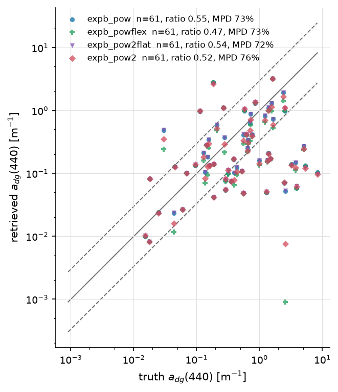
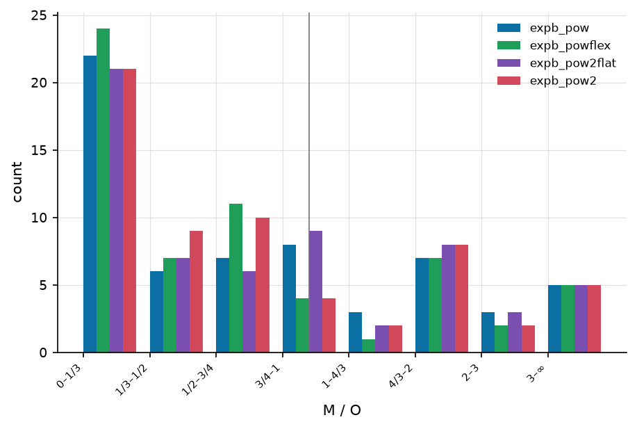
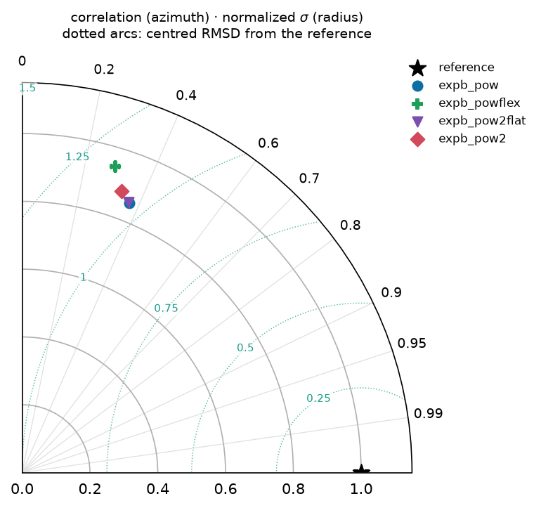
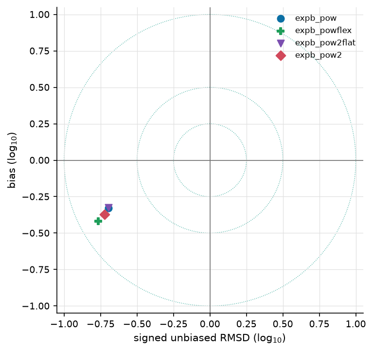
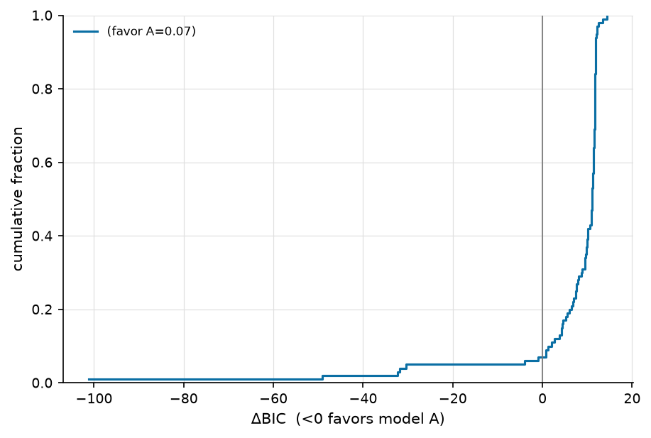

=============================================
Cross-algorithm comparison — gloria_turbid_v3
=============================================

:Sweep: gloria_turbid_v3
:Generated: 2026-07-31T03:55:16Z
:ioptics: 0.0.dev0@c70040c
:bing: 0.0.dev0@f242b0e
:ocpy: @da6dff9
:design_doc: 0.15
:implementation_doc: 0.22

Overview
--------

This is the **Cross-algorithm comparison** for sweep ``gloria_turbid_v3`` — a uniform comparison of the IOP-retrieval algorithms ``expb_pow``, ``expb_pow2``, ``expb_pow2flat``, ``expb_powflex`` on GLORIA. Each algorithm inverts the observed remote-sensing reflectance :math:`R_{rs}(\lambda)` for the inherent optical properties (absorption :math:`a`, backscatter :math:`b_b`, and their phytoplankton / CDOM-detritus / particulate components), and the retrieval is scored against the dataset's truth. The figures and tables below show **retrieval accuracy vs. truth**, **fit quality / closure**, and **model selection** between the algorithms; the interactive scatter lets you drill into any component or trophic stratum. See :doc:`/models` for what each algorithm parameterizes and :doc:`/datasets` for the data + truth. The header above stamps the exact code + config versions, so every number is reproducible from the persisted sweep artifacts.

**Reading the numbers.** ``mae`` and ``bias`` are **fractional multiplicative** errors in log space, following Erickson (2023): :math:`\mathrm{mae} = 10^{\langle|\log_{10} M/O|\rangle} - 1`, so **0 = perfect** and ``0.109`` means 10.9% (Seegers 2018 publishes the un-subtracted factor, ``1.109``, for the same fit — the forms differ by one). ``bias`` is signed, > 0 = over-estimate. The other columns have **different** perfect values, which is why they are read separately: ``median_ratio`` and GIOP's ``Ratio`` are perfect at **1**; ``win_frac`` is a head-to-head share, so **0.5 = a tie**; and ``coverage68`` / ``coverage95`` are perfect at their **nominal 0.68 / 0.95** — an algorithm can be the most accurate and still be over-confident about its uncertainty, which the ``*_verdict`` columns name (``over-confident`` / ``consistent`` / ``conservative``; *consistent* means not distinguishable from nominal at this ``n_pairs``, which on a thin contest is a weak statement). Three different denominators appear and are named apart: ``n_pairs`` (surviving retrieval-truth pairs), ``n_scored`` (spectra that produced a usable fit) and ``n_attempted`` (spectra the sweep tried).

Retrieved vs. true — a_dg(440)
------------------------------

Retrieved vs. true **a_dg(440)**, one point per observation and algorithm on log–log axes. Points on the solid **1:1** line are perfect; the dashed **3:1** and **1:3** guides mark the ±3× envelope. Each legend entry carries that algorithm's own ``n_pairs``, its median ratio (1 = perfect) and MPD (median absolute percent difference, 0 = perfect), so the panel can be read without the table below.

   a_dg(440), all algorithms — at most 12 retrieval-truth pairs per algorithm; each legend entry states its own.

Ratio distribution — a_dg(440)
------------------------------

How the population is distributed about 1:1, per accuracy bucket — the companion a scatter is conventionally paired with (GIOP Figs. 1-2), because central tendency alone hides the spread that decides whether a retrieval is usable. The vertical rule marks ratio = 1.

   Retrieved/true ratio buckets for a_dg(440).

Taylor & Target — a_dg(440)
---------------------------

**Taylor** (first) and **Target** (second) diagrams for :math:`a_dg(440)`, computed in log space and drawn for the sweep's best-covered component. The Taylor diagram places each algorithm by its correlation with truth (azimuth, labelled in correlation) and normalized standard deviation (radius); the reference star sits at correlation 1, norm-σ 1, and the dotted arcs are centred-RMSD contours about it. The Target diagram plots bias (y) against the sign-carrying unbiased RMSD (x), with dotted constant-RMSD rings — the closer to the origin, the better.

   Taylor diagram — a_dg(440): correlation (azimuth) vs normalized standard deviation (radius), with centred-RMSD arcs about the reference star.

   Target diagram — a_dg(440): bias vs signed unbiased RMSD, with constant-RMSD rings; the origin is a perfect retrieval.

Model selection (ΔBIC)
----------------------

Cumulative distribution of **ΔBIC** per spectrum for this sweep's complexity contest — ``expb_pow2`` (k=7) against ``expb_pow`` (k=5), chosen as its highest- and lowest-parameter algorithms. ΔBIC < 0 favours the more complex model ``expb_pow2``; ΔBIC > 0 favours the parsimonious ``expb_pow``. The curve shows what fraction of spectra fall either side — i.e. whether the extra parameters earn their keep. See :doc:`/models`.

   Per-spectrum ΔBIC, ``expb_pow2`` vs ``expb_pow``: the fraction of spectra either side of 0 says whether the extra parameters earn their keep.

Accuracy
--------

Per-(dataset, component, reference wavelength) retrieval accuracy for the χ² population: fractional multiplicative **mae**/**bias** (0 = perfect, ``mae`` 0.1 ≈ 10%), **median_ratio** (1 = perfect), **coverage68/95** against their nominal 0.68/0.95 with a ``*_verdict`` of over-confident / consistent / conservative (a real miss being more than 2 binomial standard errors; at small ``n_pairs`` only a gross miss is detectable, so *consistent* means "not distinguishable from nominal here", not "calibrated"), the cross-algorithm ranks (``*_rank``, 1 = best) and the head-to-head **win_frac** (0.5 = tie). ``n_pairs`` counts surviving retrieval-truth pairs; ``ref_match`` is the native band actually used (±3 nm). Every column is defined on the :doc:`/reports/glossary` page. 36 further (component, band) rows are omitted because this sweep scored no retrieval-truth pairs for them.

.. csv-table:: Ref-band accuracy + wins (χ², all strata).
   :file: accuracy_chisq_all.csv
   :header-rows: 1
   :widths: auto

Head-to-head
------------

Every algorithm pair, judged on the spectra **both** of them retrieved. ``delta_mae`` is ``mae(A) − mae(B)`` on those shared spectra (negative favours A) and ``d_lo``/``d_hi`` are its paired-bootstrap 95% interval, after the round-robin practice of resampling the data to put uncertainty on a ranking. The ``verdict`` names a winner only when the interval excludes 0 **and** the difference clears a practical floor of 10%. It reads ``indistinguishable`` only when the **whole interval** lies inside that floor — i.e. the data rule a material difference out — and ``underpowered`` when the interval is too wide to say either way at this ``n_paired``. Here 1 pair(s) are indistinguishable and 5 are underpowered, out of 6. A further 54 pair(s) share no scoreable spectrum and are omitted.

.. csv-table:: Pairwise verdicts (χ², all strata).
   :file: head_to_head_chisq_all.csv
   :header-rows: 1
   :widths: auto

Quality control
---------------

Fit-quality summary per dataset and algorithm. ``n_attempted`` is what the sweep tried and ``n_scored`` what produced a usable fit — the gap is explained by the per-status fractions, which are kept apart on purpose: ``frac_out_of_scope`` (spectrum outside the model family's regime) and ``frac_fit_failed`` (the fitter returned nothing) are the same ``frac_not_ok`` and entirely different findings. Also the median reduced **χ²ᵥ**, the noise-model-free **rel_misfit** (GIOP's ΔRrs), and the χ²ᵥ closure split (``frac_good`` ≈ 1, ``frac_overfit`` < 1, ``frac_underfit`` > 1, ``frac_qc_fail`` = non-solutions).

.. csv-table:: Fit quality / closure (χ²).
   :file: qc_chisq_all.csv
   :header-rows: 1
   :widths: auto

Interactive
-----------

Retrieved vs. true, **interactive**: pick the dataset, algorithm, component and trophic stratum, and hover any point for its ``obs_id``, wavelength and values — so an outlier can be traced back to a spectrum. The figure title states what fraction of the population is plotted (the cloud is downsampled to keep the page small; the static panels above summarize all of it).

.. raw:: html

   
   
   

   
