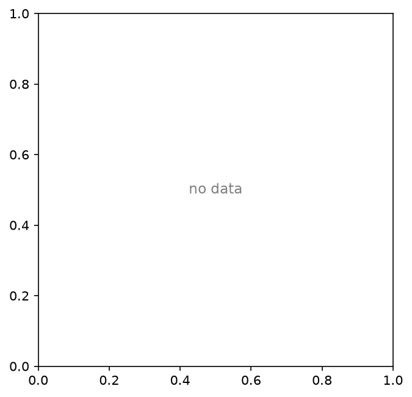
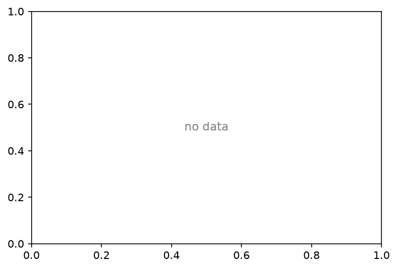

=============================================
Cross-algorithm comparison — gloria_turbid_v3
=============================================

:Sweep: gloria_turbid_v3
:Generated: 2026-07-30T07:41:41Z
:ioptics: 0.0.dev0@799bf87
:bing: 0.0.dev0@f242b0e
:ocpy: @da6dff9
:design_doc: 0.15
:implementation_doc: 0.22

Overview
--------

This is the **Cross-algorithm comparison** for sweep ``gloria_turbid_v3`` — a uniform comparison of the IOP-retrieval algorithms ``expb_pow``, ``expb_pow2``, ``expb_pow2flat``, ``expb_powflex`` on GLORIA. Each algorithm inverts the observed remote-sensing reflectance :math:`R_{rs}(\lambda)` for the inherent optical properties (absorption :math:`a`, backscatter :math:`b_b`, and their phytoplankton / CDOM-detritus / particulate components), and the retrieval is scored against the dataset's truth. The figures and tables below show **retrieval accuracy vs. truth**, **fit quality / closure**, and **model selection** between the algorithms; the interactive scatter lets you drill into any component or trophic stratum. See :doc:`/models` for what each algorithm parameterizes and :doc:`/datasets` for the data + truth. All accuracy metrics are log-space / multiplicative (0 = perfect). The header above stamps the exact code + config versions, so every number is reproducible from the persisted sweep artifacts.

Retrieved vs. true — a(440)
---------------------------

Retrieved vs. true **a** at 440 nm, one point per observation and algorithm on log–log axes. Points on the solid **1:1** line are perfect; the dashed **3:1** and **1:3** guides mark the ±3× envelope. Tight, unbiased scatter along 1:1 is the goal; systematic offset above/below it is over-/under-estimation.

   a at 440 nm, all algorithms.

Retrieved vs. true — bb(555)
----------------------------

Retrieved vs. true **bb** at 555 nm, one point per observation and algorithm on log–log axes. Points on the solid **1:1** line are perfect; the dashed **3:1** and **1:3** guides mark the ±3× envelope. Tight, unbiased scatter along 1:1 is the goal; systematic offset above/below it is over-/under-estimation.

.. figure:: scatter_bb_555.png
   :width: 90%

   bb at 555 nm, all algorithms.

Taylor & Target — a(440)
------------------------

**Taylor** (left/first) and **Target** (right/second) diagrams for :math:`a(440)`, computed in log space. The Taylor diagram places each algorithm by its correlation with truth (azimuth) and normalized standard deviation (radius) — the reference star sits at correlation 1, norm-std 1. The Target diagram plots bias (y) against the sign-carrying unbiased RMSD (x); the closer to the origin, the better.

.. figure:: taylor_a.png
   :width: 90%

.. figure:: target_a.png
   :width: 90%

Model selection (ΔBIC)
----------------------

Cumulative distribution of **ΔBIC** per spectrum for the in-tandem pair. ΔBIC < 0 favors the more complex model (``expb_pow``, k=5); ΔBIC > 0 favors the parsimonious one (``giop``, k=3). The curve shows what fraction of spectra fall either side — i.e. whether the extra two parameters earn their keep. See :doc:`/models`.

Accuracy
--------

Per-(component, reference wavelength) retrieval accuracy for the χ² population: multiplicative **mae**/**bias** and **coverage** (0 = perfect; ``mae`` 0.1 ≈ 10%), the cross-algorithm ranks (``*_rank``, 1 = best), and the head-to-head **win_frac**. ``ref_match`` is the native band actually used (±3 nm).

.. csv-table:: Ref-band accuracy + wins (χ², all strata).
   :file: accuracy_chisq_all.csv
   :header-rows: 1

Quality control
---------------

Fit-quality summary per algorithm: ``frac_not_ok`` (retrievals flagged as failures/QC), the median reduced **χ²ᵥ**, and the χ²ᵥ-based closure fractions (``frac_good`` ≈ 1, ``frac_overfit`` < 1, ``frac_underfit`` > 1, ``frac_qc_fail`` = non-solutions).

.. csv-table:: Fit quality / closure (χ²).
   :file: qc_chisq_all.csv
   :header-rows: 1

Interactive
-----------

Retrieved vs. true, **interactive**: pick the dataset, algorithm, component and trophic stratum, and hover any point for its wavelength and values. (Downsampled for the web; the static panels above summarize the full population.)

.. raw:: html

   
   
   
   
   
   
   
   
   

   
