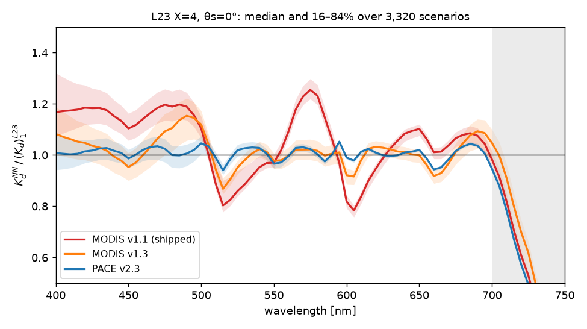
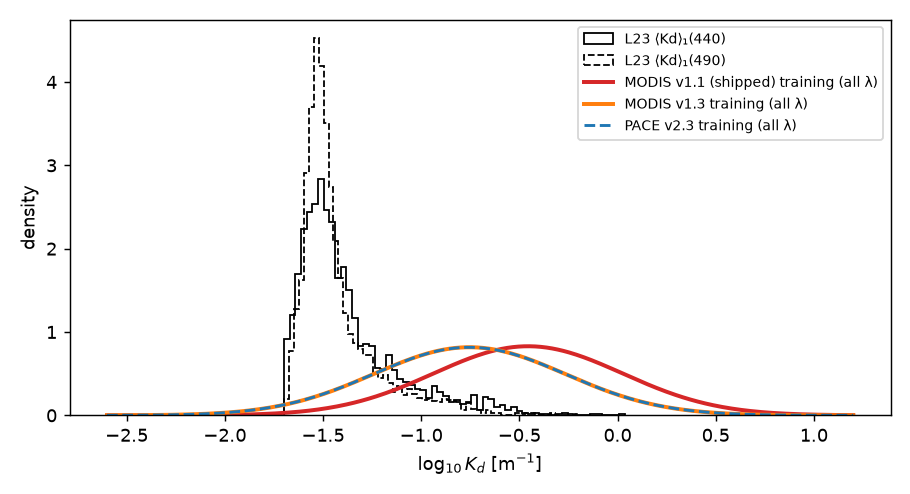

.. _ls2_kd_15pct:

==========================================================
The 15% question — Kd networks against L23's ⟨Kd⟩₁
==========================================================

:Task: ls2 task 10 (diagnostic; gates task 11)
:Script: ``ioptics/runs/prototypes/ls2/kd_15pct.py`` (regenerates every number,
   table and figure on this page)
:Data: L23 (Loisel et al. 2023), noise-free ``Rrs``; ⟨Kd⟩₁ from the profile
   files, canonical ``ln_ratio`` definition unless stated
:Networks: the authors' MODIS v1.1 (what ocpy shipped), MODIS v1.3 (their
   current retrain) and PACE v2.3, as ported to ``ocpy.ls2.kd_nn``

Summary
-------

**L23's ⟨Kd⟩₁ is not the thing that is wrong.  The 15% is an error of the
MODIS v1.1 network, and it is part of a larger one.**

* The planning number reproduces.  On L23 X=4, θs=0°, the shipped
  MODIS v1.1 network reads +15% at 440 nm and +19% at
  490 nm, and +2% and +4% at 555 and 670 nm.
* But it is not a blue-only offset.  Across 400–700 nm the same network swings
  from -22% to +25%, a sawtooth in output
  wavelength: -11% at 510, -18% at 520,
  +23% at 580 and -18% at 600 nm.  The four
  planning bands happened to sample two high points and two near-crossings.
* The authors' **PACE v2.3** network, a second independent implementation
  whose bands sit exactly on L23's grid, agrees with L23 to a median
  1.8% over 400–700 nm (range
  -6% to +5%).  Their **MODIS v1.3**
  retrain, on the same five bands as v1.1, removes the 440 nm gap
  (-1%) but not the 490 nm one (+15%).  Its
  median deviation over 400–700 nm is 3.2%,
  against 11.4% for v1.1.
* No other candidate comes close.  The ⟨Kd⟩₁ definition moves the ratio by at
  most 0.08%, and smooth band interpolation by at most
  1.8%.  The gap scales with Kd (multiplicative), whereas a
  pure-water difference would add a fixed offset; closing it with pure
  water would need ``a_w`` to swing from +25% to
  -19% between 580 and 600 nm.

**Recommendation.**  Use L23's ⟨Kd⟩₁ (X=4, canonical definition) as the
training truth for task 11.  Use PACE v2.3 as the baseline that task 11's
networks must beat.  Flip ``Kd_NN_MODIS``'s default to v1.3, as Q30 agreed once
this report was in, but treat it as a documented alternative only: it is still
+15% at 490 nm.

The ratio, wavelength by wavelength
-----------------------------------

   ``Kd_NN / ⟨Kd⟩₁(L23)`` on L23 X=4, θs=0°.  Lines are the median over the
   3,320 scenarios, bands the 16–84% range.  Grey: above 700 nm, outside the
   range the authors recommend.  There all three networks fall away together
   (to about 0.3–0.4 at 740 nm), and L23 is not the network's training domain.

.. csv-table:: Median ratio at selected bands (X=4, θs=0°), with the min, max and median absolute deviation from 1 over 400–700 nm.
   :file: kd15_bands.csv
   :header-rows: 1
   :widths: auto

Candidate 1: the ⟨Kd⟩₁ definition
---------------------------------

The three definitions of ls2 Q10 agree to better than 0.03% in the median
(``ioptics.kd``).  As the denominator of the ratio they move it by at most
0.08% at any quoted band, for any network.  **Ruled out.**

.. csv-table:: Median ratio under each ⟨Kd⟩₁ definition.
   :file: kd15_definitions.csv
   :header-rows: 1
   :widths: auto

Candidate 2: pure-water absorption
----------------------------------

A pure-water difference between L23 and the network's training RT adds the
same ``Δa_w / μ_d`` to every scenario.  Its signature is a ratio that falls
towards 1 as Kd grows, and a linear fit ``Kd_NN = α·Kd_L23 + β`` with
``β ≠ 0`` and ``α ≈ 1``.  The shipped network shows the opposite.  At 440 nm
its ratio is 1.193, 1.149, 1.127, 1.125 and
1.171 across the Kd quintiles (0.020-1.086 m⁻¹).  At 490 nm it is
1.231 → 1.17.  The fit gives α = 1.185 and
1.158 at 440 and 490 nm, with β only -4%
and +3% of the median Kd.  The error
scales with Kd: it is multiplicative.

On size: closing the gap with pure water alone would need ``a_w`` to change by
+76% at 440 nm and +38% at 490 nm, then
-22% at 520, +25% at 580 and -19% at
600 nm.  The sign flips three times within 120 nm, and no pure-water table
does that.  (The one alternative table on hand, ocpy's GSFC Pope & Fry, is
L23's own data from 440 to 700 nm, differing by at most 0.0%.)
**Ruled out**, on structure and on size.

.. csv-table:: Ratio per Kd quintile and linear fit (X=4, θs=0°; fit on the clearest 95%).
   :file: kd15_kd_bins.csv
   :header-rows: 1
   :widths: auto

.. csv-table:: The a_w change that would close the MODIS v1.1 gap on its own, and the tables on hand.
   :file: kd15_pure_water.csv
   :header-rows: 1
   :widths: auto

Candidate 3: band interpolation
-------------------------------

L23 is on a 5 nm grid, and MODIS's bands are not (443, 488, 531, 547, 667 nm).
The LS2 driver interpolates linearly.  Cubic interpolation, or a 10 nm Gaussian
band, changes the median ratio by at most 1.8% for any network.
Nearest-band sampling does matter, as planning found: for MODIS v1.1 it takes
440 nm from +15% to +24% and 490 nm from
+19% to +26%.  But that is a 2–3 nm shift of the
inputs, and it shows how sensitive the network is.  It is not a defect of the
linear interpolation.  **Ruled out**, provided interpolation is linear or
better.  PACE v2.3 needs no interpolation, since its bands are on L23's grid.

.. csv-table:: Median ratio for four ways of putting L23 on the network bands (X=4, θs=0°).
   :file: kd15_interp.csv
   :header-rows: 1
   :widths: auto

Candidate 4: the network
------------------------

Three implementations by the same authors give three answers on identical
inputs.  The two MODIS releases differ from each other by as much as the gap
itself (+15% against -1% at 440 nm).  The PACE
network, trained on a different set and architecture, agrees with L23 across
the visible.  If L23's ⟨Kd⟩₁ were wrong, it would have to be wrong in a way
that PACE v2.3 shares and both MODIS releases do not, at different
wavelengths for each.  The economical reading is that the MODIS networks,
v1.1 above all, carry an output-wavelength-dependent error.  Their only
spectral input is five bands, and output wavelength is just another input to
a small MLP.  v1.3's remaining 490 nm gap is a clear-water one: it is
1.217 in the clearest Kd quintile and 1.028 in the most turbid.
**This is the explanation.**

A new candidate: the training domain
------------------------------------

The LUTs store each network's training mean and standard deviation of
``log10 Kd``.  MODIS v1.1 was trained around a geometric-mean Kd of
0.35 m⁻¹ (σ = 0.481 dex).  MODIS v1.3 and
PACE v2.3 were trained around 0.176 m⁻¹.  L23's median
⟨Kd⟩₁(440) is 0.035 m⁻¹, at z = -2.08 in v1.1's
training distribution, with 57% of scenarios more
than 2σ below its mean, against z = -1.44 for v1.3.  L23's clear
blue water is the thin edge of what v1.1 learned, which is where a small
network is least constrained.  This supports Candidate 4; it does not replace
it.  These statistics pool all wavelengths, so they bound the domain loosely.

   L23's ⟨Kd⟩₁ at 440 and 490 nm (X=4, θs=0°) against each network's training
   distribution of ``log10 Kd``, drawn as the Gaussian of the stored mean and
   standard deviation.  MODIS v1.3 and PACE v2.3 store the same output
   statistics, so their curves coincide (PACE dashed).  The training
   statistics pool all output wavelengths, red included, which is why even
   the better-placed networks sit above L23's blue values.

.. csv-table:: L23 in each network training distribution (clear branch).
   :file: kd15_domain.csv
   :header-rows: 1
   :widths: auto

A new candidate: inelastic light and the sun
--------------------------------------------

L23 comes in three inelastic realizations, and the networks' training RT
includes whatever inelastic light it includes.  At these bands it is Raman that
matters.  X=2 (Raman only) and X=4 (Raman + Chl fluorescence) give the same
ratios to within 0.3%.  The elastic X=1 lowers every network's
ratio: PACE v2.3 goes from +2%, +1%, -3%,
-2% at 440/490/555/670 nm on X=4 to -3%,
-3%, -4%, -2% on X=1, and MODIS v1.1's
440 nm gap shrinks from +15% to +9%.
So 40% of v1.1's 440 nm gap moves with the realization.  PACE v2.3
fits the Raman-on realizations best, consistent with a training RT that included Raman,
as real water does.  Train against X=4 (task 11).  The sun does little:
the shipped network's 440 nm ratio is +15% at θs = 0° and
+13% at 60°.  This confirms planning's finding that the geometry
is consistent.

.. csv-table:: Median ratio at four bands for every L23 realization.
   :file: kd15_realizations.csv
   :header-rows: 1
   :widths: auto

What this page does not settle
------------------------------

* Which network is right *in situ*.  L23 is a model ocean.  PACE v2.3 agreeing
  with it shows two RT-trained products agree, not that either matches the
  sea.  The five-band network of task 11 is validated against PANGAEA for that
  reason.
* The networks' training sets are not described in the distribution.  The
  stored statistics are all that is known of them here.
* Above 700 nm every network falls far below L23.  That is outside the
  authors' recommended range, and LS2's κ is NaN there anyway (ls2 task 1).
