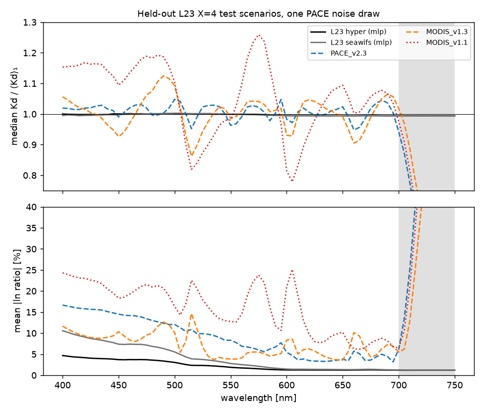

.. _ls2_kd_l23:

========================================================
L23-trained ⟨Kd⟩₁ networks — hyperspectral and five-band
========================================================

:Task: ls2 task 11 (Q16, Q20, Q26, Q38)
:Script: ``ioptics/runs/prototypes/ls2/train_kd_l23.py`` (trains, scores and
   writes everything on this page); training code ``ioptics.kd_net``
:Weights: ``ocpy/data/LS2/Kd_L23_hyper_v1.npz`` and
   ``Kd_L23_seawifs_v1.npz``, evaluated by ``ocpy.ls2.kd_l23.kd_l23``
   (NumPy only)
:Training truth: L23 X=4 ⟨Kd⟩₁ (canonical ``ln_ratio``), θs = 0, 30, 60°;
   2324 training scenarios (62,748 rows
   with noise augmentation); split by IOP scenario 70/15/15

Summary
-------

* **Hyperspectral network** (71 bands, 400–750 nm): 2.3%
  mean abs(ln ratio) over 400–700 nm on held-out L23 with PACE noise
  (1.8% clean).  On the same noisy spectra the authors' PACE
  v2.3 scores 8.9%, MODIS v1.3 7.3% and
  the MODIS v1.1 ocpy used to ship 15.9%.  Its linear baseline
  scores 4.4%, so the nonlinearity earns its place.
  **It has no in-situ validation**: no dataset on hand pairs hyperspectral
  ``Rrs`` with measured Kd.
* **Five-band network** (443, 490, 510, 555, 670 nm):
  4.1% on the same held-out set (linear
  6.8%).  On PANGAEA's measured Kd (Rrs within ±2.5 nm,
  332 spectra), its median ratio is
  0.827 and its mean
  abs(ln ratio) 0.34; in its
  clear-water scope (in its trained domain, Kd(490) ≤ 0.65), median ratio
  0.902 and mean abs(ln ratio)
  0.232.
  On the 92
  in-scope spectra the authors' MODIS networks can also score, MODIS v1.1 is
  closer to PANGAEA than ours
  (0.229 against
  0.377), the reverse
  of the L23 ranking.  The details, and what PANGAEA's Kd is and is not, are
  below.
* **Geometry**: the held-out-zenith experiment settles whether ``μw`` is an
  input (below).  The 1/μw factor is analytic in either case, so 60–70° is
  arithmetic extrapolation, flagged; beyond 70° the networks return NaN.
* **Realization (Q38)**: trained on elastic X=1 and applied to X=4, the
  hyperspectral network scores 4.2%
  against 2.3% when trained on X=4.

Held-out L23
------------

   Median ratio (top) and mean abs(ln ratio) (bottom) per wavelength on the
   498 held-out test scenarios × 3 zeniths, with one PACE noise draw on every spectrum.  Grey: above
   700 nm, outside the authors' recommended range for their networks.

.. csv-table:: Held-out test scores, clean and with PACE noise. mae_ln_vis = mean abs(ln(Kd/⟨Kd⟩₁)) over 400–700 nm (≈ fractional error); ratio_λ = median ratio; frac_nan = cells with no prediction.
   :file: kdl23_heldout.csv
   :header-rows: 1
   :widths: auto

Noise matters most for the networks that use the red.  PACE noise is about
50% of ``Rrs`` at 670 nm.  Ours were trained on it and degrade from
1.8% clean to 2.3% noisy.  The authors'
PACE v2.3 goes from 3.0% to 8.9%, and
fails outright on 4.5% of noisy cells, because its turbid
branch refuses a negative red ``Rrs``.

Does ``μw`` belong among the inputs?
------------------------------------

``robust.rt.emulator`` found that a tanh MLP trained on 0°/30° of this corpus
extrapolates to 60° *unstably*: the seed decided the answer.  Here the target
is already ``ln(μw ⟨Kd⟩₁)``, so the question is whether giving the network
``μw`` as well helps or hurts.  Trained on 0° and 30° only, then tested on the
unseen 60° (noisy, three seeds):

* **hyper**: without ``μw`` 3.5% (seeds 3.5%–3.6%); with it 4.7% (4.7%–4.8%).  Adopted: without.
* **seawifs**: without ``μw`` 5.2% (seeds 5.1%–5.2%); with it 19.9% (15.5%–22.6%).  Adopted: without.

The shipped networks are trained on all three zeniths with that setting.
Over three seeds, their held-out error spans
2.3%–2.3% (hyperspectral) and
4.1%–4.1% (five-band).

.. csv-table:: Held-out 60° error after training on 0°/30° only, per network, geometry setting and seed.
   :file: kdl23_geometry.csv
   :header-rows: 1
   :widths: auto

.. csv-table:: Summary over seeds.
   :file: kdl23_geometry_summary.csv
   :header-rows: 1
   :widths: auto

.. csv-table:: The final configuration over three seeds (held-out, noisy).
   :file: kdl23_seed_spread.csv
   :header-rows: 1
   :widths: auto

Which realization to train on (Q38)
-----------------------------------

.. csv-table:: Networks trained on X=4 (adopted) or on elastic X=1, both scored on the noisy X=4 test spectra.
   :file: kdl23_ablation.csv
   :header-rows: 1
   :widths: auto

PANGAEA (five-band network only)
--------------------------------

PANGAEA V3 carries measured Kd on 25 discrete wavelengths, multispectral
only.  It is a near-surface ``Kd(λ)`` whose depth convention the metadata does
not state, so it is **not** ⟨Kd⟩₁ over exactly the first attenuation depth.
Part of any disagreement is that definitional difference, not network error.
``Rrs`` was matched to each network's bands from the nearest finite band
within ±2.5 nm (and ±6 nm for the larger set), and θs computed from each
observation's time and position (``robust.solar``).  Scored over the
measured Kd bands from 400 to 700 nm.  ``in scope`` keeps the spectra inside
the network's trained input domain with Kd(490) ≤ 0.65 m⁻¹, the clear-water
range L23 covers.

* ±2.5 nm: 332 with Rrs at all five bands; 68 out of domain; 0 with Kd(490) > 0.65.
* ±6 nm: 1782 with Rrs at all five bands; 251 out of domain; 3 with Kd(490) > 0.65.

The authors' MODIS networks need ``Rrs`` at 443/488/531/547/667 nm.  No
PANGAEA spectrum carries those within ±2.5 nm, and
219 do within ±6 nm.
"Common to all three" compares the three networks on those spectra:

* On all of them, the five-band network's mean abs(ln ratio) is
  0.624 (median
  ratio 0.564),
  against 0.393 for MODIS
  v1.3 and 0.24 for v1.1.
  Most of these spectra lie outside L23's clear-water domain, where the
  authors' networks have a turbid branch and ours, by design, does not.
* On the
  92
  that are in scope, it is
  0.377 (median ratio
  0.728),
  against 0.395 and
  0.229.

Across all matched spectra the five-band network reads **low** against
PANGAEA (median ratio
0.909 at ±6 nm), and
less so in scope (0.958).
In the scatter it flattens above about 0.3 m⁻¹, where L23 thins out (95% of
its Kd(490) is below 0.10).  How much of the low reading is L23's ocean
against the real one, and how much is near-surface Kd against ⟨Kd⟩₁, this
data cannot separate.

**Read plainly**: on the in-scope spectra all three can score, the network
furthest from L23, MODIS v1.1, is closest to PANGAEA
(0.229, against
0.377 for ours).
Task 10 found v1.1 the worst of the three against L23.  A network trained on
L23 is as good as L23's ocean is like the real one, and on this sample real
water attenuates more than L23 predicts from the same ``Rrs``.  That bounds what
held-out L23 scores can promise, for the hyperspectral network above all.

.. figure:: kdl23_pangaea.png
   :width: 95%

   Network against PANGAEA Kd, every matched (spectrum, band) cell, ±6 nm
   (the MODIS bands match no PANGAEA spectrum within ±2.5 nm).
   Dotted: Kd = 0.65 m⁻¹, the top of L23's range at 490 nm.

.. csv-table:: PANGAEA validation. mae_ln = mean abs(ln(network/measured)) over cells.
   :file: kdl23_pangaea.csv
   :header-rows: 1
   :widths: auto

Scope and limits
----------------

* **Clear water only.**  L23 has Kd(490) ≤ 0.65 m⁻¹, 95% below 0.10.  No
  turbid branch is attempted, and inputs outside the trained domain (by more
  than 1% of a feature's span) are flagged ``out_of_domain`` by
  ``kd_l23``.
* **The hyperspectral network has no in-situ validation.**  Its numbers are
  held-out L23, which is the same RT that generated its training data.
* **θs above 60°** is outside L23.  With the 1/μw factor analytic, 60–70° is
  arithmetic, flagged ``extrapolated_sza``; beyond 70° the result is NaN.
* The red is noise-dominated (PACE noise ≈ 50% of ``Rrs`` at 670 nm).  The
  networks were trained to tolerate it, not to extract signal from it.
