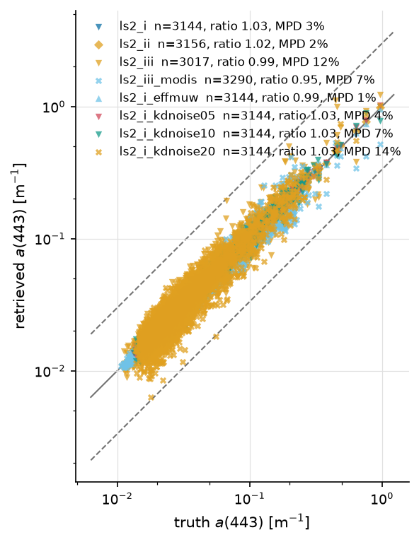
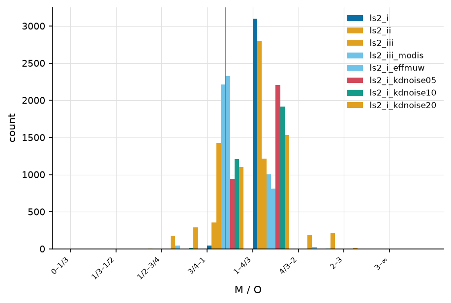
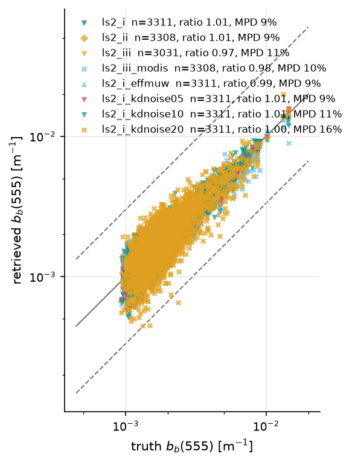
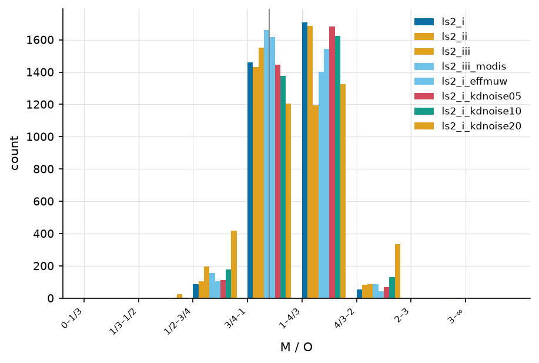
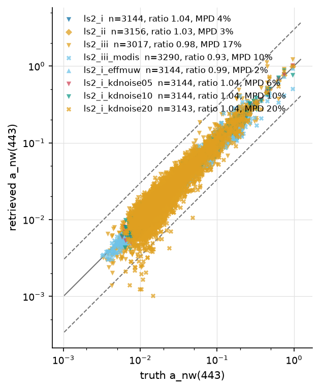
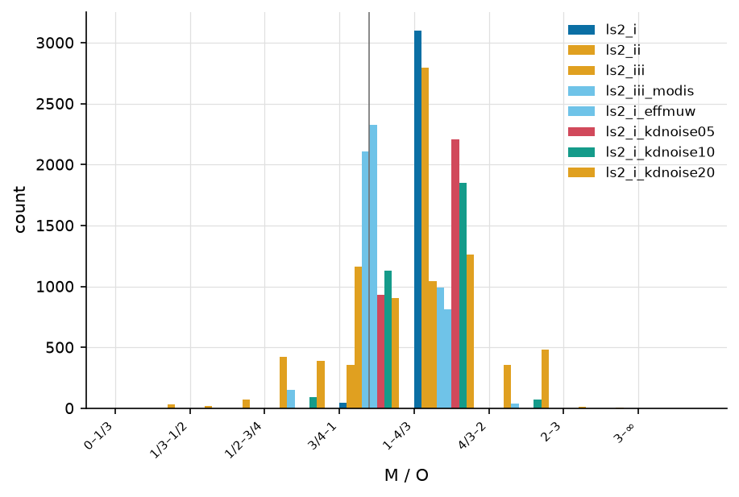
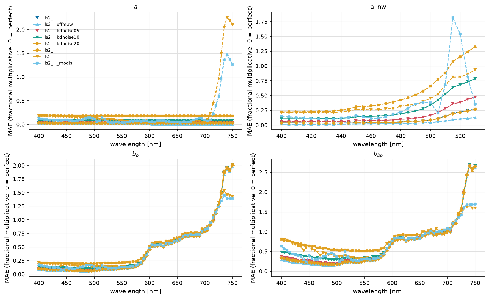
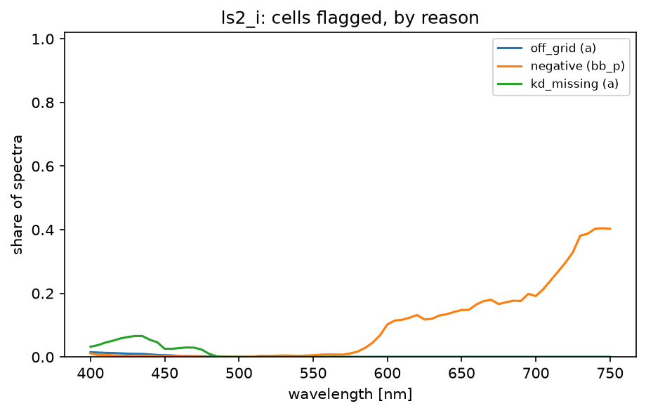

==========================
LS2 ladder — ls2_l23_x1_v1
==========================

:Sweep: ls2_l23_x1_v1
:Generated: 2026-10-03T22:41:56Z
:ioptics: 0.0.dev0@d1840f1
:bing: 0.0.dev0@e849855
:ocpy: 0.1.0@8d6396a
:design_doc: 0.16
:implementation_doc: 0.24

Overview
--------

This is the **LS2 ladder** for sweep ``ls2_l23_x1_v1``: LS2 (Loisel et al. 2018), a **direct** algorithm — closed-form ``a`` and ``bb`` from ``Rrs``, ``<Kd>_1``, ``b_p`` and the solar zenith through published look-up tables, with no fit and no likelihood — run on 3320 spectra from L23 over 400–750 nm, noise ``pace``. The spectra are L23 ``X=1`` — elastic (no inelastic processes) — and LS2's Raman correction is **off** on every rung (ls2 Q4). Every rung runs the same tables and differs from its neighbour in where **one** input comes from, so a difference between two rows is the cost of that input:

#. ``ls2_i`` — LS2 (i) Kd record, b_p truth
#. ``ls2_ii`` — LS2 (ii) Kd record, b_p OC4v4
#. ``ls2_iii`` — LS2 (iii) Kd PACE-NN, b_p OC4v4
#. ``ls2_iii_modis`` — LS2 (iii) Kd MODIS-NN v1.3, b_p OC4v4
#. ``ls2_i_effmuw`` — LS2 (i) effective muw (diagnostic)
#. ``ls2_i_kdnoise05`` — LS2 (i) + 5% Kd noise (sensitivity)
#. ``ls2_i_kdnoise10`` — LS2 (i) + 10% Kd noise (sensitivity)
#. ``ls2_i_kdnoise20`` — LS2 (i) + 20% Kd noise (sensitivity)

``ls2_i`` gives LS2 the truth for both side inputs — the most it can do, and a level nobody reaches from orbit. Its own error is the published tables' error. Pure water always comes from ocpy, never from the truth (ls2 Q21), and ``<Kd>_1`` is the ``ln_ratio`` definition (ls2 Q10). Every number on this page is regenerable from the persisted sweep artifacts under ``runs/``.

What this page can and cannot claim
-----------------------------------

* **``b_p`` from chlorophyll is a plain λ⁻¹ power law.** Rungs (ii) and (iii) take ``b_p(λ) = 0.347·Chl^0.766·(λ/660)^−1`` exactly as the authors' ``bp_from_Chla.m`` does: the amplitude is Loisel & Morel (1998) Eq. 6, fitted to the particle *attenuation* ``c_p(660)`` and identified with ``b_p``, and the shape is λ⁻¹, **not** the chlorophyll-dependent exponent of Morel & Maritorena (2001) that the authors cite. Chl is OC4v4 (O'Reilly et al. 2000), not the 1998 OC4 BING's prior uses (ls2 Q29).

* **Pure water is LS2's own, never the truth's** (ls2 Q21): the IOCCG ``a_w`` table and Zhang, Hu & He (2009) ``b_w`` at 20 °C, S = 35. LS2 subtracts them to report ``a_nw`` and ``bb_p``, so any difference lands one-for-one in those two. Against L23's own pure water the difference is 0.000% in ``a_w`` and -0.27% in ``b_w`` (median over 400–750 nm), so it is not a material bias here.

* **LS2 is defined only for η = b_w/(b_p + b_w) < 0.2**, i.e. ``b_p > 4·b_w``. Very clear blue water fails it: 0.19% of ``ls2_i``'s cells fall outside the table and come back NaN with reason ``off_grid``.

* **The Raman correction κ is off on every rung** (ls2 Q4): this realization's truth is elastic, so there is no Raman signal to correct, and none of the κ table's gaps (its end at 702 nm, its defective row near 502 nm) reaches this page; ``kappa_out_of_range`` never appears among the NaN reasons.

* **``a_nw`` in the red is pure water's share of ``a``, not LS2.** A few-percent bias in ``a`` becomes hundreds of percent in ``a − a_w`` beyond ~550 nm. The tables keep every band; the accuracy-vs-wavelength figure draws ``a_nw`` only where the median truth ``a_nw/a`` is at least 10% (ls2 Q34).

* **There is no ``a_ph`` or ``a_dg``.** LS2 retrieves totals and their non-water parts; it has no decomposition. Those cells read "not applicable" — the absence is the point of the comparison, not a gap (ls2 Q5/Q25).

* **``ok`` is strict; scoring is per cell.** A spectrum is ``ok`` only if all four outputs are finite and positive at every band (ls2 Q5). With noised ``Rrs`` almost every spectrum has one unusable cell (a negative ``bb`` where noise drove red ``Rrs`` below zero), so most are ``poor_fit`` — and their finite cells are scored, so the hardest water is not dropped selectively (ls2 Q31).

* **LS2 is never an exemplar.** It has no model ``Rrs`` and no posterior, so the exemplar panels of the standard pages do not apply to it.

* **The headline is quoted against MCMC BING** (ls2 Q23): the same L23 spectra, the same noise *form*, and BING's MCMC population — the one RT-A reads first.

* **The Kd networks need positive Rrs at every input band.** A network returns nothing when a band it reads is negative, and ``pace`` noise drives red ``Rrs`` negative; spectra with no Kd at all (``ls2_iii`` 278; ``ls2_iii_modis`` 0) come back ``fit_failed``. The PACE network reads up to 700 nm and is hit hardest; the MODIS network's clear-water branch stops at 547 nm.

* **Excluded from the leaderboard by design** until the report is trusted (``leaderboard: false``). This page does not touch the landing page.

The ladder
----------

One row per rung, all strata. Coverage: ``frac_ok`` / ``frac_poor_fit`` / ``frac_out_of_scope`` / ``frac_fit_failed`` over ``n_attempted`` spectra (``ok`` is strict, ``poor_fit`` a partial result; see the limitations). Accuracy at ``a(440)``, ``a_nw(440)``, ``bb(555)``, ``bb_p(555)``, ``bb_p(670)``: ``n`` scored cells, ``mae`` (fractional multiplicative error in log space; 0.10 ≈ 10 %), signed ``bias`` (> 0 = over-estimate) and ``ratio`` = median retrieved/true. ``a_ph(440)``, ``a_dg(440)`` read "not applicable" on every LS2 row. No BING comparator was available for this build, so the table is LS2 alone (see the note at the end of the page). Read the table down a column: what changes from one rung to the next is the cost of that rung's input.

.. csv-table:: One row per LS2 rung.
   :file: ls2_ladder_all.csv
   :header-rows: 1
   :widths: auto

How much a Kd error costs
-------------------------

``ls2_i`` with its true ``<Kd>_1`` multiplied by one random factor ``1 + σε`` per spectrum, σ = 0, 5, 10 and 20 % (ls2 Q15/Q33) — a whole spectrum wrong together, as a retrieved Kd is. The noise is unbiased, so it shows in ``mae``, not in the median. The last row is the least-squares slope ``d(mae)/d(σ)``: the accuracy LS2 loses per unit of relative Kd error, cell by cell.

.. csv-table:: ``mae`` against relative Kd noise, and the slope.
   :file: kd_noise_all.csv
   :header-rows: 1
   :widths: auto

Retrieved vs. true — a(443)
---------------------------

Retrieved vs. true **a(443)**, one point per spectrum and rung, log–log; solid 1:1, dashed ±3×. One algorithm, different inputs: where the clouds separate, the input is doing the separating.

   a(443), every rung — at most 3290 retrieval-truth pairs per rung.

Ratio distribution — a(443)
---------------------------

How each rung sits about 1:1; the vertical rule marks 1.

   Retrieved/true ratio buckets for a(443), per rung.

Retrieved vs. true — bb(555)
----------------------------

Retrieved vs. true **bb(555)**, one point per spectrum and rung, log–log; solid 1:1, dashed ±3×. One algorithm, different inputs: where the clouds separate, the input is doing the separating.

   bb(555), every rung — at most 3311 retrieval-truth pairs per rung.

Ratio distribution — bb(555)
----------------------------

How each rung sits about 1:1; the vertical rule marks 1.

   Retrieved/true ratio buckets for bb(555), per rung.

Retrieved vs. true — a_nw(443)
------------------------------

Retrieved vs. true **a_nw(443)**, one point per spectrum and rung, log–log; solid 1:1, dashed ±3×. One algorithm, different inputs: where the clouds separate, the input is doing the separating.

   a_nw(443), every rung — at most 3290 retrieval-truth pairs per rung.

Ratio distribution — a_nw(443)
------------------------------

How each rung sits about 1:1; the vertical rule marks 1.

   Retrieved/true ratio buckets for a_nw(443), per rung.

Accuracy vs. wavelength
-----------------------

The same ``mae`` as the ladder table at every band the truth covers. The ``a_nw`` panel stops where pure water takes over ``a`` (ls2 Q34); above 702 nm the Raman correction is unavailable, and at ``X=4`` the fluorescence band near 685 nm shows in ``bb``.

   Fractional multiplicative MAE against wavelength for ``a``, ``a_nw``, ``bb`` and ``bb_p``, every rung overlaid; ``a_nw`` only where truth ``a_nw/a`` ≥ 10%.

Where LS2 returns nothing, and why
----------------------------------

Per-cell reasons, recorded per wavelength because the failures are wavelength-specific (ls2 Q24): ``kappa_out_of_range`` (the Raman table's 490–505 nm defect and its end at 702 nm), ``off_grid`` (η outside the table), ``kd_missing`` (no Kd at that band — a first attenuation depth beyond the L23 grid, or an unmeasured PANGAEA band), ``negative`` and ``not_converged``. Glossary: :doc:`/reports/glossary`.

   Share of spectra whose ``ls2_i`` cell at each wavelength carries each reason (``negative`` read from ``bb_p``, the rest from ``a``).

Model selection (ΔBIC) — not applicable
---------------------------------------

LS2 has **no likelihood**: it does not fit, so it has no χ², no BIC and no posterior to compare. The ΔBIC contests of the standard and RT-ladder pages therefore have no LS2 row; the metrics tables carry an explicit ``n = 0`` ``not_applicable`` row for every ΔBIC pair that involves it rather than leaving it absent. LS2 is compared with BING on accuracy alone.

Head-to-head verdicts between rungs
-----------------------------------

Every pair of rungs on the spectra both retrieved: ``delta_mae`` = ``mae(A) − mae(B)`` with its paired-bootstrap 95 % interval, and a ``verdict`` naming a winner only when the interval excludes 0 **and** clears the practical floor of 10%. 162 of 224 pairs are indistinguishable — between rungs, that says the input made no material difference.

.. csv-table:: Pairwise accuracy verdicts, all strata.
   :file: head_to_head_direct_all.csv
   :header-rows: 1
   :widths: auto

Accuracy
--------

The full per-(component, reference band) table the ladder cells come from. ``not_applicable`` rows are kept on purpose. Columns are defined on the :doc:`/reports/glossary` page.

.. csv-table:: Ref-band accuracy, every scored component, all strata.
   :file: accuracy_direct_all.csv
   :header-rows: 1
   :widths: auto

Coverage and quality control
----------------------------

``n_attempted`` and the per-status fractions. The χ² columns are empty, not zero: LS2 has no misfit to report (ls2 Q5). Identical ``out_of_scope`` counts on every rung keep the ladder fair — the same red-peaked spectra were declined everywhere.

.. csv-table:: Coverage per rung.
   :file: qc_direct_all.csv
   :header-rows: 1
   :widths: auto

Not shown for this sweep
------------------------

The figure set is derived from what this sweep actually measured, so a panel with no data behind it is omitted rather than published blank. For the record, this page leaves out:

* BING beside LS2 — no comparator sweep was supplied to this build. The LS2-versus-BING head-to-head is read against MCMC BING on the same spectra (ls2 Q23) and lands with ls2 task 14.
