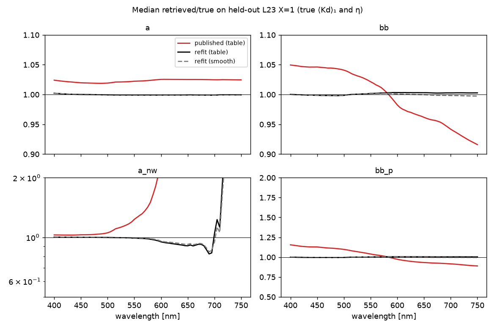
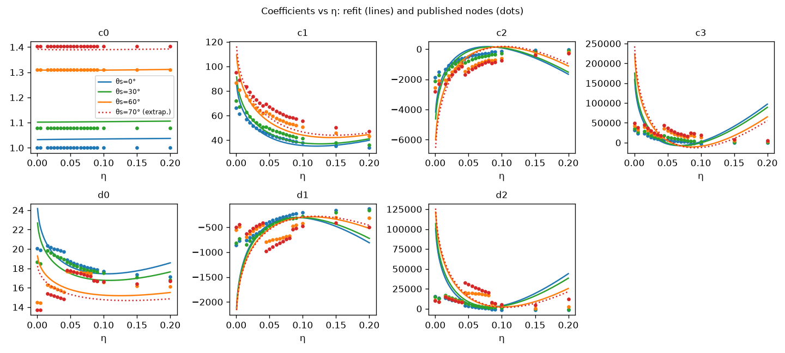

.. _ls2_refit_ab:

=====================================================
LS2 ``a`` and ``bb`` coefficients re-derived from L23
=====================================================

:Task: ls2 task 12 (Q6, Q11)
:Script: ``ioptics/runs/prototypes/ls2/refit_ab.py`` (every number, table and
   figure on this page); model code ``ocpy.ls2.refit``
:Table: ``ocpy/data/LS2/LS2_LUT_L23_v1.npz`` — the published ``LS2_LUT`` keys, so
   ``ocpy.ls2.ls2_main.ls2_invert`` takes it unchanged, plus the smooth model
   and its provenance.  Its κ is the published one; task 13's refit κ is
   in ``LS2_LUT_L23_abk_v1.npz`` (:ref:`ls2_refit_kappa`).
:Corpus: L23 X=1 (elastic: no Raman to confound the fit), θs = 0, 30, 60°,
   400–750 nm; 2324 training scenarios
   (492,336 cells), split by IOP scenario with the split
   of task 11 so the held-out set is shared

Summary
-------

On held-out L23 X=1, with true ⟨Kd⟩₁ and true η so that only the
coefficients differ:

* The **published** table reads ``a`` +2.46% (mean
  abs ln ratio 1.9%) and ``bb`` +1.15%
  (5.5%).  ``a_nw`` reads +3.30%
  (5.1%, where ``a_nw/a`` ≥ 0.1) and ``bb_p``
  +2.26% (10.6%).
* The **refit** read through the same table machinery gets ``a`` to
  -0.07% (0.2%), ``bb`` to
  +0.16% (0.6%), ``a_nw`` to
  -0.05% (0.6%) and ``bb_p`` to
  +0.29% (1.2%).
  Evaluated directly, without the table, the smooth model scores
  0.2% and 0.5%.  The difference is the cost of
  bilinear interpolation between the 21 × 8 nodes.
* The cubic form is kept, as Q11 asked.  Each coefficient is a quadratic in
  √(η/0.2), times ``(1, 1/μw)`` for ``a`` and ``(1, μw)`` for ``bb``.  That is
  24 parameters for ``a`` and 18 for ``bb``, against the
  published table's 672 and 504 numbers.
* **The limiting relation does not hold on L23, and it is illumination, not
  coefficients.**  The refit's ``c0`` (the Rrs → 0 limit of ⟨Kd⟩₁/a) is
  1.0333 at θs = 0°, against the paper's 1/μw = 1.
  It matches 1/μ_eff = 1.0358 from L23's own light field
  (ls2 Q9), which task 7's effective-μw rung had already pointed to.
* **Domain.**  L23's ``b/a`` spans 0.0023–14.14
  against the paper's 0.05–30.  The turbid part of the paper's range
  (14.1–30.0) is **unsampled**, and the refit
  there is an extrapolation.  10.6%
  of L23's cells are clearer than the paper's lower bound, which the refit
  does cover.  The θs = 70° node has no L23 data and is extrapolated by the
  ``μw`` basis.

Choosing the model: the 3-node μw check
---------------------------------------

L23 has three zeniths, so the geometry dependence can be tested by leaving one
out: train on 0°/60° and predict 30° (interpolation), and train on 0°/30° and
predict 60° (extrapolation, the regime the 70° node is in).  The ``a`` and
``bb`` tables are fitted independently, so each gets the basis that
extrapolates best:

* ``a``: with ``(1, 1/μw)``, the form of the limiting relation, the
  extrapolation error is 1.3%.  With
  ``(1, μw)`` it is 2.7%, and with no
  geometry dependence 20.3%.
* ``bb``: with ``(1, μw)`` it is 2.5%; with
  ``(1, 1/μw)`` 7.7%.  ``bb/⟨Kd⟩₁`` scales
  as μw for the same slant-path reason that ``⟨Kd⟩₁/a`` scales as 1/μw.

The η degree barely matters beyond 1 (table), so the lowest adequate degree,
2, is used: the "reduced, smoothed η axis" Q11 asked for.

.. csv-table:: Model selection: held-out test error and the two leave-one-zenith-out errors (mean abs ln ratio), per table, μw basis and η degree.
   :file: refit_selection.csv
   :header-rows: 1
   :widths: auto

Scores on the held-out scenarios
--------------------------------

   Median retrieved/true per wavelength on held-out L23 X=1 (true ⟨Kd⟩₁ and
   η; Raman off).  ``a_nw`` is on a log axis: in the red, where ``a_w`` is
   nearly all of ``a``, a small error in ``a`` becomes a large one in
   ``a_nw`` (ls2 Q34).

.. csv-table:: Mean abs ln ratio of a and bb per η bin (held-out), published table against refit.
   :file: refit_eta_bins.csv
   :header-rows: 1
   :widths: auto

.. csv-table:: Held-out scores. mae = mean abs ln(retrieved/true); ratio_λ = median ratio at λ; per-zenith mae. a_nw is scored only where a_nw/a ≥ 0.1 (Q34); frac_nan counts cells with no positive retrieval among those scored.
   :file: refit_scores.csv
   :header-rows: 1
   :widths: auto

The coefficients
----------------

   The refit (lines) against the published nodes (dots), at θs = 0, 30, 60
   and 70°.  70° (dotted) is an extrapolation of the μw basis: L23 has no
   data there.

The individual coefficients differ from the published ones, most visibly
above η ≈ 0.1 where L23 is thin.  A cubic's coefficients trade off against
one another, so that is not by itself an error.  What matters is the
retrieval, and the per-η table above shows the refit ahead in every bin,
including the sparsest: η 0.15–0.2, 447 held-out cells, ``a``
0.4% against 1.7% and ``bb``
0.9% against 5.3%.

.. csv-table:: The limiting relation. c0 is the Rrs → 0 limit of ⟨Kd⟩₁/a: the paper takes it as 1/μw; L23 gives 1/μ_eff.
   :file: refit_limiting.csv
   :header-rows: 1
   :widths: auto

.. csv-table:: Domain of the corpus against the paper.
   :file: refit_domain.csv
   :header-rows: 1
   :widths: auto

Limits
------

* Fitted on L23 X=1 with true inputs.  It removes the coefficient part of
  LS2's error on L23.  What is left with real inputs (Kd from a network, b_p
  from OC4v4), and with Raman via task 13's κ, is measured in :ref:`ls2_ours`.
* It is fitted to L23's ocean.  Task 11 found real water attenuating more
  than L23 predicts from the same Rrs (PANGAEA).  An L23-fitted table is as
  transferable as L23 is realistic.
* ``b/a`` above 14.14 (turbid water) and θs above 60° are
  extrapolations.
