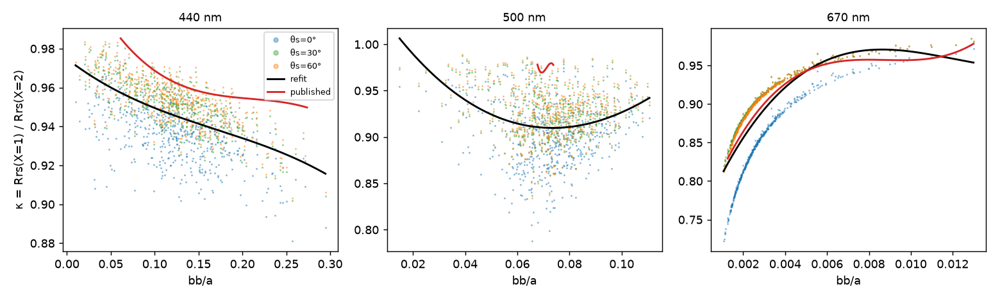
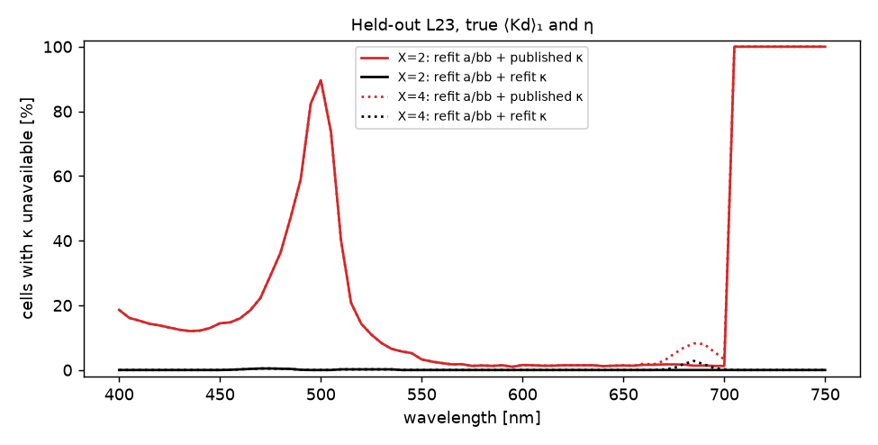

.. _ls2_refit_kappa:

==============================================================
LS2's Raman correction κ, re-derived from the matched L23 pair
==============================================================

:Task: ls2 task 13 (Q12)
:Script: ``ioptics/runs/prototypes/ls2/refit_kappa.py`` (every number, table
   and figure on this page); fitting code ``ocpy.ls2.refit.fit_kappa``
:Table: ``ocpy/data/LS2/LS2_LUT_L23_abk_v1.npz`` — task 12's refit ``a``/``bb`` plus
   this κ, in the published ``LS2_LUT`` layout: "our own LS2" for task 14
:Truth: κ = Rrs(X=1) / Rrs(X=2), the same water bodies elastic and with Raman,
   θs = 0/30/60°, 350–750 nm; split by IOP scenario (task 11's split)

Summary
-------

* **The NaN rate.**  In an inversion of held-out X=2 with true ⟨Kd⟩₁ and η,
  κ is unavailable on 25.4% of cells with the published
  table and on 0.1% with the refit.  On X=4 the rates
  are 25.8% and 0.2%.  Planning
  measured 19.1% for the published table, on a different
  cell set.  The published table's three defects all show up: the 702 nm
  stop, ranges that do not cover L23, and a broken 502 nm row (range
  [0.0652, 0.0707], coefficients up to 294973).
* **κ itself.**  Against the true κ on held-out cells, the refit is off by
  2.3% and evaluates on
  100.0% of cells (350–750 nm).  The
  published table is off by 3.3%
  where it evaluates at all, which is on
  75.8% of cells.
* **What κ buys** (held-out X=2, refit a/bb table, mean abs ln ratio):
  ``a`` 0.9% with no correction, 0.5% with the
  published κ and 0.4% with the refit; ``bb``
  10.6% → 4.6% → 2.6%; ``bb_p``
  20.7% → 9.0% → 5.2%.  The
  elastic ceiling (the same table on X=1, where no correction is needed) is
  0.2%, 0.6% and 1.2%.
* **The form is the published one**: a cubic in ``bb/a`` per wavelength.  κ
  does depend on the sun, but not monotonically in μw on L23's three zeniths,
  so no μw term survives the leave-one-zenith-out check (below).  That
  dependence is the floor the refit cannot get under.

Choosing the form
-----------------

On held-out scenarios a μw term helps a little: 1.8%
against 2.3% without.  But it fails the
leave-one-zenith-out check.  Trained on 0°/30° and asked for 60°, it is off by
10.1% with ``(1, μw)`` and 13.2%
with ``(1, 1/μw)``, against 2.4% with no μw term.
κ at θs = 0° differs from 30° and 60°, which agree with each other.  A
dependence that turns over between three samples cannot be fitted with a
low-order term in μw.  A cubic in ln(bb/a) is no better than one in bb/a
(2.3% against 2.3%), so the
published form stands, and the table drops into ``ls2_invert`` unchanged.

.. csv-table:: κ forms: mean abs relative error of κ, averaged over 350–750 nm, on held-out scenarios and in the two leave-one-zenith-out checks.
   :file: kappa_forms.csv
   :header-rows: 1
   :widths: auto

   True κ against ``bb/a`` on held-out cells, coloured by solar zenith, with
   the refit (black) and published (red) cubics drawn over each table's
   admissible range.  The spread between zeniths is the residual neither
   cubic can remove.

κ against truth
---------------

.. csv-table:: κ from each table, at the true bb/a of held-out cells: the share of cells it can evaluate (overall and per band), and its error where it does.
   :file: kappa_vs_truth.csv
   :header-rows: 1
   :widths: auto

The NaN rate in an inversion
----------------------------

   Share of cells where κ is unavailable in ``ls2_invert``, per wavelength,
   on held-out X=2 (solid) and X=4 (dotted).  The published table's gaps are
   the 490–505 nm hole from its 502 nm row, everything above 702 nm, and
   cells whose ``bb/a`` falls outside its rows' ranges.

.. csv-table:: Inversions on held-out L23 with true ⟨Kd⟩₁ and η: the κ-unavailable share and the accuracy of a, bb, a_nw (where a_nw/a ≥ 0.1) and bb_p.
   :file: kappa_inversions.csv
   :header-rows: 1
   :widths: auto

On X=4, which adds chlorophyll fluorescence near 685 nm, the refit κ corrects
only the Raman part, by construction.  ``bb_p`` there goes from
26.1% uncorrected to 10.5%, against
5.2% on X=2.  The gap is consistent with the fluorescence
this κ does not model; separating it from other X=4 effects is not attempted
here.  For reference, the published a/bb and κ together score
``a`` 1.8%, ``bb`` 7.9% on X=2.

The table
---------

.. csv-table:: The refit κ table: one row per 5 nm, 350–750 nm, in the published column order (κ = c3 r³ + c2 r² + c1 r + c0, r = bb/a, valid on [bb_a_min, bb_a_max]).
   :file: kappa_table.csv
   :header-rows: 1
   :widths: auto

Limits
------

* κ's dependence on the sun is real but cannot be modelled from three
  zeniths; it remains as scatter around the cubic.
* The ranges are L23's, which is clear-water dominated.  Turbid ``bb/a``
  beyond them is NaN, by design.
* Chlorophyll fluorescence (X=4) is outside this κ.
