=================================================
Cross-algorithm comparison — multi_L23_PANGAEA_v2
=================================================

:Sweep: multi_L23_PANGAEA_v2
:Generated: 2026-08-07T21:54:17Z
:ioptics: 0.0.dev0@61c83e0
:bing: 0.0.dev0@f242b0e
:ocpy: 0.1.0@3aed28a
:design_doc: 0.16
:implementation_doc: 0.23

Overview
--------

This is the **Cross-algorithm comparison** for sweep ``multi_L23_PANGAEA_v2`` — a uniform comparison of the IOP-retrieval algorithms ``expb_pow``, ``giop``, ``gsm`` on L23, PANGAEA. Each algorithm inverts the observed remote-sensing reflectance :math:`R_{rs}(\lambda)` for the inherent optical properties (absorption :math:`a`, backscatter :math:`b_b`, and their phytoplankton / CDOM-detritus / particulate components), and the retrieval is scored against the dataset's truth. The figures and tables below show **retrieval accuracy vs. truth**, **fit quality / closure**, and **model selection** between the algorithms; the interactive scatter lets you drill into any component or trophic stratum. See :doc:`/models` for what each algorithm parameterizes and :doc:`/datasets` for the data + truth. The header above stamps the exact code + config versions, so every number is reproducible from the persisted sweep artifacts.

**Reading the numbers.** ``mae`` and ``bias`` are **fractional multiplicative** errors in log space, following Erickson (2023): :math:`\mathrm{mae} = 10^{\langle|\log_{10} M/O|\rangle} - 1`, so **0 = perfect** and ``0.109`` means 10.9% (Seegers 2018 publishes the un-subtracted factor, ``1.109``, for the same fit — the forms differ by one). ``bias`` is signed, > 0 = over-estimate. The other columns have **different** perfect values, which is why they are read separately: ``median_ratio`` and GIOP's ``Ratio`` are perfect at **1**; ``win_frac`` is a head-to-head share, so **0.5 = a tie**; and ``coverage68`` / ``coverage95`` are perfect at their **nominal 0.68 / 0.95** — an algorithm can be the most accurate and still be over-confident about its uncertainty, which the ``*_verdict`` columns name (``over-confident`` / ``consistent`` / ``conservative``; *consistent* means not distinguishable from nominal at this ``n_pairs``, which on a thin contest is a weak statement). Three different denominators appear and are named apart: ``n_pairs`` (surviving retrieval-truth pairs), ``n_scored`` (spectra that produced a usable fit) and ``n_attempted`` (spectra the sweep tried).

Retrieved vs. true — a(440)
---------------------------

Retrieved vs. true **a(440)**, one point per observation and algorithm on log–log axes. Points on the solid **1:1** line are perfect; the dashed **3:1** and **1:3** guides mark the ±3× envelope. Each legend entry carries that algorithm's own ``n_pairs``, its median ratio (1 = perfect) and MPD (median absolute percent difference, 0 = perfect), so the panel can be read without the table below.

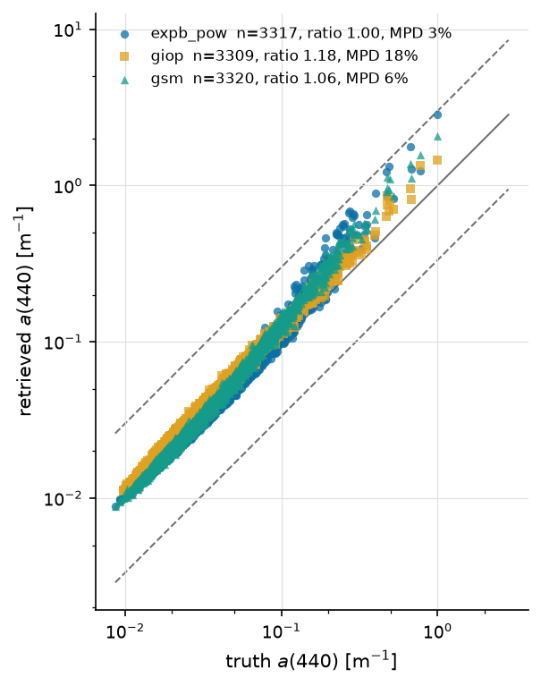

   a(440), all algorithms — at most 3314 retrieval-truth pairs per algorithm; each legend entry states its own.

Ratio distribution — a(440)
---------------------------

How the population is distributed about 1:1, per accuracy bucket — the companion a scatter is conventionally paired with (GIOP Figs. 1-2), because central tendency alone hides the spread that decides whether a retrieval is usable. The vertical rule marks ratio = 1.

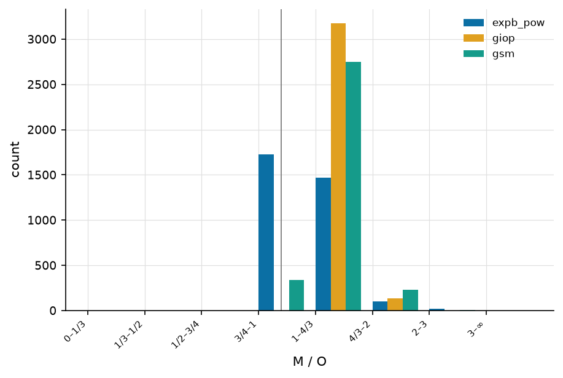

   Retrieved/true ratio buckets for a(440).

Retrieved vs. true — bb(555)
----------------------------

Retrieved vs. true **bb(555)**, one point per observation and algorithm on log–log axes. Points on the solid **1:1** line are perfect; the dashed **3:1** and **1:3** guides mark the ±3× envelope. Each legend entry carries that algorithm's own ``n_pairs``, its median ratio (1 = perfect) and MPD (median absolute percent difference, 0 = perfect), so the panel can be read without the table below.

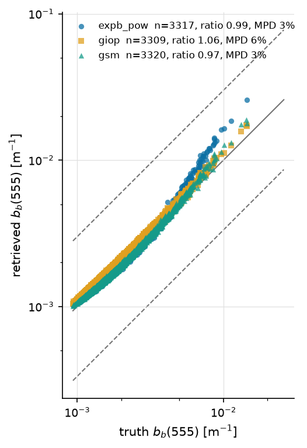

   bb(555), all algorithms — at most 3314 retrieval-truth pairs per algorithm; each legend entry states its own.

Ratio distribution — bb(555)
----------------------------

How the population is distributed about 1:1, per accuracy bucket — the companion a scatter is conventionally paired with (GIOP Figs. 1-2), because central tendency alone hides the spread that decides whether a retrieval is usable. The vertical rule marks ratio = 1.

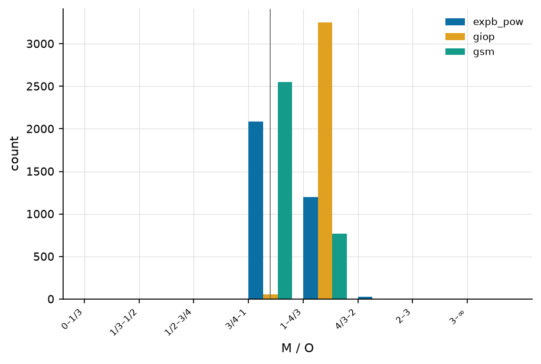

   Retrieved/true ratio buckets for bb(555).

Retrieved vs. true — a_dg(440)
------------------------------

Retrieved vs. true **a_dg(440)**, one point per observation and algorithm on log–log axes. Points on the solid **1:1** line are perfect; the dashed **3:1** and **1:3** guides mark the ±3× envelope. Each legend entry carries that algorithm's own ``n_pairs``, its median ratio (1 = perfect) and MPD (median absolute percent difference, 0 = perfect), so the panel can be read without the table below.

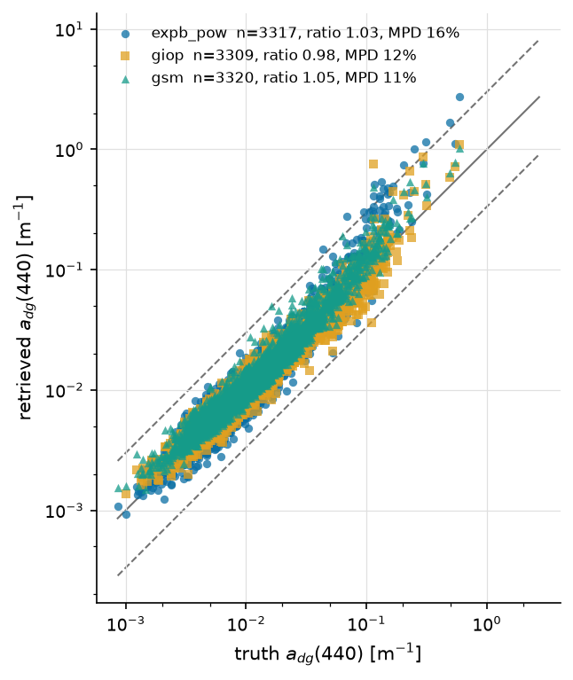

   a_dg(440), all algorithms — at most 3314 retrieval-truth pairs per algorithm; each legend entry states its own.

Ratio distribution — a_dg(440)
------------------------------

How the population is distributed about 1:1, per accuracy bucket — the companion a scatter is conventionally paired with (GIOP Figs. 1-2), because central tendency alone hides the spread that decides whether a retrieval is usable. The vertical rule marks ratio = 1.

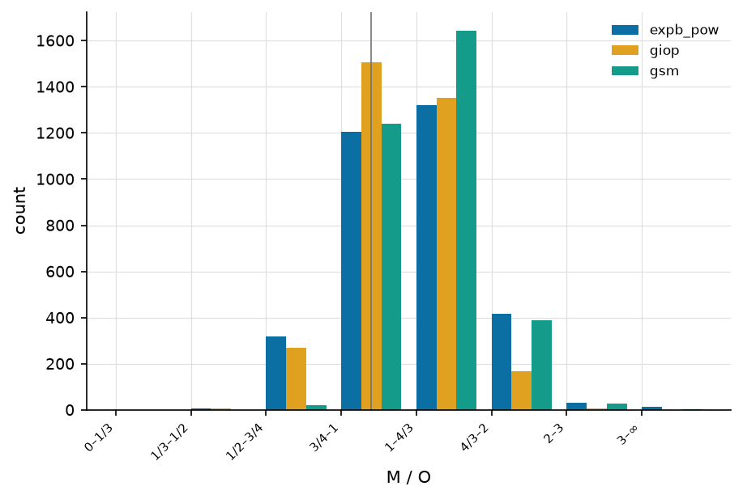

   Retrieved/true ratio buckets for a_dg(440).

Taylor & Target — a(440)
------------------------

**Taylor** (first) and **Target** (second) diagrams for :math:`a(440)`, computed in log space and drawn for the sweep's best-covered component. The Taylor diagram places each algorithm by its correlation with truth (azimuth, labelled in correlation) and normalized standard deviation (radius); the reference star sits at correlation 1, norm-σ 1, and the dotted arcs are centred-RMSD contours about it. The Target diagram plots bias (y) against the sign-carrying unbiased RMSD (x), with dotted constant-RMSD rings — the closer to the origin, the better.

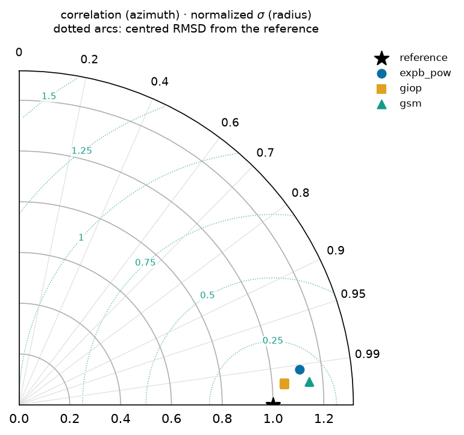

   Taylor diagram — a(440): correlation (azimuth) vs normalized standard deviation (radius), with centred-RMSD arcs about the reference star.

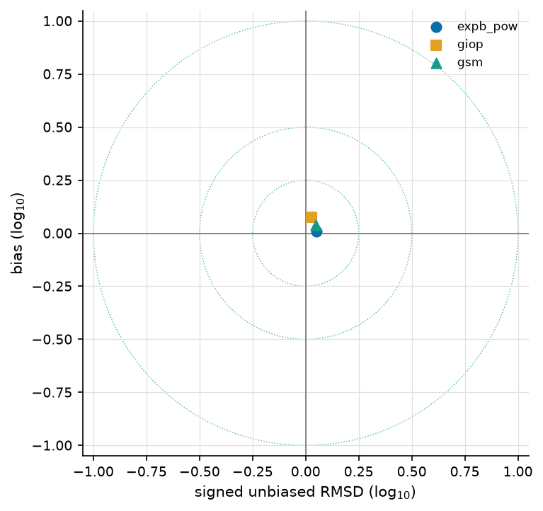

   Target diagram — a(440): bias vs signed unbiased RMSD, with constant-RMSD rings; the origin is a perfect retrieval.

Model selection (ΔBIC)
----------------------

Cumulative distribution of **ΔBIC** per spectrum for this sweep's complexity contest — ``expb_pow`` (k=5) against ``giop`` (k=3), chosen as its highest- and lowest-parameter algorithms. ΔBIC < 0 favours the more complex model ``expb_pow``; ΔBIC > 0 favours the parsimonious ``giop``. The curve shows what fraction of spectra fall either side — i.e. whether the extra parameters earn their keep. See :doc:`/models`.

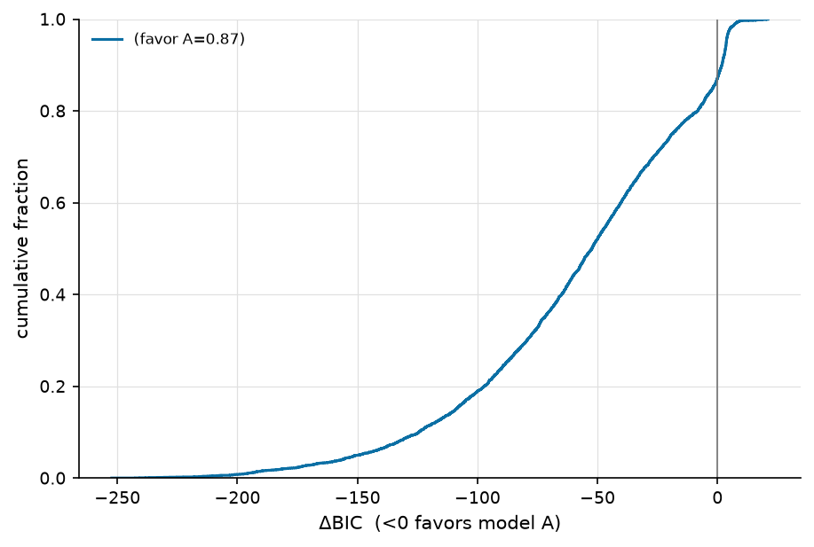

   Per-spectrum ΔBIC, ``expb_pow`` vs ``giop``: the fraction of spectra either side of 0 says whether the extra parameters earn their keep.

Accuracy vs. wavelength — L23
-----------------------------

How each algorithm's error varies **across the spectrum** on **L23**, for the 5 component(s) scored at 5 or more bands (``a``, ``a_dg``, ``bb``, ``bb_p``, ``a_ph``; up to 71 bands). A retrieval can be accurate in the blue and useless in the red, which a single reference-band number cannot show — this is the per-band view of the same ``mae`` the accuracy table reports at its reference wavelengths. Each algorithm keeps its colour, marker and linestyle from every other figure. Datasets are drawn separately: their band sets and sample sizes differ, so one line through both would show a sparse dataset's bands as spectral structure.

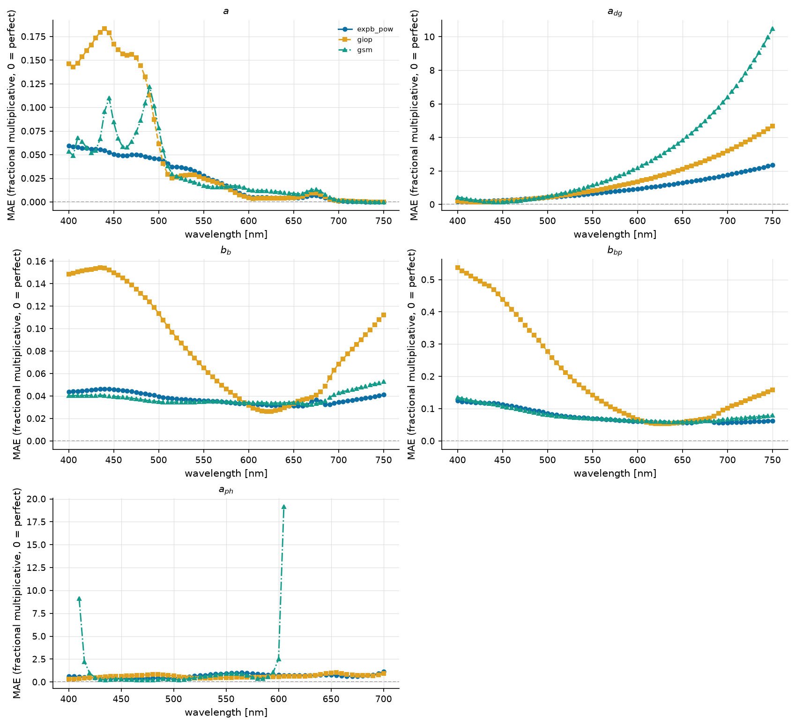

   Fractional multiplicative MAE against wavelength on L23, one panel per component, all algorithms overlaid. The dashed rule is the perfect value (0).

Accuracy vs. wavelength — PANGAEA
---------------------------------

How each algorithm's error varies **across the spectrum** on **PANGAEA**, for the 3 component(s) scored at 5 or more bands (``a_dg``, ``a_ph``, ``bb_p``; up to 23 bands). A retrieval can be accurate in the blue and useless in the red, which a single reference-band number cannot show — this is the per-band view of the same ``mae`` the accuracy table reports at its reference wavelengths. Each algorithm keeps its colour, marker and linestyle from every other figure. Datasets are drawn separately: their band sets and sample sizes differ, so one line through both would show a sparse dataset's bands as spectral structure.

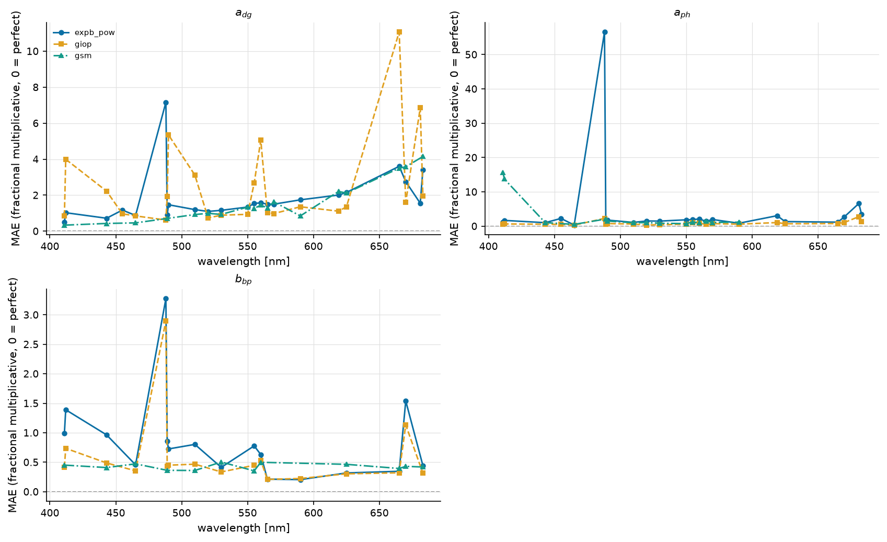

   Fractional multiplicative MAE against wavelength on PANGAEA, one panel per component, all algorithms overlaid. The dashed rule is the perfect value (0).

Per trophic stratum
-------------------

Observations are binned by chlorophyll into oligotrophic / mesotrophic / eutrophic (<0.1, <1, ≥1 mg m⁻³), preferring truth Chl over retrieved. This sweep resolves ``mesotrophic`` (n_attempted 2495), ``oligotrophic`` (n_attempted 648), ``eutrophic`` (n_attempted 1743). A further **266 spectra (38 scored pair(s)) have no chlorophyll at all** — neither truth nor a retrieved value — so they cannot be binned and are left out of the tables below rather than shown as a fourth water type. They are still counted in the pooled numbers above. Every table above pools these together, and pooling is what hides a regime change — an algorithm can be usable in one trophic state and not in the next, which is the whole question for a coastal dataset.

Accuracy — mesotrophic
----------------------

The same accuracy columns as the pooled table, over the ``mesotrophic`` stratum alone — at most 2495 retrieval-truth pair(s), from 2495 attempted spectra. Columns are defined on the :doc:`/reports/glossary` page.

.. csv-table:: Ref-band accuracy, mesotrophic only.
   :file: accuracy_chisq_mesotrophic.csv
   :header-rows: 1
   :widths: auto

Quality control — mesotrophic
-----------------------------

Retrieval success within ``mesotrophic``. ``frac_ok`` and ``frac_not_ok`` are complements over this stratum's 2495 attempted spectra, so they can be read directly against the other strata.

.. csv-table:: Fit quality / closure, mesotrophic only.
   :file: qc_chisq_mesotrophic.csv
   :header-rows: 1
   :widths: auto

Accuracy — oligotrophic
-----------------------

The same accuracy columns as the pooled table, over the ``oligotrophic`` stratum alone — at most 648 retrieval-truth pair(s), from 648 attempted spectra. Columns are defined on the :doc:`/reports/glossary` page.

.. csv-table:: Ref-band accuracy, oligotrophic only.
   :file: accuracy_chisq_oligotrophic.csv
   :header-rows: 1
   :widths: auto

Quality control — oligotrophic
------------------------------

Retrieval success within ``oligotrophic``. ``frac_ok`` and ``frac_not_ok`` are complements over this stratum's 648 attempted spectra, so they can be read directly against the other strata.

.. csv-table:: Fit quality / closure, oligotrophic only.
   :file: qc_chisq_oligotrophic.csv
   :header-rows: 1
   :widths: auto

Accuracy — eutrophic
--------------------

The same accuracy columns as the pooled table, over the ``eutrophic`` stratum alone — at most 171 retrieval-truth pair(s), from 1743 attempted spectra. Columns are defined on the :doc:`/reports/glossary` page.

.. csv-table:: Ref-band accuracy, eutrophic only.
   :file: accuracy_chisq_eutrophic.csv
   :header-rows: 1
   :widths: auto

Quality control — eutrophic
---------------------------

Retrieval success within ``eutrophic``. ``frac_ok`` and ``frac_not_ok`` are complements over this stratum's 1743 attempted spectra, so they can be read directly against the other strata.

.. csv-table:: Fit quality / closure, eutrophic only.
   :file: qc_chisq_eutrophic.csv
   :header-rows: 1
   :widths: auto

Model selection by stratum (ΔBIC)
---------------------------------

The same contest as above, split by trophic stratum. ΔBIC < 0 favours the more complex ``expb_pow``. A pooled curve can hide a reversal — extra parameters that pay in turbid water and cost in clear water average out to "no difference".

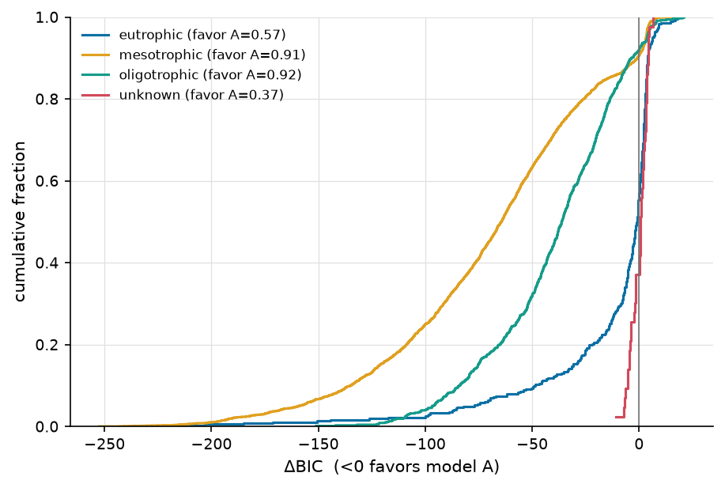

   Per-spectrum ΔBIC, ``expb_pow`` vs ``giop``, one curve per trophic stratum.

Accuracy
--------

Per-(dataset, component, reference wavelength) retrieval accuracy for the χ² population: fractional multiplicative **mae**/**bias** (0 = perfect, ``mae`` 0.1 ≈ 10%), **median_ratio** (1 = perfect), **coverage68/95** against their nominal 0.68/0.95 with a ``*_verdict`` of over-confident / consistent / conservative (a real miss being more than 2 binomial standard errors; at small ``n_pairs`` only a gross miss is detectable, so *consistent* means "not distinguishable from nominal here", not "calibrated"), the cross-algorithm ranks (``*_rank``, 1 = best) and the head-to-head **win_frac** (0.5 = tie). ``n_pairs`` counts surviving retrieval-truth pairs; ``ref_match`` is the native band actually used (±3 nm). Every column is defined on the :doc:`/reports/glossary` page. 15 further (component, band) rows are omitted because this sweep scored no retrieval-truth pairs for them.

.. csv-table:: Ref-band accuracy + wins (χ², all strata).
   :file: accuracy_chisq_all.csv
   :header-rows: 1
   :widths: auto

Head-to-head
------------

Every algorithm pair, judged on the spectra **both** of them retrieved. ``delta_mae`` is ``mae(A) − mae(B)`` on those shared spectra (negative favours A) and ``d_lo``/``d_hi`` are its paired-bootstrap 95% interval, after the round-robin practice of resampling the data to put uncertainty on a ranking. The ``verdict`` names a winner only when the interval excludes 0 **and** the difference clears a practical floor of 10%. It reads ``indistinguishable`` only when the **whole interval** lies inside that floor — i.e. the data rule a material difference out — and ``underpowered`` when the interval is too wide to say either way at this ``n_paired``. Here 24 pair(s) are indistinguishable and 5 are underpowered, out of 42. A further 12 pair(s) share no scoreable spectrum and are omitted.

.. csv-table:: Pairwise verdicts (χ², all strata).
   :file: head_to_head_chisq_all.csv
   :header-rows: 1
   :widths: auto

Quality control
---------------

Fit-quality summary per dataset and algorithm. ``n_attempted`` is what the sweep tried and ``n_scored`` what produced a usable fit — the gap is explained by the per-status fractions, which are kept apart on purpose: ``frac_out_of_scope`` (spectrum outside the model family's regime) and ``frac_fit_failed`` (the fitter returned nothing) are the same ``frac_not_ok`` and entirely different findings. Also the median reduced **χ²ᵥ**, the noise-model-free **rel_misfit** (GIOP's ΔRrs), and the χ²ᵥ closure split (``frac_good`` ≈ 1, ``frac_overfit`` < 1, ``frac_underfit`` > 1, ``frac_qc_fail`` = non-solutions).

.. csv-table:: Fit quality / closure (χ²).
   :file: qc_chisq_all.csv
   :header-rows: 1
   :widths: auto

Interactive
-----------

Retrieved vs. true, **interactive**: pick the dataset, algorithm, component and trophic stratum, and hover any point for its ``obs_id``, wavelength and values — so an outlier can be traced back to a spectrum. The figure title states what fraction of the population is plotted (the cloud is downsampled to keep the page small; the static panels above summarize all of it).

.. raw:: html

   
   
   

   <script>
   (function() {
     const fn = function() {
       Bokeh.safely(function() {
         (function(root) {
           function embed_document(root) {
           const docs_json = '{"0c833bb0-2a1b-4489-88cc-ae3a7329856f":{"version":"3.9.1","title":"Bokeh Application","config":{"type":"object","name":"DocumentConfig","id":"p1068","attributes":{"notifications":{"type":"object","name":"Notifications","id":"p1069"}}},"roots":[{"type":"object","name":"Column","id":"p1067","attributes":{"children":[{"type":"object","name":"Select","id":"p1062","attributes":{"js_property_callbacks":{"type":"map","entries":[["change:value",[{"type":"object","name":"CustomJS","id":"p1066","attributes":{"args":{"type":"map","entries":[["full",{"type":"object","name":"ColumnDataSource","id":"p1006","attributes":{"selected":{"type":"object","name":"Selection","id":"p1007","attributes":{"indices":[],"line_indices":[]}},"selection_policy":{"type":"object","name":"UnionRenderers","id":"p1008"},"data":{"type":"map","entries":[["x",[1.9711999893188477,0.00043123000068590045,0.0002579999854788184,0.41214001178741455,0.07159899920225143,0.8378599882125854,0.0012787999585270882,0.0011141999857500196,0.0019347999477759004,0.00072900002123788,0.015172000043094158,0.05965600162744522,0.001800999976694584,0.0005920000257901847,0.0025245000142604113,0.0007550000445917249,0.00023099999816622585,0.0061472998932003975,0.000855070014949888,0.01961199939250946,0.0009598699980415404,0.0012698499485850334,0.0031119000632315874,0.007445000112056732,0.003638500114902854,0.038485001772642136,0.001145999995060265,0.16806000471115112,0.04500000178813934,0.002072799950838089,0.00106669997330755,0.0013638000236824155,0.11218000203371048,0.003266999963670969,0.0005321800126694143,0.0011979000410065055,0.002313799923285842,0.6462799906730652,2.510200023651123,0.0014151999494060874,0.0014938999665901065,0.0003020000003743917,0.5264099836349487,0.0004844999930355698,0.011229999363422394,0.013704000040888786,0.3024500012397766,0.0003370000049471855,0.00045633999980054796,0.0032915999181568623,0.00294,0.005697399843484163,0.0020749999675899744,0.0009299800149165094,0.09139999747276306,0.012949000112712383,0.0006375099765136838,0.02269200049340725,0.001399099943228066,0.000669509987346828,0.0007806000066921115,0.0002579999854788184,0.024437999352812767,0.0044351001270115376,0.007000999990850687,0.4110200107097626,0.0039369999431073666,0.0056570000015199184,0.0023445601109415293,0.00406577019020915,0.002678999910131097,0.11490999907255173,0.0011502000270411372,0.0009629999985918403,0.003208999987691641,0.0007350000087171793,0.0013191000325605273,0.04731699824333191,0.0009041400044225156,0.030510999262332916,0.0036605000495910645,0.004072899930179119,0.0021470000501722097,0.0024840000551193953,0.06509300321340561,0.0020004999823868275,0.0077840001322329044,0.0007255399832502007,0.0031377600971609354,0.13580000400543213,0.0013370000524446368,0.0008660000166855752,0.0008167999912984669,0.004201800096780062,0.004052999895066023,0.0009397600078955293,0.0008886000141501427,0.0011402600212022662,0.0004335799894761294,0.0026769000105559826,0.0022696598898619413,0.0010379999876022339,0.0012895000400021672,0.0027489999774843454,0.00665,0.004968100227415562,0.0012025999603793025,0.07353600114583969,0.0004422999918460846,0.04066000133752823,0.0018070000223815441,0.02117300033569336,0.0017707999795675278,0.001410700031556189,0.00041978000081144273,0.0006377400131896138,0.03613999858498573,0.0007900599739514291,0.005452999845147133,0.07052899897098541,0.0032919999212026596,0.00040600000647827983,0.01584799960255623,0.001079699955880642,0.003967199940234423,0.827210009098053,0.015272999182343483,0.003288300009444356,0.0012287000427022576,0.000986000057309866,0.013553000055253506,0.517549991607666,0.020762000232934952,0.003249299945309758,0.0011983000440523028,0.03769500181078911,0.6243500113487244,0.000728400016669184,0.0013922000071033835,0.0027439999394118786,0.002923100022599101,0.0075889998115599155,0.0027510300278663635,0.0028490000404417515,0.0015360000543296337,0.8284900188446045,0.0005133799859322608,0.1397400051355362,0.0016199999954551458,0.0024939998984336853,0.001680399989709258,0.004370000213384628,0.05399100109934807,0.010354999452829361,0.0027179999742656946,0.0005107600009068847,0.10339599847793579,0.0012214999878779054,0.0060640000738203526,0.29526999592781067,0.027369000017642975,0.004133999813348055,0.0008040000102482736,0.0657309964299202,0.003872599918395281,0.00033660000190138817,0.0012638999614864588,0.058072999119758606,0.559440016746521,0.46557000279426575,0.0007118199719116092,0.0007145300041884184,0.03562900051474571,1.9703999757766724,0.0011566999601200223,0.0003189999843016267,0.06058000028133392,0.001415099948644638,0.0015492000384256244,0.0017850000876933336,0.0038479999639093876,0.02878499962389469,0.04700399935245514,0.00024791000760160387,0.0018209000118076801,0.0010679099941626191,0.0006982699851505458,0.007511000148952007,0.0008896299987100065,0.1359499990940094,0.005152000114321709,0.012125999666750431,0.0174189992249012,0.00012768000306095928,0.8274000287055969,0.0008520000264979899,0.04304200038313866,0.0010686999885365367,0.0595409981906414,0.06156599894165993,0.0179820004850626,0.0014832000015303493,0.017471998929977417,0.0022740999702364206,0.001766999950632453,0.001231699949130416,0.0031294000800698996,0.016707999631762505,0.0006992000271566212,0.0059,0.0013849999522790313,0.00215600011870265,0.001184999942779541,0.0022900099866092205,0.003941100090742111,0.005541000049561262,0.022996999323368073,0.0012776999501511455,0.001578459981828928,0.046571001410484314,0.006903000175952911,0.0008378999773412943,0.0025790000800043344,0.0005990099743939936,0.0009672800078988075,0.009939000010490417,0.002280399901792407,0.03005100041627884,0.0031804200261831284,0.0012019999558106065,0.43053001165390015,0.03653800114989281,0.002457000082358718,0.06275799870491028,0.0025889999233186245,0.0011149999918416142,0.0028152999002486467,0.0009751999750733376,0.038763001561164856,0.0006683400133624673,0.0016584600089117885,0.0033054999075829983,0.0014391000149771571,0.0016704000299796462,0.000849839998409152,0.03755300119519234,0.001997999846935272,0.026096999645233154,0.0014574399683624506,0.0003644899989012629,0.004118110053241253,0.0012629999546334147,0.01287699956446886,0.00022899999748915434,0.06779500097036362,0.0002519999979995191,0.3421100080013275,0.00022499999613501132,0.001462099957279861,0.0010168999433517456,0.00396,0.019471000880002975,0.01965700089931488,0.006858000066131353,0.0008352500153705478,0.26089999079704285,0.0004970600130036473,0.003333499887958169,0.003370000049471855,0.04891800135374069,0.001435199985280633,0.0005517500103451312,0.08022099733352661,0.0017,0.0076590003445744514,0.0018549999222159386,0.0027479000855237246,0.020150000229477882,0.0013119999784976244,0.10051999986171722,0.00027099999715574086,0.00031400000443682075,0.0007169999880716205,0.01802000030875206,0.008012999780476093,0.00193060003221035,0.003759999992325902,0.0005562499864026904,0.00029585001175291836,0.0008131699869409204,0.001708409981802106,0.029120000079274178,0.16888999938964844,0.007774000056087971,0.013694999739527702,0.08271600306034088,0.0012039999710395932,0.09735699743032455,0.00814600009471178,0.0005342600052244961,0.0009075499838218093,0.01081099919974804,0.0003878000134136528,0.0023479999508708715,0.0002792000013869256,0.0010372999822720885,0.004279899876564741,0.0021703001111745834,0.022055000066757202,0.005031999666243792,0.0006539999740198255,0.0034290000330656767,0.0005319999763742089,0.0019799000583589077,0.004255000036209822,0.0035874000750482082,0.2773999869823456,0.0007919599884189665,0.03759799897670746,0.0019199399976059794,0.0008734600269235671,0.0016231000190600753,0.30768999457359314,0.006016999948769808,0.0039,0.0032577000092715025,0.0007034500013105571,0.001206299988552928,0.0007303999736905098,0.06419199705123901,0.001294999965466559,0.0004425999941304326,0.039448998868465424,0.0011992000509053469,0.004875000100582838,0.0009822699939832091,0.0024077999405562878,0.04837600141763687,0.0007660000119358301,0.00266100000590086,0.4886699914932251,0.0038650999777019024,0.0004877900064457208,0.0006883500027470291,0.0032667999621480703,0.0034398999996483326,0.0011424899566918612,0.0020280000753700733,0.0006128000095486641,0.0026209999341517687,0.0013989999424666166,0.0007072900189086795,0.004030999727547169,0.0010362999746575952,0.0026195000391453505,0.018644001334905624,0.0007218300015665591,0.0012767999432981014,0.055174000561237335,0.0014334999723359942,0.011839000508189201,0.0006340600084513426,0.0004564299888443202,0.001319900038652122,0.01769,0.0032232999801635742,0.5167700052261353,0.0009711100137792528,0.003699700115248561,0.0009480000007897615,0.0011789000127464533,0.046727001667022705,0.007625000085681677,0.001690999954007566,0.016026999801397324,0.005996000021696091,0.000609349983278662,0.00407399982213974,0.02044600062072277,0.015521000139415264,0.0011630000080913305,0.0022968000266700983,0.004312899895012379,0.0018829300533980131,0.035068001598119736,0.005758999846875668,0.0014270000392571092,0.0011729999678209424,0.10095000267028809,0.01800600066781044,0.022133000195026398,0.002967699896544218,0.002371659968048334,0.00029299999005161226,0.0005439600208774209,0.035339999943971634,0.0006812600186094642,0.0007520000217482448,1.2314000129699707,0.0018867000471800566,0.003387999953702092,0.00060299999313429,0.0009595699957571924,0.004788000136613846,0.0015459000132977962,0.27702000737190247,0.0003533000126481056,0.001200399943627417,0.0026211999356746674,0.0003769999893847853,0.0004870000120718032,0.007110999897122383,0.0008693899726495147,0.024329999461770058,0.00041929000872187316,0.0006590799894183874,0.005669000092893839,0.00020029999723192304,0.0007169999880716205,0.0008420000085607171,0.5594599843025208,0.0012597000459209085,0.0008039699750952423,0.0027503001037985086,0.00817249994724989,0.0008597599808126688,0.0026191999204456806,0.34163999557495117,0.000873010023497045,2.830199956893921,0.0916220024228096,0.01375,0.001006989972665906,0.0008568799821659923,0.00042913001379929483,0.27827000617980957,0.003355999942868948,0.0005512199713848531,0.0005160000291652977,0.003120000008493662,0.04753,0.023403000086545944,0.0008054000209085643,0.00018926999473478645,0.015060000121593475,0.0019440000178292394,0.0013324300525709987,0.006225999910384417,0.0006448699859902263,0.26559001207351685,0.0010519999777898192,0.0014185999752953649,0.002114600036293268,0.00227316003292799,0.001227600034326315,0.005260000005364418,0.06592299789190292,0.0009034899994730949,0.022565999999642372,0.07679100334644318,0.0006900000153109431,0.000665700004901737,0.004357299767434597,0.0460209995508194,0.0028556999750435352,0.0012109000235795975,0.0024610001128166914,0.003341000061482191,0.0005620000301860273,0.002839399967342615,0.0013620000099763274,0.0024449999909847975,0.000709489977452904,0.2849400043487549,0.0003463700122665614,0.004925000015646219,0.0019370999652892351,0.0014872000319883227,0.0020980399567633867,0.000768299971241504,0.00105489999987185,0.0006870600045658648,0.07123500108718872,0.031536001712083817,0.0012710000155493617,0.0008188699721358716,0.002015999983996153,0.001137100043706596,0.0007241499843075871,0.0010034999577328563,0.0013010000111535192,0.0737610012292862,0.019538000226020813,0.00015100000018719584,0.06292200088500977,0.0008736500167287886,2.780100107192993,0.0011709999525919557,0.0011317000025883317,0.002392200054600835,0.003527299966663122,0.002440999960526824,0.00028199999360367656,0.0011328000109642744,0.021438999101519585,0.007798000238835812,0.0009819399565458298,0.001664999988861382,0.11759600043296814,0.006126000080257654,0.0004317499988246709,0.0022632000036537647,0.06975,0.002044929889962077,0.003774999873712659,0.009163999930024147,0.00043899999582208693,0.009154999628663063,0.001129099982790649,0.0032162999268621206,0.03707899898290634,0.0013652000343427062,0.03231300041079521,0.0023242998868227005,0.019404999911785126,0.0003297399962320924,0.0003600000054575503,0.0005186399794183671,0.07129999995231628,0.0012939999578520656,0.0012773999478667974,0.004178700037300587,0.0005262800259515643,0.0011891999747604132,0.22283999621868134,0.43046998977661133,0.0005500299739651382,0.003684429917484522,0.0007800000021234155,0.28762000799179077,0.4406000077724457,0.0005463800043798983,0.0015463000163435936,0.0020864999387413263,0.002663099905475974,0.003719000145792961,0.0005472999764606357,0.00381199992261827,0.0006779999821446836,0.00220589991658926,2.830899953842163,0.0010599999222904444,0.001400899956934154,0.0003528700035531074,0.0016468999674543738,0.04304200038313866,0.000610699993558228,0.0007999800145626068,0.004255000036209822,0.0016983000095933676,0.0011784000089392066,0.016181999817490578,0.0008229999803006649,0.0016513000009581447,0.004215999972075224,0.11012,0.002850400051102042,0.03326300159096718,0.5200200080871582,0.0002460000105202198,0.0681840032339096,0.0004870000120718032,0.0018860000418499112,0.00022699999681208283,0.17258000373840332,0.000898559985216707,0.0005549800116568804,0.0005339999916031957,0.0008030000026337802,0.0004569999873638153,0.002481000032275915,0.0048779998905956745,0.0018924,0.0005375000182539225,0.41047999262809753,0.0034741999115794897,0.0003549999964889139,0.0019060000777244568,0.004964000079780817,0.000788999954238534,0.044888000935316086,0.0051380000077188015,0.014413000084459782,0.00045700001646764576,0.0003556000010576099,2.7802999019622803,0.00040345999877899885,0.001290000043809414,0.011869999580085278,0.0018850000342354178,0.0024524000473320484,0.06564699858427048,0.007490099873393774,0.0019425000064074993,0.0017257999861612916,0.0035890000872313976,0.0027811999898403883,0.0038660001009702682,0.000826000003144145,0.0022603000979870558,0.00457700015977025,0.019847000017762184,0.004657000303268433,0.00011300000187475234,0.0015524999471381307,0.00011700000322889537,0.00029510000604204834,0.31196001172065735,0.0551690012216568,0.0006841999711468816,0.0005973000079393387,0.28540998697280884,0.02538999915122986,0.0008689999813213944,0.00286250002682209,0.0006290000164881349,0.008751999586820602,0.0035470000002533197,0.0007495100144296885,0.005607999861240387,0.41583,0.02408199943602085,0.006486999802291393,0.0004917699843645096,0.00279,0.0008000200032256544,0.01037800032645464,0.0024820000398904085,0.001614999957382679,0.0008299999753944576,0.005096199922263622,0.09167899936437607,0.0007479999912902713,0.0008901000255718827,0.0005440000095404685,0.0025025999639183283,0.019081000238656998,0.01084199920296669,0.003903999924659729,0.06095299869775772,0.0011219000443816185,1.489300012588501,0.00622900016605854,0.001614999957382679,0.0016796999843791127,0.0012019999558106065,0.2697699964046478,0.0016404000343754888,0.008408959954977036,0.13800999522209167,0.0009050000226125121,0.017777999863028526,0.0007402999908663332,0.0009450800134800375,0.007158999796956778,0.001227000029757619,0.00301,0.002067799912765622,0.0027477999683469534,0.0012376999948173761,0.002510800026357174,0.0007157900254242122,0.00914200022816658,0.005510999821126461,0.019898999482393265,0.0006646999972872436,0.000783999974373728,0.00015700000221841037,0.00418870011344552,0.0010575000196695328,0.4504300057888031,0.0013760000001639128,0.00046900002053007483,0.0009800000116229057,0.14568999409675598,0.001007299986667931,0.00041065001278184354,0.0028600001242011786,0.006591999903321266,0.06453599780797958,0.0014279999304562807,0.012621000409126282,0.003810599911957979,0.0006912400131113827,0.0014321999624371529,0.002134700072929263,1.2314000129699707,0.0012375999940559268,0.342849999666214,0.0005303000216372311,0.0017027000430971384,0.001711699995212257,0.0020896000787615776,0.1159637,0.007910000160336494,0.0010216999799013138,0.00203399988822639,0.0010405699722468853,0.00076299998909235,0.1319900006055832,0.0008632999961264431,0.0007253999938257039,0.0009379999828524888,0.0006098999874666333,0.000631030008662492,0.0005966000026091933,0.11191999912261963,0.13228000700473785,0.0006671400042250752,0.0010449000401422381,0.00036078999983146787,0.0008320000488311052,0.0008553999941796064,0.004207000136375427,0.0017531999619677663,0.0019480000482872128,0.004462500102818012,0.0006961000035516918,0.0004157199873588979,0.001993000041693449,0.01268799975514412,0.0037059998139739037,0.0009626999963074923,0.0007051699794828892,0.01476099994033575,0.0009920799639075994,0.00089,0.001996000064536929,0.0010479900520294905,0.026006000116467476,0.0032691999804228544,0.03378500044345856,0.0009443999733775854,0.003677499946206808,0.002015999983996153,0.008403000421822071,0.0013819000450894237,0.004960999824106693,0.005336899776011705,0.0020069999154657125,0.07868000119924545,0.0006678500212728977,0.46810001134872437,0.0013141999952495098,0.000726229976862669,0.004994000308215618,0.015946999192237854,0.0660569965839386,0.000552999961655587,0.022261999547481537,0.0006462599849328399,0.0047438000328838825,0.13798999786376953,0.05888599902391434,0.001160499989055097,0.001858999952673912,0.004370000213384628,0.0008049999596551061,0.0006170000415295362,0.0015437999973073602,0.007063999772071838,0.0007120000082068145,0.09263800084590912,0.011087000370025635,0.00355,0.0013719999697059393,0.001686000032350421,0.000783999974373728,0.0005803999956697226,0.0010924000525847077,0.0013889999827370048,0.07654500007629395,0.0019177000503987074,0.0008814000175334513,2.510499954223633,0.001003999961540103,0.002019000006839633,0.0010562000097706914,0.09250500053167343,0.00035595998633652925,0.0020157299004495144,0.0013425999786704779,0.006889199838042259,0.00042100000428035855,0.049125999212265015,0.0007983699906617403,0.0015595000004395843,0.0013847999507561326,0.001006999984383583,0.13686999678611755,0.0004942300147376955,0.0004890799755230546,0.005704999901354313,0.001551999943330884,0.0009852600051090121,0.0029124999418854713,0.00391,0.0010447000386193395,0.0011907799635082483,0.02915,0.28464001417160034,0.007613999769091606,0.0008193799876607955,0.001450599986128509,9.500000305706635e-05,0.0059739998541772366,0.001034640008583665,0.010493999347090721,0.0011168000055477023,0.003479910083115101,0.0018743999535217881,0.0024190000258386135,0.0035592399071902037,0.0004149999876972288,0.0007868999964557588,0.0005890000029467046,0.013975000008940697,0.0052720000967383385,0.0006073099793866277,0.002630000002682209,0.002021899912506342,1.9701999425888062,0.7044699788093567,0.0053530000150203705,0.002357509918510914,0.0032057000789791346,0.0030879999976605177,0.009448999539017677,0.0023380001075565815,0.0004516199987847358,7.300000288523734e-05,0.09242600202560425,0.28575998544692993,0.00039599998854100704,0.0010704000014811754,0.06323099881410599,0.0013922000071033835,0.0011399999493733048,0.0007789999945089221,0.0001140000022132881,0.06884600222110748,0.0016509999986737967,0.03987099975347519,0.0009422400034964085,0.06560199707746506,0.01776299998164177,0.0012043999740853906,0.0005980299902148545,0.05268099904060364,0.0007126000127755105,0.4867599904537201,0.0008399999933317304,0.0025347000919282436,0.0010769000509753823,0.000291000003926456,0.00030449999030679464,0.00176170002669096,0.0018498999997973442,0.0005910000181756914,0.005735000129789114,0.0002771700092125684,0.00024199999461416155,0.0008895599748939276,0.0010357999708503485,0.001032999949529767,0.2781299948692322,0.004360999912023544,0.34042999148368835,0.0013670000480487943,0.004253999795764685,0.0007299999706447124,0.03936700150370598,0.054531000554561615,0.004352,0.01643499918282032,2.8503000736236572,0.4504599869251251,0.001181500032544136,0.000517959997523576,0.0023880000226199627,0.0007901599747128785,0.08763200044631958,0.25909000635147095,2.5113000869750977,0.00015700000221841037,0.5591099858283997,0.0019600000232458115,0.0016568000428378582,0.004267999902367592,0.0007076199981383979,0.0005670000100508332,0.003513999981805682,0.0003313999914098531,0.001145999995060265,0.0021426999010145664,0.0007395700085908175,0.0011999000562354922,0.030705999583005905,0.00445100013166666,0.0068340003490448,0.0006120000034570694,0.44025999307632446,0.002284799935296178,0.09107699990272522,0.005283169914036989,0.0006259999936446548,0.06248199939727783,0.0030000999104231596,0.005152999889105558,0.0008940100087784231,0.6276699900627136,0.0013312000082805753,0.08909,0.004395000170916319,0.0038469999562948942,0.002591300057247281,0.00234219990670681,0.001001019962131977,0.005055000074207783,0.061030998826026917,0.020224999636411667,0.0033032000064849854,0.000958800024818629,0.0010476999450474977,0.002631200011819601,0.0036708000116050243,0.0002060000115307048,0.0035594000946730375,0.0013657399686053395,0.0005179899744689465,0.004611000418663025,0.0024433000944554806,0.012102999724447727,0.0017800000496208668,0.0008568200282752514,0.00020300000323913991,0.0016292700311169028,0.002336400095373392,0.0005159999709576368,0.004858000203967094,0.00648800004273653,0.007333000190556049,0.0007711700163781643,0.0011234000558033586,0.03981899842619896,0.001934399944730103,0.005722999572753906,0.013945000246167183,0.31240999698638916,0.001881500007584691,0.004319100175052881,0.00047227999311871827,0.0022193999029695988,0.0036180000752210617,0.0005419999943114817,0.0036545998882502317,0.00079,0.0026650000363588333,0.001024549943394959,0.0011252999538555741,0.3448599874973297,0.0016090000281110406,0.325980007648468,0.03950100019574165,0.0004980500089004636,0.0012878000270575285,0.0035,0.000800000037997961,0.0009639000054448843,0.48673000931739807,0.0011373000452294946,0.009479000233113766,0.007278000004589558,0.018984999507665634,0.16885000467300415,1.489300012588501,0.00191430002450943,0.0012039999710395932,1.4891999959945679,0.00933000072836876,0.027778999879956245,0.3130500018596649,0.07980699837207794,0.006912999786436558,0.0020630001090466976,0.011106000281870365,0.0005830000154674053,0.002154999878257513,0.4867199957370758,0.03277600184082985,0.053683001548051834,0.44999000430107117,0.0028365999460220337,0.0013694999506697059,0.001901900046505034,0.0005848599830642343,0.48805001378059387,0.007184999994933605,0.00096917,0.029523000121116638,0.018806999549269676,0.0005849999724887311,0.44993001222610474,0.009855999611318111,0.004230000078678131,0.038738999515771866,0.0023064000997692347,0.00014489000022877008,0.000497629982419312,0.058931998908519745,7.400000322377309e-05,1.007099986076355,0.004091000184416771,0.0011133999796584249,0.0016705000307410955,0.00344,0.0008969999616965652,0.00044145999709144235,0.002563999965786934,0.0036399997770786285,0.001996000064536929,0.0006510000093840063,0.0007986599812284112,0.0003009999927598983,0.029178999364376068,0.0021514000836759806,0.0025877999141812325,0.03364599868655205,0.0009471499943174422,0.004650999791920185,0.061413999646902084,0.27147001028060913,0.0012109000235795975,0.007275999989360571,0.41301000118255615,0.0016615999629721045,0.002810999983921647,0.0032220000866800547,0.07824499905109406,0.005179100204259157,0.0007087099947966635,0.00032599997939541936,0.006060000043362379,0.005518999882042408,0.0007953000022098422,0.000659950019326061,0.04507099837064743,0.0007308800122700632,0.0028269998729228973,0.0010464000515639782,0.001643999945372343,0.002049200003966689,0.0650629997253418,0.46733999252319336,0.0008229999803006649,0.0005713399732485414,0.001538999960757792,0.00325,0.018634000793099403,0.0014255000278353691,0.0019000000320374966,0.01083299983292818,0.002386000007390976,2.5100998878479004,0.03392300009727478,0.0008695999858900905,0.0017740000039339066,0.03147700056433678,0.07664799690246582,0.0048186,0.098499,0.0030483000446110964,0.025036999955773354,0.2692500054836273,0.00044350000098347664,0.008299999870359898,0.002939000027254224,0.02263600006699562,0.00142405997030437,0.0020401000510901213,0.002195199951529503,0.0013665000442415476,0.0005069999606348574,0.003849700093269348,0.0010995500488206744,0.03755300119519234,0.01881900057196617,0.000887050002347678,0.0008960000122897327,0.0008926700102165341,0.020771000534296036,0.060058001428842545,0.0004199999966658652,0.07514,0.00556700024753809,0.0006007400224916637,0.004416999872773886,0.0003150000120513141,0.0028967000544071198,0.0008651000098325312,0.32666999101638794,0.6248400211334229,0.0007430000114254653,0.0007716999971307814,0.0005790899740532041,0.07356999814510345,0.0015539999585598707,0.06096399948000908,0.005280000157654285,0.00036700000055134296,0.0018050000071525574,0.00013800000306218863,0.00020040999515913427,0.00482300017029047,0.0005854099872522056,0.06639400124549866,0.005409999750554562,0.003572199959307909,0.0006169999833218753,0.00595800019800663,0.004083499778062105,0.37178000807762146,0.06214100122451782,0.00215000007301569,0.02270600013434887,0.0064337002113461494,0.03535500168800354,0.0025057001039385796,0.004770999774336815,0.0009679999784566462,0.001803999999538064,0.003745000110939145,0.0022724999580532312,0.0009698399808257818,0.04257600009441376,0.013233999721705914,0.0003447800118010491,0.02711700089275837,0.0016126000555232167,0.00022100000933278352,0.0008619200089015067,0.0023739999160170555,0.0116779999807477,2.7802999019622803,0.08807,0.0019000000320374966,0.0010409000096842647,0.0005789999850094318,0.0026100000832229853,0.0016090000281110406,0.014999999664723873,0.0016174999764189124,0.001992299919947982,0.0005836000200361013,0.0008015499915927649,0.0008840999798849225,2.6999998226528987e-05,0.015460999682545662,0.005299000069499016,0.0004529200086835772,0.018076999112963676,0.0020663999021053314,0.0009295999770984054,0.0008212599786929786,0.005221799947321415,0.01785999909043312,0.37599998712539673,0.4500100016593933,0.00021999998716637492,0.0014,0.002704000100493431,0.000788410019595176,0.4577600061893463,0.0019998999778181314,0.0013800000306218863,0.0033009999897331,0.0032240001019090414,0.002634,0.005679999943822622,0.29271000623703003,0.0019922000356018543,0.00848,0.8275799751281738,0.0021134999115020037,0.04307999834418297,0.0036720000207424164,0.0006660600192844868,2.7802000045776367,0.003420999739319086,0.016683001071214676,0.0015791000332683325,0.001471000025048852,0.0901539996266365,0.001629499951377511,0.0006197500042617321,0.0005280000041238964,0.0001449999981559813,0.06620699912309647,0.005373999942094088,0.0010049999691545963,0.0007979900110512972,0.0033646700903773308,0.0028405000921338797,0.03315500169992447,0.0008381999796256423,0.0017279000021517277,0.2617399990558624,0.0014332999708130956,0.26594001054763794,0.001366000040434301,0.041655998677015305,0.00446499977260828,0.004321900196373463,0.0030455999076366425,0.00108299998100847,1.0078999996185303,0.0009529499802738428,0.0007054799934849143,0.0008066400187090039,0.006372999865561724,0.003656999906525016,0.025683000683784485,2.8505001068115234,0.003183000022545457,0.0004870000120718032,0.0017359999474138021,0.5184500217437744,0.37415000796318054,0.0009242200176231563,0.018549000844359398,0.06638400256633759,0.0017543999711051583,0.30197998881340027,0.0014766999520361423,0.0005310000269673765,0.003242099890485406,0.001919899950735271,0.0015769999008625746,0.005144000053405762,0.016355000436306,0.0011233000550419092,0.0012471999507397413,7.599999662488699e-05,0.004062999971210957,0.00318100000731647,0.006630000192672014,2.830199956893921,0.004011999815702438,0.0014430000446736813,0.003891000058501959,0.0009219200001098216,0.0009580000187270343,0.1363299936056137,0.0013370000524446368,0.005148999858647585,0.0031389999203383923,0.00031773000955581665,0.00047199998516589403,0.0061969999223947525,0.4902999997138977,0.0020210999064147472,0.001782999956049025,0.00048600000445730984,0.00698000006377697,0.00786300003528595,0.0012499999720603228,0.004379999823868275,0.05218999832868576,0.06247900053858757,0.0019104999955743551,0.0013150000013411045,0.0007840300095267594,0.004255000036209822,0.003932999912649393,0.00281929993070662,0.0025776999536901712,0.000699849973898381,0.00030800001695752144,0.001692199963144958,0.0021055000834167004,0.004815999884158373,0.0029994999058544636,0.0020119999535381794,0.0007706300239078701,0.06509800255298615,0.004671900067478418,0.002228999976068735,0.00023799999326001853,0.001724999980069697,0.0003769999893847853,0.0005130000063218176,0.01938300020992756,0.0031759999692440033,0.005906300153583288,0.0008060000254772604,0.003874999936670065,0.011929400265216827,0.0005280000041238964,0.0022078000474721193,0.2872599959373474,0.33094000816345215,0.34310999512672424,0.00030399998649954796,0.0005810000002384186,0.04799100011587143,0.48750999569892883,0.04906899854540825,0.017302000895142555,0.0005150000215508044,0.003538500051945448,0.0012469999492168427,0.001269000000320375,0.00047900000936351717,0.003475199919193983,0.2619200050830841,0.00037200000951997936,0.0025263000279664993,0.0009369999752379954,0.0008860700181685388,0.0012260000221431255,0.0009369999752379954,0.004217999987304211,0.004806499928236008,0.014107000082731247,0.3723599910736084,0.0677959993481636,0.002085499931126833,0.002630000002682209,0.001398000051267445,0.0005777499754913151,0.004573360085487366,0.00030300000798888505,0.09438300132751465,0.01680999994277954,0.0016669000033289194,0.000299000006634742,0.0013299999991431832,0.004735000431537628,0.0006481999880634248,0.004406999796628952,0.41165998578071594,0.3724699914455414,0.0016639999812468886,0.0038960000965744257,0.0008079499821178615,0.003335299901664257,0.29467999935150146,0.0006269100122153759,0.001155999954789877,0.13936999440193176,0.0009272100287489593,0.0005114200175739825,0.0036490000784397125,0.0001939999929163605,0.26061999797821045,0.0016901999479159713,0.00027508000493980944,0.0015350000467151403,0.0017358999466523528,0.0018662000074982643,0.2845799922943115,0.00032766000367701054,0.0008487500017508864,0.001617999980226159,0.0008653199765831232,0.26118001341819763,0.01612900011241436,0.0016410000389441848,0.48770999908447266,0.003976999782025814,0.014787999913096428,0.007019000127911568,0.025154000148177147,0.00017100000695791095,0.004526999779045582,0.2918800115585327,0.6248800158500671,0.0023572000209242105,0.0001049999991664663,0.0026201000437140465,0.0011421999661251903,0.05896899849176407,0.040428001433610916,0.014272999949753284,0.001053999993018806,0.00029719999292865396,0.02283399924635887,0.0014076000079512596,0.001091000041924417,0.043053001165390015,0.0027403999119997025,0.05897600203752518,0.0006580000044777989,0.0036730000283569098,0.04374999925494194,0.0007108999998308718,0.03223399817943573,0.0010270000202581286,0.003007099963724613,0.0047079999931156635,0.004111999645829201,0.06655299663543701,0.00278000021353364,0.0021570001263171434,0.00039599998854100704,0.012563999742269516,0.0017229999648407102,1.9701000452041626,0.0002530000056140125,0.03791600093245506,0.0005530000198632479,0.0014850000152364373,0.0009529999806545675,0.0007186299772001803,0.01756500080227852,0.001095699961297214,0.0008430000161752105,0.0009680000366643071,0.012501999735832214,0.0016930000856518745,0.0005948499892838299,0.02478400059044361,0.08297699689865112,0.007381000090390444,0.0010969999711960554,0.0022881999611854553,0.04971599951386452,0.00022100000933278352,9.200000204145908e-05,0.26576998829841614,0.0003809999907389283,0.0007689999765716493,0.00228,0.008621999993920326,0.010192000307142735,0.000533199985511601,0.003473999910056591,0.3129499852657318,0.0016029999824240804,0.0004360000020824373,0.0005530000198632479,0.1357399970293045,0.002680199919268489,0.003906900063157082,0.0014137000543996692,0.002014900092035532,0.031113000586628914,0.3721599876880646,0.0010986999841406941,0.0011304999934509397,0.4110400080680847,0.003661000169813633,0.00047858001198619604,0.2593800127506256,0.0005303500220179558,0.11107999831438065,0.01232600025832653,0.0039900001138448715,0.0012836999958381057,0.0013159300433471799,0.0008239999879151583,0.001029500039294362,0.0008353000157512724,0.007124000228941441,0.0032917000353336334,0.000991530017927289,0.06114000082015991,0.001685700030066073,0.01620600000023842,0.0005065000150352716,0.0009309999877586961,0.019272999837994576,0.0003926999925170094,0.022547999396920204,0.27678000926971436,0.014330999925732613,0.0005385500262491405,0.7041800022125244,0.04970699921250343,0.004954999778419733,0.00023999999393709004,0.003149899886921048,0.003328000195324421,0.04976800084114075,0.3478800058364868,0.004191999789327383,0.0011310999980196357,0.0010740000288933516,0.006419000215828419,0.001534300041384995,0.011180000379681587,1.9702999591827393,0.00659,0.0004524099931586534,0.008438000455498695,0.2764500081539154,0.004863000009208918,0.0004191799962427467,0.03389599919319153,0.0004438800096977502,0.0008030000026337802,0.05079900100827217,0.5029699802398682,0.0008640000014565885,0.0615760013461113,0.06511399894952774,0.00174990005325526,0.0014717000303789973,0.004264899995177984,0.003418999956920743,0.001635259948670864,0.01828400045633316,0.0028491299599409103,0.00673400005325675,2.8503000736236572,0.040752001106739044,0.07068099826574326,0.00040620999061502516,0.004559999797493219,0.028610000386834145,0.0014280000468716025,0.31435999274253845,0.03021099977195263,0.0017877999925985932,3.099999958067201e-05,0.06241400167346001,0.0009758099913597107,0.001791000016964972,0.13930000364780426,0.00019600000814534724,0.002687399974092841,0.2926200032234192,0.0011436999775469303,0.007147999946027994,0.004850400146096945,0.0059710000641644,0.004846000112593174,0.002268600044772029,2.830199956893921,0.1679999977350235,9.999999747378752e-05,0.001145999995060265,0.0006539999740198255,0.004091000184416771,0.0022950000129640102,0.0004160000244155526,0.003226999891921878,0.013047999702394009,0.0022805999033153057,0.09584899991750717,0.00345660001039505,0.0012802999699488282,0.0011520000407472253,0.0031419999431818724,0.0004610000178217888,0.00014699999883305281,0.0003009999927598983,0.000994000001810491,0.021643999963998795,0.27807000279426575,0.05107299983501434,0.0002602199965622276,0.06417199969291687,0.000707999977748841,0.00039527000626549125,0.005501000210642815,0.00020583999867085367,0.012671999633312225,1.0073000192642212,0.0011480000102892518,0.0008362000226043165,0.000434260000474751,0.0037169998977333307,0.0003929999948013574,0.0019151000306010246,0.00036199999158270657,0.005603100173175335,0.001158699975349009,0.00027200000477023423,0.00010200000542681664,0.09684799611568451,0.0005352100124582648,0.0069690002128481865,0.0009911699453368783,0.00029009999707341194,0.0033990000374615192,0.006532000377774239,0.04493900015950203,0.0002469999890308827,0.22318999469280243,0.02963399887084961,0.0007723100134171546,0.00478440010920167,0.002051000017672777,0.3120799958705902,0.00029200001154094934,0.0005320000345818698,0.0014270000392571092,0.0010383999906480312,0.002341900020837784,0.019353000447154045,0.001454999903216958,0.0036047000903636217,0.0009051900124177337,0.0006611000280827284,0.0008188399951905012,0.001028000027872622,2.782099962234497,0.016961999237537384,0.09127099812030792,0.001220499980263412,0.02247299998998642,0.002512000035494566,0.002922720408163265,0.0005179999861866236,0.0004284899914637208,0.0008200000156648457,2.510200023651123,0.010300000198185444,0.0004988600267097354,0.004883400164544582,0.007079300004988909,0.0014105000300332904,0.000754999986384064,0.000621609971858561,0.0010804999619722366,0.0015430999919772148,0.001018799957819283,0.28497999906539917,6.500000017695129e-05,1.4891999959945679,0.046959999948740005,0.004844000097364187,0.0007359999581240118,0.044443000108003616,0.0014639999717473984,7.300000288523734e-05,0.0006031999946571887,0.0012130000395700336,0.0023427000269293785,0.0003496500139590353,0.002757200039923191,0.015994999557733536,0.018175000324845314,0.0266,0.006009699776768684,0.009715000167489052,0.0021989999804645777,0.0010420000180602074,0.018673000857234,0.000770999991800636,0.0007187500013969839,0.00241800001822412,0.04923199862241745,0.0044066,0.015521000139415264,0.0009369900217279792,0.0003346900048200041,0.0015180000336840749,0.07805,0.0009592300048097968,0.0007052000146359205,0.00047500000800937414,0.0001985300041269511,0.0006189999985508621,0.0005232099792920053,0.0007241800194606185,0.000195999993593432,0.009701999835669994,0.00024500000290572643,0.004486380144953728,1.010699987411499,0.0025321999564766884,0.006674000062048435,0.0013470000121742487,0.0002925999870058149,0.0020312999840825796,0.00018400000408291817,0.03027700074017048,0.000576319987885654,0.01030800025910139,0.005685899872332811,0.006320490036159754,0.00039010000182315707,0.037053000181913376,0.32642000913619995,0.0035693999379873276,0.0014949999749660492,0.0010999999940395355,0.015162999741733074,0.00017850000585895032,0.0015185000374913216,0.0010952999582514167,0.04391400143504143,0.0017921000253409147,0.11325299739837646,0.0012730000307783484,0.0007846999797038734,0.008406000211834908,0.0006399999838322401,0.00048101000720635056,0.00014800000644754618,0.3035300076007843,2.5100998878479004,7.79999973019585e-05,0.011704999953508377,0.6241000294685364,0.0009459999855607748,0.06163499876856804,0.018098000437021255,0.002040599938482046,0.0005319999763742089,0.004152399953454733,0.04184100031852722,0.0005009999731555581,0.0004848900134675205,0.002863530069589615,0.2521499991416931,0.34182998538017273,0.4882499873638153,0.0005015499773435295,0.0014476999640464783,0.0009720000089146197,0.0005107300239615142,0.0004799999878741801,0.0038493,0.0036836001090705395,0.005526999942958355,0.0072106,0.03749,0.01840599998831749,0.000615999975707382,0.026277000084519386,0.13372,2.509999990463257,0.0010207999730482697,0.0453759990632534,0.0005457900115288794,0.0009282900136895478,0.000805000017862767,0.79115,0.007934000343084335,0.0034741999115794897,0.0030064000748097897,0.004716100171208382,0.0033789000008255243,0.52153,0.0003163799992762506,0.000914999982342124,1.9702999591827393,1.0073000192642212,0.06277299672365189,0.07799000293016434,0.0005410399753600359,0.0007655000081285834,0.00023999999393709004,1.5139000415802002,0.016107000410556793,0.00503150001168251,0.01815599948167801,0.0015025000320747495,0.003326999954879284,0.004238460212945938,0.10932999849319458,0.00968,0.00026905001141130924,0.25995999574661255,0.09617400169372559,0.0037418599240481853,0.0003650000144261867,0.2370299994945526,0.01716800034046173,0.05194,0.0006168400286696851,0.00018099999579135329,0.0004836999869439751,1.2314000129699707,0.12225,6.500000017695129e-05,0.015735000371932983,0.0006730000022798777,0.0017813999438658357,0.002503999974578619,0.001748700044117868,0.00073,0.0003183000080753118,0.0011120999697595835,0.001973999897018075,0.0004710000066552311,0.0003133899881504476,0.003664999967440963,0.0007558800280094147,0.04332000017166138,0.00035099999513477087,0.0010185999562963843,0.023412998765707016,0.3405199944972992,0.10852999985218048,0.003737000050023198,0.0015303000109270215,0.015103000216186047,0.00045834999764338136,0.16551999747753143,0.0010580000234767795,0.4769800007343292,0.06681200116872787,0.003106999909505248,0.001753099961206317,0.0005931999767199159,0.0026533999480307102,0.011730000376701355,0.000609730021096766,0.015375999733805656,0.021213000640273094,0.004131069872528315,0.00015499998698942363,0.003961110021919012,0.1687999963760376,0.00029490000451914966,0.002117800060659647,0.012138999998569489,0.014272999949753284,0.0039357999339699745,0.0005014499765820801,0.0004203100106678903,0.008225000463426113,2.5132999420166016,0.13631999492645264,0.0003245999978389591,0.0007659600232727826,0.0005937999812886119,0.004800430033355951,0.32565000653266907,0.37185999751091003,0.0005725499941036105,0.002571400022134185,0.00079,0.5595999956130981,0.003498000092804432,0.0019243999850004911,0.013055000454187393,0.00037299998803064227,0.003936000168323517,0.02212,0.0032079999800771475,0.005530999973416328,0.0034580999054014683,0.00046800001291558146,0.000463999982457608,0.002945000072941184,0.0009225999820046127,0.00038469998980872333,0.0029551999177783728,0.0008606599876657128,0.0038219999987632036,0.0009429699857719243,0.0004600000102072954,0.001638400019146502,0.4856700003147125,0.00024900000425986946,0.0003009999927598983,0.03836,0.0007892000139690936,0.00686699990183115,0.04338899999856949,0.0009203900117427111,0.004271999932825565,0.0017341000493615866,0.0005290000117383897,0.0007318099960684776,0.004565299954265356,0.0012280000373721123,0.0004970000009052455,0.0057428,0.0005029999883845448,0.016877999529242516,0.001520100049674511,0.0009957699803635478,0.002075799973681569,0.0002640000020619482,0.020545000210404396,0.00039400000241585076,0.019453000277280807,0.010146000422537327,0.00023799999326001853,0.0010930000571534038,0.004303969908505678,0.0004870000120718032,0.2923699915409088,0.05739700049161911,0.0006587699754163623,0.004397999960929155,0.0008141599828377366,0.00866,0.0007010300178080797,0.00021242999355308712,0.0007479999912902713,0.01834299974143505,0.11185000091791153,0.13560999929904938,0.0006327700102701783,0.0003607399994507432,0.004908320028334856,0.516569972038269,0.004085099790245295,0.1862100064754486,3.300000025774352e-05,0.31185001134872437,0.0009700000518932939,0.07012700289487839,0.004145000129938126,0.0010519999777898192,0.005644329823553562,0.004435999784618616,0.0032240001019090414,0.0009009999921545386,0.0006315300124697387,0.008448,0.0038608000613749027,0.0007473999867215753,0.009943999350070953,0.06575199961662292,0.0006060000159777701,0.01979300007224083,0.0005327400285750628,0.0004480399948079139,0.001104000024497509,0.002569299889728427,0.0008800000068731606,0.003662999952211976,0.005890300031751394,0.008376000449061394,0.0002859999949578196,0.0009336000075563788,0.0057830000296235085,0.0009420000133104622,2.7897000312805176,0.2766300141811371,0.004288000054657459,0.0007942300289869308,0.0004920000210404396,0.000757400004658848,0.0009189900010824203,0.2990500032901764,0.05826599895954132,0.00017300000763498247,0.00428210012614727,4.099999932805076e-05,0.0006829999620094895,0.0004130000015720725,0.0022148999851197004,0.004780999850481749,0.0008950000046752393,0.022683000192046165,0.27702999114990234,0.020394999533891678,0.01272,0.0008820000221021473,0.0016196999931707978,0.008170999586582184,0.0014649999793618917,0.00030399998649954796,0.0029529999010264874,0.0032889998983591795,0.008595899678766727,0.003650000086054206,0.001062000053934753,0.0005299999611452222,0.3009899854660034,0.004530999809503555,0.0061147999949753284,0.0019174000481143594,0.007581599988043308,0.010978000238537788,0.00026800998602993786,0.29708,0.005717900115996599,0.0003722700057551265,0.007480999920517206,0.0002938699908554554,0.00035484001273289323,0.0020872000604867935,0.0009506900096312165,0.0005118899862281978,0.2214300036430359,0.0013496000319719315,0.0032763700000941753,0.0038044999819248915,0.013518000021576881,0.0005649899831041694,0.0005890000029467046,0.0006027399795129895,0.004821599926799536,0.045862000435590744,0.4298500120639801,0.001234999974258244,0.002898359904065728,0.003376249922439456,0.0011100999545305967,0.0033733099699020386,0.27643001079559326,0.0030700000934302807,0.003731000004336238,0.06042400002479553,0.001388799981214106,0.0005762000218965113,0.019938999786973,0.0006019999855197966,0.0013049999251961708,0.0005861300160177052,0.0001740000006975606,7.699999696342275e-05,0.0030783999245613813,0.0006144599756225944,0.004528000019490719,0.01152500044554472,0.0024190000258386135,0.0009529999806545675,0.0008799999486654997,0.007475600112229586,0.004280200228095055,0.0027440001722425222,0.00588,0.000986000057309866,0.00719180004671216,0.06524799764156342,0.00010800000745803118,0.0023770001716911793,0.04880499839782715,0.004735949914902449,0.0007660000119358301,0.004660999868065119,0.007620799820870161,0.0005745000089518726,0.002078999998047948,0.004663450177758932,0.00973500031977892,0.012230000458657742,0.0010955999605357647,0.0006915000267326832,8.299999899463728e-05,0.06640700250864029,0.0006140000186860561,0.04504700005054474,0.13151900470256805,0.2515,0.00013600000238511711,0.00447199959307909,0.04528699815273285,0.00483376020565629,0.000291000003926456,0.17247000336647034,0.0003798500110860914,0.1362999975681305,0.040196001529693604,2.836199998855591,0.5067899823188782,0.0007147599826566875,0.0006000000284984708,0.01960200071334839,0.0003861399891320616,0.04265100136399269,0.003465109970420599,0.12581999599933624,0.4405899941921234,0.0006759000243619084,0.04340999945998192,0.00241,0.0011909999884665012,0.00022699999681208283,0.026280999183654785,0.00406108982861042,0.06559699773788452,0.0002209999947808683,0.019135000184178352,0.0008466899744234979,0.004689000081270933,0.5596799850463867,0.0019499999471008778,0.4355100095272064,0.0034149999264627695,0.0003179999766871333,0.0007238099933601916,0.005990900099277496,0.0037700000684708357,0.45462000370025635,0.00709,0.0005928099853917956,0.008085300214588642,0.02745399996638298,0.0006220000213943422,0.01009,0.008175999857485294,0.023941000923514366,0.002478000009432435,0.00029700002050958574,0.0028359999414533377,0.5000500082969666,0.0005909900064580142,0.000487279990920797,0.003705899929627776,0.016292,0.00043899999582208693,0.004542999900877476,0.0005910000181756914,0.009208600036799908,0.000994000001810491,0.010468999855220318,0.022897999733686447,0.0003809999907389283,0.0013565999688580632,0.3116399943828583,0.0007830000249668956,0.0019898000173270702,0.08405900001525879,2.781399965286255,0.00115,0.11184100061655045,0.0062003000639379025,0.00023999999393709004,0.004877829924225807,0.0004491299914661795,0.0005169999785721302,0.0004084999964106828,0.0579,0.0065899998880922794,0.6386899948120117,0.0057899001985788345,0.0008037699735723436,0.00202139001339674,0.002962999977171421,0.006401000078767538,0.009571000002324581,0.004104999825358391,0.0026719998568296432,0.00381199992261827,0.0008151999791152775,0.0022738,0.19631299376487732,0.00012499999138526618,0.002133999951183796,0.0011030000168830156,0.09531,0.0005949999904260039,0.01783199980854988,0.0007559999939985573,0.003211040049791336,0.008179999887943268,0.0016609999584034085,0.09277799725532532,0.006066000089049339,0.4397200047969818,0.00029799999902024865,0.08504000306129456,0.06606999784708023,0.06944,0.09071,2.511899948120117,0.04065000265836716,0.00877,0.003192000091075897,0.023516999557614326,0.04409100115299225,0.01002,0.22951,0.013870999217033386,0.0075285001657903194,0.5087800025939941,0.0029279999434947968,0.008913000114262104,0.0005039999959990382,0.021138999611139297,0.00022600000374950469,0.0018068000208586454,0.0011619,1.9723999500274658,0.00640351977199316,0.0003110000106971711,0.0004980000085197389,0.13263000547885895,0.003089000005275011,0.00033599999733269215,0.0024836999364197254,0.0029877000488340855,0.0049615600146353245,0.0036404000129550695,0.008069599978625774,0.002840799978002906,0.0066761,0.005491999909281731,0.007060199975967407,0.31183,0.05804000049829483,0.01820800080895424,0.002848000032827258,0.1465200036764145,0.03077099844813347,0.0059501,0.0077599999494850636,0.003601000178605318,0.005309700034558773,0.002602660097181797,0.2873699963092804,0.28856998682022095,0.0086,0.027302000671625137,0.0011738999746739864,0.0032860799692571163,0.0015140000032261014,0.11281999945640564,0.0001990000018849969,0.15318000316619873,0.029478000476956367,0.007635899819433689,0.002990549895912409,0.1884700059890747,0.06757,0.0002469999890308827,0.020083999261260033,0.00399112980812788,0.001492000068537891,0.003810199908912182,0.10540000349283218,0.0008099999977275729,0.11243699491024017,0.003065000055357814,0.0030010000336915255,0.0023276,0.007327000144869089,0.02644,0.002024899935349822,0.008235500194132328,0.00037799999699927866,0.0026489999145269394,0.007280000019818544,0.019137000665068626,0.009473400190472603,0.01426,0.12162,0.005948400124907494,0.18941999971866608,0.01634,0.1743600070476532,0.0356610007584095,0.00039500001003034413,0.007832000032067299,0.0044837,0.0026030000299215317,0.006822799798101187,0.005659699905663729,0.08836200088262558,0.03974299877882004,0.004267000127583742,0.0709410011768341,2.8557000160217285,0.13749100267887115,0.1312199980020523,0.0068731000646948814,0.01986521,0.14988000690937042,0.01631000079214573,0.007386100012809038,0.0030896998941898346,0.03781300038099289,0.003056999994441867,0.011475999839603901,0.39524,0.01302,0.02141,0.03591100126504898,0.21444,0.7092000246047974,0.008508000522851944,0.004298599902540445,0.0018755999626591802,0.0250489991158247,0.0012669999850913882,0.09839200228452682,0.0034274000208824873,0.00541380001232028,0.002125500002875924,0.00196,0.003275783673469388,0.3581,0.01646,0.34689998626708984,0.13093599677085876,0.11010799556970596,0.09790799766778946,0.005654999986290932,0.06917,0.5148000121116638,0.6303399801254272,0.0021366,0.0036118,0.018803000450134277,0.010631999932229519,0.0030990000814199448,0.0028319000266492367,0.0024359000381082296,0.0023604000452905893,0.010824000462889671,0.004400759935379028,0.19392000138759613,0.002555999904870987,0.0076363300904631615,0.00256,0.002380999969318509,0.009674999862909317,0.007160000037401915,0.03456300124526024,0.1444000005722046,0.020488999783992767,0.0071713234693877555,0.010808000341057777,0.005733999889343977,0.005051739979535341,0.032246001064777374,0.007116199936717749,0.02405799925327301,0.09413699805736542,0.024179076923076925,0.29802998900413513,0.002919000107795,0.08476600050926208,0.35370999574661255,0.07236699759960175,0.04506300017237663,0.007751199882477522,0.009042000398039818,0.028377998620271683,0.0017470000311732292,0.09270499646663666,0.01575700007379055,0.0023769999388605356,0.0038266999181360006,0.022388000041246414,0.11873999983072281,0.0027928000781685114,0.11666999757289886,0.0795930027961731,0.0637499988079071,0.3248499929904938,0.004270799923688173,0.07428999990224838,0.27616,0.004835300147533417,0.050360001623630524,0.22615,0.00397850014269352,0.013217000290751457,0.00697,0.00583299994468689,0.14819499850273132,0.09167700260877609,0.006878300104290247,0.002321199979633093,0.006175999995321035,0.004023000132292509,0.2684600055217743,0.1681700050830841,1.0115000009536743,0.023437000811100006,0.0012732000323012471,0.04367300122976303,0.02126,1.9737000465393066,0.007418099790811539,0.5342000126838684,0.007757999934256077,0.05785199999809265,0.009152599610388279,0.03580800071358681,0.020762000232934952,0.25255998969078064,0.002050400013104081,0.03345,0.011215000413358212,0.29407998919487,0.1122799962759018,0.021175000816583633,0.022576000541448593,0.0045584701001644135,0.003815599950030446,0.0023076001089066267,0.011020000092685223,0.11836,0.0033393199555575848,0.0023342599160969257,0.0042,0.0031119000632315874,0.004000999964773655,0.008929099887609482,0.0023862000089138746,0.004138859920203686,0.0026777000166475773,0.44764000177383423,0.0040743001736700535,0.10824999958276749,0.003378000110387802,0.003328199964016676,0.057982999831438065,0.0031095000449568033,0.0016049999976530671,0.005210000090301037,0.025977998971939087,0.22586,0.10126999765634537,0.041439998894929886,0.007997999899089336,0.003544700099155307,1.4996000528335571,0.12077999860048294,0.007967700250446796,0.006926000118255615,0.003139799926429987,0.02805821,0.11348000168800354,0.08365499973297119,0.0034487000666558743,0.09334000200033188,0.4785799980163574,0.004861399997025728,0.00625229999423027,0.0037404000759124756,0.006701999809592962,0.01643100008368492,0.2768700122833252,0.0009120000177063048,0.85212,0.00678,0.002197700086981058,0.00538119999691844,0.04385500028729439,0.15996000170707703,0.40151000022888184,0.02149599976837635,0.009934999980032444,0.07276099920272827,0.006190599873661995,0.0035830000415444374,0.07655499875545502,0.004788749851286411,0.005181599874049425,0.09849800169467926,0.005355400033295155,0.002975400071591139,0.008851700462400913,0.006159599870443344,0.011692999862134457,0.004325699992477894,0.02501,0.01721400022506714,0.15017,0.29761001467704773,0.00282982992939651,0.0871879979968071,0.0014555,0.06922200322151184,0.006729200016707182,0.043032001703977585,0.006177300121635199,0.1480800062417984,0.01274,0.01969679230769231,0.008086900226771832,0.1329299956560135,0.3201799988746643,0.14047999680042267,0.006637000013142824,0.1063586,0.005477699916809797,0.03265308,0.00914129987359047,0.0009022000012919307,0.0037062999326735735,0.01977,0.3679400086402893,0.0042480300180613995,0.272184,0.004708100110292435,0.003688700031489134,0.02875,0.1006999984383583,0.004819400142878294,0.007971799932420254,0.007736600004136562,0.004380300175398588,0.05112,0.00513566005975008,0.0041446,0.14845000207424164,0.009952330030500889,0.003782500047236681,0.00944290030747652,0.002986690029501915,0.004333,0.06524,0.05574,0.1004600003361702,0.0629270002245903,0.5682200193405151,0.011909999884665012,0.29139000177383423,0.3832699954509735,0.002054800046607852,0.5666400194168091,1.9782999753952026,0.004855100065469742,0.13508,0.015455,0.03785699978470802,0.004144299775362015,0.013772,0.09686499834060669,0.07345300167798996,0.00508514977991581,0.1586800068616867,0.012382999993860722,0.002787400037050247,0.003394569968804717,0.18386000394821167,0.435479998588562,0.004388600122183561,0.0023920999374240637,0.004397700075060129,0.1054299995303154,0.0039750998839735985,0.021393999457359314,0.0023443999234586954,0.004094799980521202,0.007437999825924635,0.05799499899148941,0.003402560018002987,0.0036627999506890774,0.003854000009596348,0.01334999967366457,0.022995999082922935,0.04812899976968765,0.0031679999083280563,0.0028099999763071537,1.4941999912261963,0.15839999914169312,0.004508300218731165,0.00735,0.005793000105768442,0.0948920026421547,0.015106000006198883,0.07475800067186356,0.007367799989879131,0.0030054000671952963,0.00331,0.007612999994307756,0.004027519840747118,0.008142000064253807,0.0384,1.4911999702453613,0.07562299817800522,0.004610579926520586,0.05927,0.38291001319885254,0.014119000174105167,0.3339900076389313,0.005474130157381296,0.006007499992847443,0.21720999479293823,0.05391,0.00581,0.14237000048160553,0.00592210004106164,0.0042,0.06883399933576584,0.0028442000038921833,0.009042000398039818,0.08701,0.01584099978208542,0.10632999986410141,0.3435699939727783,2.785099983215332,0.004615259822458029,0.35370999574661255,2.781899929046631,0.10452000051736832,0.017998000606894493,0.25826001167297363,0.023006999865174294,0.0058587598614394665,0.33582,0.004981060046702623,0.02296,0.00961269997060299,0.0697069987654686,0.028750000521540642,0.08457,0.06999500095844269,0.08466500043869019,0.0022804299369454384,0.00057,0.0014506999868899584,0.2368900030851364,0.003871087755102041,0.0021653000731021166,0.0039323000237345695,0.08499599993228912,0.002294000005349517,0.04794200137257576,0.00426,0.025564000010490417,0.06917,0.8366100192070007,0.0924760028719902,0.07442999631166458,0.0046446,0.0013445,0.000863,0.00321,0.02415,0.00646,0.01111,0.011963,0.23387,0.0022815,0.01369,0.08701,0.00712,0.015832,0.00076978,0.002641,0.01662,0.00713,0.01575,0.01703,0.0021358,0.00054,0.002,0.00182,1.1037,0.013123,0.00655,0.06838,0.0017921,0.00335,0.19658,0.00494,0.02693,0.01216,0.0025536,0.03426,0.00213,0.00608,0.00663,0.00111,0.0041368,0.019,0.05506,0.0017038,0.04219,0.00937,0.03555,0.0054195,0.00021,0.00015,0.00078,0.02901,0.00046,0.10614,0.00926,0.00032,0.05877,0.0025925,0.00541,0.07418,0.00204,0.03263,0.03835,0.00078928,0.03901,0.02433,0.01309,0.01625,0.00195,0.016382,0.004231,0.00472,0.00485,0.00046704,0.00224,0.46777,0.21012,0.01233,0.006371,0.07118,0.0241,0.0014,0.0048672,0.00225,0.64901,0.006371,0.17001,0.0020266,0.03094,0.0044796,0.00335,0.01039,0.00296,0.00053,0.00653,0.003464,0.08212,0.00451,0.0046286,0.00026,0.00206,0.00409,0.04584,0.53483,0.0005706,0.02444,0.03019,0.00434,0.0034075,0.0039906,0.00215,0.01456,0.0756,0.0054328,0.00057,0.04023,0.01151,0.00127,0.00163,0.002603,0.00078,0.0010811,0.0048,0.00166,0.01122,0.01868,0.0037598,0.00448,0.0157,0.0725,0.00838,0.0011846,0.03104,0.00448,0.00043,0.00288,0.00063846,0.0573,0.015678,0.00186,0.26195,0.00115,0.04101,0.00206,0.00096,0.00186,0.002442,0.0025966,0.34523,0.00869,0.02964,0.00529,0.004705,0.02311,0.00083,0.01284,0.0005,0.05228,0.0035188,0.015664,0.00085768,0.00067,0.02846,0.01766,0.00758,0.006165,0.00234,0.00059,0.0026966,0.91691,0.0132,0.0024903,0.00095,0.00274,0.24574,0.0015138,0.01452,0.00465,0.0046,0.00073,0.0238,0.0016413,0.0003,0.0088475,0.02925,0.13879,0.00088,0.0023168,0.00843,0.004569,0.40442,0.10444,0.02698,0.43085,0.00391,0.00482,0.0022815,0.00071677,0.1851,0.016405,0.00154,1.7301,0.02358,0.00374,0.00925,0.00068398,0.00404,0.00088662,0.02228,0.000863,0.00097799,0.004202,0.0035788,0.004075,0.004943,0.00095821,0.00359,0.00069116,0.05015,0.0003261,0.03685,0.01345,0.004145,0.02693,0.0043035,0.00797,0.0027,0.00061,0.0028038,0.18967,0.01867,0.00639,0.01548,0.00337,0.0387,0.01479,0.01128,0.003778,0.00128,0.02191,0.0028966,0.012,0.12071,0.02081,0.00099,0.00055,0.00041599,0.01369,0.00095,0.00071,0.002809,0.01665,0.00203,0.0045536,0.0022234,0.23919,0.0028828,0.00056,0.003771,0.00234,0.01703,0.0011305,0.00067945,0.0011382,0.0032908,0.0011698,0.0043038,0.0049906,0.0091,0.0016921,0.00987,0.03927,0.04293,0.00047421,0.0017593,0.003523,0.0038238,0.00067096,0.0024988,0.00671,0.0056618,0.09562,0.0011148,0.0044066,0.001202,0.005056,0.0049056,0.00067096,0.00646,0.0041578,0.0021044,0.00034725,0.0010662,0.00203,0.0020706,0.00295,0.01623,0.0078277,0.00037654,0.0051357,0.03042,0.00046,0.00416,0.005078,0.0019661,0.003793,0.0017146,0.02089,0.0004475,0.00866,0.00098263,0.002917,0.0089279,0.0003,0.0023038,0.00206,0.0010711,0.01813,0.002656,0.0011869,0.0036748,0.0010752,0.0013861,0.0025216,0.0025485,0.0021238,0.0048786,0.00054888,0.0038856,0.006506,0.004764,0.0010034,0.0028576,0.0004727,0.0015678,0.0066302,0.006771,0.0028038,0.004381,0.0017817,0.0036478,0.0041726,0.002047,0.00091381,0.0022116]],["y",[1.9701544011348495,0.0003959256073697445,1.6469962761296807e-05,0.4125019354337694,0.07120396264576896,1.2429289160581234,0.001292520924814524,0.0010811477864497295,0.0017935872440766032,0.00012669090704002091,0.01928377361687598,0.032966113151671125,0.0019976740682178273,0.0002545218534332115,0.002416267776086698,0.0008986795334036516,0.00025405056085378325,0.00704571930853721,0.0007920924864557679,0.018623599483137736,0.000909805554287896,0.0011622001734762058,0.0031905341672396415,0.02136756427599917,0.004368582988979715,0.041186557017690965,8.247304578664561e-05,0.16790081701242832,0.04397216868234163,0.002028437826818966,0.00111914519415884,0.0016807912951257264,0.14292385919318118,0.0037840239343234585,0.0005085279432876564,0.001196300432620749,0.0023668812933840665,0.6250794261260172,2.510102795045266,0.0014130483506547375,0.0014096894409668973,0.00022014211416343068,0.5264380074877897,0.0005121223441995769,0.013320818077832468,0.01623163182328126,0.30143290113198107,0.00033145477244090536,0.00047298828652584475,0.00317702612870783,0.0015962317449181667,0.0064977433576133,0.0010190991187501545,0.0009680405995339662,0.09095097013633663,0.020247138269816216,0.0006390455520070882,0.02236996932892278,0.0017754427522874447,0.0007290770493095183,0.0007395093976724616,0.00046426065600103087,0.037922474086191135,0.004908253588424562,0.0069362464570214746,0.4101248697472625,0.0018084049152651764,0.003483051752762627,0.002463710322319168,0.004088766071223058,0.005571379405717664,0.1392753299954662,0.0010601009123932335,0.002269375527084168,0.0032957271735090474,0.0007870553371451122,0.0013367883452795088,0.04534076373322014,0.0008909501202375717,0.03593114273520463,0.003661447621792383,0.004353750787734709,0.0028681086784513926,0.002349240308613791,0.06474531424036373,0.002569412827023063,0.006902693747442181,0.0007078369918704031,0.0033284545176347313,0.1354115410158526,0.0013155218174310237,0.00167355321136641,0.0007745146644814894,0.0049042226431690724,0.00465062323884867,0.0009390336675072157,0.0010775654420910336,0.0010948953442458346,0.0004910641253108472,0.0023795784919028464,0.0021403150898207106,0.0009826777119243692,0.0020963841404036715,0.003693838097843047,0.00031838151873364985,0.005461156034609078,0.00114117398766743,0.07756008581736766,0.0008547280320246538,0.05060054943171418,0.0015504050838936623,0.0205899048970472,0.0019645254768256124,0.001395748350871341,0.00040416344050372483,0.0006260953513760488,0.04584009190753097,0.0008367362172222345,0.004200325090039517,0.07215573284548676,0.002201064439140511,0.00014345312949775641,0.018912393603532154,0.0010813258111884248,0.0038823422733361666,0.827066672503249,0.016370477148756297,0.003954680242418048,0.0012237323526206848,0.0009167709807151147,0.017352300564306356,0.5171557383234935,0.0208119192006397,0.0034205706237119995,0.0011387121038462726,0.028440081111670415,0.6243663298159936,0.0007619242149058075,0.0013027257485364,0.0028879985955100464,0.002771381243305453,0.0068683574567938435,0.002826562406423678,0.0009969069628458945,0.0005784594371068889,0.8279321472625811,0.0005534192701430578,0.13774300554234223,0.001763895628841114,0.00015810114235934782,0.0016575307967943694,0.004818954351080266,0.053746737534576323,0.010016470114638864,0.00222008135710456,0.0005225662361643141,0.10383435517872583,0.0012159201269640778,0.004785391279118921,0.2992312091256376,0.027976549988873226,0.006265459597251345,0.0009449076985648983,0.06527811488762322,0.004044646747863195,0.00037301674623357796,0.0016972782646864234,0.05844832451038476,0.5595566935028348,0.4650289134047385,0.0006325186880080178,0.0008507989232685207,0.03138577283907881,1.9700287069939801,0.0011095142773096967,8.10275520487938e-05,0.055769774302341174,0.0013986967457328518,0.001328255163651388,0.0008216354472418691,0.0004996303309007722,0.03282313380516162,0.0722591242736372,0.00024501539194692236,0.0017786435665022244,0.001101101161047575,0.0006652349586167758,0.01678612004848484,0.0009166111960110642,0.13545509567966718,0.012176450508862163,0.01322011007525064,0.01788685522687782,0.00018823235582862284,0.8271384703141863,0.0003121165938528358,0.1317204224741053,0.0017597060741112122,0.059969320840923,0.065165918718822,0.021775579042942327,0.0015540226718299805,0.013649693842779387,0.002122446841374184,0.0013332585376609222,0.0011738448873908837,0.0030986453494754626,0.018730254236267854,0.0007716341927981648,0.01428372878330318,0.0008397963194884968,0.002691937547046119,0.0011455716036828283,0.002218458602787599,0.004324593813818512,0.00646503782831851,0.004920992249739809,0.0012926383289544247,0.00140628730902541,0.04633175436532554,0.005559783510291797,0.0008631047805485384,0.0019515775790728738,0.0006382204185441247,0.0009628471416248019,0.007932969034567397,0.0022112971952277954,0.035377440791969535,0.002849374783397823,0.0018277372291250437,0.42910793969500677,0.04992880443556654,0.002611389199793512,0.06164592406779086,0.002898647572330793,0.0002435721408841432,0.002803400755101537,0.0014430257362253536,0.06710926944639298,0.0005597209431601908,0.0015419945708019691,0.003203894533477553,0.0011700330820563968,0.0015997988513193106,0.0008079984269838469,0.028295236284821095,0.0012163323445512875,0.025260583661431187,0.001178055779172008,0.0003124467426356374,0.005022071959265272,0.0009800476539265225,0.02356568624050305,0.00033884791714854594,0.06687247600536393,4.578749899873495e-05,0.34024384190467155,0.00029435503593189667,0.0014764050344593226,0.000845725985614423,0.0013529423754896795,0.021213122491347113,0.020444239646768496,0.002007438705615033,0.0008143769835495076,0.260013486370646,0.000615706685986975,0.003282148490676976,0.002092237586986687,0.04829687722544772,0.0013337729553708343,0.0005403565153103808,0.079163935449279,0.0011593967071632564,0.00436678017816097,0.0004751000537535448,0.0031501019597661647,0.02212954921729636,0.0011014900099684372,0.12501069606337228,4.24860056996833e-05,0.0002509876778280319,0.00020046934140943436,0.006318218296314259,0.012573109853126695,0.0018856388022836775,0.0028587951139261397,0.0005442905588477093,0.0003474847417338845,0.0008242438153802077,0.0017253382363635146,0.031374005208130516,0.16863025147268051,0.012803394179572075,0.01491069836896416,0.08178485612954381,0.0011770603095220458,0.10946600292765216,0.0026235542083910463,0.0005400262717886389,0.0008574164161269748,0.017289319712587844,0.00041958373496573466,0.0025769976635710555,0.000323795207740835,0.0008166376298359216,0.004332048421992073,0.0019072008084884573,0.022475068628593102,0.007520864601565054,0.0005836064806684436,0.0013656997492472217,0.0002618214748154844,0.0018287980742679659,0.0035708714680500204,0.00342283170473462,0.2759787325828195,0.0007460854108403317,0.03754156245136243,0.0017539485256468305,0.000799655480682809,0.00150535084404322,0.3017489132593416,0.00895777381399343,0.0012996323803720307,0.004616149117834772,0.0006564531726434353,0.0012250202158052058,0.0007754018344107943,0.06678509669792274,0.00011024873254111034,0.0005110831893296088,0.040142376222787546,0.0010594357552361677,0.004002292404988172,0.0008958217575989308,0.0023564237270157244,0.048342084113675694,0.0005495731649842404,0.002647765662759238,0.4860775714973781,0.0037089604869638584,0.0005350216776154266,0.0006560626750885046,0.0032352615047827743,0.003869602210741252,0.0011470100130488157,0.001472515350169646,0.000647906686506998,0.002586105166507327,0.0013045100946862472,0.0007599176024513126,0.0012783800732294797,0.0009783953817747264,0.0028340249398242207,0.018955605925768008,0.0006909698219289933,0.0012342051888047621,0.05333209809856563,0.0013935159218754645,0.011925844305938401,0.0006248438362082248,0.00048081375860302146,0.0012999995807142489,0.008240378317981484,0.003629070429181486,0.5165249026825918,0.0008924943738562849,0.004176939736144546,0.0009446829481635005,0.0011777493126913824,0.046270712034655735,0.005138207530751783,0.0005000540222142402,0.016791546253194043,0.00982719048575751,0.0006090931559777059,0.0036762643394221113,0.03253069530761823,0.02221428857430378,0.00021138846521637428,0.0028919039106968104,0.0065471950528192425,0.0018836918413245838,0.031137166401190814,0.009917559050817024,0.0014662720098350913,0.0010859665522353376,0.11438711948177432,0.00799557155652809,0.023587261034715132,0.0033228279649117278,0.0025641335134645865,0.0018365162074848197,0.0005361127778241342,0.03723665844017768,0.0007265485965288109,0.0004628508423263976,1.2310217542235935,0.0017764222758148626,0.0031136429263640642,0.00010803718859943138,0.0009733481131727086,0.0049082108143904376,0.001426414866890576,0.2768687645914311,0.00038166218170424676,0.0012033629980139054,0.0028988629603456254,6.4009707153838e-05,0.0007232716171919936,0.00774666955983973,0.0007910923305906293,0.024769112989508332,0.00046694710782792053,0.0006964581378125811,0.0033122110909846614,0.0003474109518894981,0.00015833457882619332,0.0011357737749633642,0.5592630456597167,0.001352045405604589,0.0007792543334360398,0.0028486300410235092,0.009841474727925993,0.0007927317758020256,0.0028935418150804358,0.3401353788907395,0.0008854641095193594,2.8302082815586966,0.0910404830993333,0.010739733654057084,0.0009543150199656826,0.0008970011882315882,0.0004628576753768093,0.26828186476401633,0.0013467402034309712,0.0005418868174918788,4.233927426324214e-05,0.0044244257055254445,0.06946131741695089,0.021515805598097897,0.0008779664157865042,0.0002443465667652262,0.01467884171300905,0.0003401642479285317,0.001260123230824434,0.004806208667658586,0.0006898822798706793,0.2658026931871078,0.0010283452365689037,0.002076649739618276,0.0023657331386724278,0.002544014042321615,0.0016684532214448768,0.007532444800165575,0.06613063891466542,0.000859272447535957,0.007488040830380456,0.046958316868304824,0.000490995551753364,0.0007276597967675046,0.005880086288353099,0.0459178911102955,0.003160921485939214,0.0013451143280042057,0.001730664793894012,0.003999875973057165,5.7659914836763816e-05,0.002794721426619762,0.0005383461331640925,0.001393344893308507,0.0007189719060325298,0.28488342154407365,0.0003473003269816023,0.00218737163471478,0.001882624570411861,0.0014392499450634323,0.0021728183230609243,0.0007566877654812832,0.001033433123362795,0.0007589278045564504,0.07083856885346257,0.029565321167058116,0.0012897774125254142,0.0008180061698268503,0.000801778126752264,0.0010962478311876554,0.0006972128251717477,0.0010831836638926636,0.0006394933511066911,0.0921237688504466,0.018590770596458576,4.26201244479901e-05,0.062479603253977424,0.0007987806656602253,2.7800554058379348,0.0009924523835238078,0.0010609755884638111,0.002359228359772215,0.0041150970192875575,0.0005110095442029263,9.684550736219814e-05,0.0015774355619942427,0.023806293818238306,0.005559844242441098,0.0010779374743249233,0.0008617212771545753,0.15670726123990902,0.00795910669270027,0.0004417506363322565,0.0022194172988119166,0.13298072967537836,0.0019142192035556296,0.003822179301630885,0.010047348284104153,0.00016978233382141785,0.006595951903859698,0.0011141624390041548,0.0033276713412972855,0.045193927498442726,0.0016114038312511016,0.03261460746240141,0.0022885121258931066,0.02277708842555743,0.0003614542901373879,2.0433534492670544e-05,0.0005174618058617388,0.0708405671112874,0.0013996342400370222,0.0012520977985223374,0.004920280511487206,0.000491758307010755,0.0011941727772013244,0.22273041725650394,0.4290860332854188,0.0005929627536807303,0.0035431482972768046,0.0006863955411760664,0.2871869185096673,0.4411412939246397,0.000581771487981645,0.0013208204843530842,0.002033703600962899,0.0026359337758422125,0.0030168971286097823,0.000567125896853497,0.003688809524046153,0.0017630527762817262,0.0021590909119953766,2.830953430779488,0.0008511356479033726,0.0013638120102950437,0.0004084102896283357,0.001552325895190916,0.1338390906528052,0.0007015814237510009,0.0009058409612443166,0.00847684216994481,0.0015857797470078274,0.0010519148627841674,0.013860086648316916,0.0003162375669231887,0.0016514994337020823,0.003655870602035135,0.24430584738242161,0.0027431893485323085,0.03069256844964721,0.48669650803415504,7.843399519026952e-05,0.0663726450095725,0.0009098873008589217,0.0012824812407001955,0.0005132122816636497,0.1691175946363192,0.0007673682583006666,0.0005170770540710884,0.0006539103477147372,0.000626534023390871,0.00029682603124317263,0.001266334858374083,0.005997497015783264,0.003718643245690221,0.0006127019294725363,0.410383627929789,0.0038322183710679724,0.0002643045413967301,0.0020831123274469934,0.004860254546950042,0.0005157497084344344,0.04439526986006144,0.0038707698301278246,0.005601655109994309,0.00012909739926850476,0.00038622953914644546,2.7804717766760136,0.0004348137384881078,0.0012645226489769637,0.011785807183591632,0.000487193287362229,0.0027151757122393155,0.06423108053402295,0.008698373166934554,0.001881582197154043,0.0015295986352975752,0.0026947061765867516,0.0031082074968983306,0.0003871927783117012,0.000924684268731297,0.0021245778092367986,0.0013847419843376336,0.018328340070544645,0.002213623132860266,4.137954617693171e-05,0.0021136735956781816,1.8053102290761942e-05,0.0004401077446472858,0.3126150075950707,0.052493311380897203,0.0007278393793473145,0.0008879655731165507,0.2836347674003258,0.02546340618050253,0.002154996569166437,0.0028424377987759757,0.00023039323713036983,5.618309022649598e-07,0.00926354087729514,0.0007703774773008655,0.004247408302532248,0.49592814805678304,0.023780348112465058,0.01663883306725187,0.00048771259011346987,0.0008431860522313099,0.0007019015506473463,0.012293995299233959,0.003087585290667514,0.0014253602892404704,0.0008105640960293496,0.0052328572774900176,0.09115670496799394,0.001723151834641192,0.0008789167123471057,0.00012852467163321603,0.0029188881019322713,0.019299694614216874,0.00931718205050659,0.006289728273396683,0.05752142878609994,0.0011186788216563394,1.4890456776606238,0.004433011906758318,0.0006770482409986875,0.0016513141851526637,0.0012471329609393092,0.3289329418547919,0.0016070117608677466,0.00971540298391843,0.13706403898985373,0.0006126214996412283,0.02150594974657195,0.0006063728237439022,0.0009313758197117817,0.006408418920256018,0.002280499030316215,0.002452090379115139,0.002309283123610124,0.002706053665091762,0.0010815694187774417,0.0025955302555480254,0.0007050276303504412,0.004152610310855111,0.0058435347935877294,0.020093402085984514,0.0006116646355593197,0.0012451755297007996,0.00011378093054630513,0.004392929898388435,0.0011005258661841693,0.4518400045329119,0.0002755734821094178,0.000187287354660775,0.00041818159177778395,0.14667706646327,0.001341346358254837,0.0005539601752484953,0.0013909594994898661,0.002286240622360788,0.12474202543899984,0.00016342881581593233,0.013938958191825905,0.003768813034679734,0.0007228300466294482,0.001979048240582628,0.002096629496482406,1.231024050893462,0.001201412549192261,0.34019573346068965,0.0005048828248916078,0.0015480470365155745,0.001895555336877761,0.0018315040935025298,0.235263990032713,0.0014687961589297707,0.001027420820853598,0.00274253887624732,0.0009857270357385515,0.001096662547118479,0.1881356042640653,0.0008995873180464126,0.0010044592208825404,0.00015861203704093892,0.000990526052184962,0.0005789537696633854,0.0006229765152849544,0.11124491509167551,0.1592612624657734,0.0006895571639814206,0.0009328949389357327,0.00038317631716619467,7.030390070537326e-05,0.0007841451943637878,0.0019900636299191496,0.00215561552685271,0.0017313947809401385,0.004340755624261175,0.0007473611904371177,0.0003791881627344537,0.00035821221771955257,0.013419499512611512,0.003534648543691127,0.0008780745679191163,0.000730147911596511,0.014319265381068251,0.0011557819631173752,0.0006169128904328545,0.0019864520764843814,0.0009699014129756446,0.024852400325127068,0.00394897895608883,0.034975395209295726,0.0009372092683805416,0.0036344084369695304,0.005168333160296043,0.006013005962615812,0.0013308526425770504,0.009501759160395556,0.005056213497063808,0.0019169590732314684,0.1409423514855235,0.000651795598950104,0.46797514023102776,0.001283636672331803,0.0006323803985247926,0.0019639819850271337,0.04364877626237508,0.06544168389816063,0.00011798155062577843,0.02180103436828934,0.0006262179326107701,0.004761300188722386,0.13678694941770297,0.058160045074761565,0.0011805185631995029,0.0012959037207611612,0.004346185517475302,9.807979572866767e-05,0.0011763204482621006,0.001738044453391915,0.00661090148216789,0.00022909190845571634,0.0916603094498577,0.017536997692383927,0.001809866919535575,0.0019484696216004267,0.0019358924329708638,0.00030377456079999144,0.0008379098413672466,0.0009427862464254984,0.0002554876920331159,0.08954939044443404,0.0018619291684056536,0.0008338809377730498,2.510115178166339,0.0007765789062936604,0.0051456284940904675,0.0010394245247057998,0.09117614807322856,0.00037793579547912786,0.0019946954629493532,0.0011938595380826826,0.007795717062237554,6.339772231057488e-05,0.04806153977882667,0.0007860417797596014,0.0021913390780733447,0.001362355011742965,0.00021569805930033022,0.13626508324525288,0.0004953525201734233,0.0005508309883395377,0.003248126625120723,0.0015755758491467627,0.000956594230538447,0.003221454454874484,0.006555741869561475,0.0010374464036192002,0.0011348293260499927,0.00705125426262508,0.2835701185658697,0.012544900010467852,0.0007574918395596557,0.0014750722477562006,3.1031198316668346e-05,0.008188219258308491,0.0008900974386285131,0.010670434046943143,0.0009975607333485615,0.003604037027218926,0.0018663393690056744,0.005453236935716911,0.003269653001008883,4.915556167516077e-05,0.0007722415853018608,0.0007056124969928474,0.015338607573446333,0.0003050761045755039,0.0006473943351759878,0.0017130118411786174,0.0019495503261308597,1.9700191640603173,0.7049289204001749,0.002798579653286306,0.002449932527179448,0.0031190050598536388,0.005165709002921163,0.007389825687546463,0.002006623484272568,0.0004566624446430114,7.702203865722677e-06,0.09120869157717879,0.28528467600446167,0.00015324004540789087,0.0010321970374386994,0.061795645749966086,0.0013862502383502231,0.0010354880330842974,0.00023332335874925889,6.849238329931131e-05,0.0674264903173036,0.0012009204392965421,0.02458063578393133,0.0009638351270703335,0.06613928762138618,0.02101625642399526,0.001045800553571657,0.0006346608430655421,0.05267546111977341,0.0007070325683131584,0.48668229943051466,0.0003711597915629899,0.0026385304341407915,0.0010478351894254532,0.00046298950945976254,0.00032566836339937747,0.0017466232664139734,0.0018185127247641866,0.0009536746278159993,0.006441431406319075,0.0003371402057891756,0.00011439698296675939,0.0010551162540808037,0.000940519561757891,0.00014576407418079605,0.2759392858106478,0.003277588300839095,0.34042858594834646,0.0026784264558150366,0.009149340771703603,0.0003100274312590857,0.03920732409601506,0.05364788529303515,0.010108290919296166,0.018212049371543932,2.8500450689876913,0.4495827003197723,0.0014776730846594052,0.0004506367245248412,0.0031580712706402833,0.0008148408647642442,0.08512049719193023,0.25862652582419543,2.5114679151266777,2.3678924053176468e-05,0.5594497878389066,0.0030643522300699976,0.0014796046820983743,0.004796452092857187,0.0006525742004031632,0.0006450175625535335,0.00028097639064326616,0.00054124145961915,0.0013821381234376822,0.002018158812139361,0.0007216675532253061,0.0012004961372961884,0.028366495701063466,0.006787085663219751,0.009351207127629192,0.00010089363107087219,0.43905318378515673,0.0027397747117700075,0.09033033993458989,0.006208767753912344,0.00013778579672417047,0.06226811788925899,0.0030438455515486088,0.003240441829183,0.0008794499380491851,0.6318659455765804,0.0013034002415603394,0.06971761189493655,0.004499468819861424,0.0038020723480095935,0.0028578963151526834,0.0024267591936575194,0.0008994546607468272,0.005068809783551669,0.06092107097187153,0.012662902309940433,0.003910645347757511,0.000889479273875743,0.0009146311181676265,0.0024995508168346933,0.0037966935843427403,7.308139494779494e-05,0.004065341311947986,0.0011410644947893788,0.0006328762183215072,0.0019989268394263572,0.0028495981770157693,0.01548621976056437,0.0018840832223551832,0.000867414609340587,2.233157043096512e-05,0.0015484419306172113,0.0025674225194825804,0.0001010306031091428,0.007906439951616592,0.005285482928668402,0.014049927047022967,0.0007596900396969984,0.0011237591061428562,0.04893396418348401,0.0018611279586020152,0.0038964599467180613,0.011459879874769171,0.31096334891583216,0.0019459767781239527,0.004483137654813219,0.0004929085578494845,0.0028905204014508983,0.0032474599538366094,2.212503233061534e-05,0.0040266542306717145,3.7854051301091264e-05,0.0027472278055112927,0.0011564054125695316,0.001075677453812728,0.3403273895731375,0.0017529109529928963,0.3259180251650396,0.038658097229399786,0.0004993640658806369,0.0012797028110970048,0.0011951749708123429,0.0002096739571551395,0.0009736142109645469,0.48654240483936056,0.0011903254157854617,0.018922781310726236,0.004522529457007174,0.023315472810244747,0.16885337564870145,1.4890318042805293,0.0019045111282836459,0.00045167549875140304,1.4890476709587328,0.007460699151530171,0.03372519434610913,0.3127383940175957,0.07887760370386572,0.010034014900482275,0.001997706171275494,0.014330688732575408,0.00020378948158767394,0.0006105996872968494,0.48725730975973164,0.03745153322290426,0.052255086758113835,0.42972878446116364,0.0028117113404100506,0.001170753229660864,0.0019348872422476834,0.00062603998640776,0.48780309682878775,0.0014890366919775497,0.0012226725068229278,0.029113222078124987,0.01866578905021864,0.0008900993783480311,0.4505204103528696,0.0038003519564783995,0.0030930700654063035,0.038910439409881446,0.002231387132221367,0.00021448174333294498,0.0005214233787949899,0.058920271978633504,1.7593307398189754e-05,1.0070174047209755,0.007393092814758807,0.0010747067586013277,0.0016340687680054928,0.0026935651230141975,9.278869400472263e-05,0.00044760737316059155,0.0005589539929447874,0.003187725747836622,0.0033006494680194536,0.00022087441341585133,0.0007495609455822871,0.00019959253344152788,0.03311436434997355,0.00207989077753816,0.0025702240244010353,0.03248533125500061,0.0009209610853853842,0.007106761385598732,0.061548442727543055,0.2709914007170759,0.0012062538359173145,0.0148328096324345,0.4120230783368094,0.0016180856344905127,0.002369715215446905,0.0030125163287190357,0.08946886851325586,0.0054241470067417285,0.0006981906008138172,8.026111817278981e-05,0.003219231374553079,0.009565866191798222,0.0008632979349749043,0.0006560262469615563,0.049567022588062976,0.0007215295626032829,0.0012720673683698763,0.00097156042832449,0.0021669100496648046,0.002030844118221773,0.06516746565169788,0.4681373347112809,0.0011197375765140262,0.0005912913993624905,0.0015991324495690576,0.0025022242321388476,0.021814802654034092,0.0013650364822797654,0.0011250238780574273,0.010331341706277287,0.002192867883496615,2.510014094857065,0.032667032149147374,0.0008536026945850526,0.0016854775608018632,0.029175303588499568,0.1597167679921565,0.015603907839324731,0.14421179214930135,0.0031450072385892916,0.022040449993841155,0.2687185139127436,0.0004822528359496058,0.012900966506503993,0.004149478556753773,0.026375388577208413,0.001325401144657368,0.001920206542875602,0.0022149757706710184,0.0015310872066058342,0.0002412764367383724,0.004429797000932059,0.0011589878355394935,0.028295236284821095,0.024870193246172755,0.0008737353585449371,0.0013913320324320678,0.0008292888640073073,0.025611403969214533,0.059497346219313026,0.00015969269814162206,0.008719287710556236,0.0012753782194299937,0.0006409337273390603,0.004403625251885663,4.812852819126291e-05,0.0030326879188818344,0.0008461799185301457,0.32660654894750196,0.6240438151514646,0.00013420900034502543,0.0007505808884838594,0.0005748307809961079,0.06949816315464277,0.0016337362607943059,0.06121762682945053,0.0008184364929026343,0.00016998383063733923,0.0031356704706053534,6.310408068165834e-06,0.00025548305853574063,0.0064614216554554245,0.0006331377550900778,0.0664961829792811,0.005967217907655862,0.003451204215889703,6.142628907540064e-05,0.008798161314556527,0.004273040673947489,0.3717902973668991,0.08346534527272867,0.002734178864283679,0.026462624467880363,0.006792459986484053,0.04033315569392793,0.002462260621690731,0.007423378462316325,0.0008009198217667316,0.0014104977999259004,0.007061561039055352,0.0022299291717289426,0.0010070376505970586,0.043768743699334076,0.013558534117704489,0.0003756457755753284,0.027080691692184904,0.0015430884209291804,4.9408010463595775e-05,0.0007903380626167721,0.0007995852534739861,0.013438427970813236,2.780835781554016,0.015504348872356766,0.004515048972711771,0.0015589977454487272,0.0003488364010202674,0.0028090540431171497,0.0019520273633450416,0.014023923149328177,0.0014965408822528764,0.0023908099185967744,0.0006501405289429966,0.0009387641843159087,0.0008899835698161155,8.790685573067681e-05,0.013182808292795464,0.0041085164769298485,0.0004634047552018476,0.019351061897607835,0.0019245868152272002,0.0009418748782084749,0.0007658426940031295,0.007605624416021462,0.020320974012809155,0.37122237970935346,0.4506174860576584,6.964020207669577e-05,0.0003587843474491627,0.00021209406529159209,0.0008004377927826061,0.4648899544537295,0.002042249532211266,0.0012178504751161857,0.005287397618366431,0.002952525800253717,0.01167445746134301,0.0013977951328437413,0.2923998149214726,0.001917848774780475,0.002325868026126926,0.8271016493242006,0.00239763604914302,0.026500455274911825,0.001789134100606509,0.0006817308099024584,2.7800209365429036,0.0006614701866494901,0.009985716513193774,0.0015948175911960863,0.0013521901766366715,0.08631949330251745,0.0015570181185225445,0.0006143765432254517,6.946008997258032e-05,4.90223271046143e-05,0.06731511131874948,0.004829058985698497,0.0002138419968019741,0.0008647647123295038,0.003359080937821655,0.002909185591558388,0.03266143136781159,0.0008216491128902204,0.001644086292219268,0.2608900010653083,0.0012832279586196373,0.26583963794014476,0.0011510455522464238,0.04665851375131477,0.006656412924619523,0.005576952135734378,0.0034217839172471683,0.002164370129449013,1.0071347766499053,0.001078178511718228,0.0006855245407733696,0.0008132821975774153,0.003940615295036231,0.004275299536474256,0.0304421655769058,2.8503353201253296,0.002872559963244411,0.0006194658117637238,0.0017389402269002694,0.5174329753738697,0.37409257824778713,0.0009258078535065452,0.020005047423652972,0.08420581448907995,0.0016892089082775736,0.3017199102082759,0.001445731375463446,0.00033273292278634747,0.003157618322317717,0.0018806742249701653,0.0013674788504018254,0.004305226491133731,0.016380432164790255,0.0011052575907036445,0.0010465437085337768,0.0001224770355746954,0.002409450118793848,0.0053122187411051664,0.007281366055581002,2.8300153374141943,0.004004985056582571,0.0019507298896821001,0.004449586149997702,0.0009696319678537194,0.00030510848864438874,0.13608183158009848,0.0017312252122022216,0.004817313046731048,0.003689598376704097,0.00035711615815039517,6.792927634832758e-05,0.005994505205337677,0.48609286846926614,0.0020005026036986435,0.0005161202105224339,0.000738998049851456,0.00827928143629961,0.001480176315965729,0.0001575583082169242,0.002895419675603004,0.04973071476865958,0.06328675476556304,0.0018327713128748568,0.0012863434977845754,0.0007205822490998315,0.0037727503493547843,0.003846946557240272,0.0027591434853071525,0.0025012619175844887,0.0006670533963423441,7.114076262967577e-05,0.0016560656207205851,0.0019433909558893461,0.0076350130345007785,0.002962269204482593,0.0017689637170538554,0.0009020419364723399,0.06520962071600829,0.004944251520511969,0.00024391922985536317,0.00020291298545755863,0.0027259316401744746,0.0004615918494879019,0.0007473420197516313,0.010824880960442112,0.003785041551517994,0.006320108828197991,0.00022413941864141853,0.0015605309449441913,0.023373549863121738,0.0008218401255259674,0.0022646289528702817,0.2862761337062932,0.3255678956563618,0.34273282684499906,0.0005675818230027239,0.0013672842874715703,0.047311466798371095,0.48691842364973636,0.047086403102830396,0.013853796312158106,0.00025874600606523606,0.0039249521521800765,0.002013273700448957,0.0005578576261985138,0.0006040899377096697,0.00340057147260362,0.26119843836405304,0.00019798905147797683,0.002441279318608962,0.0010239726545235722,0.0008262125800095608,0.0001723668353144463,0.000952339513914496,0.005978982984887822,0.004074951676115611,0.010264128550589249,0.37271309055652646,0.0664465932801861,0.0020209977929659673,0.002658276900605632,0.0012215009176110392,0.0005809499459221865,0.004880578921997693,0.0007435663927232592,0.11281029752320926,0.02345262352270635,0.00167983866672857,3.500572594246414e-05,0.00199324137751465,0.003673239789160214,0.0006522591435187939,0.003683486344655223,0.4100743136450311,0.37245559388674293,0.0020891905570434056,0.004421964359135675,0.0007998894387973419,0.0032912031911518456,0.29515481323695697,0.0006439314861139769,0.0022310515409999466,0.18746529854051383,0.0008955275342267844,0.0005616147929029169,0.0041923829652855665,0.000452442896034216,0.2580864084145858,0.0019120691078287452,0.000276314467490198,0.002310646495084113,0.0018632989992824133,0.0018050748247506539,0.28438968747924526,0.00037362026179352974,0.0009024513467539418,0.0020516588680219,0.0007634213780463476,0.26208811055512765,0.01676173219628738,0.0016761821418061693,0.5488457883710961,0.0013507380090426848,0.013153617161240687,0.013481940044029446,0.035400774495380455,5.452042661512983e-05,0.005529081836375123,0.29488181117143475,0.6247999213188237,0.0026601405536271026,8.630873255576568e-06,0.0030163071516874154,0.001084959067436999,0.05823368496036789,0.0397710001481465,0.015988816319125753,0.001955111903877445,0.00031925817917879875,0.017874136417578092,0.0014271228245813959,0.000733094311934063,0.05206873555500932,0.002565722523060388,0.03998492661686525,0.0008979048498642572,0.0018790133997089288,0.043262675442084196,0.0006596304678084372,0.03593197002498295,0.0006213783243905591,0.0032843014979807954,0.002819840749911383,0.0035128118567888337,0.0723524426334996,0.0007669790855340624,0.0018720182586617787,0.0006447940148090396,0.011035623800832471,0.000407041341227241,1.9700144468291134,0.00010776648316057611,0.03747375160103114,0.0007444732924490874,0.0006056375590189016,0.0007096538475324934,0.0007360405820652319,0.018812281893729344,0.0010563716176812624,0.00037650341761692643,9.966575479170463e-05,0.013487540908925582,0.0005292581681347662,0.0005177456887922256,0.015587972023996364,0.09740753373773026,0.0064849785201136784,9.486484385636561e-05,0.0022373050537244825,0.04842686962890437,3.4148587622991145e-05,1.3880930255550455e-05,0.2648636987753472,0.001225054458009424,0.0013157719679852942,0.0018206536620582994,0.013305845184313499,0.014899015954730857,0.0006699801113350363,0.0037650831640075005,0.31320016142291995,0.0012972771955844311,5.343824861277329e-05,0.0005283779951080758,0.12053895756479244,0.0029853523604671402,0.004527892365455778,0.0014460824259719673,0.002040312775969833,0.03117878593438488,0.37107091542485204,0.0011787160237993887,0.0011108443260503947,0.41008654257998634,0.002270940207658391,0.0004852070714697552,0.2595294529898097,0.000537096835241106,0.1108139882954645,0.010460172651939829,0.009914866960346793,0.0012699918959543383,0.0012268152575125773,0.0006435354887734234,0.0010478775382501584,0.0011387837582653598,0.009480862094953158,0.003228115451035194,0.0009608112017433058,0.06359667854260466,0.001730573647344975,0.014668718258912224,0.0007700411092871899,7.091111658300944e-05,0.01917138399830933,0.0006450183081589786,0.022491541809145435,0.2766525852446948,0.020134109068318678,0.0005815540092677592,0.7040170830363061,0.04969917377347829,0.004783065228118812,0.0014451888806144087,0.003182322709688909,0.0018547632621980035,0.05050381271618632,0.3636378758671004,0.0014608865255995038,0.0011444730274878935,0.0020618389143655606,0.0034502362001860693,0.0014649757314322987,0.011072754220591955,1.9700189973500788,0.0022364153880406463,0.0005336551827649215,0.016664704953306454,0.27562879752587194,0.0038368835697914446,0.0004594122679150781,0.04133020394126993,0.0004607109180197505,8.492363770364885e-05,0.05050225149704771,0.486325927641116,0.0010698549793943175,0.060259444557924695,0.06469823832142249,0.0017384489557873898,0.0015066300163910605,0.004525955891202819,0.0025945237502642926,0.001540740660211649,0.01874929706653141,0.0027511243826068565,0.0027194021811635808,2.850016982505197,0.0470269838865309,0.07066676621432788,0.0004156881441452556,0.003481495663539494,0.03434323105225352,0.0016611779784580546,0.3111330810818243,0.03648993196116274,0.0018402959522648918,6.582032468891053e-06,0.06171379652198706,0.0010330808366985685,0.00048692784903115295,0.1376151319751946,3.736806167548641e-05,0.0029636138649432025,0.2922133049916257,0.0011584822840107292,0.01062736210987758,0.004644302158347567,0.010872339339707125,0.00445053799705463,0.002291849617123149,2.8300132424267925,0.16751853069348005,5.1833570948531144e-06,0.0007979810511632804,0.0016693427942777496,0.00448565054244128,0.0028636277953598783,8.013081423725102e-05,0.0029602213265688035,0.0011714087457601265,0.002337676938444525,0.06853608658616435,0.0034367018168807626,0.0013475901034327757,0.0014859197282435504,0.0037270607702775105,0.0002705060810657584,1.693545730784517e-05,4.9626429419340116e-05,0.0007164381038066662,0.025719416990135774,0.2757560752949721,0.08347934221772949,0.00029294906399541945,0.06461720856260955,0.00028905245263411463,0.00043943995677506333,0.005659361770102366,0.00027103508348921276,0.027153894157642564,1.0070166861259642,0.0003473823521048794,0.0010644302471433758,0.0004641443546669139,0.0016858447913500737,4.5746490596122977e-05,0.0018128701621206778,0.00018187834132645786,0.00543561271363564,0.001198965796277937,4.2055635438472385e-05,2.224961654161409e-05,0.12200308510807929,0.0005543056248646684,0.011918807944241303,0.0010121893639237615,0.0003096853349254458,0.001639704254804304,0.006837625981989896,0.04460514896474939,0.0005338092518119285,0.22259882621080443,0.006855199253574219,0.0008066386109303377,0.005745241023397124,0.0022015791869298197,0.3116606335733558,0.0003331790585508981,7.10911800235081e-05,0.0012303377415678444,0.001105395820853841,0.0024295411837496317,0.04488776694333539,0.0009470056178789244,0.003700211884531311,0.0008556858977331944,0.0010303947947527495,0.0008244827857478926,0.0010457397505022185,2.7801796827782606,0.01784902656323449,0.09035731256926492,0.0012621860755200917,0.025259152486137613,0.0009239746221658323,0.004751114366379506,0.0005072219379949743,0.00047454678308848886,2.9601050065267382e-05,2.5100141051726728,0.004105483622079446,0.0005154942104457222,0.005088412949168722,0.00866692193315827,0.0014987408364068849,0.0006671629600264859,0.0006472878462376193,0.0011658069614847548,0.0015859529117059055,0.0010207223157361082,0.2621696001914624,4.455309771996555e-05,1.4890370014392502,0.0394295317262232,0.005484873393623041,0.00027622049585818566,0.04407984981258392,0.0030681297054494083,1.631755530960018e-05,0.0005756793920532743,0.000929075465629273,0.002387444862397254,0.0003411702913207267,0.0035494633064829433,0.016113967233835264,0.0458359656270831,0.019965614808143562,0.0077222020312685165,0.010068128139920486,0.0006285364015364957,0.0016500206900056547,0.01863228418789928,0.0020866567515945757,0.0006889968287086662,0.002605216864497607,0.04735476939961209,0.004720941639231641,0.011239129294198352,0.001001120048861819,0.0003633746575347563,0.0014429255466138846,0.06726969958853796,0.0010223666075742709,0.0010338288994411072,0.00019611166286678748,0.0002469291789697579,0.0005101229377236531,0.0005455314560737003,0.0007244084025829926,6.064568192834657e-05,0.007008685654734329,0.00012100650900928859,0.004922082024467339,1.0073990452111374,0.0025575990205578543,0.004616182103338389,0.002619617840950015,0.0003402894255608243,0.0019936166831377375,1.3100185578536211e-05,0.06038977762482608,0.0005314575543044986,0.010589246403357226,0.006960461594975932,0.007890321330981392,0.00041984638014397964,0.036614589570819485,0.3258805403032971,0.003419950061979534,0.0014272178209385304,0.001187365551326881,0.017425988829681847,0.00021950130641722244,0.0015281225630052095,0.0010718399376621471,0.04288721015638204,0.0017937725839329108,0.17751801402798117,0.000534252673598536,0.0007204089952716559,0.0055768601753229145,0.0012402506459926253,0.0004889366044086564,0.00110398891402676,0.30272452041253306,2.51005376688813,2.1965663353796136e-05,0.011711534283669976,0.6240644533770292,0.0013771035309729678,0.06124255208589321,0.02021697330059021,0.00224489186554341,0.0004377995836383633,0.0053946718733856,0.034946336774740946,0.0005369873827366644,0.0005478085131546916,0.002773802161182812,0.26078829439156476,0.34109774649181646,0.5652399137622778,0.0005949699492661401,0.0015177991618315547,0.0006623050165380348,0.0005281868037351326,0.0005602692193752699,0.003040211532825653,0.0037044256885606034,0.003957320503648869,0.0485571500283351,0.005034020310280592,0.014397470485656963,0.0009712917206992433,0.023083400861643275,0.18588069692967507,2.5100135717191083,0.001037088326825677,0.04402048372369514,0.000514205209104036,0.0009124256917746888,0.0004014720619580643,0.6984876830588358,0.007579206386486127,0.00343504385810405,0.0028938793354190907,0.00456758631309101,0.0036574999684379217,0.7136349968188161,0.0003644965374906577,0.001238900094619925,1.9701228855443607,1.0070261352895518,0.06231881391995796,0.08162144097578374,0.0005750325011905456,0.0008253616485619723,0.0006224138243009832,1.5187095245641897,0.015932984814729014,0.006732162503134576,0.018172516020010035,0.0016463744476228046,0.0038289752038297635,0.004753421810844104,0.17240948197055467,5.1885608052426955e-09,0.0003183554201293005,0.2594526046528653,0.0977335795057247,0.003665307992836954,1.7755480686098644e-05,0.24106213179631342,0.017718404447982183,0.061271811479192785,0.0006132934491777229,7.288310090097263e-06,0.0006330409499518726,1.2310509370748077,0.16095982510841136,0.00010200661338466596,0.015138278522818462,0.000264761555685885,0.0019257471930173122,0.0021674638595332463,0.0018373244733172062,0.00041500497006896685,0.0003495808881192942,0.0011132899118567344,0.0012682758737222557,0.00011634038574415636,0.0003375487925677123,0.00513269262072769,0.000759724269654986,0.043897136409686004,2.0675492006156266e-05,0.001032255653128966,0.01029097702245615,0.3400436780153949,0.1369018283916249,0.007938131559173948,0.0015702067303237136,0.020806341321629854,0.0004918947384305815,0.19230510557483455,0.0020619737880801146,0.6904559072155948,0.0673016760149875,0.0018623719313011309,0.0018877052335149152,0.000623939704045477,0.002685192531444459,0.013262208528635366,0.0005173589372371179,0.00338246447521775,0.003470493359230482,0.0035666542111137435,2.9680045519299034e-05,0.004182077176183195,0.16780705671304344,0.00037998144099282965,0.0020427721302960933,0.014120061110987993,0.00624589450924214,0.004145118947656236,0.0005187991012589964,0.0004728455521802285,0.024190291813923355,2.510400129384731,0.13575075759669705,0.00036219224561401036,0.0007254545743859613,0.0006461468524814838,0.005045892029575533,0.32545999260392056,0.37169382929554357,0.0005946990260965692,0.0026385418190113894,0.0003060057951824744,0.5590365316577721,0.003035995448761133,0.0019503801421816946,0.013165486482339218,0.000336002090604933,0.005122745765653968,0.036756870837795934,0.00220331336120568,0.0054079007505396445,0.003354558262549608,0.00019498083166030308,0.00019737864713030839,0.0021973812271928695,0.0009765332296478098,0.00042314599199962967,0.00279307512249224,0.0008861529363806673,0.004126756140151877,0.0009208088359101209,0.0008771499566320997,0.00160298145368624,0.5741983250967649,0.000212751080477421,0.00018128771315978324,0.002914174671761235,0.000746019670538544,0.007889449642105266,0.04342786691509567,0.0008148853590171644,0.0010019608897425393,0.001568508844046776,0.00034117286293996313,0.0007611460752655294,0.006630178499091022,0.0013073277520101257,0.00047400979897168304,0.023132126560908,0.00016998046718259382,0.0172695696089078,0.0015442791115884993,0.0010626993095991092,0.0018953592777268095,5.6831098999513684e-05,0.020614094810196,0.0005242652253765158,0.03575287822799238,0.010897958583144258,0.00024131870456169942,0.0019378662860717046,0.004305006329937644,0.0005887871177615152,0.2922994626271182,0.1121831644018766,0.0006993324163170774,0.0038604230739129313,0.0008438194579420338,0.003454668367520554,0.0007421486900996389,0.00027801569106761947,0.00033890530926466533,0.020739691159126175,0.11081273330417964,0.1353868320496088,0.0006786078892834154,0.00040985300419764566,0.005082206039106935,0.5160318421715016,0.00420440230887034,0.22761552651837308,3.2094351818067166e-05,0.3120118037274981,0.00019990715119987544,0.07019280142419107,0.0020694072446241934,0.00024323787316987662,0.005168049289729322,0.006732361342343268,0.003787798758110741,0.0012751409911778856,0.0006312131343519937,0.000489400652482752,0.0037696052354938797,0.0007095012774710386,0.01420096273738528,0.0654712328356399,0.0007423240666261451,0.020405157177254496,0.0006337058411825876,0.00045816099532063596,0.001133122536749563,0.0028372963911158064,0.0003428558004826176,0.005846219069799127,0.008737373663466995,0.010673458928527675,0.0008107865205263706,0.0007876059524554709,0.00691157544024804,0.0018734394029949698,2.783678648386521,0.27703548448865434,0.003924492435938242,0.0008582638062633598,0.0008763734825671671,0.0006981119725194271,0.0008985846477493287,0.9327615380665071,0.0575554003199562,3.6175458110353985e-05,0.00704714293628787,1.4836257653893324e-05,0.0001365606055129971,8.31144351723739e-05,0.002297024103286,0.005965722935051198,0.00042206391438976386,0.025386431978669077,0.2765692763275088,0.020766432857243323,0.0014993977368198443,0.0007528564806783802,0.0016036715149722928,0.00041536696652354124,0.0006418802489359046,3.0173630192113646e-05,0.003136330112404248,0.005050059185745064,0.013857472745629372,0.00027738148909615766,0.0013204015925484208,8.274032506665934e-05,0.3147413594869131,0.0030725847244820765,0.00688507463896279,0.0019720991400699415,0.0088717328112374,0.011049257464213272,0.0003092127694390078,0.122204751430822,0.006725847561642053,0.0003392076043713735,0.009192793653025081,0.0003538358662714005,0.0003823907932712647,0.002136867646456414,0.0009464133372270968,0.0005092468914655811,0.27759271236995603,0.0013802812907192023,0.002939363241891725,0.003844299025226552,0.013322487390731889,0.0006068382622573451,0.0005448943721838884,0.0006028468322105203,0.006007866279207689,0.04596985894089485,0.429590695422608,0.0012682391480817018,0.002987687186845139,0.0032302202179857486,0.0013583909638730028,0.003405666581278636,0.43295846065210286,0.00028703942083921135,0.0034084426965827848,0.08488127459743261,0.0014466781874132018,0.0008057402321189714,0.01844676129093701,0.00027046318746560915,0.00017752604085236216,0.0005709729375044884,9.235539629444026e-05,1.9735862034184892e-05,0.0030820354424524916,0.0005963809731975567,0.005539490024269795,0.01505274710023277,0.004235734350623223,0.0014300073395919764,0.0013894436416181473,0.008982368681039046,0.004166962917020988,0.0003696759055096029,0.2995614375314756,0.0004257960529058935,0.010353023805527254,0.06508748553317951,9.106926974931507e-05,0.0018332922137268208,0.048690312887016036,0.005615733926050639,0.002155992922528747,0.0043470603234955964,0.011506138374379502,0.000573673266243268,0.0030279911355681143,0.005592194380952321,0.01689055699854769,0.013914559823548287,0.001051189747642749,0.0006760235765091189,5.456980897273787e-05,0.05239356158454521,0.00011270283205552027,0.044810288676209925,0.36262777616187525,0.23147545801328914,0.00038395785706574057,0.004607359992303832,0.06705195890596384,0.004982052894907715,0.00039833695795118187,0.09487368616557276,0.00042632003748002565,0.13549978833433868,0.0391113095964047,2.8327695115392815,0.41495989221391333,0.0007059252825529487,0.00033146223913075717,0.011428388324017498,0.00039307613960649446,0.09506714627461324,0.0035317322024386593,0.23282901153620325,0.4390507919586288,0.0006808543898317743,0.043014520407647645,0.003072204551199868,0.000527112329203622,0.00033456402826721813,0.04022696801668256,0.004675655364756281,0.06501792118717889,0.00024145996356089627,0.052750172480640616,0.0008399156263939001,0.003635738370794016,0.55904220692137,0.0019269589889221032,0.4110479977297575,0.004159964046548451,0.0001698951818169003,0.000694088757354017,0.008409546166840563,0.003140117686602599,0.5047945138212736,0.002910263415576572,0.0006470175559732713,0.009848265583917604,0.034261871697637954,0.0008943899887932828,0.005360909398211118,0.008691789818182154,0.023001951864386548,0.0025355361334559287,8.766359946114575e-05,0.004701811051885485,0.5329170128407784,0.0006262456916456553,0.000503608116680046,0.004604387111422773,0.061608016067731676,0.0004444537010326121,0.008172957948033908,0.001223163294746865,0.017179747516739136,0.0010211196323241442,0.010808786561031297,0.021312737649537148,0.0001337415708256274,0.001361866958923516,0.3109225214958833,0.0004195223812196767,0.0020452934906733133,0.105859549182016,2.780493627811531,0.00019709938020020945,0.19317126203753965,0.0086735691180837,0.0007295794558338762,0.004893826883252293,0.0004654606753293614,1.4769403477779504e-05,0.0004290362523249229,0.021014598531552926,0.004507820407626035,0.624657634115105,0.006195863012942908,0.0007728568699909304,0.0018760011332632277,0.002472935288983277,0.013904475955932192,0.010379131285554316,0.0007111291425734319,0.0010708763570493006,0.00030640106231233567,0.0007943572654090186,0.008200942746241837,0.3282494505877449,0.00010738138303482596,0.003908976141106314,0.0014155659156547106,0.01887251177414119,0.00026877960753437445,0.03914193695146755,0.00040339121257004307,0.00285967074386646,0.008962005360420676,0.0017764934604115783,0.1056185051249281,0.002689111471567368,0.4869652539508799,0.00024185906739794183,0.09246988716079615,0.06620770796744965,0.04606876281684291,0.08182481664731092,2.514969198184598,0.09144617549209746,0.018673185034012232,0.0032212566564039707,0.01789496882234938,0.08340183922985275,0.007506187311409308,0.002953578484381912,0.014450703794477417,0.008524603071750793,0.5557270044985879,0.0018430127302024304,0.007946088547956722,0.0008941721765047358,0.05227210608819986,3.5075901262660394e-05,0.0014851050734044238,0.0005226066820290681,1.9711048146246641,0.0062769225380701465,0.00012462060895780268,0.0010579152792067489,0.21658994104311813,0.0003197187462993223,0.00015764240805468755,0.0026396456155343335,0.0029670506784413874,0.005129473779988295,0.0038335009842118337,0.01052314316901724,0.0026349966123104256,0.02325712890739219,0.0045613603044059,0.00801804575908804,0.06897359773771498,0.040526617064300295,0.03822664228693124,0.0018963116480594513,0.22738718448896006,0.007935886486780367,0.009605298561193397,0.008554489663407546,0.00030903711016169895,0.008353618412766392,0.002909658050137617,0.2628267612800054,0.2942996073297528,0.00285577720720521,0.024585838718042794,0.0010667179460744078,0.0035319706813809588,0.0004837427404958035,0.16899623823889187,0.0006735494371983554,0.2263733908320623,0.0061475611959966436,0.008739025733258604,0.0032911956302777608,0.39804903926825824,0.00310495044447847,4.999977538265239e-05,0.023843060642773792,0.003938378971233272,0.00026313543395885036,0.004523200188928635,0.12222896753275156,0.0016736270717408236,0.12843309304307976,0.004186035449402995,0.0019667961978136906,0.002882207960460455,0.027237153126897565,0.0040001417362066334,0.003451376715120605,0.00979244040044297,0.0003970289571329422,0.001003536313193261,0.0047808823333929966,0.0416863428425002,0.011550013590637932,0.008376373368758173,0.13598603529753833,0.007002022081528507,0.2280670104592107,0.006938436734822373,0.2156563760548582,0.07124646109768001,0.0009016065210828827,0.008778815656254777,0.0403604133169332,0.0013460426742273207,0.006761251180086363,0.0057109477784649055,0.19450008363617707,0.0643606352876241,0.004839636693240106,0.08178271121656004,2.8506684879865336,0.14203844347091987,0.16894987374821668,0.007585815702006846,0.03486253120958302,0.15263917598621551,0.019438627962721812,0.009168790375171812,0.003016845999271415,0.0568251795163843,0.0004697751137667259,0.014095395210867116,0.45386690880153807,0.002068907321148864,0.027083217456616775,0.016786466379347664,0.03872534072541547,0.7043759565112074,0.017597819938790792,0.004848799826105276,0.0020484138140219946,0.021110939864705823,0.001197308688879992,0.23185721850936586,0.0031750842845327644,0.006321924670412297,0.0016624440697463087,0.0011431982297171104,0.005396215285794868,0.4395331550115382,0.060682259579069045,0.3270317709664292,0.14474851167269945,0.11083557040927977,0.14919243138187227,0.006044057005183207,0.020470782967025623,0.9430319824340752,0.6315500125823458,0.0021078023225042024,0.015515606879411108,0.02247070005468005,0.006008007170438879,0.0006046713656600318,0.002935587103259007,0.0026105113104675703,0.00246871539709895,0.017346057676309277,0.004300827103570242,0.26596179971885414,0.002775684255338842,0.00870818830117409,0.0008830122088102248,0.0021520887543750537,0.017709640315573934,0.020782136152627348,0.12765643942156432,0.20243585548268292,0.0140887426953139,0.004953098359469479,0.023120760378249207,0.005761353172267821,0.006512867834288509,0.032637432154197635,0.007832373550884435,0.022223330039619175,0.10899556484823734,0.005057410860448047,0.4311976986732669,0.0009808591704220375,0.12106443007057997,0.3723816411875166,0.0874933034439518,0.08745883233574954,0.013992311754662048,0.01758118791085462,0.05568262080582231,0.0015633630479619776,0.19729770113586062,0.003100498351096035,0.0017894244557147647,0.0033256068017957752,0.03417981720035329,0.11155030862958626,0.003827059942236645,0.10925878321180908,0.13251240099181422,0.09340830042388937,0.37373421530955425,0.006779783641381158,0.15021486802704048,0.2871183998981847,0.004640560122849035,0.10868589206226835,0.035477899504953135,0.0040730397269981705,0.003833182094117553,0.015835177480033318,0.00076381702780779,0.09014279880361521,0.156798947496434,0.008301395572118234,0.0022482462999335014,0.00428998864220611,0.004922496226264184,0.2710872812163255,0.22381046183547523,1.0085458631890722,0.05374522664709862,0.0012866445064391228,0.04797997384508546,0.013753719200577438,1.9704904850370661,0.008524103982317349,0.5169952483310094,0.005748741289479955,0.08128359772704084,0.01219254499483105,0.02770330039744133,0.039819488601185775,0.4195410848564011,0.0027761164230804204,0.014268556198389973,0.01740930756728943,0.4526711171143876,0.12509833745482699,0.029675547952671612,0.013084371992607988,0.004303048479117809,0.0037263961131861274,0.0022554992434709073,0.028000145757314895,0.06477543479498941,0.003227188316022476,0.002241576825225767,0.0007197464023954286,0.003907562766434773,0.004640916577789831,0.01429972455806508,0.002549325555433681,0.004037748586735208,0.003182135315749274,0.49749405287738646,0.004549989842686571,0.10509650758495555,0.003176008950600725,0.003375513290558743,0.059395848660199035,0.004583143798937553,0.00096795736297692,0.0013525057318656548,0.008052025736034075,0.07804174598404622,0.13599283990335082,0.057329465582202734,0.015588706223706296,0.0036875484297788264,1.4893929367748167,0.15321134444376222,0.00832851763118371,0.009314876595957883,0.003219123591215892,0.08539345143291716,0.16245980152439243,0.09617874356216034,0.003124991449455278,0.11265798856541193,0.9249630567294046,0.0048350707979360995,0.006725453688473939,0.003634442956246918,0.014315247935151834,0.049397457189144296,0.2691926553392176,0.00013777008439231492,0.21438978384652008,0.005129352200125025,0.0020374729284736636,0.005396900268976739,0.06547463920992445,0.22827459215100082,0.4495599510719482,0.012692480411767942,0.03047486745765797,0.02735377073204167,0.008839155853314372,0.0034251433467415477,0.03999957447463048,0.004908428291616494,0.005449884543287433,0.11399902713344001,0.006402325523620892,0.0029371608621576303,0.0117581132392506,0.01414243608725924,0.016908947288443766,0.005003204230129312,0.030594627543493708,0.006899070436189999,0.19673937313468973,0.30309852023119593,0.002843350696600914,0.1110000855242699,0.0005955368217275711,0.07815331890388028,0.007067482931293958,0.0981368850207185,0.008122354586673736,0.1895598190684534,0.005033571922284553,0.028208393225270842,0.011209630887390219,0.15247960611608014,0.31166411906163016,0.1469834488543802,0.012509202472938246,0.015876457561336522,0.005735063906063736,0.036448175244666633,0.010770513616506348,0.0012040565003929586,0.00468114679796491,0.19357345944628868,0.39601639018266704,0.004675756410788584,0.5887794244073667,0.004639414465223072,0.004951744323660208,0.056340047143532475,0.1209627152894675,0.004985586525472382,0.010992998627734622,0.015029687219175145,0.00436840808358331,0.05002285225192246,0.007230198408798504,0.0028982841172863942,0.21823362350638797,0.011467816134333345,0.004062803666541518,0.021338364829129666,0.002915119832834977,0.006853674037170586,0.018178254959656734,0.13038501225303695,0.10322057332567305,0.0070874849297784875,0.5715478963268474,0.01814753261083474,0.2784784757404262,0.39417865030894733,0.002476180392235998,0.5778452364715456,1.97039206584803,0.008195180699474966,0.16691740576352496,0.007500218407971027,0.05056773725469209,0.004139194792599579,0.03902855277719559,0.12732188324407367,0.1311409238174929,0.0053414186926608685,0.17065063469653682,0.03307067344534964,0.002717281325993224,0.0034518193071914377,0.06339021684738201,0.4619433505945271,0.004186710386687704,0.0022996266467296403,0.004964679687498818,0.10372922060036359,0.003840274290771042,0.0065101638940313605,0.0022246079580429123,0.003962785018309823,0.01140479845800452,0.05733460544576796,0.0032890556693657715,0.004430033999069378,0.0038054529978763397,0.018904084166878256,0.029581659014418685,0.07051243672826664,0.0044432818435334205,0.0035035535319288377,1.489647354633951,0.1372203187111801,0.005641182614421713,0.0020581517270077264,0.0038021185492834162,0.12717906997621312,0.014015248812415709,0.07781232669763921,0.008575798231774788,0.003317185209263766,0.0017850264838968515,0.0038941424299158184,0.00388861831001121,0.007727060104277165,0.02407481710712379,1.4926220184471537,0.12448760779239113,0.005432949181474902,0.06685985957008371,0.3998970890623423,0.019886220115693035,0.3729589988488009,0.005478569760133932,0.008591793714105381,0.24802185399671975,0.06179408020817609,0.001605367335947398,0.14505148929983502,0.007049268202099574,0.008798683525413253,0.07408797796727598,0.003938058177401371,0.013766188494643578,0.06643241311139722,0.0256575556221851,0.18868609938355696,0.3875480809529308,2.7840882194496044,0.004360132490042906,0.36297304321548973,2.7804990946393233,0.14351221652721094,0.06077512079342255,0.3995426130441243,0.045650858921016245,0.005735065562530771,34251.25544589555,0.005808566855777599,0.0008799031426893471,0.011843548218674955,0.06025240294784903,0.05634701981766538,0.054886073208006925,0.07675488372345712,0.09588524425391763,0.0021937994414943512,4.262040325133559e-05,0.0020761914205666377,0.2632411594106024,0.011622480990172419,0.002843488204904157,0.0039764624371619916,0.08423864074966535,0.0030541105762790575,0.08243587578549444,0.0004660851411087494,0.015840991907649534,0.20216324233020247,0.8274860817049354,0.09402091122854822,0.07848332122286247,0.00991312127346453,0.0005781033648206763,0.0006483955525119096,1.8382326307597995e-05,0.0036377970281351963,0.010592168328201805,0.004609601922199088,6.695970053910487e-07,0.13221280084117418,6.6608975588109365e-09,0.011542232453287983,0.05770806464566178,0.003190492914433408,0.05629520117584084,0.0002138967451592143,1.153165382289783e-08,0.003521372479080119,0.003050325620808637,0.004476082021767743,0.003030918730029099,0.004549296739702526,2.0646551213399027e-05,0.0007645359937995102,1.1821192976739563e-06,1.368670608593507,8.277600651265178e-07,0.013693667358598819,0.0039421791874609275,9.401295687657443e-05,0.0008953855419270838,0.2601889143598578,0.0024976938112823413,0.025159217002127875,0.009013173587183426,0.0075392734938872314,0.022683131702088504,7.267912788080204e-07,0.0004369432115256334,0.0038244455156584184,0.0001641962951033249,0.008001369846618143,0.008777888341467756,0.011439939995305529,0.004136593310495041,0.021453084115557575,0.008604858701435143,0.07869571174678282,2.54339800546035e-08,8.161111111453848e-09,5.148572339524554e-09,0.00047617993999294727,0.07423520468733281,0.0005406727101586333,0.14878676681437616,0.009894442089403087,0.00021509623827293002,0.050397221069465495,0.01509270917893244,0.0003659216629738184,0.14315297686742345,7.519332549946768e-07,0.0015869395448004715,0.14757836887329867,0.0006940430610638872,0.048179933244752726,0.024361776942139625,0.0045674863612406085,9.953314346762253e-07,0.0002928179139658005,0.06988685816479578,0.006505399494849253,0.009299683310240102,0.0035841230467691812,0.00043356684618748486,2.5236280693238166e-07,0.026891613890197355,0.07592629433651218,0.0056113417778838656,0.0230085632752457,0.013271424526183052,0.008808950508584145,0.005307966456348015,0.013050494554596868,5.16167272141659e-09,0.49049587673511086,0.027469376911970926,0.22904236802992323,0.002341752704889722,0.005140453018043684,0.006906571713805352,1.0226449639813837e-06,0.001517954728742514,3.955421805927194e-08,0.00016091900589956595,0.0002162487880343928,0.015790367941128206,0.03330834821198216,3.7943417692594445e-07,0.018533306158486928,0.000188792745058876,0.000985669942566857,5.063870970020828e-09,0.016089037747692242,1.6162465876211138,0.00038301869225478935,0.003952152321142532,0.031120269339281248,0.0007988117650108185,0.014441074909318886,0.014336898209149154,0.0015075761392350946,0.018625168789894155,0.02816030959666852,0.01066163592527135,6.030908513912044e-08,0.02286132770185561,0.007174822506790962,0.0002424536610686129,7.29283930743702e-07,0.013324052139547652,0.00025170119369428284,0.0006276102707609749,0.0033166461551777378,0.00044297919209694623,0.003342433237012889,0.00408590350598777,0.03696727602444692,0.00035329314780216766,0.0031331580165535515,0.06249661481919099,0.002192305516431358,0.00048816968167711135,0.04725528277764458,0.00022846586691990814,3.18888888895072e-09,9.535809689602045e-05,0.0004237654744782829,0.046191753312493915,5.618311646498702e-07,0.0016038438320957376,0.023423356455415056,1.5205981239627593e-07,0.04139070457613847,0.00021487796900258424,3.019918547734759e-08,4.186379379303786e-07,0.011276102877949059,0.014751666856224902,0.36453042586505496,0.003389729024467339,0.020025727259865293,6.839477776468348e-07,0.018299231857184153,0.002158039969276514,0.00016732309762703307,0.002861476129395922,0.00021770111928269442,0.01086043635266837,0.0057425277516874994,0.03703615608425612,0.00037354167048216373,0.0006600926269978425,0.019370794717476606,0.011312811330645475,0.0004764954842039456,0.016049053995436817,7.362994192433451e-07,0.0001306977412699591,0.0051803373075622675,1.4336523809355592,0.02470325308091149,0.003659931880276549,0.00012767931020654563,0.001535614943155511,1.009550532501414,0.004957767837507159,0.007145599339210202,0.00039238782110310354,0.001589568634817425,3.079778049600411e-07,0.03019766394148379,0.001995635161256925,0.0003283353958710524,1.520598871193602e-07,0.01640023411096013,0.017681987848324452,0.00019826170811755714,0.010420943024746356,4.1863793369993076e-07,0.01803059434028323,0.319597186676294,0.0475075473684606,0.0028207431768175837,0.3135985063120274,0.006569267454964732,5.5820000000036415e-08,0.01057240623416063,0.0003107406405003238,0.17175605780783865,0.06824903468259524,0.00040429723330703257,0.10139958184395403,0.01318467703676855,0.0034099145728591117,0.0026680235891695654,0.00039497924560312063,4.5429477634352536e-08,0.0005747269907158807,0.0017221349671146305,0.0006342933191820181,0.0006345048693073828,0.0362120058862965,0.006668845779144048,0.008113746276624095,3.8635039583786824e-08,7.943223563405176e-05,4.1863793365671477e-07,0.0006340431514064339,0.03561562793023104,0.0003752921213724993,0.02505839471011328,0.028239067523698546,0.007178233870672647,0.009448370056148158,1.6755524650231087e-08,0.0008173574352609439,0.004953700824961697,1.0150000816353088e-08,0.00934940437785928,0.14872470267648044,0.0033656195891613376,0.002611533524419528,0.01338021674224715,0.0017625016468296477,0.018644615630765207,0.006508961275895454,0.00033556969269831513,0.004243101163670828,1.9100000009173406e-08,0.0017934617513998027,0.1430584613377618,0.004628674869096548,0.07693596032888735,0.01790254016874827,0.00030118614505031236,5.2994421482236185e-05,0.00018772216379919098,0.008873206504713623,1.910000000258439e-08,4.493060258121062e-05,0.00941210014503152,0.0025993485808909903,0.0016352232797713284,0.012002316157197148,0.003010638179109085,0.48661108504476225,0.011356349134539092,1.0150000217263613e-08,0.04949086878511721,8.626857338492788e-05,0.002556110744311552,0.0008524427037845576,0.0005472896313239994,0.0008530519321557166,0.0071409713293395585,0.0007547768559652598,0.014841665700621351,0.013217859167449428,0.004984886543922954,0.002373742323821042,0.0031032740438262756,0.0028635581874439688,0.039687943599437205,0.0003342926340191344,0.0019267789769633898,0.0077136511281523275,0.00552260548712838,0.0006210543391469529,0.0030199133490849527,0.01290081802783593,0.022536469075887054,0.031616165343013244,0.0002756609624317294,0.003965577314851969,0.001912595908193907,0.09918216172929063,0.0043173088417554056,0.0004731304717762171,0.00046007375807451703,0.011044621670722628,0.0026775531309908116,0.00015326371292213948,0.0012076989253959123,0.00019074305254416173,0.0046827110492413315,0.0006724159894964441,0.017829082182368304,0.016678501483325836,5.219556259853338e-05,0.013052069683310007,0.008702684500036204,3.6096552961738276e-05,0.0017046821412462832,0.007938117939151206,0.0018684158428376577,0.00924736664148592,0.000686902949872416,0.0435931057843151,0.00033138134543281636,0.001970805014134086,8.645144182333986e-07,0.008907699442996846,0.007596395391235636,0.00036614965339242493,0.0062996906198811795,0.0002650192979072945,9.029193580171049e-07,0.01517433608509335,0.01040521533341805,0.00018128559137633554,0.004687927498602981,0.0008391856686217234,0.0016045657453774027,0.005360348168166697,4.437575001251602e-05,0.004928406413073348,0.005535251485358477,0.0006129164119945325,0.02445067556468668,0.07261998057700834,0.009353771557149494,0.00042778235316533566,0.0037833158274938115,0.0002733133284740025,2.131173743987109e-06,0.009965760414541872,0.03020371960534021,0.05197092540344524,0.012500120351202633,0.0028822079604604537,0.04984452488805507,0.0042431011636708624,0.001954567358909898,0.00038830451990902085,0.0019545673589640936]],["dataset",["L23","L23","L23","L23","L23","L23","L23","L23","L23","L23","L23","L23","L23","L23","L23","L23","L23","L23","L23","L23","L23","L23","L23","L23","L23","L23","L23","L23","L23","L23","L23","L23","L23","L23","L23","L23","L23","L23","L23","L23","L23","L23","L23","L23","L23","L23","L23","L23","L23","L23","PANGAEA","L23","L23","L23","L23","L23","L23","L23","L23","L23","L23","L23","L23","L23","L23","L23","L23","L23","L23","L23","L23","L23","L23","L23","L23","L23","L23","L23","L23","L23","L23","L23","L23","L23","L23","L23","L23","L23","L23","L23","L23","L23","L23","L23","L23","L23","L23","L23","L23","L23","L23","L23","L23","L23","PANGAEA","L23","L23","L23","L23","L23","L23","L23","L23","L23","L23","L23","L23","L23","L23","L23","L23","L23","L23","L23","L23","L23","L23","L23","L23","L23","L23","L23","L23","L23","L23","L23","L23","L23","L23","L23","L23","L23","L23","L23","L23","L23","L23","L23","L23","L23","L23","L23","L23","L23","L23","L23","L23","L23","L23","L23","L23","L23","L23","L23","L23","L23","L23","L23","L23","L23","L23","L23","L23","L23","L23","L23","L23","L23","L23","L23","L23","L23","L23","L23","L23","L23","L23","L23","L23","L23","L23","L23","L23","L23","L23","L23","L23","L23","L23","L23","L23","L23","L23","L23","L23","L23","L23","L23","L23","PANGAEA","L23","L23","L23","L23","L23","L23","L23","L23","L23","L23","L23","L23","L23","L23","L23","L23","L23","L23","L23","L23","L23","L23","L23","L23","L23","L23","L23","L23","L23","L23","L23","L23","L23","L23","L23","L23","L23","L23","L23","L23","L23","L23","L23","L23","L23","L23","L23","L23","L23","L23","PANGAEA","L23","L23","L23","L23","L23","L23","L23","L23","L23","L23","L23","L23","PANGAEA","L23","L23","L23","L23","L23","L23","L23","L23","L23","L23","L23","L23","L23","L23","L23","L23","L23","L23","L23","L23","L23","L23","L23","L23","L23","L23","L23","L23","L23","L23","L23","L23","L23","L23","L23","L23","L23","L23","L23","L23","L23","L23","L23","L23","L23","L23","L23","L23","L23","L23","PANGAEA","L23","L23","L23","L23","L23","L23","L23","L23","L23","L23","L23","L23","L23","L23","L23","L23","L23","L23","L23","L23","L23","L23","L23","L23","L23","L23","L23","L23","L23","L23","L23","L23","L23","L23","L23","L23","L23","L23","L23","PANGAEA","L23","L23","L23","L23","L23","L23","L23","L23","L23","L23","L23","L23","L23","L23","L23","L23","L23","L23","L23","L23","L23","L23","L23","L23","L23","L23","L23","L23","L23","L23","L23","L23","L23","L23","L23","L23","L23","L23","L23","L23","L23","L23","L23","L23","L23","L23","L23","L23","L23","L23","L23","L23","L23","L23","L23","L23","L23","L23","L23","L23","L23","L23","L23","L23","L23","L23","PANGAEA","L23","L23","L23","L23","L23","L23","L23","L23","PANGAEA","L23","L23","L23","L23","L23","L23","L23","L23","L23","L23","L23","L23","L23","L23","L23","L23","L23","L23","L23","L23","L23","L23","L23","L23","L23","L23","L23","L23","L23","L23","L23","L23","L23","L23","L23","L23","L23","L23","L23","L23","L23","L23","L23","L23","L23","L23","L23","L23","L23","L23","L23","L23","L23","L23","L23","L23","L23","L23","L23","L23","L23","L23","L23","L23","L23","L23","L23","L23","L23","L23","L23","PANGAEA","L23","L23","L23","L23","L23","L23","L23","L23","L23","L23","L23","L23","L23","L23","L23","L23","L23","L23","L23","L23","L23","L23","L23","L23","L23","L23","L23","L23","L23","L23","L23","L23","L23","L23","L23","L23","L23","L23","L23","L23","L23","L23","L23","L23","L23","L23","L23","L23","L23","L23","L23","L23","PANGAEA","L23","L23","L23","L23","L23","L23","L23","L23","L23","L23","L23","L23","L23","L23","L23","L23","PANGAEA","L23","L23","L23","L23","L23","L23","L23","L23","L23","L23","L23","L23","L23","L23","L23","L23","L23","L23","L23","L23","L23","L23","L23","L23","L23","L23","L23","L23","L23","L23","L23","L23","L23","L23","L23","L23","L23","L23","L23","L23","L23","L23","L23","L23","L23","L23","L23","PANGAEA","L23","L23","L23","PANGAEA","L23","L23","L23","L23","L23","L23","L23","L23","L23","L23","L23","L23","L23","L23","L23","L23","L23","L23","L23","L23","L23","L23","L23","L23","L23","L23","L23","L23","L23","L23","L23","PANGAEA","L23","L23","L23","L23","L23","L23","L23","L23","L23","L23","L23","L23","L23","L23","L23","L23","L23","L23","L23","L23","L23","L23","L23","L23","L23","L23","L23","L23","L23","L23","L23","L23","L23","L23","L23","L23","PANGAEA","L23","L23","L23","L23","L23","L23","L23","L23","L23","L23","L23","L23","L23","L23","L23","L23","L23","L23","L23","L23","L23","L23","L23","L23","L23","L23","L23","L23","L23","L23","L23","L23","PANGAEA","L23","L23","L23","L23","L23","L23","L23","L23","L23","L23","L23","L23","L23","L23","L23","L23","L23","L23","L23","L23","L23","L23","L23","L23","L23","L23","L23","L23","L23","L23","L23","L23","L23","L23","L23","L23","L23","PANGAEA","L23","L23","L23","L23","L23","L23","L23","L23","L23","L23","L23","L23","L23","L23","L23","L23","L23","L23","L23","L23","L23","L23","L23","L23","L23","L23","L23","L23","L23","L23","L23","PANGAEA","L23","L23","PANGAEA","L23","L23","L23","L23","L23","L23","L23","L23","L23","L23","L23","L23","L23","L23","L23","L23","L23","L23","L23","L23","L23","L23","L23","L23","L23","L23","L23","L23","L23","L23","L23","L23","L23","L23","L23","L23","L23","L23","L23","L23","L23","L23","L23","L23","L23","L23","L23","L23","L23","L23","L23","L23","L23","L23","L23","L23","L23","L23","L23","L23","L23","L23","L23","L23","L23","L23","L23","L23","L23","L23","L23","L23","L23","PANGAEA","L23","L23","L23","L23","L23","L23","L23","L23","L23","L23","L23","L23","L23","L23","L23","L23","L23","L23","L23","L23","L23","L23","L23","L23","L23","L23","L23","L23","L23","L23","L23","L23","L23","L23","L23","L23","L23","L23","PANGAEA","L23","L23","L23","L23","L23","L23","L23","L23","L23","L23","L23","L23","L23","L23","L23","L23","L23","L23","L23","L23","L23","L23","L23","L23","L23","L23","L23","L23","L23","L23","L23","L23","L23","L23","L23","L23","L23","L23","L23","L23","L23","L23","L23","PANGAEA","L23","L23","L23","L23","L23","L23","L23","L23","L23","PANGAEA","L23","L23","L23","L23","L23","L23","L23","L23","L23","L23","L23","L23","L23","L23","L23","L23","L23","L23","L23","L23","L23","L23","L23","L23","L23","L23","L23","L23","L23","L23","L23","PANGAEA","L23","L23","L23","L23","L23","L23","L23","L23","L23","L23","L23","L23","L23","L23","L23","L23","PANGAEA","L23","L23","L23","L23","L23","L23","L23","L23","L23","L23","L23","L23","L23","L23","L23","L23","L23","L23","L23","L23","L23","L23","L23","L23","L23","L23","L23","L23","L23","L23","L23","L23","L23","L23","L23","L23","L23","L23","L23","L23","L23","PANGAEA","L23","L23","L23","L23","L23","L23","L23","L23","L23","L23","L23","PANGAEA","PANGAEA","L23","L23","L23","L23","L23","L23","L23","L23","L23","L23","L23","L23","L23","L23","L23","L23","L23","L23","L23","L23","L23","L23","PANGAEA","L23","L23","L23","L23","L23","L23","L23","L23","L23","L23","L23","L23","L23","L23","L23","L23","L23","L23","L23","L23","L23","L23","L23","L23","L23","L23","L23","L23","L23","L23","L23","L23","L23","L23","L23","L23","L23","L23","L23","L23","L23","L23","L23","L23","L23","L23","L23","L23","L23","L23","PANGAEA","L23","L23","L23","L23","L23","L23","L23","L23","L23","L23","L23","L23","L23","L23","L23","L23","L23","L23","L23","L23","L23","L23","L23","L23","PANGAEA","L23","L23","L23","L23","L23","L23","L23","PANGAEA","L23","L23","L23","PANGAEA","L23","L23","L23","L23","L23","L23","L23","L23","L23","L23","L23","L23","L23","L23","L23","L23","L23","L23","L23","L23","L23","L23","L23","L23","L23","L23","L23","L23","L23","L23","L23","L23","L23","L23","L23","L23","L23","L23","L23","L23","L23","L23","L23","L23","L23","L23","L23","L23","L23","L23","L23","L23","L23","L23","L23","L23","L23","L23","L23","L23","L23","L23","L23","L23","L23","L23","L23","L23","L23","L23","L23","L23","L23","L23","L23","L23","L23","L23","L23","L23","L23","L23","L23","L23","L23","L23","L23","L23","L23","L23","L23","L23","L23","L23","L23","L23","L23","L23","L23","L23","L23","L23","L23","L23","L23","L23","L23","L23","L23","L23","L23","L23","L23","L23","L23","L23","L23","L23","L23","L23","L23","L23","L23","L23","L23","L23","L23","L23","L23","L23","L23","L23","L23","L23","L23","L23","L23","L23","L23","L23","L23","L23","L23","L23","L23","L23","L23","L23","L23","L23","L23","L23","L23","L23","L23","L23","L23","L23","L23","L23","L23","L23","L23","L23","L23","L23","L23","L23","L23","L23","L23","L23","L23","L23","L23","L23","L23","L23","L23","L23","L23","L23","L23","L23","L23","L23","L23","L23","L23","L23","L23","L23","L23","L23","L23","L23","L23","L23","L23","L23","L23","L23","L23","L23","L23","L23","L23","L23","L23","L23","L23","L23","L23","L23","L23","L23","L23","L23","L23","L23","L23","L23","L23","L23","L23","L23","L23","L23","L23","L23","L23","L23","L23","L23","L23","L23","L23","L23","L23","L23","L23","L23","L23","L23","L23","L23","L23","L23","L23","L23","PANGAEA","L23","L23","L23","L23","L23","L23","L23","L23","L23","L23","L23","L23","L23","L23","L23","L23","L23","L23","L23","L23","L23","L23","L23","L23","L23","L23","L23","L23","L23","L23","L23","L23","L23","L23","L23","L23","L23","L23","L23","L23","L23","L23","L23","L23","L23","L23","L23","L23","L23","L23","L23","L23","L23","L23","L23","L23","L23","L23","L23","PANGAEA","L23","L23","L23","L23","L23","L23","L23","L23","L23","L23","L23","L23","L23","L23","L23","L23","L23","L23","L23","L23","L23","L23","L23","L23","L23","L23","L23","L23","L23","L23","L23","L23","L23","L23","L23","L23","L23","L23","L23","L23","L23","L23","L23","L23","L23","L23","L23","L23","L23","L23","L23","L23","L23","L23","L23","L23","L23","L23","L23","L23","L23","L23","L23","L23","L23","L23","L23","L23","L23","L23","L23","L23","L23","L23","L23","L23","L23","L23","L23","L23","L23","L23","L23","L23","L23","L23","L23","L23","L23","L23","L23","L23","L23","L23","L23","L23","L23","L23","L23","L23","L23","L23","L23","L23","L23","L23","L23","L23","L23","L23","L23","L23","L23","L23","L23","L23","L23","L23","L23","L23","PANGAEA","L23","L23","L23","L23","L23","L23","L23","L23","L23","L23","L23","L23","L23","L23","L23","L23","L23","L23","L23","L23","L23","L23","L23","L23","L23","L23","L23","L23","L23","L23","PANGAEA","L23","L23","L23","L23","L23","L23","L23","L23","L23","PANGAEA","L23","L23","L23","L23","PANGAEA","L23","L23","L23","L23","L23","L23","L23","L23","L23","L23","L23","L23","L23","L23","L23","L23","L23","L23","L23","L23","L23","L23","L23","L23","L23","L23","L23","L23","L23","L23","L23","L23","L23","L23","L23","L23","L23","L23","L23","L23","L23","L23","L23","L23","L23","L23","L23","L23","L23","L23","L23","L23","L23","L23","L23","L23","L23","L23","L23","L23","L23","L23","L23","L23","L23","PANGAEA","L23","L23","PANGAEA","PANGAEA","L23","L23","L23","PANGAEA","L23","L23","L23","L23","L23","L23","PANGAEA","L23","L23","L23","L23","L23","PANGAEA","L23","L23","L23","L23","L23","L23","L23","L23","L23","L23","L23","L23","L23","L23","L23","L23","L23","PANGAEA","L23","L23","L23","L23","L23","L23","L23","PANGAEA","L23","L23","L23","L23","PANGAEA","L23","L23","L23","L23","L23","L23","PANGAEA","L23","L23","L23","L23","L23","L23","L23","L23","L23","L23","L23","L23","L23","L23","L23","L23","L23","L23","L23","L23","L23","L23","L23","L23","L23","L23","L23","L23","L23","L23","L23","L23","L23","L23","L23","L23","L23","L23","L23","L23","L23","L23","L23","L23","L23","L23","L23","L23","L23","L23","L23","PANGAEA","L23","L23","L23","L23","L23","L23","PANGAEA","L23","L23","L23","L23","L23","L23","L23","L23","L23","L23","L23","L23","L23","L23","L23","L23","L23","PANGAEA","L23","L23","L23","L23","L23","L23","L23","L23","L23","L23","L23","PANGAEA","L23","L23","L23","L23","L23","L23","L23","L23","L23","L23","L23","L23","L23","L23","L23","L23","L23","L23","L23","PANGAEA","L23","L23","L23","L23","L23","L23","L23","L23","L23","L23","L23","L23","L23","L23","L23","L23","L23","L23","L23","L23","L23","L23","L23","PANGAEA","L23","L23","L23","L23","L23","L23","L23","L23","L23","L23","L23","L23","L23","L23","L23","L23","L23","L23","L23","L23","L23","L23","L23","L23","L23","L23","L23","L23","L23","L23","L23","L23","L23","L23","L23","L23","L23","L23","PANGAEA","L23","L23","L23","L23","L23","L23","L23","L23","L23","L23","L23","L23","L23","L23","L23","L23","L23","L23","PANGAEA","L23","L23","L23","L23","L23","L23","L23","L23","L23","L23","L23","L23","L23","L23","L23","L23","L23","L23","L23","L23","L23","L23","L23","L23","L23","L23","L23","L23","L23","L23","L23","L23","L23","L23","L23","L23","L23","L23","L23","L23","L23","L23","L23","L23","L23","L23","PANGAEA","L23","L23","L23","L23","L23","L23","L23","L23","L23","L23","L23","L23","L23","L23","L23","L23","L23","L23","L23","L23","L23","L23","PANGAEA","L23","L23","L23","L23","L23","L23","L23","L23","L23","L23","L23","L23","L23","L23","L23","L23","L23","L23","L23","L23","L23","PANGAEA","L23","L23","L23","L23","L23","L23","L23","L23","L23","L23","L23","L23","L23","L23","L23","L23","L23","L23","PANGAEA","L23","L23","L23","L23","PANGAEA","L23","L23","L23","L23","L23","L23","L23","L23","L23","PANGAEA","L23","L23","L23","L23","L23","L23","L23","L23","L23","L23","L23","L23","L23","L23","PANGAEA","L23","L23","L23","L23","L23","L23","L23","PANGAEA","L23","L23","L23","L23","L23","L23","L23","L23","L23","L23","L23","L23","PANGAEA","L23","L23","L23","L23","PANGAEA","L23","L23","L23","L23","L23","L23","L23","L23","L23","L23","L23","L23","PANGAEA","PANGAEA","L23","L23","PANGAEA","L23","L23","L23","PANGAEA","PANGAEA","L23","L23","L23","L23","L23","L23","L23","L23","L23","PANGAEA","L23","L23","L23","L23","L23","L23","L23","L23","L23","L23","L23","L23","L23","PANGAEA","L23","L23","PANGAEA","L23","L23","L23","L23","L23","PANGAEA","L23","L23","L23","L23","L23","L23","PANGAEA","L23","L23","L23","L23","L23","L23","L23","L23","L23","L23","L23","PANGAEA","L23","L23","L23","L23","L23","L23","L23","L23","L23","L23","PANGAEA","L23","PANGAEA","L23","L23","L23","L23","L23","L23","L23","PANGAEA","PANGAEA","L23","L23","PANGAEA","L23","L23","L23","L23","PANGAEA","L23","L23","L23","L23","L23","L23","L23","L23","L23","L23","L23","PANGAEA","L23","L23","L23","L23","L23","L23","L23","PANGAEA","PANGAEA","PANGAEA","L23","PANGAEA","L23","L23","L23","L23","L23","L23","L23","L23","L23","L23","PANGAEA","PANGAEA","PANGAEA","PANGAEA","L23","L23","L23","L23","L23","PANGAEA","L23","L23","PANGAEA","PANGAEA","L23","L23","L23","L23","L23","L23","L23","L23","L23","L23","L23","PANGAEA","L23","L23","L23","L23","L23","L23","PANGAEA","L23","L23","L23","L23","L23","L23","L23","PANGAEA","L23","L23","L23","L23","L23","L23","L23","L23","L23","L23","L23","L23","L23","L23","L23","L23","L23","L23","L23","L23","L23","L23","L23","PANGAEA","L23","L23","PANGAEA","L23","L23","PANGAEA","L23","L23","L23","L23","L23","L23","L23","L23","L23","L23","L23","L23","L23","PANGAEA","L23","L23","L23","L23","L23","L23","L23","L23","L23","L23","PANGAEA","L23","L23","L23","L23","L23","L23","L23","L23","L23","PANGAEA","L23","L23","PANGAEA","L23","L23","L23","L23","L23","L23","L23","L23","L23","L23","L23","L23","L23","L23","L23","L23","PANGAEA","L23","L23","L23","L23","L23","L23","L23","L23","L23","PANGAEA","L23","L23","L23","L23","L23","L23","L23","L23","L23","L23","L23","L23","PANGAEA","PANGAEA","L23","L23","L23","L23","L23","L23","L23","L23","L23","L23","L23","L23","L23","L23","L23","L23","L23","L23","L23","L23","PANGAEA","L23","PANGAEA","L23","L23","L23","PANGAEA","L23","L23","L23","L23","L23","PANGAEA","PANGAEA","L23","L23","L23","L23","L23","PANGAEA","L23","PANGAEA","L23","L23","L23","PANGAEA","L23","L23","PANGAEA","L23","L23","PANGAEA","L23","L23","L23","L23","L23","PANGAEA","L23","PANGAEA","L23","L23","L23","L23","L23","PANGAEA","PANGAEA","PANGAEA","L23","L23","L23","L23","L23","L23","L23","L23","L23","L23","PANGAEA","PANGAEA","L23","L23","PANGAEA","L23","L23","L23","L23","L23","L23","L23","L23","L23","L23","L23","L23","L23","L23","L23","L23","L23","L23","L23","L23","L23","L23","L23","L23","L23","L23","L23","L23","L23","L23","PANGAEA","L23","L23","L23","L23","L23","L23","PANGAEA","L23","L23","L23","PANGAEA","L23","L23","L23","PANGAEA","L23","L23","L23","L23","L23","L23","PANGAEA","PANGAEA","L23","L23","PANGAEA","L23","L23","L23","PANGAEA","L23","L23","L23","L23","L23","L23","L23","L23","L23","L23","L23","L23","PANGAEA","L23","PANGAEA","L23","L23","L23","PANGAEA","L23","L23","L23","PANGAEA","L23","L23","PANGAEA","L23","L23","L23","L23","L23","PANGAEA","L23","PANGAEA","L23","L23","L23","PANGAEA","PANGAEA","PANGAEA","PANGAEA","PANGAEA","PANGAEA","PANGAEA","PANGAEA","PANGAEA","PANGAEA","PANGAEA","PANGAEA","PANGAEA","PANGAEA","PANGAEA","PANGAEA","PANGAEA","PANGAEA","PANGAEA","PANGAEA","PANGAEA","PANGAEA","PANGAEA","PANGAEA","PANGAEA","PANGAEA","PANGAEA","PANGAEA","PANGAEA","PANGAEA","PANGAEA","PANGAEA","PANGAEA","PANGAEA","PANGAEA","PANGAEA","PANGAEA","PANGAEA","PANGAEA","PANGAEA","PANGAEA","PANGAEA","PANGAEA","PANGAEA","PANGAEA","PANGAEA","PANGAEA","PANGAEA","PANGAEA","PANGAEA","PANGAEA","PANGAEA","PANGAEA","PANGAEA","PANGAEA","PANGAEA","PANGAEA","PANGAEA","PANGAEA","PANGAEA","PANGAEA","PANGAEA","PANGAEA","PANGAEA","PANGAEA","PANGAEA","PANGAEA","PANGAEA","PANGAEA","PANGAEA","PANGAEA","PANGAEA","PANGAEA","PANGAEA","PANGAEA","PANGAEA","PANGAEA","PANGAEA","PANGAEA","PANGAEA","PANGAEA","PANGAEA","PANGAEA","PANGAEA","PANGAEA","PANGAEA","PANGAEA","PANGAEA","PANGAEA","PANGAEA","PANGAEA","PANGAEA","PANGAEA","PANGAEA","PANGAEA","PANGAEA","PANGAEA","PANGAEA","PANGAEA","PANGAEA","PANGAEA","PANGAEA","PANGAEA","PANGAEA","PANGAEA","PANGAEA","PANGAEA","PANGAEA","PANGAEA","PANGAEA","PANGAEA","PANGAEA","PANGAEA","PANGAEA","PANGAEA","PANGAEA","PANGAEA","PANGAEA","PANGAEA","PANGAEA","PANGAEA","PANGAEA","PANGAEA","PANGAEA","PANGAEA","PANGAEA","PANGAEA","PANGAEA","PANGAEA","PANGAEA","PANGAEA","PANGAEA","PANGAEA","PANGAEA","PANGAEA","PANGAEA","PANGAEA","PANGAEA","PANGAEA","PANGAEA","PANGAEA","PANGAEA","PANGAEA","PANGAEA","PANGAEA","PANGAEA","PANGAEA","PANGAEA","PANGAEA","PANGAEA","PANGAEA","PANGAEA","PANGAEA","PANGAEA","PANGAEA","PANGAEA","PANGAEA","PANGAEA","PANGAEA","PANGAEA","PANGAEA","PANGAEA","PANGAEA","PANGAEA","PANGAEA","PANGAEA","PANGAEA","PANGAEA","PANGAEA","PANGAEA","PANGAEA","PANGAEA","PANGAEA","PANGAEA","PANGAEA","PANGAEA","PANGAEA","PANGAEA","PANGAEA","PANGAEA","PANGAEA","PANGAEA","PANGAEA","PANGAEA","PANGAEA","PANGAEA","PANGAEA","PANGAEA","PANGAEA","PANGAEA","PANGAEA","PANGAEA","PANGAEA","PANGAEA","PANGAEA","PANGAEA","PANGAEA","PANGAEA","PANGAEA","PANGAEA","PANGAEA","PANGAEA","PANGAEA","PANGAEA","PANGAEA","PANGAEA","PANGAEA","PANGAEA","PANGAEA","PANGAEA","PANGAEA","PANGAEA","PANGAEA","PANGAEA","PANGAEA","PANGAEA","PANGAEA","PANGAEA","PANGAEA","PANGAEA","PANGAEA","PANGAEA","PANGAEA","PANGAEA","PANGAEA","PANGAEA","PANGAEA","PANGAEA","PANGAEA","PANGAEA","PANGAEA","PANGAEA","PANGAEA","PANGAEA","PANGAEA","PANGAEA","PANGAEA","PANGAEA","PANGAEA","PANGAEA","PANGAEA","PANGAEA","PANGAEA","PANGAEA","PANGAEA","PANGAEA","PANGAEA","PANGAEA","PANGAEA","PANGAEA","PANGAEA","PANGAEA","PANGAEA","PANGAEA","PANGAEA","PANGAEA","PANGAEA","PANGAEA","PANGAEA","PANGAEA","PANGAEA","PANGAEA","PANGAEA","PANGAEA","PANGAEA","PANGAEA","PANGAEA","PANGAEA","PANGAEA","PANGAEA","PANGAEA","PANGAEA","PANGAEA","PANGAEA","PANGAEA","PANGAEA","PANGAEA","PANGAEA","PANGAEA","PANGAEA","PANGAEA","PANGAEA","PANGAEA","PANGAEA","PANGAEA","PANGAEA","PANGAEA","PANGAEA","PANGAEA","PANGAEA","PANGAEA","PANGAEA","PANGAEA","PANGAEA","PANGAEA","PANGAEA","PANGAEA","PANGAEA","PANGAEA","PANGAEA","PANGAEA","PANGAEA","PANGAEA","PANGAEA","PANGAEA","PANGAEA","PANGAEA","PANGAEA","PANGAEA","PANGAEA","PANGAEA","PANGAEA","PANGAEA","PANGAEA","PANGAEA","PANGAEA","PANGAEA","PANGAEA","PANGAEA","PANGAEA","PANGAEA","PANGAEA","PANGAEA","PANGAEA","PANGAEA","PANGAEA","PANGAEA","PANGAEA","PANGAEA","PANGAEA","PANGAEA","PANGAEA","PANGAEA","PANGAEA","PANGAEA","PANGAEA","PANGAEA","PANGAEA","PANGAEA","PANGAEA","PANGAEA","PANGAEA","PANGAEA","PANGAEA","PANGAEA"]],["algorithm",["giop","giop","gsm","expb_pow","gsm","gsm","giop","gsm","gsm","gsm","expb_pow","gsm","giop","expb_pow","expb_pow","expb_pow","expb_pow","giop","giop","expb_pow","gsm","expb_pow","gsm","giop","giop","gsm","gsm","giop","giop","expb_pow","giop","giop","giop","giop","giop","expb_pow","gsm","gsm","expb_pow","expb_pow","expb_pow","giop","giop","gsm","gsm","gsm","gsm","expb_pow","giop","gsm","giop","expb_pow","gsm","giop","giop","expb_pow","expb_pow","expb_pow","giop","expb_pow","expb_pow","giop","expb_pow","giop","gsm","gsm","giop","expb_pow","giop","giop","giop","gsm","expb_pow","giop","giop","giop","gsm","giop","gsm","giop","giop","gsm","expb_pow","giop","giop","giop","gsm","expb_pow","giop","gsm","gsm","gsm","giop","giop","expb_pow","expb_pow","giop","expb_pow","gsm","gsm","gsm","expb_pow","giop","expb_pow","expb_pow","expb_pow","gsm","expb_pow","giop","giop","gsm","expb_pow","giop","giop","giop","giop","giop","gsm","gsm","giop","gsm","giop","giop","gsm","gsm","expb_pow","gsm","giop","giop","giop","giop","giop","expb_pow","expb_pow","expb_pow","gsm","giop","gsm","expb_pow","giop","gsm","expb_pow","expb_pow","giop","gsm","expb_pow","gsm","expb_pow","expb_pow","gsm","expb_pow","expb_pow","gsm","expb_pow","expb_pow","gsm","expb_pow","giop","gsm","expb_pow","gsm","expb_pow","expb_pow","giop","gsm","gsm","giop","expb_pow","giop","gsm","gsm","giop","gsm","gsm","gsm","gsm","gsm","gsm","gsm","gsm","gsm","giop","expb_pow","giop","expb_pow","giop","expb_pow","giop","giop","gsm","giop","expb_pow","expb_pow","giop","giop","expb_pow","giop","giop","expb_pow","expb_pow","giop","giop","expb_pow","expb_pow","expb_pow","gsm","gsm","giop","expb_pow","gsm","gsm","expb_pow","gsm","giop","giop","gsm","expb_pow","gsm","gsm","gsm","giop","expb_pow","expb_pow","giop","expb_pow","giop","gsm","giop","gsm","giop","gsm","giop","expb_pow","giop","gsm","gsm","expb_pow","giop","gsm","giop","gsm","gsm","gsm","expb_pow","giop","gsm","giop","gsm","giop","giop","expb_pow","expb_pow","expb_pow","gsm","giop","gsm","gsm","expb_pow","gsm","gsm","gsm","giop","giop","expb_pow","giop","expb_pow","giop","gsm","gsm","expb_pow","gsm","expb_pow","expb_pow","giop","expb_pow","giop","giop","expb_pow","giop","expb_pow","giop","expb_pow","expb_pow","gsm","giop","giop","gsm","giop","giop","expb_pow","giop","gsm","giop","giop","gsm","expb_pow","expb_pow","gsm","gsm","expb_pow","gsm","gsm","expb_pow","giop","gsm","gsm","gsm","giop","expb_pow","gsm","expb_pow","gsm","giop","gsm","gsm","gsm","gsm","giop","expb_pow","expb_pow","gsm","expb_pow","gsm","expb_pow","expb_pow","giop","gsm","expb_pow","gsm","gsm","giop","giop","expb_pow","gsm","expb_pow","gsm","expb_pow","expb_pow","giop","expb_pow","gsm","gsm","gsm","gsm","gsm","giop","giop","giop","expb_pow","gsm","giop","gsm","giop","gsm","gsm","giop","expb_pow","gsm","expb_pow","giop","giop","gsm","expb_pow","gsm","gsm","giop","expb_pow","gsm","expb_pow","expb_pow","expb_pow","gsm","gsm","expb_pow","gsm","gsm","gsm","giop","expb_pow","expb_pow","giop","giop","expb_pow","expb_pow","gsm","giop","gsm","giop","expb_pow","gsm","giop","giop","giop","expb_pow","giop","expb_pow","expb_pow","expb_pow","expb_pow","gsm","gsm","giop","gsm","gsm","giop","expb_pow","gsm","expb_pow","giop","giop","giop","gsm","giop","gsm","expb_pow","giop","gsm","giop","expb_pow","giop","giop","giop","expb_pow","expb_pow","expb_pow","giop","giop","gsm","expb_pow","expb_pow","gsm","expb_pow","expb_pow","gsm","gsm","gsm","gsm","giop","expb_pow","expb_pow","giop","gsm","expb_pow","gsm","expb_pow","gsm","gsm","expb_pow","giop","giop","expb_pow","giop","giop","giop","giop","giop","expb_pow","giop","gsm","giop","expb_pow","expb_pow","giop","giop","giop","gsm","expb_pow","gsm","gsm","expb_pow","expb_pow","giop","expb_pow","giop","giop","gsm","expb_pow","gsm","giop","expb_pow","expb_pow","giop","gsm","expb_pow","expb_pow","gsm","expb_pow","giop","expb_pow","expb_pow","expb_pow","expb_pow","giop","giop","expb_pow","expb_pow","giop","giop","gsm","gsm","giop","gsm","giop","giop","giop","gsm","giop","expb_pow","giop","expb_pow","gsm","expb_pow","giop","gsm","giop","expb_pow","giop","gsm","expb_pow","gsm","giop","giop","gsm","expb_pow","gsm","expb_pow","expb_pow","giop","gsm","expb_pow","expb_pow","giop","giop","expb_pow","giop","gsm","gsm","gsm","giop","expb_pow","giop","gsm","gsm","expb_pow","expb_pow","gsm","expb_pow","expb_pow","expb_pow","expb_pow","expb_pow","gsm","gsm","giop","gsm","gsm","giop","giop","giop","expb_pow","gsm","expb_pow","expb_pow","gsm","giop","gsm","gsm","expb_pow","gsm","expb_pow","gsm","giop","giop","gsm","gsm","giop","gsm","giop","expb_pow","expb_pow","giop","giop","giop","gsm","expb_pow","expb_pow","expb_pow","expb_pow","expb_pow","expb_pow","expb_pow","giop","giop","gsm","gsm","expb_pow","gsm","giop","gsm","expb_pow","giop","giop","gsm","gsm","gsm","expb_pow","giop","gsm","giop","gsm","expb_pow","gsm","gsm","gsm","giop","gsm","giop","giop","giop","expb_pow","giop","gsm","gsm","expb_pow","gsm","gsm","expb_pow","giop","expb_pow","giop","giop","expb_pow","giop","giop","expb_pow","giop","gsm","giop","expb_pow","gsm","expb_pow","gsm","giop","expb_pow","expb_pow","giop","expb_pow","expb_pow","expb_pow","giop","expb_pow","gsm","gsm","expb_pow","expb_pow","gsm","giop","gsm","giop","giop","giop","giop","gsm","expb_pow","expb_pow","gsm","giop","giop","expb_pow","expb_pow","expb_pow","expb_pow","giop","giop","expb_pow","gsm","expb_pow","gsm","expb_pow","gsm","giop","gsm","expb_pow","expb_pow","expb_pow","giop","giop","expb_pow","giop","expb_pow","gsm","gsm","expb_pow","expb_pow","giop","expb_pow","gsm","giop","gsm","gsm","gsm","giop","gsm","giop","giop","expb_pow","giop","expb_pow","expb_pow","gsm","expb_pow","giop","gsm","giop","giop","gsm","gsm","giop","expb_pow","gsm","giop","giop","expb_pow","expb_pow","gsm","gsm","expb_pow","expb_pow","giop","expb_pow","gsm","expb_pow","gsm","expb_pow","gsm","giop","giop","expb_pow","expb_pow","expb_pow","giop","expb_pow","expb_pow","expb_pow","expb_pow","expb_pow","expb_pow","giop","gsm","expb_pow","expb_pow","gsm","expb_pow","expb_pow","giop","giop","giop","gsm","giop","gsm","expb_pow","gsm","expb_pow","expb_pow","expb_pow","expb_pow","gsm","gsm","expb_pow","giop","expb_pow","gsm","gsm","giop","expb_pow","giop","expb_pow","gsm","giop","gsm","expb_pow","gsm","expb_pow","gsm","giop","giop","giop","giop","gsm","gsm","giop","gsm","expb_pow","gsm","gsm","giop","giop","giop","giop","giop","gsm","expb_pow","giop","giop","gsm","expb_pow","giop","gsm","expb_pow","gsm","gsm","expb_pow","expb_pow","giop","giop","gsm","gsm","expb_pow","gsm","expb_pow","giop","giop","expb_pow","expb_pow","gsm","expb_pow","giop","gsm","giop","expb_pow","giop","gsm","expb_pow","giop","expb_pow","expb_pow","gsm","expb_pow","giop","expb_pow","expb_pow","gsm","giop","gsm","gsm","giop","gsm","giop","expb_pow","expb_pow","gsm","gsm","expb_pow","giop","gsm","giop","giop","giop","expb_pow","expb_pow","giop","giop","expb_pow","expb_pow","expb_pow","gsm","giop","giop","giop","expb_pow","gsm","giop","giop","gsm","giop","gsm","giop","expb_pow","gsm","expb_pow","gsm","giop","expb_pow","giop","giop","gsm","expb_pow","giop","giop","expb_pow","giop","expb_pow","giop","expb_pow","giop","expb_pow","giop","giop","expb_pow","giop","giop","gsm","giop","expb_pow","giop","expb_pow","giop","giop","giop","expb_pow","gsm","gsm","gsm","expb_pow","expb_pow","expb_pow","giop","gsm","giop","expb_pow","expb_pow","gsm","giop","giop","giop","giop","expb_pow","giop","gsm","expb_pow","giop","giop","expb_pow","giop","gsm","gsm","expb_pow","giop","giop","giop","expb_pow","giop","expb_pow","expb_pow","giop","gsm","gsm","giop","gsm","expb_pow","giop","giop","expb_pow","gsm","expb_pow","gsm","giop","expb_pow","gsm","gsm","gsm","expb_pow","giop","giop","gsm","giop","expb_pow","expb_pow","giop","expb_pow","gsm","gsm","expb_pow","gsm","gsm","expb_pow","expb_pow","expb_pow","expb_pow","giop","expb_pow","giop","gsm","expb_pow","expb_pow","gsm","gsm","giop","giop","giop","giop","giop","expb_pow","expb_pow","expb_pow","gsm","giop","gsm","expb_pow","giop","expb_pow","gsm","gsm","giop","expb_pow","gsm","giop","gsm","expb_pow","expb_pow","gsm","expb_pow","giop","gsm","giop","gsm","giop","gsm","expb_pow","gsm","expb_pow","giop","giop","gsm","expb_pow","giop","giop","gsm","gsm","giop","giop","giop","expb_pow","giop","expb_pow","gsm","expb_pow","expb_pow","expb_pow","giop","giop","expb_pow","expb_pow","gsm","expb_pow","expb_pow","gsm","expb_pow","expb_pow","gsm","expb_pow","giop","expb_pow","giop","gsm","giop","expb_pow","expb_pow","giop","gsm","giop","expb_pow","gsm","giop","expb_pow","gsm","gsm","giop","giop","expb_pow","giop","gsm","gsm","expb_pow","gsm","expb_pow","giop","gsm","expb_pow","expb_pow","expb_pow","gsm","gsm","giop","giop","giop","expb_pow","giop","expb_pow","gsm","expb_pow","expb_pow","expb_pow","giop","giop","gsm","gsm","giop","expb_pow","gsm","giop","gsm","giop","gsm","gsm","expb_pow","expb_pow","gsm","gsm","expb_pow","giop","gsm","gsm","expb_pow","gsm","giop","giop","gsm","expb_pow","expb_pow","expb_pow","gsm","giop","gsm","gsm","expb_pow","expb_pow","expb_pow","expb_pow","gsm","expb_pow","expb_pow","gsm","giop","giop","expb_pow","giop","expb_pow","gsm","expb_pow","expb_pow","giop","expb_pow","gsm","giop","expb_pow","expb_pow","expb_pow","gsm","gsm","giop","expb_pow","gsm","expb_pow","gsm","giop","giop","gsm","giop","giop","expb_pow","gsm","gsm","expb_pow","giop","expb_pow","expb_pow","gsm","gsm","gsm","giop","gsm","expb_pow","gsm","expb_pow","giop","gsm","giop","gsm","expb_pow","gsm","giop","giop","gsm","expb_pow","gsm","gsm","giop","gsm","expb_pow","expb_pow","giop","giop","giop","gsm","gsm","gsm","gsm","gsm","expb_pow","giop","expb_pow","gsm","expb_pow","expb_pow","gsm","gsm","gsm","giop","giop","giop","giop","expb_pow","expb_pow","expb_pow","expb_pow","giop","expb_pow","expb_pow","gsm","giop","giop","giop","giop","expb_pow","giop","giop","expb_pow","expb_pow","gsm","expb_pow","giop","expb_pow","gsm","giop","gsm","giop","giop","gsm","gsm","gsm","gsm","giop","expb_pow","expb_pow","expb_pow","gsm","expb_pow","giop","gsm","gsm","giop","expb_pow","giop","giop","expb_pow","gsm","expb_pow","giop","giop","giop","gsm","giop","expb_pow","gsm","giop","expb_pow","giop","gsm","gsm","expb_pow","expb_pow","giop","gsm","gsm","giop","expb_pow","gsm","expb_pow","gsm","gsm","giop","gsm","expb_pow","gsm","expb_pow","giop","expb_pow","gsm","gsm","giop","expb_pow","expb_pow","giop","expb_pow","expb_pow","expb_pow","expb_pow","gsm","expb_pow","giop","giop","giop","giop","expb_pow","gsm","gsm","giop","gsm","expb_pow","gsm","expb_pow","gsm","expb_pow","giop","expb_pow","giop","gsm","expb_pow","giop","gsm","expb_pow","expb_pow","expb_pow","expb_pow","giop","expb_pow","expb_pow","giop","gsm","giop","gsm","gsm","gsm","giop","giop","expb_pow","expb_pow","expb_pow","expb_pow","giop","expb_pow","giop","giop","giop","giop","giop","expb_pow","expb_pow","gsm","gsm","giop","gsm","gsm","gsm","gsm","giop","gsm","giop","expb_pow","expb_pow","gsm","gsm","giop","gsm","giop","giop","giop","giop","gsm","giop","expb_pow","expb_pow","giop","giop","expb_pow","expb_pow","giop","giop","giop","gsm","giop","giop","gsm","gsm","expb_pow","expb_pow","giop","gsm","giop","expb_pow","expb_pow","gsm","giop","expb_pow","gsm","giop","expb_pow","giop","giop","gsm","gsm","giop","gsm","gsm","giop","giop","gsm","giop","expb_pow","giop","gsm","giop","gsm","gsm","gsm","gsm","giop","giop","gsm","giop","giop","giop","expb_pow","gsm","gsm","gsm","giop","gsm","giop","giop","expb_pow","giop","gsm","gsm","gsm","giop","giop","gsm","gsm","gsm","giop","gsm","giop","giop","expb_pow","giop","expb_pow","giop","gsm","expb_pow","expb_pow","giop","giop","gsm","expb_pow","gsm","gsm","expb_pow","gsm","gsm","giop","expb_pow","expb_pow","gsm","expb_pow","expb_pow","giop","gsm","expb_pow","expb_pow","gsm","giop","giop","giop","expb_pow","gsm","giop","gsm","giop","giop","expb_pow","giop","expb_pow","giop","expb_pow","giop","expb_pow","gsm","gsm","giop","gsm","giop","expb_pow","expb_pow","expb_pow","giop","gsm","gsm","expb_pow","expb_pow","gsm","gsm","giop","giop","gsm","expb_pow","expb_pow","gsm","expb_pow","gsm","gsm","gsm","expb_pow","expb_pow","giop","gsm","expb_pow","expb_pow","giop","expb_pow","expb_pow","expb_pow","gsm","giop","giop","gsm","gsm","giop","giop","expb_pow","gsm","giop","expb_pow","gsm","giop","giop","gsm","giop","expb_pow","giop","expb_pow","gsm","expb_pow","expb_pow","giop","expb_pow","gsm","gsm","giop","gsm","expb_pow","expb_pow","gsm","expb_pow","giop","expb_pow","giop","gsm","gsm","giop","expb_pow","expb_pow","expb_pow","expb_pow","expb_pow","gsm","expb_pow","giop","gsm","gsm","giop","expb_pow","expb_pow","giop","gsm","giop","expb_pow","expb_pow","expb_pow","giop","expb_pow","gsm","giop","expb_pow","expb_pow","expb_pow","giop","gsm","giop","gsm","expb_pow","gsm","expb_pow","expb_pow","gsm","gsm","gsm","giop","gsm","gsm","gsm","expb_pow","expb_pow","giop","giop","gsm","gsm","giop","gsm","gsm","giop","expb_pow","gsm","giop","gsm","giop","gsm","giop","gsm","giop","giop","gsm","expb_pow","giop","expb_pow","gsm","gsm","gsm","gsm","giop","expb_pow","giop","giop","expb_pow","giop","gsm","gsm","gsm","giop","giop","giop","expb_pow","expb_pow","expb_pow","gsm","gsm","expb_pow","gsm","gsm","giop","giop","expb_pow","expb_pow","expb_pow","giop","gsm","gsm","giop","expb_pow","giop","gsm","giop","gsm","giop","gsm","expb_pow","giop","expb_pow","giop","giop","giop","gsm","expb_pow","giop","gsm","giop","giop","gsm","gsm","expb_pow","gsm","giop","gsm","gsm","expb_pow","expb_pow","giop","gsm","giop","giop","giop","expb_pow","expb_pow","gsm","giop","gsm","gsm","giop","giop","giop","expb_pow","gsm","expb_pow","expb_pow","expb_pow","gsm","gsm","gsm","gsm","gsm","giop","giop","giop","giop","expb_pow","expb_pow","gsm","gsm","giop","giop","giop","expb_pow","gsm","giop","gsm","gsm","giop","expb_pow","gsm","giop","gsm","expb_pow","expb_pow","expb_pow","giop","gsm","expb_pow","expb_pow","giop","gsm","expb_pow","gsm","gsm","expb_pow","gsm","giop","gsm","giop","gsm","giop","expb_pow","gsm","expb_pow","gsm","giop","gsm","expb_pow","expb_pow","expb_pow","gsm","expb_pow","gsm","gsm","expb_pow","gsm","expb_pow","expb_pow","giop","expb_pow","giop","giop","giop","expb_pow","expb_pow","gsm","expb_pow","gsm","giop","gsm","expb_pow","expb_pow","giop","giop","expb_pow","giop","gsm","gsm","giop","expb_pow","expb_pow","giop","gsm","gsm","expb_pow","gsm","giop","expb_pow","expb_pow","giop","expb_pow","giop","giop","gsm","expb_pow","giop","gsm","gsm","giop","gsm","expb_pow","expb_pow","gsm","giop","gsm","expb_pow","gsm","giop","gsm","expb_pow","expb_pow","giop","giop","giop","gsm","giop","expb_pow","gsm","expb_pow","gsm","giop","gsm","expb_pow","gsm","expb_pow","giop","giop","giop","gsm","gsm","gsm","gsm","giop","expb_pow","expb_pow","giop","gsm","gsm","expb_pow","expb_pow","gsm","expb_pow","gsm","giop","expb_pow","gsm","expb_pow","expb_pow","giop","gsm","expb_pow","expb_pow","gsm","giop","gsm","expb_pow","gsm","gsm","giop","expb_pow","expb_pow","expb_pow","giop","expb_pow","gsm","giop","expb_pow","gsm","gsm","giop","gsm","giop","gsm","giop","giop","expb_pow","expb_pow","expb_pow","giop","gsm","expb_pow","expb_pow","giop","giop","giop","giop","expb_pow","expb_pow","expb_pow","expb_pow","expb_pow","giop","expb_pow","expb_pow","giop","gsm","expb_pow","giop","gsm","gsm","expb_pow","giop","giop","gsm","expb_pow","giop","giop","giop","giop","expb_pow","expb_pow","giop","gsm","giop","giop","expb_pow","expb_pow","giop","giop","gsm","gsm","gsm","giop","expb_pow","giop","gsm","expb_pow","giop","giop","expb_pow","giop","expb_pow","giop","gsm","expb_pow","gsm","expb_pow","expb_pow","giop","gsm","expb_pow","giop","expb_pow","expb_pow","expb_pow","expb_pow","gsm","gsm","giop","gsm","giop","giop","expb_pow","giop","giop","expb_pow","giop","giop","gsm","gsm","gsm","giop","giop","giop","expb_pow","expb_pow","giop","expb_pow","giop","giop","gsm","gsm","gsm","gsm","expb_pow","gsm","gsm","giop","gsm","giop","expb_pow","expb_pow","giop","gsm","expb_pow","gsm","gsm","giop","expb_pow","gsm","expb_pow","expb_pow","gsm","giop","giop","expb_pow","giop","gsm","giop","gsm","expb_pow","gsm","gsm","expb_pow","expb_pow","giop","gsm","expb_pow","giop","gsm","giop","gsm","gsm","expb_pow","gsm","gsm","giop","gsm","expb_pow","gsm","expb_pow","giop","expb_pow","giop","expb_pow","gsm","expb_pow","expb_pow","giop","expb_pow","gsm","gsm","expb_pow","expb_pow","giop","expb_pow","giop","expb_pow","expb_pow","gsm","giop","gsm","gsm","giop","expb_pow","giop","expb_pow","gsm","expb_pow","gsm","giop","expb_pow","expb_pow","gsm","gsm","expb_pow","gsm","expb_pow","gsm","gsm","expb_pow","giop","giop","giop","gsm","gsm","gsm","giop","giop","giop","giop","expb_pow","gsm","expb_pow","giop","gsm","gsm","gsm","gsm","gsm","gsm","gsm","gsm","giop","expb_pow","expb_pow","expb_pow","gsm","gsm","gsm","giop","giop","gsm","gsm","gsm","giop","giop","giop","gsm","expb_pow","gsm","gsm","gsm","giop","gsm","expb_pow","expb_pow","giop","gsm","expb_pow","gsm","gsm","expb_pow","gsm","gsm","giop","giop","gsm","expb_pow","expb_pow","giop","gsm","expb_pow","gsm","expb_pow","giop","gsm","giop","gsm","gsm","gsm","expb_pow","expb_pow","gsm","giop","gsm","gsm","gsm","gsm","expb_pow","giop","expb_pow","gsm","expb_pow","giop","expb_pow","gsm","expb_pow","expb_pow","expb_pow","gsm","giop","gsm","expb_pow","expb_pow","expb_pow","gsm","expb_pow","expb_pow","giop","giop","giop","giop","giop","gsm","giop","giop","giop","gsm","expb_pow","expb_pow","giop","expb_pow","gsm","expb_pow","giop","expb_pow","expb_pow","gsm","expb_pow","giop","expb_pow","giop","expb_pow","gsm","expb_pow","gsm","gsm","giop","expb_pow","giop","gsm","expb_pow","giop","expb_pow","expb_pow","giop","giop","giop","gsm","expb_pow","expb_pow","gsm","giop","giop","gsm","giop","expb_pow","giop","expb_pow","gsm","expb_pow","expb_pow","expb_pow","expb_pow","expb_pow","gsm","gsm","gsm","gsm","gsm","giop","giop","gsm","expb_pow","gsm","gsm","expb_pow","giop","gsm","giop","giop","gsm","expb_pow","giop","expb_pow","giop","expb_pow","gsm","gsm","giop","expb_pow","gsm","expb_pow","gsm","giop","expb_pow","expb_pow","gsm","gsm","expb_pow","gsm","gsm","gsm","giop","expb_pow","expb_pow","gsm","giop","giop","giop","gsm","gsm","gsm","gsm","giop","gsm","expb_pow","giop","gsm","giop","gsm","expb_pow","giop","expb_pow","expb_pow","gsm","expb_pow","expb_pow","expb_pow","gsm","giop","expb_pow","gsm","expb_pow","gsm","gsm","giop","expb_pow","gsm","gsm","giop","expb_pow","gsm","expb_pow","gsm","expb_pow","giop","giop","giop","giop","expb_pow","gsm","giop","expb_pow","gsm","gsm","expb_pow","expb_pow","expb_pow","giop","gsm","gsm","gsm","expb_pow","expb_pow","expb_pow","expb_pow","giop","expb_pow","gsm","expb_pow","giop","expb_pow","expb_pow","expb_pow","giop","gsm","expb_pow","expb_pow","gsm","giop","giop","gsm","giop","gsm","expb_pow","giop","gsm","gsm","expb_pow","gsm","giop","expb_pow","giop","gsm","expb_pow","expb_pow","gsm","giop","gsm","gsm","gsm","giop","gsm","giop","expb_pow","expb_pow","giop","giop","gsm","expb_pow","giop","giop","gsm","gsm","giop","gsm","gsm","expb_pow","giop","expb_pow","gsm","expb_pow","gsm","gsm","expb_pow","giop","gsm","expb_pow","gsm","expb_pow","gsm","gsm","giop","giop","expb_pow","expb_pow","giop","expb_pow","gsm","expb_pow","expb_pow","gsm","gsm","expb_pow","expb_pow","giop","gsm","gsm","gsm","expb_pow","expb_pow","expb_pow","expb_pow","expb_pow","gsm","expb_pow","expb_pow","expb_pow","gsm","gsm","expb_pow","gsm","giop","giop","gsm","giop","giop","expb_pow","giop","giop","giop","giop","expb_pow","expb_pow","expb_pow","gsm","giop","giop","gsm","expb_pow","expb_pow","giop","giop","giop","giop","gsm","giop","expb_pow","expb_pow","giop","giop","giop","giop","gsm","expb_pow","gsm","expb_pow","expb_pow","expb_pow","expb_pow","gsm","gsm","expb_pow","giop","expb_pow","giop","expb_pow","gsm","giop","expb_pow","gsm","giop","giop","gsm","gsm","gsm","gsm","expb_pow","gsm","gsm","gsm","giop","gsm","gsm","giop","giop","expb_pow","gsm","expb_pow","expb_pow","giop","gsm","giop","expb_pow","expb_pow","giop","gsm","expb_pow","gsm","gsm","giop","giop","expb_pow","gsm","gsm","giop","expb_pow","gsm","gsm","expb_pow","gsm","gsm","expb_pow","giop","expb_pow","gsm","expb_pow","giop","giop","gsm","giop","gsm","expb_pow","gsm","giop","expb_pow","expb_pow","expb_pow","giop","gsm","giop","giop","expb_pow","expb_pow","gsm","gsm","giop","giop","gsm","gsm","gsm","gsm","giop","giop","gsm","expb_pow","expb_pow","expb_pow","giop","giop","gsm","gsm","expb_pow","giop","gsm","giop","gsm","giop","gsm","giop","giop","gsm","giop","giop","expb_pow","expb_pow","giop","gsm","giop","gsm","expb_pow","expb_pow","expb_pow","giop","giop","expb_pow","giop","gsm","gsm","gsm","giop","expb_pow","giop","gsm","expb_pow","expb_pow","expb_pow","gsm","giop","giop","giop","giop","expb_pow","gsm","gsm","giop","giop","expb_pow","gsm","giop","gsm","expb_pow","expb_pow","gsm","gsm","gsm","gsm","giop","expb_pow","gsm","gsm","giop","gsm","expb_pow","giop","expb_pow","expb_pow","giop","giop","giop","giop","gsm","gsm","giop","expb_pow","expb_pow","gsm","expb_pow","giop","expb_pow","giop","gsm","expb_pow","gsm","gsm","expb_pow","giop","gsm","gsm","gsm","gsm","gsm","gsm","expb_pow","giop","expb_pow","expb_pow","giop","giop","giop","expb_pow","expb_pow","expb_pow","giop","gsm","expb_pow","giop","expb_pow","giop","expb_pow","giop","expb_pow","gsm","giop","gsm","gsm","gsm","expb_pow","gsm","expb_pow","giop","expb_pow","giop","giop","giop","gsm","expb_pow","giop","giop","gsm","giop","gsm","expb_pow","giop","giop","giop","expb_pow","giop","expb_pow","giop","gsm","gsm","gsm","gsm","giop","expb_pow","giop","expb_pow","giop","gsm","giop","giop","giop","expb_pow","giop","gsm","expb_pow","giop","expb_pow","giop","giop","expb_pow","gsm","gsm","giop","giop","gsm","giop","giop","giop","expb_pow","gsm","giop","expb_pow","gsm","gsm","expb_pow","expb_pow","giop","giop","gsm","gsm","gsm","gsm","giop","expb_pow","expb_pow","giop","giop","giop","gsm","gsm","giop","gsm","giop","giop","expb_pow","giop","giop","expb_pow","giop","giop","gsm","expb_pow","gsm","expb_pow","gsm","gsm","expb_pow","giop","giop","expb_pow","expb_pow","gsm","expb_pow","expb_pow","giop","expb_pow","gsm","giop","giop","giop","giop","gsm","giop","giop","expb_pow","gsm","giop","gsm","giop","gsm","giop","gsm","giop","gsm","giop","giop","expb_pow","gsm","gsm","giop","giop","gsm","expb_pow","gsm","giop","giop","gsm","giop","giop","giop","gsm","expb_pow","giop","gsm","giop","expb_pow","expb_pow","giop","gsm","gsm","gsm","gsm","gsm","gsm","gsm","gsm","gsm","gsm","expb_pow","gsm","giop","giop","expb_pow","expb_pow","expb_pow","giop","gsm","giop","giop","expb_pow","giop","giop","expb_pow","gsm","expb_pow","giop","giop","expb_pow","gsm","expb_pow","giop","gsm","expb_pow","expb_pow","gsm","gsm","giop","gsm","gsm","giop","expb_pow","giop","giop","expb_pow","gsm","expb_pow","gsm","gsm","expb_pow","expb_pow","giop","giop","gsm","giop","expb_pow","gsm","gsm","expb_pow","giop","gsm","giop","gsm","giop","gsm","gsm","gsm","expb_pow","expb_pow","expb_pow","giop","gsm","gsm","gsm","expb_pow","giop","gsm","giop","expb_pow","gsm","giop","gsm","giop","giop","gsm","gsm","expb_pow","giop","expb_pow","giop","expb_pow","gsm","gsm","expb_pow","expb_pow","expb_pow","gsm","expb_pow","gsm","giop","gsm","gsm","expb_pow","giop","expb_pow","expb_pow","gsm","gsm","gsm","expb_pow","expb_pow","expb_pow","giop","giop","expb_pow","expb_pow","expb_pow","giop","expb_pow","gsm","gsm","expb_pow","expb_pow","gsm","expb_pow","gsm","expb_pow","giop","gsm","expb_pow","expb_pow","giop","expb_pow","gsm","giop","expb_pow","giop","expb_pow","expb_pow","gsm","giop","expb_pow","expb_pow","expb_pow","expb_pow","expb_pow","expb_pow","expb_pow","expb_pow","expb_pow","expb_pow","expb_pow","expb_pow","expb_pow"]],["component",["a","bb_p","a_dg","a","a","a","bb","bb","bb_p","a_dg","a_ph","a_dg","a_ph","a_ph","bb_p","a_dg","a_ph","bb_p","bb","a","bb_p","bb_p","bb","a_ph","bb","a","a_dg","a","a","bb","bb","bb_p","a","bb","bb_p","bb","bb","a","a","bb","bb","a_dg","a","bb_p","a_dg","a_ph","a","a_ph","bb","bb","a_ph","bb","a_ph","bb","a","a_ph","bb","a","bb_p","bb","bb_p","a_ph","a_ph","bb_p","a_ph","a","a_dg","a_dg","bb_p","bb_p","a_ph","a","bb_p","a_ph","a_dg","a_ph","bb","a","bb_p","a","bb","bb_p","a_dg","a_dg","a","bb_p","a_ph","bb_p","bb_p","a","bb","a_ph","bb_p","bb","a_dg","bb","bb_p","bb_p","bb","bb_p","bb_p","bb_p","bb_p","a_dg","a_ph","bb","bb_p","a","bb_p","a","a_ph","a","bb","bb","bb_p","bb","a","bb","a_dg","a_dg","a_dg","a_dg","a","bb","bb","a","a_dg","bb","bb","a_ph","a_dg","a","a","bb","bb_p","a_ph","a","bb_p","bb_p","a_dg","bb","a_ph","bb_p","a_dg","a_dg","a","bb_p","a","a_ph","a_dg","bb","a_dg","a","a_dg","a_ph","bb_p","a_dg","bb","a_ph","a","a_dg","a_dg","a_ph","a","bb","bb_p","bb_p","a","a","a","bb_p","bb_p","a","a","bb_p","a_dg","a","bb","bb_p","a_dg","a_dg","a","a_ph","bb_p","bb","bb_p","bb_p","a_ph","bb_p","a","a_ph","a","a","bb_p","a","a_dg","a_ph","bb_p","a","a","a","bb","a_dg","bb","a_dg","bb","bb","a","bb","a_ph","a_ph","a_dg","bb_p","bb_p","bb","a_ph","a_dg","bb","bb_p","a","a_dg","bb","a_dg","bb_p","bb","a_dg","bb","a_dg","bb_p","bb_p","a","a_ph","bb_p","a","a_ph","a_dg","bb","bb_p","a_ph","bb_p","bb_p","bb","bb_p","bb","bb","a_ph","a_dg","a","bb_p","bb_p","bb_p","a_dg","a_ph","bb_p","a","a_dg","a","a_ph","bb_p","bb_p","a_dg","a","a","a_ph","bb","a","bb_p","bb","a_dg","a","bb_p","bb_p","a","a_dg","a_dg","a_dg","bb","a_dg","a_dg","a","a_dg","a_ph","a_dg","a_dg","a_ph","bb","a_ph","bb_p","bb_p","bb","bb_p","a","a","a_ph","a_dg","a","bb","a_ph","a_dg","bb_p","bb_p","a_dg","bb_p","bb","bb_p","bb_p","bb","bb","a_dg","a_dg","a_ph","a_dg","a_dg","bb","a_ph","bb","a","bb","a","bb_p","bb_p","bb_p","a","a_ph","a_ph","bb_p","bb_p","bb","bb","a","a_dg","bb_p","a","bb_p","a_dg","bb_p","bb","a","a_dg","bb_p","a","bb","bb","bb_p","bb","bb","bb_p","a_dg","bb_p","a_ph","bb","bb","a_dg","bb","bb_p","a_dg","bb_p","bb","a","bb","a_dg","bb_p","bb_p","bb","a_dg","bb","a","bb_p","bb","bb_p","bb","a","a_dg","a_ph","a_dg","a_ph","bb_p","a_dg","a_dg","a_ph","a_dg","bb_p","bb_p","bb_p","a","a_ph","bb","bb","a","a_dg","a","bb","bb_p","a_dg","bb_p","a","bb","a_dg","a","bb","a_dg","a_dg","bb","a_dg","bb","a","bb_p","bb","bb","a_dg","a_ph","a_dg","bb","a_ph","bb","bb","a_dg","bb_p","a_dg","a_ph","a","bb","bb_p","bb","bb","bb_p","bb","a","bb","a","a","a_ph","bb_p","bb","bb_p","a","a_dg","bb","a_dg","a_ph","a_ph","a","bb_p","bb_p","a","a_dg","bb_p","a_ph","bb","a","bb","bb_p","bb","bb_p","bb_p","a_ph","a","bb","a_dg","a_dg","a_dg","bb_p","bb_p","a","bb","bb_p","a_ph","a_ph","a_dg","bb_p","a_dg","a_dg","bb","a","bb_p","a_dg","bb","bb_p","bb_p","bb_p","bb","bb_p","a","a","bb","bb_p","a_dg","bb","bb_p","bb","a_ph","a","a_dg","a_dg","a","bb_p","a","bb","bb_p","bb","bb","a_dg","a_dg","bb_p","a","a_dg","bb","a_ph","a_dg","a_ph","bb_p","bb","a_ph","bb_p","a_dg","a_dg","a_dg","a_dg","bb","bb","a","bb_p","a","bb","a_dg","bb_p","a_dg","bb","a","a_ph","bb","bb","bb_p","bb","a","a","bb","bb_p","a_ph","a","a","bb","bb_p","bb","bb","a_dg","bb_p","bb","a_ph","bb","a","a_dg","bb","bb_p","bb","a_ph","bb_p","bb_p","a_ph","bb_p","bb_p","a_dg","a_ph","bb","a_dg","a_ph","bb","a_ph","a","a_dg","a","a_ph","a_dg","a_ph","a","bb_p","bb_p","a_dg","a_ph","a_ph","a_dg","a_ph","bb_p","bb_p","a","bb","a_ph","a_dg","bb","a_dg","a","a_dg","a_dg","a_dg","bb_p","a","bb_p","a_ph","a_ph","a_ph","bb_p","a","bb","bb","bb_p","a_dg","bb","a_ph","a_ph","bb","a_ph","a","a_dg","a_dg","bb_p","a_dg","bb_p","a","a","bb_p","bb_p","a","a","a_dg","bb","a_dg","a_ph","a_ph","bb","a_dg","a_ph","a","a_ph","bb","a_dg","bb_p","a_dg","a_ph","a_dg","bb_p","bb","a","a_ph","bb","a_dg","bb","a","a_dg","a_dg","a","bb","a","a_dg","a_ph","bb","bb","a","bb_p","bb_p","a","a_dg","a","bb_p","bb","a_ph","a_ph","a_ph","bb","bb","bb_p","bb","bb_p","a_dg","a_dg","a","bb_p","a_dg","a_dg","bb","bb_p","a","a_dg","a_dg","a_ph","a","bb_p","bb_p","a_dg","a_dg","a_ph","a_dg","a_ph","bb","bb_p","bb_p","bb","a","bb","a","bb_p","bb_p","bb","bb_p","a_ph","a_dg","bb","a_ph","bb_p","a_dg","a","bb","bb_p","a_dg","bb_p","bb","bb","a","a","bb","bb_p","bb_p","a_dg","bb_p","a_dg","bb_p","bb","bb","bb_p","bb_p","a_ph","a_dg","a_dg","bb_p","bb","a","bb_p","a_ph","bb","bb_p","a","bb","a","bb_p","bb","a_ph","a_dg","bb","a_ph","bb","bb","a_ph","bb_p","a","bb","bb_p","a_dg","a_ph","a","a_dg","a","bb_p","bb","a","a","bb","a_dg","a_ph","a_dg","a_dg","bb_p","a_ph","a_dg","a","a_ph","a_dg","bb_p","a_dg","a_ph","bb_p","bb_p","a_dg","a","bb_p","bb_p","a","a_ph","a_ph","bb","a","bb_p","bb_p","bb_p","bb","a_dg","a","bb_p","bb_p","bb","a_dg","a","bb_p","bb","a_dg","a_ph","bb_p","bb","a_dg","bb","bb_p","a_ph","a","a_dg","bb_p","bb","a_dg","a_ph","bb_p","a_dg","bb_p","bb_p","bb","a_ph","bb_p","a_dg","bb_p","a_ph","a","a_ph","bb_p","a_ph","bb_p","a","a","a_dg","bb_p","bb","a_ph","a_dg","a_ph","bb_p","a_dg","a","a","a_dg","bb","a","bb_p","a_ph","a_dg","a_ph","a","a_dg","a_dg","bb","a","a","bb","bb_p","a","bb_p","a","a_dg","bb","bb","a_dg","bb_p","bb","bb","a_ph","a_ph","bb_p","a_dg","bb_p","bb_p","a_dg","a","a_dg","a","a_ph","a_ph","a_dg","a","a","bb_p","a","a","a","bb_p","bb_p","a_ph","bb","a","a","a","a_dg","a","a_ph","bb","a_ph","bb","a_ph","a_ph","bb_p","a_dg","bb","bb_p","bb","a_dg","a_ph","a_dg","a_dg","a","bb_p","a","bb_p","a_ph","a","bb","a_dg","bb_p","a","bb","a_dg","bb_p","bb","bb","bb","bb_p","a_ph","a","a_dg","bb","bb_p","bb","bb","bb","a_dg","bb","bb_p","bb_p","a_dg","bb_p","a_dg","a_ph","bb","a_dg","bb_p","bb","a_dg","a_ph","a_dg","a_ph","bb_p","bb","a_ph","bb","a_dg","a_dg","a","bb_p","bb","bb_p","bb_p","a_dg","a_dg","bb","a_ph","a_dg","bb_p","bb_p","a","a_ph","a","a","bb_p","bb","a_dg","a_dg","bb_p","a","bb_p","a_ph","a_dg","a_dg","a","a","bb","a_dg","a","a_dg","a","a","a","a_ph","a_dg","a_ph","a_dg","a_dg","a","a","a","a","bb","bb","bb","bb","a","a_ph","bb_p","a","a","a_ph","a","a_ph","a_dg","a","bb_p","bb_p","bb_p","a","a_dg","a","a_ph","bb","bb","a_dg","a_dg","bb_p","a_dg","a_dg","a_ph","a_dg","bb_p","a_ph","a_ph","bb","bb","a","bb_p","a_ph","a","a","bb","a_ph","a","bb","a_dg","a_dg","a_dg","bb","bb_p","a_dg","a_ph","a_ph","bb_p","bb","a","bb_p","a_dg","bb_p","bb_p","bb","a","a","a_ph","bb_p","bb_p","a_ph","a","bb_p","a_dg","a","a_ph","a","a","bb_p","a_ph","a","a_ph","bb_p","a_dg","bb_p","a","a","bb_p","a_ph","a_ph","a","bb_p","bb_p","bb","bb_p","a_dg","bb","bb_p","a_ph","a_dg","bb","a_dg","bb_p","a","a","a_dg","a_dg","a_dg","bb","a_dg","a_dg","bb_p","bb_p","a","a","a_ph","bb_p","bb_p","a","a_ph","a","a_ph","a_ph","a_dg","a_dg","bb_p","a_ph","bb","a","a_dg","bb_p","a_dg","a_dg","bb","a","a_ph","a_ph","a_dg","bb","a","bb","a_dg","a_ph","a_ph","a_ph","bb_p","bb","a","a","bb_p","a","bb","a_dg","bb","a_dg","a_dg","a","a_ph","a_ph","bb_p","a_dg","a_dg","a_ph","a_dg","bb","bb_p","bb","bb_p","bb_p","a_dg","a_dg","a_ph","bb_p","a","bb","bb","bb_p","bb_p","a","a","a","a_dg","a_dg","a_dg","bb_p","a","bb","a_dg","a_ph","a_ph","a_ph","a_ph","a","bb","a_dg","a","bb","a_ph","a_dg","bb_p","a","a_dg","a_dg","bb","a_ph","a","bb","bb_p","a_dg","a_dg","a","a_dg","a_dg","bb_p","bb_p","bb","a","bb_p","bb_p","a","bb_p","a","a_dg","a","a_ph","bb","bb","a_dg","a","bb_p","bb_p","bb","a_ph","a_ph","a","a","a_ph","a_ph","bb","a","a","bb","a_ph","a_dg","bb","a","bb","a_ph","bb","bb","a_dg","a_ph","a","bb","bb","a_ph","a_dg","a_ph","a_ph","a","bb","a_ph","a_ph","bb","a_ph","a","a_ph","bb","a_ph","bb_p","a_dg","a_ph","a","bb","a_dg","a_ph","a_ph","a_ph","a_dg","a_dg","a_dg","a","bb","bb","bb","a_ph","bb","bb","bb","bb","a_dg","bb","bb","a_ph","bb","a_ph","bb_p","a","bb","a_ph","a_ph","a_ph","a_ph","a_ph","a_dg","a_ph","bb","a_ph","a_dg","bb_p","a_ph","bb","a","a","a","a_ph","a_dg","a","a","a","a_ph","a_ph","bb","a_ph","a_ph","bb_p","bb","a","a_ph","bb","bb_p","bb","a_dg","a_ph","a_ph","bb","a_dg","a","a","bb","a_ph","a_ph","bb_p","bb_p","a_ph","a_ph","a_ph","bb","a_dg","a_ph","a_dg","bb_p","a_ph","a","a","a_ph","a_ph","bb","bb","a","bb","a_ph","a","bb_p","bb","a_ph","a_ph","a","bb","bb_p","a_ph","bb","bb","a","bb_p","bb","a_ph","bb","a","a","a_ph","a","a_dg","a_ph","a_ph","a_ph","a_dg","a_ph","a","a","bb","a_dg","bb","bb_p","a","a","a","a_dg","bb_p","a_ph","bb","a_ph","a","bb","a_dg","a_ph","a_ph","a","bb","a","a_ph","bb","a_ph","a_dg","a","a_dg","a_dg","a_ph","a_dg","a_dg","a","a_ph","a","a_ph","a_ph","a_dg","bb_p","a_ph","bb","a_ph","a_dg","a_dg","a_dg","bb_p","a_ph","a","a_ph","a_dg","bb","a","a_dg","a_dg","a","a_ph","a_ph","a_dg","a_ph","a_dg","bb_p","a_dg","a","a_ph","a_dg","a_ph","a","bb","bb","bb","bb","a","a","bb_p","bb","a","a_dg","bb_p","a","bb_p","a","a_ph","a_ph","bb","bb_p","a_ph","bb","bb_p","a_ph","bb","bb_p","a","bb","a_dg","bb_p","a_dg","a","bb_p","a","a","a_dg","bb_p","a","a","a_ph","a_ph","bb","a_dg","a","a","a_ph","bb","a_ph","a_ph","bb","a","a","a_dg","bb_p","a_ph","a","a_ph","bb","a_ph","bb_p","a_dg","a","a","a_ph","a","a","bb","bb","bb","a_ph","bb_p","a_dg","bb_p","a_ph","a","a","a","bb_p","a_dg","a","a_ph","a","a","bb_p","a_dg","a","bb","a_ph","a","a_dg","bb","a","bb_p","a_ph","bb","a_ph","a_ph","bb","a","a","a_dg","a_ph","a_ph","a_ph","a_ph","a_dg","a_ph","a_dg","bb","a_dg","bb","bb","a_ph","a_ph","a_dg","a_dg","a_dg","a_ph","a","a","a_ph","bb_p","a","a_ph","bb_p","a_ph","bb_p","bb","a","a_ph","bb_p","bb_p","a_ph","a_dg","bb","a_ph","bb","bb","a_dg","a_dg","a_dg","bb_p","a_ph","bb","bb_p","a_dg","a_dg","a","a_ph","a","a_dg","bb","bb_p","a_ph","a","a_dg","a_dg","a_ph","bb","bb","a_ph","a_dg","bb","bb_p","bb_p","bb","a_ph","a","a","a","bb","a_dg","a_dg","bb_p","a_ph","bb_p","a_ph","a","a_ph","bb_p","bb","bb","bb","a_ph","bb","bb","bb","bb","a","a_dg","a","a_dg","a_dg","a_dg","a","a_ph","a_dg","bb_p","a_ph","bb","bb_p","bb_p","a","a_ph","a_dg","bb","a_ph","a_ph","a_ph","a","a_ph","bb_p","bb_p","a","bb_p","a_ph","bb","bb_p","a_ph","a_ph","bb","bb_p","a_dg","bb_p","a_dg","bb_p","bb","a_ph","a_dg","a_dg","bb_p","a","bb","a_ph","a_ph","bb_p","bb","a_dg","a_ph","bb_p","a_dg","bb","bb_p","bb_p","a","a","bb","bb","bb","a","bb_p","bb","bb","a","bb","a_dg","a_dg","bb_p","a_ph","a_ph","bb_p","a_ph","a","a","a_dg","a","a","a_ph","a","a","bb","a_ph","bb_p","a_ph","bb","bb","bb_p","a","a","a","bb_p","bb","a_dg","bb_p","a_ph","bb_p","bb","a_dg","bb_p","a_dg","a_ph","a_ph","a_dg","a_ph","a","bb","a","bb_p","bb","a_dg","a_dg","a_dg","bb","bb","bb","bb","a_dg","bb_p","a_ph","a","a","a","a","bb","bb_p","a_ph","a","a","bb_p","a","bb","bb","bb_p","a_ph","a_ph","bb_p","a","a","bb_p","a_ph","a","a","a_ph","bb","a_dg","bb_p","a","a_dg","a_ph","a","a_dg","bb","a_ph","bb","a_ph","bb_p","bb","a_dg","a_ph","bb_p","a_ph","bb","a","a_dg","bb","a_dg","a","a","a_ph","bb","a_ph","bb","a","a_ph","a","a","a_ph","bb","bb_p","bb","a_dg","bb_p","a_dg","a_dg","bb_p","a_dg","bb_p","a","bb_p","bb","a_ph","a_dg","bb","bb_p","bb_p","a_ph","a","a","bb_p","bb_p","bb_p","bb_p","a","a","bb_p","bb","a_dg","a","a_ph","bb","a","a_ph","a_ph","a_dg","a_dg","bb","bb","a_ph","a_dg","a_ph","bb_p","bb_p","bb","bb_p","a_ph","bb","a_ph","bb","a","a_ph","a_ph","a_dg","bb","a_dg","a","bb","a_dg","bb","a_dg","bb","bb_p","bb","a_ph","bb_p","a_dg","a","bb","bb","bb","a_dg","a","a_dg","a_ph","a","a_ph","a_ph","bb_p","a_dg","a","a_ph","bb","a_ph","bb","a_ph","bb_p","bb_p","a_ph","a","a","a","bb","bb_p","bb_p","a","bb","a","a_dg","a","a_dg","a","a_dg","a_dg","bb_p","a_ph","a_ph","a_ph","bb_p","a_dg","bb","bb_p","a_dg","a","a_ph","a","bb_p","bb_p","bb","bb","a_dg","a_ph","bb_p","a_dg","a_ph","bb_p","bb_p","a_ph","a","a","bb","bb","a_dg","bb_p","bb_p","a","a","a_dg","bb_p","a_dg","a_dg","a_dg","bb","a_ph","a_ph","a","a","a","a_dg","a_dg","bb","a_dg","a_dg","a_dg","a_dg","a_ph","bb","a_ph","a_ph","a_dg","a","a_dg","bb","bb","bb","a","bb_p","a_dg","bb","bb_p","bb","bb_p","bb_p","bb","bb_p","bb_p","a","bb","bb_p","bb","a","bb","a_ph","bb_p","bb","a","a","a_ph","bb_p","bb_p","bb_p","bb_p","a","a_ph","a_ph","a_ph","bb","bb_p","a","a_dg","a_dg","bb_p","a_dg","a_dg","bb","bb_p","a_ph","bb","a_ph","a_ph","a_dg","bb","bb","a_dg","a_dg","a_dg","bb_p","a","a_dg","a_dg","a","bb_p","a_ph","bb","bb","bb_p","a_ph","bb_p","a_ph","a_dg","bb_p","bb_p","a_dg","a_dg","a_dg","a","a_dg","a_ph","a_dg","a_dg","a_ph","bb_p","a_ph","a_ph","bb_p","a","a_dg","a","a","bb_p","a_ph","a_dg","bb_p","a_ph","bb_p","a_ph","a","bb_p","a","bb_p","a_dg","a_ph","a_ph","bb_p","a","a_ph","a_ph","bb","a_ph","a","a_ph","a","a_ph","a_dg","bb_p","bb","a_ph","a","a_dg","bb","bb","a_dg","a_ph","a_dg","a_dg","a","a_ph","a_dg","a_ph","a","bb","bb_p","bb_p","a_ph","bb_p","a_ph","a_ph","bb","a_dg","a_dg","a","a_ph","bb","a","a_ph","bb","a_dg","a","a_ph","a_dg","bb","a_ph","bb_p","bb_p","a_ph","bb_p","a_dg","a_dg","a","bb","bb_p","bb_p","a_ph","a_ph","a_dg","a_dg","a_dg","a_ph","bb_p","bb_p","a_dg","a_dg","a_ph","a_dg","a_dg","a_ph","a_ph","a_ph","bb_p","a_dg","bb_p","a","a_dg","a","a_ph","a","a_dg","a_dg","a_dg","a","a_dg","a_ph","bb","a_dg","a_ph","a_dg","a_ph","a_dg","bb","a","a_ph","a_dg","a_dg","a_ph","a_dg","bb","bb_p","a","bb_p","a_dg","a_ph","a","a_dg","a_dg","bb_p","bb","bb_p","bb","bb","bb","bb_p","a_dg","bb","a_ph","a_dg","a_ph","a_dg","a","a_dg","bb_p","bb","a_dg","bb_p","bb_p","a","a","a_dg","a_dg","bb","bb_p","a_dg","a","a_ph","a","a_dg","bb","bb_p","a","a_ph","a_ph","a_dg","bb_p","a_dg","bb_p","a","a_ph","a_dg","a_ph","a_ph","bb_p","a_ph","a_dg","bb_p","bb_p","a_ph","a_dg","a_dg","a_ph","bb","a_ph","a_ph","bb_p","a","a_ph","a","a_ph","a_ph","bb","bb_p","a_dg","bb","bb","a_dg","a_ph","bb_p","a","a","a_dg","a","bb","a_ph","a","bb","bb","bb","a_ph","a_dg","a_ph","a_dg","a_ph","a_ph","a_dg","a_dg","a","a_dg","bb","bb_p","a_dg","bb","a_ph","bb","bb","bb","a_dg","bb_p","a_dg","a_ph","a","a_dg","a_dg","a_ph","bb","a_dg","a","a","bb_p","bb_p","a_dg","a_dg","a_dg","bb_p","bb","bb","a_ph","bb_p","a","a_dg","bb_p","a_ph","bb","a_ph","a_ph","a_ph","a","a_dg","bb_p","bb","a_dg","bb_p","a_ph","bb","a_dg","a_dg","a_dg","a","a_dg","a_ph","a","a","a_ph","bb","a_ph","a_dg","bb","a_ph","a_ph","a_dg","bb","a_ph","a","bb_p","a","a_ph","a_ph","a","bb","a_ph","a_dg","bb","a_ph","a_dg","bb","a_dg","a_ph","a_dg","a_dg","a_ph","bb","bb","a_dg","bb","a","a","a","a_ph","bb","a_dg","a_dg","a","bb","a","a_dg","a_ph","bb","a_dg","a_dg","a","bb_p","a_ph","a_ph","a","a","a_ph","a_dg","bb_p","bb","bb_p","a_ph","a_dg","bb_p","bb_p","a_dg","bb_p","bb_p","bb","bb_p","bb_p","bb_p","a","bb","a","a_dg","bb","a_ph","bb_p","a_dg","a_dg","a_dg","a_ph","a","a_dg","a_dg","bb","a","a","bb","a_ph","bb","a_ph","a_ph","a","bb","a","a","bb_p","bb","bb_p","bb_p","a_ph","a","a_dg","a_ph","a_dg","bb","bb","a_ph","a","a","a_dg","a_ph","a_dg","bb","bb_p","a_dg","bb_p","bb","a_dg","bb_p","bb","bb","bb_p","a_ph","bb","a_ph","a_ph","a_ph","a","bb_p","a","bb_p","a","bb","a_ph","bb","a","a_dg","a_ph","bb","a","a","a","a_ph","a_ph","bb","a_ph","bb_p","bb_p","bb_p","a_ph","a","bb_p","a_ph","bb","bb_p","a_ph","a","bb","bb","bb_p","bb","a_ph","bb_p","bb_p","a","bb_p","bb","bb","bb_p","bb_p","a_ph","a_ph","a_ph","a_ph","a","bb","a","a","bb_p","a","a","bb_p","a_dg","a_dg","a_ph","bb","a_ph","a","a_ph","bb_p","a","a_ph","bb","bb_p","a_ph","a","bb","bb","bb_p","a","bb","a_dg","bb_p","bb_p","a_ph","a_ph","bb_p","bb_p","bb","bb","a_ph","a_ph","bb_p","bb_p","a","a","bb","a_ph","a_dg","a","a_dg","a","bb","bb","a_dg","a_dg","bb_p","a_dg","a_dg","a","a_ph","bb_p","a_ph","a","a_ph","a","bb_p","bb_p","a","a_ph","a_ph","a","bb","bb_p","a","bb_p","a_ph","a_ph","a_ph","a","a","a","bb_p","a","a","a_ph","a_ph","a","a_ph","bb_p","a_ph","bb_p","a_ph","bb","a_ph","a_ph","a_ph","a","a_ph","bb_p","a_dg","bb_p","a","bb_p","bb_p","bb_p","a","bb_p","a_ph","a_ph","a_ph","a_ph","a","a","a","bb_p","bb_p","bb_p","a_ph","a_ph","a_ph","a_dg","a_ph","a_ph","a_ph","a_dg","a_ph","a_dg","a_ph","bb_p","a_ph","a_dg","a_dg","a_ph","a_dg","bb_p","a_dg","a_dg","a_ph","a_dg","a_ph","a_ph","a_dg","bb_p","a_ph","a_dg","a_dg","a_ph","a_dg","bb_p","a_dg","a_ph","a_ph","a_ph","a_ph","bb_p","a_dg","a_dg","bb_p","a_ph","a_ph","a_dg","a_ph","a_ph","a_ph","a_ph","a_ph","a_ph","a_ph","a_ph","a_dg","a_dg","a_ph","a_dg","a_dg","a_ph","a_dg","a_ph","bb_p","a_dg","a_dg","a_ph","a_ph","a_dg","a_ph","bb_p","a_dg","a_dg","bb_p","a_ph","a_ph","a_ph","a_dg","a_ph","a_dg","a_ph","a_dg","bb_p","a_ph","a_dg","a_ph","a_ph","bb_p","a_dg","bb_p","a_ph","a_dg","a_ph","a_dg","a_ph","a_ph","a_ph","a_ph","bb_p","a_dg","a_ph","a_ph","a_dg","a_dg","bb_p","a_dg","a_ph","a_ph","a_ph","bb_p","a_ph","a_dg","a_dg","bb_p","a_ph","a_dg","a_dg","a_dg","a_ph","a_ph","a_ph","bb_p","a_ph","a_ph","a_dg","a_dg","bb_p","a_dg","a_ph","a_dg","a_dg","bb_p","a_ph","a_dg","a_ph","a_dg","bb_p","a_ph","a_ph","a_dg","a_dg","a_ph","a_dg","a_dg","a_ph","a_ph","a_ph","bb_p","a_ph","a_ph","a_ph","a_ph","a_ph","a_dg","a_dg","a_dg","a_dg","a_ph","bb_p","a_ph","bb_p","a_ph","a_dg","a_dg","a_ph","bb_p","a_ph","a_dg","bb_p","a_dg","a_dg","bb_p","a_dg","a_dg","a_ph","bb_p","a_ph","a_dg","a_dg","a_ph","a_ph","bb_p","a_dg","a_ph","a_dg","a_ph","a_dg","bb_p","a_ph","a_ph","a_dg","a_dg","a_dg","a_dg","a_dg","a_ph","a_ph","bb_p","a_ph","a_ph","a_ph","a_dg","a_dg","a_dg","a_ph","bb_p","a_ph","bb_p","a_ph","bb_p","bb_p","bb_p","bb_p","bb_p","a_ph","bb_p","a_ph","bb_p","a_dg","bb_p","a_ph","a_dg","bb_p","a_ph","a_ph","a_dg","a_dg","a_ph","bb_p","a_ph","a_ph","a_dg","a_dg","a_dg","a_dg","a_dg","a_ph","bb_p","a_ph","a_dg","bb_p","a_dg","a_dg","a_dg","a_ph","a_dg","bb_p","a_dg","a_ph","a_dg","bb_p","a_ph","a_dg","bb_p","bb_p","a_dg","bb_p","a_ph","bb_p","a_dg","a_dg","bb_p","bb_p","bb_p","bb_p","bb_p","bb_p","bb_p","a_dg","bb_p","a_dg","a_dg","a_dg","bb_p","bb_p","bb_p","bb_p","bb_p","bb_p","a_dg","bb_p","a_dg","bb_p","bb_p","bb_p","bb_p","bb_p","bb_p","a_dg","bb_p","bb_p","bb_p","bb_p","a_dg","bb_p","a_dg","a_dg","bb_p","bb_p","bb_p","a_dg","a_dg","a_dg","bb_p","bb_p","bb_p","bb_p","a_dg","bb_p","a_dg","bb_p","bb_p","bb_p","a_dg","bb_p","a_dg","bb_p","a_dg","bb_p","bb_p","bb_p","bb_p","bb_p","bb_p","bb_p","bb_p","bb_p","bb_p","bb_p","bb_p","bb_p","bb_p","bb_p","bb_p","bb_p","bb_p","bb_p","bb_p","bb_p","bb_p","bb_p","bb_p","bb_p","bb_p","bb_p"]],["stratum",["mesotrophic","all","all","mesotrophic","all","all","mesotrophic","all","all","mesotrophic","all","mesotrophic","oligotrophic","all","mesotrophic","mesotrophic","all","eutrophic","all","oligotrophic","all","mesotrophic","all","eutrophic","mesotrophic","mesotrophic","all","oligotrophic","all","all","oligotrophic","all","all","mesotrophic","mesotrophic","mesotrophic","all","all","mesotrophic","all","mesotrophic","mesotrophic","mesotrophic","oligotrophic","oligotrophic","mesotrophic","all","oligotrophic","oligotrophic","mesotrophic","mesotrophic","all","oligotrophic","all","oligotrophic","all","mesotrophic","all","all","all","all","oligotrophic","all","eutrophic","all","oligotrophic","all","all","mesotrophic","eutrophic","mesotrophic","eutrophic","all","all","all","all","all","all","all","all","all","all","all","mesotrophic","mesotrophic","all","all","mesotrophic","all","oligotrophic","mesotrophic","all","all","all","mesotrophic","all","oligotrophic","mesotrophic","all","all","all","mesotrophic","mesotrophic","all","unknown","eutrophic","all","all","all","all","mesotrophic","mesotrophic","oligotrophic","all","all","all","all","oligotrophic","oligotrophic","all","all","mesotrophic","all","all","all","mesotrophic","mesotrophic","mesotrophic","all","all","all","mesotrophic","mesotrophic","eutrophic","all","all","all","mesotrophic","mesotrophic","mesotrophic","mesotrophic","all","mesotrophic","mesotrophic","all","all","mesotrophic","all","mesotrophic","mesotrophic","oligotrophic","all","all","all","mesotrophic","mesotrophic","all","mesotrophic","all","all","all","all","mesotrophic","oligotrophic","mesotrophic","mesotrophic","oligotrophic","mesotrophic","mesotrophic","all","all","all","all","all","all","mesotrophic","all","all","all","oligotrophic","all","all","mesotrophic","all","mesotrophic","mesotrophic","all","mesotrophic","mesotrophic","all","all","oligotrophic","oligotrophic","all","all","all","mesotrophic","mesotrophic","all","all","all","all","all","all","oligotrophic","all","mesotrophic","all","all","all","all","mesotrophic","mesotrophic","all","mesotrophic","mesotrophic","eutrophic","mesotrophic","mesotrophic","all","oligotrophic","oligotrophic","mesotrophic","mesotrophic","all","mesotrophic","all","all","all","mesotrophic","all","mesotrophic","mesotrophic","all","mesotrophic","mesotrophic","all","all","eutrophic","mesotrophic","all","mesotrophic","mesotrophic","all","all","all","mesotrophic","oligotrophic","all","mesotrophic","eutrophic","mesotrophic","mesotrophic","all","mesotrophic","all","all","oligotrophic","mesotrophic","oligotrophic","mesotrophic","oligotrophic","oligotrophic","mesotrophic","mesotrophic","all","all","all","all","all","mesotrophic","all","mesotrophic","all","all","all","mesotrophic","all","oligotrophic","eutrophic","mesotrophic","all","all","mesotrophic","mesotrophic","all","all","mesotrophic","oligotrophic","mesotrophic","mesotrophic","mesotrophic","all","mesotrophic","all","all","mesotrophic","all","mesotrophic","all","all","mesotrophic","mesotrophic","oligotrophic","oligotrophic","all","all","all","mesotrophic","all","all","mesotrophic","all","mesotrophic","mesotrophic","mesotrophic","all","all","all","all","all","all","mesotrophic","all","all","mesotrophic","all","mesotrophic","all","mesotrophic","mesotrophic","all","all","all","all","mesotrophic","all","mesotrophic","all","all","mesotrophic","all","all","mesotrophic","mesotrophic","eutrophic","all","oligotrophic","oligotrophic","mesotrophic","all","mesotrophic","all","mesotrophic","all","eutrophic","mesotrophic","all","mesotrophic","mesotrophic","all","oligotrophic","all","mesotrophic","mesotrophic","mesotrophic","mesotrophic","mesotrophic","mesotrophic","mesotrophic","mesotrophic","all","all","mesotrophic","mesotrophic","mesotrophic","oligotrophic","all","mesotrophic","all","all","mesotrophic","all","mesotrophic","mesotrophic","mesotrophic","oligotrophic","all","all","mesotrophic","all","mesotrophic","mesotrophic","mesotrophic","mesotrophic","all","all","mesotrophic","mesotrophic","all","all","mesotrophic","all","all","mesotrophic","mesotrophic","oligotrophic","all","all","mesotrophic","all","all","mesotrophic","all","oligotrophic","all","oligotrophic","oligotrophic","all","all","all","mesotrophic","all","oligotrophic","eutrophic","mesotrophic","all","all","all","mesotrophic","all","all","all","all","all","eutrophic","oligotrophic","all","mesotrophic","all","eutrophic","all","mesotrophic","all","all","mesotrophic","all","all","all","oligotrophic","mesotrophic","all","all","eutrophic","mesotrophic","all","all","all","eutrophic","eutrophic","mesotrophic","oligotrophic","all","mesotrophic","mesotrophic","mesotrophic","mesotrophic","mesotrophic","all","mesotrophic","mesotrophic","oligotrophic","all","mesotrophic","all","mesotrophic","mesotrophic","all","all","all","mesotrophic","mesotrophic","mesotrophic","all","mesotrophic","mesotrophic","mesotrophic","mesotrophic","all","all","all","all","all","all","all","all","mesotrophic","all","mesotrophic","mesotrophic","all","all","all","all","mesotrophic","all","oligotrophic","all","all","all","oligotrophic","mesotrophic","all","all","all","all","all","all","all","mesotrophic","mesotrophic","mesotrophic","mesotrophic","all","oligotrophic","oligotrophic","mesotrophic","mesotrophic","all","all","all","all","oligotrophic","mesotrophic","oligotrophic","mesotrophic","oligotrophic","all","mesotrophic","all","oligotrophic","mesotrophic","mesotrophic","mesotrophic","all","mesotrophic","mesotrophic","all","all","mesotrophic","mesotrophic","all","all","mesotrophic","all","mesotrophic","oligotrophic","mesotrophic","all","all","oligotrophic","all","oligotrophic","mesotrophic","mesotrophic","eutrophic","mesotrophic","mesotrophic","eutrophic","all","all","mesotrophic","all","all","all","mesotrophic","all","oligotrophic","all","all","all","mesotrophic","all","mesotrophic","oligotrophic","eutrophic","oligotrophic","all","all","all","mesotrophic","all","all","oligotrophic","all","mesotrophic","mesotrophic","all","all","mesotrophic","all","all","eutrophic","all","oligotrophic","mesotrophic","mesotrophic","all","all","all","all","all","mesotrophic","mesotrophic","all","mesotrophic","oligotrophic","mesotrophic","mesotrophic","oligotrophic","all","all","all","all","all","mesotrophic","mesotrophic","all","oligotrophic","oligotrophic","all","all","mesotrophic","all","mesotrophic","all","all","oligotrophic","oligotrophic","oligotrophic","all","all","all","all","all","all","mesotrophic","mesotrophic","all","all","oligotrophic","all","mesotrophic","mesotrophic","mesotrophic","all","eutrophic","mesotrophic","eutrophic","all","all","all","all","mesotrophic","mesotrophic","mesotrophic","mesotrophic","all","all","all","mesotrophic","mesotrophic","all","mesotrophic","all","mesotrophic","oligotrophic","oligotrophic","all","all","mesotrophic","all","mesotrophic","oligotrophic","mesotrophic","mesotrophic","mesotrophic","mesotrophic","oligotrophic","eutrophic","mesotrophic","all","eutrophic","all","mesotrophic","mesotrophic","oligotrophic","mesotrophic","mesotrophic","all","mesotrophic","oligotrophic","mesotrophic","eutrophic","all","all","all","mesotrophic","mesotrophic","all","mesotrophic","all","all","all","oligotrophic","mesotrophic","mesotrophic","all","oligotrophic","mesotrophic","all","all","all","mesotrophic","mesotrophic","all","mesotrophic","all","mesotrophic","all","all","mesotrophic","all","oligotrophic","all","mesotrophic","oligotrophic","mesotrophic","all","all","all","mesotrophic","all","all","all","all","mesotrophic","mesotrophic","all","mesotrophic","all","mesotrophic","all","mesotrophic","mesotrophic","mesotrophic","all","oligotrophic","mesotrophic","oligotrophic","all","mesotrophic","mesotrophic","mesotrophic","all","all","all","all","mesotrophic","mesotrophic","all","all","all","mesotrophic","all","all","mesotrophic","all","all","all","mesotrophic","mesotrophic","all","all","all","all","all","all","all","all","mesotrophic","mesotrophic","all","all","all","mesotrophic","mesotrophic","all","mesotrophic","all","all","all","all","mesotrophic","all","all","all","oligotrophic","mesotrophic","unknown","mesotrophic","all","all","mesotrophic","all","all","mesotrophic","mesotrophic","mesotrophic","mesotrophic","all","oligotrophic","all","all","all","all","all","all","all","mesotrophic","mesotrophic","all","mesotrophic","all","all","mesotrophic","mesotrophic","all","all","mesotrophic","oligotrophic","all","mesotrophic","mesotrophic","mesotrophic","all","all","all","mesotrophic","oligotrophic","mesotrophic","all","eutrophic","all","mesotrophic","oligotrophic","all","all","all","all","oligotrophic","oligotrophic","eutrophic","all","all","all","all","all","mesotrophic","all","mesotrophic","all","all","all","all","mesotrophic","mesotrophic","all","all","all","all","mesotrophic","all","eutrophic","all","mesotrophic","all","mesotrophic","all","mesotrophic","mesotrophic","mesotrophic","oligotrophic","all","oligotrophic","mesotrophic","mesotrophic","mesotrophic","all","all","oligotrophic","oligotrophic","all","all","mesotrophic","mesotrophic","all","mesotrophic","all","all","mesotrophic","all","all","all","eutrophic","oligotrophic","all","all","all","oligotrophic","eutrophic","all","eutrophic","all","all","all","all","mesotrophic","all","all","all","all","oligotrophic","oligotrophic","all","mesotrophic","all","all","all","all","mesotrophic","all","mesotrophic","all","all","oligotrophic","mesotrophic","mesotrophic","all","mesotrophic","all","mesotrophic","mesotrophic","mesotrophic","mesotrophic","all","all","all","all","mesotrophic","all","all","all","all","all","all","unknown","oligotrophic","all","all","mesotrophic","all","all","mesotrophic","mesotrophic","all","mesotrophic","all","all","all","all","mesotrophic","all","mesotrophic","all","all","all","mesotrophic","mesotrophic","mesotrophic","all","mesotrophic","all","all","mesotrophic","all","all","all","oligotrophic","all","all","mesotrophic","all","mesotrophic","oligotrophic","all","mesotrophic","all","all","mesotrophic","oligotrophic","oligotrophic","all","mesotrophic","all","all","mesotrophic","all","oligotrophic","mesotrophic","all","all","all","all","mesotrophic","all","all","all","all","mesotrophic","all","oligotrophic","mesotrophic","oligotrophic","all","mesotrophic","mesotrophic","all","mesotrophic","oligotrophic","all","all","oligotrophic","all","mesotrophic","all","all","all","eutrophic","mesotrophic","oligotrophic","oligotrophic","all","all","mesotrophic","mesotrophic","all","mesotrophic","mesotrophic","mesotrophic","mesotrophic","mesotrophic","all","mesotrophic","mesotrophic","mesotrophic","mesotrophic","mesotrophic","all","mesotrophic","all","oligotrophic","mesotrophic","all","all","oligotrophic","all","all","eutrophic","eutrophic","eutrophic","mesotrophic","mesotrophic","oligotrophic","oligotrophic","all","mesotrophic","all","all","mesotrophic","all","all","all","mesotrophic","mesotrophic","mesotrophic","mesotrophic","oligotrophic","mesotrophic","mesotrophic","mesotrophic","all","mesotrophic","all","mesotrophic","all","all","mesotrophic","eutrophic","mesotrophic","mesotrophic","all","mesotrophic","all","mesotrophic","mesotrophic","all","all","all","oligotrophic","mesotrophic","oligotrophic","oligotrophic","all","all","all","all","all","all","all","mesotrophic","oligotrophic","eutrophic","all","mesotrophic","all","mesotrophic","mesotrophic","all","oligotrophic","all","all","all","oligotrophic","all","all","mesotrophic","all","all","mesotrophic","mesotrophic","all","all","mesotrophic","eutrophic","oligotrophic","mesotrophic","mesotrophic","mesotrophic","all","mesotrophic","all","mesotrophic","oligotrophic","mesotrophic","mesotrophic","all","eutrophic","mesotrophic","oligotrophic","oligotrophic","all","all","mesotrophic","all","oligotrophic","mesotrophic","all","all","mesotrophic","all","oligotrophic","all","mesotrophic","mesotrophic","oligotrophic","oligotrophic","unknown","mesotrophic","all","all","mesotrophic","all","oligotrophic","mesotrophic","mesotrophic","mesotrophic","mesotrophic","mesotrophic","all","mesotrophic","mesotrophic","mesotrophic","mesotrophic","all","oligotrophic","all","mesotrophic","mesotrophic","mesotrophic","oligotrophic","mesotrophic","mesotrophic","mesotrophic","all","all","all","mesotrophic","mesotrophic","all","mesotrophic","all","eutrophic","mesotrophic","mesotrophic","mesotrophic","mesotrophic","mesotrophic","all","all","mesotrophic","all","mesotrophic","all","oligotrophic","oligotrophic","all","all","mesotrophic","mesotrophic","all","mesotrophic","oligotrophic","mesotrophic","all","mesotrophic","all","mesotrophic","all","mesotrophic","mesotrophic","mesotrophic","all","mesotrophic","mesotrophic","mesotrophic","mesotrophic","mesotrophic","all","mesotrophic","oligotrophic","all","oligotrophic","all","mesotrophic","mesotrophic","oligotrophic","mesotrophic","mesotrophic","mesotrophic","oligotrophic","mesotrophic","mesotrophic","all","mesotrophic","mesotrophic","mesotrophic","mesotrophic","mesotrophic","mesotrophic","all","mesotrophic","all","mesotrophic","mesotrophic","all","mesotrophic","mesotrophic","mesotrophic","all","mesotrophic","oligotrophic","mesotrophic","oligotrophic","oligotrophic","mesotrophic","mesotrophic","oligotrophic","all","all","all","mesotrophic","all","mesotrophic","all","mesotrophic","eutrophic","all","mesotrophic","mesotrophic","mesotrophic","mesotrophic","all","mesotrophic","mesotrophic","oligotrophic","mesotrophic","mesotrophic","oligotrophic","mesotrophic","all","all","oligotrophic","mesotrophic","mesotrophic","all","mesotrophic","mesotrophic","oligotrophic","mesotrophic","mesotrophic","all","eutrophic","mesotrophic","mesotrophic","mesotrophic","mesotrophic","mesotrophic","mesotrophic","oligotrophic","eutrophic","all","all","all","mesotrophic","mesotrophic","all","oligotrophic","oligotrophic","mesotrophic","mesotrophic","mesotrophic","all","oligotrophic","mesotrophic","mesotrophic","mesotrophic","mesotrophic","mesotrophic","eutrophic","mesotrophic","oligotrophic","all","all","oligotrophic","mesotrophic","oligotrophic","mesotrophic","mesotrophic","mesotrophic","oligotrophic","oligotrophic","oligotrophic","mesotrophic","oligotrophic","mesotrophic","oligotrophic","all","eutrophic","mesotrophic","all","all","mesotrophic","mesotrophic","all","mesotrophic","mesotrophic","oligotrophic","oligotrophic","mesotrophic","mesotrophic","oligotrophic","mesotrophic","oligotrophic","oligotrophic","oligotrophic","mesotrophic","oligotrophic","mesotrophic","mesotrophic","eutrophic","mesotrophic","mesotrophic","mesotrophic","oligotrophic","oligotrophic","mesotrophic","mesotrophic","oligotrophic","mesotrophic","oligotrophic","mesotrophic","mesotrophic","oligotrophic","oligotrophic","mesotrophic","eutrophic","oligotrophic","oligotrophic","mesotrophic","oligotrophic","mesotrophic","mesotrophic","mesotrophic","all","mesotrophic","all","mesotrophic","mesotrophic","mesotrophic","oligotrophic","mesotrophic","mesotrophic","all","mesotrophic","oligotrophic","mesotrophic","mesotrophic","oligotrophic","mesotrophic","all","mesotrophic","mesotrophic","mesotrophic","mesotrophic","mesotrophic","mesotrophic","mesotrophic","mesotrophic","mesotrophic","oligotrophic","mesotrophic","mesotrophic","mesotrophic","oligotrophic","oligotrophic","mesotrophic","mesotrophic","mesotrophic","mesotrophic","mesotrophic","mesotrophic","mesotrophic","mesotrophic","oligotrophic","mesotrophic","mesotrophic","mesotrophic","mesotrophic","mesotrophic","oligotrophic","mesotrophic","oligotrophic","mesotrophic","eutrophic","mesotrophic","mesotrophic","mesotrophic","oligotrophic","oligotrophic","oligotrophic","oligotrophic","oligotrophic","mesotrophic","mesotrophic","eutrophic","oligotrophic","oligotrophic","mesotrophic","mesotrophic","oligotrophic","mesotrophic","oligotrophic","mesotrophic","eutrophic","mesotrophic","mesotrophic","oligotrophic","mesotrophic","oligotrophic","oligotrophic","mesotrophic","oligotrophic","oligotrophic","mesotrophic","oligotrophic","mesotrophic","oligotrophic","eutrophic","oligotrophic","oligotrophic","mesotrophic","eutrophic","mesotrophic","oligotrophic","oligotrophic","oligotrophic","oligotrophic","eutrophic","mesotrophic","mesotrophic","oligotrophic","mesotrophic","mesotrophic","mesotrophic","mesotrophic","oligotrophic","oligotrophic","mesotrophic","mesotrophic","mesotrophic","mesotrophic","mesotrophic","mesotrophic","oligotrophic","mesotrophic","oligotrophic","mesotrophic","mesotrophic","oligotrophic","oligotrophic","oligotrophic","oligotrophic","mesotrophic","eutrophic","mesotrophic","mesotrophic","oligotrophic","oligotrophic","oligotrophic","oligotrophic","mesotrophic","mesotrophic","oligotrophic","mesotrophic","oligotrophic","mesotrophic","eutrophic","oligotrophic","eutrophic","eutrophic","oligotrophic","mesotrophic","mesotrophic","oligotrophic","oligotrophic","oligotrophic","mesotrophic","oligotrophic","oligotrophic","eutrophic","oligotrophic","oligotrophic","oligotrophic","oligotrophic","mesotrophic","oligotrophic","eutrophic","oligotrophic","oligotrophic","oligotrophic","oligotrophic","mesotrophic","oligotrophic","eutrophic","oligotrophic","eutrophic","oligotrophic","oligotrophic","oligotrophic","eutrophic","oligotrophic","eutrophic","oligotrophic","oligotrophic","oligotrophic","oligotrophic","oligotrophic","oligotrophic","oligotrophic","eutrophic","oligotrophic","eutrophic","mesotrophic","oligotrophic","oligotrophic","oligotrophic","oligotrophic","oligotrophic","oligotrophic","eutrophic","oligotrophic","oligotrophic","oligotrophic","oligotrophic","oligotrophic","oligotrophic","eutrophic","oligotrophic","oligotrophic","oligotrophic","oligotrophic","oligotrophic","eutrophic","oligotrophic","oligotrophic","mesotrophic","oligotrophic","mesotrophic","oligotrophic","eutrophic","eutrophic","oligotrophic","oligotrophic","oligotrophic","oligotrophic","oligotrophic","oligotrophic","eutrophic","oligotrophic","oligotrophic","eutrophic","oligotrophic","oligotrophic","oligotrophic","mesotrophic","oligotrophic","oligotrophic","oligotrophic","oligotrophic","oligotrophic","eutrophic","oligotrophic","eutrophic","unknown","eutrophic","mesotrophic","mesotrophic","oligotrophic","oligotrophic","oligotrophic","oligotrophic","eutrophic","oligotrophic","unknown","mesotrophic","oligotrophic","oligotrophic","oligotrophic","eutrophic","oligotrophic","oligotrophic","oligotrophic","oligotrophic","oligotrophic","oligotrophic","oligotrophic","oligotrophic","oligotrophic","oligotrophic","eutrophic","eutrophic","eutrophic","mesotrophic","mesotrophic","oligotrophic","oligotrophic","oligotrophic","eutrophic","oligotrophic","oligotrophic","eutrophic","eutrophic","oligotrophic","oligotrophic","oligotrophic","eutrophic","oligotrophic","oligotrophic","oligotrophic","oligotrophic","oligotrophic","oligotrophic","oligotrophic","oligotrophic","eutrophic","oligotrophic","oligotrophic","mesotrophic","mesotrophic","oligotrophic","oligotrophic","oligotrophic","oligotrophic","oligotrophic","oligotrophic","oligotrophic","mesotrophic","oligotrophic","oligotrophic","oligotrophic","oligotrophic","eutrophic","eutrophic","oligotrophic","oligotrophic","eutrophic","eutrophic","oligotrophic","eutrophic","oligotrophic","oligotrophic","oligotrophic","oligotrophic","oligotrophic","eutrophic","oligotrophic","oligotrophic","eutrophic","eutrophic","mesotrophic","oligotrophic","eutrophic","unknown","oligotrophic","oligotrophic","oligotrophic","oligotrophic","oligotrophic","oligotrophic","eutrophic","oligotrophic","oligotrophic","oligotrophic","eutrophic","oligotrophic","eutrophic","oligotrophic","oligotrophic","oligotrophic","oligotrophic","oligotrophic","eutrophic","oligotrophic","oligotrophic","oligotrophic","eutrophic","oligotrophic","eutrophic","oligotrophic","oligotrophic","oligotrophic","eutrophic","eutrophic","eutrophic","oligotrophic","oligotrophic","eutrophic","eutrophic","oligotrophic","eutrophic","oligotrophic","eutrophic","oligotrophic","oligotrophic","oligotrophic","oligotrophic","unknown","oligotrophic","oligotrophic","oligotrophic","oligotrophic","oligotrophic","oligotrophic","unknown","oligotrophic","oligotrophic","oligotrophic","oligotrophic","oligotrophic","oligotrophic","oligotrophic","oligotrophic","oligotrophic","oligotrophic","eutrophic","oligotrophic","eutrophic","oligotrophic","oligotrophic","eutrophic","oligotrophic","eutrophic","oligotrophic","eutrophic","oligotrophic","oligotrophic","oligotrophic","oligotrophic","oligotrophic","oligotrophic","oligotrophic","eutrophic","eutrophic","eutrophic","oligotrophic","eutrophic","oligotrophic","oligotrophic","oligotrophic","eutrophic","eutrophic","eutrophic","oligotrophic","oligotrophic","eutrophic","eutrophic","oligotrophic","oligotrophic","oligotrophic","oligotrophic","eutrophic","oligotrophic","oligotrophic","oligotrophic","eutrophic","eutrophic","oligotrophic","oligotrophic","oligotrophic","oligotrophic","oligotrophic","oligotrophic","eutrophic","oligotrophic","eutrophic","oligotrophic","oligotrophic","eutrophic","oligotrophic","oligotrophic","oligotrophic","oligotrophic","oligotrophic","oligotrophic","oligotrophic","oligotrophic","oligotrophic","eutrophic","oligotrophic","oligotrophic","unknown","oligotrophic","oligotrophic","oligotrophic","oligotrophic","eutrophic","eutrophic","oligotrophic","oligotrophic","eutrophic","oligotrophic","oligotrophic","eutrophic","oligotrophic","oligotrophic","oligotrophic","oligotrophic","eutrophic","oligotrophic","oligotrophic","oligotrophic","eutrophic","oligotrophic","oligotrophic","oligotrophic","eutrophic","oligotrophic","oligotrophic","eutrophic","oligotrophic","oligotrophic","oligotrophic","unknown","oligotrophic","oligotrophic","oligotrophic","oligotrophic","oligotrophic","oligotrophic","oligotrophic","oligotrophic","eutrophic","oligotrophic","oligotrophic","eutrophic","oligotrophic","oligotrophic","oligotrophic","oligotrophic","eutrophic","oligotrophic","eutrophic","oligotrophic","oligotrophic","oligotrophic","oligotrophic","eutrophic","eutrophic","oligotrophic","oligotrophic","oligotrophic","oligotrophic","oligotrophic","oligotrophic","oligotrophic","oligotrophic","oligotrophic","oligotrophic","oligotrophic","eutrophic","oligotrophic","oligotrophic","oligotrophic","eutrophic","oligotrophic","eutrophic","oligotrophic","eutrophic","oligotrophic","oligotrophic","oligotrophic","oligotrophic","eutrophic","oligotrophic","oligotrophic","eutrophic","oligotrophic","oligotrophic","oligotrophic","oligotrophic","oligotrophic","oligotrophic","oligotrophic","oligotrophic","oligotrophic","unknown","oligotrophic","oligotrophic","eutrophic","oligotrophic","oligotrophic","oligotrophic","oligotrophic","eutrophic","oligotrophic","oligotrophic","oligotrophic","eutrophic","oligotrophic","eutrophic","oligotrophic","eutrophic","oligotrophic","oligotrophic","eutrophic","eutrophic","oligotrophic","eutrophic","oligotrophic","oligotrophic","oligotrophic","oligotrophic","oligotrophic","eutrophic","oligotrophic","eutrophic","eutrophic","oligotrophic","oligotrophic","oligotrophic","oligotrophic","eutrophic","oligotrophic","oligotrophic","oligotrophic","eutrophic","eutrophic","oligotrophic","eutrophic","eutrophic","oligotrophic","oligotrophic","eutrophic","oligotrophic","oligotrophic","oligotrophic","oligotrophic","oligotrophic","oligotrophic","oligotrophic","oligotrophic","oligotrophic","oligotrophic","oligotrophic","eutrophic","oligotrophic","oligotrophic","oligotrophic","eutrophic","eutrophic","eutrophic","eutrophic","oligotrophic","eutrophic","oligotrophic","oligotrophic","oligotrophic","oligotrophic","eutrophic","oligotrophic","oligotrophic","eutrophic","oligotrophic","oligotrophic","eutrophic","eutrophic","eutrophic","oligotrophic","oligotrophic","oligotrophic","eutrophic","oligotrophic","oligotrophic","eutrophic","eutrophic","oligotrophic","oligotrophic","eutrophic","eutrophic","oligotrophic","eutrophic","oligotrophic","oligotrophic","eutrophic","eutrophic","eutrophic","oligotrophic","oligotrophic","eutrophic","oligotrophic","eutrophic","eutrophic","eutrophic","oligotrophic","oligotrophic","oligotrophic","eutrophic","oligotrophic","oligotrophic","eutrophic","eutrophic","oligotrophic","oligotrophic","eutrophic","oligotrophic","oligotrophic","oligotrophic","oligotrophic","eutrophic","oligotrophic","oligotrophic","oligotrophic","eutrophic","oligotrophic","eutrophic","eutrophic","oligotrophic","eutrophic","eutrophic","oligotrophic","eutrophic","oligotrophic","oligotrophic","oligotrophic","oligotrophic","oligotrophic","eutrophic","oligotrophic","oligotrophic","eutrophic","unknown","oligotrophic","oligotrophic","oligotrophic","eutrophic","oligotrophic","oligotrophic","oligotrophic","oligotrophic","oligotrophic","oligotrophic","oligotrophic","oligotrophic","eutrophic","eutrophic","unknown","eutrophic","eutrophic","oligotrophic","eutrophic","oligotrophic","oligotrophic","oligotrophic","eutrophic","eutrophic","eutrophic","eutrophic","oligotrophic","eutrophic","oligotrophic","eutrophic","oligotrophic","eutrophic","eutrophic","oligotrophic","oligotrophic","unknown","eutrophic","oligotrophic","oligotrophic","oligotrophic","eutrophic","oligotrophic","eutrophic","oligotrophic","eutrophic","eutrophic","eutrophic","eutrophic","eutrophic","eutrophic","oligotrophic","eutrophic","eutrophic","eutrophic","unknown","eutrophic","eutrophic","eutrophic","eutrophic","eutrophic","eutrophic","eutrophic","eutrophic","eutrophic","eutrophic","eutrophic","oligotrophic","oligotrophic","oligotrophic","eutrophic","oligotrophic","eutrophic","unknown","eutrophic","eutrophic","oligotrophic","oligotrophic","eutrophic","eutrophic","oligotrophic","eutrophic","eutrophic","eutrophic","eutrophic","eutrophic","eutrophic","eutrophic","eutrophic","eutrophic","eutrophic","eutrophic","eutrophic","oligotrophic","eutrophic","eutrophic","eutrophic","eutrophic","eutrophic","eutrophic","eutrophic","eutrophic","eutrophic","eutrophic","eutrophic","eutrophic","eutrophic","eutrophic","eutrophic","oligotrophic","eutrophic","eutrophic","eutrophic","eutrophic","eutrophic","eutrophic","oligotrophic","eutrophic","eutrophic","eutrophic","eutrophic","eutrophic","oligotrophic","eutrophic","oligotrophic","oligotrophic","unknown","eutrophic","unknown","eutrophic","eutrophic","oligotrophic","eutrophic","eutrophic","eutrophic","eutrophic","eutrophic","unknown","eutrophic","eutrophic","eutrophic","eutrophic","eutrophic","oligotrophic","eutrophic","eutrophic","eutrophic","eutrophic","eutrophic","eutrophic","eutrophic","eutrophic","eutrophic","eutrophic","eutrophic","eutrophic","eutrophic","eutrophic","eutrophic","eutrophic","eutrophic","eutrophic","eutrophic","eutrophic","eutrophic","eutrophic","unknown","eutrophic","eutrophic","eutrophic","eutrophic","eutrophic","eutrophic","eutrophic","eutrophic","eutrophic","eutrophic","eutrophic","eutrophic","eutrophic","unknown","eutrophic","eutrophic","eutrophic","eutrophic","eutrophic","eutrophic","eutrophic","eutrophic","unknown","eutrophic","eutrophic","unknown","unknown","eutrophic","eutrophic","eutrophic","eutrophic","eutrophic","eutrophic","eutrophic","eutrophic","eutrophic","eutrophic","eutrophic","unknown","eutrophic","eutrophic","eutrophic","eutrophic","eutrophic","eutrophic","eutrophic","eutrophic","eutrophic","eutrophic","eutrophic","eutrophic","eutrophic","eutrophic","eutrophic","eutrophic","eutrophic","eutrophic","eutrophic","eutrophic","eutrophic","eutrophic","eutrophic","eutrophic","eutrophic","eutrophic","eutrophic","eutrophic","eutrophic","eutrophic","eutrophic","eutrophic","eutrophic","eutrophic","eutrophic","eutrophic","eutrophic","eutrophic","eutrophic","eutrophic","eutrophic","eutrophic","eutrophic","eutrophic","eutrophic","eutrophic","eutrophic","eutrophic","eutrophic","eutrophic","eutrophic","eutrophic","eutrophic","eutrophic","eutrophic","eutrophic","eutrophic","eutrophic","eutrophic","eutrophic","eutrophic","eutrophic","eutrophic","eutrophic","eutrophic","eutrophic","eutrophic","eutrophic","eutrophic","eutrophic","eutrophic","eutrophic","eutrophic","eutrophic","eutrophic","eutrophic","eutrophic","eutrophic","eutrophic","eutrophic","eutrophic","eutrophic","unknown","eutrophic","eutrophic","eutrophic","eutrophic","eutrophic","eutrophic","eutrophic","eutrophic","eutrophic","eutrophic","eutrophic","eutrophic","eutrophic","eutrophic","eutrophic","eutrophic","eutrophic","eutrophic","eutrophic","eutrophic","eutrophic","eutrophic","eutrophic","eutrophic","eutrophic","eutrophic","eutrophic","eutrophic","eutrophic","eutrophic","eutrophic","eutrophic","eutrophic","eutrophic","eutrophic","eutrophic","eutrophic","eutrophic","eutrophic","eutrophic","unknown","eutrophic","eutrophic","eutrophic","eutrophic","eutrophic","eutrophic","eutrophic","eutrophic","eutrophic","eutrophic","eutrophic","eutrophic","eutrophic","eutrophic","eutrophic","eutrophic","eutrophic","eutrophic","eutrophic","eutrophic","unknown","eutrophic","eutrophic","eutrophic","eutrophic","eutrophic","unknown","eutrophic","eutrophic","eutrophic","eutrophic","eutrophic","unknown","eutrophic","eutrophic","eutrophic","eutrophic","eutrophic","eutrophic","eutrophic","eutrophic","eutrophic","eutrophic","eutrophic","eutrophic","eutrophic","eutrophic","eutrophic","eutrophic","eutrophic","eutrophic","eutrophic","eutrophic","eutrophic","eutrophic","eutrophic","eutrophic","eutrophic","eutrophic","eutrophic","eutrophic","eutrophic","eutrophic","eutrophic","eutrophic","unknown","eutrophic","eutrophic","eutrophic","eutrophic","eutrophic","eutrophic","eutrophic","eutrophic","eutrophic","eutrophic","eutrophic","eutrophic","unknown","eutrophic","eutrophic","eutrophic","unknown","eutrophic","eutrophic","eutrophic","eutrophic","eutrophic","eutrophic","eutrophic","eutrophic","eutrophic","eutrophic","eutrophic","eutrophic","eutrophic","eutrophic","eutrophic","eutrophic","eutrophic","eutrophic","eutrophic","eutrophic","eutrophic","eutrophic","eutrophic","eutrophic","eutrophic","eutrophic","eutrophic","eutrophic","eutrophic","eutrophic","unknown","eutrophic","eutrophic","eutrophic","eutrophic","eutrophic","eutrophic","eutrophic","eutrophic","eutrophic","eutrophic","eutrophic","eutrophic","eutrophic","eutrophic","eutrophic","eutrophic","eutrophic","eutrophic","eutrophic","eutrophic","eutrophic","unknown","eutrophic","eutrophic","eutrophic","unknown","eutrophic","eutrophic","eutrophic","unknown","eutrophic","eutrophic","eutrophic","eutrophic","eutrophic","eutrophic","eutrophic","eutrophic","eutrophic","eutrophic","eutrophic","eutrophic","eutrophic","eutrophic","eutrophic","eutrophic","eutrophic","eutrophic","unknown","eutrophic","eutrophic","eutrophic","unknown","eutrophic","eutrophic","unknown","eutrophic","eutrophic","eutrophic","eutrophic","eutrophic","unknown","eutrophic","eutrophic","eutrophic","eutrophic","eutrophic","unknown","unknown","unknown","unknown","unknown","unknown","unknown","unknown","unknown","unknown","unknown","unknown","unknown","unknown","unknown","unknown","unknown","unknown","unknown","unknown","unknown","unknown","unknown","unknown","unknown","unknown","unknown","unknown","unknown","unknown","unknown","unknown","unknown","unknown","unknown","unknown","unknown","unknown","unknown","unknown","unknown","unknown","unknown","unknown","unknown","unknown","unknown","unknown","unknown","unknown","unknown","unknown","unknown","unknown","unknown","unknown","unknown","unknown","unknown","unknown","unknown","unknown","unknown","unknown","unknown","unknown","unknown","unknown","unknown","unknown","unknown","unknown","unknown","unknown","unknown","unknown","unknown","unknown","unknown","unknown","unknown","unknown","unknown","unknown","unknown","unknown","unknown","unknown","unknown","unknown","unknown","unknown","unknown","unknown","unknown","unknown","unknown","unknown","unknown","unknown","unknown","unknown","unknown","unknown","unknown","unknown","unknown","unknown","unknown","unknown","unknown","unknown","unknown","unknown","unknown","unknown","unknown","unknown","unknown","unknown","unknown","unknown","unknown","unknown","unknown","unknown","unknown","unknown","unknown","unknown","unknown","unknown","unknown","unknown","unknown","unknown","unknown","unknown","unknown","unknown","unknown","unknown","unknown","unknown","unknown","unknown","unknown","unknown","unknown","unknown","unknown","unknown","unknown","unknown","unknown","unknown","unknown","unknown","unknown","unknown","unknown","unknown","unknown","unknown","unknown","unknown","unknown","unknown","unknown","unknown","unknown","unknown","unknown","unknown","unknown","unknown","unknown","unknown","unknown","unknown","unknown","unknown","unknown","unknown","unknown","unknown","unknown","unknown","unknown","unknown","unknown","unknown","unknown","unknown","unknown","unknown","unknown","unknown","unknown","unknown","unknown","unknown","unknown","unknown","unknown","unknown","unknown","unknown","unknown","unknown","unknown","unknown","unknown","unknown","unknown","unknown","unknown","unknown","unknown","unknown","unknown","unknown","unknown","unknown","unknown","unknown","unknown","unknown","unknown","unknown","unknown","unknown","unknown","unknown","unknown","unknown","unknown","unknown","unknown","unknown","unknown","unknown","unknown","unknown","unknown","unknown","unknown","unknown","unknown","unknown","unknown","unknown","unknown","unknown","unknown","unknown","unknown","unknown","unknown","unknown","unknown","unknown","unknown","unknown","unknown","unknown","unknown","unknown","unknown","unknown","unknown","unknown","unknown","unknown","unknown","unknown","unknown","unknown","unknown","unknown","unknown","unknown","unknown","unknown","unknown","unknown","unknown","unknown","unknown","unknown","unknown","unknown","unknown","unknown","unknown","unknown","unknown","unknown","unknown","unknown","unknown","unknown","unknown","unknown","unknown","unknown","unknown","unknown","unknown","unknown","unknown","unknown","unknown","unknown","unknown","unknown","unknown","unknown","unknown","unknown","unknown","unknown","unknown","unknown","unknown","unknown","unknown","unknown","unknown","unknown","unknown","unknown","unknown","unknown","unknown","unknown","unknown","unknown","unknown","unknown","unknown","unknown","unknown","unknown","unknown"]],["wavelength",[730.0,745.0,745.0,660.0,570.0,425.0,620.0,690.0,460.0,650.0,480.0,505.0,400.0,690.0,650.0,590.0,595.0,680.0,710.0,410.0,695.0,565.0,415.0,635.0,440.0,445.0,675.0,595.0,520.0,495.0,605.0,435.0,430.0,475.0,695.0,605.0,465.0,700.0,735.0,680.0,600.0,640.0,690.0,505.0,410.0,460.0,635.0,640.0,740.0,430.0,555.0,555.0,420.0,620.0,580.0,495.0,750.0,475.0,455.0,630.0,505.0,625.0,555.0,460.0,450.0,660.0,570.0,450.0,585.0,695.0,525.0,470.0,515.0,655.0,520.0,625.0,535.0,525.0,540.0,425.0,585.0,465.0,515.0,560.0,560.0,425.0,435.0,580.0,530.0,590.0,665.0,545.0,650.0,410.0,550.0,745.0,485.0,655.0,725.0,610.0,530.0,515.0,410.0,435.0,665.0,640.0,445.0,525.0,405.0,440.0,590.0,430.0,495.0,620.0,720.0,720.0,410.0,675.0,490.0,450.0,505.0,680.0,425.0,675.0,470.0,710.0,430.0,445.0,610.0,540.0,425.0,690.0,455.0,505.0,725.0,430.0,700.0,425.0,465.0,500.0,565.0,475.0,590.0,585.0,575.0,710.0,675.0,590.0,680.0,740.0,535.0,520.0,545.0,600.0,675.0,750.0,430.0,645.0,480.0,625.0,420.0,620.0,610.0,565.0,450.0,570.0,475.0,515.0,695.0,680.0,700.0,550.0,495.0,730.0,680.0,665.0,515.0,545.0,400.0,520.0,715.0,420.0,430.0,730.0,550.0,600.0,730.0,425.0,590.0,590.0,500.0,410.0,425.0,670.0,710.0,575.0,445.0,415.0,550.0,435.0,440.0,565.0,480.0,590.0,445.0,715.0,565.0,460.0,620.0,560.0,545.0,515.0,505.0,675.0,445.0,475.0,540.0,580.0,585.0,530.0,440.0,640.0,555.0,600.0,740.0,460.0,515.0,425.0,700.0,410.0,665.0,460.0,435.0,555.0,590.0,640.0,460.0,440.0,515.0,740.0,545.0,565.0,405.0,590.0,695.0,490.0,580.0,455.0,735.0,745.0,675.0,640.0,660.0,460.0,565.0,720.0,650.0,570.0,430.0,455.0,550.0,460.0,405.0,510.0,660.0,605.0,530.0,565.0,510.0,540.0,415.0,745.0,575.0,565.0,610.0,640.0,440.0,410.0,535.0,535.0,745.0,625.0,590.0,530.0,510.0,670.0,435.0,655.0,630.0,700.0,600.0,455.0,595.0,455.0,415.0,575.0,705.0,425.0,540.0,665.0,565.0,405.0,750.0,490.0,725.0,410.0,580.0,740.0,585.0,410.0,605.0,580.0,670.0,700.0,480.0,445.0,620.0,720.0,505.0,580.0,545.0,430.0,635.0,455.0,520.0,400.0,555.0,605.0,645.0,435.0,705.0,570.0,450.0,425.0,560.0,630.0,570.0,515.0,590.0,680.0,685.0,625.0,700.0,730.0,450.0,485.0,595.0,455.0,490.0,550.0,690.0,675.0,570.0,710.0,525.0,440.0,550.0,640.0,540.0,640.0,410.0,655.0,655.0,655.0,465.0,425.0,690.0,575.0,475.0,435.0,655.0,530.0,475.0,690.0,435.0,535.0,620.0,500.0,425.0,510.0,640.0,475.0,480.0,665.0,410.0,470.0,515.0,690.0,565.0,575.0,465.0,435.0,530.0,660.0,680.0,400.0,675.0,660.0,720.0,615.0,460.0,720.0,675.0,450.0,680.0,620.0,500.0,580.0,525.0,720.0,625.0,430.0,735.0,430.0,735.0,675.0,480.0,515.0,640.0,640.0,695.0,570.0,695.0,435.0,400.0,690.0,460.0,650.0,690.0,745.0,580.0,670.0,595.0,635.0,710.0,610.0,525.0,750.0,735.0,460.0,443.0,420.0,460.0,680.0,430.0,690.0,665.0,410.0,680.0,610.0,700.0,440.0,485.0,530.0,440.0,405.0,565.0,700.0,560.0,460.0,540.0,500.0,465.0,525.0,440.0,415.0,685.0,520.0,720.0,495.0,725.0,535.0,745.0,625.0,690.0,515.0,560.0,475.0,580.0,570.0,740.0,545.0,570.0,440.0,570.0,750.0,545.0,680.0,620.0,555.0,570.0,405.0,455.0,750.0,560.0,565.0,740.0,720.0,520.0,500.0,505.0,630.0,695.0,470.0,490.0,510.0,565.0,520.0,420.0,455.0,610.0,515.0,550.0,605.0,455.0,525.0,650.0,470.0,655.0,450.0,490.0,495.0,400.0,580.0,410.0,715.0,720.0,730.0,570.0,645.0,710.0,425.0,705.0,640.0,600.0,665.0,710.0,605.0,595.0,625.0,670.0,750.0,465.0,540.0,575.0,490.0,515.0,430.0,645.0,575.0,745.0,510.0,645.0,640.0,635.0,445.0,570.0,535.0,600.0,710.0,500.0,450.0,660.0,540.0,425.0,489.0,500.0,450.0,685.0,610.0,555.0,625.0,580.0,575.0,595.0,690.0,535.0,530.0,610.0,605.0,535.0,500.0,510.0,420.0,660.0,505.0,650.0,580.0,455.0,725.0,525.0,515.0,520.0,600.0,750.0,740.0,530.0,515.0,480.0,690.0,515.0,560.0,680.0,555.0,400.0,610.0,490.0,410.0,665.0,595.0,530.0,485.0,515.0,690.0,440.0,745.0,520.0,640.0,520.0,460.0,415.0,625.0,440.0,560.0,530.0,615.0,420.0,695.0,705.0,475.0,411.0,485.0,670.0,730.0,619.0,705.0,405.0,500.0,460.0,490.0,480.0,580.0,690.0,730.0,715.0,475.0,425.0,510.0,570.0,545.0,680.0,725.0,490.0,605.0,575.0,540.0,430.0,670.0,690.0,590.0,595.0,435.0,405.0,715.0,475.0,530.0,550.0,480.0,455.0,520.0,460.0,735.0,560.0,465.0,445.0,740.0,590.0,635.0,450.0,455.0,675.0,595.0,745.0,650.0,590.0,485.0,565.0,540.0,535.0,405.0,685.0,580.0,470.0,540.0,470.0,530.0,720.0,640.0,650.0,570.0,470.0,500.0,470.0,443.0,700.0,665.0,545.0,635.0,565.0,435.0,670.0,505.0,690.0,425.0,745.0,750.0,585.0,475.0,705.0,730.0,660.0,720.0,520.0,520.0,460.0,725.0,405.0,470.0,735.0,540.0,460.0,530.0,730.0,700.0,465.0,535.0,530.0,520.0,560.0,415.0,455.0,475.0,520.0,435.0,655.0,495.0,735.0,490.0,415.0,565.0,420.0,715.0,680.0,625.0,720.0,520.0,570.0,565.0,695.0,500.0,545.0,440.0,590.0,550.0,605.0,580.0,465.0,680.0,665.0,505.0,425.0,625.0,580.0,470.0,625.0,430.0,570.0,595.0,450.0,405.0,615.0,435.0,480.0,650.0,735.0,550.0,650.0,675.0,580.0,725.0,605.0,505.0,405.0,680.0,530.0,635.0,440.0,625.0,660.0,590.0,605.0,685.0,485.0,595.0,530.0,675.0,489.0,680.0,535.0,510.0,625.0,515.0,535.0,595.0,735.0,450.0,540.0,435.0,475.0,625.0,595.0,475.0,735.0,750.0,680.0,625.0,440.0,605.0,600.0,595.0,645.0,730.0,705.0,485.0,600.0,445.0,565.0,415.0,525.0,725.0,705.0,580.0,625.0,640.0,685.0,555.0,465.0,550.0,630.0,580.0,565.0,520.0,505.0,640.0,400.0,450.0,750.0,605.0,545.0,650.0,685.0,585.0,590.0,720.0,670.0,515.0,595.0,610.0,550.0,460.0,620.0,720.0,530.0,495.0,660.0,620.0,530.0,650.0,535.0,615.0,560.0,495.0,540.0,443.0,455.0,750.0,670.0,480.0,725.0,510.0,675.0,575.0,605.0,735.0,690.0,695.0,525.0,705.0,480.0,750.0,635.0,410.0,480.0,650.0,655.0,630.0,635.0,440.0,460.0,465.0,680.0,670.0,455.0,580.0,630.0,565.0,560.0,505.0,560.0,575.0,700.0,610.0,560.0,520.0,655.0,455.0,465.0,700.0,590.0,545.0,475.0,430.0,465.0,730.0,490.0,420.0,670.0,430.0,735.0,560.0,515.0,475.0,495.0,495.0,665.0,680.0,695.0,500.0,665.0,475.0,455.0,680.0,715.0,635.0,450.0,565.0,480.0,460.0,640.0,420.0,545.0,730.0,410.0,540.0,730.0,410.0,555.0,560.0,555.0,405.0,650.0,520.0,645.0,510.0,620.0,750.0,565.0,670.0,490.0,685.0,440.0,460.0,475.0,510.0,595.0,725.0,555.0,670.0,725.0,465.0,480.0,640.0,575.0,675.0,575.0,440.0,685.0,580.0,685.0,400.0,510.0,665.0,490.0,720.0,500.0,700.0,685.0,415.0,665.0,500.0,435.0,670.0,675.0,415.0,495.0,430.0,650.0,575.0,550.0,550.0,720.0,715.0,490.0,705.0,550.0,550.0,740.0,750.0,590.0,490.0,665.0,625.0,615.0,575.0,440.0,525.0,460.0,505.0,555.0,455.0,555.0,615.0,605.0,540.0,660.0,560.0,495.0,585.0,470.0,475.0,625.0,655.0,410.0,465.0,435.0,700.0,410.0,745.0,565.0,445.0,435.0,505.0,565.0,680.0,620.0,690.0,440.0,510.0,460.0,440.0,545.0,420.0,525.0,735.0,505.0,490.0,520.0,410.0,490.0,411.0,412.0,455.0,475.0,615.0,610.0,510.0,635.0,430.0,545.0,400.0,540.0,450.0,725.0,415.0,555.0,490.0,450.0,680.0,595.0,630.0,440.0,550.0,700.0,590.0,630.0,695.0,475.0,715.0,425.0,485.0,645.0,700.0,600.0,670.0,560.0,550.0,525.0,505.0,420.0,635.0,580.0,750.0,645.0,525.0,715.0,565.0,495.0,515.0,650.0,415.0,455.0,655.0,480.0,585.0,410.0,420.0,450.0,485.0,400.0,530.0,525.0,495.0,470.0,600.0,515.0,420.0,660.0,500.0,750.0,680.0,710.0,555.0,420.0,740.0,411.0,505.0,480.0,665.0,490.0,520.0,440.0,650.0,415.0,645.0,555.0,455.0,730.0,515.0,475.0,635.0,485.0,680.0,670.0,690.0,475.0,475.0,655.0,675.0,680.0,665.0,705.0,625.0,675.0,505.0,590.0,445.0,435.0,590.0,415.0,630.0,605.0,570.0,710.0,480.0,420.0,540.0,655.0,740.0,570.0,460.0,605.0,570.0,575.0,610.0,720.0,650.0,695.0,550.0,505.0,655.0,560.0,635.0,480.0,470.0,730.0,415.0,605.0,405.0,610.0,510.0,505.0,415.0,440.0,425.0,580.0,715.0,555.0,730.0,720.0,425.0,495.0,480.0,750.0,510.0,585.0,510.0,690.0,655.0,700.0,485.0,410.0,590.0,635.0,625.0,565.0,450.0,505.0,615.0,550.0,425.0,630.0,740.0,695.0,495.0,630.0,655.0,745.0,690.0,545.0,545.0,620.0,600.0,590.0,600.0,400.0,505.0,690.0,720.0,455.0,685.0,525.0,640.0,605.0,535.0,415.0,735.0,555.0,460.0,550.0,525.0,610.0,710.0,480.0,420.0,460.0,520.0,730.0,700.0,550.0,525.0,470.0,445.0,680.0,550.0,565.0,425.0,515.0,625.0,525.0,635.0,570.0,470.0,425.0,435.0,580.0,540.0,400.0,565.0,480.0,625.0,645.0,650.0,570.0,625.0,520.0,685.0,530.0,430.0,640.0,475.0,570.0,655.0,470.0,445.0,605.0,695.0,605.0,475.0,705.0,690.0,575.0,540.0,725.0,445.0,655.0,565.0,585.0,510.0,535.0,620.0,745.0,580.0,480.0,435.0,610.0,725.0,550.0,445.0,480.0,490.0,660.0,655.0,450.0,465.0,725.0,450.0,630.0,725.0,690.0,405.0,600.0,750.0,495.0,695.0,605.0,525.0,740.0,620.0,545.0,535.0,625.0,665.0,605.0,600.0,745.0,605.0,410.0,520.0,675.0,620.0,435.0,480.0,445.0,670.0,485.0,625.0,700.0,450.0,740.0,470.0,485.0,550.0,460.0,435.0,575.0,525.0,425.0,540.0,585.0,445.0,680.0,455.0,570.0,490.0,525.0,740.0,430.0,590.0,435.0,475.0,470.0,520.0,615.0,480.0,535.0,460.0,695.0,730.0,570.0,510.0,645.0,550.0,620.0,550.0,460.0,705.0,595.0,750.0,435.0,665.0,730.0,480.0,400.0,440.0,735.0,485.0,530.0,710.0,735.0,610.0,545.0,625.0,555.0,430.0,405.0,455.0,475.0,640.0,530.0,680.0,530.0,405.0,530.0,520.0,535.0,505.0,400.0,655.0,400.0,610.0,660.0,555.0,715.0,605.0,660.0,585.0,405.0,490.0,690.0,605.0,540.0,680.0,455.0,445.0,740.0,720.0,470.0,575.0,430.0,475.0,675.0,475.0,475.0,465.0,620.0,605.0,620.0,705.0,535.0,470.0,650.0,430.0,500.0,535.0,640.0,520.0,635.0,525.0,420.0,600.0,400.0,730.0,443.0,575.0,435.0,620.0,480.0,740.0,505.0,685.0,630.0,540.0,685.0,580.0,555.0,565.0,505.0,540.0,665.0,540.0,545.0,420.0,640.0,420.0,750.0,445.0,570.0,715.0,485.0,405.0,525.0,640.0,480.0,420.0,740.0,555.0,600.0,595.0,590.0,675.0,460.0,630.0,485.0,430.0,505.0,460.0,510.0,465.0,745.0,595.0,715.0,550.0,605.0,470.0,640.0,705.0,645.0,680.0,460.0,475.0,710.0,545.0,650.0,500.0,600.0,715.0,645.0,580.0,435.0,620.0,465.0,680.0,560.0,645.0,635.0,480.0,635.0,400.0,715.0,530.0,510.0,610.0,580.0,735.0,715.0,565.0,740.0,605.0,640.0,725.0,440.0,600.0,585.0,610.0,750.0,535.0,435.0,530.0,590.0,600.0,590.0,635.0,570.0,550.0,640.0,590.0,650.0,475.0,600.0,445.0,540.0,555.0,415.0,595.0,455.0,735.0,545.0,740.0,480.0,580.0,610.0,400.0,545.0,443.0,630.0,560.0,605.0,735.0,420.0,545.0,750.0,640.0,550.0,600.0,740.0,575.0,515.0,660.0,605.0,715.0,725.0,480.0,495.0,550.0,530.0,535.0,700.0,445.0,530.0,465.0,715.0,425.0,465.0,520.0,411.0,450.0,515.0,595.0,520.0,485.0,670.0,555.0,525.0,530.0,489.0,490.0,600.0,670.0,510.0,510.0,605.0,430.0,570.0,720.0,555.0,735.0,690.0,565.0,470.0,580.0,685.0,715.0,655.0,505.0,530.0,480.0,515.0,750.0,510.0,690.0,410.0,500.0,660.0,660.0,510.0,645.0,590.0,600.0,555.0,445.0,695.0,550.0,615.0,525.0,535.0,445.0,570.0,520.0,495.0,565.0,575.0,635.0,635.0,735.0,740.0,425.0,700.0,560.0,555.0,475.0,470.0,615.0,495.0,480.0,705.0,685.0,665.0,600.0,650.0,405.0,565.0,515.0,535.0,550.0,580.0,510.0,400.0,430.0,443.0,670.0,465.0,635.0,510.0,510.0,735.0,625.0,525.0,560.0,670.0,550.0,443.0,495.0,405.0,450.0,525.0,435.0,443.0,680.0,530.0,730.0,715.0,560.0,555.0,750.0,500.0,560.0,725.0,435.0,485.0,470.0,535.0,440.0,585.0,465.0,560.0,555.0,605.0,545.0,745.0,605.0,600.0,405.0,625.0,710.0,745.0,510.0,720.0,550.0,700.0,410.0,540.0,490.0,465.0,480.0,555.0,690.0,620.0,530.0,555.0,685.0,435.0,680.0,515.0,730.0,630.0,585.0,650.0,465.0,470.0,505.0,645.0,750.0,525.0,675.0,505.0,565.0,425.0,480.0,525.0,450.0,435.0,735.0,625.0,630.0,750.0,690.0,600.0,595.0,485.0,525.0,580.0,585.0,615.0,730.0,575.0,570.0,735.0,590.0,475.0,585.0,480.0,665.0,645.0,655.0,620.0,555.0,683.0,695.0,445.0,495.0,435.0,565.0,445.0,625.0,480.0,700.0,430.0,570.0,745.0,480.0,505.0,710.0,450.0,585.0,470.0,705.0,525.0,520.0,675.0,590.0,575.0,489.0,725.0,450.0,520.0,745.0,665.0,690.0,580.0,680.0,460.0,570.0,585.0,489.0,580.0,460.0,525.0,575.0,705.0,685.0,490.0,750.0,690.0,420.0,585.0,500.0,695.0,675.0,630.0,490.0,685.0,405.0,650.0,665.0,605.0,550.0,525.0,415.0,585.0,590.0,690.0,630.0,700.0,690.0,410.0,480.0,720.0,640.0,615.0,570.0,730.0,610.0,720.0,420.0,435.0,525.0,640.0,665.0,745.0,570.0,400.0,565.0,515.0,480.0,540.0,700.0,580.0,435.0,600.0,465.0,425.0,405.0,555.0,460.0,680.0,525.0,740.0,620.0,725.0,590.0,655.0,680.0,560.0,415.0,550.0,710.0,445.0,725.0,640.0,625.0,520.0,425.0,680.0,420.0,620.0,455.0,565.0,545.0,550.0,715.0,545.0,740.0,470.0,430.0,405.0,405.0,520.0,610.0,620.0,460.0,535.0,480.0,415.0,430.0,605.0,510.0,495.0,740.0,500.0,610.0,745.0,510.0,595.0,560.0,440.0,535.0,750.0,655.0,435.0,720.0,625.0,580.0,455.0,530.0,665.0,680.0,530.0,620.0,500.0,575.0,525.0,410.0,470.0,490.0,520.0,460.0,485.0,620.0,665.0,605.0,630.0,680.0,425.0,730.0,455.0,420.0,475.0,530.0,635.0,470.0,715.0,735.0,683.0,560.0,570.0,565.0,675.0,480.0,540.0,565.0,540.0,400.0,470.0,705.0,495.0,620.0,690.0,665.0,415.0,445.0,680.0,495.0,605.0,520.0,455.0,670.0,740.0,445.0,480.0,585.0,645.0,430.0,665.0,590.0,495.0,745.0,660.0,655.0,575.0,645.0,710.0,495.0,625.0,485.0,670.0,435.0,515.0,555.0,585.0,695.0,510.0,595.0,565.0,590.0,660.0,720.0,440.0,695.0,525.0,660.0,440.0,565.0,600.0,445.0,405.0,665.0,555.0,680.0,515.0,500.0,655.0,530.0,425.0,500.0,480.0,660.0,500.0,680.0,730.0,640.0,420.0,471.0,525.0,435.0,560.0,480.0,585.0,430.0,475.0,570.0,555.0,640.0,515.0,480.0,455.0,740.0,590.0,410.0,460.0,650.0,605.0,620.0,625.0,485.0,520.0,655.0,700.0,610.0,630.0,660.0,450.0,560.0,405.0,690.0,710.0,410.0,440.0,670.0,410.0,615.0,485.0,600.0,510.0,565.0,650.0,610.0,735.0,680.0,440.0,565.0,640.0,660.0,580.0,475.0,475.0,443.0,550.0,735.0,565.0,570.0,625.0,500.0,510.0,510.0,411.0,525.0,705.0,680.0,485.0,425.0,665.0,680.0,655.0,715.0,619.0,730.0,740.0,650.0,555.0,505.0,695.0,730.0,520.0,650.0,615.0,505.0,415.0,610.0,510.0,685.0,720.0,411.0,480.0,590.0,460.0,420.0,615.0,555.0,580.0,750.0,440.0,545.0,605.0,615.0,683.0,490.0,720.0,685.0,730.0,470.0,575.0,500.0,550.0,700.0,555.0,440.0,411.0,600.0,535.0,640.0,705.0,505.0,530.0,525.0,420.0,465.0,470.0,411.0,655.0,683.0,425.0,670.0,580.0,680.0,590.0,555.0,450.0,619.0,530.0,520.0,435.0,683.0,465.0,680.0,555.0,610.0,510.0,695.0,605.0,585.0,460.0,510.0,475.0,540.0,750.0,405.0,580.0,540.0,665.0,585.0,440.0,445.0,600.0,510.0,675.0,570.0,443.0,411.0,665.0,525.0,510.0,705.0,555.0,540.0,505.0,520.0,650.0,675.0,585.0,630.0,715.0,489.0,490.0,530.0,411.0,645.0,430.0,460.0,405.0,580.0,489.0,420.0,700.0,443.0,670.0,480.0,715.0,705.0,570.0,685.0,535.0,660.0,690.0,425.0,745.0,590.0,443.0,560.0,695.0,590.0,635.0,400.0,575.0,443.0,435.0,640.0,540.0,685.0,445.0,475.0,430.0,560.0,400.0,715.0,435.0,650.0,490.0,470.0,490.0,570.0,450.0,750.0,455.0,600.0,700.0,710.0,685.0,575.0,455.0,580.0,465.0,490.0,460.0,495.0,460.0,510.0,740.0,480.0,555.0,645.0,585.0,555.0,675.0,480.0,485.0,430.0,690.0,620.0,470.0,605.0,460.0,715.0,675.0,650.0,455.0,510.0,730.0,585.0,690.0,695.0,460.0,640.0,505.0,545.0,450.0,470.0,530.0,550.0,520.0,580.0,515.0,485.0,750.0,595.0,610.0,580.0,412.0,700.0,615.0,625.0,465.0,440.0,400.0,485.0,655.0,515.0,655.0,465.0,490.0,570.0,525.0,430.0,405.0,725.0,650.0,550.0,411.0,530.0,485.0,620.0,535.0,725.0,580.0,530.0,580.0,550.0,555.0,420.0,530.0,740.0,555.0,435.0,520.0,460.0,730.0,430.0,550.0,615.0,745.0,455.0,510.0,725.0,740.0,505.0,440.0,655.0,645.0,555.0,485.0,485.0,730.0,470.0,555.0,540.0,420.0,465.0,545.0,470.0,470.0,610.0,670.0,530.0,595.0,489.0,610.0,590.0,525.0,443.0,525.0,405.0,680.0,485.0,475.0,443.0,560.0,470.0,520.0,640.0,490.0,575.0,412.0,520.0,510.0,470.0,485.0,490.0,550.0,650.0,665.0,443.0,715.0,485.0,443.0,460.0,715.0,400.0,490.0,700.0,443.0,545.0,510.0,560.0,605.0,670.0,410.0,595.0,555.0,625.0,443.0,425.0,410.0,695.0,425.0,620.0,655.0,510.0,695.0,730.0,405.0,443.0,555.0,505.0,750.0,488.0,550.0,475.0,555.0,585.0,605.0,690.0,695.0,415.0,660.0,735.0,630.0,680.0,580.0,610.0,560.0,610.0,730.0,560.0,490.0,745.0,515.0,640.0,520.0,630.0,510.0,420.0,450.0,725.0,585.0,440.0,555.0,615.0,535.0,540.0,485.0,435.0,465.0,590.0,615.0,705.0,585.0,625.0,725.0,490.0,535.0,443.0,655.0,580.0,635.0,720.0,490.0,415.0,510.0,565.0,585.0,485.0,555.0,545.0,480.0,570.0,443.0,565.0,540.0,455.0,740.0,690.0,650.0,740.0,465.0,585.0,510.0,515.0,545.0,411.0,530.0,565.0,405.0,500.0,525.0,411.0,520.0,480.0,605.0,665.0,480.0,415.0,443.0,450.0,510.0,570.0,405.0,480.0,683.0,585.0,510.0,710.0,560.0,550.0,411.0,411.0,665.0,489.0,443.0,665.0,411.0,494.0,443.0,576.0,510.0,443.0,411.0,475.0,489.0,622.0,510.0,510.0,510.0,555.0,670.0,683.0,665.0,465.0,443.0,490.0,555.0,510.0,683.0,530.0,411.0,443.0,489.0,411.0,411.0,411.0,489.0,510.0,555.0,555.0,489.0,510.0,590.0,489.0,443.0,510.0,411.0,684.0,565.0,555.0,565.0,443.0,560.0,411.0,665.0,565.0,465.0,690.0,625.0,411.0,489.0,510.0,510.0,530.0,510.0,510.0,510.0,443.0,555.0,452.0,555.0,443.0,590.0,683.0,665.0,670.0,411.0,443.0,528.0,590.0,411.0,530.0,665.0,568.0,411.0,528.0,443.0,489.0,510.0,510.0,443.0,489.0,465.0,665.0,489.0,644.0,590.0,665.0,510.0,625.0,555.0,411.0,510.0,455.0,619.0,443.0,443.0,530.0,553.0,411.0,510.0,510.0,560.0,489.0,565.0,411.0,489.0,665.0,489.0,621.0,590.0,411.0,625.0,555.0,555.0,489.0,670.0,625.0,443.0,489.0,510.0,489.0,443.0,625.0,590.0,665.0,590.0,510.0,420.0,555.0,411.0,510.0,555.0,619.0,683.0,411.0,602.0,411.0,455.0,665.0,590.0,411.0,541.0,683.0,683.0,443.0,565.0,443.0,489.0,421.0,530.0,555.0,443.0,443.0,510.0,555.0,489.0,683.0,411.0,411.0,411.0,443.0,683.0,465.0,443.0,670.0,465.0,665.0,510.0,510.0,555.0,555.0,590.0,510.0,510.0,411.0,665.0,489.0,411.0,542.0,443.0,489.0,670.0,443.0,555.0,443.0,576.0,665.0,510.0,466.0,555.0,443.0,443.0,465.0,443.0,555.0,665.0,489.0,489.0,665.0,683.0,443.0,670.0,555.0,663.0,443.0,411.0,683.0,411.0,665.0,510.0,683.0,443.0,489.0,686.0,510.0,489.0,555.0,489.0,510.0,510.0,489.0,443.0,443.0,489.0,443.0,489.0,443.0,510.0,683.0,411.0,489.0,411.0,565.0,555.0,683.0,619.0,510.0,510.0,665.0,555.0,443.0,555.0,411.0,510.0,489.0,489.0,555.0,555.0,683.0,555.0,590.0,665.0,510.0,489.0,411.0,489.0,411.0,555.0,510.0,555.0,411.0,411.0,683.0,665.0,555.0,670.0,510.0,510.0,443.0,489.0,443.0,510.0,489.0,530.0,443.0,510.0,510.0,590.0,489.0,555.0,619.0,683.0,619.0,510.0,619.0,411.0,510.0,665.0,510.0,443.0,665.0,555.0,443.0,590.0,555.0,411.0,555.0,683.0,465.0,510.0,443.0,411.0,590.0,489.0,619.0,489.0,555.0,443.0,443.0,489.0,443.0,555.0,510.0,443.0,489.0,411.0,530.0,510.0,443.0,555.0,683.0,665.0,683.0,411.0,489.0,443.0,489.0,555.0,555.0,489.0,411.0,489.0,510.0,443.0]],["obs_id",["2256","457","1247","1400","2433","1030","2226","1477","765","1670","756","2180","1976","215","1478","1892","869","2509","324","2126","2738","2691","868","936","2236","2140","2","2858","1345","33","1286","2572","1502","2125","90","245","674","2590","3294","1598","1390","1744","3119","665","1468","2614","2303","1230","910","1528","21082","1997","3051","3193","1631","675","1973","3202","736","1205","145","3193","1208","3208","1766","1013","2113","561","2928","2044","572","2675","2650","2025","2303","2401","937","707","576","545","2744","908","1796","2444","2002","1225","228","1745","1949","1359","214","2022","278","2502","601","1246","2890","2946","3126","2180","1712","1303","2023","1824","4995","334","664","944","2251","832","2835","2391","766","184","458","117","914","3313","2383","973","1566","562","1218","2991","2484","1845","2780","1950","1966","1204","1951","562","249","1628","571","383","137","1546","1121","1382","1270","412","437","269","2569","2301","965","3040","3240","1924","3312","551","2804","2114","1396","1306","922","226","93","3152","2614","2797","2670","2261","2117","3147","2900","964","836","388","897","2517","1358","3282","1166","2525","1853","2219","1459","2241","1606","3116","1001","1128","1047","2687","2205","1596","358","3053","572","550","569","2273","1630","844","1321","1357","31","2835","1656","319","1315","2592","631","1191","1780","3224","2957","57945","2012","126","831","2833","464","1577","1855","2479","567","2213","1349","981","2004","1016","3234","2611","2381","593","2565","2474","3024","3141","2633","238","1736","1433","3043","1531","1869","2166","2554","675","1337","2596","2271","2762","1476","3236","1174","2258","2781","925","1673","1267","465","2523","3189","2288","2120","1593","21166","3211","2222","2826","2366","1257","3258","498","2391","3029","2844","1395","1939","23318","1260","795","2145","3316","665","2142","421","416","1","1906","2591","1742","2862","723","415","623","2529","3263","1356","2123","1268","2238","803","922","2558","3164","2231","2206","189","3128","1413","2105","2086","354","2180","550","1762","2852","2846","774","2290","638","2639","1145","2693","1920","2285","2088","2218","1364","14094","1327","713","1145","2995","520","1363","2459","1734","987","9","2256","3077","2613","1700","1975","114","908","3026","3269","54","2360","1727","519","679","2620","698","1782","2672","2239","2486","1953","2403","1341","3210","2492","1099","3282","2095","1203","25694","3238","273","1778","1331","779","990","2429","13","2542","2794","1376","1934","1498","2694","942","2840","1340","1434","3041","515","2876","852","3046","2905","2354","2383","2219","1736","825","2517","2672","748","609","2425","718","2812","154","200","3291","1649","1666","1976","2261","2356","1683","169","1316","1497","2098","389","2667","2813","3044","366","117","1387","2513","1858","2995","1113","1573","1750","1448","2967","2655","2051","23342","57","2657","458","1182","1469","1510","2732","76","23537","802","2212","3138","2288","874","556","123","1985","618","2463","3240","710","891","463","80","2222","2925","2360","2807","555","2415","2590","1634","46","2476","3039","529","655","2791","1456","3243","2152","1556","981","239","2088","953","1270","1430","2384","1548","2386","1420","2563","1346","214","1079","588","2858","2511","1975","2599","2245","316","576","216","602","2593","590","2335","546","270","1653","691","326","355","2188","1926","2521","1789","858","23905","1331","1190","210","1767","1447","2301","1544","2725","4","999","2823","2868","3251","647","837","2991","148","2475","1610","1576","2422","3011","1995","415","398","2199","813","915","1556","2445","39","1553","996","3238","500","1630","718","687","3194","2609","1256","763","1321","1032","3136","1551","366","1099","709","483","976","102","57973","2974","2379","1123","115","2430","1566","1457","2288","2831","1970","2534","1674","1811","552","3075","93","6467","1572","1252","548","994","1264","2931","816","1950","3056","1694","549","846","435","127","3053","2366","3318","1068","801","402","2384","2505","3048","304","457","1057","1180","2895","1521","2940","1005","3202","1499","495","266","2624","3262","428","3280","513","6","2529","1282","1015","3019","316","797","14943","500","2985","2327","14052","395","2959","1003","1576","808","1954","31","2096","186","1553","1815","2189","728","1343","1756","1459","2733","502","817","906","2316","2588","1942","2553","800","2539","255","796","791","2358","2506","23313","901","2247","783","3109","433","687","301","965","1711","3176","3045","1792","3234","2571","1768","1582","2387","1562","2502","3143","2780","560","2017","1173","1583","2745","1602","19","2609","472","61","2393","3115","2396","766","2592","79006","2587","1172","2972","250","303","2520","3109","3119","2909","787","3100","1594","1046","2757","3120","2495","798","1258","3082","60","309","409","2285","2074","1414","572","1803","2355","1764","962","355","990","22176","2775","1486","2840","3144","894","1521","633","2040","2164","3280","1237","1923","698","2565","2196","1007","1908","906","2450","336","3187","1447","759","1875","593","258","2571","931","2004","3266","2678","2101","2757","1878","690","2507","1746","23305","2540","835","590","3192","1984","1699","2628","143","964","1279","2338","1373","3175","377","2359","1679","1563","914","186","772","3190","1967","1144","1431","1968","3289","3055","181","1398","223","2017","14094","1608","2245","7498","2515","2248","3082","3062","211","2703","1605","3280","463","2175","464","2371","2746","132","1654","1593","2493","1404","80","2641","1292","2228","1015","1117","1124","3142","1328","2605","2099","1185","760","2328","839","2448","2406","824","1121","1415","600","2648","176","665","1740","751","2641","510","2780","2525","1806","194","1519","1629","336","2048","686","3138","2016","2451","1268","249","1585","3084","770","378","1462","2005","2687","3120","697","1702","2235","2772","3219","30043","2415","226","1530","2215","3184","419","321","2759","870","964","1032","2689","1047","1403","211","1629","2872","3313","470","563","583","1570","222","1315","2192","3100","814","1168","1582","1295","2951","1301","3011","2117","2153","1946","2880","2146","6994","3208","398","0","117","1207","1924","2907","2748","149","2126","3101","3277","298","2659","64","2531","2794","465","1369","2831","416","3057","3010","997","2855","2372","233","907","698","1237","2851","1153","1093","3003","504","1762","1948","2097","2150","2451","1662","2313","1359","50144","982","2741","3177","2919","272","1748","1867","9","2771","13379","1372","2775","2653","424","733","3156","1508","3266","2701","3160","1315","321","3068","2885","1577","2217","2072","2177","1939","2000","399","2261","600","2729","2753","3306","2771","3262","2353","662","1659","20933","1446","1767","2975","1134","573","462","396","784","2649","3251","1733","1510","3053","2107","1236","2901","14091","450","597","1285","1267","313","789","2257","2011","2090","2624","2127","2210","2630","1027","3102","1571","3024","2932","1749","824","1198","28","1949","1954","1134","729","1470","1077","1963","484","1327","2161","1776","2141","2628","1568","672","135","2847","1766","2561","4235","3237","1396","1024","1097","1787","598","2283","617","1256","686","336","30045","63409","453","2048","2224","1510","431","2200","3142","1207","1166","2445","1623","3284","1969","1746","2762","1343","749","2541","15","267","591","1590","5242","2570","2839","2115","775","2329","2973","1625","1406","2654","707","2651","584","358","1925","814","3186","2444","2302","652","795","3002","3266","1745","2754","659","1875","1792","3059","1900","1232","1266","887","2639","1587","2427","714","965","3110","1571","3215","1347","2586","1445","2571","1709","1581","241","2151","392","3167","29467","860","2040","827","1008","2150","1545","1798","998","2273","1309","2713","3276","2880","2922","3254","1496","2360","3184","2878","1717","2800","3009","126","307","9534","1795","2332","2726","425","1762","1765","3115","101467","2643","2539","1140","14518","2733","1940","2682","2699","2189","912","1438","2535","190","1110","1410","2824","62","3145","859","1348","306","1037","3123","2761","1733","1868","2552","2082","712","2650","2615","2524","1373","2982","922","771","2145","987","3047","1505","3268","3278","970","1273","718","526","2487","352","1078","108","1845","547","1232","1192","390","1903","1640","1190","1651","2402","1011","2074","2489","2561","1094","2480","328","1053","313","32","912","1056","2069","1284","3054","2738","2054","1466","1463","460","2375","2597","1094","1589","1460","2585","3064","1456","1545","2753","2393","3000","1581","2129","3072","1039","126","2698","3255","1465","379","3015","1190","3184","258","2045","2965","2059","1761","1758","966","2065","255","1839","3169","887","153","219","2626","3093","778","2623","1220","2389","2322","177","1935","2273","1704","2785","3195","2953","1753","3167","3215","802","506","1774","746","2291","3282","451","1189","1154","2590","597","181","800","979","259","1484","2073","370","1091","351","2248","1347","2502","716","405","1510","1136","1663","294","1463","878","2728","2324","2638","289","143","2583","1164","372","3117","1566","2","2367","3065","1160","1158","2344","3091","2318","1265","2232","2297","654","1728","446","626","2043","2764","3161","698","1006","1811","2456","2314","750","706","2438","2804","2429","2595","1330","3223","3138","2945","748","2452","436","1718","1132","2677","3314","390","1210","1143","2821","3193","215","628","2447","1816","989","1200","2802","2745","1384","2898","863","2055","3197","2226","2340","813","156","1556","979","2245","2707","3187","343","2907","140","330","1934","2861","787","3225","2279","3107","50","20622","1783","1150","2145","853","849","75","277","439","776","934","383","2959","1984","2071","2282","596","2115","321","2725","1825","1832","2078","2877","2738","1395","2927","1398","1330","1978","645","2362","221","2064","2201","2321","551","549","508","878","2975","959","1793","334","3201","3239","1277","215","2505","751","1168","2226","2009","1612","2248","3205","792","642","372","7","35829","1098","1461","2499","2210","440","2810","1955","1520","611","2920","1275","1639","2865","3249","3100","1243","1746","934","3251","1795","1826","561","464","2573","3100","2501","773","2257","1623","1547","1373","1458","1277","3065","817","2688","3002","3176","1629","3101","2151","1740","246","2790","1848","917","1824","2663","2552","1732","2178","1650","2292","1615","384","482","2086","2565","1493","527","1902","2461","2653","3105","1938","1157","2","2810","2975","3226","3105","3232","1219","471","2331","1758","1301","2045","1088","2945","62","2880","3079","2030","2666","2976","851","1404","788","1425","2443","3192","1013","1169","2965","729","390","2030","3132","2520","506","2800","2011","417","403","1088","714","370","1326","1294","3195","679","1861","796","731","1265","440","3236","2660","3218","40137","2801","36","131","1387","1864","1088","1836","2509","429","1506","2660","766","1748","3123","1043","2284","1387","2768","2562","2961","1463","1172","536","1901","3194","2336","2534","1718","1608","1953","19256","351","348","1238","3216","1893","690","844","626","3309","23315","2200","3022","3304","1142","7955","2318","1620","314","2493","607","2545","2060","2028","33","3043","2589","1831","936","2709","1089","1758","2170","2586","1113","3309","789","1243","2627","1294","2666","1325","1599","1767","440","2241","2222","2390","3146","3194","2799","2917","2896","3199","1771","207","3028","735","2","2858","3002","388","2964","562","2126","11","2223","750","1404","2044","1820","416","1740","1208","749","221","3286","1252","3010","3137","2336","42953","1810","2050","20647","18303","914","3249","3085","35972","339","316","1009","3115","539","2957","48269","3251","2858","2545","1043","760","7955","963","1126","1633","12","1359","1086","1848","3005","713","2343","3177","1900","659","3059","1521","1243","819","51180","2018","1050","2778","1926","3211","533","3022","10753","1349","2405","1985","695","35951","2024","405","1200","3034","316","2462","6819","796","2224","3091","2534","828","2659","3217","900","3003","1506","2009","1464","3052","1126","852","1411","945","221","1620","2949","1481","1531","2858","1534","3251","2562","1631","626","2030","2296","1384","376","3178","1968","1459","1411","1434","2565","1593","3011","1638","2905","1383","1520","1481","3060","2580","1976","1125","523","1526","14054","2742","2864","2443","2980","1629","948","5302","2470","1638","2078","3226","1031","537","1481","1624","2078","2646","538","12","657","923","2296","2958","2011","22177","550","352","3290","559","1740","2810","1231","429","1030","1294","356","30258","869","2665","3192","1252","2138","2491","11","2457","2485","760","2647","2470","384","1201","1106","335","1394","594","3137","823","3200","2462","3157","789","3226","2898","2966","694","1941","1383","3106","2808","2011","1708","2149","507","1123","3157","1251","2981","1383","1759","2545","44254","1113","2545","2103","1262","3028","2103","1464","2864","3270","730","1360","1759","385","1667","1428","2813","494","26","2030","2742","1647","3156","3199","559","916","402","680","1875","2589","2191","659","1681","3131","730","1087","2660","1427","1126","51679","2978","2065","922","689","497","3137","76","1953","3153","3016","2979","1869","2018","1900","2995","2782","549","3261","18339","1208","2988","2276","937","2923","1481","642","3089","1012","2051","2583","2020","1820","2306","3290","606","3163","1617","353","3066","1718","2565","3195","2312","2950","631","1412","1869","2857","3270","445","3271","428","1480","3121","2326","1326","391","3236","2331","3169","834","1345","1182","2042","2190","15231","3192","2509","1607","355","2176","1510","688","2121","878","2808","3218","2978","2955","1182","2086","844","2988","2980","2509","3042","952","1856","23905","340","3088","2748","1073","2647","2343","55","1806","2312","2325","2773","2998","2223","1030","352","368","1502","2343","510","3059","3248","23312","1065","523","2580","1281","3012","3002","2548","3016","373","766","855","1583","1480","1286","2170","1997","11","1487","21469","937","741","2782","3178","21469","2989","1889","2534","807","924","2578","1098","788","2442","101467","2903","3248","1682","2009","2079","1790","3254","1201","2988","12","3050","694","1606","2580","50104","3052","2296","1099","1030","521","3258","2867","43498","402","2296","1182","67","891","470","785","1231","1717","2588","1629","1875","27487","2485","550","1893","2990","51176","2872","2017","1729","1502","369","2810","1425","2917","2296","355","2240","922","31956","35972","385","2956","11542","1435","731","337","14095","35143","1772","1020","334","568","12","994","785","856","2776","50597","370","1869","2176","1345","369","2442","1177","936","1086","1900","533","1900","2745","22766","1113","2331","7003","1740","1251","660","688","221","28866","1869","1836","1717","337","1986","2743","28841","1628","1855","1260","1831","1926","1633","2589","1074","402","1002","2325","20229","3043","1208","2485","2880","2917","1986","2018","1434","1620","931","6467","2138","23912","2220","2553","2991","2304","2486","1251","1020","43513","23912","369","2304","50276","2169","350","55","2587","24150","731","1251","2781","1426","1606","376","758","1856","533","2587","1638","82633","1526","2949","758","1831","1900","1243","2442","9916","50241","23537","2329","9943","1855","2627","1012","2138","785","1855","2956","333","370","336","23602","70769","28908","20862","2142","1043","337","2509","2589","20864","2956","2743","25722","24146","2748","1251","2810","1435","922","2584","2442","87","2325","2905","2331","33802","2743","369","1717","2309","731","494","49152","1773","2584","1019","1647","2042","1599","2360","81418","1426","1860","2020","2580","2748","2360","1312","534","2044","1526","922","2304","335","1123","98","2030","1425","1638","1281","2509","221","2956","2020","7076","1030","1638","34391","2917","2520","57945","2329","221","1030","2589","534","2042","1831","877","3163","605","841","2748","2138","31958","1606","2398","1312","2142","936","2553","864","2675","2808","1124","43513","1182","2950","2520","2584","2576","370","3163","1583","1123","68667","2020","1074","51501","2576","2778","493","1074","1208","1435","2773","533","1583","1953","534","2240","1425","335","1740","1435","23875","493","1926","2917","1831","2296","741","2030","2782","534","53092","1312","688","1502","368","2298","819","3208","3174","2420","2564","2748","2880","16559","823","2220","2276","2304","87","2955","2553","1487","1251","819","2782","1074","2042","2304","2042","2781","2777","1869","2398","2745","2768","51403","1074","5242","2020","1411","1717","50269","2920","785","1434","1228","605","2899","63403","1426","2906","1599","2086","2629","72639","3208","82631","2553","220","2142","50345","2134","1073","79012","87","2142","20862","1411","2906","2807","2009","2044","19715","758","22432","2298","2343","376","494","1949","23653","10808","5193","369","2276","2329","2553","2312","877","1628","1073","1941","688","39047","51521","376","350","101467","2768","2808","2590","1251","1312","1086","1260","2774","376","2520","2360","2589","1628","2565","1123","2329","1073","2044","1281","1228","2086","1860","2626","2009","2587","1949","2134","1312","2509","1435","39043","1365","370","3052","1502","3174","2584","20510","385","2042","1404","6991","2917","1012","2768","12602","1628","741","2955","2030","2950","1365","32453","60193","1113","2296","17334","2044","1425","877","32471","1074","1020","221","2955","1030","2580","1997","2134","1856","2956","2190","2951","28945","87","57978","2548","819","2020","816","2576","370","936","2899","336","1074","73754","1583","2778","2920","534","1182","50241","2343","29589","2325","2190","2576","22306","50495","49898","5049","5223","13507","15631","101467","23093","101467","28731","32471","55735","101467","50144","101467","13481","31875","14599","51457","41635","29778","51537","2069","28906","101467","51501","21483","16199","50495","14672","23602","13492","6564","41635","31875","27903","14405","14582","50104","22367","28699","26796","35221","13456","49790","51571","101467","28536","30233","20539","20864","22151","21484","13492","17609","51633","101467","51554","51537","58177","22177","21483","49869","17184","34495","823","7688","22119","101467","22829","20400","51537","49869","5230","35956","35963","1147","101467","35961","20507","55856","27232","101467","21646","101467","51679","24631","30989","24146","32780","27903","673","7688","2674","101467","21635","17161","33700","749","20607","749","14582","35951","50398","35220","13507","39049","101467","22963","55856","51537","35962","29435","867","110","14599","26079","54893","101467","55856","50104","51388","37145","51501","867","27839","867","50269","39049","22151","50269","25304","867","8548","2674","50472","51662","101467","37145","21483","58177","39043","20374","30963","22119","101467","17210","28932","28731","35963","19256","101467","23093","20539","22119","23602","28699","23657","101467","50330","20130","36839","20435","17131","53181","32780","21513","33362","35972","5049","6462","20374","2069","35951","33362","32525","30989","62362","22119","32453","25726","8548","101467","51633","51679","5230","17210","50180","101467","21646","39037","23093","35962","7354","62362","101467","11061","23912","101467","50450","35473","26079","6564","50104","50241","7688","49925","17184","49898","50532","33704","22829","24036","101467","50374","24571","50573","5223","50104","26876","28932","23484","13492","101467","29778","5049","21513","41642","28932","28731","1147","20607","55735","25304","62362","14405","23660","65474","21635","33366","20539","816","17184","50374","27903","50144","28731","54893","27903","22963","50330","32343","17334","6462","35982","27487","7425","22306","51640","51457","50532","50555","49898","24040","50209","17334","28271","4222","25722","28699","65474","14599","50398","6444","34545","23480","6713","10722","5049","34961","51554","10905","23315","10836","27831","27212","6713","867","28271","6462","50180","10836","22151","41189","17100","531","28702","50374","53184","867","7318","51597","24146","49790","23476","50269","30554","50495","7318","11029","41642","27229","8548","41635","20374","11029","17131","33366","49947","23484","50472","6426","34279","16199","41189","22367","50104","29797","34961","29435","50597","23315","50209","11029","27232","29089","41642","23480","6467","27637","23660","6444","50330","6444"]]]}}}],["src",{"type":"object","name":"ColumnDataSource","id":"p1009","attributes":{"selected":{"type":"object","name":"Selection","id":"p1010","attributes":{"indices":[],"line_indices":[]}},"selection_policy":{"type":"object","name":"UnionRenderers","id":"p1011"},"data":{"type":"map","entries":[["x",[0.02269200049340725,0.07353600114583969,0.8284900188446045,0.1397400051355362,0.29526999592781067,0.0595409981906414,0.06156599894165993,0.26089999079704285,0.04891800135374069,0.08271600306034088,0.03759799897670746,0.039448998868465424,0.10095000267028809,0.035339999943971634,0.015060000121593475,0.06592299789190292,0.031536001712083817,0.0737610012292862,0.06292200088500977,0.28762000799179077,0.02408199943602085,0.019898999482393265,0.026006000116467476,0.46810001134872437,0.05268099904060364,0.34042999148368835,0.054531000554561615,0.4504599869251251,2.5113000869750977,0.09107699990272522,0.061030998826026917,0.325980007648468,0.16885000467300415,0.07980699837207794,0.053683001548051834,0.03364599868655205,0.27147001028060913,0.04507099837064743,2.5100998878479004,0.06639400124549866,0.013233999721705914,0.02711700089275837,0.29271000623703003]],["y",[0.02236996932892278,0.07756008581736766,0.8279321472625811,0.13774300554234223,0.2992312091256376,0.059969320840923,0.065165918718822,0.260013486370646,0.04829687722544772,0.08178485612954381,0.03754156245136243,0.040142376222787546,0.11438711948177432,0.03723665844017768,0.01467884171300905,0.06613063891466542,0.029565321167058116,0.0921237688504466,0.062479603253977424,0.2871869185096673,0.023780348112465058,0.020093402085984514,0.024852400325127068,0.46797514023102776,0.05267546111977341,0.34042858594834646,0.05364788529303515,0.4495827003197723,2.5114679151266777,0.09033033993458989,0.06092107097187153,0.3259180251650396,0.16885337564870145,0.07887760370386572,0.052255086758113835,0.03248533125500061,0.2709914007170759,0.049567022588062976,2.510014094857065,0.0664961829792811,0.013558534117704489,0.027080691692184904,0.2923998149214726]],["dataset",["L23","L23","L23","L23","L23","L23","L23","L23","L23","L23","L23","L23","L23","L23","L23","L23","L23","L23","L23","L23","L23","L23","L23","L23","L23","L23","L23","L23","L23","L23","L23","L23","L23","L23","L23","L23","L23","L23","L23","L23","L23","L23","L23"]],["algorithm",["expb_pow","expb_pow","expb_pow","expb_pow","expb_pow","expb_pow","expb_pow","expb_pow","expb_pow","expb_pow","expb_pow","expb_pow","expb_pow","expb_pow","expb_pow","expb_pow","expb_pow","expb_pow","expb_pow","expb_pow","expb_pow","expb_pow","expb_pow","expb_pow","expb_pow","expb_pow","expb_pow","expb_pow","expb_pow","expb_pow","expb_pow","expb_pow","expb_pow","expb_pow","expb_pow","expb_pow","expb_pow","expb_pow","expb_pow","expb_pow","expb_pow","expb_pow","expb_pow"]],["component",["a","a","a","a","a","a","a","a","a","a","a","a","a","a","a","a","a","a","a","a","a","a","a","a","a","a","a","a","a","a","a","a","a","a","a","a","a","a","a","a","a","a","a"]],["stratum",["all","all","all","all","all","all","all","all","all","all","all","all","all","all","all","all","all","all","all","all","all","all","all","all","all","all","all","all","all","all","all","all","all","all","all","all","all","all","all","all","all","all","all"]],["wavelength",[475.0,525.0,710.0,590.0,625.0,550.0,435.0,605.0,540.0,575.0,505.0,450.0,565.0,400.0,430.0,565.0,440.0,405.0,560.0,625.0,485.0,445.0,415.0,680.0,545.0,650.0,540.0,670.0,735.0,580.0,545.0,645.0,595.0,575.0,510.0,505.0,615.0,410.0,735.0,565.0,420.0,500.0,630.0]],["obs_id",["3202","944","2301","3040","3152","31","2835","1257","3029","2238","2693","1734","2905","2672","2288","2222","1420","1975","316","813","500","965","2840","1007","1806","3120","3219","1530","964","1295","2907","1748","3266","2217","2729","2210","1571","1327","598","3266","2586","2571","2539"]]]}}}],["selD",{"id":"p1062"}],["selA",{"type":"object","name":"Select","id":"p1063","attributes":{"js_property_callbacks":{"type":"map","entries":[["change:value",[{"id":"p1066"}]]]},"title":"algorithm","options":["expb_pow","giop","gsm"],"value":"expb_pow"}}],["selC",{"type":"object","name":"Select","id":"p1064","attributes":{"js_property_callbacks":{"type":"map","entries":[["change:value",[{"id":"p1066"}]]]},"title":"component","options":["a","a_dg","a_ph","bb","bb_p"],"value":"a"}}],["selS",{"type":"object","name":"Select","id":"p1065","attributes":{"js_property_callbacks":{"type":"map","entries":[["change:value",[{"id":"p1066"}]]]},"title":"stratum","options":["all","eutrophic","mesotrophic","oligotrophic","unknown"],"value":"all"}}]]},"code":"\\n    const d = full.data;\\n    const o = {&#x27;x&#x27;: [], &#x27;y&#x27;: [], &#x27;dataset&#x27;: [], &#x27;algorithm&#x27;: [], &#x27;component&#x27;: [], &#x27;stratum&#x27;: [], &#x27;wavelength&#x27;: [], &#x27;obs_id&#x27;: []};\\n    for (let i = 0; i &lt; d[&#x27;algorithm&#x27;].length; i++) {\\n      if (d[&#x27;dataset&#x27;][i] === selD.value\\n          &amp;&amp; d[&#x27;algorithm&#x27;][i] === selA.value\\n          &amp;&amp; d[&#x27;component&#x27;][i] === selC.value\\n          &amp;&amp; d[&#x27;stratum&#x27;][i] === selS.value) {\\n    o[&#x27;x&#x27;].push(d[&#x27;x&#x27;][i]);\\n    o[&#x27;y&#x27;].push(d[&#x27;y&#x27;][i]);\\n    o[&#x27;dataset&#x27;].push(d[&#x27;dataset&#x27;][i]);\\n    o[&#x27;algorithm&#x27;].push(d[&#x27;algorithm&#x27;][i]);\\n    o[&#x27;component&#x27;].push(d[&#x27;component&#x27;][i]);\\n    o[&#x27;stratum&#x27;].push(d[&#x27;stratum&#x27;][i]);\\n    o[&#x27;wavelength&#x27;].push(d[&#x27;wavelength&#x27;][i]);\\n    o[&#x27;obs_id&#x27;].push(d[&#x27;obs_id&#x27;][i]);\\n      }\\n    }\\n    src.data = o;\\n    src.change.emit();\\n    "}}]]]},"title":"dataset","options":["L23","PANGAEA"],"value":"L23"}},{"id":"p1063"},{"id":"p1064"},{"id":"p1065"},{"type":"object","name":"Figure","id":"p1012","attributes":{"width":560,"height":520,"x_range":{"type":"object","name":"DataRange1d","id":"p1013"},"y_range":{"type":"object","name":"DataRange1d","id":"p1014"},"x_scale":{"type":"object","name":"LogScale","id":"p1022"},"y_scale":{"type":"object","name":"LogScale","id":"p1023"},"title":{"type":"object","name":"Title","id":"p1015","attributes":{"text":"Retrieved vs. true  (2,967 of 6,856,032 points shown \\u2014 0%, stratified sample)"}},"renderers":[{"type":"object","name":"GlyphRenderer","id":"p1049","attributes":{"data_source":{"id":"p1009"},"view":{"type":"object","name":"CDSView","id":"p1050","attributes":{"filter":{"type":"object","name":"AllIndices","id":"p1051"}}},"glyph":{"type":"object","name":"Scatter","id":"p1046","attributes":{"x":{"type":"field","field":"x"},"y":{"type":"field","field":"y"},"size":{"type":"value","value":6},"line_color":{"type":"value","value":"#1f77b4"},"line_alpha":{"type":"value","value":0.6},"fill_color":{"type":"value","value":"#1f77b4"},"fill_alpha":{"type":"value","value":0.6},"hatch_alpha":{"type":"value","value":0.6}}},"nonselection_glyph":{"type":"object","name":"Scatter","id":"p1047","attributes":{"x":{"type":"field","field":"x"},"y":{"type":"field","field":"y"},"size":{"type":"value","value":6},"line_color":{"type":"value","value":"#1f77b4"},"line_alpha":{"type":"value","value":0.1},"fill_color":{"type":"value","value":"#1f77b4"},"fill_alpha":{"type":"value","value":0.1},"hatch_alpha":{"type":"value","value":0.1}}},"muted_glyph":{"type":"object","name":"Scatter","id":"p1048","attributes":{"x":{"type":"field","field":"x"},"y":{"type":"field","field":"y"},"size":{"type":"value","value":6},"line_color":{"type":"value","value":"#1f77b4"},"line_alpha":{"type":"value","value":0.2},"fill_color":{"type":"value","value":"#1f77b4"},"fill_alpha":{"type":"value","value":0.2},"hatch_alpha":{"type":"value","value":0.2}}}}},{"type":"object","name":"GlyphRenderer","id":"p1058","attributes":{"data_source":{"type":"object","name":"ColumnDataSource","id":"p1052","attributes":{"selected":{"type":"object","name":"Selection","id":"p1053","attributes":{"indices":[],"line_indices":[]}},"selection_policy":{"type":"object","name":"UnionRenderers","id":"p1054"},"data":{"type":"map","entries":[["x",[3.18888888895072e-09,34251.25544589555]],["y",[3.18888888895072e-09,34251.25544589555]]]}}},"view":{"type":"object","name":"CDSView","id":"p1059","attributes":{"filter":{"type":"object","name":"AllIndices","id":"p1060"}}},"glyph":{"type":"object","name":"Line","id":"p1055","attributes":{"x":{"type":"field","field":"x"},"y":{"type":"field","field":"y"},"line_color":"gray","line_dash":[6]}},"nonselection_glyph":{"type":"object","name":"Line","id":"p1056","attributes":{"x":{"type":"field","field":"x"},"y":{"type":"field","field":"y"},"line_color":"gray","line_alpha":0.1,"line_dash":[6]}},"muted_glyph":{"type":"object","name":"Line","id":"p1057","attributes":{"x":{"type":"field","field":"x"},"y":{"type":"field","field":"y"},"line_color":"gray","line_alpha":0.2,"line_dash":[6]}}}}],"toolbar":{"type":"object","name":"Toolbar","id":"p1021","attributes":{"tools":[{"type":"object","name":"PanTool","id":"p1034"},{"type":"object","name":"BoxZoomTool","id":"p1035","attributes":{"dimensions":"both","overlay":{"type":"object","name":"BoxAnnotation","id":"p1036","attributes":{"syncable":false,"line_color":"black","line_alpha":1.0,"line_width":2,"line_dash":[4,4],"fill_color":"lightgrey","fill_alpha":0.5,"level":"overlay","visible":false,"left":{"type":"number","value":"nan"},"right":{"type":"number","value":"nan"},"top":{"type":"number","value":"nan"},"bottom":{"type":"number","value":"nan"},"left_units":"canvas","right_units":"canvas","top_units":"canvas","bottom_units":"canvas","handles":{"type":"object","name":"BoxInteractionHandles","id":"p1042","attributes":{"all":{"type":"object","name":"AreaVisuals","id":"p1041","attributes":{"fill_color":"white","hover_fill_color":"lightgray"}}}}}}}},{"type":"object","name":"WheelZoomTool","id":"p1043","attributes":{"renderers":"auto"}},{"type":"object","name":"ResetTool","id":"p1044"},{"type":"object","name":"SaveTool","id":"p1045"},{"type":"object","name":"HoverTool","id":"p1061","attributes":{"renderers":"auto","tooltips":[["obs_id","@obs_id"],["algorithm","@algorithm"],["component","@component"],["\\u03bb","@wavelength"],["truth","@x"],["retrieved","@y"]],"sort_by":null}}]}},"left":[{"type":"object","name":"LogAxis","id":"p1029","attributes":{"ticker":{"type":"object","name":"LogTicker","id":"p1030","attributes":{"num_minor_ticks":10,"mantissas":[1,5]}},"formatter":{"type":"object","name":"LogTickFormatter","id":"p1031"},"axis_label":"retrieved","major_label_policy":{"type":"object","name":"AllLabels","id":"p1032"}}}],"below":[{"type":"object","name":"LogAxis","id":"p1024","attributes":{"ticker":{"type":"object","name":"LogTicker","id":"p1025","attributes":{"num_minor_ticks":10,"mantissas":[1,5]}},"formatter":{"type":"object","name":"LogTickFormatter","id":"p1026"},"axis_label":"truth","major_label_policy":{"type":"object","name":"AllLabels","id":"p1027"}}}],"center":[{"type":"object","name":"Grid","id":"p1028","attributes":{"axis":{"id":"p1024"}}},{"type":"object","name":"Grid","id":"p1033","attributes":{"dimension":1,"axis":{"id":"p1029"}}}]}}]}}]}}';
           const render_items = [{"docid":"0c833bb0-2a1b-4489-88cc-ae3a7329856f","roots":{"p1067":"e68271fa-c6fc-422e-b488-b625d2d124ce"},"root_ids":["p1067"]}];
           root.Bokeh.embed.embed_items(docs_json, render_items);
           }
           if (root.Bokeh !== undefined) {
             embed_document(root);
           } else {
             let attempts = 0;
             const timer = setInterval(function(root) {
               if (root.Bokeh !== undefined) {
                 clearInterval(timer);
                 embed_document(root);
               } else {
                 attempts++;
                 if (attempts > 100) {
                   clearInterval(timer);
                   console.log("Bokeh: ERROR: Unable to run BokehJS code because BokehJS library is missing");
                 }
               }
             }, 10, root)
           }
         })(window);
       });
     };
     if (document.readyState != "loading") fn();
     else document.addEventListener("DOMContentLoaded", fn);
   })();
   </script>

Individual fits
---------------

The figures above describe the population. For multi_L23_PANGAEA_v2's best, worst and median **individual fits** — observed Rrs with every algorithm's model laid over it — see :doc:`exemplar_fits`.

Not shown for this sweep
------------------------

The figure set is derived from what this sweep actually measured, so a panel with no data behind it is omitted rather than published blank. For the record, this page leaves out:

* the χ²-vs-MCMC comparison — it needs the same algorithm fitted both ways on the same spectra, and this sweep carries ``chisq`` (21648 rows). ``metrics_*`` has scored the two populations in parallel since Stage 2, so the comparison appears here as soon as one sweep runs both.
