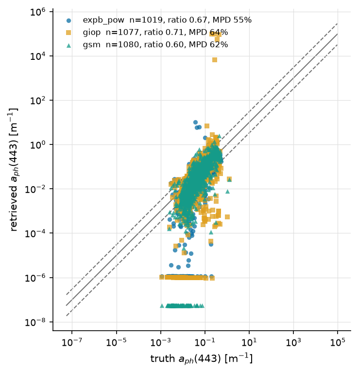
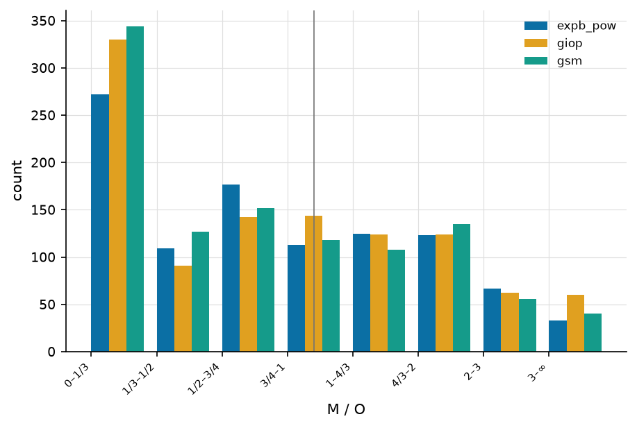
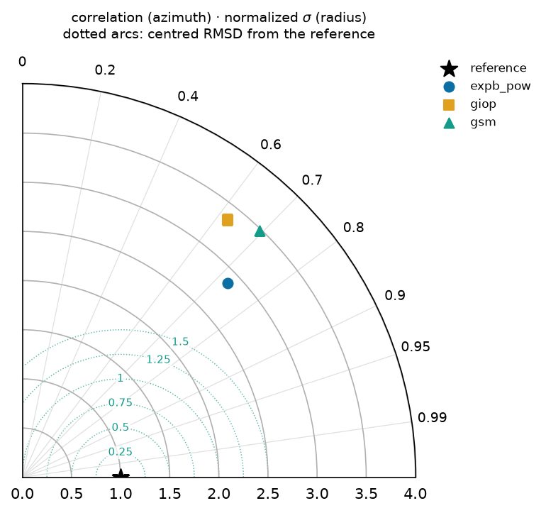
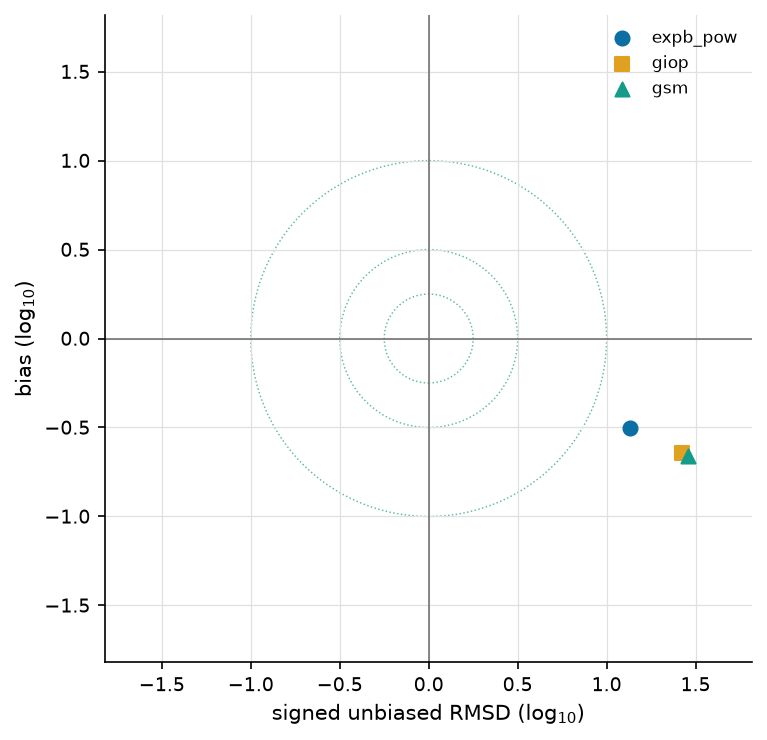
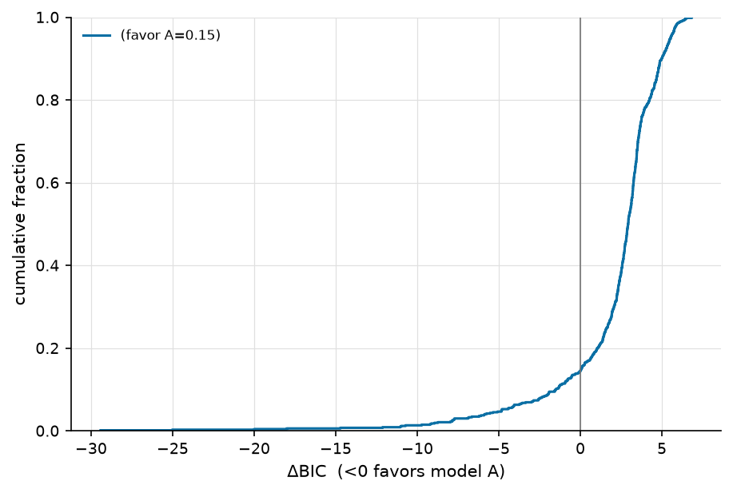
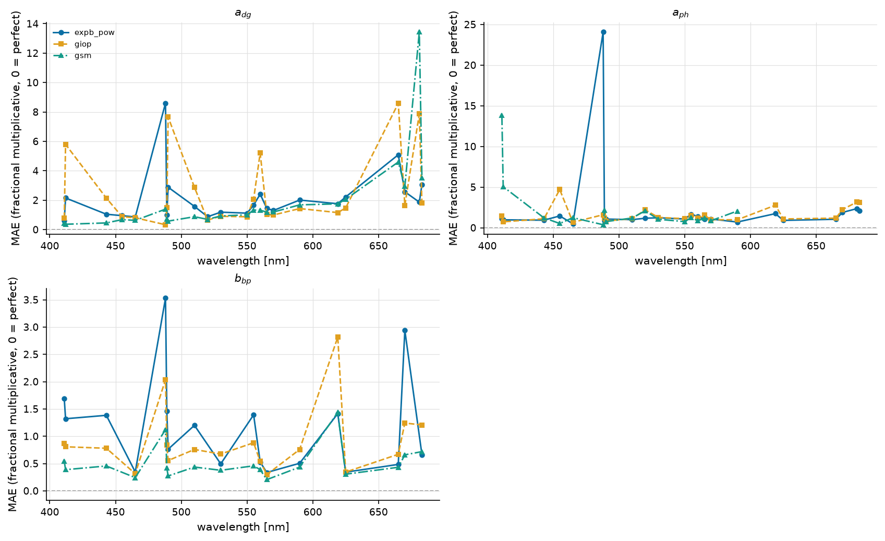
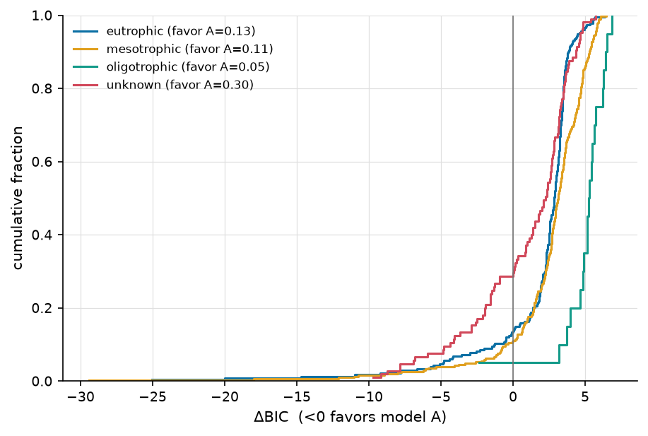

============================================
Cross-algorithm comparison — pangaea_fits_v2
============================================

:Sweep: pangaea_fits_v2
:Generated: 2026-08-10T22:38:58Z
:ioptics: 0.0.dev0@039c2b2
:bing: 0.0.dev0@f242b0e
:ocpy: @da6dff9
:design_doc: 0.16
:implementation_doc: 0.23

Overview
--------

This is the **Cross-algorithm comparison** for sweep ``pangaea_fits_v2`` — a uniform comparison of the IOP-retrieval algorithms ``expb_pow``, ``giop``, ``gsm`` on PANGAEA. Each algorithm inverts the observed remote-sensing reflectance :math:`R_{rs}(\lambda)` for the inherent optical properties (absorption :math:`a`, backscatter :math:`b_b`, and their phytoplankton / CDOM-detritus / particulate components), and the retrieval is scored against the dataset's truth. The figures and tables below show **retrieval accuracy vs. truth**, **fit quality / closure**, and **model selection** between the algorithms; the interactive scatter lets you drill into any component or trophic stratum. See :doc:`/models` for what each algorithm parameterizes and :doc:`/datasets` for the data + truth. The header above stamps the exact code + config versions, so every number is reproducible from the persisted sweep artifacts.

**Reading the numbers.** ``mae`` and ``bias`` are **fractional multiplicative** errors in log space, following Erickson (2023): :math:`\mathrm{mae} = 10^{\langle|\log_{10} M/O|\rangle} - 1`, so **0 = perfect** and ``0.109`` means 10.9% (Seegers 2018 publishes the un-subtracted factor, ``1.109``, for the same fit — the forms differ by one). ``bias`` is signed, > 0 = over-estimate. The other columns have **different** perfect values, which is why they are read separately: ``median_ratio`` and GIOP's ``Ratio`` are perfect at **1**; ``win_frac`` is a head-to-head share, so **0.5 = a tie**; and ``coverage68`` / ``coverage95`` are perfect at their **nominal 0.68 / 0.95** — an algorithm can be the most accurate and still be over-confident about its uncertainty, which the ``*_verdict`` columns name (``over-confident`` / ``consistent`` / ``conservative``; *consistent* means not distinguishable from nominal at this ``n_pairs``, which on a thin contest is a weak statement). Three different denominators appear and are named apart: ``n_pairs`` (surviving retrieval-truth pairs), ``n_scored`` (spectra that produced a usable fit) and ``n_attempted`` (spectra the sweep tried).

Retrieved vs. true — a_ph(443)
------------------------------

Retrieved vs. true **a_ph(443)**, one point per observation and algorithm on log–log axes. Points on the solid **1:1** line are perfect; the dashed **3:1** and **1:3** guides mark the ±3× envelope. Each legend entry carries that algorithm's own ``n_pairs``, its median ratio (1 = perfect) and MPD (median absolute percent difference, 0 = perfect), so the panel can be read without the table below.

   a_ph(443), all algorithms — at most 659 retrieval-truth pairs per algorithm; each legend entry states its own.

Ratio distribution — a_ph(443)
------------------------------

How the population is distributed about 1:1, per accuracy bucket — the companion a scatter is conventionally paired with (GIOP Figs. 1-2), because central tendency alone hides the spread that decides whether a retrieval is usable. The vertical rule marks ratio = 1.

   Retrieved/true ratio buckets for a_ph(443).

Taylor & Target — a_ph(443)
---------------------------

**Taylor** (first) and **Target** (second) diagrams for :math:`a_ph(443)`, computed in log space and drawn for the sweep's best-covered component. The Taylor diagram places each algorithm by its correlation with truth (azimuth, labelled in correlation) and normalized standard deviation (radius); the reference star sits at correlation 1, norm-σ 1, and the dotted arcs are centred-RMSD contours about it. The Target diagram plots bias (y) against the sign-carrying unbiased RMSD (x), with dotted constant-RMSD rings — the closer to the origin, the better.

   Taylor diagram — a_ph(443): correlation (azimuth) vs normalized standard deviation (radius), with centred-RMSD arcs about the reference star.

   Target diagram — a_ph(443): bias vs signed unbiased RMSD, with constant-RMSD rings; the origin is a perfect retrieval.

Model selection (ΔBIC)
----------------------

Cumulative distribution of **ΔBIC** per spectrum for this sweep's complexity contest — ``expb_pow`` (k=5) against ``giop`` (k=3), chosen as its highest- and lowest-parameter algorithms. ΔBIC < 0 favours the more complex model ``expb_pow``; ΔBIC > 0 favours the parsimonious ``giop``. The curve shows what fraction of spectra fall either side — i.e. whether the extra parameters earn their keep. See :doc:`/models`.

   Per-spectrum ΔBIC, ``expb_pow`` vs ``giop``: the fraction of spectra either side of 0 says whether the extra parameters earn their keep.

Accuracy vs. wavelength — PANGAEA
---------------------------------

How each algorithm's error varies **across the spectrum** on **PANGAEA**, for the 3 component(s) scored at 5 or more bands (``a_dg``, ``a_ph``, ``bb_p``; up to 23 bands). A retrieval can be accurate in the blue and useless in the red, which a single reference-band number cannot show — this is the per-band view of the same ``mae`` the accuracy table reports at its reference wavelengths. Each algorithm keeps its colour, marker and linestyle from every other figure. Datasets are drawn separately: their band sets and sample sizes differ, so one line through both would show a sparse dataset's bands as spectral structure.

   Fractional multiplicative MAE against wavelength on PANGAEA, one panel per component, all algorithms overlaid. The dashed rule is the perfect value (0).

Per trophic stratum
-------------------

Observations are binned by chlorophyll into oligotrophic / mesotrophic / eutrophic (<0.1, <1, ≥1 mg m⁻³), preferring truth Chl over retrieved. This sweep resolves ``mesotrophic`` (n_attempted 599), ``eutrophic`` (n_attempted 655), ``oligotrophic`` (n_attempted 73). A further **266 spectra (66 scored pair(s)) have no chlorophyll at all** — neither truth nor a retrieved value — so they cannot be binned and are left out of the tables below rather than shown as a fourth water type. They are still counted in the pooled numbers above. Every table above pools these together, and pooling is what hides a regime change — an algorithm can be usable in one trophic state and not in the next, which is the whole question for a coastal dataset.

Accuracy — mesotrophic
----------------------

The same accuracy columns as the pooled table, over the ``mesotrophic`` stratum alone — at most 317 retrieval-truth pair(s), from 599 attempted spectra. Columns are defined on the :doc:`/reports/glossary` page.

.. csv-table:: Ref-band accuracy, mesotrophic only.
   :file: accuracy_chisq_mesotrophic.csv
   :header-rows: 1
   :widths: auto

Quality control — mesotrophic
-----------------------------

Retrieval success within ``mesotrophic``. ``frac_ok`` and ``frac_not_ok`` are complements over this stratum's 599 attempted spectra, so they can be read directly against the other strata. **Error model** — every rate here is scored against the uncertainty each record carries (PANGAEA: ``pct:0.1`` — an **assumed** flat 10% Rrs error (the dataset quotes no per-band uncertainty)).

.. csv-table:: Fit quality / closure, mesotrophic only.
   :file: qc_chisq_mesotrophic.csv
   :header-rows: 1
   :widths: auto

Accuracy — eutrophic
--------------------

The same accuracy columns as the pooled table, over the ``eutrophic`` stratum alone — at most 241 retrieval-truth pair(s), from 655 attempted spectra. Columns are defined on the :doc:`/reports/glossary` page.

.. csv-table:: Ref-band accuracy, eutrophic only.
   :file: accuracy_chisq_eutrophic.csv
   :header-rows: 1
   :widths: auto

Quality control — eutrophic
---------------------------

Retrieval success within ``eutrophic``. ``frac_ok`` and ``frac_not_ok`` are complements over this stratum's 655 attempted spectra, so they can be read directly against the other strata. **Error model** — every rate here is scored against the uncertainty each record carries (PANGAEA: ``pct:0.1`` — an **assumed** flat 10% Rrs error (the dataset quotes no per-band uncertainty)).

.. csv-table:: Fit quality / closure, eutrophic only.
   :file: qc_chisq_eutrophic.csv
   :header-rows: 1
   :widths: auto

Accuracy — oligotrophic
-----------------------

The same accuracy columns as the pooled table, over the ``oligotrophic`` stratum alone — at most 35 retrieval-truth pair(s), from 73 attempted spectra. Columns are defined on the :doc:`/reports/glossary` page.

.. csv-table:: Ref-band accuracy, oligotrophic only.
   :file: accuracy_chisq_oligotrophic.csv
   :header-rows: 1
   :widths: auto

Quality control — oligotrophic
------------------------------

Retrieval success within ``oligotrophic``. ``frac_ok`` and ``frac_not_ok`` are complements over this stratum's 73 attempted spectra, so they can be read directly against the other strata. **Error model** — every rate here is scored against the uncertainty each record carries (PANGAEA: ``pct:0.1`` — an **assumed** flat 10% Rrs error (the dataset quotes no per-band uncertainty)).

.. csv-table:: Fit quality / closure, oligotrophic only.
   :file: qc_chisq_oligotrophic.csv
   :header-rows: 1
   :widths: auto

Model selection by stratum (ΔBIC)
---------------------------------

The same contest as above, split by trophic stratum. ΔBIC < 0 favours the more complex ``expb_pow``. A pooled curve can hide a reversal — extra parameters that pay in turbid water and cost in clear water average out to "no difference".

   Per-spectrum ΔBIC, ``expb_pow`` vs ``giop``, one curve per trophic stratum.

Accuracy
--------

Per-(dataset, component, reference wavelength) retrieval accuracy for the χ² population: fractional multiplicative **mae**/**bias** (0 = perfect, ``mae`` 0.1 ≈ 10%), **median_ratio** (1 = perfect), **coverage68/95** against their nominal 0.68/0.95 with a ``*_verdict`` of over-confident / consistent / conservative (a real miss being more than 2 binomial standard errors; at small ``n_pairs`` only a gross miss is detectable, so *consistent* means "not distinguishable from nominal here", not "calibrated"), the cross-algorithm ranks (``*_rank``, 1 = best) and the head-to-head **win_frac** (0.5 = tie). ``n_pairs`` counts surviving retrieval-truth pairs; ``ref_match`` is the native band actually used (±3 nm). Every column is defined on the :doc:`/reports/glossary` page. 12 further (component, band) rows are omitted because this sweep scored no retrieval-truth pairs for them.

.. csv-table:: Ref-band accuracy + wins (χ², all strata).
   :file: accuracy_chisq_all.csv
   :header-rows: 1
   :widths: auto

Head-to-head
------------

Every algorithm pair, judged on the spectra **both** of them retrieved. ``delta_mae`` is ``mae(A) − mae(B)`` on those shared spectra (negative favours A) and ``d_lo``/``d_hi`` are its paired-bootstrap 95% interval, after the round-robin practice of resampling the data to put uncertainty on a ranking. The ``verdict`` names a winner only when the interval excludes 0 **and** the difference clears a practical floor of 10%. It reads ``indistinguishable`` only when the **whole interval** lies inside that floor — i.e. the data rule a material difference out — and ``underpowered`` when the interval is too wide to say either way at this ``n_paired``. Here 0 pair(s) are indistinguishable and 5 are underpowered, out of 18. A further 12 pair(s) share no scoreable spectrum and are omitted.

.. csv-table:: Pairwise verdicts (χ², all strata).
   :file: head_to_head_chisq_all.csv
   :header-rows: 1
   :widths: auto

Quality control
---------------

Fit-quality summary per dataset and algorithm. ``n_attempted`` is what the sweep tried and ``n_scored`` what produced a usable fit — the gap is explained by the per-status fractions, which are kept apart on purpose: ``frac_out_of_scope`` (the spectrum was **declined before fitting** — a red-peaked, turbid spectrum is outside the open-ocean family's regime, so the row means "we declined to fit this", not "we fitted it and it failed") and ``frac_fit_failed`` (the fitter returned nothing) are the same ``frac_not_ok`` and entirely different findings. Also the median reduced **χ²ᵥ**, the noise-model-free **rel_misfit** (GIOP's ΔRrs), and the χ²ᵥ closure split (``frac_good`` ≈ 1, ``frac_overfit`` < 1, ``frac_underfit`` > 1, ``frac_qc_fail`` = non-solutions). **Error model** — every rate here is scored against the uncertainty each record carries (PANGAEA: ``pct:0.1`` — an **assumed** flat 10% Rrs error (the dataset quotes no per-band uncertainty)).

.. csv-table:: Fit quality / closure (χ²).
   :file: qc_chisq_all.csv
   :header-rows: 1
   :widths: auto

Interactive
-----------

Retrieved vs. true, **interactive**: pick the dataset, algorithm, component and trophic stratum, and hover any point for its ``obs_id``, wavelength and values — so an outlier can be traced back to a spectrum. The figure title states what fraction of the population is plotted (the cloud is downsampled to keep the page small; the static panels above summarize all of it).

.. raw:: html

   
   
   

   <script>
   (function() {
     const fn = function() {
       Bokeh.safely(function() {
         (function(root) {
           function embed_document(root) {
           const docs_json = '{"31abe8f0-c0d6-4eca-a985-d5b4417549e4":{"version":"3.9.1","title":"Bokeh Application","config":{"type":"object","name":"DocumentConfig","id":"p1068","attributes":{"notifications":{"type":"object","name":"Notifications","id":"p1069"}}},"roots":[{"type":"object","name":"Column","id":"p1067","attributes":{"children":[{"type":"object","name":"Select","id":"p1062","attributes":{"js_property_callbacks":{"type":"map","entries":[["change:value",[{"type":"object","name":"CustomJS","id":"p1066","attributes":{"args":{"type":"map","entries":[["full",{"type":"object","name":"ColumnDataSource","id":"p1006","attributes":{"selected":{"type":"object","name":"Selection","id":"p1007","attributes":{"indices":[],"line_indices":[]}},"selection_policy":{"type":"object","name":"UnionRenderers","id":"p1008"},"data":{"type":"map","entries":[["x",[0.00262,0.021939148461538462,0.13976,0.01027,0.0033736183673469386,0.00258,0.04281318,0.0054947,0.00098,0.01868,0.03103,0.00975,0.08210266,0.03295,0.00054,0.00898,0.00495,0.00138,0.0080135,0.002022,0.0129,0.038421,0.01323,0.02581,0.08784349,0.35219,0.02965,0.00478,0.03422,0.00359,0.01003,0.02296,0.23338,0.00943,0.0057306,0.14213,0.00955,0.00929,0.23756,0.11268,0.01899,0.02379,0.05714,0.0031,0.006506,0.0028198,0.00384,0.02157,0.09635,0.02821,0.0050308,0.02356,0.03823,0.01628,0.00846,0.2754,0.0027827,0.003377,0.14091,0.00383,0.00537,0.00563,0.00064,0.0106,0.04242492,0.00031,0.00278,0.04274,0.00536,0.01062,0.02604,0.00369,0.0023461,0.00812,0.00584,0.0649,0.36412,0.00119,0.00131,0.11015748,0.0053676,0.00072,0.1762905,0.00331,0.03726,0.01204,0.03158,0.0054947,0.00596,0.00112,0.0069102,0.02878,0.223,0.13954,0.08817,0.01217,0.00275,0.0026828,0.29026,0.02331,0.00351,0.00778,0.006914,0.0389,0.52965,0.11426,0.01123,0.00758,0.01768,0.1004,0.01623,0.00069,0.03182,0.0014814,0.00846,0.00842,0.08685,0.00051,0.00123,0.08062,0.05079,0.069008,0.02562,0.0022642,0.006803,0.07329,0.0226,0.01624,0.0006715,0.2024,0.00472,0.00131,0.04267,0.0058193,0.0031421,0.00543,0.022428,0.02615,0.043906,0.00315,0.03529,0.01048,0.0056598,0.00336,0.00512,0.01839,0.00264,0.04487,0.00047,0.00945,0.00083047,0.00074,0.00301,0.04197925,0.0010755,0.00273,0.03534,0.00024,0.00131,0.01285,0.0366,0.00339,0.003414,0.02189,0.01826,0.0011,0.00116,0.058633,0.00352,0.01345,0.06858,0.051,0.11785,0.005013,0.09697,0.02843,0.029438,0.004,0.02254,0.0057212,0.01102,0.00363,0.00072925,0.00585,0.00118,0.0065,0.00055,0.06627,0.00683,0.022404,0.016421230769230768,0.00244,0.00111,0.0014,0.0072868,0.01693,0.00779,0.00323,0.05964,0.00488,0.0044078,0.00126,0.216822,0.03245,0.0025648,0.16523,0.05562,0.0015138,0.06412437,0.03144,0.09845139,0.0010027,0.01225,0.03906,0.01995,0.00354,0.0013618,0.00152,0.02047,0.00118,0.00414,0.02765,0.00078889,0.13971,0.00118,0.02979,0.00048,0.005956,0.004593,0.3603064,0.0046,0.09135,0.00035,0.04097,0.00648,0.0115,0.024338,0.03541,0.012682053846153847,0.02711,0.02936,0.017,0.0023453,0.00427,0.03352,0.00198,0.04874,0.03294,0.00568,0.12071,0.14635348,0.00061936,0.02619,0.0201,0.05643,0.0031,0.02483,0.01284,0.0159,0.08918,0.00315,0.01273,0.00689,0.15796,0.00457,0.39524,0.01986,0.00129,0.00813,0.01386,0.00024,0.0774,0.010331,0.00191,0.011275,0.32679,0.01003,0.03604,0.00555,0.00758,0.00245,0.00815,0.0063,0.01113,0.00966,0.00683,0.026336846153846155,0.00037,0.00767,0.00772,0.01403,0.00795,0.02999,0.01336,0.04917,0.04606,0.01543014053846154,0.18479,0.04663,0.1864,0.010678,0.00681,0.00061,0.0013486,0.025706,0.01626,0.00292,0.0022842,0.11678,0.01623,0.00091,0.00521,0.00649,0.007864,0.02045,0.00372,0.0108,0.0017,0.0020439,0.04966,0.01091,0.00567,0.00283,0.0057212,0.0292,0.0028663,0.04087,0.0018247,0.004246,0.04505,0.00222,0.03714,0.06258,0.1204,0.01652,0.00563,0.12336,0.00618,0.0238,0.00727,0.00332,0.04302,0.0008,0.00016,0.4362,0.02465,0.0026194,0.0085,0.11729901,0.05009,0.026272,0.00121,0.0046516,0.005364,0.01383,0.00028,0.00449,0.0042413,0.0048007,0.03245,0.05342,0.08304474358974359,0.00699,0.00086517,0.00161,0.00256,0.00087,0.0028816,0.0060103,0.004499,0.0021456,0.00207,0.00136,0.00168,0.02989,0.10368,0.025763,0.00524,0.02536,0.00221,0.00638,0.02012,0.0026828,0.15803,0.00209,0.01997,0.01164,0.0022606,0.0031,0.00666,0.003198,0.00134,0.0019106,0.0227,0.26975,0.011231,0.00454,0.003876,0.03811,0.14774,0.00573,0.0505254,0.02163,0.06437,0.2,0.00163,0.00062,0.029874,0.0093804,0.27106,0.05733,0.00042177,0.00325,0.00176,0.1623,0.00455,0.002055,0.062343,0.00409,0.0011728,0.00732,0.00132,0.00166,0.05659,0.03939,0.0014423,0.003208,0.00826,0.03567,0.08235,0.00749,0.00625,0.02053,0.00256,0.0024096,0.02217,0.018264,0.02195,0.003107224,0.04325,0.00866,0.01302,0.00077,0.0007,0.01977,0.00556,0.00204,0.0016285,0.00095,0.07615806,0.00438,0.00358,0.001926,0.00744,0.124507416,0.0022516,0.00095,0.01232,0.014182500615384615,0.08701,0.0016655,0.00984,0.03882,0.00286,0.0076,0.08900039,0.01164,0.0044066,0.00118,0.0044998,0.080263,0.03203,0.00065,0.00625,0.01294,0.02492,0.19219,0.00585,0.02524,0.01189,0.06522,0.04427,0.12013,0.10563189743589743,0.09179,0.005783210204081632,0.01973969230769231,0.00082865,0.01215,0.00091,0.01187,0.02375,0.04639,0.01048,0.0074,0.01542,0.00034,0.001176,0.00079,0.02937,0.062887,0.006165,0.01412,0.00894,0.00837,0.0005,0.012775,0.00327,0.00443,0.01921,0.22648,0.03605,0.00898,0.01732,0.00796,0.038224,0.00082,0.0012282,0.0039506,0.00252,0.00721,0.00288,0.00082,0.005956,0.12016008974358974,0.00994,0.01196,0.09145,0.00231,0.00434,0.013091149,0.0402,0.00569,0.00342,0.01896,0.02686,0.02556,0.00402,0.04375,0.00733,0.00089,0.00683,0.00039,0.017724,0.00559,0.0045253,0.04497,0.00343,0.03115,0.00663,0.00286,0.17539,0.06512,0.01301,0.00036,0.00258,0.00482,0.00054,0.0078,0.01567,0.03059,0.01193,0.00263,0.03582,0.20589,0.0054819,0.04511,0.03406,0.00025,0.03903,0.00817,0.1102,0.0027,0.0024018,0.09066,0.01259,0.01154,0.0052099,0.00327,0.0031,0.00643,0.002167312244897959,0.03555,0.0051,0.00253,0.01632,0.00802,0.00209,0.05044,0.01643,0.006575251020408164,0.04309,0.00559,0.3216579,0.00288,0.00184,0.01439,0.0014,0.00313,0.092697,0.007965915306122449,0.02081,0.00619,0.01399,0.01464,0.00946,0.022541,0.03104,0.01205,0.004587,0.02362,0.0102,0.00407,0.01906,0.00644,0.00051,0.0285165,0.00023,0.0046516,0.03674,0.006845,0.09441,0.02746,0.2523053,0.00618,0.01594,0.13931,0.02538,0.04066,0.00551,0.010704,0.00475,0.00071,0.00303,0.00348,0.0036477,0.01116,0.72753,0.00823,0.0018234,0.00072,0.02828,0.0063707,0.003761577551020408,0.039257,0.00039,0.0062,0.0029378,0.01556,0.0429,0.01744,0.15339,0.0010057,0.009875806122448979,0.10427,0.03995,0.00271,0.059054,0.00123,0.18006,0.00678,0.010331,0.02001,0.01242,0.01123,0.02769,0.00081,0.00634,0.00194,0.57145,0.00932,0.00217,0.01452,0.02399,0.02798,0.02216,0.00322,0.0181,0.02575,0.0036392530612244897,0.00203,0.16292,0.00207,0.01458,0.00127,0.00075,0.0044,0.2653,0.0037707112244897956,0.00602,0.0029,0.00209,0.00851,0.022948,0.00331,0.00746,0.01924,0.00103,0.00532,0.08909,1.0092,0.00083,0.18871,0.01697,0.00295,0.00229,0.00544,0.03771164538461538,0.11454,0.00036,0.01297,0.00055646,0.0001,0.00535,0.00179,0.02986,0.003347241836734694,0.136699,0.00095,0.01598,0.002,0.05955,0.00355,0.00776,0.76335,0.00241,0.03158,0.0073107,0.02278,0.00507,0.00341,0.00639,0.01632,0.02202,0.01441199,0.01375,0.00023,0.00665,0.01718,0.02669,0.4146,0.00495,0.00939,0.00765,0.01952,0.01774,0.017069,0.07627,0.04643,0.00399,0.04865,0.00055,0.00784,0.25141,0.00327,0.00811,0.00192,0.0476727,0.23436,0.00052679,0.04922,0.0025957,0.0494911,0.00601,0.00221,0.00466,0.01004,0.00153,0.10014,0.024009,0.02034,0.0102,0.14298516,0.01737,0.00707,0.0225,0.003014,0.00234,0.01684,0.09344,0.0089279,0.0081207,0.07787,0.10066,0.04476,0.031516,0.09722,0.00163,0.00583,0.10908,0.0040828,0.021709163265306124,0.01592,0.01449,0.00329,0.0039906,0.00151,0.02591,0.00575,0.007965915306122449,0.0018393,0.00049,0.03689,0.0019536,0.1111,0.02476,0.038158,0.01536,0.0010893,0.00264,0.01477,0.00115,0.01203889,0.0027038,0.02152,0.01447,0.007804,0.04555,0.01754,0.00645,0.00393,0.03923,0.04455,0.00401,0.00256,0.0079264,0.08444,0.0075532,0.0027,0.001464,0.0173,0.01602,0.00671,0.00203,0.00193,0.0020384,0.0012949,0.00076,0.0017575,0.0061383,0.0038276,0.00060139,0.00863,0.0018502,0.00689,0.00244,0.00127,0.00544,0.00012,0.0037240785714285716,0.00224,0.00024,0.06525,0.03848,0.06918,0.00334,0.0279,0.0094102,0.10866,0.0036669,0.00883,0.03158,0.0065781,0.004920781632653061,0.06451,0.1046,0.00035,0.00115,0.05864,0.0035,0.006,0.0016,0.00661,0.02914,0.00752,0.005024,0.00461,0.0011983,0.02998,0.01134,0.04498,0.00173,0.00391,0.0066907,0.00081,0.006024,0.04617,0.0071,0.00257,0.00063,0.0066264,0.00543,0.01089,0.00065,0.0050396,0.00336,0.1541,0.0029,0.0014186,0.0010175,0.00175,0.0022108,0.0065,0.01598,0.00132,0.04705,0.02359,0.00374,0.0020115,0.03977,0.00043,0.035309,0.01827,0.002673,0.06995,0.00306,0.00884,0.00175,0.01086,0.00407,0.00548,0.0012,0.05046,0.0114,0.01493,0.01913,0.001735,0.01223,0.02442,0.00057,0.0021992,0.01130015,0.00647,0.05248,0.009,0.03897,0.01919,0.00224,0.00957,0.0171,0.00494,0.0076514,0.01074,0.00205,0.02278,0.06884,0.03586,0.03778,0.0038224,0.00851,0.01885,0.03041,0.23582,0.00326,0.00088882,0.0090307,0.00633,0.0035647,0.0031,0.00332,0.00089,0.04077,0.0045014,0.01397,1.1587,0.00472,0.00339,0.00078,0.01016,0.00267,0.003584,0.00109,0.03529,0.05489,0.01542,0.00746,0.01056,0.001504,0.0068,0.001524,0.00536,0.0054962,0.01251,0.01656,0.00309,0.00274,0.08900039,0.0011911,0.00103,0.00105,0.0056306,0.0017278,0.00703,0.00874,0.04497,0.002563,0.002102722448979592,0.00265,0.0069307,0.00402,0.0039407,0.0618,0.00942,0.01586,0.002324,0.00073,0.03765,0.0032158,0.0045058,0.00368,0.00019,0.0020372,0.01479,0.05264,0.0007,0.12231,0.00907,0.0026308,0.1111,0.00011333333333333334,0.00213,0.0122,0.00741,0.01627,0.01466,0.00641,0.00039,0.00239,0.200915,0.0062,0.01658,0.004462597959183673,0.00283,0.17044,0.00415,0.01449,0.00638,0.01785,0.00715,0.00439,0.003266731632653061,0.015,0.0014868,0.01028,0.007737904081632653,0.0042478,0.08659,0.0048128,0.01169,0.18458,0.00908,0.01981,0.04389,0.00236,0.010616,0.0052,0.09488,0.010916,0.004304,0.003709,0.01319,0.0027725,0.00099989,0.0014262,0.00205,0.00011,0.12183,0.04476926,0.01998,0.00066,0.0088307,0.00081,0.02029,0.0086828,0.00962,0.06444,0.0114,0.0735766,0.00091119,0.23387,0.00124,0.0023371397959183675,0.0034586,0.002404,0.01024,0.00378,0.00828,0.01456,0.00446,0.01075,0.003967445918367347,0.01344,0.00165,0.0091307,0.0087,0.01527,0.01053,0.01575,0.1785335,0.00041599,0.00206,0.0035748,0.02292,0.0823,0.06838,0.00641,0.0034586,0.00079033,0.00546,0.002182,0.10849,0.02195,0.00863,0.01494,0.0010429,0.02339,0.00061,0.008725,0.08771,0.01975,0.03372,0.00045,0.00087551,0.024009,0.0693,0.0381651,0.00042,0.0019846,0.0065,0.0028663,0.0544,0.043371,0.00234,0.57738,0.05983,0.013790415384615385,0.00888,0.0014561,0.00024,0.0010737,0.00443,0.0022708,0.001,0.04658,0.00102,0.0062046,0.00447,0.22261,0.02828,0.0063539,0.00395,0.02381,0.00136,0.00938,0.04389,0.01938,0.00124,0.04105,0.0012669,0.0052099,0.05108,0.02983,0.02927,0.02437,0.00309,0.06834,0.1172,0.002917,0.00571,0.0029643,0.0038176,0.0012744,0.04991,0.01347,0.07228,0.0017219,0.02585,0.02396,0.01831,0.01564,0.00117,0.01929,0.0037288,0.23726,0.00096,0.0025794,0.002564,0.0106,0.12079633333333333,0.07766,0.001632,0.0036902,0.0050866,0.01016,0.06325,0.01585,0.019736,0.0012454,0.0032406,0.0466,0.0515,0.00803,0.0048528,0.010306,0.00089739,0.07799,0.27263,0.01337,0.03175,0.0037996,0.00393,0.00133,0.01135,0.0043783,0.00547,0.00353,0.086964,0.01465,0.125,0.00427,0.0051918,0.00319,0.02477,0.003,0.00312,0.01189,0.01012,0.0254,0.12242,0.001915,0.0154,0.068271,0.0034766,0.01709,0.00924,0.00135,0.00081923,0.038392,0.01137,0.00391,0.00883,0.00527,0.35794,0.01322,0.00034,0.01863,0.004566527551020408,0.003128,0.0402,0.00158,0.63766,0.0031938,0.001952,0.00067,0.001207,0.00969,0.004784,0.0051,0.02132,0.0021151,0.19432,0.0016217,0.00308,0.0006500000000000001,0.04805,0.05079,0.00141,0.0031,0.13349,0.09618,0.05354,0.00293,0.00812,0.01339,0.00835,0.01732,0.0134,0.05838,0.014257438775510204,0.00113,0.003339,0.02765,0.06037,0.036784356923076925,0.0211,0.00819,0.00432,0.00342,0.002,0.01516,0.00082,0.006194,0.004304,0.0014,0.003677,0.0053,0.00446,0.01666,0.07622,0.0195,0.78049,0.00096,0.00166,0.034477,0.07138,0.04427,0.007088214285714285,0.0027265,0.076429,0.013316,0.27618,0.0011836,0.0749468205128205,0.003944967346938775,0.00097375,0.0022924,0.00933,0.01928,0.0279,0.009677,0.0022303,0.00115,0.0024038,0.0029,0.0523,0.03723567,0.0443,0.00676,0.004145,0.0876558,0.05443,0.07949,0.00356,0.05653,0.00904,0.0029006,0.0016655,0.04097,0.05346,0.0011661,0.00745,0.00868,0.005935863265306122,0.0046576,0.00065,0.04346,0.0015121,0.04498,0.0002,0.01688,0.02848,0.01509,0.00094031,0.05667,0.00431,0.029274,0.00058152,0.0032108,0.0184,0.4892,0.00306,0.00062707,0.006971527551020408,0.01774,0.0253,0.33958,0.01161,0.00347,0.0012801,0.00108,0.18243,0.0027542,0.00434,0.07072001282051282,0.02057,0.004352,0.03269,0.0032936,0.00452,0.00076409,0.0507908,0.0022358,0.004115201020408164,0.02448,0.00704,0.00076,0.0022584,0.00881,0.02654,0.0132,0.00048967,0.00047,0.06394,0.0024968,0.02535,0.02211,0.00128,0.0021897,0.06603,0.00204,0.0107,0.01132,0.03316,0.0072306,0.06849,0.0011639,0.0021007,0.00328,0.0027725,0.02294,0.00261,0.03694,0.05075,0.05333,0.01711,0.02897,0.18235,0.03644,0.00552,0.01699,0.05103,0.19057,0.0102,0.03563,0.06215,0.0086873,0.00082968,0.0115725,0.02688,0.00298,0.0018456,0.04634,0.0017,0.005,0.02405,0.02168,0.00617,0.0042158,0.00091,0.00069118,0.0021875,0.033582,0.03755,0.0041014,0.00753,0.00416,0.00067945,0.01019,0.02873,0.0011,0.00256,0.00895,0.00906,0.0023053,0.0133,0.0062876,0.0144,0.00074,0.04861,0.0028307,0.01154,0.14434,0.00742,0.0038238,0.02474,0.0046221,0.00242,0.09152,0.38059,0.0030037,0.0209,0.004381,0.0027178,0.0093307,0.00051,0.023034,0.00997,0.00081458,0.00386,0.024319,0.0154,0.002089,0.0016058,0.10133041,0.08529,1.1355,0.00421,0.04843344871794872,0.01633,0.0016698,0.00181,0.01319,0.0042307,0.0031038,0.08798570512820514,0.01406,0.19917,0.00352,0.00613,0.07588,0.4892,0.05097,0.062283692307692304,0.00949,0.03985871,0.0108,0.05365403,0.02499,0.00154,0.0077018,0.0038204,0.05705,0.048,0.14434,0.06627,0.0016986,0.00718,0.00090295,0.00595,0.0019809,0.00068,0.04427,0.004104,0.00074257,0.0056158,0.0186,0.01928,0.07127588461538462,0.04307,0.09687,0.00272,0.00092655,0.00728,0.09566268,0.03969,0.06792,0.0053056076923076925,0.0577,0.00481,0.06063,0.03678,0.00052482,0.02614,0.0027239,0.01794,0.12393,0.00127,0.006431,0.0016,0.029,0.00078,0.0046446,0.07154,0.13549,0.2484015,0.12437,0.0067,0.01338,0.03343,0.00578,0.07897,0.01877,0.0019055,0.0069,0.00763,0.0078,0.19721,0.005982037755102041,0.04381,0.09158,0.0021283,0.00058152,0.00681,0.0066378,0.15719,0.0011311,0.06244,0.01041,0.02187,0.047916,0.00135,0.01024,0.00256,0.0021007,0.0024,0.01083,0.05708,0.08741,0.0063452,0.0024696908163265303,0.1398847,0.00053845,0.02195,0.00887,0.01436,0.0027,0.00898,0.17241,0.0039,0.01655,0.00939,0.15067,0.15281,0.08595935897435897,0.04338,0.00413,0.00078928,0.003644434693877551,0.00196,0.02017,0.00636,0.02563,0.016448,0.0068,0.07466,0.062343,0.091856,0.0021555,0.006,0.002488312244897959,0.02908,0.00027,0.00713,0.0023742,0.00121,0.00757,0.06179,0.0587,0.00273,0.02123,0.01872,0.0020478,0.0065102,0.005271,0.00364,0.00324,0.0030636,0.02748,0.0005,0.00055263,0.0016979,0.02701,0.12734,0.0009476,0.00134,0.09109,0.005236,0.00584,0.04783,0.00051704,0.0031049,0.0028034,0.050623064102564105,0.0054917,0.026019,0.0015294,0.01675,0.03381,0.00063338,0.0953,0.00039,0.01705,0.0038094867346938773,0.06515,0.007593,0.0018456,0.12964,0.0058664,0.03475,0.01052,0.00227,0.02552,0.0018998,0.0015958,0.0012478,0.02846,0.0015596,0.0034306,0.0093307,0.16794,0.0075,0.00296,0.01629,0.05867,0.0020188,0.23317,0.0003,0.00298,0.022948,0.08349962,0.002734151020408163,0.00873,0.00178,0.00098875,0.00115,0.14276,0.01623,0.17247,0.0498,0.02023,0.0013535,0.024584133846153846,0.01877,0.0044939,0.0049026,0.0037607,0.004075,0.002034,0.0040828,0.00182,0.0027831,0.0087164,0.0022522,0.00158,0.0013,0.007185,0.0019574,0.00047,0.0026226,0.011431,0.00091267,0.005186,0.0030489,0.0057658,0.0024834,0.0027402,0.02178,0.0014125,0.0038058,0.009704,0.00892,0.0688325,0.00069116,0.0028081,0.0011084,0.00183,0.01302,0.00030833,0.15866,0.03659,0.05947441,0.004417,0.0031155,0.07303,0.0037306,0.02961,0.0019475,0.08227,0.01357,0.0022,0.23794,0.010004,0.03724,0.00931,0.002497212244897959,0.0098596,0.00082791,0.00998,0.02459,0.0054328,0.00201,0.0015851,0.08129,0.01702,0.0036706,0.08478,0.22833,0.00935,0.06707,0.01903,0.0019778,0.0046758,0.0034327,0.005364,0.0021282,0.0065726,0.00461,0.01101,0.0033098,0.0055523,0.0046786,0.16541,0.0017,0.003677,0.01261,0.0061436,0.034916,0.0019576,0.0054567,0.10818,0.00738,0.00084438,0.005652139795918367,0.008204,0.01022,0.00212,0.05785,0.00055239,0.0035663,0.0044853,0.00303,0.0005358,0.0010109,0.0017395,0.31535,0.004539,0.04375,0.00966,0.0786,0.1542,0.0027,0.0037766,0.001207,0.0014482,0.014257438775510204,0.0027019,0.00166,0.004523,0.0024554,0.01436,0.003684,0.003704,0.005652139795918367,0.00161,0.00024,0.027177,0.10381,0.00068326,0.00028,0.00241,0.0017146,0.0039,0.0041274,0.01238,0.0671,0.25438,0.0013025,0.03811,0.0009,0.13314,0.05896,0.002914,0.0018138,0.00182,0.0169,0.0072306,0.00037,0.001326,0.098319,0.01138,0.00073,0.0011863,0.00043583,0.0014421,0.0022656,0.00026,0.0316,0.04532487,0.00067309,0.0020317,0.00033,0.0030377,0.01633,0.03453,0.0010887,0.001876,0.00069,0.00111,0.002768,0.00388,0.00206,0.00077,0.002814,0.005,0.0012596,0.0014267,0.0022358,0.03991,0.0028257,0.00126,0.06422,0.05924,0.0025492,0.0013201,0.004491293877551021,0.00392,0.0016817,0.0014065,0.00155,0.00029,0.01336,0.0023413,0.06849,0.03579,0.00069423,0.0006243,0.0036574,0.0025308,0.0021407,0.00212,0.002,0.0266,0.00043,0.0021662,0.0049006,0.0041428,0.01332,0.00432,0.0093726,0.00166,0.00090669,0.00053,0.0024968,0.03796,0.009704,0.00665,0.07398,0.0058,0.04935,0.95823,0.01488,0.00351,0.0018233,0.0047158,0.0026631306122448977,0.0022927,0.01595,0.01607,0.001671,0.0019598,0.01539,0.002517,0.00328,0.0066986,0.0056728,0.002084,0.0012637,0.0027366,0.002894,0.0017624,0.0044078,0.0020045,0.00044998,0.00285,0.0051219,0.0011113,0.00132,0.00646,0.02433,0.009677,0.0018407,0.005630353061224489,0.00163,0.00126,0.03158,0.0043996,0.003164,0.0039561,0.00067945,0.0042606,0.004249,0.0078277,0.008004,0.00326,0.00263,0.00135,0.00036,0.01209,0.00023,0.00044,0.0030386,0.0035983642857142857,0.00315,0.00087883,0.0012552,0.001989,0.0036098,0.00243,0.00294,0.0017675,0.0069562,0.12589,0.00067,0.00070868,0.0016664,0.00022,0.0018,0.00063,0.0055644,0.003967445918367347,0.01138,0.0029198,0.00036,0.0010435,0.00317,0.0037598,0.00067,0.0012994,0.00706,0.02346,0.00034668,0.01027,0.00609,0.00067748,0.0026553,0.00129,0.01906209230769231,0.0011375,0.0064816,0.03716282,0.0016182,0.0026294,0.0022293,0.06136,0.05044,0.0035106,0.00251,0.02973,0.11777,0.53633,0.00056,0.00988,0.002673,0.06871,0.0013595,0.0023534,0.0057306,0.00354,0.00084446,0.00062,0.0017,0.001767,0.00049,0.25656,0.002284,0.00224,0.0014456,0.0023195,0.0050308,0.0020864,0.004985,0.04429,0.007751,0.00080374,0.00341,0.00068245,0.0014405,0.0049035387755102045,0.001867,0.0049026,0.00199,0.00162,0.0020288,0.003489457142857143,0.0018101,0.0928486,0.16062,0.01809,0.010104,0.01233,0.0014053,0.0028038,0.00054,0.0011932,0.005,0.0045536,0.0018758,0.002163262244897959,0.01907,0.00211,0.0028717,0.00249,0.0053676,0.00875,0.0034176,0.0031093,0.00049,0.00027,0.0011867,0.01181,0.00451,0.03495,0.00087404,0.00021,0.0040558,0.00067,0.00878,0.0049926,0.033116,0.00096,0.02212,0.00478394693877551,0.00392,0.00535,0.00487,0.00554,0.0020372102040816325,0.0049607,0.01413,0.00336,0.0022506,0.002964,0.0022516,0.00113,0.0045087,0.0016794,0.01037,0.002,0.00055,0.00010285714285714286,0.00226,0.0037554551020408163,0.00555,0.00151,0.00355,0.12242,0.06219,0.0043,0.005078,0.02746,0.00823,0.005712618367346939,0.00124,0.009712822448979593,0.0014512,0.01797,0.0046618,0.02228,0.0023366,0.0012825,0.00179,0.00224,0.01431,0.001288,0.07119,0.0018147,0.007759332653061225,0.0027135387755102044,0.006801,0.0037306,0.00254,0.00233,0.0018539,0.00655,0.0185,0.00356,0.00852,0.0036778,0.01635,0.0006,0.00127,0.00521,0.0016273,0.0038694551020408163,0.05607,0.01907,0.00052,0.0034645,0.01082,0.0024486,0.01315,0.00065,0.00234,0.004715,0.01087,0.58793,0.003941694915254238,0.15337,0.06104,0.004838,0.00894,0.12871,0.07888,0.06197,0.00274,0.0040428,0.0039495,0.0035592,0.0042413,0.0024616,0.00084859,0.01315,0.0061306,0.03736,0.002404,0.08259,0.0017824,0.0014645,0.00432,0.0026358,0.0082,0.0044837,0.15954,0.28067,0.0035647,0.00686,0.00042,0.0093307,0.00068655,0.00288,0.07338,0.02376,0.00023,0.00728,0.0013784,0.0012478,0.00034,0.004424,0.00186,0.001123,0.013316,0.01321,0.0021151,0.0023739,0.00779,0.005236,0.0034586,0.0016126,0.00952265,0.01859,0.033233,0.0056314,0.00203,0.00295,0.00046,0.002702037755102041,0.0028065979591836735,0.0026226,0.0030563,0.0020182,0.00117,0.01087,0.0013241,0.0019447,0.001627,0.01056,0.00058103,0.0019340265306122448,0.0029536,0.003237,0.00061097,0.0010175,0.0058328,0.001148,0.00042,0.0022671,0.0022354,0.0021366,0.009677,0.00455,0.003161,0.00093691,0.03859,0.0008,0.01019,0.12623,0.0018224,0.0026308,0.00303,0.016531,0.003577,0.0244,0.0022438,0.09482,0.0036728,0.0062206,0.002461,0.0011553,0.000859,0.18539,0.0040856,0.00134,0.0031651,0.0020508,0.004871577551020408,0.00071004,0.00294,0.0044853,0.00362,0.00272,0.0021088,0.0062206,0.0010057,0.00193,0.02429,0.00134,0.0035367316326530614,0.00099,0.00878,0.008004,0.0020828,0.00448,0.0029158,0.0012986,0.00047,0.003305455102040816,0.005956,0.0333,0.021709163265306124,0.009877,0.03674,0.00116,0.0030079,0.0014989,0.004158,0.011231,0.0072298,0.0087226,0.00215,0.00035,0.00067894,0.07598,0.00156,0.0044358,0.00031,0.00353,0.0025161,0.89568,0.02603,0.0031049,0.0085,0.00038,0.0013161,0.002328944897959184,0.00097,0.0028767,0.002354,0.00089,0.0016562,0.0021569,0.00166,0.0035268,0.00042,0.005274,0.16062,0.0095,0.0014997,0.00688,0.00082,0.003936,0.00167,0.00085,0.0026607,0.0024303,0.0018712,0.0024616,0.02465,0.0032747,0.00243,0.0027906,0.00089307,0.0012991,0.00041,0.0064816,0.0018375,0.00951,0.01479,0.00328,0.00044943,0.0046371,0.00593,0.00048,0.00951,0.00313,0.01284,0.15067,0.00186,0.05753,0.0038346,0.005705,0.00078,0.0046758,0.000953,0.05469,0.00065585,0.00074,0.00047,0.02388,0.00711,0.00651,0.00049,0.02169,0.004,0.0013619,0.0024408,0.0039495,0.00031,0.0082548,0.00494,0.00853,0.0034102,0.01142,0.00344,0.00173,0.002196,0.0089,0.10381,0.00105,0.0023168,0.00225,0.0017501,0.002497212244897959,0.00201,0.0023534,0.00057669,0.0020839,0.03041,0.00977,0.0019233,0.0018081,0.00859,0.0018307,0.005111,0.00224,0.006971527551020408,0.0387,0.0017773438775510204,0.00302,0.00266,0.00236,0.00057466,0.0026459,0.00057,0.0018168,0.0016534,0.0013445,0.0024988,0.00739,0.0073866,0.00115,0.00201,0.01309,0.00023,0.00685,0.00573,0.00038,0.00308,0.02358,0.02925,0.00149,0.00066426,0.0046,0.00138,0.00047,0.00364,0.00037,0.00048967,0.00026,0.014866,0.0011726,0.01001,0.00039635,0.00327,0.002447,0.00237,0.02819,0.00152,0.17105,0.00046704,0.01057,0.025146,0.00095,0.00808,0.00251,0.00081,0.00063,0.04926,0.0025966,0.00962,0.00043,0.06108,0.0194,0.0013618,0.00094,0.00235,0.00038815,0.00078,0.01037,0.00435,0.00705,0.0026647,0.01776,0.00091,0.00016,0.00248,0.15954,0.0011305,0.00365,0.00244,0.02695,0.0046,0.05075,0.00061,0.00237,0.00082392,0.00246,0.0017278,0.01986,0.0022489,0.00187,0.00087,0.00059,0.00787,0.00053356,0.005325,0.0053337,0.05924,0.01868,0.00997,0.0052,0.0037048,0.00087007,0.05756,0.0046836,0.00105,0.02468,0.01474,0.0050578,0.00711,0.00332,0.018,0.00062638,0.0005,0.0044837,0.00267,0.00187,0.00012,0.03252,0.00087011,0.0027038,0.02012,0.0014456,0.0014703,0.002675,0.00034942,0.003506,0.00235,0.00364,0.002417,0.0004475,0.01479,0.00127,0.00359,0.00059,0.004583,0.00056,0.02257,0.04102,0.0039857,0.00095821,0.0036478,0.00038,0.00666,0.0026647,0.0011823,0.00077,0.0021044,0.0050326,0.00029,0.003871087755102041,0.0030536,0.01077,0.08301,0.0063348,0.00081492,0.00182,0.00225,0.00089,0.00578,0.00071594,0.0027,0.005223,0.00062707,0.0013919,0.00095821,0.00291,0.0029,0.0033,0.00556,0.002074,0.0008827,0.00046267,0.0020968,0.00558,0.0034857,0.0004919,0.00098707,0.00058152,0.01454,0.0045857,0.0027756,0.00041193,0.0048786,0.00044943,0.0036478,0.00078,0.00149,0.00894,0.00071677,0.00213,0.007751,0.00323,0.00134,0.0010436,0.00074,0.00083,0.00139,0.01987,0.00294,0.00126,0.00126,0.00107,0.00034446,0.0146,0.00263,0.00612,0.00044,0.00024,0.00089,0.00063,0.00332,0.00248,0.08187,0.01096,0.00263,0.00041,0.008033,0.00042469,0.00348,0.00267,0.0063348,0.00103,0.00080974,0.0075374,0.00151,0.00082848,0.0027808,0.00035,0.00081372,0.00068245,0.0005,0.00689,0.0096,0.00215,0.02576,0.00042,0.00727,0.00819,0.00278,0.00768,0.00075,0.00044,0.00412,0.00027,0.00509,0.00678,0.00218,0.020492,0.00086,0.00038,0.00026,0.00078889,0.00353,0.00081,0.0016,0.00597,0.00682,0.00034,0.00988,0.004902,0.00169,0.00039,0.00669,0.00405,0.01351,0.00803,0.0019,0.00281,0.00022,0.00015,0.02009,0.00549,0.0012083,0.00035,0.00639,0.00025,0.00042177,0.00317,0.00178,0.00423,0.00077,0.00041,0.0042,0.00187,0.00425,0.0001,0.006913,0.00054,0.00581,0.00077,0.07813,0.00077,0.0016,0.00198,0.03329,0.00782,0.00042,0.00423,0.00124,0.00099,0.00023,0.00099,0.01729,0.00791,0.00639,0.01518,0.00027,0.00075,0.00103,0.00227,0.00414,0.018798,0.00018,0.00253,0.01354,0.00428,0.00222,0.0018,0.00135,0.08187,0.02534,0.0066,0.02062,0.0010288,0.022776,0.00945,0.00071,0.00035,0.00080974,0.00693,0.00091,0.02013,0.00225,0.00033906,0.01064,0.00307,0.00358,0.01216,0.0038,0.0011073,0.01167,0.00168,0.00782,0.08187,0.00034446,0.00035,0.00198,0.00319,0.02168,0.03707,0.00063338,0.01024,0.02187,0.00086751,0.00078,0.00424,0.00054,0.07961,0.00218,0.02361,0.02656,0.00103,0.00307,0.00049644,0.0017,0.00024,0.00832,0.00099464,0.00204,0.00125,0.01062,0.00709,0.00486,0.00037612,0.02169,0.00557,0.00755,0.01077,0.00174,0.01516,0.0013,0.03089,0.00447,0.00086751,0.0010288,0.00289,0.01751,0.0329,0.0129,0.0015473,0.0055,0.00533,0.02375,0.00138,0.00966,0.01158,0.00042861,0.00042,0.00364,0.01297,0.0013501,0.00082286,0.0011207,0.00087393,0.00045971,0.00044502,0.00080881,0.00077943,0.00089096,0.0006757,0.0013619,0.00089446,0.0012621,0.00077943,0.00042177,0.00045971,0.00087861,0.00045971,0.0010288,0.00045019,0.00080228,0.00034446,0.00037612,0.00053356,0.00068245,0.0010541,0.00089446,0.00095391,0.00036789,0.00082286,0.00095391,0.00044502,0.0006077,0.00042861,0.00037159,0.00080974,0.00071978,0.0006757,0.00049193,0.000378,0.0010259,0.0011671,0.0010541,0.0015473,0.00084756,0.00042737,0.00074257,0.00081372,0.00080881,0.0006077,0.00071978,0.00087393,0.00078889,0.00043534,0.00064653,0.00082848,0.00095995,0.0011671,0.00087011,0.00041193,0.00074257,0.00087011,0.00059374,0.00042861,0.0011353,0.0013618,0.00064653,0.0006757,0.0011207,0.00099733,0.00087861,0.00071978,0.0010726,0.00042737,0.00034668,0.00080228,0.00098707,0.00099464,0.0010726,0.0005501,0.0011353,0.00099065,0.00048027,0.0013501,0.00051059,0.00064653,0.00080881,0.00063338,0.00042737,0.00095391,0.0010726,0.00043534,0.00033906,0.00099733,0.00084756,0.000378,0.0011073,0.00049193,0.00048027,0.00095995,0.00084756,0.00034668,0.00036789,0.0013619,0.00051059,0.0012083,0.0015473,0.00066426,0.00089096,0.00095995,0.0011671,0.0011353,0.00080228,0.0011073,0.00077943,0.00049193,0.00039635,0.00063338,0.00087861,0.0010259,0.00037612,0.00086751,0.00099065,0.00069118,0.00089096,0.00043534,0.00098707,0.0011207,0.00049644,0.0013501,0.00086113,0.00086113,0.00099065,0.0005501,0.00071919,0.0012621,0.00048027,0.0005501,0.00099464,0.00041193,0.00059374,0.00066426,0.0012621,0.0011726,0.0011726,0.00082848,0.00036789,0.00033906,0.00082286,0.00045019,0.00087393,0.00037159,0.00099733,0.0010541,0.00086113,0.00039635,0.00049644,0.00059374,0.00089446,0.00053356]],["y",[0.003058364893931404,0.04311979409472347,0.2227771311872137,0.004247873838799655,0.005350595018765218,0.0010226181787100642,0.10419860485790795,0.0008764295813759568,0.00027128547659287315,0.012188543804497798,0.10355752014863769,0.003034091313721669,0.20736597171669077,0.030888870370806752,0.0002842561412590961,0.004309008987939001,0.001573861778587362,0.0009690134203734119,0.009965759526536251,0.00403273549128494,0.008298261546476256,0.19633903462447386,0.005177463254641482,0.023082745386034123,0.14942086119108008,0.0005226644388936792,0.014750827218917125,0.015714022571569407,0.022921124127456716,0.015017374748892864,0.003012019479976477,0.0377295171272663,0.09271320686459236,0.006473948768194575,0.00887403900427568,0.13086780995377736,0.007313502704798465,0.0005661638500839408,0.11568551723912132,0.058836012434694475,5.582000006898307e-08,0.007371206272988946,0.12831844126324726,2.578624446316806e-07,0.07261998836452918,0.003335681305060979,0.0006769005628036993,0.024185522694027503,0.009953616827322416,0.0516962283548203,0.011867406062033183,0.015834357249736978,0.03681885354636485,0.004036763140854506,0.0017764391501056394,0.11513098832892553,0.00385553708276623,0.005246987506710047,0.009256258908303366,1.6795105190957237e-07,0.003776889311189729,0.003768297816976086,0.0013427216767506718,0.0035984755515247294,0.043736156748654685,0.00021007903132857838,6.733120102377183e-07,0.007499372959026811,0.007971487638459332,0.0018878680073014368,0.0032828479470775208,0.00044856744806982086,0.002929488543830272,0.00011164023885708379,0.008291359961180796,0.038788737481489505,0.15965164132684334,0.002272822249594251,0.005410164605857302,0.1623604198065463,0.009716330577906747,2.4031555701966525e-07,96453.25322618792,0.0017850265112629982,0.05902127417217321,0.02333101020744499,0.012346521624776273,0.00039829900662003695,0.0015597993985182466,0.0007072162073567492,0.015211566523919084,0.007670547488251661,0.06711020720634382,0.26789649638744983,0.1253447770687052,0.0013212422558767345,1.026302691731549e-06,0.02655128864076068,0.3044064869086002,0.017814158499742935,0.0002666548950168571,0.005428634201777078,0.005429400582125425,0.00907437115325924,0.21202848847829464,0.0791917087065397,0.010313828397738608,0.0003059582503192554,7.742256849002806e-07,0.08713899586937328,0.006081019727745214,0.0003570359629634483,0.4283270342953125,0.0016216089737331539,0.0022915754307452417,0.0007633941428126274,0.0010011247841339131,0.00012221516701801713,0.0015845763173703924,4.611647152092639e-07,0.022902751012084947,0.08334854483031813,0.012177944460076553,0.0021316581992391016,0.008355880673399723,0.0012613976282993846,0.020327707016989868,0.0072275326174271156,0.0004237972483897462,0.35790285307785885,0.005241353639145094,0.0014632512670893117,0.025202855048858712,0.009965759434989195,0.0036071884748756725,0.0017885359607476118,0.08930355019211447,0.016367142523051378,0.03458581880984749,0.001248779050879141,0.009308891159054965,0.002675448250932847,0.004459751683429488,0.003007520852909278,0.00785139837407625,0.01673207539851486,0.0001980708508075151,2.0151232604039434e-07,0.0001966353735691186,0.0009286622119168396,0.0006942845718334346,0.0011824644708907318,0.003960278328939359,0.07337287055594026,0.0007506836508423265,0.0038532151414862096,0.07943949978006191,1.7111111111470743e-08,0.0004893179798219716,0.004317418421750725,0.02007620882445183,0.01795060557604935,0.006579889039098443,0.005531341325707342,0.003864289336227835,9.180444524317086e-08,0.00041116127792425815,0.053400483072361137,0.0025579094443076668,0.01290716990495865,0.5774865772751621,0.15017000816981663,0.08620740437454258,0.01464901087175545,0.21492659330113909,0.02247948766067423,0.040422016522176536,0.0006084830120488568,0.007038175784421471,0.012380758327014824,0.0024689544810067294,0.0006584229754348312,0.00029014078223317964,0.00043081254058104475,1.7440136598643755e-07,0.006479991499924513,9.169815604186727e-05,0.08227339019560949,0.0018031821840905713,0.009176608322503504,0.01061821026804252,0.0002903725478744072,0.00018727308051728675,0.0053079665212841035,0.029567810152390312,0.004138802664758591,3.804741612648078e-07,0.0008113689444325792,0.035062066052559133,0.0028093647198614946,0.015739101616971847,0.001528378487842694,0.02792768275454818,0.03499928244879321,0.0022445905694636445,0.052377632295197506,0.046471880512384524,0.004957767840007608,0.09653036880282444,0.03801012746648689,0.17904312038269377,0.000697070729209396,0.0132631169202966,0.005549570386423084,0.00989504948631234,0.0014598272188550963,0.001639293052875162,0.0003599797851304239,0.009423963674876263,0.0026485241251930323,0.0020140643401617003,0.00959623955418907,0.0008491375434060677,0.0029972299938881585,1.1233373997661528e-08,0.00882070936232433,0.00012326617578178783,0.015097573737502167,0.01223212414721945,55729.79234934319,0.018353037030113036,0.1290988616469231,0.00023112064589658434,0.043442912874312865,0.007058178804132076,0.000798738232545146,0.029884875771700094,0.024799464777683706,0.026274225647265417,0.21990702000367246,0.04745229138084409,0.016887602841250057,0.0027487149724621618,0.0022456421294267527,0.023708220619576535,0.0013528827047133878,0.014686339750625924,0.01623879700612898,0.0018702909786151318,0.076935961122056,0.1269548448244211,0.00019681526281729826,0.012458251948803959,0.011556502543860493,0.05745239321193044,0.009185931820946003,0.000479068767011993,0.0027153058102381946,0.00052298065340287,0.06087263838072076,0.0010328398042770699,0.005522485750459653,0.0016442391814107838,0.08881203796235967,0.004937496615058686,0.4538669105101508,0.013012360059690458,0.0009430528869760808,0.009151177219515583,0.0029773099547697845,1.9791892920348195e-07,0.11660058585755066,0.008422820231218636,0.0005607327042213537,0.008350149093292191,0.12053907349784479,0.007569889211643471,0.06681393020410838,0.00017341200786519172,1.910014124435218e-08,0.0012454562984293217,4.5427725252399596e-08,0.0058237090378080196,0.013518145090095515,0.004016134500915641,0.0029811145598703233,0.03383661566087495,0.00015394790375960178,0.014307503517762464,0.002035052352225788,0.00045291407038018796,0.00012630893868971303,0.03414702960299994,0.003421602239936386,0.011411408762948655,0.04365482184233365,0.023005380319038277,0.07278403446971256,0.010150633087819117,0.26115743692241855,0.004609665382216217,0.003733000036475451,0.0005295425251093123,0.0016132909827743236,0.020841016806573714,0.002734546585229086,0.0005890899066997923,0.001910680052595816,0.0889300424423527,0.018042133401146555,1.8860055784738573e-07,0.002518789117975412,1.6965267775103927e-05,0.035986852312925324,0.017192061361023577,0.0003584759594813805,0.006248549700949666,0.002068939116474078,0.0024803703175628614,0.04623139394246105,0.011524521476745844,0.00010642344328537708,0.0006091447847056632,0.009012941954076821,0.036387987724522855,0.0021981084683644356,0.0063993256595394395,0.0023367593970909603,0.01498385610584522,0.07291888958350477,0.0005797558981956925,0.05474582489906075,0.04525093889981951,0.38515132506498717,0.009545604728910763,0.0022035614604017997,0.23230746554605838,0.0032534387826946903,0.012878106515567993,0.00861889295086751,0.005090601281598304,0.004262305190798729,0.0018209796140283227,4.991647331640977e-08,0.5964748146931256,0.02533098144768471,1.834404251781878e-06,0.007778785797709735,0.06623690350222738,0.03594133267086862,0.03270292535982191,0.0013788465035220203,0.006723981460795586,0.029763167809310202,0.00488743320555313,0.000402667885381035,0.003523558335374124,0.0038473253607368366,0.015146984992822547,0.036628968095768884,0.030642460635164303,4.611647157246529e-07,0.0012992974464218234,0.0012256193818079844,0.004621499765460168,0.0028813555132802815,0.0009083361796554818,0.005519072853721276,0.009675851284546346,0.003410230695442141,0.0021979741886619,5.582000000000012e-08,0.00014591070442012866,5.0638710271909456e-09,0.0034461517940216745,0.07075109604705651,0.024279980772368263,0.00873245201691216,0.0026365155724964754,0.0028311175232163237,0.002115989770806221,0.04473061942952592,0.004223529121003449,0.025455045950533554,0.00036601128124177376,0.015273052415405292,0.011082112457029942,0.006031738446777478,0.000888158176430061,0.001598777927436981,0.008752662748922793,0.0012427410721202656,0.0007612913321161899,0.013726219618899275,0.6144590044419519,0.017142672651833255,0.006506984851762039,0.00493954496287588,0.027525486779669563,0.2439643616630374,0.0006801122164822968,0.08948551061016366,0.004578750892934153,0.004033358187886552,0.07282821505463238,2.3624852420608134e-08,0.00013382891704046926,0.02427395534252506,0.0045870716739704635,0.1817133309273163,0.002300795340541091,0.0007670488305048029,0.00652004711839534,0.0002334890905551818,0.1283761783901724,0.003854063155626814,0.0017304546654331745,0.05830372384411895,4.1863795465435867e-07,0.0008229978328320954,0.0002850227494417637,0.0006174365352136289,5.80832539497575e-05,0.005764125788639329,0.009299152319887642,0.0016687772520146164,0.006230679550940872,0.005083170952562538,0.011079488511769119,0.025334566152099575,0.0025186255179060987,0.0057778653108571144,0.013397513905080831,1.1518113339134162e-05,0.003183348021145397,0.02159919084451665,0.013769592157460934,0.013195641304688907,0.0018367689577026146,0.0033301424666269085,0.001186632739635593,0.03493561869167124,0.000960975980762682,0.0015671320651616126,1.1888125084244092,0.00431282475117523,0.0007185017600201781,8.355681066224525e-07,0.0014196966599141366,0.06149889367295241,0.0002869769541631617,5.063870967766221e-09,0.0025834894601464682,0.00835575224672063,0.08548202637306491,1.000000000000002e-06,0.0008507025981243431,0.007409761556562977,0.011498973381153368,0.05770806534847617,0.0008765936788565601,0.0027322683271097624,0.053779217717888926,0.04284687077972636,0.0015879364447977226,0.059798633699085904,7.147006569384674e-05,0.004720941656919347,0.00015574049281535777,0.00413312158603211,0.10303174553278281,0.12423729356891001,7.147701004676196e-08,0.003531176192553267,0.007679180607687267,0.03180991827003446,0.13848257511394113,0.005713869525608975,0.0017557025828459603,0.030881324747027233,0.06928437024035214,0.04022356470995195,0.015616469374539314,0.07511658278005605,0.009826865013292807,0.021603766389075817,5.6134762969707706e-08,0.00030666569633560074,0.00024037501998979124,0.0010883755273171437,0.005281992407106177,0.006998343090072349,0.006737184407626567,0.003982417670767083,0.00019862717555040708,0.00809385161318354,0.0009034729279206331,0.001581590481281586,0.00028794575968292313,0.000946976273001919,0.07435742382112082,0.023963587427879615,0.023631634943269027,0.0030412561259579056,0.0024695693855024564,0.00010550931138906111,0.029149984571223534,0.0018918948993704096,1.5205981236317465e-07,0.018352275941761923,0.23632231115589822,0.0007464596316084375,0.010361802761073853,0.009657951133109235,0.005749932582113344,0.012160133077704064,0.0010960244029741665,0.003481775530439229,0.004249504166046518,0.002791501974386341,0.0014870260029150957,0.0013893386970331163,0.0007299321163008516,0.015097573737502167,0.081495699119296,0.003981889975677501,0.00012875054641587954,0.10374909173351012,0.002865511651541396,0.0024184381756015114,0.021800844915697472,0.019587571669613096,0.007873040705805514,0.004928145768394995,0.001280197281902871,0.019027344223662476,0.02454692635737334,0.0006596853021085781,0.08040066829903164,0.000834775330974053,0.0003445112206109113,0.002319179802183269,3.019918564067239e-08,0.015400798554126698,0.0038736386952690984,0.004376000215399606,0.14474959214342953,0.0011592066664309923,0.00012861242375139325,0.0024499379136269563,0.001580243452565029,0.16152339798256896,0.06041522274844522,0.0065003007643636744,0.0001224348324994434,0.0009318890082954428,0.0003769304209687201,0.0002107365963923235,0.010549198118845906,0.005132792378731309,0.015125937588654553,0.0018563870002466592,0.0008880445366872995,0.027094007228951375,0.052014220995025985,0.006218486215874361,0.032514373739524954,0.01829572194160217,5.4727424705999355e-08,0.03960004062453803,0.012937230680844042,0.008964876417816086,0.0009243555399351829,0.005871748089940347,0.12912785703258087,0.07544313134046816,0.015577546072877875,0.0064289950108740775,0.0030585135563306848,0.0052227359846149565,0.007517632224022459,0.005625512959896012,0.017196473628088942,3.137513825428222e-07,0.0032156652149897126,5.582000011196156e-08,0.0006088593468844896,0.0009005376184926203,0.025281633803566336,0.019940005744484204,0.025575499739788333,0.019536338657510404,0.002864166880459629,0.07014301612143964,0.0007184153794161126,0.000602592640184566,0.003142199162245629,0.00039144776984075935,0.00013913626245688076,0.03982468198046043,0.006745528041985389,0.014010094806521779,0.008621599066904666,0.010090472361778124,0.013113771852223517,0.0036834252878527943,0.011618788091239477,0.05170005377476659,0.010271641834552658,0.007032439836427237,0.009457753128726607,0.00580066526260402,0.01093831590837051,0.001693467688484612,0.0012393940841922597,0.0001748057157846206,0.03935589991103876,0.0001905096050547452,0.006723981460795586,0.006069915010524076,0.010520703027557761,0.0652334922523222,0.019875457336859897,0.24660819561470157,0.0030409815431560435,0.010278890491971197,0.14064207181342175,0.024446458834221058,0.03782475377045429,0.002249027008611384,0.005751298095003761,0.0022259240082898395,0.00018807884361767046,0.006440511014265371,5.5820000005633695e-08,0.004236426323873836,0.013152758592339981,0.3047222007184978,0.00047807139745519825,9.662528551594408e-05,0.0009758167721361657,0.0016231181867887088,0.007819094340304665,0.004494091206725123,0.014034402519767758,0.0003237173828085322,0.004624382897083098,0.004190165874987508,0.003869733970172709,0.027950701867775565,0.0023204700661507297,0.045535255222467166,0.00037460462599359865,0.04972457943607937,0.17522493998436603,0.03241071768672936,0.0008461578007089114,0.06915012592118006,0.00026817164637229205,0.2160740127493213,0.005640988449228571,0.007006952061984398,0.00659791708618471,0.014316536840800888,0.006530412900670739,0.015480202853449856,0.00011923831676899387,0.005933449911024972,0.005153807727938113,4.338464183947313,0.0005415701631409645,0.00043207266336152113,0.007209923244832772,0.01886121137570604,0.027847841816495605,0.007178882024609869,0.0028466450909704027,0.010166123944685483,0.03383064626181385,0.009499792891944735,1.827732861786319e-05,0.29264714680236775,0.002974095546287613,0.014497519685139607,0.0008702046330341571,0.00010808067948843645,0.0018103702913118817,0.030453273535185173,0.00735019885847674,0.0019070246312118293,0.0012718641149407366,0.002845876573020896,0.0037462781965501256,0.008163319190632862,0.00759950903715158,0.0032003551140225442,0.11810418717495062,0.0008527938063222614,0.01578045947607851,0.05306962805963652,0.5332717986058765,4.543047305616191e-05,0.07494386375381215,0.012078844851467822,0.0010829756933409425,0.0025487789206012526,0.0022247348467938155,0.09307802085301253,0.04407440523173618,0.00032967353254330383,0.006490372162689946,0.00031133507366815164,2.3441066292309168e-05,0.0010166878182797814,0.0018871094085480616,0.01868457317531135,0.00956578355991109,0.20310828253658617,0.0013921649894386877,0.005768949994037902,0.01187090934290356,0.0452431464313673,0.0003046048932421343,0.0024533991150694047,0.19788560782622824,0.0005551181960352192,0.017583435316988485,0.016525079727440755,0.0030225212963993697,0.003931450541358013,5.06387575281069e-09,0.01311399989480021,0.009721594352765471,0.0059224487022508186,0.033180034176177285,0.01657227934483239,0.00030606636675596904,0.0018697005099304533,0.003451159801568613,0.0432235970319257,0.25892000648506913,0.00013101998194799559,0.007064862838301809,7.136300100684682e-05,0.02307524187651203,0.012970747923510599,0.016890696520752996,0.10707357657797541,0.01833525019348867,0.0355519487467142,0.04601597864726227,0.0002746578827645478,0.0004883247843060832,0.01988002600847307,0.0014456861496269452,0.002915185195275965,2.304237849703641e-07,0.07376955074600033,0.21791135023343508,0.00031964744684387104,0.001164576558229261,0.004298817577396063,0.04070679481447455,0.0017450277649619355,2.1300805385679258e-08,0.004452872102418134,0.004714935387730566,0.00021130435221329395,0.1242191367842578,0.01323337621935075,6.397102058429416e-05,0.008917612106754897,0.28982877713923966,0.010494861756663166,0.0020730017678164897,0.002322846565817877,0.004169723076584909,0.00023638277111456816,0.006808549557783279,0.172199283063576,0.007596400390991646,0.022706033808323305,4.6120865336337647e-07,0.03522723595923623,0.007900225986482087,0.019428584401690124,0.044602008888268194,8.161111127480348e-09,0.003545744347035926,0.12538473348053708,0.007226447892250457,0.008268734674332473,0.03529143003031427,9.442843584614075e-05,0.0018705245834605003,0.027104182506945643,0.0015998219098959732,0.01222244225364784,0.0009980690805525946,0.007511432000990301,0.00298423589993015,5.955496861932029e-05,0.013533477535754264,0.004662381086514982,0.11486316260433038,0.005186928015771459,0.0331614034767706,0.005963144805272643,0.0004485631869591856,0.0023780452451325875,0.01106082346525175,1.5205981284960169e-07,0.013905438049425428,0.007958083451212407,0.026584645633676927,0.0021766525153492,1222.1479368164942,0.009900767643146936,0.01792970807403662,0.0058310104335090275,0.003651320567235245,0.018722783772192515,0.030871044314633285,0.003915749965646018,0.0008156077585090878,0.05058106639431063,0.021580508244221887,0.00121054265305517,0.0018935844253115625,0.0014202568320247633,0.019875333634640835,0.0001444334880192632,0.014064731059305996,0.0020187101825385667,5.063871026118886e-09,0.002489143230437412,1.0341855788611148e-06,0.001790753841191857,0.00042669649915671987,0.011155676555760491,0.005127706648360149,0.00021650672640806073,0.0014211639641581396,0.001759267961689639,0.002707565660357514,2.130042584304286e-08,0.002758718168224672,0.0015034307856242601,6.19916457799132e-08,0.0037925094655185962,0.0013949432261089612,0.0003484141181405791,0.02048071594422906,0.015171903466549348,0.06902054208854788,0.006208419440927997,0.021095097497372147,0.02099579206133423,0.1164665202383119,0.004674445087507909,0.00654484739806297,0.013164364970221283,0.010520703027557761,0.007834575060990124,0.06981997580355931,0.08103684125412038,0.00033532507179281,0.0024901315427786116,0.007955568892694114,0.00119517497645457,0.0014945075299452532,1.4925806948019265e-07,0.00670817181439891,0.00571938615137287,0.001068248531962211,0.004925382890578686,0.00042505931687897205,9.395528250526561e-07,0.02409928299203083,0.009267402053622892,0.07221889117943285,0.0013658532949573645,0.002760859597561982,0.003576847726975637,4.3254439797831253e-05,0.01759436431128903,0.001143543940508445,5.063871076326654e-09,1.3270673109842004e-07,0.0003989231037964318,0.00928962778043954,0.0017603125939884457,0.0004560115467302563,4.5427725265158115e-08,0.03764848918763228,1.0360631580732956e-06,0.4508879703057818,0.0013616115512435204,0.0010962268920025333,0.001050076309762246,3.019919151116866e-08,0.002069076937931977,0.0070016171221104605,0.020736726291350177,0.0004041080456435866,0.01374159612356343,0.00307541227213051,0.0012445578298586012,0.0024181019747972175,0.01208784991555687,0.0009230722580963737,0.009715705760186724,0.042892325885466175,0.0041270361889989456,0.12317932591574153,0.0014791488164174096,0.010605928551165983,0.0003451283658852361,0.00474238618699729,0.004723780188290046,0.004393931822521775,0.002326124428951362,0.0500441333307747,0.002854588065949861,0.0014977705641367775,0.026821887643083648,1.384083044982702e-06,0.01091926536042923,0.008447870995965452,0.0008901149687603943,0.003086663189839339,0.009571326204709088,0.002884460876875107,0.03330754008343053,1.9100000008802127e-08,0.023158214665698278,0.007792858650327962,1.910000002281299e-08,0.008075749337737869,0.019379293034187135,0.0034777912991228446,0.006611137568536785,0.0007919856723076317,0.00363998087110636,0.020617987421014276,0.06770262786215868,0.025878227674908567,0.11317038636436809,0.0036207277993952442,0.005847191302917412,0.00037520042658045267,0.03173010000567569,0.10953208110004846,0.0014606161903432202,0.00033006449276217446,0.023279940738528005,0.0006303291510662147,0.11017090129117597,0.010730464173045452,0.0014898367633000523,0.0008638094465963536,0.004652300654262554,0.004781238175339939,0.016385276166398913,2.2067920116764057,4.1863851513350077e-07,0.002025948546460924,0.0009105543779735157,0.00011496595947267035,0.0003429978351256135,0.016264773467778722,0.0006424880339831988,0.02566513925641048,0.01020239614000173,0.0052971451698345965,0.0017796926882793296,0.007505681388875509,0.0021834713866340934,0.002463015630487556,0.0017773701212555576,0.0007251239829551517,0.019151323094348586,0.012607092368722901,0.4364598125490096,0.0019524000289613244,0.002268088654993981,0.059798633699085904,0.00040882128767132596,0.0001574488363619759,0.0001279450306159079,0.006359888121531025,0.0014724974553223602,0.0029743830566184115,0.014924080054857963,0.19019293041145036,0.0025326741147652845,0.002194804427949195,0.0012073812096988965,0.05294225925420136,0.000640778555904137,0.005779848804321304,0.06390380612235323,0.011370158448760175,0.005083961460842088,0.005740596474142224,0.0007006204206634651,0.028893376429881906,0.006697931582421577,0.00044855895772088984,0.006364844815027869,5.6046237521173156e-08,7.921581142535012e-07,0.009703524411403994,0.007863145707491411,0.000249167823809417,0.10089668789548498,0.008063260464839562,0.002868670307738031,0.18848848964221718,4.971328082761742e-09,0.001250188823169841,0.0016143580188032912,0.0032851166533361047,0.013526311991616717,0.010014862440753362,0.0027099694012704552,0.00019327971028799897,0.00015716862164454276,0.9837633526096508,0.0030023400438688496,0.0001686454683379341,0.0057524449008803935,0.001615136064486563,0.05996257322142732,0.0012029656354465583,0.022517234487885705,0.002115989770806221,0.00284196404001843,0.003109611137095508,0.0016879672264699637,0.003989608501189278,0.01341050035784818,6.392150708408998e-07,0.0007352112263209189,0.016306368646927957,0.007141830552776151,0.03790573020303148,0.015336055660856156,0.0004932340677693569,0.07431234781428347,0.013753292729341591,0.015362493748881495,0.01780663879125733,0.0017944671936413364,0.012716660864752144,0.0008934572280692561,0.05032458525210041,0.013453709564570827,0.013964125349514574,0.006788983438467109,0.013731592368983973,0.0001048537080430174,0.0008241026256365949,1.226151059194438e-06,0.0012410642205310325,0.00013894064315183178,0.03231873444805928,0.034401850850651956,0.04151697008038004,4.308258893629207e-05,1458.6046925526111,0.0014389667707340747,0.05307083144858071,0.013022404390344489,0.007841160749670076,0.07946131893020218,0.0014756449181536474,0.14253618258675121,0.00111883031197009,0.25788464875467765,0.0004544171916841803,0.0019446627636429666,0.0045260842572918455,0.0027389058432642334,9.049060977348802e-05,0.0008973093413253004,0.000390796729775223,0.013607496144899908,0.004510348221990145,0.0062199766482946535,0.0043601681012329155,0.00827595050584526,0.0011765816075927616,0.01302045901695294,0.013759331065991566,0.001908729745991121,0.005214961777629786,0.0044760821355121095,0.2305419909729178,0.00019136619344918616,0.00476944441853967,0.005135954207995177,0.033617760595785535,0.009920494509223533,0.003942179044267718,0.0044928746470504636,0.0029289536708754413,0.00010383717420541703,0.0009511900445059592,0.0041252761489970445,0.01768512424191759,4.186379360016494e-07,0.005018637323854781,0.015783730703155575,0.001021695690402737,0.006906009193514558,0.00025390628131173745,0.020587049083591467,0.09233461625528175,0.016475353544403368,0.0003742095007188014,0.00029064013133318645,0.0008414735789177916,0.005780614686590315,0.042693322188414526,0.08101678378524788,3.58507982691593e-05,0.02374691727437268,0.006021707276693849,0.0020198091453277806,0.050021586021322936,0.04161340045051727,0.00046941342775474315,0.317593649396796,0.10036325805264373,0.005373936590452632,0.022478979767642408,0.001271016384683488,1.9791892920348195e-07,0.0006965217777197516,0.0052469027891131805,0.002093226898058483,0.0008612392926259751,0.025780613294569345,0.0021227889191557034,0.004641338754101913,0.0037343567911635985,0.1131064693807242,0.0016231181867887088,0.036637034326248416,0.0027187439583369875,0.011224479930609547,0.0012515547624193206,0.0035025230395229804,0.17776985917422125,0.0018534231399228826,0.00036791475831308783,0.030671370851148586,0.0017635226520290646,0.00954127760625777,0.015498401919030796,0.017587940480844187,0.022573866593600184,9.962564473457057e-07,0.00111084010200521,0.05353841123746475,0.15973522801060347,0.008907699500909085,0.0035991454919779794,0.002815538465231301,0.006236534914451447,0.000353473840152256,0.031470555410276546,0.07035662855081645,0.0882388239439366,0.0019549294410360542,0.014267691054999634,0.018966039996609604,0.009465974636386522,0.014339256278161263,0.0012927572779198927,0.020141458429284016,0.015321102419765607,0.06169550604151999,0.0006300976935480237,0.024916449529741556,0.007323060921913676,0.004304733687203841,6.521423474961185e-07,0.059215868485664194,0.0021241030647163183,0.0030414778000762534,0.012555481906971576,0.023288492221318922,0.034194451689877906,0.007795804716793536,0.006993458722529533,0.0002428766631873303,0.005217655798532691,0.008629952316645973,0.00012415609495375912,0.0014635153949029366,0.00764749100901918,0.03954648204451899,0.0003024521352273002,0.11187436535016819,0.38945979593816854,0.0012493489909266217,0.01750384537647353,0.010746542385144352,0.003651320567235245,9.155569492710637e-09,0.004251532572772698,0.010739029078263922,0.002475245089195641,0.00012377405883500325,0.12811378522421393,0.01170593522460735,0.09930309345607437,0.002740313183701439,0.011769133923972438,0.0013574631499865323,0.01332257802616773,1.512222222228426e-08,0.001748289881842618,0.014408966313277394,0.0020054737963873105,0.024475565905265,0.10584681520789498,0.0019272147933326576,0.007600651556964219,0.01278401199539143,0.056559759131282944,0.006022881728373893,0.00622637311551642,0.0003665861343277344,0.0003829601091841952,0.0019344556567803344,0.004266626789379076,0.005270409842999329,0.0014797978873449925,0.0025763673147916415,0.027200589481594255,6.861862858017557e-07,0.00029228008800398383,0.013473234136378558,0.005786840242264728,0.004437756128138475,0.023125862284420515,7.314046337386087e-07,0.1906782117234771,0.007989988924456501,1.0271232706209688e-06,0.0002070377785925583,0.0018147481324793057,0.0014858649063522141,0.007833641230225286,0.015941738497066628,0.007849568154243595,0.002295946811470782,0.022186758308762766,0.001315780778707697,0.001994483433955108,7.973933604257314e-08,0.050325726243490666,0.09621282678156255,0.00040044743882343273,0.002906745234782914,0.22039957053342124,0.0641580948784596,0.010741644731295429,0.0035876157033259957,0.00011164023885708379,0.007193453059628015,0.006684091457498764,0.008545247498195123,0.009813421211668602,0.06270222400454796,0.04293887201826326,0.0006366260096351079,0.012198501639383246,0.07275157842168223,0.03736223543357432,0.07344864173449824,0.011760587346032086,0.005556547630829525,0.0031471647480327434,0.0017673111262004402,0.013807335678485001,0.003202783967076926,0.0004375794369163884,0.09584659999168825,0.0020741813027481265,0.00020678903652985166,0.00968977639777576,0.008405538017902357,0.007849409077782435,0.011407725983001597,0.10262308744663075,0.002852174567533504,0.2085253576024379,6.463416871235843e-05,0.0011589734150398462,0.04910078256580617,0.01715611313069816,0.01902929974588899,0.013428152342709781,0.002313980313999694,0.03573050876702108,0.028831111711814416,0.019996581519666184,0.0012329791280929943,0.09680158073548352,0.008346204910232259,0.0017262726808106323,0.0032473395791386265,0.01161177569574455,0.00036297376952837304,0.00874544200166199,0.011793666726148294,0.001906741155668767,0.0015665289471195373,0.0056050494066818895,0.0010879259222259523,0.5587765143485265,0.17888208579340656,0.04140373186604807,0.005021435062262307,0.006044176324318756,0.4467965191999075,0.046101641240095456,0.024335141458697026,0.00037422656215820824,0.06476908145731568,0.012581886429188213,0.0024338385690422515,0.0008765936788565601,0.027927970844047995,0.051274680056673405,0.0012857525144191976,0.008587203210382179,0.004795505102788447,858.5721412319949,0.04207037522063181,0.001696370327542712,0.008437005584749878,0.001394059281264527,0.13407599258364242,0.00013903233275760303,0.01669618230556425,0.007667470785831154,0.0003548990631324219,0.0003765731076018632,0.05627861502769603,0.0020166363607427053,0.03184325301177137,0.00032595072471785667,0.0055352513800199675,0.006036397436819896,0.3436525074147995,0.0023714229031829032,0.0004529481581068836,0.004751118635597672,0.010052313324842986,0.0179250445335168,0.5209372131687247,0.005959172809555734,0.005723100516845608,0.00011556926431873283,0.0004614372962881616,0.09752201899039148,0.0037115876349254097,0.0007988127880616983,4.6116471922646125e-07,0.005895018574276631,0.008302458245006897,0.025366241204832277,0.005379470219016635,0.0036144916989770634,0.001466224020030101,0.134033914809674,0.004047664326755533,0.003817717514930382,0.022092465122590284,0.002769236488098923,0.0007016768172545314,0.0006221800723205805,0.01024949135086347,0.001767760142297416,0.025019870282845347,0.00028802550096612375,0.0006459191228643825,0.034169880160526314,0.0407105977867422,0.019161725716063602,0.01985579492843408,0.0008131360931461499,0.0031230234130632108,0.020976306213509804,0.0014809636372626936,0.0023676333086215784,0.00799273613137802,0.03649639658188275,0.010280435162417388,0.042672615851215845,0.0011975563986998887,0.0013988770722654432,0.005845112809602365,0.0001048537080430174,0.005536782713423873,0.0003914663682949648,0.0047251287311353436,0.058928193854013274,0.07351571092169401,0.001896857851983713,0.019699351810401815,0.18958489712120605,0.001826905487394903,0.00344527508617885,0.014771645694476988,0.020314323006716904,0.15780481666767882,0.008001837730375943,0.010758853506264415,0.02349333955141898,0.0003435799329856976,0.00010863205695592703,0.0031586575001786438,0.012011835176810858,0.0033878011811993027,0.0029642723107305984,0.04579803530279358,5.6145921012537956e-05,1.3346476316721536e-05,0.010362018933668815,0.008684861184538088,0.006221846981283273,0.0029242289055039267,0.0018381971640333578,0.0008623173779422126,0.00503970813830596,0.028457812639655883,0.3398121509037156,0.0027975202661714308,0.006500760956705417,0.004548384242557705,0.0005472896297069395,0.0026631124253302723,0.0604627897999024,3.767849980348384e-05,0.0008156077585090878,0.0019155053664430817,0.0032857961238264024,1.000000000000002e-06,0.01296506282598977,0.018473910178706712,7.072822194667599e-07,4.542772549808198e-08,0.03590003896413356,0.0038482960949914897,0.0002983994598745847,0.05113327132358051,0.004075333933603396,0.006319568897609234,0.01265350741145479,0.01802958232657266,0.002015478008079671,0.2236220643777693,0.16250388102827776,1.0805857610741905e-06,0.01984249889345456,0.006709372218776032,0.005349178837555591,0.01657514296512813,0.00022219475972660386,0.011951580243145266,0.0057343742662636825,0.001787679033827771,0.0038704475487268777,0.007810363227676498,0.0009165386954645317,0.002184060011886837,0.0006908778555661855,0.6225258992051368,0.165621469691159,0.738696351321331,0.002350074540305286,0.028340944053469277,0.0019841781697963264,0.0014926322031092957,0.0019817438644275562,0.004960550072254641,0.006456919363180632,0.008507248858047822,0.09157182169731477,0.0010343345967556141,0.0004250813503266973,0.0005237230613036854,0.013228714757789698,0.07235304728769161,0.38071153441643907,0.1585867355719373,0.030313854808021394,0.008742273262249016,0.17187691892862256,0.010158204045808222,0.08777173342265915,0.000660532170792034,0.00276569196067143,0.011611419420551302,0.0024878200479414208,0.003603904078607759,0.04458417267739888,0.07779150255079521,0.08347000181413014,0.0018299261004758962,0.0019395601161094592,8.082047034608145e-07,9.734544080840025e-05,0.002301524965104698,0.0002703866650586608,0.03811829792187321,0.005981889999685152,0.001081244983185484,0.004104809305000225,0.020248452001374435,0.007655927110045635,0.07303479366646533,0.017818108244953012,0.023499610296304433,0.0024730441099060593,0.00030583583800489,0.0003912449707312818,0.1798742878288078,0.05115721670327974,0.21299249074131169,0.003071446219912669,0.056394853988430554,0.003124905569792189,0.05768321470027031,0.0217373364844,0.0012259025967262303,0.008178124345791413,0.0033228434810819055,0.0073547803103392395,0.07332400165940126,3.229041431107761e-07,0.006705187186280698,0.0008058458362275416,0.009013346892455643,0.0013601224190315949,0.00991312146294608,0.0672871554574065,0.19104085536294482,0.2955995176278419,0.08118923811513853,0.0031040720212465733,8.775294348809544e-07,0.03332711672426554,0.005277948468624801,4.6116472666130655e-07,0.010312725756947758,0.001093552380365343,0.004636189518902655,0.0047343974521388546,0.009133724441172195,0.06870742165116626,0.00979239190525247,0.026943834807929584,0.8953144901915315,0.0029280874075637026,0.00032595072471785667,0.000682897933661377,0.047181967699140376,0.00037538932359933733,3.822824086634797e-05,0.023973771475463663,5.063871056576193e-09,0.00047732224072860943,0.020636181083449164,0.0008831701851878608,0.003230853532862375,0.0010800849602215661,0.0014377910417445745,0.002421705968520079,0.0022352637427626876,0.029919188875199062,0.10700488837523225,0.009965759460760256,0.003597906466236873,0.25842120904998256,0.00028565860423773834,0.031692216997263635,0.013680725890142985,0.03493771305637131,0.016441301994062137,0.009471833730911601,0.06040309339373705,0.001826273433923773,0.018306962752751878,0.006134579645278326,0.05045088999191312,0.10712744375056868,6.505090947258467e-07,0.0013260728519204296,0.0038772753561903592,0.0005635244714277049,0.0050448022171640985,0.0005797381488976396,0.007763604574406962,0.002197703560658218,0.023029282537505618,0.007671020367034342,0.004399199943983117,0.04658332655251976,0.05830372384411895,0.007691306071668106,1.265585039084095e-06,0.006342298409385348,0.003043350309296554,0.004886997772282214,0.0002288707621410429,0.006065883700752656,0.0018905284737647308,0.000595379433854028,0.0029581280736400146,0.011640409750921923,0.05958797400061395,0.0008595033532179438,0.0037274986680760854,0.07419690545098855,0.0032207791881559435,0.013653734249617711,0.025663256370568797,0.0009029156981526074,0.0009424223215627548,0.010037257414641862,0.009341288289017525,0.0005504911175822753,9.235801650845243e-05,9.558234878985393e-07,0.01911486371728388,0.01354973577917837,0.0004791033298763178,0.0013183323384411416,0.07302612334808067,0.015175408105222847,0.0012324180420323384,0.034111300618736955,0.00017402860434736825,0.0006890745058027289,0.0031870488736279144,0.04335848632740259,0.008786705101315616,0.035236212197327324,0.00040177281366007747,0.0021167542600089326,0.0007746922340622646,0.0008830070847727212,0.0030751916226949396,1.1250057672951141e-08,0.039088086468110954,0.002495862325126788,0.03736647470656834,0.01541862856576262,0.0025845619112248746,0.06710624625572126,0.007764222393896405,0.011936618899608132,0.00861968293634152,0.0005841743332697413,0.02924716936262837,0.003823868720939928,0.0018670833374127495,1.0341855788566525e-06,0.027601896050094627,0.002041601950956964,0.00503214895643563,0.0088899528583214,0.09459823292630208,0.008053832048581908,0.0006067813418778189,0.055978582413014906,0.002158807931037129,0.003211329076343543,0.30056791003740124,0.000328335395370867,0.0022917738639155268,0.012911976211520917,0.054286685404465,0.0036966289282390164,0.0022337828282496565,0.00030677991530767283,0.0006791344230214029,0.00019709946921870242,0.15225226199008432,0.006081019727745214,0.23063067272629018,0.03384469850098383,0.043069237018334185,8.060600567708064e-07,0.026107088754062965,0.009564690028277603,0.005455663643203179,0.008769641552629924,0.007550154869148541,0.008113746300828438,0.0035186799881621687,0.008727003880048536,0.0007454247200026355,0.0006184794397131904,0.00952440351094525,0.0021018108160603993,0.00020350387231547138,0.00018491981607822694,0.009088749959938566,0.001851939146690701,0.00011929534444658673,0.003788007565040219,0.02524870397190437,0.001574255323560463,0.0017955388746545365,0.003610204835898249,0.033058261480775224,0.003330170452701442,0.0024431930074291144,0.03315923596307034,0.0017149114787920862,0.013359985460663274,0.01711311045583088,0.005652216270417446,0.005469838551710293,0.0006340431481594369,0.003307178910919603,0.000879570903509991,8.775294542626417e-07,0.0013389341899446238,0.00035373599980349844,0.017998474293913276,0.007236455807326207,0.055008934028604364,0.016140967473004385,0.0038397968828762477,5.582000406473007e-08,0.007098724838645419,0.005857054204139753,0.0019679904841099598,0.012949011872666298,0.01489409260150715,0.00566713615681383,0.7020508771499224,432.26929408419585,0.030919204133481665,0.002080987115668091,0.007761042242411592,0.04071524998277718,0.0007546660207336594,0.003991153120119129,0.00509522474755227,0.010661635892975752,7.303376889670878e-05,0.0007957816087432014,0.05657506834179543,0.01091042273533462,0.004084156899617332,0.019754156789378842,0.04691532266256311,0.003801911174878568,0.04604758774507617,0.004286898098935909,0.004381217091386048,0.007382395774464742,0.009926790816194237,0.009750108064379873,0.003988773855124502,0.016591784780486986,0.0004796733522713138,0.010679949925107754,0.007033475622410359,0.009877786235823499,0.008245990366935251,0.08477452950509363,0.00038445227958714415,0.005487284339523987,0.0034412378721709186,0.014084932863050346,0.024140971437017798,0.0039444410213762176,0.005729612190985716,0.04584802866858236,0.011390951264450524,0.0008754747797505138,0.01869572152265663,0.018435961002875163,1.0090048569031875e-06,0.0006008497607074045,0.14718225726350742,0.00031804357462767596,0.004815422275071562,0.0059669829543693275,0.010886897816710145,0.00046144945505180717,0.00041307345589424073,0.0016128752658199537,0.050210637915280125,0.011849467349664489,0.08040066829903164,1.0114229916619967e-06,0.03142973576612496,0.1592025290681215,0.002290956836720479,0.10818659223227763,0.001677750520017504,0.0003128355248966672,0.010297326426799643,1.000000000000002e-06,0.0002140694545739579,0.009095939603250475,0.0026801004013595462,0.012519232385547446,0.004733783445125703,0.02908834528360453,0.014160694640057417,0.00024206786137819403,8.161111413000505e-09,0.02130692433768427,0.0554611583341474,0.0006422135216598578,0.00013705039894054742,0.0027774257216032568,0.0006925207563238177,0.0012004547886406342,0.004826529336480012,0.0022565841772662775,0.07110262265629397,0.09131719108369263,0.0022843301647174825,0.00678542656339903,0.0019041669553702422,0.012832485084295986,0.014404942621585209,0.010044130956643424,0.013722954794584854,0.00042065609248788854,0.013001934028804504,0.012108942673240607,0.0003030775651969689,0.0014542773439783906,0.10114566081497277,0.0003050206816202876,0.0017543387372208092,7.436315878702633e-07,7.424706072647345e-05,7.92158114253477e-07,0.002538140851116376,0.0006413546681105505,0.043668333241469286,0.09862755396225445,0.00010937554031147974,0.00256666379702453,0.01383388162814669,0.005340143247701004,0.018950157865525674,0.05267322874912971,0.0024735571697813916,0.0026956084167836596,1.7738098979785766e-07,0.00030075561176130973,2.1311737580086816e-06,4.1863798933545046e-07,0.0004040431688757606,0.0018442856076930506,0.004203352806802083,0.0015229968471999478,1.022307161495644e-06,0.0006440333118764298,0.004216227464977382,0.007549101698788005,0.0037159101468176078,0.00020111092550382435,0.09956933188944056,0.023479746052964098,0.0030767231236505494,0.0014684367170929532,0.00468309205584021,0.0014930335374090638,0.00033599691994118576,1.0341855788566525e-06,0.002505597801200621,0.00017709724144440942,0.003601904836407305,0.0025402478093386415,0.051424534232873985,0.008984026381124655,0.0004652325784259755,0.000298723605179085,0.003425639460599836,0.00316179761826299,0.001562607626597777,0.00039543687561627804,0.0001886676146954422,0.01996561981714717,6.848950129141238e-08,0.0025550833223208854,0.005025252066829293,0.011064228420422723,0.010581015673854716,0.002378650977772142,0.021728114040899287,0.0003699390624966795,0.001178084057332598,0.00016091898120348884,0.005744263578796441,0.04494706778793555,0.022593772045717102,3.0385778124797675e-07,0.06941024515107119,0.005311302316849845,0.13803580393577916,0.32220689073693304,0.005818144294691843,0.017712592217410096,1.2848890771163451e-06,0.005290486380499731,0.002256208576686324,0.003191391011639007,0.01442623323554835,0.0013834346904966362,1.1687363038714415e-06,0.0015317207037896534,0.019325066497737155,0.0073328456838745205,0.005087800529819359,0.02349080761827497,0.0028496180976292874,0.0018355283591446681,7.436315501593606e-07,1.2066564234099079e-06,0.005594683681116985,0.0020788018042740652,0.015739101616971847,0.004784239758451394,0.000223188554449799,1.358392232184708e-05,0.005331968812613411,0.001387285657843942,0.0004349558827280627,0.0006633469508987022,0.05049753108899371,0.014842571851027931,0.002029390960444871,0.010203957441881541,1.5975767170212837e-07,0.0010254390137124864,0.013313756198715693,0.00666996312020344,0.011816248827431609,0.005596485948153176,0.0005411872684554323,0.021181808227494464,0.08145968309269669,0.019940763641539808,1615.4196195039644,4.9442278756507195e-05,0.0005261548682353972,0.0005016830740800442,0.0003454852415457955,0.0008223467552612878,1.0477126304422925e-07,8.161111111132109e-09,0.006414671375673843,0.00929195220713983,2.1300425541506292e-08,0.00037960399607284595,7.076473878732754e-07,0.004887492361600079,0.1391524625638583,5.582000000816445e-08,0.0006969507701174043,0.0015777764401101921,0.014032830788575704,0.001869457703657406,0.0007953506150246313,0.0002095269181038087,0.0018036007773620552,5.383796206248589e-08,1.910001229758144e-08,0.0006649474721438687,0.008408040925391191,0.0034161880899375376,0.001186647756586865,0.002304513145579761,0.00019299305190877464,0.00044884493440270446,9.396039143988498e-07,0.03696728188804281,2.3426882152384057e-07,0.0005783709325124527,0.0026433917265917986,0.05716623622670416,0.0006111890754379051,0.0031509642919297213,0.00037963014697383213,0.00077117735198268,0.0021629537139155066,0.00011354964967777877,0.0027247914943977526,0.0010128308448044986,0.016314223207511955,0.05556921169908098,0.001863343579986953,0.0031818335226855296,0.001863621561981593,0.15265537080127006,0.025281633803566336,0.008084263856199233,0.0017488120935806074,0.0013796241487556142,0.10962781513409015,0.1459397487932999,1.0150000217646719e-08,0.007189012603460176,0.0039046577158285546,0.08677770591686523,0.0013720543072743593,0.0026310162832545907,0.019074817873742062,0.0010809725703265223,0.0003605558770560776,0.0005438122998124235,0.00031394521643861474,0.011852774645519688,3.135013272574002e-05,0.25785660168269603,0.0027944929913914104,0.0012632272278040358,0.001154398409594544,0.002425693749850881,0.01571245418078055,7.92158114253477e-07,0.012661799965971554,0.03676868009211795,0.019673866839587738,0.001117710084709001,5.06387575281069e-09,0.0008584907507876647,0.0021985565959003295,0.009358158214518908,0.002705663803622837,0.01324132391472586,0.00012227701702307575,0.000566005235042953,0.0004787215909717694,0.0015922902563683939,0.0025819998190762267,0.11741250493614044,0.1400606268701744,0.005244938458201591,0.008010271246630478,0.004839310278247097,0.00210813819134288,0.005478074570194687,5.194398018407919e-05,0.0013789814283933835,0.003064332525610272,0.012002316244038077,0.0052570613854821145,0.0026783587714020118,0.01686877403086377,0.000707354899937276,0.0050546974674282276,0.0004988442181493137,0.021008802694917734,0.002933426869732242,0.006923462989715725,0.0036810992038849954,3.188888890189821e-09,0.0002758766972477895,0.0012661502186427894,0.0011072193093356543,3.794341769262843e-07,0.0049300997867321355,8.03090783625831e-05,2.268106555787279e-05,0.0261544854052285,0.0012084121523127632,0.0038856707860412177,0.021695693672535984,0.01946018310889322,8.631738373537797e-08,0.014909908473924642,0.009556983370276346,0.002528709028548198,0.0010107546945822964,0.005466906528063261,0.0018349194988481047,0.0020696472554377764,0.0074199755525993375,0.00024539335661506354,5.582000000671123e-08,0.0011638985722292328,0.0506635865084512,1.2527411611814751e-06,0.00031931248584730215,0.0031598282962128515,0.0018910956801129516,0.003004034024416962,0.10436485728100728,0.002450266265768387,4.8084538203845746e-08,0.000664937387833949,0.008175905995447466,4.971328074718705e-09,1.910000000004914e-08,0.0028859015111907054,0.1028241633392308,0.011968213404830721,0.0028587517727411724,0.006748957764839779,0.003462548260324759,0.0002979857593742149,0.009882854858187271,0.001791637812012801,0.005881517069051575,0.0015219948979381499,0.007136627826742708,0.008170141297801085,0.01420915878232614,0.0028734150761512106,0.0005802651494888298,0.0013930766207629368,0.00016400576737189357,0.01371296838963834,0.0010189118614199015,0.014658207063434063,0.0009849381693469072,0.01888653583551685,0.002823252533842262,0.007160187281055284,0.0054233177970548765,4.186379350374303e-07,1.0150000015482745e-08,1.2815948736205074e-06,0.013693667232808432,0.003534051767611865,0.0006275620610836144,0.004255117434045545,0.008491966946454477,0.0002128323908465375,0.0006000809991924159,0.0010521509849153229,0.0004917152960299679,0.001854468197806104,0.004187264185295224,0.059185742711401625,0.005769445234045535,0.0006184956957764992,0.003330345386501712,0.023957785463686737,0.0015616178432244655,0.009682100045772066,3.0199185422666556e-08,2.1300425532382133e-08,0.11481188088151932,0.03677876409075722,0.8897187310715291,0.00680650399993747,0.12743902849226357,0.020415380928353266,0.005535989698625916,0.0007876486260323075,0.11331506749648775,0.015936276323633227,0.01910746692122315,5.063870967754964e-09,0.005515372724945929,0.004181260929759834,0.004113940914377105,0.003261956474730292,0.0025431193185318484,0.00037582247956185967,0.009359927464526309,0.008927887233921445,0.004857860138723067,0.003323310672765851,0.08162916984077434,0.001604120393715916,0.0014006854077935277,0.002312333072846131,0.005808173299868386,0.00021626240774201962,0.0149701982493634,0.08872418104771765,0.3363786030175435,0.013739734980604457,0.00018067301063645657,6.983947917871325e-05,0.0088899528583214,0.00029166945569233363,0.00010305423415377901,0.06520992123317115,0.013432599797004808,8.161111111112464e-09,0.0030334496659428964,0.0006648963939541075,7.436315745691431e-07,5.8790282352926065e-05,0.004805566583498481,0.0005733598874816713,0.002568270007906261,0.028831111711814416,0.007670495101765366,0.002288951868175782,0.00271415706812638,0.0003699815193026424,0.10483412890865579,0.0045260842572918455,0.0015962646159278623,0.013364709149017254,0.014629051079892185,0.00861929180061889,0.002421600978116188,5.063870967858079e-09,7.206953860892992e-07,8.832755625247232e-05,0.003592339574665347,0.003120442811341454,0.003788007565040219,0.0042048728986488005,0.0019781579868634463,0.0002651594142348535,0.005828238465891019,1.8344042517474244e-06,1.2815948820912085e-06,0.002568676082181825,0.0022705236824400415,0.0007562309435252038,0.0016404710973213844,0.00839948801731838,0.004609953956018497,0.0003364982277484476,0.0012347269093390379,0.012661222202778582,9.571473310590602e-07,0.00017439993139996407,0.0026964308746709937,0.0022445802326933866,0.0027457021732342937,0.00914076241640308,3.931063831390943e-08,0.004787943319287847,0.00045562979213124193,0.034865546002757694,6.788503680797615e-05,0.00794887037269211,0.06508057532796999,0.00035188372625551264,0.0026179845683053362,0.001962542180960454,0.36481929226234805,0.0033660026485960977,0.016356843923349546,0.0026276360351219635,0.05860814156599297,0.005641382926553192,0.01098630566329539,0.002581574725787141,0.0013431221857172126,0.004017314781044831,0.132617559842484,0.007424154308345411,0.0007700761868856156,0.003143717818115742,0.005264705591433874,0.006341261168210331,0.001044728102824272,0.001166231069460258,0.007402824416470463,0.00030325739100250606,0.001375113103202644,0.0031807662095204026,0.008454680689961098,0.0004675124011024033,0.0005341383877986877,0.010988318002248925,1.5205993809736992e-07,0.005030152980418475,0.00019016367157852402,0.004136855812622581,0.0932067023415727,0.004694328053358434,0.0003532931472715737,0.0024531214233952,1.0256982604060363e-06,0.0003918129249208106,0.0033656157604901498,0.18020438121228635,0.002551244043218733,0.006439607044455444,0.012760093779321134,0.006069915010524076,0.0009268927146599728,0.004384935630279283,0.0011639679888003952,0.0050376753217508605,0.019436910258311294,0.002758466420550918,0.027280191172756377,0.0005280089217384645,1.0150000014000679e-08,0.0009330952766287068,0.022317702403309065,0.0006294280291760576,0.017078930951127426,0.00034686823218406463,1.1165639904757876e-06,0.0008589531320159033,1.0187556477408084,0.011912956921302753,0.0008796196915776652,0.0011158118489888805,0.00011411767121388804,0.0015144533668808645,0.0032274230744601495,9.779919718438714e-05,0.0025967560312352284,0.003672080564857105,1.5205981237712398e-07,0.0018306708997965146,0.0036300249088631054,0.0003183313790959512,0.014007149199349301,5.8261741742903735e-05,0.010236279937465152,0.017230211768285528,0.00037335067708172683,0.0013143862097041623,0.004797677825040533,2.3507037351850339e-07,0.0032986852175967093,0.00043456473506550073,0.0009130499043800987,0.007577477567854178,1.876772184487387e-06,0.0019962004954714122,0.0029034890436868853,0.005636088903524292,0.039500486791309415,1.0304296942300836e-06,0.0042984678095636,0.0007736191827925164,0.0015458394055614573,0.0005327070079918293,0.20935780399435228,1.1687363115978719e-06,0.0018517099893124362,0.006778840863908941,0.0034757410736372513,0.0003462809071854083,0.0064076484386068845,0.006020129781984918,4.013032657986862e-07,0.0013294295704910902,0.0002714489704877072,0.0028614761666057244,0.06736666373334067,0.00017785816325372486,0.051733196783573014,0.00408977444162647,0.022933083497794257,0.00015779925391837282,0.017609544538971827,0.001513634993139456,0.02828392404179971,0.00031600674502004774,3.193072756741193e-07,0.00023298450653070577,0.016932585357245455,0.0027203086090949297,5.582000006667126e-08,0.00026748729305886375,0.004737209048178026,0.0017071520621609406,0.0017751182832751102,2.161800753172878e-05,0.003575351952460177,0.0003253538854376086,0.02798575315230055,0.00249769385075622,0.0007175938452224726,0.0048159299877516114,0.020878353870434255,0.0014627304620536891,0.0003024045773647804,0.002602524666791982,0.0011675736978735904,0.06719763425373763,2.349040560437262e-06,0.010420942951494715,0.00018147273528555872,0.001841238781984973,0.004941757135810167,0.0006903603569982813,0.002047171955132398,0.000633423479145351,0.0020370368495537063,0.017263429563250828,0.0021061147967103137,0.002452692102846873,0.0017340555796131456,0.005839341765593015,0.0023352643777619655,0.007876751324945357,0.009252922088593758,0.004751118635597672,0.03881916408097926,0.002917636099378234,1.1165640646347298e-06,5.582000064350009e-08,3.2154811618205423e-07,0.0005847069923314875,1.6176017426033307e-06,0.00010950365341526196,0.002048097815451053,0.0017652415084543577,0.000915125888059735,0.0030199133695795375,0.004114245811280639,0.014941543000563844,2.3624852412935656e-08,0.0006029152111445986,0.0024205175114909994,4.971328076142839e-09,0.0018060682653360063,5.582000118002094e-08,0.0010656165286342992,6.67232858399334e-07,0.012223812473814946,0.020791855610028647,0.000965235348228225,0.0014751005757253383,7.22907143476294e-07,9.920634881246303e-05,0.00021361016333515048,0.0023878301975898677,1.015000000000002e-08,0.00028802550096612375,0.000590565164162726,0.009388790997468989,0.0020337800896306837,0.022717190981623715,0.0005556930953073581,0.0014198880552908257,0.012697472596060964,0.0015247250008267475,0.030557361257347683,0.0005288936725767182,0.5292762142855144,0.0004208668869473911,0.0027977004205229504,0.01521599202630123,0.00012767930953448383,0.00010044456674073982,0.0014559789141932985,0.0009048764504280479,8.161118822894851e-09,0.07320839000425061,0.009571045015266042,0.004385641234892125,0.0007032814992195035,0.005263578434050938,0.007712061154423807,0.0010613656860380607,2.270720126548484e-07,0.0008516115196763232,0.0001974939801332931,1.5205981566379875e-07,0.004193196042323292,4.952033099535824e-05,0.0026550909377671622,0.0023828248041812333,5.059785136161062e-05,0.00025909990418847024,5.6865350151915294e-05,5.063870969522862e-09,0.09260534524804602,0.0008466080582288851,0.0012749531121745965,3.4470315717819956e-07,0.021870437714304046,2.1300426812082607e-08,0.030845323821823093,0.0012594437361506746,2.130042553591633e-08,0.0004069525821243748,5.6790336225805725e-05,0.0015231369808819926,0.013012360059690458,0.0028417593942086407,0.00246952978886629,0.0003799013829623348,5.822170527197363e-05,0.0060420643720550836,0.0008824424829836624,0.014465682164127875,0.021715744446574044,0.021500644811318192,0.0030895050355231055,6.514154954385052e-05,0.005324209049519278,0.013468422040326387,0.0002046071649093291,0.04359436959879653,0.014803343706709843,0.00084109659933845,0.020529183287497876,0.0024666619101192397,0.08603841972973846,0.00025685692427570135,0.0010315540531487817,0.00417463669228871,0.0005617240547704737,0.0001988550736398613,0.06380089519239683,0.0004496423788576399,0.0032521204411098755,2.5344868569127242e-05,0.006912740355759714,0.0012180506271787948,0.007018471463783247,0.007980314421182178,0.0007329400533486632,0.0004934969411261668,0.011867445965991435,0.00016373130593992828,0.11190113999824,0.0003474195630325972,0.0008669918386877366,0.007468710142836113,0.0003313775461735235,0.006319642770200475,0.0021691283418751725,0.003617957959649861,1.849165095676915e-07,0.009772468339156952,6.090523241604491e-05,0.0008243262492311593,0.030130734694739945,0.010048100161309213,0.000159817907901873,0.008571393979217249,9.180562200229431e-05,0.0008368445000057459,0.0035001649202587607,0.0005489330375339798,2.2025339819061883e-07,0.002677553135411584,0.008547120332298923,5.148577918853617e-09,0.006733087518465092,0.01138588775742737,0.0013613568255076583,0.01960058139028564,0.01282814132551257,0.0006581054953627859,0.001047695986581265,3.269196008598098e-07,0.0006805182978516885,0.0024529628467416438,0.0004464980083446093,0.008098964856974922,0.003213682583443939,0.00040249535225725245,0.0005061641258236547,7.943222957008033e-05,0.0001383014570668101,0.004746024057524641,0.002565509658644809,0.0020751247993887395,0.00011632624001481806,0.0008231187629593726,0.00035962135867306745,0.004605826873308392,0.00246693434070205,0.008206816714690349,0.000443631010778529,0.0013931980740654259,0.00037103012399342875,0.006727171279661347,0.008805694204761452,0.010873315809064806,0.0006278453074409481,0.010025524893490406,0.0003498287762490351,0.010221183768357503,0.0014807534988313235,0.0009686824607586895,0.007349402214767131,0.0003326523278270858,0.0011660195320809049,0.07792372895285847,0.00041786324622820957,0.00015179533980572827,0.000591381753911308,0.0008926089225777221,2.2116503522300986e-07,7.641952485938867e-05,0.0022942932630250577,4.7178681088033155e-05,0.0007412306991079614,0.0012659120797293406,1.5205981236282675e-07,0.0006021008885843877,0.04627069473254805,9.14768000133539e-05,0.004326404447422149,0.0004559742514163228,8.161111111111128e-09,0.00025489979868428294,0.0016425465122796563,0.0013401840653618402,0.008380781685213671,0.01205345890459345,0.014447059037652749,0.0013794195298826148,0.0007883193821477778,0.006181323956023991,0.00047676977405428604,0.0007860421267647751,0.00031049862407071663,0.03406656730771673,0.000767051039206418,0.001404448881646527,0.010520703027557764,6.49317498296679e-07,0.0010938023616584376,0.029943992132373812,0.00017318298177610138,0.0011158153600414143,0.0008068387006914784,0.00011969100906086484,0.0004225052390899739,0.003766752840530005,0.0007790382511728247,0.007555653386728542,0.0002940980905106753,0.00035289434335301266,0.0004224912352096966,7.792042740531478e-05,5.5820003354813814e-08,0.00026427630669831185,0.00047522246540719805,1.0117351713528798e-06,0.0008754374046541961,0.0009366946518713945,4.1863793455190705e-07,0.00031185338731786215,0.028216445704044132,0.00012290633281292408,0.00027353053469444114,0.001060512562585673,0.0011140637514194505,0.0005431484187881848,0.00017373365691797385,0.00016765242173654425,0.0005521674517984411,0.008787674762936445,0.0015076182154662573,0.004078375720675746,0.0027797704296205683,7.475357449418165e-07,3.1888909420627537e-09,0.0005964061661657222,1.1821192541885962e-06,0.003426863411757571,0.0042440169352849135,7.037593377841843e-05,0.0005625216169412656,1.0150000002175898e-08,0.0001239593906044127,0.014716233980719483,0.0015716741152339696,0.0027740635684059428,4.818295441917528e-05,0.001471346389605303,8.161111230317649e-09,0.000881190312841058,0.0006526920488328981,4.186379336226444e-07,0.0010741820606727257,0.0008211587778271712,0.000780587972103558,0.0010622399014077468,0.0027516445129993038,0.0002961978421642353,1.0150000119159326e-08,0.010255609619732058,5.168261284811586e-05,0.0009142940102346703,0.00018503819176072102,0.009376143510983911,0.0002430980936470659,0.0009708193109524402,0.0011463620056583793,0.00569908195628819,1.116563157049061e-06,0.0004644012169772877,0.0013722863718497425,0.0025651310182877377,0.0020232047802400447,6.926699941001584e-05,0.0011495261822299443,0.01932321508123057,0.004139153487927566,0.003600674089609176,0.0033760192346342804,0.000410371360060385,1.87897568797102e-07,4.542772516756695e-08,0.00025269405040908547,0.0016118430639813328,0.025189293250367395,2.8338845964322965e-05,0.0009527324713366332,6.389949539466461e-05,0.0026458257110154866,0.0010504723216033546,1.5205981236102673e-07,3.35174649009925e-05,0.01214091435398092,0.011075906970526886,0.0018445131563153028,0.012160319375366553,0.0016737517621817812,0.01221187745157476,0.001086722888039388,3.798795061869604e-05,0.00038278750729352993,0.0008375538225976635,0.004502322859857095,3.188888955936056e-09,0.007020242779138969,0.0001705560695859867,0.000569514588374251,0.006100967301568907,0.0024767599565426856,0.0023699877202441265,9.479130560297317e-05,0.0007547658545605638,0.001534615349961048,3.299357450697171e-05,4.186379423518376e-07,5.5820000076996836e-08,0.011143468049088293,0.0006372523593687679,8.042572933680123e-05,0.0006994778594349544,0.00016253964184168555,0.004046532405811928,0.002214075579960263,0.0007708881513012418,0.003429244741094331,0.005199080940563944,0.0011984876028103102,0.0006155209750232975,0.0007473645466463865,0.00034175879351045375,0.025790331570993003,0.00021811203574309518,0.041017941008823146,0.009934925665789527,0.0009058659441393198,0.0002980523137101572,0.0007088922157688969,0.0003648187536229679,0.0004084780003206072,0.00418250104265688,0.0019380818840729719,0.0007488822790603257,0.0007855404527855925,0.0018878680073014368,0.0006591307502073482,0.003774161129343902,0.0005053909872825646,0.004551933482959985,0.004727280758122795,0.011989547875944058,0.0016439700755978498,0.001062245524168572,0.0029291025406777793,0.0002439154706743258,0.018108009180884527,0.00023908582083833255,0.0012623878755020843,0.0021616467278347336,0.0008395128084261886,0.002353125873965271,0.0029839331329167247,0.001183068354922256,0.0031089736494503578,0.004171093120282427,0.002121379224251281,0.018941549621526416,0.0008707648433945064,0.0036119662648113524,0.0005433175498172482,0.0006168657201709187,0.000689505407296107,0.001820148804797403,0.005921870108741388,0.0034465236671183076,0.001157447511108169,0.001411018765877662,0.0008868593853265688,0.0009622039476162612,0.0006921798959006275,0.0010321866678260387,0.001236252532711317,0.0015909013265320085,0.0007750924107727405,0.002641969487276922,0.0013564542929368026,0.002378108361913942,0.0010638995991506708,0.000861872094660194,0.0008119719175759287,0.0012436943317973917,0.0009945707668417296,0.0020930688244371314,0.0007047077846098102,0.001739411366227278,0.0005940891290551364,0.000483554500678184,0.0011871442515164236,0.000817636358006091,0.0014747923036627475,0.0013936824351644104,0.001735992350880414,0.0006847370093807939,0.0010936094389740946,0.001765989274871446,0.000608329745733317,0.0010038969377011758,0.0006404420079786146,0.00046532204479513304,0.0012850244513970244,0.0010238446611143246,0.001190963159189877,0.0008449085104083067,0.0004874541268024857,0.0019369403988286444,0.002248972348538618,0.0017354643620431267,0.002864053562099652,0.0014470641239787275,0.0008987360649577188,0.0009987265091316066,0.0013399123483334532,0.0010529798049941103,0.0010705538166158356,0.0009857992943564447,0.00115803723547796,0.0010646329172807588,0.0006221354354231135,0.0008989887891720652,0.0011098678604927214,0.0017674123893713105,0.0014512693076913373,0.0012722006219071966,0.0005936067555391991,0.001094454981843521,0.0012310638277711523,0.0012500085044991963,0.0006119879900627449,0.001841451228469856,0.0017892990166417846,0.0009253118977970678,0.0011060826570042995,0.0009822132812327743,0.0016196388650594115,0.001254148058755143,0.0008160360925610101,0.0023673206366951406,0.0008774712730636545,0.0006422058256685437,0.00105607967490382,0.0015570641518224328,0.001608504839450685,0.0022767017586748876,0.0009077731163487806,0.0025177810208629795,0.0012806614488829935,0.0008028750501229265,0.003222850925794293,0.0008345544611858393,0.0007780682206560729,0.0011346819530968903,0.0009072707266907361,0.0007741931403405036,0.001519512841830012,0.0017481060289050799,0.000645420267936138,0.0006247183952660292,0.0014061743518560775,0.0014630667874463734,0.0005093194736771766,0.0019459891486207194,0.0010391506685328241,0.0007727576196313163,0.0018005588128414665,0.0011610769699496911,0.000603952808429864,0.0006919247075468668,0.0024707632263186088,0.0006700785645763167,0.0029308781838264138,0.0019181675411294827,0.0009773214796519483,0.0015740205947903656,0.0015336656181717935,0.002228150310777624,0.002639363805089577,0.0016000561735087617,0.0018720932762567777,0.0012219182814604888,0.0010823300894885453,0.0005430500305132817,0.0008830070847727212,0.001251488715010379,0.0013430394513515563,0.0004794901174877199,0.0012127583008155443,0.000934215818483575,0.0008825220541226797,0.0012126563192059894,0.0006261767692571098,0.0015884090997928715,0.0015177349846945466,0.000688164333607958,0.0020920788406077503,0.0011497241133122558,0.0011670311652281144,0.0013645331850793017,0.0006998459419388515,0.0009503983595596837,0.0022457539764129575,0.0006439572691043503,0.0009583953409909682,0.001989183649131156,0.0005867055026469834,0.000929563062809212,0.001377245687291722,0.0016883742172918203,0.0021319855005132774,0.0016027886607391845,0.0011664445389822015,0.0006921953075313594,0.000579398632948562,0.0010761591852974325,0.0007254840718744013,0.0012218032066150096,0.0004596486657715223,0.0015848206012345797,0.0017900852478543198,0.001237558270585519,0.0005587038778417335,0.0007129073019195659,0.0013260174003072317,0.0013928374868022262,0.0011303193315742462]],["dataset",["PANGAEA","PANGAEA","PANGAEA","PANGAEA","PANGAEA","PANGAEA","PANGAEA","PANGAEA","PANGAEA","PANGAEA","PANGAEA","PANGAEA","PANGAEA","PANGAEA","PANGAEA","PANGAEA","PANGAEA","PANGAEA","PANGAEA","PANGAEA","PANGAEA","PANGAEA","PANGAEA","PANGAEA","PANGAEA","PANGAEA","PANGAEA","PANGAEA","PANGAEA","PANGAEA","PANGAEA","PANGAEA","PANGAEA","PANGAEA","PANGAEA","PANGAEA","PANGAEA","PANGAEA","PANGAEA","PANGAEA","PANGAEA","PANGAEA","PANGAEA","PANGAEA","PANGAEA","PANGAEA","PANGAEA","PANGAEA","PANGAEA","PANGAEA","PANGAEA","PANGAEA","PANGAEA","PANGAEA","PANGAEA","PANGAEA","PANGAEA","PANGAEA","PANGAEA","PANGAEA","PANGAEA","PANGAEA","PANGAEA","PANGAEA","PANGAEA","PANGAEA","PANGAEA","PANGAEA","PANGAEA","PANGAEA","PANGAEA","PANGAEA","PANGAEA","PANGAEA","PANGAEA","PANGAEA","PANGAEA","PANGAEA","PANGAEA","PANGAEA","PANGAEA","PANGAEA","PANGAEA","PANGAEA","PANGAEA","PANGAEA","PANGAEA","PANGAEA","PANGAEA","PANGAEA","PANGAEA","PANGAEA","PANGAEA","PANGAEA","PANGAEA","PANGAEA","PANGAEA","PANGAEA","PANGAEA","PANGAEA","PANGAEA","PANGAEA","PANGAEA","PANGAEA","PANGAEA","PANGAEA","PANGAEA","PANGAEA","PANGAEA","PANGAEA","PANGAEA","PANGAEA","PANGAEA","PANGAEA","PANGAEA","PANGAEA","PANGAEA","PANGAEA","PANGAEA","PANGAEA","PANGAEA","PANGAEA","PANGAEA","PANGAEA","PANGAEA","PANGAEA","PANGAEA","PANGAEA","PANGAEA","PANGAEA","PANGAEA","PANGAEA","PANGAEA","PANGAEA","PANGAEA","PANGAEA","PANGAEA","PANGAEA","PANGAEA","PANGAEA","PANGAEA","PANGAEA","PANGAEA","PANGAEA","PANGAEA","PANGAEA","PANGAEA","PANGAEA","PANGAEA","PANGAEA","PANGAEA","PANGAEA","PANGAEA","PANGAEA","PANGAEA","PANGAEA","PANGAEA","PANGAEA","PANGAEA","PANGAEA","PANGAEA","PANGAEA","PANGAEA","PANGAEA","PANGAEA","PANGAEA","PANGAEA","PANGAEA","PANGAEA","PANGAEA","PANGAEA","PANGAEA","PANGAEA","PANGAEA","PANGAEA","PANGAEA","PANGAEA","PANGAEA","PANGAEA","PANGAEA","PANGAEA","PANGAEA","PANGAEA","PANGAEA","PANGAEA","PANGAEA","PANGAEA","PANGAEA","PANGAEA","PANGAEA","PANGAEA","PANGAEA","PANGAEA","PANGAEA","PANGAEA","PANGAEA","PANGAEA","PANGAEA","PANGAEA","PANGAEA","PANGAEA","PANGAEA","PANGAEA","PANGAEA","PANGAEA","PANGAEA","PANGAEA","PANGAEA","PANGAEA","PANGAEA","PANGAEA","PANGAEA","PANGAEA","PANGAEA","PANGAEA","PANGAEA","PANGAEA","PANGAEA","PANGAEA","PANGAEA","PANGAEA","PANGAEA","PANGAEA","PANGAEA","PANGAEA","PANGAEA","PANGAEA","PANGAEA","PANGAEA","PANGAEA","PANGAEA","PANGAEA","PANGAEA","PANGAEA","PANGAEA","PANGAEA","PANGAEA","PANGAEA","PANGAEA","PANGAEA","PANGAEA","PANGAEA","PANGAEA","PANGAEA","PANGAEA","PANGAEA","PANGAEA","PANGAEA","PANGAEA","PANGAEA","PANGAEA","PANGAEA","PANGAEA","PANGAEA","PANGAEA","PANGAEA","PANGAEA","PANGAEA","PANGAEA","PANGAEA","PANGAEA","PANGAEA","PANGAEA","PANGAEA","PANGAEA","PANGAEA","PANGAEA","PANGAEA","PANGAEA","PANGAEA","PANGAEA","PANGAEA","PANGAEA","PANGAEA","PANGAEA","PANGAEA","PANGAEA","PANGAEA","PANGAEA","PANGAEA","PANGAEA","PANGAEA","PANGAEA","PANGAEA","PANGAEA","PANGAEA","PANGAEA","PANGAEA","PANGAEA","PANGAEA","PANGAEA","PANGAEA","PANGAEA","PANGAEA","PANGAEA","PANGAEA","PANGAEA","PANGAEA","PANGAEA","PANGAEA","PANGAEA","PANGAEA","PANGAEA","PANGAEA","PANGAEA","PANGAEA","PANGAEA","PANGAEA","PANGAEA","PANGAEA","PANGAEA","PANGAEA","PANGAEA","PANGAEA","PANGAEA","PANGAEA","PANGAEA","PANGAEA","PANGAEA","PANGAEA","PANGAEA","PANGAEA","PANGAEA","PANGAEA","PANGAEA","PANGAEA","PANGAEA","PANGAEA","PANGAEA","PANGAEA","PANGAEA","PANGAEA","PANGAEA","PANGAEA","PANGAEA","PANGAEA","PANGAEA","PANGAEA","PANGAEA","PANGAEA","PANGAEA","PANGAEA","PANGAEA","PANGAEA","PANGAEA","PANGAEA","PANGAEA","PANGAEA","PANGAEA","PANGAEA","PANGAEA","PANGAEA","PANGAEA","PANGAEA","PANGAEA","PANGAEA","PANGAEA","PANGAEA","PANGAEA","PANGAEA","PANGAEA","PANGAEA","PANGAEA","PANGAEA","PANGAEA","PANGAEA","PANGAEA","PANGAEA","PANGAEA","PANGAEA","PANGAEA","PANGAEA","PANGAEA","PANGAEA","PANGAEA","PANGAEA","PANGAEA","PANGAEA","PANGAEA","PANGAEA","PANGAEA","PANGAEA","PANGAEA","PANGAEA","PANGAEA","PANGAEA","PANGAEA","PANGAEA","PANGAEA","PANGAEA","PANGAEA","PANGAEA","PANGAEA","PANGAEA","PANGAEA","PANGAEA","PANGAEA","PANGAEA","PANGAEA","PANGAEA","PANGAEA","PANGAEA","PANGAEA","PANGAEA","PANGAEA","PANGAEA","PANGAEA","PANGAEA","PANGAEA","PANGAEA","PANGAEA","PANGAEA","PANGAEA","PANGAEA","PANGAEA","PANGAEA","PANGAEA","PANGAEA","PANGAEA","PANGAEA","PANGAEA","PANGAEA","PANGAEA","PANGAEA","PANGAEA","PANGAEA","PANGAEA","PANGAEA","PANGAEA","PANGAEA","PANGAEA","PANGAEA","PANGAEA","PANGAEA","PANGAEA","PANGAEA","PANGAEA","PANGAEA","PANGAEA","PANGAEA","PANGAEA","PANGAEA","PANGAEA","PANGAEA","PANGAEA","PANGAEA","PANGAEA","PANGAEA","PANGAEA","PANGAEA","PANGAEA","PANGAEA","PANGAEA","PANGAEA","PANGAEA","PANGAEA","PANGAEA","PANGAEA","PANGAEA","PANGAEA","PANGAEA","PANGAEA","PANGAEA","PANGAEA","PANGAEA","PANGAEA","PANGAEA","PANGAEA","PANGAEA","PANGAEA","PANGAEA","PANGAEA","PANGAEA","PANGAEA","PANGAEA","PANGAEA","PANGAEA","PANGAEA","PANGAEA","PANGAEA","PANGAEA","PANGAEA","PANGAEA","PANGAEA","PANGAEA","PANGAEA","PANGAEA","PANGAEA","PANGAEA","PANGAEA","PANGAEA","PANGAEA","PANGAEA","PANGAEA","PANGAEA","PANGAEA","PANGAEA","PANGAEA","PANGAEA","PANGAEA","PANGAEA","PANGAEA","PANGAEA","PANGAEA","PANGAEA","PANGAEA","PANGAEA","PANGAEA","PANGAEA","PANGAEA","PANGAEA","PANGAEA","PANGAEA","PANGAEA","PANGAEA","PANGAEA","PANGAEA","PANGAEA","PANGAEA","PANGAEA","PANGAEA","PANGAEA","PANGAEA","PANGAEA","PANGAEA","PANGAEA","PANGAEA","PANGAEA","PANGAEA","PANGAEA","PANGAEA","PANGAEA","PANGAEA","PANGAEA","PANGAEA","PANGAEA","PANGAEA","PANGAEA","PANGAEA","PANGAEA","PANGAEA","PANGAEA","PANGAEA","PANGAEA","PANGAEA","PANGAEA","PANGAEA","PANGAEA","PANGAEA","PANGAEA","PANGAEA","PANGAEA","PANGAEA","PANGAEA","PANGAEA","PANGAEA","PANGAEA","PANGAEA","PANGAEA","PANGAEA","PANGAEA","PANGAEA","PANGAEA","PANGAEA","PANGAEA","PANGAEA","PANGAEA","PANGAEA","PANGAEA","PANGAEA","PANGAEA","PANGAEA","PANGAEA","PANGAEA","PANGAEA","PANGAEA","PANGAEA","PANGAEA","PANGAEA","PANGAEA","PANGAEA","PANGAEA","PANGAEA","PANGAEA","PANGAEA","PANGAEA","PANGAEA","PANGAEA","PANGAEA","PANGAEA","PANGAEA","PANGAEA","PANGAEA","PANGAEA","PANGAEA","PANGAEA","PANGAEA","PANGAEA","PANGAEA","PANGAEA","PANGAEA","PANGAEA","PANGAEA","PANGAEA","PANGAEA","PANGAEA","PANGAEA","PANGAEA","PANGAEA","PANGAEA","PANGAEA","PANGAEA","PANGAEA","PANGAEA","PANGAEA","PANGAEA","PANGAEA","PANGAEA","PANGAEA","PANGAEA","PANGAEA","PANGAEA","PANGAEA","PANGAEA","PANGAEA","PANGAEA","PANGAEA","PANGAEA","PANGAEA","PANGAEA","PANGAEA","PANGAEA","PANGAEA","PANGAEA","PANGAEA","PANGAEA","PANGAEA","PANGAEA","PANGAEA","PANGAEA","PANGAEA","PANGAEA","PANGAEA","PANGAEA","PANGAEA","PANGAEA","PANGAEA","PANGAEA","PANGAEA","PANGAEA","PANGAEA","PANGAEA","PANGAEA","PANGAEA","PANGAEA","PANGAEA","PANGAEA","PANGAEA","PANGAEA","PANGAEA","PANGAEA","PANGAEA","PANGAEA","PANGAEA","PANGAEA","PANGAEA","PANGAEA","PANGAEA","PANGAEA","PANGAEA","PANGAEA","PANGAEA","PANGAEA","PANGAEA","PANGAEA","PANGAEA","PANGAEA","PANGAEA","PANGAEA","PANGAEA","PANGAEA","PANGAEA","PANGAEA","PANGAEA","PANGAEA","PANGAEA","PANGAEA","PANGAEA","PANGAEA","PANGAEA","PANGAEA","PANGAEA","PANGAEA","PANGAEA","PANGAEA","PANGAEA","PANGAEA","PANGAEA","PANGAEA","PANGAEA","PANGAEA","PANGAEA","PANGAEA","PANGAEA","PANGAEA","PANGAEA","PANGAEA","PANGAEA","PANGAEA","PANGAEA","PANGAEA","PANGAEA","PANGAEA","PANGAEA","PANGAEA","PANGAEA","PANGAEA","PANGAEA","PANGAEA","PANGAEA","PANGAEA","PANGAEA","PANGAEA","PANGAEA","PANGAEA","PANGAEA","PANGAEA","PANGAEA","PANGAEA","PANGAEA","PANGAEA","PANGAEA","PANGAEA","PANGAEA","PANGAEA","PANGAEA","PANGAEA","PANGAEA","PANGAEA","PANGAEA","PANGAEA","PANGAEA","PANGAEA","PANGAEA","PANGAEA","PANGAEA","PANGAEA","PANGAEA","PANGAEA","PANGAEA","PANGAEA","PANGAEA","PANGAEA","PANGAEA","PANGAEA","PANGAEA","PANGAEA","PANGAEA","PANGAEA","PANGAEA","PANGAEA","PANGAEA","PANGAEA","PANGAEA","PANGAEA","PANGAEA","PANGAEA","PANGAEA","PANGAEA","PANGAEA","PANGAEA","PANGAEA","PANGAEA","PANGAEA","PANGAEA","PANGAEA","PANGAEA","PANGAEA","PANGAEA","PANGAEA","PANGAEA","PANGAEA","PANGAEA","PANGAEA","PANGAEA","PANGAEA","PANGAEA","PANGAEA","PANGAEA","PANGAEA","PANGAEA","PANGAEA","PANGAEA","PANGAEA","PANGAEA","PANGAEA","PANGAEA","PANGAEA","PANGAEA","PANGAEA","PANGAEA","PANGAEA","PANGAEA","PANGAEA","PANGAEA","PANGAEA","PANGAEA","PANGAEA","PANGAEA","PANGAEA","PANGAEA","PANGAEA","PANGAEA","PANGAEA","PANGAEA","PANGAEA","PANGAEA","PANGAEA","PANGAEA","PANGAEA","PANGAEA","PANGAEA","PANGAEA","PANGAEA","PANGAEA","PANGAEA","PANGAEA","PANGAEA","PANGAEA","PANGAEA","PANGAEA","PANGAEA","PANGAEA","PANGAEA","PANGAEA","PANGAEA","PANGAEA","PANGAEA","PANGAEA","PANGAEA","PANGAEA","PANGAEA","PANGAEA","PANGAEA","PANGAEA","PANGAEA","PANGAEA","PANGAEA","PANGAEA","PANGAEA","PANGAEA","PANGAEA","PANGAEA","PANGAEA","PANGAEA","PANGAEA","PANGAEA","PANGAEA","PANGAEA","PANGAEA","PANGAEA","PANGAEA","PANGAEA","PANGAEA","PANGAEA","PANGAEA","PANGAEA","PANGAEA","PANGAEA","PANGAEA","PANGAEA","PANGAEA","PANGAEA","PANGAEA","PANGAEA","PANGAEA","PANGAEA","PANGAEA","PANGAEA","PANGAEA","PANGAEA","PANGAEA","PANGAEA","PANGAEA","PANGAEA","PANGAEA","PANGAEA","PANGAEA","PANGAEA","PANGAEA","PANGAEA","PANGAEA","PANGAEA","PANGAEA","PANGAEA","PANGAEA","PANGAEA","PANGAEA","PANGAEA","PANGAEA","PANGAEA","PANGAEA","PANGAEA","PANGAEA","PANGAEA","PANGAEA","PANGAEA","PANGAEA","PANGAEA","PANGAEA","PANGAEA","PANGAEA","PANGAEA","PANGAEA","PANGAEA","PANGAEA","PANGAEA","PANGAEA","PANGAEA","PANGAEA","PANGAEA","PANGAEA","PANGAEA","PANGAEA","PANGAEA","PANGAEA","PANGAEA","PANGAEA","PANGAEA","PANGAEA","PANGAEA","PANGAEA","PANGAEA","PANGAEA","PANGAEA","PANGAEA","PANGAEA","PANGAEA","PANGAEA","PANGAEA","PANGAEA","PANGAEA","PANGAEA","PANGAEA","PANGAEA","PANGAEA","PANGAEA","PANGAEA","PANGAEA","PANGAEA","PANGAEA","PANGAEA","PANGAEA","PANGAEA","PANGAEA","PANGAEA","PANGAEA","PANGAEA","PANGAEA","PANGAEA","PANGAEA","PANGAEA","PANGAEA","PANGAEA","PANGAEA","PANGAEA","PANGAEA","PANGAEA","PANGAEA","PANGAEA","PANGAEA","PANGAEA","PANGAEA","PANGAEA","PANGAEA","PANGAEA","PANGAEA","PANGAEA","PANGAEA","PANGAEA","PANGAEA","PANGAEA","PANGAEA","PANGAEA","PANGAEA","PANGAEA","PANGAEA","PANGAEA","PANGAEA","PANGAEA","PANGAEA","PANGAEA","PANGAEA","PANGAEA","PANGAEA","PANGAEA","PANGAEA","PANGAEA","PANGAEA","PANGAEA","PANGAEA","PANGAEA","PANGAEA","PANGAEA","PANGAEA","PANGAEA","PANGAEA","PANGAEA","PANGAEA","PANGAEA","PANGAEA","PANGAEA","PANGAEA","PANGAEA","PANGAEA","PANGAEA","PANGAEA","PANGAEA","PANGAEA","PANGAEA","PANGAEA","PANGAEA","PANGAEA","PANGAEA","PANGAEA","PANGAEA","PANGAEA","PANGAEA","PANGAEA","PANGAEA","PANGAEA","PANGAEA","PANGAEA","PANGAEA","PANGAEA","PANGAEA","PANGAEA","PANGAEA","PANGAEA","PANGAEA","PANGAEA","PANGAEA","PANGAEA","PANGAEA","PANGAEA","PANGAEA","PANGAEA","PANGAEA","PANGAEA","PANGAEA","PANGAEA","PANGAEA","PANGAEA","PANGAEA","PANGAEA","PANGAEA","PANGAEA","PANGAEA","PANGAEA","PANGAEA","PANGAEA","PANGAEA","PANGAEA","PANGAEA","PANGAEA","PANGAEA","PANGAEA","PANGAEA","PANGAEA","PANGAEA","PANGAEA","PANGAEA","PANGAEA","PANGAEA","PANGAEA","PANGAEA","PANGAEA","PANGAEA","PANGAEA","PANGAEA","PANGAEA","PANGAEA","PANGAEA","PANGAEA","PANGAEA","PANGAEA","PANGAEA","PANGAEA","PANGAEA","PANGAEA","PANGAEA","PANGAEA","PANGAEA","PANGAEA","PANGAEA","PANGAEA","PANGAEA","PANGAEA","PANGAEA","PANGAEA","PANGAEA","PANGAEA","PANGAEA","PANGAEA","PANGAEA","PANGAEA","PANGAEA","PANGAEA","PANGAEA","PANGAEA","PANGAEA","PANGAEA","PANGAEA","PANGAEA","PANGAEA","PANGAEA","PANGAEA","PANGAEA","PANGAEA","PANGAEA","PANGAEA","PANGAEA","PANGAEA","PANGAEA","PANGAEA","PANGAEA","PANGAEA","PANGAEA","PANGAEA","PANGAEA","PANGAEA","PANGAEA","PANGAEA","PANGAEA","PANGAEA","PANGAEA","PANGAEA","PANGAEA","PANGAEA","PANGAEA","PANGAEA","PANGAEA","PANGAEA","PANGAEA","PANGAEA","PANGAEA","PANGAEA","PANGAEA","PANGAEA","PANGAEA","PANGAEA","PANGAEA","PANGAEA","PANGAEA","PANGAEA","PANGAEA","PANGAEA","PANGAEA","PANGAEA","PANGAEA","PANGAEA","PANGAEA","PANGAEA","PANGAEA","PANGAEA","PANGAEA","PANGAEA","PANGAEA","PANGAEA","PANGAEA","PANGAEA","PANGAEA","PANGAEA","PANGAEA","PANGAEA","PANGAEA","PANGAEA","PANGAEA","PANGAEA","PANGAEA","PANGAEA","PANGAEA","PANGAEA","PANGAEA","PANGAEA","PANGAEA","PANGAEA","PANGAEA","PANGAEA","PANGAEA","PANGAEA","PANGAEA","PANGAEA","PANGAEA","PANGAEA","PANGAEA","PANGAEA","PANGAEA","PANGAEA","PANGAEA","PANGAEA","PANGAEA","PANGAEA","PANGAEA","PANGAEA","PANGAEA","PANGAEA","PANGAEA","PANGAEA","PANGAEA","PANGAEA","PANGAEA","PANGAEA","PANGAEA","PANGAEA","PANGAEA","PANGAEA","PANGAEA","PANGAEA","PANGAEA","PANGAEA","PANGAEA","PANGAEA","PANGAEA","PANGAEA","PANGAEA","PANGAEA","PANGAEA","PANGAEA","PANGAEA","PANGAEA","PANGAEA","PANGAEA","PANGAEA","PANGAEA","PANGAEA","PANGAEA","PANGAEA","PANGAEA","PANGAEA","PANGAEA","PANGAEA","PANGAEA","PANGAEA","PANGAEA","PANGAEA","PANGAEA","PANGAEA","PANGAEA","PANGAEA","PANGAEA","PANGAEA","PANGAEA","PANGAEA","PANGAEA","PANGAEA","PANGAEA","PANGAEA","PANGAEA","PANGAEA","PANGAEA","PANGAEA","PANGAEA","PANGAEA","PANGAEA","PANGAEA","PANGAEA","PANGAEA","PANGAEA","PANGAEA","PANGAEA","PANGAEA","PANGAEA","PANGAEA","PANGAEA","PANGAEA","PANGAEA","PANGAEA","PANGAEA","PANGAEA","PANGAEA","PANGAEA","PANGAEA","PANGAEA","PANGAEA","PANGAEA","PANGAEA","PANGAEA","PANGAEA","PANGAEA","PANGAEA","PANGAEA","PANGAEA","PANGAEA","PANGAEA","PANGAEA","PANGAEA","PANGAEA","PANGAEA","PANGAEA","PANGAEA","PANGAEA","PANGAEA","PANGAEA","PANGAEA","PANGAEA","PANGAEA","PANGAEA","PANGAEA","PANGAEA","PANGAEA","PANGAEA","PANGAEA","PANGAEA","PANGAEA","PANGAEA","PANGAEA","PANGAEA","PANGAEA","PANGAEA","PANGAEA","PANGAEA","PANGAEA","PANGAEA","PANGAEA","PANGAEA","PANGAEA","PANGAEA","PANGAEA","PANGAEA","PANGAEA","PANGAEA","PANGAEA","PANGAEA","PANGAEA","PANGAEA","PANGAEA","PANGAEA","PANGAEA","PANGAEA","PANGAEA","PANGAEA","PANGAEA","PANGAEA","PANGAEA","PANGAEA","PANGAEA","PANGAEA","PANGAEA","PANGAEA","PANGAEA","PANGAEA","PANGAEA","PANGAEA","PANGAEA","PANGAEA","PANGAEA","PANGAEA","PANGAEA","PANGAEA","PANGAEA","PANGAEA","PANGAEA","PANGAEA","PANGAEA","PANGAEA","PANGAEA","PANGAEA","PANGAEA","PANGAEA","PANGAEA","PANGAEA","PANGAEA","PANGAEA","PANGAEA","PANGAEA","PANGAEA","PANGAEA","PANGAEA","PANGAEA","PANGAEA","PANGAEA","PANGAEA","PANGAEA","PANGAEA","PANGAEA","PANGAEA","PANGAEA","PANGAEA","PANGAEA","PANGAEA","PANGAEA","PANGAEA","PANGAEA","PANGAEA","PANGAEA","PANGAEA","PANGAEA","PANGAEA","PANGAEA","PANGAEA","PANGAEA","PANGAEA","PANGAEA","PANGAEA","PANGAEA","PANGAEA","PANGAEA","PANGAEA","PANGAEA","PANGAEA","PANGAEA","PANGAEA","PANGAEA","PANGAEA","PANGAEA","PANGAEA","PANGAEA","PANGAEA","PANGAEA","PANGAEA","PANGAEA","PANGAEA","PANGAEA","PANGAEA","PANGAEA","PANGAEA","PANGAEA","PANGAEA","PANGAEA","PANGAEA","PANGAEA","PANGAEA","PANGAEA","PANGAEA","PANGAEA","PANGAEA","PANGAEA","PANGAEA","PANGAEA","PANGAEA","PANGAEA","PANGAEA","PANGAEA","PANGAEA","PANGAEA","PANGAEA","PANGAEA","PANGAEA","PANGAEA","PANGAEA","PANGAEA","PANGAEA","PANGAEA","PANGAEA","PANGAEA","PANGAEA","PANGAEA","PANGAEA","PANGAEA","PANGAEA","PANGAEA","PANGAEA","PANGAEA","PANGAEA","PANGAEA","PANGAEA","PANGAEA","PANGAEA","PANGAEA","PANGAEA","PANGAEA","PANGAEA","PANGAEA","PANGAEA","PANGAEA","PANGAEA","PANGAEA","PANGAEA","PANGAEA","PANGAEA","PANGAEA","PANGAEA","PANGAEA","PANGAEA","PANGAEA","PANGAEA","PANGAEA","PANGAEA","PANGAEA","PANGAEA","PANGAEA","PANGAEA","PANGAEA","PANGAEA","PANGAEA","PANGAEA","PANGAEA","PANGAEA","PANGAEA","PANGAEA","PANGAEA","PANGAEA","PANGAEA","PANGAEA","PANGAEA","PANGAEA","PANGAEA","PANGAEA","PANGAEA","PANGAEA","PANGAEA","PANGAEA","PANGAEA","PANGAEA","PANGAEA","PANGAEA","PANGAEA","PANGAEA","PANGAEA","PANGAEA","PANGAEA","PANGAEA","PANGAEA","PANGAEA","PANGAEA","PANGAEA","PANGAEA","PANGAEA","PANGAEA","PANGAEA","PANGAEA","PANGAEA","PANGAEA","PANGAEA","PANGAEA","PANGAEA","PANGAEA","PANGAEA","PANGAEA","PANGAEA","PANGAEA","PANGAEA","PANGAEA","PANGAEA","PANGAEA","PANGAEA","PANGAEA","PANGAEA","PANGAEA","PANGAEA","PANGAEA","PANGAEA","PANGAEA","PANGAEA","PANGAEA","PANGAEA","PANGAEA","PANGAEA","PANGAEA","PANGAEA","PANGAEA","PANGAEA","PANGAEA","PANGAEA","PANGAEA","PANGAEA","PANGAEA","PANGAEA","PANGAEA","PANGAEA","PANGAEA","PANGAEA","PANGAEA","PANGAEA","PANGAEA","PANGAEA","PANGAEA","PANGAEA","PANGAEA","PANGAEA","PANGAEA","PANGAEA","PANGAEA","PANGAEA","PANGAEA","PANGAEA","PANGAEA","PANGAEA","PANGAEA","PANGAEA","PANGAEA","PANGAEA","PANGAEA","PANGAEA","PANGAEA","PANGAEA","PANGAEA","PANGAEA","PANGAEA","PANGAEA","PANGAEA","PANGAEA","PANGAEA","PANGAEA","PANGAEA","PANGAEA","PANGAEA","PANGAEA","PANGAEA","PANGAEA","PANGAEA","PANGAEA","PANGAEA","PANGAEA","PANGAEA","PANGAEA","PANGAEA","PANGAEA","PANGAEA","PANGAEA","PANGAEA","PANGAEA","PANGAEA","PANGAEA","PANGAEA","PANGAEA","PANGAEA","PANGAEA","PANGAEA","PANGAEA","PANGAEA","PANGAEA","PANGAEA","PANGAEA","PANGAEA","PANGAEA","PANGAEA","PANGAEA","PANGAEA","PANGAEA","PANGAEA","PANGAEA","PANGAEA","PANGAEA","PANGAEA","PANGAEA","PANGAEA","PANGAEA","PANGAEA","PANGAEA","PANGAEA","PANGAEA","PANGAEA","PANGAEA","PANGAEA","PANGAEA","PANGAEA","PANGAEA","PANGAEA","PANGAEA","PANGAEA","PANGAEA","PANGAEA","PANGAEA","PANGAEA","PANGAEA","PANGAEA","PANGAEA","PANGAEA","PANGAEA","PANGAEA","PANGAEA","PANGAEA","PANGAEA","PANGAEA","PANGAEA","PANGAEA","PANGAEA","PANGAEA","PANGAEA","PANGAEA","PANGAEA","PANGAEA","PANGAEA","PANGAEA","PANGAEA","PANGAEA","PANGAEA","PANGAEA","PANGAEA","PANGAEA","PANGAEA","PANGAEA","PANGAEA","PANGAEA","PANGAEA","PANGAEA","PANGAEA","PANGAEA","PANGAEA","PANGAEA","PANGAEA","PANGAEA","PANGAEA","PANGAEA","PANGAEA","PANGAEA","PANGAEA","PANGAEA","PANGAEA","PANGAEA","PANGAEA","PANGAEA","PANGAEA","PANGAEA","PANGAEA","PANGAEA","PANGAEA","PANGAEA","PANGAEA","PANGAEA","PANGAEA","PANGAEA","PANGAEA","PANGAEA","PANGAEA","PANGAEA","PANGAEA","PANGAEA","PANGAEA","PANGAEA","PANGAEA","PANGAEA","PANGAEA","PANGAEA","PANGAEA","PANGAEA","PANGAEA","PANGAEA","PANGAEA","PANGAEA","PANGAEA","PANGAEA","PANGAEA","PANGAEA","PANGAEA","PANGAEA","PANGAEA","PANGAEA","PANGAEA","PANGAEA","PANGAEA","PANGAEA","PANGAEA","PANGAEA","PANGAEA","PANGAEA","PANGAEA","PANGAEA","PANGAEA","PANGAEA","PANGAEA","PANGAEA","PANGAEA","PANGAEA","PANGAEA","PANGAEA","PANGAEA","PANGAEA","PANGAEA","PANGAEA","PANGAEA","PANGAEA","PANGAEA","PANGAEA","PANGAEA","PANGAEA","PANGAEA","PANGAEA","PANGAEA","PANGAEA","PANGAEA","PANGAEA","PANGAEA","PANGAEA","PANGAEA","PANGAEA","PANGAEA","PANGAEA","PANGAEA","PANGAEA","PANGAEA","PANGAEA","PANGAEA","PANGAEA","PANGAEA","PANGAEA","PANGAEA","PANGAEA","PANGAEA","PANGAEA","PANGAEA","PANGAEA","PANGAEA","PANGAEA","PANGAEA","PANGAEA","PANGAEA","PANGAEA","PANGAEA","PANGAEA","PANGAEA","PANGAEA","PANGAEA","PANGAEA","PANGAEA","PANGAEA","PANGAEA","PANGAEA","PANGAEA","PANGAEA","PANGAEA","PANGAEA","PANGAEA","PANGAEA","PANGAEA","PANGAEA","PANGAEA","PANGAEA","PANGAEA","PANGAEA","PANGAEA","PANGAEA","PANGAEA","PANGAEA","PANGAEA","PANGAEA","PANGAEA","PANGAEA","PANGAEA","PANGAEA","PANGAEA","PANGAEA","PANGAEA","PANGAEA","PANGAEA","PANGAEA","PANGAEA","PANGAEA","PANGAEA","PANGAEA","PANGAEA","PANGAEA","PANGAEA","PANGAEA","PANGAEA","PANGAEA","PANGAEA","PANGAEA","PANGAEA","PANGAEA","PANGAEA","PANGAEA","PANGAEA","PANGAEA","PANGAEA","PANGAEA","PANGAEA","PANGAEA","PANGAEA","PANGAEA","PANGAEA","PANGAEA","PANGAEA","PANGAEA","PANGAEA","PANGAEA","PANGAEA","PANGAEA","PANGAEA","PANGAEA","PANGAEA","PANGAEA","PANGAEA","PANGAEA","PANGAEA","PANGAEA","PANGAEA","PANGAEA","PANGAEA","PANGAEA","PANGAEA","PANGAEA","PANGAEA","PANGAEA","PANGAEA","PANGAEA","PANGAEA","PANGAEA","PANGAEA","PANGAEA","PANGAEA","PANGAEA","PANGAEA","PANGAEA","PANGAEA","PANGAEA","PANGAEA","PANGAEA","PANGAEA","PANGAEA","PANGAEA","PANGAEA","PANGAEA","PANGAEA","PANGAEA","PANGAEA","PANGAEA","PANGAEA","PANGAEA","PANGAEA","PANGAEA","PANGAEA","PANGAEA","PANGAEA","PANGAEA","PANGAEA","PANGAEA","PANGAEA","PANGAEA","PANGAEA","PANGAEA","PANGAEA","PANGAEA","PANGAEA","PANGAEA","PANGAEA","PANGAEA","PANGAEA","PANGAEA","PANGAEA","PANGAEA","PANGAEA","PANGAEA","PANGAEA","PANGAEA","PANGAEA","PANGAEA","PANGAEA","PANGAEA","PANGAEA","PANGAEA","PANGAEA","PANGAEA","PANGAEA","PANGAEA","PANGAEA","PANGAEA","PANGAEA","PANGAEA","PANGAEA","PANGAEA","PANGAEA","PANGAEA","PANGAEA","PANGAEA","PANGAEA","PANGAEA","PANGAEA","PANGAEA","PANGAEA","PANGAEA","PANGAEA","PANGAEA","PANGAEA","PANGAEA","PANGAEA","PANGAEA","PANGAEA","PANGAEA","PANGAEA","PANGAEA","PANGAEA","PANGAEA","PANGAEA","PANGAEA","PANGAEA","PANGAEA","PANGAEA","PANGAEA","PANGAEA","PANGAEA","PANGAEA","PANGAEA","PANGAEA","PANGAEA","PANGAEA","PANGAEA","PANGAEA","PANGAEA","PANGAEA","PANGAEA","PANGAEA","PANGAEA","PANGAEA","PANGAEA","PANGAEA","PANGAEA","PANGAEA","PANGAEA","PANGAEA","PANGAEA","PANGAEA","PANGAEA","PANGAEA","PANGAEA","PANGAEA","PANGAEA","PANGAEA","PANGAEA","PANGAEA","PANGAEA","PANGAEA","PANGAEA","PANGAEA","PANGAEA","PANGAEA","PANGAEA","PANGAEA","PANGAEA","PANGAEA","PANGAEA","PANGAEA","PANGAEA","PANGAEA","PANGAEA","PANGAEA","PANGAEA","PANGAEA","PANGAEA","PANGAEA","PANGAEA","PANGAEA","PANGAEA","PANGAEA","PANGAEA","PANGAEA","PANGAEA","PANGAEA","PANGAEA","PANGAEA","PANGAEA","PANGAEA","PANGAEA","PANGAEA","PANGAEA","PANGAEA","PANGAEA","PANGAEA","PANGAEA","PANGAEA","PANGAEA","PANGAEA","PANGAEA","PANGAEA","PANGAEA","PANGAEA","PANGAEA","PANGAEA","PANGAEA","PANGAEA","PANGAEA","PANGAEA","PANGAEA","PANGAEA","PANGAEA","PANGAEA","PANGAEA","PANGAEA","PANGAEA","PANGAEA","PANGAEA","PANGAEA","PANGAEA","PANGAEA","PANGAEA","PANGAEA","PANGAEA","PANGAEA","PANGAEA","PANGAEA","PANGAEA","PANGAEA","PANGAEA","PANGAEA","PANGAEA","PANGAEA","PANGAEA","PANGAEA","PANGAEA","PANGAEA","PANGAEA","PANGAEA","PANGAEA","PANGAEA","PANGAEA","PANGAEA","PANGAEA","PANGAEA","PANGAEA","PANGAEA","PANGAEA","PANGAEA","PANGAEA","PANGAEA","PANGAEA","PANGAEA","PANGAEA","PANGAEA","PANGAEA","PANGAEA","PANGAEA","PANGAEA","PANGAEA","PANGAEA","PANGAEA","PANGAEA","PANGAEA","PANGAEA","PANGAEA","PANGAEA","PANGAEA","PANGAEA","PANGAEA","PANGAEA","PANGAEA","PANGAEA","PANGAEA","PANGAEA","PANGAEA","PANGAEA","PANGAEA","PANGAEA","PANGAEA","PANGAEA","PANGAEA","PANGAEA","PANGAEA","PANGAEA","PANGAEA","PANGAEA","PANGAEA","PANGAEA","PANGAEA","PANGAEA","PANGAEA","PANGAEA","PANGAEA","PANGAEA","PANGAEA","PANGAEA","PANGAEA","PANGAEA","PANGAEA","PANGAEA","PANGAEA","PANGAEA","PANGAEA","PANGAEA","PANGAEA","PANGAEA","PANGAEA","PANGAEA","PANGAEA","PANGAEA","PANGAEA","PANGAEA","PANGAEA","PANGAEA","PANGAEA","PANGAEA","PANGAEA","PANGAEA","PANGAEA","PANGAEA","PANGAEA","PANGAEA","PANGAEA","PANGAEA","PANGAEA","PANGAEA","PANGAEA","PANGAEA","PANGAEA","PANGAEA","PANGAEA","PANGAEA","PANGAEA","PANGAEA","PANGAEA","PANGAEA","PANGAEA","PANGAEA","PANGAEA","PANGAEA","PANGAEA","PANGAEA","PANGAEA","PANGAEA","PANGAEA","PANGAEA","PANGAEA","PANGAEA","PANGAEA","PANGAEA","PANGAEA","PANGAEA","PANGAEA","PANGAEA","PANGAEA","PANGAEA","PANGAEA","PANGAEA","PANGAEA","PANGAEA","PANGAEA","PANGAEA","PANGAEA","PANGAEA","PANGAEA","PANGAEA","PANGAEA","PANGAEA","PANGAEA","PANGAEA","PANGAEA","PANGAEA","PANGAEA","PANGAEA","PANGAEA","PANGAEA","PANGAEA","PANGAEA","PANGAEA","PANGAEA","PANGAEA","PANGAEA","PANGAEA","PANGAEA","PANGAEA","PANGAEA","PANGAEA","PANGAEA","PANGAEA","PANGAEA","PANGAEA","PANGAEA","PANGAEA","PANGAEA","PANGAEA","PANGAEA","PANGAEA","PANGAEA","PANGAEA","PANGAEA","PANGAEA","PANGAEA","PANGAEA","PANGAEA","PANGAEA","PANGAEA","PANGAEA","PANGAEA","PANGAEA","PANGAEA","PANGAEA","PANGAEA","PANGAEA","PANGAEA","PANGAEA","PANGAEA","PANGAEA","PANGAEA","PANGAEA","PANGAEA","PANGAEA","PANGAEA","PANGAEA","PANGAEA","PANGAEA","PANGAEA","PANGAEA","PANGAEA","PANGAEA","PANGAEA","PANGAEA","PANGAEA","PANGAEA","PANGAEA","PANGAEA","PANGAEA","PANGAEA","PANGAEA","PANGAEA","PANGAEA","PANGAEA","PANGAEA","PANGAEA","PANGAEA","PANGAEA","PANGAEA","PANGAEA","PANGAEA","PANGAEA","PANGAEA","PANGAEA","PANGAEA","PANGAEA","PANGAEA","PANGAEA","PANGAEA","PANGAEA","PANGAEA","PANGAEA","PANGAEA","PANGAEA","PANGAEA","PANGAEA","PANGAEA","PANGAEA","PANGAEA","PANGAEA","PANGAEA","PANGAEA","PANGAEA","PANGAEA","PANGAEA","PANGAEA","PANGAEA","PANGAEA","PANGAEA","PANGAEA","PANGAEA","PANGAEA","PANGAEA","PANGAEA","PANGAEA","PANGAEA","PANGAEA","PANGAEA","PANGAEA","PANGAEA","PANGAEA","PANGAEA","PANGAEA","PANGAEA","PANGAEA","PANGAEA","PANGAEA","PANGAEA","PANGAEA","PANGAEA","PANGAEA","PANGAEA","PANGAEA","PANGAEA","PANGAEA","PANGAEA","PANGAEA","PANGAEA","PANGAEA","PANGAEA","PANGAEA","PANGAEA","PANGAEA","PANGAEA","PANGAEA","PANGAEA","PANGAEA","PANGAEA","PANGAEA","PANGAEA","PANGAEA","PANGAEA","PANGAEA","PANGAEA","PANGAEA","PANGAEA","PANGAEA","PANGAEA","PANGAEA","PANGAEA","PANGAEA","PANGAEA","PANGAEA","PANGAEA","PANGAEA","PANGAEA","PANGAEA","PANGAEA","PANGAEA","PANGAEA","PANGAEA","PANGAEA","PANGAEA","PANGAEA","PANGAEA","PANGAEA","PANGAEA","PANGAEA","PANGAEA","PANGAEA","PANGAEA","PANGAEA","PANGAEA","PANGAEA","PANGAEA","PANGAEA","PANGAEA","PANGAEA","PANGAEA","PANGAEA","PANGAEA","PANGAEA","PANGAEA","PANGAEA","PANGAEA","PANGAEA","PANGAEA","PANGAEA","PANGAEA","PANGAEA","PANGAEA","PANGAEA","PANGAEA","PANGAEA","PANGAEA","PANGAEA","PANGAEA","PANGAEA","PANGAEA","PANGAEA","PANGAEA","PANGAEA","PANGAEA","PANGAEA","PANGAEA","PANGAEA","PANGAEA","PANGAEA","PANGAEA","PANGAEA","PANGAEA","PANGAEA","PANGAEA","PANGAEA","PANGAEA","PANGAEA","PANGAEA","PANGAEA","PANGAEA","PANGAEA","PANGAEA","PANGAEA","PANGAEA","PANGAEA","PANGAEA","PANGAEA","PANGAEA","PANGAEA","PANGAEA","PANGAEA","PANGAEA","PANGAEA","PANGAEA","PANGAEA","PANGAEA","PANGAEA","PANGAEA","PANGAEA","PANGAEA","PANGAEA","PANGAEA","PANGAEA","PANGAEA","PANGAEA","PANGAEA","PANGAEA","PANGAEA","PANGAEA","PANGAEA","PANGAEA","PANGAEA","PANGAEA","PANGAEA","PANGAEA","PANGAEA","PANGAEA","PANGAEA","PANGAEA","PANGAEA","PANGAEA","PANGAEA","PANGAEA","PANGAEA","PANGAEA","PANGAEA","PANGAEA","PANGAEA","PANGAEA","PANGAEA","PANGAEA","PANGAEA","PANGAEA","PANGAEA","PANGAEA","PANGAEA","PANGAEA","PANGAEA","PANGAEA","PANGAEA","PANGAEA","PANGAEA","PANGAEA","PANGAEA","PANGAEA","PANGAEA","PANGAEA","PANGAEA","PANGAEA","PANGAEA","PANGAEA","PANGAEA","PANGAEA","PANGAEA","PANGAEA","PANGAEA","PANGAEA","PANGAEA","PANGAEA","PANGAEA","PANGAEA","PANGAEA","PANGAEA","PANGAEA","PANGAEA","PANGAEA","PANGAEA","PANGAEA","PANGAEA","PANGAEA","PANGAEA","PANGAEA","PANGAEA","PANGAEA","PANGAEA","PANGAEA","PANGAEA","PANGAEA","PANGAEA","PANGAEA","PANGAEA","PANGAEA","PANGAEA","PANGAEA","PANGAEA","PANGAEA","PANGAEA","PANGAEA","PANGAEA","PANGAEA","PANGAEA","PANGAEA","PANGAEA","PANGAEA","PANGAEA","PANGAEA","PANGAEA","PANGAEA","PANGAEA","PANGAEA","PANGAEA","PANGAEA","PANGAEA","PANGAEA","PANGAEA","PANGAEA","PANGAEA","PANGAEA","PANGAEA","PANGAEA","PANGAEA","PANGAEA","PANGAEA","PANGAEA","PANGAEA","PANGAEA","PANGAEA","PANGAEA","PANGAEA","PANGAEA","PANGAEA","PANGAEA","PANGAEA","PANGAEA","PANGAEA","PANGAEA","PANGAEA","PANGAEA","PANGAEA","PANGAEA","PANGAEA","PANGAEA","PANGAEA","PANGAEA","PANGAEA","PANGAEA","PANGAEA","PANGAEA","PANGAEA","PANGAEA","PANGAEA","PANGAEA","PANGAEA","PANGAEA","PANGAEA","PANGAEA","PANGAEA","PANGAEA","PANGAEA","PANGAEA","PANGAEA","PANGAEA","PANGAEA","PANGAEA","PANGAEA","PANGAEA","PANGAEA","PANGAEA","PANGAEA","PANGAEA","PANGAEA","PANGAEA","PANGAEA","PANGAEA","PANGAEA","PANGAEA","PANGAEA","PANGAEA","PANGAEA","PANGAEA","PANGAEA","PANGAEA","PANGAEA","PANGAEA","PANGAEA","PANGAEA","PANGAEA","PANGAEA","PANGAEA","PANGAEA","PANGAEA","PANGAEA","PANGAEA","PANGAEA","PANGAEA","PANGAEA","PANGAEA","PANGAEA","PANGAEA","PANGAEA","PANGAEA","PANGAEA","PANGAEA","PANGAEA","PANGAEA","PANGAEA","PANGAEA","PANGAEA","PANGAEA","PANGAEA","PANGAEA","PANGAEA","PANGAEA","PANGAEA","PANGAEA","PANGAEA","PANGAEA","PANGAEA","PANGAEA","PANGAEA","PANGAEA","PANGAEA","PANGAEA","PANGAEA","PANGAEA","PANGAEA","PANGAEA","PANGAEA","PANGAEA","PANGAEA","PANGAEA","PANGAEA","PANGAEA","PANGAEA","PANGAEA","PANGAEA","PANGAEA","PANGAEA","PANGAEA","PANGAEA","PANGAEA","PANGAEA","PANGAEA","PANGAEA","PANGAEA","PANGAEA","PANGAEA","PANGAEA","PANGAEA","PANGAEA","PANGAEA","PANGAEA","PANGAEA","PANGAEA","PANGAEA","PANGAEA","PANGAEA","PANGAEA","PANGAEA","PANGAEA","PANGAEA","PANGAEA","PANGAEA","PANGAEA","PANGAEA","PANGAEA","PANGAEA","PANGAEA","PANGAEA","PANGAEA","PANGAEA","PANGAEA","PANGAEA","PANGAEA","PANGAEA","PANGAEA","PANGAEA","PANGAEA","PANGAEA","PANGAEA","PANGAEA","PANGAEA","PANGAEA","PANGAEA","PANGAEA","PANGAEA","PANGAEA","PANGAEA","PANGAEA","PANGAEA","PANGAEA","PANGAEA","PANGAEA","PANGAEA","PANGAEA","PANGAEA","PANGAEA","PANGAEA","PANGAEA","PANGAEA","PANGAEA","PANGAEA","PANGAEA","PANGAEA","PANGAEA","PANGAEA","PANGAEA","PANGAEA","PANGAEA","PANGAEA","PANGAEA","PANGAEA","PANGAEA","PANGAEA","PANGAEA","PANGAEA","PANGAEA","PANGAEA","PANGAEA","PANGAEA","PANGAEA","PANGAEA","PANGAEA","PANGAEA","PANGAEA","PANGAEA","PANGAEA","PANGAEA","PANGAEA","PANGAEA","PANGAEA","PANGAEA","PANGAEA","PANGAEA","PANGAEA","PANGAEA","PANGAEA","PANGAEA","PANGAEA","PANGAEA","PANGAEA","PANGAEA","PANGAEA","PANGAEA","PANGAEA","PANGAEA","PANGAEA","PANGAEA","PANGAEA","PANGAEA","PANGAEA","PANGAEA","PANGAEA","PANGAEA","PANGAEA","PANGAEA","PANGAEA","PANGAEA","PANGAEA","PANGAEA","PANGAEA","PANGAEA","PANGAEA","PANGAEA","PANGAEA","PANGAEA","PANGAEA","PANGAEA","PANGAEA","PANGAEA","PANGAEA","PANGAEA","PANGAEA","PANGAEA","PANGAEA","PANGAEA","PANGAEA","PANGAEA","PANGAEA","PANGAEA","PANGAEA","PANGAEA","PANGAEA","PANGAEA","PANGAEA","PANGAEA","PANGAEA","PANGAEA","PANGAEA","PANGAEA","PANGAEA","PANGAEA","PANGAEA","PANGAEA","PANGAEA","PANGAEA","PANGAEA","PANGAEA","PANGAEA","PANGAEA","PANGAEA","PANGAEA","PANGAEA","PANGAEA","PANGAEA","PANGAEA","PANGAEA","PANGAEA","PANGAEA","PANGAEA","PANGAEA","PANGAEA","PANGAEA","PANGAEA","PANGAEA","PANGAEA","PANGAEA","PANGAEA","PANGAEA","PANGAEA","PANGAEA","PANGAEA","PANGAEA","PANGAEA","PANGAEA","PANGAEA","PANGAEA","PANGAEA","PANGAEA","PANGAEA","PANGAEA","PANGAEA","PANGAEA","PANGAEA","PANGAEA","PANGAEA","PANGAEA","PANGAEA","PANGAEA","PANGAEA","PANGAEA","PANGAEA","PANGAEA","PANGAEA","PANGAEA","PANGAEA","PANGAEA","PANGAEA","PANGAEA","PANGAEA","PANGAEA","PANGAEA","PANGAEA","PANGAEA","PANGAEA","PANGAEA","PANGAEA","PANGAEA","PANGAEA","PANGAEA","PANGAEA","PANGAEA","PANGAEA","PANGAEA","PANGAEA","PANGAEA","PANGAEA","PANGAEA","PANGAEA","PANGAEA","PANGAEA","PANGAEA","PANGAEA","PANGAEA","PANGAEA","PANGAEA","PANGAEA","PANGAEA","PANGAEA","PANGAEA","PANGAEA","PANGAEA","PANGAEA","PANGAEA","PANGAEA","PANGAEA","PANGAEA","PANGAEA","PANGAEA","PANGAEA","PANGAEA","PANGAEA","PANGAEA","PANGAEA","PANGAEA","PANGAEA","PANGAEA","PANGAEA"]],["algorithm",["expb_pow","giop","gsm","expb_pow","expb_pow","expb_pow","giop","gsm","expb_pow","expb_pow","giop","giop","gsm","giop","gsm","giop","expb_pow","giop","expb_pow","giop","expb_pow","gsm","expb_pow","giop","gsm","giop","giop","expb_pow","expb_pow","expb_pow","expb_pow","gsm","expb_pow","expb_pow","gsm","gsm","expb_pow","expb_pow","giop","gsm","gsm","gsm","giop","giop","expb_pow","giop","gsm","expb_pow","expb_pow","gsm","gsm","expb_pow","gsm","giop","gsm","expb_pow","gsm","expb_pow","gsm","giop","expb_pow","giop","expb_pow","expb_pow","expb_pow","giop","giop","giop","gsm","expb_pow","gsm","giop","gsm","giop","giop","gsm","expb_pow","giop","gsm","expb_pow","gsm","giop","giop","giop","gsm","giop","gsm","giop","gsm","giop","gsm","gsm","expb_pow","gsm","expb_pow","gsm","giop","expb_pow","expb_pow","giop","gsm","expb_pow","giop","giop","gsm","gsm","expb_pow","giop","giop","giop","gsm","giop","expb_pow","gsm","giop","gsm","giop","gsm","giop","giop","gsm","expb_pow","expb_pow","gsm","gsm","giop","giop","expb_pow","gsm","giop","giop","giop","giop","expb_pow","expb_pow","gsm","gsm","giop","gsm","giop","expb_pow","gsm","giop","expb_pow","expb_pow","giop","expb_pow","giop","expb_pow","expb_pow","giop","expb_pow","giop","expb_pow","gsm","giop","giop","gsm","gsm","gsm","expb_pow","giop","giop","giop","giop","giop","giop","giop","gsm","giop","expb_pow","expb_pow","giop","giop","giop","giop","expb_pow","giop","expb_pow","expb_pow","giop","expb_pow","expb_pow","giop","giop","giop","gsm","gsm","giop","giop","gsm","gsm","gsm","giop","expb_pow","giop","giop","expb_pow","giop","expb_pow","expb_pow","gsm","giop","giop","gsm","gsm","gsm","gsm","giop","gsm","expb_pow","gsm","giop","expb_pow","expb_pow","giop","expb_pow","expb_pow","gsm","gsm","giop","gsm","gsm","giop","expb_pow","giop","gsm","gsm","gsm","giop","giop","expb_pow","giop","gsm","expb_pow","gsm","expb_pow","expb_pow","expb_pow","expb_pow","gsm","giop","expb_pow","expb_pow","gsm","gsm","giop","gsm","expb_pow","giop","giop","gsm","gsm","gsm","gsm","giop","gsm","gsm","giop","giop","gsm","giop","expb_pow","giop","expb_pow","gsm","gsm","expb_pow","giop","gsm","giop","giop","expb_pow","gsm","gsm","giop","expb_pow","expb_pow","giop","gsm","gsm","expb_pow","expb_pow","giop","expb_pow","giop","gsm","gsm","expb_pow","gsm","gsm","gsm","giop","gsm","gsm","expb_pow","gsm","expb_pow","giop","expb_pow","gsm","gsm","giop","giop","gsm","gsm","giop","gsm","gsm","gsm","giop","giop","expb_pow","expb_pow","gsm","giop","gsm","expb_pow","gsm","gsm","giop","giop","gsm","giop","gsm","expb_pow","expb_pow","expb_pow","gsm","gsm","expb_pow","expb_pow","gsm","giop","giop","giop","gsm","expb_pow","gsm","giop","gsm","gsm","expb_pow","giop","giop","giop","expb_pow","expb_pow","giop","expb_pow","giop","giop","gsm","expb_pow","expb_pow","giop","expb_pow","giop","expb_pow","gsm","giop","giop","expb_pow","gsm","expb_pow","giop","giop","giop","expb_pow","giop","giop","gsm","giop","gsm","gsm","giop","gsm","expb_pow","gsm","giop","giop","giop","expb_pow","expb_pow","gsm","gsm","expb_pow","gsm","expb_pow","giop","giop","gsm","gsm","expb_pow","expb_pow","gsm","giop","gsm","expb_pow","gsm","giop","gsm","expb_pow","gsm","giop","expb_pow","giop","giop","expb_pow","giop","gsm","gsm","expb_pow","giop","expb_pow","giop","gsm","giop","expb_pow","gsm","expb_pow","gsm","expb_pow","gsm","giop","expb_pow","giop","giop","gsm","gsm","gsm","expb_pow","giop","giop","expb_pow","expb_pow","gsm","gsm","giop","giop","expb_pow","giop","expb_pow","expb_pow","expb_pow","giop","giop","giop","gsm","giop","expb_pow","gsm","gsm","gsm","gsm","expb_pow","gsm","gsm","giop","gsm","expb_pow","giop","giop","expb_pow","giop","giop","gsm","giop","expb_pow","giop","gsm","giop","giop","giop","gsm","expb_pow","expb_pow","expb_pow","giop","expb_pow","expb_pow","giop","gsm","gsm","expb_pow","expb_pow","giop","expb_pow","giop","expb_pow","expb_pow","gsm","gsm","expb_pow","giop","expb_pow","giop","expb_pow","giop","gsm","expb_pow","expb_pow","giop","expb_pow","gsm","expb_pow","gsm","giop","expb_pow","giop","giop","expb_pow","expb_pow","expb_pow","giop","expb_pow","expb_pow","gsm","gsm","giop","expb_pow","gsm","gsm","gsm","giop","expb_pow","gsm","gsm","giop","expb_pow","giop","expb_pow","expb_pow","giop","expb_pow","gsm","gsm","expb_pow","gsm","gsm","giop","expb_pow","expb_pow","giop","expb_pow","expb_pow","expb_pow","expb_pow","giop","gsm","giop","giop","expb_pow","gsm","expb_pow","expb_pow","expb_pow","giop","giop","gsm","gsm","gsm","gsm","expb_pow","giop","gsm","giop","expb_pow","giop","gsm","expb_pow","expb_pow","gsm","expb_pow","gsm","giop","gsm","giop","expb_pow","gsm","expb_pow","expb_pow","giop","giop","giop","gsm","gsm","expb_pow","giop","giop","gsm","giop","giop","gsm","expb_pow","expb_pow","gsm","gsm","gsm","giop","gsm","gsm","expb_pow","gsm","expb_pow","giop","gsm","giop","giop","expb_pow","expb_pow","giop","expb_pow","gsm","gsm","gsm","expb_pow","expb_pow","gsm","gsm","expb_pow","expb_pow","gsm","expb_pow","gsm","gsm","gsm","giop","expb_pow","giop","gsm","gsm","expb_pow","gsm","gsm","giop","giop","expb_pow","giop","giop","giop","giop","giop","gsm","expb_pow","giop","gsm","gsm","expb_pow","expb_pow","gsm","expb_pow","gsm","giop","expb_pow","giop","gsm","gsm","expb_pow","expb_pow","expb_pow","giop","gsm","expb_pow","giop","expb_pow","gsm","gsm","giop","expb_pow","gsm","giop","giop","expb_pow","giop","expb_pow","expb_pow","gsm","expb_pow","expb_pow","expb_pow","giop","giop","gsm","gsm","expb_pow","giop","giop","expb_pow","expb_pow","gsm","gsm","expb_pow","expb_pow","giop","gsm","expb_pow","gsm","expb_pow","expb_pow","expb_pow","gsm","expb_pow","giop","expb_pow","expb_pow","expb_pow","expb_pow","giop","giop","expb_pow","giop","giop","expb_pow","gsm","gsm","expb_pow","expb_pow","expb_pow","expb_pow","gsm","expb_pow","gsm","giop","giop","gsm","giop","gsm","gsm","expb_pow","gsm","gsm","expb_pow","giop","giop","expb_pow","gsm","expb_pow","expb_pow","gsm","giop","gsm","expb_pow","gsm","giop","expb_pow","giop","gsm","gsm","giop","expb_pow","giop","gsm","expb_pow","expb_pow","expb_pow","giop","giop","gsm","giop","gsm","giop","expb_pow","gsm","gsm","gsm","gsm","expb_pow","expb_pow","expb_pow","expb_pow","giop","expb_pow","gsm","gsm","giop","gsm","expb_pow","giop","giop","expb_pow","expb_pow","giop","expb_pow","gsm","gsm","gsm","gsm","gsm","giop","gsm","giop","expb_pow","gsm","giop","expb_pow","expb_pow","expb_pow","gsm","expb_pow","expb_pow","expb_pow","giop","gsm","gsm","expb_pow","gsm","gsm","giop","giop","gsm","expb_pow","expb_pow","giop","expb_pow","expb_pow","giop","giop","gsm","gsm","expb_pow","giop","gsm","giop","expb_pow","expb_pow","expb_pow","gsm","gsm","gsm","expb_pow","expb_pow","giop","expb_pow","gsm","expb_pow","expb_pow","giop","giop","giop","expb_pow","expb_pow","expb_pow","expb_pow","giop","gsm","expb_pow","gsm","giop","gsm","giop","giop","gsm","expb_pow","expb_pow","giop","expb_pow","expb_pow","expb_pow","gsm","giop","giop","expb_pow","gsm","expb_pow","gsm","giop","gsm","gsm","expb_pow","giop","expb_pow","giop","giop","giop","gsm","giop","expb_pow","expb_pow","expb_pow","expb_pow","giop","expb_pow","expb_pow","gsm","expb_pow","giop","gsm","giop","expb_pow","gsm","expb_pow","expb_pow","expb_pow","expb_pow","giop","giop","gsm","expb_pow","gsm","expb_pow","giop","expb_pow","giop","expb_pow","gsm","gsm","giop","expb_pow","expb_pow","giop","giop","expb_pow","gsm","gsm","gsm","gsm","gsm","expb_pow","expb_pow","gsm","gsm","gsm","gsm","gsm","gsm","expb_pow","expb_pow","gsm","expb_pow","expb_pow","expb_pow","expb_pow","giop","gsm","expb_pow","expb_pow","gsm","giop","expb_pow","giop","gsm","giop","giop","giop","expb_pow","giop","expb_pow","giop","gsm","gsm","giop","gsm","expb_pow","expb_pow","giop","expb_pow","expb_pow","gsm","expb_pow","gsm","giop","gsm","expb_pow","gsm","expb_pow","giop","gsm","gsm","expb_pow","expb_pow","giop","giop","expb_pow","giop","giop","expb_pow","giop","expb_pow","expb_pow","expb_pow","expb_pow","giop","giop","giop","gsm","giop","gsm","expb_pow","gsm","gsm","expb_pow","gsm","expb_pow","gsm","giop","expb_pow","gsm","giop","giop","giop","giop","gsm","expb_pow","expb_pow","giop","giop","giop","giop","giop","giop","gsm","giop","gsm","giop","giop","giop","gsm","expb_pow","expb_pow","gsm","giop","expb_pow","gsm","giop","giop","expb_pow","gsm","gsm","gsm","gsm","giop","giop","giop","expb_pow","giop","giop","giop","giop","giop","gsm","giop","gsm","giop","gsm","gsm","giop","expb_pow","giop","gsm","expb_pow","gsm","gsm","giop","giop","expb_pow","giop","giop","giop","giop","gsm","expb_pow","gsm","giop","expb_pow","gsm","expb_pow","expb_pow","expb_pow","giop","giop","giop","expb_pow","expb_pow","giop","giop","expb_pow","expb_pow","gsm","gsm","giop","gsm","giop","gsm","expb_pow","expb_pow","expb_pow","expb_pow","giop","giop","giop","giop","giop","expb_pow","gsm","gsm","giop","gsm","expb_pow","giop","giop","gsm","expb_pow","gsm","giop","gsm","expb_pow","giop","gsm","gsm","gsm","expb_pow","giop","gsm","gsm","expb_pow","expb_pow","gsm","expb_pow","giop","giop","giop","gsm","giop","giop","expb_pow","gsm","giop","gsm","gsm","expb_pow","gsm","giop","giop","giop","giop","giop","gsm","giop","expb_pow","gsm","gsm","expb_pow","expb_pow","giop","expb_pow","giop","expb_pow","giop","expb_pow","giop","giop","expb_pow","gsm","expb_pow","gsm","expb_pow","gsm","giop","expb_pow","giop","giop","giop","giop","gsm","giop","expb_pow","gsm","giop","expb_pow","gsm","giop","expb_pow","giop","gsm","expb_pow","gsm","giop","gsm","giop","gsm","giop","gsm","expb_pow","expb_pow","giop","gsm","gsm","expb_pow","expb_pow","expb_pow","giop","gsm","expb_pow","giop","gsm","expb_pow","gsm","giop","expb_pow","giop","giop","gsm","expb_pow","giop","expb_pow","expb_pow","expb_pow","gsm","gsm","expb_pow","gsm","expb_pow","expb_pow","gsm","expb_pow","gsm","expb_pow","expb_pow","expb_pow","gsm","expb_pow","expb_pow","gsm","giop","expb_pow","expb_pow","gsm","giop","gsm","expb_pow","gsm","expb_pow","expb_pow","expb_pow","expb_pow","giop","giop","giop","giop","gsm","expb_pow","giop","giop","expb_pow","giop","expb_pow","gsm","giop","giop","expb_pow","gsm","giop","gsm","gsm","expb_pow","expb_pow","giop","gsm","giop","gsm","gsm","giop","giop","gsm","giop","gsm","giop","giop","gsm","giop","giop","giop","gsm","gsm","expb_pow","expb_pow","gsm","giop","gsm","expb_pow","expb_pow","gsm","gsm","giop","expb_pow","gsm","expb_pow","gsm","giop","giop","expb_pow","gsm","gsm","gsm","expb_pow","giop","expb_pow","expb_pow","gsm","expb_pow","expb_pow","gsm","gsm","expb_pow","expb_pow","gsm","gsm","giop","expb_pow","expb_pow","gsm","expb_pow","expb_pow","expb_pow","giop","expb_pow","giop","gsm","expb_pow","expb_pow","giop","gsm","giop","giop","gsm","expb_pow","giop","gsm","expb_pow","gsm","giop","giop","giop","giop","gsm","expb_pow","expb_pow","giop","expb_pow","giop","giop","giop","expb_pow","giop","giop","gsm","giop","giop","expb_pow","gsm","giop","gsm","gsm","expb_pow","expb_pow","gsm","expb_pow","gsm","expb_pow","expb_pow","giop","gsm","expb_pow","expb_pow","gsm","gsm","giop","expb_pow","giop","expb_pow","expb_pow","expb_pow","giop","gsm","gsm","giop","gsm","giop","giop","giop","gsm","gsm","expb_pow","gsm","expb_pow","gsm","expb_pow","gsm","giop","gsm","giop","expb_pow","expb_pow","gsm","expb_pow","giop","expb_pow","gsm","gsm","expb_pow","expb_pow","expb_pow","gsm","giop","gsm","expb_pow","giop","expb_pow","expb_pow","expb_pow","gsm","expb_pow","gsm","expb_pow","gsm","giop","gsm","expb_pow","giop","expb_pow","expb_pow","expb_pow","gsm","gsm","gsm","giop","giop","giop","gsm","expb_pow","expb_pow","expb_pow","expb_pow","giop","expb_pow","giop","expb_pow","gsm","giop","gsm","giop","giop","gsm","expb_pow","gsm","gsm","gsm","giop","expb_pow","expb_pow","expb_pow","giop","gsm","gsm","giop","giop","expb_pow","gsm","gsm","gsm","expb_pow","expb_pow","giop","expb_pow","expb_pow","gsm","expb_pow","expb_pow","gsm","giop","gsm","giop","giop","expb_pow","gsm","expb_pow","expb_pow","expb_pow","expb_pow","gsm","giop","giop","expb_pow","gsm","giop","gsm","expb_pow","gsm","expb_pow","gsm","gsm","expb_pow","expb_pow","expb_pow","giop","giop","expb_pow","expb_pow","expb_pow","gsm","giop","giop","giop","expb_pow","gsm","expb_pow","gsm","expb_pow","gsm","expb_pow","giop","giop","giop","giop","expb_pow","gsm","giop","giop","giop","gsm","gsm","giop","expb_pow","giop","expb_pow","giop","gsm","gsm","gsm","giop","gsm","expb_pow","expb_pow","gsm","giop","expb_pow","gsm","gsm","expb_pow","expb_pow","giop","expb_pow","giop","giop","expb_pow","giop","gsm","gsm","expb_pow","expb_pow","giop","giop","giop","gsm","giop","giop","expb_pow","giop","gsm","giop","expb_pow","gsm","gsm","expb_pow","gsm","gsm","giop","expb_pow","giop","giop","gsm","gsm","expb_pow","giop","expb_pow","gsm","gsm","giop","expb_pow","gsm","giop","gsm","giop","gsm","gsm","giop","gsm","expb_pow","gsm","expb_pow","gsm","gsm","giop","expb_pow","expb_pow","giop","giop","giop","gsm","giop","gsm","gsm","expb_pow","gsm","giop","gsm","giop","gsm","expb_pow","expb_pow","gsm","gsm","expb_pow","expb_pow","giop","gsm","giop","gsm","giop","expb_pow","expb_pow","gsm","gsm","expb_pow","gsm","expb_pow","expb_pow","expb_pow","gsm","expb_pow","gsm","expb_pow","expb_pow","expb_pow","gsm","expb_pow","giop","giop","expb_pow","giop","gsm","gsm","expb_pow","expb_pow","gsm","giop","gsm","expb_pow","expb_pow","giop","expb_pow","expb_pow","gsm","gsm","gsm","expb_pow","giop","expb_pow","expb_pow","expb_pow","giop","giop","giop","giop","giop","gsm","giop","expb_pow","gsm","giop","expb_pow","expb_pow","giop","expb_pow","gsm","gsm","giop","expb_pow","expb_pow","giop","giop","expb_pow","expb_pow","expb_pow","giop","gsm","giop","gsm","expb_pow","giop","giop","giop","giop","giop","expb_pow","gsm","expb_pow","giop","expb_pow","giop","gsm","giop","gsm","giop","gsm","giop","expb_pow","giop","expb_pow","giop","giop","expb_pow","giop","giop","expb_pow","giop","gsm","giop","giop","expb_pow","expb_pow","giop","expb_pow","expb_pow","gsm","expb_pow","giop","expb_pow","expb_pow","gsm","gsm","giop","giop","giop","expb_pow","giop","giop","gsm","gsm","gsm","giop","expb_pow","gsm","giop","gsm","giop","expb_pow","giop","giop","gsm","giop","giop","gsm","expb_pow","expb_pow","gsm","gsm","giop","gsm","expb_pow","giop","giop","expb_pow","gsm","gsm","gsm","gsm","gsm","gsm","giop","gsm","gsm","giop","giop","giop","expb_pow","gsm","expb_pow","giop","giop","gsm","expb_pow","expb_pow","gsm","gsm","giop","giop","gsm","gsm","gsm","giop","giop","giop","giop","giop","gsm","giop","expb_pow","giop","giop","giop","expb_pow","giop","gsm","giop","gsm","giop","gsm","giop","giop","expb_pow","expb_pow","gsm","gsm","expb_pow","giop","giop","giop","gsm","giop","expb_pow","expb_pow","expb_pow","gsm","expb_pow","gsm","giop","giop","gsm","giop","gsm","gsm","expb_pow","expb_pow","expb_pow","giop","gsm","giop","gsm","gsm","giop","gsm","giop","gsm","giop","giop","giop","gsm","giop","expb_pow","gsm","expb_pow","gsm","gsm","giop","gsm","gsm","expb_pow","expb_pow","expb_pow","expb_pow","expb_pow","expb_pow","giop","giop","giop","gsm","expb_pow","expb_pow","giop","expb_pow","expb_pow","gsm","giop","gsm","giop","gsm","giop","gsm","expb_pow","giop","expb_pow","expb_pow","gsm","giop","expb_pow","expb_pow","giop","giop","expb_pow","giop","gsm","expb_pow","giop","expb_pow","expb_pow","giop","gsm","expb_pow","giop","expb_pow","giop","gsm","giop","gsm","giop","gsm","gsm","expb_pow","giop","gsm","gsm","giop","gsm","giop","giop","expb_pow","giop","giop","giop","giop","giop","giop","gsm","giop","gsm","gsm","expb_pow","gsm","expb_pow","giop","expb_pow","expb_pow","expb_pow","giop","gsm","giop","giop","expb_pow","expb_pow","gsm","expb_pow","expb_pow","expb_pow","giop","giop","giop","expb_pow","giop","giop","expb_pow","giop","giop","expb_pow","giop","gsm","giop","expb_pow","expb_pow","expb_pow","giop","giop","giop","expb_pow","giop","giop","giop","giop","gsm","giop","expb_pow","gsm","expb_pow","gsm","expb_pow","expb_pow","gsm","gsm","giop","expb_pow","gsm","gsm","gsm","expb_pow","giop","gsm","expb_pow","expb_pow","gsm","gsm","giop","gsm","gsm","giop","expb_pow","giop","giop","expb_pow","giop","expb_pow","giop","giop","expb_pow","gsm","expb_pow","giop","gsm","gsm","expb_pow","gsm","giop","gsm","expb_pow","giop","gsm","giop","gsm","expb_pow","giop","gsm","expb_pow","expb_pow","gsm","gsm","expb_pow","expb_pow","expb_pow","gsm","giop","giop","giop","giop","gsm","gsm","expb_pow","expb_pow","gsm","giop","gsm","gsm","giop","gsm","giop","gsm","gsm","expb_pow","giop","expb_pow","gsm","giop","gsm","expb_pow","gsm","expb_pow","expb_pow","gsm","expb_pow","gsm","giop","expb_pow","gsm","gsm","gsm","expb_pow","gsm","gsm","giop","expb_pow","expb_pow","giop","giop","expb_pow","gsm","giop","giop","gsm","expb_pow","gsm","gsm","giop","gsm","gsm","gsm","giop","giop","giop","giop","gsm","giop","giop","gsm","expb_pow","giop","expb_pow","expb_pow","giop","giop","gsm","gsm","giop","expb_pow","giop","expb_pow","gsm","giop","gsm","expb_pow","giop","giop","giop","giop","expb_pow","gsm","expb_pow","expb_pow","gsm","giop","gsm","giop","expb_pow","expb_pow","expb_pow","giop","gsm","giop","giop","expb_pow","expb_pow","expb_pow","expb_pow","expb_pow","expb_pow","gsm","gsm","gsm","gsm","gsm","expb_pow","gsm","expb_pow","gsm","expb_pow","expb_pow","expb_pow","giop","gsm","giop","gsm","expb_pow","expb_pow","gsm","expb_pow","gsm","expb_pow","expb_pow","gsm","giop","giop","gsm","giop","expb_pow","gsm","expb_pow","giop","giop","gsm","expb_pow","gsm","gsm","expb_pow","gsm","giop","giop","gsm","expb_pow","giop","expb_pow","gsm","giop","gsm","gsm","expb_pow","giop","giop","gsm","gsm","gsm","giop","gsm","gsm","giop","expb_pow","gsm","gsm","gsm","giop","expb_pow","giop","expb_pow","giop","gsm","gsm","gsm","giop","gsm","gsm","giop","expb_pow","giop","expb_pow","expb_pow","expb_pow","giop","gsm","expb_pow","giop","gsm","giop","gsm","expb_pow","giop","gsm","giop","expb_pow","expb_pow","giop","giop","gsm","giop","expb_pow","giop","expb_pow","expb_pow","expb_pow","giop","expb_pow","gsm","gsm","giop","gsm","giop","giop","giop","expb_pow","expb_pow","giop","giop","giop","gsm","gsm","gsm","giop","gsm","expb_pow","giop","gsm","giop","expb_pow","giop","expb_pow","giop","giop","giop","gsm","giop","expb_pow","gsm","gsm","expb_pow","expb_pow","giop","giop","gsm","gsm","gsm","expb_pow","expb_pow","expb_pow","gsm","gsm","gsm","expb_pow","gsm","gsm","expb_pow","gsm","giop","expb_pow","expb_pow","gsm","giop","expb_pow","giop","giop","gsm","expb_pow","expb_pow","gsm","gsm","gsm","expb_pow","giop","giop","gsm","giop","gsm","giop","expb_pow","gsm","gsm","expb_pow","expb_pow","gsm","giop","expb_pow","expb_pow","expb_pow","gsm","expb_pow","expb_pow","gsm","expb_pow","expb_pow","expb_pow","expb_pow","expb_pow","expb_pow","gsm","expb_pow","giop","giop","giop","giop","giop","expb_pow","expb_pow","gsm","giop","expb_pow","giop","gsm","giop","giop","expb_pow","expb_pow","giop","expb_pow","giop","expb_pow","gsm","expb_pow","giop","expb_pow","expb_pow","giop","giop","gsm","expb_pow","expb_pow","gsm","expb_pow","gsm","giop","giop","giop","expb_pow","gsm","gsm","expb_pow","gsm","expb_pow","giop","gsm","giop","giop","gsm","expb_pow","expb_pow","gsm","expb_pow","expb_pow","gsm","gsm","gsm","gsm","expb_pow","expb_pow","expb_pow","expb_pow","expb_pow","expb_pow","giop","giop","expb_pow","expb_pow","expb_pow","expb_pow","expb_pow","expb_pow","giop","gsm","expb_pow","gsm","expb_pow","giop","gsm","giop","gsm","giop","gsm","giop","gsm","gsm","gsm","expb_pow","expb_pow","expb_pow","gsm","giop","giop","giop","gsm","gsm","giop","expb_pow","giop","gsm","gsm","expb_pow","gsm","gsm","expb_pow","gsm","gsm","giop","giop","expb_pow","gsm","gsm","giop","giop","expb_pow","giop","giop","gsm","gsm","expb_pow","giop","expb_pow","expb_pow","expb_pow","expb_pow","expb_pow","expb_pow","expb_pow","gsm","expb_pow","giop","expb_pow","giop","giop","gsm","gsm","expb_pow","gsm","gsm","giop","gsm","giop","gsm","gsm","gsm","giop","gsm","expb_pow","expb_pow","giop","gsm","giop","gsm","gsm","expb_pow","gsm","gsm","gsm","expb_pow","giop","giop","gsm","gsm","gsm","gsm","gsm","giop","gsm","gsm","gsm","giop","gsm","gsm","gsm","gsm","gsm","gsm","giop","gsm","gsm","gsm","giop","gsm","expb_pow","gsm","expb_pow","giop","gsm","gsm","expb_pow","gsm","gsm","gsm","giop","gsm","expb_pow","giop","giop","gsm","giop","giop","gsm","gsm","gsm","giop","giop","giop","expb_pow","giop","gsm","giop","expb_pow","gsm","giop","gsm","giop","giop","giop","gsm","gsm","giop","giop","gsm","gsm","gsm","expb_pow","giop","giop","giop","gsm","expb_pow","gsm","giop","expb_pow","gsm","gsm","giop","giop","giop","giop","gsm","giop","giop","giop","gsm","gsm","gsm","giop","giop","expb_pow","gsm","giop","expb_pow","gsm","gsm","gsm","gsm","giop","gsm","giop","giop","giop","gsm","gsm","giop","gsm","giop","expb_pow","giop","expb_pow","giop","expb_pow","expb_pow","giop","giop","gsm","giop","giop","expb_pow","gsm","expb_pow","expb_pow","expb_pow","expb_pow","expb_pow","gsm","gsm","expb_pow","gsm","gsm","expb_pow","expb_pow","giop","gsm","giop","giop","giop","gsm","gsm","expb_pow","expb_pow","gsm","expb_pow","gsm","giop","expb_pow","giop","giop","expb_pow","giop","gsm","expb_pow","expb_pow","gsm","giop","giop","gsm","giop","giop","giop","gsm","gsm","expb_pow","gsm","giop","giop","expb_pow","expb_pow","giop","giop","expb_pow","expb_pow","giop","giop","gsm","gsm","giop","gsm","expb_pow","gsm","gsm","giop","giop","gsm","expb_pow","expb_pow","expb_pow","giop","gsm","gsm","gsm","expb_pow","giop","expb_pow","expb_pow","expb_pow","gsm","gsm","giop","expb_pow","expb_pow","gsm","expb_pow","expb_pow","expb_pow","expb_pow","gsm","gsm","gsm","giop","gsm","giop","giop","expb_pow","giop","giop","expb_pow","expb_pow","gsm","expb_pow","giop","expb_pow","giop","expb_pow","giop","expb_pow","expb_pow","giop","giop","expb_pow","expb_pow","gsm","expb_pow","gsm","expb_pow","gsm","expb_pow","giop","expb_pow","expb_pow","gsm","expb_pow","giop","gsm","expb_pow","gsm","gsm","expb_pow","gsm","expb_pow","gsm","giop","gsm","expb_pow","gsm","giop","expb_pow","giop","gsm","gsm","gsm","gsm","gsm","expb_pow","gsm","gsm","gsm","gsm","gsm","expb_pow","expb_pow","expb_pow","gsm","expb_pow","expb_pow","giop","expb_pow","expb_pow","expb_pow","giop","gsm","giop","gsm","expb_pow","gsm","expb_pow","expb_pow","expb_pow","giop","expb_pow","gsm","gsm","expb_pow","expb_pow","expb_pow","gsm","gsm","expb_pow","gsm","giop","giop","gsm","gsm","expb_pow","gsm","gsm","giop","gsm","gsm","expb_pow","gsm","giop","expb_pow","gsm","expb_pow","gsm","gsm","gsm","expb_pow","gsm","gsm","gsm","giop","gsm","expb_pow","gsm","expb_pow","expb_pow","giop","giop","giop","gsm","giop","gsm","giop","gsm","expb_pow","gsm","gsm","giop","expb_pow","expb_pow","giop","giop","expb_pow","giop","giop","gsm","expb_pow","expb_pow","gsm","expb_pow","giop","gsm","expb_pow","gsm","expb_pow","expb_pow","giop","giop","gsm","giop","giop","giop","expb_pow","expb_pow","expb_pow","giop","gsm","expb_pow","expb_pow","giop","expb_pow","expb_pow","expb_pow","giop","expb_pow","expb_pow","expb_pow","gsm","gsm","expb_pow","giop","expb_pow","expb_pow","giop","gsm","giop","giop","expb_pow","gsm","giop","expb_pow","gsm","giop","expb_pow","gsm","gsm","expb_pow","gsm","expb_pow","expb_pow","expb_pow","expb_pow","giop","expb_pow","expb_pow","gsm","gsm","giop","gsm","gsm","gsm","gsm","gsm","gsm","giop","gsm","giop","expb_pow","expb_pow","giop","gsm","giop","expb_pow","expb_pow","gsm","giop","gsm","gsm","expb_pow","gsm","expb_pow","giop","expb_pow","expb_pow","expb_pow","giop","gsm","expb_pow","giop","gsm","giop","expb_pow","gsm","gsm","gsm","expb_pow","giop","giop","gsm","gsm","giop","expb_pow","giop","gsm","gsm","expb_pow","gsm","giop","giop","giop","gsm","expb_pow","gsm","giop","gsm","gsm","giop","expb_pow","giop","giop","giop","giop","expb_pow","giop","gsm","giop","giop","giop","giop","expb_pow"]],["component",["a_ph","a_ph","a_ph","a_ph","bb_p","a_dg","a_ph","a_dg","a_ph","a_dg","a_ph","a_ph","a_ph","a_ph","a_dg","a_ph","a_dg","a_ph","bb_p","a_ph","a_ph","a_dg","a_dg","a_dg","a_ph","a_ph","a_dg","a_dg","a_dg","a_dg","a_ph","a_ph","a_ph","a_dg","bb_p","a_dg","a_dg","a_dg","a_ph","a_ph","a_ph","a_dg","a_dg","a_ph","bb_p","bb_p","a_ph","a_dg","a_dg","a_ph","bb_p","a_dg","a_dg","a_ph","a_ph","a_dg","bb_p","bb_p","a_ph","a_ph","a_dg","a_dg","a_ph","a_ph","a_ph","a_dg","a_ph","a_ph","a_dg","a_dg","a_dg","a_dg","bb_p","a_ph","a_ph","a_dg","a_ph","a_ph","a_ph","a_ph","bb_p","a_ph","a_ph","a_dg","a_ph","a_ph","a_dg","a_dg","a_dg","a_ph","bb_p","a_ph","a_ph","a_ph","a_dg","a_dg","a_ph","bb_p","a_ph","a_ph","a_dg","a_ph","bb_p","a_dg","a_ph","a_ph","a_ph","a_ph","a_ph","a_dg","a_dg","a_ph","a_dg","bb_p","a_dg","a_dg","a_ph","a_dg","a_ph","a_dg","a_ph","a_dg","a_ph","bb_p","bb_p","a_ph","a_dg","a_dg","bb_p","a_ph","a_dg","a_dg","a_dg","bb_p","bb_p","a_ph","a_dg","a_ph","a_dg","a_ph","a_dg","a_ph","bb_p","a_ph","a_dg","a_dg","a_ph","a_dg","a_dg","a_ph","bb_p","a_dg","a_ph","a_ph","bb_p","a_ph","a_ph","a_ph","a_dg","a_ph","a_dg","a_ph","bb_p","a_dg","a_dg","a_ph","a_ph","a_dg","a_dg","a_ph","a_dg","a_ph","a_ph","bb_p","a_ph","a_ph","a_dg","a_ph","a_ph","bb_p","a_ph","a_dg","bb_p","a_ph","a_ph","a_ph","a_dg","a_dg","a_dg","bb_p","a_dg","a_dg","a_dg","a_dg","bb_p","a_ph","a_ph","a_dg","a_dg","a_ph","bb_p","a_dg","a_ph","a_dg","bb_p","a_ph","a_dg","bb_p","a_ph","a_dg","a_ph","bb_p","a_ph","a_dg","a_ph","a_dg","bb_p","a_dg","a_dg","a_ph","a_dg","a_ph","bb_p","a_ph","a_ph","a_dg","a_dg","bb_p","bb_p","a_ph","a_ph","a_ph","a_dg","a_dg","a_ph","a_ph","a_dg","a_dg","a_dg","a_dg","a_dg","a_dg","bb_p","a_dg","a_dg","a_dg","a_ph","a_dg","a_ph","a_dg","a_ph","bb_p","a_dg","a_ph","a_dg","a_ph","a_ph","a_dg","a_ph","a_dg","a_ph","a_ph","a_ph","a_dg","a_ph","a_dg","a_dg","a_dg","a_ph","a_ph","a_ph","a_ph","bb_p","a_dg","a_dg","a_ph","a_ph","a_ph","a_ph","a_ph","a_dg","a_ph","a_ph","a_ph","a_dg","a_dg","a_dg","a_dg","a_dg","a_dg","a_ph","a_ph","a_ph","a_dg","a_dg","a_dg","a_ph","a_dg","a_ph","a_dg","a_dg","a_ph","a_dg","bb_p","a_ph","a_ph","a_dg","bb_p","a_ph","a_dg","a_ph","a_dg","a_ph","bb_p","a_dg","a_ph","a_ph","a_ph","bb_p","a_ph","a_ph","a_dg","a_dg","bb_p","a_dg","bb_p","a_dg","bb_p","bb_p","a_ph","a_dg","a_ph","a_ph","a_ph","a_ph","a_ph","a_dg","a_dg","a_dg","a_ph","bb_p","a_ph","a_ph","a_ph","a_dg","a_dg","bb_p","a_dg","a_ph","a_ph","a_ph","a_ph","bb_p","bb_p","a_dg","a_dg","a_dg","bb_p","bb_p","a_dg","a_ph","a_dg","a_dg","bb_p","a_dg","a_ph","a_dg","bb_p","bb_p","bb_p","bb_p","a_ph","a_dg","a_ph","a_dg","a_dg","a_dg","a_dg","a_dg","a_ph","a_dg","a_ph","bb_p","a_dg","a_dg","a_ph","a_ph","bb_p","a_ph","a_dg","bb_p","a_ph","bb_p","a_dg","a_dg","bb_p","a_dg","bb_p","a_dg","a_dg","a_ph","a_ph","a_dg","a_ph","a_dg","a_ph","a_dg","a_ph","a_dg","a_dg","a_ph","bb_p","a_ph","a_dg","a_ph","a_ph","bb_p","a_dg","a_ph","bb_p","a_dg","a_dg","a_ph","a_dg","a_ph","bb_p","bb_p","a_ph","a_ph","a_dg","a_dg","a_ph","a_dg","a_ph","bb_p","a_ph","a_dg","a_ph","a_ph","a_dg","a_dg","a_ph","a_ph","a_ph","a_ph","a_ph","a_dg","bb_p","a_dg","a_ph","a_dg","a_ph","bb_p","a_ph","a_ph","bb_p","a_ph","a_ph","a_ph","a_ph","bb_p","a_ph","a_ph","a_ph","a_dg","a_ph","a_ph","bb_p","a_ph","bb_p","a_ph","a_ph","a_ph","a_ph","a_dg","a_ph","a_dg","a_ph","a_ph","a_dg","a_ph","a_ph","a_ph","a_dg","a_dg","bb_p","a_dg","bb_p","a_dg","a_ph","a_dg","a_ph","a_dg","a_ph","a_ph","a_dg","a_dg","bb_p","a_dg","a_ph","a_dg","bb_p","a_ph","a_dg","a_ph","a_dg","a_dg","a_dg","a_ph","a_ph","a_dg","a_ph","a_ph","a_ph","a_dg","a_dg","a_ph","bb_p","bb_p","a_dg","a_dg","a_dg","a_ph","bb_p","a_dg","a_ph","a_ph","a_ph","a_ph","a_dg","a_ph","a_ph","a_ph","a_ph","a_dg","a_dg","a_ph","a_dg","a_ph","a_dg","a_dg","a_ph","a_ph","a_dg","a_ph","bb_p","a_ph","a_ph","a_ph","a_dg","a_dg","a_dg","a_ph","a_ph","a_dg","a_dg","a_ph","a_dg","a_dg","a_ph","a_dg","a_ph","a_dg","a_dg","a_ph","bb_p","a_ph","a_dg","a_ph","a_ph","a_ph","a_dg","a_dg","bb_p","a_dg","a_ph","a_dg","bb_p","a_ph","a_ph","a_ph","bb_p","a_dg","a_ph","a_dg","a_ph","a_ph","a_dg","a_dg","a_ph","bb_p","a_dg","a_dg","a_ph","a_ph","a_ph","a_ph","a_ph","a_dg","a_dg","bb_p","a_dg","a_ph","a_dg","a_ph","a_ph","a_ph","a_ph","a_dg","bb_p","a_ph","a_dg","a_ph","a_dg","a_dg","a_dg","a_ph","a_ph","bb_p","a_dg","bb_p","a_ph","a_dg","a_ph","a_dg","a_dg","a_dg","a_dg","a_ph","a_dg","bb_p","a_ph","a_dg","a_dg","a_ph","bb_p","a_ph","a_dg","a_dg","bb_p","a_dg","a_dg","bb_p","bb_p","a_dg","a_dg","a_dg","bb_p","a_dg","a_dg","a_ph","a_dg","bb_p","bb_p","a_ph","a_dg","a_dg","a_dg","a_ph","a_ph","a_dg","bb_p","a_ph","a_dg","a_dg","a_dg","a_dg","a_dg","a_ph","a_dg","a_ph","a_ph","a_ph","a_ph","a_dg","a_dg","a_dg","a_ph","a_dg","bb_p","a_dg","a_dg","a_dg","a_ph","a_ph","a_ph","a_ph","a_ph","bb_p","a_dg","a_ph","a_dg","a_ph","a_dg","a_ph","a_dg","a_ph","a_ph","a_dg","a_dg","a_dg","a_dg","a_ph","a_dg","a_dg","a_ph","a_ph","a_ph","a_dg","a_ph","a_dg","bb_p","a_dg","a_dg","a_ph","a_dg","bb_p","a_ph","a_ph","a_ph","a_ph","a_dg","a_dg","a_ph","a_dg","a_dg","a_dg","bb_p","a_ph","a_ph","a_ph","a_dg","a_dg","a_dg","a_ph","a_dg","a_ph","a_ph","a_dg","a_dg","a_dg","a_ph","a_ph","a_ph","a_dg","a_ph","a_ph","a_ph","a_dg","a_ph","a_ph","a_ph","a_dg","a_dg","a_ph","a_dg","a_ph","a_ph","a_dg","bb_p","a_dg","bb_p","a_ph","a_dg","a_ph","a_ph","a_ph","a_dg","a_dg","a_dg","a_ph","a_dg","a_ph","a_ph","a_ph","a_dg","bb_p","a_ph","a_dg","a_dg","bb_p","bb_p","a_dg","a_dg","a_ph","bb_p","a_dg","a_ph","a_ph","a_dg","bb_p","bb_p","a_ph","a_ph","a_ph","bb_p","a_dg","a_dg","a_dg","bb_p","bb_p","a_ph","a_dg","bb_p","a_dg","a_dg","a_dg","a_ph","bb_p","a_dg","a_dg","a_ph","a_ph","bb_p","a_ph","a_dg","bb_p","a_ph","a_dg","a_dg","a_ph","a_dg","a_dg","a_ph","a_ph","bb_p","a_dg","a_dg","a_dg","bb_p","a_ph","a_dg","a_dg","a_ph","a_ph","bb_p","bb_p","a_dg","bb_p","bb_p","bb_p","bb_p","a_ph","bb_p","a_ph","a_ph","a_ph","a_ph","a_ph","bb_p","a_dg","a_dg","a_ph","a_dg","a_dg","a_dg","a_ph","bb_p","a_dg","bb_p","a_dg","a_dg","bb_p","bb_p","a_ph","a_dg","a_ph","a_ph","a_dg","a_dg","a_ph","a_ph","a_ph","a_dg","a_dg","bb_p","a_dg","bb_p","a_dg","a_ph","a_ph","a_dg","a_dg","bb_p","a_dg","bb_p","a_ph","a_ph","a_ph","a_ph","bb_p","a_ph","a_dg","a_ph","bb_p","a_ph","a_ph","a_ph","bb_p","bb_p","a_ph","bb_p","a_dg","a_dg","a_ph","a_ph","a_ph","a_ph","bb_p","a_ph","a_ph","a_dg","a_dg","bb_p","a_dg","a_ph","a_ph","a_ph","a_dg","a_ph","a_dg","a_ph","a_ph","a_ph","a_dg","a_ph","bb_p","a_ph","a_ph","a_dg","bb_p","a_ph","a_ph","a_dg","a_ph","a_ph","a_dg","a_ph","a_dg","a_ph","a_dg","bb_p","a_ph","a_ph","a_dg","a_dg","a_ph","a_ph","bb_p","a_ph","a_dg","bb_p","a_dg","a_dg","bb_p","bb_p","a_dg","bb_p","a_ph","a_dg","a_dg","a_dg","bb_p","a_dg","a_dg","a_ph","a_dg","a_ph","a_ph","a_dg","bb_p","a_dg","a_dg","a_dg","a_dg","a_dg","a_dg","bb_p","a_ph","bb_p","a_ph","bb_p","a_ph","a_ph","a_ph","a_dg","a_ph","bb_p","a_dg","a_dg","bb_p","bb_p","a_dg","a_ph","a_ph","a_ph","bb_p","a_dg","bb_p","a_dg","bb_p","a_dg","a_ph","a_dg","bb_p","a_dg","a_ph","bb_p","a_dg","a_dg","a_ph","bb_p","a_dg","a_ph","a_dg","a_dg","a_ph","bb_p","a_dg","a_ph","a_ph","a_dg","a_dg","a_dg","a_ph","a_dg","a_dg","a_dg","a_ph","a_dg","a_ph","bb_p","a_dg","a_ph","a_dg","a_ph","a_dg","a_dg","a_dg","a_dg","bb_p","a_dg","bb_p","a_ph","bb_p","bb_p","a_dg","bb_p","a_ph","a_ph","a_ph","a_ph","a_ph","a_ph","bb_p","a_ph","a_ph","bb_p","bb_p","bb_p","a_ph","bb_p","bb_p","bb_p","a_ph","a_dg","a_dg","a_ph","a_dg","a_ph","bb_p","a_dg","a_ph","bb_p","a_dg","a_ph","a_ph","a_ph","bb_p","a_ph","a_ph","bb_p","bb_p","bb_p","a_dg","a_dg","a_dg","a_dg","a_ph","a_ph","bb_p","a_ph","a_dg","bb_p","a_ph","a_dg","a_dg","a_ph","a_ph","bb_p","a_ph","bb_p","a_ph","a_ph","a_dg","a_ph","bb_p","bb_p","a_ph","bb_p","a_dg","a_ph","a_dg","a_ph","bb_p","a_dg","a_ph","bb_p","a_ph","a_ph","a_ph","a_dg","bb_p","a_dg","a_dg","a_ph","a_dg","bb_p","a_dg","bb_p","a_dg","a_dg","a_dg","a_dg","a_ph","a_dg","a_ph","bb_p","a_ph","bb_p","a_ph","bb_p","a_dg","a_ph","a_ph","bb_p","a_dg","a_ph","a_dg","bb_p","a_ph","a_dg","a_dg","a_ph","a_ph","a_ph","a_dg","a_ph","bb_p","bb_p","a_ph","a_ph","a_ph","a_ph","a_dg","a_dg","a_dg","bb_p","a_ph","bb_p","bb_p","bb_p","a_dg","a_ph","a_dg","bb_p","a_dg","a_dg","a_dg","a_ph","a_ph","a_ph","bb_p","a_dg","a_ph","bb_p","bb_p","a_ph","a_dg","a_ph","bb_p","bb_p","bb_p","a_dg","a_dg","a_dg","a_dg","bb_p","bb_p","a_dg","a_ph","a_dg","bb_p","bb_p","bb_p","a_ph","a_ph","a_dg","a_ph","bb_p","a_ph","a_ph","a_dg","bb_p","a_ph","a_ph","a_dg","a_dg","a_dg","a_ph","bb_p","a_dg","a_ph","a_ph","a_dg","a_ph","a_ph","a_ph","a_ph","bb_p","a_ph","a_ph","bb_p","a_dg","a_ph","a_dg","bb_p","a_dg","a_dg","a_dg","a_dg","a_ph","a_ph","a_ph","a_dg","a_dg","bb_p","bb_p","a_dg","a_ph","a_dg","bb_p","bb_p","a_dg","bb_p","a_dg","bb_p","a_ph","a_ph","bb_p","a_dg","bb_p","a_dg","a_ph","a_dg","a_ph","a_dg","bb_p","a_ph","a_ph","a_dg","a_ph","a_ph","a_dg","a_dg","a_ph","a_ph","a_dg","bb_p","a_ph","bb_p","a_ph","a_ph","a_ph","a_ph","a_dg","a_dg","a_ph","bb_p","a_dg","a_dg","bb_p","bb_p","a_dg","bb_p","a_ph","a_ph","a_ph","a_dg","a_dg","a_dg","a_ph","a_dg","a_dg","a_ph","a_ph","bb_p","bb_p","a_dg","bb_p","a_dg","bb_p","a_dg","bb_p","bb_p","bb_p","a_ph","a_ph","a_dg","bb_p","bb_p","a_ph","bb_p","a_ph","a_ph","a_ph","a_dg","a_dg","bb_p","a_ph","a_dg","a_dg","a_dg","a_ph","a_dg","bb_p","bb_p","a_dg","a_ph","bb_p","a_ph","a_dg","bb_p","bb_p","a_dg","a_ph","bb_p","a_ph","a_dg","a_ph","a_ph","a_ph","bb_p","a_ph","a_dg","a_dg","bb_p","bb_p","a_dg","a_ph","a_ph","bb_p","bb_p","a_ph","a_dg","a_dg","a_dg","a_dg","bb_p","a_dg","a_dg","bb_p","a_ph","a_dg","a_ph","bb_p","a_dg","bb_p","a_dg","bb_p","a_ph","bb_p","bb_p","a_ph","a_dg","a_ph","a_dg","a_ph","a_ph","a_dg","bb_p","a_ph","a_ph","bb_p","a_dg","bb_p","a_dg","bb_p","a_dg","a_ph","a_dg","a_ph","a_dg","bb_p","a_dg","bb_p","bb_p","bb_p","bb_p","a_ph","a_dg","a_dg","a_ph","a_ph","a_dg","a_dg","a_ph","a_ph","a_dg","a_dg","a_dg","a_ph","a_dg","a_ph","a_dg","a_dg","bb_p","a_dg","a_dg","a_dg","bb_p","a_dg","a_dg","a_ph","a_dg","a_ph","a_dg","bb_p","a_ph","bb_p","bb_p","a_dg","a_ph","bb_p","a_ph","a_dg","bb_p","a_ph","a_ph","a_ph","a_ph","a_dg","a_dg","bb_p","a_dg","bb_p","a_ph","a_ph","a_dg","bb_p","a_ph","a_dg","a_dg","bb_p","a_ph","bb_p","bb_p","a_ph","a_dg","bb_p","a_ph","bb_p","bb_p","bb_p","a_dg","a_dg","a_ph","bb_p","a_dg","a_dg","a_dg","bb_p","bb_p","a_ph","a_dg","a_dg","a_dg","a_dg","a_ph","bb_p","a_ph","a_ph","bb_p","bb_p","a_dg","a_dg","a_ph","a_dg","a_ph","a_dg","a_ph","a_ph","a_dg","a_dg","a_ph","a_dg","a_ph","a_dg","a_dg","bb_p","bb_p","a_dg","a_dg","a_dg","a_dg","bb_p","a_ph","bb_p","a_ph","bb_p","a_ph","a_ph","bb_p","bb_p","bb_p","a_dg","a_dg","a_dg","a_ph","a_dg","a_dg","bb_p","a_dg","a_ph","a_ph","a_ph","a_dg","a_dg","a_ph","a_dg","a_dg","bb_p","a_dg","bb_p","a_dg","a_ph","a_ph","bb_p","a_ph","a_ph","a_dg","bb_p","a_dg","a_dg","a_ph","a_ph","a_dg","a_ph","a_dg","a_dg","a_dg","a_dg","bb_p","a_ph","a_dg","a_dg","a_dg","bb_p","a_dg","a_ph","bb_p","bb_p","a_dg","bb_p","a_ph","bb_p","a_dg","a_ph","a_ph","bb_p","a_ph","a_ph","a_ph","bb_p","a_ph","a_dg","a_ph","a_dg","bb_p","bb_p","a_ph","bb_p","a_dg","a_ph","a_ph","a_dg","a_ph","a_ph","a_dg","a_ph","a_ph","a_dg","a_dg","a_dg","a_ph","a_dg","bb_p","bb_p","a_dg","a_dg","a_dg","a_dg","a_dg","a_dg","a_ph","a_dg","a_ph","bb_p","a_dg","bb_p","a_dg","a_ph","a_dg","bb_p","a_dg","a_dg","a_dg","a_dg","a_ph","a_ph","a_ph","bb_p","bb_p","bb_p","a_dg","a_dg","bb_p","a_dg","a_ph","bb_p","bb_p","a_ph","a_dg","bb_p","a_ph","a_dg","bb_p","a_dg","a_dg","bb_p","bb_p","bb_p","a_dg","bb_p","a_dg","bb_p","a_dg","a_dg","bb_p","a_ph","a_ph","a_ph","bb_p","a_dg","a_ph","bb_p","a_ph","bb_p","a_ph","a_dg","a_dg","a_ph","bb_p","bb_p","bb_p","a_dg","bb_p","bb_p","bb_p","a_ph","a_dg","a_dg","a_ph","a_dg","bb_p","a_dg","a_dg","a_ph","a_dg","a_ph","bb_p","a_dg","a_ph","bb_p","a_ph","a_ph","a_dg","a_ph","a_dg","a_ph","bb_p","a_ph","a_dg","bb_p","bb_p","bb_p","bb_p","bb_p","bb_p","a_dg","bb_p","bb_p","bb_p","a_ph","a_ph","bb_p","bb_p","a_ph","bb_p","bb_p","bb_p","bb_p","bb_p","bb_p","bb_p","bb_p","a_ph","bb_p","bb_p","bb_p","a_dg","a_ph","bb_p","bb_p","bb_p","a_ph","a_ph","bb_p","a_ph","a_dg","a_ph","bb_p","bb_p","a_ph","bb_p","a_ph","bb_p","a_ph","a_ph","bb_p","a_ph","bb_p","a_dg","a_dg","bb_p","bb_p","bb_p","a_ph","a_dg","bb_p","a_dg","bb_p","a_ph","a_ph","bb_p","a_ph","a_ph","a_ph","a_dg","a_ph","bb_p","bb_p","bb_p","bb_p","bb_p","bb_p","a_ph","a_ph","bb_p","bb_p","bb_p","a_ph","a_ph","bb_p","a_ph","bb_p","bb_p","bb_p","bb_p","a_ph","a_ph","bb_p","bb_p","bb_p","a_ph","a_dg","a_ph","bb_p","bb_p","bb_p","bb_p","bb_p","bb_p","bb_p","a_ph","bb_p","a_ph","a_ph","a_dg","a_ph","a_ph","bb_p","bb_p","bb_p","bb_p","bb_p","a_ph","bb_p","bb_p","a_ph","bb_p","bb_p","bb_p","a_dg","a_ph","bb_p","a_dg","bb_p","a_dg","bb_p","bb_p","a_dg","bb_p","a_dg","a_dg","a_dg","bb_p","a_ph","a_ph","a_ph","a_ph","bb_p","bb_p","a_dg","a_ph","bb_p","a_ph","bb_p","a_ph","a_ph","a_dg","bb_p","bb_p","bb_p","bb_p","a_ph","a_ph","a_ph","bb_p","bb_p","a_ph","bb_p","a_ph","a_ph","bb_p","bb_p","a_ph","a_ph","bb_p","a_ph","a_dg","a_dg","bb_p","a_ph","bb_p","bb_p","bb_p","a_ph","bb_p","a_ph","a_ph","a_dg","bb_p","bb_p","bb_p","a_dg","bb_p","bb_p","a_ph","a_ph","a_dg","bb_p","a_dg","a_dg","bb_p","bb_p","bb_p","bb_p","bb_p","a_dg","a_ph","a_dg","a_ph","bb_p","bb_p","bb_p","a_ph","a_ph","bb_p","a_ph","bb_p","a_dg","bb_p","a_ph","bb_p","a_ph","a_ph","a_dg","a_ph","a_dg","a_dg","a_ph","bb_p","bb_p","bb_p","bb_p","a_dg","a_ph","bb_p","bb_p","a_ph","bb_p","bb_p","bb_p","bb_p","bb_p","bb_p","bb_p","bb_p","bb_p","bb_p","bb_p","bb_p","a_ph","bb_p","bb_p","a_ph","a_dg","a_dg","bb_p","bb_p","bb_p","a_ph","a_ph","a_dg","bb_p","bb_p","bb_p","bb_p","bb_p","bb_p","bb_p","bb_p","a_ph","a_ph","a_dg","a_ph","a_ph","a_ph","a_ph","bb_p","bb_p","a_ph","bb_p","bb_p","bb_p","bb_p","a_ph","a_dg","bb_p","bb_p","a_ph","a_dg","bb_p","bb_p","a_ph","a_ph","a_ph","bb_p","bb_p","a_ph","bb_p","a_dg","bb_p","a_ph","bb_p","a_ph","bb_p","a_dg","a_ph","bb_p","a_ph","a_ph","bb_p","bb_p","a_ph","a_dg","bb_p","bb_p","a_ph","bb_p","bb_p","bb_p","a_ph","a_dg","bb_p","a_ph","a_dg","a_ph","a_dg","a_ph","a_ph","bb_p","a_ph","bb_p","bb_p","bb_p","a_ph","bb_p","a_ph","a_dg","bb_p","a_dg","a_dg","bb_p","a_ph","bb_p","bb_p","bb_p","bb_p","bb_p","a_dg","bb_p","bb_p","a_ph","bb_p","bb_p","bb_p","bb_p","bb_p","a_ph","a_ph","bb_p","bb_p","bb_p","a_ph","a_dg","a_ph","bb_p","a_dg","bb_p","bb_p","a_dg","bb_p","a_dg","bb_p","bb_p","bb_p","a_ph","a_dg","bb_p","a_ph","bb_p","a_ph","bb_p","bb_p","a_ph","a_dg","bb_p","a_ph","a_ph","a_dg","bb_p","a_dg","bb_p","a_dg","a_dg","bb_p","bb_p","a_ph","a_ph","bb_p","a_ph","a_dg","a_dg","a_ph","bb_p","bb_p","a_ph","a_ph","bb_p","bb_p","bb_p","a_ph","bb_p","bb_p","a_dg","bb_p","a_ph","a_ph","a_dg","bb_p","a_ph","a_ph","a_dg","a_ph","a_dg","a_dg","bb_p","a_dg","a_dg","bb_p","a_dg","bb_p","bb_p","a_dg","bb_p","a_ph","bb_p","bb_p","a_ph","a_ph","a_ph","bb_p","a_dg","bb_p","bb_p","bb_p","bb_p","bb_p","a_ph","a_ph","bb_p","a_ph","a_dg","a_ph","a_ph","bb_p","a_ph","a_dg","a_dg","a_dg","bb_p","bb_p","a_ph","a_dg","a_dg","bb_p","a_ph","bb_p","a_dg","a_ph","a_ph","bb_p","a_ph","a_dg","a_ph","a_dg","a_dg","bb_p","a_ph","a_ph","a_dg","a_dg","a_ph","bb_p","bb_p","bb_p","bb_p","bb_p","bb_p","a_dg","bb_p","a_dg","bb_p","a_ph","bb_p","bb_p","a_dg","bb_p","a_ph","bb_p","a_dg","a_dg","bb_p","a_ph","a_dg","bb_p","bb_p","a_ph","a_ph","a_ph","a_ph","a_dg","bb_p","bb_p","a_dg","bb_p","a_ph","a_ph","bb_p","a_dg","bb_p","bb_p","a_ph","bb_p","bb_p","bb_p","bb_p","a_dg","a_dg","bb_p","a_ph","a_ph","a_dg","bb_p","bb_p","bb_p","bb_p","bb_p","a_dg","a_dg","bb_p","bb_p","bb_p","a_dg","bb_p","bb_p","bb_p","bb_p","bb_p","bb_p","bb_p","bb_p","a_dg","bb_p","bb_p","bb_p","a_ph","a_ph","bb_p","bb_p","a_dg","a_ph","a_dg","a_dg","bb_p","bb_p","a_ph","bb_p","bb_p","a_dg","bb_p","a_dg","bb_p","bb_p","bb_p","bb_p","a_ph","a_dg","bb_p","a_dg","bb_p","bb_p","bb_p","bb_p","a_dg","bb_p","a_ph","a_dg","bb_p","bb_p","bb_p","a_dg","a_ph","a_ph","bb_p","a_dg","a_dg","bb_p","bb_p","a_dg","bb_p","bb_p","a_ph","bb_p","bb_p","a_dg","bb_p","bb_p","a_dg","a_ph","bb_p","bb_p","bb_p","bb_p","bb_p","bb_p","a_dg","a_ph","bb_p","a_dg","a_ph","bb_p","a_ph","a_ph","bb_p","a_dg","a_ph","bb_p","a_dg","a_dg","bb_p","bb_p","a_dg","bb_p","bb_p","a_ph","bb_p","bb_p","a_dg","bb_p","a_dg","bb_p","a_dg","a_dg","bb_p","a_ph","a_ph","bb_p","a_dg","a_dg","bb_p","bb_p","bb_p","bb_p","a_dg","bb_p","a_ph","bb_p","bb_p","bb_p","a_ph","bb_p","bb_p","a_dg","a_dg","a_ph","bb_p","bb_p","a_dg","a_ph","a_dg","a_dg","a_dg","a_dg","a_dg","a_dg","bb_p","bb_p","a_ph","bb_p","a_ph","a_dg","bb_p","a_ph","a_dg","a_dg","a_ph","a_ph","a_ph","a_dg","a_dg","bb_p","bb_p","bb_p","a_ph","bb_p","a_dg","a_dg","bb_p","a_dg","a_dg","a_dg","bb_p","a_dg","a_dg","a_ph","bb_p","a_dg","bb_p","bb_p","a_dg","bb_p","bb_p","bb_p","bb_p","a_dg","bb_p","bb_p","a_ph","bb_p","bb_p","a_ph","bb_p","a_dg","bb_p","a_ph","a_ph","a_ph","bb_p","bb_p","a_ph","bb_p","bb_p","bb_p","bb_p","a_ph","bb_p","a_ph","a_dg","a_ph","a_ph","a_ph","a_ph","a_ph","a_ph","a_dg","a_dg","a_dg","bb_p","a_ph","a_dg","a_dg","a_dg","a_ph","bb_p","a_ph","a_ph","bb_p","a_dg","bb_p","a_dg","bb_p","a_dg","a_dg","a_ph","a_dg","bb_p","a_dg","a_ph","a_dg","a_ph","a_ph","a_dg","a_ph","a_ph","bb_p","a_dg","a_ph","a_dg","a_ph","bb_p","a_ph","a_dg","bb_p","a_ph","a_dg","a_ph","a_ph","bb_p","a_ph","a_dg","a_dg","a_ph","a_dg","bb_p","a_dg","a_ph","a_dg","a_ph","a_ph","a_ph","a_ph","bb_p","a_dg","bb_p","a_dg","bb_p","a_dg","a_ph","a_dg","a_dg","bb_p","a_ph","bb_p","a_dg","a_dg","a_dg","a_ph","bb_p","bb_p","a_dg","bb_p","a_dg","a_dg","a_dg","bb_p","a_ph","a_dg","a_dg","bb_p","a_dg","bb_p","a_dg","a_dg","a_dg","a_dg","bb_p","bb_p","a_dg","bb_p","bb_p","bb_p","bb_p","bb_p","a_dg","a_dg","bb_p","bb_p","a_dg","a_ph","a_dg","a_ph","bb_p","a_ph","a_dg","a_dg","bb_p","bb_p","bb_p","a_dg","a_ph","bb_p","bb_p","a_ph","bb_p","bb_p","a_ph","bb_p","bb_p","a_dg","a_dg","bb_p","bb_p","a_dg","a_ph","a_ph","a_dg","bb_p","bb_p","a_ph","bb_p","bb_p","bb_p","a_dg","a_dg","a_ph","a_dg","bb_p","bb_p","bb_p","bb_p","a_ph","bb_p","bb_p","bb_p","bb_p","a_dg","bb_p","bb_p","bb_p","bb_p","bb_p","bb_p","a_ph","a_ph","a_ph","bb_p","a_dg","bb_p","a_ph","a_dg","bb_p","a_ph","a_ph","a_ph","a_dg","a_ph","a_ph","a_ph","a_ph","bb_p","a_dg","a_ph","a_ph","a_ph","a_ph","a_ph","a_ph","a_dg","a_ph","a_dg","a_dg","a_dg","a_ph","a_ph","bb_p","a_dg","a_dg","bb_p","a_ph","bb_p","bb_p","a_ph","bb_p","bb_p","a_dg","bb_p","bb_p","a_ph","a_ph","a_dg","a_dg","a_dg","a_ph","a_dg","a_dg","a_ph","a_ph","a_dg","a_dg","a_ph","a_ph","a_dg","a_ph","a_dg","a_ph","a_ph","a_ph","a_ph","bb_p","a_dg","a_ph","a_ph","a_dg","a_dg","a_ph","a_ph","a_ph","a_ph","a_ph","a_dg","a_ph","a_dg","a_dg","a_dg","a_dg","a_ph","a_dg","a_dg","a_ph","bb_p","a_ph","a_ph","a_ph","bb_p","a_dg","a_ph","a_dg","a_ph","a_ph","a_ph","a_dg","a_ph","a_ph","a_ph","a_dg","a_ph","a_dg","a_dg","a_ph","a_dg","a_dg","a_dg","a_ph","a_ph","a_dg","a_dg","a_dg","a_dg","a_ph","a_dg","a_ph","a_ph","a_dg","a_dg","a_ph","a_ph","a_dg","a_dg","a_ph","a_dg","a_dg","a_dg","a_dg","a_dg","a_ph","a_dg","a_dg","a_dg","a_ph","a_dg","bb_p","a_ph","a_dg","a_dg","a_ph","bb_p","a_dg","a_ph","a_dg","a_dg","bb_p","a_ph","a_dg","a_ph","a_dg","a_dg","bb_p","a_dg","a_ph","a_ph","a_dg","bb_p","a_dg","a_dg","a_dg","a_dg","a_dg","bb_p","a_ph","a_dg","bb_p","a_ph","a_dg","a_ph","a_dg","a_dg","a_dg","a_dg","a_ph","a_dg","bb_p","a_dg","a_dg","a_dg","bb_p","a_dg","a_dg","a_dg","a_dg","a_dg","bb_p","a_dg","a_dg","a_dg","a_dg","a_dg","a_dg","a_dg","a_dg","a_dg","bb_p","bb_p","a_dg","a_dg","a_dg","a_dg","bb_p","a_dg","a_dg","a_dg","a_dg","a_dg","a_dg","bb_p","a_dg","a_dg","a_dg","bb_p","bb_p","bb_p","bb_p","bb_p","bb_p","bb_p","bb_p","bb_p","bb_p","bb_p","bb_p","bb_p","bb_p","bb_p","bb_p","bb_p","bb_p","bb_p","bb_p","bb_p","bb_p","bb_p","bb_p","bb_p","bb_p","bb_p","bb_p","bb_p","bb_p","bb_p","bb_p","bb_p","bb_p","bb_p","bb_p","bb_p","bb_p","bb_p","bb_p","bb_p","bb_p","bb_p","bb_p","bb_p","bb_p","bb_p","bb_p","bb_p","bb_p","bb_p","bb_p","bb_p","bb_p","bb_p","bb_p","bb_p","bb_p","bb_p","bb_p","bb_p","bb_p","bb_p","bb_p","bb_p","bb_p","bb_p","bb_p","bb_p","bb_p","bb_p","bb_p","bb_p","bb_p","bb_p","bb_p","bb_p","bb_p","bb_p","bb_p","bb_p","bb_p","bb_p","bb_p","bb_p","bb_p","bb_p","bb_p","bb_p","bb_p","bb_p","bb_p","bb_p","bb_p","bb_p","bb_p","bb_p","bb_p","bb_p","bb_p","bb_p","bb_p","bb_p","bb_p","bb_p","bb_p","bb_p","bb_p","bb_p","bb_p","bb_p","bb_p","bb_p","bb_p","bb_p","bb_p","bb_p","bb_p","bb_p","bb_p","bb_p","bb_p","bb_p","bb_p","bb_p","bb_p","bb_p","bb_p","bb_p","bb_p","bb_p","bb_p","bb_p","bb_p","bb_p","bb_p","bb_p","bb_p","bb_p","bb_p","bb_p","bb_p","bb_p","bb_p","bb_p","bb_p","bb_p","bb_p","bb_p","bb_p","bb_p","bb_p","bb_p","bb_p","bb_p","bb_p","bb_p","bb_p","bb_p","bb_p"]],["stratum",["all","eutrophic","eutrophic","all","all","all","all","eutrophic","all","all","all","all","eutrophic","all","all","mesotrophic","all","all","unknown","all","mesotrophic","all","all","mesotrophic","all","all","eutrophic","all","eutrophic","mesotrophic","all","all","eutrophic","mesotrophic","unknown","all","mesotrophic","all","eutrophic","eutrophic","all","eutrophic","eutrophic","mesotrophic","unknown","all","all","all","mesotrophic","all","all","all","eutrophic","all","all","all","mesotrophic","all","eutrophic","all","all","mesotrophic","oligotrophic","eutrophic","all","all","all","eutrophic","all","all","eutrophic","unknown","eutrophic","all","unknown","all","eutrophic","mesotrophic","mesotrophic","eutrophic","all","unknown","eutrophic","eutrophic","eutrophic","all","all","all","all","mesotrophic","all","mesotrophic","all","all","all","eutrophic","all","all","eutrophic","eutrophic","all","unknown","all","all","eutrophic","unknown","eutrophic","all","all","all","all","mesotrophic","eutrophic","eutrophic","mesotrophic","all","all","mesotrophic","mesotrophic","all","eutrophic","eutrophic","all","eutrophic","all","eutrophic","mesotrophic","all","all","eutrophic","mesotrophic","mesotrophic","eutrophic","unknown","all","unknown","all","mesotrophic","eutrophic","unknown","all","all","eutrophic","all","eutrophic","eutrophic","mesotrophic","eutrophic","oligotrophic","all","all","all","all","eutrophic","all","all","mesotrophic","mesotrophic","mesotrophic","all","all","mesotrophic","all","all","all","all","all","all","eutrophic","all","all","all","eutrophic","all","eutrophic","eutrophic","all","mesotrophic","eutrophic","eutrophic","unknown","eutrophic","unknown","unknown","all","mesotrophic","mesotrophic","eutrophic","all","eutrophic","all","unknown","all","all","eutrophic","all","all","unknown","all","all","all","mesotrophic","all","all","all","all","eutrophic","all","all","all","all","unknown","all","mesotrophic","mesotrophic","unknown","oligotrophic","mesotrophic","all","mesotrophic","oligotrophic","all","oligotrophic","eutrophic","all","all","all","unknown","all","eutrophic","mesotrophic","unknown","all","eutrophic","mesotrophic","all","eutrophic","all","eutrophic","mesotrophic","all","mesotrophic","mesotrophic","mesotrophic","all","mesotrophic","eutrophic","all","all","all","eutrophic","unknown","all","all","mesotrophic","all","mesotrophic","unknown","mesotrophic","all","all","all","eutrophic","all","all","all","all","all","mesotrophic","mesotrophic","all","eutrophic","mesotrophic","all","mesotrophic","all","mesotrophic","eutrophic","eutrophic","all","all","all","unknown","mesotrophic","all","all","all","all","all","mesotrophic","mesotrophic","all","eutrophic","all","all","eutrophic","eutrophic","all","eutrophic","mesotrophic","eutrophic","mesotrophic","all","eutrophic","all","eutrophic","mesotrophic","all","all","all","all","mesotrophic","mesotrophic","mesotrophic","all","mesotrophic","all","mesotrophic","eutrophic","all","eutrophic","eutrophic","all","all","all","all","eutrophic","all","all","mesotrophic","mesotrophic","all","eutrophic","all","mesotrophic","mesotrophic","eutrophic","all","all","all","all","mesotrophic","all","unknown","eutrophic","eutrophic","eutrophic","mesotrophic","all","all","mesotrophic","all","all","all","eutrophic","all","mesotrophic","all","all","eutrophic","all","eutrophic","all","mesotrophic","mesotrophic","mesotrophic","mesotrophic","mesotrophic","all","mesotrophic","all","unknown","mesotrophic","all","all","eutrophic","all","all","eutrophic","all","all","mesotrophic","unknown","all","all","all","all","unknown","mesotrophic","all","unknown","mesotrophic","mesotrophic","mesotrophic","all","all","mesotrophic","mesotrophic","unknown","all","mesotrophic","eutrophic","mesotrophic","all","all","all","all","mesotrophic","all","all","eutrophic","oligotrophic","all","all","unknown","mesotrophic","eutrophic","all","all","mesotrophic","all","all","unknown","oligotrophic","all","all","all","mesotrophic","eutrophic","eutrophic","eutrophic","mesotrophic","all","unknown","all","all","mesotrophic","mesotrophic","all","eutrophic","eutrophic","eutrophic","mesotrophic","all","eutrophic","mesotrophic","mesotrophic","eutrophic","all","mesotrophic","all","unknown","mesotrophic","mesotrophic","eutrophic","all","mesotrophic","eutrophic","all","all","unknown","unknown","all","all","unknown","all","all","all","all","all","all","all","all","unknown","eutrophic","all","all","all","all","all","all","eutrophic","eutrophic","eutrophic","eutrophic","all","eutrophic","mesotrophic","mesotrophic","mesotrophic","all","eutrophic","all","mesotrophic","all","all","all","mesotrophic","eutrophic","all","mesotrophic","unknown","eutrophic","all","mesotrophic","all","all","all","mesotrophic","mesotrophic","mesotrophic","all","all","unknown","all","eutrophic","mesotrophic","mesotrophic","eutrophic","all","all","all","all","all","eutrophic","all","all","all","all","all","all","eutrophic","all","all","all","eutrophic","all","mesotrophic","all","all","all","all","unknown","eutrophic","unknown","mesotrophic","unknown","mesotrophic","all","unknown","all","all","eutrophic","all","mesotrophic","all","all","mesotrophic","all","mesotrophic","unknown","unknown","mesotrophic","mesotrophic","all","all","eutrophic","eutrophic","unknown","eutrophic","unknown","eutrophic","all","eutrophic","all","eutrophic","all","eutrophic","all","all","all","all","all","eutrophic","mesotrophic","all","all","all","all","all","eutrophic","eutrophic","all","eutrophic","all","mesotrophic","mesotrophic","mesotrophic","all","all","all","all","all","all","mesotrophic","all","all","all","all","eutrophic","eutrophic","all","all","mesotrophic","mesotrophic","all","eutrophic","all","mesotrophic","all","all","all","mesotrophic","all","all","all","mesotrophic","mesotrophic","mesotrophic","all","eutrophic","mesotrophic","all","all","all","eutrophic","all","all","unknown","all","mesotrophic","all","eutrophic","all","all","all","eutrophic","all","eutrophic","all","all","unknown","all","eutrophic","all","all","all","eutrophic","all","all","unknown","all","eutrophic","unknown","mesotrophic","all","mesotrophic","eutrophic","mesotrophic","all","all","all","all","unknown","mesotrophic","unknown","all","mesotrophic","mesotrophic","all","all","eutrophic","all","all","all","mesotrophic","all","all","mesotrophic","mesotrophic","all","all","all","eutrophic","mesotrophic","all","all","all","all","all","eutrophic","unknown","eutrophic","eutrophic","mesotrophic","all","mesotrophic","eutrophic","eutrophic","all","all","all","all","mesotrophic","all","eutrophic","all","eutrophic","mesotrophic","all","all","all","mesotrophic","all","eutrophic","all","eutrophic","all","mesotrophic","mesotrophic","all","unknown","mesotrophic","eutrophic","eutrophic","all","oligotrophic","all","all","all","eutrophic","all","oligotrophic","unknown","eutrophic","all","mesotrophic","all","eutrophic","all","all","all","all","oligotrophic","unknown","eutrophic","all","all","all","unknown","all","all","mesotrophic","mesotrophic","oligotrophic","all","mesotrophic","mesotrophic","eutrophic","eutrophic","all","eutrophic","all","all","mesotrophic","all","all","mesotrophic","eutrophic","mesotrophic","all","all","all","all","all","eutrophic","all","mesotrophic","all","mesotrophic","all","all","mesotrophic","all","unknown","unknown","mesotrophic","all","all","eutrophic","mesotrophic","mesotrophic","all","unknown","all","eutrophic","eutrophic","mesotrophic","unknown","unknown","all","unknown","all","all","all","mesotrophic","eutrophic","unknown","mesotrophic","eutrophic","all","eutrophic","mesotrophic","unknown","all","all","all","eutrophic","mesotrophic","mesotrophic","all","all","unknown","all","all","all","all","mesotrophic","mesotrophic","eutrophic","eutrophic","unknown","all","all","mesotrophic","oligotrophic","mesotrophic","all","oligotrophic","eutrophic","mesotrophic","all","all","all","all","all","mesotrophic","eutrophic","eutrophic","all","all","oligotrophic","unknown","eutrophic","eutrophic","mesotrophic","oligotrophic","all","eutrophic","mesotrophic","eutrophic","all","mesotrophic","eutrophic","oligotrophic","eutrophic","mesotrophic","all","eutrophic","eutrophic","all","all","unknown","all","oligotrophic","eutrophic","mesotrophic","unknown","mesotrophic","mesotrophic","all","unknown","unknown","all","unknown","unknown","eutrophic","all","all","mesotrophic","mesotrophic","all","mesotrophic","all","mesotrophic","all","mesotrophic","mesotrophic","unknown","eutrophic","mesotrophic","eutrophic","mesotrophic","all","eutrophic","all","eutrophic","mesotrophic","all","mesotrophic","mesotrophic","all","all","all","mesotrophic","all","all","mesotrophic","mesotrophic","mesotrophic","all","mesotrophic","mesotrophic","all","mesotrophic","mesotrophic","mesotrophic","oligotrophic","mesotrophic","eutrophic","unknown","all","mesotrophic","mesotrophic","all","eutrophic","mesotrophic","eutrophic","all","all","mesotrophic","all","eutrophic","all","mesotrophic","eutrophic","all","all","mesotrophic","mesotrophic","mesotrophic","eutrophic","all","eutrophic","eutrophic","mesotrophic","all","mesotrophic","unknown","all","eutrophic","mesotrophic","eutrophic","eutrophic","eutrophic","eutrophic","eutrophic","all","mesotrophic","all","mesotrophic","eutrophic","mesotrophic","eutrophic","mesotrophic","mesotrophic","eutrophic","unknown","mesotrophic","unknown","all","all","unknown","eutrophic","unknown","oligotrophic","mesotrophic","mesotrophic","eutrophic","all","all","eutrophic","mesotrophic","unknown","all","all","mesotrophic","all","all","mesotrophic","unknown","eutrophic","mesotrophic","eutrophic","mesotrophic","all","mesotrophic","all","eutrophic","unknown","oligotrophic","all","mesotrophic","mesotrophic","eutrophic","all","eutrophic","mesotrophic","eutrophic","mesotrophic","mesotrophic","eutrophic","eutrophic","eutrophic","unknown","eutrophic","eutrophic","unknown","eutrophic","all","eutrophic","eutrophic","all","oligotrophic","all","all","eutrophic","all","mesotrophic","eutrophic","mesotrophic","mesotrophic","mesotrophic","mesotrophic","all","unknown","unknown","all","unknown","all","mesotrophic","all","unknown","mesotrophic","mesotrophic","mesotrophic","eutrophic","mesotrophic","eutrophic","mesotrophic","eutrophic","mesotrophic","eutrophic","all","mesotrophic","eutrophic","unknown","eutrophic","all","unknown","unknown","all","all","eutrophic","mesotrophic","oligotrophic","eutrophic","mesotrophic","mesotrophic","mesotrophic","all","mesotrophic","unknown","eutrophic","mesotrophic","eutrophic","mesotrophic","unknown","eutrophic","all","mesotrophic","all","mesotrophic","eutrophic","unknown","mesotrophic","mesotrophic","mesotrophic","oligotrophic","all","eutrophic","mesotrophic","eutrophic","eutrophic","mesotrophic","eutrophic","mesotrophic","mesotrophic","eutrophic","eutrophic","eutrophic","unknown","all","eutrophic","eutrophic","eutrophic","unknown","all","mesotrophic","eutrophic","eutrophic","eutrophic","mesotrophic","eutrophic","eutrophic","eutrophic","eutrophic","mesotrophic","mesotrophic","all","mesotrophic","eutrophic","mesotrophic","eutrophic","mesotrophic","all","eutrophic","eutrophic","eutrophic","all","mesotrophic","eutrophic","mesotrophic","eutrophic","eutrophic","unknown","mesotrophic","mesotrophic","mesotrophic","all","eutrophic","mesotrophic","mesotrophic","mesotrophic","eutrophic","eutrophic","mesotrophic","unknown","unknown","mesotrophic","mesotrophic","all","mesotrophic","eutrophic","mesotrophic","all","mesotrophic","mesotrophic","eutrophic","mesotrophic","mesotrophic","eutrophic","all","eutrophic","mesotrophic","all","all","mesotrophic","eutrophic","eutrophic","all","all","all","eutrophic","eutrophic","eutrophic","mesotrophic","mesotrophic","all","eutrophic","eutrophic","mesotrophic","all","all","all","unknown","eutrophic","eutrophic","mesotrophic","all","mesotrophic","mesotrophic","eutrophic","eutrophic","mesotrophic","mesotrophic","eutrophic","mesotrophic","mesotrophic","mesotrophic","all","mesotrophic","eutrophic","mesotrophic","eutrophic","mesotrophic","unknown","mesotrophic","unknown","all","mesotrophic","mesotrophic","eutrophic","eutrophic","mesotrophic","oligotrophic","unknown","eutrophic","mesotrophic","unknown","mesotrophic","mesotrophic","eutrophic","mesotrophic","mesotrophic","mesotrophic","eutrophic","unknown","mesotrophic","oligotrophic","eutrophic","unknown","mesotrophic","mesotrophic","all","oligotrophic","all","mesotrophic","mesotrophic","all","eutrophic","all","oligotrophic","unknown","eutrophic","eutrophic","mesotrophic","all","eutrophic","eutrophic","eutrophic","mesotrophic","eutrophic","mesotrophic","eutrophic","mesotrophic","mesotrophic","mesotrophic","all","mesotrophic","mesotrophic","eutrophic","eutrophic","eutrophic","unknown","mesotrophic","mesotrophic","mesotrophic","mesotrophic","oligotrophic","mesotrophic","all","eutrophic","mesotrophic","unknown","mesotrophic","mesotrophic","mesotrophic","eutrophic","eutrophic","eutrophic","mesotrophic","mesotrophic","eutrophic","eutrophic","eutrophic","all","mesotrophic","mesotrophic","all","eutrophic","all","eutrophic","eutrophic","all","mesotrophic","mesotrophic","mesotrophic","mesotrophic","all","all","mesotrophic","all","mesotrophic","eutrophic","eutrophic","mesotrophic","eutrophic","unknown","eutrophic","mesotrophic","eutrophic","mesotrophic","eutrophic","mesotrophic","all","all","eutrophic","mesotrophic","all","eutrophic","mesotrophic","eutrophic","all","oligotrophic","eutrophic","eutrophic","eutrophic","oligotrophic","eutrophic","unknown","eutrophic","unknown","eutrophic","eutrophic","eutrophic","unknown","all","mesotrophic","eutrophic","mesotrophic","all","all","eutrophic","oligotrophic","eutrophic","mesotrophic","mesotrophic","all","unknown","eutrophic","unknown","unknown","eutrophic","mesotrophic","all","eutrophic","all","oligotrophic","all","eutrophic","mesotrophic","all","eutrophic","mesotrophic","oligotrophic","eutrophic","mesotrophic","mesotrophic","unknown","all","oligotrophic","eutrophic","unknown","eutrophic","all","mesotrophic","mesotrophic","mesotrophic","mesotrophic","unknown","mesotrophic","eutrophic","mesotrophic","unknown","all","eutrophic","all","unknown","eutrophic","mesotrophic","eutrophic","unknown","eutrophic","oligotrophic","eutrophic","eutrophic","mesotrophic","mesotrophic","mesotrophic","eutrophic","eutrophic","eutrophic","eutrophic","unknown","eutrophic","mesotrophic","mesotrophic","mesotrophic","mesotrophic","all","mesotrophic","oligotrophic","mesotrophic","mesotrophic","eutrophic","mesotrophic","mesotrophic","unknown","oligotrophic","all","eutrophic","eutrophic","eutrophic","eutrophic","eutrophic","unknown","mesotrophic","eutrophic","mesotrophic","mesotrophic","mesotrophic","mesotrophic","all","mesotrophic","all","unknown","oligotrophic","mesotrophic","mesotrophic","mesotrophic","eutrophic","unknown","all","eutrophic","eutrophic","all","eutrophic","eutrophic","all","eutrophic","unknown","mesotrophic","all","unknown","mesotrophic","eutrophic","mesotrophic","eutrophic","mesotrophic","mesotrophic","eutrophic","unknown","eutrophic","eutrophic","eutrophic","mesotrophic","mesotrophic","unknown","mesotrophic","oligotrophic","eutrophic","mesotrophic","mesotrophic","eutrophic","eutrophic","eutrophic","mesotrophic","eutrophic","mesotrophic","eutrophic","eutrophic","eutrophic","mesotrophic","eutrophic","mesotrophic","eutrophic","eutrophic","unknown","all","eutrophic","mesotrophic","eutrophic","eutrophic","eutrophic","all","mesotrophic","mesotrophic","eutrophic","all","oligotrophic","eutrophic","eutrophic","oligotrophic","all","mesotrophic","mesotrophic","eutrophic","eutrophic","mesotrophic","unknown","all","mesotrophic","eutrophic","eutrophic","unknown","mesotrophic","mesotrophic","eutrophic","mesotrophic","eutrophic","mesotrophic","unknown","all","mesotrophic","unknown","unknown","all","mesotrophic","eutrophic","mesotrophic","all","mesotrophic","eutrophic","eutrophic","eutrophic","unknown","unknown","mesotrophic","mesotrophic","eutrophic","unknown","mesotrophic","mesotrophic","mesotrophic","mesotrophic","eutrophic","eutrophic","eutrophic","eutrophic","all","all","eutrophic","all","eutrophic","eutrophic","eutrophic","mesotrophic","eutrophic","eutrophic","mesotrophic","oligotrophic","mesotrophic","eutrophic","mesotrophic","eutrophic","unknown","mesotrophic","all","all","eutrophic","mesotrophic","mesotrophic","eutrophic","unknown","mesotrophic","eutrophic","unknown","mesotrophic","mesotrophic","oligotrophic","unknown","mesotrophic","eutrophic","mesotrophic","mesotrophic","unknown","all","mesotrophic","unknown","mesotrophic","eutrophic","mesotrophic","mesotrophic","eutrophic","mesotrophic","mesotrophic","eutrophic","eutrophic","eutrophic","eutrophic","oligotrophic","mesotrophic","mesotrophic","eutrophic","mesotrophic","oligotrophic","eutrophic","unknown","eutrophic","unknown","mesotrophic","mesotrophic","all","oligotrophic","eutrophic","all","unknown","oligotrophic","all","eutrophic","unknown","eutrophic","mesotrophic","oligotrophic","eutrophic","all","unknown","eutrophic","mesotrophic","mesotrophic","all","eutrophic","eutrophic","eutrophic","mesotrophic","unknown","oligotrophic","all","eutrophic","oligotrophic","unknown","eutrophic","mesotrophic","oligotrophic","eutrophic","eutrophic","all","eutrophic","unknown","unknown","unknown","mesotrophic","all","eutrophic","unknown","unknown","all","all","eutrophic","mesotrophic","unknown","eutrophic","oligotrophic","all","mesotrophic","unknown","unknown","eutrophic","eutrophic","eutrophic","unknown","unknown","unknown","unknown","eutrophic","unknown","eutrophic","mesotrophic","unknown","all","eutrophic","unknown","eutrophic","all","unknown","all","mesotrophic","unknown","oligotrophic","all","all","eutrophic","unknown","unknown","unknown","all","oligotrophic","all","eutrophic","mesotrophic","eutrophic","eutrophic","unknown","eutrophic","mesotrophic","unknown","unknown","eutrophic","eutrophic","eutrophic","eutrophic","all","all","unknown","unknown","unknown","unknown","eutrophic","unknown","eutrophic","all","eutrophic","eutrophic","eutrophic","eutrophic","all","unknown","unknown","all","unknown","eutrophic","unknown","unknown","eutrophic","unknown","mesotrophic","eutrophic","unknown","unknown","oligotrophic","unknown","unknown","unknown","eutrophic","eutrophic","eutrophic","oligotrophic","unknown","unknown","mesotrophic","unknown","eutrophic","eutrophic","eutrophic","unknown","unknown","eutrophic","mesotrophic","mesotrophic","eutrophic","eutrophic","unknown","mesotrophic","unknown","unknown","eutrophic","unknown","eutrophic","eutrophic","eutrophic","mesotrophic","eutrophic","eutrophic","unknown","unknown","eutrophic","unknown","mesotrophic","eutrophic","eutrophic","unknown","unknown","mesotrophic","eutrophic","unknown","eutrophic","unknown","eutrophic","unknown","unknown","unknown","eutrophic","mesotrophic","eutrophic","eutrophic","unknown","unknown","mesotrophic","unknown","eutrophic","unknown","eutrophic","unknown","unknown","eutrophic","unknown","mesotrophic","oligotrophic","eutrophic","unknown","unknown","eutrophic","oligotrophic","unknown","unknown","mesotrophic","eutrophic","oligotrophic","eutrophic","eutrophic","eutrophic","mesotrophic","oligotrophic","unknown","mesotrophic","oligotrophic","mesotrophic","eutrophic","unknown","oligotrophic","mesotrophic","unknown","mesotrophic","unknown","oligotrophic","eutrophic","eutrophic","unknown","unknown","unknown","mesotrophic","unknown","unknown","mesotrophic","unknown","unknown","unknown","eutrophic","unknown","unknown","oligotrophic","mesotrophic","unknown","eutrophic","mesotrophic","mesotrophic","eutrophic","mesotrophic","oligotrophic","unknown","unknown","mesotrophic","unknown","eutrophic","unknown","mesotrophic","mesotrophic","oligotrophic","unknown","unknown","eutrophic","unknown","oligotrophic","unknown","unknown","eutrophic","eutrophic","mesotrophic","unknown","oligotrophic","unknown","unknown","unknown","eutrophic","unknown","unknown","unknown","eutrophic","unknown","mesotrophic","unknown","unknown","unknown","eutrophic","unknown","unknown","unknown","unknown","unknown","unknown","oligotrophic","mesotrophic","mesotrophic","eutrophic","unknown","unknown","unknown","eutrophic","mesotrophic","unknown","mesotrophic","eutrophic","eutrophic","eutrophic","mesotrophic","eutrophic","mesotrophic","mesotrophic","mesotrophic","mesotrophic","mesotrophic","unknown","unknown","mesotrophic","mesotrophic","oligotrophic","unknown","unknown","eutrophic","mesotrophic","eutrophic","unknown","oligotrophic","oligotrophic","mesotrophic","unknown","mesotrophic","unknown","unknown","eutrophic","unknown","eutrophic","unknown","oligotrophic","oligotrophic","oligotrophic","oligotrophic","unknown","oligotrophic","eutrophic","eutrophic","unknown","mesotrophic","eutrophic","unknown","eutrophic","oligotrophic","oligotrophic","unknown","mesotrophic","unknown","oligotrophic","unknown","eutrophic","oligotrophic","oligotrophic","oligotrophic","eutrophic","mesotrophic","unknown","eutrophic","unknown","unknown","unknown","unknown","oligotrophic","unknown","unknown","unknown","oligotrophic","unknown","unknown","mesotrophic","eutrophic","unknown","unknown","mesotrophic","unknown","unknown","mesotrophic","unknown","mesotrophic","unknown","unknown","mesotrophic","oligotrophic","oligotrophic","unknown","unknown","unknown","oligotrophic","unknown","unknown","unknown","eutrophic","unknown","unknown","unknown","oligotrophic","oligotrophic","mesotrophic","oligotrophic","unknown","eutrophic","unknown","unknown","eutrophic","unknown","mesotrophic","unknown","unknown","unknown","mesotrophic","unknown","oligotrophic","mesotrophic","eutrophic","eutrophic","unknown","unknown","oligotrophic","eutrophic","mesotrophic","unknown","unknown","unknown","unknown","eutrophic","oligotrophic","mesotrophic","mesotrophic","unknown","mesotrophic","unknown","unknown","eutrophic","mesotrophic","unknown","unknown","unknown","unknown","unknown","unknown","mesotrophic","eutrophic","unknown","oligotrophic","mesotrophic","oligotrophic","unknown","unknown","mesotrophic","oligotrophic","eutrophic","oligotrophic","unknown","unknown","eutrophic","unknown","unknown","eutrophic","unknown","oligotrophic","unknown","unknown","mesotrophic","eutrophic","unknown","unknown","mesotrophic","unknown","eutrophic","oligotrophic","eutrophic","eutrophic","unknown","mesotrophic","oligotrophic","unknown","unknown","eutrophic","unknown","oligotrophic","unknown","unknown","unknown","oligotrophic","unknown","unknown","unknown","eutrophic","oligotrophic","eutrophic","mesotrophic","unknown","eutrophic","unknown","mesotrophic","mesotrophic","oligotrophic","unknown","unknown","mesotrophic","unknown","mesotrophic","eutrophic","eutrophic","unknown","mesotrophic","unknown","unknown","eutrophic","unknown","unknown","unknown","oligotrophic","unknown","unknown","unknown","unknown","oligotrophic","mesotrophic","eutrophic","unknown","unknown","unknown","eutrophic","unknown","eutrophic","unknown","unknown","unknown","unknown","unknown","unknown","unknown","unknown","unknown","eutrophic","unknown","unknown","unknown","unknown","oligotrophic","eutrophic","eutrophic","eutrophic","eutrophic","mesotrophic","mesotrophic","unknown","eutrophic","unknown","eutrophic","unknown","mesotrophic","mesotrophic","unknown","unknown","oligotrophic","unknown","unknown","unknown","mesotrophic","unknown","unknown","eutrophic","unknown","unknown","unknown","unknown","oligotrophic","unknown","unknown","eutrophic","oligotrophic","mesotrophic","unknown","oligotrophic","mesotrophic","unknown","mesotrophic","mesotrophic","oligotrophic","unknown","mesotrophic","mesotrophic","eutrophic","unknown","unknown","eutrophic","unknown","oligotrophic","unknown","mesotrophic","mesotrophic","mesotrophic","mesotrophic","mesotrophic","unknown","unknown","unknown","eutrophic","mesotrophic","oligotrophic","mesotrophic","mesotrophic","unknown","mesotrophic","unknown","mesotrophic","eutrophic","eutrophic","oligotrophic","mesotrophic","mesotrophic","unknown","oligotrophic","unknown","unknown","mesotrophic","unknown","oligotrophic","unknown","unknown","mesotrophic","mesotrophic","unknown","eutrophic","mesotrophic","unknown","eutrophic","unknown","unknown","eutrophic","eutrophic","mesotrophic","oligotrophic","unknown","eutrophic","unknown","mesotrophic","unknown","eutrophic","mesotrophic","unknown","eutrophic","oligotrophic","unknown","mesotrophic","eutrophic","unknown","unknown","unknown","oligotrophic","mesotrophic","unknown","unknown","eutrophic","mesotrophic","unknown","mesotrophic","mesotrophic","oligotrophic","eutrophic","unknown","oligotrophic","eutrophic","mesotrophic","oligotrophic","oligotrophic","mesotrophic","mesotrophic","eutrophic","mesotrophic","eutrophic","mesotrophic","oligotrophic","oligotrophic","mesotrophic","unknown","oligotrophic","eutrophic","oligotrophic","oligotrophic","mesotrophic","unknown","unknown","mesotrophic","unknown","unknown","mesotrophic","eutrophic","unknown","eutrophic","mesotrophic","oligotrophic","eutrophic","eutrophic","unknown","unknown","unknown","unknown","unknown","unknown","mesotrophic","unknown","oligotrophic","eutrophic","unknown","oligotrophic","unknown","mesotrophic","mesotrophic","mesotrophic","unknown","unknown","oligotrophic","eutrophic","unknown","mesotrophic","oligotrophic","unknown","eutrophic","oligotrophic","unknown","unknown","unknown","eutrophic","oligotrophic","oligotrophic","oligotrophic","unknown","unknown","unknown","unknown","unknown","eutrophic","mesotrophic","unknown","unknown","oligotrophic","unknown","unknown","oligotrophic","oligotrophic","oligotrophic","oligotrophic","oligotrophic","oligotrophic","oligotrophic","oligotrophic","oligotrophic","eutrophic","eutrophic","oligotrophic","unknown","unknown","unknown","mesotrophic","unknown","oligotrophic","oligotrophic","mesotrophic","unknown","unknown","oligotrophic","unknown","oligotrophic","mesotrophic","eutrophic","oligotrophic","eutrophic","mesotrophic","unknown","eutrophic","unknown","eutrophic","mesotrophic","unknown","mesotrophic","eutrophic","unknown","eutrophic","unknown","mesotrophic","oligotrophic","unknown","oligotrophic","mesotrophic","mesotrophic","unknown","unknown","mesotrophic","unknown","unknown","unknown","unknown","oligotrophic","oligotrophic","unknown","oligotrophic","oligotrophic","oligotrophic","oligotrophic","oligotrophic","unknown","unknown","oligotrophic","oligotrophic","oligotrophic","unknown","unknown","oligotrophic","oligotrophic","unknown","oligotrophic","oligotrophic","oligotrophic","unknown","oligotrophic","unknown","unknown","unknown","unknown","unknown","unknown","unknown","oligotrophic","oligotrophic","unknown","oligotrophic","oligotrophic","unknown","unknown","unknown","unknown","unknown","oligotrophic","oligotrophic","unknown","oligotrophic","oligotrophic","oligotrophic","unknown","oligotrophic","oligotrophic","unknown","oligotrophic","unknown","unknown","oligotrophic","unknown","unknown","unknown","unknown","oligotrophic","oligotrophic","unknown","oligotrophic","unknown","oligotrophic","unknown","unknown","unknown","unknown","unknown","unknown","oligotrophic","oligotrophic","unknown","unknown","oligotrophic","oligotrophic","unknown","unknown","unknown","unknown","oligotrophic","unknown","unknown","unknown","unknown","oligotrophic","unknown","unknown","unknown","oligotrophic","oligotrophic","oligotrophic","unknown","unknown","unknown","oligotrophic","oligotrophic","unknown","oligotrophic","oligotrophic","unknown","unknown","unknown","unknown","unknown","unknown","unknown","oligotrophic","oligotrophic","unknown","unknown","unknown","oligotrophic","unknown","oligotrophic","unknown","oligotrophic","oligotrophic","unknown","unknown","unknown","unknown","oligotrophic","oligotrophic","unknown","unknown","oligotrophic","unknown","unknown","oligotrophic","unknown","unknown","oligotrophic","unknown","unknown","unknown","oligotrophic","oligotrophic","oligotrophic","unknown","unknown","unknown","oligotrophic","unknown","unknown","unknown","oligotrophic","oligotrophic","oligotrophic","oligotrophic","unknown","unknown","unknown","unknown","oligotrophic","unknown","unknown","oligotrophic","unknown","oligotrophic","unknown","unknown","oligotrophic","unknown","unknown","unknown","oligotrophic","oligotrophic","oligotrophic","unknown","oligotrophic","unknown","oligotrophic","oligotrophic","unknown","oligotrophic","oligotrophic","oligotrophic","oligotrophic","oligotrophic","oligotrophic","oligotrophic","oligotrophic","oligotrophic","oligotrophic","oligotrophic","oligotrophic","oligotrophic","oligotrophic","oligotrophic","oligotrophic","oligotrophic","oligotrophic","oligotrophic","oligotrophic","oligotrophic","oligotrophic","oligotrophic","unknown","oligotrophic","oligotrophic","unknown","oligotrophic","oligotrophic","unknown","oligotrophic","oligotrophic","unknown","oligotrophic","oligotrophic","oligotrophic","oligotrophic","oligotrophic","oligotrophic","oligotrophic","oligotrophic","oligotrophic","oligotrophic","oligotrophic","oligotrophic","oligotrophic","oligotrophic","oligotrophic","oligotrophic","oligotrophic","oligotrophic","oligotrophic","oligotrophic","oligotrophic","oligotrophic","oligotrophic","oligotrophic","oligotrophic","oligotrophic","oligotrophic","oligotrophic","oligotrophic","oligotrophic","oligotrophic","oligotrophic","oligotrophic","oligotrophic","oligotrophic","oligotrophic","oligotrophic","oligotrophic","oligotrophic","oligotrophic","oligotrophic","oligotrophic","oligotrophic","oligotrophic","oligotrophic","oligotrophic","oligotrophic","oligotrophic","oligotrophic","oligotrophic","oligotrophic","oligotrophic","oligotrophic","oligotrophic","oligotrophic","oligotrophic","oligotrophic","oligotrophic","oligotrophic","oligotrophic","oligotrophic","oligotrophic","oligotrophic","oligotrophic","oligotrophic","oligotrophic","oligotrophic","oligotrophic","oligotrophic","oligotrophic","oligotrophic","oligotrophic","oligotrophic","oligotrophic","oligotrophic","oligotrophic","oligotrophic","oligotrophic","oligotrophic","oligotrophic","oligotrophic","oligotrophic","oligotrophic","oligotrophic","oligotrophic","oligotrophic","oligotrophic","oligotrophic","oligotrophic","oligotrophic","oligotrophic","oligotrophic","oligotrophic","oligotrophic","oligotrophic","oligotrophic","oligotrophic","oligotrophic","oligotrophic","oligotrophic","oligotrophic","oligotrophic","oligotrophic","oligotrophic","oligotrophic","oligotrophic","oligotrophic","oligotrophic","oligotrophic","oligotrophic","oligotrophic","oligotrophic","oligotrophic","oligotrophic","oligotrophic","oligotrophic","oligotrophic","oligotrophic","oligotrophic","oligotrophic","oligotrophic","oligotrophic","oligotrophic","oligotrophic","oligotrophic","oligotrophic","oligotrophic","oligotrophic","oligotrophic","oligotrophic","oligotrophic","oligotrophic","oligotrophic","oligotrophic","oligotrophic","oligotrophic","oligotrophic","oligotrophic","oligotrophic","oligotrophic","oligotrophic","oligotrophic","oligotrophic","oligotrophic","oligotrophic","oligotrophic","oligotrophic","oligotrophic","oligotrophic","oligotrophic","oligotrophic","oligotrophic","oligotrophic","oligotrophic","oligotrophic","oligotrophic","oligotrophic","oligotrophic","oligotrophic","oligotrophic","oligotrophic","oligotrophic","oligotrophic","oligotrophic","oligotrophic","oligotrophic","oligotrophic","oligotrophic","oligotrophic","oligotrophic","oligotrophic","oligotrophic","oligotrophic","oligotrophic","oligotrophic","oligotrophic","oligotrophic","oligotrophic","oligotrophic","oligotrophic","oligotrophic","oligotrophic","oligotrophic","oligotrophic","oligotrophic","oligotrophic","oligotrophic","oligotrophic","oligotrophic","oligotrophic","oligotrophic","oligotrophic","oligotrophic","oligotrophic","oligotrophic","oligotrophic","oligotrophic","oligotrophic","oligotrophic","oligotrophic","oligotrophic","oligotrophic","oligotrophic","oligotrophic","oligotrophic","oligotrophic","oligotrophic","oligotrophic","oligotrophic","oligotrophic","oligotrophic","oligotrophic","oligotrophic","oligotrophic","oligotrophic","oligotrophic","oligotrophic","oligotrophic","oligotrophic","oligotrophic","oligotrophic","oligotrophic","oligotrophic","oligotrophic","oligotrophic","oligotrophic","oligotrophic","oligotrophic","oligotrophic","oligotrophic","oligotrophic","oligotrophic","oligotrophic","oligotrophic","oligotrophic","oligotrophic","oligotrophic","oligotrophic","oligotrophic","oligotrophic","oligotrophic","oligotrophic","oligotrophic","oligotrophic","oligotrophic","oligotrophic","oligotrophic","oligotrophic","oligotrophic","oligotrophic","oligotrophic","oligotrophic","oligotrophic","oligotrophic","oligotrophic","oligotrophic","oligotrophic","oligotrophic","oligotrophic","oligotrophic","oligotrophic","oligotrophic","oligotrophic","oligotrophic","oligotrophic","oligotrophic","oligotrophic","oligotrophic","oligotrophic","oligotrophic","oligotrophic","oligotrophic","oligotrophic","oligotrophic","oligotrophic","oligotrophic","oligotrophic","oligotrophic","oligotrophic","oligotrophic","oligotrophic","oligotrophic","oligotrophic","oligotrophic","oligotrophic","oligotrophic","oligotrophic","oligotrophic","oligotrophic","oligotrophic","oligotrophic","oligotrophic","oligotrophic","oligotrophic","oligotrophic","oligotrophic","oligotrophic","oligotrophic","oligotrophic","oligotrophic","oligotrophic","oligotrophic","oligotrophic","oligotrophic","oligotrophic","oligotrophic","oligotrophic","oligotrophic","oligotrophic","oligotrophic","oligotrophic","oligotrophic","oligotrophic","oligotrophic","oligotrophic","oligotrophic","oligotrophic","oligotrophic","oligotrophic","oligotrophic","oligotrophic","oligotrophic","oligotrophic","oligotrophic","oligotrophic","oligotrophic","oligotrophic","oligotrophic","oligotrophic","oligotrophic","oligotrophic","oligotrophic","oligotrophic"]],["wavelength",[520.0,560.0,443.0,683.0,490.0,555.0,665.0,665.0,555.0,489.0,555.0,565.0,510.0,465.0,665.0,665.0,625.0,555.0,411.0,510.0,510.0,490.0,510.0,530.0,443.0,455.0,443.0,565.0,490.0,530.0,489.0,565.0,455.0,489.0,411.0,443.0,510.0,683.0,455.0,530.0,443.0,570.0,555.0,530.0,443.0,665.0,550.0,443.0,510.0,510.0,489.0,510.0,510.0,510.0,411.0,489.0,411.0,443.0,443.0,565.0,670.0,625.0,665.0,619.0,443.0,665.0,411.0,489.0,510.0,489.0,683.0,665.0,560.0,560.0,590.0,510.0,411.0,683.0,555.0,490.0,411.0,683.0,412.0,590.0,555.0,560.0,411.0,665.0,555.0,555.0,560.0,443.0,683.0,489.0,510.0,665.0,443.0,670.0,411.0,510.0,665.0,411.0,412.0,560.0,443.0,465.0,683.0,619.0,411.0,443.0,489.0,625.0,565.0,665.0,530.0,683.0,443.0,683.0,570.0,443.0,590.0,490.0,555.0,565.0,489.0,411.0,489.0,530.0,555.0,412.0,530.0,619.0,530.0,555.0,555.0,555.0,490.0,411.0,490.0,665.0,560.0,550.0,411.0,565.0,665.0,530.0,683.0,489.0,619.0,625.0,510.0,570.0,625.0,665.0,619.0,665.0,411.0,520.0,665.0,510.0,443.0,625.0,412.0,683.0,625.0,555.0,570.0,412.0,665.0,520.0,530.0,489.0,455.0,555.0,411.0,489.0,490.0,550.0,665.0,443.0,443.0,619.0,590.0,665.0,683.0,625.0,665.0,489.0,550.0,412.0,560.0,683.0,665.0,530.0,443.0,443.0,510.0,565.0,411.0,489.0,670.0,619.0,412.0,489.0,443.0,489.0,510.0,670.0,510.0,520.0,510.0,665.0,411.0,510.0,411.0,565.0,411.0,625.0,555.0,590.0,510.0,411.0,510.0,510.0,619.0,570.0,665.0,443.0,443.0,443.0,670.0,489.0,670.0,520.0,510.0,411.0,510.0,465.0,560.0,489.0,465.0,465.0,555.0,565.0,411.0,565.0,443.0,520.0,665.0,411.0,443.0,530.0,510.0,455.0,411.0,560.0,489.0,443.0,411.0,489.0,530.0,625.0,555.0,412.0,683.0,443.0,510.0,590.0,530.0,443.0,520.0,560.0,510.0,625.0,510.0,443.0,489.0,443.0,530.0,510.0,555.0,665.0,570.0,489.0,489.0,565.0,560.0,683.0,443.0,560.0,411.0,411.0,489.0,520.0,555.0,560.0,560.0,530.0,411.0,411.0,560.0,530.0,619.0,565.0,510.0,590.0,665.0,411.0,443.0,411.0,683.0,510.0,670.0,443.0,565.0,510.0,443.0,555.0,665.0,510.0,565.0,665.0,665.0,443.0,411.0,683.0,683.0,590.0,555.0,443.0,683.0,550.0,510.0,489.0,510.0,411.0,411.0,570.0,555.0,489.0,555.0,411.0,565.0,565.0,443.0,625.0,443.0,625.0,490.0,443.0,443.0,625.0,411.0,412.0,555.0,665.0,530.0,443.0,510.0,489.0,510.0,443.0,570.0,665.0,555.0,670.0,555.0,510.0,411.0,443.0,555.0,443.0,683.0,411.0,670.0,411.0,510.0,565.0,683.0,670.0,555.0,411.0,670.0,550.0,670.0,550.0,510.0,510.0,560.0,550.0,555.0,550.0,510.0,530.0,489.0,510.0,465.0,443.0,530.0,489.0,683.0,443.0,489.0,411.0,411.0,530.0,683.0,490.0,665.0,489.0,443.0,560.0,619.0,665.0,489.0,565.0,510.0,412.0,411.0,489.0,619.0,510.0,520.0,443.0,411.0,555.0,555.0,465.0,520.0,530.0,619.0,411.0,443.0,665.0,443.0,565.0,490.0,443.0,560.0,510.0,565.0,625.0,625.0,619.0,550.0,625.0,619.0,683.0,550.0,412.0,683.0,411.0,683.0,555.0,412.0,510.0,565.0,560.0,560.0,443.0,411.0,489.0,530.0,555.0,510.0,490.0,489.0,489.0,590.0,411.0,490.0,683.0,555.0,411.0,555.0,665.0,455.0,625.0,411.0,443.0,443.0,443.0,411.0,443.0,530.0,490.0,560.0,555.0,665.0,555.0,489.0,565.0,560.0,550.0,625.0,489.0,565.0,489.0,665.0,530.0,412.0,555.0,555.0,510.0,530.0,670.0,510.0,550.0,510.0,665.0,411.0,665.0,565.0,530.0,570.0,510.0,560.0,665.0,510.0,565.0,565.0,565.0,565.0,443.0,443.0,570.0,411.0,510.0,520.0,555.0,665.0,560.0,510.0,520.0,625.0,590.0,555.0,565.0,560.0,683.0,665.0,530.0,683.0,555.0,555.0,489.0,530.0,619.0,665.0,489.0,560.0,411.0,443.0,565.0,670.0,555.0,670.0,670.0,489.0,443.0,443.0,443.0,625.0,443.0,489.0,489.0,489.0,489.0,565.0,443.0,565.0,550.0,489.0,670.0,489.0,625.0,510.0,443.0,510.0,520.0,670.0,443.0,489.0,560.0,555.0,443.0,411.0,565.0,411.0,489.0,490.0,670.0,565.0,412.0,555.0,530.0,443.0,555.0,665.0,412.0,443.0,565.0,530.0,520.0,489.0,510.0,510.0,443.0,550.0,555.0,665.0,625.0,665.0,670.0,555.0,625.0,510.0,570.0,411.0,443.0,489.0,465.0,443.0,443.0,550.0,489.0,411.0,443.0,443.0,683.0,412.0,443.0,665.0,489.0,443.0,665.0,555.0,443.0,665.0,665.0,565.0,683.0,510.0,490.0,490.0,665.0,555.0,670.0,555.0,443.0,411.0,411.0,555.0,443.0,411.0,443.0,683.0,490.0,560.0,489.0,510.0,510.0,510.0,565.0,510.0,510.0,665.0,670.0,665.0,411.0,489.0,570.0,443.0,510.0,443.0,510.0,555.0,510.0,411.0,490.0,665.0,455.0,565.0,510.0,550.0,625.0,665.0,455.0,443.0,560.0,530.0,560.0,489.0,510.0,665.0,619.0,489.0,565.0,530.0,560.0,411.0,665.0,510.0,465.0,625.0,520.0,510.0,560.0,411.0,619.0,465.0,665.0,683.0,565.0,555.0,520.0,443.0,412.0,550.0,510.0,555.0,443.0,665.0,530.0,443.0,625.0,550.0,510.0,489.0,510.0,411.0,411.0,530.0,555.0,510.0,443.0,570.0,411.0,510.0,510.0,411.0,510.0,465.0,411.0,411.0,665.0,510.0,530.0,489.0,555.0,411.0,555.0,665.0,411.0,683.0,555.0,665.0,412.0,411.0,619.0,510.0,510.0,412.0,565.0,489.0,510.0,510.0,670.0,412.0,510.0,411.0,683.0,443.0,510.0,510.0,665.0,412.0,665.0,565.0,443.0,411.0,510.0,443.0,550.0,411.0,490.0,560.0,565.0,570.0,411.0,489.0,490.0,665.0,411.0,570.0,411.0,520.0,555.0,670.0,443.0,411.0,570.0,489.0,411.0,443.0,683.0,510.0,510.0,510.0,489.0,510.0,510.0,490.0,489.0,530.0,555.0,412.0,443.0,443.0,625.0,665.0,489.0,443.0,555.0,555.0,411.0,590.0,665.0,665.0,412.0,681.0,665.0,443.0,530.0,411.0,510.0,590.0,555.0,411.0,555.0,411.0,683.0,411.0,411.0,510.0,489.0,683.0,510.0,555.0,443.0,565.0,665.0,489.0,489.0,411.0,510.0,443.0,560.0,412.0,510.0,530.0,411.0,510.0,443.0,411.0,443.0,565.0,530.0,625.0,565.0,555.0,665.0,625.0,670.0,550.0,412.0,625.0,619.0,489.0,550.0,550.0,565.0,530.0,510.0,683.0,412.0,443.0,411.0,619.0,560.0,510.0,555.0,555.0,665.0,411.0,443.0,665.0,555.0,510.0,555.0,683.0,465.0,510.0,443.0,555.0,590.0,465.0,510.0,619.0,411.0,555.0,490.0,510.0,555.0,411.0,510.0,555.0,555.0,510.0,665.0,530.0,555.0,443.0,510.0,570.0,560.0,510.0,510.0,489.0,590.0,489.0,510.0,489.0,411.0,510.0,465.0,530.0,510.0,489.0,510.0,510.0,490.0,665.0,530.0,443.0,443.0,411.0,489.0,465.0,510.0,665.0,560.0,510.0,565.0,555.0,510.0,625.0,510.0,560.0,619.0,619.0,570.0,510.0,443.0,411.0,411.0,665.0,560.0,489.0,555.0,412.0,625.0,443.0,560.0,555.0,590.0,510.0,412.0,489.0,625.0,520.0,489.0,411.0,625.0,530.0,530.0,490.0,510.0,670.0,665.0,510.0,683.0,443.0,489.0,530.0,560.0,490.0,683.0,510.0,665.0,510.0,490.0,510.0,443.0,412.0,670.0,443.0,670.0,665.0,530.0,565.0,555.0,510.0,489.0,683.0,443.0,530.0,670.0,412.0,565.0,520.0,665.0,530.0,510.0,619.0,555.0,665.0,665.0,443.0,570.0,489.0,490.0,683.0,670.0,520.0,590.0,555.0,555.0,665.0,665.0,443.0,560.0,683.0,443.0,490.0,489.0,489.0,670.0,443.0,510.0,530.0,510.0,465.0,530.0,490.0,555.0,411.0,490.0,555.0,555.0,510.0,411.0,555.0,530.0,555.0,665.0,560.0,443.0,555.0,555.0,510.0,560.0,489.0,510.0,565.0,510.0,670.0,665.0,665.0,443.0,555.0,443.0,411.0,412.0,665.0,510.0,665.0,555.0,550.0,510.0,443.0,510.0,489.0,510.0,510.0,683.0,530.0,510.0,443.0,619.0,570.0,670.0,489.0,590.0,510.0,560.0,411.0,590.0,443.0,443.0,590.0,411.0,619.0,550.0,555.0,570.0,565.0,443.0,670.0,665.0,560.0,665.0,530.0,510.0,443.0,412.0,683.0,411.0,510.0,683.0,443.0,490.0,619.0,455.0,625.0,560.0,555.0,489.0,520.0,443.0,555.0,665.0,619.0,510.0,619.0,443.0,530.0,411.0,683.0,510.0,530.0,565.0,555.0,570.0,411.0,443.0,683.0,443.0,555.0,443.0,520.0,489.0,489.0,443.0,683.0,625.0,443.0,443.0,489.0,411.0,411.0,443.0,489.0,683.0,443.0,411.0,560.0,530.0,555.0,510.0,560.0,683.0,489.0,510.0,625.0,411.0,555.0,489.0,443.0,510.0,510.0,555.0,411.0,555.0,443.0,555.0,510.0,443.0,510.0,565.0,550.0,625.0,489.0,411.0,510.0,443.0,443.0,665.0,443.0,411.0,665.0,560.0,570.0,510.0,590.0,570.0,412.0,510.0,412.0,510.0,489.0,565.0,530.0,530.0,683.0,510.0,411.0,443.0,455.0,555.0,465.0,412.0,510.0,530.0,510.0,555.0,443.0,490.0,555.0,555.0,555.0,489.0,443.0,489.0,683.0,489.0,443.0,555.0,510.0,489.0,411.0,670.0,590.0,665.0,530.0,489.0,412.0,665.0,465.0,625.0,590.0,489.0,530.0,565.0,443.0,590.0,665.0,555.0,443.0,455.0,550.0,510.0,560.0,565.0,489.0,443.0,490.0,411.0,443.0,590.0,555.0,411.0,443.0,560.0,443.0,510.0,510.0,683.0,555.0,489.0,625.0,412.0,412.0,619.0,555.0,665.0,530.0,489.0,530.0,619.0,443.0,565.0,590.0,490.0,670.0,443.0,443.0,465.0,412.0,490.0,530.0,625.0,443.0,490.0,530.0,510.0,530.0,520.0,560.0,443.0,555.0,590.0,489.0,530.0,560.0,555.0,490.0,625.0,443.0,490.0,520.0,560.0,665.0,443.0,443.0,510.0,411.0,520.0,510.0,510.0,565.0,560.0,490.0,411.0,530.0,443.0,555.0,550.0,670.0,665.0,489.0,565.0,489.0,489.0,683.0,510.0,590.0,670.0,489.0,443.0,510.0,590.0,443.0,665.0,411.0,443.0,530.0,489.0,683.0,665.0,412.0,411.0,530.0,443.0,443.0,443.0,530.0,510.0,489.0,555.0,510.0,670.0,443.0,489.0,520.0,555.0,665.0,520.0,411.0,411.0,665.0,560.0,550.0,670.0,489.0,560.0,570.0,510.0,411.0,530.0,555.0,489.0,683.0,510.0,443.0,590.0,665.0,465.0,411.0,443.0,665.0,683.0,510.0,489.0,489.0,510.0,443.0,411.0,520.0,489.0,443.0,670.0,625.0,443.0,510.0,665.0,555.0,555.0,510.0,489.0,510.0,443.0,665.0,665.0,489.0,683.0,510.0,490.0,565.0,665.0,465.0,490.0,665.0,510.0,560.0,555.0,665.0,520.0,510.0,619.0,555.0,555.0,510.0,443.0,443.0,411.0,489.0,665.0,411.0,510.0,489.0,550.0,530.0,670.0,489.0,665.0,411.0,443.0,411.0,411.0,665.0,555.0,489.0,510.0,625.0,490.0,555.0,510.0,665.0,490.0,665.0,590.0,443.0,665.0,412.0,411.0,619.0,443.0,510.0,665.0,520.0,555.0,510.0,489.0,443.0,670.0,489.0,665.0,619.0,411.0,443.0,455.0,443.0,489.0,665.0,510.0,490.0,625.0,520.0,411.0,555.0,555.0,510.0,550.0,489.0,443.0,510.0,683.0,570.0,619.0,590.0,443.0,412.0,590.0,490.0,443.0,489.0,443.0,590.0,443.0,665.0,555.0,665.0,490.0,560.0,489.0,560.0,411.0,590.0,411.0,489.0,665.0,489.0,443.0,550.0,670.0,510.0,443.0,555.0,590.0,560.0,411.0,411.0,443.0,443.0,510.0,565.0,489.0,411.0,489.0,443.0,465.0,555.0,510.0,489.0,489.0,530.0,443.0,510.0,683.0,465.0,590.0,665.0,489.0,489.0,665.0,489.0,411.0,550.0,490.0,565.0,443.0,555.0,665.0,520.0,590.0,411.0,411.0,510.0,443.0,443.0,665.0,443.0,555.0,489.0,665.0,565.0,670.0,590.0,510.0,465.0,530.0,443.0,443.0,411.0,520.0,530.0,490.0,670.0,465.0,530.0,465.0,510.0,489.0,625.0,412.0,490.0,510.0,555.0,490.0,683.0,570.0,560.0,443.0,625.0,555.0,411.0,530.0,665.0,510.0,570.0,670.0,560.0,555.0,489.0,665.0,510.0,411.0,555.0,555.0,619.0,443.0,510.0,555.0,530.0,443.0,443.0,683.0,510.0,665.0,411.0,489.0,443.0,510.0,510.0,411.0,510.0,555.0,560.0,443.0,590.0,625.0,443.0,443.0,490.0,510.0,530.0,411.0,520.0,555.0,565.0,530.0,670.0,443.0,590.0,443.0,411.0,510.0,510.0,683.0,510.0,625.0,665.0,489.0,530.0,411.0,590.0,665.0,510.0,443.0,490.0,555.0,619.0,443.0,590.0,489.0,489.0,489.0,490.0,560.0,683.0,560.0,465.0,555.0,411.0,510.0,555.0,412.0,489.0,570.0,443.0,490.0,510.0,619.0,590.0,665.0,555.0,555.0,489.0,510.0,555.0,665.0,489.0,489.0,510.0,411.0,510.0,530.0,489.0,412.0,619.0,412.0,683.0,670.0,530.0,489.0,411.0,683.0,489.0,411.0,490.0,443.0,510.0,443.0,510.0,510.0,489.0,411.0,555.0,555.0,443.0,412.0,443.0,510.0,490.0,411.0,683.0,555.0,530.0,489.0,665.0,510.0,465.0,665.0,510.0,443.0,411.0,443.0,465.0,411.0,489.0,670.0,510.0,412.0,489.0,411.0,555.0,565.0,489.0,489.0,411.0,455.0,530.0,443.0,510.0,411.0,490.0,489.0,443.0,510.0,555.0,619.0,443.0,412.0,443.0,665.0,550.0,683.0,411.0,555.0,555.0,590.0,530.0,555.0,411.0,443.0,560.0,443.0,560.0,443.0,565.0,411.0,530.0,443.0,443.0,443.0,555.0,443.0,443.0,489.0,412.0,555.0,443.0,665.0,565.0,443.0,443.0,683.0,683.0,555.0,411.0,555.0,510.0,489.0,489.0,489.0,443.0,489.0,665.0,411.0,489.0,412.0,665.0,625.0,565.0,510.0,555.0,555.0,510.0,443.0,670.0,590.0,619.0,555.0,555.0,619.0,560.0,510.0,510.0,590.0,555.0,411.0,510.0,510.0,411.0,510.0,683.0,555.0,411.0,411.0,619.0,665.0,412.0,510.0,590.0,411.0,670.0,489.0,510.0,520.0,455.0,489.0,510.0,665.0,490.0,683.0,665.0,590.0,665.0,565.0,530.0,555.0,443.0,411.0,530.0,683.0,510.0,489.0,510.0,665.0,665.0,411.0,590.0,530.0,510.0,489.0,570.0,555.0,411.0,683.0,530.0,665.0,670.0,530.0,412.0,665.0,411.0,411.0,665.0,411.0,489.0,443.0,510.0,490.0,490.0,489.0,530.0,520.0,555.0,465.0,443.0,443.0,465.0,411.0,510.0,412.0,590.0,530.0,555.0,510.0,670.0,489.0,555.0,489.0,443.0,625.0,565.0,590.0,510.0,443.0,510.0,490.0,530.0,520.0,411.0,411.0,555.0,489.0,665.0,510.0,443.0,510.0,412.0,520.0,510.0,555.0,625.0,443.0,619.0,565.0,665.0,443.0,489.0,510.0,619.0,555.0,489.0,443.0,510.0,665.0,510.0,411.0,565.0,665.0,530.0,555.0,510.0,555.0,443.0,443.0,443.0,670.0,665.0,665.0,465.0,670.0,665.0,489.0,665.0,555.0,665.0,683.0,520.0,619.0,411.0,683.0,560.0,443.0,411.0,510.0,665.0,489.0,555.0,665.0,411.0,411.0,510.0,530.0,411.0,455.0,555.0,443.0,555.0,550.0,590.0,510.0,411.0,683.0,510.0,565.0,555.0,443.0,683.0,411.0,412.0,665.0,411.0,590.0,489.0,555.0,443.0,510.0,443.0,665.0,411.0,683.0,683.0,490.0,683.0,411.0,411.0,530.0,510.0,490.0,489.0,443.0,411.0,443.0,412.0,489.0,489.0,489.0,665.0,555.0,465.0,411.0,670.0,443.0,555.0,590.0,510.0,683.0,411.0,443.0,411.0,443.0,590.0,625.0,590.0,443.0,665.0,510.0,565.0,665.0,670.0,565.0,590.0,510.0,490.0,555.0,555.0,490.0,665.0,510.0,510.0,510.0,443.0,510.0,411.0,443.0,510.0,555.0,510.0,665.0,443.0,510.0,443.0,555.0,683.0,565.0,565.0,490.0,565.0,510.0,510.0,455.0,625.0,510.0,443.0,555.0,665.0,443.0,565.0,443.0,555.0,510.0,489.0,489.0,530.0,443.0,520.0,619.0,443.0,443.0,590.0,411.0,490.0,490.0,510.0,510.0,411.0,555.0,530.0,555.0,443.0,683.0,443.0,489.0,489.0,625.0,520.0,565.0,489.0,443.0,489.0,411.0,590.0,489.0,550.0,411.0,411.0,683.0,489.0,555.0,590.0,443.0,590.0,411.0,530.0,443.0,411.0,455.0,489.0,489.0,411.0,443.0,489.0,489.0,443.0,489.0,510.0,411.0,510.0,555.0,412.0,510.0,489.0,555.0,670.0,670.0,411.0,510.0,411.0,411.0,510.0,411.0,683.0,510.0,510.0,555.0,411.0,489.0,565.0,510.0,555.0,590.0,683.0,412.0,530.0,560.0,490.0,465.0,625.0,465.0,411.0,443.0,411.0,530.0,443.0,555.0,510.0,490.0,411.0,489.0,625.0,443.0,443.0,489.0,565.0,443.0,565.0,530.0,443.0,530.0,443.0,443.0,665.0,490.0,411.0,443.0,619.0,555.0,510.0,619.0,625.0,555.0,411.0,443.0,510.0,465.0,555.0,489.0,530.0,590.0,465.0,443.0,619.0,670.0,510.0,510.0,443.0,555.0,665.0,411.0,670.0,510.0,443.0,555.0,560.0,489.0,465.0,489.0,411.0,670.0,490.0,683.0,565.0,555.0,510.0,665.0,510.0,510.0,555.0,665.0,510.0,510.0,443.0,625.0,590.0,412.0,670.0,625.0,411.0,590.0,555.0,490.0,443.0,489.0,490.0,443.0,443.0,665.0,443.0,683.0,555.0,510.0,411.0,411.0,590.0,555.0,625.0,560.0,555.0,489.0,619.0,443.0,443.0,411.0,489.0,411.0,510.0,665.0,510.0,443.0,683.0,443.0,412.0,510.0,625.0,665.0,565.0,670.0,665.0,443.0,411.0,565.0,443.0,489.0,665.0,665.0,683.0,590.0,510.0,411.0,510.0,489.0,411.0,510.0,443.0,510.0,590.0,489.0,570.0,411.0,555.0,510.0,443.0,555.0,683.0,411.0,510.0,555.0,510.0,665.0,443.0,530.0,665.0,443.0,555.0,555.0,555.0,670.0,560.0,411.0,665.0,510.0,619.0,411.0,411.0,443.0,550.0,443.0,530.0,443.0,510.0,489.0,619.0,489.0,443.0,590.0,560.0,443.0,555.0,555.0,489.0,510.0,443.0,665.0,489.0,683.0,489.0,490.0,570.0,510.0,683.0,555.0,560.0,670.0,665.0,530.0,555.0,465.0,443.0,555.0,443.0,489.0,443.0,443.0,443.0,510.0,665.0,443.0,565.0,683.0,510.0,411.0,510.0,590.0,411.0,530.0,570.0,510.0,565.0,489.0,443.0,625.0,411.0,443.0,510.0,550.0,443.0,489.0,683.0,665.0,520.0,555.0,665.0,625.0,412.0,489.0,443.0,625.0,570.0,443.0,555.0,520.0,555.0,411.0,683.0,489.0,443.0,683.0,411.0,510.0,565.0,565.0,510.0,411.0,489.0,570.0,465.0,590.0,411.0,665.0,489.0,590.0,510.0,411.0,411.0,411.0,443.0,411.0,619.0,625.0,411.0,411.0,590.0,555.0,510.0,411.0,489.0,510.0,555.0,489.0,590.0,683.0,683.0,510.0,443.0,510.0,555.0,683.0,489.0,489.0,443.0,510.0,489.0,489.0,665.0,489.0,489.0,530.0,411.0,510.0,570.0,443.0,565.0,489.0,411.0,555.0,411.0,590.0,565.0,510.0,555.0,510.0,665.0,411.0,665.0,489.0,411.0,411.0,443.0,443.0,665.0,443.0,619.0,489.0,443.0,683.0,443.0,670.0,489.0,683.0,443.0,555.0,555.0,411.0,510.0,443.0,489.0,665.0,465.0,443.0,443.0,665.0,555.0,411.0,555.0,443.0,411.0,510.0,443.0,670.0,510.0,570.0,510.0,550.0,510.0,555.0,555.0,560.0,590.0,443.0,443.0,665.0,489.0,510.0,510.0,555.0,443.0,665.0,670.0,489.0,510.0,665.0,560.0,590.0,443.0,510.0,510.0,683.0,411.0,683.0,489.0,665.0,665.0,443.0,665.0,530.0,443.0,510.0,665.0,411.0,555.0,665.0,555.0,489.0,510.0,625.0,520.0,510.0,670.0,411.0,510.0,489.0,550.0,565.0,550.0,683.0,555.0,510.0,411.0,411.0,555.0,560.0,443.0,590.0,570.0,555.0,670.0,530.0,411.0,443.0,411.0,665.0,670.0,670.0,530.0,683.0,625.0,489.0,443.0,590.0,443.0,590.0,565.0,555.0,411.0,443.0,619.0,590.0,443.0,570.0,570.0,411.0,625.0,412.0,625.0,625.0,619.0,510.0,510.0,565.0,530.0,570.0,489.0,560.0,443.0,560.0,489.0,590.0,560.0,465.0,443.0,489.0,670.0,510.0,555.0,665.0,411.0,465.0,443.0,555.0,465.0,565.0,560.0,619.0,411.0,489.0,625.0,625.0,411.0,510.0,510.0,555.0,510.0,683.0,489.0,665.0,443.0,565.0,570.0,565.0,411.0,443.0,560.0,489.0,565.0,510.0,665.0,670.0,411.0,443.0,465.0,443.0,625.0,665.0,665.0,565.0,510.0,443.0,683.0,550.0,665.0,565.0,550.0,510.0,683.0,411.0,443.0,465.0,443.0,510.0,490.0,530.0,665.0,565.0,411.0,489.0,590.0,443.0,683.0,683.0,443.0,510.0,510.0,665.0,565.0,510.0,683.0,411.0,443.0,411.0,670.0,670.0,565.0,625.0,443.0,510.0,560.0,443.0,443.0,670.0,555.0,555.0,550.0,411.0,625.0,411.0,411.0,530.0,565.0,625.0,555.0,590.0,489.0,530.0,570.0,560.0,489.0,555.0,560.0,670.0,443.0,520.0,465.0,510.0,565.0,489.0,625.0,411.0,555.0,670.0,510.0,565.0,489.0,443.0,510.0,411.0,550.0,520.0,411.0,555.0,489.0,555.0,670.0,555.0,520.0,465.0,411.0,670.0,443.0,489.0,530.0,560.0,683.0,555.0,489.0,443.0,443.0,625.0,465.0,555.0,560.0,530.0,625.0,530.0,510.0,555.0,411.0,670.0,670.0,489.0,683.0,530.0,625.0,560.0,625.0,670.0,560.0,560.0,465.0,670.0,683.0,411.0,530.0,443.0,510.0,665.0,443.0,411.0,530.0,411.0,510.0,555.0,590.0,530.0,683.0,465.0,530.0,489.0,510.0,665.0,555.0,665.0,555.0,411.0,665.0,683.0,590.0,665.0,465.0,670.0,465.0,411.0,555.0,443.0,443.0,555.0,625.0,530.0,489.0,555.0,665.0,411.0,560.0,530.0,489.0,489.0,465.0,465.0,530.0,411.0,510.0,555.0,683.0,560.0,555.0,560.0,489.0,665.0,683.0,555.0,510.0,665.0,510.0,510.0,530.0,555.0,510.0,665.0,625.0,443.0,510.0,443.0,411.0,443.0,489.0,555.0,411.0,465.0,411.0,510.0,555.0,510.0,625.0,560.0,625.0,443.0,670.0,670.0,465.0,665.0,489.0,665.0,560.0,443.0,625.0,411.0,683.0,683.0,465.0,489.0,619.0,465.0,530.0,489.0,530.0,683.0,465.0,443.0,465.0,489.0,489.0,665.0,625.0,683.0,670.0,555.0,489.0,683.0,555.0,530.0,683.0,625.0,625.0,465.0,625.0,489.0]],["obs_id",["21123","63405","28081","28731","67899","23319","50909","82620","50472","489","26567","14051","49139","37275","28499","14147","20232","28845","27232","39862","99039","61018","25570","14049","63409","23087","36898","62497","67892","61940","5310","57978","2343","60849","22829","32979","28500","32994","6968","10701","14053","29391","50248","14050","34961","42994","22400","60731","23538","21484","34282","30957","26568","15511","20328","2043","10745","98975","45354","31769","23339","29446","17067","14051","65731","37282","34874","20229","22399","9226","10787","51457","42966","45355","51501","98751","2031","16727","30536","50914","24036","17100","52344","20510","23158","23344","2615","82620","7640","42317","98748","7515","7076","23073","28811","14295","28536","27637","7001","25896","22436","22151","79653","98984","2042","32453","17185","9560","17161","99090","5223","22930","50345","21222","22421","2290","51157","18100","21156","23158","10755","43504","26788","21381","22767","9560","28756","21355","50495","98651","22517","22123","18634","27232","42994","28731","53092","25699","81410","30989","45350","23342","22432","25749","25303","12602","28626","26570","22424","9557","10985","16693","25600","63403","50532","18100","15569","10038","28756","60703","21431","29472","50923","10701","43498","6714","13373","87427","12612","45311","28960","21484","9933","22960","50341","25666","63406","28500","37197","26864","50555","14115","50330","17131","8548","61975","33091","18636","22418","43514","49145","17212","22128","55856","22767","17045","10718","21513","25749","22176","28730","22120","39811","12602","21449","9943","51180","33362","68679","17185","61017","50532","51928","9445","23313","20435","42265","13379","18088","2288","2647","26188","42265","10698","9555","50345","4950","53184","28271","87901","23307","51537","22402","18636","31382","37315","61009","21381","63404","14225","21333","22517","25718","20503","22930","21140","36933","11542","10685","816","67900","50144","28868","2266","489","99049","28500","22119","14055","29472","25803","22397","36698","43509","22923","9916","28792","20622","10896","9569","10038","2342","33529","20507","65721","7006","14097","19722","40046","17131","4235","36834","28792","14099","20535","9548","63411","13381","37337","9547","14101","9377","567","9544","43506","6984","79653","2054","36698","32958","72640","2266","14072","21259","69142","40022","24627","24626","51633","531","18680","9594","20353","28730","18636","434","21129","21107","31962","9946","22922","25993","816","26864","62136","42953","18242","21147","27489","26189","13368","2054","21333","26570","20933","37321","17024","22121","39008","22421","34714","26175","9545","23602","6985","9916","16266","29472","67899","21429","39203","62039","29445","73755","21359","62136","20660","21307","48427","12602","28654","49145","28709","21088","62402","14072","37160","22827","26861","23160","21222","55735","22421","16859","23085","4985","79007","29447","23085","14077","37010","28868","23657","5148","18105","18274","21088","41635","98974","22421","27637","14073","40141","23336","28932","98721","37301","29803","39049","50248","20290","69143","31081","14095","9560","50180","23365","40092","61010","10701","37010","42669","29472","31081","23093","62402","10758","87430","749","21112","20353","23602","867","5121","28699","25724","30394","25694","18634","51158","20231","52550","31875","4950","10786","18088","87429","4562","87428","25989","13983","18087","14072","14099","50345","21428","14055","16282","14074","72637","18088","8548","6413","26192","87902","16282","42317","22118","67895","32471","50450","49869","51662","20334","7425","68660","28610","23315","2288","25490","81418","7030","9226","20130","28078","31958","2261","12600","36693","648","31957","62497","10728","73755","9532","73755","81415","16364","14361","14103","21135","40022","51176","23342","45310","9605","59988","42099","36933","51156","65731","53181","11542","20539","37337","22403","61012","14073","37152","24627","39008","45354","40042","31053","23342","50918","22408","20943","28078","22517","9544","18100","14101","53184","63411","22118","110","26864","16721","17100","82624","2343","21156","13381","57941","7030","51662","20208","6991","45350","13379","2264","54893","52347","51388","23159","23073","17045","57941","62362","14073","20232","25490","14095","21129","22179","20248","14068","31383","14077","51928","50472","23309","21147","2034","29598","21259","21359","24571","25570","32471","991","15631","30045","28968","50335","87424","25492","23314","21135","13368","50907","25492","28968","5167","14105","22408","37199","51597","22414","48429","7001","21147","79012","50532","31034","636","14091","20926","82626","79642","17184","22414","28472","25661","7515","40092","25304","22923","22770","16653","23339","16696","2260","22418","14406","82633","22404","29445","27522","27227","21307","18102","79642","14105","37027","23161","13474","24627","50341","79007","52537","30946","62039","15093","26564","26005","18242","7498","16199","16689","9933","79642","50923","68667","37314","21143","34714","19726","21259","30538","51457","11061","35887","39052","30546","23304","79009","14091","6945","823","33529","13367","17161","9605","24626","36693","28960","22415","28960","110","28500","21159","36839","16696","51501","22400","62402","20622","73754","65474","7030","22927","2290","14068","20408","20965","10787","65731","18102","42194","22399","21166","72640","22436","17024","20334","20926","22589","6994","6970","32780","1998","59784","22121","16689","60782","61017","28079","22179","20535","49925","55735","26270","30929","16653","50918","43514","16721","37314","20861","13522","606","20507","5148","21088","18634","53092","30920","14097","17100","8548","14050","11542","46556","25896","22404","22216","2597","28470","51158","850","53981","50144","36894","25304","39572","16600","19722","14225","21185","22527","19722","14558","20539","27257","9609","46555","20250","50241","22088","29806","69140","14052","22126","13379","2266","18102","63408","79645","20353","9916","48429","28760","20624","98751","50913","28626","45390","45311","27229","61018","26570","10730","57945","98651","6991","14105","28538","22923","29797","43514","30440","20208","14599","22963","16689","45310","12599","79642","31385","28612","25725","35221","98711","7025","72642","60731","50269","24571","23307","28536","87428","38804","11542","31001","61018","28731","20627","12612","42281","25301","21428","13492","20660","22766","2058","64062","14225","35883","98742","43514","5049","14097","17609","24373","16168","59812","16364","29589","21185","50330","50573","50573","14518","16331","10949","60782","34250","70758","14068","20624","14022","22413","22123","21107","99039","98742","67901","21446","14105","2615","27227","64062","21282","98978","17067","10920","2034","13379","37314","21513","61940","10698","22148","35525","11546","16296","30957","45385","7025","32343","51571","79640","27522","48432","29447","7425","22121","22402","11150","28731","30963","23030","29797","65474","98624","32664","10923","42099","14050","21257","22400","21107","60890","2031","40015","31034","10722","60193","16731","67899","24624","16340","4314","59812","21143","36938","25600","22927","20636","9545","51501","21112","28845","18087","16368","21449","20503","62039","19726","65722","31034","25570","9555","20933","13370","22066","14091","19715","7375","43501","14049","14099","22589","25487","23305","30960","21307","23313","23542","98624","6970","20627","10685","46791","51457","16208","98974","28472","16696","57941","25494","37314","7076","37183","12614","14097","7688","23030","63409","22401","21469","51158","4985","21185","641","35880","31081","21411","20290","26860","13379","28960","9541","22402","68660","11061","22128","20539","53085","49790","28536","20329","23073","39877","43153","57943","46554","19726","50914","98658","30546","5911","37952","33038","12601","23831","79655","17157","33681","16282","30546","45390","13379","23333","39016","53214","48426","55735","10922","99080","25749","21446","14022","18102","37314","21048","52344","22414","6874","67900","20247","2343","1147","10728","37010","30989","50341","14273","46555","12614","16350","14558","71515","23476","50345","28732","28612","10701","10895","26174","21429","42155","99034","14495","30554","98751","34282","22367","24629","16199","50573","16363","22128","14094","10787","87427","28866","28612","63411","14103","20866","43504","22923","28768","39049","87900","21429","23093","30989","37955","53216","44254","22216","16331","9560","45311","9533","37292","82626","37405","2069","33525","24626","28837","25670","14599","43514","50144","10894","24150","23160","1998","21483","20232","53216","21054","20535","40723","2031","9555","20229","23333","20330","18634","22930","63036","10728","21381","10806","6819","6725","79645","25490","46556","5911","11631","22400","42953","20865","79006","23332","2031","7025","67901","28083","21431","10038","49925","21187","25490","17157","43496","13381","27212","25896","9943","9933","20647","30929","23333","14072","51158","22770","20400","22414","28760","21428","25492","14054","20933","21428","7640","22922","7003","99039","41642","20130","22436","34717","10834","14049","23337","12601","6426","29472","20232","25992","23305","9547","22413","23814","10698","25694","20334","40726","62136","79009","28841","25725","22432","22416","25299","31960","29593","82626","11032","40143","51157","7049","2286","23480","28702","11032","21646","18248","51158","37405","28273","42281","14102","45385","28079","21147","31769","67900","22414","46559","21159","30259","10949","22413","14098","28678","25600","37145","25600","21633","21411","20624","39552","30394","21384","31385","18284","50180","72639","24627","7354","351","37321","2017","33159","22399","25724","38087","23657","99122","16859","2342","23811","16268","21082","10818","33176","72635","98988","21048","42927","10806","23764","22404","20374","31959","10755","21147","22773","26564","18274","51176","21129","45355","20232","36933","20624","98988","16696","79009","42579","34043","26188","21469","46789","31068","28610","4235","28500","16210","22148","37199","46554","79639","14006","28271","99122","23338","31385","2291","43498","6968","32622","22517","67901","5157","62497","52347","21411","44255","98718","2343","21257","69143","68670","10796","24374","23305","45310","98716","98751","22439","62136","40502","42194","9916","52344","99121","22922","23484","46553","32929","18274","37405","42505","14072","67894","50450","18636","2260","21064","42505","14102","71505","33704","59988","36898","21257","7025","22424","19715","51388","50314","50241","23337","17185","52553","50209","22367","25853","98625","59812","50398","81417","14115","22176","7982","23338","14074","16374","20507","46556","24631","39049","87902","28709","30043","20247","29445","22424","6710","53089","40502","70763","25871","14055","53981","68660","9533","57943","5049","50209","22424","9943","23836","21307","98631","16731","24371","31081","23364","31068","28845","7003","99034","25304","20928","43021","21333","16199","40046","28760","7001","51597","30513","21858","29593","26565","18600","13381","4218","59882","6981","23339","641","21484","79639","10854","22093","23535","4999","21282","25718","21858","20353","22093","22397","25699","98988","51640","6729","20943","69143","50345","25989","16499","21282","50555","18105","12614","20506","20660","25634","9529","16316","21129","34282","20374","33176","28610","98978","351","2054","20507","23480","641","27620","21088","26190","12599","16282","25299","23480","22571","79012","14406","87426","28789","6710","26861","44259","98975","21381","11061","79012","68679","18242","12601","87428","14495","24629","22424","51158","99065","34717","48427","43496","2054","13370","12602","14105","98625","7030","53089","21082","53089","28726","50907","50289","5049","11150","25989","23542","98658","2054","18636","31383","22401","16363","45355","6462","53981","62497","48426","6729","98990","60770","28709","67892","7025","30929","17161","50269","31379","49134","7025","21483","87429","13373","40042","9534","25993","21096","51403","24371","2264","9946","30233","23158","9087","10806","14094","22306","23307","18636","79011","9943","51537","17161","13379","22402","26568","51597","28874","25614","36834","31383","2344","65733","12600","28960","21282","50209","20862","28727","7047","16173","20863","14649","50314","98625","16727","22404","20660","43021","22421","26005","36839","16867","27232","63404","61009","10987","22399","21282","23579","14225","40042","28932","21147","12618","53981","23093","2290","52554","608","21140","49869","65731","23342","110","22930","21469","44256","9569","6984","87430","39811","16266","4314","38092","2054","22176","9533","28872","59784","489","27522","7030","50472","36698","14672","29803","98711","29082","35829","16653","16209","5911","22148","50374","16266","26010","23537","11023","10917","28083","34712","17184","18636","11032","16371","23308","68660","22365","52347","10771","2674","22088","42265","50289","59988","51554","79639","28868","39877","21282","6970","25993","14095","51662","5911","51571","22571","31382","16292","36839","10836","99122","79006","6968","28499","51403","23337","22088","21187","39013","8548","32525","72640","79639","46556","14405","50330","50209","50104","6994","5223","7001","99049","23093","16369","50913","51597","29598","24152","34014","24036","69140","29797","22176","16371","43504","21935","50241","50241","27216","21935","17067","31380","98658","10796","19715","23312","29082","21185","24627","51501","6426","30043","33525","18636","43509","50573","42994","50555","17609","50241","50104","5148","27903","63409","17334","31957","26571","68667","51157","10777","39043","51403","41635","23073","71513","11061","5230","73751","28732","11160","20231","51457","29435","22148","50597","32471","13333","40139","45351","18248","10917","51554","25304","40723","29082","34277","53085","20645","29435","49790","18636","29803","23161","16339","2344","50555","34041","20507","30259","98641","6467","25993","57979","26172","11160","52554","46789","50180","28699","23085","50450","21147","25993","34277","6713","50269","10777","6985","23811","6991","7425","98624","51662","26010","23836","10818","16364","79009","16282","37145","22367","20933","23579","70758","24152","52554","51403","2899","98631","14582","6725","22176","23312","50269","20130","25492","9377","14672","23093","10796","37027","10917","28768","16653","40134","20334","20535","51633","99034","22176","20928","79011","2674","23365","16351","50374","16296","10722","22148","98631","61012","50374","6462","20864","21187","51457","21646","6710","25720","5911","50104","16285","62362","20374","23365","65722","26079","16173","10985","40502","43498","53217","17067","21646","14582","25306","25726","48426","17131","16371","16368","28596","31875","51403","25303","25304","9226","50209","50287","23306","21469","30544","28699","9377","19256","8548","6462","68681","23811","816","14599","63033","17212","11160","7688","23836","32453","71509","4995","51571","33802","14672","21633","110","39000","16253","99122","40135","6462","51662","17184","16304","20928","51928","40502","21333","22365","43509","38090","16190","16089","29445","20933","28730","20943","50180","35220","23159","20933","55699","867","34495","98751","69140","65733","50180","17067","2615","29803","33704","21446","50555","17334","34277","28702","63411","110","32408","18284","22179","9377","17100","33176","28079","61009","749","10829","16168","41189","27837","18284","18284","49790","6695","7498","60009","10905","21257","35177","59988","10917","25487","82626","2674","42953","4995","50597","7318","27839","34874","11061","17184","34495","42669","28731","17131","6724","10758","22177","73754","6725","53184","73754","25729","10722","31379","21483","51597","16209","4250","22527","9946","21633","7425","10922","16340","28932","6426","10731","22829","50450","50241","53981","35829","11406","35829","39049","38092","6819","49869","21307","34282","16268","27839","14030","27491","24376","17100","6729","10745","53089","42966","23811","33802","32499","16376","35881","25722","73754","51554","50450","79013","28736","31385","16343","5911","31385","749","17334","34959","37954","7354","20607","16340","50104","24036","20435","22571","21469","6564","60009","21429","9667","17161","14471","21054","35177","27489","60009","51633","30259","98631","32343","28654","68680","20926","23030","51388","49869","43153","52553","50450","65474","35877","24040","16282","20535","42953","21259","54893","16210","10920","22119","1147","61012","17161","33176","37145","21633","23073","22404","24146","7498","7498","82620","55699","79007","20933","31068","24150","17184","42927","10771","10920","49947","17131","6724","23093","21112","71509","70766","27229","99126","673","17212","16284","51501","30233","20400","4250","34550","14471","55856","6564","27522","21082","61007","7354","54893","5049","25490","21646","6459","24571","28536","32780","53184","9946","23073","21633","14582","39037","20863","50209","9946","21484","31053","33176","25299","31959","25491","21307","21411","10987","24571","37949","21484","44254","26567","25724","24626","30554","41642","22404","27839","31053","39043","16208","4950","5911","79006","50144","14471","21646","4222","21858","20130","50597","16292","22179","82626","50472","39388","98718","20435","42927","21449","10922","34712","53216","20933","33525","26567","73754","43509","28536","59988","15093","44256","65722","31380","21446","23764","54893","51537","11029","16285","31385","34250","21064","44257","38804","53217","49925","42099","52347","16292","22424","42927","21431","25722","38830","6564","23484","10970","39047","20528","4950","14672","16371","53214","20130","33527","99121","14030","31957","14495","23653","67901","21257","24376","39361","21636","21359","55735","23762","34550","52553","6710","20607","25993","9667","17161","10786","67901","11061","28792","28792","16331","72637","2899","51633","63411","34041","867","28874","16296","17067","70762","53184","5121","43514","98711","27522","22527","31380","10777","16339","98721","19715","28705","20528","2615","21048","21646","55699","27489","22176","16331","16317","23073","51457","16371","35220","32343","21431","43497","20944","21935","37955","18284","21384","21359","22119","33700","33681","23480","51554","30963","21112","51640","52467","21481","28699","55699","38804","16369","10777","21411","33681","24042","18284","46556","50573","20330","10917","53184","16285","9377","62362","26010","6713","25299","17067","22066","9377","20926","22119","23093","14405","28792","25487","28730","50209","29082","39714","51640","50287","34250","22424","22404","22179","22066","22404","9226","10917","42788","16170","31959","22176","28702","23602","20926","99126","51388","20528","34250","21449","32780","14582","22066","17210","17067","20928","73751","22179","10731","6724","49790","98624","39037","42966","10777","28792","21088","24150","23576","81417","25304","44257","35829","17609","9189","21112","16350","867","10722","21429","50495","10722","21636","29089","59988","22179","823","21858","53981","22088","23365","59988","26079","51633","22424","42669","9394","110","7375","22404","23030","50209","10920","39916","42788","17100","42689","14599","17210","6819","17131","50269","14030","49869","2615","39950","20374","9667","4250","20400","17100","14672","17210","20435","28596","22527","51662","42265","59988","35177","50180","16859","35829","22177","28736","49790","14471","22179","2069","22616","31053","50532","4250","2615","20435","9394","51597","28596","7318","50287","867","49790","28792","25726","60009","32499","21513","7688","42669","39714","34961","14582","867","22177","22148","33704","49947","31068","23480","22424","14599","51457","34712","22179","23365","34250","49869","23602","27839","23030","60009","23602","33176","42197","38804","2899","49869","10905","33370","50144","28273","22157","35829","41635","50495","62362","10922","531","16331","29797","9377","22527","7688","23811","50374","27637","22404","20528","49790","50330","27522","6462","23476","35829","73754","41642","34874","14471","27491","50472","22176","22088","10922","19256","49925","41642","40081","50398","50450","50374","22126","60009","55699","22179","16199","6713","6713","17210","22424","27637","49869","42788","50209","2647","22829","27487","42265","22367","6713","27637","10920","28736","22148","11061","22424","27491","20528","22157","6713","23365","21858","14558","22126","2647","55699","17067","52467","42669","17067","32408","10920","22176","35829","23365","22148","23365","39361","5121","59988","10917","22148","39452","50104","28736","23030","27491","22179","42689","27227","34250","42788","34545","22176","6729","6729","20535","9667","18284","20528","22148","22527","16859","16859","34874","9394","22404","60009","59988","22157","28596","9226","22157","39985","32408","23365","10920","42265","34250","20528","32408","22148","17067","10920","10922","38830","18284","59988","22148","59988","16331","22179","22148","35829","35177","60009","22424","20535","42197","9667","32499","16331","42669","17067","18284","18284","53981","10917","20535","60009","14558","16859","39985","33176","28736","23365","22527","32499","22404","22176","9394","2615","22179","18284","55699","59988","18284","22179","60009","22527","32499","23030","60009","22126","9394","23030","2647","38830","18284","22176","22088","17067","22404","59988","21858","5121","28736","22527","22157","42197","40084","22148","33176","17067","42689","22176","60009","2615","17067","42669","10920","22424","28596","14558","20535","42788","22088","16859","2615","5121","42669","22176","22176","22148","9189","22527","42265","22404","34874","42197","10922","2615","22179","28596","22157","55699","2647","17067","33176","42265","16331","59988","4250","42197","10917","22424","9226","22148","22157","42689","9226","17067","55699","34874","22404","22148","23365","10917","9394","42197","42197","23365","27522","16859","21858","42788","22157","23365","20528","22424","20535","22066","42265","59988","22404","20535","42197","42788","42265","42265","42669","42689","42788","6729","6729","42689","42788","42197","42788","6729","42669","42669","42788","42669","42197","42689","42669","42669","42689","42669","6729","42788","42197","42197","42669","42788","42197","42689","42689","42265","42689","42689","42265","42689","42669","42689","6729","6729","42788","42788","6729","42669","6729","6729","42788","42689","42265","42265","42265","42265","42265","42788","42197","6729","42197","42265","6729","42197","42669","42265","42197","42265","42265","42689","42265","42788","42788","42265","42197","42669","42669","42669","42788","42197","42197","42689","42197","42265","42689","42197","42689","42265","42788","42265","42669","42197","42197","42265","42669","42788","6729","42689","42788","42669","42689","42197","6729","42669","42669","42788","42689","42197","42788","42669","6729","42197","6729","42197","42669","42788","6729","42669","42689","42265","42788","6729","42689","42197","42265","6729","6729","42265","42788","42265","42265","42197","42197","42197","42265","42689","6729","42788","42689","42689","42197","42265","42669","42669","42788","42788","42788","42788","42669","42669","42788","42689","42265","42689","42788","42788","42197","42689","42265","42669","42197","42669"]]]}}}],["src",{"type":"object","name":"ColumnDataSource","id":"p1009","attributes":{"selected":{"type":"object","name":"Selection","id":"p1010","attributes":{"indices":[],"line_indices":[]}},"selection_policy":{"type":"object","name":"UnionRenderers","id":"p1011"},"data":{"type":"map","entries":[["x",[0.00258,0.01868,0.00495,0.01323,0.00478,0.00929,0.02157,0.02356,0.2754,0.00537,0.01062,0.08817,0.01624,0.03529,0.00074,0.0366,0.06858,0.029438,0.03541,0.00129,0.00966,0.00767,0.18479,0.00618,0.00699,0.00524,0.15803,0.26975,0.0093804,0.00732,0.00438,0.19219,0.01189,0.01187,0.01542,0.00894,0.0005,0.00721,0.00434,0.01896,0.00258,0.00209,0.00071,0.72753,0.039257,0.0429,0.02769,0.57145,0.00322,0.00203,0.00532,0.08909,0.01297,0.05955,0.01375,0.01718,0.10066,0.02591,0.08444,0.01602,0.03848,0.06918,0.01086,0.00326,0.00633,0.00267]],["y",[0.0010226181787100642,0.012188543804497798,0.001573861778587362,0.005177463254641482,0.015714022571569407,0.0005661638500839408,0.024185522694027503,0.015834357249736978,0.11513098832892553,0.003776889311189729,0.0018878680073014368,0.1253447770687052,0.0072275326174271156,0.009308891159054965,0.0011824644708907318,0.02007620882445183,0.5774865772751621,0.040422016522176536,0.024799464777683706,0.0009430528869760808,0.004016134500915641,0.014307503517762464,0.07278403446971256,0.0032534387826946903,0.0012992974464218234,0.00873245201691216,0.025455045950533554,0.6144590044419519,0.0045870716739704635,0.0002850227494417637,0.0002869769541631617,0.13848257511394113,0.030881324747027233,0.005281992407106177,0.00809385161318354,0.0030412561259579056,0.00010550931138906111,0.0014870260029150957,0.0024184381756015114,0.001280197281902871,0.0009318890082954428,0.0009005376184926203,0.00018807884361767046,0.3047222007184978,0.014034402519767758,0.027950701867775565,0.015480202853449856,4.338464183947313,0.0028466450909704027,1.827732861786319e-05,0.01578045947607851,0.05306962805963652,0.006490372162689946,0.0452431464313673,0.01657227934483239,0.003451159801568613,0.03522723595923623,0.01222244225364784,0.021580508244221887,0.0001444334880192632,0.015171903466549348,0.06902054208854788,0.00474238618699729,0.0014606161903432202,0.0006303291510662147,0.0003429978351256135]],["dataset",["PANGAEA","PANGAEA","PANGAEA","PANGAEA","PANGAEA","PANGAEA","PANGAEA","PANGAEA","PANGAEA","PANGAEA","PANGAEA","PANGAEA","PANGAEA","PANGAEA","PANGAEA","PANGAEA","PANGAEA","PANGAEA","PANGAEA","PANGAEA","PANGAEA","PANGAEA","PANGAEA","PANGAEA","PANGAEA","PANGAEA","PANGAEA","PANGAEA","PANGAEA","PANGAEA","PANGAEA","PANGAEA","PANGAEA","PANGAEA","PANGAEA","PANGAEA","PANGAEA","PANGAEA","PANGAEA","PANGAEA","PANGAEA","PANGAEA","PANGAEA","PANGAEA","PANGAEA","PANGAEA","PANGAEA","PANGAEA","PANGAEA","PANGAEA","PANGAEA","PANGAEA","PANGAEA","PANGAEA","PANGAEA","PANGAEA","PANGAEA","PANGAEA","PANGAEA","PANGAEA","PANGAEA","PANGAEA","PANGAEA","PANGAEA","PANGAEA","PANGAEA"]],["algorithm",["expb_pow","expb_pow","expb_pow","expb_pow","expb_pow","expb_pow","expb_pow","expb_pow","expb_pow","expb_pow","expb_pow","expb_pow","expb_pow","expb_pow","expb_pow","expb_pow","expb_pow","expb_pow","expb_pow","expb_pow","expb_pow","expb_pow","expb_pow","expb_pow","expb_pow","expb_pow","expb_pow","expb_pow","expb_pow","expb_pow","expb_pow","expb_pow","expb_pow","expb_pow","expb_pow","expb_pow","expb_pow","expb_pow","expb_pow","expb_pow","expb_pow","expb_pow","expb_pow","expb_pow","expb_pow","expb_pow","expb_pow","expb_pow","expb_pow","expb_pow","expb_pow","expb_pow","expb_pow","expb_pow","expb_pow","expb_pow","expb_pow","expb_pow","expb_pow","expb_pow","expb_pow","expb_pow","expb_pow","expb_pow","expb_pow","expb_pow"]],["component",["a_dg","a_dg","a_dg","a_dg","a_dg","a_dg","a_dg","a_dg","a_dg","a_dg","a_dg","a_dg","a_dg","a_dg","a_dg","a_dg","a_dg","a_dg","a_dg","a_dg","a_dg","a_dg","a_dg","a_dg","a_dg","a_dg","a_dg","a_dg","a_dg","a_dg","a_dg","a_dg","a_dg","a_dg","a_dg","a_dg","a_dg","a_dg","a_dg","a_dg","a_dg","a_dg","a_dg","a_dg","a_dg","a_dg","a_dg","a_dg","a_dg","a_dg","a_dg","a_dg","a_dg","a_dg","a_dg","a_dg","a_dg","a_dg","a_dg","a_dg","a_dg","a_dg","a_dg","a_dg","a_dg","a_dg"]],["stratum",["all","all","all","all","all","all","all","all","all","all","all","all","all","all","all","all","all","all","all","all","all","all","all","all","all","all","all","all","all","all","all","all","all","all","all","all","all","all","all","all","all","all","all","all","all","all","all","all","all","all","all","all","all","all","all","all","all","all","all","all","all","all","all","all","all","all"]],["wavelength",[555.0,489.0,625.0,510.0,565.0,683.0,443.0,510.0,489.0,670.0,489.0,510.0,530.0,560.0,570.0,443.0,530.0,490.0,465.0,590.0,489.0,443.0,530.0,570.0,570.0,565.0,550.0,489.0,665.0,619.0,683.0,455.0,443.0,489.0,489.0,510.0,670.0,565.0,555.0,625.0,555.0,565.0,665.0,443.0,490.0,443.0,510.0,411.0,555.0,665.0,530.0,560.0,465.0,443.0,443.0,510.0,550.0,555.0,590.0,665.0,489.0,411.0,510.0,565.0,625.0,555.0]],["obs_id",["23319","489","20232","25570","62497","32994","60731","30957","2043","23339","9226","28811","21355","45350","16693","21431","28960","63406","21381","20622","20535","37337","2054","22121","28709","29447","5148","28932","61010","20353","18088","2261","648","21135","9605","20539","22403","9544","17100","57941","22179","37199","30946","18242","68667","21259","24626","28960","22400","65474","22589","6994","20535","13522","25896","2597","10730","45310","2058","43514","22413","22123","25600","20627","51457","23030"]]]}}}],["selD",{"id":"p1062"}],["selA",{"type":"object","name":"Select","id":"p1063","attributes":{"js_property_callbacks":{"type":"map","entries":[["change:value",[{"id":"p1066"}]]]},"title":"algorithm","options":["expb_pow","giop","gsm"],"value":"expb_pow"}}],["selC",{"type":"object","name":"Select","id":"p1064","attributes":{"js_property_callbacks":{"type":"map","entries":[["change:value",[{"id":"p1066"}]]]},"title":"component","options":["a_dg","a_ph","bb_p"],"value":"a_dg"}}],["selS",{"type":"object","name":"Select","id":"p1065","attributes":{"js_property_callbacks":{"type":"map","entries":[["change:value",[{"id":"p1066"}]]]},"title":"stratum","options":["all","eutrophic","mesotrophic","oligotrophic","unknown"],"value":"all"}}]]},"code":"\\n    const d = full.data;\\n    const o = {&#x27;x&#x27;: [], &#x27;y&#x27;: [], &#x27;dataset&#x27;: [], &#x27;algorithm&#x27;: [], &#x27;component&#x27;: [], &#x27;stratum&#x27;: [], &#x27;wavelength&#x27;: [], &#x27;obs_id&#x27;: []};\\n    for (let i = 0; i &lt; d[&#x27;algorithm&#x27;].length; i++) {\\n      if (d[&#x27;dataset&#x27;][i] === selD.value\\n          &amp;&amp; d[&#x27;algorithm&#x27;][i] === selA.value\\n          &amp;&amp; d[&#x27;component&#x27;][i] === selC.value\\n          &amp;&amp; d[&#x27;stratum&#x27;][i] === selS.value) {\\n    o[&#x27;x&#x27;].push(d[&#x27;x&#x27;][i]);\\n    o[&#x27;y&#x27;].push(d[&#x27;y&#x27;][i]);\\n    o[&#x27;dataset&#x27;].push(d[&#x27;dataset&#x27;][i]);\\n    o[&#x27;algorithm&#x27;].push(d[&#x27;algorithm&#x27;][i]);\\n    o[&#x27;component&#x27;].push(d[&#x27;component&#x27;][i]);\\n    o[&#x27;stratum&#x27;].push(d[&#x27;stratum&#x27;][i]);\\n    o[&#x27;wavelength&#x27;].push(d[&#x27;wavelength&#x27;][i]);\\n    o[&#x27;obs_id&#x27;].push(d[&#x27;obs_id&#x27;][i]);\\n      }\\n    }\\n    src.data = o;\\n    src.change.emit();\\n    "}}]]]},"title":"dataset","options":["PANGAEA"],"value":"PANGAEA"}},{"id":"p1063"},{"id":"p1064"},{"id":"p1065"},{"type":"object","name":"Figure","id":"p1012","attributes":{"width":560,"height":520,"x_range":{"type":"object","name":"DataRange1d","id":"p1013"},"y_range":{"type":"object","name":"DataRange1d","id":"p1014"},"x_scale":{"type":"object","name":"LogScale","id":"p1022"},"y_scale":{"type":"object","name":"LogScale","id":"p1023"},"title":{"type":"object","name":"Title","id":"p1015","attributes":{"text":"Retrieved vs. true  (2,970 of 126,316 points shown \\u2014 2%, stratified sample)"}},"renderers":[{"type":"object","name":"GlyphRenderer","id":"p1049","attributes":{"data_source":{"id":"p1009"},"view":{"type":"object","name":"CDSView","id":"p1050","attributes":{"filter":{"type":"object","name":"AllIndices","id":"p1051"}}},"glyph":{"type":"object","name":"Scatter","id":"p1046","attributes":{"x":{"type":"field","field":"x"},"y":{"type":"field","field":"y"},"size":{"type":"value","value":6},"line_color":{"type":"value","value":"#1f77b4"},"line_alpha":{"type":"value","value":0.6},"fill_color":{"type":"value","value":"#1f77b4"},"fill_alpha":{"type":"value","value":0.6},"hatch_alpha":{"type":"value","value":0.6}}},"nonselection_glyph":{"type":"object","name":"Scatter","id":"p1047","attributes":{"x":{"type":"field","field":"x"},"y":{"type":"field","field":"y"},"size":{"type":"value","value":6},"line_color":{"type":"value","value":"#1f77b4"},"line_alpha":{"type":"value","value":0.1},"fill_color":{"type":"value","value":"#1f77b4"},"fill_alpha":{"type":"value","value":0.1},"hatch_alpha":{"type":"value","value":0.1}}},"muted_glyph":{"type":"object","name":"Scatter","id":"p1048","attributes":{"x":{"type":"field","field":"x"},"y":{"type":"field","field":"y"},"size":{"type":"value","value":6},"line_color":{"type":"value","value":"#1f77b4"},"line_alpha":{"type":"value","value":0.2},"fill_color":{"type":"value","value":"#1f77b4"},"fill_alpha":{"type":"value","value":0.2},"hatch_alpha":{"type":"value","value":0.2}}}}},{"type":"object","name":"GlyphRenderer","id":"p1058","attributes":{"data_source":{"type":"object","name":"ColumnDataSource","id":"p1052","attributes":{"selected":{"type":"object","name":"Selection","id":"p1053","attributes":{"indices":[],"line_indices":[]}},"selection_policy":{"type":"object","name":"UnionRenderers","id":"p1054"},"data":{"type":"map","entries":[["x",[3.188888890189821e-09,96453.25322618792]],["y",[3.188888890189821e-09,96453.25322618792]]]}}},"view":{"type":"object","name":"CDSView","id":"p1059","attributes":{"filter":{"type":"object","name":"AllIndices","id":"p1060"}}},"glyph":{"type":"object","name":"Line","id":"p1055","attributes":{"x":{"type":"field","field":"x"},"y":{"type":"field","field":"y"},"line_color":"gray","line_dash":[6]}},"nonselection_glyph":{"type":"object","name":"Line","id":"p1056","attributes":{"x":{"type":"field","field":"x"},"y":{"type":"field","field":"y"},"line_color":"gray","line_alpha":0.1,"line_dash":[6]}},"muted_glyph":{"type":"object","name":"Line","id":"p1057","attributes":{"x":{"type":"field","field":"x"},"y":{"type":"field","field":"y"},"line_color":"gray","line_alpha":0.2,"line_dash":[6]}}}}],"toolbar":{"type":"object","name":"Toolbar","id":"p1021","attributes":{"tools":[{"type":"object","name":"PanTool","id":"p1034"},{"type":"object","name":"BoxZoomTool","id":"p1035","attributes":{"dimensions":"both","overlay":{"type":"object","name":"BoxAnnotation","id":"p1036","attributes":{"syncable":false,"line_color":"black","line_alpha":1.0,"line_width":2,"line_dash":[4,4],"fill_color":"lightgrey","fill_alpha":0.5,"level":"overlay","visible":false,"left":{"type":"number","value":"nan"},"right":{"type":"number","value":"nan"},"top":{"type":"number","value":"nan"},"bottom":{"type":"number","value":"nan"},"left_units":"canvas","right_units":"canvas","top_units":"canvas","bottom_units":"canvas","handles":{"type":"object","name":"BoxInteractionHandles","id":"p1042","attributes":{"all":{"type":"object","name":"AreaVisuals","id":"p1041","attributes":{"fill_color":"white","hover_fill_color":"lightgray"}}}}}}}},{"type":"object","name":"WheelZoomTool","id":"p1043","attributes":{"renderers":"auto"}},{"type":"object","name":"ResetTool","id":"p1044"},{"type":"object","name":"SaveTool","id":"p1045"},{"type":"object","name":"HoverTool","id":"p1061","attributes":{"renderers":"auto","tooltips":[["obs_id","@obs_id"],["algorithm","@algorithm"],["component","@component"],["\\u03bb","@wavelength"],["truth","@x"],["retrieved","@y"]],"sort_by":null}}]}},"left":[{"type":"object","name":"LogAxis","id":"p1029","attributes":{"ticker":{"type":"object","name":"LogTicker","id":"p1030","attributes":{"num_minor_ticks":10,"mantissas":[1,5]}},"formatter":{"type":"object","name":"LogTickFormatter","id":"p1031"},"axis_label":"retrieved","major_label_policy":{"type":"object","name":"AllLabels","id":"p1032"}}}],"below":[{"type":"object","name":"LogAxis","id":"p1024","attributes":{"ticker":{"type":"object","name":"LogTicker","id":"p1025","attributes":{"num_minor_ticks":10,"mantissas":[1,5]}},"formatter":{"type":"object","name":"LogTickFormatter","id":"p1026"},"axis_label":"truth","major_label_policy":{"type":"object","name":"AllLabels","id":"p1027"}}}],"center":[{"type":"object","name":"Grid","id":"p1028","attributes":{"axis":{"id":"p1024"}}},{"type":"object","name":"Grid","id":"p1033","attributes":{"dimension":1,"axis":{"id":"p1029"}}}]}}]}}]}}';
           const render_items = [{"docid":"31abe8f0-c0d6-4eca-a985-d5b4417549e4","roots":{"p1067":"fa260c0d-6966-4f90-bca0-ef52db624e89"},"root_ids":["p1067"]}];
           root.Bokeh.embed.embed_items(docs_json, render_items);
           }
           if (root.Bokeh !== undefined) {
             embed_document(root);
           } else {
             let attempts = 0;
             const timer = setInterval(function(root) {
               if (root.Bokeh !== undefined) {
                 clearInterval(timer);
                 embed_document(root);
               } else {
                 attempts++;
                 if (attempts > 100) {
                   clearInterval(timer);
                   console.log("Bokeh: ERROR: Unable to run BokehJS code because BokehJS library is missing");
                 }
               }
             }, 10, root)
           }
         })(window);
       });
     };
     if (document.readyState != "loading") fn();
     else document.addEventListener("DOMContentLoaded", fn);
   })();
   </script>

Individual fits
---------------

The figures above describe the population. For pangaea_fits_v2's best, worst and median **individual fits** — observed Rrs with every algorithm's model laid over it — see :doc:`exemplar_fits`.

Not shown for this sweep
------------------------

The figure set is derived from what this sweep actually measured, so a panel with no data behind it is omitted rather than published blank. For the record, this page leaves out:

* the χ²-vs-MCMC comparison — it needs the same algorithm fitted both ways on the same spectra, and this sweep carries ``chisq`` (4779 rows). ``metrics_*`` has scored the two populations in parallel since Stage 2, so the comparison appears here as soon as one sweep runs both.
