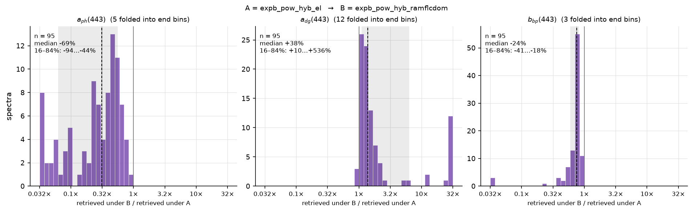
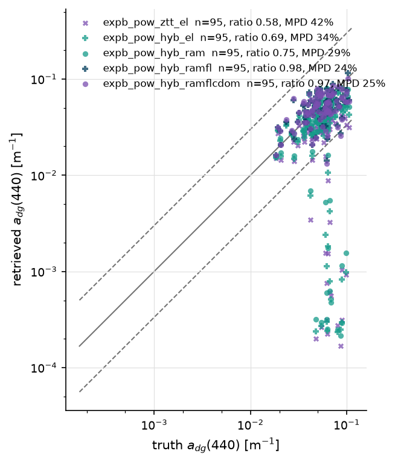
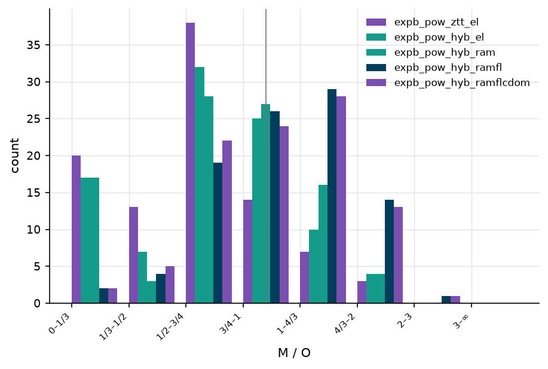
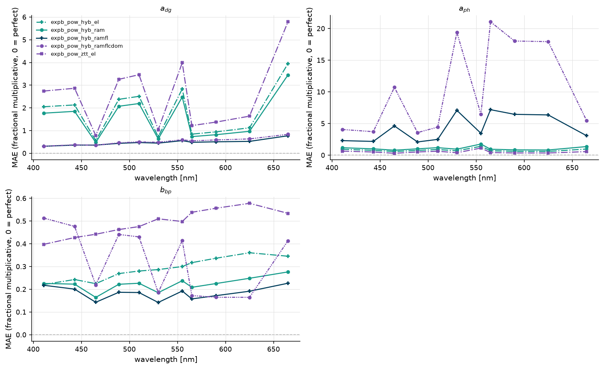
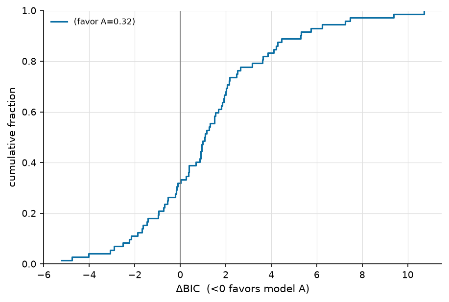
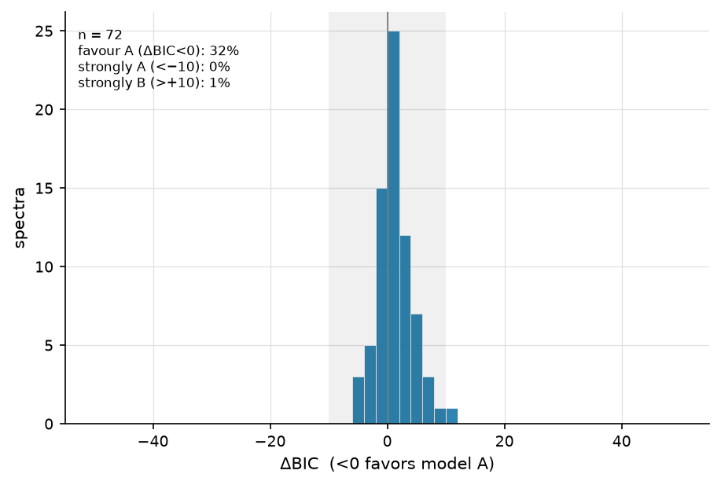
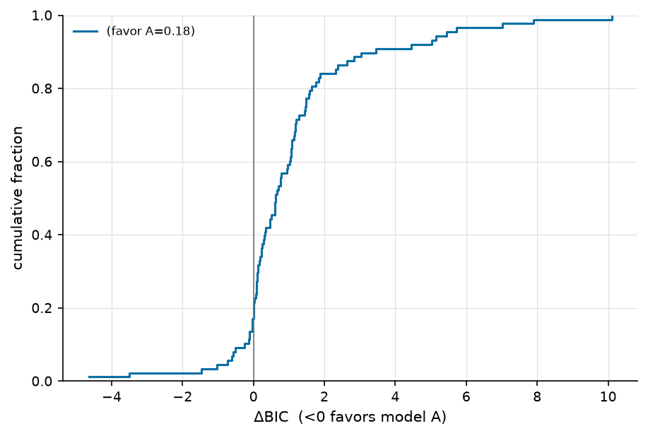
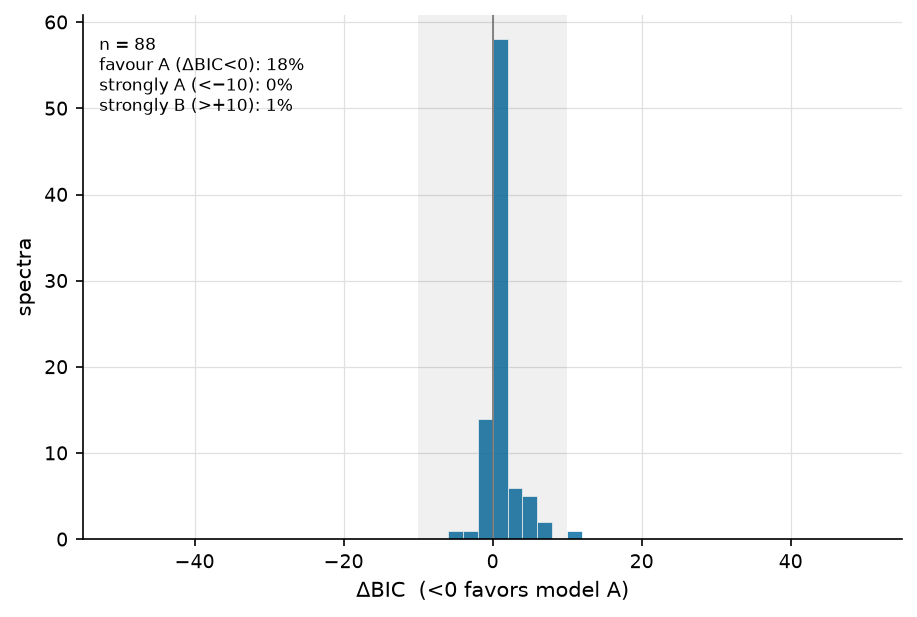

=================================
RT ladder — rt_tests_A_pangaea_v1
=================================

:Sweep: rt_tests_A_pangaea_v1
:Generated: 2026-09-10T15:49:36Z
:ioptics: 0.0.dev0@92eea90
:bing: 0.0.dev0@bf56f6d
:ocpy: 0.1.0@c3132a6
:design_doc: 0.16
:implementation_doc: 0.24

Overview
--------

This is the **RT ladder** for sweep ``rt_tests_A_pangaea_v1``: one IOP parameterization, ``expb_pow`` (exponential CDOM/detrital absorption, Bricaud phytoplankton absorption, power-law particulate backscatter), fitted to 97 spectra from PANGAEA over 400–750 nm under 5 radiative-transfer models. Every row differs from the next in the **forward model and nothing else** — same parameters, same priors, same noise model (``pct:0.1``), same spectra — so a difference between two rows is the physics. The rungs, from the analytic elastic model to the full inelastic stack (all from the ``robust.rt`` package of the retrieve-or-bust repository; see :doc:`/models`):

#. ``expb_pow_ztt_el`` — ExpB_Pow ZTT elastic
#. ``expb_pow_hyb_el`` — ExpB_Pow hybrid elastic
#. ``expb_pow_hyb_ram`` — ExpB_Pow hybrid +Raman
#. ``expb_pow_hyb_ramfl`` — ExpB_Pow hybrid +Raman +Chl-fl
#. ``expb_pow_hyb_ramflcdom`` — ExpB_Pow hybrid +Raman +Chl-fl +CDOM-fl

``B_p`` is **fixed at 0.01** (k = 5): the 6–11-band in-situ spectra cannot afford a sixth parameter (rt_tests Q52). Fit methods present: ``chisq``, ``mcmc``; the ladder was sampled by MCMC on every arm, so the MCMC population is the one read first below and χ² is shown alongside. This arm has **truth** for every retrieved component, so the rungs are scored against it. The header stamps the code and config versions; every number is regenerable from the persisted sweep artifacts under ``runs/``.

What is held fixed, and what this page cannot claim
---------------------------------------------------

* **Viewing geometry is nadir everywhere.** θ_v = 0 and Δφ = 0 for every spectrum; only the solar zenith varies (0° on L23 by construction, computed per record from time and position on PANGAEA and PACE). The emulator was trained at nadir view only (retrieve-or-bust M3), so this is a stated limitation of the sweep, not a choice the data allowed.

* **CDOM fluorescence is driven by a proxy.** ``expb_pow`` retrieves the combined CDOM + detrital absorption ``a_dg``; the Hawes (1992) fluorescence kernel wants pure CDOM absorption. The last rung feeds it ``a_cdom = 0.8 × a_dg`` — a **fixed CDOM fraction of 0.8** (rt_tests Q32) — and the kernel amplitude ``scale`` is fixed at 1.0. Nothing in the fit constrains either number.

* **The CDOM-fluorescence physics is unvalidated.** The ``robust.rt`` CDOM term is analytic only, its learned correction head is untrained, and no HydroLight truth with CDOM fluorescence exists (retrieve-or-bust M5/M6). The sweeps run on it as-is by decision (rt_tests Q41).

* **Downwelling irradiance is a packaged sky.** Every inelastic term takes its ``E_d(λ)`` from the ``ed_l23.npz`` table shipped with ``robust.rt`` (the L23 HydroLight sky at the three tabulated solar zeniths), not from a per-scene atmosphere.

* **Learned inelastic corrections are off.** ``robust.rt`` ships trained δ_R / δ_F correction heads for its Raman and fluorescence terms; BING calls the forward model with ``corrections=False``, so the inelastic rungs use the **analytic** Raman and fluorescence terms (≈2 % rRMS against L23 X4, versus 0.34 % with the heads). The ladder measures the analytic physics.

* **The hybrid emulator is evaluated outside its trained ``B_p`` range** wherever ``B_p`` is free. It was trained on B_p ∈ [0.0103, 0.018]; the posteriors sit near 0.027 and essentially every hybrid fit raised the emulator's ``DomainWarning``. Accepted with this caveat rather than narrowing the prior or fixing ``B_p`` (rt_tests Q50, option c). The analytic ZTT rung is unaffected and is the control for this.

* **PANGAEA is 6–11-band in-situ radiometry under a flat 10 % error model** (``insitu``; rt_tests Q53), and ``B_p`` is fixed there. ΔBIC scales with 1/σ², so the model-selection verdict on this arm is a statement under that assumed error as much as about the physics.

* **Excluded from the leaderboard by design.** Five rungs of one algorithm are not five algorithms; folding them into the cross-sweep board would rank ``expb_pow`` against itself. The sweep is registered with ``leaderboard: false`` and this page does not touch the landing page.

How far the physics moves the retrieval — 443 nm
------------------------------------------------

The truth-free view of the same ladder: for every spectrum both rungs retrieved, the fractional change of the retrieved **decomposition** — ``a_ph``, ``a_dg`` and ``bb_p`` at 443 nm — from the elastic hybrid ``expb_pow_hyb_el`` to the full inelastic stack ``expb_pow_hyb_ramflcdom`` (MCMC posterior medians). Zero means the physics did not move the retrieval; the dashed line is the median and the grey band the 16–84 % span. This needs no truth, so it is the one population statement that can be made identically on synthetic, in-situ and satellite spectra. It answers "how much does the forward model move a retrieval", which is a different question from "which forward model is right" — the truth-referenced sections below answer the second.

   Fractional change in retrieved a_ph, a_dg and bb_p at 443 nm from ``expb_pow_hyb_el`` to ``expb_pow_hyb_ramflcdom``, MCMC medians, one histogram per component (a_ph: n = 95, a_dg: n = 95, bb_p: n = 95).

The ladder — mcmc
-----------------

One row per rung, **mcmc** population, all strata. ``frac_ok`` is the fraction of attempted spectra that produced a solution (``poor_fit`` = χ²ᵥ above 5; ``out_of_scope`` = declined before fitting, red-peaked turbid spectra), ``chi2_nu_median`` the median reduced χ² of solutions, and ``rel_misfit_median`` the noise-model-free relative Rrs misfit. Accuracy cells are ``mae`` / ``bias`` / ``coverage68`` at ``a(440)``, ``a_ph(440)``, ``a_dg(440)``, ``bb(555)``, ``bb_p(555)``, ``bb_p(670)``: fractional multiplicative errors in log space (0 = perfect; 0.10 ≈ 10 %), signed bias (> 0 = over-estimate), and the fraction of truths inside the 68 % interval (nominal 0.68). A ``_caveat`` column names rows whose truth does not contain the physics the rung models. Columns are defined on the :doc:`/reports/glossary` page. Read the table down a column: a number that changes from rung to rung is the physics; one that does not is the parameterization.

.. csv-table:: One row per RT rung (mcmc).
   :file: rt_ladder_mcmc_all.csv
   :header-rows: 1
   :widths: auto

The ladder — chisq
------------------

One row per rung, **chisq** population, all strata. ``frac_ok`` is the fraction of attempted spectra that produced a solution (``poor_fit`` = χ²ᵥ above 5; ``out_of_scope`` = declined before fitting, red-peaked turbid spectra), ``chi2_nu_median`` the median reduced χ² of solutions, and ``rel_misfit_median`` the noise-model-free relative Rrs misfit. Accuracy cells are ``mae`` / ``bias`` / ``coverage68`` at ``a(440)``, ``a_ph(440)``, ``a_dg(440)``, ``bb(555)``, ``bb_p(555)``, ``bb_p(670)``: fractional multiplicative errors in log space (0 = perfect; 0.10 ≈ 10 %), signed bias (> 0 = over-estimate), and the fraction of truths inside the 68 % interval (nominal 0.68). A ``_caveat`` column names rows whose truth does not contain the physics the rung models. Columns are defined on the :doc:`/reports/glossary` page. Read the table down a column: a number that changes from rung to rung is the physics; one that does not is the parameterization.

.. csv-table:: One row per RT rung (chisq).
   :file: rt_ladder_chisq_all.csv
   :header-rows: 1
   :widths: auto

Retrieved vs. true — a_dg(440)
------------------------------

Retrieved vs. true **a_dg(440)**, one point per spectrum and rung, log–log. The solid line is 1:1, the dashed lines the ±3× envelope. Five colours, one parameterization: where the clouds separate, the forward model is doing the separating.

   a_dg(440), all rungs (MCMC medians) — at most 83 retrieval-truth pairs per rung.

Ratio distribution — a_dg(440)
------------------------------

How each rung's population sits about 1:1; the vertical rule marks ratio = 1.

   Retrieved/true ratio buckets for a_dg(440), per rung.

Accuracy vs. wavelength — PANGAEA
---------------------------------

The same ``mae`` as the ladder table, at every band the truth covers rather than at two reference wavelengths. This is where a physics term shows its spectral signature: Raman fills in from the blue, chlorophyll fluorescence acts near 685 nm, and a rung that is wrong everywhere is wrong for a different reason.

   Fractional multiplicative MAE against wavelength, one panel per component (``a_dg``, ``a_ph``, ``bb_p``), all rungs overlaid; the dashed rule is 0.

Model selection (ΔBIC) — mcmc
-----------------------------

The contest these sweeps were built to answer: the full inelastic stack ``expb_pow_hyb_ramflcdom`` (model A) against the elastic hybrid ``expb_pow_hyb_el`` (model B), like-for-like within the **mcmc** population. Both rungs have the same number of parameters, so ΔBIC is a pure likelihood contest: **ΔBIC < 0 favours the inelastic physics**, and abs(ΔBIC) > 10 is the conventional "strong" threshold. The CDF gives the fraction either side; the histogram says whether that fraction is one population or two.

   Cumulative distribution of per-spectrum ΔBIC = BIC(``expb_pow_hyb_ramflcdom``) − BIC(``expb_pow_hyb_el``), mcmc.

   The same ΔBIC values as a histogram, mcmc; the grey band is abs(ΔBIC) < 10.

Model selection (ΔBIC) — chisq
------------------------------

The contest these sweeps were built to answer: the full inelastic stack ``expb_pow_hyb_ramflcdom`` (model A) against the elastic hybrid ``expb_pow_hyb_el`` (model B), like-for-like within the **chisq** population. Both rungs have the same number of parameters, so ΔBIC is a pure likelihood contest: **ΔBIC < 0 favours the inelastic physics**, and abs(ΔBIC) > 10 is the conventional "strong" threshold. The CDF gives the fraction either side; the histogram says whether that fraction is one population or two.

   Cumulative distribution of per-spectrum ΔBIC = BIC(``expb_pow_hyb_ramflcdom``) − BIC(``expb_pow_hyb_el``), chisq.

   The same ΔBIC values as a histogram, chisq; the grey band is abs(ΔBIC) < 10.

Every pairwise contest
----------------------

Every rung against every other rung, ``median_dbic`` = median of BIC(``model_a``) − BIC(``model_b``) over the spectra both fitted, and ``frac_favor_a`` the fraction with ΔBIC < 0. ``configured`` marks the headline contest above. Reading down the ladder in order shows **which** physics term earns its keep on this arm and which is a wash.

.. csv-table:: Median ΔBIC and the fraction favouring each side, every pair (mcmc).
   :file: dbic_contests_mcmc_all.csv
   :header-rows: 1
   :widths: auto

Head-to-head verdicts — mcmc
----------------------------

Every pair of rungs judged on the spectra both retrieved: ``delta_mae`` = ``mae(A) − mae(B)`` with its paired-bootstrap 95 % interval, and a ``verdict`` that names a winner only when the interval excludes 0 **and** clears the practical floor of 10%. ``indistinguishable`` means the data rule a material difference *out* — which for total absorption is the finding. 4 of 50 pairs are indistinguishable.

.. csv-table:: Pairwise accuracy verdicts (mcmc, all strata).
   :file: head_to_head_mcmc_all.csv
   :header-rows: 1
   :widths: auto

Accuracy — mcmc
---------------

The full per-(component, reference band) accuracy table the ladder cells are drawn from, with ``median_ratio``, ``coverage95`` and the coverage verdicts. Columns are defined on the :doc:`/reports/glossary` page.

.. csv-table:: Ref-band accuracy, every scored component (mcmc, all strata).
   :file: accuracy_mcmc_all.csv
   :header-rows: 1
   :widths: auto

Quality control — mcmc
----------------------

``n_attempted``, the per-status fractions (kept apart on purpose: ``out_of_scope`` is "declined before fitting", ``fit_failed`` is "the fitter returned nothing"), the median reduced χ²ᵥ, the noise-model-free ``rel_misfit``, and the χ²ᵥ closure split. Identical ``out_of_scope`` counts on every rung are what make the ladder fair: the same spectra were declined everywhere.

.. csv-table:: Fit quality / closure per rung (mcmc).
   :file: qc_mcmc_all.csv
   :header-rows: 1
   :widths: auto

Accuracy — chisq
----------------

The full per-(component, reference band) accuracy table the ladder cells are drawn from, with ``median_ratio``, ``coverage95`` and the coverage verdicts. Columns are defined on the :doc:`/reports/glossary` page.

.. csv-table:: Ref-band accuracy, every scored component (chisq, all strata).
   :file: accuracy_chisq_all.csv
   :header-rows: 1
   :widths: auto

Quality control — chisq
-----------------------

``n_attempted``, the per-status fractions (kept apart on purpose: ``out_of_scope`` is "declined before fitting", ``fit_failed`` is "the fitter returned nothing"), the median reduced χ²ᵥ, the noise-model-free ``rel_misfit``, and the χ²ᵥ closure split. Identical ``out_of_scope`` counts on every rung are what make the ladder fair: the same spectra were declined everywhere.

.. csv-table:: Fit quality / closure per rung (chisq).
   :file: qc_chisq_all.csv
   :header-rows: 1
   :widths: auto
