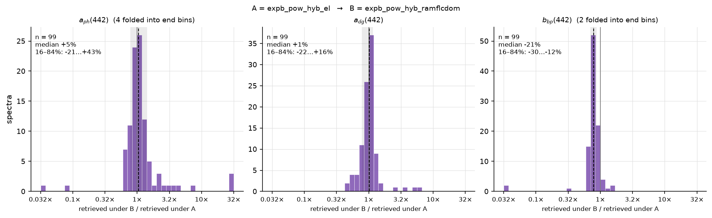
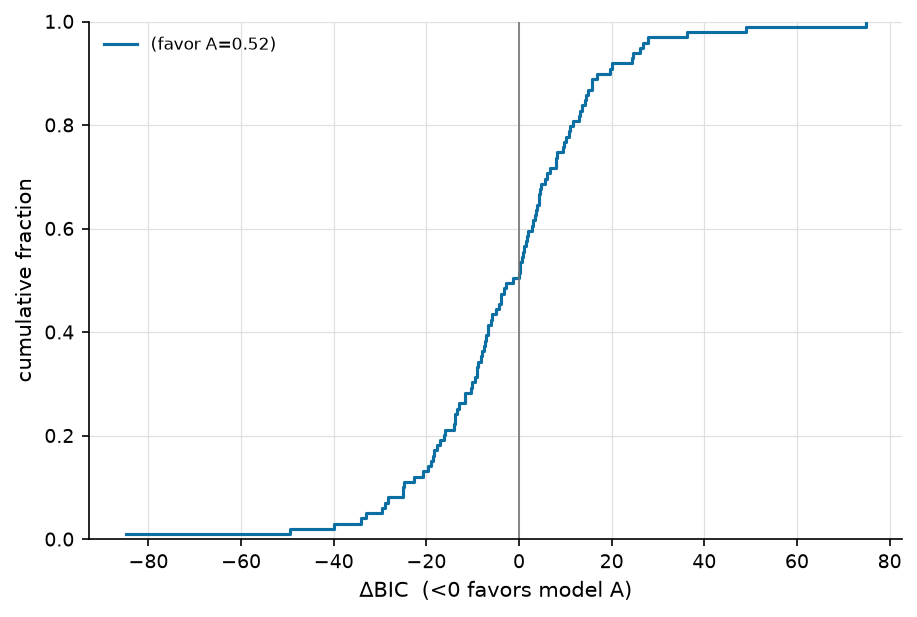
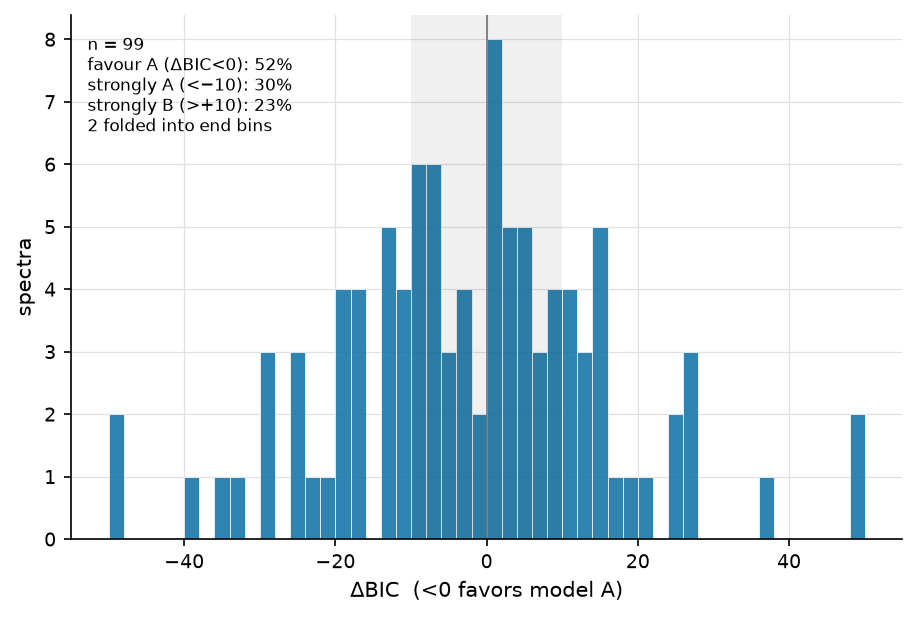
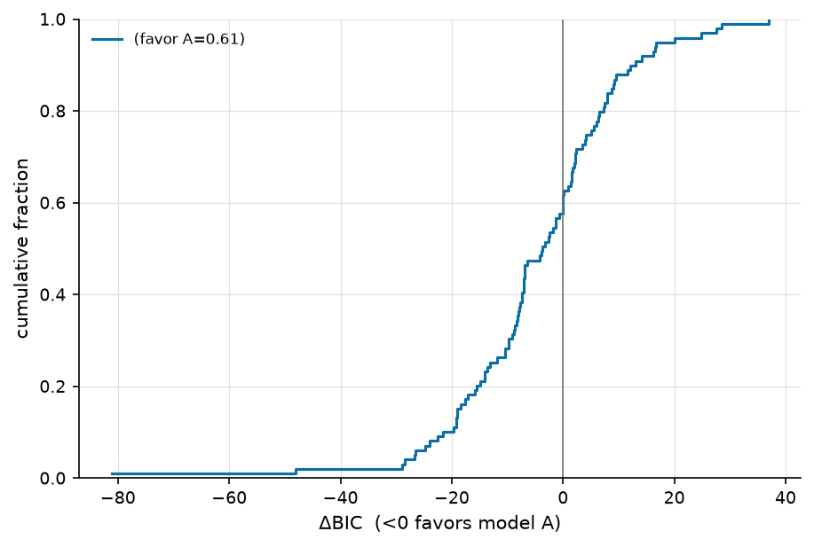
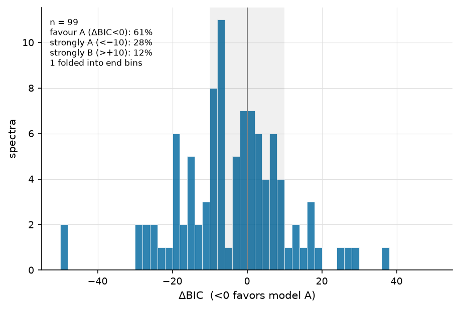

=========================
RT ladder — rt_tests_B_v1
=========================

:Sweep: rt_tests_B_v1
:Generated: 2026-09-17T20:27:24Z
:ioptics: 0.0.dev0@92eea90
:bing: 0.0.dev0@bf56f6d
:ocpy: 0.1.0@c3132a6
:design_doc: 0.16
:implementation_doc: 0.24

Overview
--------

This is the **RT ladder** for sweep ``rt_tests_B_v1``: one IOP parameterization, ``expb_pow`` (exponential CDOM/detrital absorption, Bricaud phytoplankton absorption, power-law particulate backscatter), fitted to 100 spectra from PACE over 400–700 nm under 5 radiative-transfer models. Every row differs from the next in the **forward model and nothing else** — same parameters, same priors, same noise model (``insitu``), same spectra — so a difference between two rows is the physics. The rungs, from the analytic elastic model to the full inelastic stack (all from the ``robust.rt`` package of the retrieve-or-bust repository; see :doc:`/models`):

#. ``expb_pow_ztt_el`` — ExpB_Pow ZTT elastic
#. ``expb_pow_hyb_el`` — ExpB_Pow hybrid elastic
#. ``expb_pow_hyb_ram`` — ExpB_Pow hybrid +Raman
#. ``expb_pow_hyb_ramfl`` — ExpB_Pow hybrid +Raman +Chl-fl
#. ``expb_pow_hyb_ramflcdom`` — ExpB_Pow hybrid +Raman +Chl-fl +CDOM-fl

``B_p`` (the particulate backscattering ratio the robust backends need) is **free**, a sixth parameter with a uniform prior on [0.004, 0.05]. Fit methods present: ``chisq``, ``mcmc``; the ladder was sampled by MCMC on every arm, so the MCMC population is the one read first below and χ² is shown alongside. This arm has **no truth**: the spectra are real satellite radiances, so the page cannot say which physics is right, only how far each rung moves the retrieval and which rung the data prefer. The header stamps the code and config versions; every number is regenerable from the persisted sweep artifacts under ``runs/``.

What is held fixed, and what this page cannot claim
---------------------------------------------------

* **Viewing geometry is nadir everywhere.** θ_v = 0 and Δφ = 0 for every spectrum; only the solar zenith varies (0° on L23 by construction, computed per record from time and position on PANGAEA and PACE). The emulator was trained at nadir view only (retrieve-or-bust M3), so this is a stated limitation of the sweep, not a choice the data allowed.

* **CDOM fluorescence is driven by a proxy.** ``expb_pow`` retrieves the combined CDOM + detrital absorption ``a_dg``; the Hawes (1992) fluorescence kernel wants pure CDOM absorption. The last rung feeds it ``a_cdom = 0.8 × a_dg`` — a **fixed CDOM fraction of 0.8** (rt_tests Q32) — and the kernel amplitude ``scale`` is fixed at 1.0. Nothing in the fit constrains either number.

* **The CDOM-fluorescence physics is unvalidated.** The ``robust.rt`` CDOM term is analytic only, its learned correction head is untrained, and no HydroLight truth with CDOM fluorescence exists (retrieve-or-bust M5/M6). The sweeps run on it as-is by decision (rt_tests Q41).

* **Downwelling irradiance is a packaged sky.** Every inelastic term takes its ``E_d(λ)`` from the ``ed_l23.npz`` table shipped with ``robust.rt`` (the L23 HydroLight sky at the three tabulated solar zeniths), not from a per-scene atmosphere.

* **Learned inelastic corrections are off.** ``robust.rt`` ships trained δ_R / δ_F correction heads for its Raman and fluorescence terms; BING calls the forward model with ``corrections=False``, so the inelastic rungs use the **analytic** Raman and fluorescence terms (≈2 % rRMS against L23 X4, versus 0.34 % with the heads). The ladder measures the analytic physics.

* **The hybrid emulator is evaluated outside its trained ``B_p`` range** wherever ``B_p`` is free. It was trained on B_p ∈ [0.0103, 0.018]; the posteriors sit near 0.027 and essentially every hybrid fit raised the emulator's ``DomainWarning``. Accepted with this caveat rather than narrowing the prior or fixing ``B_p`` (rt_tests Q50, option c). The analytic ZTT rung is unaffected and is the control for this.

* **PACE has no truth and its red bands are noisy.** The 100 spectra are real PACE OCI pixels from PAB's ``run1k`` matchups, 400–700 nm, weighted by the per-pixel ``Rrs_unc`` (5–6 % in the blue rising to 30–44 % beyond 613 nm — the region where the inelastic signal lives). Everything on this page for PACE is model selection and closure, never accuracy.

* **Excluded from the leaderboard by design.** Five rungs of one algorithm are not five algorithms; folding them into the cross-sweep board would rank ``expb_pow`` against itself. The sweep is registered with ``leaderboard: false`` and this page does not touch the landing page.

How far the physics moves the retrieval — 442 nm
------------------------------------------------

This is the **headline figure for this arm**: for every spectrum both rungs retrieved, the fractional change of the retrieved **decomposition** — ``a_ph``, ``a_dg`` and ``bb_p`` at 442 nm — from the elastic hybrid ``expb_pow_hyb_el`` to the full inelastic stack ``expb_pow_hyb_ramflcdom`` (MCMC posterior medians). Zero means the physics did not move the retrieval; the dashed line is the median and the grey band the 16–84 % span. This needs no truth, so it is the one population statement that can be made identically on synthetic, in-situ and satellite spectra. It answers "how much does the forward model move a retrieval", which is a different question from "which forward model is right" — the truth-referenced sections cannot be built for this arm.

   Fractional change in retrieved a_ph, a_dg and bb_p at 442 nm from ``expb_pow_hyb_el`` to ``expb_pow_hyb_ramflcdom``, MCMC medians, one histogram per component (a_ph: n = 99, a_dg: n = 99, bb_p: n = 99).

Consistency with PAB's fits of the same pixels
----------------------------------------------

These spectra are the pixels PAB fitted in its ``run1k`` run with BING's ``ExpBPow`` under the **Gordon** elastic forward model. The elastic hybrid rung refits them under ``robust_hybrid`` with one extra free parameter (``B_p``). Rows: Pearson correlation of the posterior medians across pixels, the median and 16–84 % span of (ours − PAB) in the parameter's own scale (``Adg``, ``Aph``, ``Bnw`` are log10 amplitudes), the derived-chlorophyll ratio, and the largest difference between the observed spectra and variances the two fitters were handed (a non-zero value there would mean the pipelines did not see the same data). This is a gate, not a result: agreement to within the elastic-model swap (``robust_hybrid`` sits 1.4–3.7 % above Gordon in Rrs on L23) plus the free ``B_p`` says the PACE arm stands on the data PAB published from. Produced by ``ioptics/runs/prototypes/rt_tests/pab_consistency.py``.

.. csv-table:: Elastic hybrid rung vs PAB run1k ExpBPow (Gordon), per shared parameter.
   :file: pab_consistency_summary.csv
   :header-rows: 1
   :widths: auto

The ladder — mcmc
-----------------

One row per rung, **mcmc** population, all strata. ``frac_ok`` is the fraction of attempted spectra that produced a solution (``poor_fit`` = χ²ᵥ above 5; ``out_of_scope`` = declined before fitting, red-peaked turbid spectra), ``chi2_nu_median`` the median reduced χ² of solutions, and ``rel_misfit_median`` the noise-model-free relative Rrs misfit. There is no truth on this arm, so the table carries fit quality only. Columns are defined on the :doc:`/reports/glossary` page. Read the table down a column: a number that changes from rung to rung is the physics; one that does not is the parameterization.

.. csv-table:: One row per RT rung (mcmc).
   :file: rt_ladder_mcmc_all.csv
   :header-rows: 1
   :widths: auto

The ladder — chisq
------------------

One row per rung, **chisq** population, all strata. ``frac_ok`` is the fraction of attempted spectra that produced a solution (``poor_fit`` = χ²ᵥ above 5; ``out_of_scope`` = declined before fitting, red-peaked turbid spectra), ``chi2_nu_median`` the median reduced χ² of solutions, and ``rel_misfit_median`` the noise-model-free relative Rrs misfit. There is no truth on this arm, so the table carries fit quality only. Columns are defined on the :doc:`/reports/glossary` page. Read the table down a column: a number that changes from rung to rung is the physics; one that does not is the parameterization.

.. csv-table:: One row per RT rung (chisq).
   :file: rt_ladder_chisq_all.csv
   :header-rows: 1
   :widths: auto

Model selection (ΔBIC) — mcmc
-----------------------------

The contest these sweeps were built to answer: the full inelastic stack ``expb_pow_hyb_ramflcdom`` (model A) against the elastic hybrid ``expb_pow_hyb_el`` (model B), like-for-like within the **mcmc** population. Both rungs have the same number of parameters, so ΔBIC is a pure likelihood contest: **ΔBIC < 0 favours the inelastic physics**, and abs(ΔBIC) > 10 is the conventional "strong" threshold. The CDF gives the fraction either side; the histogram says whether that fraction is one population or two.

   Cumulative distribution of per-spectrum ΔBIC = BIC(``expb_pow_hyb_ramflcdom``) − BIC(``expb_pow_hyb_el``), mcmc.

   The same ΔBIC values as a histogram, mcmc; the grey band is abs(ΔBIC) < 10.

Model selection (ΔBIC) — chisq
------------------------------

The contest these sweeps were built to answer: the full inelastic stack ``expb_pow_hyb_ramflcdom`` (model A) against the elastic hybrid ``expb_pow_hyb_el`` (model B), like-for-like within the **chisq** population. Both rungs have the same number of parameters, so ΔBIC is a pure likelihood contest: **ΔBIC < 0 favours the inelastic physics**, and abs(ΔBIC) > 10 is the conventional "strong" threshold. The CDF gives the fraction either side; the histogram says whether that fraction is one population or two.

   Cumulative distribution of per-spectrum ΔBIC = BIC(``expb_pow_hyb_ramflcdom``) − BIC(``expb_pow_hyb_el``), chisq.

   The same ΔBIC values as a histogram, chisq; the grey band is abs(ΔBIC) < 10.

Every pairwise contest
----------------------

Every rung against every other rung, ``median_dbic`` = median of BIC(``model_a``) − BIC(``model_b``) over the spectra both fitted, and ``frac_favor_a`` the fraction with ΔBIC < 0. ``configured`` marks the headline contest above. Reading down the ladder in order shows **which** physics term earns its keep on this arm and which is a wash.

.. csv-table:: Median ΔBIC and the fraction favouring each side, every pair (mcmc).
   :file: dbic_contests_mcmc_all.csv
   :header-rows: 1
   :widths: auto

Quality control — mcmc
----------------------

``n_attempted``, the per-status fractions (kept apart on purpose: ``out_of_scope`` is "declined before fitting", ``fit_failed`` is "the fitter returned nothing"), the median reduced χ²ᵥ, the noise-model-free ``rel_misfit``, and the χ²ᵥ closure split. Identical ``out_of_scope`` counts on every rung are what make the ladder fair: the same spectra were declined everywhere.

.. csv-table:: Fit quality / closure per rung (mcmc).
   :file: qc_mcmc_all.csv
   :header-rows: 1
   :widths: auto

Quality control — chisq
-----------------------

``n_attempted``, the per-status fractions (kept apart on purpose: ``out_of_scope`` is "declined before fitting", ``fit_failed`` is "the fitter returned nothing"), the median reduced χ²ᵥ, the noise-model-free ``rel_misfit``, and the χ²ᵥ closure split. Identical ``out_of_scope`` counts on every rung are what make the ladder fair: the same spectra were declined everywhere.

.. csv-table:: Fit quality / closure per rung (chisq).
   :file: qc_chisq_all.csv
   :header-rows: 1
   :widths: auto

Not shown for this sweep
------------------------

The figure set is derived from what this sweep actually measured, so a panel with no data behind it is omitted rather than published blank. For the record, this page leaves out:

* every retrieved-vs-true panel and the accuracy-vs-wavelength figure — this arm carries no truth, by design.
