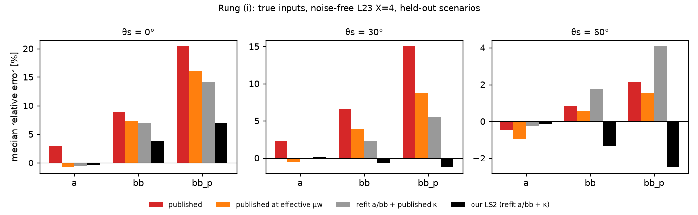
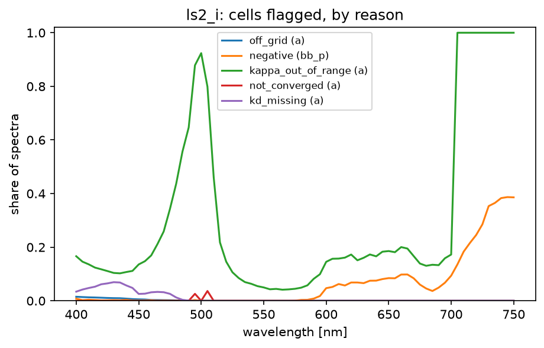
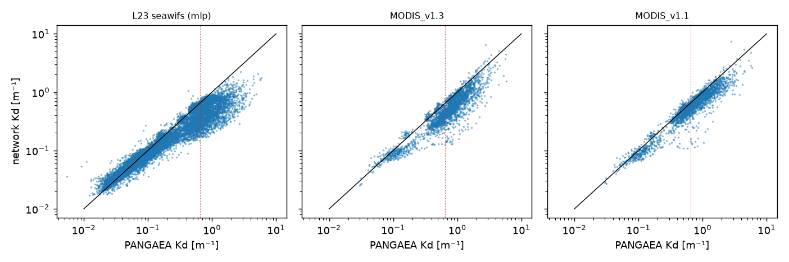
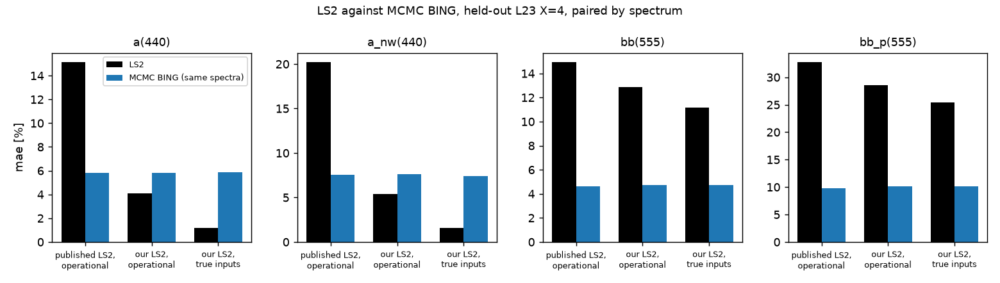
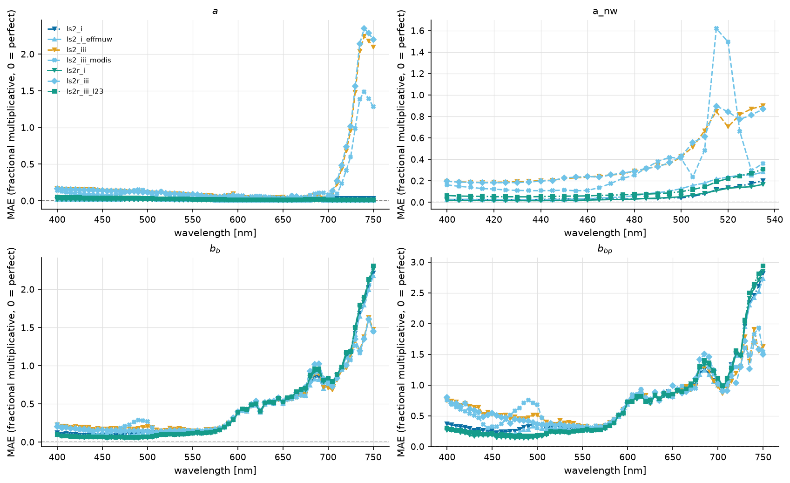

# LS2 in IOPtics: what was built, what was measured, and what it means

*Report on the LS2 work specified and logged in
`claude_prompts/LS2/ls2_execution.md` (tasks 1–15, plus 9a/9b; 15a, the
leaderboard fold, runs on the workstation).  Written 2026-10-04 by Claude
(Opus 5.5) for J. Xavier Prochaska.  Every number is either **(P)**, read by
`reports/scripts/ls2_report.py` from a committed report table under
`docs/source/reports/` (each regenerated by its committed script, which
`verify_reports.py` checks), or **(L)**, quoted from a dated log entry in
`ls2_execution.md`.  Nothing is quoted from memory.  "mae" in the IOPtics
tables is the fractional multiplicative error 10^mean|log10(ret/true)| − 1;
the Kd-network section uses mean|ln(ret/true)| and says so.*

---

## 1. Summary

LS2 (Loisel et al. 2018) inverts remote-sensing reflectance and the diffuse
attenuation coefficient ⟨Kd⟩₁ into total absorption `a` and backscattering
`bb` through published polynomial look-up tables.  It was brought into IOPtics
as its first **direct** algorithm (no fit, no likelihood, totals only).  It
was benchmarked on the L23 Hydrolight corpus as a ladder of inputs, set
against MCMC BING, then rebuilt from L23 to see how much of its error was
avoidable.

* **Published LS2 carries three avoidable errors on L23.**
  - An illumination convention (Snell's μw) that L23's diffuse sky does not
    follow is worth the whole `a` bias: +2.9% at θs = 0°
    with true inputs, -0.8% once the published tables are
    entered at L23's effective μw **(P)**.
  - Its Raman table κ is unavailable on 25.3% of
    cells **(P)**: a broken 502 nm row, a stop at 702 nm, and ranges narrower
    than L23.
  - The MODIS Kd network ocpy shipped (v1.1) swings
    -22% to
    +25% with wavelength against L23
    **(P)**.
* **Rebuilding the three pieces from L23 removes most of it.**  At θs = 0°,
  true inputs, held-out scenarios: `a` +2.9% →
  -0.4%, `bb` +8.9% →
  +3.9%, `bb_p` +20.4% →
  +7.0%; κ unavailable 25.3% →
  0.16% **(P)**.
* **Operationally the Kd network dominates.**  Rung (iii) `a(440)` mae goes
  from 15.2% (published) to
  14.8% (our tables, the same network) to
  4.1% (our tables and our L23 Kd
  network) **(P)**.
* **Against MCMC BING the trade is one-sided per component.**  On absorption
  totals LS2 is competitive or better: `a(440)` 4.1%
  vs 5.8% operationally,
  1.2% vs 5.9%
  with true inputs.  On backscattering BING wins clearly: `bb(555)`
  4.7% vs
  11.2%, because LS2 inverts band by
  band and inherits each band's noise.  LS2 has no `a_ph`/`a_dg`; BING's are
  poor (`a_ph(440)` mae 84.6%) **(P)**.
* **Everything is L23.**  Our Kd network reads low against real PANGAEA water
  (median ratio 0.902
  in scope) **(P)**.  Only the published operational LS2 goes on the
  leaderboard (Q41).



*Figure 1.  Rung (i) median relative error on held-out L23 X=4, noise-free,
for four table configurations (P; table `ls2_ours/ours_headline.csv`).  At
θs = 60°, where the published tables were already close (`bb`
+0.9%, `bb_p`
+2.1%), ours over-correct slightly
(`bb` -1.4%, `bb_p`
-2.5%).*

---

## 2. What LS2 is, and how it was set up

LS2 computes `a = ⟨Kd⟩₁ / P₃(Rrs)` and `bb = ⟨Kd⟩₁ · (d₀Rrs + d₁Rrs² +
d₂Rrs³)`.  The coefficients are tabulated on 21 values of η = b_w/b and 8 of
μw, the cosine of the refracted solar beam.  A Raman correction κ(bb/a) is
iterated.  It needs ⟨Kd⟩₁ and the particulate scattering b_p as inputs, so
IOPtics runs it as a **ladder** whose rungs differ in one input each:

| rung | Kd | b_p | role |
|---|---|---|---|
| (i) `ls2_i` | true ⟨Kd⟩₁ | true | LS2 alone |
| (ii) `ls2_ii` | true | OC4v4 Chl → `bp_from_chla` | + the Chl side chain |
| (iii) `ls2_iii` | authors' PACE v2.3 network | OC4v4 | operational (satellite mode) |
| `ls2_iii_modis` | authors' MODIS v1.3 network | OC4v4 | second Kd network |
| `ls2_i_effmuw` | true | true | tables at L23's effective μw (diagnostic) |
| `ls2_i_kdnoise05/10/20` | true × (1 + σε), one draw per spectrum | true | Kd-error sensitivity |

Data: L23 (Loisel et al. 2023), 3,320 IOP scenarios at θs = 0/30/60°, in
three realizations: X=1 elastic, X=2 + Raman, X=4 + Raman + Chl
fluorescence.  Rrs carries PACE-form noise (the same form as the BING
benchmark RT-A, not the same draws), and the window is 400–750 nm.  The BING
comparator is RT-A's MCMC `expb_pow_hyb_ramfl`, the RT rung whose physics
matches X=4 (Q36).

---

## 3. What was built

**Upstream, ocpy.**
- `ls2_invert`: vectorized (800k cells in 0.34 s single-pass, 1.5 s iterated,
  down from 18.5 min for the scalar path) **(L, 2026-09-26)**.  It iterates
  the Raman correction to convergence, flags every NaN per cell, and has
  three corrected porting defects.  It matches the authors' reference vector
  to 1e-9 **(L)**.
- The Chl side chain: `oc4v4` and `bp_from_chla`.  The 0.347·Chl^0.766
  amplitude was traced to Loisel & Morel 1998 Eq. 6, which is a regression on
  c_p, not b_p **(L, 2026-10-02)**.
- The authors' Kd networks: MODIS v1.1, v1.3 and PACE v2.3, matching their
  reference vectors to ≤1.8e-13 **(L, 2026-10-03)**.  The `Kd_NN_MODIS`
  default now points at v1.3.
- A fixed ZHH2009 pure-water scattering.  It had three transcription errors,
  one of them a 25% error pinned by its own test, and now matches L23 to
  −0.27% **(L, 2026-10-03)**.
- `kd_l23`: our L23-trained Kd networks, NumPy-only inference.
- `refit`: the smooth a/bb refit and κ refit.
- Two re-derived tables: `LS2_LUT_L23_v1.npz` (a/bb) and
  `LS2_LUT_L23_abk_v1.npz` (a/bb + κ).

**IOPtics.**
- `DirectSpec`, a second spec type, with an honest `fit_method='direct'`,
  and a `pool` column so direct rows meet each fitted population in contests.
- Per-cell NaN reasons.
- Explicit "not applicable" rows for components an algorithm cannot produce.
- ⟨Kd⟩₁ from L23's profile files, with three definitions.  L23's stored z₁
  disagrees with its own Ed profile by up to 1.77× at 700 nm, but the
  definitions agree to ≤0.03% in median **(L, 2026-10-03)**.
- The LS2 driver and ladder registry; the `ls2_ladder` report page; the
  Flax/Optax Kd-network trainer `kd_net`.
- Sweeps on X=1/2/4, a held-out sweep, and a leaderboard sweep.
- Ten report page directories (four ladder pages, plus the Kd diagnostic,
  the Kd networks, the a/bb refit, the κ refit, "our own LS2" and the
  debrief), and `verify_reports.py`, which rebuilds every LS2 page from its
  committed script and compares it cell by cell.  On the final run
  all 10 pages regenerated with 0 differing cells **(L, 2026-10-04,
  task 15)**.

**Fixes made along the way.**
- A bootstrap seed that hashed `repr(np.float64)`: a numpy-2 type change had
  silently redrawn every published interval.  It was fixed, and RT-A's
  published head-to-heads now reproduce exactly **(L, Q37)**.
- A leaderboard ranking bug that dropped pre-`pool` rows from every contest
  **(L, task 15)**.
- RT-A was brought from the workstation (9a/9b), given BING's `a_nw`, and
  re-scored.  All its published numbers reproduce **(L, 9b)**.

---

## 4. Results

### 4.1 The published ladder on L23 X=4 (all 3,320 spectra, noisy Rrs)

| rung | `a(440)` mae | `bb(555)` mae | `bb(555)` median | `bb_p(555)` median |
|---|---|---|---|---|
| (i) true inputs | 2.1% | 13.2% | +7.1% | +13.5% |
| (ii) + OC4v4 b_p | 2.1% | 14.1% | +7.7% | +14.5% |
| (iii) PACE Kd network | 16.2% | 15.2% | +4.2% | +7.6% |
| (iii) MODIS v1.3 Kd | 8.2% | 14.7% | +5.0% | +9.6% |
| effective μw | 1.8% | 12.9% | +5.8% | +10.9% |
| MCMC BING (RT-A) | 5.9% | 4.7% | +2.0% | +4.0% |

*(P; `ls2_l23_x4_v1/ls2_ladder_all.csv`.)*

**Kd error costs `a` almost one-for-one.**  On the Kd-noise rungs, `a(440)`
mae rises by 0.82 per unit of relative Kd error
(one multiplicative draw per spectrum) **(P)**.  Strict `ok` (every output
finite and positive at every band) is rare under noise, because PACE noise
drives red Rrs negative.  Spectra are therefore scored cell by cell (Q31).
The PACE network fails outright on 118 X=4 records, whose red Rrs are
negative **(L, task 8)**.



*Figure 2.  Where published LS2 (rung i, X=4) returns nothing, per
wavelength and reason.  The κ hole at 490–505 nm and the stop at 702 nm are
the table's.*

### 4.2 The 15% question: is L23's ⟨Kd⟩₁ the truth, or the network? (task 10)

Planning found the shipped MODIS network 15–18% high at 440/490 nm against
L23.  It reproduces: +15% at 440 and
+19% at 490 nm.  But it is a
wavelength sawtooth, not a blue offset: -18%
at 520, +23% at 580 and
-18% at 600 nm.  The authors' PACE v2.3
network agrees with L23 to a median 1.8% over
400–700 nm **(P)**.  The ⟨Kd⟩₁ definition, pure water and band interpolation
were each ruled out, on size and on structure (the error scales with Kd).
**Verdict: L23 is the truth to train against; the v1.1 network is wrong.**


*Figure 3.  Network Kd / L23 ⟨Kd⟩₁ against wavelength (L23 X=4, θs = 0°).*

### 4.3 Our own Kd networks (task 11)

Two tanh MLPs, trained on L23 X=4 (Q38) with PACE-noise augmentation and
split by IOP scenario:
- a hyperspectral one, 71 bands from 400 to 750 nm;
- a five-band SeaWiFS-like one.

The target is ln(μw⟨Kd⟩₁), with 1/μw analytic.  A held-out-zenith experiment
rejected μw as an input: with it, the five-band network's error at an unseen
60° was 15.5%–22.6%
depending on seed, against 5.2% without
it **(P)**.

| held-out L23, PACE noise | mean abs ln ratio, 400–700 nm |
|---|---|
| ours, hyperspectral | 2.3% |
| ours, five-band | 4.1% |
| authors' PACE v2.3 | 8.9% (fails on 4.5% of cells) |
| authors' MODIS v1.3 | 7.3% |
| authors' MODIS v1.1 (formerly shipped) | 15.9% |

*(P; `ls2_kd_l23/kdl23_heldout.csv`.)*  Trained on elastic X=1 instead, the
hyperspectral network scores 4.2%
on X=4 **(P)**.  **Off L23 it is a different story.**  On PANGAEA's measured
Kd, the five-band network reads low: median ratio
0.909 over
1782 spectra.  On
the 92 in-scope
spectra all three can score, MODIS v1.1 is closest
(0.229 against
0.377 for ours)
**(P)**: the reverse of the L23 ranking.


*Figure 4.  Kd networks on held-out L23 X=4 with PACE noise.*



*Figure 5.  Five-band network and the authors' MODIS networks against
PANGAEA's measured Kd (±6 nm band matching).*

### 4.4 Re-deriving the a and bb tables (task 12)

The cubic form is kept.  Each coefficient becomes a quadratic in √η times
(1, 1/μw) for `a` or (1, μw) for `bb`, fitted to L23 X=1 by one weighted
linear least-squares solve: 24 + 18 parameters against the published 672 +
504.  The μw bases were chosen by a leave-one-zenith-out check.  On held-out
L23 X=1 with true inputs (P; `ls2_refit_ab/refit_scores.csv`):

| | published `a` | refit `a` | published `bb` | refit `bb` |
|---|---|---|---|---|
| median | +2.46% | -0.07% | +1.15% | +0.16% |
| mean abs ln ratio | 1.9% | 0.2% | 5.5% | 0.6% |

**The limiting relation, and why `a` was biased.**  The refit's
Rrs → 0 limit c₀ is 1.0333, 1.1022
and 1.3081 at 0/30/60°.  That matches L23's
1/μ_eff (1.0358, 1.1091,
1.3167), not the paper's 1/μw (1.0,
1.0778, 1.3105) **(P)**.  L23's b/a reaches
only 14.14 against the paper's 30, so turbid water is an
extrapolation.


*Figure 6.  Median retrieved/true per wavelength, published vs refit tables
(held-out L23 X=1, true inputs).*

### 4.5 Re-deriving κ (task 13)

On L23, κ is measured directly: κ = Rrs(X=1)/Rrs(X=2), the same water with
and without Raman.  The refit keeps the published form (a cubic in bb/a per
wavelength) over 350–750 nm, with ranges taken from L23.  In a held-out X=2
inversion with true inputs (P; `ls2_refit_kappa/*.csv`):

| | κ unavailable | `bb` mae | `bb_p` mae |
|---|---|---|---|
| no correction | – | 10.6% | 20.7% |
| published κ | 25.4% | 4.6% | 9.0% |
| refit κ | 0.05% | 2.6% | 5.2% |
| elastic ceiling (X=1) | – | 0.6% | 1.2% |

The published table can evaluate only 17.5%
of cells at 500 nm **(P)**.  κ depends on the sun angle, but not
monotonically: at θs = 0° it sits apart from 30° and 60°, which agree with
each other.  So no μw term survived the leave-one-zenith-out check, and that
dependence is the floor left between the refit and the elastic ceiling.


*Figure 7.  Share of cells with κ unavailable, published vs refit (held-out
X=2 and X=4).*


*Figure 8.  True κ against bb/a, coloured by solar zenith, with both cubics.*

### 4.6 Our own LS2 against the published one, and against BING (task 14)

The re-derived rungs run on the held-out sweep, where none of the re-derived
pieces was fitted.  The L23-network rung runs **only** there (Q39).

| held-out, noisy | `a(440)` mae | `bb(555)` mae | `bb(555)` bias |
|---|---|---|---|
| published, true inputs | 2.1% | 12.8% | +7.1% |
| ours, true inputs | 1.2% | 11.2% | +2.2% |
| published, operational (PACE Kd) | 15.2% | 15.0% | +3.8% |
| ours, operational (our L23 Kd) | 4.1% | 12.8% | +4.1% |

*(P; `ls2_ours/ours_heldout_ladder.csv`.)*



*Figure 9.  LS2 against MCMC BING, paired spectrum by spectrum on held-out L23
X=4, at the reference bands (P; `ls2_ours/ours_vs_bing_heldout.csv`).*



*Figure 10.  mae against wavelength on the held-out sweep, for the main
rungs.  Above 700 nm every rung fed by the authors' Kd networks blows up in
`a`; ours stays flat.*

### 4.7 What the two side chains cost

Measured on the held-out X=4 spectra, as the change in `a(440)` mae when a
true input is replaced (P; `ls2_debrief/debrief_side_chains.csv`):

| side chain | published tables | our tables |
|---|---|---|
| Chl/b_p: OC4v4 → `bp_from_chla` | -0.1 pp | +1.1 pp |
| Kd: authors' PACE v2.3 | +13.2 pp | +12.5 pp |
| Kd: authors' MODIS v1.3 | +6.3 pp | – |
| Kd: our L23 network | – | +1.8 pp |

The b_p chain is cheap because b_p enters only through η, which picks the
table row.  The Kd chain is the expensive one, and how expensive depends
entirely on the network.

---

## 5. What LS2 shows about totals against decomposition

LS2 returns totals (`a`, `bb`) and their non-water parts (`a_nw`, `bb_p`).
It does not split absorption into phytoplankton and CDM.  BING does, and on
L23 X=4 that split is where BING's error lives: `a_ph(440)` mae
84.6% and `a_dg(440)`
26.1%, against 5.9%
for its total `a(440)` **(P)**.  An algorithm that declines to split gives up
those two numbers and their errors.  With a good Kd, it then matches or beats
the fitted model on absorption totals.  On backscattering, a full-spectrum fit
averages noise that a band-by-band inversion cannot.

---

## 6. Decisions taken along the way (Q&A, abridged)

- **Q27/Q30**: the authors' PACE network is rung (iii); MODIS v1.3 is the
  alternative; the `Kd_NN_MODIS` default moved to v1.3 after task 10.
- **Q31**: direct spectra that are not strictly `ok` are scored cell by cell.
- **Q33**: Kd noise is one fully correlated draw per spectrum, at 5/10/20%.
- **Q34**: `a_nw` is masked at a_nw/a ≥ 0.1 in figures.
- **Q35**: RT-A was copied from the workstation via the RoB Drive (9a/9b).
- **Q36**: `expb_pow_hyb_ramfl` is "BING" in comparisons.
- **Q37**: bootstrap seeds are now dtype-independent.
- **Q38**: the Kd networks are trained on X=4.
- **Q39**: L23-trained pieces are scored on held-out scenarios only.
- **Q40**: the intermittent MCMC reproducibility test was investigated
  (time-boxed), then relaxed to `allclose(1e-10)`, with a diagnostic message.
- **Q41**: only the published operational LS2 goes on the leaderboard, on
  elastic L23 beside BING (prompt 15a).

---

## 7. Limitations and open items

- **Everything is L23.**  Our tables and networks are L23-trained and scored
  on held-out L23 scenarios.  The PANGAEA check says real water attenuates
  more than L23 predicts from the same Rrs.
- κ's sun dependence and X=4 Chl fluorescence remain uncorrected.  So does
  the band-by-band noise sensitivity of `bb`/`bb_p`, which is structural.
- Turbid water (b/a > 14.14) and θs > 60° are
  extrapolations of the re-derived tables.
- **Prompt 15a (the leaderboard fold) is pending** on the workstation, whose
  board holds sweeps the laptop's lacks.
- No in-situ validation exists for the hyperspectral Kd network.

---

## 8. Reproducing this report

From the repository root, with the `ocean14` interpreter, `PYTHONPATH=.`, and
L23 and RT-A under `$OS_COLOR`:

```
python ioptics/runs/prototypes/ls2/build_v1.py 1 --n-cores 12   # sweeps
python ioptics/runs/prototypes/ls2/build_v1.py 2                # metrics
python ioptics/runs/prototypes/ls2/build_v1.py 3                # ladder pages
python ioptics/runs/prototypes/ls2/kd_15pct.py                  # task 10
python ioptics/runs/prototypes/ls2/train_kd_l23.py              # task 11 (~15 min)
python ioptics/runs/prototypes/ls2/refit_ab.py                  # task 12
python ioptics/runs/prototypes/ls2/refit_kappa.py               # task 13
python ioptics/runs/prototypes/ls2/ours_report.py               # task 14
python ioptics/runs/prototypes/ls2/debrief.py                   # task 15
python ioptics/runs/prototypes/ls2/verify_reports.py            # check all pages
python reports/scripts/ls2_report.py                            # this report
```
