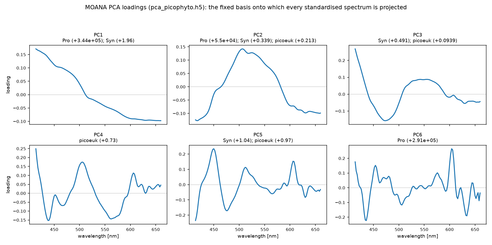
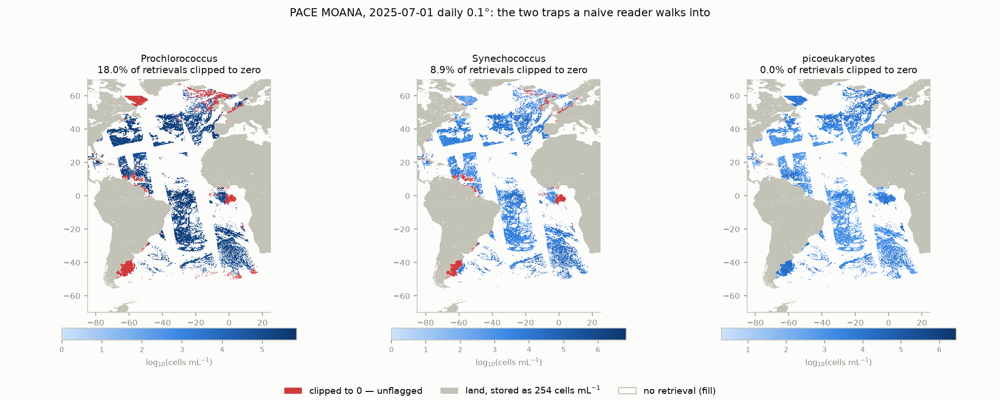
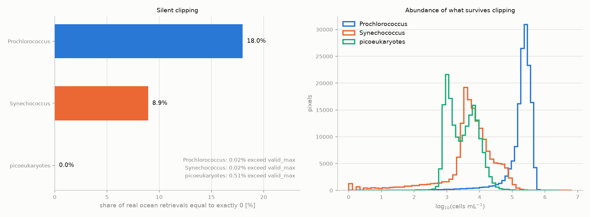

# MOANA — algorithm, provenance, inconsistencies, and how I would improve it

**Author:** Claude (Fable 5), for J. Xavier Prochaska
**Date:** 2026-08-01 (rev. 2)
**Status:** complete as an understanding of the algorithm. Our own implementation
does not exist yet, so nothing here has been checked against an independent
reimplementation of MOANA; the characterisation of the shipping product (§7.3,
Appendix A) *is* first-hand, from opening a granule. §9 is diagnostic — none of the
proposed improvements has been built or benchmarked.
**Figures** are regenerated by `reports/scripts/moana_report_figs.py`.

---

## 1. Purpose and sources

This report sets out everything I have established about **MOANA**, the NASA PACE
algorithm that retrieves near-surface cell abundances of *Prochlorococcus*,
*Synechococcus* and autotrophic picoeukaryotes from hyperspectral remote-sensing
reflectance. It is written to be self-contained: the equations, every coefficient,
and the file formats are all here, so an implementation can be built from this
document alone.

Everything below rests on four primary sources, all of which I read directly:

| Source | What it contributed |
|---|---|
| Lange et al. (2020), *Opt. Express* **28**, 25682 (`papers/lange2020.pdf`) | the science, the training design, and the only published skill numbers |
| MOANA ATBD v1.2, 2024-12-16 (`papers/moana_atbd.pdf`) | the operational recipe and a table of the 25 regression coefficients |
| OCSSW `src/l2gen/get_Cpicophyt.c` (V2026.4) | the authoritative implementation, including all the behaviour the prose omits |
| `pca_picophyto.h5` + `picophyt.json` (`ioptics/data/moana/`) | the PCA loadings and coefficients — published nowhere in the literature |

Plus one PACE granule (`PACE_OCI.20250701.L4m.DAY.MOANA.V3_2.0p1deg.nc`) which I
opened and characterised.

A note on epistemic status, since it matters for a report like this: statements
about the algorithm's *behaviour* come from reading the C source and the data files
and are verified. Statements about **which of two conflicting descriptions is
correct** (§7.1) are inferences from indirect evidence, and I flag them as such.

---

## 2. What MOANA is, and where it sits

MOANA — "**M**ultiple **O**rdination **ANA**lysis"; also *moana*, Hawaiian for
ocean — is an **empirical principal-component regression**. It is not a
radiative-transfer inversion: there is no forward model, no iteration, no
optimisation at run time, and no inherent optical properties anywhere in it. It is
a fixed linear map from a standardised reflectance spectrum (plus, for one taxon,
sea-surface temperature) onto three cell abundances.

That makes it very cheap — a dot product and three polynomials per pixel — and
completely deterministic. It also means its skill is entirely inherited from its
training set, a single 2014 Atlantic cruise.

It is the first operational PACE product to exploit OCI's full spectral resolution,
part of the first PACE Phytoplankton Community Composition suite, and it produced
the imagery used for PACE's "first light" release.

**Products.** `PACE_OCI_L4M_MOANA` v3.2 (and an NRT stream), daily / 8-day /
monthly, at 4 km and 0.1°, on a regional Atlantic grid (lat ±69.95°,
lon −84.95…24.95°). In-file variables are `prococcus_moana`, `syncoccus_moana`,
`picoeuk_moana`, in cells mL⁻¹. Note those spellings — see §7.4.

**Validation status.** The ATBD says plainly that *"PACE OCI MOANA products have not
been validated yet."* The only published skill figures are Lange et al.'s, from
in-situ and Aqua-MODIS reflectance — never from OCI. That gap is the main
opportunity in this project.

---

## 3. Why the approach can work at all

The physical premise is a chain of three claims, each of which is reasonable and
none of which is airtight.

1. **Different picophytoplankton carry different pigments**, so they perturb the
   spectral *shape* of water-leaving reflectance differently. Accessory pigments in
   particular impose narrow features that only hyperspectral radiometry resolves —
   *Synechococcus* is the strong case here, because its phycobiliproteins are
   genuinely distinctive.
2. **Each taxon occupies a distinct ecological niche**, so environmental covariates
   carry independent information. This is why SST enters the *Prochlorococcus*
   model: *Prochlorococcus* thrives in warm, stratified, oligotrophic water.
3. **In oligotrophic water the reflectance signal is dominated by things that
   co-vary with picophytoplankton** — CDOM absorption, heterotrophic bacterial
   backscatter — rather than by the cells themselves. So the regression is partly
   exploiting correlation with the environment, not just direct optical
   attribution.

Point 3 is the honest weakness, and Lange et al. say so themselves.
*Prochlorococcus* is most abundant precisely where phytoplankton have the *least*
optical influence on the spectrum: the algorithm largely infers it from the
*absence* of other signals plus temperature. That is a real relationship in the
Atlantic, but it is a correlation with the oligotrophic state rather than a
detection of *Prochlorococcus*, and it should not be expected to transport to
regimes where that correlation breaks (see §8, §9.3).

---

## 4. How the algorithm works

### 4.1 Inputs

| Input | Detail |
|---|---|
| `Rrs(λ)` | sensor-observed remote-sensing reflectance, sr⁻¹. Must span **414–660 nm**. On PACE, `PACE_OCI_L3M_AOP` provides 172 bands over 346–719 nm, so the range is comfortably covered |
| `SST` | **only** for *Prochlorococcus*. Operationally the PACE reference field, GHRSST CMC L4 (`CMC0.1deg-CMC-L4-GLOB-v3.0`), in °C |

### 4.2 The five steps

**Step 1 — discard invalid bands.** Keep only bands where `Rrs != BAD_FLT`. If none
survive, the pixel is fill.

**Step 2 — interpolate onto the algorithm's own grid.** Linearly interpolate onto
124 wavelengths, **414, 416, …, 660 nm**. Indices are clamped at both ends, so
values outside the available range are silently *extrapolated* rather than masked
(irrelevant for OCI, which brackets the range; relevant if bands are masked).

**Step 3 — standardise the spectrum.** For that one spectrum, across its 124
values,

```
Rrs'(λ) = ( Rrs(λ) − mean(Rrs) ) / sd(Rrs)          sd uses the sample (N−1) denominator
```

This is the conceptual heart of the method. It removes **all** amplitude
information and keeps only spectral shape, which is what makes the algorithm robust
to illumination and to overall backscatter magnitude — and which also throws away
real biomass information (§9.2).

Note what this is *not*: it is **not** feature-wise centring on a training mean.
Each spectrum is normalised against its own mean and standard deviation over
wavelength. A useful consequence — there is **no training mean to recover**, so the
loading matrix plus the coefficients really are the complete set of constants.

A second consequence worth internalising: after standardisation every spectrum has
exactly zero mean and unit sample variance, so

```
‖Rrs'‖₂ = √(124 − 1) = 11.091   — identically, for every pixel, always
```

**Step 4 — project onto the training PCA.** For each of the 45 stored components,

```
U_i = Σ_λ  V[λ, i] · Rrs'(λ)
```

a plain dot product with the loading columns. `V` is orthonormal (I verified
`max |offdiag(VᵀV)| = 1.2×10⁻⁷`), so combined with the fixed norm above, **every
score is bounded: |U_i| ≤ 11.091**, and `Σ_i U_i² ≤ 123`. This is a genuinely
useful invariant — it makes the coefficient magnitudes interpretable and gives a
free sanity check on any implementation.



The fixed basis, drawn straight from the vendored LUT by
`reports/scripts/moana_report_figs.py`. Each panel notes which taxa use that
component and with what coefficient. PC1 is the smooth blue-to-red ramp that Lange
et al. attribute to backscatter slope plus pure-water absorption, and it carries
>96 % of the training covariance — so the retrieval is dominated by spectral tilt.
PC2 peaks broadly near 505 nm; PC3 has a strong blue feature with a zero crossing
near 490 nm. From PC4 onward the components become progressively finer-structured,
and that is where any hyperspectral advantage must come from. One observation I offer
tentatively rather than as a claim: PC5 — one of the components *Synechococcus*
weights most heavily — carries narrow features near 450, 510 and 605 nm, which is
broadly where phycobiliprotein absorption would be expected. That would be a
satisfying mechanistic story for why hyperspectral helps *Synechococcus* most, but
attributing PCA components to specific pigments is exactly the kind of
after-the-fact reasoning that is easy to get wrong, and I have not tested it.

**Step 5 — evaluate three linear models.** Using only the first `npc = 17` scores:

```
Prochlorococcus        =  p₀ + p_SST·log₁₀(SST) + Σ  p_i · U_i        (LINEAR in cells mL⁻¹)
log₁₀(Synechococcus)   =  s₀                    + Σ  s_i · U_i
log₁₀(picoeukaryotes)  =  a₀                    + Σ  a_i · U_i
```

*Synechococcus* and picoeukaryotes are then exponentiated. **Prochlorococcus is
not** — it was fitted on untransformed abundances, because in the AMT24 training
set *Prochlorococcus* counts happened to be normally distributed, and Lange et al.
report that log-transforming it "significantly reduced the performance" of the
model. This choice is the single most consequential design decision in MOANA, and
§7.3 and §9.1 explain why.

### 4.3 The coefficients

These are the actual operational values, decoded from `picophyt.json` through the
indexing in `get_Cpicophyt.c`. Blank means the coefficient is zero (the vectors are
zero-padded to length `npc+2` / `npc+1`).

| term | *Prochlorococcus* | *Synechococcus* | picoeukaryotes |
|---|---|---|---|
| intercept | −4562144 | −17.52889 | 3.31202 |
| log₁₀(SST) | 770448 | — | — |
| U₁ | 343590 | 1.95949 | — |
| U₂ | 54975 | 0.33859 | 0.21332 |
| U₃ | — | 0.49127 | 0.09385 |
| U₄ | — | — | 0.72960 |
| U₅ | — | 1.04400 | 0.97040 |
| U₆ | 290751 | — | — |
| U₇ | −1041404 † | — | — |
| U₈ | — | −1.06453 | — |
| U₉ | — | −1.55528 | — |
| U₁₀ | — | −2.25345 | 0.67274 |
| U₁₁ | — | −3.41758 | — |
| U₁₂ | — | −1.67013 | — |
| U₁₃ | — | — | −2.25057 |
| U₁₅ | — | — | −3.45864 |
| U₁₆ | — | −3.19241 † | — |
| **count** | 4 PCs + SST | 10 PCs | 7 PCs |

† These two placements are **disputed** — the ATBD puts them on U₁₇ and U₁₃
respectively. See §7.1.

The *Prochlorococcus* coefficients being ~10⁶ while the others are ~1 is not an
error: Pro is modelled on a linear cells mL⁻¹ scale (~10⁵) while the others are on
a log₁₀ scale (~3–5). Using the score ceiling from step 4, a spectrum with `U₁` near
its maximum gives Pro ≈ 1.5–3.6 × 10⁵ cells mL⁻¹ over SST 15–28 °C — physically
right, and inside the declared valid range. It also reveals that the model only
produces sensible values when `U₁` sits near its ceiling, i.e. when standardised
spectra are nearly parallel to PC1. That is consistent with Lange et al.'s report
that PC1 carries >96 % of the training covariance, and it is a warning: MOANA is
mostly reading small departures from one dominant spectral shape.

### 4.4 Post-processing, all of it undocumented

Everything in this subsection I found only by reading the C. None of it is in the
paper or the ATBD, and all of it affects the numbers users receive.

1. **Negative *Prochlorococcus* is clamped to zero** when the other two taxa are
   positive — with no flag. Because the other two are `10^x` and therefore always
   positive, this reduces in practice to "clip Pro at 0 and say nothing."
2. **All three outputs are cast to `int32`, truncating rather than rounding.** So
   any genuine abundance below 1 cell mL⁻¹ becomes exactly 0.
3. **No uncertainty is produced.** At all.
4. **No out-of-domain test.** A spectrum unlike anything in the 2014 Atlantic
   training set is extrapolated silently.

The consequences are not hypothetical. In the single day I examined,
*Prochlorococcus* is exactly zero in **18.0 %** of real ocean retrievals, and
*Synechococcus* in **8.9 %** (§7.3, Appendix A).

---

## 5. Where each constant comes from

This table matters because it determines what can be reproduced, and it is the
reason this project needed an OCSSW install at all.

| Constant | Lange 2020 | ATBD v1.2 | OCSSW data files |
|---|---|---|---|
| Wavelength grid (414–660 @ 2 nm) | ✅ | ⚠️ contradicts itself | ✅ authoritative |
| Standardisation formula | ✅ (Eq. 3) | ✅ | ✅ (+ reveals N−1) |
| Which PCs per taxon | prose only | ✅ explicit | ✅ **but disagrees** |
| 25 regression coefficients | ❌ | ✅ | ✅ authoritative |
| **PCA loadings `V[λ, i]`** | ❌ | ❌ | ✅ **only source** |
| Number of stored components (45) | ❌ | ❌ | ✅ |
| PCA eigenvalues / variance explained | prose only (PC1 >96 %) | ❌ | ❌ **nowhere** |
| Clamping, int cast, extrapolation | ❌ | ❌ | ✅ **only source** |

Two things are worth calling out. First, **the loading matrix is published nowhere**
— MOANA is not reproducible from the literature, only from a NASA data file. Second,
**the eigenvalues are not published anywhere at all**, including the LUT. We can
therefore never independently confirm the variance-explained figures, and we cannot
whiten scores or weight components by variance.

---

## 6. Published performance

From Lange et al. Tables 1–3. Bias and MAE are multiplicative (log₁₀-space, after
Seegers et al. 2018), so 1.31 means +31 %.

**In-situ reflectance, AMT24, hyperspectral (the best case):**

| taxon | n | bias | MAE | R² | cross-validated MAE |
|---|---|---|---|---|---|
| *Prochlorococcus* (+SST) | 73 | 1.08 | 1.31 | 0.82 | 1.35 |
| *Synechococcus* | 73 | ~1 | 1.27 | 0.92 | 1.36 |
| picoeukaryotes | 78 | ~1 | 1.21 | 0.95 | 1.26 |

**Applied to Aqua-MODIS reflectance (multispectral):**

| taxon | AMT24 MAE | AMT24 R² | five held-out cruises MAE | held-out bias | held-out R² |
|---|---|---|---|---|---|
| *Prochlorococcus* | 1.37 | 0.58 | **2.26** | **1.75** | 0.54 |
| *Synechococcus* | 2.04 | 0.50 | **2.20** | 0.93 | 0.40 |
| picoeukaryotes | 1.28 | 0.92 | 1.53 | 1.05 | 0.60 |

Three things to read off this. **Hyperspectral genuinely beats multispectral** —
most clearly for *Synechococcus* (MAE 1.27 vs 1.45 in-situ), which is the paper's
central argument for PACE and is mechanistically credible given phycobilin
absorption features. **Skill degrades sharply on satellite reflectance**, roughly
doubling MAE. And **it degrades further out of sample**: on the five held-out
cruises *Prochlorococcus* MAE reaches 2.26 with a +75 % bias. Since the operational
product is satellite-based and global-ish, the held-out satellite column is the
honest expectation — and no equivalent numbers exist for OCI.

One methodological result deserves more attention than it gets. Retraining on
sparse CTD casts alone, instead of the 30-minute underway sampling across the South
Atlantic front, degraded *Synechococcus* from bias ~0 / MAE 1.27 to bias 0.84
(−16 %) / MAE 1.37 hyperspectrally, and from ~0 / 1.45 to 0.71 (−29 %) / 1.67
multispectrally. The fine-scale sampling is *why* the algorithm works for the
patchiest taxon.
That is a lesson about sampling design, and it also warns that skill is contingent
on the training set spanning the true dynamic range.

---

## 7. Inconsistencies

Product-level data defects are in **Appendix A**, per JXP's instruction to keep them
out of the main line of argument. What follows are the inconsistencies that affect
the *algorithm's definition*.

### 7.1 The operational coefficients disagree with the documented equations

This is the important one. Decoding `picophyt.json` through the C indexing and
comparing with the ATBD's equations:

| taxon | operational (`picophyt.json`) | ATBD v1.2 |
|---|---|---|
| *Prochlorococcus* | 1, 2, 6, **7** | 1, 2, 6, **17** |
| *Synechococcus* | 1, 2, 3, 5, 8, 9, 10, 11, 12, **16** | 1, 2, 3, 5, 8, 9, 10, 11, 12, **13** |
| picoeukaryotes | 2, 3, 4, 5, 10, 13, 15 | identical ✅ |

Every coefficient *value* matches to ATBD rounding (`0.33859`→`0.3385`,
`-3.19241`→`-3.1924`), and picoeukaryotes agree completely. Only the PC index of the
last *Prochlorococcus* and last *Synechococcus* term differs.

**Which is right?** The evidence favours the ATBD. The union of PCs used across the
three taxa is **14 distinct components** under the ATBD's assignment and **15** under
the operational file's — and Lange et al. state that exactly **14** PCs survived
their significance cut. The per-taxon counts (4 / 10 / 7) match the paper's prose
either way, so the union is the discriminating statistic, and only the ATBD
reproduces it.

If that reading is correct, **the shipping PACE MOANA products do not implement the
published algorithm** for two of three taxa. I want to be careful here: this is a
strong inference from one coincidence, not a demonstration. The alternative — that
the ATBD's subscripts are typos and "14" refers to something slightly different —
cannot be excluded from documents alone.

**It is settleable in one step**, and cheaply. Run our implementation on a
`PACE_OCI_L3M_AOP` Rrs granule under both mappings and compare against the matching
`PACE_OCI_L4M_MOANA` granule; whichever reproduces NASA's field is what the
operational code does. *Synechococcus* alone suffices and **needs no SST**, so the
test has no ancillary-data dependency. This is the highest-value single experiment
available to us.

### 7.2 The ATBD contradicts itself on spectral range

Its abstract requires valid `Rrs` over **395–705 nm**; its Mathematical Theory
section says **414–660 nm**. The LUT settles it: `wavelength` is exactly
414:2:660, 124 values. The 395–705 figure is best read as a data-availability
screen, not the algorithm's grid.

### 7.3 A linear model for a positive quantity, and the resulting 18 %

Not an inconsistency between documents, but between the model's form and the
quantity it estimates — and it is the largest practical defect in MOANA.

*Prochlorococcus* is modelled with an **identity link on a strictly positive
quantity**, so nothing prevents negative predictions. In the one day I examined,
**18.0 % of real ocean retrievals are exactly 0** because the regression went
negative and OCSSW silently clamped it. A further 8.9 % of *Synechococcus* values
are 0 from the `int32` truncation of genuine sub-1 cell mL⁻¹ estimates.

Neither is flagged. A user sees a plausible-looking zero. For any log-space skill
metric — which is what this field uses — those zeros are unusable, so a naive
validation silently discards a fifth of the *Prochlorococcus* product and reports
skill for the remainder. That is why we decided (Q&A #13) to treat clipped values as
**censored data / upper limits** and to report the **fraction unphysical** as a
headline statistic in its own right.



**The failures are not randomly distributed — and that is the interesting part.**
The red pixels above are the clipped zeros, and they are strongly spatially
organised: high latitudes, the Patagonian shelf, the Gulf of Guinea, the Amazon and
Congo outflows, the north-west Atlantic shelf. Quantifying it on this granule:

| | *Prochlorococcus* clipped to 0 | *Prochlorococcus* > 0 |
|---|---|---|
| pixels | 32,950 | 150,141 |
| median \|latitude\| | **47.9°** | 31.7° |
| poleward of 40° | **74.6 %** | 27.3 % |
| median picoeukaryote abundance | **9,202 cells mL⁻¹** | 2,035 cells mL⁻¹ |
| median *Synechococcus* abundance | 180 cells mL⁻¹ | 6,398 cells mL⁻¹ |

So the model fails in cold, high-latitude, picoeukaryote-dominated water — 4.5× more
picoeukaryotes where it fails than where it succeeds. That is precisely the regime a
model trained on the warm oligotrophic Atlantic, with Chl never above 1 mg m⁻³, has
never seen. **The 18 % is out-of-domain extrapolation, not noise**, which is a much
more useful diagnosis than a bare failure rate, and it is the strongest argument for
the out-of-domain detector proposed in §9.3.

In fairness to the algorithm: *Prochlorococcus* genuinely is rare poleward of ~40°,
so a negative prediction there is the model straining to say "very little" with an
estimator that cannot express "near zero". The abundances are not wildly wrong. But
the clamp destroys the information — a user cannot distinguish "absent", "10 cells
mL⁻¹", and "the model broke" — and it renders those pixels unusable for exactly the
log-space statistics the field relies on.



*Left: how often each product is exactly zero, with the `valid_max` exceedances
annotated (they are 1–3 orders of magnitude rarer, so a second bar series would be
invisible). Right: the distributions that survive. Note the small spike at
log₁₀ = 0 for* Synechococcus *and picoeukaryotes — that is the `int32` truncation
piling genuine sub-2 cell mL⁻¹ values onto 1.*

The justification for the linear choice — that AMT24 *Prochlorococcus* counts were
normally distributed — is a property of a 73-sample training set, not of the
estimator's behaviour when extrapolating. §9.1 proposes the fix.

### 7.4 Naming and metadata mismatches

- **In-file variables are `prococcus_moana`, `syncoccus_moana`, `picoeuk_moana`** —
  both misspelled — while the Earthdata catalog page advertises
  `prochlorococcus_moana` and `synechococcus_moana`. Any reader must use the in-file
  names.
- **No L3M MOANA collection exists in CMR** (only `PACE_OCI_L4M_MOANA` and its NRT
  twin), despite a published `…l3m-moana-3.1` catalog page and a registered DOI.
- The granule's `title` says "OCI Level-3 Standard Mapped Image" while its
  `product_name` says `L4m`.
- The ATBD says "only 14 PCs were selected" yet its equations index to U₁₇ and the
  LUT ships 45 components with `npc = 17`. Reconcilable — 14 used, 17 scanned, 45
  stored — but stated nowhere.

### 7.5 Training/application instrument mismatch, unaddressed

The PCA was trained on Sea-Bird HyperSAS above-water spectra with ~10 nm resolution
and 3.3 nm sampling, interpolated to 2 nm. It is applied to atmospherically
corrected OCI reflectance with ~5 nm bandwidths and ~2.5 nm sampling. No spectral
response function convolution, and no instrument-transfer correction, appears
anywhere. Interpolating a 10-nm-resolution instrument's spectra onto a 2 nm grid
cannot create 2-nm structure, so the basis is intrinsically smoother than OCI's real
information content (§9.4).

---

## 8. Assessment

**Genuine strengths.** It is simple, fast, deterministic and non-iterative, so it
runs globally at negligible cost and cannot fail to converge. Standardising each
spectrum is a sound way to suppress amplitude and illumination effects. The
in-situ sampling design was thoughtful — the fine underway transect across the South
Atlantic front is the reason the patchiest taxon is retrievable at all. And it is a
first: an operational hyperspectral community-composition product, delivering a
quantity (cell abundance) that ocean colour has not previously provided.

**Real limitations.** Trained on **one cruise, one basin, one season**, n ≈ 73–78,
with Chl never exceeding 1 mg m⁻³ and sampling confined to the top 10 m. Backward
stepwise AIC selection over 20 candidate PCs at n = 73 makes the reported R² and
p-values optimistic. The bootstrap cross-validation resampled *randomly*, but
30-minute underway samples across a front are strongly spatially autocorrelated, so
random splits leak information between train and test and inflate the CV skill.
PC1 carries >96 % of the covariance, so the retrieval is effectively a function of
the blue-to-red spectral tilt — which is also exactly what atmospheric-correction
error perturbs. There is no uncertainty output, no out-of-domain detection, and no
validation of the satellite product. And for *Prochlorococcus* the estimate is
substantially an inference from the *absence* of other optical signals plus
temperature, rather than a detection of the organism.

---

## 9. How I would improve it

Ordered by expected value per unit effort.

### 9.1 Make *Prochlorococcus* positive by construction

The 18 % clipping rate is the biggest single defect and it is a modelling artefact,
not a data limitation. Replace the identity-link linear model with a **generalised
linear model with a log link** — a quasi-Poisson or Gamma GLM keeps the
interpretation on the mean cells mL⁻¹ scale (which is presumably why linear was
chosen) while making negative predictions structurally impossible. This is strictly
better than either of the two options Lange et al. considered: it avoids the
retransformation bias of fitting `log₁₀(y)` by least squares, which is likely what
"significantly reduced the performance" actually measured, while still forbidding
negatives.

Whatever is done, **the clamp must become a flag**. Silently emitting 0 for
"the model returned nonsense" is the worst available option.

### 9.2 Give the model back the amplitude it throws away

Standardisation removes the spectrum's mean and standard deviation, so MOANA sees
only shape. But magnitude carries real biomass information, and it is discarded for
free. **Retain `log₁₀(mean(Rrs))` and `log₁₀(sd(Rrs))` — the two numbers
standardisation divides out — as two additional predictors.** They cost nothing,
they are already computed, and they restore precisely the information the current
design deletes. I would expect the largest gain for *Prochlorococcus*, which is
currently asked to infer an abundance from shape plus temperature alone.

### 9.3 Report uncertainty, and detect out-of-domain spectra

Two cheap additions that would change how the product can be used.

**Per-pixel uncertainty** is nearly free for a linear model on fixed components:

```
var(ŷ) = uᵀ Cov(β̂) u  +  σ²_resid  +  (Rrs-noise propagated through V)
```

Publishing `Cov(β̂)` alongside the coefficients would let anyone compute it. For a
product intended for ecosystem assessment and model evaluation, shipping a central
estimate with no error bar is a significant omission — and it is exactly the
philosophy IOPtics is built around.

**Out-of-domain detection** is also nearly free, and I think it is the most
underrated available improvement. Because the basis is a *truncated* orthonormal set
(45 of 124 components), the reconstruction residual

```
r = ‖ Rrs' − V Vᵀ Rrs' ‖₂
```

measures how much of the observed spectrum the training basis cannot represent.
A spectrum from a coastal, high-Chl, or sediment-laden water mass — nothing like the
2014 oligotrophic Atlantic — will have large `r`. That single scalar gives a
principled novelty flag where today the algorithm extrapolates in silence. It needs
no retraining and no new data.

The §7.3 result is direct evidence that this would work and that it is needed. The
18 % clipped pixels are concentrated at median |latitude| 47.9° in water with 4.5×
the picoeukaryote abundance of where the algorithm succeeds — i.e. the failures
already cluster in an identifiable out-of-domain regime. A novelty score should
therefore separate them cleanly, and the obvious first experiment is to test exactly
that: compute `r` per pixel and check whether it predicts the clipping. If it does,
MOANA gains a QC flag for the cost of one matrix multiply.

### 9.4 Retrain the basis at OCI's real spectral resolution

The current basis inherits the ~10 nm resolution of the 2014 HyperSAS. OCI resolves
finer structure, and MOANA cannot use it: interpolating training spectra to 2 nm
does not create information the instrument never had. Retraining the PCA on
OCI-resolution data — or on in-situ spectra convolved with OCI's spectral response
functions — would let the algorithm exploit the pigment features that motivate a
hyperspectral mission in the first place. This is the improvement most aligned with
why PACE exists.

### 9.5 Replace stepwise selection with regularisation, and fix the cross-validation

Backward stepwise AIC at n = 73 over 20 candidate PCs is unstable and biases the
reported fit statistics. **Ridge, elastic-net, or PLS regression on the full
component set, with nested cross-validation**, would use the spectral information
more efficiently and yield honest error estimates. Separately, the resampling must
be **spatially blocked** — leave-one-front-out or leave-one-province-out — because
random 20 % splits of 30-minute underway data test interpolation between
near-duplicate samples, not generalisation.

### 9.6 Broaden the training set, and expose an Rrs-only variant

Atlantic-only, boreal-autumn, Chl < 1 mg m⁻³ is a narrow domain for a product
distributed on a near-global grid. Adding cruises from other basins and seasons —
and letting basin-specific picocyanobacterial ecotypes have their own terms — is the
obvious path, and Lange et al. propose it themselves.

A subtler point about SST. Using it as a predictor makes *Prochlorococcus* partly a
temperature climatology, which creates **circularity for exactly the science the
product invites**: anyone studying *Prochlorococcus*–temperature coupling, or its
response to ocean warming, would be reading back an assumption. The SST term will
also extrapolate badly in anomalous years. I would **ship an Rrs-only
*Prochlorococcus* variant alongside** the SST version — its published skill is
worse (MAE 1.49 vs 1.31, R² 0.42 vs 0.82) but it is scientifically usable for
temperature-related questions, and the pair also quantifies how much of the
retrieval is optics versus climatology.

### 9.7 Code and product hygiene

Emit `float32`, not truncated `int32`. Encode land as a proper flag rather than
`254 cells mL⁻¹` inside the valid range. Enforce or flag `valid_max`. Guard the
interpolation against too few valid bands (there is a latent out-of-bounds read).
Remove the dead code. Details in Appendix A.

### 9.8 Validate the satellite product

Nobody has. See §10.

---

## 10. What we plan to do next

Per the decisions recorded in `claude_prompts/moana_prompts.md`:

1. **Reproduce NASA bit-for-bit** on one PACE granule, under both PC mappings. This
   validates our implementation *and* settles §7.1. *Synechococcus* alone suffices
   and needs no SST. **Highest priority.** *(The third figure JXP asked for — our
   retrieval scattered against NASA's — belongs to this step and will be added to
   `reports/scripts/moana_report_figs.py` once the Python implementation exists. It
   cannot be produced before then.)*
2. **Reproduce Lange et al. Tables 1–2** on AMT24 — blocked on locating the AMT24
   hyperspectral `Rrs`, which I have not yet found in any public archive.
3. **Apply the published coefficients to the five held-out AMT cruises**
   (AMT20/22/23/25/28), whose flow-cytometry DOIs are in hand.
4. **Validate the operational product** against SeaBASS cell counts — the thing that
   has never been done. Matchups will use daily L4M composites with the departure
   from Bailey & Werdell (2006) documented, per Q&A #15.

Throughout: clipped and truncated zeros treated as censored data, with the fraction
unphysical reported as a headline number (Q&A #13).

Scope note: §9 is **descriptive**. Per Q&A #17 the report is the first deliverable
and we stay diagnostic here; the next step is a Python implementation of MOANA as it
stands, not of the improvements. Nothing in §9 has been implemented or benchmarked.

> **For JXP:** when you contact the MOANA authors, **§11 is the list** — both the
> questions we need answered and the defects worth reporting, consolidated so it can
> go straight into an email. This is the reminder you asked for.

---

## 11. Consolidated list for the NASA contact

Everything worth raising with the MOANA authors (Lange, Cetinić, Werdell) and the
OBPG (Zhang), in one place, so it can be lifted straight into an email.

### 11.1 Questions — things only they can answer

1. **Which PC assignment is correct?** `picophyt.json` puts the last
   *Prochlorococcus* coefficient on PC7 and the last *Synechococcus* coefficient on
   PC16; ATBD v1.2 puts them on U17 and U13. Values are identical. The ATBD's
   version uses 14 distinct PCs, matching the paper; the shipped file uses 15. Is the
   operational table correct, or has it two coefficients in the wrong slots? (§7.1 —
   the single most consequential question here.)
2. **Can we have the PCA eigenvalues / variance explained per component?** They
   appear nowhere: not in the paper, not in the ATBD, and not in
   `pca_picophyto.h5`, which ships only loadings. Without them the ">96 % on PC1"
   figure cannot be independently confirmed, scores cannot be whitened or
   variance-weighted, and the original component-selection cannot be reproduced.
3. **Can we have the regression covariance matrix `Cov(β̂)`?** With it, per-pixel
   uncertainty becomes a few lines of arithmetic (§9.3). Without it, MOANA can never
   carry an error bar.
4. **Is the AMT24 training set available** — specifically the hyperspectral `Rrs`
   at 414–660 nm, paired with the flow-cytometry counts as actually used? The counts
   are on BODC but we have found no public archive for the radiometry, which blocks
   both retraining and any reproduction of Tables 1–2.
5. **What is the intended spectral requirement?** The ATBD abstract says 395–705 nm;
   its Mathematical Theory section and the LUT say 414–660 nm (§7.2).
6. **Was instrument transfer between HyperSAS and OCI considered?** We see no
   spectral-response-function convolution or transfer correction between the ~10 nm
   training instrument and OCI (§7.5).
7. **Is a validation of the OCI products planned?** The ATBD states none exists yet;
   we intend to attempt one and would rather complement than duplicate.

### 11.2 Reports — defects they will probably want to know about

Detail and evidence in Appendix A.

1. **Land is stored as `254 cells mL⁻¹`** — not as `_FillValue`, and *inside* the
   declared valid range. Any user screening `valid_min ≤ x ≤ valid_max` silently
   ingests ~450,000 land pixels per granule as real abundance. This is the one most
   likely to corrupt third-party analyses, and it is the highest-priority item in
   this subsection.
2. **`prococcus_moana` contains `INT32_MIN` pixels** (−2147483648) — undefined
   behaviour from `(int32_t)` casting a NaN or out-of-range float. Neither the fill
   value nor within valid range.
3. **`valid_max` is not enforced**: on one day, picoeukaryotes reach 68× and
   *Synechococcus* 22× their declared maxima.
4. **Negative *Prochlorococcus* is silently clamped to zero and not flagged** — 18 %
   of real ocean retrievals on the day examined, concentrated in high-latitude,
   productive water. A QC flag would make this visible instead of invisible.
5. **The `int32` cast truncates rather than rounds**, so genuine sub-1 cell mL⁻¹
   values become 0 — 8.9 % of *Synechococcus*. Emitting `float32` would fix both
   this and item 2.
6. **Code hygiene** in `get_Cpicophyt.c`: a latent out-of-bounds read when very few
   bands are valid (no minimum-band check); silent extrapolation at grid edges;
   `bindx` computed and never used; `< 0` tests after `pow(10, ·)` that can never
   fire.
7. **Metadata:** in-file variable names are misspelled (`prococcus_moana`,
   `syncoccus_moana`) and disagree with the Earthdata catalog page; no L3M MOANA
   collection exists in CMR despite a published catalog page and registered DOI; the
   granule `title` says "Level-3" while `product_name` says `L4m`.

---

## Appendix A — Defects in the shipping product

From `PACE_OCI.20250701.L4m.DAY.MOANA.V3_2.0p1deg.nc` (daily, 0.1°, 1400 × 1100).
These are data-production issues rather than algorithm science, which is why they
are here rather than in §7.

**Grid composition**

| category | pixels | share |
|---|---|---|
| land sentinel `254` | 450,592 | 29.3 % |
| `_FillValue` (−32767) | 906,297 | 58.9 % |
| `INT32_MIN` (−2147483648) | 6 | — |
| **real ocean retrievals** | **183,105** | **11.9 %** |

**A.1 Land is encoded as `254 cells mL⁻¹`.** Not as `_FillValue`, and — the actual
problem — `254` lies *inside* the declared valid range `[0, valid_max]`. A user who
screens correctly, `valid_min ≤ x ≤ valid_max`, ingests 450,592 land pixels as real
abundance. It is the modal and median value of all three variables, at 71 % of
everything passing the declared range check. It nearly fooled me: my first pass
reported a median of 254 for all three taxa, which I caught only because an
identical median across three independent regressions is impossible. Confirmed as
land by spot-testing the Congo basin, Sahara, Amazon, Andes and interior Greenland
(all 254) against four open-ocean points (fill or real values). **Any reader must
mask 254 explicitly.**

**A.2 Six pixels carry `INT32_MIN`** in `prococcus_moana` — the signature of
`(int32_t)` casting a NaN or out-of-range float, which is undefined behaviour in C.
Neither the declared fill value nor within valid range.

**A.3 `valid_max` is not enforced.**

| variable | valid_max | actual max | over by | pixels over |
|---|---|---|---|---|
| `prococcus_moana` | 600,000 | 706,915 | 1.2× | 41 (0.02 %) |
| `syncoccus_moana` | 300,000 | 6,594,758 | **22×** | 44 (0.02 %) |
| `picoeuk_moana` | 40,000 | 2,712,984 | **68×** | 930 (0.51 %) |

**A.4 Silent clipping and truncation are common.** `prococcus_moana` is exactly 0 in
**18.0 %** of real retrievals; `syncoccus_moana` in **8.9 %**. See §7.3.

**A.5 Where the data are real, they are sensible** — median 202,098 cells mL⁻¹ for
*Prochlorococcus*, 5,145 for *Synechococcus*, 2,963 for picoeukaryotes. These are
edge-case defects, not a broken product. But A.1 and A.4 both directly corrupt
accuracy assessment, which is the point of this project.

**A.6 Code-level issues** in `get_Cpicophyt.c`: a latent out-of-bounds read when
very few bands are valid (the interpolation clamp can index element 1 of a
single-element array; there is no minimum-band check); silent extrapolation at grid
edges; `bindx` computed via `windex` and never used; and `< 0` tests applied after
`pow(10, ·)` that can never fire.

---

## Appendix B — File and format reference

**`ioptics/data/moana/pca_picophyto.h5`** (24,488 bytes, sha256 `478ace87…deb57`)

| dataset | shape | dtype | contents |
|---|---|---|---|
| `component` | (124, 45) | float32 | loadings `V[λ, i]`, columns orthonormal |
| `wavelength` | (124,) | int32 | 414, 416, …, 660 nm |

PC1 runs from +0.171 at 414 nm to −0.097 at 658 nm, correlation with wavelength
−0.97 — a smooth blue-to-red ramp, consistent with backscatter slope plus pure-water
absorption. No eigenvalues are stored.

**`ioptics/data/moana/picophyt.json`** (390 bytes, sha256 `cd6b5c1c…756d4`)

`npc = "17"`, plus `pro_coef` (19 values), `syn_coef` (18) and `apeuk_coef` (18) as
comma-separated strings, zero-padded to match the C allocations `npc+2`, `npc+1`,
`npc+1`. Slot mapping: `pro_coef[0]` intercept, `pro_coef[1]` × `log₁₀(SST)`,
`pro_coef[i+2]` × `U_(i+1)`; `syn_coef[0]` and `apeuk_coef[0]` intercepts,
`[i+1]` × `U_(i+1)`.

Both files are pinned upstream at OCSSW tag `T2023.31` — unchanged since 2023, and
therefore predating the ATBD they disagree with.

**Data sources**

| purpose | collection |
|---|---|
| NASA MOANA output | `PACE_OCI_L4M_MOANA` v3.2 (+ `_NRT`) |
| `Rrs` input | `PACE_OCI_L3M_AOP` v3.2 — 172 bands, 346–719 nm |
| SST | `CMC0.1deg-CMC-L4-GLOB-v3.0` (GHRSST CMC L4, 0.1°) |

MOANA's 0.1° grid is an exact spatial subset of the global AOP grid — all 1400
latitudes and 1100 longitudes appear verbatim — so alignment is by coordinate value
with no regridding.

---

## References

- Lange, P. K., Werdell, P. J., Erickson, Z. K., Dall'Olmo, G., Brewin, R. J. W.,
  Zubkov, M. V., Tarran, G. A., Bouman, H. A., Slade, W. H., Craig, S. E.,
  Poulton, N. J., Bracher, A., Lomas, M. W., Cetinić, I. (2020). "Radiometric
  approach for the detection of picophytoplankton assemblages across oceanic
  fronts." *Optics Express* **28**(18), 25682–25705.
  https://doi.org/10.1364/OE.398127
- Lange, P. K., Werdell, P. J., Cetinić, I. (2024). *Multiple Ordination ANAlysis
  (MOANA)*, ATBD v1.2. NASA Algorithm Publication Tool.
  https://doi.org/10.5067/0AV5267G5C77
- Cetinić, I., et al. (2024). "Phytoplankton composition from sPACE: Requirements,
  opportunities, and challenges." *Remote Sensing of Environment* **302**, 113964.
  https://doi.org/10.1016/j.rse.2023.113964
- Craig, S. E., et al. (2012). *Remote Sensing of Environment* **119**, 72–83.
  https://doi.org/10.1016/j.rse.2011.12.007
- Bracher, A., et al. (2015). *Ocean Science* **11**, 139–158.
  https://doi.org/10.5194/os-11-139-2015
- Seegers, B. N., et al. (2018). *Optics Express* **26**(6), 7404–7422.
  https://doi.org/10.1364/OE.26.007404
- Bailey, S. W., Werdell, P. J. (2006). *Remote Sensing of Environment* **102**(1),
  12–23. https://doi.org/10.1016/j.rse.2006.01.015
- OCSSW V2026.4, `ocssw_src/src/l2gen/get_Cpicophyt.c` (M. Zhang, 2023-09-29).
