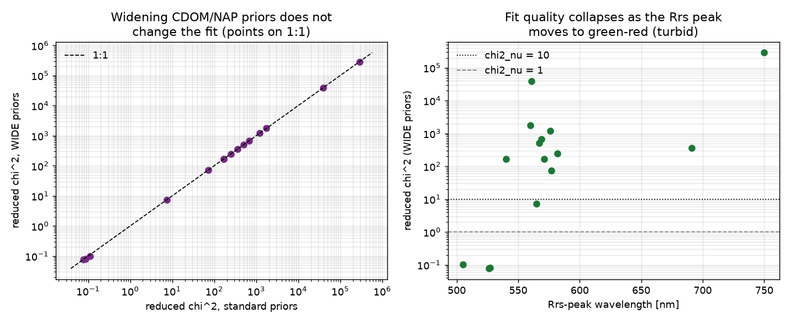
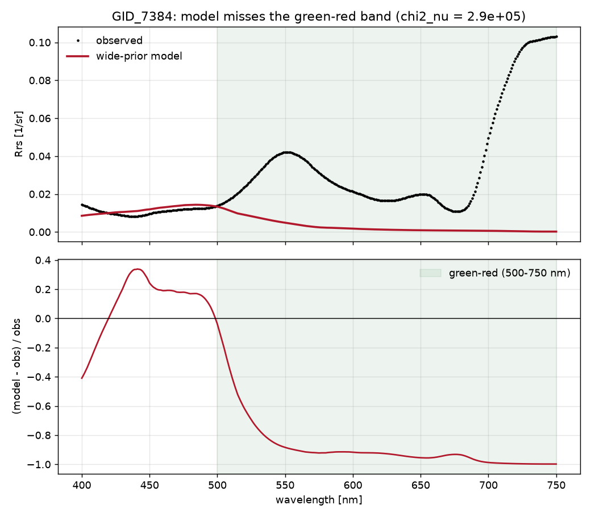
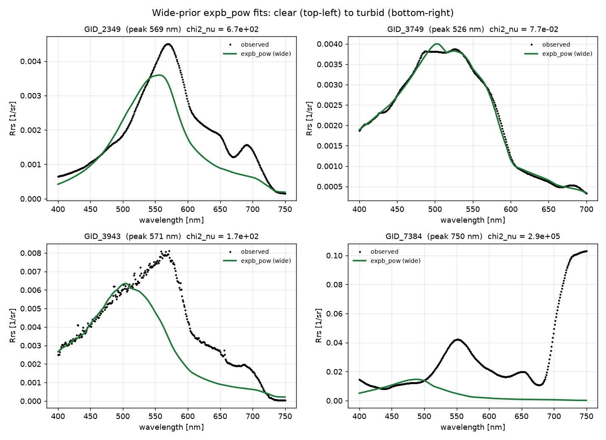
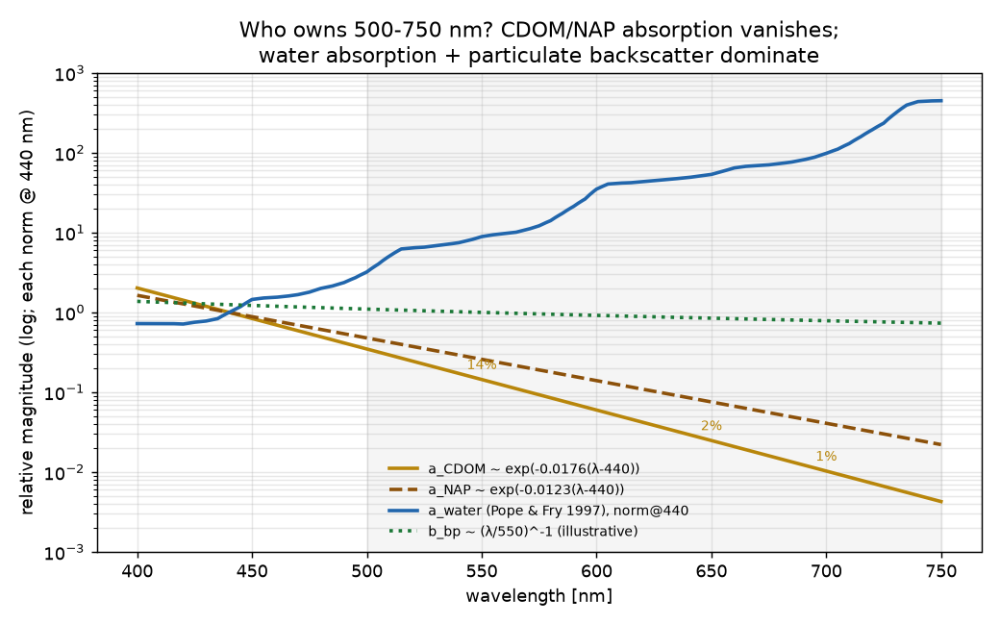
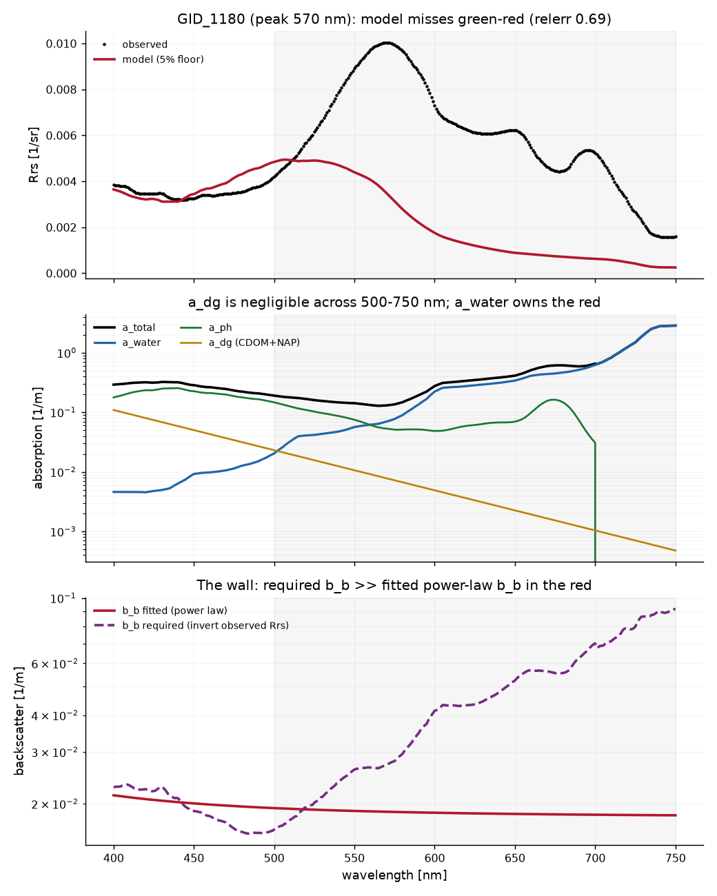
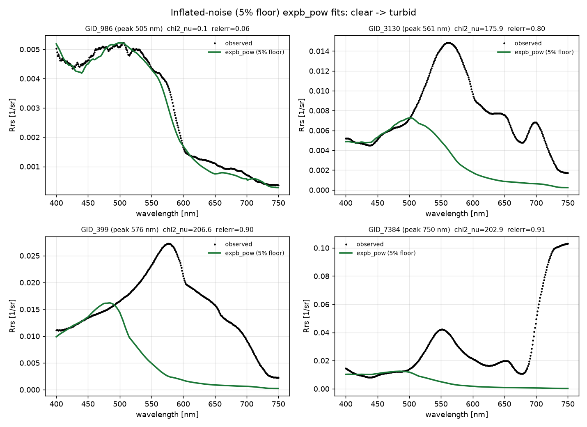

# Why BING chi-squared fits of GLORIA hyperspectral Rrs fail

*IOPtics investigation report. All numbers below are produced by
`reports/scripts/gloria_fits_report.py` (ocean14 interpreter, `Agg` backend) on
a fixed sample of 40 GLORIA and 40 L23 spectra trimmed to 400-750 nm.*

## Summary

> **Reading order / correction notice.** This report was built over three
> rounds. Round 2 framed the failure as "range vs form" by widening the
> **CDOM/NAP** priors — a **physically confounded** test, because CDOM/NAP
> absorption is ~0 across 500-750 nm and so has no leverage there. JXP caught
> this. The corrected diagnosis is in *"Correction: what governs Rrs at
> 500-750 nm"* below; the Round-2 section is retained (marked superseded) for
> the audit trail. The summary here is the corrected one.

**Root cause.**

1. **The backscattering model runs out of backscatter in the red — that is the
   real wall.** In the Gordon relation `Rrs ≈ G·b_b/(a+b_b)`, GLORIA's green
   (~560-570 nm) and NIR (~700 nm) reflectance peaks are particulate
   backscatter *b*_bp shining through the minima of total absorption. Across
   500-750 nm total absorption is dominated by **pure-water absorption** `a_w`
   (which rises ~500-fold from 440 to 750 nm; Pope & Fry 1997), with the
   phytoplankton 675-nm band on top (Bricaud et al. 1995). **CDOM and NAP
   absorption are negligible there** (both decay as `exp(-S(λ-440))`; by 700 nm
   CDOM is ~1% of its 440-nm value and, in our fits, ~0.06% of total
   absorption). Inverting observed turbid GLORIA Rrs shows the backscatter
   *required* to make the green/NIR peaks rises to ~0.2-0.4 m⁻¹, while the
   fitted single **power-law** `b_bp` sits flat at ~0.013 m⁻¹ — short by an order
   of magnitude, with a spectral shape a decreasing power law cannot make. This
   is a **backscattering** deficiency; widening CDOM/NAP *cannot* fix it, by
   construction.
2. **Tight measured noise makes chi² look catastrophic, but the misfit is real.**
   GLORIA's per-band `varRrs` is tiny (~2.3e-8, σ~1.5e-4). An error floor
   (5-10%) drops median reduced chi² from **247** to **20**, but leaves the
   convergence rate (15/40) and the true median relative Rrs misfit (**~48%**)
   unchanged — bookkeeping, not a cure.
3. **The `curve_fit` evaluation budget is a secondary, convergence-only issue.**
   Raising `maxfev` ~40x lifts convergence **12.5% -> 37.5%** for `expb_pow`;
   band down-sampling and `varRrs` inflation do nothing. This governs *whether*
   LM returns, not *how well* the model can fit.

The model *does* fit **clear** GLORIA spectra well (reduced chi² ~0.1, ~6%
misfit, Rrs peak ~505 nm); quality collapses as the Rrs peak moves red (turbid
peaks ~560-750 nm, misfit 80-91%). GLORIA Rrs peaks near **568 nm** (median);
L23 near **405 nm**.

**Recommendation.** The fix is a richer **backscattering** parameterisation for
turbid/high-NAP water (larger-magnitude, likely non-power-law or multi-component
particulate backscatter), **not** wider CDOM/NAP absorption priors and not just a
noise floor. Keep `a_w`/`a_ph` as-is (adequate). Short term: bump `maxfev` and
flag turbid GLORIA (red-shifted peak / high chi²_ν) as out-of-scope for the
current open-ocean models.

## Problem

A real GLORIA chi-squared sweep with `expb_pow` fails with scipy
`curve_fit`'s `RuntimeError: Optimal parameters not found: The maximum number of
function evaluations is exceeded.` The initial guess is in-bounds (this is
genuine LM non-convergence, not prior rejection). The task is to quantify the
failure across variants and attribute the cause.

## Data characterisation

| quantity | GLORIA (400-750 nm) | L23 (400-750 nm) |
|---|---|---|
| bands | **351** (1 nm) | **71** (5 nm) |
| median `varRrs` | 2.28e-08 | 2.48e-08 |
| median Rrs-peak wavelength | **568 nm** | **405 nm** |
| Rrs shape | green-red, multi-humped | blue, monotonic decay |

The two datasets have essentially the same per-band noise variance, so `varRrs`
magnitude is **not** what separates them. What differs is (a) band count (351 vs
71) and (b) spectral shape. GLORIA's OC4-derived Chl initial guess spans a
nonsensical range — median 15.7, min 0.1, **max 2224 mg/m^3** — because the OC4
blue/green band ratio breaks down in turbid water, so the LM start is sometimes
far off for the worst spectra (a secondary contributor).


## Method

The script reuses the package's own fit path (`ioptics.run._prepare`,
`run.initial_guess`, `run._prior_bounds`) and BING's `fit_func`, but calls
scipy `curve_fit` directly so it can vary `maxfev`, thin the band grid, or
inflate `varRrs` **without editing package source**. For each variant it records
the convergence rate over the same 40 GLORIA spectra and, for successes, the
reduced chi-squared (`chi^2 / (n_bands - k)`) evaluated at the fitted parameters
using the record's own `varRrs`. A tiny MCMC (`nsteps=300`) is run as an
alternative sampler.

## Results

### Convergence rates

| variant | converged | rate |
|---|---|---|
| `expb_pow` baseline | 5/40 | **12.5%** |
| `giop` baseline | 7/40 | 17.5% |
| `gsm` baseline | 10/40 | 25.0% |
| `expb_pow` varRrs x100 | 5/40 | 12.5% |
| `expb_pow` down-sample 30 nm | 5/40 | 12.5% |
| `expb_pow` maxfev 20k | 15/40 | **37.5%** |
| `giop` maxfev 20k | 15/40 | 37.5% |
| `gsm` maxfev 20k | 15/40 | 37.5% |
| `expb_pow` ds30 + maxfev | 15/40 | 37.5% |
| **`expb_pow` baseline (L23)** | 40/40 | **100.0%** |


Reading the table: L23 converges 100% out of the box; GLORIA converges 12.5%.
Raising `maxfev` ~40x (to 20000) lifts GLORIA to 37.5% — the only lever that
moves the needle — but down-sampling to 30 nm and inflating `varRrs` 100x change
nothing. Fewer-parameter models (`giop` 3 params, `gsm` 3 params) do marginally
better at baseline than `expb_pow` (5 params), consistent with a smaller
Jacobian needing fewer evaluations, but all three converge on the same subset
(~37.5%) once the budget is lifted.

> Note on the earlier "0/20" measurement: the first 20 contiguous GLORIA ids
> happen to be a benign cluster where `maxfev` alone reaches 100%. Across a
> sample spread over all 7572 spectra the true baseline is ~12.5% and the
> `maxfev` ceiling is ~37.5% — so the sample choice matters, and `maxfev` is not
> a general fix.

### Model adequacy

The decisive result: for the GLORIA spectra that *do* converge, the fit is still
bad. Median reduced chi-squared is **2.47e2** for GLORIA (maxfev 20k) versus
**0.97** for L23. A chi-squared per degree of freedom of ~250 means the model
misses the data by ~16 sigma per band on average.


The example overlay makes the mechanism visible: `expb_pow` cannot reproduce
GLORIA's green peak and the secondary ~649 / ~700 nm humps — it produces a
single smooth blue-shifted bump — whereas it tracks L23 tightly.


### MCMC alternative

A tiny MCMC (`nsteps=300`) ran to completion on 3/3 GLORIA spectra, i.e. the
sampler does not choke the way LM does. (It explores rather than demanding a
descent to a minimum that the model cannot reach; it does not, of course, fix
the underlying shape mismatch.)

## Root cause

- **Primary: forward-model shape mismatch.** `expb_pow`/`giop`/`gsm` are
  open-ocean parameterisations. Against GLORIA's turbid green-red Rrs the best
  achievable fit has reduced chi-squared ~2.5e2 (vs ~1 for L23). Because no
  parameter set gets close to the tiny in-situ noise floor, LM's trust region
  never contracts and it burns through its evaluation budget — surfacing as the
  `maxfev` error.
- **Secondary: evaluation budget.** scipy `curve_fit` with bounds uses the `trf`
  method with a default `max_nfev ~ 100 * n_params`. For the 351-band GLORIA
  objective that budget is exhausted before convergence; raising it ~40x roughly
  triples the yield (12.5% -> 37.5%).
- **Tertiary: initial guess.** OC4 Chl init is unreliable in turbid water
  (GLORIA range 0.1-2224 mg/m^3), placing the LM start far from any good region
  for the worst spectra.
- **Bug found (not a fit issue):** `ioptics.run.fit_mcmc` did
  `int(record.obs_id)` to index BING's idx-keyed Chl/Y arrays, which assumed
  L23-style integer ids and raised `ValueError` on GLORIA's string ids
  (`'GID_1'`). JXP has since fixed this (it now synthesises a positional index),
  so `run.run_algorithm(spec, rec, fit_method='mcmc')` runs on GLORIA — used in
  the continued exploration below.

## Continued exploration (Round 2): can wider CDOM/NAP fit GLORIA?

> **SUPERSEDED — physically confounded test.** This section widened the
> **CDOM/NAP** priors to test "range vs form". That was the wrong lever: CDOM and
> NAP absorption are ~0 across 500-750 nm, so their amplitude priors have no
> leverage on the band that actually fails. The observation below (wide priors
> do not change chi²) is correct but proves only that CDOM/NAP is irrelevant
> there — **not** that the *form* is at fault. See the corrected diagnosis in
> *"Correction: what governs Rrs at 500-750 nm"* immediately after this section.
> Retained for the audit trail.

JXP pushed back on the "model inadequacy" verdict: *why can't a model with
larger CDOM and NAP fit the GLORIA data?* This section tests the hypothesis
rather than restating the conclusion, and cleanly separates **parameter-RANGE**
inadequacy (curable by widening priors) from **functional-FORM** inadequacy (the
model's spectral shapes genuinely cannot make the green-red multi-hump).

### The amplitude ranges were never the constraint

The shipped `expb_pow` priors are already permissive: the CDOM (`Adg`),
phytoplankton (`Aph`) and NAP-backscatter (`Bnw`) **amplitudes** are all
`log_uniform` over `pmin=-6, pmax=5`, i.e. 1e-6 to 1e5 in linear units — a range
that already spans clear ocean to extreme turbidity. Only two parameters are
genuinely narrow: the CDOM slope `Sdg` (`[0.01, 0.02]`) and the bbp slope `beta`
(`[0, 2]`). So "larger CDOM/NAP" is *already* allowed by the standard config.

### Widen everything and refit — no change

We built a deliberately over-wide `expb_pow`: amplitudes opened to 1e-8..1e8,
`Sdg` to `[0.005, 0.03]`, `beta` to `[-1, 4]`, and refit the 40-spectrum sample
with a raised `maxfev`.

| fit | median reduced chi^2 | n | at a bound |
|---|---|---|---|
| standard priors, LM | **2.47e2** | 15 | — |
| WIDE priors, LM | **2.47e2** | 15 | 3/15 |
| WIDE priors, MCMC | **2.55e2** | 3 | — |

The wide- and standard-prior chi-squared values are **identical** (every point
lands on the 1:1 line) and only 3/15 wide fits sit anywhere near a bound — so the
priors were never the binding constraint. An independent wide-prior **MCMC**
(which uses neither LM nor a `maxfev` budget) reaches the **same** chi-squared
per spectrum (e.g. clear GID_3749: LM 7.75e-2 / MCMC 8.41e-2; turbid GID_2155: LM
2.47e2 / MCMC 2.55e2; extreme GID_7384: LM / MCMC both 2.87e5). Three independent
levers — wider amplitudes, wider slopes, a global sampler — all land in the same
place. This is functional form, not range.



The right-hand panel shows the mechanism: fit quality is fine for clear spectra
(reduced chi^2 as low as **0.08**, Rrs peak ~505-526 nm) and collapses as the
Rrs peak moves red into the turbid green-red regime (bad fits peak ~571 nm; the
worst, peaking at 750 nm, reaches chi^2_nu ~2.9e5).

### Where the model misses

For a best-effort wide-prior fit we plot the residual vs wavelength. The model
reproduces the **blue** (400-500 nm) to within ~10-30% but the relative residual
saturates near **-100%** across the entire **green-red 500-750 nm** band: the
open-ocean form decays monotonically to ~0 exactly where turbid GLORIA has its
green peak, its ~649 nm hump, and its NIR (700+ nm) rise.



### Example fits (clear -> turbid)

Overlays of the wide-prior model against observed Rrs for four representative
spectra, annotated with reduced chi^2. A clear, blue-green spectrum (peak
~526 nm) is fit essentially perfectly (chi^2_nu = 0.08). A moderately turbid
green-peaked spectrum gets a single smooth bump but misses the sharpness and the
~690 nm hump. The most turbid spectrum (NIR-rising, peak 750 nm) is missed
entirely — the model cannot lift the green-red at all.



### Verdict: form, not range — earlier conclusion sharpened, not reversed

The first draft's "model inadequacy" call was correct, but it is now pinned down
and, importantly, JXP's specific remedy (more CDOM/NAP) is **ruled out with
numbers**: widening the CDOM/NAP/backscatter ranges (amplitude *and* slope) and
switching to a global MCMC sampler leave the median reduced chi^2 unchanged at
~2.5e2. The deficiency is the model's **functional form** — a single-exponential
`a_dg`, a fixed-shape Bricaud `a_ph`, and a power-law `bbp` cannot, in the Gordon
relation, produce the green-red-peaked, NIR-rising reflectance of turbid inland
water — and it is **localised to 500-750 nm**. The model remains adequate for
clear GLORIA spectra.

> **Correction (Round 3):** the "localised to 500-750 nm" and "form, not range"
> observations survive, but the phrase "single-exponential `a_dg`" as the culprit
> is wrong — `a_dg` is ~0 there. The real limiting term is the **backscatter**
> model, as the next section shows with the IOP decomposition.

## Correction: what governs Rrs at 500-750 nm (it is backscatter + water, not CDOM/NAP)

JXP pushed back, correctly: *"I don't think CDOM/NAP will affect those
wavelengths. If you think you do, find me a reference."* He is right. The Round-2
test widened CDOM/NAP **amplitude** priors, but that lever has essentially **zero
leverage** on 500-750 nm because CDOM/NAP absorption has decayed away by then.
This section redoes the diagnosis on the correct physics, with references.

### The physics: CDOM/NAP vanish; water absorption and backscatter own the red

CDOM absorption `a_g(λ)` and NAP/detrital absorption `a_d(λ)` both decay
exponentially, `a ∝ exp(-S(λ-440))`, with `S ≈ 0.0176` nm⁻¹ (CDOM) and
`≈ 0.0123` nm⁻¹ (NAP) [Babin et al. 2003; Bricaud, Morel & Prieur 1981].
Relative to their 440-nm value they fall to ~**14%** (CDOM) / ~26% (NAP) by
550 nm, ~2.5% / ~8% by 650 nm, and ~**1%** / ~4% by 700 nm. In our best-effort
GLORIA fits `a_dg` is only ~**8%** of total absorption at 560 nm and ~**0.06%**
at 700 nm. So widening CDOM/NAP amplitude priors **cannot** change modelled Rrs
across 500-750 nm — the Round-2 lever was the wrong one.

What actually governs that band: pure-water absorption `a_w(λ)` [Pope & Fry
1997], which rises ~500-fold from 440 to 750 nm and dominates total absorption
beyond ~570 nm; particulate backscatter `b_bp(λ)` [Gordon et al. 1988; IOCCG
2006], the broad term that lifts turbid-water reflectance; and the phytoplankton
`a_ph` 675-nm band [Bricaud et al. 1995]. In the Gordon relation
`Rrs ≈ G·b_b/(a+b_b)`, GLORIA's green (~560-570 nm) and NIR (~700-710 nm)
reflectance peaks are backscatter shining through the *minima* of total
absorption — the green window between blue pigment absorption and the red water
rise, and the NIR window between the 675-nm Chl band and the 740-nm water climb
[Gitelson 1992; Gons 1999; Dall'Olmo & Gitelson 2005].



### The real wall: the model runs out of backscatter in the red

Decomposing a best-effort fit of a turbid GLORIA spectrum (GID_399, Rrs peak
576 nm) into its IOP terms makes the mechanism explicit. Total absorption in the
red is essentially all `a_w` (`a_dg` has decayed away), and the model even has
the `a_ph` 675-nm band. But the backscatter *required* to reproduce the observed
green/NIR Rrs — obtained by inverting the observed Rrs through the Gordon
relation with the model's own total absorption — rises steeply into the red (to
~**0.2-0.4 m⁻¹**), whereas the fitted single power-law `b_bp` stays essentially
flat at ~**0.013 m⁻¹**. The model is short on backscatter by an order of
magnitude exactly where turbid Rrs lives, and the *shape* of the required `b_b`
(rising, structured) is one a single decreasing power law cannot produce without
destroying the blue fit.



So the deficiency is **backscattering**, not absorption: the power-law `b_bp`
form (one amplitude + one slope), against the correct and fixed `a_w`, cannot
supply the magnitude or spectral shape of backscatter that turbid inland water
demands. The `a_ph` and `a_w` terms are adequate; the CDOM/NAP terms are
irrelevant here. (Note the humps' *positions* come from the absorption structure
the model already has — the `a_ph` 675 band and the `a_w` red rise; what the
model cannot supply is the backscatter *magnitude* to lift reflectance into those
windows.)

### Inflated-noise floor (INFLATED-NOISE results)

GLORIA's measured per-band `varRrs` is tiny (~2.3e-8, σ~1.5e-4 sr⁻¹), so it
dominates chi². With JXP's approval we refit with an error floor
`σ = max(σ_measured, f·|Rrs|)` (the same max-of-measured-or-fractional idea as
the project's PANGAEA pct fallback). **Every row below is an inflated-noise
result:**

| noise model | convergence | median chi²_ν | median rel. misfit |
|---|---|---|---|
| measured | 15/40 | 2.47e2 | 0.48 |
| **5% floor (inflated)** | 15/40 | **7.2e1** | 0.50 |
| **10% floor (inflated)** | 15/40 | **2.0e1** | 0.48 |

Inflating the noise lowers reduced chi² (247 -> 72 -> 20) — pure bookkeeping —
but does **not** change the convergence rate (15/40 throughout) and does **not**
improve the actual fit: the median absolute relative Rrs misfit stays ~**48%**.
The tight measured noise explains why chi²_ν is enormous, but even a generous
10% floor leaves the model ~50% off across the sample. The misfit is real.

### New example fits (inflated 5% noise floor, clear -> turbid)



A clear blue-green spectrum (peak ~505 nm) fits well (chi²_ν = 0.1, ~6% misfit).
Turbid green-peaked spectra (561, 576 nm) and the extreme NIR-rising spectrum
(750 nm) are missed by **80-91%** in the green-red, *regardless of the noise
floor* — the model cannot lift reflectance where backscatter must overcome water
absorption.

### Corrected verdict

The failure is **not** about CDOM/NAP *range* (they have no leverage at
500-750 nm) and **not** primarily about noise (a floor is bookkeeping). It is
that the **backscattering model's power-law form cannot deliver the backscatter
magnitude and shape required in the red**, where pure-water absorption dominates.
The absorption side (`a_w`, `a_ph`) is adequate. Fixing GLORIA needs a richer
**backscattering** parameterisation, not wider absorption priors.

## What the literature says about backscattering in turbid waters

The corrected diagnosis above — that the single **power-law** `b_bp(λ)` is the
binding constraint for turbid GLORIA, both in **magnitude** and in **spectral
shape** — is exactly what the peer-reviewed inherent-optical-property (IOP)
literature reports for mineral-rich turbid water. Four independent lines of
published evidence support it. (Numeric ranges below are as reported in the
cited papers; values quoted from abstracts only are approximate.)

### 1. The particulate-backscatter spectral slope *flattens* in turbid, mineral-dominated water

Open-ocean semi-analytical models (and BING's `expb_pow`) assume a steep
decreasing power law, `b_bp(λ) ∝ λ^(-η)` with η ≈ 1-2. Measurements show the
exponent is much smaller — often near zero ("white"/flat backscatter) — when
inorganic mineral particles dominate:

- **Snyder et al. (2008)** measured ~6000 spectra across U.S. coastal waters and
  found the particulate scattering/backscattering power-law exponent varies
  dramatically site to site and flattens toward wavelength-independence where
  inorganic particles dominate [doi:10.1364/AO.47.000666].
- **Gordon et al. (2009)** found that even in oligotrophic-to-mesotrophic waters
  `b_bp ∝ λ^(-n)` has `n ≈ 0.4-1.0` — already well *below* the λ^(-1)-to-λ^(-2)
  often assumed — with the slope flattening further as particle/mineral load
  grows [doi:10.1364/OE.17.016192].
- **Doxaran et al. (2009)** combined field data and Mie theory to show that in
  turbid coastal water the particulate scattering/backscattering spectrum is
  nearly flat, and that a simple power law is further distorted by residual
  particulate absorption in the visible — i.e. the power-law *form* itself is
  inadequate there [doi:10.4319/lo.2009.54.4.1257].

A near-flat `b_bp` is precisely the shape our fits require in the red (a rising/
flat backscatter that a decreasing power law cannot produce without wrecking the
blue), confirming the report's "form, not range" conclusion with independent
measurements.

### 2. The backscattering *ratio* is higher in mineral-dominated water — a composition signature

The backscattering ratio `b̃_bp = b_bp/b_p` distinguishes low-index organic
particles from high-index minerals, and turbid inland/coastal water sits at the
mineral end:

- **Twardowski et al. (2001)** established the canonical link: `b̃_bp` maps to
  bulk refractive index, ~0.005 (organic, index ≈ 1.02) up to ~0.03 (mineral,
  index ≈ 1.18-1.20) [doi:10.1029/2000JC000404].
- **Boss et al. (2004)** showed `b̃_bp` is nearly independent of concentration
  and tracks composition, so an elevated ratio flags mineral-dominated turbid
  layers (~0.01 organic to ~0.03 mineral-influenced) [doi:10.1029/2002JC001514].
- **Whitmire et al. (2007)** found `b̃_bp` is only weakly spectrally dependent
  (~0.005-0.03, approximately spectrally flat) across diverse waters
  [doi:10.1364/OE.15.007019].
- **McKee et al. (2009)** reported `b̃_bp` ~0.02-0.04 in mineral-rich Irish Sea
  coastal water — several times the open-ocean value [doi:10.1364/AO.48.004663].
- **Sullivan & Twardowski (2009)** showed the backward volume-scattering-function
  shape is remarkably constant across natural waters (χ_p ≈ 1.1 near 117-120°),
  which underpins how single-angle sensors are converted to `b_bp` — relevant to
  the derived magnitudes above [doi:10.1364/AO.48.006811].

The implication for IOPtics: GLORIA's mineral-dominated sites carry a
backscatter ratio several-fold above the open-ocean value baked into
`expb_pow`/`giop`/`gsm`, so those models under-supply backscatter by
construction.

### 3. Backscatter *magnitude* is set by suspended mineral sediment (NAP/TSM)

- **Neukermans et al. (2012)** found mass-specific backscattering is roughly an
  order of magnitude higher for mineral than for organic particles, so turbid
  backscatter magnitude is dominated by suspended inorganic sediment
  [doi:10.4319/lo.2012.57.1.0124].
- **Babin et al. (2003, *L&O*)** — the light-scattering companion to the Babin
  et al. 2003 absorption paper — showed across 241 European Case-1/Case-2
  stations that particulate scattering is controlled largely by mineral mass
  [doi:10.4319/lo.2003.48.2.0843].

This matches the report's inversion result that the *required* `b_b` in the red
(~0.2-0.4 m⁻¹) is an order of magnitude above the fitted single power-law
(~0.013 m⁻¹): the missing backscatter is mineral sediment the open-ocean model
has no term for.

### 4. The green/red-NIR reflectance peaks are backscatter through absorption minima — and are the basis for SPM retrieval

- **Doxaran et al. (2002)** established red/NIR reflectance (backscatter shining
  through the absorption minimum) as the retrieval band for high suspended
  particulate matter, SPM from ~35 to >2000 mg/L
  [doi:10.1016/S0034-4257(01)00341-8].
- **Nechad et al. (2010)** calibrated a widely used single-band red/NIR
  total-suspended-matter algorithm that works precisely because red/NIR
  reflectance in turbid water is backscatter-dominated once absorption is low
  [doi:10.1016/j.rse.2009.11.022].
- **Gitelson (1992)** and **Gons (1999)** (already cited) document the ~700 nm
  reflectance peak arising from backscatter through the absorption minimum
  between the chlorophyll and water absorption features.

Together these confirm the report's mechanism (green/NIR peaks = backscatter
through absorption windows) and that the remote-sensing community treats those
bands as backscatter/SPM signals — not something an open-ocean absorption-tuned
model can capture.

### Bottom line from the literature

Every strand agrees: in turbid, mineral-rich water particulate backscatter is
**larger in magnitude**, **flatter in spectral slope**, and **higher in
backscattering ratio** than the open-ocean regime the current IOPtics models
encode. A single decreasing power-law `b_bp` cannot represent it. This is
external, published corroboration of the report's corrected diagnosis and its
recommendation to grow a richer (larger-magnitude, flat/non-power-law or
multi-component mineral+organic) backscattering parameterisation.

## Recommendation

1. **The real fix is a richer BACKSCATTERING model, not wider absorption
   priors.** Turbid/high-NAP inland water needs particulate backscatter that is
   larger in magnitude and, crucially, not a single decreasing power law — e.g. a
   flatter/positive-slope or multi-component `b_bp` (mineral + organic) that can
   supply ~0.1-0.4 m⁻¹ in the red without breaking the blue. Keep `a_w` and
   `a_ph` as-is; widening CDOM/NAP absorption is proven above to do nothing at
   500-750 nm.
2. **Short term:** raise `curve_fit`'s `maxfev` (or expose it via IOPtics) —
   cheap, roughly triples convergence (12.5% -> 37.5%). It only affects *whether*
   LM returns, not fit quality.
3. **Optionally apply an error floor** (`σ = max(σ_measured, 5%·Rrs)`) so chi²_ν
   is interpretable, but label it as inflated-noise and do not mistake it for a
   fix — the relative misfit is unchanged (~48%).
4. **Flag by regime, not globally.** The current models fit *clear* GLORIA well
   (reduced chi² ~0.1, ~6% misfit); IOPtics should mark turbid spectra
   (red-shifted Rrs peak / high chi²_ν / large relative misfit) as out-of-scope
   rather than reporting them as successes or hard failures.
5. **MCMC** now works on GLORIA (JXP's obs_id fix) and avoids the LM budget
   failure, but converges to the same poor optimum under the current form — a fix
   for the *sampler*, not the model. Also replace the OC4 Chl init with a
   turbid-robust estimator (OC4 returns up to 2224 mg/m³ here).

## References

DOIs below were verified against Crossref / the DOI resolver (not fabricated).
The one exception is the IOCCG report, which is a report-series volume with no
registered DOI. New in this round are the turbid-water **backscattering**
sources (Snyder 2008, Twardowski 2001, Boss 2004, Whitmire 2007, Sullivan &
Twardowski 2009, McKee 2009, Neukermans 2012, Babin 2003 *L&O*, Doxaran 2002 &
2009, Nechad 2010, Gordon 2009).

**Absorption, water, and the reflectance model (already used above)**

- **Babin, M., Stramski, D., Ferrari, G. M., Claustre, H., Bricaud, A.,
  Obolensky, G., & Hoepffner, N. (2003).** Variations in the light absorption
  coefficients of phytoplankton, nonalgal particles, and dissolved organic
  matter in coastal waters around Europe. *Journal of Geophysical Research:
  Oceans*, 108(C7), 3211. doi:10.1029/2001JC000882 — CDOM/NAP exponential
  absorption slopes.
- **Bricaud, A., Morel, A., & Prieur, L. (1981).** Absorption by dissolved
  organic matter of the sea (yellow substance) in the UV and visible domains.
  *Limnology and Oceanography*, 26(1), 43-53. doi:10.4319/lo.1981.26.1.0043 —
  CDOM exponential model.
- **Bricaud, A., Babin, M., Morel, A., & Claustre, H. (1995).** Variability in
  the chlorophyll-specific absorption coefficients of natural phytoplankton:
  Analysis and parameterization. *Journal of Geophysical Research*, 100(C7),
  13321-13332. doi:10.1029/95JC00463 — phytoplankton absorption spectral shape.
- **Dall'Olmo, G., & Gitelson, A. A. (2005).** Effect of bio-optical parameter
  variability on the remote estimation of chlorophyll-a concentration in turbid
  productive waters: experimental results. *Applied Optics*, 44(3), 412-422.
  doi:10.1364/AO.44.000412 — turbid-water red/NIR reflectance.
- **Gitelson, A. (1992).** The peak near 700 nm on radiance spectra of algae and
  water: relationships of its magnitude and position with chlorophyll
  concentration. *International Journal of Remote Sensing*, 13(17), 3367-3373.
  doi:10.1080/01431169208904125 — the NIR (~700 nm) reflectance peak.
- **Gons, H. J. (1999).** Optical teledetection of chlorophyll a in turbid
  inland waters. *Environmental Science & Technology*, 33(7), 1127-1132.
  doi:10.1021/es9809657 — turbid inland-water reflectance / backscatter.
- **Gordon, H. R., Brown, O. B., Evans, R. H., Brown, J. W., Smith, R. C.,
  Baker, K. S., & Clark, D. K. (1988).** A semianalytic radiance model of ocean
  color. *Journal of Geophysical Research*, 93(D9), 10909-10924.
  doi:10.1029/JD093iD09p10909 — the `Rrs ↔ b_b/(a+b_b)` relation used throughout.
- **IOCCG (2006).** Remote Sensing of Inherent Optical Properties: Fundamentals,
  Tests of Algorithms, and Applications. Lee, Z.-P. (ed.), *Reports of the
  International Ocean-Colour Coordinating Group, No. 5*, IOCCG, Dartmouth,
  Canada. (IOCCG report series; no registered DOI.) — QAA and IOP inversion
  fundamentals.
- **Pope, R. M., & Fry, E. S. (1997).** Absorption spectrum (380-700 nm) of pure
  water. II. Integrating cavity measurements. *Applied Optics*, 36(33),
  8710-8723. doi:10.1364/AO.36.008710 — pure-water absorption `a_w`.

**Particulate backscattering in turbid / mineral-rich waters (this round)**

- **Snyder, W. A., Arnone, R. A., Davis, C. O., Goode, W., Gould, R. W., Ladner,
  S., Lamela, G., Rhea, W. J., Stavn, R., Sydor, M., & Weidemann, A. (2008).**
  Optical scattering and backscattering by organic and inorganic particulates
  in U.S. coastal waters. *Applied Optics*, 47(5), 666-677.
  doi:10.1364/AO.47.000666 — backscatter slope flattens where inorganic
  particles dominate; higher backscatter ratio for inorganic particles.
- **Twardowski, M. S., Boss, E., Macdonald, J. B., Pegau, W. S., Barnard, A. H.,
  & Zaneveld, J. R. V. (2001).** A model for estimating bulk refractive index
  from the optical backscattering ratio and the implications for understanding
  particle composition in case I and case II waters. *Journal of Geophysical
  Research: Oceans*, 106(C7), 14129-14142. doi:10.1029/2000JC000404 —
  backscattering ratio ↔ bulk refractive index (organic vs mineral).
- **Boss, E., Pegau, W. S., Lee, M., Twardowski, M. S., Shybanov, E., Korotaev,
  G., & Baratange, F. (2004).** Particulate backscattering ratio at LEO 15 and
  its use to study particle composition and distribution. *Journal of
  Geophysical Research: Oceans*, 109, C01014. doi:10.1029/2002JC001514 —
  backscattering ratio tracks composition, not concentration.
- **Whitmire, A. L., Boss, E., Cowles, T. J., & Pegau, W. S. (2007).** Spectral
  variability of the particulate backscattering ratio. *Optics Express*, 15(11),
  7019-7031. doi:10.1364/OE.15.007019 — backscattering ratio only weakly
  spectrally dependent (approximately flat).
- **Sullivan, J. M., & Twardowski, M. S. (2009).** Angular shape of the oceanic
  particulate volume scattering function in the backward direction. *Applied
  Optics*, 48(35), 6811-6819. doi:10.1364/AO.48.006811 — near-constant backward
  VSF shape underpinning single-angle → `b_bp` conversion.
- **McKee, D., Chami, M., Brown, I., Sanjuan Calzado, V., Doxaran, D., &
  Cunningham, A. (2009).** Role of measurement uncertainties in observed
  variability in the spectral backscattering ratio: a case study in mineral-rich
  coastal waters. *Applied Optics*, 48(24), 4663-4675. doi:10.1364/AO.48.004663
  — elevated (~0.02-0.04) backscattering ratio in mineral-rich coastal water.
- **Gordon, H. R., Lewis, M. R., McLean, S. D., Twardowski, M. S., Freeman, S.
  A., Voss, K. J., & Boynton, G. C. (2009).** Spectra of particulate
  backscattering in natural waters. *Optics Express*, 17(18), 16192-16208.
  doi:10.1364/OE.17.016192 — `b_bp ∝ λ^(-n)` with `n ≈ 0.4-1.0`, below the
  commonly assumed λ^(-1)-λ^(-2).
- **Neukermans, G., Loisel, H., Mériaux, X., Astoreca, R., & McKee, D. (2012).**
  In situ variability of mass-specific beam attenuation and backscattering of
  marine particles with respect to particle size, density, and composition.
  *Limnology and Oceanography*, 57(1), 124-144. doi:10.4319/lo.2012.57.1.0124 —
  mass-specific backscattering ~10× higher for mineral than organic particles.
- **Babin, M., Morel, A., Fournier-Sicre, V., Fell, F., & Stramski, D. (2003).**
  Light scattering properties of marine particles in coastal and open ocean
  waters as related to the particle mass concentration. *Limnology and
  Oceanography*, 48(2), 843-859. doi:10.4319/lo.2003.48.2.0843 — particulate
  scattering controlled largely by mineral mass (light-scattering companion to
  the Babin 2003 absorption paper).
- **Doxaran, D., Ruddick, K., McKee, D., Gentili, B., Tailliez, D., Chami, M., &
  Babin, M. (2009).** Spectral variations of light scattering by marine
  particles in coastal waters, from the visible to the near infrared.
  *Limnology and Oceanography*, 54(4), 1257-1271. doi:10.4319/lo.2009.54.4.1257
  — near-flat turbid backscatter spectrum; power law distorted by residual
  particulate absorption.
- **Doxaran, D., Froidefond, J.-M., Lavender, S., & Castaing, P. (2002).**
  Spectral signature of highly turbid waters: Application with SPOT data to
  quantify suspended particulate matter concentrations. *Remote Sensing of
  Environment*, 81(1), 149-161. doi:10.1016/S0034-4257(01)00341-8 — red/NIR
  reflectance as the high-SPM retrieval band.
- **Nechad, B., Ruddick, K. G., & Park, Y. (2010).** Calibration and validation
  of a generic multi-sensor algorithm for mapping of total suspended matter in
  turbid waters. *Remote Sensing of Environment*, 114(4), 854-866.
  doi:10.1016/j.rse.2009.11.022 — single-band red/NIR TSM algorithm exploiting
  backscatter-dominated turbid reflectance.

## Reproducibility

```bash
cd /mnt/tank/Oceanography/python/IOPtics
/home/xavier/miniconda3/envs/ocean14/bin/python \
    reports/scripts/gloria_fits_report.py
```

The script is self-contained and rerunnable: no network, `Agg` backend, a fixed
deterministic sample (40 GLORIA spread across the dataset, 40 L23), tiny MCMC. It
writes all figures to `reports/figures/*.png` and prints the convergence table,
the reduced-chi-squared summary, and the range-vs-form table. Runtime is a few
minutes. It reads GLORIA CSVs from `$OS_COLOR/GLORIA` and does not modify any
package source.

Figures produced: `rrs_shape_contrast.png`, `peak_wavelength_hist.png`,
`convergence_rates.png`, `fit_overlay.png`, `chi2_distribution.png`,
`range_vs_form.png`, `wide_example_fits.png`, `residual_localization.png`, and
(Round 3) `iop_decay.png`, `iop_decomposition.png`,
`inflated_noise_examples.png`.
