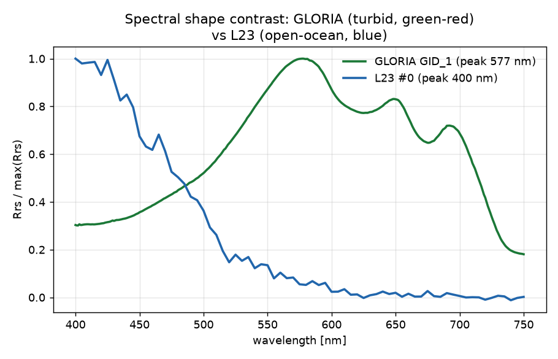
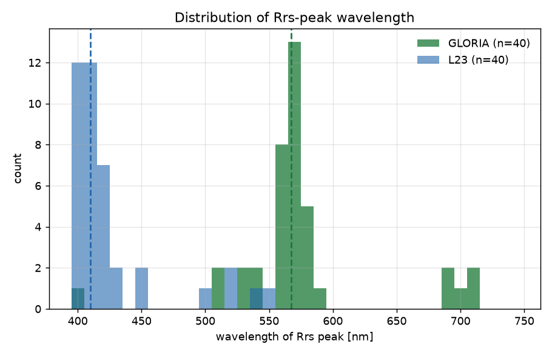
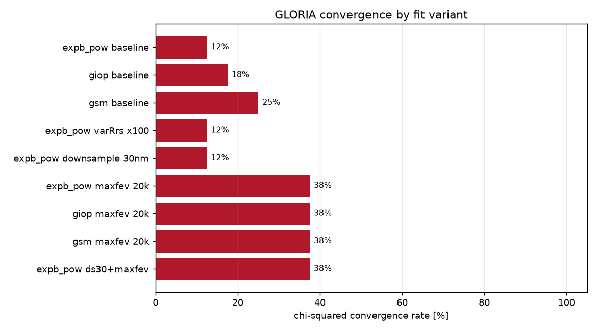
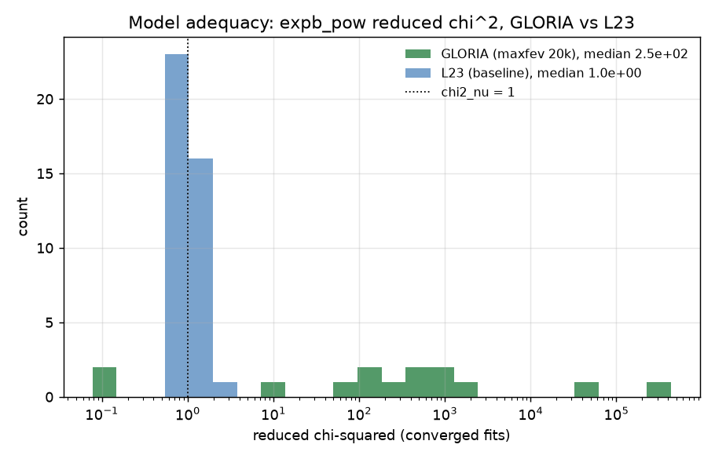
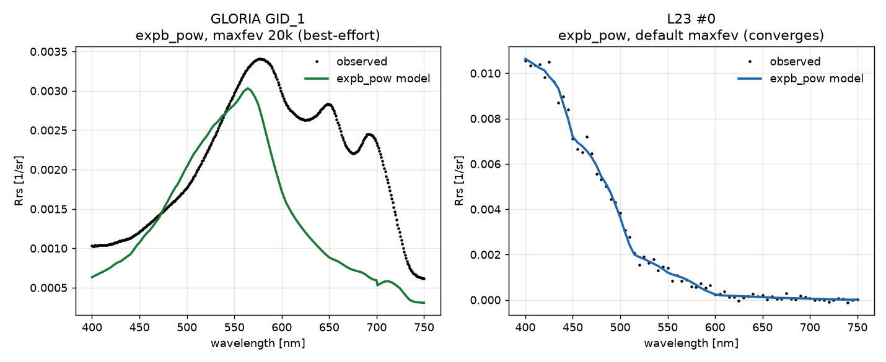

# Why BING chi-squared fits of GLORIA hyperspectral Rrs fail

*IOPtics investigation report. All numbers below are produced by
`reports/scripts/gloria_fits_report.py` (ocean14 interpreter, `Agg` backend) on
a fixed sample of 40 GLORIA and 40 L23 spectra trimmed to 400-750 nm.*

## Summary

**Root cause (two coupled factors, not one).**

1. **Model inadequacy is the dominant cause.** BING's open-ocean forward models
   (`expb_pow` = ExpBricaud + Pow, and likewise `giop`, `gsm`) cannot represent
   GLORIA's turbid, green-red-peaked Rrs shape. Even for the GLORIA spectra that
   *do* converge (with a raised evaluation budget), the median reduced
   chi-squared is **~2.5e2**, versus **~1.0** for L23. The model simply does not
   fit the data, so the Levenberg-Marquardt (LM) optimiser wanders a pathological
   landscape and exhausts its function-evaluation budget.
2. **The default `curve_fit` evaluation budget is too small** for the stiff
   351-band GLORIA objective. Raising `maxfev` ~40x roughly triples the success
   rate (**12.5% -> 37.5%** for `expb_pow`) — necessary, but far from sufficient.

Band down-sampling (30 nm) and `varRrs` inflation (100x) do **not** help at all
(both stay at 12.5%), which rules out "too many bands" or "objective too stiff"
as independent causes. The spectral-shape mismatch is confirmed as the prime
suspect: GLORIA Rrs peaks near **568 nm** with secondary humps at ~649 and
~700 nm; L23 peaks near **405 nm** and decays monotonically.

**Recommendation.** Do not expect `expb_pow`/`giop`/`gsm` as configured to fit
GLORIA. Short term: bump `maxfev` (cheap, roughly triples yield) and treat
GLORIA fits as a distinct regime. Medium term: GLORIA needs a **turbid-water
forward model** (NAP/mineral backscatter, larger CDOM range, an absorption
parameterisation that admits the green-red shape) and/or a robust sampler (MCMC
runs fine on these spectra). Chasing `maxfev`/init tweaks against the current
open-ocean models will not get GLORIA to a scientifically useful fit.

## Problem

A real GLORIA chi-squared sweep with `expb_pow` fails with scipy
`curve_fit`'s `RuntimeError: Optimal parameters not found: The maximum number of
function evaluations is exceeded.` The initial guess is in-bounds (this is
genuine LM non-convergence, not prior rejection). The task is to quantify the
failure across variants and attribute the cause.

## Data characterisation

| quantity | GLORIA (400-750 nm) | L23 (400-750 nm) |
|---|---|---|
| bands | **351** (1 nm) | **71** (5 nm) |
| median `varRrs` | 2.28e-08 | 2.48e-08 |
| median Rrs-peak wavelength | **568 nm** | **405 nm** |
| Rrs shape | green-red, multi-humped | blue, monotonic decay |

The two datasets have essentially the same per-band noise variance, so `varRrs`
magnitude is **not** what separates them. What differs is (a) band count (351 vs
71) and (b) spectral shape. GLORIA's OC4-derived Chl initial guess spans a
nonsensical range — median 15.7, min 0.1, **max 2224 mg/m^3** — because the OC4
blue/green band ratio breaks down in turbid water, so the LM start is sometimes
far off for the worst spectra (a secondary contributor).





## Method

The script reuses the package's own fit path (`ioptics.run._prepare`,
`run.initial_guess`, `run._prior_bounds`) and BING's `fit_func`, but calls
scipy `curve_fit` directly so it can vary `maxfev`, thin the band grid, or
inflate `varRrs` **without editing package source**. For each variant it records
the convergence rate over the same 40 GLORIA spectra and, for successes, the
reduced chi-squared (`chi^2 / (n_bands - k)`) evaluated at the fitted parameters
using the record's own `varRrs`. A tiny MCMC (`nsteps=300`) is run as an
alternative sampler.

## Results

### Convergence rates

| variant | converged | rate |
|---|---|---|
| `expb_pow` baseline | 5/40 | **12.5%** |
| `giop` baseline | 7/40 | 17.5% |
| `gsm` baseline | 10/40 | 25.0% |
| `expb_pow` varRrs x100 | 5/40 | 12.5% |
| `expb_pow` down-sample 30 nm | 5/40 | 12.5% |
| `expb_pow` maxfev 20k | 15/40 | **37.5%** |
| `giop` maxfev 20k | 15/40 | 37.5% |
| `gsm` maxfev 20k | 15/40 | 37.5% |
| `expb_pow` ds30 + maxfev | 15/40 | 37.5% |
| **`expb_pow` baseline (L23)** | 40/40 | **100.0%** |



Reading the table: L23 converges 100% out of the box; GLORIA converges 12.5%.
Raising `maxfev` ~40x (to 20000) lifts GLORIA to 37.5% — the only lever that
moves the needle — but down-sampling to 30 nm and inflating `varRrs` 100x change
nothing. Fewer-parameter models (`giop` 3 params, `gsm` 3 params) do marginally
better at baseline than `expb_pow` (5 params), consistent with a smaller
Jacobian needing fewer evaluations, but all three converge on the same subset
(~37.5%) once the budget is lifted.

> Note on the earlier "0/20" measurement: the first 20 contiguous GLORIA ids
> happen to be a benign cluster where `maxfev` alone reaches 100%. Across a
> sample spread over all 7572 spectra the true baseline is ~12.5% and the
> `maxfev` ceiling is ~37.5% — so the sample choice matters, and `maxfev` is not
> a general fix.

### Model adequacy

The decisive result: for the GLORIA spectra that *do* converge, the fit is still
bad. Median reduced chi-squared is **2.47e2** for GLORIA (maxfev 20k) versus
**0.97** for L23. A chi-squared per degree of freedom of ~250 means the model
misses the data by ~16 sigma per band on average.



The example overlay makes the mechanism visible: `expb_pow` cannot reproduce
GLORIA's green peak and the secondary ~649 / ~700 nm humps — it produces a
single smooth blue-shifted bump — whereas it tracks L23 tightly.



### MCMC alternative

A tiny MCMC (`nsteps=300`) ran to completion on 3/3 GLORIA spectra, i.e. the
sampler does not choke the way LM does. (It explores rather than demanding a
descent to a minimum that the model cannot reach; it does not, of course, fix
the underlying shape mismatch.)

## Root cause

- **Primary: forward-model shape mismatch.** `expb_pow`/`giop`/`gsm` are
  open-ocean parameterisations. Against GLORIA's turbid green-red Rrs the best
  achievable fit has reduced chi-squared ~2.5e2 (vs ~1 for L23). Because no
  parameter set gets close to the tiny in-situ noise floor, LM's trust region
  never contracts and it burns through its evaluation budget — surfacing as the
  `maxfev` error.
- **Secondary: evaluation budget.** scipy `curve_fit` with bounds uses the `trf`
  method with a default `max_nfev ~ 100 * n_params`. For the 351-band GLORIA
  objective that budget is exhausted before convergence; raising it ~40x roughly
  triples the yield (12.5% -> 37.5%).
- **Tertiary: initial guess.** OC4 Chl init is unreliable in turbid water
  (GLORIA range 0.1-2224 mg/m^3), placing the LM start far from any good region
  for the worst spectra.
- **Bug found (not a fit issue):** `ioptics.run.fit_mcmc` does
  `int(record.obs_id)` to index BING's idx-keyed Chl/Y arrays, which assumes
  L23-style integer ids and raises `ValueError` on GLORIA's string ids
  (`'GID_1'`). The MCMC probe here substitutes an integer obs_id to work around
  it. This must be fixed before any GLORIA MCMC sweep.

## Recommendation

1. **Short term:** raise `curve_fit`'s `maxfev` in
   `bing/fitting/chisq_fit.py` (or expose it via IOPtics) — cheap and roughly
   triples GLORIA yield. Keep it modest; it is not a cure.
2. **Report GLORIA as its own regime.** Even converged fits are poor
   (chi^2_nu ~ 250); IOPtics metrics should flag GLORIA as out-of-scope for the
   current open-ocean models rather than reporting them as successes.
3. **Medium term (the real fix):** add a **turbid-water forward model** —
   mineral/NAP backscattering, a wider CDOM range, and an absorption
   parameterisation that admits the green-red peak and the 649/700 nm humps.
4. **Consider MCMC** for GLORIA (it runs without the LM budget failure) once the
   string-obs_id bug is fixed, and replace/augment the OC4 Chl init with a
   turbid-robust estimator.

## Reproducibility

```bash
cd /mnt/tank/Oceanography/python/IOPtics
/home/xavier/miniconda3/envs/ocean14/bin/python \
    reports/scripts/gloria_fits_report.py
```

The script is self-contained and rerunnable: no network, `Agg` backend, a fixed
deterministic sample (40 GLORIA spread across the dataset, 40 L23), tiny MCMC. It
writes all figures to `reports/figures/*.png` and prints the convergence table
and reduced-chi-squared summary. Runtime is a few minutes. It reads GLORIA CSVs
from `$OS_COLOR/GLORIA` and does not modify any package source.
