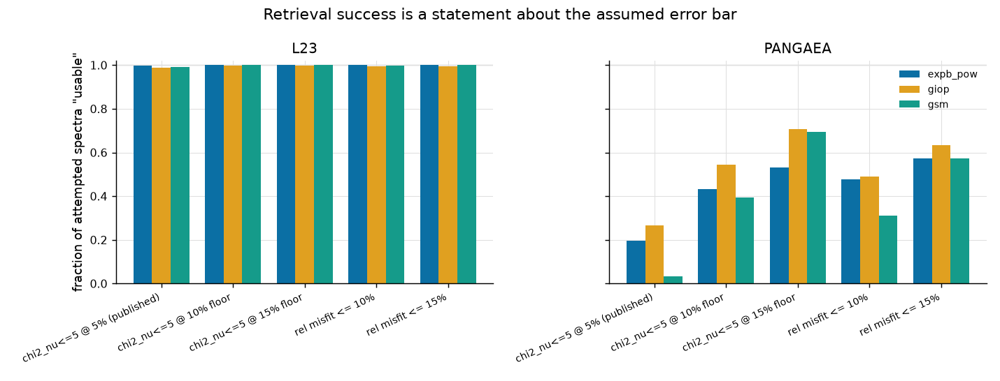
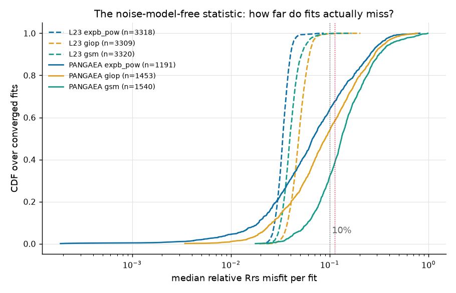
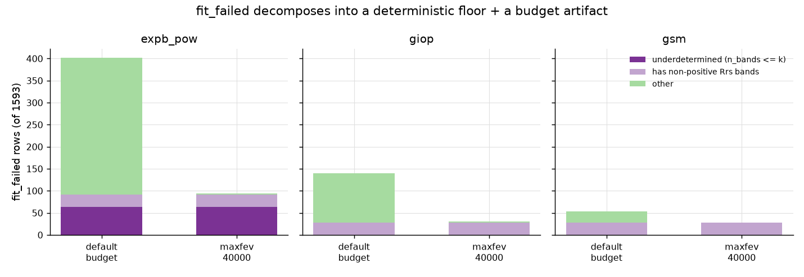
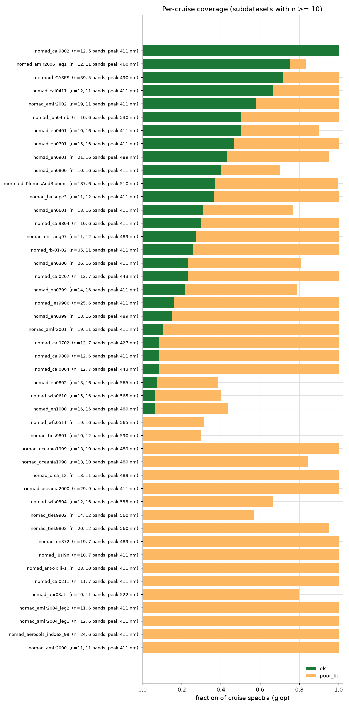
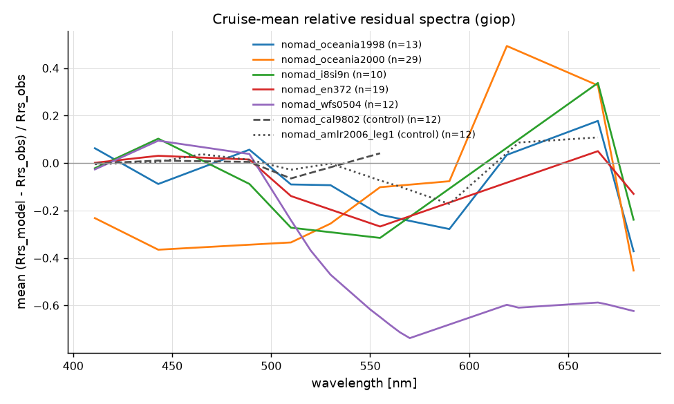
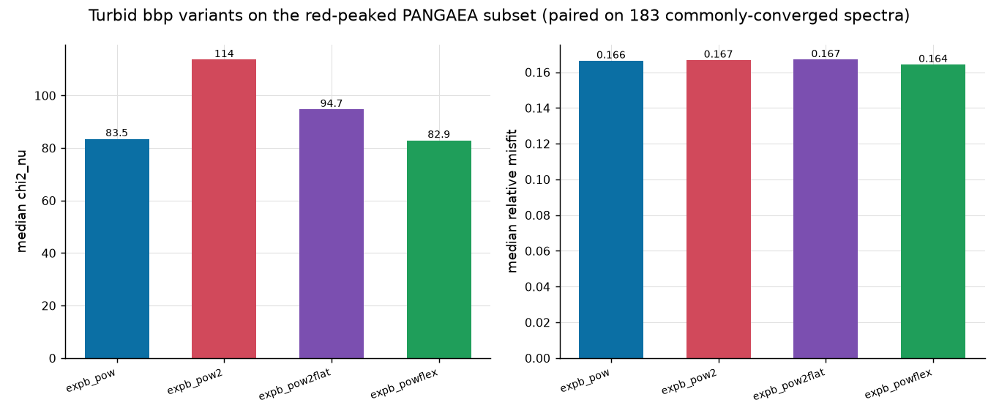
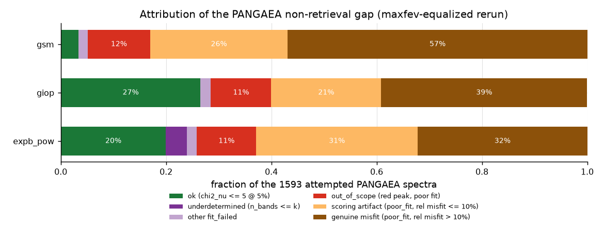
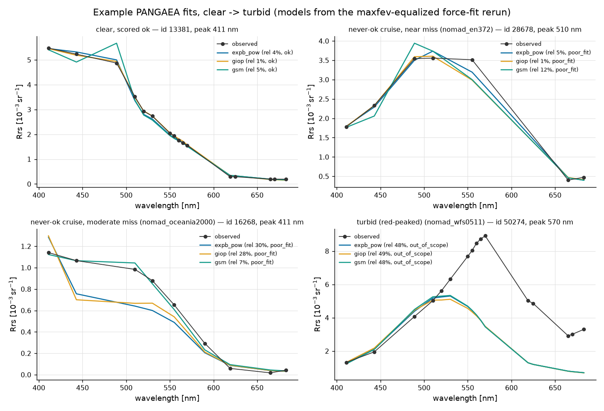

# Why the open-ocean IOP fits "fail" on PANGAEA

*IOPtics investigation report (Task 1: characterise and attribute). All numbers
below are produced by `reports/scripts/pangaea_fits_report.py` (ocean14
interpreter, `Agg` backend) on the committed `multi_L23_PANGAEA_v2` sweep —
L23 in full (3 320 spectra) plus PANGAEA restricted to its 1 593
spectral-truth ids, all fits χ² over 400–750 nm under the sweep's flat
`pct:0.05` noise model — and on two PANGAEA-only control re-runs described
below. Modelled on `reports/gloria_fits_report.md`; like that report, this one
is meant to state its own corrections in place as later rounds land.*

## Summary

> **Reading order (Round 2, 2026-08-10).** This report now has two rounds.
> Round 1 (everything through the attribution tables) diagnosed the
> published 19.5/26.6/3.4% headline and posed its remedies as Q&A. JXP
> answered; the *Round 2* section near the end implements the answers —
> 10% assumed error, pre-fit `out_of_scope`, `maxfev` 40 000 — and re-sweeps
> PANGAEA: the headline under the approved defaults is
> **43.2 / 52.6 / 37.6%**, matching Round 1's prediction exactly. Round 2
> also adds example fits, a contributor-level provenance finding, and one
> correction (a registry-pollution bug in this report's own script, caught
> before it shipped). Round-1 text is unchanged; where a Round-1 "open
> question" is now a decision, the section says so in place.

The question was why the open-ocean models return a usable retrieval for
**19.5 / 26.6 / 3.4%** of PANGAEA spectra (`expb_pow` / `giop` / `gsm`)
against ~99% of L23's. The answer, in one sentence: **most of the headline
gap is the score, not the fit** — the published number divides honest ~7–13%
misfits by an invented 5% error bar — with a smaller, exactly-nameable
deterministic floor, a real-but-capped turbid fraction, and a residual tail
of genuine misfit that includes whole cruises failing in a common way.

Attribution, cause by cause (details and figures in the Results sections):

1. **Metric calibration is the largest single term.** PANGAEA V3 quotes no
   per-band Rrs uncertainty, so every fit is scored against an assumed flat
   5%; χ²ᵥ ≤ 5 then demands ≲11% RMS misfit. The fits actually miss by a
   **median 6.7 / 9.0 / 13.1%** (converged fits, per algorithm) — roughly 2×
   the L23 misfits (3.3–4.8%), *not* 20×. Re-scored at a GLORIA-style 10%
   floor the ok-rates become **43 / 54 / 39%**; at 15%, **53 / 71 / 69%**;
   combined with the evaluation-budget fix below, **58 / 71 / 69%**. The
   19.5/26.6/3.4 → ~50–70% move is metric calibration, and the report says so
   in this, its first paragraph.
2. **`gsm`'s 3.4% was almost entirely the scoring artifact, not model
   rigidity.** The hypothesis that `gsm` would stay low while the others rose
   is dead: `gsm` rises the *most* (3.4 → 69.4% at a 15% floor) because it
   converges on 96.7% of spectra and its misfits are only moderately larger
   (median 13.1%) — the 5% assumption merely punished it hardest.
3. **`fit_failed` was a budget artifact sitting on a deterministic floor, and
   the floor is now named exactly.** Raising `maxfev` to 40 000 moved
   **308 / 109 / 25** crashed rows into honestly-scored fits (only **7** of
   them — all `expb_pow` — became `ok`; the rest landed in
   `poor_fit`/`out_of_scope`, so the budget fixes the *crash*, not the fit).
   What remains is deterministic: **63** `expb_pow` rows with
   `n_bands ≤ k = 5` (refused up front now, not crashed), **28** spectra per
   algorithm carrying non-positive Rrs bands, and **≤ 3** others.
4. **The two pipeline defects are fixed and moved nothing — they were lies in
   the bookkeeping, not the fits.** With `n_bands`/`k` now recorded on failed
   rows and underdetermined fits refused as a chosen status
   (`run.UnderdeterminedFitError`), a re-run of the committed sweep changes
   **0 of 4 779** PANGAEA statuses. The fixes matter because every diagnostic
   in this report (and any reader counting bands) reads those columns.
5. **Cruise-level systematics are real.** Eighteen NOMAD cruises are
   ≥95%-converged yet ≤5%-ok. They are not one thing: `nomad_en372`
   (19 spectra) misses by a **median 4.8%** and is never `ok` — the purest
   scoring-artifact case — while `nomad_wfs0504/wfs0511` (West Florida Shelf,
   16-band, 555–565 nm peaks) miss by 49–64% and are genuinely turbid
   coastal water. In between, the never-ok cruises share a **common
   residual signature** (model low by ~20–40% across 520–570 nm, high by
   ~20–40% near 660 nm) that flat, high-ok control cruises do not show —
   consistent with a shared spectral-shape mismatch (and/or per-cruise
   calibration/convention) rather than per-spectrum noise.
6. **Turbidity is the GLORIA failure again, and it is capped.** 188 of 1 593
   spectra (11.8%) peak redward of 560 nm. Refitting them with the turbid
   backscattering variants (`expb_pow2`, `expb_pow2flat`, `expb_powflex`) at
   an equalized 40 000-evaluation budget reproduces GLORIA's verdict: all
   four variants return **the same fits** (paired median relative misfit
   16.4–16.6%) — confirming on a second dataset that a richer power-law
   `b_bp` does not close the turbid gap, and pointing again at the forward
   model.

**What we fixed:** the `n_bands = 0` lie on failed rows; the underdetermined
crash (now a refusal with true `n_bands`/`k` recorded); and, for the control
re-runs, the evaluation budget (`maxfev = 40000` moves ~30% of `expb_pow`
rows from "crashed" to "honestly scored" — whether the *shipped* defaults
should change is a Task-4 proposal, not something this round did).

**What we cannot fix here:** the missing measured uncertainties (PANGAEA V3
simply does not carry them — any threshold is a choice, which is a Q&A
question, not a code change) and the turbid forward-model wall (the same one
GLORIA hit; the fix being developed there is the forward model, not priors).

**What turned out not to be failures at all:** most of `poor_fit` (fits
missing by ≤10% scored as non-solutions), all of the `n_bands = 0` readings,
and `gsm`'s apparent rigidity.

## Problem

The bounded `multi_L23_PANGAEA_v2` sweep (Stage 7 Task 11) reports, per
algorithm, the fraction of attempted spectra whose retrieval is usable
(`status == 'ok'`, i.e. converged with χ²ᵥ ≤ 5):

| dataset | `expb_pow` | `giop` | `gsm` |
|---|---|---|---|
| L23 (synthetic) | 99.8% | 98.9% | 99.0% |
| PANGAEA (in-situ) | **19.5%** | **26.6%** | **3.4%** |

The task: reproduce these rates on the committed 1 593-id sweep, then split
the gap into named causes — real physical limits, scoring artifacts, and our
own bugs — with a diagnostic behind each.

## Method

Everything runs through the package's own pipeline (no bespoke fitting):

- **Reproduction.** The committed sweep re-run bit-for-bit from
  `ioptics/runs/prototypes/multi_v2/` (`--bounded`, `strict=False`,
  `pct:0.05`, seed 1234). On PANGAEA all 4 779 statuses match the committed
  `qc_chisq_all.csv`; on L23 one borderline `expb_pow` spectrum lands `ok`
  here vs `fit_failed` in the committed run (0.9985 vs 0.9982 — platform
  numerics on a spectrum at the edge of convergence).
- **Re-scoring (1a).** The sweep weighted every fit by `varRrs =
  (0.05·Rrs)²` exactly, so χ²ᵥ under an assumed fractional error *f* is
  `χ²ᵥ·(0.05/f)²` — no refit needed. The noise-model-free statistic is the
  per-fit **median relative misfit** `median(|Rrs_model − Rrs_obs| / Rrs_obs)`
  over positive-Rrs bands (`ioptics.metrics.rel_misfit`), recomputed from the
  persisted spectral table.
- **Control re-runs (1b).** Two PANGAEA-only sweeps identical to the
  committed config except: `pangaea_fits_base` (pipeline fixes in, scipy's
  default budget) and `pangaea_fits_maxfev` (pipeline fixes in,
  `maxfev = 40000` for all three algorithms — the budget
  `registry.register_turbid` uses). Row movement is measured per
  (algorithm, obs_id).
- **Cruises (1c).** PANGAEA's `rrs` table carries a `subdataset` (cruise)
  per id; coverage and mean relative residual spectra are grouped on it
  (cruises with n ≥ 10).
- **Turbid variants (1d).** The 188 red-peaked (> 560 nm) ids refit with
  `expb_pow` / `expb_pow2` / `expb_pow2flat` / `expb_powflex`, all at
  `maxfev = 40000`, mirroring `runs/prototypes/gloria_turbid_v3`.

## Results

### The headline reproduces

Status fractions on the re-run committed sweep (identical to the published
`qc_chisq_all.csv` on PANGAEA):

| dataset | algorithm | fit_failed | ok | out_of_scope | poor_fit |
|---|---|---|---|---|---|
| L23 | expb_pow | 0.0006 | 0.9985 | 0.0003 | 0.0006 |
| L23 | giop | 0.0033 | 0.9895 | 0.0027 | 0.0045 |
| L23 | gsm | 0.0000 | 0.9898 | 0.0018 | 0.0084 |
| PANGAEA | expb_pow | 0.2524 | **0.1952** | 0.0226 | 0.5298 |
| PANGAEA | giop | 0.0879 | **0.2655** | 0.0791 | 0.5675 |
| PANGAEA | gsm | 0.0333 | **0.0339** | 0.1061 | 0.8267 |

### 1a. Re-scored on statistics that owe nothing to the invented 5%

| dataset | algorithm | converged | median rel. misfit | ok @5% (published) | ok @10% floor | ok @15% floor | rel ≤ 10% | rel ≤ 15% |
|---|---|---|---|---|---|---|---|---|
| L23 | expb_pow | 99.9% | 0.033 | 99.9% | 99.9% | 99.9% | 99.9% | 99.9% |
| L23 | giop | 99.7% | 0.048 | 99.0% | 99.6% | 99.7% | 99.4% | 99.6% |
| L23 | gsm | 100% | 0.039 | 99.0% | 100% | 100% | 99.9% | 100% |
| PANGAEA | expb_pow | 74.8% | **0.067** | 19.5% | 43.1% | 53.1% | 47.7% | 57.3% |
| PANGAEA | giop | 91.2% | **0.090** | 26.6% | 54.3% | 70.7% | 49.1% | 63.3% |
| PANGAEA | gsm | 96.7% | **0.131** | 3.4% | 39.4% | 69.3% | 31.1% | 57.2% |



Reading the table: the median converged PANGAEA fit misses the observation by
6.7–13.1% — about **2× the L23 misfit**, not the 20–30× a naive reading of
"19.5% vs 99.8%" suggests. Because χ²ᵥ on this dataset is exactly
`(rel_misfit / 0.05)²` band-by-band, the χ²ᵥ ≤ 5 cut sits at ≈11% RMS misfit
and slices the PANGAEA misfit distribution through its middle; the same cut
sits far out in L23's tail. L23 is also self-consistent by construction — the
5% perturbation added at prep equals the 5% error assumed at scoring — so its
~99% is near-guaranteed and the contrast with PANGAEA conflates data quality
with metric calibration.



The CDF shows the whole story: the L23 curves are near-vertical at their
noise level (by construction), while PANGAEA's converged fits spread smoothly
from <1% (about a fifth of `expb_pow` fits miss by *less than any L23 fit*)
out to ~100%. Any single threshold on this distribution is a choice, and the
published one (dotted red) is the assumed error bar speaking, not the model.

The one prediction this kills: **`gsm` does not stay low while the others
rise**. Its 3.4% was the 5% assumption punishing the model with the largest
(but still moderate) misfits; at a 15% floor it sits within 2 points of
`giop`. Model rigidity in the sense of "cannot converge" is refuted by its
96.7% convergence; what `gsm` has is a fatter misfit distribution (median
13.1%), which is a real but much smaller finding.

### 1b. The pipeline defects, the budget, and the deterministic floor

**The two defects are fixed and, as expected, moved nothing.** With
`run._failed_result` now recording the true `n_bands`/`k` on failed rows
(they were 0 — `ioptics/io.py` filled them from an empty stats dict) and
`run.UnderdeterminedFitError` refusing `n_bands ≤ k` before scipy runs (in
both strict modes), a re-run of the committed sweep configuration changes
**0 of 4 779** PANGAEA statuses. The refusal is identifiable downstream as
`status == 'fit_failed' & n_bands ≤ k`; a `LinAlgError` from inside scipy no
longer masquerades as an optimizer failure, and the batch no longer depends
on `strict=False` to survive five-band spectra.

**Raising the budget converts crashes into honest scores — not into
successes.** Status movement, default budget → `maxfev = 40000`, per
(algorithm, obs_id):

| algorithm | fit_failed → ok | fit_failed → poor_fit | fit_failed → out_of_scope | total recovered |
|---|---|---|---|---|
| expb_pow | **7** | 158 | 143 | 308 of 402 |
| giop | 0 | 52 | 57 | 109 of 140 |
| gsm | 0 | 6 | 19 | 25 of 53 |

`expb_pow`'s `fit_failed` rate falls 25.2% → **5.9%**, and the recovered rows
overwhelmingly land in `poor_fit`/`out_of_scope` — the budget governs
*whether* Levenberg–Marquardt returns, not how well the model fits (the same
conclusion as GLORIA, now measured on 442 recovered rows instead of 40). Note where
they land: `out_of_scope` triples for `expb_pow` (2.3% → 11.2%), i.e. a large
share of the "crashes" were red-peaked turbid spectra the optimizer burned
its budget failing to fit.

**The residual floor is deterministic and named.** `fit_failed` rows
remaining at `maxfev = 40000`:

| algorithm | n_bands ≤ k (underdetermined) | has non-positive Rrs bands | other | total |
|---|---|---|---|---|
| expb_pow (k=5) | **63** | 28 | 3 | 94 (5.9%) |
| giop (k=3) | 0 | 28 | 3 | 31 (1.9%) |
| gsm (k=3) | 0 | 28 | 0 | 28 (1.8%) |



The 63 are the 1 593-id set's five-band spectra — underdetermined for a
five-parameter model by construction (the adapter's `min_rrs=5` default
admits them; `giop`/`gsm` at k=3 fit them at high rates, killing "sparse
bands" as a general cause). The same 28 spectra fail under all three
algorithms: each carries non-positive Rrs bands, which no evaluation budget
can weight sensibly under a fractional noise model. That is the entire floor,
to within 3 spectra per algorithm.

### 1c. Cruise-level systematics

Per-subdataset coverage (`giop`, cruises with n ≥ 10; the full table is in
the script output):



Ok-rates span **0% to 100%** across cruises, and the annotations show the
confounds do not explain it: never-ok cruises and 100%-ok cruises alike
include 5–7-band, blue-peaked (411 nm) water (`nomad_cal9802`: 5 bands,
peak 411 nm, 100% ok; `nomad_cal9809`: 6 bands, peak 411 nm, 8% ok).
**Eighteen cruises are ≥95% converged yet ≤5% ok**, including the three the
reconnaissance flagged (`oceania1998`, `oceania2000`, `i8si9n`). They are not
one phenomenon:

- `nomad_en372` (19 spectra) converges 100%, misses by a **median 4.8%**, and
  is never `ok` — a cruise wholly inside the scoring artifact.
- `nomad_wfs0504` / `nomad_wfs0511` (West Florida Shelf; 16 bands, peaks
  555–565 nm) miss by **49–64%** — genuinely turbid coastal water, the 1d
  regime.
- The rest sit between (median misfits 8–31%), uniformly moderate across
  each cruise.



The cruise-mean relative residual spectra separate the two stories. The
never-ok cruises share a **common signature** — the model runs ~20–40% low
across 520–570 nm and ~20–40% high near 660 nm — while high-ok control
cruises stay near zero across the visible. A shared, structured,
whole-cruise residual is what a spectral-shape mismatch between model family
and water type looks like; per-cruise calibration or processing-convention
offsets may contribute (several of these cruises share instruments and
eras), but distinguishing that would need the cruise metadata, which is a
follow-up question rather than something this table can settle.

### 1d. The red-peaked 11.8%: turbid variants confirm GLORIA

188 of 1 593 spectra (11.8%) peak redward of 560 nm. Refit with the turbid
backscattering variants at an equalized `maxfev = 40000` budget, paired on
the spectra all four algorithms converge:

| algorithm | n converged (of 188) | median χ²ᵥ | median rel. misfit |
|---|---|---|---|
| expb_pow | 186 | 82.3 | 0.1650 |
| expb_pow2 | 185 | 110.7 | 0.1663 |
| expb_pow2flat | 187 | 92.3 | 0.1647 |
| expb_powflex | 186 | 82.1 | 0.1641 |



The expected answer was "no improvement", and that is the answer: paired on
the commonly-converged spectra, the two-component and wide-prior
backscattering variants land on **the same fits** as the single power law
(median relative misfit 16.4–16.6% across all four). This is the GLORIA
verdict confirmed on a second, independent dataset: the red-peaked failure is
not a `b_bp` parameterisation problem the current model family can buy its
way out of — the remaining suspect is the forward model itself, which is
being developed separately. Two ancillary facts: at the equalized budget
essentially everything converges (185–188 of 188), and the red-peaked subset
is genuinely worse-fit than the rest of PANGAEA (median misfit ~16.5% vs
6.7–13.1% overall), so `out_of_scope` is a real physical category here, just
a capped one (11.8% of the sample).

## Attribution: every percentage point, named

Disjoint causes per algorithm on the `maxfev`-equalized re-run (1 593
PANGAEA spectra each; buckets assigned in precedence order — status first,
then the rel-misfit split within `poor_fit`):

| cause | expb_pow | giop | gsm |
|---|---|---|---|
| ok (χ²ᵥ ≤ 5 @ 5%) | 20.0% | 26.6% | 3.4% |
| underdetermined (n_bands ≤ k) | 4.0% | 0.0% | 0.0% |
| other fit_failed | 1.9% | 1.9% | 1.8% |
| out_of_scope (red peak, poor fit) | 11.2% | 11.5% | 11.8% |
| scoring artifact (poor_fit, rel ≤ 10%) | 30.7% | 20.8% | 26.2% |
| genuine misfit (poor_fit, rel > 10%) | 32.2% | 39.2% | 56.9% |



Two reading notes. First, the "scoring artifact" bucket uses a hard 10% line;
the 1a table shows another **9.6 / 14.2 / 26.1 points** sit in the 10–15%
misfit band, which a 15% floor would also score usable — where the line
belongs is exactly the Q&A question about the error model, not a fact this
table can settle. Second, `gsm`'s large "genuine misfit" bucket is mostly
that 10–15% band plus its fatter tail, not non-convergence — its published
3.4% and its 56.9% here are both artifacts of where thresholds sit relative
to a misfit distribution whose median is 13%.

The same decomposition on the committed (published) sweep differs only in the
`fit_failed` rows that the budget recovers (they redistribute into the
scored buckets above — note `out_of_scope` at 2.3% → 11.2% for `expb_pow`:
the committed sweep's crashes were hiding most of its turbid spectra):

| cause | expb_pow | giop | gsm |
|---|---|---|---|
| ok (χ²ᵥ ≤ 5 @ 5%) | 19.5% | 26.6% | 3.4% |
| underdetermined (n_bands ≤ k) | 4.0% | 0.0% | 0.0% |
| other fit_failed | 21.3% | 8.8% | 3.3% |
| out_of_scope (red peak, poor fit) | 2.3% | 7.9% | 10.6% |
| scoring artifact (poor_fit, rel ≤ 10%) | 27.3% | 20.6% | 26.1% |
| genuine misfit (poor_fit, rel > 10%) | 25.7% | 36.2% | 56.6% |

## What changed in the package (and what deliberately did not)

Fixed in this round (both verified to move zero statuses on the committed
configuration):

- `ioptics/run.py`: `_failed_result` records the observation's true
  `n_bands` (and `k` when the models build); new `UnderdeterminedFitError` +
  `_refuse_underdetermined` guard in `fit_chisq`/`fit_mcmc`;
  `run_algorithm` converts the refusal to a `fit_failed` result in both
  strict modes. Test: `test_underdetermined_fit_is_refused_as_a_status`.
- `ioptics/io.py`: `_scalar_row` defaults `n_bands`/`k` to NaN, not 0, when
  a result carries no stats — missing must look missing.

Deliberately **not** changed in Round 1 (posed as Q&A instead). JXP answered
on 2026-08-10 and Round 2 (below) implements the answers — the list is kept
as written so the record shows what was a question before it was a decision:

- The shipped `maxfev` default for the open-ocean algorithms. **Round 2:
  raised to 40 000 (`registry.DEFAULT_MAXFEV`), per JXP.**
- The 5% fallback and the published χ²ᵥ ≤ 5 threshold. **Round 2: fallback
  raised to 10%; thresholds stay fixed so sweeps remain comparable, per
  JXP.**
- A dedicated `underdetermined` status. **JXP: keep as `fit_failed`** —
  identifiable as `n_bands ≤ k`; unchanged.
- The adapter's `min_rrs=5` enumeration default. **Still unchanged: JXP's
  answer ("rise to 5") reads as a typo — 5 is the current value — so the
  clarification is back in Q&A.**
- (From the Q&A, not this list: `out_of_scope` is now assigned **before**
  fitting, per JXP — see Round 2.)

## Round 2 (2026-08-10): the approved defaults, applied and re-swept

JXP answered the Task-1 Q&A (`claude_prompts/pangaea_fits.md`): PANGAEA uses
a **10% assumed error** (published χ²ᵥ ≤ 5 thresholds stay fixed so sweeps
remain comparable); **`out_of_scope` is assigned before fitting**; the
shipped **`maxfev` default rises to 40 000**; refused underdetermined fits
**stay `fit_failed`**; and the bing checkout was fast-forwarded to `main`.
This round implements those decisions and re-sweeps PANGAEA under them.

**Package changes.** `prep._INSITU_PCT_FALLBACK` 0.05 → 0.10 (the `'insitu'`
fallback tag becomes `pct:0.1`); `registry.DEFAULT_MAXFEV = 40000` seeds
every algorithm (the turbid variants keep the same budget, so contests stay
budget-equalized); a new `AlgorithmSpec.fits_turbid` flag — `False` for the
open-ocean seed, `True` for the turbid variants — gates a **pre-fit**
`out_of_scope` decline in `run.run_algorithm` (`run.is_red_peaked`,
spectrum-only, same `RED_PEAK_NM` predicate the post-hoc label used); and
the provenance schema is bumped to 3 so `fits_turbid` is recorded per
algorithm block without changing any historical digest.

### The new PANGAEA headline

`pangaea_fits_v2` (1 593 ids, `noise='insitu'` → `pct:0.1` imputed,
registry defaults, pre-fit `out_of_scope`):

| status | expb_pow | giop | gsm |
|---|---|---|---|
| **ok** | **43.2%** | **52.6%** | **37.6%** |
| poor_fit | 39.2% | 33.7% | 48.8% |
| out_of_scope (declined pre-fit) | 11.8% | 11.8% | 11.8% |
| fit_failed | 5.8% | 2.0% | 1.8% |

The published headline therefore moves **19.5 / 26.6 / 3.4% → 43.2 / 52.6 /
37.6%**, and every point of the change is attributable to the three approved
decisions, none of it to better fits — the fits are the same. Round 1
predicted this headline before the sweep ran (re-score the maxfev run at a
10% floor, drop the red-peaked rows): 43.19 / 52.61 / 37.60% — the sweep
matches the prediction **exactly, to four decimal places, for all three
algorithms**. (It should: a uniform rescaling of every σ leaves the
weighted-least-squares optimum unchanged, so the v2 fits are the Round-1
fits and only the scoring and the scope rule moved.)

Two properties of the new numbers worth stating. First, `out_of_scope` is
now exactly the red-peaked fraction (188/1593 = 11.8%) for every algorithm —
it means "declined", not "fitted and failed while red". Second, the decline
is not free: force-fitting the 188 red-peaked spectra (the Round-1 maxfev
tables) shows **27 of them would have scored `ok` under `expb_pow`** at the
10% scale — spectra just past the 560 nm line that the open-ocean form can
still fit. That is the accepted cost of making scope a property of the
spectrum rather than of the fit outcome.

> **Correction, caught before it shipped.** The first `pangaea_fits_v2` run
> produced `out_of_scope` = 159 for `expb_pow` against 188 for `giop`/`gsm`
> — impossible if the guard declines the same records for everyone. The
> cause was this report's own script: the 1d turbid comparison *registered*
> a force-fit (`fits_turbid=True`) `expb_pow` over the registry entry and
> never restored it, and `main()` runs 1d before Round 2, so the v2 sweep
> force-fitted `expb_pow` (27 red-peaked rows scored `ok`, 2 crashed) while
> declining for the other two. The fix keeps the force-fit spec local to the
> 1d function; the polluted sweep was deleted and re-run. Two checks caught
> it, and both are worth keeping: the cross-algorithm `out_of_scope` count
> (must be identical by construction), and the new provenance field — the
> polluted sweep's `provenance.yaml` recorded `fits_turbid: true` on
> `expb_pow`, so it could not have masqueraded as the clean configuration.

### Example fits, clear → turbid

Four observations in the exemplar pages' ordering (models from the Round-1
maxfev force-fit tables, so the red-peaked panel has fits to show; all three
algorithms overlaid, annotated with the noise-model-free relative misfit):



- **Clear, scored ok** (id 13381; 16 bands, peak 411 nm): all three models
  track the observation at 1–5% — indistinguishable from a good L23 fit.
- **`nomad_en372`, the near-miss face of the never-ok cruises** (id 28678):
  `giop` misses by a **median 1%** and is still `poor_fit` — with 7 bands,
  a single anomalous band (the 555 nm point sits high off the model's
  smooth decay) carries the whole χ²ᵥ over the threshold. This is the
  scoring artifact in a single panel, and it also shows *how* a whole cruise
  goes never-ok: a per-cruise band-level offset that a median statistic
  shrugs off and a χ² statistic cannot.
- **`nomad_oceania2000`, the moderate-miss face** (id 16268): the models
  undershoot 450–550 nm by 20–40% — the common residual signature from 1c,
  visible in one spectrum. (`gsm`, interestingly, fits this shape best.)
- **`nomad_wfs0511`, genuinely turbid** (id 50274; peak 570 nm): the
  observation's green peak is missed by ~50% by all three — the GLORIA wall,
  and the regime the pre-fit `out_of_scope` now declines.

### The contributor stratification (NOMAD provenance, first pass)

JXP asked for the cruise provenance hunt to go on the task list (now Task 6
in the prompt doc). The tidy tables already carry one processing-chain key:
`contributor` (PI/instrument group, inherited from SeaBASS via NOMAD).
Coverage stratifies hard on it (giop, maxfev run, contributors with n ≥ 20;
full table in the script output):

| contributor | n | cruises | converged | ok | median rel. misfit |
|---|---|---|---|---|---|
| Dariusz_Stramski | 78 | 4 | 100% | **0%** | 0.220 |
| Ru_Morrison | 27 | 3 | 100% | **0%** | **0.054** |
| Norman_Nelson | 52 | 37 | 100% | 1.9% | 0.259 |
| Larry_Harding | 193 | 28 | 100% | 3.1% | 0.207 |
| Ken_Carder | 270 | 25 | 90% | 17.4% | 0.152 |
| Greg_Mitchell | 157 | 18 | 100% | 35.0% | 0.091 |
| David_Siegel | 374 | 63 | 99% | **52.1%** | 0.054 |
| Simon_Belanger | 39 | 1 | 100% | **71.8%** | 0.027 |

A 0-to-72% ok-rate spread by *contributor*, at essentially 100% convergence,
across contributors whose spectra span many cruises each, is much easier to
reconcile with instrument/processing convention than with water type —
though the two are still confounded (contributors work in characteristic
regions: Harding is Chesapeake Bay, genuinely coastal water). The misfit
column splits them the same way the cruises split: Morrison's spectra miss
by a median **5.4%** — the same misfit as Siegel's, whose ok-rate is 52% —
yet score 0% ok (an en372-style band-level artifact), while Stramski's and
Nelson's miss by 22–26% (a real, uniform shape mismatch). Task 6 chases the
instrument and processing provenance behind the low-ok contributors through
the NOMAD/SeaBASS documentation.

## Round 3 (Task 3): what the published record scores, and how

The question this round answers: *what retrieval-success rates do published
in-situ IOP comparisons report on compilations like PANGAEA/NOMAD, and
against what error model?* The short answer: **the field does not score
inversions against measured Rrs uncertainties — it cannot, because the
compilations do not carry them — and its operational "usable retrieval"
criterion is a relative-misfit threshold far more permissive than anything
this report has used.** Details, with sources:

### The compilations carry no Rrs error bars

- **NOMAD** (Werdell & Bailey 2005) — the source of 83% of our 1 593-id
  sample — distributes quality-controlled radiometry and IOPs with **binary
  provenance flags, not uncertainties**: "a *flag* field accompanies every
  measurement in the final compiled data set", and beyond outlier queries to
  contributors "the data were considered accurate *as is* after acquisition
  from SeaBASS." Its QC is categorical (protocol compliance, profile
  stability, an Es-reconciliation tolerance of ±25%, a 33% clear-sky
  irradiance test; 245 questionable stations eliminated, 3 475 kept) — none
  of it produces a per-band error bar. Werdell & Bailey even flag the
  residual: uncertainty from the omitted self-shading correction "varies
  geographically and temporally and by instrument". Directly relevant to
  our contributor stratification: **Wei, Lee & Shang (2016)** later ran
  their spectral-shape QA score over 2 358 NOMAD Rrs spectra and found
  low-quality spectra "accidentally included in the NOMAD data set" —
  refitting OC3 on only QA = 1 spectra improved the chlorophyll RMSE from
  0.30 to 0.25 (log space). Suspect in-situ spectra surviving compilation
  QC is a documented phenomenon, not a hypothesis this report invented.
- **GLORIA** (Lehmann et al. 2023) documents the same gap from the inland
  side: "While SeaBASS allows the upload of uncertainty data for radiometry
  and water quality, the entries we located for inland and coastal waters
  did not contain this information" — and where GLORIA could reconstruct
  Rrs consistency, the spread was 5–16% at 560 nm and beyond −30%/+170% in
  the UV/NIR. An *empirical* in-situ Rrs uncertainty is plausibly 5–15% in
  the green and far worse at the spectral edges — bracketing our 10% flat
  imputation rather than the old 5%.
- **The PANGAEA V3 compilation itself** (Valente et al. 2022) states the
  problem plainly: *"it is still recognized that different and unpredictable
  uncertainties may affect data from the diverse sources due to the use of a
  variety of field/laboratory instruments, methods, and data reduction
  schemes."* Its quality control is geophysical-limits screening
  (Rrs ∈ [0, 0.15] sr⁻¹), de-duplication, and flagging — **no per-band
  uncertainties are provided** (the 68 641 Rrs observations in its tables
  are exactly the 68 641 our adapter enumerates).
- The **5%** our Round-1 fallback assumed is, in the field, a *satellite
  radiometric accuracy goal* — "the satellite data product accuracy goals
  generally accepted by the international community are ±5% for
  water-leaving radiances" (McClain 2009, as restated in the GIOP ATBD) —
  not a statement about in-situ Rrs error, and not something published
  comparisons divide residuals by.

### The field's operational validity criterion is ΔRrs ≤ 33%

NASA's standard IOP products (GIOP-DC; Werdell et al. 2013) accept or
reject each Levenberg–Marquardt solution with a **noise-model-free** test
(GIOP ATBD v1.0, McKinna & Werdell, doi:10.5067/ZGBW3QECROJ2, Eqs. 11–15):
physical bounds on the retrieved components (−0.05·b_bw ≤ b_bp ≤ 0.05 m⁻¹;
−0.05·a_w ≤ a_dg, a_ph ≤ 5 m⁻¹) **and a mean absolute relative Rrs
difference over 400–600 nm of at most 33%**. Non-convergence sets a
`PRODFAIL` flag. There is no χ², and no measured uncertainty anywhere in
the acceptance test. The ATBD also states the scope caveat our pre-fit
`out_of_scope` now encodes: "GIOP-DC has been developed for oceanic waters.
End-users are advised to carefully consider the validity of IOP data
products for extreme conditions such as highly turbid, optically shallow,
and inland/freshwater systems."

Applying that operational criterion to **our own fits** (the script's
Round-3 section; BING's log-space amplitudes satisfy the lower bounds by
construction, so the binding test is ΔRrs ≤ 33% on converged rows):

| criterion | expb_pow | giop | gsm |
|---|---|---|---|
| published (χ²ᵥ ≤ 5 @ 5%, committed sweep) | 19.5% | 26.6% | 3.4% |
| approved defaults (χ²ᵥ ≤ 5 @ 10%, v2) | 43.2% | 52.6% | 37.6% |
| **GIOP-DC validity (ΔRrs ≤ 33%, force-fit)** | **89.4%** | **92.8%** | **93.1%** |
| GIOP-DC validity (v2, red-peaked declined) | 79.2% | 82.7% | 82.9% |

The same fits, three scoring regimes: by the field's operational rule,
~90% of PANGAEA spectra yield a *valid* retrieval from all three
open-ocean algorithms. Our published 19.5/26.6/3.4% was never comparable
to any number the community publishes — and even the new 10%-floor
headline is a substantially **stricter** criterion than operational
practice (χ²ᵥ ≤ 5 at 10% ≈ 22% RMS misfit, band-weighted, vs a 33% mean
over 400–600 nm only).

### What published comparisons actually report

The three canonical exercises all follow the same pattern: **screen out
invalid retrievals, then score IOP accuracy on the survivors with log- or
relative-space regression statistics** — never a χ² against a measured
error bar.

- **Werdell et al. (2013)** — GIOP on NOMAD, the closest published analogue
  to our sweep: *"GIOP-DC ran successfully on 90% of stations in NOMAD and
  the IOCCG data set, independent of trophic level... The 10% failure rate
  resulted from a combination of ΔRrs > 33% and nonconvergence of the
  inversion."* Per-product valid rates on NOMAD run 87–97%. And the
  weighting is explicit: the LM objective is χ² with σ(λ) — *"If reliable
  values of σ(λi) are not available, they are set to 1.0 and the
  optimization is unweighted. The GIOP-DC configuration... currently
  utilizes an unweighted optimization."* NASA's own default semi-analytical
  inversion neither weights by, nor scores against, measured Rrs
  uncertainty. Our force-fit GIOP-DC-style validity of 89–93% (table
  above) sits exactly on their 90% NOMAD figure — **fit to the same kind
  of data and scored by the same rule, our open-ocean fits are normal.**
- **IOCCG Report 5 (2006)** — the community algorithm test: scoring is
  Type-II regression + RMSE *"in log space"* on retrieved-vs-true IOPs;
  validity is algorithm-specific parameter bounds (for GSM:
  0 < C < 100 mg m⁻³, 0 < a_dg(443) < 2 m⁻¹, 0.0001 < b_bp(443) < 0.1 m⁻¹),
  with GSM achieving **95.8% valid on the 500-spectrum synthetic set and
  98.5% on the 656-station in-situ set**. The report is candid about the
  practice: *"Such non-valid retrievals are then excluded in the
  performance analysis, and result in a smaller data set, and likely
  better statistical results."* Its Chapter 3 also states the data gap
  outright: *"Most of the data sets that are publicly available (e.g.,
  SeaBASS) do not contain information regarding the estimated uncertainties
  of the various variables they contain."*
- **Brewin et al. (2015)** — the OC-CCI round robin of 11 semi-analytical
  models on NOMAD: a points-based ranking over log₁₀-space statistics plus
  **η, the "percentage of possible retrievals" (their Eq. 13)** — so the
  fraction-inverted *is* scored, but published as points in figures rather
  than as headline percentages. Validity screening is parameter bounds per
  variable; their GIOP-like Model I *"excluded [retrievals] if the
  reconstructed Rrs spectrum, between 411–555 nm, differed from the
  observed Rrs spectrum by more than 33%"*. Their supplementary χ² test on
  reconstructed Rrs is **unweighted** — Σ(Rrs_mod − Rrs_obs)², no σ²
  denominator — and was left out of the ranking entirely.
- **Maritorena, Siegel & Peterson (2002)** — the GSM paper, our `gsm`'s
  ancestor — reports **no convergence or valid-retrieval rate at all**: the
  per-spectrum Levenberg–Marquardt objective is an **unweighted**
  mean-square difference in normalized water-leaving radiance, the paper
  noting only that the procedure "allows uncertainty estimates... to be
  accounted for" (they were not). Its validation set is "quasi-real": 1 075
  cleaned SeaBAM stations whose a_cdm(443) and b_bp(443) truths were
  *derived from Chl and Kd* by bio-optical relations, not measured — and
  the headline a_cdm regression (slope 1.01, r² 0.87) holds "after
  correction for a small offset (0.197 in log space)". Failed inversions
  are simply not discussed.
- **Lee, Carder & Arnone (2002)** — QAA is algebraic, so "convergence" does
  not exist; the official QAA_v5 update (Lee, IOCCG software document)
  states the entire QC applied on NOMAD: *"there is no screening of the
  measurements, and all retrievals are included except negative values (5%
  for aph443, and 1% for adg443)"* — i.e. ~95–99% "valid" in the only
  sense QAA has, scored by log-space RMS against the retrieved IOPs.
- **Erickson, McKinna, Werdell & Cetinić (2023)** — the Bayesian GIOP, the
  closest published relative of our MCMC path — states *"typical
  uncertainties for Rrs measurements are about 5%"* and uses that figure
  as a **fit-quality benchmark** (an Rrs MAE well above it indicates model
  error; well below it, over-fitting) rather than as an acceptance-test
  denominator. Two of its numbers calibrate ours: the 3-parameter GIOP's
  Rrs-fit MAE on NOMAD averages **4.8% ± 2.9%** (our converged PANGAEA
  medians: 6.7–13.1%), and *"nearly half (38/86, or 44%) of the modeled
  Rrs(λ) had greater than 25% MAE with respect to observations"* — the
  field's own forward-model family failing closure on the field's own
  compilation at rates entirely consistent with what this report measured.
  No valid-retrieval percentage or coverage statistic is reported.
- **Metrics guidance (Seegers et al. 2018)**: recommends multiplicative
  bias + MAE computed in log₁₀ space and deprecates RMSE/R²/slope as
  outlier-dominated; no numerical "success" threshold is endorsed, and
  in-situ reference uncertainty is explicitly out of scope. This is the
  scoring vocabulary the site's accuracy tables already use — the field's
  norms apply to the *survivors*, not to the acceptance test.
- **Where the 5% comes from (IOCCG Report 18, 2019)**: the SeaWiFS mission
  objectives (McClain et al. 1992) — *"water-leaving radiance to within 5%
  absolute"*, for clear waters — propagated into later missions and GCOS
  requirements; Report 18 then argues *"field data should comply with
  uncertainties at most equal to that threshold"* and notes published
  radiometric budgets *"of the order of 5% for blue and green
  wavelengths"* while intercomparisons *"sometimes exceed"* it. So 5% is a
  mission *goal* for clear-water satellite radiometry — the best case, not
  a description of a heterogeneous multi-decade compilation. GLORIA's
  empirical 5–16% (green) to −30%/+170% (UV/NIR) reconstruction spread is
  what a compilation actually looks like.

### Bottom line for the investigation

1. The field's convention is exactly what Task 1a suspected: **assumed or
   absent uncertainty, not measured error bars** — and where a fit is
   accepted or rejected, the test is a *relative-misfit threshold* (33%
   operationally), the same family as the noise-model-free statistic this
   report reads first.
2. Published comparison exercises score **IOP accuracy on the retrievals
   that survived validity screening** (log-space regression/MAE/bias);
   the screening itself — convergence, positivity, residual caps — is a
   silent filter whose pass-rate is rarely a headline number. IOPtics'
   choice to publish per-status coverage (`frac_ok`, `frac_fit_failed`, …)
   is more transparent than community practice, which is precisely why its
   headline looked so much worse: it was answering a question nobody else
   publishes an answer to, with a stricter test.
3. Nothing in the published record supports scoring in-situ compilation
   fits against a 5% error bar; the Round-2 move to 10% is defensible as
   *conservative* relative to operational practice, and the report's
   attribution tables should be read with the ΔRrs ≤ 33% row above as the
   community-equivalent baseline.

### References (Round 3)

DOIs verified against the resolver (the two IOCCG report-series volumes and
the NASA ATBD carry the identifiers shown). Quotes above are from the full
texts.

- **Brewin, R.J.W., Sathyendranath, S., Müller, D., et al. (2015).** The
  Ocean Colour Climate Change Initiative: III. A round-robin comparison on
  in-water bio-optical algorithms. *Remote Sensing of Environment*, 162,
  271–294. doi:10.1016/j.rse.2013.09.016 — points-based ranking on NOMAD;
  η = percentage of possible retrievals; unweighted supplementary χ².
- **IOCCG (2006).** Remote Sensing of Inherent Optical Properties:
  Fundamentals, Tests of Algorithms, and Applications. Lee, Z.-P. (ed.),
  IOCCG Report No. 5, Dartmouth, Canada (report series; no registered DOI)
  — log-space RMSE scoring; per-algorithm valid-retrieval bounds; GSM
  95.8/98.5% valid; "SeaBASS ... do[es] not contain ... estimated
  uncertainties".
- **IOCCG (2019).** Uncertainties in Ocean Colour Remote Sensing. Mélin, F.
  (ed.), IOCCG Report No. 18, Dartmouth, Canada. doi:10.25607/OBP-696 —
  the 5% water-leaving-radiance objective chain (McClain et al. 1992 →
  GCOS) and the field-data uncertainty recommendations.
- **Erickson, Z.K., McKinna, L., Werdell, P.J., & Cetinić, I. (2023).**
  Bayesian approach to a generalized inherent optical property model.
  *Optics Express*, 31(14), 22790–22801. doi:10.1364/OE.486581 — "typical
  uncertainties for Rrs measurements are about 5%" as a fit-quality
  benchmark; 44% of NOMAD stations exceed 25% Rrs MAE; no valid-retrieval
  or coverage statistics.
- **Lee, Z., Carder, K.L., & Arnone, R.A. (2002).** Deriving inherent
  optical properties from water color: a multiband quasi-analytical
  algorithm for optically deep waters. *Applied Optics*, 41(27),
  5755–5772. doi:10.1364/AO.41.005755 — QAA. (In-text validation
  percentages of the 2002 paper not independently verified — full text is
  paywalled; the QC convention quoted above is from the official QAA_v5
  update, Lee, ioccg.org/groups/Software_OCA/QAA_v5.pdf.)
- **Lehmann, M.K., et al. (2023).** GLORIA — A globally representative
  hyperspectral in situ dataset for optical sensing of water quality.
  *Scientific Data*, 10, 100. doi:10.1038/s41597-023-01973-y — SeaBASS
  inland/coastal entries carry no uncertainty data; Rrs reconstruction
  spread 5–16% (green), −30%/+170% (UV/NIR).
- **Loisel, H., Jorge, D.S.F., Reynolds, R.A., & Stramski, D. (2023).** A
  synthetic optical database generated by radiative transfer simulations…
  *Earth System Science Data*, 15, 3711–3731. doi:10.5194/essd-15-3711-2023
  — L23 is noise-free by construction ("free of measurement errors").
- **Maritorena, S., Siegel, D.A., & Peterson, A.R. (2002).** Optimization
  of a semianalytical ocean color model for global-scale applications.
  *Applied Optics*, 41(15), 2705–2714. doi:10.1364/AO.41.002705 — GSM;
  unweighted least squares; no convergence rate reported; "quasi-real"
  validation truths derived from Chl.
- **McKinna, L. & Werdell, P.J. (2024).** Inherent Optical Properties,
  NASA Ocean Color ATBD v1.0 (Apr 10, 2024). doi:10.5067/ZGBW3QECROJ2 —
  the operational GIOP-DC validity test (Eqs. 11–15: component bounds +
  ΔRrs ≤ 33% over 400–600 nm), `PRODFAIL` on non-convergence, the McClain
  (2009) ±5% accuracy-goal restatement, and the turbid-waters scope caveat.
- **Seegers, B.N., Stumpf, R.P., Schaeffer, B.A., Loftin, K.A., & Werdell,
  P.J. (2018).** Performance metrics for the assessment of satellite data
  products: an ocean color case study. *Optics Express*, 26(6), 7404–7422.
  doi:10.1364/OE.26.007404 — log₁₀-space multiplicative bias + MAE;
  RMSE/R²/slope deprecated.
- **Valente, A., Sathyendranath, S., Brotas, V., et al. (2022).** A
  compilation of global bio-optical in situ data for ocean colour satellite
  applications – version three. *Earth System Science Data*, 14, 5737–5770.
  doi:10.5194/essd-14-5737-2022 — the PANGAEA V3 source; 68 641 Rrs
  observations; no per-band uncertainties; "different and unpredictable
  uncertainties may affect data from the diverse sources".
- **Wei, J., Lee, Z., & Shang, S. (2016).** A system to measure the data
  quality of spectral remote-sensing reflectance of aquatic environments.
  *JGR: Oceans*, 121, 8189–8207. doi:10.1002/2016JC012126 — spectral-shape
  QA score (23 water types, cosine similarity); found low-quality spectra
  "accidentally included in the NOMAD data set".
- **Werdell, P.J. & Bailey, S.W. (2005).** An improved in-situ bio-optical
  data set for ocean color algorithm development and satellite data product
  validation. *Remote Sensing of Environment*, 98(1), 122–140.
  doi:10.1016/j.rse.2005.07.001 — NOMAD; binary flags, not uncertainties;
  categorical QC (±25% Es reconciliation, 33% clear-sky test).
- **Werdell, P.J., Franz, B.A., Bailey, S.W., et al. (2013).** Generalized
  ocean color inversion model for retrieving marine inherent optical
  properties. *Applied Optics*, 52(10), 2019–2037. doi:10.1364/AO.52.002019
  — "GIOP-DC ran successfully on 90% of stations in NOMAD"; unweighted
  optimization when no reliable σ(λ) exists (the operational default).

## Round 4 (Task 4): proposed changes — described, not implemented

Everything below is a proposal. Nothing in this round changed code, tables,
or site pages; each item ends with the decision it needs from JXP (mirrored
in the prompt doc's Q&A). Ordered by area, and within each area by
benefit-to-blast-radius.

### A. Scoring — what a published number should mean

**A1. Add a community-equivalent validity row to the coverage block.** The
field's operational acceptance test (GIOP-DC: component bounds + mean
relative Rrs misfit ≤ 33% over 400–600 nm) is computable from tables we
already persist, and scored that way our PANGAEA fits sit on Werdell
(2013)'s 90% NOMAD figure. Publishing `frac_valid` beside `frac_ok` (qc
tables, leaderboard, sweep pages) makes the site's coverage comparable to
the literature while keeping χ²ᵥ ≤ 5 as the stricter house metric.
*Sketch:* a ΔRrs reduction in `metrics.py` (from the spectral table's
`Rrs_model`/`Rrs_obs` rows, as the report script's `giop_dc_validity()`
already does), one new column through `tables.qc` → leaderboard → pages.
*Blast radius:* metrics schema + regenerated site tables; no fitting
changes. **Ask: add it in Task 5?** (Posed in Q&A after Task 3.)

**A2. Persist the per-fit median relative misfit on `results_scalar`.**
The investigation's most-used number — `rel_misfit` per (algorithm, obs) —
is currently recomputed downstream from ~5M spectral rows on every use
(`metrics_scalar` persists only per-algorithm medians). One float column,
written at result-assembly time where `Rrs_model` and `Rrs_obs` are both
in hand, makes every future diagnostic a one-table read. *Blast radius:*
`evaluate._assemble` + `io._scalar_row` + a test; old sweeps simply lack
the column. **Ask: approve?**

**A3. Stamp the error model on every published rate.** Every `frac_ok` the
site shows is a statement about an *assumed* uncertainty (now the imputed
10%), and the per-row `noise_model` tag already records it — but the site
pages don't surface it. Proposal: sweep/leaderboard pages print the noise
provenance line ("scored against `pct:0.1` — imputed; PANGAEA V3 carries
no measured Rrs uncertainty") wherever coverage appears. *Blast radius:*
report templates only. **Ask: approve?**

**A4 (exploratory, low priority). Robust per-band loss.** The
`nomad_en372` panel shows the failure mode: with 7 bands, one anomalous
band carries χ²ᵥ over the threshold while the median misfit is 1%. A
robust loss (soft-L1/Huber via `scipy.least_squares`) would defuse
single-band outliers — but it changes the estimator itself, breaks
χ²ᵥ comparability across every sweep, and needs bing-side changes
(`curve_fit` → `least_squares`). Alternative reading: the anomalous band
is *information* (a calibration artifact marker), and A1/B1 handle the
scoring side without touching the estimator. **Ask: park it, or explore
on a branch after the forward-model work lands?**

### B. Adapter / data — what enters a sweep, and what rides along

**B1. Score spectral-shape quality per record (QWIP, and optionally the
Wei QA score).** Wei et al. (2016) found low-quality spectra "accidentally
included" in NOMAD; our contributor stratification (Morrison: 5.4% median
misfit, never ok) points the same way. Proposal: compute a shape-quality
index at prep time and persist it as an *annotation, never an exclusion* —
coverage tables can then be read with/without flagged spectra, and Task 6
gets a per-cruise instrument-artifact signal for free. QWIP (Dierssen et
al. 2022) is a closed-form polynomial on the apparent visible wavelength —
cheap, no external tables; the Wei QA score needs the 23 water-type
reference table (distributed by the authors) and is the stronger,
NOMAD-proven instrument. *Blast radius:* `prep`/`records` (+1 field),
`io` (+1 column), tests; no scoring change. **Ask: QWIP now, Wei QA if the
reference tables check out — approve?**

**B2. Carry `subdataset` (cruise) and `contributor` onto the results
tables.** The investigation joined them manually from the `rrs` table for
1c and the contributor stratification; they are per-observation metadata
the adapter already touches. Persisting both on `results_scalar` makes
per-cruise/per-contributor coverage a groupby instead of a side join —
which Task 6 and any future per-source QC will need. *Blast radius:*
`PANGAEAAdapter.load_obs` meta + `io._scalar_row` (+2 nullable columns,
other datasets emit NaN), tests. **Ask: approve?**

**B3. Trim non-positive Rrs bands at prep.** The 28-spectrum deterministic
floor: every one carries non-positive bands, which are unphysical under a
fractional noise model (variance `(0.1·Rrs)²` → zero/complex weight) and
kill the fit regardless of budget. Proposal: `prep_one` drops bands with
`Rrs ≤ 0` for in-situ datasets (provenance-tagged, e.g.
`'+trimmed:neg'`), after which the underdetermined guard handles any
spectrum left with too few bands — turning an opaque crash into either a
clean fit on the positive bands or a named refusal. The alternative —
refuse the whole spectrum — wastes the 10–15 good bands these spectra
typically still carry. *Blast radius:* `prep` + tests; changes future
sweep counts (the 28 rows move from `fit_failed` to scored/refused).
**Ask: trim, refuse, or leave as-is?**

**B4. `min_rrs`** — pending the Q&A clarification (did "rise to 5" mean
6?). No proposal beyond honoring the answer.

### C. Models — where the physics actually binds

**C1. No new backscattering work on the red-peaked fraction.** 1d
confirmed on PANGAEA what GLORIA already showed: richer `b_bp`
parameterisations return the same fits. The binding constraint is the
forward model (Gordon relation), which is being developed separately.
Proposal: keep declining red-peaked spectra pre-fit and *revisit only when
the new forward model lands* — at which point the turbid variants +
`fits_turbid` machinery is already in place to test it. **Ask: agreed —
nothing to do now?**

**C2. The common-signature cruises are a data question, not a model
question — route them to Task 6.** The 520–570 nm-low / 660 nm-high
signature is shared across cruises and absent in controls; B1/B2 give the
tools to separate instrument convention from water type. No model change
proposed. **Ask: agreed?**

### D. What the site claims

**D1. Regenerate the committed sweep as two native-noise sweeps folded.**
Pending Q&A: L23 under `pace`, PANGAEA under `insitu` (→ 10% imputed),
folded in the leaderboard — the design's intended pattern — vs one uniform
`pct:0.1`. Recommendation: the two-sweep form, published as
`multi_L23_PANGAEA_v3` with the v2 page retained (the report's Round-2
tables explain the change); `pangaea_fits_v2` already is the PANGAEA half.
**Ask: which form, and replace or add?**

**D2. Caveat the L23 ~99% on the site.** Task 1a/Round 3 established the
comparison is partly definitional: L23 is noise-free by construction
(Loisel et al. 2023) and is scored under the same noise it was perturbed
with, so its ~99% is near-guaranteed — while PANGAEA's rate is a statement
about an imputed error bar. Proposal: one caveat sentence on the dataset
page and wherever the L23-vs-PANGAEA contrast is drawn. *Blast radius:*
docs prose only. **Ask: approve?**

**D3. State the scope rule where coverage is shown.** `out_of_scope` now
means "declined before fitting (red-peaked)". Site pages that show the
coverage block should say so in one line, so 11.8% `out_of_scope` reads as
a scope decision, not a failure mode. *Blast radius:* report templates.
**Ask: approve?**

## Reproducibility

```bash
cd /mnt/tank/Oceanography/python/IOPtics
/home/xavier/miniconda3/envs/ocean14/bin/python \
    reports/scripts/pangaea_fits_report.py --n-cores 16
```

Requires `$OS_COLOR` (PANGAEA V3 + L23 on disk) and **bing at or after
`main@f242b0e`** (`chisq_fit.fit(maxfev=...)` and the `Pow2`/`Pow2Flat`
turbid models; the workstation's sibling checkout was on an older branch
during Round 1 — shadowed with a copy of bing@main at the time — and was
fast-forwarded to `main` before Round 2). The script reuses sweep outputs
under `$OS_COLOR/IOPtics/runs/` (`multi_L23_PANGAEA_v2`,
`pangaea_fits_base`, `pangaea_fits_maxfev`, `pangaea_fits_v2`, plus the 1d
refit cache in `pangaea_fits_turbid/`), so the first run costs ~20 min at
16 cores and re-runs are minutes. **Caveat for fresh machines:** the
Round-1 tables reused here were produced under Round-1 code; re-created
from scratch, `multi_L23_PANGAEA_v2` runs the Round-2 defaults (that sweep
is due to be regenerated — see Q&A), while `pangaea_fits_base`/`_maxfev`
carry explicit overrides (`maxfev`, `fits_turbid=True`) that reproduce the
Round-1 semantics. Figures: `pangaea_rescoring.png`,
`pangaea_misfit_cdf.png`, `pangaea_fitfailed_decomposition.png`,
`pangaea_cruise_rates.png`, `pangaea_cruise_residuals.png`,
`pangaea_turbid_variants.png`, `pangaea_attribution.png`,
`pangaea_example_fits.png`, all under `reports/figures/`.
